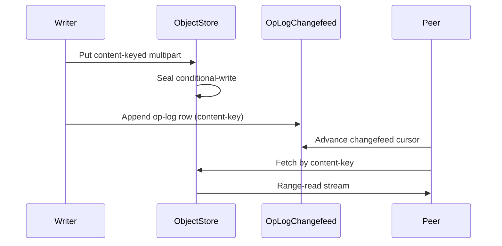

# [PERSISTENCE_REMOTE_STORES]

Rasm.Persistence anchors cloud object-store residence on one `ObjectStore` provider axis behind the settled `BlobRemote` contract: three string-keyed rows (s3, azure-blob, gcs) each project a `BlobRemote` placement whose Put/Get/Stat/Delete/List run through the provider SDK, `MultipartTransfer` folds the staged sequence into ArtifactSync-sized chunks with resumable per-part upload, `ObjectResidence` round-trips the content-key descriptor with conditional-write ETag/generation concurrency, and `ArtifactSyncFeed` threads the content-address object key plus the managed durable op-log so a blob written once is fetched by any peer. `RemoteStoreFault` lifts every SDK boundary exception into the typed rail and `ObjectTransferFact` deepens the receipt-sink spine. The page spine is AWSSDK.S3, Azure.Storage.Blobs, Google.Cloud.Storage.V1, System.IO.Hashing, Thinktecture.Runtime.Extensions, LanguageExt.Core, and NodaTime.

Wire posture: this page is host-local — every owner runs server-side against the provider SDK and crosses no browser or peer wire, so it carries no `TS_PROJECTION` cluster. The artifact-sync feed's only cross-process face is the content-address object key plus the existing `Sync/collaboration#OPLOG_CHANGEFEED` op-log row, whose wire shape is owned at `Sync/collaboration#TS_PROJECTION`; `ObjectTransferFact` reaches any dashboard solely as a `ReceiptSinkPort` envelope whose `ReceiptEnvelopeWire`/`TenantContextWire` projection is owned at `AppHost/runtime-ports#TS_PROJECTION`, never re-spelled here.

## [01]-[INDEX]

- [01]-[OBJECT_STORE]: three provider rows projecting `BlobRemote` placements; fault rail.
- [02]-[MULTIPART_TRANSFER]: chunked resumable upload fold over the `ArtifactSync` frame width.
- [03]-[OBJECT_RESIDENCE]: content-key descriptor round-trip; conditional-write concurrency.
- [04]-[ARTIFACT_SYNC_FEED]: content-address object key plus durable op-log; transfer fact stream.

## [02]-[OBJECT_STORE]

- Owner: `ObjectStore` — one `[SmartEnum<string>]` provider axis under the `StoreKeyPolicy` ordinal accessor; each row is the widened record carrying the part-size column, the chunk-size column, the conditional-write column, and the three transport delegate columns that build the row's `BlobRemote` placement from the resolved provider client; `RemoteStoreFault` is the typed boundary fault family.
- Cases: s3, azure-blob, gcs; the provider sweep stays closed — a fourth provider is one row, and PostgreSQL/SQLite/DuckDB never appear because object-store is the durable home behind `BlobRemote`, never a relational engine row.
- Entry: `public BlobRemote Placement(ObjectClient client)` — projects the provider's `BlobRemote` record from the resolved SDK client; every operation rides `BlobRemote.Put/Get/Stat/Delete/List` so consumers compose the one settled contract, never a per-provider surface.
- Auto: the s3 row builds Put over `AmazonS3Client` multipart, the azure-blob row over `BlockBlobClient` staged blocks, the gcs row over `StorageClient` resumable chunks; each row's `Get` issues a single range-read or a resumed range sequence, `Stat` reads object metadata into the descriptor, `Delete` removes by content-key object name, `List` enumerates the content-key namespace; the conditional-write column flips on for write-once content-address semantics so a re-put of an existing content-key is a no-op confirmed by the conflict case.
- Receipt: `ObjectTransferFact` rides the `ReceiptSinkPort` envelope under the `store.object.*` kind family — one fact per part with bytes and elapsed, one fact per abort, one fact per content-key fetch-by-key hit.
- Packages: AWSSDK.S3, Azure.Storage.Blobs, Google.Cloud.Storage.V1, System.IO.Hashing, Thinktecture.Runtime.Extensions, LanguageExt.Core, NodaTime
- Growth: one `ObjectStore` row — key, part-size, chunk-size, conditional-write, three transport delegates — absorbs a new provider with zero new surface; a new storage-class or access-tier is one column on the row; a server-side-encryption stance is one policy value on the row; zero new surface.
- Boundary: `ObjectStore` rows are the `BlobRemote` implementation set the `Store/profiles#PROFILE_AXIS` `blob-remote` row resolves to — the prior single deferred app-root registration row is the deleted form; `ObjectClient` is the resolved-SDK union the app root hands over (credential acquisition, endpoint override, and region are host-resolved connection inputs, never Persistence fence members); a per-provider upload service class is the rejected form because one `MultipartTransfer` algebra dispatches on the row; the content-key object name derives from the `BlobRemote.Descriptor.ContentKey` XxHash128 identity owned at `#ARTIFACT_FRAMES`, so the object store never mints a second identity; every SDK exception lifts once into `RemoteStoreFault` at this edge — a per-call catch is the deleted form.

```csharp signature
[SmartEnum<string>]
[ValidationError<RemoteStoreFault>]
[KeyMemberEqualityComparer<StoreKeyPolicy, string>]
[KeyMemberComparer<StoreKeyPolicy, string>]
public sealed partial class ObjectStore {
    public static readonly ObjectStore S3 = new("s3", partSize: 8L * 1024 * 1024, chunkSize: 8L * 262_144, conditionalWrite: true, put: ObjectRows.S3Put, fetch: ObjectRows.S3Fetch, head: ObjectRows.S3Head);
    public static readonly ObjectStore AzureBlob = new("azure-blob", partSize: 8L * 1024 * 1024, chunkSize: 8L * 262_144, conditionalWrite: true, put: ObjectRows.AzurePut, fetch: ObjectRows.AzureFetch, head: ObjectRows.AzureHead);
    public static readonly ObjectStore Gcs = new("gcs", partSize: 8L * 1024 * 1024, chunkSize: 8L * 262_144, conditionalWrite: true, put: ObjectRows.GcsPut, fetch: ObjectRows.GcsFetch, head: ObjectRows.GcsHead);

    public long PartSize { get; }
    public long ChunkSize { get; }
    public bool ConditionalWrite { get; }

    [UseDelegateFromConstructor]
    public partial IO<ObjectResidence> Put(ObjectClient client, ObjectResidence descriptor, ReadOnlySequence<byte> staged);

    [UseDelegateFromConstructor]
    public partial IO<Stream> Fetch(ObjectClient client, UInt128 contentKey, Option<(long Start, long End)> range);

    [UseDelegateFromConstructor]
    public partial IO<Option<ObjectResidence>> Head(ObjectClient client, UInt128 contentKey);

    public BlobRemote Placement(ObjectClient client) =>
        new(
            Put: (descriptor, stream) =>
                from staged in IO.lift(() => ReadStaged(stream))
                from residence in Put(client, ObjectResidence.From(descriptor, PartSize, ChunkSize), staged)
                select residence.Descriptor,
            Get: contentKey => Fetch(client, contentKey, None),
            Stat: contentKey => Head(client, contentKey).Map(static option => option.Map(static residence => residence.Descriptor)),
            Delete: contentKey => ObjectRows.Delete(client, contentKey),
            List: () => ObjectRows.List(client));

    static ReadOnlySequence<byte> ReadStaged(Stream stream) {
        var buffer = new System.Buffers.ArrayBufferWriter<byte>();
        stream.CopyTo(buffer.AsStream());
        return new ReadOnlySequence<byte>(buffer.WrittenMemory);
    }
}

[Union]
public abstract partial record ObjectClient {
    public sealed record S3(IAmazonS3 Client, string Bucket) : ObjectClient;
    public sealed record Azure(BlobContainerClient Container) : ObjectClient;
    public sealed record Gcs(StorageClient Client, string Bucket) : ObjectClient;
}

[Union]
public abstract partial record RemoteStoreFault : Expected, IValidationError<RemoteStoreFault> {
    private RemoteStoreFault(string detail, int code) : base(detail, code, None) { }

    public static RemoteStoreFault Create(string message) => new Text(message);

    public sealed record Text : RemoteStoreFault { public Text(string detail) : base(detail, 5400) { } }
    public sealed record NotFound : RemoteStoreFault {
        public NotFound(UInt128 contentKey) : base($"object {contentKey:x32} absent", 5401) => ContentKey = contentKey;
        public UInt128 ContentKey { get; }
    }
    public sealed record Conflict : RemoteStoreFault {
        public Conflict(UInt128 contentKey, string condition) : base($"object {contentKey:x32} conditional-write {condition}", 5402) => (ContentKey, Condition) = (contentKey, condition);
        public UInt128 ContentKey { get; }
        public string Condition { get; }
    }
    public sealed record Aborted : RemoteStoreFault {
        public Aborted(UInt128 contentKey, int parts, string detail) : base($"object {contentKey:x32} aborted after {parts} parts: {detail}", 5403) => (ContentKey, Parts, Reason) = (contentKey, parts, detail);
        public UInt128 ContentKey { get; }
        public int Parts { get; }
        public string Reason { get; }
    }
    public sealed record Transport : RemoteStoreFault {
        public Transport(string provider, int status, string code) : base($"{provider} transport {status}:{code}", 5404) => (Provider, Status, Code) = (provider, status, code);
        public string Provider { get; }
        public int Status { get; }
        public string Code { get; }
    }

    public static RemoteStoreFault Lift(string provider, UInt128 contentKey, Exception boundary) =>
        boundary switch {
            AmazonS3Exception s3 when (int)s3.StatusCode == 404 => new NotFound(contentKey),
            AmazonS3Exception s3 when (int)s3.StatusCode == 412 => new Conflict(contentKey, s3.ErrorCode),
            AmazonS3Exception s3 => new Transport(provider, (int)s3.StatusCode, s3.ErrorCode),
            RequestFailedException az when az.Status == 404 => new NotFound(contentKey),
            RequestFailedException az when az.Status == 412 => new Conflict(contentKey, az.ErrorCode ?? "ConditionNotMet"),
            RequestFailedException az => new Transport(provider, az.Status, az.ErrorCode ?? ""),
            GoogleApiException gcs when (int)gcs.HttpStatusCode == 404 => new NotFound(contentKey),
            GoogleApiException gcs when (int)gcs.HttpStatusCode == 412 => new Conflict(contentKey, gcs.Error?.Message ?? "GenerationMismatch"),
            GoogleApiException gcs => new Transport(provider, (int)gcs.HttpStatusCode, gcs.Error?.Message ?? ""),
            _ => new Text(boundary.Message),
        };
}
```

## [03]-[MULTIPART_TRANSFER]

- Owner: `MultipartTransfer` — the chunked resumable upload fold over the ArtifactSync frame width; one algebra dispatching on the `ObjectStore` row, one `TransferReceipt` per completed object.
- Cases: s3 low-level `InitiateMultipartUpload`/`UploadPart`/`CompleteMultipartUpload` with the `TransferUtility` managed path as the small-object fast lane; azure staged-block `StageBlock`/`CommitBlockList` with `BlobClient.Upload` carrying `StorageTransferOptions` for the parallel path; gcs `UploadObject` with `UploadObjectOptions.ChunkSize` resumable.
- Entry: `public static IO<TransferReceipt> Upload(ObjectStore provider, ObjectClient client, ObjectResidence residence, ReadOnlySequence<byte> staged, ClockPolicy clocks)` — `IO` runs `provider.Put`, whose provider delegate carries the bracketed part-by-part multipart ceremony, then reads the realized `ObjectResidence.Parts`/`ResumedParts` transfer counts into the receipt; an abort path runs `AbortMultipartUpload` so an interrupted upload leaves no orphaned parts.
- Auto: the staged sequence partitions into part windows of the row's `PartSize` (s3, a minimum 5 MB part) or chunk windows of the row's `ChunkSize` (gcs/azure, a 262144-multiple); each window spans a whole number of 64-KiB ArtifactSync frames so the `FrameEdge` Crc32-per-frame and the whole-artifact XxHash128 identity thread the transfer; the s3 row runs `InitiateMultipartUploadAsync` then `UploadPartAsync` per window collecting the returned `PartETag` set and seals with `CompleteMultipartUploadAsync`, the azure row stages one base64 block id per window through `StageBlockAsync` and seals with `CommitBlockListAsync`, the gcs row uploads through `UploadObjectAsync` with `UploadObjectOptions.ChunkSize` resumable; a resumed transfer skips windows whose part `ETag`/block-id is already present in the prior `committed` set so a write-once content-key never re-uploads a sealed part and the resumed-part count rides the receipt; the `TransferUtility`/`BlobClient.Upload`/`UploadObject` managed paths own the small-object single-request lane below the part-size floor.
- Receipt: `TransferReceipt` — provider, content-key, total bytes, part count, resumed-part count, abort flag, elapsed `Duration`, `Instant`, `CorrelationId`; each part emits one `ObjectTransferFact` under `store.object.transfer.part`, an abort emits `store.object.transfer.abort`.
- Packages: AWSSDK.S3, Azure.Storage.Blobs, Google.Cloud.Storage.V1, System.IO.Hashing, LanguageExt.Core, NodaTime
- Growth: one part-window policy value or one managed-path threshold per provider row; the content-defined dedup window is the `Version/snapshots#CONTENT_CHUNKING` chunk fold the part window spans whole chunks of, never a second chunker here; zero new surface.
- Boundary: the 64-KiB frame, the Crc32-per-frame, and the XxHash128 whole-artifact identity are owned at `#ARTIFACT_FRAMES` and consumed here as settled constants — a re-declared frame width or a second hash is the deleted form; the chunk-size column is an integer multiple of the GCS 262144-byte unit and spans whole 64-KiB frames, and the part-size column clears the S3 5 MB part floor, so each is a row value never a free literal; a per-provider abort catch is the deleted form because the bracket `Fin` arm folds every interruption through `AbortMultipartUpload` (s3) or leaves uncommitted blocks/resumable sessions to provider GC (azure/gcs) and lifts the cause into `RemoteStoreFault.Aborted`; the conditional-write column gates the seal — s3 `IfNoneMatch:*`, azure `IfNoneMatch:*` on commit, gcs `IfGenerationMatch:0` — so a concurrent writer racing the same content-key resolves to `RemoteStoreFault.Conflict`, not a silent overwrite.

```csharp signature
public sealed record TransferReceipt(
    string Provider,
    UInt128 ContentKey,
    long Bytes,
    int Parts,
    int ResumedParts,
    bool Aborted,
    Duration Elapsed,
    Instant At,
    CorrelationId Correlation);

public static class MultipartTransfer {
    public static IO<TransferReceipt> Upload(ObjectStore provider, ObjectClient client, ObjectResidence residence, ReadOnlySequence<byte> staged, ClockPolicy clocks) =>
        from mark in IO.lift(clocks.Mark)
        from sealed_ in provider.Put(client, residence, staged).MapFail(boundary => Error.New(RemoteStoreFault.Lift(provider.Key, residence.Descriptor.ContentKey, boundary).Message))
        select new TransferReceipt(provider.Key, sealed_.Descriptor.ContentKey, sealed_.Descriptor.Length, sealed_.Parts, sealed_.ResumedParts, Aborted: false, clocks.Elapsed(mark), clocks.Now, sealed_.Correlation);

    public static Seq<(int Number, long Offset, int Length)> Windows(long length, long window) =>
        toSeq(Range(0L, (length + window - 1) / window))
            .Map(index => (Number: (int)index + 1, Offset: index * window, Length: (int)Math.Min(window, length - index * window)));
}
```

```csharp signature
public static class ObjectRows {
    public static IO<ObjectResidence> S3Put(ObjectClient client, ObjectResidence residence, ReadOnlySequence<byte> staged) =>
        client is ObjectClient.S3 row
            ? IO.liftAsync(async () => await S3Multipart(row, residence, staged))
            : IO.fail<ObjectResidence>(Error.New("<object-client-mismatch:s3>"));

    public static IO<ObjectResidence> AzurePut(ObjectClient client, ObjectResidence residence, ReadOnlySequence<byte> staged) =>
        client is ObjectClient.Azure row
            ? IO.liftAsync(async () => await AzureBlocks(row, residence, staged))
            : IO.fail<ObjectResidence>(Error.New("<object-client-mismatch:azure>"));

    public static IO<ObjectResidence> GcsPut(ObjectClient client, ObjectResidence residence, ReadOnlySequence<byte> staged) =>
        client is ObjectClient.Gcs row
            ? IO.liftAsync(async () => await GcsResumable(row, residence, staged))
            : IO.fail<ObjectResidence>(Error.New("<object-client-mismatch:gcs>"));

    static async Task<ObjectResidence> S3Multipart(ObjectClient.S3 row, ObjectResidence residence, ReadOnlySequence<byte> staged) {
        var name = ObjectResidence.Name(residence.Descriptor.ContentKey);
        var windows = MultipartTransfer.Windows(staged.Length, residence.PartSize);
        var prior = await S3CommittedParts(row, name, residence.UploadId);
        var init = residence.UploadId.IsSome
            ? residence.UploadId
            : Some((await row.Client.InitiateMultipartUploadAsync(new InitiateMultipartUploadRequest { BucketName = row.Bucket, Key = name })).UploadId);
        var uploadId = (string)init;
        var tags = new List<PartETag>(prior.Values);
        var resumed = 0;
        foreach (var window in windows)
            if (prior.TryGetValue(window.Number, out var committed)) {
                resumed++;
            } else {
                using var part = staged.Slice(window.Offset, window.Length).AsStream();
                var done = await row.Client.UploadPartAsync(new UploadPartRequest { BucketName = row.Bucket, Key = name, UploadId = uploadId, PartNumber = window.Number, InputStream = part, PartSize = window.Length });
                tags.Add(new PartETag(window.Number, done.ETag));
            }
        await row.Client.CompleteMultipartUploadAsync(new CompleteMultipartUploadRequest { BucketName = row.Bucket, Key = name, UploadId = uploadId, PartETags = [.. tags.OrderBy(static tag => tag.PartNumber)] });
        return residence with { Parts = windows.Count, ResumedParts = resumed, ConditionToken = Some(uploadId) };
    }

    static async Task<ObjectResidence> AzureBlocks(ObjectClient.Azure row, ObjectResidence residence, ReadOnlySequence<byte> staged) {
        var blob = row.Container.GetBlockBlobClient(ObjectResidence.Name(residence.Descriptor.ContentKey));
        var windows = MultipartTransfer.Windows(staged.Length, residence.ChunkSize);
        var prior = await AzureStagedBlocks(blob);
        var blockIds = new List<string>(windows.Count);
        var resumed = 0;
        foreach (var window in windows) {
            var blockId = Convert.ToBase64String(BitConverter.GetBytes(window.Number));
            blockIds.Add(blockId);
            if (prior.Contains(blockId)) {
                resumed++;
            } else {
                using var chunk = staged.Slice(window.Offset, window.Length).AsStream();
                await blob.StageBlockAsync(blockId, chunk);
            }
        }
        await blob.CommitBlockListAsync(blockIds, new CommitBlockListOptions { Metadata = ObjectResidence.Metadata(residence.Descriptor), Conditions = new BlobRequestConditions { IfNoneMatch = ETag.All } });
        return residence with { Parts = windows.Count, ResumedParts = resumed };
    }

    static async Task<ObjectResidence> GcsResumable(ObjectClient.Gcs row, ObjectResidence residence, ReadOnlySequence<byte> staged) {
        var windows = MultipartTransfer.Windows(staged.Length, residence.ChunkSize);
        using var source = staged.AsStream();
        var stored = await row.Client.UploadObjectAsync(GcsDestination(row.Bucket, residence), source, new UploadObjectOptions { ChunkSize = (int)residence.ChunkSize, IfGenerationMatch = 0L });
        return ObjectResidence.OfObject(stored) with { Parts = windows.Count, ResumedParts = 0 };
    }

    static async Task<FrozenDictionary<int, PartETag>> S3CommittedParts(ObjectClient.S3 row, string name, Option<string> uploadId) =>
        uploadId is { IsSome: true, Case: string id }
            ? (await row.Client.ListPartsAsync(new ListPartsRequest { BucketName = row.Bucket, Key = name, UploadId = id })).Parts
                .ToFrozenDictionary(static part => part.PartNumber, static part => new PartETag(part.PartNumber, part.ETag))
            : FrozenDictionary<int, PartETag>.Empty;

    static async Task<FrozenSet<string>> AzureStagedBlocks(BlockBlobClient blob) {
        try {
            var list = await blob.GetBlockListAsync(BlockListTypes.Uncommitted);
            return list.Value.UncommittedBlocks.Select(static block => block.Name).ToFrozenSet(StringComparer.Ordinal);
        } catch (RequestFailedException fault) when (fault.Status == 404) {
            return FrozenSet<string>.Empty;
        }
    }

    static Google.Apis.Storage.v1.Data.Object GcsDestination(string bucket, ObjectResidence residence) =>
        new() { Bucket = bucket, Name = ObjectResidence.Name(residence.Descriptor.ContentKey), ContentType = "application/octet-stream", Metadata = ObjectResidence.Metadata(residence.Descriptor) };

    public static IO<Stream> S3Fetch(ObjectClient client, UInt128 contentKey, Option<(long Start, long End)> range) =>
        client is ObjectClient.S3 row
            ? IO.liftAsync(async () => (await row.Client.GetObjectAsync(new GetObjectRequest { BucketName = row.Bucket, Key = ObjectResidence.Name(contentKey), ByteRange = range.Map(static r => new ByteRange(r.Start, r.End)).IfNoneUnsafe(() => null!) })).ResponseStream)
            : IO.fail<Stream>(Error.New("<object-client-mismatch:s3>"));

    public static IO<Option<ObjectResidence>> S3Head(ObjectClient client, UInt128 contentKey) =>
        client is ObjectClient.S3 row
            ? IO.liftAsync(async () => ObjectResidence.OfHead(await row.Client.GetObjectMetadataAsync(row.Bucket, ObjectResidence.Name(contentKey))))
            : IO.fail<Option<ObjectResidence>>(Error.New("<object-client-mismatch:s3>"));

    public static IO<Stream> AzureFetch(ObjectClient client, UInt128 contentKey, Option<(long Start, long End)> range) =>
        client is ObjectClient.Azure row
            ? IO.liftAsync(async () => (await row.Container.GetBlobClient(ObjectResidence.Name(contentKey)).DownloadStreamingAsync(new BlobDownloadOptions { Range = range.Map(static r => new HttpRange(r.Start, r.End - r.Start + 1)).IfNone(default(HttpRange)) })).Value.Content)
            : IO.fail<Stream>(Error.New("<object-client-mismatch:azure>"));

    public static IO<Option<ObjectResidence>> AzureHead(ObjectClient client, UInt128 contentKey) =>
        client is ObjectClient.Azure row
            ? IO.liftAsync(async () => ObjectResidence.OfProperties(await row.Container.GetBlobClient(ObjectResidence.Name(contentKey)).GetPropertiesAsync()))
            : IO.fail<Option<ObjectResidence>>(Error.New("<object-client-mismatch:azure>"));

    public static IO<Stream> GcsFetch(ObjectClient client, UInt128 contentKey, Option<(long Start, long End)> range) =>
        client is ObjectClient.Gcs row
            ? IO.liftAsync(async () => { var sink = new MemoryStream(); await row.Client.DownloadObjectAsync(row.Bucket, ObjectResidence.Name(contentKey), sink, range.Map(static r => new DownloadObjectOptions { Range = new System.Net.Http.Headers.RangeHeaderValue(r.Start, r.End) }).IfNoneUnsafe(() => null!)); sink.Position = 0; return (Stream)sink; })
            : IO.fail<Stream>(Error.New("<object-client-mismatch:gcs>"));

    public static IO<Option<ObjectResidence>> GcsHead(ObjectClient client, UInt128 contentKey) =>
        client is ObjectClient.Gcs row
            ? IO.liftAsync(async () => ObjectResidence.OfObject(await row.Client.GetObjectAsync(row.Bucket, ObjectResidence.Name(contentKey))))
            : IO.fail<Option<ObjectResidence>>(Error.New("<object-client-mismatch:gcs>"));

    public static IO<Unit> Delete(ObjectClient client, UInt128 contentKey) =>
        client switch {
            ObjectClient.S3 row => IO.liftAsync(async () => { await row.Client.DeleteObjectAsync(row.Bucket, ObjectResidence.Name(contentKey)); return unit; }),
            ObjectClient.Azure row => IO.liftAsync(async () => { await row.Container.GetBlobClient(ObjectResidence.Name(contentKey)).DeleteIfExistsAsync(); return unit; }),
            ObjectClient.Gcs row => IO.liftAsync(async () => { await row.Client.DeleteObjectAsync(row.Bucket, ObjectResidence.Name(contentKey)); return unit; }),
            _ => IO.fail<Unit>(Error.New("<object-client-unknown>")),
        };

    public static IO<Seq<BlobRemote.Descriptor>> List(ObjectClient client) =>
        client switch {
            ObjectClient.S3 row => IO.liftAsync(async () => ObjectResidence.Descriptors(await row.Client.ListObjectsV2Async(new ListObjectsV2Request { BucketName = row.Bucket }))),
            ObjectClient.Azure row => IO.liftAsync(() => ObjectResidence.Descriptors(row.Container)),
            ObjectClient.Gcs row => IO.liftAsync(() => ObjectResidence.Descriptors(row.Client, row.Bucket)),
            _ => IO.fail<Seq<BlobRemote.Descriptor>>(Error.New("<object-client-unknown>")),
        };
}
```

## [04]-[OBJECT_RESIDENCE]

- Owner: `ObjectResidence` — the content-key descriptor round-trip record over the object store; projects from and back to the settled `BlobRemote.Descriptor`, carrying the part/chunk-size transfer columns, the multipart `UploadId` resume handle, the realized `Parts`/`ResumedParts` transfer counts, the classification/retention columns enforced at write, and the conditional-write concurrency token.
- Cases: a put writes the content-key object name plus the classification/retention/codec/compression columns as object metadata and fills `Parts`/`ResumedParts` from the realized multipart loop; a head reads the metadata back through `OfMetadata`; a get range-reads by content-key with resumption.
- Entry: `public static ObjectResidence From(BlobRemote.Descriptor descriptor, long partSize, long chunkSize)` — pure projection seeding the transfer columns from the `ObjectStore` row; `public static string Name(UInt128 contentKey)` derives the content-address object name so the object store never holds a second key; `public static BlobRemote.Descriptor OfMetadata(IReadOnlyDictionary<string,string> metadata, UInt128 contentKey, long length, ulong etag)` is the one head-projection fold every provider response routes through.
- Auto: the content-key object name is the hex of the `Descriptor.ContentKey` XxHash128 identity so a blob written once is addressed by content, never by a path; the classification column folds through the `Version/retention#CLASSIFICATION_ENFORCEMENT` write guard before the object materializes; the conditional-write token is the provider's ETag (s3/azure) or generation (gcs) so an optimistic-concurrency seal rejects a racing overwrite.
- Receipt: a head miss is `RemoteStoreFault.NotFound`; a write-conflict seal is `RemoteStoreFault.Conflict`.
- Packages: AWSSDK.S3, Azure.Storage.Blobs, Google.Cloud.Storage.V1, System.IO.Hashing, LanguageExt.Core, NodaTime
- Growth: one metadata column per descriptor field; zero new surface.
- Boundary: `ObjectResidence` is the `BlobRemote.Descriptor` projection owned at `Store/profiles#PROFILE_AXIS` — the descriptor fields (ContentKey, Length, Classification, RetentionClass, CodecId, CompressionId, Physical, Logical) round-trip as object metadata through `Metadata`/`OfMetadata`, never a second descriptor record; the `PartSize`/`ChunkSize`/`UploadId` columns are transfer-ceremony state seeded from the `ObjectStore` row, never descriptor identity; `Parts`/`ResumedParts` are the realized transfer counts the receipt reads so the receipt never reports a window count the upload did not perform; the classification column is the `DataClassification` value the write guard admits, so an unclassified object never materializes; the conditional-write token is opaque provider concurrency state, never a Persistence identity; range-read resumption reads `(Start, End)` byte offsets so a partial fetch resumes from the last received offset without re-reading committed bytes; the per-provider head/list response projections (`GetObjectMetadataResponse`, `BlobProperties`, GCS `Object`, `ListObjectsV2Response`) and their member spellings are the `[OBJECT_ROUNDTRIP]` SPIKE surface decompile-verified at admission, all folding through the one `OfMetadata` projector.

```csharp signature
public sealed record ObjectResidence(
    BlobRemote.Descriptor Descriptor,
    long PartSize,
    long ChunkSize,
    Option<string> UploadId,
    Option<string> ConditionToken,
    int Parts,
    int ResumedParts,
    CorrelationId Correlation) {
    public static ObjectResidence From(BlobRemote.Descriptor descriptor, long partSize, long chunkSize) =>
        new(descriptor, partSize, chunkSize, None, None, Parts: 0, ResumedParts: 0, CorrelationId.Create(Guid.CreateVersion7()));

    public static string Name(UInt128 contentKey) => contentKey.ToString("x32");

    public static FrozenDictionary<string, string> Metadata(BlobRemote.Descriptor descriptor) =>
        new Dictionary<string, string> {
            ["classification"] = descriptor.Classification.Key,
            ["retention"] = descriptor.RetentionClass,
            ["codec"] = descriptor.CodecId,
            ["compression"] = descriptor.CompressionId,
            ["physical"] = descriptor.Physical.ToUnixTimeTicks().ToString(),
            ["logical"] = descriptor.Logical.ToString(),
        }.ToFrozenDictionary();

    public static BlobRemote.Descriptor OfMetadata(IReadOnlyDictionary<string, string> metadata, UInt128 contentKey, long length, ulong etag) =>
        new(
            contentKey,
            length,
            DataClassification.Get(metadata.TryGetValue("classification", out var c) ? c : DataClassification.Operational.Key),
            metadata.TryGetValue("retention", out var r) ? r : "size-bound",
            metadata.TryGetValue("codec", out var k) ? k : "binary",
            metadata.TryGetValue("compression", out var z) ? z : "none",
            Instant.FromUnixTimeTicks(metadata.TryGetValue("physical", out var p) ? long.Parse(p) : 0L),
            metadata.TryGetValue("logical", out var l) ? ulong.Parse(l) : etag);

    public static UInt128 Key(string objectName) => UInt128.Parse(objectName, NumberStyles.HexNumber);

    public static Option<ObjectResidence> OfHead(GetObjectMetadataResponse head) =>
        Some(new ObjectResidence(OfMetadata(head.Metadata.Keys.ToDictionary(key => key, key => head.Metadata[key]), Key(head.Metadata["x-amz-meta-content-key"]), head.ContentLength, 0UL), 0L, 0L, None, Some(head.ETag), 0, 0, CorrelationId.Create(Guid.CreateVersion7())));

    public static Option<ObjectResidence> OfProperties(BlobProperties properties) =>
        Some(new ObjectResidence(OfMetadata(properties.Metadata, Key(properties.Metadata["content-key"]), properties.ContentLength, 0UL), 0L, 0L, None, None, 0, 0, CorrelationId.Create(Guid.CreateVersion7())));

    public static Option<ObjectResidence> OfObject(Google.Apis.Storage.v1.Data.Object stored) =>
        Some(new ObjectResidence(OfMetadata(stored.Metadata ?? new Dictionary<string, string>(), Key(stored.Name), (long)(stored.Size ?? 0UL), stored.Generation ?? 0UL), 0L, 0L, None, Some(stored.Generation?.ToString() ?? ""), 0, 0, CorrelationId.Create(Guid.CreateVersion7())));

    public static Seq<BlobRemote.Descriptor> Descriptors(ListObjectsV2Response listing) =>
        toSeq(listing.S3Objects).Map(static entry => new BlobRemote.Descriptor(Key(entry.Key), entry.Size ?? 0L, DataClassification.Operational, "size-bound", "binary", "none", Instant.FromDateTimeOffset(entry.LastModified ?? default), 0UL));

    public static Seq<BlobRemote.Descriptor> Descriptors(BlobContainerClient container) =>
        toSeq(container.GetBlobs()).Map(static blob => new BlobRemote.Descriptor(Key(blob.Name), blob.Properties.ContentLength ?? 0L, DataClassification.Operational, "size-bound", "binary", "none", Instant.FromDateTimeOffset(blob.Properties.LastModified ?? default), 0UL));

    public static Seq<BlobRemote.Descriptor> Descriptors(StorageClient client, string bucket) =>
        toSeq(client.ListObjects(bucket)).Map(static stored => new BlobRemote.Descriptor(Key(stored.Name), (long)(stored.Size ?? 0UL), DataClassification.Operational, "size-bound", "binary", "none", Instant.FromDateTimeOffset(stored.TimeCreatedDateTimeOffset ?? default), 0UL));
}
```

## [05]-[ARTIFACT_SYNC_FEED]

- Owner: `ArtifactSyncFeed` — the cloud-hub seam threading the content-address object key plus a managed durable op-log row so a blob written once is fetched by any peer; `ObjectTransferFact` is the transfer-telemetry record.
- Cases: a put appends one `OpLogEntry`-shaped row keyed by content-key so a peer's changefeed cursor advances past the write; a fetch-by-content-key reads the object the row points to; the integrity fact stream carries the Crc32-per-frame and XxHash128 whole-artifact identity.
- Entry: `public static IO<Unit> Announce(ObjectResidence residence, Func<UInt128, IO<Unit>> appendOpLog)` — `IO` appends the durable op-log row after the seal so the announce is write-once and the peer fetch is content-keyed.
- Auto: the content-key object key is the whole-artifact XxHash128 identity so a write-once blob is fetched by content from any peer; the durable op-log row is the existing `Sync/collaboration#OPLOG_CHANGEFEED` transport (store-assigned `Sequence`, HLC-stamped) so the feed rides one changefeed, never a second sync engine; `Announce` brackets the `appendOpLog` under one producer `Activity` so the appended op-log row's `OpLog.Stamp` captures the originating span into the `OpLogEntry.TraceContext` slot, realizing the `ONE_DISTRIBUTED_TRACE` seam on the announce face — a blob announced under an active solve span carries that parent so the cross-runtime fetch joins the originating trace; the transfer fact stream rides the `ReceiptSinkPort` under `store.object.*`.
- Receipt: `ObjectTransferFact` — kind (`store.object.transfer.part`/`store.object.transfer.abort`/`store.object.fetch.hit`), provider, content-key, bytes, part index, elapsed `Duration`, `Instant`, `CorrelationId`.
- Packages: System.IO.Hashing, Thinktecture.Runtime.Extensions, LanguageExt.Core, NodaTime, Rasm.AppHost (project)
- Growth: one fact kind per new transfer event; zero new surface.
- Boundary: the cloud-sync-hub topology is the cloud face of the `Cloud object-store sync hub` concert concept — it rides the settled `BlobRemote` and the settled `Sync/collaboration#OPLOG_CHANGEFEED` op-log, never a second sync engine or a parallel transfer manifest; the HLC stamp stays the causal primitive owned at `Sync/collaboration#OPLOG_CHANGEFEED`; a second durable-queue substrate is the rejected form; the frame integrity facts (`Crc32`-per-frame, `XxHash128` whole-artifact) are owned at `#ARTIFACT_FRAMES` and surfaced here as fact rows, never re-declared; the trace seam is `Announce`-only — the fetch leg is consumer-owned, so the announce span the producer starts is the sole trace-context emission point and Persistence reads `Activity.Current` through `System.Diagnostics.DiagnosticSource`, never minting the propagator (AppHost owns the `CORRELATION_SPINE`).

```csharp signature
public sealed record ObjectTransferFact(
    string Kind,
    string Provider,
    UInt128 ContentKey,
    long Bytes,
    int PartIndex,
    Duration Elapsed,
    Instant At,
    CorrelationId Correlation) {
    public const string Part = "store.object.transfer.part";
    public const string Abort = "store.object.transfer.abort";
    public const string FetchHit = "store.object.fetch.hit";
}

public static class ArtifactSyncFeed {
    private static readonly ActivitySource Source = new("Rasm.Persistence.ObjectStore");

    public static IO<Unit> Announce(ObjectResidence residence, Func<UInt128, IO<Unit>> appendOpLog) =>
        IO.lift(() => Source.StartActivity("artifact-sync.announce", ActivityKind.Producer))
            .Bracket(
                use: _ => appendOpLog(residence.Descriptor.ContentKey),
                release: static span => IO.lift(() => { span?.Dispose(); return unit; }));

    public static IO<Stream> Fetch(ObjectStore provider, ObjectClient client, UInt128 contentKey, Func<ObjectTransferFact, IO<Unit>> sink, ClockPolicy clocks) =>
        from mark in IO.lift(clocks.Mark)
        from stream in provider.Fetch(client, contentKey, None)
        from fact in sink(new ObjectTransferFact(ObjectTransferFact.FetchHit, provider.Key, contentKey, 0L, 0, clocks.Elapsed(mark), clocks.Now, CorrelationId.Create(Guid.CreateVersion7())))
        select stream;
}
```



## [06]-[RESEARCH]

- [OBJECT_ROUNDTRIP]: the live S3/Azure-Blob/GCS multipart-resume round-trip against the provider emulators (MinIO, Azurite, fake-gcs-server) — the resumed-part skip-on-committed-ETag behavior driven by `ListPartsAsync`/`GetBlockListAsync(BlockListTypes.Uncommitted)`, the conditional-write `412` conflict surface per provider (`IfNoneMatch:*`/`ETag.All`/`IfGenerationMatch:0`), and the range-read resumption offset contract, proven before the resumed-part and conflict fences finalize.
- [OBJECT_MEMBER_SPELLINGS]: the get/head/list/delete member surface decompile-verified at admission — the Gate-0 brief grounded only the S3 multipart-upload + `TransferUtility` surface and the Azure `BlockBlobClient`/`BlobClient` surface, so `AmazonS3Client.GetObjectAsync(GetObjectRequest)`/`GetObjectMetadataAsync`/`ListPartsAsync(ListPartsRequest)`/`ListObjectsV2Async`/`DeleteObjectAsync` and `GetObjectResponse.ResponseStream`/`GetObjectMetadataResponse`, the Azure `BlobContainerClient.GetBlobClient`/`GetBlockBlobClient`/`BlobBaseClient.DownloadStreamingAsync(BlobDownloadOptions)`/`GetPropertiesAsync`/`DeleteIfExistsAsync`/`BlockBlobClient.GetBlockListAsync`, and the GCS `StorageClient.GetObjectAsync`/`DeleteObjectAsync`/`DownloadObjectAsync(DownloadObjectOptions)`/`UploadObjectAsync(Object, Stream, UploadObjectOptions)` member spellings and the `Object`/`GetObjectResponse`/`BlobProperties` response shapes the `OfMetadata` projector reads are verified against the admitted assemblies before the head/list/fetch fences finalize.
- [REMOTE_FAULT_LIFT]: the boundary-exception taxonomy `AmazonS3Exception` (`StatusCode`/`ErrorCode`), `RequestFailedException` (`Status`/`ErrorCode`), and `GoogleApiException` (`HttpStatusCode`/`Error.Message`) the `RemoteStoreFault.Lift` switch reads is decompile-verified at admission — the Gate-0 brief did not catalogue these three types, so the `404`→`NotFound`/`412`→`Conflict`/else→`Transport` member access confirms before the fault fence finalizes.
