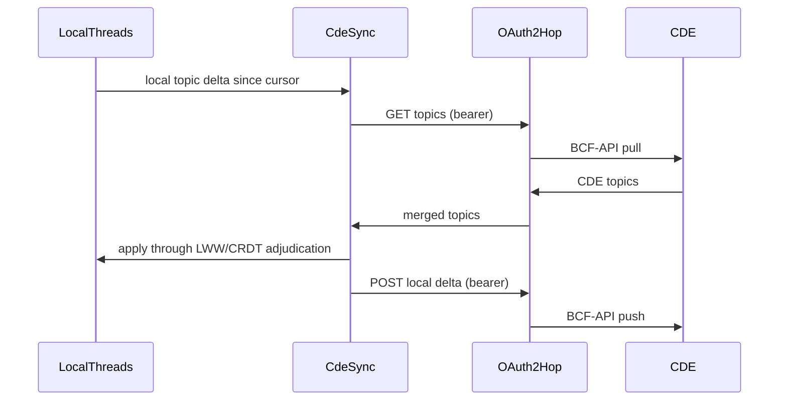

# [PERSISTENCE_ANNOTATION]

Rasm.Persistence owns the durable annotation backbone unifying comments, conflicts, presence, references, and blame through one anchor algebra: `Anchor` `[Union]` binds an annotation to a node id, a sub-entity, a parameter path, or a world-point-plus-view, with re-anchoring when the target moves; `Thread` carries threaded comments, @-mentions, status lifecycle, and assignment over the op-log; and the BCF backbone — `BcfTopic`, `BcfComment`, `BcfViewpoint` — reads and writes BCF 2.1/3.0 archives plus the BCF-API REST surface with a bidirectional CDE OAuth2 sync. The op-log changefeed, the content-address identity, the federated entity keys (`Query/federation#ENTITY_GRAPH`), the structural-diff node identity (`Version/diff#STRUCTURAL_DIFF`), the AppHost OAuth2 outbound hop, and `ClockPolicy`/`ReceiptSinkPort`/`CorrelationId` arrive settled and compose inside the fences. The AppUi pins/markup surface and the TS-web issue board consume the wire projection.

## [01]-[INDEX]

- [01]-[ANCHOR_ALGEBRA]: anchor union, threading, mentions, status, and re-anchoring fold.
- [02]-[BCF_PROTOCOL]: BCF 2.1/3.0 read/write, REST surface, and topic/comment/viewpoint lifecycle.
- [03]-[CDE_SYNC]: bidirectional CDE OAuth2 sync over the BCF-API REST surface.
- [04]-[TS_PROJECTION]: anchor, thread, comment, viewpoint, and topic wire shapes.

## [02]-[ANCHOR_ALGEBRA]

- Owner: `Anchor` `[Union]` the annotation-target binding family; `Thread` the threaded annotation record carrying comments, mentions, status, and assignment; `Mention` the @-reference; `AnnotationStatus` the lifecycle; `Anchors` the static surface owning the anchor projection, re-anchoring against a structural diff, and the thread fold.
- Cases: `NodeId | SubEntity | ParamPath | WorldPointView` on `Anchor`; `Open | InProgress | Resolved | Closed | Reopened` on `AnnotationStatus`.
- Entry: `public static Anchor Of(FederatedEntity entity, Option<string> subEntity, Option<string> paramPath)` — projects the most specific anchor an annotation target admits; `public static Anchor Reanchor(Anchor prior, Seq<EditOp> structuralDiff)` re-binds an anchor across a structural change, so a comment on a moved or transformed node follows it.
- Auto: the anchor algebra is reused across five surfaces — a comment, a conflict, a presence cursor, a cross-document reference, and a blame attribution all anchor through the one `Anchor` union, so a markup pin, a conflict highlight, and a live cursor share one binding vocabulary; re-anchoring reads the structural-diff edit script (`Version/diff#STRUCTURAL_DIFF`) so a `NodeId` anchor on an updated node stays bound, a `Move`d node's anchor follows the move, and a `Delete`d node's anchor surfaces an orphaned-anchor status the thread resolves; a thread is one `OpLogEntry` per comment on the `annotation` column family so threads ride the changefeed and converge per the CRDT algebra; @-mentions resolve to actor agents (`Version/provenance#CAUSAL_DAG` agent vertices) so a mention notifies and a blame attribution shares the agent identity.
- Receipt: a thread mutation rides `store.annotation.thread`; a re-anchor rides `store.annotation.reanchor` carrying the prior and new anchor; a status transition rides `store.annotation.status`.
- Packages: System.IO.Hashing, NodaTime, LanguageExt.Core, Thinktecture.Runtime.Extensions, BCL inbox.
- Growth: a new anchor target is one `Anchor` case; a new status is one `AnnotationStatus` row; a new mention kind is one `Mention.Kind` value; zero new surface — a per-surface annotation type (a separate comment model, a separate conflict marker, a separate presence pin) is the deleted form because all five surfaces anchor through the one algebra, and a thread is one op-log row family.
- Boundary: the anchor algebra is the one binding vocabulary across comments, conflicts, presence, references, and blame — a per-surface anchor type is the deleted form; the four anchor cases form a specificity ladder — `NodeId` (the federated entity), `SubEntity` (a face/edge/vertex within the node), `ParamPath` (a property-set path within the node), `WorldPointView` (a world-space point plus a camera view, for an anchor not bound to a node) — so an annotation binds at the most specific level its target admits; re-anchoring is the one mechanism keeping an annotation bound across edits — it reads the structural-diff edit script so a `Match`/`Update`/`Move` keeps the anchor and a `Delete` orphans it with a typed status, never a silent loss or a stale dangling reference; the thread rides the op-log so comments converge across peers and a comment added on two peers resolves through the CRDT `RgaSequence` for ordered threading; @-mentions and assignment resolve to the same actor agents the provenance DAG attributes so a mention, a blame, and an assignment share one identity; the `WorldPointView` anchor carries a viewpoint the BCF surface (`#BCF_PROTOCOL`) round-trips, so a world-point annotation exports as a BCF topic with a viewpoint.

```csharp signature
public sealed class AnnotationKeyPolicy : IEqualityComparerAccessor<string>, IComparerAccessor<string> {
    public static IEqualityComparer<string> EqualityComparer => StringComparer.Ordinal;

    public static IComparer<string> Comparer => StringComparer.Ordinal;
}

[SmartEnum<string>]
[KeyMemberEqualityComparer<AnnotationKeyPolicy, string>]
[KeyMemberComparer<AnnotationKeyPolicy, string>]
public sealed partial class AnnotationStatus {
    public static readonly AnnotationStatus Open = new("open");
    public static readonly AnnotationStatus InProgress = new("in-progress");
    public static readonly AnnotationStatus Resolved = new("resolved");
    public static readonly AnnotationStatus Closed = new("closed");
    public static readonly AnnotationStatus Reopened = new("reopened");
}

[Union(ConversionFromValue = ConversionOperatorsGeneration.None)]
public abstract partial record Anchor {
    private Anchor() { }

    public sealed record NodeId(Guid Entity) : Anchor;
    public sealed record SubEntity(Guid Entity, string Topology, int Index) : Anchor;
    public sealed record ParamPath(Guid Entity, string JsonPath) : Anchor;
    public sealed record WorldPointView(double X, double Y, double Z, byte[] Camera) : Anchor;

    public sealed record Orphaned(Anchor Prior, Guid LostEntity) : Anchor;
}

public readonly record struct Mention(string Actor, Guid Origin, Instant At);

public sealed record Comment(Guid Id, string Author, string Body, Seq<Mention> Mentions, Instant At);

public sealed record Thread(
    Guid Id,
    Anchor Anchor,
    AnnotationStatus Status,
    Option<string> Assignee,
    Seq<Comment> Comments,
    string Author,
    Instant At);

public static class Anchors {
    public static Anchor Of(FederatedEntity entity, Option<string> subEntity, Option<string> paramPath) =>
        (subEntity, paramPath) switch {
            ({ IsSome: true, Case: string topo }, _) => new Anchor.SubEntity(entity.Identity.Origin, topo, 0),
            (_, { IsSome: true, Case: string path }) => new Anchor.ParamPath(entity.Identity.Origin, path),
            _ => new Anchor.NodeId(entity.Identity.Origin),
        };

    public static Anchor Reanchor(Anchor prior, Seq<EditOp> structuralDiff) =>
        prior switch {
            Anchor.NodeId n when structuralDiff.Exists(op => op is EditOp.Delete d && d.Id == n.Entity) => new Anchor.Orphaned(prior, n.Entity),
            Anchor.SubEntity s when structuralDiff.Exists(op => op is EditOp.Delete d && d.Id == s.Entity) => new Anchor.Orphaned(prior, s.Entity),
            Anchor.ParamPath p when structuralDiff.Exists(op => op is EditOp.Delete d && d.Id == p.Entity) => new Anchor.Orphaned(prior, p.Entity),
            _ => prior,
        };

    public static Thread Reply(Thread thread, Comment comment) =>
        thread with { Comments = thread.Comments.Add(comment) };

    public static Thread Transition(Thread thread, AnnotationStatus next, ClockPolicy clocks) =>
        thread with { Status = next, At = clocks.Now };
}
```

| [INDEX] | [SURFACE]  | [ANCHOR_REUSE]                                      | [BINDING]                                       |
| :-----: | :--------- | :-------------------------------------------------- | :---------------------------------------------- |
|  [01]   | comments   | `Thread.Anchor` binds a markup pin                  | AppUi pins/markup overlay                       |
|  [02]   | conflicts  | `MergeConflict` highlight anchors the offending set | `Version/diff#STRUCTURAL_DIFF`                  |
|  [03]   | presence   | a cursor is a `WorldPointView` ephemeral anchor     | `Sync/collaboration#PRESENCE_AND_BLOB`          |
|  [04]   | references | a cross-doc link endpoint anchors                   | `Query/federation#CROSS_DOC_LINKS`              |
|  [05]   | blame      | a blame row anchors to the attributed node          | `Version/timetravel#TIME_TRAVEL` + `provenance` |

## [03]-[BCF_PROTOCOL]

- Owner: `BcfTopic` the BCF issue record; `BcfComment` the topic comment; `BcfViewpoint` the portable viewpoint receipt; `BcfVersion` the schema-version axis; `Bcf` the static surface owning BCF 2.1/3.0 archive read/write and the topic/comment/viewpoint lifecycle.
- Cases: `V21 | V30` on `BcfVersion`; a topic carries title, status, priority, type, assignment, and labels; a comment threads under a topic; a viewpoint carries the camera, the selected/visible/hidden element sets, and the snapshot.
- Entry: `public static Fin<Seq<BcfTopic>> Read(BcfVersion version, Func<string, Option<ReadOnlyMemory<byte>>> entry)` — reads a `.bcfzip` archive's `markup.bcf`/`viewpoint.bcfv`/`snapshot.png` entries into typed topics, aborting on a malformed archive; `public static IO<FrozenDictionary<string, ReadOnlyMemory<byte>>> Write(BcfVersion version, Seq<BcfTopic> topics)` projects topics back into the archive entry map.
- Auto: BCF is the interoperability face of the anchor algebra — a `BcfTopic` anchors through the same `Anchor` union (a `WorldPointView` for a placed issue, a `NodeId`/`SubEntity` for an element issue), a `BcfComment` is a `Comment`, and a `BcfViewpoint` carries an `ElementSet` (`Query/federation#ELEMENT_SET_ALGEBRA`) for its selected/visible/hidden components — so a BCF round-trip never mints a parallel issue model; the version axis bridges BCF 2.1 and 3.0 schema differences (3.0 adds server-assigned ids, the `extensions.xml` schema, and the documents folder) so a read/write declares the version and the projection folds the version-specific entries; the topic/comment/viewpoint lifecycle rides the op-log so a BCF topic edited locally and on a CDE converges, and the snapshot rides the blob lane (`Store/profiles#PROFILE_AXIS` `BlobRemote`).
- Receipt: a BCF read rides `store.bcf.read` carrying the topic count and version; a write rides `store.bcf.write`; a viewpoint round-trip rides `store.bcf.viewpoint`.
- Packages: System.IO.Hashing, NodaTime, LanguageExt.Core, Thinktecture.Runtime.Extensions, Rasm.AppHost (project), BCL inbox.
- Growth: a new BCF version is one `BcfVersion` row plus the version-specific entry projection; a new topic field is one column on `BcfTopic`; zero new surface — a separate BCF 2.1 and BCF 3.0 model, a parallel issue tracker, or a per-CDE topic shape is the deleted form because the two versions are one axis and the topic anchors through the one algebra; the BCF archive entries (`markup.bcf` XML, `viewpoint.bcfv` XML, `snapshot.png`) round-trip through STJ/`System.IO.Compression` over the admitted BCL inbox, never a per-version archive library.
- Boundary: BCF is the standard interoperability face, not a second annotation model — a `BcfTopic` is the BCF projection of a `Thread`, a `BcfComment` is a `Comment`, and a `BcfViewpoint` carries an `ElementSet`, so a BCF round-trip reuses the anchor algebra and the element-set currency rather than a parallel issue type; the version axis is the one schema bridge — BCF 2.1 and 3.0 differ in id assignment, the extensions schema, and the documents folder, so the read/write folds the version-specific entries while the topic/comment/viewpoint shape stays version-invariant, and a per-version model duplication is the deleted form; the viewpoint is a portable receipt — it carries the camera matrix, the selected/visible/hidden `ElementSet` triple, and the snapshot content key, so a viewpoint exported to a CDE and re-read reconstructs the exact view, and a clash-rule `Viewpoint` result (`Query/federation#RULE_PLAN`) exports as a BCF viewpoint directly; the archive is read/written through `System.IO.Compression.ZipArchive` over the BCL inbox and the markup/viewpoint XML through STJ source generation, so no per-format library enters; the snapshot image rides the blob lane content-addressed so a viewpoint snapshot dedupes; the BCF topic status maps to the `AnnotationStatus` lifecycle so a BCF status change is the same status transition the thread carries.

```csharp signature
[SmartEnum<string>]
[KeyMemberEqualityComparer<AnnotationKeyPolicy, string>]
public sealed partial class BcfVersion {
    public static readonly BcfVersion V21 = new("2.1");
    public static readonly BcfVersion V30 = new("3.0");
}

public sealed record BcfViewpoint(
    Guid Guid,
    double[] CameraViewPoint,
    double[] CameraDirection,
    double[] CameraUpVector,
    double FieldOfView,
    ElementSet Selected,
    ElementSet Visible,
    ElementSet Hidden,
    Option<UInt128> SnapshotContentKey);

public sealed record BcfComment(Guid Guid, string Author, string Body, Option<Guid> ViewpointGuid, Instant Date);

public sealed record BcfTopic(
    Guid Guid,
    string Title,
    AnnotationStatus Status,
    string Priority,
    string TopicType,
    Option<string> AssignedTo,
    Seq<string> Labels,
    Anchor Anchor,
    Seq<BcfComment> Comments,
    Seq<BcfViewpoint> Viewpoints,
    string CreationAuthor,
    Instant CreationDate);

public static class Bcf {
    public static Fin<Seq<BcfTopic>> Read(BcfVersion version, Func<string, Option<ReadOnlyMemory<byte>>> entry, Func<ReadOnlyMemory<byte>, BcfVersion, Fin<BcfTopic>> parseMarkup) =>
        entry("project.bcfp") is { IsSome: true }
            ? entry("markup.bcf") is { IsSome: true, Case: ReadOnlyMemory<byte> markup }
                ? parseMarkup(markup, version).Map(Seq)
                : Fin.Fail<Seq<BcfTopic>>(Error.New("<bcf-markup-absent>"))
            : Fin.Fail<Seq<BcfTopic>>(Error.New($"<bcf-not-an-archive:{version.Key}>"));

    public static IO<FrozenDictionary<string, ReadOnlyMemory<byte>>> Write(BcfVersion version, Seq<BcfTopic> topics, Func<BcfTopic, BcfVersion, ReadOnlyMemory<byte>> markupOf, Func<BcfViewpoint, ReadOnlyMemory<byte>> viewpointOf) =>
        IO.lift(() => topics.Fold(
            new Dictionary<string, ReadOnlyMemory<byte>> { ["bcf.version"] = Encoding.UTF8.GetBytes(version.Key) },
            (acc, topic) => {
                acc[$"{topic.Guid:D}/markup.bcf"] = markupOf(topic, version);
                topic.Viewpoints.Iter(vp => acc[$"{topic.Guid:D}/{vp.Guid:D}.bcfv"] = viewpointOf(vp));
                return acc;
            }).ToFrozenDictionary());

    public static BcfTopic FromThread(Thread thread, string priority, string topicType, Seq<BcfViewpoint> viewpoints) =>
        new(thread.Id, thread.Comments.HeadOrNone().Map(static c => c.Body).IfNone("(untitled)"),
            thread.Status, priority, topicType, thread.Assignee, Seq<string>(), thread.Anchor,
            thread.Comments.Map(static c => new BcfComment(c.Id, c.Author, c.Body, None, c.At)),
            viewpoints, thread.Author, thread.At);
}
```

| [INDEX] | [ENTRY]    | [BCF_2.1]            | [BCF_3.0]                                 |
| :-----: | :--------- | :------------------- | :---------------------------------------- |
|  [01]   | markup     | `markup.bcf` XML     | `markup.bcf` XML + server-assigned ids    |
|  [02]   | viewpoint  | `viewpoint.bcfv` XML | `viewpoint.bcfv` XML + selection/coloring |
|  [03]   | snapshot   | `snapshot.png` blob  | `snapshot.png` blob, content-addressed    |
|  [04]   | extensions | `extensions.xsd`     | `extensions.xml` schema                   |
|  [05]   | documents  | absent               | `documents/` folder                       |

## [04]-[CDE_SYNC]

- Owner: `BcfApiEndpoint` the BCF-API REST surface descriptor; `CdeSession` the OAuth2-backed CDE session; `CdeSync` the static surface owning the bidirectional topic/comment/viewpoint sync over the BCF-API REST surface, the OAuth2 token threading, and the conflict-aware merge of CDE-side and local-side changes.
- Cases: a pull reads CDE topics/comments/viewpoints past a cursor; a push writes local changes the CDE has not seen; a conflicting topic (edited both sides) folds through the same LWW/CRDT adjudication the sync transport uses.
- Entry: `public static IO<SyncApplyReceipt> Sync(CdeSession session, BcfApiEndpoint endpoint, Func<string, Seq<BcfTopic>> localSince, Func<Seq<BcfTopic>, IO<Unit>> applyLocal)` — `IO` runs the bidirectional exchange: pulls CDE topics, applies them through the merge law, pushes the local delta, and folds one apply receipt.
- Auto: CDE sync is the BCF-API REST face riding the AppHost OAuth2 outbound hop (`AppHost/outbound-resilience#HTTP_PIPELINES`) so token acquisition, refresh, retry, backoff, and deadlines are the hop owner's concern, never re-implemented here — the BCF-API endpoints (`/projects`, `/projects/{id}/topics`, `/topics/{id}/comments`, `/topics/{id}/viewpoints`) are descriptor rows the sync folds over; the bidirectional merge reuses the sync-transport LWW/CRDT adjudication so a topic edited on the CDE and locally converges by the same `(HLC, origin)` ordering, never a BCF-specific conflict resolver; the cursor is the same `SyncCursor` the changefeed carries so a CDE sync resumes from the last exchanged position.
- Receipt: a sync rides the settled `SyncApplyReceipt` carrying pulled, pushed, and conflicted counts; an OAuth2 token refresh rides the AppHost hop receipt.
- Packages: System.IO.Hashing, NodaTime, LanguageExt.Core, Rasm.AppHost (project), BCL inbox.
- Growth: a new BCF-API endpoint is one `BcfApiEndpoint` row; a new CDE provider is one OAuth2 hop registration (owned at AppHost); zero new surface — a per-CDE sync client, a second OAuth2 implementation, or a BCF-specific retry policy is the deleted form because the REST surface is descriptor rows, the OAuth2 transport is the AppHost hop, and the merge is the sync-transport adjudication.
- Boundary: CDE sync rides the AppHost OAuth2 outbound hop so the token lifecycle (acquisition, refresh, expiry, retry, backoff, deadline) is the one hop owner's concern — a second OAuth2 client, a hand-rolled token cache, or a BCF-specific retry policy is the deleted form; the BCF-API REST endpoints are descriptor rows the sync folds over so adding a CDE provider is one OAuth2 hop registration plus the standard BCF-API surface, never a per-CDE client; the bidirectional merge reuses the sync-transport adjudication (`Sync/collaboration#MERGE_LAW` LWW or `Version/commits#CRDT_ALGEBRA`) so a topic edited both sides converges by `(HLC, origin)`, and a BCF-specific conflict resolver is the deleted form; the cursor is the `SyncCursor` so the CDE sync is the same resumable changefeed exchange the peer sync uses, scoped to the BCF topic/comment/viewpoint families; the OAuth2 scopes and the CDE base URL are host-resolved configuration handed over by app roots, never Persistence fence members; a viewpoint snapshot transfers through the blob lane content-addressed so the CDE sync dedupes the snapshot.

```csharp signature
public sealed record BcfApiEndpoint(string BaseUrl, BcfVersion Version, string ProjectId) {
    public string Topics => $"{BaseUrl}/bcf/{Version.Key}/projects/{ProjectId}/topics";

    public string Comments(Guid topic) => $"{BaseUrl}/bcf/{Version.Key}/projects/{ProjectId}/topics/{topic:D}/comments";

    public string Viewpoints(Guid topic) => $"{BaseUrl}/bcf/{Version.Key}/projects/{ProjectId}/topics/{topic:D}/viewpoints";
}

public sealed record CdeSession(string OutboundHopKey, string ProjectId, Instant At);

public static class CdeSync {
    public static IO<SyncApplyReceipt> Sync(
        CdeSession session,
        BcfApiEndpoint endpoint,
        SyncCursor cursor,
        Func<SyncCursor, IO<Seq<BcfTopic>>> pull,
        Func<string, Seq<BcfTopic>> localSince,
        Func<Seq<BcfTopic>, IO<long>> applyLocal,
        Func<string, Seq<BcfTopic>, IO<long>> push,
        ClockPolicy clocks) =>
        from incoming in pull(cursor)
        from applied in applyLocal(incoming)
        let outgoing = localSince(cursor.OriginStoreId.ToString())
        from pushed in push(endpoint.Topics, outgoing)
        select new SyncApplyReceipt(
            applied, Skipped: 0L, Conflicted: 0L, pushed, QueueDepth: 0L,
            Seq<ConflictReceipt>(), cursor, CorrelationId.Create(Guid.CreateVersion7()), clocks.Now);
}
```



## [05]-[TS_PROJECTION]

- Owner: `AnchorKind`, `AnchorWire`, `AnnotationStatusKind`, `ThreadWire`, `CommentWire`, `BcfTopicWire`, `BcfViewpointWire` — the annotation wire surface the AppUi pins/markup overlay and the TS-web issue board decode.
- Packages: BCL inbox.
- Growth: a new wire payload is one interface decoded through the same options, zero new surface.
- Boundary: the `Anchor` discriminator crosses as the case name and reconstructs as the literal union; entity ids cross as GUID strings; instants cross as ISO-8601 extended strings; the camera arrays cross as number arrays; the viewpoint element sets cross as the content-key string arrays the element-set algebra projects; the BCF version crosses as the version key string so the issue board renders 2.1 and 3.0 topics through one shape; the `WorldPointView` anchor carries the world coordinates and the camera so the AppUi overlay places a pin without re-reading the model.

```ts contract
type AnchorKind = "NodeId" | "SubEntity" | "ParamPath" | "WorldPointView" | "Orphaned";

type AnnotationStatusKind = "open" | "in-progress" | "resolved" | "closed" | "reopened";

type AnchorWire =
  | { kind: "NodeId"; entity: string }
  | { kind: "SubEntity"; entity: string; topology: string; index: number }
  | { kind: "ParamPath"; entity: string; jsonPath: string }
  | { kind: "WorldPointView"; x: number; y: number; z: number; camera: number[] }
  | { kind: "Orphaned"; lostEntity: string };

interface CommentWire {
  id: string;
  author: string;
  body: string;
  mentions: { actor: string; at: string }[];
  at: string;
}

interface ThreadWire {
  id: string;
  anchor: AnchorWire;
  status: AnnotationStatusKind;
  assignee: string | null;
  comments: CommentWire[];
  author: string;
  at: string;
}

interface BcfViewpointWire {
  guid: string;
  cameraViewPoint: number[];
  cameraDirection: number[];
  cameraUpVector: number[];
  fieldOfView: number;
  selected: string[];
  visible: string[];
  hidden: string[];
  snapshotContentKey: string | null;
}

interface BcfTopicWire {
  guid: string;
  title: string;
  status: AnnotationStatusKind;
  priority: string;
  topicType: string;
  assignedTo: string | null;
  labels: readonly string[];
  anchor: AnchorWire;
  comments: CommentWire[];
  viewpoints: BcfViewpointWire[];
  creationAuthor: string;
  creationDate: string;
  bcfVersion: "2.1" | "3.0";
}
```

## [06]-[RESEARCH]

- [BCF_SCHEMA_MEMBERS]: the BCF 2.1 versus 3.0 `markup.bcf`/`viewpoint.bcfv` XML element set the STJ source-generated reader/writer transcribes — the 3.0 server-assigned-id, `extensions.xml`, and documents-folder deltas, and the viewpoint coloring/selection/clipping-plane element shapes, verified against the buildingSMART BCF-XML schema before the read/write fences finalize.
- [BCF_API_AUTH_FLOW]: the BCF-API 2.1/3.0 OAuth2 authorization-code-with-PKCE flow the AppHost outbound hop carries — the `/oauth2/auth`/`/oauth2/token` endpoints, the bearer-token header the BCF-API requests carry, and the topic/comment/viewpoint pagination cursor the bidirectional sync resumes against a live CDE.
