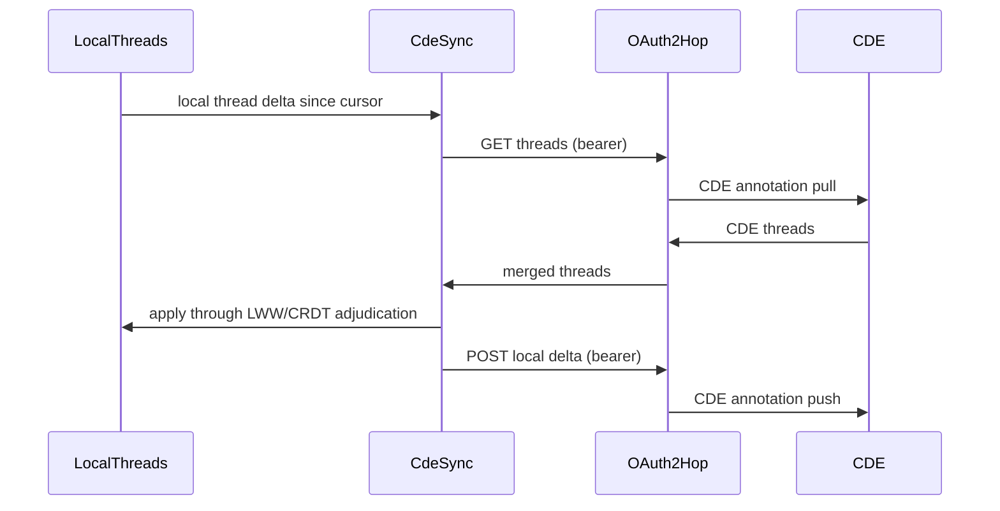

# [PERSISTENCE_ANNOTATION]

Rasm.Persistence owns the generic, host-neutral durable-annotation backbone — the anchoring algebra, the threaded-comment store, and the op-log/CDE sync round-trip — unifying comments, conflicts, presence, references, and blame through one anchor algebra: `Anchor` `[Union]` binds an annotation to a node id, a sub-entity, a parameter path, or a world-point-plus-view, with re-anchoring when the target moves; `Thread` carries threaded comments, @-mentions, status lifecycle, and assignment over the op-log; and `CdeSync` round-trips the durable annotation threads to a Common Data Environment over the AppHost OAuth2 outbound hop with the settled merge-law adjudication. The BCF/coordination domain model — the `BcfTopic`/`BcfComment`/`BcfViewpoint` issue semantics, the BCF 2.1/3.0 archive read/write, and the BCF-API REST surface — is the AEC-domain owner `Rasm.Bim/coordination` (the `Review/issues#BCF_ARCHIVE` owner)'s concern, consumed here only at the `Sync/annotation ⇄ Rasm.Bim/coordination # [WIRE]: BCF/coordination domain` wire where the two join through the `Query/federation#ENTITY_GRAPH` key: the Bim `BcfViewpoint` IFC `GlobalId` selection resolves to the one `FederatedEntity` whose `EntityIdentity.Origin` GUID is exactly the federated-entity id the durable annotation `Anchor` carries, so a BCF viewpoint and a durable annotation bind the same element without the durable row gaining a BCF-specific `GlobalId` field; Persistence holds no second BCF schema in the store, strata-legal as app-platform consuming aec-domain. The op-log changefeed, the content-address identity, the federated entity keys (`Query/federation#ENTITY_GRAPH`), the structural-diff node identity (`Version/diff#STRUCTURAL_DIFF`), the AppHost OAuth2 outbound hop, and `ClockPolicy`/`ReceiptSinkPort`/`CorrelationId` arrive settled and compose inside the fences. The AppUi pins/markup surface consumes the annotation wire projection and re-points its issue-board BCF consumption to the Bim coordination owner.

## [01]-[INDEX]

- [01]-[ANCHOR_ALGEBRA]: anchor union, threading, mentions, status, and re-anchoring fold.
- [02]-[CDE_SYNC]: bidirectional CDE OAuth2 sync of the durable annotation threads over the AppHost hop.
- [03]-[TS_PROJECTION]: anchor, thread, and comment wire shapes.

## [02]-[ANCHOR_ALGEBRA]

- Owner: `Anchor` `[Union]` the annotation-target binding family; `Thread` the threaded annotation record carrying comments, mentions, status, and assignment; `Mention` the @-reference; `AnnotationStatus` the lifecycle; `Anchors` the static surface owning the anchor projection, re-anchoring against a structural diff, and the thread fold.
- Cases: `NodeId | SubEntity | ParamPath | WorldPointView` on `Anchor`; `Open | InProgress | Resolved | Closed | Reopened` on `AnnotationStatus`.
- Entry: `public static Anchor Of(FederatedEntity entity, Option<string> subEntity, Option<string> paramPath)` — projects the most specific anchor an annotation target admits; `public static Anchor Reanchor(Anchor prior, Seq<EditOp> structuralDiff)` re-binds an anchor across a structural change, so a comment on a moved or transformed node follows it.
- Auto: the anchor algebra is reused across five surfaces — a comment, a conflict, a presence cursor, a cross-document reference, and a blame attribution all anchor through the one `Anchor` union, so a markup pin, a conflict highlight, and a live cursor share one binding vocabulary; re-anchoring reads the structural-diff edit script (`Version/diff#STRUCTURAL_DIFF`) so a `NodeId` anchor on an updated node stays bound, a `Move`d node's anchor follows the move, and a `Delete`d node's anchor surfaces an orphaned-anchor status the thread resolves; a thread is one `OpLogEntry` per comment on the `annotation` column family so threads ride the changefeed and converge per the CRDT algebra; @-mentions resolve to actor agents (`Version/provenance#CAUSAL_DAG` agent vertices) so a mention notifies and a blame attribution shares the agent identity.
- Receipt: a thread mutation rides `store.annotation.thread`; a re-anchor rides `store.annotation.reanchor` carrying the prior and new anchor; a status transition rides `store.annotation.status`.
- Packages: System.IO.Hashing, NodaTime, LanguageExt.Core, Thinktecture.Runtime.Extensions, BCL inbox.
- Growth: a new anchor target is one `Anchor` case; a new status is one `AnnotationStatus` row; a new mention kind is one `Mention.Kind` value; zero new surface — a per-surface annotation type (a separate comment model, a separate conflict marker, a separate presence pin) is the deleted form because all five surfaces anchor through the one algebra, and a thread is one op-log row family.
- Boundary: the anchor algebra is the one binding vocabulary across comments, conflicts, presence, references, and blame — a per-surface anchor type is the deleted form; the four anchor cases form a specificity ladder — `NodeId` (the federated entity), `SubEntity` (a face/edge/vertex within the node), `ParamPath` (a property-set path within the node), `WorldPointView` (a world-space point plus a camera view, for an anchor not bound to a node) — so an annotation binds at the most specific level its target admits; re-anchoring is the one mechanism keeping an annotation bound across edits — it reads the structural-diff edit script so a `Match`/`Update`/`Move` keeps the anchor and a `Delete` orphans it with a typed status, never a silent loss or a stale dangling reference; the thread rides the op-log so comments converge across peers and a comment added on two peers resolves through the CRDT `RgaSequence` for ordered threading; @-mentions and assignment resolve to the same actor agents the provenance DAG attributes so a mention, a blame, and an assignment share one identity; the `WorldPointView` anchor carries the world point and the camera the `Rasm.Bim/coordination` (`Review/issues#BCF_ARCHIVE`) BCF surface consumes at the wire, and a `NodeId`/`SubEntity`/`ParamPath` anchor binds the `FederatedEntity` whose `EntityIdentity.Origin` the `Query/federation#ENTITY_GRAPH` resolves from a BCF viewpoint's IFC `GlobalId`, so a world-point or element annotation projects onto a Bim-owned BCF topic-with-viewpoint through the federation key without a BCF model in this store.

```csharp signature
public sealed class AnnotationKeyPolicy : IEqualityComparerAccessor<string>, IComparerAccessor<string> {
    public static IEqualityComparer<string> EqualityComparer => StringComparer.Ordinal;

    public static IComparer<string> Comparer => StringComparer.Ordinal;
}

[SmartEnum<string>]
[KeyMemberEqualityComparer<AnnotationKeyPolicy, string>]
[KeyMemberComparer<AnnotationKeyPolicy, string>]
public sealed partial class AnnotationStatus {
    public static readonly AnnotationStatus Open = new("open");
    public static readonly AnnotationStatus InProgress = new("in-progress");
    public static readonly AnnotationStatus Resolved = new("resolved");
    public static readonly AnnotationStatus Closed = new("closed");
    public static readonly AnnotationStatus Reopened = new("reopened");
}

[Union(ConversionFromValue = ConversionOperatorsGeneration.None)]
public abstract partial record Anchor {
    private Anchor() { }

    public sealed record NodeId(Guid Entity) : Anchor;
    public sealed record SubEntity(Guid Entity, string Topology, int Index) : Anchor;
    public sealed record ParamPath(Guid Entity, string JsonPath) : Anchor;
    public sealed record WorldPointView(double X, double Y, double Z, byte[] Camera) : Anchor;

    public sealed record Orphaned(Anchor Prior, Guid LostEntity) : Anchor;

    public Option<Guid> NodeBinding =>
        this switch {
            NodeId n => Some(n.Entity),
            SubEntity s => Some(s.Entity),
            ParamPath p => Some(p.Entity),
            _ => None,
        };
}

public readonly record struct Mention(string Actor, Guid Origin, Instant At);

public sealed record Comment(Guid Id, string Author, string Body, Seq<Mention> Mentions, Instant At);

public sealed record Thread(
    Guid Id,
    Anchor Anchor,
    AnnotationStatus Status,
    Option<string> Assignee,
    Seq<Comment> Comments,
    string Author,
    Instant At);

public static class Anchors {
    public static Anchor Of(FederatedEntity entity, Option<string> subEntity, Option<string> paramPath) =>
        (subEntity, paramPath) switch {
            ({ IsSome: true, Case: string topo }, _) => new Anchor.SubEntity(entity.Identity.Origin, topo, 0),
            (_, { IsSome: true, Case: string path }) => new Anchor.ParamPath(entity.Identity.Origin, path),
            _ => new Anchor.NodeId(entity.Identity.Origin),
        };

    public static Anchor Reanchor(Anchor prior, Seq<EditOp> structuralDiff) =>
        prior.NodeBinding.Filter(entity => structuralDiff.Exists(op => op is EditOp.Delete d && d.Id == entity))
            .Match(Some: entity => new Anchor.Orphaned(prior, entity), None: () => prior);

    public static Thread Reply(Thread thread, Comment comment) =>
        thread with { Comments = thread.Comments.Add(comment) };

    public static Thread Transition(Thread thread, AnnotationStatus next, ClockPolicy clocks) =>
        thread with { Status = next, At = clocks.Now };
}
```

| [INDEX] | [SURFACE]  | [ANCHOR_REUSE]                                      | [BINDING]                                       |
| :-----: | :--------- | :-------------------------------------------------- | :---------------------------------------------- |
|  [01]   | comments   | `Thread.Anchor` binds a markup pin                  | AppUi pins/markup overlay                       |
|  [02]   | conflicts  | `MergeConflict` highlight anchors the offending set | `Version/diff#STRUCTURAL_DIFF`                  |
|  [03]   | presence   | a cursor is a `WorldPointView` ephemeral anchor     | `Sync/collaboration#PRESENCE_AND_BLOB`          |
|  [04]   | references | a cross-doc link endpoint anchors                   | `Query/federation#CROSS_DOC_LINKS`              |
|  [05]   | blame      | a blame row anchors to the attributed node          | `Version/timetravel#TIME_TRAVEL` + `provenance` |

## [03]-[CDE_SYNC]

- Owner: `CdeEndpoint` the REST surface descriptor for the annotation/issue sync; `CdeSession` the OAuth2-backed CDE session; `CdeSync` the static surface owning the bidirectional durable-annotation-thread sync over the CDE REST surface, the OAuth2 token threading, and the conflict-aware merge of CDE-side and local-side changes.
- Cases: a pull reads CDE annotation threads past a cursor; a push writes local thread changes the CDE has not seen; a conflicting thread (edited both sides) folds through the same LWW/CRDT adjudication the sync transport uses.
- Entry: `public static IO<SyncApplyReceipt> Sync(CdeSession session, CdeEndpoint endpoint, SyncCursor cursor, Func<SyncCursor, IO<Seq<Thread>>> pull, Func<string, Seq<Thread>> localSince, Func<Seq<Thread>, IO<long>> applyLocal, Func<string, Seq<Thread>, IO<long>> push, ClockPolicy clocks)` — `IO` runs the bidirectional exchange: pulls CDE threads, applies them through the merge law, pushes the local delta, and folds one apply receipt.
- Auto: CDE sync is the REST face riding the AppHost OAuth2 outbound hop (`AppHost/outbound-resilience#HTTP_PIPELINES`) so token acquisition, refresh, retry, backoff, and deadlines are the hop owner's concern, never re-implemented here — the CDE annotation endpoints are descriptor rows the sync folds over; the bidirectional merge reuses the sync-transport LWW/CRDT adjudication (`Sync/collaboration#MERGE_LAW` `ConflictVerdict`) so a thread edited on the CDE and locally converges by the same `(HLC, origin)` ordering, never a CDE-specific conflict resolver; the cursor is the same `SyncCursor` the changefeed carries so a CDE sync resumes from the last exchanged position; the durable annotation thread anchors the `FederatedEntity` the `Rasm.Bim/coordination` (`Review/issues#BCF_ARCHIVE`) BCF owner joins on at the wire through the `Query/federation#ENTITY_GRAPH` key — the BCF viewpoint IFC `GlobalId` resolves to that federated entity's `EntityIdentity.Origin` — so a CDE that speaks the BCF-API consumes the Bim-owned BCF projection of this generic thread while Persistence syncs only the durable annotation rows.
- Receipt: a sync rides the settled `SyncApplyReceipt` carrying pulled, pushed, and conflicted counts; an OAuth2 token refresh rides the AppHost hop receipt.
- Packages: System.IO.Hashing, NodaTime, LanguageExt.Core, Rasm.AppHost (project), BCL inbox.
- Growth: a new CDE endpoint is one `CdeEndpoint` row; a new CDE provider is one OAuth2 hop registration (owned at AppHost); zero new surface — a per-CDE sync client, a second OAuth2 implementation, or a CDE-specific retry policy is the deleted form because the REST surface is descriptor rows, the OAuth2 transport is the AppHost hop, and the merge is the sync-transport adjudication.
- Boundary: CDE sync rides the AppHost OAuth2 outbound hop so the token lifecycle (acquisition, refresh, expiry, retry, backoff, deadline) is the one hop owner's concern — a second OAuth2 client, a hand-rolled token cache, or a CDE-specific retry policy is the deleted form; the CDE REST endpoints are descriptor rows the sync folds over so adding a CDE provider is one OAuth2 hop registration plus the standard annotation surface, never a per-CDE client; the bidirectional merge reuses the sync-transport adjudication so a thread edited both sides converges by `(HLC, origin)`, and a CDE-specific conflict resolver is the deleted form; the cursor is the `SyncCursor` so the CDE sync is the same resumable changefeed exchange the peer sync uses, scoped to the durable-annotation family; the OAuth2 scopes and the CDE base URL are host-resolved configuration handed over by app roots, never Persistence fence members; the BCF-API REST surface and the BCF topic/comment/viewpoint domain shapes are the `Rasm.Bim/coordination` (`Review/issues#BCF_ARCHIVE`) owner's concern — Persistence syncs the generic durable annotation thread and Bim projects it onto the BCF-API at the wire, the two joining through the `Query/federation#ENTITY_GRAPH` key (the BCF viewpoint IFC `GlobalId` resolving to the annotation `Anchor`'s federated-entity `Origin`), so no BCF model and no BCF-API descriptor live in this store.

```csharp signature
public sealed record CdeEndpoint(string BaseUrl, string ProjectId) {
    public string Annotations => $"{BaseUrl}/annotations/projects/{ProjectId}/threads";

    public string Comments(Guid thread) => $"{BaseUrl}/annotations/projects/{ProjectId}/threads/{thread:D}/comments";
}

public sealed record CdeSession(string OutboundHopKey, string ProjectId, Instant At);

public static class CdeSync {
    public static IO<SyncApplyReceipt> Sync(
        CdeSession session,
        CdeEndpoint endpoint,
        SyncCursor cursor,
        Func<SyncCursor, IO<Seq<Thread>>> pull,
        Func<string, Seq<Thread>> localSince,
        Func<Seq<Thread>, IO<long>> applyLocal,
        Func<string, Seq<Thread>, IO<long>> push,
        ClockPolicy clocks) =>
        from incoming in pull(cursor)
        from applied in applyLocal(incoming)
        let outgoing = localSince(cursor.OriginStoreId.ToString())
        from pushed in push(endpoint.Annotations, outgoing)
        select new SyncApplyReceipt(
            applied, Skipped: 0L, Conflicted: 0L, pushed, QueueDepth: 0L,
            Seq<ConflictReceipt>(), cursor, CorrelationId.Create(Guid.CreateVersion7()), clocks.Now);
}
```



## [04]-[TS_PROJECTION]

- Owner: `AnchorKind`, `AnchorWire`, `AnnotationStatusKind`, `ThreadWire`, `CommentWire` — the generic durable-annotation wire surface the AppUi pins/markup overlay decodes; the BCF topic/viewpoint wire shapes are the `Rasm.Bim/coordination` owner's projection, decoded by the issue board from the Bim wire, never re-declared here.
- Packages: BCL inbox.
- Growth: a new wire payload is one interface decoded through the same options, zero new surface.
- Boundary: the `Anchor` discriminator crosses as the case name and reconstructs as the literal union; entity ids cross as GUID strings; instants cross as ISO-8601 extended strings; the camera array crosses as a number array; the `WorldPointView` anchor carries the world coordinates and the camera so the AppUi overlay places a pin without re-reading the model; the BCF topic/viewpoint wire is the Bim coordination owner's projection (`Rasm.Bim/Review/issues#TS_PROJECTION` `BcfWire`) — the issue board decodes it from the Bim wire and resolves a viewpoint's IFC `GlobalId` to this surface's anchor through the `Query/federation#ENTITY_GRAPH` key, so this surface carries only the generic anchor/thread/comment shapes and never a BCF topic shape.

```ts contract
type AnchorKind = "NodeId" | "SubEntity" | "ParamPath" | "WorldPointView" | "Orphaned";

type AnnotationStatusKind = "open" | "in-progress" | "resolved" | "closed" | "reopened";

type AnchorWire =
  | { kind: "NodeId"; entity: string }
  | { kind: "SubEntity"; entity: string; topology: string; index: number }
  | { kind: "ParamPath"; entity: string; jsonPath: string }
  | { kind: "WorldPointView"; x: number; y: number; z: number; camera: number[] }
  | { kind: "Orphaned"; lostEntity: string };

interface CommentWire {
  id: string;
  author: string;
  body: string;
  mentions: { actor: string; at: string }[];
  at: string;
}

interface ThreadWire {
  id: string;
  anchor: AnchorWire;
  status: AnnotationStatusKind;
  assignee: string | null;
  comments: CommentWire[];
  author: string;
  at: string;
}
```

## [05]-[RESEARCH]

- [CDE_ANNOTATION_SYNC]: the CDE annotation-thread REST surface and the OAuth2 authorization-code-with-PKCE flow the AppHost outbound hop carries — the `/oauth2/auth`/`/oauth2/token` endpoints, the bearer-token header the requests carry, and the thread/comment pagination cursor the bidirectional sync resumes against a live CDE; the BCF-API projection of the synced thread is the `Rasm.Bim/coordination` (`Review/issues#BCF_ARCHIVE`) owner's concern joined through the `Query/federation#ENTITY_GRAPH` key — the BCF viewpoint IFC `GlobalId` resolving to the annotation `Anchor`'s federated-entity `Origin`.
