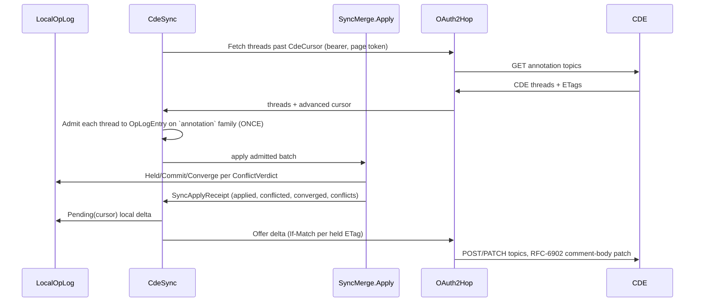

# [PERSISTENCE_ANNOTATION]

Rasm.Persistence owns the generic, host-neutral durable-annotation backbone — the anchoring algebra, the threaded issue/comment store, and the op-log/CDE sync round-trip — unifying comments, conflicts, presence, references, and blame through one `Anchor` `[Union]`. The anchor binds an annotation to a node id, a multi-element selection, a sub-entity ordinal, a parameter path, or a world-point-plus-view, and `Anchors.Rebind` re-anchors against the `Version/diff#STRUCTURAL_DIFF` `EditOp` edit script: a `Move`/`Reorder`/`Match` keeps the binding by the stable federated-entity key, a `Retype` or geometry-changing `Update` coarsens a stale `SubEntity` to its parent `NodeId`, a member-`Delete` shrinks a `Selection`, and a binding-`Delete` surfaces a typed `Orphaned` case. `Thread` is the single issue/comment record — the reply-linked `Comment` tree, the `MentionKind`-discriminated mentions, the `AnnotationStatus` lifecycle with its `Admits` transition table, the assignment, and the coordination attributes (`IssueKind`, `IssuePriority`, `Seq<Label>`, `Option<LocalDate> Due`, `Stage`) a CDE issue owns. `CdeSync.Sync` is the bidirectional durable-thread sync that scopes the settled `Sync/collaboration#MERGE_LAW` `SyncSession`/`SyncMerge.Apply` to the `annotation` column family over the AppHost OAuth2 outbound hop, so a thread edited on the CDE and locally converges by the same `(HLC, origin)` adjudication the peer sync uses, never a second resolver.

The BCF/coordination domain model — the `BcfTopic`/`BcfComment`/`BcfViewpoint` issue semantics, the `.bcfzip` archive read/write, and the BCF-API REST surface — is the AEC-domain owner `Rasm.Bim/coordination` (the `Review/issues#BCF_ARCHIVE` owner)'s concern, consumed here only at the `Sync/annotation ⇄ Rasm.Bim/coordination # [WIRE]: BCF/coordination domain` wire. The two join through the `Query/federation#ENTITY_GRAPH` key: each `BcfViewpoint.SelectedGlobalIds` IFC `GlobalId` resolves to the `FederatedEntity` whose `EntityIdentity.Origin` GUID is the federated-entity id the durable `Anchor` carries, so a multi-element BCF viewpoint and an `Anchor.Selection` bind the same element set without the durable row gaining a BCF-specific `GlobalId` field; Persistence holds no second BCF schema, strata-legal as app-platform consuming aec-domain. `IssueKind`/`IssuePriority` are the internal canonical vocabularies — the per-platform CDE `topic_type`/`priority` string is an extensible project-defined enumeration the CDE `Admit`/`Egress` marshal seam maps at the wire (the per-platform variance keyed by `CdeProvider`), never a fixed BCF literal pinned in the durable key. The op-log changefeed and its `OpLogEntry`/`SyncOpKind` shape (`Sync/collaboration#OPLOG_CHANGEFEED`), the merge adjudication (`Sync/collaboration#MERGE_LAW` `SyncSession`/`SyncMerge`/`SyncApplyReceipt`/`ConflictReceipt`), the federated entity keys (`Query/federation#ENTITY_GRAPH`), the structural-diff edit script (`Version/diff#STRUCTURAL_DIFF` `EditOp`), the causal-DAG agent vertices (`Version/provenance#CAUSAL_DAG`), the AppHost OAuth2 outbound hop (`AppHost/outbound-resilience#HTTP_PIPELINES`), and `ClockPolicy`/`ReceiptSinkPort`/`CorrelationId` arrive settled and compose inside the fences. The AppUi pins/markup surface consumes the annotation wire projection (`Sync/annotation → Rasm.AppUi/Editing # [PROJECTION]: annotation collaboration op-log`) and re-points its issue-board BCF consumption to the Bim coordination owner.

## [01]-[INDEX]

- [01]-[ANCHOR_ALGEBRA]: anchor union (single-entity, multi-element selection, sub-entity, param-path, world-point), the `EditOp`-driven re-anchoring fold, the `MentionKind` mentions, the `AnnotationStatus` lifecycle with transition validity, and the reply-linked issue/comment thread carrying the coordination attributes.
- [02]-[CDE_SYNC]: bidirectional CDE OAuth2 sync scoping the settled `SyncSession`/`SyncMerge.Apply` to the `annotation` column family over the AppHost hop, with an ETag+since `CdeCursor` and the `CdeProvider` descriptor axis.
- [03]-[TS_PROJECTION]: anchor, thread, comment, and mention wire shapes.

## [02]-[ANCHOR_ALGEBRA]

- Owner: `Anchor` `[Union]` the annotation-target binding family with the `Rebind` edit-script fold and the `NodeBinding`/`Bindings`/`Specificity` projections; `AnnotationStatus` `[SmartEnum<string>]` the lifecycle carrying the terminal/active/resolved policy and the `Admits` transition-validity guard; `MentionKind` `[SmartEnum]` the actor/team/everyone reference axis; `SubTopology` `[SmartEnum<string>]` the durable source-agnostic face/edge/vertex sub-entity axis the named-ordinal anchor binds; `IssueKind`/`IssuePriority` `[SmartEnum<string>]` the internal issue-type and severity vocabularies the CDE `topic_type`/`priority` string maps onto at the wire; `Label` `[ValueObject<string>]` the trimmed tag value; `Mention` the resolved @-reference whose `(Subject, Origin)` re-derives the one provenance `AgentKey` vertex; `Comment` `[ComplexValueObject]` the admitted single contribution carrying the reply linkage, the optional viewpoint pin, and the edit stamp; `Thread` the issue record carrying the reply-linked comment tree, the lifecycle, the assignment, and the coordination attributes; `AnnotationFault` the closed `[Union]` fault family deriving from `Expected`; `Anchors` the static surface owning the most-specific anchor projection, the `EditOp`-driven re-anchoring fold, the lifecycle-guarded transition, and the comment-reply fold.
- Cases: `NodeId | Selection | SubEntity | ParamPath | WorldPointView | Orphaned` on `Anchor`; `Open | InProgress | Resolved | Closed | Reopened` on `AnnotationStatus`; `Actor | Team | Everyone` on `MentionKind`; `Face | Edge | Vertex` on `SubTopology`; `Issue | Clash | Rfi | Defect | Task | Comment` on `IssueKind`; `Trivial | Minor | Major | Critical | Blocker` on `IssuePriority`.
- Entry: `public static Anchor Of(FederatedEntity entity, Option<(SubTopology Topology, int Index)> sub, Option<string> paramPath)` projects the most specific single-entity anchor the target admits, carrying the bounded sub-entity topology and its ordinal; `public static Anchor Of(Seq<FederatedEntity> entities)` projects the multi-element `Selection` (or `NodeId` for the singleton, `Orphaned` for the empty set) a BCF viewpoint's `SelectedGlobalIds` resolves to; `public static Anchor Rebind(Anchor prior, Seq<EditOp> script)` folds the edit script over the anchor's bound entities — a `Match`/`Move`/`Reorder` keeps the binding (the `FederatedEntity.Key` is stable), a geometry-changing `Update` or `Retype` degrades a `SubEntity` to its parent `NodeId` (the named face/edge ordinal may vanish), a member-`Delete` shrinks a `Selection` (collapsing to `NodeId` at one survivor, `Orphaned` at none), and a binding-`Delete` projects `Orphaned`; `public static Fin<Thread> Transition(Thread thread, AnnotationStatus next, string actor, ClockPolicy clocks)` guards the lifecycle through `AnnotationStatus.Admits`, rejecting an illegal transition `IllegalTransition` rather than silently writing it; `public static Thread Reply(Thread thread, Comment comment)` folds a comment onto the thread, dedup on `ContentKey` then total-order by `(At, Id)` so two peers replaying the same per-comment op-log set converge on one byte-identical comment sequence.
- Auto: the anchor algebra is the one binding vocabulary every surface dials — a comment thread binds the markup pin, a `MergeConflict` highlight anchors the offending node, a presence cursor is a `WorldPointView` ephemeral anchor, a `CrossDocLink` endpoint anchors, a blame row anchors the attributed node, and a multi-element BCF viewpoint binds a `Selection` — so a markup pin, a conflict highlight, and a live cursor share one `Anchor` union and `Specificity` orders them on one ladder; re-anchoring folds the `Version/diff#STRUCTURAL_DIFF` `EditOp` script (`Match|Insert|Delete|Update|Move|Reorder|Retype`) over the anchor's `Bindings` so a comment on a transformed node stays bound through the same generated `Map` the diff emits — a `Move`/`Reorder`/`Match` holds because the entity key is stable, a geometry-changing `Update` or `Retype` coarsens a stale `SubEntity` to its node, a member-`Delete` shrinks a `Selection`, and only a binding-`Delete` orphans; a thread is one `OpLogEntry` per comment on the `annotation` column family with `SyncOpKind.Upsert`/`Delete`, so threads ride the `Sync/collaboration#OPLOG_CHANGEFEED` changefeed and converge by the `Sync/collaboration#MERGE_LAW` adjudication; a `MentionKind.Actor` mention's `Mention.Agent` re-derives the one `Version/provenance#CAUSAL_DAG` agent vertex through the settled `Provenance.AgentKey(Subject, Origin)` so a mention notification and a blame attribution resolve to the SAME `UInt128` vertex, `Team`/`Everyone` carrying `None` and fanning to the membership the AppHost identity store resolves; the coordination attributes — `IssueKind`, `IssuePriority`, the `Seq<Label>` tag set, the `Option<LocalDate> Due` deadline, and the `Stage` milestone — ride the existing `Thread` record so the AppUi issue board and the CDE thread read one shape, never a second issue model.
- Receipt: a thread mutation rides `store.annotation.thread`; a re-anchor rides `store.annotation.reanchor` carrying the prior and new anchor and the orphaned flag; a guarded status transition rides `store.annotation.status` carrying the from/to status and the actor.
- Packages: System.IO.Hashing (`XxHash128` content-key identity over the thread/comment bytes), NodaTime (`Instant`/`LocalDate`), LanguageExt.Core (`Fin`/`Option`/`Seq` rails), Thinktecture.Runtime.Extensions (`[Union]`/`[SmartEnum]`/`[ValueObject]`/`[ComplexValueObject]`), Microsoft.AspNetCore.JsonPatch.SystemTextJson (the RFC-6902 comment-body member-patch the CDE round-trips), BCL inbox.
- Growth: a new anchor target is one `Anchor` case the `Rebind` `Map` breaks the build on; a new sub-entity topology is one `SubTopology` row; a new status is one `AnnotationStatus` row plus its `Admits` transition entries; a new mention reach is one `MentionKind` row; a new issue type is one `IssueKind` row and a new severity one `IssuePriority` row; a new comment attribute (a reaction set, a deeper edit history) is one field on `Comment`; a new coordination attribute is one field on `Thread`; zero new surface — a per-surface annotation type (a separate comment model, a separate conflict marker, a separate presence pin, a parallel issue record) is the deleted form because all six anchor cases ride the one algebra, the issue attributes ride the one thread, and a thread is one op-log row family.
- Boundary: the anchor algebra is the one binding vocabulary across comments, conflicts, presence, references, and blame — a per-surface anchor type is the deleted form; the bound cases form a specificity ladder — `SubEntity`/`ParamPath` (a face/edge/vertex ordinal or a property-set JSON path within one node), `NodeId`/`Selection` (one federated entity, or the multi-element set a BCF viewpoint's `SelectedGlobalIds` resolves to), `WorldPointView` (a world-space point plus a camera view, for an anchor not bound to a node), `Orphaned` — so an annotation binds at the most specific level its target admits and `Specificity` ranks them; re-anchoring is the one mechanism keeping an annotation bound across edits — `Rebind` folds the structural-diff edit script so a `Match`/`Move`/`Reorder` keeps the anchor (the federated-entity key is stable, so a `SubEntity`/`ParamPath`/`Selection` survives a re-parented node by identity, not by rewrite), a geometry-changing `Update` or a `Retype` degrades a `SubEntity` to its node `NodeId` so a stale face/edge ordinal never points into vanished topology, a member-`Delete` shrinks a `Selection` (collapsing to a `NodeId` at one survivor and `Orphaned` at none, so a partly-deleted viewpoint selection keeps its surviving elements rather than orphaning whole), and a binding-`Delete` projects `Orphaned(prior, lostEntity)` with the typed status, never a silent loss or a stale dangling reference; the lifecycle is load-bearing — `AnnotationStatus.Admits` is the transition-validity table (an `Open` issue advances to `InProgress`/`Resolved`/`Closed`, a `Resolved`/`Closed` issue `Reopen`s, a terminal `Closed` admits only `Reopened`) so `Transition` rejects an out-of-order write `IllegalTransition` rather than corrupting the lifecycle, and the AppHost workflow seam reads the same guard; the thread rides the op-log so comments converge across peers — a comment is one `OpLogEntry` per the `Sync/collaboration#MERGE_LAW` `annotation`-family LWW, and `Reply` dedups on `ContentKey` then total-orders by `(At, Id)` so two peers replaying the same per-comment op-log set converge on one byte-identical comment sequence without a hand-rolled RGA, while `Comment.InReplyTo` carries the parent linkage so a CDE reply thread reconstructs the tree the flat causal order alone cannot; mentions and assignment resolve to the same actor agents the provenance DAG attributes so a mention, a blame, and an assignment share one identity, with `MentionKind` discriminating an actor mention from a team/everyone broadcast; the coordination attributes ride the one thread — `Thread` carries `IssueKind`/`IssuePriority`/`Seq<Label>`/`Option<LocalDate> Due`/`Stage` as the internal vocabulary, and the CDE `Admit`/`Egress` marshal seam (and the `Rasm.Bim/coordination` BCF projection) maps `IssueKind`/`IssuePriority` onto the extensible CDE `topic_type`/`priority` strings at the wire rather than a Persistence-side BCF model (the BCF `topic_type` is a project-defined enumeration, never a fixed durable key); the `WorldPointView` anchor carries the world point and the camera the `Rasm.Bim/coordination` (`Review/issues#BCF_ARCHIVE`) BCF surface consumes at the wire, and a `NodeId`/`Selection`/`SubEntity`/`ParamPath` anchor binds the `FederatedEntity` set whose `EntityIdentity.Origin` the `Query/federation#ENTITY_GRAPH` resolves from a BCF viewpoint's `SelectedGlobalIds`, and `Comment.Viewpoint` pins a comment to the BCF viewpoint GUID the Bim owner round-trips, so a world-point or multi-element annotation projects onto a Bim-owned BCF topic-with-viewpoint through the federation key without a BCF model in this store.

```csharp signature
// --- [TYPES] ---------------------------------------------------------------------------
public sealed class AnnotationKeyPolicy : IEqualityComparerAccessor<string>, IComparerAccessor<string> {
    public static IEqualityComparer<string> EqualityComparer => StringComparer.Ordinal;

    public static IComparer<string> Comparer => StringComparer.Ordinal;
}

// The lifecycle is load-bearing: `Admits` is the transition-validity table the guarded `Transition`
// reads, so an out-of-order write rejects rather than corrupting the issue state. Terminal `Closed`
// admits only `Reopened`; `Active` rows feed the AppUi open-issue board and the CDE dispatch sweep.
[SmartEnum<string>]
[KeyMemberEqualityComparer<AnnotationKeyPolicy, string>]
[KeyMemberComparer<AnnotationKeyPolicy, string>]
public sealed partial class AnnotationStatus {
    public static readonly AnnotationStatus Open = new("open", active: true, resolved: false, terminal: false);
    public static readonly AnnotationStatus InProgress = new("in-progress", active: true, resolved: false, terminal: false);
    public static readonly AnnotationStatus Resolved = new("resolved", active: false, resolved: true, terminal: false);
    public static readonly AnnotationStatus Closed = new("closed", active: false, resolved: true, terminal: true);
    public static readonly AnnotationStatus Reopened = new("reopened", active: true, resolved: false, terminal: false);

    public bool Active { get; }
    public bool Resolved { get; }
    public bool Terminal { get; }

    static readonly HashMap<string, Seq<AnnotationStatus>> Allowed = HashMap(
        (Open.Key, Seq(InProgress, Resolved, Closed)),
        (InProgress.Key, Seq(Resolved, Closed, Open)),
        (Resolved.Key, Seq(Reopened, Closed)),
        (Closed.Key, Seq(Reopened)),
        (Reopened.Key, Seq(InProgress, Resolved, Closed)));

    public bool Admits(AnnotationStatus next) => Allowed.Find(Key).Map(set => set.Contains(next)).IfNone(false);
}

[SmartEnum]
public sealed partial class MentionKind {
    public static readonly MentionKind Actor = new();    // one resolved agent vertex
    public static readonly MentionKind Team = new();      // a membership group the identity store fans out
    public static readonly MentionKind Everyone = new();  // every participant of the thread
}

// The durable, source-agnostic sub-entity topology vocabulary the named-ordinal anchor binds: the
// host-neutral face/edge/vertex axis the geometry-domain `Rasm.Geometry.Topology` `EntityKind` maps ONTO
// at the wire, never the geometry type leaked into the durable store — `Coarsenable` rows degrade to the
// parent `NodeId` under a geometry-changing edit (the named ordinal may vanish), so `Rebind` reads the row.
[SmartEnum<string>]
[KeyMemberEqualityComparer<AnnotationKeyPolicy, string>]
public sealed partial class SubTopology {
    public static readonly SubTopology Face = new("face");
    public static readonly SubTopology Edge = new("edge");
    public static readonly SubTopology Vertex = new("vertex");
}

// The INTERNAL issue-type vocabulary the durable thread keys on; the extensible CDE `topic_type`
// (a project-defined enumeration, never a fixed wire literal) maps onto these rows at the CdeProvider
// wire, so the key stays a stable internal identifier and a new type is one row, never a model.
[SmartEnum<string>]
[KeyMemberEqualityComparer<AnnotationKeyPolicy, string>]
public sealed partial class IssueKind {
    public static readonly IssueKind Issue = new("issue");
    public static readonly IssueKind Clash = new("clash");
    public static readonly IssueKind Rfi = new("rfi");
    public static readonly IssueKind Defect = new("defect");
    public static readonly IssueKind Task = new("task");
    public static readonly IssueKind Comment = new("comment");
}

// The internal severity vocabulary ranked for board sort; the CDE `priority` string maps onto these
// rows at the wire. `Rank` is the load-bearing ordinal the issue board orders and an SLA escalates on.
[SmartEnum<string>]
[KeyMemberEqualityComparer<AnnotationKeyPolicy, string>]
[KeyMemberComparer<AnnotationKeyPolicy, string>]
public sealed partial class IssuePriority {
    public static readonly IssuePriority Trivial = new("trivial", rank: 0);
    public static readonly IssuePriority Minor = new("minor", rank: 1);
    public static readonly IssuePriority Major = new("major", rank: 2);
    public static readonly IssuePriority Critical = new("critical", rank: 3);
    public static readonly IssuePriority Blocker = new("blocker", rank: 4);

    public int Rank { get; }
}

[ValueObject<string>]
public readonly partial struct Label {
    static partial void ValidateFactoryArguments(ref ValidationError? validationError, ref string value) {
        value = value.Trim();
        if (value.Length is 0 or > 64)
            validationError = new ValidationError($"<label-length:{value.Length}>");
    }
}

[Union(ConversionFromValue = ConversionOperatorsGeneration.None, SwitchMethods = SwitchMapMethodsGeneration.Default)]
public abstract partial record Anchor {
    private Anchor() { }

    public sealed record NodeId(UInt128 Entity) : Anchor;
    public sealed record Selection(Seq<UInt128> Entities) : Anchor;
    public sealed record SubEntity(UInt128 Entity, SubTopology Topology, int Index) : Anchor;
    public sealed record ParamPath(UInt128 Entity, string JsonPath) : Anchor;
    public sealed record WorldPointView(double X, double Y, double Z, ReadOnlyMemory<byte> Camera) : Anchor;
    public sealed record Orphaned(Anchor Prior, UInt128 LostEntity) : Anchor;

    // The full bound federated-entity key set (the Selection multi-element case carries N), empty for a
    // free world-point or an already-orphaned anchor; Rebind folds the edit script over each member.
    public Seq<UInt128> Bindings => this.Map(
        nodeId: static n => Seq1(n.Entity), selection: static s => s.Entities,
        subEntity: static s => Seq1(s.Entity), paramPath: static p => Seq1(p.Entity),
        worldPointView: static _ => Seq<UInt128>(), orphaned: static _ => Seq<UInt128>());

    // The primary bound key (the Selection head), None for a free world-point or an orphaned anchor.
    public Option<UInt128> NodeBinding => Bindings.HeadOrNone();

    // The specificity ladder rank the surfaces order on: 3 = sub-binding, 2 = node/selection, 1 = world point, 0 = orphaned.
    public int Specificity => this.Map(
        nodeId: static _ => 2, selection: static _ => 2, subEntity: static _ => 3,
        paramPath: static _ => 3, worldPointView: static _ => 1, orphaned: static _ => 0);
}

// --- [MODELS] --------------------------------------------------------------------------
// A resolved @-reference: the kind discriminates the reach, (Subject, Origin) IS the provenance
// AgentKey preimage the blame attribution shares, At stamps the mention instant. Agent re-derives the
// `Version/provenance#CAUSAL_DAG` vertex through the ONE settled `Provenance.AgentKey` (never a second
// byte layout) so a mention and a blame row resolve to the SAME UInt128 walk vertex — a `MentionKind.Actor`
// notifies and attributes through one identity, while `Team`/`Everyone` fan to the membership the AppHost
// identity store resolves and carry no single agent vertex.
public readonly record struct Mention(MentionKind Kind, string Subject, Guid Origin, Instant At) {
    public Option<UInt128> Agent => Kind == MentionKind.Actor ? Some(Provenance.AgentKey(Subject, Origin)) : None;
}

// A single admitted contribution: the reply linkage (None for a root comment) makes the thread a real
// tree the flat causal order cannot, Viewpoint pins the comment to a BCF viewpoint GUID the Bim owner
// round-trips, and Edited/EditedBy carry the CDE edit stamp the body-patch egress crosses minimally.
// ValidateFactoryArguments is the ONE admission of a raw CDE/local comment body: an empty body or a
// whitespace author rejects here and never reaches the interior; the ContentKey folds the edit stamp
// so an edit-in-place moves the key and a re-pull of the unedited comment is idempotent LWW.
[ComplexValueObject]
public sealed partial class Comment {
    public Guid Id { get; }
    public string Author { get; }
    public string Body { get; }
    public Seq<Mention> Mentions { get; }
    public Option<Guid> InReplyTo { get; }
    public Option<string> Viewpoint { get; }
    public Option<Instant> Edited { get; }
    public Option<string> EditedBy { get; }
    public Instant At { get; }

    public UInt128 ContentKey =>
        XxHash128.HashToUInt128(Encoding.UTF8.GetBytes(
            $"{Id:N}|{Author}|{Body}|{Edited.Map(static e => e.ToUnixTimeTicks().ToString()).IfNone(string.Empty)}"));

    static partial void ValidateFactoryArguments(
        ref ValidationError? validationError,
        ref Guid id, ref string author, ref string body, ref Seq<Mention> mentions,
        ref Option<Guid> inReplyTo, ref Option<string> viewpoint, ref Option<Instant> edited, ref Option<string> editedBy, ref Instant at) {
        author = author.Trim();
        body = body.Trim();
        if (id == Guid.Empty) validationError = new ValidationError("<comment-id-empty>");
        else if (author.Length is 0) validationError = new ValidationError("<comment-author-blank>");
        else if (body.Length is 0) validationError = new ValidationError("<comment-body-empty>");
        else if (inReplyTo == Some(id)) validationError = new ValidationError("<comment-reply-self>");
    }
}

// The one issue/comment thread: the anchor binding, the lifecycle, the assignment, and the
// CDE/BCF-API coordination attributes (kind, priority, labels, due, stage) on one record — never a
// second issue model. The op-log key is the content of the thread + its ordered comment closure.
public sealed record Thread(
    Guid Id,
    Anchor Anchor,
    IssueKind Kind,
    AnnotationStatus Status,
    IssuePriority Priority,
    Seq<Label> Labels,
    Option<LocalDate> Due,
    Option<string> Stage,
    Option<string> Assignee,
    Seq<Comment> Comments,
    string Author,
    Instant At) {
    public bool Open => Status.Active;

    // The causal-tail comment under the (At, Id) total order — derived rather than read off the stored
    // order, so a wire-decoded thread whose Comments arrived unsorted still yields the true newest comment
    // the body-patch egress targets. Order-insensitive XOR-fold keys the thread so two peers replaying the
    // same comment set in any arrival order converge on one ContentKey.
    public Option<Comment> Tail => Comments.OrderBy(static c => (c.At, c.Id)).LastOrNone();

    public UInt128 ContentKey =>
        Comments.Fold(
            XxHash128.HashToUInt128(Encoding.UTF8.GetBytes($"{Id:N}|{Kind.Key}|{Status.Key}|{Priority.Key}")),
            static (acc, c) => acc ^ c.ContentKey);
}

// --- [ERRORS] --------------------------------------------------------------------------
// The closed annotation fault family in the 8300 band, deriving from Expected so it composes the
// LanguageExt rails — a bare Error for a multi-cause domain is the deleted form.
public abstract partial record AnnotationFault : Expected, IValidationError<AnnotationFault> {
    private AnnotationFault(string detail, int code) : base(detail, code, None) { }
    public static AnnotationFault Create(string message) => new Malformed(message);

    public sealed record Malformed : AnnotationFault { public Malformed(string detail) : base(detail, 8301) { } }
    public sealed record IllegalTransition : AnnotationFault {
        public IllegalTransition(AnnotationStatus from, AnnotationStatus to) : base($"{from.Key}->{to.Key}", 8302) => (From, To) = (from, to);
        public AnnotationStatus From { get; } public AnnotationStatus To { get; }
    }
    public sealed record CdeRejected : AnnotationFault { public CdeRejected(string detail) : base(detail, 8303) { } }
}

// --- [OPERATIONS] ----------------------------------------------------------------------
public static class Anchors {
    public static Anchor Of(FederatedEntity entity, Option<(SubTopology Topology, int Index)> sub, Option<string> paramPath) =>
        (sub, paramPath) switch {
            ({ IsSome: true, Case: (SubTopology topo, int index) }, _) => new Anchor.SubEntity(entity.Key, topo, index),
            (_, { IsSome: true, Case: string path }) => new Anchor.ParamPath(entity.Key, path),
            _ => new Anchor.NodeId(entity.Key),
        };

    // The multi-element anchor a BCF viewpoint's SelectedGlobalIds resolves to: N elements bind a
    // Selection, one collapses to a NodeId, and an empty set is Orphaned at admission.
    public static Anchor Of(Seq<FederatedEntity> entities) =>
        toSeq(entities.Map(static e => e.Key).Distinct()) switch {
            [] => new Anchor.Orphaned(new Anchor.Selection(Seq<UInt128>()), UInt128.Zero),
            [var only] => new Anchor.NodeId(only),
            var keys => new Anchor.Selection(keys),
        };

    // Re-anchor by folding the structural-diff edit script over the anchor's bound entities through the
    // generated EditOp.Map. The federated-entity Key is stable across Match/Move/Reorder so the binding
    // holds; a binding-Delete orphans; an Update whose GEOMETRY changed (the face/edge ordinal a SubEntity
    // names may no longer exist) or a Retype DEGRADES a SubEntity to its parent NodeId. A Selection folds
    // member-wise — a member-Delete drops that key, leaving the survivors — and re-projects to NodeId at one
    // survivor and Orphaned at none. A new EditOp case breaks this Map at compile time.
    public static Anchor Rebind(Anchor prior, Seq<EditOp> script) => prior switch {
        Anchor.Selection sel => Reproject(sel, script),
        _ => prior.NodeBinding.Match(
            None: () => prior,
            Some: entity => script.Filter(op => op.Target == entity).Fold(prior, static (anchor, op) => op.Map(
                match: static _ => anchor,
                insert: static _ => anchor,
                delete: d => new Anchor.Orphaned(anchor, d.Key),
                update: u => u.FromGeometry != u.ToGeometry ? Degrade(anchor) : anchor,
                move: static _ => anchor,
                reorder: static _ => anchor,
                retype: static _ => Degrade(anchor)))),
    };

    // Fold the deletes in the script over a Selection's members, dropping each deleted key, then
    // re-project the surviving set onto the most specific anchor it admits (NodeId / Selection / Orphaned).
    static Anchor Reproject(Anchor.Selection sel, Seq<EditOp> script) =>
        script.Fold(sel.Entities, static (keys, op) => op is EditOp.Delete d ? keys.Filter(k => k != d.Key) : keys)
            switch {
                [] => new Anchor.Orphaned(sel, sel.Entities.HeadOrNone().IfNone(UInt128.Zero)),
                [var only] => new Anchor.NodeId(only),
                var survivors => new Anchor.Selection(survivors),
            };

    // Fold a comment onto the thread in deterministic causal order: dedup on ContentKey (idempotent
    // re-delivery of the same per-comment op-log row collapses to one) then total-order by (At, Id) so two
    // peers replaying the same comment op-log set converge on one byte-identical comment sequence — the
    // op-log-per-comment convergence the merge law already grants, ordered here, never a hand-rolled append.
    public static Thread Reply(Thread thread, Comment comment) =>
        thread.Comments.Exists(held => held.ContentKey == comment.ContentKey)
            ? thread
            : thread with {
                Comments = toSeq(thread.Comments.Add(comment).OrderBy(static c => (c.At, c.Id))),
                At = thread.At >= comment.At ? thread.At : comment.At,
            };

    // The lifecycle-guarded transition: AnnotationStatus.Admits is the validity table, so an illegal
    // transition is a typed IllegalTransition fault, never a silent corrupting write.
    public static Fin<Thread> Transition(Thread thread, AnnotationStatus next, string actor, ClockPolicy clocks) =>
        thread.Status.Admits(next)
            ? Fin.Succ(thread with { Status = next, Assignee = Resolved(thread, next, actor), At = clocks.Now })
            : Fin.Fail<Thread>(new AnnotationFault.IllegalTransition(thread.Status, next));

    // A sub-binding whose topology changed coarsens to the surviving node so the anchor never points at
    // a vanished face/edge ordinal; a node or property anchor is unaffected by a geometry/kind change.
    static Anchor Degrade(Anchor anchor) =>
        anchor is Anchor.SubEntity s ? new Anchor.NodeId(s.Entity) : anchor;

    static Option<string> Resolved(Thread thread, AnnotationStatus next, string actor) =>
        next.Resolved && thread.Assignee.IsNone ? Some(actor) : thread.Assignee;
}
```

| [INDEX] | [SURFACE]   | [ANCHOR_CASE]                          | [ANCHOR_REUSE]                                      | [BINDING]                                       |
| :-----: | :---------- | :------------------------------------- | :-------------------------------------------------- | :---------------------------------------------- |
|  [01]   | comments    | any (`Specificity` 3→1)                | `Thread.Anchor` binds the markup pin at most-specific level | AppUi pins/markup overlay                |
|  [02]   | conflicts   | `NodeId`/`SubEntity`                    | a `MergeConflict` highlight anchors the offending node | `Version/diff#STRUCTURAL_DIFF`               |
|  [03]   | presence    | `WorldPointView`                       | a cursor is a `WorldPointView` ephemeral anchor     | `Sync/collaboration#PRESENCE_AND_BLOB`          |
|  [04]   | references  | `NodeId`/`ParamPath`                    | a `CrossDocLink` endpoint anchors                   | `Query/federation#CROSS_DOC_LINKS`              |
|  [05]   | blame       | `NodeId`                               | a blame row anchors the attributed node; shares the `Mention.Agent` provenance vertex | `Version/timetravel#TIME_TRAVEL` + `provenance` |
|  [06]   | bcf-viewpoint | `Selection`                          | a multi-element BCF viewpoint binds the `SelectedGlobalIds` set; a member-`Delete` shrinks it | `Rasm.Bim/Review/issues#BCF_ARCHIVE` + `federation` |

## [03]-[CDE_SYNC]

- Owner: `CdeProvider` `[SmartEnum<string>]` the CDE-platform descriptor axis (BCF-API, BIM Track, Trimble Connect, ACC) carrying the path template and the optimistic-concurrency style (ETag vs modified-since); `CdeEndpoint` `[ComplexValueObject]` the admitted base-URL + project descriptor whose validation gates a malformed base URL once; `CdeCursor` the resumable exchange position carrying the page token, the per-thread ETag map, and the last-modified `Instant`; `CommentPatch` the typed RFC-6902 member-patch snapshot and `CommentEgress` the body-patch projection surface; `CdeSession` the OAuth2-backed session binding the keyed `OutboundHop` and the fetch/offer/admit/egress/merge delegates; `CdeSync` the static surface owning the bidirectional durable-thread sync that scopes the settled `Sync/collaboration#MERGE_LAW` `SyncSession`/`SyncMerge.Apply` to the `annotation` column family.
- Cases: a pull reads CDE annotation threads past the `CdeCursor` (page token + modified-since); a push writes the local-origin thread delta the CDE has not seen, each `If-Match`/`If-Unmodified-Since` gated by the held ETag; a thread edited both sides folds through `SyncMerge.Apply` — the same `ConflictVerdict`/`ConflictReceipt` adjudication the peer transport uses — never a CDE-specific resolver; a comment-body edit round-trips as the `CommentEgress.Body` typed `JsonPatchDocument<CommentPatch>` Replace-on-`/body` member-patch (`Microsoft.AspNetCore.JsonPatch.SystemTextJson`), never a whole-thread replace.
- Entry: `public static IO<SyncApplyReceipt> Sync(CdeSession session, CdeProvider provider, CdeCursor cursor)` — `IO` runs the bidirectional exchange: it admits each pulled CDE thread to an `OpLogEntry` on the `annotation` family through `session.Admit`, applies the batch through `SyncMerge.Apply` so the verdict, the conflict receipts, and the converged/applied counts are the settled merge law's, then offers the local-origin pending delta past the cursor to the CDE through the ETag-gated push carrying the `CommentEgress.Bodies` member-patch map, folding one `SyncApplyReceipt`; `public static IO<(Seq<OpLogEntry> Batch, CdeCursor Cursor)> Pull(CdeSession session, CdeProvider provider, CdeCursor cursor)` and `public static IO<CdeCursor> Push(CdeSession session, CdeProvider provider, CdeCursor cursor, Seq<OpLogEntry> delta)` are the two legs the exchange composes.
- Auto: CDE sync is the REST face riding the AppHost OAuth2 outbound hop (`AppHost/outbound-resilience#HTTP_PIPELINES`) so token acquisition, refresh, retry, backoff, and deadlines are the hop owner's concern reached through the keyed `OutboundHop` on `CdeSession`, never re-implemented here — the CDE annotation endpoints are `CdeProvider` path-template rows the sync folds over; the bidirectional merge IS `Sync/collaboration#MERGE_LAW` `SyncMerge.Apply` over a `SyncSession` scoped to the `annotation` family, so a thread edited on the CDE and locally converges by the same `(HLC, origin)` ordering and surfaces the same `ConflictReceipt` the inspector reads, never a parallel adjudication; the cursor pairs the CDE page token, the per-thread ETag map, and the modified-since `Instant`, so a CDE sync resumes from the last exchanged position AND the push presents the correct `If-Match` precondition so a concurrent CDE edit fails the precondition rather than clobbering — the CDE-side optimistic-concurrency token mapping onto the merge law's content-key adjudication; a CDE thread admits through the boundary exactly once — the raw JSON maps to a `Thread` then to an `OpLogEntry` on the `annotation` column family with the thread `ContentKey`, so the interior never re-validates a CDE shape, and the push offers ONLY the local-origin pending delta (the `OriginStoreId == StoreId` filter) so a just-applied CDE thread never echoes back; the comment-body egress decodes each pending `OpLogEntry` back to its `Thread` through `session.Egress` and projects the causal-tail `Comment` into the `CommentEgress.Body` typed member-patch so a body edit crosses as the minimal RFC-6902 delta; the durable annotation thread anchors the `FederatedEntity` the `Rasm.Bim/coordination` (`Review/issues#BCF_ARCHIVE`) BCF owner joins on at the wire through the `Query/federation#ENTITY_GRAPH` key — the BCF viewpoint IFC `GlobalId` resolves to that federated entity's `EntityIdentity.Origin` — so a CDE that speaks the BCF-API consumes the Bim-owned BCF projection of this generic thread while Persistence syncs only the durable annotation rows.
- Receipt: a sync rides the settled `Sync/collaboration#MERGE_LAW` `SyncApplyReceipt` carrying the applied, skipped, conflicted, converged, and pushed counts and the `Seq<ConflictReceipt>` the merge law folds — never a zero-filled placeholder; an OAuth2 token refresh and the HTTP hop attempt ride the AppHost hop receipt; a precondition failure rides the typed `AnnotationFault.CdeRejected`.
- Packages: System.IO.Hashing, NodaTime, LanguageExt.Core, Microsoft.AspNetCore.JsonPatch.SystemTextJson, Rasm.AppHost (project), BCL inbox.
- Growth: a new CDE platform is one `CdeProvider` row (path template + concurrency style); a new CDE endpoint shape is one field on `CdeProvider`; a new OAuth2 hop is one registration owned at AppHost; zero new surface — a per-CDE sync client, a second OAuth2 implementation, a CDE-specific retry policy, or a second merge resolver is the deleted form because the REST surface is descriptor rows, the OAuth2 transport is the AppHost hop, and the merge IS `SyncMerge.Apply`.
- Boundary: CDE sync rides the AppHost OAuth2 outbound hop so the token lifecycle (acquisition, refresh, expiry, retry, backoff, deadline) is the one hop owner's concern reached through the `OutboundHopKey` on `CdeSession` — a second OAuth2 client, a hand-rolled token cache, or a CDE-specific retry policy is the deleted form, exactly as `Sync/collaboration#TRANSPORT_AXIS` `HttpDelta` rides the same hop and the database stays excluded from the hop law; the CDE REST endpoints are `CdeProvider` path-template rows the sync folds over so adding a CDE platform is one row plus one OAuth2 hop registration, never a per-CDE client; the bidirectional merge IS the sync-transport adjudication — `CdeSync.Sync` builds a `SyncSession` whose `Held`/`Commit`/`Pending` delegates address the `annotation` column family and hands the admitted CDE batch to `SyncMerge.Apply`, so a thread edited both sides converges by `(HLC, origin)`, a content-key-equal re-pull is the idempotent `LocalWin`, and an equal-stamp divergence is the `Rejected` conflict the receipt carries — a CDE-specific conflict resolver, an inline count tally, or a hardcoded zero-conflict receipt is the deleted form; the cursor is a resumable exchange position scoped to the durable-annotation family, the CDE ETag mapping onto the merge content-key so the CDE optimistic-concurrency precondition and the merge adjudication are one decision, not two; the OAuth2 scopes and the CDE base URL are host-resolved configuration `CdeEndpoint` admits and app roots hand over, never hardcoded fence literals; the BCF-API REST surface and the BCF topic/comment/viewpoint domain shapes are the `Rasm.Bim/coordination` (`Review/issues#BCF_ARCHIVE`) owner's concern — Persistence syncs the generic durable annotation thread and Bim projects it onto the BCF-API at the wire, the two joining through the `Query/federation#ENTITY_GRAPH` key (the BCF viewpoint IFC `GlobalId` resolving to the annotation `Anchor`'s federated-entity `Origin`), so no BCF model and no BCF-API descriptor live in this store.

```csharp signature
// --- [TYPES] ---------------------------------------------------------------------------
// The CDE-platform descriptor axis: the path template and the optimistic-concurrency style are row
// data, so a new platform is one row. EtagMatch -> If-Match/If-None-Match; ModifiedSince -> If-Unmodified-Since.
[SmartEnum<string>]
[KeyMemberEqualityComparer<AnnotationKeyPolicy, string>]
public sealed partial class CdeProvider {
    // {scope} is the provider's full project path scope CdeEndpoint.ProjectScope fills (a hub/project
    // composite for the platforms that nest), so every template resolves with one substitution.
    public static readonly CdeProvider BcfApi = new("bcf-api", "bcf/3.0/projects/{scope}/topics", concurrency: ConcurrencyStyle.EtagMatch);
    public static readonly CdeProvider BimTrack = new("bim-track", "v2/{scope}/issues", concurrency: ConcurrencyStyle.EtagMatch);
    public static readonly CdeProvider TrimbleConnect = new("trimble-connect", "v2/projects/{scope}/topics", concurrency: ConcurrencyStyle.ModifiedSince);
    public static readonly CdeProvider Acc = new("acc", "construction/issues/v1/projects/{scope}/issues", concurrency: ConcurrencyStyle.EtagMatch);

    public string Template { get; }
    public ConcurrencyStyle Concurrency { get; }

    public string Threads(string scope) => Template.Replace("{scope}", scope);
}

[SmartEnum]
public sealed partial class ConcurrencyStyle {
    public static readonly ConcurrencyStyle EtagMatch = new();       // If-Match / If-None-Match on the per-thread ETag
    public static readonly ConcurrencyStyle ModifiedSince = new();   // If-Unmodified-Since on the last-modified instant
}

// --- [MODELS] --------------------------------------------------------------------------
// The admitted CDE endpoint: ValidateFactoryArguments gates a malformed base URL or empty project ONCE,
// so the interior composes a known-good descriptor and never re-checks the host shape.
[ComplexValueObject]
public sealed partial class CdeEndpoint {
    public string BaseUrl { get; }
    public string ProjectScope { get; }

    static partial void ValidateFactoryArguments(ref ValidationError? validationError, ref string baseUrl, ref string projectScope) {
        baseUrl = baseUrl.TrimEnd('/');
        if (!Uri.TryCreate(baseUrl, UriKind.Absolute, out _)) validationError = new ValidationError($"<cde-base-url:{baseUrl}>");
        else if (projectScope.Length is 0) validationError = new ValidationError("<cde-project-empty>");
    }
}

// The resumable exchange position: the CDE page token, the per-thread ETag map the push presents as the
// If-Match precondition, the modified-since watermark, and the local op-log SyncCursor the merge advances.
public sealed record CdeCursor(string PageToken, HashMap<Guid, string> Etags, Instant ModifiedSince, SyncCursor Local) {
    public static CdeCursor Genesis(SyncCursor local) => new(string.Empty, HashMap<Guid, string>(), Instant.MinValue, local);

    public Option<string> Precondition(Guid thread) => Etags.Find(thread);
}

// The OAuth2-backed session: the keyed OutboundHop the AppHost owns (token, retry, backoff, deadline),
// the admitted endpoint, the Admit/Egress wire-marshal delegates, and the settled merge delegates the
// scoped SyncSession composes. Offer carries both the upserted delta AND the per-thread body member-patch.
public sealed record CdeSession(
    string OutboundHopKey,
    CdeEndpoint Endpoint,
    ClockPolicy Clocks,
    ReceiptSinkPort Sink,
    CorrelationId Correlation,
    Guid StoreId,
    ulong SchemaFingerprint,
    Func<CdeProvider, CdeCursor, IO<(Seq<Thread> Threads, CdeCursor Cursor)>> Fetch,
    Func<CdeProvider, CdeCursor, Seq<OpLogEntry>, HashMap<Guid, JsonPatchDocument<CommentPatch>>, IO<CdeCursor>> Offer,
    Func<Thread, OpLogEntry> Admit,
    Func<OpLogEntry, Option<Thread>> Egress,
    Func<OpLogEntry, Option<OpLogEntry>> Held,
    Func<OpLogEntry, IO<Unit>> Commit,
    Func<OpLogEntry, IO<Unit>> Converge,
    Func<SyncCursor, Seq<OpLogEntry>> Pending,
    Func<long> QueueDepth);

// --- [OPERATIONS] ----------------------------------------------------------------------
// The CDE comment-body egress snapshot: a body edit round-trips as an RFC-6902 typed member-patch
// (`JsonPatchDocument<CommentPatch>` Replace on `/body`), never a whole-thread replace, so the CDE
// applies a minimal delta the topic's optimistic-concurrency precondition gates. The typed lambda-path
// (`Expression<Func<CommentPatch,_>>`) binds the member so a renamed field breaks the build, not the wire.
public sealed record CommentPatch(Guid Id, string Body);

public static class CommentEgress {
    // The per-thread body member-patch the push offers ONLY for a thread the CDE already holds (an ETag
    // in the cursor): an upsert of a CDE-known, non-tombstone thread decodes to its `Thread`, its causal-tail
    // `Comment` (newest under the `(At, Id)` order) projects one Replace-on-`/body` patch keyed by the thread
    // id — a body edit crosses as the minimal RFC-6902 delta, while a brand-new thread (no held ETag) and a
    // tombstone carry no patch and the marshal POSTs/DELETEs the full op instead.
    public static HashMap<Guid, JsonPatchDocument<CommentPatch>> Bodies(CdeSession session, CdeCursor cursor, Seq<OpLogEntry> delta) =>
        delta.Filter(static entry => !entry.Kind.Tombstone)
            .Choose(entry => session.Egress(entry)
                .Filter(thread => cursor.Etags.ContainsKey(thread.Id))
                .Bind(thread => thread.Tail.Map(tail => (thread.Id, Body(tail)))))
            .ToHashMap();

    static JsonPatchDocument<CommentPatch> Body(Comment edited) {
        var patch = new JsonPatchDocument<CommentPatch>();
        patch.Replace(static c => c.Body, edited.Body);
        return patch;
    }
}

public static class CdeSync {
    // The bidirectional exchange: pull + admit each CDE thread to an OpLogEntry on the `annotation`
    // family, apply the batch through the SETTLED SyncMerge.Apply (so the verdict, conflicts, and
    // converged/applied counts are the merge law's, never inline), then offer ONLY the local-origin pending
    // delta past the cursor with the ETag-gated push (the origin filter excludes the just-applied CDE rows so
    // a pulled thread never echoes back), folding the local-applied and CDE-pushed legs into ONE
    // SyncApplyReceipt. There is no second adjudication, no hardcoded zero count, no CDE-specific merge.
    public static IO<SyncApplyReceipt> Sync(CdeSession session, CdeProvider provider, CdeCursor cursor) =>
        from pulled in Pull(session, provider, cursor)
        from applied in SyncMerge.Apply(Scoped(session, cursor.Local), pulled.Batch)
        let delta = session.Pending(applied.Cursor).Filter(entry => entry.OriginStoreId == session.StoreId)
        from pushed in Push(session, provider, pulled.Cursor, delta)
        select applied with { Pushed = delta.Count, Cursor = pushed.Local };

    public static IO<(Seq<OpLogEntry> Batch, CdeCursor Cursor)> Pull(CdeSession session, CdeProvider provider, CdeCursor cursor) =>
        session.Fetch(provider, cursor).Map(fetched =>
            (fetched.Threads.Map(session.Admit), fetched.Cursor));

    // Offer the local delta past the cursor; each thread's push presents the held ETag as the
    // If-Match / If-Unmodified-Since precondition the provider's ConcurrencyStyle dictates (so a
    // concurrent CDE edit fails the precondition lifting AnnotationFault.CdeRejected rather than clobbering)
    // and carries the per-thread RFC-6902 comment-body member-patch so a body edit round-trips minimally.
    public static IO<CdeCursor> Push(CdeSession session, CdeProvider provider, CdeCursor cursor, Seq<OpLogEntry> delta) =>
        delta.IsEmpty
            ? IO.pure(cursor)
            : session.Offer(provider, cursor, delta, CommentEgress.Bodies(session, cursor, delta));

    // The SyncSession the merge law runs against, scoped to the `annotation` column family — the CDE
    // sync is the peer-sync engine with the annotation lane wired, never a duplicate of SyncMerge.
    static SyncSession Scoped(CdeSession s, SyncCursor cursor) =>
        new(s.Clocks, s.Sink, s.Correlation, s.StoreId, s.SchemaFingerprint, cursor, CancellationToken.None,
            Holds: static _ => false, RelationFingerprint: _ => s.SchemaFingerprint,
            Fetch: static _ => IO.fail<OpLogEntry>(Error.New("<no-graph-fetch>")),
            Held: s.Held, Commit: s.Commit, Converge: s.Converge, Pending: s.Pending, QueueDepth: s.QueueDepth,
            Pull: static (_, _) => IO.fail<(ulong, Seq<OpLogEntry>, SyncCursor)>(Error.New("<cde-pulls-via-fetch>")),
            Push: static (_, _) => IO.fail<SyncCursor>(Error.New("<cde-pushes-via-offer>")),
            HasObjects: static (_, keys) => IO.pure(keys), Decode: static (_, _) => IO.pure(Seq<OpLogEntry>()),
            SpeckleSend: static (_, _) => IO.fail<(UInt128, long)>(Error.New("<no-speckle>")),
            SpeckleReceive: static (_, _) => IO.fail<Seq<OpLogEntry>>(Error.New("<no-speckle>")));
}
```



| [INDEX] | [POLICY]              | [VALUE]                                              | [BINDING]                                                              |
| :-----: | :-------------------- | :--------------------------------------------------- | :--------------------------------------------------------------------- |
|  [01]   | merge adjudication    | `Sync/collaboration#MERGE_LAW` `SyncMerge.Apply`     | the settled `(HLC, origin)` LWW; conflicts ride the folded `ConflictReceipt` |
|  [02]   | admission             | one `session.Admit` per pulled thread to `OpLogEntry`| the raw CDE shape crosses once; the interior never re-validates JSON   |
|  [03]   | optimistic concurrency| `CdeCursor.Precondition` ETag → `If-Match`            | the CDE ETag maps onto the merge content-key; one decision, not two    |
|  [04]   | resume                | `CdeCursor` page token + modified-since + `SyncCursor`| the CDE leg and the local op-log resume from the one exchange position |
|  [05]   | comment-body egress   | `CommentEgress.Body` `JsonPatchDocument<CommentPatch>` Replace-on-`/body` | a body edit round-trips as a typed member-patch, never a whole-thread replace |
|  [06]   | OAuth2 hop            | keyed `OutboundHopKey` on `CdeSession`               | token/retry/backoff/deadline owned at AppHost; database outside the hop law |

## [04]-[TS_PROJECTION]

- Owner: `AnchorKind`, `AnchorWire`, `AnnotationStatusKind`, `IssueKindWire`, `IssuePriorityWire`, `MentionKindWire`, `SubTopologyWire`, `MentionWire`, `CommentWire`, `ThreadWire` — the generic durable-annotation wire surface the AppUi pins/markup overlay and issue board decode; the BCF topic/viewpoint wire shapes are the `Rasm.Bim/coordination` owner's projection, decoded by the issue board from the Bim wire, never re-declared here.
- Packages: BCL inbox.
- Growth: a new wire payload is one interface decoded through the same options; a new anchor case, status, issue kind, priority, or mention reach crosses as one added literal-union member, zero new surface.
- Boundary: the `Anchor` discriminator crosses as the case name and reconstructs as the literal union; entity ids cross as the 16-byte content-key binary the federation keys on (not a GUID string — the durable anchor binds `FederatedEntity.Key`), and a `Selection` crosses as the `Uint8Array[]` member set so a multi-element BCF viewpoint binds every selected element; instants cross as ISO-8601 extended strings and the due-date as an ISO-8601 date string; the camera bytes cross as `Uint8Array`; the `WorldPointView` anchor carries the world coordinates and the camera so the AppUi overlay places a pin without re-reading the model; the issue-coordination attributes (`kind`, `priority`, `labels`, `due`, `stage`) cross primitive-mapped as the internal lowercase identifiers the issue board renders and the CDE marshal seam maps onto the extensible CDE `topic_type`/`priority` strings; the comment `inReplyTo`/`viewpoint`/`edited`/`editedBy` cross so the board reconstructs the reply tree, pins a comment to its viewpoint, and renders the edit stamp; the `MentionKind` crosses as the case name so the overlay distinguishes an actor mention from a team/everyone broadcast; the BCF topic/viewpoint wire is the Bim coordination owner's projection (`Rasm.Bim/Review/issues#TS_PROJECTION` `BcfWire`) — the issue board decodes it from the Bim wire and resolves a viewpoint's `SelectedGlobalIds` to this surface's `Selection` anchor through the `Query/federation#ENTITY_GRAPH` key, so this surface carries only the generic anchor/thread/comment shapes and never a BCF topic shape.

```ts contract
type AnchorKind = "NodeId" | "Selection" | "SubEntity" | "ParamPath" | "WorldPointView" | "Orphaned";

type AnnotationStatusKind = "open" | "in-progress" | "resolved" | "closed" | "reopened";

type IssueKindWire = "issue" | "clash" | "rfi" | "defect" | "task" | "comment";

type IssuePriorityWire = "trivial" | "minor" | "major" | "critical" | "blocker";

type MentionKindWire = "Actor" | "Team" | "Everyone";

type SubTopologyWire = "face" | "edge" | "vertex";

type AnchorWire =
  | { kind: "NodeId"; entity: Uint8Array }
  | { kind: "Selection"; entities: Uint8Array[] }
  | { kind: "SubEntity"; entity: Uint8Array; topology: SubTopologyWire; index: number }
  | { kind: "ParamPath"; entity: Uint8Array; jsonPath: string }
  | { kind: "WorldPointView"; x: number; y: number; z: number; camera: Uint8Array }
  | { kind: "Orphaned"; lostEntity: Uint8Array };

interface MentionWire {
  kind: MentionKindWire;
  subject: string;
  origin: string;
  at: string;
}

interface CommentWire {
  id: string;
  author: string;
  body: string;
  mentions: MentionWire[];
  inReplyTo: string | null;
  viewpoint: string | null;
  edited: string | null;
  editedBy: string | null;
  at: string;
}

interface ThreadWire {
  id: string;
  anchor: AnchorWire;
  kind: IssueKindWire;
  status: AnnotationStatusKind;
  priority: IssuePriorityWire;
  labels: string[];
  due: string | null;
  stage: string | null;
  assignee: string | null;
  comments: CommentWire[];
  author: string;
  at: string;
}
```

## [05]-[RESEARCH]

- [CDE_ANNOTATION_SYNC]: the CDE annotation-thread REST surface and the OAuth2 authorization-code-with-PKCE flow the AppHost outbound hop carries — the `/oauth2/auth`/`/oauth2/token` endpoints, the bearer-token header the requests carry, and the `CdeProvider` per-platform optimistic-concurrency style (BCF-API/BIM Track/ACC carry an `ETag` on each topic so the push presents `If-Match`; Trimble Connect carries a last-modified instant so the push presents `If-Unmodified-Since`) the `CdeCursor` resumes against, verified against a live CDE before the sync fence pins the precondition mapping. The bidirectional merge is the settled `Sync/collaboration#MERGE_LAW` `SyncMerge.Apply` scoped to the `annotation` column family — a tier-2 harness feeds a CDE-edited and a locally-edited thread of one topic through `Sync` and asserts the `ConflictReceipt` and the `LocalWin`/`Rejected` verdict match the peer-sync adjudication, the discriminating law being that the CDE ETag precondition and the merge content-key resolve one decision rather than two.
- [ISSUE_COORDINATION_ATTRIBUTES]: the durable thread carries the coordination attributes — the `IssueKind` internal topic type, the `IssuePriority` severity, the `Seq<Label>` tag set, the `Option<LocalDate>` due-date, and the `Stage` milestone — so the AppUi issue board and the `Rasm.Bim/coordination` BCF projection read one `Thread` shape. The BCF 3.0 `Topic` `topic_type` and `priority` are EXTENSIBLE project-defined enumerations (the buildingSMART BCF-API `extensions` resource defines a project's `topic_type`/`priority`/`topic_status` sets), so the durable key is the stable internal identifier and the `CdeProvider` maps it onto the project's `topic_type`/`priority` string at the wire — a fixed BCF literal pinned in the durable key is the rejected form; the `labels`/`due_date`/`stage`/`comment.viewpoint_guid`/`comment.reply_to` fields map onto the `Seq<Label>`/`Due`/`Stage` columns and the `Comment.Viewpoint`/`InReplyTo` linkage, verified against the buildingSMART BCF-API OpenAPI before the attribute set pins, so a Persistence-side second issue model never appears.
