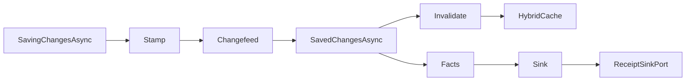

# [PERSISTENCE_QUERY_RAIL]

Every store operation in Rasm.Persistence executes through one typed dispatch: the eight-case `StoreOp<T>` union runs inside a pooled-context bracket, converts provider failure into the `StoreFault` rail exactly once, and self-emits cache invalidation on the paths SaveChanges interceptors never see. The page owns the operation algebra, the projection and keyset-page shapes, the linq2db bulk lane with its delta projection, and the four-hook interceptor spine; the `StoreProfile` row columns and the AppHost clock, deadline, receipt, cache, and telemetry ports arrive settled and compose as values.

## [1]-[INDEX]

| [INDEX] | [CLUSTER]         | [OWNS]                                                                  |
| :-----: | ----------------- | ----------------------------------------------------------------------- |
|   [1]   | OPERATION_ALGEBRA | Eight-case StoreOp dispatch; pooled bracket; one fault conversion rail  |
|   [2]   | PROJECTION_SHAPES | Typed projection egress; keyset pages; filter keys; correlation stamps  |
|   [3]   | BULK_LANE         | linq2db movement; delta projection; self-emitted invalidation; receipts |
|   [4]   | INTERCEPTOR_SPINE | Four interception hooks; one fact stream; observability registration    |

## [2]-[OPERATION_ALGEBRA]

- Owner: `StoreOp<T>` `[Union]` operation algebra; `StoreFault` `[Union]` fault vocabulary on the doctrine `Expected` shape with the dual-tier `Create` contract; `StoreRail` total dispatch surface.
- Cases: Get | Query | Stream | Aggregate | Upsert | Delete | Bulk | Maintain on `StoreOp<T>`; Text | Concurrency | Transient | Unsupported | ServerNotProvisioned | NewerSchema on `StoreFault`.
- Entry: `public static IO<T> Run<TDb, T>(PooledDbContextFactory<TDb> contexts, StoreOp<T> op, InterceptPolicy policy, ClockPolicy clocks, DeadlineClass deadline)` — `IO<T>` carries the store effect; every failure aborts through `StoreFault`.
- Auto: the bracket leases through `PooledDbContextFactory.CreateDbContextAsync` — one pooled factory per placement, built at composition from the profile row's `Configure` output — and `DisposeAsync` returns the lease, so the context never escapes the rail; every arm runs under `CreateExecutionStrategy`, binding pg `EnableRetryOnFailure` and sqlite busy-retry to the profile row while database retry stays excluded from the AppHost hop law; `Timeout` binds the caller's `DeadlineClass` row.
- Packages: Microsoft.EntityFrameworkCore.Sqlite, Npgsql.EntityFrameworkCore.PostgreSQL, Thinktecture.Runtime.Extensions, LanguageExt.Core, NodaTime.
- Growth: a new operation posture is one case on `StoreOp<T>` and a new failure is one case row in the 7000 fault-code band, zero new surface.
- Boundary: arity discriminates on payload shape — `Seq` carries one-or-many and `GetMany`/`UpsertMany` suffixes are the deleted spelling; repository-per-entity, generic repositories, lazy loading, and per-call-site tracking toggles are rejected forms — read posture is NoTracking from the profile factory options and write arms track explicitly attached graphs only; `Unsupported` materializes when a lane-by-profile capability row denies a shape; `ServerNotProvisioned` and `NewerSchema` construct at the provisioning probe and the open gate, and `From` is the single projection site — the schema-rail `SchemaFault` 5300-band evidence folds to `NewerSchema` 7005 before any provider-exception arm runs; SQLSTATE evidence rides `PostgresException.SqlState` matched against the `PostgresErrorCodes` constants because the `NpgsqlException` base carries no state code.

```csharp signature
[Union]
public abstract partial record StoreFault : Expected, IValidationError<StoreFault> {
    private StoreFault(string detail, int code) : base(detail, code, None) { }

    public static StoreFault Create(string message) => new Text(message);

    public static StoreFault From(Error error) =>
        error switch {
            SchemaFault schema => new NewerSchema(schema.Message),
            _ => error.Exception.Case switch {
                DbUpdateConcurrencyException ex => new Concurrency(ex.Message),
                PostgresException { SqlState: PostgresErrorCodes.UndefinedObject } ex => new ServerNotProvisioned(ex.Message),
                DbException { IsTransient: true } ex => new Transient(ex.Message),
                Exception ex => new Text(ex.Message),
                _ => new Text(error.Message),
            },
        };

    public sealed record Text : StoreFault { public Text(string detail) : base(detail, 7000) { } }

    public sealed record Concurrency : StoreFault, IValidationError<Concurrency> { public Concurrency(string detail) : base(detail, 7001) { } public static new Concurrency Create(string detail) => new(detail); }

    public sealed record Transient : StoreFault, IValidationError<Transient> { public Transient(string detail) : base(detail, 7002) { } public static new Transient Create(string detail) => new(detail); }

    public sealed record Unsupported : StoreFault, IValidationError<Unsupported> { public Unsupported(string detail) : base(detail, 7003) { } public static new Unsupported Create(string detail) => new(detail); }

    public sealed record ServerNotProvisioned : StoreFault, IValidationError<ServerNotProvisioned> { public ServerNotProvisioned(string detail) : base(detail, 7004) { } public static new ServerNotProvisioned Create(string detail) => new(detail); }

    public sealed record NewerSchema : StoreFault, IValidationError<NewerSchema> { public NewerSchema(string detail) : base(detail, 7005) { } public static new NewerSchema Create(string detail) => new(detail); }
}
```

```csharp signature
[Union(ConversionFromValue = ConversionOperatorsGeneration.None)]
public abstract partial record StoreOp<T> where T : notnull {
    private StoreOp() { }

    public sealed record Get(Func<DbContext, CancellationToken, ValueTask<T>> Shape) : StoreOp<T>;
    public sealed record Query(Func<DbContext, CancellationToken, ValueTask<T>> Shape) : StoreOp<T>;
    public sealed record Stream(Func<DbContext, CancellationToken, ValueTask<T>> Shape) : StoreOp<T>;
    public sealed record Aggregate(Func<DbContext, CancellationToken, ValueTask<T>> Shape) : StoreOp<T>;
    public sealed record Upsert(Func<DbContext, CancellationToken, ValueTask<T>> Shape) : StoreOp<T>;
    public sealed record Delete(Func<DbContext, CancellationToken, ValueTask<T>> Shape, Seq<string> Tags) : StoreOp<T>;
    public sealed record Bulk(Func<DbContext, CancellationToken, ValueTask<(T Value, BulkReceipt Receipt)>> Shape, Seq<string> Tags) : StoreOp<T>;
    public sealed record Maintain(Func<DbContext, CancellationToken, ValueTask<T>> Shape, string Kind) : StoreOp<T>;
}

public static class StoreRail {
    public static IO<T> Run<TDb, T>(PooledDbContextFactory<TDb> contexts, StoreOp<T> op, InterceptPolicy policy, ClockPolicy clocks, DeadlineClass deadline) where TDb : DbContext where T : notnull =>
        IO.lift(clocks.Mark).Bind(mark =>
            IO.liftAsync(env => contexts.CreateDbContextAsync(env.Token)).Bracket(
                Use: db => Execute(op, policy, clocks, mark, db).Timeout(deadline.Allotted.ToTimeSpan()),
                Catch: static error => IO.fail<T>(StoreFault.From(error)),
                Fin: static db => IO.liftVAsync<Unit>(async _ => {
                    await db.DisposeAsync();
                    return unit;
                })));

    private static IO<T> Execute<T>(StoreOp<T> op, InterceptPolicy policy, ClockPolicy clocks, long mark, DbContext db) where T : notnull =>
        op.Switch(
            state: (Policy: policy, Clocks: clocks, Mark: mark, Db: db),
            get: static (s, c) => Strategic(s.Db, c.Shape),
            query: static (s, c) => Strategic(s.Db, c.Shape),
            stream: static (s, c) => Strategic(s.Db, c.Shape),
            aggregate: static (s, c) => Strategic(s.Db, c.Shape),
            upsert: static (s, c) => Strategic(s.Db, async (ctx, ct) => (await c.Shape(ctx, ct), await ctx.SaveChangesAsync(ct)).Item1),
            delete: static (s, c) => Strategic(s.Db, c.Shape).Bind(value => IO.liftVAsync<T>(async env => {
                await s.Policy.Invalidate(c.Tags, env.Token);
                return value;
            })),
            bulk: static (s, c) => IO.liftVAsync(env => c.Shape(s.Db, env.Token)).Bind(moved => IO.liftVAsync<T>(async env => {
                _ = s.Policy.Facts(moved.Receipt.Fact);
                await s.Policy.Invalidate(c.Tags, env.Token);
                return moved.Value;
            })),
            maintain: static (s, c) => Strategic(s.Db, c.Shape).Map(value =>
                (s.Policy.Facts(new StoreFact(StoreFact.Maintain, c.Kind, 1, s.Clocks.Elapsed(s.Mark), s.Clocks.Now)), value).Item2));

    private static IO<T> Strategic<T>(DbContext db, Func<DbContext, CancellationToken, ValueTask<T>> shape) =>
        IO.liftAsync(env => db.Database.CreateExecutionStrategy().ExecuteAsync(
            (Db: db, Shape: shape),
            static (state, ct) => state.Shape(state.Db, ct).AsTask(),
            env.Token));
}
```

## [3]-[PROJECTION_SHAPES]

- Owner: `KeysetPage<TRow>` page record; `ProjectionRail` filter-key vocabulary and query-stamping extensions.
- Cases: soft-delete | retention | sync-tombstone named filter keys.
- Entry: `public static async ValueTask<KeysetPage<TRow>> Materialize(IAsyncEnumerable<TRow> rows, Func<TRow, Guid> key, int take, CancellationToken token)` — pure materialization; the probe row beyond `take` decides cursor continuation.
- Auto: `EF.CompileAsyncQuery` delegates cache hot shapes as static fields beside their projection records; `Correlated` stamps the `CorrelationId` through `TagWith` on every shape; `Stream` shapes fold a bounded `IAsyncEnumerable` inside the leased bracket, with the batch bound a per-shape policy value.
- Packages: Microsoft.EntityFrameworkCore.Sqlite, Npgsql.EntityFrameworkCore.PostgreSQL, LanguageExt.Core, BCL inbox.
- Growth: a new egress is one typed projection record beside its consumer plus one compiled-shape row, zero new surface; a non-uuid cursor is one shape row on `KeysetPage<TRow>`.
- Boundary: typed projection records are the only egress and entity types never cross the package boundary; offset pagination is the rejected page form — keyset cursors ride the UuidV7Key identity order; named filter predicates attach at the model under these keys and `Unfiltered` disables them per operation case; split-query is the per-shape `AsSplitQuery` policy value; JSON path predicates and `ExecuteUpdateAsync` into JSON paths ride document-lane shapes on the jsonb mapping; `LeftJoin`/`RightJoin` operators replace the `GroupJoin` flatten spelling.

```csharp signature
public sealed record KeysetPage<TRow>(Seq<TRow> Rows, Option<Guid> After, int Count) where TRow : notnull {
    public static async ValueTask<KeysetPage<TRow>> Materialize(IAsyncEnumerable<TRow> rows, Func<TRow, Guid> key, int take, CancellationToken token) {
        var probe = await rows.Take(take + 1).ToListAsync(token);
        return new KeysetPage<TRow>(
            toSeq(probe).Take(take),
            probe.Count > take ? Optional(key(probe[take - 1])) : None,
            int.Min(probe.Count, take));
    }
}

public static class ProjectionRail {
    public const string SoftDelete = "soft-delete";
    public const string Retention = "retention";
    public const string SyncTombstone = "sync-tombstone";

    extension<TRow>(IQueryable<TRow> source) where TRow : notnull {
        public IQueryable<TRow> Correlated(CorrelationId correlation) => source.TagWith(correlation.ToString());

        public IQueryable<TRow> Unfiltered(params ReadOnlySpan<string> filters) => source.IgnoreQueryFilters([.. filters]);
    }
}
```

## [4]-[BULK_LANE]

- Owner: `BulkRoute` route vocabulary; `BulkReceipt` typed movement receipt; `BulkDelta<TRow>` action-sentinel delta record.
- Cases: Copy | Merge | Set on `BulkRoute`.
- Entry: `public static BulkReceipt Of(ClockPolicy clocks, long mark, string entity, long rows, BulkRoute route, string provider)` — pure receipt mint from the clock seam.
- Auto: the `StoreOp<T>.Bulk` arm emits the receipt's fact projection and replays the tag transitions itself — the bulk path bypasses SaveChanges interceptors, so changefeed rows and invalidation are self-emitted inside the same transaction as the movement.
- Receipt: `BulkReceipt` — entity, rows, route, provider, elapsed `Duration`, `Instant` stamp.
- Packages: linq2db.EntityFrameworkCore, Thinktecture.Runtime.Extensions, NodaTime, LanguageExt.Core.
- Growth: a new movement form is one `BulkRoute` case carrying its receipt row, zero new surface.
- Boundary: bridge activation is one `LinqToDBForEFTools.Initialize()` call at the composition root before the first bulk shape; `BulkCopyAsync` rides `BulkCopyOptions` on the ProviderSpecific route; `MergeWithOutputAsync` consumes `Projection`, whose action string is a SQL-mapped sentinel and never caller input; profile rows without the ReturningOldNew capability column capture deltas through the SaveChanges interceptor hook instead; `ToLinqToDB` is the window-function escape inside one query shape; EFCore.BulkExtensions and a query-builder layer are the deleted forms; `Deleted`/`Inserted` sentinels project to `Option` and never travel inward.

```csharp signature
[SmartEnum]
public sealed partial class BulkRoute {
    public static readonly BulkRoute Copy = new();
    public static readonly BulkRoute Merge = new();
    public static readonly BulkRoute Set = new();
}

public readonly record struct BulkReceipt(string Entity, long Rows, BulkRoute Route, string Provider, Duration Elapsed, Instant At) {
    public static BulkReceipt Of(ClockPolicy clocks, long mark, string entity, long rows, BulkRoute route, string provider) =>
        new(entity, rows, route, provider, clocks.Elapsed(mark), clocks.Now);

    public StoreFact Fact => new(StoreFact.Bulk, Entity, Rows, Elapsed, At);
}

public sealed record BulkDelta<TRow>(string Action, TRow? Deleted, TRow? Inserted) where TRow : class {
    public static Expression<Func<string, TRow, TRow, BulkDelta<TRow>>> Projection { get; } =
        (action, deleted, inserted) => new BulkDelta<TRow>(action, deleted, inserted);

    public Option<TRow> Old => Optional(Deleted);

    public Option<TRow> New => Optional(Inserted);
}
```

## [5]-[INTERCEPTOR_SPINE]

- Owner: `StoreFact` operational fact stream; `InterceptPolicy` delegate-row policy; `StoreInterceptor` single interception capsule; `StoreObservability` registration rows.
- Entry: `public static Func<StoreFact, IO<ReceiptEnvelope>> Sink(ReceiptSinkPort port, JsonSerializerOptions wire, CorrelationId correlation)` — facts materialize as receipt envelopes at the sink edge, with the wire options arriving from the suite Strict merge.
- Auto: slow-query and burst sentinels fold per command with zero call-site code; plan capture re-issues the provider explain form only while `CapturePlans` is set, riding the `store.command.plan` kind; the pg_stat_statements read view enters as one `Aggregate` raw-SQL shape gated on the store-profiles provisioning probe; savepoint evidence is one added delegate column when a profile row earns it.
- Receipt: `StoreFact` rows — kind, subject, count, elapsed `Duration`, `Instant`; bulk and maintain arms share the stream through their fact projections.
- Packages: Microsoft.EntityFrameworkCore.Sqlite, Npgsql.OpenTelemetry, OpenTelemetry, Microsoft.Extensions.Caching.Hybrid, NodaTime, LanguageExt.Core, BCL inbox.
- Growth: a new evidence bucket is one kind constant plus one emission row, and a new hook binding is one delegate column on `InterceptPolicy`, zero new surface.
- Boundary: `StoreInterceptor` is the EF interception boundary capsule and its members carry language-owned statement forms; `Stamp` and `Changefeed` run inside `SavingChangesAsync` so op-log rows commit with entity rows in one transaction, while `Invalidate` and the save fact run after commit in `SavedChangesAsync`; `Reopen` re-applies the PRAGMA ladder on non-pooled opens and arrives bound from the native-sqlite policy table; `Invalidation` binds the tag delegate to the AppHost cache surface; `Traces` and `Meters` are the Npgsql registration rows and `Contribution` carries the minted Persistence identity through `TelemetryContributorPort`; the beta EF and gRPC instrumentation packages stay rejected — native `Activity` emission carries those spans; `InterceptPolicy.Default` is the axis row every spine literal traces to.

```csharp signature
public readonly record struct StoreFact(string Kind, string Subject, long Count, Duration Elapsed, Instant At) {
    public const string CommandSlow = "store.command.slow";
    public const string CommandBurst = "store.command.burst";
    public const string CommandPlan = "store.command.plan";
    public const string Transaction = "store.transaction";
    public const string Save = "store.save";
    public const string Bulk = "store.bulk";
    public const string Maintain = "store.maintain";
}

public sealed record InterceptPolicy(
    Duration SlowQuery,
    int Burst,
    Duration BurstSpan,
    bool CapturePlans,
    Func<DbConnection, CancellationToken, Task> Reopen,
    Func<DbContext, Instant, Unit> Stamp,
    Func<DbContext, Instant, Unit> Changefeed,
    Func<DbContext, Seq<string>> Tags,
    Func<Seq<string>, CancellationToken, ValueTask> Invalidate,
    Func<StoreFact, Unit> Facts) {
    public static readonly InterceptPolicy Default = new(
        SlowQuery: Duration.FromMilliseconds(250),
        Burst: 16,
        BurstSpan: Duration.FromMilliseconds(100),
        CapturePlans: false,
        Reopen: static (_, _) => Task.CompletedTask,
        Stamp: static (_, _) => unit,
        Changefeed: static (_, _) => unit,
        Tags: static _ => Seq<string>(),
        Invalidate: static (_, _) => ValueTask.CompletedTask,
        Facts: static _ => unit);
}
```

```csharp signature
public sealed class StoreInterceptor(InterceptPolicy policy, ClockPolicy clocks) :
    IDbConnectionInterceptor, IDbCommandInterceptor, ISaveChangesInterceptor, IDbTransactionInterceptor {
    private readonly Atom<(Instant At, int Count)> burst = Atom((Instant.MinValue, 0));

    public Task ConnectionOpenedAsync(DbConnection connection, ConnectionEndEventData eventData, CancellationToken cancellationToken = default) =>
        policy.Reopen(connection, cancellationToken);

    public ValueTask<DbDataReader> ReaderExecutedAsync(DbCommand command, CommandExecutedEventData eventData, DbDataReader result, CancellationToken cancellationToken = default) {
        var now = clocks.Now;
        var window = burst.Swap(last => now - last.At > policy.BurstSpan ? (now, 1) : (last.At, last.Count + 1));
        _ = eventData.Duration >= policy.SlowQuery.ToTimeSpan()
            ? policy.Facts(new StoreFact(StoreFact.CommandSlow, command.CommandText, 1, eventData.Duration.ToDuration(), now))
            : unit;
        _ = window.Count == policy.Burst
            ? policy.Facts(new StoreFact(StoreFact.CommandBurst, command.CommandText, window.Count, now - window.At, now))
            : unit;
        return ValueTask.FromResult(result);
    }

    public ValueTask<InterceptionResult<int>> SavingChangesAsync(DbContextEventData eventData, InterceptionResult<int> result, CancellationToken cancellationToken = default) =>
        ValueTask.FromResult((eventData.Context is { } db
            ? (policy.Stamp(db, clocks.Now), policy.Changefeed(db, clocks.Now)).Item2
            : unit, result).Item2);

    public async ValueTask<int> SavedChangesAsync(SaveChangesCompletedEventData eventData, int result, CancellationToken cancellationToken = default) {
        var tags = eventData.Context is { } db ? policy.Tags(db) : Seq<string>();
        await policy.Invalidate(tags, cancellationToken);
        _ = policy.Facts(new StoreFact(StoreFact.Save, eventData.Context?.GetType().Name ?? string.Empty, result, Duration.Zero, clocks.Now));
        return result;
    }

    public Task TransactionCommittedAsync(DbTransaction transaction, TransactionEndEventData eventData, CancellationToken cancellationToken = default) =>
        Task.FromResult(policy.Facts(new StoreFact(StoreFact.Transaction, transaction.IsolationLevel.ToString(), 1, eventData.Duration.ToDuration(), clocks.Now)));
}

public static class StoreObservability {
    public static TracerProviderBuilder Traces(TracerProviderBuilder tracing) => tracing.AddNpgsql();

    public static MeterProviderBuilder Meters(MeterProviderBuilder metrics) => metrics.AddNpgsqlInstrumentation();

    public static TelemetryContributorPort Contribution(string version, Seq<InstrumentRow> instruments) =>
        new(TelemetrySource.Persistence, version, instruments);

    public static Func<Seq<string>, CancellationToken, ValueTask> Invalidation(HybridCache cache) =>
        (tags, token) => cache.Invalidate(tags, token);

    public static Func<StoreFact, IO<ReceiptEnvelope>> Sink(ReceiptSinkPort port, JsonSerializerOptions wire, CorrelationId correlation) =>
        fact => port.Send(correlation, TelemetrySource.Persistence.Key, fact.Kind, JsonSerializer.SerializeToElement(fact, wire));
}
```



## [6]-[RESEARCH]

- [BULK_EMISSION]: RETURNING old/new SQL emission from `MergeWithOutputAsync` on the pg provider behind the ReturningOldNew capability column; `BulkCopyOptions` ProviderSpecific emission per provider — pg binary COPY and the sqlite multi-row downgrade.
- [TRACE_DEPTH]: EF Core 10 native `Activity` emission depth beside `AddNpgsql` spans.
