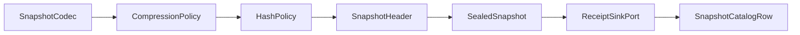

# [PERSISTENCE_SNAPSHOT_CODECS]

Rasm.Persistence encodes every durable payload through one three-row `SnapshotCodec` axis paired with the `CompressionPolicy` and `HashPolicy` axes, seals payloads under the snapshot header and atomic-write protocol, catalogs them with classification and retention columns, and projects restore and diff evidence; `PersistenceWireContext` is the package's one JsonSerializerContext partial joining the suite Strict merge. Codec, compression, and hash variance are delegate rows on string-keyed smart enums, the writer fold is the page's single entrypoint family over MessagePack, System.Text.Json source generation, LZ4 block framing, and System.IO.Hashing, and every stamp rides the AppHost clock, correlation, and receipt spine as settled vocabulary.

## [1]-[INDEX]

| [INDEX] | [CLUSTER]           | [OWNS]                                                                |
| :-----: | :------------------ | :-------------------------------------------------------------------- |
|   [1]   | CODEC_AXIS          | Three codec rows, package wire context, generated converter admission |
|   [2]   | COMPRESSION_HASHING | Compression rows, hash rows, framing routes and identity values       |
|   [3]   | SNAPSHOT_PROTOCOL   | Header law, atomic write fold, catalog row, orphan sweep              |
|   [4]   | RESTORE_AND_DIFF    | Verified read, restore receipt parity, content-addressed diff         |
|   [5]   | TS_PROJECTION       | Wire shapes and msgpack alignment the dashboard consumes              |

## [2]-[CODEC_AXIS]

- Owner: `SnapshotCodec` `[SmartEnum<string>]` under the `SnapshotKeyPolicy` ordinal accessor; `PersistenceWireContext` as the package wire context; `InstantFormatter` as the one primitive-mapped NodaTime formatter row; `WireSurface` as the wire-surface vocabulary carried per codec row as a frozen membership set.
- Cases: 3 codec rows — json-stj, messagepack, file-raw; 4 wire surfaces — snapshot, cache, sync, web.
- Entry: `public partial byte[] Serialize(Type shape, object? value)` — pure byte transform; shape-discriminated dispatch serves every registered wire record through source-generated metadata.
- Auto: registering `ThinktectureJsonConverterFactory` and `ThinktectureMessageFormatterResolver.Instance` once derives every value-object, smart-enum, and keyed-union converter and formatter — per-type hand-written codec classes are the deleted pattern; `GeoJsonConverterFactory` derives the GeoJSON projection of every NetTopologySuite geometry riding the STJ rail.
- Packages: MessagePack, MessagePackAnalyzer, Thinktecture.Runtime.Extensions, Thinktecture.Runtime.Extensions.Json, Thinktecture.Runtime.Extensions.MessagePack, NetTopologySuite.IO.GeoJSON4STJ, NodaTime, NodaTime.Serialization.SystemTextJson, BCL inbox.
- Growth: one codec is one row; a new wire record is one `[JsonSerializable]` row on `PersistenceWireContext` plus one MessagePack union tag row when polymorphic; an AOT resolver landmark is one `CompositeResolverAttribute`/`GeneratedMessagePackResolverAttribute` row that replaces the runtime `CompositeResolver.Create` chain with a generated resolver; zero new surface.
- Boundary: artifact-kind-to-codec residence is fixed at write — a second codec on one kind is a conflict, not a fallback; `GeoJsonConverterFactory` writes RFC-orientation polygon rings and reads through its SRID-4326 default `GeometryFactory`, so geometry wire records carry no per-call geometry policy; `ProjectJson` is diagnostic egress only and never a payload route; `Foreign` gates every payload arriving across a process boundary; large payloads stream rather than buffer — `SerializeAsync`/`DeserializeAsync` drive the whole-archive codec path and `MessagePackStreamReader` reads a length-delimited segment sequence so a multi-segment op-log or snapshot archive decodes one frame at a time, while `WriteArrayHeader`/`WriteMapHeader`/`ReadArrayHeader`/`ReadMapHeader` are the low-level shaping the streamed header law uses and never a per-record hand-format; `ContractlessStandardResolver` is the resolver-chain tail that admits an unattributed record only at the diagnostic egress, never on a wire surface; a custom extension typecode crosses through `ExtensionHeader`/`ExtensionResult` and stays absent on the wire so the TS ext-union is `never`; NodaTime JSON converters bind through `WithIsoIntervalConverter` and `WithIsoDateIntervalConverter` so an interval wire record carries the ISO form rather than the default range form; a `[Union]`/`[SmartEnum]` key parses inbound from the UTF-8 span through `ThinktectureSpanParsableJsonConverter` on the read path; MessagePack union tag rows are append-only and a retired tag never returns; a hand-written converter or formatter beside the generated ones is the named defect; MemoryPack, CBOR, and protobuf snapshot encodings stay rejected — proto owns RPC payloads only; the MessagePackBinary row is the value the cache serializer registration consumes.

```csharp signature
public sealed class SnapshotKeyPolicy : IEqualityComparerAccessor<string>, IComparerAccessor<string> {
    public static IEqualityComparer<string> EqualityComparer => StringComparer.Ordinal;

    public static IComparer<string> Comparer => StringComparer.Ordinal;
}

[SmartEnum<string>]
[KeyMemberEqualityComparer<SnapshotKeyPolicy, string>]
[KeyMemberComparer<SnapshotKeyPolicy, string>]
public sealed partial class WireSurface {
    public static readonly WireSurface Snapshot = new("snapshot");
    public static readonly WireSurface Cache = new("cache");
    public static readonly WireSurface Sync = new("sync");
    public static readonly WireSurface Web = new("web");
}

[JsonSourceGenerationOptions(
    PropertyNamingPolicy = JsonKnownNamingPolicy.CamelCase,
    UnmappedMemberHandling = JsonUnmappedMemberHandling.Disallow,
    RespectNullableAnnotations = true,
    RespectRequiredConstructorParameters = true)]
[JsonSerializable(typeof(SnapshotCatalogRow))]
[JsonSerializable(typeof(SealedSnapshot))]
[JsonSerializable(typeof(SnapshotDelta))]
[JsonSerializable(typeof(RestoreReceipt))]
[JsonSerializable(typeof(CacheIndexFact))]
public partial class PersistenceWireContext : JsonSerializerContext;

public sealed class InstantFormatter : IMessagePackFormatter<Instant> {
    public static readonly InstantFormatter Instance = new();

    public void Serialize(ref MessagePackWriter writer, Instant value, MessagePackSerializerOptions options) =>
        writer.Write(value.ToUnixTimeTicks());

    public Instant Deserialize(ref MessagePackReader reader, MessagePackSerializerOptions options) =>
        Instant.FromUnixTimeTicks(reader.ReadInt64());
}

[SmartEnum<string>]
[KeyMemberEqualityComparer<SnapshotKeyPolicy, string>]
[KeyMemberComparer<SnapshotKeyPolicy, string>]
public sealed partial class SnapshotCodec {
    public static readonly SnapshotCodec JsonStj = new(
        "json-stj", headerId: 1, version: 1, membership: new[] { WireSurface.Snapshot, WireSurface.Web }.ToFrozenSet(),
        serialize: static (shape, value) => JsonSerializer.SerializeToUtf8Bytes(value, shape, SnapshotJson),
        deserialize: static (shape, payload) => JsonSerializer.Deserialize(payload.Span, shape, SnapshotJson),
        projectJson: static payload => Encoding.UTF8.GetString(payload.Span));
    public static readonly SnapshotCodec MessagePackBinary = new(
        "messagepack", headerId: 2, version: 1,
        membership: new[] { WireSurface.Snapshot, WireSurface.Cache, WireSurface.Sync, WireSurface.Web }.ToFrozenSet(),
        serialize: static (shape, value) => MessagePackSerializer.Serialize(shape, value, Binary),
        deserialize: static (shape, payload) => MessagePackSerializer.Deserialize(shape, payload, Binary),
        projectJson: static payload => MessagePackSerializer.ConvertToJson(payload, Binary));
    public static readonly SnapshotCodec FileRaw = new(
        "file-raw", headerId: 3, version: 1, membership: new[] { WireSurface.Snapshot }.ToFrozenSet(),
        serialize: static (_, value) => (byte[])value!,
        deserialize: static (_, payload) => payload.ToArray(),
        projectJson: static payload => $"{{\"opaqueLength\":{payload.Length}}}");

    public int HeaderId { get; }
    public int Version { get; }
    public FrozenSet<WireSurface> Membership { get; }
    [UseDelegateFromConstructor]
    public partial byte[] Serialize(Type shape, object? value);
    [UseDelegateFromConstructor]
    public partial object? Deserialize(Type shape, ReadOnlyMemory<byte> payload);
    [UseDelegateFromConstructor]
    public partial string ProjectJson(ReadOnlyMemory<byte> payload);
    public static readonly JsonSerializerOptions SnapshotJson =
        new JsonSerializerOptions(JsonSerializerOptions.Strict) {
            PropertyNamingPolicy = JsonNamingPolicy.CamelCase,
            TypeInfoResolver = PersistenceWireContext.Default,
            Converters = { new ThinktectureJsonConverterFactory(), new GeoJsonConverterFactory() },
        }.ConfigureForNodaTime(DateTimeZoneProviders.Tzdb);
    public static readonly MessagePackSerializerOptions Binary =
        MessagePackSerializerOptions.Standard
            .WithResolver(CompositeResolver.Create(
                [InstantFormatter.Instance],
                [ThinktectureMessageFormatterResolver.Instance, SourceGeneratedFormatterResolver.Instance, StandardResolver.Instance]))
            .WithCompression(MessagePackCompression.Lz4BlockArray);
    public static readonly MessagePackSerializerOptions Foreign =
        Binary.WithSecurity(MessagePackSecurity.UntrustedData);
}
```

## [3]-[COMPRESSION_HASHING]

- Owner: `CompressionPolicy` and `HashPolicy` `[SmartEnum<string>]` row families under the `SnapshotKeyPolicy` ordinal accessor.
- Cases: 3 compression rows — none, lz4-fast, lz4-high; 5 hash rows — Content, Identity, Frame, Wide, FrameWide.
- Entry: `public partial byte[] Pack(ReadOnlyMemory<byte> payload)` — pure byte transform; the row delegate is total over any payload size.
- Packages: K4os.Compression.LZ4, MessagePack, System.IO.Hashing, Thinktecture.Runtime.Extensions, BCL inbox.
- Growth: one compression level or hash algorithm is one row; a Zstandard level lands as one `CompressionPolicy` delegate row carrying its own `HeaderId` so the snapshot header's `CompressionId` keeps every prior LZ4 archive readable across the swap; zero new surface.
- Boundary: every hash row is non-cryptographic identity — a security or tamper claim on any row is the named defect; compression evidence never obscures redaction or retention receipts; the MessagePackBinary codec pairs with the none row at write because Lz4BlockArray owns compression in-codec — double framing is the deleted pattern; the Frame row belongs to artifact frame checks and never stands in for Identity; `Content` and `Wide` are not one parameterized row because `Content` pins `XxHash3` as the content-address algorithm every snapshot identity, diff, and dedup surface computes, so its algorithm cannot vary, while `Wide` is `XxHash64` for a wide artifact-catalog index whose collision domain stays statistically independent of the content address without the 128-bit cost of Identity; the `FrameWide` row is `Crc64` for whole-archive frame integrity where `Frame`'s 32-bit check is too narrow — every row folds once into the `Bits`/`HexFormat` columns so a tag width is data, never a per-call format string.

```csharp signature
[SmartEnum<string>]
[KeyMemberEqualityComparer<SnapshotKeyPolicy, string>]
[KeyMemberComparer<SnapshotKeyPolicy, string>]
public sealed partial class CompressionPolicy {
    public static readonly CompressionPolicy None = new(
        "none", headerId: 0,
        pack: static payload => payload.ToArray(),
        unpack: static framed => framed.ToArray());
    public static readonly CompressionPolicy Lz4Fast = new(
        "lz4-fast", headerId: 1,
        pack: static payload => LZ4Pickler.Pickle(payload.Span, LZ4Level.L00_FAST),
        unpack: static framed => LZ4Pickler.Unpickle(framed.Span));
    public static readonly CompressionPolicy Lz4High = new(
        "lz4-high", headerId: 2,
        pack: static payload => LZ4Pickler.Pickle(payload.Span, LZ4Level.L09_HC),
        unpack: static framed => LZ4Pickler.Unpickle(framed.Span));

    public int HeaderId { get; }
    [UseDelegateFromConstructor]
    public partial byte[] Pack(ReadOnlyMemory<byte> payload);
    [UseDelegateFromConstructor]
    public partial byte[] Unpack(ReadOnlyMemory<byte> framed);
}

[SmartEnum<string>]
[KeyMemberEqualityComparer<SnapshotKeyPolicy, string>]
[KeyMemberComparer<SnapshotKeyPolicy, string>]
public sealed partial class HashPolicy {
    public static readonly HashPolicy Content = new("xxhash3", bits: 64, hexFormat: "x16", compute: static payload => XxHash3.HashToUInt64(payload.Span));
    public static readonly HashPolicy Identity = new("xxhash128", bits: 128, hexFormat: "x32", compute: static payload => XxHash128.HashToUInt128(payload.Span));
    public static readonly HashPolicy Frame = new("crc32", bits: 32, hexFormat: "x8", compute: static payload => Crc32.HashToUInt32(payload.Span));
    public static readonly HashPolicy Wide = new("xxhash64", bits: 64, hexFormat: "x16", compute: static payload => XxHash64.HashToUInt64(payload.Span));
    public static readonly HashPolicy FrameWide = new("crc64", bits: 64, hexFormat: "x16", compute: static payload => Crc64.HashToUInt64(payload.Span));

    public int Bits { get; }
    public string HexFormat { get; }
    [UseDelegateFromConstructor]
    public partial UInt128 Compute(ReadOnlyMemory<byte> payload);

    public string Tag(ReadOnlyMemory<byte> payload) =>
        Compute(payload).ToString(HexFormat, CultureInfo.InvariantCulture);
}
```

| [INDEX] | [ROUTE]          | [PAYLOAD_CLASS]              | [MECHANISM]                                                   | [VALUE]                                                                |
| :-----: | :--------------- | :--------------------------- | :------------------------------------------------------------ | :--------------------------------------------------------------------- |
|   [1]   | in-codec         | MessagePackBinary payloads   | `MessagePackCompression.Lz4BlockArray` blocks                 | `CompressionMinLength` provider default 64 bytes                       |
|   [2]   | standalone frame | JsonStj and FileRaw payloads | `LZ4Pickler` self-describing frame                            | level from the selected row                                            |
|   [3]   | streaming frame  | payloads above 1 MiB         | `LZ4Encoder`/`LZ4ChainDecoder` `Topup`/`Drain` chained blocks | `SuggestedContiguousMemorySize` 1 MiB segmenting, no contiguous buffer |
|   [4]   | raw block        | fixed known-length spans     | `LZ4Codec.Encode`/`Decode` into a caller buffer               | `LZ4Codec.MaximumOutputSize` bounds the destination                    |

## [4]-[SNAPSHOT_PROTOCOL]

- Owner: `SnapshotHeader`, `SealedSnapshot`, `SnapshotCatalogRow`, `Snapshots` — the header law, the atomic write fold, and the orphan sweep.
- Entry: `public static IO<SnapshotCatalogRow> Write<T>(ReceiptSinkPort sink, CorrelationId correlation, string directory, string kind, SnapshotCodec codec, CompressionPolicy compression, ulong schemaFingerprint, DataClassification classification, string retentionClass, T value, Func<SnapshotCatalogRow, IO<Unit>> persist)` — `IO` carries the file-system and sink effects; one call encodes, packs, hashes, seals, stamps, and persists.
- Auto: the write fold derives codec id, compression id, schema fingerprint, identity hash, HLC stamp, classification, and retention class into the catalog row — per-call-site assembly ceremony is the deleted pattern; the schema fingerprint value arrives from the compiled-model fingerprint law and the row identity from the UuidV7Key identity row; the sealed `Hash` is the content address every secondary surface derives from, so a sealed snapshot is automatically catalog-addressable on the artifact-blob index without a parallel key — `ContentAddress` selects the cache tag, the blob lookup, and the diff identity from one value.
- Receipt: `SnapshotCatalogRow` is the durable evidence; the `SealedSnapshot` payload rides the receipt envelope at the sink edge, so the catalog HLC stamp and the receipt stamp are one value.
- Packages: System.IO.Hashing, NodaTime, LanguageExt.Core, BCL inbox.
- Growth: a new header capability is one flag bit row on `Flags`; one artifact kind is one catalog row value; zero new surface.
- Boundary: `Seal` and the sweep deletion kernel are this fence's boundary capsules — language-owned statement forms stay inside those two bodies; `directory` arrives from the placement law and is never derived here; the durability order is settled — `Flush(flushToDisk: true)` forces the data blocks before `File.Move` performs the atomic rename, so a crash between the two leaves the temp file swept rather than a torn final; temp residue and catalog-orphaned payloads leave only through `Sweep`; catalog insertion enters through the `persist` delegate so the store rail stays the single write path; `ContentAddress` parses the sealed `Hash` so the cache, blob, and diff surfaces share one content key and never mint parallel identities; the magic constant spells RSNP in little-endian byte order.

```csharp signature
public readonly record struct SnapshotHeader(
    uint Magic, int CodecId, int CodecVersion, ulong SchemaFingerprint, int CompressionId, uint Flags)
{
    public const int Size = 28;

    public const uint MagicValue = 0x504E5352;

    public static Fin<SnapshotHeader> Parse(ReadOnlySpan<byte> prefix) =>
        prefix.Length < Size ? Fin.Fail<SnapshotHeader>(Error.New("<snapshot-header-truncated>"))
        : BinaryPrimitives.ReadUInt32LittleEndian(prefix) != MagicValue ? Fin.Fail<SnapshotHeader>(Error.New("<snapshot-magic-mismatch>"))
        : Fin.Succ(new SnapshotHeader(
            BinaryPrimitives.ReadUInt32LittleEndian(prefix),
            BinaryPrimitives.ReadInt32LittleEndian(prefix[4..]),
            BinaryPrimitives.ReadInt32LittleEndian(prefix[8..]),
            BinaryPrimitives.ReadUInt64LittleEndian(prefix[12..]),
            BinaryPrimitives.ReadInt32LittleEndian(prefix[20..]),
            BinaryPrimitives.ReadUInt32LittleEndian(prefix[24..])));

    public void Write(Span<byte> destination) {
        BinaryPrimitives.WriteUInt32LittleEndian(destination, Magic);
        BinaryPrimitives.WriteInt32LittleEndian(destination[4..], CodecId);
        BinaryPrimitives.WriteInt32LittleEndian(destination[8..], CodecVersion);
        BinaryPrimitives.WriteUInt64LittleEndian(destination[12..], SchemaFingerprint);
        BinaryPrimitives.WriteInt32LittleEndian(destination[20..], CompressionId);
        BinaryPrimitives.WriteUInt32LittleEndian(destination[24..], Flags);
    }
}

public readonly record struct SealedSnapshot(Guid Id, string Path, string Hash, long Length);

public sealed record SnapshotCatalogRow(
    Guid Id,
    string Kind,
    SnapshotCodec Codec,
    CompressionPolicy Compression,
    string Hash,
    long Length,
    Instant WrittenAt,
    string RetentionClass,
    DataClassification Classification,
    Instant HlcPhysical,
    ulong HlcLogical,
    CorrelationId Correlation);

public static class Snapshots {
    public const string Suffix = ".rsnp";

    public static UInt128 ContentAddress(SnapshotCatalogRow row) =>
        UInt128.Parse(row.Hash, NumberStyles.HexNumber, CultureInfo.InvariantCulture);

    public static IO<SnapshotCatalogRow> Write<T>(
        ReceiptSinkPort sink,
        CorrelationId correlation,
        string directory,
        string kind,
        SnapshotCodec codec,
        CompressionPolicy compression,
        ulong schemaFingerprint,
        DataClassification classification,
        string retentionClass,
        T value,
        Func<SnapshotCatalogRow, IO<Unit>> persist) =>
        IO.lift(() => Seal(directory, Guid.CreateVersion7(), codec, compression, schemaFingerprint, codec.Serialize(typeof(T), value)))
            .Bind(file => sink
                .Send(correlation, "Rasm.Persistence", kind, JsonSerializer.SerializeToElement(file, SnapshotCodec.SnapshotJson))
                .Map(envelope => new SnapshotCatalogRow(
                    file.Id, kind, codec, compression, file.Hash, file.Length,
                    envelope.Physical, retentionClass, classification,
                    envelope.Physical, envelope.Logical, correlation)))
            .Bind(row => persist(row).Map(_ => row));

    public static IO<Seq<string>> Sweep(string directory, Seq<SnapshotCatalogRow> catalog) =>
        IO.lift(() => toSeq(Directory.EnumerateFiles(directory))
                .Filter(file => !catalog.Exists(row => string.Equals(Path.GetFileName(file), $"{row.Id}{Suffix}", StringComparison.Ordinal))))
            .Bind(static orphans => orphans
                .TraverseM(static file => IO.lift(() => { File.Delete(file); return file; }))
                .As());

    private static SealedSnapshot Seal(
        string directory, Guid id, SnapshotCodec codec, CompressionPolicy compression, ulong schemaFingerprint, byte[] encoded) {
        var packed = compression.Pack(encoded);
        var header = new SnapshotHeader(SnapshotHeader.MagicValue, codec.HeaderId, codec.Version, schemaFingerprint, compression.HeaderId, 0u);
        Span<byte> prefix = stackalloc byte[SnapshotHeader.Size];
        header.Write(prefix);
        var final = Path.Combine(directory, $"{id}{Suffix}");
        var temp = $"{final}.tmp";
        using (var stream = new FileStream(temp, FileMode.CreateNew, FileAccess.Write, FileShare.None)) {
            stream.Write(prefix);
            stream.Write(packed);
            stream.Flush(flushToDisk: true);
        }
        File.Move(temp, final, overwrite: false);
        return new SealedSnapshot(id, final, HashPolicy.Identity.Tag(packed), prefix.Length + packed.LongLength);
    }
}
```



## [5]-[RESTORE_AND_DIFF]

- Owner: `RestoreReceipt`, `SnapshotDelta`, `SnapshotRestoreOps` — verified read, restore hand-off parity, and content-addressed diff projection.
- Entry: `public IO<Fin<RestoreReceipt>> Restore(ClockPolicy clocks, CorrelationId correlation, string path, StoreProfile target, Func<string, IO<Fin<Unit>>> repair)` — `Fin` aborts on integrity rejection; `IO` carries the read and hand-off effects.
- Receipt: `RestoreReceipt` carries source id, verified hash, target profile, elapsed `Duration`, and `Instant` stamp — typed restore evidence, never a generic receipt shape.
- Packages: LanguageExt.Core, NodaTime, BCL inbox.
- Growth: a new delta classification is one field row on `SnapshotDelta`; zero new surface.
- Boundary: repair mechanics live with the store lifecycle owner and enter through the `repair` delegate — this cluster owns receipt parity only; a forward-incompatible header, codec mismatch, fingerprint mismatch, or hash mismatch is a typed rejection, never a best-effort decode; diff identity is the content hash and object equality never enters the fold.

```csharp signature
public sealed record RestoreReceipt(
    Guid Source, string VerifiedHash, StoreProfile Target, Duration Elapsed, Instant At, CorrelationId Correlation);

public sealed record SnapshotDelta(
    ImmutableArray<string> Added, ImmutableArray<string> Removed, ImmutableArray<string> Changed);

public static class SnapshotRestoreOps {
    public static HashMap<string, string> Index(Seq<SnapshotCatalogRow> rows) =>
        toHashMap(rows.Map(static row => (row.Kind, row.Hash)));

    public static SnapshotDelta Diff(HashMap<string, string> source, HashMap<string, string> target) =>
        new(
            Added: [.. target.Keys.Where(kind => !source.ContainsKey(kind))],
            Removed: [.. source.Keys.Where(kind => !target.ContainsKey(kind))],
            Changed: [.. target.Keys.Where(kind => source.Find(kind).Map(hash => hash != target[kind]).IfNone(false))]);

    extension(SnapshotCatalogRow row) {
        public IO<Fin<T>> Read<T>(string path, ulong schemaFingerprint) =>
            IO.lift(() => File.ReadAllBytes(path)).Map(bytes =>
                SnapshotHeader.Parse(bytes.AsSpan(0, SnapshotHeader.Size)).Bind(header =>
                    header.CodecId != row.Codec.HeaderId ? Fin.Fail<T>(Error.New("<snapshot-codec-mismatch>"))
                    : header.CodecVersion > row.Codec.Version ? Fin.Fail<T>(Error.New("<snapshot-version-unsupported>"))
                    : header.SchemaFingerprint != schemaFingerprint ? Fin.Fail<T>(Error.New("<snapshot-fingerprint-mismatch>"))
                    : HashPolicy.Identity.Tag(bytes.AsMemory(SnapshotHeader.Size)) != row.Hash ? Fin.Fail<T>(Error.New("<snapshot-hash-mismatch>"))
                    : Fin.Succ((T)row.Codec.Deserialize(typeof(T), row.Compression.Unpack(bytes.AsMemory(SnapshotHeader.Size)))!)));

        public IO<Fin<RestoreReceipt>> Restore(
            ClockPolicy clocks, CorrelationId correlation, string path, StoreProfile target, Func<string, IO<Fin<Unit>>> repair) =>
            IO.lift(clocks.Mark).Bind(mark =>
                IO.lift(() => File.ReadAllBytes(path)).Bind(bytes =>
                    HashPolicy.Identity.Tag(bytes.AsMemory(SnapshotHeader.Size)) != row.Hash
                        ? IO<Fin<RestoreReceipt>>.Pure(Fin.Fail<RestoreReceipt>(Error.New("<snapshot-hash-mismatch>")))
                        : repair(path).Map(outcome => outcome.Map(_ =>
                            new RestoreReceipt(row.Id, row.Hash, target, clocks.Elapsed(mark), clocks.Now, correlation)))));
    }
}
```

## [6]-[TS_PROJECTION]

- Owner: `SnapshotCodecKey`, `SnapshotCompressionKey`, `DataClassificationKey`, `SnapshotHeaderWire`, `SnapshotCatalogRowWire`, `SnapshotDeltaWire`, `RestoreReceiptWire`, `SnapshotDecodeOptions`, `SnapshotExtensionRows` — the page's wire transcription.
- Packages: BCL inbox.
- Growth: a custom extension byte lands as one `SnapshotExtensionRows` row paired with one TS ExtensionCodec registration row; zero new surface.
- Boundary: every codec shape crosses primitive-mapped, so the extension union is `never`; `useBigInt64` aligns 64-bit integers with bigint and `schemaFingerprint` reads through DataView getBigUint64 on the header prefix; instants cross as ISO-8601 strings and `elapsed` as the roundtrip-pattern string; `hlcLogical` resets on every physical advance and stays inside the JSON number envelope; smart-enum columns cross as their key scalars and `target` carries the store-profile key string.

```ts contract
type SnapshotCodecKey = "json-stj" | "messagepack" | "file-raw";

type SnapshotCompressionKey = "none" | "lz4-fast" | "lz4-high";

type DataClassificationKey = "none" | "operational" | "host-identity" | "user-content" | "personal" | "credential" | "secret";

interface SnapshotHeaderWire {
  readonly magic: number;
  readonly codecId: number;
  readonly codecVersion: number;
  readonly schemaFingerprint: bigint;
  readonly compressionId: number;
  readonly flags: number;
}

interface SnapshotCatalogRowWire {
  readonly id: string;
  readonly kind: string;
  readonly codec: SnapshotCodecKey;
  readonly compression: SnapshotCompressionKey;
  readonly hash: string;
  readonly length: number;
  readonly writtenAt: string;
  readonly retentionClass: string;
  readonly classification: DataClassificationKey;
  readonly hlcPhysical: string;
  readonly hlcLogical: number;
  readonly correlation: string;
}

interface SnapshotDeltaWire {
  readonly added: readonly string[];
  readonly removed: readonly string[];
  readonly changed: readonly string[];
}

interface RestoreReceiptWire {
  readonly source: string;
  readonly verifiedHash: string;
  readonly target: string;
  readonly elapsed: string;
  readonly at: string;
  readonly correlation: string;
}

interface SnapshotDecodeOptions {
  readonly useBigInt64: true;
}

type SnapshotExtensionRows = never;
```

## [7]-[RESEARCH]

- [RENAME_DURABILITY]: the data-flush-before-rename order is settled; the residual is directory-entry durability — whether APFS guarantees the rename's directory entry survives a power loss without an explicit parent-directory fsync, and the managed route to that fsync if it does not.
- [RESOLVER_PRECEDENCE]: `ThinktectureMessageFormatterResolver` coverage over keyed unions and complex value objects composed with `SourceGeneratedFormatterResolver` under Lz4BlockArray; the precedence of a `GeneratedMessagePackResolverAttribute`/`CompositeResolverAttribute` AOT resolver over the runtime `CompositeResolver.Create` chain; `GeoJsonConverterFactory` precedence over combined source-generated contract metadata for geometry-bearing wire records.
- [ZSTD_SWAP]: the inbox Zstandard stream surface a future TFM exposes — its managed `Pack`/`Unpack` shape and level vocabulary for the deferred `CompressionPolicy` row, gated on the framework move that admits it.
