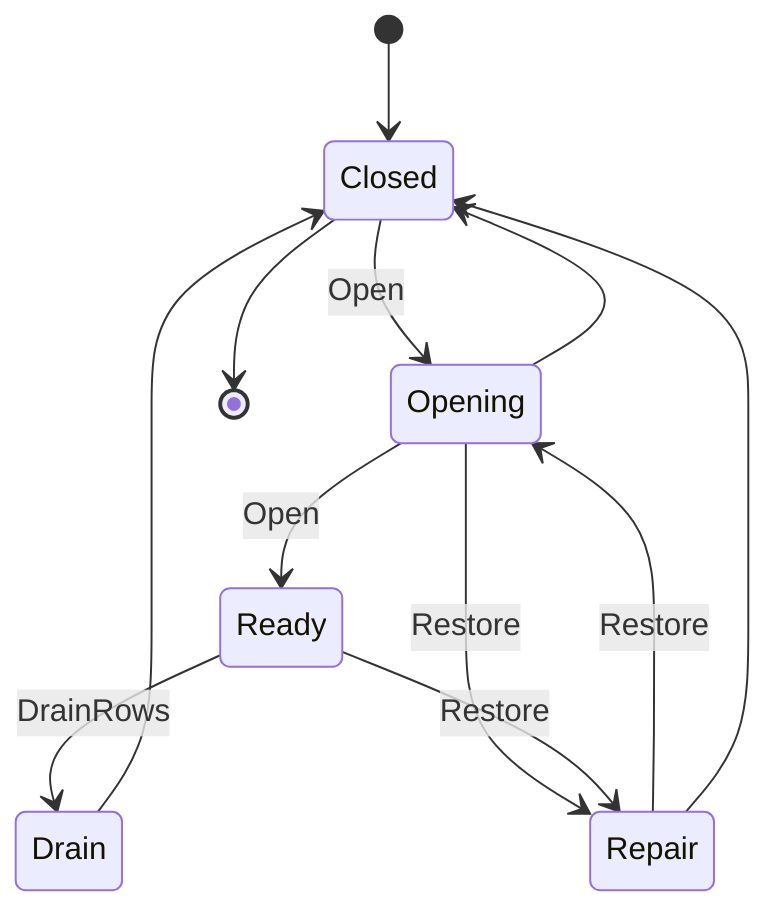

# [PERSISTENCE_STORE_PROFILES]

Rasm.Persistence anchors every durable store on one six-row `StoreProfile` axis: each string-keyed row is the widened record carrying capability columns, concurrency-token policy, retention default, the ordered open-proof set, and three delegate columns, while `StoreLifecycle` runs the five-row state machine whose open, restore, drain, and health folds mint typed receipts. The page owns the engine axis, the lifecycle and cross-process law, the placement fold over the resolved profile record, and the operator-provisioning manifest over Microsoft.Data.Sqlite, the EF Core providers, Npgsql, DuckDB.NET, Thinktecture vocabulary, LanguageExt rails, and NodaTime instants.

## [1]-[INDEX]

| [INDEX] | [CLUSTER]         | [OWNS]                                                              |
| :-----: | :---------------- | :------------------------------------------------------------------ |
|   [1]   | PROFILE_AXIS        | Six widened engine rows, delegate columns, the blob contract record |
|   [2]   | STORE_LIFECYCLE     | Five states, open and restore folds, drain rows, health row         |
|   [3]   | CROSS_PROCESS_LAW   | One lease shape, locality admission, epoch fencing                  |
|   [4]   | PLACEMENT_MATRIX    | Eight modality arms resolve placement from the resolved profile     |
|   [5]   | PROVISIONING_ROWS   | Operator manifest, verification fold, maintenance rows              |

## [2]-[PROFILE_AXIS]

- Owner: `StoreProfile` — one `[SmartEnum<string>]` engine axis under the `StoreKeyPolicy` ordinal accessor; the row IS the widened record: six capability columns, concurrency-token column, retention default, ordered open-proof set, and the connect, configure, and seed delegate columns; `BlobRemote` is the blob contract record fixed now; `StoreRows` carries the delegate targets.
- Cases: sqlite-embedded, sqlite-memory, postgres-server, file-snapshot, duckdb-analytical, blob-remote; the engine sweep stays closed — libSQL, PGlite, LiteDB, RavenDB.Embedded, Realm, hctree, and embedded-pg are rejected rows, EF InMemory is the rejected in-memory provider, and PostgreSQL is never spawned or bundled by a Rasm process.
- Entry: `public partial IO<DbConnection> Connect(StorePlacement placement)` — `IO` carries the provider open effect; rows without a connection surface fail inside the rail.
- Auto: the pg row pins `SetPostgresVersion(18, 0)` so uuidv7 and virtual-generated-column translations activate over the provider's 14.0 default dialect; the memory row rides Mode=Memory plus Cache=Shared with a token-gated keeper proof pinning the shared-cache lifetime; the seed delegate enters EF through the UseSeeding and UseAsyncSeeding option hooks at pooled-factory build.
- Packages: Microsoft.EntityFrameworkCore.Sqlite, Microsoft.Data.Sqlite, Npgsql, Npgsql.EntityFrameworkCore.PostgreSQL, Npgsql.EntityFrameworkCore.PostgreSQL.NodaTime, Pgvector.EntityFrameworkCore, Npgsql.EntityFrameworkCore.PostgreSQL.NetTopologySuite, DuckDB.NET.Data.Full, Thinktecture.Runtime.Extensions, LanguageExt.Core, NodaTime, Rasm.AppHost (project)
- Growth: one profile row — key, capability columns, three delegate bindings — absorbs a new engine with zero new surface; the sqlite vector gate flips one capability column; a mapped enum or composite is one `SchemaDdl.Enum` or `SchemaDdl.Composite` row folded by `MapEnums`/`MapComposites` into the pg connect builder; an unmapped-type admission is one `EnableUnmappedTypes` builder column on the pg row and a custom provider classification is one `INpgsqlTypeMapper` mapper column; an attach-only durable lane is one `SqliteOpenMode.ReadOnly` placement value on the embedded row; a daylight-transition stance is one `temporalResolution` policy value on the row; a cloud object-store provider is one `object-store#OBJECT_STORE` row projecting a `BlobRemote` placement with zero Persistence rework.
- Boundary: profile residence is single — placement consumes `ResolvedProfile` and `ProfileRoots.StoreRoot`, and Persistence owns no profile-keyed table and derives no per-user path; `FileSnapshot` implements the `BlobRemote` record over the snapshot catalog protocol and the `blob-remote` row's `BlobRemote` implementation set is the `object-store#OBJECT_STORE` provider rows, so the `connect: StoreRows.NoConnection` leg stays correct because object-store residence carries no `DbConnection`; the pg row's `SetPostgresVersion(18, 0)` is the provider feature-gate floor that activates uuidv7/VIRTUAL-generated-column/OLD-NEW-RETURNING translations, distinct from the PG18.4 deploy-image minimum the cluster-config provisioning rows carry; the database is excluded from the AppHost hop law — `EnableRetryOnFailure` on the pg row and busy-retry on the sqlite rows are the only database retry owners; dsn and store-root inputs are host-resolved values handed over by app roots; the data-source `UseNodaTime` and `UseNetTopologySuite` registrations are builder-preserving generic extensions while `UseVector` returns the erased mapper interface, so the vector registration binds by tuple-capture beside the typed builder and never re-types the chain; `EnableUnmappedTypes` opens the pg builder to enum-as-text and range round-trips without a per-type `MapEnum` row, and the `INpgsqlTypeMapper` handle the builder exposes is the one classification seam a custom provider type registers on, never a second mapper surface; a reader replica attaches the same embedded file through `SqliteOpenMode.ReadOnly`, so a read-only consumer never contends for the writer lease; the pg `temporalResolution` policy column carries the `Resolvers` strategy as a row value — `strict` maps a local timestamp through `AtStrictly` so a skipped or ambiguous local time rejects, `lenient` and `local` admit them through `AtLeniently` and `ResolveLocal` over a `ZoneLocalMapping` under one declared rule, and `none` rides the engine rows that persist instants only — so a daylight-transition timestamp resolves by policy value and never by an ad hoc catch, and the `MapEnums`/`MapComposites` builder folds register every `SchemaDdl.Enum` and `SchemaDdl.Composite` type so a native pg enum or composite column round-trips without a per-type hand-written reader.

```csharp signature
public sealed class StoreKeyPolicy : IEqualityComparerAccessor<string>, IComparerAccessor<string> {
    public static IEqualityComparer<string> EqualityComparer => StringComparer.Ordinal;

    public static IComparer<string> Comparer => StringComparer.Ordinal;
}

[SmartEnum<string>]
[KeyMemberEqualityComparer<StoreKeyPolicy, string>]
[KeyMemberComparer<StoreKeyPolicy, string>]
public sealed partial class StoreProfile {
    public static readonly StoreProfile SqliteEmbedded = new("sqlite-embedded", migrations: true, vector: false, fullText: true, blob: true, replication: false, returningOldNew: false, concurrencyToken: "version", localVolumeRequired: true, retentionDefault: "age-bound", temporalResolution: "none", openProofs: ["batteries", "pragma-ladder", "compile-options", "lease", "migrate", "fingerprint", "quick_check"], connect: StoreRows.Sqlite, configure: StoreRows.SqliteOptions, seed: StoreRows.SeedNone);
    public static readonly StoreProfile SqliteMemory = new("sqlite-memory", migrations: true, vector: false, fullText: true, blob: true, replication: false, returningOldNew: false, concurrencyToken: "version", localVolumeRequired: false, retentionDefault: "age-bound", temporalResolution: "none", openProofs: ["batteries", "keeper", "pragma-ladder", "migrate", "fingerprint"], connect: StoreRows.Sqlite, configure: StoreRows.SqliteOptions, seed: StoreRows.SeedOnCreate);
    public static readonly StoreProfile PostgresServer = new("postgres-server", migrations: true, vector: true, fullText: true, blob: true, replication: true, returningOldNew: true, concurrencyToken: "xmin", localVolumeRequired: false, retentionDefault: "age-bound", temporalResolution: "strict", openProofs: ["extensions", "settings", "type-resolution", "fingerprint"], connect: StoreRows.Postgres, configure: StoreRows.PostgresOptions, seed: StoreRows.SeedNone);
    public static readonly StoreProfile FileSnapshot = new("file-snapshot", migrations: false, vector: false, fullText: false, blob: true, replication: false, returningOldNew: false, concurrencyToken: "none", localVolumeRequired: false, retentionDefault: "count-bound", temporalResolution: "none", openProofs: ["catalog"], connect: StoreRows.NoConnection, configure: StoreRows.NoOptions, seed: StoreRows.SeedNone);
    public static readonly StoreProfile DuckDbAnalytical = new("duckdb-analytical", migrations: false, vector: false, fullText: false, blob: false, replication: false, returningOldNew: false, concurrencyToken: "none", localVolumeRequired: true, retentionDefault: "size-bound", temporalResolution: "none", openProofs: ["attach"], connect: StoreRows.DuckDb, configure: StoreRows.NoOptions, seed: StoreRows.SeedNone);
    public static readonly StoreProfile BlobRemote = new("blob-remote", migrations: false, vector: false, fullText: false, blob: true, replication: false, returningOldNew: false, concurrencyToken: "none", localVolumeRequired: false, retentionDefault: "size-bound", temporalResolution: "none", openProofs: ["stat"], connect: StoreRows.NoConnection, configure: StoreRows.NoOptions, seed: StoreRows.SeedNone);

    public bool Migrations { get; }
    public bool Vector { get; }
    public bool FullText { get; }
    public bool Blob { get; }
    public bool Replication { get; }
    public bool ReturningOldNew { get; }
    public string ConcurrencyToken { get; }
    public bool LocalVolumeRequired { get; }
    public string RetentionDefault { get; }
    public string TemporalResolution { get; }
    public Seq<string> OpenProofs { get; }

    [UseDelegateFromConstructor]
    public partial IO<DbConnection> Connect(StorePlacement placement);

    [UseDelegateFromConstructor]
    public partial DbContextOptionsBuilder Configure(DbContextOptionsBuilder options, StorePlacement placement);

    [UseDelegateFromConstructor]
    public partial Task Seed(DbContext context, bool created, CancellationToken token);
}

public static class StoreRows {
    const string StoreFile = "rasm.db";
    const string AnalyticsFile = "analytics.duckdb";
    const string SharedMemory = "rasm-memory";

    public static IO<DbConnection> Sqlite(StorePlacement placement) =>
        IO.lift(() => (DbConnection)new SqliteConnection(SqliteText(placement)));

    public static IO<DbConnection> Postgres(StorePlacement placement) =>
        placement.Dsn is { IsSome: true, Case: string dsn }
            ? IO.lift(() => new NpgsqlDataSourceBuilder(dsn).EnableDynamicJson().EnableUnmappedTypes().UseNodaTime().UseNetTopologySuite())
                .Map(static builder => SchemaDdl.MapEnums(SchemaDdl.MapComposites(builder)))
                .Map(static builder => (builder.UseVector(), builder).Item2)
                .Map(static builder => (DbConnection)builder.Build().OpenConnection())
            : IO.fail<DbConnection>(Error.New("<dsn-absent:postgres-server>"));

    public static IO<DbConnection> DuckDb(StorePlacement placement) =>
        placement.StoreRoot is { IsSome: true, Case: string root }
            ? IO.lift(() => (DbConnection)new DuckDBConnection($"Data Source={Path.Join(root, AnalyticsFile)}"))
            : IO.fail<DbConnection>(Error.New("<store-root-absent:duckdb-analytical>"));

    public static IO<DbConnection> NoConnection(StorePlacement placement) =>
        IO.fail<DbConnection>(Error.New($"<no-connection-surface:{placement.Durable.Key}>"));

    public static DbContextOptionsBuilder SqliteOptions(DbContextOptionsBuilder options, StorePlacement placement) =>
        options.UseSqlite(SqliteText(placement));

    public static DbContextOptionsBuilder PostgresOptions(DbContextOptionsBuilder options, StorePlacement placement) =>
        options.UseNpgsql(placement.Dsn.IfNone(string.Empty), static npgsql => npgsql
            .SetPostgresVersion(18, 0)
            .UseNodaTime()
            .UseVector()
            .UseNetTopologySuite()
            .EnableRetryOnFailure());

    public static DbContextOptionsBuilder NoOptions(DbContextOptionsBuilder options, StorePlacement placement) => options;

    public static Task SeedNone(DbContext context, bool created, CancellationToken token) => Task.CompletedTask;

    public static Task SeedOnCreate(DbContext context, bool created, CancellationToken token) =>
        created ? context.SaveChangesAsync(token) : Task.CompletedTask;

    static string SqliteText(StorePlacement placement) =>
        placement.StoreRoot is { IsSome: true, Case: string root }
            ? new SqliteConnectionStringBuilder { DataSource = Path.Join(root, StoreFile), Pooling = true, Mode = placement.ReadOnly ? SqliteOpenMode.ReadOnly : SqliteOpenMode.ReadWriteCreate }.ToString()
            : new SqliteConnectionStringBuilder { DataSource = SharedMemory, Mode = SqliteOpenMode.Memory, Cache = SqliteCacheMode.Shared }.ToString();
}

public sealed record BlobRemote(
    Func<BlobRemote.Descriptor, Stream, IO<BlobRemote.Descriptor>> Put,
    Func<UInt128, IO<Stream>> Get,
    Func<UInt128, IO<Option<BlobRemote.Descriptor>>> Stat,
    Func<UInt128, IO<Unit>> Delete,
    Func<IO<Seq<BlobRemote.Descriptor>>> List) {
    public sealed record Descriptor(
        UInt128 ContentKey,
        long Length,
        DataClassification Classification,
        string RetentionClass,
        string CodecId,
        string CompressionId,
        Instant Physical,
        ulong Logical);
}
```

## [3]-[STORE_LIFECYCLE]

- Owner: `StoreLifecycle` — five string-keyed rows with the total `Legal` transition law; `StoreOpenReceipt` is the typed open evidence; `StoreCeremony` is the open, restore, drain-registration, and health fold surface over one Atom-backed cell.
- Cases: closed, opening, ready, drain, repair; legal transitions: closed to opening; opening to ready, repair, or closed; ready to drain or repair; drain to closed; repair to opening or closed.
- Entry: `public static IO<StoreOpenReceipt> Open(StoreProfile row, StorePlacement placement, Atom<(StoreLifecycle State, Option<StoreOpenReceipt> Latest)> cell, Func<DbConnection, IO<StoreOpenReceipt>> prove, ClockPolicy clocks)` — `IO` carries the bracketed ceremony; ready is unreachable without a green receipt.
- Auto: the prove delegate runs the row's open-proof order — token-gated Batteries_V2 init once per process, PRAGMA ladder, writer-lease and first-opener gate, `MigrateAsync` (the migration lock is provider-internal on both providers — lock outcome reads from migration receipts, never from Internal-namespace types), compiled-model fingerprint gate consuming the XxHash3 value as `ulong`, quick_check before ready; `Restore` fences every sharing writer, hash-verifies the staged payload, materializes to a temp file, integrity-checks, atomically renames while deleting the -wal and -shm sidecars, bumps the writer-lease epoch, and reopens through `Open`.
- Receipt: `StoreOpenReceipt` — profile, provider route, schema fingerprint, migrations applied, pragmas applied, ordered proof facts, integrity result, lock holder, elapsed `Duration`, `Instant`, `CorrelationId`; step facts ride the receipt-sink envelope under the store-open, store-restore, and store-drain kinds; `LockHolderPid` fills from the `StoreLeaseRow` first-opener row because the provider's public migration-lock handle carries no holder identity.
- Packages: SQLitePCLRaw.bundle_e_sqlite3, Microsoft.EntityFrameworkCore.Sqlite, Microsoft.Extensions.Diagnostics.HealthChecks, Thinktecture.Runtime.Extensions, LanguageExt.Core, NodaTime, Rasm.AppHost (project)
- Growth: one lifecycle row plus its `Legal` arms, or one proof kind appended to a row's open-proof order; zero new surface.
- Boundary: `StoreCeremony` is the named boundary capsule for the statement carve-out — the CAS transition body carries language-owned statement forms while every other member stays expression-shaped; drain registration is the band-300 row set in checkpoint, optimize, sweep, backup, close order — ranks are the page's frozen order rows inside the AppHost Stores band, and store writes foreclose at the Telemetry band; the health row grades the lifecycle cell plus the latest receipt, with cadence one policy value derived from the health-probe deadline row at composition.

```csharp signature
[SmartEnum<string>]
[KeyMemberEqualityComparer<StoreKeyPolicy, string>]
[KeyMemberComparer<StoreKeyPolicy, string>]
public sealed partial class StoreLifecycle {
    public static readonly StoreLifecycle Closed = new("closed");
    public static readonly StoreLifecycle Opening = new("opening");
    public static readonly StoreLifecycle Ready = new("ready");
    public static readonly StoreLifecycle Drain = new("drain");
    public static readonly StoreLifecycle Repair = new("repair");

    public static bool Legal(StoreLifecycle from, StoreLifecycle to) =>
        from.Switch(
            state: to,
            closed: static target => target == Opening,
            opening: static target => target == Ready || target == Repair || target == Closed,
            ready: static target => target == Drain || target == Repair,
            drain: static target => target == Closed,
            repair: static target => target == Opening || target == Closed);
}

public readonly record struct StoreOpenReceipt(
    StoreProfile Profile,
    string ProviderRoute,
    ulong SchemaFingerprint,
    int MigrationsApplied,
    int PragmasApplied,
    Seq<(string Kind, string Fact)> Proofs,
    string IntegrityResult,
    Option<int> LockHolderPid,
    Duration Elapsed,
    Instant At,
    CorrelationId Correlation);

public static class StoreCeremony {
    public static readonly Seq<(string Name, int Rank)> DrainOrder = [
        ("store-checkpoint", 310),
        ("store-optimize", 320),
        ("store-sweep", 330),
        ("store-backup", 340),
        ("store-close", 350),
    ];

    public static Fin<StoreLifecycle> Transition(Atom<(StoreLifecycle State, Option<StoreOpenReceipt> Latest)> cell, StoreLifecycle target, Option<StoreOpenReceipt> receipt = default) {
        var admitted = false;
        var settled = cell.SwapMaybe(prior => {
            var legal = StoreLifecycle.Legal(prior.State, target);
            admitted = legal;
            return legal ? Some((target, receipt.IsSome ? receipt : prior.Latest)) : None;
        });
        return admitted
            ? Fin.Succ(settled.State)
            : Fin.Fail<StoreLifecycle>(Error.New($"<store-transition-rejected:{settled.State.Key}:{target.Key}>"));
    }

    public static IO<StoreOpenReceipt> Open(StoreProfile row, StorePlacement placement, Atom<(StoreLifecycle State, Option<StoreOpenReceipt> Latest)> cell, Func<DbConnection, IO<StoreOpenReceipt>> prove, ClockPolicy clocks) =>
        from mark in IO.lift(clocks.Mark)
        from gate in IO.lift(() => Transition(cell, StoreLifecycle.Opening))
        from proven in row.Connect(placement).Bracket(
            Use: prove,
            Fin: static connection => IO.lift(fun(connection.Dispose)))
        let receipt = proven with { Elapsed = clocks.Elapsed(mark), At = clocks.Now }
        from ready in IO.lift(() => Transition(cell, StoreLifecycle.Ready, Some(receipt)))
        select receipt;

    public static IO<StoreOpenReceipt> Restore(StoreProfile row, StorePlacement placement, Atom<(StoreLifecycle State, Option<StoreOpenReceipt> Latest)> cell, Func<IO<Unit>> fenceWriters, Func<IO<string>> materialize, Func<string, IO<string>> check, Func<string, IO<Unit>> swap, Func<DbConnection, IO<StoreOpenReceipt>> prove, ClockPolicy clocks) =>
        from repair in IO.lift(() => Transition(cell, StoreLifecycle.Repair))
        from fenced in fenceWriters()
        from staged in materialize()
        from integrity in check(staged)
        from swapped in swap(staged)
        from reopened in Open(row, placement, cell, prove, clocks)
        select reopened;

    public static Seq<DrainParticipantPort> DrainRows(Func<string, CancellationToken, IO<Unit>> flush) =>
        DrainOrder.Map(row => new DrainParticipantPort(row.Name, DrainBand.Stores, row.Rank, token => flush(row.Name, token)));

    public static HealthContributorPort Health(Func<(StoreLifecycle State, Option<StoreOpenReceipt> Latest)> read, Duration cadence) =>
        new(
            Package: "Rasm.Persistence",
            Rows: [
                new HealthContributorRow(
                    Name: "store-lifecycle",
                    Probe: _ => ValueTask.FromResult(Graded(read())),
                    FailureStatus: HealthStatus.Degraded,
                    Tags: HealthContributorRow.TagSet(HealthContributorRow.Store),
                    Timeout: DeadlineClass.HealthProbe,
                    Delay: cadence,
                    Period: cadence),
            ]);

    static HealthCheckResult Graded((StoreLifecycle State, Option<StoreOpenReceipt> Latest) cell) =>
        cell.State.Switch(
            state: cell.Latest,
            closed: static _ => HealthCheckResult.Unhealthy("store closed"),
            opening: static _ => HealthCheckResult.Degraded("store opening"),
            ready: static latest => HealthCheckResult.Healthy(latest.Map(static open => open.IntegrityResult).IfNone("ok")),
            drain: static _ => HealthCheckResult.Degraded("store draining"),
            repair: static _ => HealthCheckResult.Unhealthy("store repair"));
}
```



## [4]-[CROSS_PROCESS_LAW]

- Owner: `StoreLeaseRow` — one persisted lease shape with two kind rows; `StoreLocality` — the filesystem-locality admission guard.
- Cases: writer and maintenance lease kinds; the lease table creation is pinned to the first migration so every sharing process reads one coordination surface, and the unique `(store, kind)` constraint makes the `Claim` conflict the first-open arbiter.
- Entry: `public static IO<StorePlacement> Admit(StorePlacement placement)` — `IO` carries the volume probe and aborts a WAL placement on a non-local volume with typed evidence.
- Auto: WAL plus busy-retry plus first-opener-migrates govern every shared sqlite file; the first-open race resolves through `Claim` — a candidate writes its `StoreLeaseRow` Writer row inside one `INSERT ... ON CONFLICT(Store, Kind) DO NOTHING` so exactly one process wins the writer row, the loser folds to a reader attach under `SqliteOpenMode.ReadOnly` and reads the winner's applied migrations rather than re-running `MigrateAsync`, and the won row's `Epoch` seeds every writer handle so a later `Fence` invalidates stale handles; maintenance work runs only while the registering process holds the maintenance lease scheduled as the AppHost persistence-maintenance entry; handoff-on-drain releases on the conductor's Stores-band row while crash-reclaim waits the `LeasePolicy.Maintenance` CrashStaleness past the holder's last `Heartbeat` stamp; `Restore` calls `Fence` so the epoch bump invalidates every stale writer handle; cross-process tag invalidation is a consequence — peer processes replay entity-kind tag transitions from the op-log HLC cursor on schedule cadence.
- Packages: LanguageExt.Core, NodaTime, Rasm.AppHost (project), BCL inbox
- Growth: one lease kind row or one remote-home marker row; zero new surface.
- Boundary: `LeasePolicy` is the only lease policy shape — this row is its persisted projection, never a second policy record; rejection evidence converts once into the package fault union at the query rail; storeEpoch surfaces in the discovery manifest as the settled AppHost field, sourced from the writer lease row's `Epoch`; `ClaimSql` is the one declared identifier seam for the `store_lease` table and its `(store, kind, holder_pid, stamp, epoch)` columns — the first migration pins those identifiers and `ClaimSql` is the single place the program restates them, so every other lease read derives from `StoreLeaseRow` members and never from a second copy of the literal. Exemption: `ClaimSql` is the SYMBOLIC_REFERENCE carve-out for the atomic first-open arbiter — the `INSERT ... ON CONFLICT(store, kind) DO NOTHING RETURNING` race cannot route through the EF set-based write path because the conflict arbitration must execute as one provider statement before any `DbContext` exists, so the literal is owned by, and only consumed inside, the native-sqlite open-ceremony bracket seam that runs `Claim` on the raw `SqliteCommand`; the `store_lease` table that pins the same identifiers is the first migration's `EnsureCreated` artifact, making this the sole write path and not a second DML owner.

```csharp signature
public sealed record StoreLeaseRow(string Store, string Kind, int HolderPid, Instant Stamp, ulong Epoch) {
    public const string Writer = "writer";
    public const string Maintenance = "maintenance";

    public const string ClaimSql = "INSERT INTO store_lease (store, kind, holder_pid, stamp, epoch) VALUES ($store, $kind, $pid, $stamp, 0) ON CONFLICT (store, kind) DO NOTHING RETURNING holder_pid";

    public bool Reclaimable(LeasePolicy policy, Instant now) => now - Stamp > policy.CrashStaleness;

    public StoreLeaseRow Heartbeat(Instant now) => this with { Stamp = now };

    public StoreLeaseRow Handoff(int successor, Instant now) => this with { HolderPid = successor, Stamp = now };

    public StoreLeaseRow Fence(Instant now) => this with { Stamp = now, Epoch = Epoch + 1UL };

    public static Fin<StoreLeaseRow> Claim(StoreLeaseRow candidate, Option<int> winnerPid) =>
        winnerPid is { IsSome: true, Case: int pid } && pid == candidate.HolderPid
            ? Fin.Succ(candidate)
            : Fin.Fail<StoreLeaseRow>(Error.New($"<writer-lease-held:{candidate.Store}>"));
}

public static class StoreLocality {
    static readonly SearchValues<string> RemoteHomeMarkers = SearchValues.Create(["Library/Mobile Documents", "Library/CloudStorage"], StringComparison.Ordinal);

    public static IO<StorePlacement> Admit(StorePlacement placement) =>
        IO.lift(() => placement.Durable.LocalVolumeRequired && placement.StoreRoot is { IsSome: true, Case: string root }
            ? root.AsSpan().ContainsAny(RemoteHomeMarkers) || new DriveInfo(Path.GetPathRoot(root) ?? root).DriveType == DriveType.Network
                ? Fin.Fail<StorePlacement>(Error.New($"<non-local-volume:{root}>"))
                : Fin.Succ(placement)
            : Fin.Succ(placement));
}
```

## [5]-[PLACEMENT_MATRIX]

- Owner: `StorePlacement` — the eight-modality placement record and its total fold over the resolved profile record.
- Cases: rhino-plugin owns the one shared embedded session; gh2-plugin delegates to it with zero second open and zero second migrator; standalone Integrating attaches to the same per-user store under the writer lease with direct WAL writes while only document mutations cross the hop; companion owns a scoped store and shares cache identity, not files; sidecar pairs a memory scratch with remote-only durable; headless and web run PostgresServer with migration bundles applied at deploy; test-host runs sqlite-memory with seeding and fake clocks.
- Entry: `public static StorePlacement Resolve(ResolvedProfile host, Option<string> dsn = default)` — pure projection; the matrix is data consumed by the boot fold with zero per-modality code paths beyond these arms.
- Packages: Thinktecture.Runtime.Extensions, LanguageExt.Core, Rasm.AppHost (project)
- Growth: one arm row on the placement fold per new host modality; zero new surface.
- Boundary: the fold reads `ResolvedProfile.Attachment` and `ProfileRoots.StoreRoot` and never computes a path; the dsn is a host-resolved configuration value handed over by app roots; locality admission gates the resolved placement before any open.

```csharp signature
public sealed record StorePlacement(
    StoreProfile Durable,
    Option<StoreProfile> Scratch,
    Option<string> StoreRoot,
    Option<string> Dsn,
    bool DelegatesToHost,
    bool WriterLeased,
    bool MigrateOnOpen,
    bool ReadOnly = false) {
    public static StorePlacement Resolve(ResolvedProfile host, Option<string> dsn = default) =>
        host.Profile.Switch(
            state: (Roots: host.Roots, Attachment: host.Attachment, Dsn: dsn),
            rhinoPlugin: static s => Embedded(s.Roots.StoreRoot),
            gh2Plugin: static s => Embedded(s.Roots.StoreRoot) with { DelegatesToHost = true, MigrateOnOpen = false },
            standaloneDesktop: static s => s.Attachment is { IsSome: true, Case: RuntimeAttachment.Integrating }
                ? Embedded(s.Roots.StoreRoot) with { WriterLeased = true }
                : Embedded(s.Roots.StoreRoot),
            companionProcess: static s => Embedded(s.Roots.StoreRoot),
            sidecar: static s => Server(s.Dsn) with { Scratch = Some(StoreProfile.SqliteMemory) },
            headlessService: static s => Server(s.Dsn),
            webService: static s => Server(s.Dsn),
            testHost: static s => new StorePlacement(StoreProfile.SqliteMemory, None, None, None, DelegatesToHost: false, WriterLeased: false, MigrateOnOpen: true));

    static StorePlacement Embedded(Option<string> root) =>
        new(StoreProfile.SqliteEmbedded, None, root, None, DelegatesToHost: false, WriterLeased: false, MigrateOnOpen: true);

    static StorePlacement Server(Option<string> dsn) =>
        new(StoreProfile.PostgresServer, None, None, dsn, DelegatesToHost: false, WriterLeased: false, MigrateOnOpen: false);
}
```

## [6]-[PROVISIONING_ROWS]

- Owner: `ExtensionRequirement` — the operator-provisioning manifest rows, the pure provisioning-verification fold, and the type-resolution verification fold.
- Cases: eleven operator rows with preload columns — pg_stat_statements, auto_explain, timescaledb, timescaledb_toolkit, pg_partman, pgvectorscale, pg_search, pg_squeeze, hypopg, pgaudit, btree_gist; `btree_gist` is the mandatory no-preload self-provisioned row backing the WITHOUT OVERLAPS temporal primary-key GiST exclusion (SqlState 23P01 → `schema-rail` `TemporalOverlap`), `CREATE EXTENSION`'d in the first migration before any temporal-key table; pg_cron, pgmq, pg_repack, pg_stat_monitor, pg_uuidv7, and pg_duckdb are rejected rows because the schedule port owns cadence, native pgoutput owns the changefeed, pg_squeeze owns in-DB online reorg, pg_stat_statements plus the OTLP rollup own query observability, PG18-native uuidv7 owns key minting, and in-process DuckDB plus TimescaleDB continuous aggregates own analytical reads; self-provisioned DDL extensions are model annotations and stay out of this manifest.
- Entry: `public static Fin<FrozenSet<string>> Verify(Seq<ExtensionRequirement> required, FrozenSet<string> installed, string preloaded)` — `Fin` aborts with server-not-provisioned evidence; `public static Fin<Unit> VerifyTypes(Seq<SchemaDdl.Enum> enums, Seq<SchemaDdl.Composite> composites, FrozenSet<string> resolved)` aborts when a declared native enum or composite type is absent from the live source's resolved `PostgresType` set.
- Auto: the pg open ceremony reads the pg_extension and pg_settings probes and folds the manifest — the runtime verifies provisioning and never executes it, with runtime `ALTER SYSTEM` the rejected form; a missing preload folds to degradation through the health row; the `type-resolution` open-proof reads the live source's resolved `PostgresEnumType` and `PostgresCompositeType` names and folds `VerifyTypes` so a declared `SchemaDdl.Enum`/`SchemaDdl.Composite` whose `MapEnum`/`MapComposite` registration never resolved on the server aborts the open rather than failing per-row at first use; probe results land in the open receipt's proof rows.
- Packages: Npgsql, LanguageExt.Core, BCL inbox
- Growth: one manifest row per new server extension; deploy-time postgresql.conf fragments, pg_hba fragments, and role grants land as physical assets at the first headless or web app root — one asset row, zero new surface.
- Boundary: pg maintenance rides the single AppHost persistence-maintenance schedule entry under the maintenance lease — ANALYZE and REINDEX dispatch from the scheduled work fold, autovacuum posture is a read-only pg_settings verification, and the family stays symmetric with the sqlite maintain rows; pg_squeeze owns online table reorg as a pure in-DB bgworker registered through `INSERT INTO squeeze.tables` and scheduled via `squeeze.tables.schedule` rather than an external client binary, so a scheduled REINDEX-style reclaim never spawns an out-of-DB process; the preload-gated companions (timescaledb, pgvectorscale, pg_search, pg_squeeze, pg_partman, pgaudit, pg_stat_statements) verify through the `PreloadProbe` while the non-preload companions (timescaledb_toolkit, hypopg, btree_gist) verify through the `InstalledProbe` — `btree_gist` self-provisions through its first-migration `CREATE EXTENSION` and verifies installed before a WITHOUT OVERLAPS table migrates, and a missing preload folds to degradation through the health row; the io GUC and data-checksums provisioning fragments live on `provisioning#CLUSTER_CONFIG` as deploy-time assets — this manifest verifies, never executes, with runtime `ALTER SYSTEM` the rejected form; the resolved-type name set the open ceremony hands `VerifyTypes` comes from the live source's `NpgsqlDataSource` database-info `PostgresType` projection, never from a second type catalogue.

```csharp signature
public sealed record ExtensionRequirement(string Name, bool PreloadRequired, bool SelfProvisioned, bool DevGated) {
    public const string InstalledProbe = "SELECT extname FROM pg_extension";
    public const string PreloadProbe = "SELECT setting FROM pg_settings WHERE name = 'shared_preload_libraries'";

    public static readonly Seq<ExtensionRequirement> OperatorProvisioned = [
        new("pg_stat_statements", PreloadRequired: true, SelfProvisioned: false, DevGated: false),
        new("auto_explain", PreloadRequired: true, SelfProvisioned: false, DevGated: false),
        new("timescaledb", PreloadRequired: true, SelfProvisioned: false, DevGated: false),
        new("timescaledb_toolkit", PreloadRequired: false, SelfProvisioned: false, DevGated: false),
        new("pg_partman", PreloadRequired: true, SelfProvisioned: false, DevGated: false),
        new("pgvectorscale", PreloadRequired: true, SelfProvisioned: false, DevGated: false),
        new("pg_search", PreloadRequired: true, SelfProvisioned: false, DevGated: false),
        new("pg_squeeze", PreloadRequired: true, SelfProvisioned: false, DevGated: false),
        new("hypopg", PreloadRequired: false, SelfProvisioned: false, DevGated: true),
        new("pgaudit", PreloadRequired: true, SelfProvisioned: false, DevGated: false),
        new("btree_gist", PreloadRequired: false, SelfProvisioned: true, DevGated: false),
    ];

    public static Fin<FrozenSet<string>> Verify(Seq<ExtensionRequirement> required, FrozenSet<string> installed, string preloaded) =>
        required.Filter(row => !row.DevGated && (row.PreloadRequired
            ? !preloaded.Contains(row.Name, StringComparison.Ordinal)
            : !row.SelfProvisioned && !installed.Contains(row.Name))) is { IsEmpty: false } missing
            ? Fin.Fail<FrozenSet<string>>(Error.New($"<server-not-provisioned:{string.Join(',', missing.Map(static row => row.Name))}>"))
            : Fin.Succ(installed);

    public static Fin<Unit> VerifyTypes(Seq<SchemaDdl.Enum> enums, Seq<SchemaDdl.Composite> composites, FrozenSet<string> resolved) =>
        (enums.Map(static row => row.Name) + composites.Map(static row => row.Name))
            .Filter(name => !resolved.Contains(name)) is { IsEmpty: false } unresolved
            ? Fin.Fail<Unit>(Error.New($"<type-not-resolved:{string.Join(',', unresolved)}>"))
            : Fin.Succ(unit);
}
```

| [INDEX] | [ROW]              | [WORK]                      | [CADENCE]                               | [LEASE]     |
| :-----: | :----------------- | :-------------------------- | :-------------------------------------- | :---------- |
|   [1]   | pg-analyze         | ANALYZE                     | persistence-maintenance cron occurrence | maintenance |
|   [2]   | pg-reindex         | REINDEX CONCURRENTLY        | persistence-maintenance cron occurrence | maintenance |
|   [3]   | autovacuum-posture | pg_settings autovacuum read | open ceremony                           | none        |

## [7]-[RESEARCH]

- [FIRST_OPEN_RACE]: RESOLVED (proof) — the `Claim` conflict elects the writer deterministically and the loser's reader attach observes the winner's `MigrateAsync` commit boundary atomically. Proved by a two-process console harness over `Microsoft.Data.Sqlite` 10.0.9 / e_sqlite3 3.50.4 racing first-open + lease-INSERT + a 60ms-widened migration commit on one WAL file (2/4/6-process, 110 races, zero failures): exactly one winner per race, all processes agree on the deterministic winner pid, losers read the full committed schema + 64-row seed with no torn/partial read and no post-commit empty-schema window, `quick_check` `ok` everywhere. The `ON CONFLICT DO NOTHING RETURNING` no-op yields a `null` scalar (a value, not a throw) folded to the `<writer-lease-held>` `Fin.Fail`; `SQLITE_BUSY` (code 5) is the only diagnosable retry fault and never triggered under 5000ms busy_timeout. WAL per-reader snapshot isolation makes the migration transaction all-or-nothing to any concurrent reader.
- [TYPE_RESOLUTION_ACCESSOR]: the `NpgsqlDataSource` database-info accessor that projects the live source's resolved `PostgresType`, `PostgresEnumType`, and `PostgresCompositeType` names into the `FrozenSet<string>` the `type-resolution` open-proof hands `VerifyTypes` — whether the projection reads from a connection database-info property or a data-source mapper enumeration, resolved before the proof row reads a live source.
- [LEASE_CADENCE]: the writer-lease `Heartbeat` renewal interval for a paired single-writer store — the `Duration` between successive `StoreLeaseRow.Heartbeat` stamps that keeps `Reclaimable` false for the healthy holder while bounding a crashed holder's reclaim latency under `LeasePolicy.Maintenance.CrashStaleness`, resolved against the paired-topology drain cadence before the cadence literal lands on the lease row.
