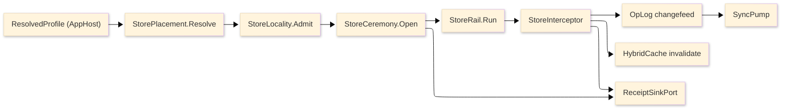

# [RASM_PERSISTENCE_ARCHITECTURE]

The domain map of `Rasm.Persistence` — the APP-PLATFORM durable-state spine. One sub-domain owner per concern with closed cases, every durable shape riding one closed lane axis folded against the store-profile engine rows across the Store, Schema, Query, Version, and Sync folders.

Each codemap node is the eventual source file its `.planning/` design page becomes, named in the language's own folder and file casing — PascalCase `.cs`, lowercase `.py`, lowercase `.ts`. Treat every node as realized code; the `.planning/` scaffold is the authoring substrate, never part of the map.

## [01]-[DOMAIN_MAP]

```text codemap
Rasm.Persistence/
├── Store/                # Durable store tier: engine, profiles, remote, provisioning, tenancy, encryption, quality
│   ├── Engine.cs         # Embedded-SQLite floor: PRAGMA ladder, maintenance ops, encryption gate
│   ├── Profiles.cs       # Six-row store-profile engine axis with placement fold and cost catalog
│   ├── Remote.cs         # Cloud object-store residence behind BlobRemote contract
│   ├── Provisioning.cs   # Self-provisioned PostgreSQL 18.4 tier: SchemaDdl.Sql fold, ClusterConfig verify, MigrationBundle
│   ├── Tenancy.cs        # Multi-tenancy/RLS axis with tenant lifecycle provisioning and per-tenant quota
│   ├── Encryption.cs     # KeyEnvelope/KmsProvider envelope encryption, rotation, and per-engine keying
│   └── Quality.cs        # QualityRule Union and the QualityPlan lowering fold to the cheapest enforcement site
├── Schema/               # Schema and migration rails
│   ├── Identity.cs       # Key axis with identity migration, object ACL, and signed authorship
│   ├── Migration.cs      # Drift-fingerprint gate, expand/contract classifier, and receipted apply
│   ├── Ddl.cs            # Generated columns, extension/index/temporal/check DDL, and the SchemaDdl.Sql provisioning fold
│   └── Converters.cs     # Converter/naming registration and compiled mount
├── Query/                # Query, lane, cache, federation, transaction, and pipeline rails
│   ├── Rail.cs           # StoreOp operation algebra with keyset pagination and changefeed
│   ├── Lanes.cs          # Seven-case DataLane axis folded against profile capability
│   ├── Cache.cs          # HybridCache L2 contribution and result/artifact/benchmark indexes
│   ├── Federation.cs     # Source-agnostic federated entity graph and ElementSet query algebra
│   ├── Transaction.cs    # TxnScope isolation/lock/savepoint/2PC arm-family on StoreOp + SQLSTATE classifier
│   └── Pipeline.cs       # PipelineStage Union and the BulkPipeline back-pressured fold over ArrowChunk
├── Version/              # Version-control history and recovery rails
│   ├── Commits.cs        # Content-addressed commit-DAG and op/delta-state CRDT
│   ├── TimeTravel.cs     # AS-OF reconstruction with checkpoint, range diff, blame, and scrub
│   ├── Diff.cs           # Tree-edit node-identity match, three-way merge, typed conflict classes
│   ├── Provenance.cs     # W3C-PROV causal DAG and tamper-evident attested ledger
│   ├── Snapshots.cs      # Content-addressed snapshot spine with sealed codec axis
│   ├── Retention.cs      # Classification enforcement, receipted retention sweep, reachability GC
│   └── Recovery.cs       # Per-engine backup/PITR/replication verify into one RecoveryFact stream proving RPO/RTO
└── Sync/                 # Collaboration, annotation, schedule, egress, and coordination sync rails
    ├── Collaboration.cs  # Op-log changefeed, HLC-stamped LWW merge, and three sync transports
    ├── Annotation.cs     # Generic durable-annotation anchoring + op-log/CDE OAuth2 sync (BCF domain in Rasm.Bim)
    ├── Schedule.cs       # Durable external-scheduler P6/MS-Project rows + sync (4D/CPM domain in Rasm.Bim)
    ├── Egress.cs         # EgressSink axis, EgressPump op-log-drain fold, and CloudEvents envelope
    └── Coordination.cs   # Fenced-CAS CoordCell store: per-tenant Budget ledger, workflow step-state, transactional outbox under TenantId RLS
```

Implementation collapses to one owner per axis and one entrypoint family per rail: a new feature is a row or case on a budgeted owner, and a public type outside an owner region is the named defect. The rail is named in the return type — `Validation<StoreFault,T>` accumulates, `Fin<T>` aborts, `IO<T>` carries effects; receipts stamp NodaTime `Instant`/`Duration`, and `ClockPolicy` owns elapsed and semantic time. Provider variance is row data on the axes; public code selects profiles, lanes, operations, codecs, and policies, never provider packages. The `Version`, `Query/Federation`, and `Sync` rails plus the classification/cost catalog in `Store/Profiles` ride the existing op-log changefeed, content-addressed snapshots, and PostGIS lanes, and never admit a new engine.

## [02]-[SEAMS]

```text seams
*                   →  typescript:projection              # [WIRE]: ElementSet stable receipt algebra
Sync/collaboration  →  typescript:interchange/codec       # [WIRE]: OpLogEntryWire / CrdtOpWire
Sync/collaboration  ⇄  python:runtime/transport           # [WIRE]: OpLogEntry.Payload MessagePack CRDT delta
Version/commits     ⇄  python:runtime/transport           # [WIRE]: CrdtOpWire MessagePack union
Version/snapshots   →  typescript:interchange/codec       # [WIRE]: SnapshotHeaderWire
Version/commits     →  typescript:interchange/refinement  # [SHAPE]: JsonPointer RFC6901 Guid brand
*                   ←  csharp:Rasm.Compute                # [CONTENT_KEY]: content-keyed blob
Query/cache         ⇄  csharp:Rasm.Compute/Runtime/codecs # [CONTENT_KEY]: ContentIdentity XxHash128 seed-zero two-half
Query/cache         →  csharp:Rasm.Bim/Model              # [CONTENT_KEY]: ArtifactIndexRow IfcSemantic content-addressed model graph
Query/lanes         ⇄  csharp:Rasm.Compute/Runtime        # [CONTENT_KEY]: EmbeddingIdentity content x model-id x arity
Version/commits     ⇄  csharp:Rasm.Compute/Runtime        # [GRADUATION]: HandoffAxis graduation evidence
Query/cache         ←  csharp:Rasm.AppHost/Runtime        # [PORT]: TenantId RLS + cache L2 partition
Sync                →  csharp:Rasm.Compute/Runtime        # [PROJECTION]: content-key delta via FastCDC
Sync                →  csharp:Rasm.AppUi/Editing          # [PROJECTION]: NotebookOp op-log
Sync/annotation     →  csharp:Rasm.AppUi/Editing          # [PROJECTION]: annotation collaboration op-log
*                   ←  csharp:Rasm.Materials/Appearance   # [TRANSPORT]: MaterialLibrary content-keyed durable catalogue rows
Query               ←  csharp:Rasm.Bim/Exchange           # [CONTENT_KEY]: TessellationOutcome ArtifactKey cache-hit lookup
Query               ←  csharp:Rasm.Bim/Exchange           # [CONTENT_KEY]: Reimport prior-BimModel content-key delta join
Query               ←  csharp:Rasm.Bim/Exchange           # [CONTENT_KEY]: BimWire snapshot content-key ArtifactIndexRow join
Query/federation    ←  csharp:Rasm.Bim/Review             # [CONTENT_KEY]: AuditEntry chained ElementChange mutation log
Query/federation    ←  csharp:Rasm.Bim/Review             # [CONTENT_KEY]: BimCommit content-addressed commit-DAG
Sync                ←  csharp:Rasm.Bim/Exchange           # [TRANSPORT]: OpLogWire ElementChange op-stream CRDT convergence
Sync                ←  csharp:Rasm.Bim/Review             # [SHAPE]: BimCommit DAG common-ancestor merge substrate
Sync/annotation     ⇄  csharp:Rasm.Bim/coordination       # [WIRE]: BCF/coordination domain
Sync/schedule       ⇄  csharp:Rasm.Bim/schedule           # [WIRE]: P6/MS-Project + 4D construction domain
Schema              ←  csharp:Rasm.Fabrication/Posting    # [WIRE]: CutProgram AST content-addressed durable-row projection
Schema              ←  csharp:Rasm.Fabrication/Nesting    # [WIRE]: Placement / Remnant XxHash128 content-keyed durable row
Sync/collaboration  ⇄  csharp:Rasm.AppHost/Runtime        # [PORT]: HLC two-half + TenantContext causal frame
Version/recovery    ←  csharp:Rasm.AppHost/Runtime        # [PORT]: ResolvedProfile DR-objective inputs
Query/transaction   ←  csharp:Rasm.AppHost/Runtime        # [PORT]: drain 2PC in-doubt set
Store/encryption    ←  csharp:Rasm.AppHost/Runtime        # [PORT]: KMS-unwrap port
Sync/egress         ←  csharp:Rasm.AppHost/Runtime        # [PORT]: keyed OutboundHop egress
Schema/identity     ⇄  csharp:Rasm.AppHost/Runtime        # [PORT]: ObjectAcl identity store, TenantId RLS (ONE_IDENTITY_STORE)
Sync/coordination   ⇄  csharp:Rasm.AppHost/Runtime        # [PORT]: fenced-CAS Budget + workflow step-state, same-tx outbox, TenantId RLS
Query/pipeline      ⇄  csharp:Rasm.Compute/Runtime/codecs # [PORT]: parse-to-canonical-bytes (Extract)
Store/quality       ←  csharp:Rasm.Compute                # [SHAPE]: geometry-derived anomaly rule source
Store/quality       ←  csharp:Rasm.Bim/Model              # [SHAPE]: IFC validation rules into QualityRule rows
Sync                ←  csharp:Rasm.AppUi/Editing          # [PROJECTION]: revertible op-log (ONE_REVERT_VOCABULARY)
Query/federation    ←  python:data/tabular                # [CONTENT_KEY]: C#-seed ContentKey durable reuse ledger
Query/federation    ⇄  python:data/tabular/query          # [WIRE]: Substrait binary plan + ibis-to_sql portable SQL
Version/provenance  ←  python:artifacts/provenance        # [CONTENT_KEY]: signed-artifact content-key binding XxHash128 seed
Version/snapshots   ←  python:data/gridded/virtual        # [CONTENT_KEY]: icechunk as-of snapshot identity XxHash128 seed
```

## [03]-[SPINE]



`StorePlacement.Resolve` folds the `ResolvedProfile` into a placement, `StoreLocality.Admit` gates the volume, `StoreCeremony.Open` proves the store ready and mints the open receipt, every operation dispatches through the store rail into the interceptor spine, and the spine fans out to the op-log changefeed, cache invalidation, and the receipt sink. The op-log feeds the sync pump, and the `Version/commits` commit-DAG, the `Version/provenance` ledger, and the `Query/federation` entity graph all ride that one changefeed.

## [04]-[BOUNDARIES]

- Persistence is not a domain service layer, repository framework, ORM wrapper, provider wrapper, or host-boundary package; it is RhinoCommon-free, and app roots resolve host profile, paths, and dsn before any call enters.
- Typed projection records are the only egress; entity types never cross the package boundary, and provider failure converts into `StoreFault` at exactly one site on the query rail.
- Provider, codec, and engine types stay implementation material behind axis vocabulary; consumers select rows, never packages.
- AppHost owns scheduling, drain conduction, hop retry, correlation, classification taxonomy, and the cache port; Persistence contributes rows to each and never reverses the dependency. The database is excluded from the AppHost hop law — `EnableRetryOnFailure` on the pg row and busy-retry on the sqlite rows are the only database retry owners.
- The `Version` rails (commits/timetravel/diff, provenance, snapshots, retention), the `Query/federation` rail, and the `Sync` rails (collaboration, annotation, schedule) plus the in-`Store/profiles` classification/cost catalog ride the existing op-log/content-addressed-snapshot/PostGIS substrate; durability stays here, op execution stays Compute, runtime policy stays AppHost.
- No store operation runs on a Grasshopper solve hot path.

## [05]-[PROHIBITIONS]

The closed NEVER list — the deleted patterns the owner regions foreclose.

- NEVER a public type outside a sub-domain owner region; a new capability is a row, case, or policy value on a budgeted owner.
- NEVER wrappers, rename adapters, helper or utility files, or a layer over provider functions.
- NEVER a generic receipt or ledger abstraction; `StoreOpenReceipt`, `MigrationReceipt`, `BulkReceipt`, `SweepReceipt`, `ExportProof`, `SyncApplyReceipt`, `ConflictReceipt`, `TransferReceipt`, `TenantReceipt`, and `RestoreReceipt` stay typed.
- NEVER propagate sentinels — `DateTime` defaults, `Deleted`/`Inserted` nulls, and empty keys project to `Option<T>` at the boundary.
- NEVER `DateTime.UtcNow`, `Stopwatch`, or direct timers; `ClockPolicy` is the only time seam.
- NEVER a second cache, retry, or correlation owner — AppHost owns port, stampede, tags, and hop retry; `EnableRetryOnFailure` plus busy-retry are the only database retry owners and the database stays outside the hop law.
- NEVER repository families, per-entity services, per-lane services, provider-twin query shapes, lazy loading, or offset pagination.
- NEVER hand-written converters, formatters, or migration code beside the generated rails — Thinktecture converters, EF-emitted migrations, and source-generated contexts own those forms.
- NEVER a second taxonomy: classification, redactor tables, blob framing constants, lease policy shapes, and profile-keyed tables compose from their settled owners.
- NEVER reference EF `Internal`-namespace types; migration-lock evidence reads from receipts.
- NEVER a trigger-based second changefeed path; op-log rows commit with entity rows in one transaction.
- NEVER admit a new engine row — the sweep is closed (libSQL, PGlite, LiteDB, RavenDB.Embedded, Realm, hctree, embedded-pg, EF InMemory rejected); PostgreSQL is never spawned or bundled by a Rasm process.
- NEVER execute runtime `ALTER SYSTEM`; provisioning is verification-only.
- NEVER a second CRDT, selection-shape, node-identity, or geometry-representation owner; the durable-graph rails ride the one op-log, the one `ElementSet`, the one `(GeometryHash, PropertyHash)` identity, and the canonical wire geometry.
- CSP analyzer diagnostics are architecture pressure: fix the shape, refine the rule on a false positive, never suppress.
