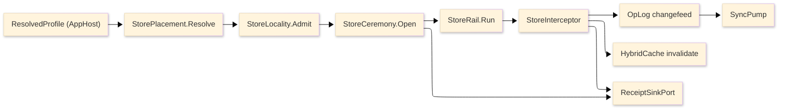

# [RASM_PERSISTENCE_ARCHITECTURE]

The professional-domain folder-map of `Rasm.Persistence`, the APP-PLATFORM durable-state spine: every concern is one sub-domain owner with closed cases, every entrypoint is a typed rail, and every durable shape rides one closed lane axis folded against the store-profile engine rows. The codemap names the full sub-domain structure — each one a real domain concept, never a rail/axis/lane file-naming scheme — so a planned-but-thin folder reads as a visible gap that fuels an idea or task. Mechanics live in the `.planning/` design pages; this map carries the structure, the store-flow spine, and the boundary and prohibition law.

## [1]-[DOMAIN_MAP]

Each sub-domain mirrors one eventual source sub-tree. The charter is the concern the folder owns; the page list is the design pages that have landed under it.

```text codemap
Rasm.Persistence/
├── stores/             Six-row store-profile engine axis, the five-state lifecycle ceremony with typed open/restore/drain receipts, cross-process writer lease and epoch fence, the eight-modality placement fold, and the operator-provisioning manifest.
│   └── profiles.md
├── stores-remote/      Cloud object-store residence (S3/Azure/GCS) behind the settled BlobRemote contract: chunked resumable multipart transfer, content-key descriptor round-trip with conditional-write concurrency, and the content-address artifact-sync feed over the op-log changefeed.
│   └── object-store.md
├── stores-server/      The self-provisioned PostgreSQL 18.4 server tier: TimescaleDB hypertable/continuous-aggregate/columnstore DDL, diskann + BM25 index provisioning, deploy-time GUC verification, the tenancy/RLS lifecycle with per-tenant quota, and the migration-bundle deploy gate.
│   └── provisioning.md
├── schema/             The identity/migration/DDL rail: the three-row identity policy (uuid-v7/content/natural), expand-contract migration law with the drift fingerprint gate, generated columns, the extension and native-type DDL set, the generated-converter rail, and object-level ACL with signed authorship.
│   └── schema-rail.md
├── modalities/         The seven-case DataLane axis (relational/document/key-value/vector/full-text/analytical/blob) folded against profile capability, the document JSON-index policy, the vector + BM25 search shapes with RRF fusion, the geometry residence and spatial-diff lanes with CRS reconciliation, and the analytical read lane.
│   └── data-lanes.md
├── query/              The StoreOp operation algebra with Kleisli composition, keyset pagination and typed projection egress, the bulk-movement lane with self-emitted changefeed, the four-hook interceptor spine, the incremental standing-query window, and the Arrow zero-copy carrier.
│   └── query-rail.md
├── engine/             The embedded-SQLite floor: the PRAGMA policy ladder, the compile-options probe surface, the maintenance op family, and the loadable-extension and at-rest-encryption gate.
│   └── sqlite.md
├── snapshots/          The content-addressed snapshot spine: the three-row sealed codec axis, the compression and hash policy axes, the atomic snapshot protocol with diff and restore, the schema/codec evolution registry, and the fuzz harness.
│   └── codecs.md
├── cache/              The HybridCache L2 contribution behind the AppHost cache port plus the result, artifact-blob, and benchmark index surfaces that select warm-start substrates and content-addressed artifacts.
│   └── indexes.md
├── sync/               The op-log changefeed (one log: outbox, audit, feed, sync), the HLC-stamped LWW merge law, the three sync transports (logical replication, HTTP delta, object-graph diff), presence/awareness, and partial-replication working-set checkout.
│   └── collaboration.md
├── versioning/         Git-grade version control over the durable graph: the content-addressed commit-DAG with branches and merge-base, the convergent op/delta-state CRDT, the CrdtOpWire payload amendment, AS-OF time-travel, and the geometry-aware structural diff/merge.
│   └── version-control.md
├── federation/         The source-agnostic federated entity graph keyed on geometry/property identity, the universal ElementSet query algebra, cross-document links with transitive impact, the declarative rule engine (clash/IDS/MVD/QTO), fusion ranking with lineage, and the cross-engine query planner.
│   └── federation.md
├── provenance/         The W3C-PROV causal DAG as a join dimension, lineage slicing and blame, the tamper-evident hash-chained attested ledger, and the lineage-scoped redaction-aware change-data-capture envelope.
│   └── provenance.md
├── annotation/         Anchored-annotation anchor algebra with threads, the BCF 2.1/3.0 coordination protocol with viewpoint lifecycle, and the bidirectional CDE OAuth2 sync.
│   └── annotation.md
├── catalog/            Multi-standard classification catalogs (Uniclass/OmniClass/MasterFormat ltree) and the cost-code catalog with formula-evaluated 5D rollup over the DuckDB analytical lane.
│   └── catalog-cost.md
├── schedule/           P6/MS-Project schedule interchange with the activity network, the task-to-ElementSet link, and the 4D construction state with planned/actual variance.
│   └── schedule-interchange.md
└── retention/          Classification enforcement at every store egress, the hold-first receipted retention sweep, object-store reachability GC by live closure, the hash-proved support-bundle export, and the classification-to-pgaudit category binding.
    └── redaction-retention.md
```

Implementation collapses to one owner per axis and one entrypoint family per rail: a new feature is a row or case on a budgeted owner, never a new surface, and a public type outside an owner region is the named defect. One rail per entrypoint, named in the return type — `Validation<StoreFault,T>` accumulates, `Fin<T>` aborts, `IO<T>` carries effects. Receipts stamp NodaTime `Instant`/`Duration`; `ClockPolicy` owns elapsed and semantic time. Provider variance is row data on the axes; public code selects profiles, lanes, operations, codecs, and policies, never provider packages. The version-control, federation, provenance, annotation, catalog, and schedule sub-domains ride the existing substrate — the op-log changefeed, the content-addressed snapshots, and the PostGIS GiST + jsonb + ltree lanes — and never admit a new engine.

## [2]-[SPINE]



`StorePlacement.Resolve` folds the `ResolvedProfile` into a placement, `StoreLocality.Admit` gates the volume, `StoreCeremony.Open` proves the store ready and mints the open receipt, every operation dispatches through the store rail into the interceptor spine, and the spine fans out to the op-log changefeed, cache invalidation, and the receipt sink. The op-log feeds the sync pump, and the version-control commit-DAG, the provenance ledger, and the federation entity graph all ride that one changefeed.

## [3]-[BOUNDARIES]

- Persistence is not a domain service layer, repository framework, ORM wrapper, provider wrapper, or host-boundary package; it is RhinoCommon-free, and app roots resolve host profile, paths, and dsn before any call enters.
- Typed projection records are the only egress; entity types never cross the package boundary, and provider failure converts into `StoreFault` at exactly one site on the query rail.
- Provider, codec, and engine types stay implementation material behind axis vocabulary; consumers select rows, never packages.
- AppHost owns scheduling, drain conduction, hop retry, correlation, classification taxonomy, and the cache port; Persistence contributes rows to each and never reverses the dependency. The database is excluded from the AppHost hop law — `EnableRetryOnFailure` on the pg row and busy-retry on the sqlite rows are the only database retry owners.
- The version-control, federation, provenance, annotation, catalog, and schedule rails ride the existing op-log/content-addressed-snapshot/PostGIS substrate; durability stays here, op execution stays Compute, runtime policy stays AppHost.
- No store operation runs on a Grasshopper solve hot path.

## [4]-[PROHIBITIONS]

The closed NEVER list — the deleted patterns the owner regions foreclose.

- NEVER a public type outside a sub-domain owner region; a new capability is a row, case, or policy value on a budgeted owner.
- NEVER wrappers, rename adapters, helper or utility files, or a layer over provider functions.
- NEVER a generic receipt or ledger abstraction; `StoreOpenReceipt`, `MigrationReceipt`, `BulkReceipt`, `SweepReceipt`, `ExportProof`, `SyncApplyReceipt`, `ConflictReceipt`, `TransferReceipt`, `TenantReceipt`, and `RestoreReceipt` stay typed.
- NEVER propagate sentinels — `DateTime` defaults, `Deleted`/`Inserted` nulls, and empty keys project to `Option<T>` at the boundary.
- NEVER `DateTime.UtcNow`, `Stopwatch`, or direct timers; `ClockPolicy` is the only time seam.
- NEVER a second cache, retry, or correlation owner — AppHost owns port, stampede, tags, and hop retry; `EnableRetryOnFailure` plus busy-retry are the only database retry owners and the database stays outside the hop law.
- NEVER repository families, per-entity services, per-lane services, provider-twin query shapes, lazy loading, or offset pagination.
- NEVER hand-written converters, formatters, or migration code beside the generated rails — Thinktecture converters, EF-emitted migrations, and source-generated contexts own those forms.
- NEVER a second taxonomy: classification, redactor tables, blob framing constants, lease policy shapes, and profile-keyed tables compose from their settled owners.
- NEVER reference EF `Internal`-namespace types; migration-lock evidence reads from receipts.
- NEVER a trigger-based second changefeed path; op-log rows commit with entity rows in one transaction.
- NEVER admit a new engine row — the sweep is closed (libSQL, PGlite, LiteDB, RavenDB.Embedded, Realm, hctree, embedded-pg, EF InMemory rejected); PostgreSQL is never spawned or bundled by a Rasm process.
- NEVER execute runtime `ALTER SYSTEM`; provisioning is verification-only.
- NEVER a second CRDT, selection-shape, node-identity, or geometry-representation owner; the durable-graph rails ride the one op-log, the one `ElementSet`, the one `(GeometryHash, PropertyHash)` identity, and the canonical wire geometry.
- CSP analyzer diagnostics are architecture pressure: fix the shape, refine the rule on a false positive, never suppress.
