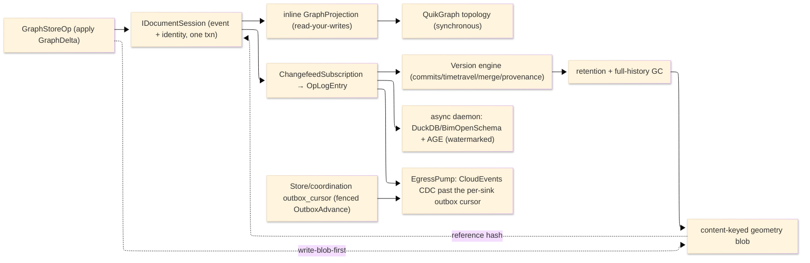

# [RASM_PERSISTENCE_ARCHITECTURE]

The domain map of `Rasm.Persistence` — the APP-PLATFORM durable-state spine that persists the `Rasm.Element` `ElementGraph` as its system of record. One sub-domain owner per concern with closed cases, Marten the append substrate beneath the preserved version-control engine, the read lanes split by consistency demand, and the geometry object store content-keyed.

Each codemap node is the eventual source file its `.planning/` design page becomes, named in PascalCase `.cs`. Treat every node as realized code; the `.planning/` scaffold is the authoring substrate, never part of the map. The package depends UP on the `Rasm.Element` seam and the `Rasm` kernel content-hash; it references no sibling AEC-domain peer (`Rasm.Materials`/`Rasm.Bim`/`Rasm.Fabrication`) — alignment travels through the seam contracts and the content-keyed wire, never sibling coupling.

## [01]-[DOMAIN_MAP]

```text codemap
Rasm.Persistence/
├── Element/              # The ElementGraph store-load roundtrip over Marten
│   ├── Graph.cs          # ElementStore: stream-per-model GraphDelta events, inline SingleStreamProjection, AggregateStreamAsync AS-OF, GraphStoreOp commit
│   ├── Codec.cs          # SnapshotCodec axis, ContentAddress over seed-zero XxHash128, canonical CBOR, sealed-header boundary + tier ladder, FastCDC chunker
│   ├── Identity.cs       # ElementIdentity one-txn tier, IdentityPolicy axis, EF ConverterRail, PostGIS Bounds, KMS DEK custody, IdentityDdl, SchemaVerdict
│   └── Authority.cs      # Grant/GrantSet/AclScope/AclEntry/ObjectAcl + Authority.Admit deny-over-allow object-ACL algebra; composes IdentityFault 8340
├── Version/              # The version-control engine projecting FROM Marten events
│   ├── Ledger.cs         # OpLogEntry changefeed of Marten events, HLC, ColumnFamily merge-stance, Adjudicate/CRDT dispatch, sync transports, ReplayWindow read
│   ├── Commits.cs        # Content-addressed commit-DAG, the convergent op/delta-state CRDT algebra, CrdtOpWire, the ContentParityCorpus
│   ├── TimeTravel.cs     # AS-OF reconstruct/diff/blame/scrub/bisect/branch over the changefeed prefix + Marten snapshot checkpoints, Crdt.Apply materializer
│   ├── Merge.cs          # StructuralMerge: ElementGraph forest projection, Merkle-pruned three-way merge, typed conflict classes, RFC 6902 patch egress
│   ├── Provenance.cs     # W3C-PROV causal DAG + the attested (KMS-signed, hash-chained) tamper-evidence ledger
│   ├── Retention.cs      # Classification/retention classes, the holds-first sweep fold, the full-history reachability GC
│   ├── Recovery.cs       # RecoveryRoute backup substrates (PG-PITR/object-replica/snapshot-archive), verified PITR choreography, RPO/RTO RecoveryFact stream
│   └── Egress.cs         # CDC egress pump: ONE CloudEvents envelope over the EgressSink union, DeliveryAck fold, per-sink dedup, typed dead-letter + replay
├── Query/               # The read lanes split by consistency demand + the reuse index
│   ├── Lane.cs           # ReadRouter (synchronous authoritative vs async analytical), StalenessWatermark sequence-gap, ElementSet/SetExpr selection algebra
│   ├── Retrieval.cs      # Coupled ANN subsystem: FusionRank fusion over pgvector/pg_search branches, VectorCodebook PQ train/ADC scan, VectorBackend axis
│   ├── Topology.cs       # In-process QuikGraph view + frozen incidence index + traversal/path/components/topological-sort (DEFAULT synchronous topology owner)
│   ├── Columnar.cs       # DuckDB INSTALL/LOAD analytical lane + co-txn BimOpenSchemaProjection : FlatTableProjection + ParquetSharp + ADBC/Substrait edge
│   ├── Cypher.cs         # OPTIONAL self-hosted Apache AGE openCypher + pgrouting (async, demoted beneath QuikGraph)
│   ├── Cache.cs          # Compute-result index: ArtifactIndexRow + ModelResultIndex + BenchmarkRow gate + CloudRun + scylla residency + Redis invalidation
│   └── Federation.cs     # Substrait federation router: SubstraitDeserializer ingress, RelationVisitor lowers onto SetExpr / ADBC lane, FederatedResult replay
├── Ingest/              # The file-codec ingress axis
│   ├── Tabular.cs        # TabularSource over MiniExcel + Sep delimited lane; linq2db BulkCopyAsync over identity DbContext; app root owns tabular→element map
│   ├── Schedule.cs       # MPXJ.Net schedule-file codec (.mpp/XER/PMXML) + durable TaskRelation DAG rows; the Persistence half of the Bim schedule domain
│   └── Geospatial.cs     # GeoSource over GeoPackage/GeoJSON/WKB-WKT rows; features reify through GeoJsonProjection; H3 cell composes identity#SPATIAL_CELL
└── Store/               # Durable-home + coordination substrate
    ├── BlobStore.cs      # Content-keyed object store: write-blob-first + 412-noop seal, five-row ObjectStore union, content-lineage catalog + full-history GC
    ├── Provisioning.cs   # Verification-first PostgreSQL 18 extension tier + embedded-SQLite floor + wire/EF provider-binding rows + 11-axis STORE_AXIS_MAP
    └── Coordination.cs   # Token-validating fenced-lease store: CoordinationOp union (Budget/step-CAS/lease/membership/OutboxAdvance), ONE_OUTBOX_EGRESS_SPINE
```

Implementation collapses to one owner per axis and one entrypoint family per rail: a new feature is a row or case on a budgeted owner, and a public type outside an owner region is the named defect. The rail is named in the return type — `Validation<Fault,T>` accumulates, `Fin<T>` aborts, `IO<T>` carries effects; receipts stamp NodaTime `Instant`/`Duration`, and wall clock, elapsed marks, correlation, and tenant ride the injected `Element/graph#STORE_RAIL` `ProjectionContext` frame — a `ClockPolicy`/`CorrelationId`/`TenantContext` parameter on any Persistence signature is the named strata inversion. Marten owns the durable append and the rebuildable views; the version-control engine projects from its events; provider variance is row data on the axes; public code selects profiles, lanes, operations, codecs, and policies, never provider packages.

## [02]-[SEAMS]

```text seams
Element/graph        ←  csharp:Rasm.Element                   # [SHAPE]: ElementGraph/GraphDelta/Node/NodeId/Relationship/Header persisted as the SoR
Element/codec        ←  csharp:Rasm                           # [CONTENT_KEY]: kernel seed-zero XxHash128 entry the ContentAddress composes, no second hasher
Element/codec        →  typescript:core/interchange/format    # [WIRE]: SnapshotHeader + canonical-CBOR content-stable bytes
Version/commits      →  typescript:core/interchange/format    # [WIRE]: CrdtOpWire MessagePack union + Hlc 16-byte cell
Version/commits      ⇄  python:runtime/transport              # [WIRE]: CrdtOp None-companion bytes + the one XxHash128 seed parity corpus
Version/commits      →  typescript:core/state/causal + typescript:core/state/commit # [SHAPE]: commit/branch/version-vector/Merkle wire shapes
Version/merge        →  typescript:core/interchange/format    # [SHAPE]: JsonPatchDocument RFC 6902 EntityEdit egress
Version/merge        ←  csharp:Rasm/Spatial/reconciliation    # [CONTENT_KEY]: reconciliation GeometryHash over frozen EncodeForm; consumer never re-mints
Version/ledger       ⇄  python:runtime/transport              # [WIRE]: OpLogEntry Payload CRDT delta over the one wire vocabulary
Version/ledger       ⇄  csharp:Rasm.AppHost/Runtime           # [PORT]: HLC two-half + TenantContext causal frame; the W3C TraceSlot trace-id slot
Version/ledger       ←  csharp:Rasm.AppUi/Collab/Editing + csharp:Rasm.AppHost/Runtime/determinism # [PROJECTION]: ReplayWindow read, one case both consumers
Version/ledger       ←  csharp:Rasm.AppHost/Wire/companion    # [TRANSPORT]: PeerRoster beats over the lossy DrainSurface awareness lane, not durable
Version/ledger       →  typescript:core/interchange/codec     # [WIRE]: OpLogEntry envelope — Codec Family-derived, TraceSlot top-level
Version/timetravel   ←  python:data/gridded/virtual           # [CONTENT_KEY]: icechunk as-of snapshot identity over the shared XxHash128 seed
Version/provenance   ←  python:artifacts/provenance           # [CONTENT_KEY]: signed-artifact content-key binding; the attested-ledger authenticity authority
Version/provenance   ←  PollinationSDK sidecar                # [CONTENT_KEY]: cloud run as W3C-PROV CloudRunFact via CausalDag.Derive, fork never in-fence
Version/retention    ←  csharp:Rasm.Compute                   # [CONTENT_KEY]: content-keyed Assessment.Result blobs registered in the blob retention class
Element/identity     ⇄  csharp:Rasm.AppHost/Runtime           # [PORT]: TenantId RLS + KMS unwrap handle (#KMS_CUSTODY, ONE_IDENTITY_STORE; SecretLease only)
Element/authority    ⇄  csharp:Rasm.AppHost/Runtime           # [PORT]: ObjectAcl identity store (frozen vocabulary, subject-keyed, string-keyed Grant wire)
Element/authority    →  Version/commits                       # [BOUNDARY]: BranchRef movement gated by Authority.Admit; GrantSet narrowed under AclScope.Branch
Element/graph        ←  csharp:Rasm.AppHost/Runtime           # [PORT]: StoreActor/ProjectionContext/ResolvedProfile VALUES AppHost fills, no type crosses down
Query/columnar       ←  csharp:Rasm.Bim/Model                 # [PROJECTION]: BimOpenSchemaProjection : FlatTableProjection; Bim supplies the typed schema seed
Query/lane           ⇄  python:data/tabular/query             # [WIRE]: ElementSet receipt currency (the Substrait portable-plan half lives on Query/federation)
Query/federation     ←  python:data/tabular/query             # [WIRE]: Substrait portable-plan half (signature-locked; GATED on python:data — named blocker)
Query/federation     →  Query/lane + Query/columnar           # [PROJECTION]: SetExpr + tabular subtree over AdbcQuery.Plan/ColumnarExtension.Substrait
Query/federation     ←  Version/provenance                    # [CONTENT_KEY]: SourceKind.SignedArtifact via the attested ledger (GATED on python:artifacts)
Query/retrieval      ⇄  csharp:Rasm.Compute/Model/embedding   # [CONTENT_KEY]: VECTOR_CODEBOOK — VectorRow↔EmbeddingVector; Compute encodes, never fits
Query/cache          ←  csharp:Rasm.Compute                   # [PROJECTION]: ArtifactIndexRow + ModelResultIndex recency + BenchmarkRow gate, read by reference
Query/cache          ⇄  csharp:Rasm.AppHost/Runtime           # [PORT]: L2 IBufferDistributedCache partition + TenantId RLS — AppHost owns L1+stampede+tag half
Store/blobstore      ←  csharp:Rasm.Compute                   # [CONTENT_KEY]: authored GLB by Object.RepresentationContentHash GeometryHash, blob write-first
Store/blobstore      →  csharp:Rasm.Compute GeometrySource    # [CONTENT_KEY]: Placement egress row — the content-keyed blob residence Compute reads back
Store/blobstore      ←  csharp:Rasm.Bim/Exchange              # [CONTENT_KEY]: imported IFC/BREP by Object IfcRepHash; IfcConvert GLB content-keyed wire
Store/blobstore      ←  csharp:Rasm.AppUi/Collab/sync         # [CONTENT_KEY]: snapshot-accelerator rows — content-keyed, derivable-class retention, never SoR
Ingest/tabular       →  csharp:Rasm.Element                   # [WIRE]: row shape only; the per-app composition root maps tabular→ElementGraph node
Ingest/schedule      ⇄  csharp:Rasm.Bim/schedule              # [WIRE]: durable TaskRelation DAG + XER/PMXML codec HOME; CPM/4D stays Rasm.Bim (BIM:102)
Ingest/geospatial    →  csharp:Rasm.Element                   # [WIRE]: feature row shape only (mirrors the tabular law); the app root owns the geo→element map
Ingest/geospatial    ←  csharp:Rasm.Bim/Semantics/geospatial  # [WIRE]: feature-ingress counterpart (the Bim campaign re-points the row interior)
Query/columnar       ⇄  python:data/tabular                   # [WIRE]: Arrow record batch over the ADBC driver manager
Store/provisioning   ←  csharp:Rasm.AppHost/Observability     # [RECEIPT]: Reachability + ProvisionVerdict into HealthContributorRow
Store/coordination   ⇄  csharp:Rasm.AppHost/Agent/capability  # [PORT]: fenced per-tenant Budget debit — CostVector string unit key onto HashMap<string,long>
Store/coordination   ⇄  csharp:Rasm.AppHost/Runtime/orchestration # [PORT]: step-state CAS + StepStateInFlight READ (CrashResume)
Store/coordination   ⇄  csharp:Rasm.AppHost/Wire/outbox       # [PORT]: transactional outbox same-tx (ONE_OUTBOX_EGRESS_SPINE — the Marten stream IS the outbox)
Store/coordination   ⇄  csharp:Rasm.AppHost/Wire/Coordination # [PORT]: CAS + lease + membership rows; MembershipView.Serving the in-process consumer
Version/egress       ←  Store/coordination                    # [TRANSPORT]: drains per-sink outbox_cursor(SinkKey, Sequence); forward-only, never reads pump
Version/egress       ←  Version/ledger                        # [TRANSPORT]: OpLogEntry durable-lane rows via ReplayWindow.DurableOps
Version/egress       →  csharp:Rasm.AppHost/Wire/outbox       # [PORT]: keyed OutboundHop counterpart; sink reads AppHost hop delivery-honesty policy
Version/recovery     ←  csharp:Rasm.AppHost/Runtime           # [PORT]: RecoveryObjective RPO/RTO on the ResolvedProfile (Element/graph#STORE_RAIL)
```

## [03]-[SPINE]



`GraphStoreOp.Run` appends the `GraphDelta` event and stores the `ElementIdentity` document in one `IDocumentSession`, so a single `SaveChangesAsync` commits identity plus event; the inline `GraphProjection` materializes the authoritative `ElementGraph` read-your-writes; the `ChangefeedSubscription` projects each committed event into an `OpLogEntry` the version engine and the analytical daemon both fold; the geometry blob writes content-first and the event references its immutable hash; the retention sweep's full-history GC governs both the snapshot spine and the geometry blobs; the `EgressPump` drains the durable changefeed lanes past the coordination-owned per-sink outbox cursor into the CloudEvents sink rows — the Marten stream IS the outbox, so a domain commit and its egress obligation are one transaction.

## [04]-[BOUNDARIES]

- Persistence is not a domain service layer, repository framework, ORM wrapper, provider wrapper, or host-boundary package; it is RhinoCommon-free, depends up on the `Rasm.Element` seam plus the `Rasm` kernel, and never references a sibling AEC-domain peer.
- Marten owns the durable append and the rebuildable read views; the op-log/CRDT/time-travel/`StructuralMerge`/causal-DAG engine PROJECTS from its events — never a bespoke op-log store beneath Marten, never re-implementing event storage or stream folding.
- The one transaction owner for identity plus event is the `IDocumentSession` (identity as a Marten document in the same session); the geometry blob is write-first and reference-after with no free two-ORM atomicity.
- Authoritative topology/containment reads bind the synchronous inline projection and the in-process QuikGraph view; AGE and DuckDB are async analytical lanes with an explicit staleness watermark, and interactive-correctness reads block on `WaitForNonStaleProjectionDataAsync` and never route to an async projection.
- Typed projection records and the seam `ElementGraph` are the only egress; entity types never cross the package boundary, and provider failure converts into a typed fault at exactly one site per rail.
- AppHost owns scheduling, drain conduction, hop retry, correlation, classification taxonomy, and the cache port; Persistence contributes rows and never reverses the dependency. The database is excluded from the AppHost hop law — `EnableRetryOnFailure` on the pg row and busy-retry on the sqlite rows are the only database retry owners.

## [05]-[PROHIBITIONS]

The closed NEVER list — the deleted patterns the owner regions foreclose.

- NEVER a public type outside a sub-domain owner region; a new capability is a row, case, or policy value on a budgeted owner.
- NEVER a bespoke op-log/event store beneath Marten, a per-`NodeId` stream grain, or a whole-graph event body; the stream is per-model and the body is the `GraphDelta`.
- NEVER route an interactive-correctness read (clash, void-resolution, live QTO) to an async projection without `WaitForNonStaleProjectionDataAsync`; strong-consistency reads go through the inline projection / the synchronous topology.
- NEVER a second materializer beside `Crdt.Apply`/`GraphDelta.Apply`; the projection, the live merge, and the AS-OF reconstruction fold the one delta.
- NEVER a second content-hash, identity, CRDT, selection-shape, or geometry-representation owner; the durable spine rides the one kernel `XxHash128` content address, the one `OpLogEntry` changefeed, the one `ElementSet`, and the one canonical wire geometry.
- NEVER a head-only geometry GC; reachability runs over the full event history (every AS-OF cut), or geometry GC is forbidden (dedup + cold-tiering).
- NEVER `DateTime.UtcNow`, `Stopwatch`, or direct timers; the injected `ProjectionContext` frame (`Mark`/`Elapsed`/`Now` delegate values AppHost fills at the port) is the only time seam, the HLC the only causal clock — an AppHost `ClockPolicy` parameter on a Persistence signature is the named strata inversion.
- NEVER hand-written converters/formatters/migration code beside the generated rails; Thinktecture converters, Marten/EF migrations, and the source-generated resolvers own those forms.
- NEVER a generic receipt abstraction; `GraphReceipt`, `SyncApplyReceipt`, `ConflictReceipt`, `TimeTravelReceipt`, `SweepReceipt`, `RecoveryFact`, `BlobTransferReceipt`, and `RetentionFact` stay typed.
- NEVER admit a new relational engine row — the sweep is closed (PostgreSQL + embedded SQLite only); PostgreSQL is never spawned or bundled by a Rasm process, and provisioning is verification-only (never runtime `ALTER SYSTEM`).
- NEVER reference a sibling AEC-domain peer or a host-SDK type; alignment travels through the `Rasm.Element` seam and the content-keyed wire.
- CSP analyzer diagnostics are architecture pressure: fix the shape, refine the rule on a false positive, never suppress.
