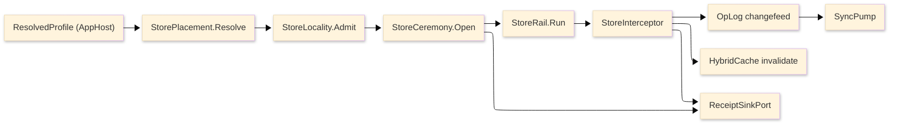

# [RASM_PERSISTENCE_ARCHITECTURE]

`Rasm.Persistence` owns durable state for the app suite through nine finalized
rails. Each rail is one polymorphic dispatch surface whose variance lives in
axis rows, cases, and policy values; the finalized pages under
[.planning](.planning/README.md) carry the transcription-complete signatures.

## [1]-[RAILS_AND_AXES]

| [INDEX] | [RAIL]              | [OWNING_AXES]                                                                                                                    | [PAGE]                                                  |
| :-----: | :------------------ | :------------------------------------------------------------------------------------------------------------------------------- | :------------------------------------------------------ |
|   [1]   | Store profiles      | `StoreProfile` (6) · `StoreLifecycle` (5) · `StorePlacement` (8 arms) · `StoreLeaseRow` · `ExtensionRequirement` (7)             | [store-profiles](.planning/store-profiles.md)           |
|   [2]   | Data lanes          | `DataLane` (7) · `JsonIndex` (3) · `VectorMetric` (3) · `FullTextMode` (4) · `GeoLayer` · `TabularExportSpec`                    | [data-lanes](.planning/data-lanes.md)                   |
|   [3]   | Schema rail         | `IdentityPolicy` (3) · `SchemaFault` (5) · `SchemaFingerprint` · `DerivedColumn` · `SchemaDdl` (19 extensions) · `ConverterRail` | [schema-rail](.planning/schema-rail.md)                 |
|   [4]   | Query rail          | `StoreOp<T>` (8) · `StoreFault` (6) · `KeysetPage<TRow>` · `BulkRoute` (3) · `StoreInterceptor` · `StoreFact` (7 kinds)          | [query-rail](.planning/query-rail.md)                   |
|   [5]   | Native SQLite       | `SqlitePragma` (10) · `SqliteFactKind` (14) · `SqliteCompileSurface` · `SqliteMaintenance` (9 verbs) · `ExtensionGate` (8)       | [native-sqlite](.planning/native-sqlite.md)             |
|   [6]   | Snapshot codecs     | `SnapshotCodec` (3) · `CompressionPolicy` (3) · `HashPolicy` (3) · `SnapshotHeader` · `Snapshots` · `PersistenceWireContext`     | [snapshot-codecs](.planning/snapshot-codecs.md)         |
|   [7]   | Cache indexes       | `CacheContribution` · `ModelResultKey` · `ArtifactIndexRow` · `BenchmarkRow`                                                     | [cache-indexes](.planning/cache-indexes.md)             |
|   [8]   | Sync collaboration  | `SyncOpKind` (3) · `OpLogEntry` · `ConflictOutcome` (4) · `SyncTransport` (3) · `PresenceRow`                                    | [sync-collaboration](.planning/sync-collaboration.md)   |
|   [9]   | Redaction retention | `RetentionPolicy` (4) · `ArtifactClasses` (7) · `ExportProof` · `AuditBinding` (5)                                               | [redaction-retention](.planning/redaction-retention.md) |

Provider variance is row data on these axes. Public code selects profiles,
lanes, operations, codecs, and policies; it never selects provider packages.

## [2]-[CROSS_PACKAGE_MATRIX]

Seam altitudes record in the suite ledger
[SEAM_SPLITS](../.planning/region-map/); this matrix is the Persistence cut.

| [INDEX] | [SEAM]                   | [MECHANICS_OWNER]                                              | [PERSISTENCE_SIDE]                                                                                            |
| :-----: | :----------------------- | :------------------------------------------------------------- | :------------------------------------------------------------------------------------------------------------ |
|   [1]   | Resolved profile + roots | AppHost host-profiles                                          | placement fold consumes `ResolvedProfile`/`ProfileRoots`; zero path derivation                                |
|   [2]   | Clock seam               | AppHost time-and-deadlines                                     | TTL, retention, HLC, and lease stamping ride `ClockPolicy`                                                    |
|   [3]   | Drain order              | AppHost lifecycle-and-drain rank bands                         | store rows rank 310-350 inside the Stores band                                                                |
|   [4]   | HybridCache              | AppHost resource-lanes (port, stampede, tags)                  | cache-indexes#L2_CONTRIBUTION supplies L2 store + serializer factory                                          |
|   [5]   | DataClassification       | AppHost diagnostics-and-telemetry taxonomy                     | redaction-retention#CLASSIFICATION_ENFORCEMENT store-side guard rows                                          |
|   [6]   | Receipt sink             | AppHost runtime-ports `ReceiptSinkPort`                        | query facts, snapshot catalog stamps, and sync HLC ride the envelope                                          |
|   [7]   | Telemetry contribution   | AppHost runtime-ports `TelemetryContributorPort`               | query-rail#INTERCEPTOR_SPINE registers the Npgsql tracer and meter rows                                       |
|   [8]   | Outbound retry           | AppHost outbound-resilience hop law                            | database retry excluded; `EnableRetryOnFailure` + busy-retry on store rows; HttpDelta sync rides the http hop |
|   [9]   | Config reload            | AppHost configuration-and-options                              | user-settings writes + op-log HLC tag-invalidation cursor for peers                                           |
|  [10]   | ArtifactSync framing     | Compute remote-lane frame constants                            | sync-collaboration#PRESENCE_AND_BLOB and `BlobRemote` consume 64 KiB / Crc32 / XxHash128 settled              |
|  [11]   | Model-result cache       | Persistence cache-indexes#MODEL_RESULT_INDEX                   | Compute model-lane reads results through `IndexSurface`, never the raw port                                   |
|  [12]   | Idempotency dedup window | Persistence redaction-retention 24 h age-bound row             | Compute DocumentService dedup window quotes the same horizon                                                  |
|  [13]   | Suite wire law           | Persistence snapshot-codecs + sync-collaboration TS_PROJECTION | AppHost runtime-ports merges `PersistenceWireContext` into the suite contract                                 |
|  [14]   | Fingerprint slot         | Persistence schema-rail `SchemaFingerprint`                    | store-profiles open receipt carries the bare `ulong`; zero forward reference                                  |
|  [15]   | Pooled-context residence | Persistence store-profiles delegate columns                    | app roots build one `PooledDbContextFactory` per placement; query-rail leases                                 |

## [3]-[STORE_FLOW]

Text equivalent: the resolved profile folds to a placement, locality admission
gates it, the open ceremony proves the store ready, every operation dispatches
through the store rail into the interceptor spine, and the spine fans out to
the op-log changefeed, cache invalidation, and the receipt sink; the op-log
feeds the sync pump.

## [4]-[PACKAGE_API_MAP]

| [INDEX] | [AXIS]                       | [OWNING_PACKAGES]                                                                                                                                                                                                       |
| :-----: | :--------------------------- | :---------------------------------------------------------------------------------------------------------------------------------------------------------------------------------------------------------------------- |
|   [1]   | Engine rows + placement      | Microsoft.EntityFrameworkCore.Sqlite · Microsoft.Data.Sqlite · Npgsql · Npgsql.EntityFrameworkCore.PostgreSQL · DuckDB.NET.Data.Full                                                                                    |
|   [2]   | Document + search lanes      | Npgsql.EntityFrameworkCore.PostgreSQL.NodaTime · Pgvector.EntityFrameworkCore                                                                                                                                           |
|   [3]   | Geo lanes                    | Npgsql.EntityFrameworkCore.PostgreSQL.NetTopologySuite · NetTopologySuite.IO.GeoPackage                                                                                                                                 |
|   [4]   | Analytical lane              | DuckDB.NET.Data.Full · Sep                                                                                                                                                                                              |
|   [5]   | Schema rail                  | Microsoft.EntityFrameworkCore.Design · EFCore.NamingConventions · Thinktecture.Runtime.Extensions.EntityFrameworkCore10 · System.IO.Hashing                                                                             |
|   [6]   | Query + bulk + observability | linq2db.EntityFrameworkCore · Npgsql.OpenTelemetry · Microsoft.Extensions.Caching.Hybrid                                                                                                                                |
|   [7]   | Native SQLite floor          | SQLitePCLRaw.bundle_e_sqlite3 · Microsoft.Data.Sqlite                                                                                                                                                                   |
|   [8]   | Snapshot codecs              | MessagePack · MessagePackAnalyzer · K4os.Compression.LZ4 · Thinktecture.Runtime.Extensions.Json · Thinktecture.Runtime.Extensions.MessagePack · NodaTime.Serialization.SystemTextJson · NetTopologySuite.IO.GeoJSON4STJ |
|   [9]   | Cache indexes                | Microsoft.Extensions.Caching.Hybrid · MessagePack · System.IO.Hashing                                                                                                                                                   |
|  [10]   | Sync transports              | Npgsql (logical replication) · NodaTime                                                                                                                                                                                 |
|  [11]   | Redaction + retention        | Microsoft.Extensions.Compliance.Redaction · NodaTime                                                                                                                                                                    |

Package API facts live in [.api](.api/README.md); this map
names ownership only and never repeats member tables.

## [5]-[BOUNDARIES]

- Persistence is RhinoCommon-free; app roots resolve host profile, paths, and dsn values before any call enters.
- Typed projection records are the only egress; entity types never cross the package boundary.
- Provider failure converts into `StoreFault` at exactly one site on the query rail.
- Provider, codec, and engine types stay implementation material behind axis vocabulary; consumers select rows, never packages.
- AppHost owns scheduling, drain conduction, hop retry, correlation, classification taxonomy, and the cache port; Persistence contributes rows to each.
- No store operation runs on GH solve hot paths.
