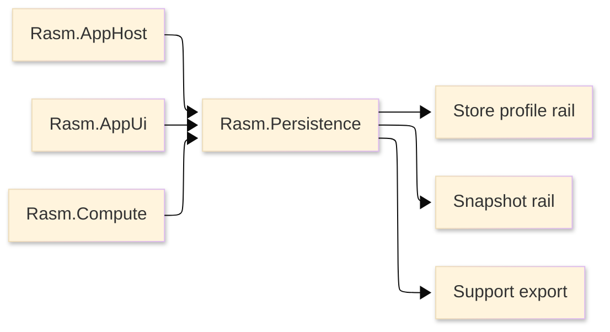

# [RASM_PERSISTENCE_ARCHITECTURE]

`Rasm.Persistence` owns durable state and source profiles. The package is a
manifest-backed project node with no production source; this page defines the
architecture that source must enter.

## [1]-[SYSTEM_SCOPE]

Text equivalent: Persistence consumes AppHost runtime policy and supplies store, snapshot, support, cache, and index contracts to AppUi and Compute.

## [2]-[PROJECT_IDENTITY]

| [INDEX] | [FACT]            | [VALUE]                              |
| :-----: | :---------------- | :----------------------------------- |
|   [1]   | Project file      | `Rasm.Persistence.csproj`            |
|   [2]   | Source state      | no production `.cs` files            |
|   [3]   | Direct packages   | store, provider, snapshot, redaction |
|   [4]   | Project contracts | AppHost                              |
|   [5]   | Host packages     | none                                 |

## [3]-[REFERENCE_DIRECTION]

| [INDEX] | [PROJECT]      | [RELATION]                              |
| :-----: | :------------- | :-------------------------------------- |
|   [1]   | `Rasm.AppHost` | runtime policy, drain, profile handoff  |
|   [2]   | `Rasm.AppUi`   | observes state projection contract      |
|   [3]   | `Rasm.Compute` | uses cache and benchmark index contract |
|   [4]   | host packages  | no direct dependency                    |
|   [5]   | `Rasm`         | no store/provider packages              |

Persistence references AppHost. AppUi and Compute reference Persistence for state and cache contracts. Kernel and host solve paths stay isolated from store packages.

## [4]-[STORE_RAIL]

| [INDEX] | [RAIL]    | [OWNS]                                  |
| :-----: | :-------- | :-------------------------------------- |
|   [1]   | Profile   | path, scope, provider, schema identity  |
|   [2]   | Lifecycle | closed, opening, ready, drain, repair   |
|   [3]   | Query     | typed operation and projection shapes   |
|   [4]   | Schema    | migrations, history, downgrade guard    |
|   [5]   | Native    | SQLite init, PRAGMA, integrity, backup  |
|   [6]   | Provider  | embedded and server store profiles      |
|   [7]   | Snapshot  | JSON, MessagePack, file, compression    |
|   [8]   | Redaction | classification and support export       |
|   [9]   | Cache     | model cache and benchmark indexes       |
|  [10]   | Receipts  | schema, native, query, support evidence |

Provider variance is a store-profile axis. Public code selects store profile,
entity kind, query shape, snapshot codec, redaction class, retention policy, and
receipt projection; it does not select provider packages directly.

## [5]-[CATALOGUE_TRUTH]

Package API facts live in [.reports/api](.reports/api/README.md). Architecture
names store rails and dependency direction; catalogue pages carry package
assemblies, namespaces, usings, type families, operation families, and
package-local admission cards.

Package catalogue pages capture external API facts. Architecture captures Persistence law and never repeats package member lists, package history, or generated lookup tables.

## [6]-[SOURCE_SHAPE_LAW]

- Persistence source enters as one store-profile, query, schema, provider, snapshot, redaction, cache, support, retention, receipt, and drain rail.
- Folder architecture is planned before production source: owner folders, rail entrypoints,
  generated shapes, store profiles, query shapes, snapshot codecs, receipts, and boundaries are named together.
- Store capability deepens the owning rail through profile cases, query shapes, codec rows,
  redaction classes, retention policies, receipts, and AppHost drain contracts before any new public surface is added.
- EF, SQLite, PostgreSQL, Npgsql, MessagePack, LZ4, redaction, NodaTime, and hashing package types stay implementation material behind store vocabulary.
- Flat feature files, provider-branded service families, per-entity repositories, hardcoded provider branches, and loose cache systems are rejected.

## [7]-[BOUNDARIES]

- Persistence owns durable state; AppHost owns runtime scheduling, drain, retry cadence, and support trigger.
- Persistence owns store profiles; host roots supply resolved profile and path values.
- Persistence owns snapshot and codec receipts; consumers receive typed projection values.
- Persistence owns support export redaction; AppHost owns correlation and trigger.
