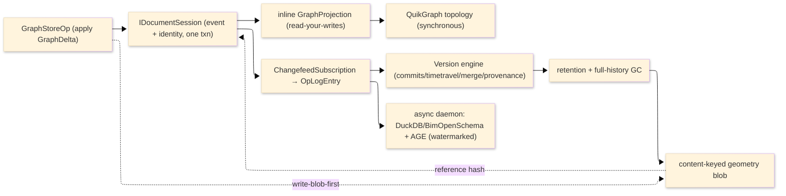

# [RASM_PERSISTENCE_ARCHITECTURE]

The domain map of `Rasm.Persistence` — the APP-PLATFORM durable-state spine that persists the `Rasm.Element` `ElementGraph` as its system of record. One sub-domain owner per concern with closed cases, Marten the append substrate beneath the preserved version-control engine, the read lanes split by consistency demand, and the geometry object store content-keyed.

Each codemap node is the eventual source file its `.planning/` design page becomes, named in PascalCase `.cs`. Treat every node as realized code; the `.planning/` scaffold is the authoring substrate, never part of the map. The package depends UP on the `Rasm.Element` seam and the `Rasm` kernel content-hash; it references no sibling AEC-domain peer (`Rasm.Materials`/`Rasm.Bim`/`Rasm.Fabrication`) — alignment travels through the seam contracts and the content-keyed wire, never sibling coupling.

## [01]-[DOMAIN_MAP]

```text codemap
Rasm.Persistence/
├── Element/              # The ElementGraph store-load roundtrip over Marten
│   ├── Graph.cs          # ElementStore: stream-per-model, GraphDelta event bodies, inline SingleStreamProjection (read-your-writes), AggregateStreamAsync AS-OF, the GraphStoreOp rail with co-txn identity commit
│   ├── Codec.cs          # SnapshotCodec axis, ContentAddress over the kernel seed-zero XxHash128, canonical CBOR, the sealed-header trust boundary + tier ladder, FastCDC content-defined chunker
│   └── Identity.cs       # ElementIdentity relational tier (the one txn owner as a Marten doc), IdentityPolicy key axis, Grant/GrantSet/ObjectAcl/Authority object-ACL, KmsProvider/SigningKeyring/SignedAuthorship signing + EnvelopeKeyring DEK envelope (#KEY_ENVELOPE), the SchemaVerdict boot fold
├── Version/              # The version-control engine projecting FROM Marten events
│   ├── Ledger.cs         # OpLogEntry changefeed projection of Marten events, HLC, ColumnFamily merge-stance, Adjudicate + CRDT dispatch, the sync transports, presence/awareness
│   ├── Commits.cs        # Content-addressed commit-DAG, the convergent op/delta-state CRDT algebra, CrdtOpWire, the ContentParityCorpus
│   ├── TimeTravel.cs     # AS-OF reconstruct/diff/blame/scrub/bisect/branch over the changefeed prefix + the periodic Marten snapshot (Snapshot<T>(SnapshotLifecycle.Inline)) checkpoints, one Crdt.Apply materializer
│   ├── Merge.cs          # StructuralMerge: ElementGraph forest projection, Merkle-pruned base-relative three-way merge, typed conflict classes, RFC 6902 patch egress
│   ├── Provenance.cs     # W3C-PROV causal DAG + the attested (KMS-signed, hash-chained) tamper-evidence ledger
│   ├── Retention.cs      # Classification/retention classes, the holds-first sweep fold, the full-history reachability GC
│   └── Recovery.cs       # RecoveryRoute backup substrates (PG-PITR/object-replica/snapshot-archive), the verified PITR choreography, the RPO/RTO RecoveryFact stream
├── Query/               # The read lanes split by consistency demand
│   ├── Lane.cs           # ReadRouter (synchronous authoritative vs async analytical), the StalenessWatermark, the ElementSet selection algebra, FusionRank, the HybridCache read-through
│   ├── Topology.cs       # In-process QuikGraph view + the frozen incidence index + traversal/path/components/topological-sort (the DEFAULT synchronous topology owner)
│   ├── Columnar.cs       # DuckDB INSTALL/LOAD analytical lane + the co-transactional Ara3D.BimOpenSchema FlatTableProjection + ParquetSharp
│   ├── Cypher.cs         # OPTIONAL self-hosted Apache AGE openCypher + pgrouting (async, demoted beneath QuikGraph)
│   └── Cache.cs          # The compute-result reuse index: ArtifactIndexRow blob index + ModelResultIndex recency horizon + BenchmarkRow claim gate (synchronous, cache/blob retention classes)
├── Ingest/              # Tabular ingress/egress
│   └── Tabular.cs        # TabularSource over MiniExcel — the one spreadsheet/CSV codec into the record rail; the app composition root owns the tabular→element map
└── Store/               # Geometry object store + the server tier
    ├── BlobStore.cs      # Content-keyed geometry object store: write-blob-first + 412-noop seal, the four-provider ObjectClient union, content-defined multipart, the content-lineage catalog + full-history GC
    └── Provisioning.cs   # The self-provisioned PostgreSQL 18 server-extension tier (verification-first) + the embedded-SQLite floor
```

Implementation collapses to one owner per axis and one entrypoint family per rail: a new feature is a row or case on a budgeted owner, and a public type outside an owner region is the named defect. The rail is named in the return type — `Validation<Fault,T>` accumulates, `Fin<T>` aborts, `IO<T>` carries effects; receipts stamp NodaTime `Instant`/`Duration`, and `ClockPolicy` owns elapsed and semantic time. Marten owns the durable append and the rebuildable views; the version-control engine projects from its events; provider variance is row data on the axes; public code selects profiles, lanes, operations, codecs, and policies, never provider packages.

## [02]-[SEAMS]

```text seams
Element/graph        ←  csharp:Rasm.Element                # [SEAM]: ElementGraph/GraphDelta/Node/NodeId/Relationship/Header persisted as the SoR
Element/codec        ←  csharp:Rasm                        # [CONTENT_KEY]: kernel seed-zero XxHash128 entry the ContentAddress composes, no second hasher
Element/codec        →  typescript:wire                    # [WIRE]: SnapshotHeader + canonical-CBOR content-stable bytes
Version/commits      →  typescript:wire                    # [WIRE]: CrdtOpWire MessagePack union + Hlc 16-byte cell
Version/commits      ⇄  python:runtime/transport           # [WIRE]: CrdtOp None-companion bytes + the one XxHash128 seed parity corpus
Version/commits      →  typescript:state                   # [SHAPE]: commit/branch/version-vector/Merkle wire shapes
Version/merge        →  typescript:wire                    # [SHAPE]: JsonPatchDocument RFC 6902 EntityEdit egress
Version/ledger       ⇄  python:runtime/transport           # [WIRE]: OpLogEntry Payload CRDT delta over the one wire vocabulary
Version/ledger       ⇄  csharp:Rasm.AppHost/Runtime        # [PORT]: HLC two-half + TenantContext causal frame; the W3C TraceSlot trace-id slot
Version/timetravel   ←  python:data/gridded/virtual        # [CONTENT_KEY]: icechunk as-of snapshot identity over the shared XxHash128 seed
Version/provenance   ←  python:artifacts/provenance        # [CONTENT_KEY]: signed-artifact content-key binding; the attested-ledger authenticity authority
Version/retention    ←  csharp:Rasm.Compute                # [CONTENT_KEY]: content-keyed Assessment.Result blobs registered in the blob retention class
Element/identity     ⇄  csharp:Rasm.AppHost/Runtime        # [PORT]: ObjectAcl identity store, TenantId RLS, KMS SigningKeyring + EnvelopeKeyring KMS-unwrap handle (#KEY_ENVELOPE, ONE_IDENTITY_STORE)
Element/graph        ←  csharp:Rasm.AppHost/Runtime        # [PORT]: ClockPolicy/CorrelationId/TenantContext ProjectionContext ingredients
Query/topology       ←  csharp:Rasm/Spatial/reconciliation # [CONTENT_KEY]: adjacency-derived GeometryHash the federation/diff reads, never re-mints
Query/columnar       ←  csharp:Rasm.Bim/Model              # [PROJECTION]: BIM-typed BimOpenSchema FlatTableProjection (Bim-implemented seam)
Query/lane           ⇄  python:data/tabular/query          # [WIRE]: ElementSet receipt currency + Substrait portable plan
Query/cache          ←  csharp:Rasm.Compute                # [INDEX]: ArtifactIndexRow blob index + ModelResultIndex recency horizon + BenchmarkRow claim gate, read by reference (no Compute type crosses down)
Store/blobstore      ←  csharp:Rasm.Compute                # [CONTENT_KEY]: authored GLB by the Object RepresentationContentHash body GeometryHash, content-keyed blob written write-first
Store/blobstore      ←  csharp:Rasm.Bim/Exchange           # [CONTENT_KEY]: imported IFC/BREP by the Object RepresentationContentHash IfcRepHash; IfcConvert GLB content-keyed wire
Ingest/tabular       →  csharp:Rasm.Element                # [WIRE]: row shape only; the per-app composition root maps tabular→ElementGraph node
Query/columnar       ⇄  python:data/tabular                # [WIRE]: Arrow record batch over the ADBC driver manager
Store/provisioning   ←  csharp:Rasm.AppHost/Observability  # [HEALTH_PROBE]: Npgsql driver reachability + the ProvisionVerdict folded into a HealthContributorRow
Version/recovery     ←  csharp:Rasm.AppHost/Runtime        # [PORT]: ResolvedProfile RPO/RTO objective inputs
```

## [03]-[SPINE]



`GraphStoreOp.Run` appends the `GraphDelta` event and stores the `ElementIdentity` document in one `IDocumentSession`, so a single `SaveChangesAsync` commits identity plus event; the inline `GraphProjection` materializes the authoritative `ElementGraph` read-your-writes; the `ChangefeedSubscription` projects each committed event into an `OpLogEntry` the version engine and the analytical daemon both fold; the geometry blob writes content-first and the event references its immutable hash; the retention sweep's full-history GC governs both the snapshot spine and the geometry blobs.

## [04]-[BOUNDARIES]

- Persistence is not a domain service layer, repository framework, ORM wrapper, provider wrapper, or host-boundary package; it is RhinoCommon-free, depends up on the `Rasm.Element` seam plus the `Rasm` kernel, and never references a sibling AEC-domain peer.
- Marten owns the durable append and the rebuildable read views; the op-log/CRDT/time-travel/`StructuralMerge`/causal-DAG engine PROJECTS from its events — never a bespoke op-log store beneath Marten, never re-implementing event storage or stream folding.
- The one transaction owner for identity plus event is the `IDocumentSession` (identity as a Marten document in the same session); the geometry blob is write-first and reference-after with no free two-ORM atomicity.
- Authoritative topology/containment reads bind the synchronous inline projection and the in-process QuikGraph view; AGE and DuckDB are async analytical lanes with an explicit staleness watermark, and interactive-correctness reads block on `WaitForNonStaleProjectionDataAsync` and never route to an async projection.
- Typed projection records and the seam `ElementGraph` are the only egress; entity types never cross the package boundary, and provider failure converts into a typed fault at exactly one site per rail.
- AppHost owns scheduling, drain conduction, hop retry, correlation, classification taxonomy, and the cache port; Persistence contributes rows and never reverses the dependency. The database is excluded from the AppHost hop law — `EnableRetryOnFailure` on the pg row and busy-retry on the sqlite rows are the only database retry owners.

## [05]-[PROHIBITIONS]

The closed NEVER list — the deleted patterns the owner regions foreclose.

- NEVER a public type outside a sub-domain owner region; a new capability is a row, case, or policy value on a budgeted owner.
- NEVER a bespoke op-log/event store beneath Marten, a per-`NodeId` stream grain, or a whole-graph event body; the stream is per-model and the body is the `GraphDelta`.
- NEVER route an interactive-correctness read (clash, void-resolution, live QTO) to an async projection without `WaitForNonStaleProjectionDataAsync`; strong-consistency reads go through the inline projection / the synchronous topology.
- NEVER a second materializer beside `Crdt.Apply`/`GraphDelta.Apply`; the projection, the live merge, and the AS-OF reconstruction fold the one delta.
- NEVER a second content-hash, identity, CRDT, selection-shape, or geometry-representation owner; the durable spine rides the one kernel `XxHash128` content address, the one `OpLogEntry` changefeed, the one `ElementSet`, and the one canonical wire geometry.
- NEVER a head-only geometry GC; reachability runs over the full event history (every AS-OF cut), or geometry GC is forbidden (dedup + cold-tiering).
- NEVER `DateTime.UtcNow`, `Stopwatch`, or direct timers; `ClockPolicy` is the only time seam, the HLC the only causal clock.
- NEVER hand-written converters/formatters/migration code beside the generated rails; Thinktecture converters, Marten/EF migrations, and the source-generated resolvers own those forms.
- NEVER a generic receipt abstraction; `GraphReceipt`, `SyncApplyReceipt`, `ConflictReceipt`, `TimeTravelReceipt`, `SweepReceipt`, `RecoveryFact`, `BlobTransferReceipt`, and `RetentionFact` stay typed.
- NEVER admit a new relational engine row — the sweep is closed (PostgreSQL + embedded SQLite only); PostgreSQL is never spawned or bundled by a Rasm process, and provisioning is verification-only (never runtime `ALTER SYSTEM`).
- NEVER reference a sibling AEC-domain peer or a host-SDK type; alignment travels through the `Rasm.Element` seam and the content-keyed wire.
- CSP analyzer diagnostics are architecture pressure: fix the shape, refine the rule on a false positive, never suppress.
