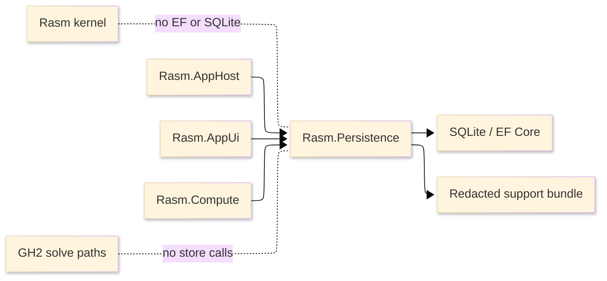

# [RASM_PERSISTENCE_ARCHITECTURE]

`Rasm.Persistence` owns local durable state. It keeps EF/SQLite, schema migration, snapshots, support artifacts, redaction, cache/index data, and live projection out of the kernel and host solve paths.

## [1]-[SYSTEM_SCOPE]

Text equivalent: AppHost supplies scheduling/profile data, Persistence owns the local SQLite store and support export, AppUi observes state, Compute uses cache/index operations, and the kernel/GH solve paths stay isolated.

## [2]-[REFERENCE_DIRECTION]

| [INDEX] | [PROJECT]          | [RELATION]                                         |
| :-----: | ------------------ | -------------------------------------------------- |
|   [1]   | `Rasm.AppHost`     | Runtime policy, drain, profile/path handoff        |
|   [2]   | `Rasm.AppUi`       | Observes app-state projection                      |
|   [3]   | `Rasm.Compute`     | Uses cache/index through store dispatch            |
|   [4]   | `Rasm.Rhino`       | Resolves host profile/path before Persistence call |
|   [5]   | `Rasm.Grasshopper` | No solve-path store calls                          |
|   [6]   | `Rasm`             | No EF, SQLite, redaction, or storage packages      |

Persistence references AppHost for runtime policy. AppHost does not reference Persistence.

## [3]-[STORE_ENTITY_MATRIX]

| [INDEX] | [ENTITY]                 | [KEY]             | [APPSTATE] | [RETENTION]                 |
| :-----: | ------------------------ | ----------------- | :--------: | --------------------------- |
|   [1]   | Settings                 | Scope + key       |    Yes     | Latest per key              |
|   [2]   | UI preferences           | Scope + key       |    Yes     | Latest per key              |
|   [3]   | Presets                  | Preset key        |    Yes     | User-owned                  |
|   [4]   | Sessions                 | Session key       |    Yes     | Configured recent window    |
|   [5]   | Cache metadata           | Cache key         |    Yes     | Size and age policy         |
|   [6]   | Model-result cache       | Model key + input |     No     | Content-hash invalidation   |
|   [7]   | Benchmark artifact index | Run id            |     No     | Artifact retention policy   |
|   [8]   | Support artifacts        | Correlation id    |     No     | Export window and size cap  |
|   [9]   | Snapshots                | Snapshot id       |     No     | Schema compatibility policy |
|  [10]   | Operation log/counts     | Operation id      |    Yes     | Rolling window              |
|  [11]   | Retention state          | Policy key        |     No     | Latest per policy           |
|  [12]   | Schema metadata          | Schema key        |     No     | Append-only                 |

## [4]-[STORE_LIFECYCLE]

Store lifecycle is one ordered state machine. The table names normal transitions; receipt failures from native initialization, integrity checks, migration, projection, snapshot, export, compaction, or drain enter `Faulted`. From `Ready`, work states are `Projecting`, `Snapshotting`, `Exporting`, and `Compacting`.

| [INDEX] | [STATE]             | [ROLE]                                                  | [NEXT]                                         |
| :-----: | ------------------- | ------------------------------------------------------- | ---------------------------------------------- |
|   [1]   | Closed              | No connection, context, worker, or native use           | Opening                                        |
|   [2]   | Opening             | Accept profile/path and initialize native SQLite        | NativeReady; NativeUnavailable                 |
|   [3]   | NativeReady         | Load SQLite bundle and apply PRAGMA policy              | IntegrityChecking                              |
|   [4]   | IntegrityChecking   | Read integrity, version, WAL, and lock facts            | Migrating; Ready; MaintenanceRequired; Corrupt |
|   [5]   | Migrating           | Apply forward migration under the EF SQLite lock        | Ready; MaintenanceRequired                     |
|   [6]   | Ready               | Run queries, writes, projection, snapshots, and exports | Work state; Draining                           |
|   [7]   | Projecting          | Fold committed changes into app state                   | Ready; Draining                                |
|   [8]   | Snapshotting        | Encode, checksum, and retain snapshot envelope          | Ready                                          |
|   [9]   | Exporting           | Classify, redact, and write support bundle              | Ready                                          |
|  [10]   | Compacting          | Run vacuum, checkpoint, or backup outside solve paths   | Ready                                          |
|  [11]   | Draining            | Fence new operations and complete projection            | Closed                                         |
|  [12]   | MaintenanceRequired | Expose abandoned lock, partial migration, or repair     | Opening; Closed                                |
|  [13]   | NativeUnavailable   | Report failed native SQLite bundle load                 | Closed                                         |
|  [14]   | Corrupt             | Quarantine normal use after integrity failure           | Exporting; Closed                              |
|  [15]   | Faulted             | Terminal typed failure                                  | Exporting; Closed                              |

Lifecycle facts emit receipts with path classification, schema version, lock state, elapsed time, correlation, and redaction status where relevant.

## [5]-[SCHEMA_AND_MIGRATION]

| [INDEX] | [SURFACE]               | [CONTRACT]                                                    |
| :-----: | ----------------------- | ------------------------------------------------------------- |
|   [1]   | `__EFMigrationsHistory` | Append-only EF migration log                                  |
|   [2]   | `PRAGMA user_version`   | Integer fast-path schema gate                                 |
|   [3]   | `__EFMigrationsLock`    | EF9+ SQLite migration concurrency lock                        |
|   [4]   | Abandoned lock          | Maintenance receipt and operator-visible recovery path        |
|   [5]   | Partial migration       | Crash/interrupted apply receipt                               |
|   [6]   | Downgrade guard         | Rejects store versions above the compiled model               |
|   [7]   | Integrity check         | `PRAGMA integrity_check` before normal open                   |
|   [8]   | Backup                  | `SqliteConnection.BackupDatabase`, never WAL-racing file copy |
|   [9]   | Compaction              | `VACUUM INTO` or incremental vacuum plus WAL checkpoint       |

Migrations are forward-only. Rollback is represented by a new forward migration.

## [6]-[NATIVE_AND_PRAGMA_INIT]

SQLite initialization:

| [INDEX] | [STEP]         | [CONTRACT]                                           |
| :-----: | -------------- | ---------------------------------------------------- |
|   [1]   | Native init    | `SQLitePCL.Batteries.Init()` before first connection |
|   [2]   | Native package | `SQLitePCLRaw.bundle_e_sqlite3` bundle chain         |
|   [3]   | Journal        | `journal_mode=WAL`                                   |
|   [4]   | Busy timeout   | Explicit `busy_timeout`                              |
|   [5]   | Durability     | Explicit `synchronous=NORMAL`                        |
|   [6]   | Constraints    | Explicit `foreign_keys=ON`                           |

`EnableRetryOnFailure` is not an EF SQLite API. Contention is handled by PRAGMA and AppHost retry cadence through receipts.

## [7]-[LIVE_STATE]

Persistence owns the EF-to-projection fold. A named serial projection worker receives committed changes, folds them into read-only app state, and publishes serialized updates. `Task.Run` is not a free carve-out. The worker participates in AppHost drain and completes after the final store flush. `OnError` is never called; faults are receipts.

AppUi observes through its scheduler and applies sampling/throttling. DynamicData and mutable subjects stay internal.

## [8]-[SUPPORT_AND_REDACTION]

Support bundles contain classified data:

| [INDEX] | [CLASS]          | [EXAMPLES]                                     | [ACTION]                                 |
| :-----: | ---------------- | ---------------------------------------------- | ---------------------------------------- |
|   [1]   | Path             | Store path, artifact path, screenshot path     | Redact root/user                         |
|   [2]   | User content     | Preset names, session labels, logs             | Redact or hash                           |
|   [3]   | Runtime evidence | Receipts, health, package graph                | Keep bounded                             |
|   [4]   | Visual evidence  | Screenshots, thumbnails                        | Redact sensitive regions when classified |
|   [5]   | Store metadata   | Schema, migration, corruption, cache summaries | Keep without raw payload                 |

`Microsoft.Extensions.Compliance.Redaction` is active only with classification and redactor registration. Persistence owns support export redaction; AppHost owns trigger/correlation.

## [9]-[PACKAGE_LANES]

Package lanes are implementation contracts for one store and snapshot rail.

[EF_SQLITE]:
- Package set: `Microsoft.EntityFrameworkCore.Sqlite`, `EFCore.NamingConventions`.
- Contract: EF owns schema mapping, migrations, history, query shape, naming, downgrade guard, and operation-scoped contexts.

[RAW_SQLITE]:
- Package set: `Microsoft.Data.Sqlite`, `SQLitePCLRaw.bundle_e_sqlite3`.
- Contract: raw SQLite owns native initialization, PRAGMA setup, backup, integrity, compaction, bulk import baselines, and low-level receipts.

[EF_DESIGN]:
- Package set: `Microsoft.EntityFrameworkCore.Design`.
- Contract: migration generation is a tooling lane and does not become a runtime core dependency.

[TIME_SERIALIZATION]:
- Package set: `NodaTime`, `NodaTime.Serialization.SystemTextJson`.
- Contract: persisted and audited time uses semantic timestamps with explicit JSON serialization.

[CHECKSUM_AND_REDACTION]:
- Package set: `System.IO.Hashing`, `Microsoft.Extensions.Compliance.Redaction`.
- Contract: checksums, classifications, redactors, support exports, cache keys, and artifact identities are part of store receipts.

[JSON_SNAPSHOT]:
- Surface set: `System.Text.Json` source generation.
- Contract: JSON is the in-box snapshot codec for readable envelopes and support artifacts.

[MESSAGEPACK_SNAPSHOT]:
- Package set: `MessagePack`, `MessagePackAnalyzer`.
- Contract: MessagePack is the compact binary snapshot codec with analyzer/source-generator coverage, round-trip proof, hash proof, and compatibility receipts.

[LZ4_COMPRESSION]:
- Package set: `K4os.Compression.LZ4`.
- Contract: LZ4 is the measured compression lane for snapshot payloads and support artifacts.

[COMPANION_DATABASE]:
- Package set: provider package selected by store profile.
- Contract: out-of-process storage is one store-profile case with the same lifecycle, query algebra, receipts, redaction, support export, and AppHost drain behavior.

Rejected core packages: SQLCipher bundle, MemoryPack, EF proxies, Npgsql in-process, ASP.NET DataProtection, broad provider bulk-extension packages.

Provider variety is a store-profile concern. Public code selects store profile, entity kind, query shape, snapshot codec, redaction class, retention policy, and receipt projection; it does not select EF, SQLite, JSON, MessagePack, or external database packages directly.

## [10]-[ENCRYPTION_POLICY]

Core Persistence does not use SQLCipher. File protection is OS/profile/storage-policy owned. Package-level encryption absence is represented by an explicit unavailable receipt; it is not retried and does not fork the SQLite native bundle lane.

## [11]-[PROOF]

| [INDEX] | [RAIL]       | [REQUIRED_PROOF]                                    |
| :-----: | ------------ | --------------------------------------------------- |
|   [1]   | Build        | Persistence project restores as a package scaffold  |
|   [2]   | Architecture | Persistence does not reference Rhino/GH2/AppUi      |
|   [3]   | Schema       | Migration, lock, downgrade, partial, integrity laws |
|   [4]   | Native       | SQLite native load and PRAGMA application           |
|   [5]   | Projection   | Serial fold, seed, completion, no `OnError`         |
|   [6]   | Support      | Redaction and bounded export evidence               |
