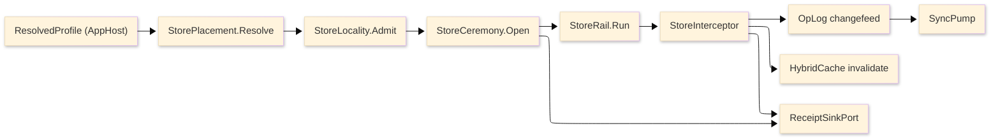

# [RASM_PERSISTENCE_ARCHITECTURE]

`Rasm.Persistence` owns durable state for the app suite through seventeen polymorphic rails, each a dispatch surface whose variance lives in axis rows, cases, and policy values. This page leads on the planned implementation source tree, then names the boot spine, the rails and their owning axes, the dependency direction, and the cross-package seams; the finalized pages under [.planning](.planning/README.md) carry the transcription-complete signatures.

## [1]-[SOURCE_TREE]

The planned namespaced layout: one leaf per charter BUILD_ORDER file, grouped into axis-named sub-folders. Each leaf names the budgeted owner it transcribes and the owning `page#cluster` anchors from the BUILD_ORDER. The `.planning/` corpus stays flat; this tree is the implementation source only.

```text codemap
Rasm.Persistence/
├── Stores/
│   ├── Profiles.cs           # StoreProfile, StorePlacement — store-profiles#PROFILE_AXIS, store-profiles#PLACEMENT_MATRIX, store-profiles#CROSS_PROCESS_LAW
│   ├── Lifecycle.cs          # StoreLifecycle, ExtensionRequirement — store-profiles#STORE_LIFECYCLE, store-profiles#PROVISIONING_ROWS
│   ├── ServerTier.cs         # TimescaleProvisioning, SearchProvisioning, ClusterConfig, TenancyModel, MigrationBundle — server-tier#TIMESCALE_PROVISIONING, server-tier#SEARCH_PROVISIONING, server-tier#CLUSTER_CONFIG, server-tier#TENANCY_RLS, server-tier#MIGRATION_BUNDLE
│   └── RemoteStores.cs       # ObjectStore, MultipartTransfer, ObjectResidence, ArtifactSyncFeed, RemoteStoreFault — remote-stores#OBJECT_STORE, remote-stores#MULTIPART_TRANSFER, remote-stores#OBJECT_RESIDENCE, remote-stores#ARTIFACT_SYNC_FEED
├── Schema/
│   └── SchemaRail.cs         # SchemaDdl, IdentityPolicy, ConverterRail — schema-rail#IDENTITY_POLICY, schema-rail#MIGRATION_LAW, schema-rail#GENERATED_COLUMNS, schema-rail#EXTENSION_DDL, schema-rail#CONVERTER_RAIL
├── Lanes/
│   └── DataLanes.cs          # DataLane, GeoLayer, TabularExportSpec — data-lanes#LANE_AXIS, data-lanes#DOCUMENT_LANE, data-lanes#SEARCH_LANES, data-lanes#GEO_LANES, data-lanes#ANALYTICAL_LANE
├── Native/
│   └── Sqlite.cs             # SqlitePragma, ExtensionGate, DbConfig — native-sqlite#PRAGMA_TABLE, native-sqlite#COMPILE_SURFACE, native-sqlite#MAINTENANCE_OPS, native-sqlite#EXTENSION_GATES
├── Query/
│   └── QueryRail.cs          # StoreOp, KeysetPage, StoreInterceptor — query-rail#OPERATION_ALGEBRA, query-rail#PROJECTION_SHAPES, query-rail#BULK_LANE, query-rail#INTERCEPTOR_SPINE
├── Cache/
│   └── Indexes.cs            # CacheContribution — cache-indexes#L2_CONTRIBUTION, cache-indexes#MODEL_RESULT_INDEX, cache-indexes#ARTIFACT_BLOB_INDEX, cache-indexes#BENCHMARK_INDEX
├── Snapshots/
│   └── Codecs.cs             # SnapshotCodec, CompressionPolicy, HashPolicy — snapshot-codecs#CODEC_AXIS, snapshot-codecs#COMPRESSION_HASHING, snapshot-codecs#SNAPSHOT_PROTOCOL, snapshot-codecs#RESTORE_AND_DIFF
├── Sync/
│   └── Collaboration.cs      # SyncOpKind, SyncTransport, PresenceRow, Awareness, Replication — sync-collaboration#OPLOG_CHANGEFEED, sync-collaboration#MERGE_LAW, sync-collaboration#TRANSPORT_AXIS, sync-collaboration#PRESENCE_AND_BLOB
├── Retention/
│   └── Redaction.cs          # RetentionPolicy, ArtifactClasses, ClosureGc, AuditBinding — redaction-retention#CLASSIFICATION_ENFORCEMENT, redaction-retention#RETENTION_SWEEPS, redaction-retention#EXPORT_PROOF, redaction-retention#AUDIT_BINDING
├── Versioning/
│   └── VersionControl.cs     # CommitGraph, Crdt, TimeTravel, StructuralMerge — version-control#COMMIT_DAG, version-control#CRDT_ALGEBRA, version-control#TIME_TRAVEL, version-control#STRUCTURAL_DIFF
├── Federation/
│   └── Federation.cs         # EntityGraph, ElementSetAlgebra, LinkStore, RulePlan, FusionRank, FederatedPlan — federation#ENTITY_GRAPH, federation#ELEMENT_SET_ALGEBRA, federation#CROSS_DOC_LINKS, federation#RULE_PLAN, federation#FUSION_RANK, federation#FEDERATED_PLAN
├── Provenance/
│   └── Provenance.cs         # Provenance, AttestedLedger, LineageCdc — provenance#CAUSAL_DAG, provenance#ATTESTED_LEDGER, provenance#LINEAGE_CDC
├── Annotation/
│   └── Annotation.cs         # Anchors, Bcf, CdeSync — annotation#ANCHOR_ALGEBRA, annotation#BCF_PROTOCOL, annotation#CDE_SYNC
├── Catalog/
│   └── CatalogCost.cs        # Catalog, CostRollup — catalog-cost#CLASSIFICATION_CATALOG, catalog-cost#COST_ROLLUP
└── Schedule/
    └── ScheduleInterchange.cs # ScheduleImport, FourDState — schedule-interchange#SCHEDULE_STORE, schedule-interchange#TASK_LINK_4D
```

`Cache/Indexes.cs` precedes `Snapshots/Codecs.cs` and the two gate as one build closure: `PersistenceWireContext` declares the `CacheIndexFact` serializable row while `IndexSurface` consumes the generated context. `Stores/Lifecycle.cs` precedes `Schema/SchemaRail.cs` so `StoreOpenReceipt.SchemaFingerprint` stays a bare `ulong` ledger seam until `SchemaFingerprint` owns it. `StoreProfile` and `StorePlacement` land together in `Stores/Profiles.cs`, never split. `Stores/ServerTier.cs` follows `Stores/Lifecycle.cs` and `Schema/SchemaRail.cs` — it consumes `ExtensionRequirement` and `SchemaDdl` as settled vocabulary. `Stores/RemoteStores.cs` follows `Stores/Profiles.cs` and the snapshot/sync closure — it consumes the `BlobRemote` contract, the Compute `ARTIFACT_FRAMES` frame constants, and the `OpLogEntry` op-log as settled, never re-declaring a frame width or a second sync engine. The BIM-currency leaves close in dependency order: `Versioning/VersionControl.cs` follows the sync/snapshot closure (its CRDT algebra supersedes the LWW `Adjudicate` scalar through the op-log wire-vocabulary amendment); `Federation/Federation.cs` follows it and the data-lanes PostGIS substrate (the federated entity is the substrate the next four ride); then `Provenance/Provenance.cs`, `Annotation/Annotation.cs`, `Catalog/CatalogCost.cs`, and `Schedule/ScheduleInterchange.cs` follow, each consuming the federated entity, the element-set currency, the op-log, and the time-travel fold as settled vocabulary.

## [2]-[SPINE]



Text equivalent: the resolved profile folds to a placement, locality admission gates it, the open ceremony proves the store ready, every operation dispatches through the store rail into the interceptor spine, and the spine fans out to the op-log changefeed, cache invalidation, and the receipt sink; the op-log feeds the sync pump.

## [3]-[RAILS]

| [INDEX] | [RAIL]              | [OWNING_AXES]                                                                                                            | [PAGE#CLUSTER]                                 |
| :-----: | :------------------ | :----------------------------------------------------------------------------------------------------------------------- | :--------------------------------------------- |
|   [1]   | Store profiles      | `StoreProfile` · `StoreLifecycle` · `StorePlacement` · `StoreLeaseRow` · `ExtensionRequirement`                          | store-profiles#PROFILE_AXIS                    |
|   [2]   | Data lanes          | `DataLane` · `JsonIndex` · `VectorMetric` · `FullTextMode` · `GeoLayer` · `TabularExportSpec`                            | data-lanes#LANE_AXIS                           |
|   [3]   | Schema rail         | `IdentityPolicy` · `SchemaFault` · `SchemaFingerprint` · `DerivedColumn` · `SchemaDdl` · `ConverterRail`                 | schema-rail#MIGRATION_LAW                      |
|   [4]   | Query rail          | `StoreOp<T>` · `StoreFault` · `KeysetPage<TRow>` · `FilterPredicate` · `BulkRoute` · `StoreFact.BulkShed` · `StoreInterceptor` · `StoreFact` | query-rail#OPERATION_ALGEBRA                   |
|   [5]   | Native SQLite       | `SqlitePragma` · `SqliteFactKind` · `SqliteCompileSurface` · `SqliteMaintenance` · `ExtensionGate`                       | native-sqlite#PRAGMA_TABLE                     |
|   [6]   | Snapshot codecs     | `SnapshotCodec` · `CompressionPolicy` · `HashPolicy` · `GeoJsonProjection` · `SnapshotHeader` · `PersistenceWireContext` | snapshot-codecs#CODEC_AXIS                     |
|   [7]   | Cache indexes       | `CacheContribution` · `ModelResultKey` · `ArtifactIndexRow` · `IfcSemantic` · `BenchmarkRow`                             | cache-indexes#L2_CONTRIBUTION                  |
|   [8]   | Sync collaboration  | `SyncOpKind` · `OpLogEntry` · `ConflictOutcome` · `SyncTransport` · `PresenceRow`                                        | sync-collaboration#OPLOG_CHANGEFEED            |
|   [9]   | Redaction retention | `RetentionPolicy` · `ArtifactClasses` · `ClosureGc` · `ExportProof` · `AuditBinding`                                     | redaction-retention#CLASSIFICATION_ENFORCEMENT |
|  [10]   | Server tier         | `TimescaleProvisioning` · `SearchProvisioning` · `ClusterConfig` · `TenancyModel` · `MigrationBundle`                    | server-tier#TIMESCALE_PROVISIONING             |
|  [11]   | Remote stores       | `ObjectStore` · `MultipartTransfer` · `ObjectResidence` · `ArtifactSyncFeed` · `RemoteStoreFault`                        | remote-stores#OBJECT_STORE                     |
|  [12]   | Version control     | `CommitGraph` · `VersionVector` · `Crdt` · `TimeTravel` · `StructuralMerge` · `MergeConflict`                            | version-control#COMMIT_DAG                     |
|  [13]   | Federation          | `EntityGraph` · `ElementSet` · `SetExpr` · `LinkStore` · `RulePlan` · `FusionRank` · `FederatedPlan`                     | federation#ENTITY_GRAPH                        |
|  [14]   | Provenance          | `Provenance` · `ProvEdge` · `LineageSlice` · `AttestedLedger` · `LineageCdc`                                             | provenance#CAUSAL_DAG                          |
|  [15]   | Annotation          | `Anchor` · `Thread` · `Anchors` · `Bcf` · `BcfTopic` · `CdeSync`                                                         | annotation#ANCHOR_ALGEBRA                      |
|  [16]   | Catalog + cost      | `Catalog` · `ClassificationCode` · `CostCode` · `CostRollup`                                                             | catalog-cost#CLASSIFICATION_CATALOG            |
|  [17]   | Schedule + 4D       | `ScheduleImport` · `ScheduleTask` · `TaskElementLink` · `FourDState`                                                     | schedule-interchange#SCHEDULE_STORE            |

Provider variance is row data on these axes. Public code selects profiles, lanes, operations, codecs, and policies; it never selects provider packages. The BIM-currency rails ([12]-[17]) ride the existing substrate — the op-log changefeed, the content-addressed snapshots, and the PostGIS GiST + jsonb + ltree lanes — and never admit a new engine.

## [4]-[DEPENDENCY_DIRECTION]

- Persistence is RhinoCommon-free; app roots resolve host profile, paths, and dsn values before any call enters.
- AppHost owns scheduling, drain conduction, hop retry, correlation, classification taxonomy, and the cache port; Persistence contributes rows to each, never the reverse.
- Schema rail consumes the bare `ulong` fingerprint slot from the lifecycle open receipt; the typed `SchemaFingerprint` owner resolves it without forward reference.
- Cache indexes and snapshot codecs share `PersistenceWireContext` as one build closure; the serializable index fact and the generated context resolve together.

## [5]-[CROSS_PACKAGE_SEAMS]

Seam altitudes record in the suite ledger [SEAM_SPLITS](../.planning/region-map/seam-splits.md); this matrix is the Persistence cut.

| [INDEX] | [SEAM]                    | [MECHANICS_OWNER]                                              | [PERSISTENCE_SIDE]                                                                                                |
| :-----: | :------------------------ | :------------------------------------------------------------- | :---------------------------------------------------------------------------------------------------------------- |
|   [1]   | Resolved profile + roots  | AppHost host-profiles                                          | placement fold consumes `ResolvedProfile`/`ProfileRoots`; zero path derivation                                    |
|   [2]   | Clock seam                | AppHost time-and-deadlines                                     | TTL, retention, HLC, and lease stamping ride `ClockPolicy`                                                        |
|   [3]   | Drain order               | AppHost lifecycle-and-drain rank bands                         | store rows rank 310-350 inside the Stores band                                                                    |
|   [4]   | HybridCache               | AppHost resource-lanes (port, stampede, tags)                  | cache-indexes#L2_CONTRIBUTION supplies L2 store + serializer factory                                              |
|   [5]   | DataClassification        | AppHost diagnostics-and-telemetry taxonomy                     | redaction-retention#CLASSIFICATION_ENFORCEMENT store-side guard rows                                              |
|   [6]   | Receipt sink              | AppHost runtime-ports `ReceiptSinkPort`                        | query facts, snapshot catalog stamps, and sync HLC ride the envelope                                              |
|   [7]   | Telemetry contribution    | AppHost runtime-ports `TelemetryContributorPort`               | query-rail#INTERCEPTOR_SPINE registers the Npgsql tracer and meter rows                                           |
|   [8]   | Outbound retry            | AppHost outbound-resilience hop law                            | database retry excluded; `EnableRetryOnFailure` + busy-retry on store rows; HttpDelta sync rides the http hop     |
|   [9]   | Config reload             | AppHost configuration-and-options                              | user-settings writes + op-log HLC tag-invalidation cursor for peers                                               |
|  [10]   | ArtifactSync framing      | Compute remote-lane frame constants                            | sync-collaboration#PRESENCE_AND_BLOB and `BlobRemote` consume 64 KiB / Crc32 / XxHash128 settled                  |
|  [11]   | Model-result cache        | Persistence cache-indexes#MODEL_RESULT_INDEX                   | Compute model-lane reads results through `IndexSurface`, never the raw port                                       |
|  [12]   | Idempotency dedup window  | Persistence redaction-retention 24 h age-bound row             | Compute DocumentService dedup window quotes the same horizon                                                      |
|  [13]   | Suite wire law            | Persistence snapshot-codecs + sync-collaboration TS_PROJECTION | AppHost runtime-ports merges `PersistenceWireContext` into the suite contract                                     |
|  [14]   | Fingerprint slot          | Persistence schema-rail `SchemaFingerprint`                    | store-profiles open receipt carries the bare `ulong`; zero forward reference                                      |
|  [15]   | Pooled-context residence  | Persistence store-profiles delegate columns                    | app roots build one `PooledDbContextFactory` per placement; query-rail leases                                     |
|  [16]   | Canonical wire geometry   | Compute `GeometryPayload` proto oneof                          | snapshot-codecs#CODEC_AXIS `GeoJsonProjection` projects off the oneof; never mints a second geometry              |
|  [17]   | Tenancy threading         | AppHost runtime-ports `TenantContext`                          | server-tier#TENANCY_RLS RLS policy + content-address cache-key partition consume the tenant id, never mint it     |
|  [18]   | pgaudit category binding  | Persistence redaction-retention#AUDIT_BINDING                  | server-tier#TENANCY_RLS RLS policy ties to the audit category the binding owns; mechanics split, never duplicated |
|  [19]   | ArtifactSync object frame | Compute remote-lane frame constants                            | remote-stores#MULTIPART_TRANSFER windows whole 64-KiB frames; #ARTIFACT_SYNC_FEED consumes the op-log changefeed  |
|  [20]   | CRDT op-log wire amendment | Persistence version-control#CRDT_ALGEBRA                       | `OpLogEntry.Payload` carries a `CrdtOp` delta for `column-family=crdt` rows; supersedes LWW `Adjudicate`; TS-web/Python decode `CrdtOpWire` — a breaking suite wire-vocabulary amendment, recorded as a seam-split |
|  [21]   | Structural-diff node identity | Persistence version-control#STRUCTURAL_DIFF                   | federation#ENTITY_GRAPH keys on the same `(GeometryHash, PropertyHash)` signature; annotation re-anchors over the `EditOp` script; one node identity, never duplicated |
|  [22]   | Lineage join dimension    | Persistence provenance#CAUSAL_DAG                              | federation#FUSION_RANK carries per-hit provenance head; version-control blame reads the same winning op; the attested ledger chains the audit category |
|  [23]   | Federated element-set currency | Persistence federation#ELEMENT_SET_ALGEBRA                   | rule-plan results, catalog-cost takeoff subjects, schedule task-element links, and BCF viewpoints all consume the one `ElementSet`; never a parallel selection shape |
|  [24]   | BCF/CDE OAuth2 hop         | AppHost outbound-resilience HTTP pipelines                     | annotation#CDE_SYNC rides the OAuth2 outbound hop; token lifecycle owned at AppHost, never a second OAuth2 client |
|  [25]   | Compute interchange graph | Compute interchange IFC parse + GLB tessellation               | federation#ENTITY_GRAPH ingests the `IfcSemantic` model graph as one source; the geometry-hash canonical adjacency is the same the structural diff reads; schedule consumes the Compute P6/XER parse companion bytes |
|  [26]   | Object-level authz seam   | Persistence schema-rail#IDENTITY_POLICY                        | version-control#COMMIT_DAG `BranchAcl` is the branch-scoped projection of `ObjectAcl`; signed authorship resolves the signing key through the AppHost identity seam; server-tier RLS is the coarse tenant scope, object-ACL the fine within-tenant scope |

## [6]-[BOUNDARIES]

- Typed projection records are the only egress; entity types never cross the package boundary.
- Provider failure converts into `StoreFault` at exactly one site on the query rail.
- Provider, codec, and engine types stay implementation material behind axis vocabulary; consumers select rows, never packages.
- No store operation runs on GH solve hot paths.
