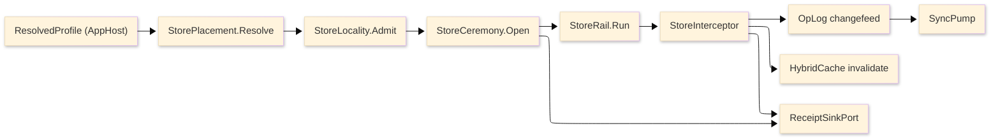

# [PERSISTENCE_ARCHITECTURE]

`Rasm.Persistence` is one durable-state spine: every concern is an axis owner with closed cases, every entrypoint is a typed rail, and every cross-package fact crosses through a settled AppHost port or a named seam. Mechanics live in the finalized `.planning/` pages; this page is the atlas — the implementation source tree, the owner registry (the one owner-state surface), dependency direction, cross-package seams, the store-flow spine, and the boundaries and prohibitions.

## [1]-[SOURCE_TREE]

The planned namespaced implementation layout IS the build order: each leaf is one transcription unit, vocabulary owners before consumers, shapes before rails, rails before dispatch, boundaries before composition. Each leaf is annotated with the owners it transcribes and the owning page#cluster; sub-folders group the flat file set by concern axis.

```text codemap
Rasm.Persistence/
├── Stores/
│   ├── Profiles.cs           # StoreProfile, StorePlacement — store-profiles#PROFILE_AXIS, #PLACEMENT_MATRIX, #CROSS_PROCESS_LAW
│   ├── Lifecycle.cs          # StoreLifecycle, ExtensionRequirement — store-profiles#STORE_LIFECYCLE, #PROVISIONING_ROWS
│   ├── ServerTier.cs         # TimescaleProvisioning, SearchProvisioning, ClusterConfig, TenancyModel, MigrationBundle — server-tier#TIMESCALE_PROVISIONING, #SEARCH_PROVISIONING, #CLUSTER_CONFIG, #TENANCY_RLS, #MIGRATION_BUNDLE
│   └── RemoteStores.cs       # ObjectStore, MultipartTransfer, ObjectResidence, ArtifactSyncFeed, RemoteStoreFault — remote-stores#OBJECT_STORE, #MULTIPART_TRANSFER, #OBJECT_RESIDENCE, #ARTIFACT_SYNC_FEED
├── Schema/
│   └── SchemaRail.cs         # SchemaDdl, IdentityPolicy, ConverterRail — schema-rail#IDENTITY_POLICY, #MIGRATION_LAW, #GENERATED_COLUMNS, #EXTENSION_DDL, #CONVERTER_RAIL
├── Lanes/
│   └── DataLanes.cs          # DataLane, GeoLayer, TabularExportSpec — data-lanes#LANE_AXIS, #DOCUMENT_LANE, #SEARCH_LANES, #GEO_LANES, #ANALYTICAL_LANE
├── Native/
│   └── Sqlite.cs             # SqlitePragma, ExtensionGate, DbConfig — native-sqlite#PRAGMA_TABLE, #COMPILE_SURFACE, #MAINTENANCE_OPS, #EXTENSION_GATES
├── Query/
│   └── QueryRail.cs          # StoreOp, KeysetPage, StoreInterceptor — query-rail#OPERATION_ALGEBRA, #PROJECTION_SHAPES, #BULK_LANE, #INTERCEPTOR_SPINE
├── Cache/
│   └── Indexes.cs            # CacheContribution — cache-indexes#L2_CONTRIBUTION, #MODEL_RESULT_INDEX, #ARTIFACT_BLOB_INDEX, #BENCHMARK_INDEX
├── Snapshots/
│   └── Codecs.cs             # SnapshotCodec, CompressionPolicy, HashPolicy — snapshot-codecs#CODEC_AXIS, #COMPRESSION_HASHING, #SNAPSHOT_PROTOCOL, #RESTORE_AND_DIFF
├── Sync/
│   └── Collaboration.cs      # SyncOpKind, SyncTransport, PresenceRow, Awareness, Replication — sync-collaboration#OPLOG_CHANGEFEED, #MERGE_LAW, #TRANSPORT_AXIS, #PRESENCE_AND_BLOB
├── Retention/
│   └── Redaction.cs          # RetentionPolicy, ArtifactClasses, ClosureGc, AuditBinding — redaction-retention#CLASSIFICATION_ENFORCEMENT, #RETENTION_SWEEPS, #EXPORT_PROOF, #AUDIT_BINDING
├── Versioning/
│   └── VersionControl.cs     # CommitGraph, Crdt, TimeTravel, StructuralMerge — version-control#COMMIT_DAG, #CRDT_ALGEBRA, #TIME_TRAVEL, #STRUCTURAL_DIFF
├── Federation/
│   └── Federation.cs         # EntityGraph, ElementSetAlgebra, LinkStore, RulePlan, FusionRank, FederatedPlan — federation#ENTITY_GRAPH, #ELEMENT_SET_ALGEBRA, #CROSS_DOC_LINKS, #RULE_PLAN, #FUSION_RANK, #FEDERATED_PLAN
├── Provenance/
│   └── Provenance.cs         # Provenance, AttestedLedger, LineageCdc — provenance#CAUSAL_DAG, #ATTESTED_LEDGER, #LINEAGE_CDC
├── Annotation/
│   └── Annotation.cs         # Anchors, Bcf, CdeSync — annotation#ANCHOR_ALGEBRA, #BCF_PROTOCOL, #CDE_SYNC
├── Catalog/
│   └── CatalogCost.cs        # Catalog, CostRollup — catalog-cost#CLASSIFICATION_CATALOG, #COST_ROLLUP
└── Schedule/
    └── ScheduleInterchange.cs # ScheduleImport, FourDState — schedule-interchange#SCHEDULE_STORE, #TASK_LINK_4D
```

`Cache/Indexes.cs` precedes `Snapshots/Codecs.cs` and the two gate as one build closure: `PersistenceWireContext` declares the `CacheIndexFact` serializable row while `IndexSurface` consumes the generated context. `Stores/Lifecycle.cs` precedes `Schema/SchemaRail.cs` so `StoreOpenReceipt.SchemaFingerprint` stays a bare `ulong` ledger seam until `SchemaFingerprint` owns it. `StoreProfile` and `StorePlacement` land together in `Stores/Profiles.cs`, never split. `Stores/ServerTier.cs` follows `Stores/Lifecycle.cs` and `Schema/SchemaRail.cs` — it consumes `ExtensionRequirement` and `SchemaDdl` as settled vocabulary. `Stores/RemoteStores.cs` follows `Stores/Profiles.cs` and the snapshot/sync closure — it consumes the `BlobRemote` contract, the Compute `ARTIFACT_FRAMES` frame constants, and the `OpLogEntry` op-log as settled, never re-declaring a frame width or a second sync engine. The BIM-currency leaves close in dependency order: `Versioning/VersionControl.cs` follows the sync/snapshot closure (its CRDT algebra supersedes the LWW `Adjudicate` scalar through the op-log wire-vocabulary amendment); `Federation/Federation.cs` follows it and the data-lanes PostGIS substrate (the federated entity is the substrate the next four ride); then `Provenance/Provenance.cs`, `Annotation/Annotation.cs`, `Catalog/CatalogCost.cs`, and `Schedule/ScheduleInterchange.cs` follow, each consuming the federated entity, the element-set currency, the op-log, and the time-travel fold as settled vocabulary. TS_PROJECTION clusters carry no C# build row; they transcribe into the TS workspace at web app-root creation.

## [2]-[OWNER_REGISTRY]

The single owner-state surface for the package. Implementation collapses to one owner per axis and one entrypoint family per rail; density means no parallel rails, no near-duplicate shapes, no re-derived logic — a file is as large as its owner's concern requires, never trimmed to a line count. A new feature is a row or case, never a new surface; a public type outside these owner regions is the named defect. The `[OWNER]` cell folds every extension block and mapping descriptor under its axis owner — `StoreOpCompose` rides axis [11], the tabular/relation descriptors ride axis [8], the embedding/query descriptors ride axis [7], `DbConfig` rides axis [16], the composite/enum mappers ride axis [10], `GeoJsonProjection`/`PersistenceResolver` ride axis [17], `CacheResidence` rides axis [18], the object-client descriptors ride axis [21], the RLS/tenant descriptors ride axis [22], `TemporalShape`/`TemporalKey` ride axis [10], `ClosureGc` rides axis [20]. Comparer accessors stay package-local, one per axis family. `[STATE]` is `FINALIZED` where the owner is a transcription-complete fence with no open gate, `SPIKE` where the owner is fence-complete but its proof carries a residual native, bridge, or live-server probe named in the page RESEARCH cluster; a SPIKE owner is fully shaped now, never a deferred surface. This is the ONLY place owner state lives.

| [INDEX] | [AXIS/RAIL]            | [OWNER]                                                                                                              | [KIND]                          | [CASES]                               | [PAGE#CLUSTER]                                 |  [STATE]  |
| :-----: | :--------------------- | :----------------------------------------------------------------------------------------------------------------- | :------------------------------ | :------------------------------------ | :-------------------------------------------- | :-------: |
|   [1]   | engine + blob          | `StoreProfile`, `StoreRows`, `BlobRemote`                                                                          | enum + records                  | 6 rows                                | store-profiles#PROFILE_AXIS                   | FINALIZED |
|   [2]   | lifecycle              | `StoreLifecycle`                                                                                                  | enum + fold                     | 5 states                              | store-profiles#STORE_LIFECYCLE                |   SPIKE   |
|   [3]   | placement              | `StorePlacement`                                                                                                 | record + fold                   | 8 arms                                | store-profiles#PLACEMENT_MATRIX               | FINALIZED |
|   [4]   | cross-process          | `StoreLeaseRow`, `StoreLocality`                                                                                  | record + guard                  | 2 lease kinds                         | store-profiles#CROSS_PROCESS_LAW              |   SPIKE   |
|   [5]   | provisioning           | `ExtensionRequirement`                                                                                            | table + verify                  | 11 rows                               | store-profiles#PROVISIONING_ROWS              | FINALIZED |
|   [6]   | lane axis              | `DataLane`, `KvEntry`                                                                                             | union + fold                    | 7 cases                               | data-lanes#LANE_AXIS                          | FINALIZED |
|   [7]   | document/search        | `JsonIndex`, `VectorMetric`, `FullTextMode`                                                                       | enums                           | 4 · 6 · 4                             | data-lanes#SEARCH_LANES                       |   SPIKE   |
|   [8]   | geo + analytical       | `GeoLayer`, `TabularExportSpec`, `TabularDirection`                                                               | policy + enum                   | concern rows                          | data-lanes#ANALYTICAL_LANE                    |   SPIKE   |
|   [9]   | identity               | `IdentityPolicy`                                                                                                 | enum                            | 3 rows                                | schema-rail#IDENTITY_POLICY                   | FINALIZED |
|  [10]   | schema law             | faults, fingerprint, columns, `SchemaDdl`, `TemporalShape`                                                        | fault + DDL                     | 5 codes · 19 ext. · 3 temporal shapes | schema-rail#MIGRATION_LAW                     | FINALIZED |
|  [11]   | operation algebra      | `StoreOp`, `StoreFault`, `StoreRail`, `StoreOpCompose`                                                            | unions + dispatch               | 8 ops · 6 faults                      | query-rail#OPERATION_ALGEBRA                  | FINALIZED |
|  [12]   | projection egress      | `KeysetPage`, `ProjectionRail`                                                                                    | record + fold                   | 3 filter keys                         | query-rail#PROJECTION_SHAPES                  | FINALIZED |
|  [13]   | bulk lane              | `BulkRoute`, receipts, deltas                                                                                     | enum + receipts                 | 3 routes                              | query-rail#BULK_LANE                          | FINALIZED |
|  [14]   | interceptor spine      | interceptors, policies, facts                                                                                     | capsule + policy                | 4 hooks · 7 kinds                     | query-rail#INTERCEPTOR_SPINE                  | FINALIZED |
|  [15]   | native policy tables   | pragmas, facts, compile surface                                                                                   | tables + probe                  | 10 · 14                               | native-sqlite#PRAGMA_TABLE                    | FINALIZED |
|  [16]   | maintenance + gates    | maintenance, functions, extensions, `DbConfig`                                                                    | verbs + gates                   | 9 verbs · 8 gates                     | native-sqlite#EXTENSION_GATES                 |   SPIKE   |
|  [17]   | snapshot protocol      | codecs, compression, hashing, restore                                                                            | rows + wire                     | 3 · 3 · 5                             | snapshot-codecs#CODEC_AXIS                    | FINALIZED |
|  [18]   | cache + indexes        | contribution, result, artifact, benchmark                                                                        | capsule + keys                  | 1 + 3 indexes                         | cache-indexes#L2_CONTRIBUTION                 | FINALIZED |
|  [19]   | sync spine             | op kind, log, merge, conflicts                                                                                   | vocab + dispatch                | 3 · 4 · 3                             | sync-collaboration#OPLOG_CHANGEFEED           |   SPIKE   |
|  [20]   | retention + classes    | policies, classes, guards, evidence, `ClosureGc`                                                                  | axes + guards                   | 4 · 7 · 5                             | redaction-retention#RETENTION_SWEEPS          |   SPIKE   |
|  [21]   | object-store           | `ObjectStore`, `MultipartTransfer`, `ObjectResidence`, `ArtifactSyncFeed`, `RemoteStoreFault`                     | SmartEnum + Union + records     | 3 providers · 5 faults                | remote-stores#OBJECT_STORE                    | FINALIZED |
|  [22]   | server-tier            | `TimescaleProvisioning`, `SearchProvisioning`, `ClusterConfig`, `TenancyModel`, `TenantProvision`, `TenantQuota`, `MigrationBundle` | static folds + SmartEnum | 5 clusters · 4 tenancy · 2 lifecycle | server-tier#TENANCY_RLS                       | FINALIZED |
|  [23]   | commit-DAG             | `CommitNode`, `BranchRef`, `VersionVector`, `MerkleRange`, `CommitGraph`                                          | records + SmartEnum + fold      | 3 ref kinds · 4 vector orders         | version-control#COMMIT_DAG                    | FINALIZED |
|  [24]   | CRDT algebra           | `CrdtField`, `CrdtOp`, `Crdt`, `ElementId`                                                                        | unions + fold                   | 3 types · 5 ops                       | version-control#CRDT_ALGEBRA                  | FINALIZED |
|  [25]   | time-travel            | `AsOfQuery`, `RangeDiff`, `BlameRow`, `ScrubFrame`, `TimeTravel`                                                  | records + fold                  | 2 directions                          | version-control#TIME_TRAVEL                   | FINALIZED |
|  [26]   | structural diff        | `GraphNode`, `EditOp`, `MergeConflict`, `StructuralMerge`                                                         | unions + fold                   | 5 edits · 5 conflicts                 | version-control#STRUCTURAL_DIFF               | FINALIZED |
|  [27]   | entity graph           | `FederatedEntity`, `EntityIdentity`, `SourceRef`, `EntityGraph`                                                   | records + SmartEnum             | 4 source kinds · 5 identity axes      | federation#ENTITY_GRAPH                       | FINALIZED |
|  [28]   | element-set algebra    | `ElementSet`, `SetExpr`, `ElementSetAlgebra`                                                                      | union + record + fold           | 9 set exprs                           | federation#ELEMENT_SET_ALGEBRA                | FINALIZED |
|  [29]   | cross-doc links        | `CrossDocLink`, `LinkKind`, `ImpactNode`, `LinkStore`                                                             | record + SmartEnum + fold       | 5 link kinds                          | federation#CROSS_DOC_LINKS                    | FINALIZED |
|  [30]   | rule plan              | `RuleAst`, `RuleResult`, `RulePlan`                                                                               | unions + lowering               | 7 ast · 5 results                     | federation#RULE_PLAN                          | FINALIZED |
|  [31]   | fusion + plan          | `FusionRank`, `FusionCandidate`, `FusionWeights`, `FederatedPlan`, `PlanNode`, `PlanEngine`                       | static folds + union            | 5 engines · 6 plan nodes              | federation#FUSION_RANK                        | FINALIZED |
|  [32]   | provenance             | `ProvEdge`, `ProvNode`, `LineageSlice`, `Provenance`, `AttestedEntry`, `AttestedLedger`, `CdcScope`, `CdcEnvelope`, `LineageCdc` | unions + chain + fold | 6 PROV relations · 2 directions      | provenance#CAUSAL_DAG                         | FINALIZED |
|  [33]   | annotation             | `Anchor`, `Thread`, `AnnotationStatus`, `Anchors`, `BcfTopic`, `BcfViewpoint`, `BcfVersion`, `Bcf`, `BcfApiEndpoint`, `CdeSession`, `CdeSync` | unions + records + folds | 4 anchors · 5 status · 2 BCF versions | annotation#ANCHOR_ALGEBRA                    | FINALIZED |
|  [34]   | catalog + cost         | `ClassificationStandard`, `ClassificationCode`, `Catalog`, `CostCode`, `CostLineItem`, `CostRollup`               | SmartEnum + records + DuckDB fold | 4 standards                         | catalog-cost#CLASSIFICATION_CATALOG          | FINALIZED |
|  [35]   | schedule + 4D          | `ScheduleFormat`, `ScheduleTask`, `TaskRelation`, `ScheduleImport`, `TaskElementLink`, `FourDStatus`, `FourDState` | SmartEnum + records + folds     | 2 formats · 4 relations · 4 4D states | schedule-interchange#SCHEDULE_STORE          | FINALIZED |
|  [36]   | standing + arrow       | `StandingQuery`, `WindowSpec`, `QueryDelta`, `Watermark`, `StandingQueries`, `ArrowCarrier`, `ArrowPlane`         | records + folds                 | 3 windows                             | query-rail#STANDING_QUERY                     | FINALIZED |
|  [37]   | awareness + working-set | `AwarenessBeat`, `AwarenessKind`, `Awareness`, `ReplicationQuery`, `WorkingSet`, `Replication`                   | SmartEnum + records + folds     | 5 awareness kinds · 5 checkout dims   | sync-collaboration#PRESENCE_AND_BLOB          | FINALIZED |
|  [38]   | CRS reconcile          | `CrsSource`, `MapConversion`, `CrsTransform`, `CrsReconcile`                                                      | records + fold                  | similarity + map-conversion           | data-lanes#GEO_LANES                          | FINALIZED |
|  [39]   | object authz           | `AclGrant`, `AclScope`, `ObjectAcl`, `SignedAuthorship`, `Authz`                                                  | flags + SmartEnum + record + fold | 5 grants · 4 scopes                 | schema-rail#IDENTITY_POLICY                   |   SPIKE   |
|  [40]   | schema evolution       | `WireFormat`, `SchemaVersion`, `CodecLineageEdge`, `SchemaEvolution`                                              | SmartEnum + records + fold      | 3 wire formats                        | snapshot-codecs#SCHEMA_EVOLUTION              | FINALIZED |

One rail per entrypoint, named in the return type: `Validation<StoreFault,T>` accumulates, `Fin<T>` aborts, `IO<T>` carries effects. Receipts stamp NodaTime `Instant` and `Duration`; `ClockPolicy` owns elapsed and semantic time. Provider variance is row data on these axes; public code selects profiles, lanes, operations, codecs, and policies, never provider packages. The BIM-currency owners ([23]-[40]) ride the existing substrate — the op-log changefeed, the content-addressed snapshots, and the PostGIS GiST + jsonb + ltree lanes — and never admit a new engine.

## [3]-[DEPENDENCY_DIRECTION]

- Persistence is RhinoCommon-free; app roots resolve host profile, paths, and dsn values before any call enters.
- AppHost owns scheduling, drain conduction, hop retry, correlation, classification taxonomy, and the cache port; Persistence contributes rows to each, never the reverse.
- Schema rail consumes the bare `ulong` fingerprint slot from the lifecycle open receipt; the typed `SchemaFingerprint` owner resolves it without forward reference.
- Cache indexes and snapshot codecs share `PersistenceWireContext` as one build closure; the serializable index fact and the generated context resolve together.

## [4]-[SEAMS]

Every two-package fact splits by altitude: mechanics live at the named cluster, consequences land at the consumer. Intra-language seams ride `pkg/page#CLUSTER`; the cross-language consequences ride the Tier-0 `region-map/seam-splits.md`.

| [INDEX] | [SEAM]                          | [MECHANICS_AT]                                  | [CONSEQUENCE_AT]                                                                                                  |
| :-----: | :------------------------------ | :--------------------------------------------- | :-------------------------------------------------------------------------------------------------------------- |
|   [1]   | resolved profile + roots        | AppHost/host-profiles#RESOURCE_IDENTITY        | store-profiles#PLACEMENT_MATRIX consumes `ResolvedProfile`/`ProfileRoots`; zero path derivation                  |
|   [2]   | clock seam                      | AppHost/time-and-deadlines#CLOCK_SPLIT         | redaction-retention + sync-collaboration TTL/retention/HLC/lease stamping rides `ClockPolicy`                    |
|   [3]   | drain order                     | AppHost/lifecycle-and-drain#DRAIN_CONDUCTOR    | store rows rank 310-350 inside the Stores band                                                                   |
|   [4]   | HybridCache                     | AppHost/resource-lanes#CACHE_PORT              | cache-indexes#L2_CONTRIBUTION supplies L2 store + serializer factory                                             |
|   [5]   | data classification             | AppHost/diagnostics-and-telemetry#REDACTION_TAXONOMY | redaction-retention#CLASSIFICATION_ENFORCEMENT store-side guard rows                                        |
|   [6]   | receipt sink                    | AppHost/runtime-ports#PORT_RECORDS             | query facts, snapshot catalog stamps, and sync HLC ride the envelope                                             |
|   [7]   | telemetry contribution          | AppHost/runtime-ports#PORT_RECORDS             | query-rail#INTERCEPTOR_SPINE registers the Npgsql tracer and meter rows                                          |
|   [8]   | outbound retry                  | AppHost/outbound-resilience#KEYED_PIPELINES    | database retry excluded; `EnableRetryOnFailure` + busy-retry on store rows; HttpDelta sync rides the http hop    |
|   [9]   | config reload                   | AppHost/configuration-and-options#POLICY_VALUES | user-settings writes + op-log HLC tag-invalidation cursor for peers                                             |
|  [10]   | artifact-sync framing           | Compute/remote-lane#PROTO_VOCABULARY           | sync-collaboration#PRESENCE_AND_BLOB and `BlobRemote` consume 64 KiB / Crc32 / XxHash128 settled                 |
|  [11]   | model-result cache              | cache-indexes#MODEL_RESULT_INDEX               | Compute model-lane reads results through `IndexSurface`, never the raw port                                       |
|  [12]   | idempotency dedup window         | redaction-retention#RETENTION_SWEEPS           | Compute DocumentService dedup window quotes the same 24 h horizon                                                |
|  [13]   | suite wire law                  | snapshot-codecs#TS_PROJECTION                  | AppHost/runtime-ports#WIRE_LAW merges `PersistenceWireContext` into the suite contract                           |
|  [14]   | fingerprint slot                | schema-rail#MIGRATION_LAW                      | store-profiles open receipt carries the bare `ulong`; zero forward reference                                     |
|  [15]   | pooled-context residence        | store-profiles#PLACEMENT_MATRIX                | app roots build one `PooledDbContextFactory` per placement; query-rail leases                                    |
|  [16]   | canonical wire geometry         | Compute/tensor-lane#GEOMETRY_ENCODING          | snapshot-codecs#CODEC_AXIS `GeoJsonProjection` projects off the oneof; never mints a second geometry             |
|  [17]   | tenancy threading               | AppHost/runtime-ports#PORT_RECORDS             | server-tier#TENANCY_RLS RLS policy + content-address cache-key partition consume the tenant id, never mint it    |
|  [18]   | pgaudit category binding        | redaction-retention#AUDIT_BINDING              | server-tier#TENANCY_RLS RLS policy ties to the audit category the binding owns; mechanics split, never duplicated |
|  [19]   | artifact-sync object frame      | Compute/remote-lane#PROTO_VOCABULARY           | remote-stores#MULTIPART_TRANSFER windows whole 64-KiB frames; #ARTIFACT_SYNC_FEED consumes the op-log changefeed |
|  [20]   | CRDT op-log wire amendment       | version-control#CRDT_ALGEBRA                   | `OpLogEntry.Payload` carries a `CrdtOp` delta for `column-family=crdt` rows; supersedes LWW `Adjudicate`; TS-web/Python decode `CrdtOpWire` — a breaking suite wire-vocabulary amendment recorded as a seam-split |
|  [21]   | structural-diff node identity   | version-control#STRUCTURAL_DIFF                | federation#ENTITY_GRAPH keys on the same `(GeometryHash, PropertyHash)` signature; annotation re-anchors over the `EditOp` script; one node identity, never duplicated |
|  [22]   | lineage join dimension          | provenance#CAUSAL_DAG                          | federation#FUSION_RANK carries per-hit provenance head; version-control blame reads the same winning op; the attested ledger chains the audit category |
|  [23]   | federated element-set currency  | federation#ELEMENT_SET_ALGEBRA                 | rule-plan results, catalog-cost takeoff subjects, schedule task-element links, and BCF viewpoints all consume the one `ElementSet`; never a parallel selection shape |
|  [24]   | BCF/CDE OAuth2 hop              | AppHost/outbound-resilience#HTTP_PIPELINES     | annotation#CDE_SYNC rides the OAuth2 outbound hop; token lifecycle owned at AppHost, never a second OAuth2 client |
|  [25]   | compute interchange graph       | Compute/interchange#IFC_PARSE                  | federation#ENTITY_GRAPH ingests the `IfcSemantic` model graph as one source; the geometry-hash canonical adjacency is the same the structural diff reads; schedule consumes the Compute P6/XER parse companion bytes |
|  [26]   | object-level authz seam         | schema-rail#IDENTITY_POLICY                    | version-control#COMMIT_DAG `BranchAcl` is the branch-scoped projection of `ObjectAcl`; signed authorship resolves the signing key through the AppHost identity seam; server-tier RLS is the coarse tenant scope, object-ACL the fine within-tenant scope |

## [5]-[SPINE]



Text equivalent: the resolved profile folds to a placement, locality admission gates it, the open ceremony proves the store ready, every operation dispatches through the store rail into the interceptor spine, and the spine fans out to the op-log changefeed, cache invalidation, and the receipt sink; the op-log feeds the sync pump.

## [6]-[BOUNDARIES]

- Typed projection records are the only egress; entity types never cross the package boundary.
- Provider failure converts into `StoreFault` at exactly one site on the query rail.
- Provider, codec, and engine types stay implementation material behind axis vocabulary; consumers select rows, never packages.
- No store operation runs on GH solve hot paths.
- AppHost owns scheduling, drain, hop retry, correlation, classification, and the cache port; Persistence contributes rows and never reverses the dependency.
- The BIM-currency rails ride the existing op-log/content-addressed-snapshot/PostGIS substrate; durability stays here, op execution stays Compute, runtime policy stays AppHost.

## [7]-[PROHIBITIONS]

The closed NEVER list — the deleted patterns the owner registry forecloses.

- NEVER a public surface beside the budgeted owners in the OWNER_REGISTRY; a new capability is a row, case, or policy value.
- NEVER wrappers, rename adapters, helper/utility files, or a layer over provider functions.
- NEVER a generic receipt or ledger abstraction; `StoreOpenReceipt`, `MigrationReceipt`, `BulkReceipt`, `SweepReceipt`, `ExportProof`, `SyncApplyReceipt`, `ConflictReceipt`, and `RestoreReceipt` stay typed.
- NEVER propagate sentinels — `DateTime` defaults, `Deleted`/`Inserted` nulls, and empty keys project to `Option<T>` at the boundary.
- NEVER `DateTime.UtcNow`, `Stopwatch`, or direct timers; `ClockPolicy` is the only time seam.
- NEVER a second cache, retry, or correlation owner — AppHost owns port, stampede, tags, and hop retry; `EnableRetryOnFailure` plus busy-retry are the only database retry owners and the database stays outside the hop law.
- NEVER repository families, per-entity services, per-lane services, provider-twin query shapes, lazy loading, or offset pagination.
- NEVER hand-written converters, formatters, or migration code beside the generated rails — Thinktecture converters, EF-emitted migrations, and source-generated contexts own those forms.
- NEVER a second taxonomy: classification, redactor tables, blob framing constants, lease policy shapes, and profile-keyed tables compose from their settled owners.
- NEVER reference EF `Internal`-namespace types; migration-lock evidence reads from receipts.
- NEVER a trigger-based second changefeed path; op-log rows commit with entity rows in one transaction.
- NEVER admit a new engine row — the sweep is closed (libSQL, PGlite, LiteDB, RavenDB.Embedded, Realm, hctree, embedded-pg, EF InMemory rejected); PostgreSQL is never spawned or bundled by a Rasm process.
- NEVER execute runtime `ALTER SYSTEM`; provisioning is verification-only.
- NEVER a second CRDT, selection-shape, node-identity, or geometry-representation owner; the BIM-currency rails ride the one op-log, the one `ElementSet`, the one `(GeometryHash, PropertyHash)` identity, and the canonical wire geometry.
- CSP analyzer diagnostics are architecture pressure: fix the shape, refine the rule on a false positive, never suppress.
