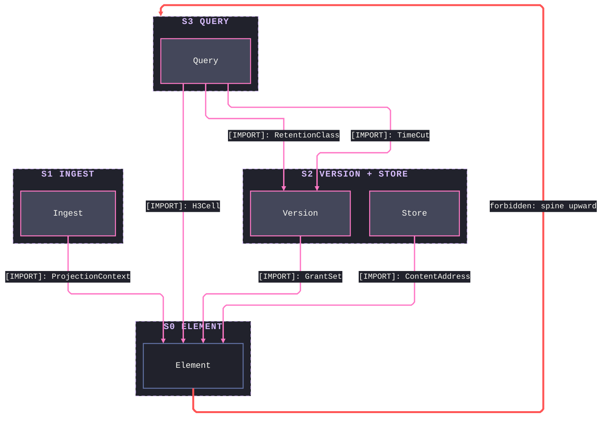
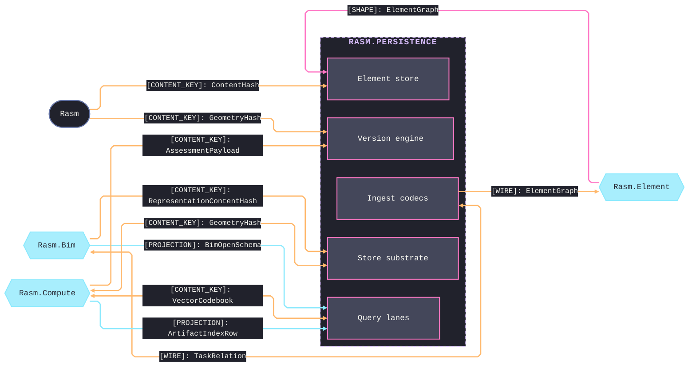
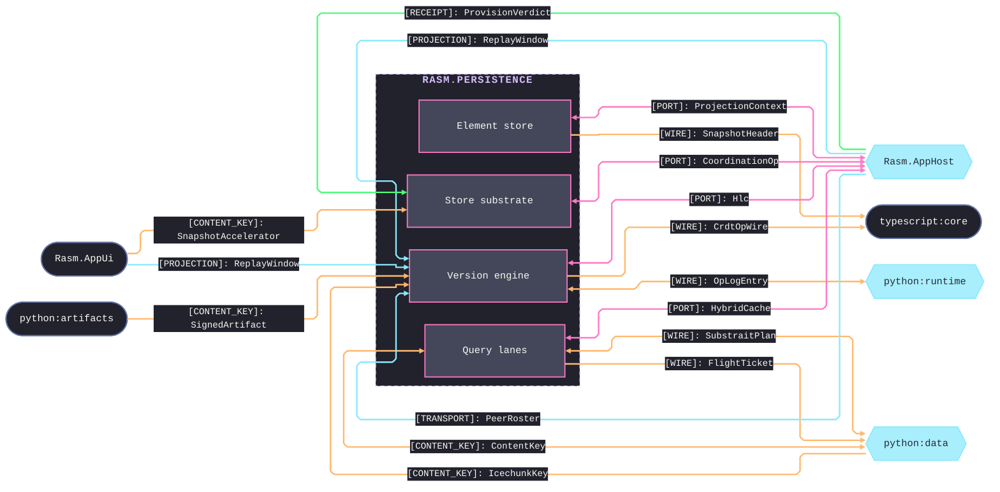
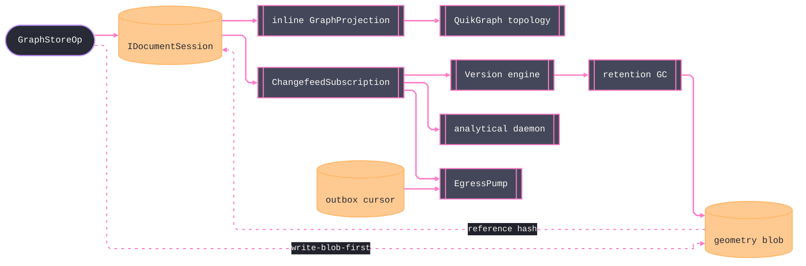

# [RASM_PERSISTENCE_ARCHITECTURE]

`Rasm.Persistence` maps the APP-PLATFORM durable-state spine that persists the `Rasm.Element` `ElementGraph` as its system of record: one owner per sub-domain concern with closed cases, Marten the append substrate beneath the version-control engine that projects from its events, read lanes split by consistency demand, and the geometry object store content-keyed. Depends up on the `Rasm.Element` seam and the `Rasm` kernel content-hash, references no sibling AEC-domain peer — alignment travels through seam contracts and the content-keyed wire.

## [01]-[DOMAIN_MAP]

```text codemap
Rasm.Persistence/            # refs the Rasm.Element seam + Rasm kernel ONLY; no sibling AEC peer; RhinoCommon-free
├── Element/                 # ElementGraph store-load roundtrip over Marten
│   ├── Graph.cs             # Stream-per-model event store and inline authoritative projection
│   ├── Codec.cs             # Content-address codec over canonical bytes and chunked snapshot tiers
│   ├── Identity.cs          # Identity-row tier: tenancy, EF converters, PostGIS bounds, KMS custody
│   └── Authority.cs         # Object-ACL algebra: deny-over-allow grant admission
├── Version/                 # Version-control engine projecting FROM Marten events
│   ├── Ledger.cs            # Op-log changefeed, HLC clock, CRDT merge dispatch, sync transports
│   ├── Commits.cs           # Content-addressed commit-DAG and convergent CRDT algebra
│   ├── TimeTravel.cs        # AS-OF reconstruct/diff/blame/bisect fold over the changefeed prefix
│   ├── Merge.cs             # Three-way structural merge and RFC 6902 patch egress
│   ├── Provenance.cs        # W3C-PROV causal DAG and attested tamper-evidence ledger
│   ├── Retention.cs         # Retention-class sweep and full-history reachability GC
│   ├── Recovery.cs          # Backup-substrate routes and verified PITR choreography
│   └── Egress.cs            # CDC egress pump: one CloudEvents envelope with per-sink dedup and replay
├── Query/                   # Read lanes split by consistency demand
│   ├── Lane.cs              # Read router: authoritative vs analytical over the selection algebra
│   ├── Retrieval.cs         # ANN subsystem: fusion rank over the vector and text branches
│   ├── Topology.cs          # In-process QuikGraph view and default synchronous traversal
│   ├── Columnar.cs          # DuckDB analytical lane and its flat-table projection
│   ├── Cypher.cs            # Optional self-hosted openCypher and pgrouting lane
│   ├── Cache.cs             # Compute-result reuse index with a benchmark gate and invalidation
│   └── Federation.cs        # Substrait federation router lowering onto the selection algebra
├── Ingest/                  # File-codec ingress axis
│   ├── Tabular.cs           # Delimited and spreadsheet source lane
│   ├── Schedule.cs          # Schedule-file codec and durable task-relation DAG
│   ├── Geospatial.cs        # Geospatial feature source lane
│   └── Issue.cs             # BCF issue-file codec and issue-cycle reconcile
└── Store/                   # Durable-home and coordination substrate
    ├── BlobStore.cs         # Content-keyed object store with a write-blob-first seal
    ├── Provisioning.cs      # Verification-first extension tier and provider-binding rows
    └── Coordination.cs      # Token-fenced lease store: budget, CAS, lease, membership, outbox
```

Implementation collapses to one owner per axis and one entrypoint family per rail: a new feature is a row or case on a budgeted owner, and a public type outside an owner region is the named defect. Rail identity rides the return type — `Validation<Fault,T>` accumulates, `Fin<T>` aborts, `IO<T>` carries effects; receipts stamp NodaTime `Instant`/`Duration`, and wall clock, elapsed marks, correlation, and tenant ride the injected `ProjectionContext` frame — a `ClockPolicy`/`CorrelationId`/`TenantContext` parameter on any Persistence signature is the named strata inversion. Marten owns the durable append and the rebuildable views; the version-control engine projects from its events; provider variance is row data on the axes; public code selects profiles, lanes, operations, codecs, and policies, never provider packages.

## [02]-[STRATA]

Four strata order the five sub-domains; `Version` and `Store` co-seat as a coupled pair — retention classes flow down into blob GC while storage tiers flow back into retention facts — and the one ruled counter-edge is `Element/Graph`'s `GraphStoreOp.ReadAsOf` taking the Version `TimeCut` as its typed as-of payload; every other consumption edge points down.

- S0 `Element` — the system-of-record spine consuming no sibling: `ModelId`, `GraphStoreOp`, the `SnapshotCodec` content-address codec, the `IdentityStore` one-transaction identity owner, and the `GrantSet` ACL algebra.
- S1 `Ingest` — file-codec ingress over the spine alone: `TabularSource`, `GeoFeatureRow`, `ScheduleSpec`, and the durable `TaskRelation` DAG.
- S2 `Version` + `Store` — the coupled durable tier: `OpLogEntry`, `Hlc`, `TimeCut`, and `RetentionClass` beside `ObjectStore`, `StorageTier`, `LeaseToken`, and `OutboxCursor`; their mutual retention-tier exchange is same-stratum fact.
- S3 `Query` — read lanes nothing composes: `FederationPlan`, `TopologyView`, `VectorCodebook`, and the `ArtifactIndexRow` reuse index pinning reads at the Version `TimeCut`.



## [03]-[SEAMS]

Seams split into two fences by counterpart group. First fence binds the AEC-domain peers and the kernel — the shape, content-key, and projection contracts through which durable state aligns with `Rasm.Element`, `Rasm.Bim`, and `Rasm.Compute`. Second fence binds the platform host and the cross-runtime peers — the port, wire, and receipt contracts that reach `Rasm.AppHost`, `Rasm.AppUi`, and the Python and TypeScript runtimes. Each collapsed edge stands for every contract between that sub-domain and that partner at the load-bearing kind; the owning pages enumerate the rest.





## [04]-[INTERNAL]



One `IDocumentSession` commits the `GraphDelta` event and the identity row together, the inline projection materializes the authoritative `ElementGraph` read-your-writes, and the changefeed is the one fan-out the version engine, the analytical daemon, and the egress pump each fold. Geometry blob is write-first and reference-after, and retention's full-history GC governs snapshots and blobs as one reachability set. Marten stream is the outbox, so a domain commit and its egress obligation settle in one transaction — the exact wiring lives on the owning implementation pages.

## [05]-[BOUNDARIES]

- Persistence is not a domain service layer, repository framework, ORM wrapper, provider wrapper, or host-boundary package; it is RhinoCommon-free.
- It depends up on the `Rasm.Element` seam plus the `Rasm` kernel and never references a sibling AEC-domain peer.
- Marten owns the durable append and the rebuildable read views; the version engine PROJECTS from its events, never a bespoke op-log store beneath it.
- One transaction owner for identity plus event is the `IDocumentSession` — identity lands as the one compiled-model-derived upsert `IdentityStore.Stamp` queues on the session, never a Marten document and never a second ORM write.
- Geometry blobs are write-first and reference-after, with no free two-ORM atomicity.
- Authoritative topology reads bind the inline projection and the in-process QuikGraph view; analytical lanes are async under a watermark.
- Typed projection records and the seam `ElementGraph` are the only egress; provider failure converts once per rail.
- AppHost owns scheduling, drain, hop retry, correlation, and the cache port; Persistence contributes rows, never reversing the dependency.
- Database retry is excluded from the AppHost hop law; the relational rows own their own retry.

## [06]-[PROHIBITIONS]

Deleted patterns the owner regions foreclose:

- NEVER a public type outside a sub-domain owner region; a new capability is a row, case, or policy value on a budgeted owner.
- NEVER a bespoke op-log store beneath Marten, a per-node stream grain, or a whole-graph event body; per-model streams carry the `GraphDelta`.
- NEVER route an interactive-correctness read to an async projection; strong-consistency reads block on non-stale data through the inline projection.
- NEVER a second materializer beside `Crdt.Apply`/`GraphDelta.Apply`; the projection, the live merge, and the AS-OF reconstruction fold the one delta.
- NEVER a second content-hash, identity, CRDT, selection-shape, or geometry-representation owner; each spine concept rides its one owner.
- NEVER a head-only geometry GC; reachability runs over the full event history, or geometry GC is forbidden in favor of dedup and cold-tiering.
- NEVER a raw clock, stopwatch, or timer; the injected `ProjectionContext` frame is the only time seam and the HLC the only causal clock — a deadline or policy value applied at both a provider wire and a domain catalog derives once from one sampled instant threaded through the write path, so even the injected clock is never sampled twice for one policy value.
- An AppHost `ClockPolicy` parameter on a Persistence signature is the named strata inversion.
- NEVER hand-written converters, formatters, or migration code beside the generated rails.
- NEVER a generic receipt abstraction; each sub-domain outcome stays its own typed receipt or fact record.
- NEVER admit a new relational engine row; the sweep is closed, PostgreSQL is never spawned by a Rasm process, and provisioning is verification-only.
- NEVER reference a sibling AEC-domain peer or a host-SDK type; alignment travels through the `Rasm.Element` seam and the content-keyed wire.
- CSP analyzer diagnostics are architecture pressure: fix the shape, refine the rule on a false positive, never suppress.
