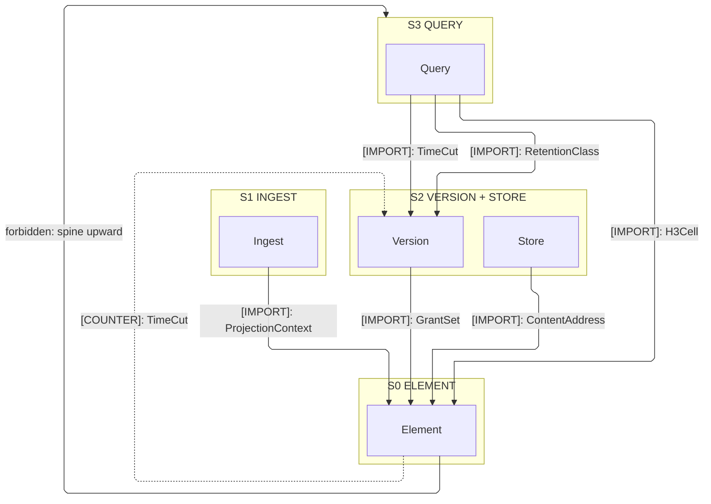
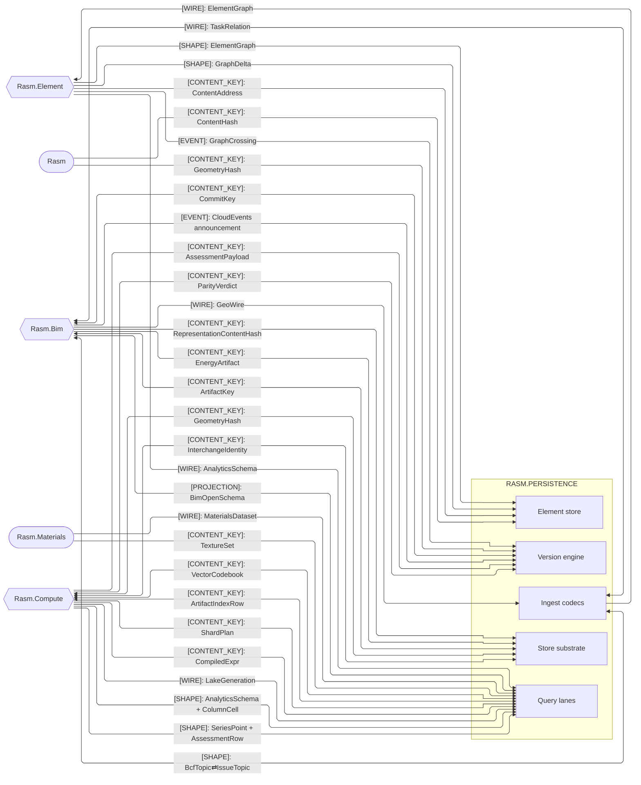
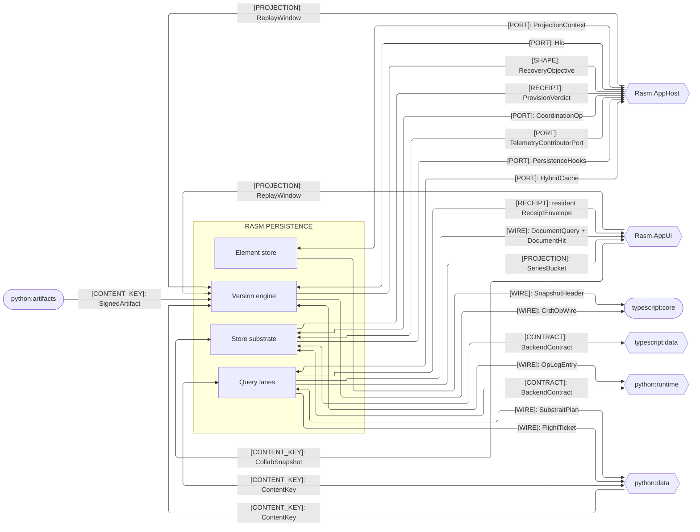
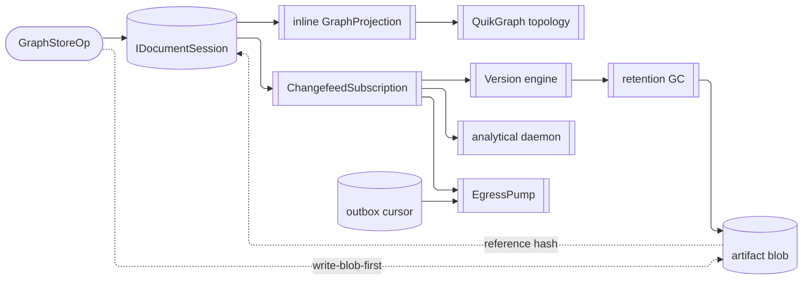

# [RASM_PERSISTENCE_ARCHITECTURE]

`Rasm.Persistence` maps the APP-PLATFORM durable-state spine that persists the `Rasm.Element` `ElementGraph` as its system of record: one owner per sub-domain concern with closed cases, Marten the append substrate beneath the version-control engine that projects from its events, read lanes split by consistency demand, and the artifact object plane content-keyed. Depends up on the `Rasm.Element` seam and the `Rasm` kernel content-hash, references no sibling AEC-domain peer, so alignment travels through seam contracts and the content-keyed wire.

## [01]-[DOMAIN_MAP]

```text codemap
Rasm.Persistence/            # One system of record; every sub-domain a closed-case owner over the append substrate
├── Element/                 # ElementGraph store-load roundtrip over Marten
│   ├── Graph.cs             # ModelId-keyed Marten stream; GraphCreated/Revised/Retired events share one GraphDelta.ReplayOnto fold
│   ├── Codec.cs             # SnapshotCodec axis with CompressionPolicy and HashPolicy pairs; ContentAddress minted over plaintext
│   ├── Identity.cs          # ElementIdentity rows committing atomically with the Marten event in one IDocumentSession
│   └── Authority.cs         # Grant wire-keyed vocabulary, GrantSet frozen-set algebra, the AclScope inheritance carrier
├── Version/                 # Version-control engine projecting FROM Marten events
│   ├── Ledger.cs            # OpLogEntry feed projection; ColumnFamily merge stances, ReplayWindow bounds, the SyncMerge fold
│   ├── Commits.cs           # CommitGraph refs and anti-entropy ranges; Crdt field algebra, CrdtWire encoding, the shared Hlc cell
│   ├── TimeTravel.cs        # TimeCut unifying causal, instant, and stream-version bounds; RangeDiff, Blame, Scrub, Bisect evidence
│   ├── Merge.cs             # StructuralMerge base-relative classification; EntityEdit tombstones over exact NodeWire ProtoJSON
│   ├── Provenance.cs        # CausalDag PROV-O derivation; ProvNode/ProvClass/ProvRelation/ProvRole in one BidirectionalGraph
│   ├── Retention.cs         # ArtifactKind deriving RetentionClass; RetentionCatalog admission, the conserved RetentionSweep verdict
│   ├── Recovery.cs          # RecoveryRoutes timeline and LSN capture; PointInTimeRestore fence-verify-materialize choreography
│   ├── Egress.cs            # CDC egress pump: one CloudEvents envelope with per-sink dedup and replay
│   └── Ingress.cs           # CdcIngress consumer twins, rostered extension decode, (source, id) dedup, store-first offsets
├── Query/                   # Read lanes split by consistency demand
│   ├── Lane.cs              # Consistency-demand routing seat; selection algebra binds inline projection against the daemon lanes
│   ├── Retrieval.cs         # Retrieval.Run entry over StoreProfile and RetrievalOp; VectorRoute coupling, RetrievalFault rail
│   ├── Topology.cs          # Kind-filtered QuikGraph view memoized per read snapshot; the seam keeps the view vocabulary
│   ├── Columnar.cs          # ColumnarSession posture anchor with Duplicate() lanes; Identifier and StorePath admissions
│   ├── Lakehouse.cs         # Cold-tail owner: read-your-writes flat tables, encrypted Parquet generations, engine-free scan
│   ├── Residence.cs         # Parameterized residence row set over ColumnType columns; one branch-owned provisioning emitter
│   ├── Serving.cs           # ResidenceScope bounds, ResidencePlan dialect lowering, ResidenceReach dispatch, ResidenceLanding
│   ├── Datasets.cs          # Custodian-declared dataset rows, distinct from every seam-handed dataset a producer owns
│   ├── Cypher.cs            # CypherEnablement.SelfHosted gate; GraphQuery verbs and GraphDdl lifecycle over AGE and pgrouting
│   ├── Cache.cs             # ArtifactIndexRow reuse index, recency owner, solver-memo band, benchmark-gated admission
│   └── Federation.cs        # FederationPlan admission over three ingress forms; the FederationLowering preserved-semantics rail
├── Ingest/                  # File-codec ingress axis
│   ├── Tabular.cs           # TabularSource owner; TabularSpec fixes format, source, sheet, header stance, and row window once
│   ├── Schedule.cs          # ScheduleSource over the MPXJ interchange; the neutral ProjectFile graph through one format fold
│   ├── Geospatial.cs        # GeoSource owner; the GeoFormat SmartEnum crossing the wire projections
│   ├── Issue.cs             # Typed BCF rows alone: GlobalId correlation columns and cycle reconcile; container custody stays Bim
│   └── Pointcloud.cs        # ScanSource owner over the scan codec pair; ScanFormat crossing, H3Cell region rows
└── Store/                   # Durable-home and coordination substrate
    ├── BlobStore.cs         # ObjectStore SmartEnum provider axis behind BlobRemote; the credential-free Presigned grant row
    ├── Residence.cs         # ObjectChecksum transport-versus-identity split and the sealed write-stance columns
    ├── Redrive.cs           # RemoteStoreFault 540x band over the kernel RegistryFault floor; the re-drive currency mint
    ├── BlobGc.cs            # BlobCatalogRow content-lineage rows; one reachability sweep, never a lane-local delete executor
    ├── Schema.cs            # Sole current-state contract and immutable generation state machine
    ├── Provisioning.cs      # Verification-first PostgreSQL read fold and the idempotent SQLite open ritual
    ├── Coordination.cs      # Token-VALIDATING fenced-lease store behind the four AppHost port contracts
    └── Observability.cs     # Engine-stat harvests, receipt-slot registry, hook rail, chargeback residence, contributor port
```

Implementation collapses to one owner per axis and one entrypoint family per rail: a new feature is a row or case on a budgeted owner. Rail identity rides the return type: `Validation<Fault,T>` accumulates, `Fin<T>` aborts, `IO<T>` carries effects; clock, correlation, and tenant ride the injected `ProjectionContext` frame as the kernel types, never their key scalars. Marten owns the durable append and the rebuildable views, the version engine projects from its events, and public code selects profiles, read lanes, operations, codecs, and policies, never provider packages.

## [02]-[STRATA]

S0–S3 order the sub-domains, and every consumption edge points down; the one ruled counter-edge is `Element/Graph`'s `GraphStoreOp.ReadAsOf` taking the Version `TimeCut` as its typed as-of payload. Nodes stand at folder grain, and every drawn edge carries the one page-grounded type that crosses it.

- S0 `Element` — the system-of-record spine consumes no sibling, so every stratum grounds on one identity and codec truth.
- S0 law — identity commits in the SAME `IDocumentSession` as the event, so no sibling stratum can own a second identity write.
- S1 `Ingest` — file codecs land records onto the spine and nothing imports Ingest back, so a new codec is one page with zero consumer edits.
- S1 law — the Bim sequencing DAG orders the `TaskRelation` rows.
- S2 co-seat — `Version` and `Store` couple at one rank: retention classes flow down into blob GC, storage tiers flow back as retention FACTS.
- S2 law — the coupled exchange stays same-stratum and value-borne, so the pair adds no cycle and neither half imports the other's owners.
- S2 law — `RemoteStoreFault` and `StoreRedrivePort` publish the re-drive currency; `BlobCatalogRow` carries blob-GC lineage.
- S3 `Query` — read lanes nothing composes: the absent inbound edge is the lane split's standing guarantee.
- S3 law — declaration, serving, cold-tail landing, and rostering stay separate owners, so an ordinal binds at exactly one analytics surface.
- S3→S2 — federated reads pin at the Version `TimeCut`, so a cached artifact replays the as-of coordinate its plan named.
- S3→S0 — `H3Cell` crosses as the identity tier's region vocabulary, value-read, never a query-side remint.
- S2→S0 — `ContentAddress` crosses as the codec's minted identity, so storage re-derives no digest.


```mermaid
---
config:
  layout: elk
  flowchart:
    curve: linear
    padding: 25
---
flowchart TB
    accTitle: Rasm.Persistence interior strata
    accDescr: Interior strata down to the element system-of-record spine; the dashed counter-edge carries the ReadAsOf TimeCut upward to Version.
    subgraph S3["S3 QUERY"]
        Query[Query]
    end
    subgraph S2["S2 VERSION + STORE"]
        Version[Version]
        Store[Store]
    end
    subgraph S1["S1 INGEST"]
        Ingest[Ingest]
    end
    subgraph S0["S0 ELEMENT"]
        Element[Element]
    end
    Query e1@-->|"[IMPORT]: TimeCut"| Version
    Query e2@-->|"[IMPORT]: RetentionClass"| Version
    Query e3@-->|"[IMPORT]: H3Cell"| Element
    Version e4@-->|"[IMPORT]: GrantSet"| Element
    Store e5@-->|"[IMPORT]: ContentAddress"| Element
    Ingest e6@-->|"[IMPORT]: ProjectionContext"| Element
    Element e7@-.->|"[COUNTER]: TimeCut"| Version
    Element f1@-->|"forbidden: spine upward"| S3
```

## [03]-[SEAMS]

`Rasm.Compute`'s analysis rail hands two typed row streams over one shape seam. `SeriesLane.Ingest` lands the temporal leg — this package's own `Query/datasets#SERIES_ROSTER` `SeriesPoint` — under the `SeriesKind.Assessment` row, while the neutral `AssessmentRow` result estate stays Compute-owned vocabulary crossing as producer-handed row data, so this package declares no result-row twin.


```mermaid
---
config:
  layout: elk
  flowchart:
    curve: linear
    padding: 25
---
flowchart LR
    accTitle: Persistence domain and kernel content seams
    accDescr: Persistence sub-domain owners exchanging shapes, content keys, wires, and projections with the kernel and every AEC peer.
    subgraph persistence[RASM.PERSISTENCE]
        Element[Element store]
        Version[Version engine]
        Query[Query lanes]
        Ingest[Ingest codecs]
        Store[Store substrate]
    end
    RasmElement{{Rasm.Element}}
    Rasm([Rasm])
    Bim{{Rasm.Bim}}
    Materials([Rasm.Materials])
    Compute{{Rasm.Compute}}
    RasmElement e1@-->|"[SHAPE]: ElementGraph"| Element
    RasmElement e2@-->|"[SHAPE]: GraphDelta"| Element
    RasmElement e3@-->|"[CONTENT_KEY]: ContentAddress"| Element
    RasmElement e4@-->|"[EVENT]: GraphCrossing"| Version
    Ingest e5@-->|"[WIRE]: ElementGraph"| RasmElement
    Rasm e6@-->|"[CONTENT_KEY]: ContentHash"| Element
    Rasm e7@-->|"[CONTENT_KEY]: GeometryHash"| Version
    Bim e8@-->|"[PROJECTION]: BimOpenSchema"| Query
    Bim e9@-->|"[CONTENT_KEY]: RepresentationContentHash"| Store
    Bim e10@-->|"[CONTENT_KEY]: EnergyArtifact"| Store
    Bim e11@<-->|"[CONTENT_KEY]: ArtifactKey"| Store
    Bim e12@<-->|"[CONTENT_KEY]: CommitKey"| Version
    Bim e13@-->|"[EVENT]: CloudEvents announcement"| Version
    Ingest e14@<-->|"[WIRE]: TaskRelation"| Bim
    Bim e15@-->|"[WIRE]: GeoWire"| Ingest
    Ingest e16@<-->|"[SHAPE]: BcfTopic⇄IssueTopic"| Bim
    RasmElement e17@-->|"[WIRE]: AnalyticsSchema"| Query
    Materials e18@-->|"[WIRE]: MaterialsDataset"| Query
    Materials e19@-->|"[CONTENT_KEY]: TextureSet"| Query
    Compute e20@-->|"[CONTENT_KEY]: AssessmentPayload"| Version
    Compute e21@-->|"[CONTENT_KEY]: ParityVerdict"| Version
    Compute e22@<-->|"[CONTENT_KEY]: VectorCodebook"| Query
    Compute e23@<-->|"[CONTENT_KEY]: ArtifactIndexRow"| Query
    Compute e24@-->|"[CONTENT_KEY]: ShardPlan"| Query
    Compute e25@-->|"[CONTENT_KEY]: CompiledExpr"| Query
    Compute e26@<-->|"[CONTENT_KEY]: GeometryHash"| Store
    Compute e27@<-->|"[CONTENT_KEY]: InterchangeIdentity"| Store
    Compute e28@-->|"[WIRE]: LakeGeneration"| Query
    Compute e29@-->|"[SHAPE]: AnalyticsSchema + ColumnCell"| Query
    Compute e30@-->|"[SHAPE]: SeriesPoint + AssessmentRow"| Query
```


```mermaid
---
config:
  layout: elk
  flowchart:
    curve: linear
    padding: 25
---
flowchart LR
    accTitle: Persistence platform and cross-runtime seams
    accDescr: Which ports, wires, projections, and keys cross between Persistence's owners, the app platform, and the runtime peers.
    subgraph persistence[RASM.PERSISTENCE]
        Element[Element store]
        Version[Version engine]
        Query[Query lanes]
        Store[Store substrate]
    end
    AppHost{{Rasm.AppHost}}
    AppUi{{Rasm.AppUi}}
    Core([typescript:core])
    TsData{{typescript:data}}
    Runtime{{python:runtime}}
    Data{{python:data}}
    Artifacts([python:artifacts])
    Element e1@-->|"[WIRE]: SnapshotHeader"| Core
    Version e2@-->|"[WIRE]: CrdtOpWire"| Core
    Version e3@<-->|"[WIRE]: OpLogEntry"| Runtime
    Artifacts e4@-->|"[CONTENT_KEY]: SignedArtifact"| Version
    Data e5@-->|"[CONTENT_KEY]: ContentKey"| Version
    Query e6@<-->|"[WIRE]: SubstraitPlan"| Data
    Query e7@-->|"[WIRE]: FlightTicket"| Data
    Data e8@<-->|"[CONTENT_KEY]: ContentKey"| Query
    Element e9@<-->|"[PORT]: ProjectionContext"| AppHost
    Version e10@<-->|"[PORT]: Hlc"| AppHost
    Query e11@-->|"[WIRE]: DocumentQuery + DocumentHit"| AppUi
    Query e12@-->|"[PROJECTION]: SeriesBucket"| AppUi
    Version e13@-->|"[SHAPE]: RecoveryObjective"| AppHost
    AppHost e14@-->|"[PROJECTION]: ReplayWindow"| Version
    Query e15@<-->|"[PORT]: HybridCache"| AppHost
    Store e16@<-->|"[PORT]: CoordinationOp"| AppHost
    Store e17@<-->|"[PORT]: TelemetryContributorPort"| AppHost
    Store e18@-->|"[PORT]: PersistenceHooks"| AppHost
    Store e19@-->|"[RECEIPT]: ProvisionVerdict"| AppHost
    Store e20@<-->|"[CONTRACT]: BackendContract"| Runtime
    Store e21@<-->|"[CONTRACT]: BackendContract"| TsData
    AppUi e22@-->|"[PROJECTION]: ReplayWindow"| Version
    AppUi e23@-->|"[CONTENT_KEY]: CollabSnapshot"| Store
    Query e24@-->|"[RECEIPT]: resident ReceiptEnvelope"| AppUi
```

## [04]-[INTERNAL]


```mermaid
---
config:
  layout: elk
  flowchart:
    curve: linear
    padding: 25
---
flowchart LR
    accTitle: ElementGraph persistence flow
    accDescr: How a GraphStoreOp commit materializes the authoritative read, feeds the changefeed lanes, and lands the content-first artifact blob.
    Op([GraphStoreOp]) e1@--> Session[(IDocumentSession)]
    Session e2@--> Inline[[inline GraphProjection]]
    Session e3@--> Changefeed[[ChangefeedSubscription]]
    Inline e4@--> Topology[[QuikGraph topology]]
    Changefeed e5@--> Engine[[Version engine]]
    Changefeed e6@--> Async[[analytical daemon]]
    Changefeed e7@--> Pump[[EgressPump]]
    Cursor[(outbox cursor)] e8@--> Pump
    Op e9@-.write-blob-first.-> Blob[(artifact blob)]
    Blob e10@-.reference hash.-> Session
    Engine e11@--> Retention[[retention GC]]
    Retention e12@--> Blob
```

One `IDocumentSession` commits the `GraphDelta` event and the identity row together, the inline projection materializes the authoritative `ElementGraph` read-your-writes, and the changefeed is the one fan-out the version engine, the analytical daemon, and the egress pump each fold. Artifact blob is write-first and reference-after, and retention's full-history GC governs snapshots and blobs as one reachability set. Marten stream is the outbox, so a domain commit and its egress obligation settle in one transaction.

## [05]-[BOUNDARIES]

- Persistence depends upward on the `Rasm.Element` seam and the `Rasm` kernel alone.
- Seam and content-keyed wire carry every sibling-domain and host alignment; no AEC peer or host-SDK type is referenced.
- Public capability extends its sub-domain owner region as a row, case, or policy value; a public type outside an owner region draws on no budget.
- `Store/Schema` owns contract composition, generated artifacts, generation identity, and admission verdicts.
- `Store/Provisioning` verifies PostgreSQL state and emits reconcile artifacts.
- PostgreSQL is the sole relational engine; deployment owns the process, and no Rasm process spawns one.
- Marten owns the op-log at per-model stream grain carrying `GraphDelta` bodies.
- Identity lands as the compiled-model upsert `IdentityStore.Stamp` queues on the `IDocumentSession`, never a Marten document or second ORM write.
- Artifact blobs are write-first and reference-after, with no free two-ORM atomicity.
- Interactive-correctness reads bind the inline projection and the in-process QuikGraph view, blocking on non-stale data.
- Async projections serve analytical lanes under a watermark alone.
- Typed projection records and the seam `ElementGraph` are the only egress.
- Provider failure converts once per rail; each sub-domain outcome keeps its own typed receipt or fact record.
- Generated rails own converters, formatters, and migration artifacts.
- Retention reachability spans the full event history.
- Store classes unable to prove full-history reachability retain blobs through deduplication and cold tiering instead of collecting them.
- `ProjectionContext` is the one time and causal seam, seating the kernel `CorrelationId`/`TenantContext` pair; the HLC is the one causal clock.
- Policy values applied at provider wire and domain catalog alike derive once from one sampled instant threaded through the write path.
- Every receipt, RLS predicate, and blame header reads one tenancy off the `ProjectionContext` frame.
- Each spine concept keeps one owner across content hash, identity, CRDT, selection shape, and geometry representation.
- AppHost owns scheduling, drain, hop retry, correlation, and the cache port; Persistence contributes rows, never reversing the dependency.
- Database retry stays outside the AppHost hop law; the relational rows own it.
