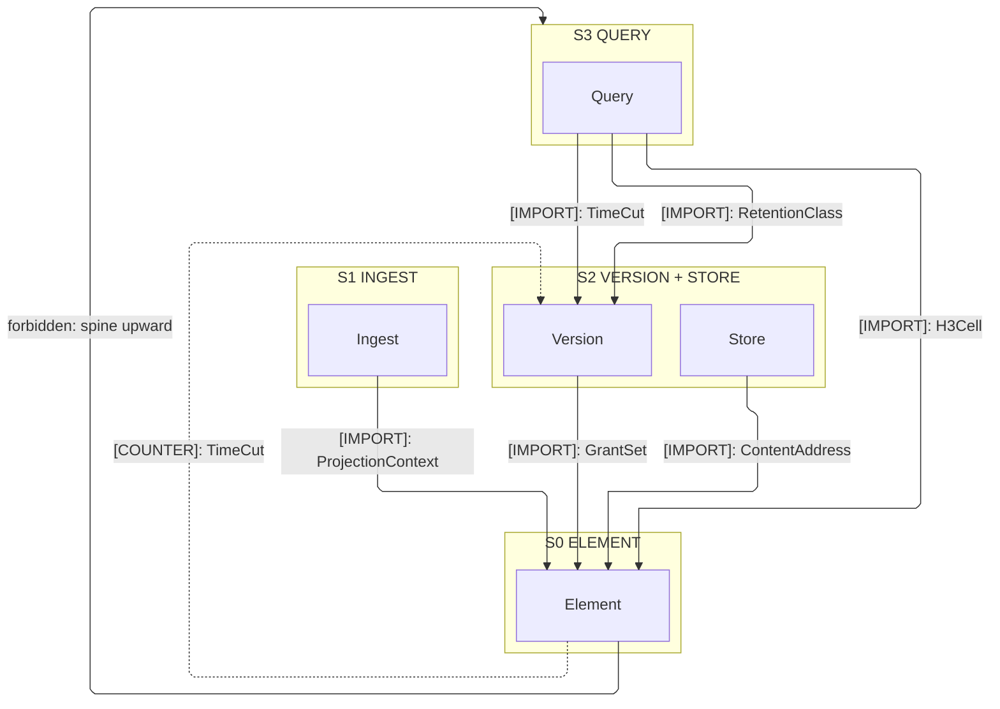
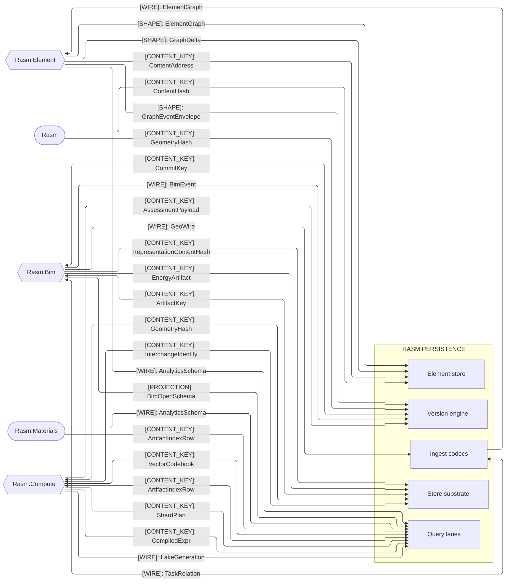
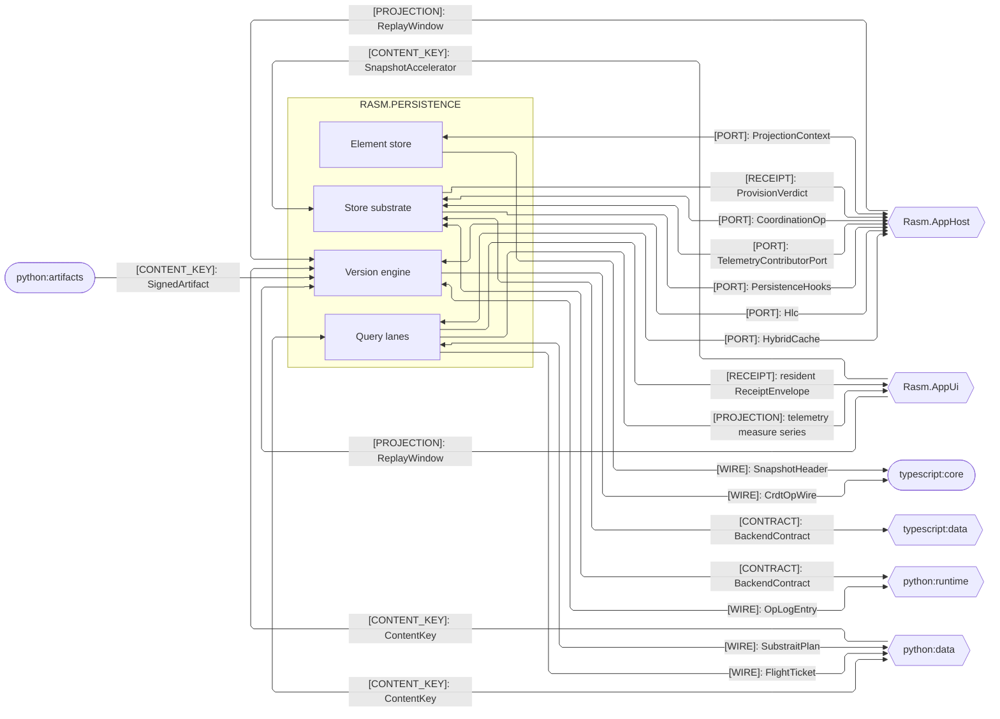
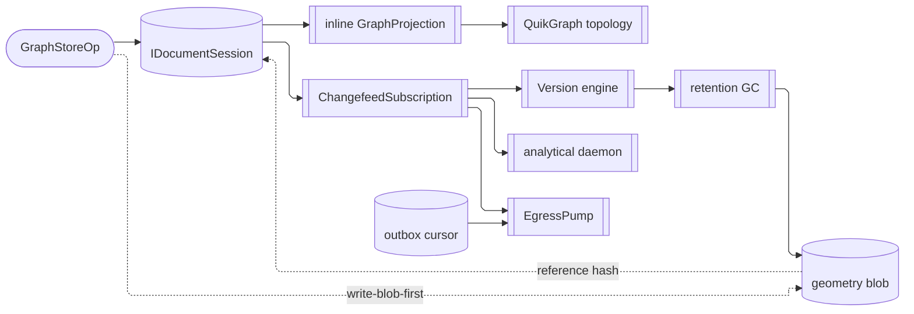

# [RASM_PERSISTENCE_ARCHITECTURE]

`Rasm.Persistence` maps the APP-PLATFORM durable-state spine that persists the `Rasm.Element` `ElementGraph` as its system of record: one owner per sub-domain concern with closed cases, Marten the append substrate beneath the version-control engine that projects from its events, read lanes split by consistency demand, and the geometry object store content-keyed. Depends up on the `Rasm.Element` seam and the `Rasm` kernel content-hash, references no sibling AEC-domain peer — alignment travels through seam contracts and the content-keyed wire.

## [01]-[DOMAIN_MAP]

```text codemap
Rasm.Persistence/            # refs the Rasm.Element seam + Rasm kernel ONLY; no sibling AEC peer; RhinoCommon-free
├── Element/                 # ElementGraph store-load roundtrip over Marten
│   ├── Graph.cs             # Stream-per-model event store and inline authoritative projection
│   ├── Codec.cs             # Content-address codec over canonical bytes and chunked snapshot tiers
│   ├── Identity.cs          # Identity-row tier: tenancy, EF converters, PostGIS bounds, KMS custody
│   └── Authority.cs         # Object-ACL algebra: deny-over-allow grant admission
├── Version/                 # Version-control engine projecting FROM Marten events
│   ├── Ledger.cs            # Op-log changefeed, HLC clock, CRDT merge dispatch, sync transports
│   ├── Commits.cs           # Content-addressed commit-DAG and convergent CRDT algebra
│   ├── TimeTravel.cs        # AS-OF reconstruct/diff/blame/bisect fold over the changefeed prefix
│   ├── Merge.cs             # Three-way structural merge and RFC 6902 patch egress
│   ├── Provenance.cs        # W3C-PROV causal DAG and attested tamper-evidence ledger
│   ├── Retention.cs         # Retention-class sweep and full-history reachability GC
│   ├── Recovery.cs          # Backup-substrate routes and verified PITR choreography
│   ├── Egress.cs            # CDC egress pump: one CloudEvents envelope with per-sink dedup and replay
│   └── Ingress.cs           # Inbound CDC consume door: instrumented Kafka leg, content-key dedup, store-first offsets
├── Query/                   # Read lanes split by consistency demand
│   ├── Lane.cs              # Read router: authoritative vs analytical over the selection algebra
│   ├── Retrieval.cs         # ANN subsystem: fusion rank over the vector and text branches
│   ├── Topology.cs          # In-process QuikGraph view and default synchronous traversal
│   ├── Columnar.cs          # DuckDB analytical lane, flat-table projection, analytics residence family, receipt evidence plane
│   ├── Cypher.cs            # Optional self-hosted openCypher and pgrouting lane
│   ├── Cache.cs             # Compute-result reuse index with a benchmark gate and invalidation
│   └── Federation.cs        # Substrait federation router lowering onto the selection algebra
├── Ingest/                  # File-codec ingress axis
│   ├── Tabular.cs           # Delimited and spreadsheet source lane
│   ├── Schedule.cs          # Schedule-file codec and durable task-relation DAG
│   ├── Geospatial.cs        # Geospatial feature source lane
│   └── Issue.cs             # BCF issue-file codec and issue-cycle reconcile
└── Store/                   # Durable-home and coordination substrate
    ├── BlobStore.cs         # Content-keyed object store with a write-blob-first seal
    ├── Schema.cs            # Sole current-state contract and immutable generation state machine
    ├── Provisioning.cs      # Verify-only extension tier and provider materializer rows
    ├── Coordination.cs      # Token-fenced lease store: budget, CAS, lease, membership, outbox
    └── Observability.cs     # Engine-stat and plan harvests, slot registry, hook rail, chargeback residence, instrument contributor, board pack
```

Implementation collapses to one owner per axis and one entrypoint family per rail: a new feature is a row or case on a budgeted owner. Rail identity rides the return type — `Validation<Fault,T>` accumulates, `Fin<T>` aborts, `IO<T>` carries effects — and clock, correlation, and tenant ride the injected `ProjectionContext` frame as the kernel types, never their key scalars. Marten owns the durable append and the rebuildable views, the version engine projects from its events, and public code selects profiles, lanes, operations, codecs, and policies, never provider packages.

## [02]-[STRATA]

S0–S3 order the sub-domains; `Version` and `Store` co-seat as a coupled pair — retention classes flow down into blob GC while storage tiers flow back into retention facts — and the one ruled counter-edge is `Element/Graph`'s `GraphStoreOp.ReadAsOf` taking the Version `TimeCut` as its typed as-of payload; every other consumption edge points down.

- S0 `Element` — the system-of-record spine consuming no sibling: `ModelId`, `GraphStoreOp`, the `SnapshotCodec` content-address codec.
- S0 `Element` — the `IdentityStore` one-transaction identity owner and the `GrantSet` ACL algebra.
- S1 `Ingest` — file-codec ingress over the spine alone: `TabularSource`, `GeoFeatureRow`, `ScheduleSpec`, the durable `TaskRelation` rows.
- S1 law — the Bim sequencing DAG orders the `TaskRelation` rows.
- S2 `Version` — `OpLogEntry`, `Hlc`, `TimeCut`, and `RetentionClass`, the coupled durable stratum's version half.
- S2 `Store` — `ObjectStore`, `StorageTier`, `LeaseToken`, and `OutboxCursor`; the mutual retention-tier exchange stays same-stratum.
- S3 `Query` — read lanes nothing composes: `FederationPlan`, `TopologyView`, `VectorCodebook`, `ArtifactIndexRow`.
- S3 law — the `ArtifactIndexRow` reuse index pins reads at the Version `TimeCut`.


```mermaid
---
config:
  layout: elk
  flowchart:
    curve: linear
    padding: 25
---
flowchart TB
    accTitle: Rasm.Persistence interior strata
    accDescr: Four stacked strata from the query read lanes through the coupled version-and-store stratum and the ingest codecs onto the element system-of-record spine, every consumption edge downward and solid naming one sourced type, one dashed ruled counter-edge carrying the ReadAsOf TimeCut payload upward from Element to Version, and one forbidden upward edge styled red.
    subgraph S3["S3 QUERY"]
        Query[Query]
    end
    subgraph S2["S2 VERSION + STORE"]
        Version[Version]
        Store[Store]
    end
    subgraph S1["S1 INGEST"]
        Ingest[Ingest]
    end
    subgraph S0["S0 ELEMENT"]
        Element[Element]
    end
    Query e1@-->|"[IMPORT]: TimeCut"| Version
    Query e2@-->|"[IMPORT]: RetentionClass"| Version
    Query e3@-->|"[IMPORT]: H3Cell"| Element
    Version e4@-->|"[IMPORT]: GrantSet"| Element
    Store e5@-->|"[IMPORT]: ContentAddress"| Element
    Ingest e6@-->|"[IMPORT]: ProjectionContext"| Element
    Element e7@-.->|"[COUNTER]: TimeCut"| Version
    Element f1@-->|"forbidden: spine upward"| S3
```

## [03]-[SEAMS]

Seams split into two fences by counterpart group: the first binds the kernel and the AEC-domain peers through shape, content-key, wire, and projection contracts; the second binds the platform host and the cross-runtime peers through port, wire, contract, and receipt families. Each collapsed edge stands for every contract between that sub-domain and that partner at the load-bearing kind; the owning pages enumerate the rest.


```mermaid
---
config:
  layout: elk
  flowchart:
    curve: linear
    padding: 25
---
flowchart LR
    accTitle: Persistence domain and kernel content seams
    accDescr: Persistence sub-domain owners exchanging shapes, content keys, wires, and projections with the kernel and every AEC peer.
    subgraph persistence[RASM.PERSISTENCE]
        Element[Element store]
        Version[Version engine]
        Query[Query lanes]
        Ingest[Ingest codecs]
        Store[Store substrate]
    end
    RasmElement{{Rasm.Element}}
    Rasm([Rasm])
    Bim{{Rasm.Bim}}
    Materials([Rasm.Materials])
    Compute{{Rasm.Compute}}
    RasmElement e1@-->|"[SHAPE]: ElementGraph"| Element
    RasmElement e12@-->|"[SHAPE]: GraphDelta"| Element
    RasmElement e13@-->|"[CONTENT_KEY]: ContentAddress"| Element
    RasmElement e25@-->|"[SHAPE]: GraphEventEnvelope"| Version
    Ingest e2@-->|"[WIRE]: ElementGraph"| RasmElement
    Rasm e3@-->|"[CONTENT_KEY]: ContentHash"| Element
    Rasm e4@-->|"[CONTENT_KEY]: GeometryHash"| Version
    Bim e5@-->|"[PROJECTION]: BimOpenSchema"| Query
    Bim e6@-->|"[CONTENT_KEY]: RepresentationContentHash"| Store
    Bim e15@-->|"[CONTENT_KEY]: EnergyArtifact"| Store
    Bim e16@<-->|"[CONTENT_KEY]: ArtifactKey"| Store
    Bim e17@<-->|"[CONTENT_KEY]: CommitKey"| Version
    Bim e18@-->|"[WIRE]: BimEvent"| Version
    Ingest e7@<-->|"[WIRE]: TaskRelation"| Bim
    Bim e14@-->|"[WIRE]: GeoWire"| Ingest
    RasmElement e27@-->|"[WIRE]: AnalyticsSchema"| Query
    Materials e19@-->|"[WIRE]: AnalyticsSchema"| Query
    Materials e28@-->|"[CONTENT_KEY]: ArtifactIndexRow"| Query
    Compute e8@-->|"[CONTENT_KEY]: AssessmentPayload"| Version
    Compute e9@<-->|"[CONTENT_KEY]: VectorCodebook"| Query
    Compute e10@<-->|"[CONTENT_KEY]: ArtifactIndexRow"| Query
    Compute e20@-->|"[CONTENT_KEY]: ShardPlan"| Query
    Compute e21@-->|"[CONTENT_KEY]: CompiledExpr"| Query
    Compute e11@<-->|"[CONTENT_KEY]: GeometryHash"| Store
    Compute e22@<-->|"[CONTENT_KEY]: InterchangeIdentity"| Store
    Compute e26@-->|"[WIRE]: LakeGeneration"| Query
```


```mermaid
---
config:
  layout: elk
  flowchart:
    curve: linear
    padding: 25
---
flowchart LR
    accTitle: Persistence platform and cross-runtime seams
    accDescr: Persistence sub-domain owners exchanging ports, wires, projections, receipts, content keys, and contracts with the app host, the app UI, and the Python and TypeScript runtimes, one edge per kind.
    subgraph persistence[RASM.PERSISTENCE]
        Element[Element store]
        Version[Version engine]
        Query[Query lanes]
        Store[Store substrate]
    end
    AppHost{{Rasm.AppHost}}
    AppUi{{Rasm.AppUi}}
    Core([typescript:core])
    TsData{{typescript:data}}
    Runtime{{python:runtime}}
    Data{{python:data}}
    Artifacts([python:artifacts])
    Element e1@-->|"[WIRE]: SnapshotHeader"| Core
    Version e2@-->|"[WIRE]: CrdtOpWire"| Core
    Version e3@<-->|"[WIRE]: OpLogEntry"| Runtime
    Artifacts e4@-->|"[CONTENT_KEY]: SignedArtifact"| Version
    Data e5@-->|"[CONTENT_KEY]: ContentKey"| Version
    Query e6@<-->|"[WIRE]: SubstraitPlan"| Data
    Query e16@-->|"[WIRE]: FlightTicket"| Data
    Data e17@<-->|"[CONTENT_KEY]: ContentKey"| Query
    Element e7@<-->|"[PORT]: ProjectionContext"| AppHost
    Version e8@<-->|"[PORT]: Hlc"| AppHost
    AppHost e9@-->|"[PROJECTION]: ReplayWindow"| Version
    Query e11@<-->|"[PORT]: HybridCache"| AppHost
    Store e12@<-->|"[PORT]: CoordinationOp"| AppHost
    Store e18@<-->|"[PORT]: TelemetryContributorPort"| AppHost
    Store e19@-->|"[PORT]: PersistenceHooks"| AppHost
    Store e13@-->|"[RECEIPT]: ProvisionVerdict"| AppHost
    Store e22@<-->|"[CONTRACT]: BackendContract"| Runtime
    Store e23@<-->|"[CONTRACT]: BackendContract"| TsData
    AppUi e14@-->|"[PROJECTION]: ReplayWindow"| Version
    AppUi e15@-->|"[CONTENT_KEY]: SnapshotAccelerator"| Store
    Query e24@-->|"[PROJECTION]: telemetry measure series"| AppUi
    Query e25@-->|"[RECEIPT]: resident ReceiptEnvelope"| AppUi
```

## [04]-[INTERNAL]


```mermaid
---
config:
  layout: elk
  flowchart:
    curve: linear
    padding: 25
---
flowchart LR
    accTitle: ElementGraph persistence flow
    accDescr: A GraphStoreOp commits a GraphDelta event plus the identity row in one Marten session; the inline projection materializes the authoritative graph read-your-writes; the changefeed feeds the version engine and the analytical lanes; the geometry blob writes content-first and is referenced after.
    Op([GraphStoreOp]) --> Session[(IDocumentSession)]
    Session --> Inline[[inline GraphProjection]]
    Session --> Changefeed[[ChangefeedSubscription]]
    Inline --> Topology[[QuikGraph topology]]
    Changefeed --> Engine[[Version engine]]
    Changefeed --> Async[[analytical daemon]]
    Changefeed --> Pump[[EgressPump]]
    Cursor[(outbox cursor)] --> Pump
    Op -.write-blob-first.-> Blob[(geometry blob)]
    Blob -.reference hash.-> Session
    Engine --> Retention[[retention GC]]
    Retention --> Blob
```

One `IDocumentSession` commits the `GraphDelta` event and the identity row together, the inline projection materializes the authoritative `ElementGraph` read-your-writes, and the changefeed is the one fan-out the version engine, the analytical daemon, and the egress pump each fold. Geometry blob is write-first and reference-after, and retention's full-history GC governs snapshots and blobs as one reachability set. Marten stream is the outbox, so a domain commit and its egress obligation settle in one transaction — the exact wiring lives on the owning implementation pages.

## [05]-[BOUNDARIES]

- Persistence is not a domain service layer, repository framework, ORM wrapper, provider wrapper, or host-boundary package; it is RhinoCommon-free.
- Persistence depends upward on the `Rasm.Element` seam and the `Rasm` kernel alone.
- Seam and content-keyed wire carry every sibling-domain and host alignment; no AEC peer or host-SDK type is referenced.
- Public capability extends its sub-domain owner region as a row, case, or policy value; a public type outside an owner region draws on no budget.
- `Store/Schema` owns contract composition, generated artifacts, generation identity, and admission verdicts.
- `Store/Provisioning` verifies PostgreSQL state and emits reconcile artifacts.
- PostgreSQL is the sole relational engine; deployment owns the process, and no Rasm process spawns one.
- Marten owns the op-log at per-model stream grain carrying `GraphDelta` bodies.
- Identity lands as the compiled-model upsert `IdentityStore.Stamp` queues on the `IDocumentSession`, never a Marten document or second ORM write.
- Geometry blobs are write-first and reference-after, with no free two-ORM atomicity.
- Interactive-correctness reads bind the inline projection and the in-process QuikGraph view, blocking on non-stale data.
- Async projections serve analytical lanes under a watermark alone.
- Typed projection records and the seam `ElementGraph` are the only egress.
- Provider failure converts once per rail; each sub-domain outcome keeps its own typed receipt or fact record.
- Generated rails own converters, formatters, and migration artifacts.
- Retention reachability spans the full event history.
- Store classes unable to prove full-history reachability retain blobs through deduplication and cold tiering instead of collecting them.
- `ProjectionContext` is the one time and causal seam, seating the kernel `CorrelationId`/`TenantContext` pair; the HLC is the one causal clock.
- Policy values applied at provider wire and domain catalog alike derive once from one sampled instant threaded through the write path.
- Every receipt, RLS predicate, and blame header reads one tenancy off the `ProjectionContext` frame.
- Each spine concept keeps one owner across content hash, identity, CRDT, selection shape, and geometry representation.
- AppHost owns scheduling, drain, hop retry, correlation, and the cache port; Persistence contributes rows, never reversing the dependency.
- Database retry stays outside the AppHost hop law; the relational rows own it.
