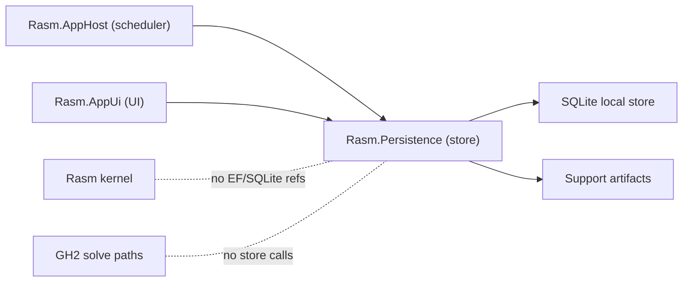

# [H1][RASM_PERSISTENCE_ARCHITECTURE]
>**Dictum:** *The database is an effect; query intent is data.*

 

`Rasm.Persistence` is the local durable-state owner for Rasm plugins and apps. It keeps EF/SQLite and serialization concerns out of `Rasm`, `Rasm.Rhino`, `Rasm.Grasshopper`, and GH solve paths.

---
## [1][BUILD_STATUS]
>**Dictum:** *Build the store, query algebra, and live projection fully from the foundation.*

 

| [INDEX] | [ITEM]        | [STATE]                  |
| :-----: | ------------- | ------------------------ |
|   [1]   | Folder        | Active build             |
|   [2]   | `.csproj`     | Create in Phase 0        |
|   [3]   | Production C# | In progress              |
|   [4]   | Store schema  | Define in build          |
|   [5]   | Packages      | Add centrally in Phase 0 |

---
## [2][PROVIDER_SPLIT]
>**Dictum:** *Local plugin state is SQLite-first.*

 

| [INDEX] | [PROVIDER]                         | [SCOPE]                    | [USE]                                                |
| :-----: | ---------------------------------- | -------------------------- | ---------------------------------------------------- |
|   [1]   | SQLite / EF Core SQLite            | Default local store, now   | Presets, sessions, cache metadata, support artifacts |
|   [2]   | `Microsoft.Data.Sqlite`            | Lower-level access lane    | Open/close/native-load probes or EF bypass slices    |
|   [3]   | Postgres / Npgsql                  | Companion service only     | Out-of-process companion                             |
|   [4]   | System.Text.Json source generation | Default serialization, now | Config, interchange, support payloads                |
|   [5]   | MessagePack                        | Compact-snapshot lane      | Compact snapshots after binary proof                 |

Postgres/Npgsql examples in `.claude/skills/coding-csharp` are service/companion guidance, not the default in-process plugin store. Npgsql never appears in the Persistence `.csproj`.

**Core packages (newest viable, no version pins in text):** `Microsoft.EntityFrameworkCore.Sqlite` + `Microsoft.Data.Sqlite` (aligned EF SQLite stack), `Microsoft.EntityFrameworkCore.Design` (`PrivateAssets=all`) with an in-project `IDesignTimeDbContextFactory<T>` for migration authoring. `LanguageExt.Core` (v5 `Eff<RT,T>` shell), `System.Reactive` (observable contract), `DynamicData` (internal projection only). `NodaTime` + `NodaTime.Serialization.SystemTextJson`; store `Instant` as `long` (Unix ticks) via a typed `ValueConverter` using provider type `long` → `INTEGER` column — not the Npgsql `DateTimeOffset`/`TEXT` pattern, which SQLite orders only client-side. `FluentValidation` (boundary validation). `MessagePack` + `MessagePack.Generator` (compact-snapshot lane). `EFCore.NamingConventions` (snake_case column names). `EFCore.BulkExtensions` (conditional cache-import lane). `K4os.Compression.LZ4` (snapshot payload compression, speed lane). `Microsoft.Extensions.Compliance.Redaction` (support-bundle redaction — named concern, no active mechanism today).

**In-box (no package pin required):** `System.IO.Hashing` (`XxHash3` snapshot checksums), `System.IO.Compression` (Brotli/Deflate support-bundle export), FTS5 + JSON1 (compiled INTO the SQLite native library — no extra package; reachable via `FromSqlRaw`). `System.Text.Json` source generation (default serialization).

[CRITICAL] macOS-arm64 native chain: `SQLitePCLRaw.bundle_e_sqlite3` + `SourceGear.sqlite3` (newest viable). The `e_sqlite3` symbol prefix is the isolation guard against RhinoWIP's own bundled SQLite — verify at integration time that RhinoWIP does not shadow this symbol. `SQLitePCL.Batteries.Init()` is called (idempotent) before the first `SqliteConnection`, not merely before the first `DbContext`. A missing native asset is a runtime fault; the `StoreOpen` operation returns `MissingNativeAsset` receipt rather than throwing.

**DO NOT ADD:** MemoryPack (duplicates MessagePack; AOT warnings), `SQLitePCLRaw.bundle_e_sqlcipher` (deprecated, conflicts with `e_sqlite3` native), Npgsql (in-process plugin state only), linq2db, EF `.Proxies` (lazy-load breaks the per-operation `Bracket` lifetime model), `Microsoft.AspNetCore.DataProtection` (web hosting tax), FlexLabs.Upsert, ZstdSharp.

**Encryption-at-rest:** no viable free NuGet path exists — SqlCipher bundle is deprecated; SEE and SQLite3MC are paid. Decision: defer encryption; add `NativeEncryptionUnavailable` as a `StoreReceipt` case; file-system encryption (macOS APFS) is the accepted mitigation for presets, sessions, and cache payloads.

Layout: concern folders `Store/`, `Query/`, `Snapshot/`, `Support/`, each a few cohesive files with canonical sections; unproven lanes (MessagePack, raw bypass, companion) stay conditional branches inside their owning file, never pre-built per-lane folders.

---
## [3][TYPE_SHAPES]
>**Dictum:** *Name the algebra; let the build define the bodies.*

 

### [3.1][STORE_OPERATION_ALGEBRA]

**`StoreLifecycleOp`** — sealed DU of lifecycle-mutating operations with a `Fold` over cases:
`Open(StoreProfile)` | `Migrate` | `Compact` | `Export(ExportSpec)` | `Snapshot(SnapshotKind)` | `Cleanup(RetentionPolicy)` | `Backup(BackupSpec)` → all yield `Eff<RT, StoreReceipt>`.

**`StoreQuery<TResult>`** — sealed DU of typed reads with a `Fold` over cases. Query parameters: entity kind (`EntityKind` discriminant), key predicate, time range (`Instant` lower/upper), sort (field + direction), page (offset + count), projection (column subset), include-deleted flag.

AppHost submits `StoreLifecycleOp` and `StoreQuery<T>` as data; Persistence interprets and executes internally.

### [3.2][STORE_RECEIPT]

**`StoreReceipt`** — sealed DU, SUCCESS cases: `Opened(StoreProfile, SchemaVersion)` | `Migrated(fromVersion, toVersion, stepCount)` | `Queried(count)` | `Wrote(count)` | `Compacted(pagesBefore, pagesAfter)` | `Exported(path, sizeBytes)` | `Snapshotted(SnapshotEnvelope)` | `CleanedUp(deletedCount)` | `BackedUp(path)`.

FAILURE cases: `MissingNativeAsset` | `DatabaseNotFound(path)` | `DatabaseCorrupt(path, integrityDetail)` | `PartialMigration(attemptedStep, detail)` | `DowngradeRejected(currentVersion, requestedVersion)` | `TransactionConflict` | `SerializerRejection(codec, detail)` | `CacheInvalidation(entityKind)` | `ExportFailed(detail)` | `RedactionFailed(detail)` | `BackupFailed(detail)` | `NativeEncryptionUnavailable`.

Expected store faults are `StoreReceipt` failure cases, not `Eff` `Error` values — the distinction: structural faults (corrupt, missing, downgrade) return as receipt cases so AppHost can correlate and react without catching exceptions.

### [3.3][APP_STATE]

**`AppState`** — minimal sealed record (point-in-time snapshot, read-only): `ActivePresets ImmutableList<PresetKey>`, `SessionMetadata ImmutableList<SessionSummary>`, `CacheStatus CacheStatusSummary`, `SchemaVersion int`, `OpCounts StoreOpCounts`. Not a store cargo object; no `DbContext` reference; safe to publish across threads.

### [3.4][STORE_PROFILE]

**`StoreProfile`** — sealed record: `Path` resolved from `RhinoApp.GetDataDirectory(persistentSettings:true)` (not `Environment.SpecialFolder`); `Scope` (plugin identity/instance discriminant); `SchemaVersion int`; `HostIdentity` (RhinoWIP version, platform). Multi-profile semantics: each plugin/scope pair gets an isolated file path under the Rhino data directory; no shared global path.

`RhinoCommon.PlugIn.Settings` is a complementary lightweight KV store for small UI preferences — it coexists with the SQLite store and is not a replacement for it.

### [3.5][SNAPSHOT_ENVELOPE]

**`SnapshotEnvelope`** — sealed record: `Kind SnapshotKind`, `SchemaVersion int`, `Codec SnapshotCodec` (discriminant: `Json | MessagePack`), `Payload byte[]`, `Checksum ulong` (XxHash3 over payload bytes; use `System.IO.Hashing.XxHash3`), `Compatibility SnapshotCompatibility`.

Compat logic: on load, compare `Envelope.SchemaVersion` against `StoreProfile.SchemaVersion`; reject if current version is below envelope version (downgrade guard); apply migration projection if current is above (forward-compat); exact-match is the happy path. Snapshot trigger: on `StoreLifecycleOp.Snapshot`, on migration completion, and on explicit `AppHost` request.

Snapshot payload compression: `K4os.Compression.LZ4` (speed lane, default for MessagePack payloads); Brotli/Deflate via `System.IO.Compression` (support-bundle export only).

### [3.6][EF_TO_DYNAMICDATA_BRIDGE]

Bridge contract: `ISaveChangesInterceptor.SavedChangesAsync` (post-commit, on the EF write thread) posts the raw change set to the thread pool via `Task.Run`/`liftAsync`; the pool worker folds it into the current `AppState` and calls `BehaviorSubject<AppState>.OnNext`. The public surface is `Subject.AsObservable()`. Persistence never calls `ObserveOn`.

Fold semantics: for each `EntityEntry` in the change set, discriminate by entity kind and update the relevant `AppState` slot. Deletions decrement counts and remove keys from immutable lists (rebuild-vs-patch: patch for single-entity deltas, full rebuild on bulk). Fold is idempotent on re-delivery (keyed by entity PK). Initial-state seed: `StoreOpen` loads `AppState` from a read query and calls `OnNext` before exposing the observable to consumers. `OnCompleted` fires exactly once on Persistence disposal (after the final `SaveChanges`); shutdown ordering matches AppHost's drain sequence — Persistence flushes before UI `OnCompleted` fires, preventing a race between the final change-set fold and consumer teardown. `OnError` is never called — faults surface via `StoreReceipt`. Back-pressure: `AppUi` applies `Sample`/`Throttle` on `RasmUiScheduler.RxScheduler`; Persistence does not throttle internally. `OnNext` serialization: `BehaviorSubject<AppState>` is not thread-safe; the thread-pool fold worker must serialize `OnNext` calls — use a `lock` or ensure all folds are dispatched through a single serial queue (e.g., `TaskScheduler` with max concurrency 1).

---
## [4][PUBLIC_RAIL_CONTRACT]
>**Dictum:** *Store operations are algebra, not repository method sprawl.*

 

| [INDEX] | [CONCEPT]         | [OWNS]                                                                                     | [DOES_NOT_OWN]              |
| :-----: | ----------------- | ------------------------------------------------------------------------------------------ | --------------------------- |
|   [1]   | Store Profile     | path via `RhinoApp.GetDataDirectory`, scope, schema version, host identity                 | global static DB path       |
|   [2]   | Store Lifecycle   | `StoreLifecycleOp`: open, migrate, compact, export, snapshot, cleanup, backup              | `IRepository<T>` family     |
|   [3]   | Store Query       | `StoreQuery<TResult>`: typed reads with entity kind, key, time range, page, projection     | method-per-entity API       |
|   [4]   | Live State        | `IObservable<AppState>` read-only projection; `BehaviorSubject` internal                   | DynamicData public exposure |
|   [5]   | Snapshot Envelope | Kind, SchemaVersion, Codec, Payload, XxHash3 Checksum, Compatibility                      | raw serializer exposure     |
|   [6]   | Support Artifact  | redacted bundle artifact, `Microsoft.Extensions.Compliance.Redaction`, retention, export   | AppHost collection logic    |
|   [7]   | Store Receipt     | `StoreReceipt` DU — success + typed failure cases; no generic `IReceipt` ledger            | generic receipt ledger      |

`DbContext` belongs in an `Eff<RT,T>` `Bracket` shell — one context per operation, disposed after the operation completes; no context lives across operations. AppHost submits typed `Eff<RT, StoreReceipt>` and never holds a `DbContext`. AppUi calls `ObserveOn(RasmUiScheduler.RxScheduler)` on the exposed `IObservable<AppState>` and applies `Sample`/`Throttle` for back-pressure. DynamicData `SourceCache`/`SourceList` are internal projection only and never cross the boundary.

---
## [5][NATIVE_AND_PRAGMA_INIT]
>**Dictum:** *SQLite native init and PRAGMA config are explicit, ordered, and fail-typed.*

 

Native init: `SQLitePCL.Batteries.Init()` runs before the first `SqliteConnection` (not just before the first `DbContext`). The call is idempotent; failure returns `MissingNativeAsset` receipt.

PRAGMAs set explicitly via `ExecuteSqlRaw` on each new connection open (EF does not auto-apply `busy_timeout` or `synchronous`):

| [PRAGMA]             | [VALUE]      | [REASON]                                                                  |
| -------------------- | ------------ | ------------------------------------------------------------------------- |
| `journal_mode`       | `WAL`        | Multi-reader + single-writer; EF SQLite default, but set explicitly       |
| `busy_timeout`       | `3000`       | 3 s wait before returning SQLITE_BUSY; EF does NOT set this automatically |
| `synchronous`        | `NORMAL`     | Balanced durability/performance on WAL; not set by EF                     |
| `foreign_keys`       | `ON`         | Enforce FK constraints EF generates                                       |

[CRITICAL] `EnableRetryOnFailure` is Npgsql-only and does NOT compile on EF SQLite. Do not use it. Rely on `busy_timeout` + app-level retry (LanguageExt `Schedule`) for transient SQLITE_BUSY.

Connection-pool strategy: one `DbContext` per `Bracket`-scoped operation; `Microsoft.Data.Sqlite` default pool size is 1 per connection string. Persistence does not pre-warm a pool; WAL + page-cache handles multi-read concurrency. The pool is sized implicitly by the per-operation bracket lifetime — no explicit `MaxPoolSize` needed.

Two Rhino instances sharing the same db file: WAL serializes writers; `busy_timeout` mitigates brief lock contention. If contention is sustained, the second instance returns `TransactionConflict` receipt.

---
## [6][SCHEMA_VERSION_AND_MIGRATION]
>**Dictum:** *Schema version is explicit; downgrade is a typed rejection.*

 

Schema-version carrier: EF `__EFMigrationsHistory` table (append-only migration log) is the primary carrier; `PRAGMA user_version` mirrors the integer schema version and serves as the fast-path downgrade check before EF initialization. [CRITICAL] `__EFMigrationsLock` is SQL Server-specific — EF Core SQLite does NOT use it; remove any reference to it from failure taxonomies. The real migration risk is a partial/interrupted migration (process crash mid-apply); model this as `PartialMigration(attemptedStep, detail)` receipt. Downgrade guard: read the highest applied migration ID from `__EFMigrationsHistory` (and confirm `PRAGMA user_version`) on `StoreOpen`; if it exceeds the current model's target, return `DowngradeRejected`.

Compaction: `VACUUM INTO '<path>.compact'` (online copy — WAL-safe) then atomic rename, or `PRAGMA auto_vacuum=INCREMENTAL` + periodic `PRAGMA incremental_vacuum`. WAL checkpoint: explicit `PRAGMA wal_checkpoint(TRUNCATE)` after compaction.

Online backup: `SqliteConnection.BackupDatabase(destination)` (not a file copy — file copy races WAL shadow pages). Returns `BackedUp(path)` receipt on success.

Corruption recovery: `PRAGMA integrity_check` on `StoreOpen`. On failure: rename the corrupt file (preserve for diagnostics), open a fresh store, and attempt to restore from the latest valid snapshot. Returns `DatabaseCorrupt` receipt with `integrityDetail`.

---
## [7][REFERENCE_MATRIX]
>**Dictum:** *Persistence dependencies point outward only from consumers.*

 

| [INDEX] | [PROJECT]          | [MAY_REFERENCE_PERSISTENCE] | [MAY_REFERENCE_EF_SQLITE]  | [MAY_CALL_DURING_SOLVE] |
| :-----: | ------------------ | :-------------------------: | :------------------------: | :---------------------: |
|   [1]   | `Rasm`             |             No              |             No             |           No            |
|   [2]   | `Rasm.Rhino`       |        No by default        |             No             |           No            |
|   [3]   | `Rasm.Grasshopper` |        No by default        |             No             |           No            |
|   [4]   | `Rasm.AppHost`     |   Yes, orchestration only   |             No             |           No            |
|   [5]   | `Rasm.AppUi`       |    Yes, app state views     |             No             |           No            |
|   [6]   | Future plugin/app  |             Yes             | No unless composition root |           No            |
|   [7]   | `Rasm.Persistence` |            Owns             |            Owns            |           No            |

Cross-folder spine: `Rasm.AppUi` consumes exactly one public surface — `IObservable<AppState>`; it calls `ObserveOn(RasmUiScheduler.RxScheduler)` and applies `Sample`/`Throttle` for back-pressure; no `DbContext`, `SourceCache`, or change-set crosses the boundary. Persistence exports one capability record, `StoreDispatch` (held on AppHost's `RasmRuntime`), through which `Rasm.AppHost` submits `StoreLifecycleOp` and `StoreQuery<T>` as typed `Eff<RT, StoreReceipt>` operations and correlates receipts; it never holds a `DbContext`. Receipts are typed (`StoreReceipt`), never a generic `IReceipt` ledger.

---
## [8][FAILURE_MODEL]
>**Dictum:** *Durable failures become typed receipts.*

 

`StoreReceipt` failure taxonomy is the full DU in §3.2. Dispatch rules:

- Structural faults (`DatabaseCorrupt`, `DowngradeRejected`, `PartialMigration`, `MissingNativeAsset`) return as receipt cases — AppHost correlates and applies degradation policy; no exception propagates.
- Transient contention (`TransactionConflict`) is retried by AppHost via LanguageExt `Schedule`; after the retry budget `TransactionConflict` is returned.
- Encryption unavailability (`NativeEncryptionUnavailable`) returns immediately; no retry; APFS encryption is the accepted mitigation.

[CRITICAL] `__EFMigrationsLock` does not exist in EF Core SQLite (SQL Server-specific). `PartialMigration` is the correct interrupted-apply case. Migrations are append-only; rollback is a new forward migration. `EnableRetryOnFailure` is Npgsql-only — never reference it.

---
## [9][SOURCE_ANCHORS]
>**Dictum:** *Sources ground integration.*

 

| [INDEX] | [SOURCE]                                                                                                                                 | [USE]                                                         |
| :-----: | ---------------------------------------------------------------------------------------------------------------------------------------- | ------------------------------------------------------------- |
|   [1]   | `.claude/skills/coding-csharp/references/persistence.md`                                                                                 | `Eff<RT,T>`, query algebra, append-only migrations            |
|   [2]   | `.claude/skills/coding-csharp/references/validation.md`                                                                                  | FluentValidation boundary bridge                              |
|   [3]   | [EF Core SQLite](https://learn.microsoft.com/ef/core/providers/sqlite/)                                                                  | local provider anchor                                         |
|   [4]   | [EF Core SQLite limitations](https://learn.microsoft.com/en-us/ef/core/providers/sqlite/limitations)                                     | migration/failure model; no `__EFMigrationsLock`; `PRAGMA user_version` downgrade fast-path |
|   [5]   | [System.Text.Json source generation](https://learn.microsoft.com/en-us/dotnet/standard/serialization/system-text-json/source-generation) | default serialization guidance                                |
|   [6]   | [SQLitePCLRaw bundle_e_sqlite3](https://www.nuget.org/packages/SQLitePCLRaw.bundle_e_sqlite3)                                             | macOS-arm64 native SQLite asset chain; `e_sqlite3` symbol isolation |
|   [7]   | [NodaTime](https://www.nuget.org/packages/NodaTime)                                                                                      | `IClock`, `Instant`; `long`/`INTEGER` converter for SQLite    |
|   [8]   | [EFCore.NamingConventions](https://www.nuget.org/packages/EFCore.NamingConventions)                                                      | snake_case column mapping                                     |
|   [9]   | [K4os.Compression.LZ4](https://www.nuget.org/packages/K4os.Compression.LZ4)                                                             | snapshot payload compression (speed lane)                     |
|  [10]   | [Microsoft.Extensions.Compliance.Redaction](https://www.nuget.org/packages/Microsoft.Extensions.Compliance.Redaction)                   | support-bundle redaction                                      |
