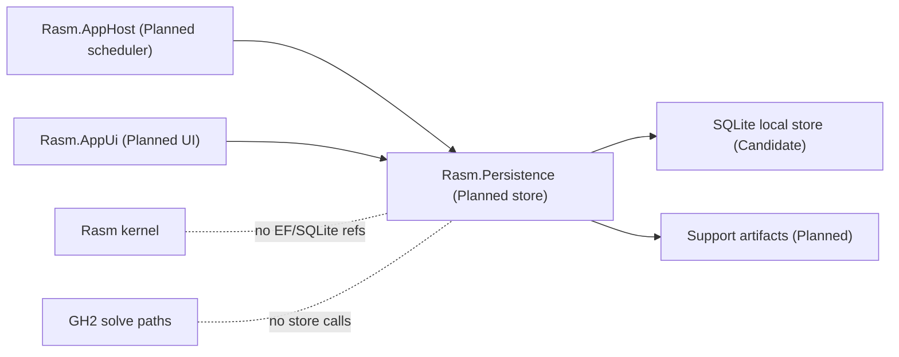

# [H1][RASM_PERSISTENCE_ARCHITECTURE]
>**Dictum:** *The database is an effect; query intent is data.*

 

`Rasm.Persistence` is the planned local durable-state owner for future product plugins and apps. It keeps EF/SQLite and serialization concerns out of `Rasm`, `Rasm.Rhino`, `Rasm.Grasshopper`, and GH solve paths.

---
## [1][CURRENT_STATUS]
>**Dictum:** *The store is planned until schema and source exist.*

 

| [INDEX] | [ITEM] | [STATE] |
| :-----: | ------ | ------- |
|   [1]   | Folder | Documentation stub |
|   [2]   | `.csproj` | Absent |
|   [3]   | Production C# | Absent |
|   [4]   | Store schema | Absent |
|   [5]   | Candidate packages | Not in graph |

---
## [2][PROVIDER_SPLIT]
>**Dictum:** *Local plugin state is SQLite-first.*

 

| [INDEX] | [PROVIDER] | [POSTURE] | [USE] |
| :-----: | ---------- | --------- | ----- |
|   [1]   | SQLite / EF Core SQLite | Planned first local store | Presets, sessions, cache metadata, support artifacts |
|   [2]   | Microsoft.Data.Sqlite | Lower-level candidate | Open/close/native-load probes or EF bypass slices |
|   [3]   | Postgres / Npgsql | Not this platform by default | Companion service only |
|   [4]   | System.Text.Json source generation | Default serialization guidance | Config, interchange, support payloads |
|   [5]   | MessagePack | Conditional candidate | Compact snapshots after binary proof |

Postgres/Npgsql examples in `.claude/skills/coding-csharp` are service/companion guidance, not the default in-process plugin store.

---
## [3][PUBLIC_RAIL_CONTRACT]
>**Dictum:** *Store operations are algebra, not repository method sprawl.*

 

| [INDEX] | [CONCEPT] | [OWNS] | [DOES_NOT_OWN] |
| :-----: | --------- | ------ | -------------- |
|   [1]   | Store Profile | path, scope, schema version, host identity | global static DB path |
|   [2]   | Store Operation | open, migrate, query, write, compact, export | `IRepository<T>` family |
|   [3]   | Query Algebra | typed query intent interpreted internally | method-per-entity API |
|   [4]   | Snapshot Envelope | payload kind, version, codec, checksum, compatibility | raw serializer exposure |
|   [5]   | Support Artifact | redacted bundle artifact, retention, export receipt | AppHost collection logic |
|   [6]   | Store Receipt | migration, transaction, cache invalidation, corruption, lock faults | generic receipt ledger |

`DbContext` belongs in an `Eff<RT,T>` runtime shell. Consumers submit typed operations; Persistence interprets them internally and materializes results at boundaries.

---
## [4][REFERENCE_MATRIX]
>**Dictum:** *Persistence dependencies point outward only from consumers.*

 

| [INDEX] | [PROJECT] | [MAY_REFERENCE_PERSISTENCE] | [MAY_REFERENCE_EF_SQLITE] | [MAY_CALL_DURING_SOLVE] |
| :-----: | --------- | :-------------------------: | :-----------------------: | :---------------------: |
|   [1]   | `Rasm` | No | No | No |
|   [2]   | `Rasm.Rhino` | No by default | No | No |
|   [3]   | `Rasm.Grasshopper` | No by default | No | No |
|   [4]   | `Rasm.AppHost` | Yes, orchestration only | No | No |
|   [5]   | `Rasm.AppUi` | Yes, app state views | No | No |
|   [6]   | Future plugin/app | Yes | No unless composition root | No |
|   [7]   | `Rasm.Persistence` | Owns | Owns | No |

---
## [5][FAILURE_MODEL]
>**Dictum:** *Durable failures become typed receipts.*

 

Store receipts must distinguish missing database, corrupt database, locked database, partial migration, unsupported downgrade, missing native SQLite asset, transaction conflict, serializer rejection, cache invalidation, backup/export failure, and redaction failure.

Migrations are append-only. Rollback is a new forward migration. SQLite migration limitations and locking behavior must be documented before first source lands.

---
## [6][SOURCE_ANCHORS]
>**Dictum:** *Sources justify candidates; they do not pin versions.*

 

| [INDEX] | [SOURCE] | [USE] |
| :-----: | -------- | ----- |
|   [1]   | `.claude/skills/coding-csharp/references/persistence.md` | `Eff<RT,T>`, query algebra, append-only migrations |
|   [2]   | `.claude/skills/coding-csharp/references/validation.md` | FluentValidation boundary bridge |
|   [3]   | [EF Core SQLite](https://learn.microsoft.com/ef/core/providers/sqlite/) | local provider anchor |
|   [4]   | [EF Core SQLite limitations](https://learn.microsoft.com/en-us/ef/core/providers/sqlite/limitations) | migration/failure model |
|   [5]   | [System.Text.Json source generation](https://learn.microsoft.com/en-us/dotnet/standard/serialization/system-text-json/source-generation) | default serialization guidance |
