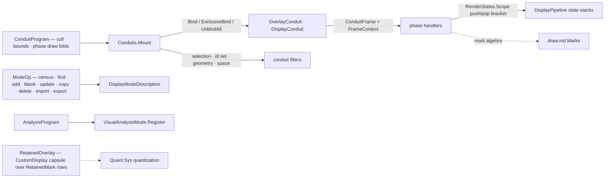

# [RASM_RHINO_CONDUIT]

Display-conduit phase algebra (`Rasm.Rhino.Display`). Frame participation is one program over one phase vocabulary: `ConduitPhase` rows name the ordered pipeline phases from `ObjectCulling` through `DrawOverlay`, `ConduitProgram` binds phase handlers to typed frame facts, and one `OverlayConduit` adapter derives `DisplayConduit` exactly once — binding scope (`Bind`/`ExclusiveBind`/`UnbindAll`, the Rhino 9 viewport-bound family) and filters (selection, object-id, geometry, space) are declared rows, pipeline render state rides matched push/pop brackets that cannot unbalance, and pass context (`IsInViewCapture`/`IsPrinting`/`IsDynamicDisplay`/`RenderPass`/`NestLevel`/`DpiScale`) crosses as one `FrameContext` value. This page also owns the three sibling participation surfaces the display boundary carries: `DisplayModeDescription` management as one mode operation union, `VisualAnalysisMode` registration with typed hooks, and the retained `CustomDisplay` capsule — plus the Rhino 9 `DisplayPen` and `IsoDrawEffect` effect rows whose band colors quantize from the kernel `PerceptualColor`. Viewport projection facts read host members off the conduit's own event args — a sibling camera type on this page is the killed census breach, and selection scoping takes bare id sets, never a command-selection carrier.

## [01]-[INDEX]

- [02]-[PHASE_ALGEBRA]: `ConduitPhase` ordered rows, `FrameContext` pass state, `ConduitFrame` the per-phase fact, and `RenderStates` the matched state-stack bracket.
- [03]-[CONDUIT_OWNER]: `ConduitBinding`, `ConduitFilter`, `ConduitProgram`, the one `OverlayConduit` adapter, and the `Conduits.Mount` lifecycle.
- [04]-[MODES_AND_OVERLAYS]: `ModeOp` display-mode management, `AnalysisProgram` visual-analysis participation, and the `RetainedOverlay` capsule.
- [05]-[EFFECT_ROWS]: `PenSpec` and `IsoBanding` — the Rhino 9 vector-pen and banded-shading rows.

## [02]-[PHASE_ALGEBRA]

- Owner: `ConduitPhase` `[SmartEnum<int>]` — the ordered frame phases: `Culling`, `Bounds`, `BoundsZoomExtents`, `PreObjects`, `PreObject`, `PostObjects`, `Foreground`, `Overlay`, each carrying the `Draws` and `PerObject` columns a program reads. `FrameContext` — the pass facts read from the live pipeline once per phase entry. `ConduitFrame` — what a handler receives: the pipeline handle, the viewport identity and projection facts read directly off the event's viewport (`Id`, `ChangeCounter`, `GetWorldToScreenScale`), the frame context, and the phase row. `RenderStates` — the state-stack policy: depth testing, depth writing, clip testing, cull-face mode, model transform, and the 2D screen projection as `Option` slots whose `Scope` pushes every populated slot, runs the draw, and pops in exact reverse — an unmatched push is unrepresentable.
- Law: phase order is host law restated as row order — culling precedes bounds, bounds precede draws, `Foreground` and `Overlay` close the frame — and a program's handlers fire in that order regardless of declaration order.
- Law: a draw that must differ between interactive, capture, and print frames branches on `FrameContext` flags inside its handler; a second conduit per pass kind is the collapsed form.
- Boundary: `ConduitFrame` exposes the raw `DisplayPipeline` because draw dispatch is the draw page's mark algebra — this page owns participation and state, never the mark vocabulary.

```csharp
// --- [RUNTIME_PRELUDE] ----------------------------------------------------------------------
using Rasm.Domain;
using Rasm.Numerics;
using Rasm.Rhino.Document;

namespace Rasm.Rhino.Display;

// --- [TYPES] --------------------------------------------------------------------------------
[SmartEnum<int>]
public sealed partial class ConduitPhase {
    public static readonly ConduitPhase Culling = new(key: 0, draws: false, perObject: true);
    public static readonly ConduitPhase Bounds = new(key: 1, draws: false, perObject: false);
    public static readonly ConduitPhase BoundsZoomExtents = new(key: 2, draws: false, perObject: false);
    public static readonly ConduitPhase PreObjects = new(key: 3, draws: true, perObject: false);
    public static readonly ConduitPhase PreObject = new(key: 4, draws: true, perObject: true);
    public static readonly ConduitPhase PostObjects = new(key: 5, draws: true, perObject: false);
    public static readonly ConduitPhase Foreground = new(key: 6, draws: true, perObject: false);
    public static readonly ConduitPhase Overlay = new(key: 7, draws: true, perObject: false);

    public bool Draws { get; }
    public bool PerObject { get; }
}

// --- [MODELS] -------------------------------------------------------------------------------
public readonly record struct FrameContext(bool Capturing, bool Printing, bool Dynamic, int RenderPass, int NestLevel, float DpiScale) {
    internal static FrameContext Of(DisplayPipeline pipeline) =>
        new(Capturing: pipeline.IsInViewCapture, Printing: pipeline.IsPrinting, Dynamic: pipeline.IsDynamicDisplay,
            RenderPass: pipeline.RenderPass, NestLevel: pipeline.NestLevel, DpiScale: pipeline.DpiScale);
}

public readonly record struct ConduitFrame(DisplayPipeline Pipeline, RhinoViewport Viewport, FrameContext Context, ConduitPhase Phase) {
    public Guid ViewportId => Viewport.Id;
    public Fin<double> PixelScale(Point3d at, Op key) =>
        Viewport.GetWorldToScreenScale(pointInFrustum: at, pixelsPerUnit: out double ppu) && double.IsFinite(ppu) && ppu > 0.0
            ? Fin.Succ(ppu)
            : Fin.Fail<double>(key.InvalidResult());
}

public sealed record RenderStates(
    Option<bool> DepthTest,
    Option<bool> DepthWrite,
    Option<bool> ClipTest,
    Option<CullFaceMode> CullFace,
    Option<Transform> Model,
    bool Screen2d) {
    public static RenderStates None { get; } = new(DepthTest: Option<bool>.None, DepthWrite: Option<bool>.None, ClipTest: Option<bool>.None, CullFace: Option<CullFaceMode>.None, Model: Option<Transform>.None, Screen2d: false);
    public static RenderStates OnTop { get; } = None with { DepthTest: Some(false) };
    public static RenderStates Hud { get; } = None with { Screen2d: true };

    public Fin<Unit> Scope(DisplayPipeline pipeline, Func<Fin<Unit>> draw, Op key) {
        RenderStates self = this;
        return key.Catch(() => {
            _ = self.DepthTest.Iter(value => pipeline.PushDepthTesting(enable: value));
            _ = self.DepthWrite.Iter(value => pipeline.PushDepthWriting(enable: value));
            _ = self.ClipTest.Iter(value => pipeline.PushClipTesting(enable: value));
            _ = self.CullFace.Iter(value => pipeline.PushCullFaceMode(mode: value));
            _ = self.Model.Iter(value => pipeline.PushModelTransform(xform: value));
            _ = Op.SideWhen(self.Screen2d, pipeline.Push2dProjection);
            try { return draw(); }
            finally {
                _ = Op.SideWhen(self.Screen2d, pipeline.PopProjection);
                _ = self.Model.Iter(_ => pipeline.PopModelTransform());
                _ = self.CullFace.Iter(_ => pipeline.PopCullFaceMode());
                _ = self.ClipTest.Iter(_ => pipeline.PopClipTesting());
                _ = self.DepthWrite.Iter(_ => pipeline.PopDepthWriting());
                _ = self.DepthTest.Iter(_ => pipeline.PopDepthTesting());
            }
        });
    }
}
```

## [03]-[CONDUIT_OWNER]

- Owner: `ConduitBinding` `[Union]` — the Rhino 9 scope rows: `GlobalCase` (every viewport), `BoundCase(ViewportTarget)` through `Bind(RhinoViewport)`, `ExclusiveCase(ViewportTarget)` through `ExclusiveBind` seizing the draw; unmounting always runs `UnbindAll`. `ConduitFilter` — the declared scoping: `Selection(on, checkSubObjects)` through `SetSelectionFilter`, an object-id set through `SetObjectIdFilter`, `ObjectType` geometry and `ActiveSpace` space filters — id sets are `Seq<Guid>`, so selection scope arrives kernel-neutral and the census `CommandSelection` coupling is dead. `ConduitProgram` — the phase program: an `Option` handler per phase (`Cull` deciding per-object visibility, `Bounds` contributing a `BoundingBox`, and one `Draw` fold per drawing phase receiving the `ConduitFrame`), plus the `RenderStates` each drawing handler scopes under. `OverlayConduit` — the ONE `DisplayConduit` subclass: overrides route to the program, absent handlers cost nothing, and `Enabled` is the mount's lifecycle bit.
- Entry: `Conduits.Mount(DocumentSession, ConduitProgram, ConduitBinding, Option<ConduitFilter>, Op?) : Fin<IDisposable>` — construct, filter, bind, enable; the disposer disables and `UnbindAll`s. One mount owns one overlay concern; a second conduit drawing the same overlay is the collapsed form.
- Law: `Bounds` handlers include their geometry in framing and zoom-extents through `e.IncludeBoundingBox` — a drawing conduit without a bounds contribution clips at zoom-extents, so a program with world-space draw handlers and no bounds handler is refused at `Mount`.
- Law: per-object phases carry the object identity (`DrawObjectEventArgs`/`CullObjectEventArgs`) into the handler as a `Guid` plus the frame — the handler never receives the live `RhinoObject`.
- Boundary: the stateless `DisplayPipeline` static-event tap exists on the host; this package participates only through the conduit form because every program carries per-instance state (filters, cached marks) — one shape, not two.

```csharp
// --- [TYPES] --------------------------------------------------------------------------------
[Union(ConversionFromValue = ConversionOperatorsGeneration.None)]
public abstract partial record ConduitBinding {
    private ConduitBinding() { }
    public sealed record GlobalCase : ConduitBinding;
    public sealed record BoundCase(Viewport.ViewportTarget Target) : ConduitBinding;
    public sealed record ExclusiveCase(Viewport.ViewportTarget Target) : ConduitBinding;
}

// --- [MODELS] -------------------------------------------------------------------------------
public sealed record ConduitFilter(
    Option<(bool On, bool CheckSubObjects)> Selection,
    Option<Seq<Guid>> ObjectIds,
    Option<DocObjects.ObjectType> Geometry,
    Option<ActiveSpace> Space) {
    public static ConduitFilter Everything { get; } = new(Selection: None, ObjectIds: None, Geometry: None, Space: None);
}

public sealed record ConduitProgram(
    Option<Func<Guid, ConduitFrame, bool>> Cull,
    Option<Func<ConduitFrame, Fin<BoundingBox>>> Bounds,
    Option<(RenderStates States, Func<ConduitFrame, Fin<Unit>> Draw)> PreObjects,
    Option<Func<Guid, ConduitFrame, Fin<Unit>>> PreObject,
    Option<(RenderStates States, Func<ConduitFrame, Fin<Unit>> Draw)> PostObjects,
    Option<(RenderStates States, Func<ConduitFrame, Fin<Unit>> Draw)> Foreground,
    Option<(RenderStates States, Func<ConduitFrame, Fin<Unit>> Draw)> Overlay) {
    public static ConduitProgram Empty { get; } = new(Cull: None, Bounds: None, PreObjects: None, PreObject: None, PostObjects: None, Foreground: None, Overlay: None);

    internal bool DrawsWorld => PreObjects.IsSome || PostObjects.IsSome;
}

// --- [SERVICES] -----------------------------------------------------------------------------
internal sealed class OverlayConduit : DisplayConduit {
    private readonly ConduitProgram program;
    private readonly Op key;

    internal OverlayConduit(ConduitProgram program, Op key) {
        this.program = program;
        this.key = key;
    }

    protected override void ObjectCulling(CullObjectEventArgs e) =>
        _ = program.Cull.Iter(decide => e.CullObject = !decide(e.RhinoObject.Id, Frame(pipeline: e.Display, viewport: e.Viewport, phase: ConduitPhase.Culling)));

    protected override void CalculateBoundingBox(CalculateBoundingBoxEventArgs e) =>
        _ = program.Bounds.Iter(contribute =>
            contribute(Frame(pipeline: e.Display, viewport: e.Viewport, phase: ConduitPhase.Bounds)).Iter(box => e.IncludeBoundingBox(box)));

    protected override void CalculateBoundingBoxZoomExtents(CalculateBoundingBoxEventArgs e) =>
        _ = program.Bounds.Iter(contribute =>
            contribute(Frame(pipeline: e.Display, viewport: e.Viewport, phase: ConduitPhase.BoundsZoomExtents)).Iter(box => e.IncludeBoundingBox(box)));

    protected override void PreDrawObjects(DrawEventArgs e) => Run(slot: program.PreObjects, e: e, phase: ConduitPhase.PreObjects);

    protected override void PreDrawObject(DrawObjectEventArgs e) =>
        _ = program.PreObject.Iter(draw => ignore(draw(e.RhinoObject.Id, Frame(pipeline: e.Display, viewport: e.Viewport, phase: ConduitPhase.PreObject))));

    protected override void PostDrawObjects(DrawEventArgs e) => Run(slot: program.PostObjects, e: e, phase: ConduitPhase.PostObjects);

    protected override void DrawForeground(DrawEventArgs e) => Run(slot: program.Foreground, e: e, phase: ConduitPhase.Foreground);

    protected override void DrawOverlay(DrawEventArgs e) => Run(slot: program.Overlay, e: e, phase: ConduitPhase.Overlay);

    private void Run(Option<(RenderStates States, Func<ConduitFrame, Fin<Unit>> Draw)> slot, DrawEventArgs e, ConduitPhase phase) =>
        _ = slot.Iter(handler => ignore(handler.States.Scope(
            pipeline: e.Display,
            draw: () => handler.Draw(Frame(pipeline: e.Display, viewport: e.Viewport, phase: phase)),
            key: key)));

    private static ConduitFrame Frame(DisplayPipeline pipeline, RhinoViewport viewport, ConduitPhase phase) =>
        new(Pipeline: pipeline, Viewport: viewport, Context: FrameContext.Of(pipeline: pipeline), Phase: phase);
}

// --- [OPERATIONS] ---------------------------------------------------------------------------
public static class Conduits {
    public static Fin<IDisposable> Mount(DocumentSession session, ConduitProgram program, ConduitBinding binding, Option<ConduitFilter> filter = default, Op? key = null) {
        Op op = key.OrDefault();
        return from plan in Optional(program).ToFin(Fail: op.InvalidInput())
               from _ in guard(!plan.DrawsWorld || plan.Bounds.IsSome, op.InvalidInput())
               from conduit in Fin.Succ(new OverlayConduit(program: plan, key: op))
               from __ in Filtered(conduit: conduit, filter: filter.IfNone(ConduitFilter.Everything), key: op)
               from ___ in Bound(session: session, conduit: conduit, binding: binding, key: op)
               from ____ in Fin.Succ(value: Op.Side(() => conduit.Enabled = true))
               select (IDisposable)Subscription.Of(detach: () => {
                   conduit.Enabled = false;
                   conduit.UnbindAll();
               });
    }

    private static Fin<Unit> Filtered(OverlayConduit conduit, ConduitFilter filter, Op key) =>
        key.Catch(() => {
            _ = filter.Selection.Iter(value => conduit.SetSelectionFilter(on: value.On, checkSubObjects: value.CheckSubObjects));
            _ = filter.ObjectIds.Iter(ids => conduit.SetObjectIdFilter(ids: ids.Filter(static id => id != Guid.Empty).Distinct().AsEnumerable()));
            _ = filter.Geometry.Iter(value => conduit.GeometryFilter = value);
            _ = filter.Space.Iter(value => conduit.SpaceFilter = value);
            return Fin.Succ(value: unit);
        });

    private static Fin<Unit> Bound(DocumentSession session, OverlayConduit conduit, ConduitBinding binding, Op key) =>
        binding.Switch(
            state: (Session: session, Conduit: conduit, Op: key),
            globalCase: static (_, _) => Fin.Succ(value: unit),
            boundCase: static (ctx, bind) => Viewport.ViewportLease.Of(session: ctx.Session, target: bind.Target, key: ctx.Op)
                .Bind(lease => lease.Use(borrow: row => Fin.Succ(value: Op.Side(() => ctx.Conduit.Bind(viewport: row.Viewport))), key: ctx.Op)),
            exclusiveCase: static (ctx, bind) => Viewport.ViewportLease.Of(session: ctx.Session, target: bind.Target, key: ctx.Op)
                .Bind(lease => lease.Use(borrow: row => Fin.Succ(value: Op.Side(() => ctx.Conduit.ExclusiveBind(viewport: row.Viewport))), key: ctx.Op)));
}
```

## [04]-[MODES_AND_OVERLAYS]

- Owner: `ModeOp` `[Union]` — display-mode table CRUD as one request family: `CensusCase` (`GetDisplayModes`), `FindCase(Guid)` (`GetDisplayMode`), `NamedCase(string)` (`FindByName`), `AddCase(DisplayModeDescription)`, `BlankCase(string)` (`AddDisplayMode(name:)` minting a named blank mode), `UpdateCase(DisplayModeDescription)`, `CopyCase(Guid, string)` (`CopyDisplayMode` — an in-memory registration only `UpdateDisplayMode` persists), `DeleteCase(Guid)` (`DeleteDisplayMode`), `ImportCase(string, bool)` with the host's interactive flag, `ExportCase(Guid, string)` — mode identity travels as `Guid` and mode names as text; the resolved descriptor crosses into consumers for the add/update/copy round-trip, and what the descriptor looks like — policy flags and the `DisplayAttributes` appearance model — is modes.md's `ModePolicy`/`DisplayProfile`, composed through this table's cases. `AnalysisProgram` — the visual-analysis participation record: the attribute setup, per-object vertex-color, and mesh-draw hooks a registered `VisualAnalysisMode` subclass routes into. Registration is the registering plug-in's own lifecycle seam — `VisualAnalysisMode.Register(Type)` host-constructs the subclass, so the subclass composes its `AnalysisProgram` internally, mirroring the realtime-engine registration boundary; resolution is `Find(Guid)`, and built-in analysis ids plus per-object attachment are modes.md's `BuiltinAnalysis`/`AnalysisOp`. `RetainedOverlay` — the `CustomDisplay` capsule: one polymorphic `Add` accumulating `RetainedMark` rows — point sets, lines, vectors, arcs, circles, curves, polygons, `Text3d`, and plane text — over the host `Add*` roster, with `Enable` toggling visibility, `Clear`, and disposal retiring the overlay — the conduit-free document-lifetime shape, distinct from live participation by construction; per-family sibling verbs are the deleted form.
- Law: the three overlay shapes never overlap — retained accumulation is `RetainedOverlay`, registered false-color analysis is `AnalysisProgram`, per-frame interactive participation is `ConduitProgram`; a concern spanning two shapes is two owners composing, never one hybrid.
- Law: `ImportCase`/`ExportCase` round-trip `.ini` mode files, and every host-minted `Guid` — add, blank, copy, import — re-resolves through one shared descriptor lookup before it returns, so the caller holds a verified descriptor, never a dangling id.
- Boundary: mode colors and analysis vertex colors quantize through the draw page's `Quant.Sys` at this edge; a `System.Drawing.Color` literal in a consumer is the deleted form.

```csharp
// --- [TYPES] --------------------------------------------------------------------------------
[Union(ConversionFromValue = ConversionOperatorsGeneration.None)]
public abstract partial record ModeOp {
    private ModeOp() { }
    public sealed record CensusCase : ModeOp;
    public sealed record FindCase(Guid ModeId) : ModeOp;
    public sealed record NamedCase(string Name) : ModeOp;
    public sealed record AddCase(DisplayModeDescription Mode) : ModeOp;
    public sealed record BlankCase(string Name) : ModeOp;
    public sealed record UpdateCase(DisplayModeDescription Mode) : ModeOp;
    public sealed record CopyCase(Guid SourceId, string Name) : ModeOp;
    public sealed record DeleteCase(Guid ModeId) : ModeOp;
    public sealed record ImportCase(string Path, bool Interactive) : ModeOp;
    public sealed record ExportCase(Guid ModeId, string Path) : ModeOp;

    public Fin<Seq<DisplayModeDescription>> Apply(Op? key = null) {
        Op op = key.OrDefault();
        return Switch(
            state: op,
            censusCase: static (inner, _) => inner.Catch(() => Fin.Succ(toSeq(DisplayModeDescription.GetDisplayModes()))),
            findCase: static (inner, request) => Resolved(id: request.ModeId, missing: inner.InvalidInput()).Map(static mode => Seq(mode)),
            namedCase: static (inner, request) => Optional(DisplayModeDescription.FindByName(englishName: request.Name)).ToFin(Fail: inner.InvalidInput()).Map(static mode => Seq(mode)),
            addCase: static (inner, request) => inner.Catch(() =>
                Minted(id: DisplayModeDescription.AddDisplayMode(displayMode: request.Mode), detail: nameof(AddCase), key: inner)),
            blankCase: static (inner, request) => inner.Catch(() =>
                Minted(id: DisplayModeDescription.AddDisplayMode(name: request.Name), detail: request.Name, key: inner)),
            updateCase: static (inner, request) => inner.Confirm(success: DisplayModeDescription.UpdateDisplayMode(displayMode: request.Mode)).Map(_ => Seq(request.Mode)),
            copyCase: static (inner, request) => inner.Catch(() =>
                Minted(id: DisplayModeDescription.CopyDisplayMode(id: request.SourceId, name: request.Name), detail: request.Name, key: inner)),
            deleteCase: static (inner, request) =>
                from mode in Resolved(id: request.ModeId, missing: inner.InvalidInput())
                from _ in inner.Confirm(success: DisplayModeDescription.DeleteDisplayMode(id: request.ModeId))
                select Seq(mode),
            importCase: static (inner, request) => inner.Catch(() =>
                Minted(id: DisplayModeDescription.ImportFromFile(filename: request.Path, interactive: request.Interactive), detail: request.Path, key: inner)),
            exportCase: static (inner, request) =>
                from mode in Resolved(id: request.ModeId, missing: inner.InvalidInput())
                from _ in inner.Confirm(success: DisplayModeDescription.ExportToFile(displayMode: mode, filename: request.Path))
                select Seq(mode));
    }

    private static Fin<DisplayModeDescription> Resolved(Guid id, Error missing) =>
        Optional(DisplayModeDescription.GetDisplayMode(id: id)).ToFin(Fail: missing);

    private static Fin<Seq<DisplayModeDescription>> Minted(Guid id, string detail, Op key) =>
        id != Guid.Empty
            ? Resolved(id: id, missing: key.InvalidResult(detail: detail)).Map(static mode => Seq(mode))
            : Fin.Fail<Seq<DisplayModeDescription>>(key.InvalidResult(detail: detail));
}

// --- [MODELS] -------------------------------------------------------------------------------
public sealed record AnalysisProgram(
    Action<DocObjects.RhinoObject, DisplayPipelineAttributes> SetupAttributes,
    Func<DocObjects.RhinoObject, Mesh[], Fin<Unit>> VertexColors,
    Option<Func<DocObjects.RhinoObject, Mesh, DisplayPipeline, Fin<Unit>>> DrawMesh);

[Union(ConversionFromValue = ConversionOperatorsGeneration.None)]
public abstract partial record RetainedMark {
    private RetainedMark() { }
    public sealed record PointsCase(Seq<Point3d> Points, PerceptualColor Color, PointStyle Style, int Radius) : RetainedMark;
    public sealed record LineCase(Line Value, PerceptualColor Color, int Thickness) : RetainedMark;
    public sealed record VectorCase(Point3d Anchor, Vector3d Span, PerceptualColor Color, bool DrawAnchor) : RetainedMark;
    public sealed record ArcCase(Arc Value, PerceptualColor Color, int Thickness) : RetainedMark;
    public sealed record CircleCase(Circle Value, PerceptualColor Color, int Thickness) : RetainedMark;
    public sealed record CurveCase(Curve Value, PerceptualColor Color, int Thickness) : RetainedMark;
    public sealed record PolygonCase(Seq<Point3d> Ring, PerceptualColor Fill, PerceptualColor Edge, bool DrawFill, bool DrawEdge) : RetainedMark;
    public sealed record TextCase(Text3d Value, PerceptualColor Color) : RetainedMark;
    public sealed record PlaneTextCase(string Text, Plane Plane, double Height, PerceptualColor Color) : RetainedMark;

    internal Unit AccumulateOn(CustomDisplay display) =>
        Switch(
            state: display,
            pointsCase: static (d, m) => Op.Side(() => d.AddPoints(m.Points.AsEnumerable(), Quant.Sys(m.Color), m.Style, m.Radius)),
            lineCase: static (d, m) => Op.Side(() => d.AddLine(m.Value, Quant.Sys(m.Color), m.Thickness)),
            vectorCase: static (d, m) => Op.Side(() => d.AddVector(m.Anchor, m.Span, Quant.Sys(m.Color), m.DrawAnchor)),
            arcCase: static (d, m) => Op.Side(() => d.AddArc(m.Value, Quant.Sys(m.Color), m.Thickness)),
            circleCase: static (d, m) => Op.Side(() => d.AddCircle(m.Value, Quant.Sys(m.Color), m.Thickness)),
            curveCase: static (d, m) => Op.Side(() => d.AddCurve(m.Value, Quant.Sys(m.Color), m.Thickness)),
            polygonCase: static (d, m) => Op.Side(() => d.AddPolygon(m.Ring.AsEnumerable(), Quant.Sys(m.Fill), Quant.Sys(m.Edge), m.DrawFill, m.DrawEdge)),
            textCase: static (d, m) => Op.Side(() => d.AddText(m.Value, Quant.Sys(m.Color))),
            planeTextCase: static (d, m) => Op.Side(() => d.AddText(m.Text, m.Plane, m.Height, Quant.Sys(m.Color))));
}

// --- [SERVICES] -----------------------------------------------------------------------------
public sealed class RetainedOverlay : IDisposable {
    private readonly CustomDisplay display;
    private int released;

    private RetainedOverlay(CustomDisplay display) => this.display = display;

    public static Fin<RetainedOverlay> Of(bool enable = true, Op? key = null) =>
        key.OrDefault().Catch(() => Fin.Succ(new RetainedOverlay(display: new CustomDisplay(enable))));

    public Fin<Unit> Add(Seq<RetainedMark> marks, Op? key = null) {
        RetainedOverlay self = this;
        return key.OrDefault().Catch(() => Fin.Succ(value: marks.Iter(mark => mark.AccumulateOn(display: self.display))));
    }

    public Fin<Unit> Enable(bool on, Op? key = null) =>
        key.OrDefault().Catch(() => Fin.Succ(value: Op.Side(() => display.Enabled = on)));

    public Fin<Unit> Clear(Op? key = null) =>
        key.OrDefault().Catch(() => Fin.Succ(value: Op.Side(display.Clear)));

    public void Dispose() =>
        _ = Interlocked.Exchange(location1: ref released, value: 1) is 0 ? fun(display.Dispose)() : unit;
}
```

## [05]-[EFFECT_ROWS]

- Owner: `PenSpec` — the Rhino 9 `DisplayPen` row: a linetype-derived pen through `DisplayPen.FromLinetype(Linetype, Color)` with `PatternAutoscale` and `PatternScale` as declared fields, minted once per spec and reused across draws. `IsoBanding` — the full `IsoDrawEffect` row: `IsoDrawMode`, direction and anchor point, frequency, band rotation and falloff, the optional gap triple (`GapColor`/`GapSize`/`DiscardGap` as one `Option` slot), and a kernel `PerceptualColor` ramp quantized into the per-band colors through `SetBandColor` — the banded-shading effect the draw page's shaded-mesh mark consumes.
- Law: band colors derive from one `PerceptualColor.Ramp` over a `BlendPath` row, so an iso effect's palette is perceptually even by construction; per-band `System.Drawing.Color` literals are the deleted form, and the host caps band storage at ten colors, so `Bands` admits `(0, 10]` at `Mint`.
- Boundary: both rows are effect DATA consumed by the draw page's mark arms; neither draws.

```csharp
// --- [MODELS] -------------------------------------------------------------------------------
public sealed record PenSpec(DocObjects.Linetype Pattern, PerceptualColor Color, bool Autoscale, double Scale) {
    public Fin<DisplayPen> Mint(Op? key = null) {
        PenSpec self = this;
        return key.OrDefault().Catch(() => {
            DisplayPen pen = DisplayPen.FromLinetype(linetype: self.Pattern, color: Quant.Sys(self.Color));
            pen.PatternAutoscale = self.Autoscale;
            pen.PatternScale = (float)self.Scale;
            return Fin.Succ(pen);
        });
    }
}

public sealed record IsoBanding(
    IsoDrawMode Mode,
    Vector3d Direction,
    Point3d Anchor,
    int Frequency,
    double RotationRadians,
    double Falloff,
    Option<(PerceptualColor Color, double Size, bool Discard)> Gap,
    PerceptualColor From,
    PerceptualColor To,
    Dimension Bands) {
    public Fin<IsoDrawEffect> Mint(Op? key = null) {
        Op op = key.OrDefault();
        IsoBanding self = this;
        return from _ in guard(self.Bands.Value is > 0 and <= 10, op.InvalidInput()).ToFin()
               from ramp in Fin.Succ(self.From.Ramp(to: self.To, stops: self.Bands))
               from effect in op.Catch(() => {
                   IsoDrawEffect banded = new() {
                       DrawMode = self.Mode,
                       Direction = self.Direction,
                       Point = self.Anchor,
                       Frequency = self.Frequency,
                       RotationRadians = self.RotationRadians,
                       Falloff = self.Falloff,
                       UsedBandColorCount = self.Bands.Value,
                   };
                   _ = self.Gap.Iter(gap => {
                       banded.GapColor = Quant.Sys(gap.Color);
                       banded.GapSize = gap.Size;
                       banded.DiscardGap = gap.Discard;
                   });
                   _ = ramp.Map(static (stop, index) => (Index: index, Stop: stop))
                       .Iter(row => ignore(banded.SetBandColor(row.Index, Quant.Sys(row.Stop))));
                   return Fin.Succ(banded);
               })
               select effect;
    }
}
```


