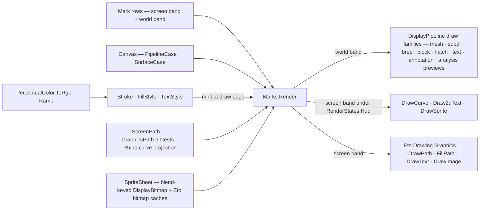

# [RASM_RHINO_DRAW]

The two-backend mark algebra (`Rasm.Rhino.Display`). One `Mark` `[Union]` carries every drawable row — the screen band (segments, polylines, retained paths, labels, sprites) valid on both backends, and the world band (shaded/banded/false-color meshes, SubD and brep shaded/wire draws, the Rhino 9 instance-definition shaded draw, clipping-plane wires, hatches, curves, world text, annotations, and the Rhino 9 direction/curvature/draft-angle analysis previews) valid on the pipeline alone — dispatched by one `Marks.Render` over the `Canvas` `[Union]`: `PipelineCase` drawing through `DisplayPipeline` members and `SurfaceCase` drawing through `Eto.Drawing.Graphics`. Style is data: `Stroke` and `FillStyle` rows mint backend primitives at the draw edge with gradient stops composed from the kernel `PerceptualColor.Ramp`, text metrics come from `Eto.Drawing.FormattedText.Measure` as the single measurement authority, hit-testing rides `GraphicsPath.FillContains`/`StrokeContains` over the same retained path the paint drew, and sprites admit once into a two-backend sheet caching blend-keyed `DisplayBitmap` rows for the pipeline and Eto bitmaps for the surface. The killed census forms are the hand-rolled screen-curve samplers, the fixed font-metric constants, and the HUD arithmetic scattered beside the draw switch — a screen path is segment rows with two projections (an Eto path and a Rhino curve), never a re-sampled polyline.

## [01]-[INDEX]

- [02]-[STYLE_ROWS]: `Stroke`, `FillStyle`, and `TextStyle` — backend-neutral style data with per-backend minting and the kernel color seam.
- [03]-[SCREEN_PATHS]: `PathSeg` rows with the dual Eto-path/Rhino-curve projection, `ScreenPath` the retained geometry with hit-testing and measurement.
- [04]-[SPRITES]: `SpriteRef` admission and the two-backend `SpriteSheet` cache — blend-keyed `DisplayBitmap` rows plus Eto bitmaps.
- [05]-[MARK_RAIL]: the `Mark` union, the `Canvas` backend union, and the one `Marks.Render` total dispatch.

## [02]-[STYLE_ROWS]

- Owner: `Stroke` — width, kernel `PerceptualColor`, cap/join rows carrying dual Eto/host columns (`PenLineCap`/`LineCapStyle`, `PenLineJoin`/`LineJoinStyle`), dash selection whose width-relative dashes-and-gaps column feeds both the Eto `DashStyle` and the host `SetPattern`, an optional halo color/thickness pair, an optional taper triple lowered through `SetTaper(startThickness:, endThickness:, taperPoint:)`, and the world/screen thickness space; `ToEtoPen()` mints the `Eto.Drawing.Pen` and `ToDisplayPen()` mints the full host `DisplayPen` — `Color`/`Thickness`/`ThicknessSpace`/`CapStyle`/`JoinStyle`/halo/taper/pattern — so one stroke value serves both backends at full host fidelity. `Quant` — the ONE Display-namespace backend-mint owner: `Sys` mints `System.Drawing.Color`, `Tint` mints `Eto.Drawing.Color`, `Vec` mints the render `Color4f`, each carrying the kernel alpha, and `Pt` projects a `Point2d` onto the Eto `PointF` seat; conduit, mode, and render fences compose the color mints, and a re-derived `ToRgb` destructure or an inline float-cast point pair beside a mint is the deleted form. `FillStyle` `[Union]` — `SolidCase(PerceptualColor)`, `LinearCase(PerceptualColor, PerceptualColor, Point2d, Point2d)` over `LinearGradientBrush`, `RadialCase(PerceptualColor, PerceptualColor, Point2d, Point2d, Size2f)` over `RadialGradientBrush`, `TextureCase(Eto.Drawing.Image, float)` over `TextureBrush` — brushes mint per draw inside a `using` because Eto brushes are disposable natives. `TextStyle` — the `SystemFontRole` `[SmartEnum<int>]` row (`Default`/`Bold`/`Label`/`Menu`/`Message`/`ToolTip` over the `Eto.Drawing.SystemFonts` roster) plus an optional size override, minting one `Eto.Drawing.Font`.
- Law: every color quantizes through `Quant` at the mint — gradient interior stops, when a row needs them, come from `PerceptualColor.Ramp` over a `BlendPath` row; `Eto.Drawing.Color.Blend` and componentwise lerp are the deleted forms.
- Law: style values are immutable rows shared across marks; the disposable native (pen, brush, font) is minted at the draw edge and scoped to the draw — a cached Eto pen crossing frames is the leak the mint-per-draw shape forecloses.

```csharp
// --- [RUNTIME_PRELUDE] ----------------------------------------------------------------------
using Rasm.Domain;
using Rasm.Numerics;
using Rasm.Rhino.Viewport;

namespace Rasm.Rhino.Display;

// --- [TYPES] --------------------------------------------------------------------------------
[SmartEnum<int>]
public sealed partial class StrokeCap {
    public static readonly StrokeCap Butt = new(key: 0, native: Eto.Drawing.PenLineCap.Butt, host: LineCapStyle.Flat);
    public static readonly StrokeCap Round = new(key: 1, native: Eto.Drawing.PenLineCap.Round, host: LineCapStyle.Round);
    public static readonly StrokeCap Square = new(key: 2, native: Eto.Drawing.PenLineCap.Square, host: LineCapStyle.Square);
    public Eto.Drawing.PenLineCap Native { get; }
    public LineCapStyle Host { get; }
}

[SmartEnum<int>]
public sealed partial class StrokeJoin {
    public static readonly StrokeJoin Round = new(key: 0, native: Eto.Drawing.PenLineJoin.Round, host: LineJoinStyle.Round);
    public static readonly StrokeJoin Miter = new(key: 1, native: Eto.Drawing.PenLineJoin.Miter, host: LineJoinStyle.Miter);
    public static readonly StrokeJoin Bevel = new(key: 2, native: Eto.Drawing.PenLineJoin.Bevel, host: LineJoinStyle.Bevel);
    public Eto.Drawing.PenLineJoin Native { get; }
    public LineJoinStyle Host { get; }
}

[SmartEnum<int>]
public sealed partial class StrokeDash {
    public static readonly StrokeDash Solid = new(key: 0, native: static () => Eto.Drawing.DashStyles.Solid, dashesAndGaps: static () => []);
    public static readonly StrokeDash Dash = new(key: 1, native: static () => Eto.Drawing.DashStyles.Dash, dashesAndGaps: static () => [3f, 1f]);
    public static readonly StrokeDash Dot = new(key: 2, native: static () => Eto.Drawing.DashStyles.Dot, dashesAndGaps: static () => [1f, 1f]);
    public static readonly StrokeDash DashDot = new(key: 3, native: static () => Eto.Drawing.DashStyles.DashDot, dashesAndGaps: static () => [3f, 1f, 1f, 1f]);
    [UseDelegateFromConstructor]
    public partial Eto.Drawing.DashStyle Native();
    [UseDelegateFromConstructor]
    internal partial float[] DashesAndGaps();
}

[SmartEnum<int>]
public sealed partial class SystemFontRole {
    public static readonly SystemFontRole Default = new(key: 0, font: static () => Eto.Drawing.SystemFonts.Default());
    public static readonly SystemFontRole Bold = new(key: 1, font: static () => Eto.Drawing.SystemFonts.Bold());
    public static readonly SystemFontRole Label = new(key: 2, font: static () => Eto.Drawing.SystemFonts.Label());
    public static readonly SystemFontRole Menu = new(key: 3, font: static () => Eto.Drawing.SystemFonts.Menu());
    public static readonly SystemFontRole Message = new(key: 4, font: static () => Eto.Drawing.SystemFonts.Message());
    public static readonly SystemFontRole ToolTip = new(key: 5, font: static () => Eto.Drawing.SystemFonts.ToolTip());
    [UseDelegateFromConstructor]
    internal partial Eto.Drawing.Font Font();
}

// --- [MODELS] -------------------------------------------------------------------------------
public sealed record Stroke(
    double Width,
    PerceptualColor Color,
    StrokeCap Cap,
    StrokeJoin Join,
    StrokeDash Dash,
    Option<(PerceptualColor Color, double Thickness)> Halo,
    Option<(double Start, double End, Point2d At)> Taper,
    bool WorldWidth) {
    public static Fin<Stroke> Of(
        double width,
        PerceptualColor color,
        Option<StrokeCap> cap = default,
        Option<StrokeJoin> join = default,
        Option<StrokeDash> dash = default,
        Option<(PerceptualColor Color, double Thickness)> halo = default,
        Option<(double Start, double End, Point2d At)> taper = default,
        bool worldWidth = false,
        Op? key = null) {
        Op op = key.OrDefault();
        return from valid in op.Positive(value: width)
               from _ in halo.Match(Some: row => op.Positive(value: row.Thickness).Map(static _ => unit), None: () => Fin.Succ(value: unit))
               from __ in taper.Match(Some: row => op.Positive(value: row.Start).Bind(_ => op.Positive(value: row.End)).Map(static _ => unit), None: () => Fin.Succ(value: unit))
               select new Stroke(
                   Width: valid, Color: color, Cap: cap.IfNone(StrokeCap.Round), Join: join.IfNone(StrokeJoin.Round),
                   Dash: dash.IfNone(StrokeDash.Solid), Halo: halo, Taper: taper, WorldWidth: worldWidth);
    }

    internal Eto.Drawing.Pen ToEtoPen() =>
        new(Quant.Tint(Color), (float)Width) {
            LineCap = Cap.Native,
            LineJoin = Join.Native,
            DashStyle = Dash.Native(),
        };

    internal DisplayPen ToDisplayPen() {
        DisplayPen pen = new() {
            Color = Quant.Sys(Color),
            Thickness = (float)Width,
            ThicknessSpace = WorldWidth ? CoordinateSystem.World : CoordinateSystem.Screen,
            CapStyle = Cap.Host,
            JoinStyle = Join.Host,
        };
        _ = Halo.Iter(halo => {
            pen.HaloColor = Quant.Sys(halo.Color);
            pen.HaloThickness = (float)halo.Thickness;
        });
        _ = Taper.Iter(taper => pen.SetTaper(
            startThickness: (float)taper.Start,
            endThickness: (float)taper.End,
            taperPoint: new Point2f((float)taper.At.X, (float)taper.At.Y)));
        float[] dashes = Dash.DashesAndGaps();
        _ = Op.SideWhen(dashes.Length > 0, () => {
            pen.SetPattern(dashesAndGaps: Array.ConvertAll(dashes, gap => gap * (float)Width));
            pen.PatternLengthInWorldUnits = WorldWidth;
        });
        return pen;
    }
}

public readonly record struct Size2f(float Width, float Height);

[Union(ConversionFromValue = ConversionOperatorsGeneration.None)]
public abstract partial record FillStyle {
    private FillStyle() { }
    public sealed record SolidCase(PerceptualColor Color) : FillStyle;
    public sealed record LinearCase(PerceptualColor Start, PerceptualColor End, Point2d From, Point2d To) : FillStyle;
    public sealed record RadialCase(PerceptualColor Start, PerceptualColor End, Point2d Center, Point2d Origin, Size2f Radius) : FillStyle;
    public sealed record TextureCase(Eto.Drawing.Image Image, float Opacity) : FillStyle;

    internal Fin<Unit> WithBrush(Action<Eto.Drawing.Brush> draw, Op key) {
        FillStyle self = this;
        return key.Catch(() => {
            using Eto.Drawing.Brush brush = self.Mint();
            draw(brush);
            return Fin.Succ(value: unit);
        });
    }

    private Eto.Drawing.Brush Mint() =>
        Switch(
            solidCase: static fill => (Eto.Drawing.Brush)new Eto.Drawing.SolidBrush(Quant.Tint(fill.Color)),
            linearCase: static fill => new Eto.Drawing.LinearGradientBrush(
                Quant.Tint(fill.Start), Quant.Tint(fill.End), Quant.Pt(fill.From), Quant.Pt(fill.To)),
            radialCase: static fill => new Eto.Drawing.RadialGradientBrush(
                Quant.Tint(fill.Start), Quant.Tint(fill.End), Quant.Pt(fill.Center), Quant.Pt(fill.Origin),
                new Eto.Drawing.SizeF(fill.Radius.Width, fill.Radius.Height)),
            textureCase: static fill => new Eto.Drawing.TextureBrush(fill.Image, fill.Opacity));
}

public sealed record TextStyle(SystemFontRole Role, Option<float> Size) {
    public static TextStyle Default { get; } = new(Role: SystemFontRole.Default, Size: None);

    internal Eto.Drawing.Font Font() =>
        Size.Match(
            Some: points => new Eto.Drawing.Font(Role.Font().Family, points),
            None: () => Role.Font());

    public Size2f Measure(string text) {
        using Eto.Drawing.FormattedText laid = new() { Text = text, Font = Font() };
        Eto.Drawing.SizeF measured = laid.Measure();
        return new Size2f(Width: measured.Width, Height: measured.Height);
    }
}

// --- [OPERATIONS] ---------------------------------------------------------------------------
public static class Quant {
    public static System.Drawing.Color Sys(PerceptualColor color) {
        (byte r, byte g, byte b, double alpha) = color.ToRgb();
        return System.Drawing.Color.FromArgb((int)Math.Clamp(alpha * 255.0, 0.0, 255.0), r, g, b);
    }

    public static Eto.Drawing.Color Tint(PerceptualColor color) {
        (byte r, byte g, byte b, double alpha) = color.ToRgb();
        return new Eto.Drawing.Color(r / 255f, g / 255f, b / 255f, (float)alpha);
    }

    public static Display.Color4f Vec(PerceptualColor color) {
        (byte r, byte g, byte b, double alpha) = color.ToRgb();
        return new Display.Color4f(r / 255f, g / 255f, b / 255f, (float)alpha);
    }

    public static Eto.Drawing.PointF Pt(Point2d at) => new((float)at.X, (float)at.Y);
}
```

## [03]-[SCREEN_PATHS]

- Owner: `PathSeg` `[Union]` — the screen-geometry rows: `LineCase`, `ArcCase` (box, start/sweep degrees), `BezierCase` (four control points), `RectCase`, `RoundRectCase` (rect plus corner radius) — each with the dual projection: `AddTo(GraphicsPath)` building the Eto figure and `ToCurve()` minting the Rhino curve (`LineCurve`, `ArcCurve`, `BezierCurve` control-point nurbs, `PolylineCurve`) the pipeline backend draws. `ScreenPath` — the retained path: a `Seq<PathSeg>` plus the closed flag, lazily building one `GraphicsPath` for Eto paint and hit-testing and one curve set for pipeline paint.
- Law: hit-testing is the path's own — `Contains(Point2d)` runs `FillContains` on a closed path and `StrokeContains(pen, point)` with the probe stroke otherwise, over the identical figure the paint drew; a parallel hit geometry or a sampled-polyline hit test is the killed census form.
- Law: the Rhino-curve projection is exact per row — an arc is the affinely scaled circular-arc NURBS form (exact for circular and elliptical extents alike), a bezier a `BezierCurve` nurbs form, a round rect a `PolyCurve` of edge lines and corner arcs — so pipeline rendering never flattens; flattening decisions belong to the host pipeline.
- Boundary: `ScreenPath` coordinates are logical screen units; DPI scaling is the conduit frame's `DpiScale` applied by the consumer's layout, never inside the path.

```csharp
// --- [TYPES] --------------------------------------------------------------------------------
[Union(ConversionFromValue = ConversionOperatorsGeneration.None)]
public abstract partial record PathSeg {
    private PathSeg() { }
    public sealed record LineCase(Point2d From, Point2d To) : PathSeg;
    public sealed record ArcCase(Point2d Origin, Size2f Extent, float StartAngle, float SweepAngle) : PathSeg;
    public sealed record BezierCase(Point2d Start, Point2d Control1, Point2d Control2, Point2d End) : PathSeg;
    public sealed record RectCase(Point2d Origin, Size2f Extent) : PathSeg;
    public sealed record RoundRectCase(Point2d Origin, Size2f Extent, float Corner) : PathSeg;

    internal Unit AddTo(Eto.Drawing.GraphicsPath path) =>
        Switch(
            state: path,
            lineCase: static (target, seg) => ignore(fun(() => target.AddLine((float)seg.From.X, (float)seg.From.Y, (float)seg.To.X, (float)seg.To.Y))()),
            arcCase: static (target, seg) => ignore(fun(() => target.AddArc((float)seg.Origin.X, (float)seg.Origin.Y, seg.Extent.Width, seg.Extent.Height, seg.StartAngle, seg.SweepAngle))()),
            bezierCase: static (target, seg) => ignore(fun(() => target.AddBezier(
                Quant.Pt(seg.Start), Quant.Pt(seg.Control1), Quant.Pt(seg.Control2), Quant.Pt(seg.End)))()),
            rectCase: static (target, seg) => ignore(fun(() => target.AddRectangle((float)seg.Origin.X, (float)seg.Origin.Y, seg.Extent.Width, seg.Extent.Height))()),
            roundRectCase: static (target, seg) => ignore(fun(() => target.AddPath(Eto.Drawing.GraphicsPath.GetRoundRect(
                new Eto.Drawing.RectangleF((float)seg.Origin.X, (float)seg.Origin.Y, seg.Extent.Width, seg.Extent.Height), seg.Corner)))()));

    internal Curve ToCurve() =>
        Switch(
            lineCase: static seg => (Curve)new LineCurve(new Point3d(seg.From.X, seg.From.Y, 0.0), new Point3d(seg.To.X, seg.To.Y, 0.0)),
            arcCase: static seg => {
                double radiusX = seg.Extent.Width / 2.0;
                double radiusY = seg.Extent.Height / 2.0;
                Plane plane = new(new Point3d(seg.Origin.X + radiusX, seg.Origin.Y + radiusY, 0.0), Vector3d.ZAxis);
                Interval sweep = new(RhinoMath.ToRadians(seg.StartAngle), RhinoMath.ToRadians(seg.StartAngle + seg.SweepAngle));
                Arc circular = new(new Circle(plane, 1.0), sweep);
                NurbsCurve curve = circular.ToNurbsCurve();
                _ = curve.Transform(Transform.Scale(plane, radiusX, radiusY, 1.0));
                return (Curve)curve;
            },
            bezierCase: static seg => new BezierCurve([
                new Point3d(seg.Start.X, seg.Start.Y, 0.0),
                new Point3d(seg.Control1.X, seg.Control1.Y, 0.0),
                new Point3d(seg.Control2.X, seg.Control2.Y, 0.0),
                new Point3d(seg.End.X, seg.End.Y, 0.0),
            ]).ToNurbsCurve(),
            rectCase: static seg => new PolylineCurve([
                new Point3d(seg.Origin.X, seg.Origin.Y, 0.0),
                new Point3d(seg.Origin.X + seg.Extent.Width, seg.Origin.Y, 0.0),
                new Point3d(seg.Origin.X + seg.Extent.Width, seg.Origin.Y + seg.Extent.Height, 0.0),
                new Point3d(seg.Origin.X, seg.Origin.Y + seg.Extent.Height, 0.0),
                new Point3d(seg.Origin.X, seg.Origin.Y, 0.0),
            ]),
            roundRectCase: static seg => {
                (double x, double y, double w, double h) = (seg.Origin.X, seg.Origin.Y, seg.Extent.Width, seg.Extent.Height);
                double c = Math.Clamp(seg.Corner, 0.0, Math.Min(w, h) / 2.0);
                if (c <= 0.0) { return new RectCase(Origin: seg.Origin, Extent: seg.Extent).ToCurve(); }
                Seq<(Point3d From, Point3d To, Point3d Center, double FromDegrees)> edges = [
                    (new(x + c, y, 0.0), new(x + w - c, y, 0.0), new(x + w - c, y + c, 0.0), 270.0),
                    (new(x + w, y + c, 0.0), new(x + w, y + h - c, 0.0), new(x + w - c, y + h - c, 0.0), 0.0),
                    (new(x + w - c, y + h, 0.0), new(x + c, y + h, 0.0), new(x + c, y + h - c, 0.0), 90.0),
                    (new(x, y + h - c, 0.0), new(x, y + c, 0.0), new(x + c, y + c, 0.0), 180.0),
                ];
                return edges.Fold(new PolyCurve(), (path, edge) => {
                    _ = path.Append(new Line(edge.From, edge.To));
                    _ = path.Append(new Arc(
                        new Circle(new Plane(edge.Center, Vector3d.ZAxis), c),
                        new Interval(RhinoMath.ToRadians(edge.FromDegrees), RhinoMath.ToRadians(edge.FromDegrees + 90.0))));
                    return path;
                });
            });
}

// --- [MODELS] -------------------------------------------------------------------------------
public sealed record ScreenPath(Seq<PathSeg> Segments, bool Closed) {
    private const float ProbeWidth = 3f;

    public static Fin<ScreenPath> Of(Seq<PathSeg> segments, bool closed, Op? key = null) =>
        guard(!segments.IsEmpty, key.OrDefault().InvalidInput()).ToFin().Map(_ => new ScreenPath(Segments: segments, Closed: closed));

    internal Eto.Drawing.GraphicsPath Build() {
        Eto.Drawing.GraphicsPath path = new();
        _ = Segments.Iter(seg => seg.AddTo(path: path));
        _ = Op.SideWhen(Closed, path.CloseFigure);
        return path;
    }

    internal Seq<Curve> Curves() => Segments.Map(static seg => seg.ToCurve());

    public Fin<bool> Contains(Point2d point, Option<Stroke> probe = default, Op? key = null) {
        Op op = key.OrDefault();
        ScreenPath self = this;
        return op.Catch(() => {
            using Eto.Drawing.GraphicsPath path = self.Build();
            Eto.Drawing.PointF at = Quant.Pt(point);
            if (self.Closed) { return Fin.Succ(path.FillContains(at)); }
            using Eto.Drawing.Pen pen = probe.Match(
                Some: static stroke => stroke.ToEtoPen(),
                None: static () => new Eto.Drawing.Pen(Eto.Drawing.Colors.Black, ProbeWidth));
            return Fin.Succ(path.StrokeContains(pen, at));
        });
    }
}
```

## [04]-[SPRITES]

- Owner: `SpriteRef` `[Union]` — sprite admission: `MemoryCase(System.Drawing.Bitmap)` through `new DisplayBitmap(bitmap:)` and `PathCase(string)` through `DisplayBitmap.Load(path:)`. `SpriteSheet` — the two-backend sprite cache: one `DisplayBitmap` per `(source, srcBlend, dstBlend)` key with `SetBlendFunction(source:, destination:)` applied once at admission — the memo key carries the blend pair because the blend mutates per-instance GPU upload state, so a shared instance racing per-draw blend writes is unrepresentable — and one `Eto.Drawing.Bitmap` per `SpriteRef` for the surface backend, so a memory sprite crosses its PNG stream and a path sprite reads its file exactly once, never per paint.
- Law: a mark's blend pair is case data with `Resolve` owning the alpha-over default — an additive glow is a `(One, One)` payload on the mark, never a second sheet or a per-call blend argument.
- Law: sprite draw geometry is the pipeline's — screen sprites through `DrawSprite(bitmap:, screenLocation:, size:, blendColor:)`, world sprites through the `worldLocation`/`sizeInWorldSpace` overload, and clouds through `DrawSprites(bitmap:, items:, size:, sizeInWorldSpace:)` over a `DisplayBitmapDrawList` the pipeline camera-sorts internally with the per-point color overload of `SetPoints` carrying a colored cloud; a hand-sorted sprite list is the deleted form.
- Boundary: `DisplayBitmap` and the Eto bitmap are disposable native interop owned by the sheet; consumers hold `SpriteRef` values and the sheet disposes both caches with the mount that owns it.

```csharp
// --- [TYPES] --------------------------------------------------------------------------------
[Union(ConversionFromValue = ConversionOperatorsGeneration.None)]
public abstract partial record SpriteRef {
    private SpriteRef() { }
    public sealed record MemoryCase(System.Drawing.Bitmap Bitmap) : SpriteRef;
    public sealed record PathCase(string Path) : SpriteRef;

    internal DisplayBitmap Load() =>
        Switch(
            memoryCase: static sprite => new DisplayBitmap(bitmap: sprite.Bitmap),
            pathCase: static sprite => DisplayBitmap.Load(path: sprite.Path));
}

// --- [SERVICES] -----------------------------------------------------------------------------
public sealed class SpriteSheet : IDisposable {
    private static readonly (BlendMode Src, BlendMode Dst) AlphaBlend = (BlendMode.SourceAlpha, BlendMode.OneMinusSourceAlpha);
    private readonly System.Collections.Concurrent.ConcurrentDictionary<(SpriteRef Source, BlendMode Src, BlendMode Dst), DisplayBitmap> cache = new();
    private readonly System.Collections.Concurrent.ConcurrentDictionary<SpriteRef, Eto.Drawing.Bitmap> surface = new();
    private int released;

    public Fin<DisplayBitmap> Resolve(SpriteRef source, Option<(BlendMode Src, BlendMode Dst)> blend = default, Op? key = null) {
        (BlendMode src, BlendMode dst) = blend.IfNone(AlphaBlend);
        return key.OrDefault().Catch(() => Fin.Succ(cache.GetOrAdd((source, src, dst), static row => {
            DisplayBitmap bitmap = row.Source.Load();
            bitmap.SetBlendFunction(source: row.Src, destination: row.Dst);
            return bitmap;
        })));
    }

    internal Fin<Eto.Drawing.Bitmap> Surface(SpriteRef source, Op? key = null) =>
        key.OrDefault().Catch(() => Fin.Succ(surface.GetOrAdd(source, static row => row.Switch(
            memoryCase: static sprite => {
                using System.IO.MemoryStream buffer = new();
                sprite.Bitmap.Save(buffer, System.Drawing.Imaging.ImageFormat.Png);
                buffer.Position = 0;
                return new Eto.Drawing.Bitmap(buffer);
            },
            pathCase: static sprite => new Eto.Drawing.Bitmap(sprite.Path)))));

    public void Dispose() {
        if (Interlocked.Exchange(location1: ref released, value: 1) is not 0) { return; }
        _ = toSeq(cache.Values).Iter(static bitmap => bitmap.Dispose());
        _ = toSeq(surface.Values).Iter(static bitmap => bitmap.Dispose());
        cache.Clear();
        surface.Clear();
    }
}
```

## [05]-[MARK_RAIL]

- Owner: `Mark` `[Union]` — the mark rows. Screen band (both backends): `SegmentCase`, `PolylineCase`, `PathCase(ScreenPath, Option<Stroke>, Option<FillStyle>)`, `LabelCase(string, Point2d, TextStyle, PerceptualColor, bool)`, `ScreenSpriteCase(SpriteRef, Point2d, Size2i)`. World band (pipeline only): `CurveCase(Curve, Stroke)`, `MeshShadedCase(Mesh, DisplayMaterial)`, `MeshBandedCase(Mesh, PerceptualColor, IsoBanding)` through the Rhino 9 iso overload, `MeshFalseColorsCase(Mesh)`, `SubDShadedCase`/`SubDWiresCase`, `BrepShadedCase`/`BrepWiresCase`, `BlockShadedCase(DocObjects.InstanceDefinition, DisplayMaterial, Transform)` through `DrawInstanceDefinitionShaded`, `ClipWiresCase(ClippingPlaneSurface, PerceptualColor)`, `HatchCase(Hatch, PerceptualColor, PerceptualColor)`, `WorldTextCase(TextEntity, PerceptualColor)`, `AnnotationCase(AnnotationBase, DocObjects.RhinoObject, PerceptualColor)`, `WorldSpriteCase(SpriteRef, Point3d, float, bool, Option<PerceptualColor>, Option<(BlendMode, BlendMode)>)`, `SpriteCloudCase(SpriteRef, Seq<Point3d>, float, bool, Option<Seq<PerceptualColor>>, Option<(BlendMode, BlendMode)>)`, and the analysis previews `DirectionIndicatorsCase(SurfaceDirectionIndicators)`, `CurvaturePreviewCase(Brep, PerceptualColor)`, `DraftPreviewCase(Mesh, PerceptualColor)`. `Canvas` `[Union]` — the backends: `PipelineCase(ConduitFrame)` and `SurfaceCase(Eto.Drawing.Graphics)`.
- Entry: `Marks.Render(Canvas, SpriteSheet, Seq<Mark>, Op?) : Fin<int>` — one total generated dispatch per mark per backend; a world-band mark on the Eto surface is the typed `Unsupported` fault naming the case, never a silent skip or a discard arm. Screen-geometry marks on the pipeline ride the conduit's `RenderStates.Hud` 2D projection and lower to `DrawCurve`; labels and sprites lower to the natively screen-space `Draw2dText`/`DrawSprite`; on the Eto surface the band lowers to `DrawLine`/`DrawLines`/`DrawPath`/`FillPath`/`DrawText`/`DrawImage` over the sheet's cached Eto bitmap.
- Law: the label's draw and measure agree by construction — both mint the same `TextStyle` font and the measure is `FormattedText.Measure`; the pipeline label passes the font's face and height into `Draw2dText(text:, color:, screenCoordinate:, middleJustified:, height:, fontface:)`.
- Law: a `PathCase` fill is surface-band capability — the pipeline arm draws the stroke over the exact curve projection and fill styling renders through the Eto backend, because the pipeline owns no unflattened path-fill member.
- Growth: a new drawable is one case plus one arm per backend — the generated `Switch` breaks both dispatch sites at compile time; a new treatment is a style row.
- Boundary: `Marks.Render` draws only inside a live paint scope — a conduit phase handler or an Eto paint event; acquiring a canvas is the caller's seam, and no canvas value survives the paint call.

```csharp
// --- [TYPES] --------------------------------------------------------------------------------
[Union(ConversionFromValue = ConversionOperatorsGeneration.None)]
public abstract partial record Canvas {
    private Canvas() { }
    public sealed record PipelineCase(ConduitFrame Frame) : Canvas;
    public sealed record SurfaceCase(Eto.Drawing.Graphics Graphics) : Canvas;
}

[Union(ConversionFromValue = ConversionOperatorsGeneration.None)]
public abstract partial record Mark {
    private Mark() { }
    public sealed record SegmentCase(Point2d From, Point2d To, Stroke Stroke) : Mark;
    public sealed record PolylineCase(Seq<Point2d> Points, Stroke Stroke, bool Closed) : Mark;
    public sealed record PathCase(ScreenPath Path, Option<Stroke> Stroke, Option<FillStyle> Fill) : Mark;
    public sealed record LabelCase(string Text, Point2d At, TextStyle Style, PerceptualColor Color, bool MiddleJustified) : Mark;
    public sealed record ScreenSpriteCase(SpriteRef Sprite, Point2d At, Size2i Extent, Option<(BlendMode Src, BlendMode Dst)> Blend = default) : Mark;
    public sealed record CurveCase(Curve Value, Stroke Stroke) : Mark;
    public sealed record MeshShadedCase(Mesh Value, DisplayMaterial Material) : Mark;
    public sealed record MeshBandedCase(Mesh Value, PerceptualColor Color, IsoBanding Banding) : Mark;
    public sealed record MeshFalseColorsCase(Mesh Value) : Mark;
    public sealed record SubDShadedCase(SubD Value, DisplayMaterial Material) : Mark;
    public sealed record SubDWiresCase(SubD Value, PerceptualColor Color, float Thickness) : Mark;
    public sealed record BrepShadedCase(Brep Value, DisplayMaterial Material) : Mark;
    public sealed record BrepWiresCase(Brep Value, PerceptualColor Color, int Density) : Mark;
    public sealed record BlockShadedCase(DocObjects.InstanceDefinition Definition, DisplayMaterial Material, Transform Placement) : Mark;
    public sealed record ClipWiresCase(ClippingPlaneSurface Value, PerceptualColor Color) : Mark;
    public sealed record HatchCase(Hatch Value, PerceptualColor Line, PerceptualColor Fill) : Mark;
    public sealed record WorldTextCase(TextEntity Value, PerceptualColor Color) : Mark;
    public sealed record AnnotationCase(AnnotationBase Value, DocObjects.RhinoObject Owner, PerceptualColor Color) : Mark;
    public sealed record WorldSpriteCase(SpriteRef Sprite, Point3d At, float Size, bool WorldSized, Option<PerceptualColor> Tint = default, Option<(BlendMode Src, BlendMode Dst)> Blend = default) : Mark;
    public sealed record SpriteCloudCase(SpriteRef Sprite, Seq<Point3d> Points, float Size, bool WorldSized, Option<Seq<PerceptualColor>> Colors = default, Option<(BlendMode Src, BlendMode Dst)> Blend = default) : Mark;
    public sealed record DirectionIndicatorsCase(SurfaceDirectionIndicators Value) : Mark;
    public sealed record CurvaturePreviewCase(Brep Value, PerceptualColor Color) : Mark;
    public sealed record DraftPreviewCase(Mesh Value, PerceptualColor Color) : Mark;
}

// --- [OPERATIONS] ---------------------------------------------------------------------------
public static class Marks {
    public static Fin<int> Render(Canvas canvas, SpriteSheet sprites, Seq<Mark> marks, Op? key = null) {
        Op op = key.OrDefault();
        Func<Mark, Fin<Unit>> draw = canvas.Switch<(SpriteSheet Sprites, Op Op), Func<Mark, Fin<Unit>>>(
            state: (sprites, op),
            pipelineCase: static (ctx, backend) => mark => Pipeline(frame: backend.Frame, sprites: ctx.Sprites, mark: mark, key: ctx.Op),
            surfaceCase: static (ctx, backend) => mark => Surface(graphics: backend.Graphics, sprites: ctx.Sprites, mark: mark, key: ctx.Op));
        return marks.TraverseM(draw).As().Map(static drawn => drawn.Count);
    }

    private static Fin<Unit> Pipeline(ConduitFrame frame, SpriteSheet sprites, Mark mark, Op key) =>
        mark.Switch(
            state: (Frame: frame, Sprites: sprites, Op: key),
            segmentCase: static (ctx, m) => Hud(frame: ctx.Frame, key: ctx.Op, draw: () =>
                ctx.Frame.Pipeline.DrawCurve(curve: new PathSeg.LineCase(From: m.From, To: m.To).ToCurve(), pen: m.Stroke.ToDisplayPen())),
            polylineCase: static (ctx, m) => Hud(frame: ctx.Frame, key: ctx.Op, draw: () => ctx.Frame.Pipeline.DrawCurve(
                curve: new PolylineCurve((m.Closed ? m.Points.Add(m.Points[0]) : m.Points).Map(static p => new Point3d(p.X, p.Y, 0.0)).AsEnumerable()),
                pen: m.Stroke.ToDisplayPen())),
            pathCase: static (ctx, m) => Hud(frame: ctx.Frame, key: ctx.Op, draw: () =>
                _ = m.Stroke.Iter(stroke => m.Path.Curves().Iter(curve => ctx.Frame.Pipeline.DrawCurve(curve: curve, pen: stroke.ToDisplayPen())))),
            labelCase: static (ctx, m) => World(key: ctx.Op, draw: () => {
                Eto.Drawing.Font font = m.Style.Font();
                ctx.Frame.Pipeline.Draw2dText(text: m.Text, color: Quant.Sys(m.Color), screenCoordinate: m.At, middleJustified: m.MiddleJustified, height: (int)font.Size, fontface: font.FamilyName);
            }),
            screenSpriteCase: static (ctx, m) => ctx.Sprites.Resolve(source: m.Sprite, blend: m.Blend, key: ctx.Op)
                .Map(bitmap => Op.Side(() => ctx.Frame.Pipeline.DrawSprite(bitmap: bitmap, screenLocation: m.At, width: m.Extent.Width, height: m.Extent.Height))),
            curveCase: static (ctx, m) => World(key: ctx.Op, draw: () => ctx.Frame.Pipeline.DrawCurve(curve: m.Value, pen: m.Stroke.ToDisplayPen())),
            meshShadedCase: static (ctx, m) => World(key: ctx.Op, draw: () => ctx.Frame.Pipeline.DrawMeshShaded(mesh: m.Value, material: m.Material)),
            meshBandedCase: static (ctx, m) => m.Banding.Mint(key: ctx.Op)
                .Map(effect => Op.Side(() => ctx.Frame.Pipeline.DrawMeshShaded(mesh: m.Value, diffuseMaterialColor: Quant.Sys(m.Color), zebraSettings: effect))),
            meshFalseColorsCase: static (ctx, m) => World(key: ctx.Op, draw: () => ctx.Frame.Pipeline.DrawMeshFalseColors(mesh: m.Value)),
            subDShadedCase: static (ctx, m) => World(key: ctx.Op, draw: () => ctx.Frame.Pipeline.DrawSubDShaded(subd: m.Value, material: m.Material)),
            subDWiresCase: static (ctx, m) => World(key: ctx.Op, draw: () => ctx.Frame.Pipeline.DrawSubDWires(subd: m.Value, color: Quant.Sys(m.Color), thickness: m.Thickness)),
            brepShadedCase: static (ctx, m) => World(key: ctx.Op, draw: () => ctx.Frame.Pipeline.DrawBrepShaded(brep: m.Value, material: m.Material)),
            brepWiresCase: static (ctx, m) => World(key: ctx.Op, draw: () => ctx.Frame.Pipeline.DrawBrepWires(brep: m.Value, color: Quant.Sys(m.Color), wireDensity: m.Density)),
            blockShadedCase: static (ctx, m) => World(key: ctx.Op, draw: () => ctx.Frame.Pipeline.DrawInstanceDefinitionShaded(instanceDefinition: m.Definition, material: m.Material, xform: m.Placement)),
            clipWiresCase: static (ctx, m) => World(key: ctx.Op, draw: () => ctx.Frame.Pipeline.DrawClippingPlaneWires(clippingPlane: m.Value, color: Quant.Sys(m.Color))),
            hatchCase: static (ctx, m) => World(key: ctx.Op, draw: () => ctx.Frame.Pipeline.DrawHatch(hatch: m.Value, hatchColor: Quant.Sys(m.Line), boundaryColor: Quant.Sys(m.Fill))),
            worldTextCase: static (ctx, m) => World(key: ctx.Op, draw: () => ctx.Frame.Pipeline.DrawText(text: m.Value, color: Quant.Sys(m.Color))),
            annotationCase: static (ctx, m) => World(key: ctx.Op, draw: () => ctx.Frame.Pipeline.DrawAnnotation(annotation: m.Value, parentObject: m.Owner, color: Quant.Sys(m.Color))),
            worldSpriteCase: static (ctx, m) => ctx.Sprites.Resolve(source: m.Sprite, blend: m.Blend, key: ctx.Op)
                .Map(bitmap => Op.Side(() => ctx.Frame.Pipeline.DrawSprite(
                    bitmap: bitmap, worldLocation: m.At, size: m.Size,
                    blendColor: m.Tint.Match(Some: Quant.Sys, None: static () => System.Drawing.Color.White),
                    sizeInWorldSpace: m.WorldSized))),
            spriteCloudCase: static (ctx, m) => ctx.Sprites.Resolve(source: m.Sprite, blend: m.Blend, key: ctx.Op)
                .Map(bitmap => Op.Side(() => {
                    DisplayBitmapDrawList list = new();
                    _ = m.Colors.Match(
                        Some: rows => Op.Side(() => list.SetPoints(points: m.Points.AsEnumerable(), colors: rows.Map(Quant.Sys).AsEnumerable())),
                        None: () => Op.Side(() => list.SetPoints(points: m.Points.AsEnumerable())));
                    ctx.Frame.Pipeline.DrawSprites(bitmap: bitmap, items: list, size: m.Size, sizeInWorldSpace: m.WorldSized);
                })),
            directionIndicatorsCase: static (ctx, m) => World(key: ctx.Op, draw: () => ctx.Frame.Pipeline.DrawSurfaceDirectionIndicators(directionIndicators: m.Value)),
            curvaturePreviewCase: static (ctx, m) => World(key: ctx.Op, draw: () => ctx.Frame.Pipeline.DrawCurvaturePreview(brep: m.Value, color: Quant.Sys(m.Color))),
            draftPreviewCase: static (ctx, m) => World(key: ctx.Op, draw: () => ctx.Frame.Pipeline.DrawDraftAnglePreview(mesh: m.Value, color: Quant.Sys(m.Color))));

    private static Fin<Unit> Surface(Eto.Drawing.Graphics graphics, SpriteSheet sprites, Mark mark, Op key) =>
        mark.Switch(
            state: (Graphics: graphics, Sprites: sprites, Op: key),
            segmentCase: static (ctx, m) => ctx.Op.Catch(() => {
                using Eto.Drawing.Pen pen = m.Stroke.ToEtoPen();
                ctx.Graphics.DrawLine(pen, Quant.Pt(m.From), Quant.Pt(m.To));
                return Fin.Succ(value: unit);
            }),
            polylineCase: static (ctx, m) => ctx.Op.Catch(() => {
                using Eto.Drawing.Pen pen = m.Stroke.ToEtoPen();
                Seq<Eto.Drawing.PointF> points = (m.Closed ? m.Points.Add(m.Points[0]) : m.Points).Map(static p => Quant.Pt(p));
                ctx.Graphics.DrawLines(pen, points.AsEnumerable());
                return Fin.Succ(value: unit);
            }),
            pathCase: static (ctx, m) => ctx.Op.Catch(() => {
                using Eto.Drawing.GraphicsPath path = m.Path.Build();
                return m.Fill.Match(
                        Some: fill => fill.WithBrush(draw: brush => ctx.Graphics.FillPath(brush, path), key: ctx.Op),
                        None: () => Fin.Succ(value: unit))
                    .Bind(_ => m.Stroke.Match(
                        Some: stroke => ctx.Op.Catch(() => {
                            using Eto.Drawing.Pen pen = stroke.ToEtoPen();
                            ctx.Graphics.DrawPath(pen, path);
                            return Fin.Succ(value: unit);
                        }),
                        None: () => Fin.Succ(value: unit)));
            }),
            labelCase: static (ctx, m) => ctx.Op.Catch(() => {
                using Eto.Drawing.SolidBrush ink = new(Quant.Tint(m.Color));
                using Eto.Drawing.FormattedText laid = new() { Text = m.Text, Font = m.Style.Font(), ForegroundBrush = ink };
                Eto.Drawing.SizeF measured = laid.Measure();
                Eto.Drawing.PointF at = m.MiddleJustified
                    ? new Eto.Drawing.PointF((float)m.At.X - (measured.Width / 2f), (float)m.At.Y - (measured.Height / 2f))
                    : new Eto.Drawing.PointF((float)m.At.X, (float)m.At.Y);
                ctx.Graphics.DrawText(laid, at);
                return Fin.Succ(value: unit);
            }),
            screenSpriteCase: static (ctx, m) => ctx.Sprites.Surface(source: m.Sprite, key: ctx.Op).Map(image =>
                Op.Side(() => ctx.Graphics.DrawImage(
                    image,
                    (float)m.At.X - (m.Extent.Width / 2f), (float)m.At.Y - (m.Extent.Height / 2f),
                    m.Extent.Width, m.Extent.Height))),
            curveCase: static (ctx, m) => NotOnSurface(mark: m, key: ctx.Op),
            meshShadedCase: static (ctx, m) => NotOnSurface(mark: m, key: ctx.Op),
            meshBandedCase: static (ctx, m) => NotOnSurface(mark: m, key: ctx.Op),
            meshFalseColorsCase: static (ctx, m) => NotOnSurface(mark: m, key: ctx.Op),
            subDShadedCase: static (ctx, m) => NotOnSurface(mark: m, key: ctx.Op),
            subDWiresCase: static (ctx, m) => NotOnSurface(mark: m, key: ctx.Op),
            brepShadedCase: static (ctx, m) => NotOnSurface(mark: m, key: ctx.Op),
            brepWiresCase: static (ctx, m) => NotOnSurface(mark: m, key: ctx.Op),
            blockShadedCase: static (ctx, m) => NotOnSurface(mark: m, key: ctx.Op),
            clipWiresCase: static (ctx, m) => NotOnSurface(mark: m, key: ctx.Op),
            hatchCase: static (ctx, m) => NotOnSurface(mark: m, key: ctx.Op),
            worldTextCase: static (ctx, m) => NotOnSurface(mark: m, key: ctx.Op),
            annotationCase: static (ctx, m) => NotOnSurface(mark: m, key: ctx.Op),
            worldSpriteCase: static (ctx, m) => NotOnSurface(mark: m, key: ctx.Op),
            spriteCloudCase: static (ctx, m) => NotOnSurface(mark: m, key: ctx.Op),
            directionIndicatorsCase: static (ctx, m) => NotOnSurface(mark: m, key: ctx.Op),
            curvaturePreviewCase: static (ctx, m) => NotOnSurface(mark: m, key: ctx.Op),
            draftPreviewCase: static (ctx, m) => NotOnSurface(mark: m, key: ctx.Op));

    private static Fin<Unit> NotOnSurface(Mark mark, Op key) =>
        Fin.Fail<Unit>(key.Unsupported(geometryType: mark.GetType(), outputType: typeof(Eto.Drawing.Graphics)));

    private static Fin<Unit> World(Op key, Action draw) => key.Catch(() => Fin.Succ(value: Op.Side(draw)));

    private static Fin<Unit> Hud(ConduitFrame frame, Op key, Action draw) =>
        RenderStates.Hud.Scope(pipeline: frame.Pipeline, draw: () => World(key: key, draw: draw), key: key);
}
```


