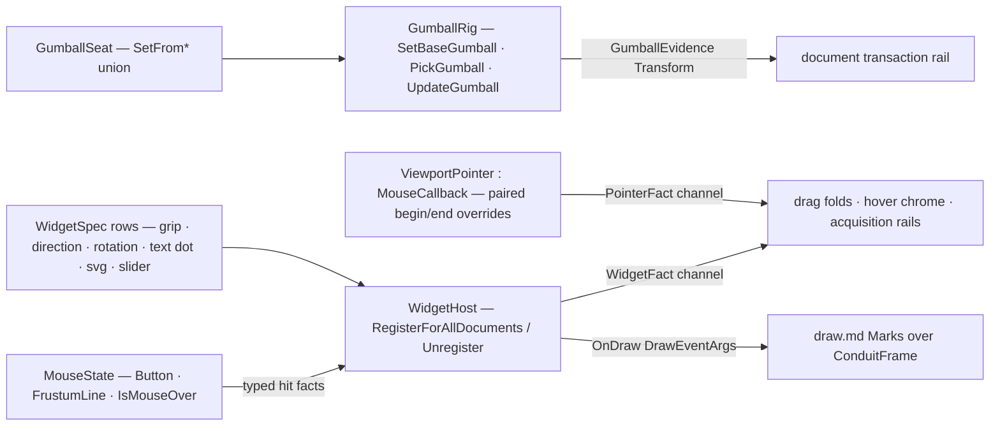

# [RASM_RHINO_INTERACTION]

The in-viewport interaction owner (`Rasm.Rhino.Display`). Three host tiers become three typed owners on one fact vocabulary: `ViewportPointer` adapts the document-wide `MouseCallback` hook — the six paired begin/end overrides plus enter/hover/leave — into a `PointerFact` stream delivered through a bounded channel so a per-move callback submits and returns; `GumballRig` owns the manipulator lifecycle — one `GumballSeat` `[Union]` collapsing the `GumballObject.SetFrom*` family, `GumballAppearanceSettings` as policy, the `GumballDisplayConduit` seat/pick/update drag fold over `PickGumball` and both `UpdateGumball` overloads; and `WidgetHost` registers the Rhino 9 `UserInterfaceObjectBase` families — grip, direction grip, rotation grip, text dot, SVG control, and slider — as typed `WidgetSpec` rows whose events fold into one `WidgetFact` stream and whose hit facts come from the picked `MouseState` (`Button`, `FrustumLine`, curve/line `IsMouseOver` tests). Every fact carries kernel-neutral values — screen points as `Point2d`, world rays as `Line`, identities as `Guid` — and no live host handle, `MouseCallbackEventArgs`, or `MouseState` crosses into a consumer.

## [01]-[INDEX]

- [02]-[POINTER_STREAM]: `PointerPhase` rows, `PointerFact`, and the `ViewportPointer` mouse-hook adapter with channel handoff.
- [03]-[GUMBALL]: `GumballSeat` seating union, `GumballRig` the conduit lifecycle with the pick/update drag fold and transform evidence.
- [04]-[WIDGETS]: `WidgetSpec` rows over the Rhino 9 in-viewport UI-object families, `WidgetFact`, and the `WidgetHost` registration lifecycle.

## [02]-[POINTER_STREAM]

- Owner: `PointerPhase` `[SmartEnum<int>]` — the hook phases with their host pairing as a column: `Move`/`EndMove`, `Down`/`EndDown`, `Up`/`EndUp`, `DoubleClick`, `Enter`, `Hover`, `Leave` — the `Paired` column marks the begin/end pairs Rhino 9 delivers, so a consumer distinguishing raw from post-processed mouse traffic reads the row, never a naming convention. `PointerFact` — the typed fact: phase, viewport id, screen point as `Point2d`, the `PointerButton` row re-closed from the host `MouseButton` with the shift/control modifier flags, the over-gumball flag, and the capture timestamp. `ViewportPointer` — the ONE `MouseCallback` subclass: overrides project args into facts and `TryWrite` them into a bounded channel; `Enabled` is the mount bit.
- Entry: `ViewportPointer.Mount(Option<int> capacity, Op?) : Fin<(ChannelReader<PointerFact>, IDisposable)>` — the reader is the consumer seam, the disposer disables the hook and completes the writer.
- Law: the callback submits and returns — a full channel drops the oldest (`BoundedChannelFullMode.DropOldest`) because pointer traffic is latest-wins for every consumer this package serves; blocking the host mouse thread is unrepresentable.
- Law: tooltip text rides the one `ViewportPointer.Tooltip` verb over `MouseCursor.SetToolTip(string)` — a fact-driven response beside the stream, never an ambient static call scattered at consumers.
- Boundary: a fact carries `IsOverGumball()` as data so a drag consumer yields to the manipulator without probing host state; the gumball itself is `[03]`'s owner.

```csharp
// --- [RUNTIME_PRELUDE] ----------------------------------------------------------------------
using System.Threading.Channels;
using Rasm.Domain;
using Rasm.Numerics;
using Rasm.Rhino.Document;
using Rasm.Rhino.Viewport;

namespace Rasm.Rhino.Display;

// --- [TYPES] --------------------------------------------------------------------------------
[SmartEnum<int>]
public sealed partial class PointerPhase {
    public static readonly PointerPhase Move = new(key: 0, paired: true);
    public static readonly PointerPhase EndMove = new(key: 1, paired: true);
    public static readonly PointerPhase Down = new(key: 2, paired: true);
    public static readonly PointerPhase EndDown = new(key: 3, paired: true);
    public static readonly PointerPhase Up = new(key: 4, paired: true);
    public static readonly PointerPhase EndUp = new(key: 5, paired: true);
    public static readonly PointerPhase DoubleClick = new(key: 6, paired: false);
    public static readonly PointerPhase Enter = new(key: 7, paired: false);
    public static readonly PointerPhase Hover = new(key: 8, paired: false);
    public static readonly PointerPhase Leave = new(key: 9, paired: false);

    public bool Paired { get; }
}

[SmartEnum<int>]
public sealed partial class PointerButton {
    public static readonly PointerButton None = new(key: 0);
    public static readonly PointerButton Left = new(key: 1);
    public static readonly PointerButton Right = new(key: 2);
    public static readonly PointerButton Middle = new(key: 3);

    internal static PointerButton Of(Rhino.UI.MouseButton button) =>
        button switch {
            Rhino.UI.MouseButton.Left => Left,
            Rhino.UI.MouseButton.Right => Right,
            Rhino.UI.MouseButton.Middle => Middle,
            _ => None,
        };
}

// --- [MODELS] -------------------------------------------------------------------------------
public readonly record struct PointerFact(
    PointerPhase Phase,
    Guid ViewportId,
    Point2d At,
    PointerButton Button,
    bool Shift,
    bool Control,
    bool OverGumball,
    long Timestamp);

// --- [SERVICES] -----------------------------------------------------------------------------
internal sealed class ViewportPointer : Rhino.UI.MouseCallback {
    private readonly ChannelWriter<PointerFact> sink;

    private ViewportPointer(ChannelWriter<PointerFact> sink) => this.sink = sink;

    internal static Fin<Unit> Tooltip(string text, Op? key = null) {
        Op op = key.OrDefault();
        return from valid in op.AcceptText(value: text)
               from _ in op.Catch(() => Fin.Succ(value: Op.Side(() => Rhino.UI.MouseCursor.SetToolTip(valid))))
               select unit;
    }

    internal static Fin<(ChannelReader<PointerFact> Facts, IDisposable Mount)> Mount(Option<int> capacity = default, Op? key = null) =>
        key.OrDefault().Catch(() => {
            Channel<PointerFact> channel = Channel.CreateBounded<PointerFact>(new BoundedChannelOptions(capacity.IfNone(256)) {
                FullMode = BoundedChannelFullMode.DropOldest,
                SingleReader = false,
                SingleWriter = true,
            });
            ViewportPointer hook = new(sink: channel.Writer) { Enabled = true };
            return Fin.Succ<(ChannelReader<PointerFact>, IDisposable)>((channel.Reader, Subscription.Of(detach: () => {
                hook.Enabled = false;
                _ = channel.Writer.TryComplete();
            })));
        });

    protected override void OnMouseMove(Rhino.UI.MouseCallbackEventArgs e) => Emit(phase: PointerPhase.Move, e: e);
    protected override void OnEndMouseMove(Rhino.UI.MouseCallbackEventArgs e) => Emit(phase: PointerPhase.EndMove, e: e);
    protected override void OnMouseDown(Rhino.UI.MouseCallbackEventArgs e) => Emit(phase: PointerPhase.Down, e: e);
    protected override void OnEndMouseDown(Rhino.UI.MouseCallbackEventArgs e) => Emit(phase: PointerPhase.EndDown, e: e);
    protected override void OnMouseUp(Rhino.UI.MouseCallbackEventArgs e) => Emit(phase: PointerPhase.Up, e: e);
    protected override void OnEndMouseUp(Rhino.UI.MouseCallbackEventArgs e) => Emit(phase: PointerPhase.EndUp, e: e);
    protected override void OnMouseDoubleClick(Rhino.UI.MouseCallbackEventArgs e) => Emit(phase: PointerPhase.DoubleClick, e: e);
    protected override void OnMouseEnter(Rhino.UI.MouseCallbackEventArgs e) => Emit(phase: PointerPhase.Enter, e: e);
    protected override void OnMouseHover(Rhino.UI.MouseCallbackEventArgs e) => Emit(phase: PointerPhase.Hover, e: e);
    protected override void OnMouseLeave(Rhino.UI.MouseCallbackEventArgs e) => Emit(phase: PointerPhase.Leave, e: e);

    private void Emit(PointerPhase phase, Rhino.UI.MouseCallbackEventArgs e) =>
        _ = sink.TryWrite(new PointerFact(
            Phase: phase,
            ViewportId: e.View.ActiveViewport.Id,
            At: new Point2d(e.ViewportPoint.X, e.ViewportPoint.Y),
            Button: PointerButton.Of(button: e.MouseButton),
            Shift: e.ShiftKeyDown,
            Control: e.CtrlKeyDown,
            OverGumball: e.IsOverGumball() != Rhino.UI.Gumball.GumballMode.None,
            Timestamp: Environment.TickCount64));
}
```

## [03]-[GUMBALL]

- Owner: `GumballSeat` `[Union]` — one seating vocabulary over the `GumballObject.SetFrom*` family: `BoundsCase(BoundingBox, Option<Plane>)` through `SetFromBoundingBox(boundingBox:)` or the framed `SetFromBoundingBox(frame:, frameBoundingBox:)`, plus `LineCase`, `PlaneCase`, `ArcCase`, `CircleCase`, `EllipseCase`, `CurveCase`, `ExtrusionCase`, `LightCase`, `HatchCase` — each one host call, so seating any geometry family is one union case. `GumballRig` — the lifecycle capsule: constructs the `GumballObject` and `GumballDisplayConduit`, applies the `GumballAppearanceSettings` policy through `SetBaseGumball`, mounts, and folds the drag: `Pick(PickContext, GetPoint)` through `PickGumball`, `Drag(Point3d, Line)` and `Drag(Plane)` through the two `UpdateGumball` overloads, and `Evidence()` projecting the drag's transform state as a value.
- Entry: `GumballRig.Mount(GumballSeat, Option<GumballAppearanceSettings>, Op?) : Fin<GumballRig>`; the rig is `IDisposable` and disposal disables the conduit.
- Law: the drag is a fold over host updates — pick seats the drag, each update recomputes the conduit's transform, and `Evidence` reads it as a `Transform` value with the seat echo; a consumer never mutates geometry from inside the drag — it applies the evidence transform through its own transaction rail after the drag commits.
- Law: appearance is policy data applied once at `SetBaseGumball`; per-drag appearance mutation re-seats the rig.
- Boundary: `PickContext` and `GetPoint` arrive from the interaction unit's acquisition rail as borrowed host values inside the pick call — the rig holds neither.

```csharp
// --- [TYPES] --------------------------------------------------------------------------------
[Union(ConversionFromValue = ConversionOperatorsGeneration.None)]
public abstract partial record GumballSeat {
    private GumballSeat() { }
    public sealed record BoundsCase(BoundingBox Bounds, Option<Plane> Frame) : GumballSeat;
    public sealed record LineCase(Line Value) : GumballSeat;
    public sealed record PlaneCase(Plane Value) : GumballSeat;
    public sealed record ArcCase(Arc Value) : GumballSeat;
    public sealed record CircleCase(Circle Value) : GumballSeat;
    public sealed record EllipseCase(Ellipse Value) : GumballSeat;
    public sealed record CurveCase(Curve Value) : GumballSeat;
    public sealed record ExtrusionCase(Extrusion Value) : GumballSeat;
    public sealed record LightCase(Light Value) : GumballSeat;
    public sealed record HatchCase(Hatch Value) : GumballSeat;

    internal Fin<Unit> Seat(Rhino.UI.Gumball.GumballObject gumball, Op key) =>
        Switch(
            state: (Gumball: gumball, Op: key),
            boundsCase: static (ctx, seat) => seat.Frame.Match(
                Some: frame => ctx.Op.Confirm(success: ctx.Gumball.SetFromBoundingBox(frame: frame, frameBoundingBox: seat.Bounds)),
                None: () => ctx.Op.Confirm(success: ctx.Gumball.SetFromBoundingBox(boundingBox: seat.Bounds))),
            lineCase: static (ctx, seat) => ctx.Op.Confirm(success: ctx.Gumball.SetFromLine(line: seat.Value)),
            planeCase: static (ctx, seat) => ctx.Op.Confirm(success: ctx.Gumball.SetFromPlane(plane: seat.Value)),
            arcCase: static (ctx, seat) => ctx.Op.Confirm(success: ctx.Gumball.SetFromArc(arc: seat.Value)),
            circleCase: static (ctx, seat) => ctx.Op.Confirm(success: ctx.Gumball.SetFromCircle(circle: seat.Value)),
            ellipseCase: static (ctx, seat) => ctx.Op.Confirm(success: ctx.Gumball.SetFromEllipse(ellipse: seat.Value)),
            curveCase: static (ctx, seat) => ctx.Op.Confirm(success: ctx.Gumball.SetFromCurve(curve: seat.Value)),
            extrusionCase: static (ctx, seat) => ctx.Op.Confirm(success: ctx.Gumball.SetFromExtrusion(extrusion: seat.Value)),
            lightCase: static (ctx, seat) => ctx.Op.Confirm(success: ctx.Gumball.SetFromLight(light: seat.Value)),
            hatchCase: static (ctx, seat) => ctx.Op.Confirm(success: ctx.Gumball.SetFromHatch(hatch: seat.Value)));
}

// --- [MODELS] -------------------------------------------------------------------------------
public readonly record struct GumballEvidence(Transform Total, GumballSeat Seat, bool Dragging);

// --- [SERVICES] -----------------------------------------------------------------------------
public sealed class GumballRig : IDisposable {
    private readonly Rhino.UI.Gumball.GumballObject gumball;
    private readonly Rhino.UI.Gumball.GumballDisplayConduit conduit;
    private readonly GumballSeat seat;
    private bool dragging;
    private int released;

    private GumballRig(Rhino.UI.Gumball.GumballObject gumball, Rhino.UI.Gumball.GumballDisplayConduit conduit, GumballSeat seat) {
        this.gumball = gumball;
        this.conduit = conduit;
        this.seat = seat;
    }

    public static Fin<GumballRig> Mount(GumballSeat seat, Option<Rhino.UI.Gumball.GumballAppearanceSettings> appearance = default, Op? key = null) {
        Op op = key.OrDefault();
        return from request in Optional(seat).ToFin(Fail: op.InvalidInput())
               from rig in op.Catch(() => {
                   Rhino.UI.Gumball.GumballObject ball = new();
                   Rhino.UI.Gumball.GumballDisplayConduit pipe = new();
                   return Fin.Succ(new GumballRig(gumball: ball, conduit: pipe, seat: request));
               })
               from _ in request.Seat(gumball: rig.gumball, key: op)
               from __ in op.Catch(() => {
                   rig.conduit.SetBaseGumball(gumball: rig.gumball, appearanceSettings: appearance.IfNone(() => new Rhino.UI.Gumball.GumballAppearanceSettings()));
                   rig.conduit.Enabled = true;
                   return Fin.Succ(value: unit);
               })
               select rig;
    }

    public Fin<bool> Pick(Input.Custom.PickContext pick, Input.Custom.GetPoint point, Op? key = null) {
        Op op = key.OrDefault();
        return from context in Optional(pick).ToFin(Fail: op.InvalidInput())
               from getter in Optional(point).ToFin(Fail: op.InvalidInput())
               from picked in op.Catch(() => Fin.Succ(conduit.PickGumball(pickContext: context, getPoint: getter)))
               from _ in Fin.Succ(ignore(dragging = picked))
               select picked;
    }

    public Fin<Unit> Drag(Point3d point, Line worldLine, Op? key = null) =>
        key.OrDefault().Confirm(success: conduit.UpdateGumball(point: point, worldLine: worldLine));

    public Fin<Unit> Drag(Plane frame, Op? key = null) =>
        key.OrDefault().Confirm(success: conduit.UpdateGumball(frame: frame));

    public GumballEvidence Evidence() => new(Total: conduit.TotalTransform, Seat: seat, Dragging: dragging);

    public Unit Commit() => ignore(dragging = false);

    public void Dispose() {
        if (Interlocked.Exchange(location1: ref released, value: 1) is not 0) { return; }
        conduit.Enabled = false;
        conduit.Dispose();
        gumball.Dispose();
    }
}
```

## [04]-[WIDGETS]

- Owner: `WidgetSpec` `[Union]` — the Rhino 9 in-viewport widget rows: `GripCase(Point3d, double, Option<Curve>, Seq<Point3d>, bool)` a constrained snap-point grip (the location constructor plus `GripRadius`/`Constrain`/`SetSnapPoints`/`ObjectSnapPermitted`), `DirectionCase(Point3d, Vector3d, double)` a direction-arrow grip (the location-direction constructor plus `ArrowRadius`), `RotationCase(Plane, double)` a rotation-arc grip (the plane-radius constructor) with the `OnRotationDrag(double, MouseState)` hook, `TextDotCase(string, int, Point3d)` (the location-text constructor plus `TextHeight`), `SvgCase(string, Point2d, Size2i)` an SVG-backed control (the screen location-size constructor plus `SetSvg`), and `SliderCase(Interval, double)` a ranged slider (`Range`/`Value`/`ValueChanged`). `WidgetFact` `[Union]` — the event stream: `PressedCase(Line)` carrying the pick ray, `MovedCase(Point3d)`, `RotatedCase(double)`, `SlidCase(double)`, `HitCase(Option<double>)` from the picked `MouseState` curve/line tests. `WidgetHost` — the registration lifecycle: mints the internal host adapter per row, registers through `UserInterfaceObjectBase.RegisterForAllDocuments()`, retires through `Unregister()`, and folds every widget's events into one channel; `BoundToActiveView` and `Visible` are mount policy bits.
- Law: a widget's draw override receives the pipeline `DrawEventArgs` and composes the draw page's mark algebra — an in-viewport widget is a pipeline participant, never a private renderer; its mouse overrides receive the picked `MouseState` and project `Button`, `FrustumLine`, and `IsMouseOver(Curve, out double)`/`IsMouseOver(Line)` into `WidgetFact` rows before any consumer sees them.
- Law: one host adapter class per host base is an internal fact; the public surface is the spec union plus the fact stream, so a new widget family is one spec case, one internal adapter, and one fact projection — consumers never subclass host bases.
- Growth: the Rhino 9 `UserInterfaceControl` SVG surface makes custom chrome one `SvgCase` payload; a richer custom widget is a new spec case over `UserInterfaceObjectBase`, never a parallel registration path.
- Boundary: widget geometry is world-space host drawing under the active view binding; HUD-space chrome belongs to the draw page's screen band inside a conduit, and the two do not mix on one spec.

```csharp
// --- [TYPES] --------------------------------------------------------------------------------
[Union(ConversionFromValue = ConversionOperatorsGeneration.None)]
public abstract partial record WidgetSpec {
    private WidgetSpec() { }
    public sealed record GripCase(Point3d At, double Radius, Option<Curve> Constraint, Seq<Point3d> SnapPoints, bool ObjectSnap) : WidgetSpec;
    public sealed record DirectionCase(Point3d At, Vector3d Direction, double ArrowRadius) : WidgetSpec;
    public sealed record RotationCase(Plane Arc, double Radius) : WidgetSpec;
    public sealed record TextDotCase(string Text, int Height, Point3d At) : WidgetSpec;
    public sealed record SvgCase(string Svg, Point2d At, Size2i Extent) : WidgetSpec;
    public sealed record SliderCase(Interval Range, double Value) : WidgetSpec;
}

[Union(ConversionFromValue = ConversionOperatorsGeneration.None)]
public abstract partial record WidgetFact {
    private WidgetFact() { }
    public sealed record PressedCase(Guid Widget, Line PickRay) : WidgetFact;
    public sealed record MovedCase(Guid Widget, Point3d To) : WidgetFact;
    public sealed record RotatedCase(Guid Widget, double Angle) : WidgetFact;
    public sealed record SlidCase(Guid Widget, double Value) : WidgetFact;
    public sealed record HitCase(Guid Widget, Option<double> CurveParameter) : WidgetFact;
}

// --- [SERVICES] -----------------------------------------------------------------------------
internal sealed class GripWidget : Rhino.UI.GripUserInterfaceObject {
    private readonly Guid identity;
    private readonly System.Threading.Channels.ChannelWriter<WidgetFact> sink;
    private readonly Func<ConduitFrame, Fin<Unit>> paint;
    private readonly Option<Curve> constraint;

    internal GripWidget(Guid identity, WidgetSpec.GripCase spec, System.Threading.Channels.ChannelWriter<WidgetFact> sink, Func<ConduitFrame, Fin<Unit>> paint)
        : base(spec.At) {
        this.identity = identity;
        this.sink = sink;
        this.paint = paint;
        constraint = spec.Constraint;
        GripRadius = (float)spec.Radius;
        ObjectSnapPermitted = spec.ObjectSnap;
        _ = spec.Constraint.Iter(curve => Constrain(curve: curve));
        _ = Op.SideWhen(!spec.SnapPoints.IsEmpty, () => SetSnapPoints(points: spec.SnapPoints.AsEnumerable()));
    }

    protected override void OnDraw(DrawEventArgs e) =>
        _ = paint(new ConduitFrame(Pipeline: e.Display, Viewport: e.Viewport, Context: FrameContext.Of(pipeline: e.Display), Phase: ConduitPhase.PostObjects));

    protected override void OnMouseDown(Rhino.UI.MouseState state) =>
        _ = sink.TryWrite(new WidgetFact.PressedCase(Widget: identity, PickRay: state.FrustumLine));

    protected override void OnMouseMove(Rhino.UI.MouseState state) {
        _ = sink.TryWrite(new WidgetFact.MovedCase(Widget: identity, To: GripLocation));
        _ = constraint.Iter(curve => ignore(sink.TryWrite(new WidgetFact.HitCase(
            Widget: identity,
            CurveParameter: state.IsMouseOver(curve, out double t) ? Some(t) : Option<double>.None))));
    }

    protected override void OnMouseUp(Rhino.UI.MouseState state) =>
        _ = sink.TryWrite(new WidgetFact.MovedCase(Widget: identity, To: GripLocation));
}

internal sealed class DirectionWidget : Rhino.UI.DirectionGripUserInterfaceObject {
    private readonly Guid identity;
    private readonly System.Threading.Channels.ChannelWriter<WidgetFact> sink;

    internal DirectionWidget(Guid identity, WidgetSpec.DirectionCase spec, System.Threading.Channels.ChannelWriter<WidgetFact> sink)
        : base(spec.At, spec.Direction) {
        this.identity = identity;
        this.sink = sink;
        ArrowRadius = (float)spec.ArrowRadius;
    }

    protected override void OnMouseDown(Rhino.UI.MouseState state) =>
        _ = sink.TryWrite(new WidgetFact.PressedCase(Widget: identity, PickRay: state.FrustumLine));
}

internal sealed class SliderWidget : Rhino.UI.UserInterfaceSlider {
    private readonly Guid identity;
    private readonly System.Threading.Channels.ChannelWriter<WidgetFact> sink;

    internal SliderWidget(Guid identity, WidgetSpec.SliderCase spec, System.Threading.Channels.ChannelWriter<WidgetFact> sink) {
        this.identity = identity;
        this.sink = sink;
        Range = spec.Range;
        Value = spec.Value;
    }

    protected override void OnValueChanged() =>
        _ = sink.TryWrite(new WidgetFact.SlidCase(Widget: identity, Value: Value));
}

internal sealed class RotationWidget : Rhino.UI.RotationGripUserInterfaceObject {
    private readonly Guid identity;
    private readonly System.Threading.Channels.ChannelWriter<WidgetFact> sink;

    internal RotationWidget(Guid identity, WidgetSpec.RotationCase spec, System.Threading.Channels.ChannelWriter<WidgetFact> sink)
        : base(spec.Arc, spec.Radius) {
        this.identity = identity;
        this.sink = sink;
    }

    protected override void OnRotationDrag(double angle, Rhino.UI.MouseState mouse) =>
        _ = sink.TryWrite(new WidgetFact.RotatedCase(Widget: identity, Angle: angle));
}

internal sealed class SvgWidget : Rhino.UI.UserInterfaceControl {
    private readonly Guid identity;
    private readonly System.Threading.Channels.ChannelWriter<WidgetFact> sink;

    internal SvgWidget(Guid identity, WidgetSpec.SvgCase spec, System.Threading.Channels.ChannelWriter<WidgetFact> sink)
        : base(new System.Drawing.Point((int)spec.At.X, (int)spec.At.Y), spec.Extent.Native) {
        this.identity = identity;
        this.sink = sink;
        SetSvg(svg: spec.Svg);
    }

    protected override void OnMouseDown(Rhino.UI.MouseState state) =>
        _ = sink.TryWrite(new WidgetFact.PressedCase(Widget: identity, PickRay: state.FrustumLine));
}

internal sealed class TextDotWidget : Rhino.UI.TextDotUserInterfaceObject {
    private readonly Guid identity;
    private readonly System.Threading.Channels.ChannelWriter<WidgetFact> sink;

    internal TextDotWidget(Guid identity, WidgetSpec.TextDotCase spec, System.Threading.Channels.ChannelWriter<WidgetFact> sink)
        : base(spec.At, spec.Text) {
        this.identity = identity;
        this.sink = sink;
        TextHeight = spec.Height;
    }

    protected override void OnMouseDown(Rhino.UI.MouseState state) =>
        _ = sink.TryWrite(new WidgetFact.PressedCase(Widget: identity, PickRay: state.FrustumLine));
}

public sealed class WidgetHost : IDisposable {
    private readonly System.Threading.Channels.Channel<WidgetFact> channel;
    private readonly Atom<HashMap<Guid, Rhino.UI.UserInterfaceObjectBase>> mounted = Atom(HashMap<Guid, Rhino.UI.UserInterfaceObjectBase>());
    private int released;

    private WidgetHost(System.Threading.Channels.Channel<WidgetFact> channel) => this.channel = channel;

    public System.Threading.Channels.ChannelReader<WidgetFact> Facts => channel.Reader;

    public static WidgetHost Of(Option<int> capacity = default) =>
        new(channel: System.Threading.Channels.Channel.CreateBounded<WidgetFact>(new System.Threading.Channels.BoundedChannelOptions(capacity.IfNone(256)) {
            FullMode = System.Threading.Channels.BoundedChannelFullMode.DropOldest,
        }));

    public Fin<Guid> Mount(WidgetSpec spec, Func<ConduitFrame, Fin<Unit>> paint, bool activeViewOnly = true, Op? key = null) {
        Op op = key.OrDefault();
        Guid identity = Guid.NewGuid();
        return from widget in spec.Switch<Fin<Rhino.UI.UserInterfaceObjectBase>>(
                   gripCase: row => op.Catch(() => Fin.Succ((Rhino.UI.UserInterfaceObjectBase)new GripWidget(identity: identity, spec: row, sink: channel.Writer, paint: paint))),
                   directionCase: row => op.Catch(() => Fin.Succ((Rhino.UI.UserInterfaceObjectBase)new DirectionWidget(identity: identity, spec: row, sink: channel.Writer))),
                   rotationCase: row => op.Catch(() => Fin.Succ((Rhino.UI.UserInterfaceObjectBase)new RotationWidget(identity: identity, spec: row, sink: channel.Writer))),
                   textDotCase: row => op.Catch(() => Fin.Succ((Rhino.UI.UserInterfaceObjectBase)new TextDotWidget(identity: identity, spec: row, sink: channel.Writer))),
                   svgCase: row => op.Catch(() => Fin.Succ((Rhino.UI.UserInterfaceObjectBase)new SvgWidget(identity: identity, spec: row, sink: channel.Writer))),
                   sliderCase: row => op.Catch(() => Fin.Succ((Rhino.UI.UserInterfaceObjectBase)new SliderWidget(identity: identity, spec: row, sink: channel.Writer))))
               from _ in op.Catch(() => {
                   widget.BoundToActiveView = activeViewOnly;
                   widget.Visible = true;
                   return op.Confirm(success: widget.RegisterForAllDocuments());
               })
               from __ in Fin.Succ(ignore(mounted.Swap(held => held.AddOrUpdate(identity, widget))))
               select identity;
    }

    public Fin<Unit> Retire(Guid widget, Op? key = null) {
        Op op = key.OrDefault();
        return mounted.Value.Find(widget).ToFin(Fail: op.InvalidInput())
            .Bind(held => op.Catch(() => {
                held.Unregister();
                _ = mounted.Swap(map => map.Remove(widget));
                return Fin.Succ(value: unit);
            }));
    }

    public void Dispose() {
        if (Interlocked.Exchange(location1: ref released, value: 1) is not 0) { return; }
        _ = toSeq(mounted.Value.Values).Iter(static widget => widget.Unregister());
        _ = channel.Writer.TryComplete();
    }
}
```


