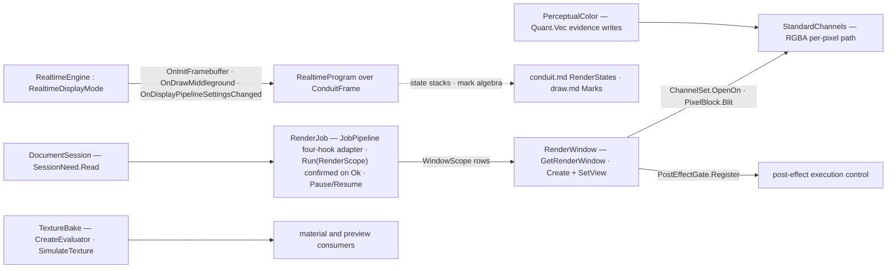

# [RASM_RHINO_RENDER]

Renderer lifecycle owner (`Rasm.Rhino.Display`). `Rhino.Render` splits into two owners that never merge: `RenderJob` is the batch session — one `RenderPipeline` bound to document, plug-in, size, and channel set at construction, run into a `RenderWindow`, gated by `PauseRendering`/`ResumeRendering`, disposed deterministically — and `RealtimeEngine` is the interactive participant — the `RealtimeDisplayMode` framebuffer, middleground, and settings-changed hooks drawing through the active `DisplayPipeline` with `MaxPasses`/`PostEffectsOn` progressive state and the OpenGL draw-path toggle. Channel access is explicit rows: `OpenChannel` selects a standard channel, `SetRGBAChannelColors` blits a typed `PixelBlock`, and post-effect execution is a registered `PostEffectGate` decision, never an ambient toggle. `TextureBake` closes the territory — `RenderTexture.CreateEvaluator` for live per-point evaluation and `SimulateTexture` for the baked fallback, gated by the generation mode. Realtime hooks receive the same `ConduitFrame`/`FrameContext` facts the conduit page mints, so a realtime engine draws through the display pipeline's state stacks — a private draw surface beside the pipeline is the deleted form, and no `RenderPipeline`, `RenderWindow`, or `RenderTexture` handle crosses into a consumer.

## [01]-[INDEX]

- [02]-[BATCH_SESSION]: `RenderScope`, `ChannelSet`, `PixelBlock`, and the `RenderJob` capsule over `RenderPipeline` with pause/resume control and the window seam.
- [03]-[REALTIME]: `RealtimeProgram` hooks, `RealtimePassPolicy`, and the `RealtimeEngine` adapter over `RealtimeDisplayMode`.
- [04]-[POST_AND_TEXTURE]: `PostEffectOp` configuration rows over `RenderSettings.PostEffects`, `PostEffectGate` execution control, and the `TextureBake` evaluation rows.

## [02]-[BATCH_SESSION]

- Owner: `RenderScope` `[Union]` — what a run renders: `FrameCase` through `Render()` and `RegionCase(ViewportTarget, Offset2i origin, Size2i extent, bool)` through `RenderPipeline.RenderWindow(RhinoView, Rectangle, bool)` — both host calls return `RenderReturnCode` and confirm on `Ok`, never a swallowed code. `WindowScope` `[Union]` — what a borrow opens: `SessionCase(bool, bool)` through `GetRenderWindow(withWireframeChannel, fromRenderViewSource)`, `ViewportInfoCase(ViewportInfo, bool, Offset2i origin, Size2i extent)` through `GetRenderWindow(ViewportInfo, bool, Rectangle)`, and `DetachedCase(Size2i, ViewInfo)` through `RenderWindow.Create(Size)` plus the view bind — each case lowers through the union's own `Mint` inside the capsule's one borrow bracket, and run and borrow are distinct host families, so one union per family, never a merged scope. `ChannelSet` — the declared channel rows (`Seq<RenderWindow.StandardChannels>`, `Rgba` the named default): the pipeline constructor consumes the folded `Flags` mask, and `OpenOn` proves each row opens through one `OpenChannel` per row — a combined mask never reaches the single-channel host call. `PixelBlock` — a typed blit: an `Offset2i` origin, a `Size2i` extent, and the `Display.Color4f` block written through `SetRGBAChannelColors(Rectangle, Color4f[])`, with the draw page's `Quant.Vec` quantizing kernel colors for evidence writes. `RenderProgram` — the worker contract: the host pipeline is abstract with protected construction and four abstract hooks, so `Begin`/`BeginRegion` start the plugin's worker for a frame or view region, `Continue` answers the modal-loop poll, and `End` settles the run. `RenderJob` — the session capsule: constructed over the ONE internal `JobPipeline : RenderPipeline` adapter routing the four hooks into the program, `Run(RenderScope)` executing the frame or region render with the confirmed `RenderReturnCode`, `Pause()`/`Resume()` bracketing in-flight work, and disposal releasing the pipeline exactly once.
- Entry: `RenderJob.Open(DocumentSession, PlugIns.PlugIn, Size2i, ChannelSet, RenderProgram, Op?) : Fin<RenderJob>`; the session's `SessionMode` lowers to the host `RunMode` at construction, and the capsule carries the session's `IDetachedDocumentResult` marker so `Open`'s demand returns it across the capability rail.
- Law: every `GetRenderWindow*` call mints a fresh caller-owned wrapper the pipeline never retains — `WithWindow` scopes each borrow under `using`, and pipeline disposal tears down the native render session, never a managed window.
- Law: batch and realtime never merge — a `RenderJob` produces a finished window, a `RealtimeEngine` participates per frame; one owner claiming both is the collapsed form the host API's own split forecloses.
- Law: the opened channel is the only per-pixel path — a raw buffer pointer beside `OpenChannel`/`SetRGBAChannelColors` is unrepresentable because the block is the sole write carrier.
- Boundary: `ViewInfo` arrives from the named-view and camera rails; the render page consumes it at `SetView` and never re-derives view state.

```csharp
// --- [RUNTIME_PRELUDE] ----------------------------------------------------------------------
using Rasm.Domain;
using Rasm.Numerics;
using Rasm.Rhino.Document;
using Rasm.Rhino.Viewport;
using Rhino.Render;

namespace Rasm.Rhino.Display;

// --- [TYPES] --------------------------------------------------------------------------------
[Union(ConversionFromValue = ConversionOperatorsGeneration.None)]
public abstract partial record RenderScope {
    private RenderScope() { }
    public sealed record FrameCase : RenderScope;
    public sealed record RegionCase(ViewportTarget Target, Offset2i Origin, Size2i Extent, bool CopyToWindow) : RenderScope;
}

[Union(ConversionFromValue = ConversionOperatorsGeneration.None)]
public abstract partial record WindowScope {
    private WindowScope() { }
    public sealed record SessionCase(bool WithWireframe, bool FromRenderViewSource) : WindowScope;
    public sealed record ViewportInfoCase(ViewportInfo Info, bool FromRenderViewSource, Offset2i Origin, Size2i Extent) : WindowScope;
    public sealed record DetachedCase(Size2i Extent, ViewInfo View) : WindowScope;

    internal RenderWindow Mint(RenderPipeline pipeline) =>
        Switch(
            state: pipeline,
            sessionCase: static (host, request) => host.GetRenderWindow(request.WithWireframe, request.FromRenderViewSource),
            viewportInfoCase: static (host, request) => host.GetRenderWindow(request.Info, request.FromRenderViewSource, request.Origin.Window(extent: request.Extent)),
            detachedCase: static (_, request) => {
                RenderWindow window = RenderWindow.Create(szSize: request.Extent.Native);
                window.SetView(request.View);
                return window;
            });
}

// --- [MODELS] -------------------------------------------------------------------------------
public sealed record ChannelSet(Seq<RenderWindow.StandardChannels> Rows) {
    public static ChannelSet Rgba { get; } = new(Rows: [RenderWindow.StandardChannels.RGBA]);

    internal RenderWindow.StandardChannels Flags =>
        Rows.Fold(default(RenderWindow.StandardChannels), static (mask, row) => mask | row);

    public Fin<Unit> OpenOn(RenderWindow window, Op? key = null) {
        Op op = key.OrDefault();
        return Rows.TraverseM(row => op.Catch(() => {
            using RenderWindow.Channel channel = window.OpenChannel(row);
            return Optional(channel).ToFin(Fail: op.InvalidResult(detail: row.ToString())).Map(static _ => unit);
        })).As().Map(static _ => unit);
    }
}

public sealed record PixelBlock(Offset2i Origin, Size2i Extent, Display.Color4f[] Pixels) {
    public static Fin<PixelBlock> Of(Offset2i origin, Size2i extent, Display.Color4f[] pixels, Op? key = null) =>
        guard(pixels.Length == extent.Width * extent.Height, key.OrDefault().InvalidInput()).ToFin()
            .Map(_ => new PixelBlock(Origin: origin, Extent: extent, Pixels: pixels));

    internal Fin<Unit> Blit(RenderWindow window, Op key) {
        PixelBlock self = this;
        return key.Catch(() => {
            window.SetRGBAChannelColors(rectangle: self.Origin.Window(extent: self.Extent), colors: self.Pixels);
            return Fin.Succ(value: unit);
        });
    }
}

public sealed record RenderProgram(
    Func<Fin<Unit>> Begin,
    Func<System.Drawing.Rectangle, Fin<Unit>> BeginRegion,
    Func<Fin<Unit>> End,
    Func<bool> Continue);

// --- [SERVICES] -----------------------------------------------------------------------------
internal sealed class JobPipeline : RenderPipeline {
    private readonly RenderProgram program;

    internal JobPipeline(RhinoDoc document, Commands.RunMode mode, PlugIns.PlugIn plugin, Size2i extent, ChannelSet channels, RenderProgram program)
        : base(document, mode, plugin, extent.Native, plugin.Name, channels.Flags, reuseRenderWindow: false, clearLastRendering: true) =>
        this.program = program;

    protected override bool OnRenderBegin() => program.Begin().IsSucc;

    protected override bool OnRenderWindowBegin(RhinoView view, System.Drawing.Rectangle rect) => program.BeginRegion(rect).IsSucc;

    protected override void OnRenderEnd(RenderEndEventArgs e) => ignore(program.End());

    protected override bool ContinueModal() => program.Continue();
}

public sealed class RenderJob : IDisposable, IDetachedDocumentResult {
    private readonly RenderPipeline pipeline;
    private readonly DocumentSession session;
    private int released;

    private RenderJob(RenderPipeline pipeline, DocumentSession session) {
        this.pipeline = pipeline;
        this.session = session;
    }

    public static Fin<RenderJob> Open(DocumentSession session, PlugIns.PlugIn owner, Size2i extent, ChannelSet channels, RenderProgram program, Op? key = null) {
        Op op = key.OrDefault();
        return from plugin in Optional(owner).ToFin(Fail: op.InvalidInput())
               from plan in Optional(program).ToFin(Fail: op.InvalidInput())
               from job in session.Demand(
                   use: document => op.Catch(() => Fin.Succ(new RenderJob(
                       pipeline: new JobPipeline(
                           document: document,
                           mode: session.Mode.Switch(
                               interactive: static () => Commands.RunMode.Interactive,
                               scripted: static () => Commands.RunMode.Scripted,
                               headless: static () => Commands.RunMode.Scripted),
                           plugin: plugin,
                           extent: extent,
                           channels: channels,
                           program: plan),
                       session: session))),
                   key: op,
                   needs: [SessionNeed.Read])
               select job;
    }

    public Fin<Unit> Run(RenderScope scope, Op? key = null) {
        Op op = key.OrDefault();
        RenderJob self = this;
        return scope.Switch(
            state: (Job: self, Op: op),
            frameCase: static (ctx, _) => ctx.Op.Catch(() =>
                ctx.Op.Confirm(success: ctx.Job.pipeline.Render() == RenderPipeline.RenderReturnCode.Ok)),
            regionCase: static (ctx, request) =>
                from lease in ViewportLease.Of(session: ctx.Job.session, target: request.Target, key: ctx.Op)
                from _ in lease.Use(borrow: row => ctx.Op.Catch(() => ctx.Op.Confirm(
                    success: ctx.Job.pipeline.RenderWindow(
                        view: row.View,
                        rect: request.Origin.Window(extent: request.Extent),
                        inWindow: request.CopyToWindow) == RenderPipeline.RenderReturnCode.Ok)), key: ctx.Op)
                select unit);
    }

    public Fin<Unit> Pause(Op? key = null) =>
        key.OrDefault().Catch(pipeline.PauseRendering);

    public Fin<Unit> Resume(Op? key = null) =>
        key.OrDefault().Catch(pipeline.ResumeRendering);

    public Fin<TOut> WithWindow<TOut>(WindowScope scope, Func<RenderWindow, Fin<TOut>> borrow, Op? key = null) {
        Op op = key.OrDefault();
        RenderJob self = this;
        return op.Catch(() => {
            using RenderWindow window = scope.Mint(pipeline: self.pipeline);
            return Optional(window).ToFin(Fail: op.InvalidResult()).Bind(borrow);
        });
    }

    public void Dispose() =>
        _ = Interlocked.Exchange(location1: ref released, value: 1) is 0 ? fun(pipeline.Dispose)() : unit;
}

```

## [03]-[REALTIME]

- Owner: `RealtimeProgram` — the typed engine contract covering the host's whole abstract surface plus the three events: the renderer lifecycle (`Start(RealtimeStart)` receiving size, document, view, viewport, capture flag, and the target window as one borrowed fact; `Shutdown()`; the `Started`/`Completed` state reads; `RenderSize()` the engine's current extent; `LastPass()` the progressive pass ordinal `LastRenderedPass` and the HUD read; `Resized(Size2i)` the viewport-resize reaction lowered from `OnRenderSizeChanged`), and the frame hooks (`InitFramebuffer(ConduitFrame)` fired when the host requests a fresh framebuffer, `DrawMiddleground(ConduitFrame)` the per-pass middleground draw, `SettingsChanged(DisplayPipelineAttributes)` the display-attribute reaction) — each hook receiving the same `ConduitFrame` fact the conduit page mints from the event's pipeline, so a realtime engine composes the mark algebra and the state-stack brackets identically to a conduit handler. `RealtimePassPolicy` — the progressive state: pass ceiling (`MaxPasses`), the post-effect toggle (`PostEffectsOn`), and the OpenGL draw path (`SetUseDrawOpenGl`). `RealtimeEngine` — the `RealtimeDisplayMode` adapter: implements the six abstract members (`GetRenderSize`, `StartRenderer`, `ShutdownRenderer`, `IsRendererStarted`, `IsFrameBufferAvailable`, `IsCompleted`) by delegating to the program, subscribes the three host events (`OnInitFramebuffer`, `OnDrawMiddleground`, `OnDisplayPipelineSettingsChanged`), routes `OnRenderSizeChanged` through `Resized`, exposes `Redraw()` over the host `SignalRedraw` so a progressive pass lands as pixels, applies the pass policy, and projects `RealtimeChrome` through the `Hud*` virtual family — product name, visibility rows, pass and status text, start time — while the optional `Hud` handler folds the host's per-button HUD events (`HudPlayButtonPressed`/`HudPauseButtonPressed`/`HudLockButtonPressed`/`HudUnlockButtonPressed`, `MaxPassesChanged`) into one `HudSignal` row stream; the host `Paused`/`Locked` brackets ride the base surface as found.
- Law: the realtime path draws through the display pipeline — the event args carry the `Pipeline` and `Attributes`, and every hook body composes conduit facts; a realtime engine minting its own GL surface beside the pipeline is the deleted form.
- Law: pass state is read per frame — a progressive engine reads `MaxPasses` to bound refinement and flips `PostEffectsOn` only through the policy, so pass behavior is recoverable from the policy declaration.
- Law: `RealtimeStart` is a borrowed host fact valid only inside the `Start` call — the engine begins its worker against the window and returns; retaining the document, view, or window past the call re-creates the census handle leak.
- Boundary: realtime mode registration into the host's display-mode roster is plug-in registration surface owned by the hosting plug-in's own lifecycle; this page owns the engine behavior, and the registered subclass composes `RealtimeEngine` internally.

```csharp
// --- [TYPES] --------------------------------------------------------------------------------
[Union(ConversionFromValue = ConversionOperatorsGeneration.None)]
public abstract partial record HudSignal {
    private HudSignal() { }
    public sealed record PlayCase : HudSignal;
    public sealed record PauseCase : HudSignal;
    public sealed record LockCase : HudSignal;
    public sealed record UnlockCase : HudSignal;
    public sealed record MaxPassesCase(int Passes) : HudSignal;
}

// --- [MODELS] -------------------------------------------------------------------------------
public sealed record RealtimePassPolicy(int MaxPasses, bool PostEffects, bool UseOpenGl) {
    public static RealtimePassPolicy Progressive { get; } = new(MaxPasses: 64, PostEffects: true, UseOpenGl: true);
}

public sealed record RealtimeChrome(
    string ProductName,
    bool Show,
    bool Controls,
    bool Passes,
    bool MaxPasses,
    bool EditMaxPasses,
    Option<Func<string>> Status,
    Option<DateTime> Started) {
    public static RealtimeChrome Hidden { get; } = new(
        ProductName: "", Show: false, Controls: false, Passes: false, MaxPasses: false, EditMaxPasses: false, Status: None, Started: None);
}

public readonly record struct RealtimeStart(
    Size2i Extent,
    RhinoDoc Document,
    ViewInfo View,
    ViewportInfo Viewport,
    bool ForCapture,
    RenderWindow Window);

public sealed record RealtimeProgram(
    Func<RealtimeStart, Fin<Unit>> Start,
    Func<Fin<Unit>> Shutdown,
    Func<bool> Started,
    Func<bool> Completed,
    Func<Size2i> RenderSize,
    Func<int> LastPass,
    Func<Size2i, Fin<Unit>> Resized,
    Func<ConduitFrame, Fin<Unit>> InitFramebuffer,
    Func<ConduitFrame, Fin<Unit>> DrawMiddleground,
    Func<DisplayPipelineAttributes, Fin<Unit>> SettingsChanged,
    Option<Func<HudSignal, Fin<Unit>>> Hud = default);

// --- [SERVICES] -----------------------------------------------------------------------------
public sealed class RealtimeEngine : RealtimeDisplayMode {
    private readonly RealtimeProgram program;
    private readonly RealtimePassPolicy policy;
    private readonly RealtimeChrome chrome;
    private readonly Atom<bool> framebufferReady = Atom(false);
    private readonly Op key;

    public RealtimeEngine(RealtimeProgram program, RealtimePassPolicy policy, Option<RealtimeChrome> chrome = default, Op? key = null) {
        this.program = program;
        this.policy = policy;
        this.chrome = chrome.IfNone(RealtimeChrome.Hidden);
        this.key = key.OrDefault();
        MaxPasses = policy.MaxPasses;
        PostEffectsOn = policy.PostEffects;
        SetUseDrawOpenGl(policy.UseOpenGl);
        OnInitFramebuffer += (_, e) => {
            _ = framebufferReady.Swap(_ => true);
            _ = program.InitFramebuffer(Frame(pipeline: e.Pipeline));
        };
        OnDrawMiddleground += (_, e) => _ = program.DrawMiddleground(Frame(pipeline: e.Pipeline));
        OnDisplayPipelineSettingsChanged += (_, e) => _ = program.SettingsChanged(e.Attributes);
        _ = program.Hud.Iter(signal => {
            HudPlayButtonPressed += (_, _) => ignore(signal(new HudSignal.PlayCase()));
            HudPauseButtonPressed += (_, _) => ignore(signal(new HudSignal.PauseCase()));
            HudLockButtonPressed += (_, _) => ignore(signal(new HudSignal.LockCase()));
            HudUnlockButtonPressed += (_, _) => ignore(signal(new HudSignal.UnlockCase()));
            MaxPassesChanged += (_, e) => ignore(signal(new HudSignal.MaxPassesCase(Passes: e.MaxPasses)));
        });
    }

    public override void GetRenderSize(out int width, out int height) {
        Size2i extent = program.RenderSize();
        (width, height) = (extent.Width, extent.Height);
    }

    public override int LastRenderedPass() => program.LastPass();

    public override string HudProductName() => chrome.ProductName;

    public override bool HudShow() => chrome.Show;

    public override bool HudShowControls() => chrome.Controls;

    public override bool HudShowPasses() => chrome.Passes;

    public override bool HudShowMaxPasses() => chrome.MaxPasses;

    public override bool HudAllowEditMaxPasses() => chrome.EditMaxPasses;

    public override bool HudShowCustomStatusText() => chrome.Status.IsSome;

    public override string HudCustomStatusText() => chrome.Status.Match(Some: static status => status(), None: static () => "");

    public override int HudLastRenderedPass() => program.LastPass();

    public override DateTime HudStartTime() => chrome.Started.IfNone(() => base.HudStartTime());

    public override bool StartRenderer(int w, int h, RhinoDoc doc, ViewInfo view, ViewportInfo viewportInfo, bool forCapture, RenderWindow renderWindow) =>
        Size2i.Of(width: w, height: h, key: key).Match(
            Succ: extent => program.Start(new RealtimeStart(Extent: extent, Document: doc, View: view, Viewport: viewportInfo, ForCapture: forCapture, Window: renderWindow)).IsSucc,
            Fail: static _ => false);

    public override void ShutdownRenderer() {
        _ = framebufferReady.Swap(_ => false);
        _ = program.Shutdown();
    }

    public override bool IsRendererStarted() => program.Started();

    public override bool IsCompleted() => program.Completed();

    public override bool IsFrameBufferAvailable(ViewInfo view) => framebufferReady.Value;

    public override bool OnRenderSizeChanged(int width, int height) =>
        Size2i.Of(width: width, height: height, key: key).Bind(extent => program.Resized(extent)).IsSucc;

    public Unit Redraw() => Op.Side(SignalRedraw);

    private static ConduitFrame Frame(DisplayPipeline pipeline) =>
        new(Pipeline: pipeline, Viewport: pipeline.Viewport, Context: FrameContext.Of(pipeline: pipeline), Phase: ConduitPhase.PostObjects);
}
```

## [04]-[POST_AND_TEXTURE]

- Owner: `PostEffectOp` `[Union]` — settings-side post-effect configuration over `RenderSettings.PostEffects : PostEffectCollection`: `CensusCase` reads, `ToggleCase` writes the `On`/`Shown` pair, `ReorderCase` rides `MovePostEffectBefore(Guid, Guid) : bool`, `SelectCase` writes `SetSelectedPostEffect(PostEffectType, Guid)` per stage, and `TuneCase` writes a named parameter through `SetParameter(string, object) : bool` — with `EffectStage` re-closing the host `PostEffectType` ordinals (`Early`/`ToneMapping`/`Late`) and `Effects.Configure` running one op batch over the borrowed doc-bound collection inside one demand window, answering the detached `EffectRoster` (per-effect `PostEffectState` rows plus the per-stage `GetSelectedPostEffect` selection map). `PostEffectGate` — post-effect execution control: a decision delegate wrapped in the host `PostEffects.PostEffectExecutionControl` and registered on a window through `RegisterPostEffectExecutionControl`, so whether a post-effect runs for a given render is a declared policy value, never an engine-side conditional. `TextureBake` `[Union]` — texture evaluation: `LiveCase(RenderTexture, RenderTexture.TextureEvaluatorFlags)` yielding the per-point evaluator through `CreateEvaluator`, and `BakedCase(RenderTexture, RenderTexture.TextureGeneration, int, DocObjects.RhinoObject)` filling a `SimulatedTexture` through `SimulateTexture` where live evaluation is refused — the generation mode gates the bake.
- Law: configuration and execution never merge — `PostEffectOp` writes the settings-side rows the pipeline reads at render time, `PostEffectGate` decides per-render execution on a window; the render-settings page's edit rail points here and carries no eighth sub-owner record.
- Law: a mutating op batch demands `SessionNeed.Mutate`, a census-only batch `SessionNeed.Read` — the batch's own case shapes derive the need set, never a caller flag; `PostEffectCollection` and each `PostEffectData` are disposable host natives scoped to the demand window, and only `EffectRoster` crosses out.
- Law: live-versus-baked is the union's discriminant, selected by the texture's own capability — a consumer asks for live first and falls to the baked case on refusal, and the fallback is a case transition, never a silent quality change.
- Boundary: evaluators and simulated textures are disposable host natives scoped to the borrow; the sampled result crosses as values.

```csharp
// --- [TYPES] --------------------------------------------------------------------------------
[SmartEnum<int>]
public sealed partial class EffectStage {
    public static readonly EffectStage Early = new(key: 0, native: PostEffects.PostEffectType.Early);
    public static readonly EffectStage ToneMapping = new(key: 1, native: PostEffects.PostEffectType.ToneMapping);
    public static readonly EffectStage Late = new(key: 2, native: PostEffects.PostEffectType.Late);

    internal PostEffects.PostEffectType Native { get; }

    internal static Fin<EffectStage> Stage(PostEffects.PostEffectType native, Op key) =>
        toSeq(Items).Find(row => row.Native == native).ToFin(Fail: key.InvalidResult(detail: native.ToString()));
}

[Union(ConversionFromValue = ConversionOperatorsGeneration.None)]
public abstract partial record PostEffectOp {
    private PostEffectOp() { }
    public sealed record CensusCase : PostEffectOp;
    public sealed record ToggleCase(Guid Effect, bool On, bool Shown) : PostEffectOp;
    public sealed record ReorderCase(Guid Move, Guid Before) : PostEffectOp;
    public sealed record SelectCase(EffectStage Stage, Guid Effect) : PostEffectOp;
    public sealed record TuneCase(Guid Effect, string Parameter, object Value) : PostEffectOp;

    internal Fin<Unit> Apply(PostEffects.PostEffectCollection collection, Op key) => Switch(
        state: (Collection: collection, Op: key),
        censusCase: static (_, _) => Fin.Succ(value: unit),
        toggleCase: static (ctx, op) => Data(collection: ctx.Collection, effect: op.Effect, key: ctx.Op).Bind(data => ctx.Op.Catch(() => {
            using PostEffects.PostEffectData owned = data;
            owned.On = op.On;
            owned.Shown = op.Shown;
        })),
        reorderCase: static (ctx, op) => ctx.Op.Catch(() =>
            ctx.Op.Confirm(success: ctx.Collection.MovePostEffectBefore(id_move: op.Move, id_before: op.Before))),
        selectCase: static (ctx, op) => ctx.Op.Catch(() =>
            ctx.Collection.SetSelectedPostEffect(type: op.Stage.Native, id: op.Effect)),
        tuneCase: static (ctx, op) => Data(collection: ctx.Collection, effect: op.Effect, key: ctx.Op).Bind(data => ctx.Op.Catch(() => {
            using PostEffects.PostEffectData owned = data;
            return ctx.Op.Confirm(success: owned.SetParameter(param_name: op.Parameter, param_value: op.Value));
        })));

    private static Fin<PostEffects.PostEffectData> Data(PostEffects.PostEffectCollection collection, Guid effect, Op key) =>
        key.Catch(() => Optional(collection.PostEffectDataFromId(id: effect)).ToFin(Fail: key.InvalidInput()));
}

// --- [MODELS] -------------------------------------------------------------------------------
public readonly record struct PostEffectState(Guid Id, EffectStage Stage, string Name, bool On, bool Shown);

public sealed record EffectRoster(Seq<PostEffectState> Rows, HashMap<EffectStage, Guid> Selected) : IDetachedDocumentResult;

// --- [OPERATIONS] ---------------------------------------------------------------------------
public static class Effects {
    public static Fin<EffectRoster> Configure(DocumentSession session, Seq<PostEffectOp> ops, Op? key = null) {
        Op op = key.OrDefault();
        Seq<SessionNeed> needs = ops.Exists(static row => row is not PostEffectOp.CensusCase)
            ? [SessionNeed.Read, SessionNeed.Mutate]
            : [SessionNeed.Read];
        return session.Demand(
            use: document => op.Catch(() => {
                using PostEffects.PostEffectCollection collection = document.RenderSettings.PostEffects;
                return ops.TraverseM(row => row.Apply(collection: collection, key: op)).As()
                    .Bind(_ => Roster(collection: collection, op: op));
            }),
            key: op,
            needs: needs.ToArray());
    }

    private static Fin<EffectRoster> Roster(PostEffects.PostEffectCollection collection, Op op) =>
        from rows in toSeq(collection).TraverseM(data => Detached(data: data, op: op)).As()
        from selected in op.Catch(() => Fin.Succ(value: toSeq(EffectStage.Items)
            .Choose(stage => collection.GetSelectedPostEffect(type: stage.Native, id: out Guid chosen) ? Some((stage, chosen)) : None)
            .ToHashMap()))
        select new EffectRoster(Rows: rows.Strict(), Selected: selected);

    private static Fin<PostEffectState> Detached(PostEffects.PostEffectData data, Op op) => op.Catch(() => {
        using PostEffects.PostEffectData owned = data;
        return EffectStage.Stage(native: owned.Type, key: op)
            .Map(stage => new PostEffectState(Id: owned.Id, Stage: stage, Name: owned.LocalName, On: owned.On, Shown: owned.Shown));
    });
}

[Union(ConversionFromValue = ConversionOperatorsGeneration.None)]
public abstract partial record TextureBake {
    private TextureBake() { }
    public sealed record LiveCase(RenderTexture Texture, RenderTexture.TextureEvaluatorFlags Flags) : TextureBake;
    public sealed record BakedCase(RenderTexture Texture, RenderTexture.TextureGeneration Generation, int Size, DocObjects.RhinoObject Subject) : TextureBake;

    public Fin<TOut> Evaluate<TOut>(Func<TextureEvaluator, Fin<TOut>> live, Func<SimulatedTexture, Fin<TOut>> baked, Op? key = null) {
        Op op = key.OrDefault();
        return Switch(
            state: (Live: live, Baked: baked, Op: op),
            liveCase: static (ctx, bake) => ctx.Op.Catch(() => {
                using TextureEvaluator evaluator = bake.Texture.CreateEvaluator(evaluatorFlags: bake.Flags);
                return Optional(evaluator).ToFin(Fail: ctx.Op.InvalidResult()).Bind(ctx.Live);
            }),
            bakedCase: static (ctx, bake) => ctx.Op.Catch(() => {
                SimulatedTexture simulated = null!;
                bake.Texture.SimulateTexture(simulation: ref simulated, tg: bake.Generation, size: bake.Size, obj: bake.Subject);
                using SimulatedTexture? owned = simulated;
                return Optional(owned).ToFin(Fail: ctx.Op.InvalidResult()).Bind(ctx.Baked);
            }));
    }
}

// --- [SERVICES] -----------------------------------------------------------------------------
public sealed class PostEffectGate : PostEffects.PostEffectExecutionControl {
    private readonly Func<Guid, bool> decide;

    private PostEffectGate(Func<Guid, bool> decide) => this.decide = decide;

    public static Fin<Unit> Register(RenderWindow window, Func<Guid, bool> decide, Op? key = null) =>
        key.OrDefault().Catch(() => {
            window.RegisterPostEffectExecutionControl(ec: new PostEffectGate(decide: decide));
            return Fin.Succ(value: unit);
        });

    public override bool ReadyToExecutePostEffect(Guid postEffectId) => decide(postEffectId);
}
```


