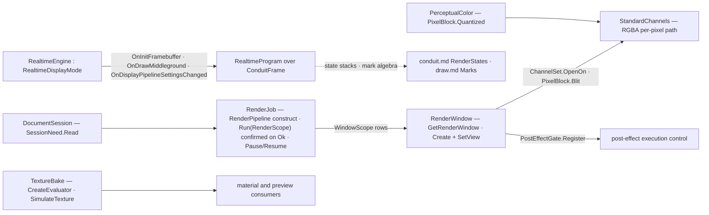

# [RASM_RHINO_RENDER]

The renderer lifecycle owner (`Rasm.Rhino.Display`). `Rhino.Render` splits into two owners that never merge: `RenderJob` is the batch session — one `RenderPipeline` bound to document, plug-in, size, and channel set at construction, run into a `RenderWindow`, gated by `PauseRendering`/`ResumeRendering`, disposed deterministically — and `RealtimeEngine` is the interactive participant — the `RealtimeDisplayMode` framebuffer, middleground, and settings-changed hooks drawing through the active `DisplayPipeline` with `MaxPasses`/`PostEffectsOn` progressive state and the OpenGL draw-path toggle. Channel access is explicit rows: `OpenChannel` selects a standard channel, `SetRGBAChannelColors` blits a typed `PixelBlock`, and post-effect execution is a registered `PostEffectGate` decision, never an ambient toggle. `TextureBake` closes the territory — `RenderTexture.CreateEvaluator` for live per-point evaluation and `SimulateTexture` for the baked fallback, gated by the generation mode. The realtime hooks receive the same `ConduitFrame`/`FrameContext` facts the conduit page mints, so a realtime engine draws through the display pipeline's state stacks — a private draw surface beside the pipeline is the deleted form, and no `RenderPipeline`, `RenderWindow`, or `RenderTexture` handle crosses into a consumer.

## [01]-[INDEX]

- [02]-[BATCH_SESSION]: `RenderScope`, `ChannelSet`, `PixelBlock`, and the `RenderJob` capsule over `RenderPipeline` with pause/resume control and the window seam.
- [03]-[REALTIME]: `RealtimeProgram` hooks, `RealtimePassPolicy`, and the `RealtimeEngine` adapter over `RealtimeDisplayMode`.
- [04]-[POST_AND_TEXTURE]: `PostEffectGate` execution control and the `TextureBake` evaluation rows.

## [02]-[BATCH_SESSION]

- Owner: `RenderScope` `[Union]` — what a run renders: `FrameCase` through `Render()` and `RegionCase(ViewportTarget, Size2i origin/extent, bool)` through `RenderPipeline.RenderWindow(RhinoView, Rectangle, bool)` — both host calls return `RenderReturnCode` and confirm on `Ok`, never a swallowed code. `WindowScope` `[Union]` — what a borrow opens: `SessionCase(bool, bool)` through `GetRenderWindow(withWireframeChannel, fromRenderViewSource)`, `ViewportInfoCase(ViewportInfo, bool, Size2i origin/extent)` through `GetRenderWindow(ViewportInfo, bool, Rectangle)`, and `DetachedCase(Size2i, ViewInfo)` through `RenderWindow.Create(Size)` plus the view bind — run and borrow are distinct host families, so one union per family, never a merged scope. `ChannelSet` — the declared channel rows (`Seq<RenderWindow.StandardChannels>`, `Rgba` the named default): the pipeline constructor consumes the folded `Flags` mask, and `OpenOn` proves each row opens through one `OpenChannel` per row — a combined mask never reaches the single-channel host call. `PixelBlock` — a typed blit: origin, extent, and the `Display.Color4f` block written through `SetRGBAChannelColors(Rectangle, Color4f[])`, with the kernel `PerceptualColor` quantization helper for evidence writes. `RenderJob` — the session capsule: constructed over `new RenderPipeline(RhinoDoc, RunMode, PlugIn, Size, string, StandardChannels, bool, bool)`, `Run(RenderScope)` executing the frame or region render with the confirmed `RenderReturnCode`, `Pause()`/`Resume()` bracketing in-flight work, and disposal releasing the pipeline and window exactly once.
- Entry: `RenderJob.Open(DocumentSession, PlugIns.PlugIn, Size2i, ChannelSet, Op?) : Fin<RenderJob>`; the session's `SessionMode` lowers to the host `RunMode` at construction, and the capsule carries the session's `IDetachedDocumentResult` marker so `Open`'s demand returns it across the capability rail.
- Law: batch and realtime never merge — a `RenderJob` produces a finished window, a `RealtimeEngine` participates per frame; one owner claiming both is the collapsed form the host API's own split forecloses.
- Law: the opened channel is the only per-pixel path — a raw buffer pointer beside `OpenChannel`/`SetRGBAChannelColors` is unrepresentable because the block is the sole write carrier.
- Boundary: `ViewInfo` arrives from the named-view and camera rails; the render page consumes it at `SetView` and never re-derives view state.

```csharp
// --- [RUNTIME_PRELUDE] ----------------------------------------------------------------------
using Rasm.Domain;
using Rasm.Numerics;
using Rasm.Rhino.Document;
using Rasm.Rhino.Viewport;
using Rhino.Render;

namespace Rasm.Rhino.Display;

// --- [TYPES] --------------------------------------------------------------------------------
[Union(ConversionFromValue = ConversionOperatorsGeneration.None)]
public abstract partial record RenderScope {
    private RenderScope() { }
    public sealed record FrameCase : RenderScope;
    public sealed record RegionCase(ViewportTarget Target, Size2i Origin, Size2i Extent, bool CopyToWindow) : RenderScope;
}

[Union(ConversionFromValue = ConversionOperatorsGeneration.None)]
public abstract partial record WindowScope {
    private WindowScope() { }
    public sealed record SessionCase(bool WithWireframe, bool FromRenderViewSource) : WindowScope;
    public sealed record ViewportInfoCase(ViewportInfo Info, bool FromRenderViewSource, Size2i Origin, Size2i Extent) : WindowScope;
    public sealed record DetachedCase(Size2i Extent, ViewInfo View) : WindowScope;
}

// --- [MODELS] -------------------------------------------------------------------------------
public sealed record ChannelSet(Seq<RenderWindow.StandardChannels> Rows) {
    public static ChannelSet Rgba { get; } = new(Rows: Seq1(RenderWindow.StandardChannels.RGBA));

    internal RenderWindow.StandardChannels Flags =>
        Rows.Fold(default(RenderWindow.StandardChannels), static (mask, row) => mask | row);

    public Fin<Unit> OpenOn(RenderWindow window, Op? key = null) {
        Op op = key.OrDefault();
        return Rows.TraverseM(row => op.Catch(() => {
            using RenderWindow.Channel channel = window.OpenChannel(row);
            return Optional(channel).ToFin(Fail: op.InvalidResult(detail: row.ToString())).Map(static _ => unit);
        })).As().Map(static _ => unit);
    }
}

public sealed record PixelBlock(Size2i Origin, Size2i Extent, Display.Color4f[] Pixels) {
    public static Fin<PixelBlock> Of(Size2i origin, Size2i extent, Display.Color4f[] pixels, Op? key = null) =>
        guard(pixels.Length == extent.Width * extent.Height, key.OrDefault().InvalidInput()).ToFin()
            .Map(_ => new PixelBlock(Origin: origin, Extent: extent, Pixels: pixels));

    public static Display.Color4f Quantized(PerceptualColor color) {
        (byte r, byte g, byte b, double alpha) = color.ToRgb();
        return new Display.Color4f(r / 255f, g / 255f, b / 255f, (float)alpha);
    }

    internal Fin<Unit> Blit(RenderWindow window, Op key) {
        PixelBlock self = this;
        return key.Catch(() => {
            window.SetRGBAChannelColors(
                rectangle: new System.Drawing.Rectangle(self.Origin.Width, self.Origin.Height, self.Extent.Width, self.Extent.Height),
                colors: self.Pixels);
            return Fin.Succ(value: unit);
        });
    }
}

// --- [SERVICES] -----------------------------------------------------------------------------
public sealed class RenderJob : IDisposable, IDetachedDocumentResult {
    private readonly RenderPipeline pipeline;
    private readonly DocumentSession session;
    private int released;

    private RenderJob(RenderPipeline pipeline, DocumentSession session) {
        this.pipeline = pipeline;
        this.session = session;
    }

    public static Fin<RenderJob> Open(DocumentSession session, PlugIns.PlugIn owner, Size2i extent, ChannelSet channels, Op? key = null) {
        Op op = key.OrDefault();
        return from plugin in Optional(owner).ToFin(Fail: op.InvalidInput())
               from job in session.Demand(
                   use: document => op.Catch(() => Fin.Succ(new RenderJob(
                       pipeline: new RenderPipeline(
                           document,
                           session.Mode.Switch(
                               interactive: static () => Commands.RunMode.Interactive,
                               scripted: static () => Commands.RunMode.Scripted,
                               headless: static () => Commands.RunMode.Scripted),
                           plugin,
                           extent.Native,
                           plugin.Name,
                           channels.Flags,
                           reuseRenderWindow: false,
                           clearLastRendering: true),
                       session: session))),
                   key: op,
                   needs: [SessionNeed.Read])
               select job;
    }

    public Fin<Unit> Run(RenderScope scope, Op? key = null) {
        Op op = key.OrDefault();
        RenderJob self = this;
        return scope.Switch(
            state: (Job: self, Op: op),
            frameCase: static (ctx, _) => ctx.Op.Catch(() =>
                ctx.Op.Confirm(success: ctx.Job.pipeline.Render() == RenderPipeline.RenderReturnCode.Ok)),
            regionCase: static (ctx, request) =>
                from lease in ViewportLease.Of(session: ctx.Job.session, target: request.Target, key: ctx.Op)
                from _ in lease.Use(borrow: row => ctx.Op.Catch(() => ctx.Op.Confirm(
                    success: ctx.Job.pipeline.RenderWindow(
                        view: row.View,
                        rect: new System.Drawing.Rectangle(request.Origin.Width, request.Origin.Height, request.Extent.Width, request.Extent.Height),
                        inWindow: request.CopyToWindow) == RenderPipeline.RenderReturnCode.Ok)), key: ctx.Op)
                select unit);
    }

    public Fin<Unit> Pause(Op? key = null) =>
        key.OrDefault().Catch(() => Fin.Succ(value: Op.Side(pipeline.PauseRendering)));

    public Fin<Unit> Resume(Op? key = null) =>
        key.OrDefault().Catch(() => Fin.Succ(value: Op.Side(pipeline.ResumeRendering)));

    public Fin<TOut> WithWindow<TOut>(WindowScope scope, Func<RenderWindow, Fin<TOut>> borrow, Op? key = null) {
        Op op = key.OrDefault();
        RenderJob self = this;
        return scope.Switch(
            state: (Job: self, Borrow: borrow, Op: op),
            sessionCase: static (ctx, request) => ctx.Op.Catch(() => {
                using RenderWindow window = ctx.Job.pipeline.GetRenderWindow(request.WithWireframe, request.FromRenderViewSource);
                return Optional(window).ToFin(Fail: ctx.Op.InvalidResult()).Bind(ctx.Borrow);
            }),
            viewportInfoCase: static (ctx, request) => ctx.Op.Catch(() => {
                using RenderWindow window = ctx.Job.pipeline.GetRenderWindow(
                    request.Info,
                    request.FromRenderViewSource,
                    new System.Drawing.Rectangle(request.Origin.Width, request.Origin.Height, request.Extent.Width, request.Extent.Height));
                return Optional(window).ToFin(Fail: ctx.Op.InvalidResult()).Bind(ctx.Borrow);
            }),
            detachedCase: static (ctx, request) => ctx.Op.Catch(() => {
                using RenderWindow window = RenderWindow.Create(szSize: request.Extent.Native);
                window.SetView(request.View);
                return ctx.Borrow(window);
            }));
    }

    public void Dispose() =>
        _ = Interlocked.Exchange(location1: ref released, value: 1) is 0 ? fun(pipeline.Dispose)() : unit;
}
```

## [03]-[REALTIME]

- Owner: `RealtimeProgram` — the typed engine contract covering the host's whole abstract surface plus the three events: the renderer lifecycle (`Start(RealtimeStart)` receiving size, document, view, viewport, capture flag, and the target window as one borrowed fact; `Shutdown()`; the `Started`/`Completed` state reads; `RenderSize()` the engine's current extent; `Resized(Size2i)` the viewport-resize reaction lowered from `OnRenderSizeChanged`), and the frame hooks (`InitFramebuffer(ConduitFrame)` fired when the host requests a fresh framebuffer, `DrawMiddleground(ConduitFrame)` the per-pass middleground draw, `SettingsChanged(DisplayPipelineAttributes)` the display-attribute reaction) — each hook receiving the same `ConduitFrame` fact the conduit page mints from the event's pipeline, so a realtime engine composes the mark algebra and the state-stack brackets identically to a conduit handler. `RealtimePassPolicy` — the progressive state: pass ceiling (`MaxPasses`), the post-effect toggle (`PostEffectsOn`), and the OpenGL draw path (`SetUseDrawOpenGl`). `RealtimeEngine` — the `RealtimeDisplayMode` adapter: implements the six abstract members (`GetRenderSize`, `StartRenderer`, `ShutdownRenderer`, `IsRendererStarted`, `IsFrameBufferAvailable`, `IsCompleted`) by delegating to the program, subscribes the three host events (`OnInitFramebuffer`, `OnDrawMiddleground`, `OnDisplayPipelineSettingsChanged`), routes `OnRenderSizeChanged` through `Resized`, exposes `Redraw()` over the host `SignalRedraw` so a progressive pass lands as pixels, and applies the pass policy — the host `Paused`/`Locked` brackets ride the base surface as found.
- Law: the realtime path draws through the display pipeline — the event args carry the `Pipeline` and `Attributes`, and every hook body composes conduit facts; a realtime engine minting its own GL surface beside the pipeline is the deleted form.
- Law: pass state is read per frame — a progressive engine reads `MaxPasses` to bound refinement and flips `PostEffectsOn` only through the policy, so pass behavior is recoverable from the policy declaration.
- Law: `RealtimeStart` is a borrowed host fact valid only inside the `Start` call — the engine begins its worker against the window and returns; retaining the document, view, or window past the call re-creates the census handle leak.
- Boundary: realtime mode registration into the host's display-mode roster is plug-in registration surface owned by the hosting plug-in's own lifecycle; this page owns the engine behavior, and the registered subclass composes `RealtimeEngine` internally.

```csharp
// --- [MODELS] -------------------------------------------------------------------------------
public sealed record RealtimePassPolicy(int MaxPasses, bool PostEffects, bool UseOpenGl) {
    public static RealtimePassPolicy Progressive { get; } = new(MaxPasses: 64, PostEffects: true, UseOpenGl: true);
}

public readonly record struct RealtimeStart(
    Size2i Extent,
    RhinoDoc Document,
    ViewInfo View,
    ViewportInfo Viewport,
    bool ForCapture,
    RenderWindow Window);

public sealed record RealtimeProgram(
    Func<RealtimeStart, Fin<Unit>> Start,
    Func<Fin<Unit>> Shutdown,
    Func<bool> Started,
    Func<bool> Completed,
    Func<Size2i> RenderSize,
    Func<Size2i, Fin<Unit>> Resized,
    Func<ConduitFrame, Fin<Unit>> InitFramebuffer,
    Func<ConduitFrame, Fin<Unit>> DrawMiddleground,
    Func<DisplayPipelineAttributes, Fin<Unit>> SettingsChanged);

// --- [SERVICES] -----------------------------------------------------------------------------
public sealed class RealtimeEngine : RealtimeDisplayMode {
    private readonly RealtimeProgram program;
    private readonly RealtimePassPolicy policy;
    private readonly Atom<bool> framebufferReady = Atom(false);
    private readonly Op key;

    public RealtimeEngine(RealtimeProgram program, RealtimePassPolicy policy, Op? key = null) {
        this.program = program;
        this.policy = policy;
        this.key = key.OrDefault();
        MaxPasses = policy.MaxPasses;
        PostEffectsOn = policy.PostEffects;
        SetUseDrawOpenGl(policy.UseOpenGl);
        OnInitFramebuffer += (_, e) => {
            _ = framebufferReady.Swap(_ => true);
            _ = program.InitFramebuffer(Frame(pipeline: e.Pipeline));
        };
        OnDrawMiddleground += (_, e) => _ = program.DrawMiddleground(Frame(pipeline: e.Pipeline));
        OnDisplayPipelineSettingsChanged += (_, e) => _ = program.SettingsChanged(e.Attributes);
    }

    public override void GetRenderSize(out int width, out int height) {
        Size2i extent = program.RenderSize();
        (width, height) = (extent.Width, extent.Height);
    }

    public override bool StartRenderer(int w, int h, RhinoDoc doc, ViewInfo view, ViewportInfo viewportInfo, bool forCapture, RenderWindow renderWindow) =>
        new Size2i(Width: w, Height: h) is var extent && extent.Width > 0 && extent.Height > 0
            && program.Start(new RealtimeStart(Extent: extent, Document: doc, View: view, Viewport: viewportInfo, ForCapture: forCapture, Window: renderWindow)).IsSucc;

    public override void ShutdownRenderer() {
        _ = framebufferReady.Swap(_ => false);
        _ = program.Shutdown();
    }

    public override bool IsRendererStarted() => program.Started();

    public override bool IsCompleted() => program.Completed();

    public override bool IsFrameBufferAvailable(ViewInfo view) => framebufferReady.Value;

    public override bool OnRenderSizeChanged(int width, int height) =>
        program.Resized(new Size2i(Width: width, Height: height)).IsSucc;

    public Unit Redraw() => Op.Side(SignalRedraw);

    private static ConduitFrame Frame(DisplayPipeline pipeline) =>
        new(Pipeline: pipeline, Viewport: pipeline.Viewport, Context: FrameContext.Of(pipeline: pipeline), Phase: ConduitPhase.PostObjects);
}
```

## [04]-[POST_AND_TEXTURE]

- Owner: `PostEffectGate` — post-effect execution control: a decision delegate wrapped in the host `PostEffects.PostEffectExecutionControl` and registered on a window through `RegisterPostEffectExecutionControl`, so whether a post-effect runs for a given render is a declared policy value, never an engine-side conditional. `TextureBake` `[Union]` — texture evaluation: `LiveCase(RenderTexture, RenderTexture.TextureEvaluatorFlags)` yielding the per-point evaluator through `CreateEvaluator`, and `BakedCase(RenderTexture, RenderTexture.TextureGeneration, int, DocObjects.RhinoObject)` filling a `SimulatedTexture` through `SimulateTexture` where live evaluation is refused — the generation mode gates the bake.
- Law: live-versus-baked is the union's discriminant, selected by the texture's own capability — a consumer asks for live first and falls to the baked case on refusal, and the fallback is a case transition, never a silent quality change.
- Boundary: evaluators and simulated textures are disposable host natives scoped to the borrow; the sampled result crosses as values.

```csharp
// --- [TYPES] --------------------------------------------------------------------------------
[Union(ConversionFromValue = ConversionOperatorsGeneration.None)]
public abstract partial record TextureBake {
    private TextureBake() { }
    public sealed record LiveCase(RenderTexture Texture, RenderTexture.TextureEvaluatorFlags Flags) : TextureBake;
    public sealed record BakedCase(RenderTexture Texture, RenderTexture.TextureGeneration Generation, int Size, DocObjects.RhinoObject Subject) : TextureBake;

    public Fin<TOut> Evaluate<TOut>(Func<TextureEvaluator, Fin<TOut>> live, Func<SimulatedTexture, Fin<TOut>> baked, Op? key = null) {
        Op op = key.OrDefault();
        return Switch(
            state: (Live: live, Baked: baked, Op: op),
            liveCase: static (ctx, bake) => ctx.Op.Catch(() => {
                using TextureEvaluator evaluator = bake.Texture.CreateEvaluator(evaluatorFlags: bake.Flags);
                return Optional(evaluator).ToFin(Fail: ctx.Op.InvalidResult()).Bind(ctx.Live);
            }),
            bakedCase: static (ctx, bake) => ctx.Op.Catch(() => {
                bake.Texture.SimulateTexture(simulation: out SimulatedTexture simulated, generation: bake.Generation, size: bake.Size, obj: bake.Subject);
                using SimulatedTexture? owned = simulated;
                return Optional(owned).ToFin(Fail: ctx.Op.InvalidResult()).Bind(ctx.Baked);
            }));
    }
}

// --- [SERVICES] -----------------------------------------------------------------------------
public sealed class PostEffectGate : PostEffects.PostEffectExecutionControl {
    private readonly Func<Guid, bool> decide;

    private PostEffectGate(Func<Guid, bool> decide) => this.decide = decide;

    public static Fin<Unit> Register(RenderWindow window, Func<Guid, bool> decide, Op? key = null) =>
        key.OrDefault().Catch(() => {
            window.RegisterPostEffectExecutionControl(ec: new PostEffectGate(decide: decide));
            return Fin.Succ(value: unit);
        });

    public override bool ReadyToExecutePostEffect(Guid postEffectId) => decide(postEffectId);
}
```


