```mermaid
---
config:
  theme: base
  look: classic
  layout: elk
  flowchart:
    curve: linear
    padding: 25
  themeVariables:
    darkMode: true
    fontFamily: "SF Mono, Menlo, Cascadia Mono, Segoe UI Mono, Consolas, monospace"
    useGradient: false
    dropShadow: "none"
    background: "#282A36"
    primaryColor: "#44475A"
    primaryTextColor: "#F8F8F2"
    primaryBorderColor: "#BD93F9"
    lineColor: "#FF79C6"
    textColor: "#F8F8F2"
    edgeLabelBackground: "#21222C"
    labelBackgroundColor: "#21222C"
  themeCSS: ".nodeLabel{font-size:13px;font-weight:500}.edgeLabel{font-size:12px;font-weight:500}.cluster-label .nodeLabel{font-size:13.5px;font-weight:700;letter-spacing:.08em}.edge-thickness-normal{stroke-width:2px}.edge-thickness-thick{stroke-width:3px}.edge-pattern-dashed,.edge-pattern-dotted{stroke-width:1.5px;stroke-dasharray:4 6}.node rect,.node circle,.node polygon,.node path,.node .outer-path{stroke-width:1.5px;filter:none!important}.cluster rect{stroke-width:1px!important;stroke-dasharray:5 4!important;filter:none!important}.marker path{transform:scale(.8);transform-origin:5px 5px}.marker circle{transform:scale(.48);transform-origin:5px 5px}.edgeLabel rect{transform-box:fill-box;transform-origin:center;transform:scale(1.1,1.2)}"
---
flowchart LR
    accTitle: Standalone Rhino archive transaction rail
    accDescr: Archive source and request enter one route discriminator, static inspection bypasses materialization, every materialized arm folds detached values or an ordered program into one receipt, and typed evidence traces the terminal.
    Source([ArchiveSource]) --> Entry[[Archives.Apply]]
    Request([ArchiveOp]) --> Entry
    Entry --> Route{Dispatch route?}
    Route -->|path inspect| Header[/Static header reads/]
    Route -->|materialized op| Lease[(Owned File3dm lease)]
    Lease --> Dispatch[[Total Switch]]
    Dispatch -->|graph or metadata| Projection[Detached projection]
    Dispatch -->|bytes or write| Keyed[Verified bytes and content key]
    Dispatch -->|batch| Program[Ordered ArchiveProgram]
    Header --> Receipt
    Projection --> Receipt[/ArchiveReceipt/]
    Keyed --> Receipt
    Program --> Receipt
    Evidence[(ExchangeEvidence)] -.->|trace| Receipt
    linkStyle 3,4,6,7,8 stroke:#FF79C6,color:#F8F8F2
    linkStyle 9,10,11,12 stroke:#50FA7B,color:#F8F8F2
    linkStyle 13 stroke:#6272A4,color:#F8F8F2,stroke-width:1.5px,stroke-dasharray:4 6
    classDef primary fill:#44475A,stroke:#FF79C6,color:#F8F8F2
    classDef success fill:#50FA7BBF,stroke:#50FA7B,color:#282A36
    classDef data fill:#FFB86CBF,stroke:#FFB86C,color:#282A36
    classDef boundary fill:#282A36,stroke:#BD93F9,color:#F8F8F2
    class Route,Dispatch,Projection,Keyed,Program primary
    class Receipt success
    class Lease,Evidence data
    class Source,Request,Entry,Header boundary
```

# [RASM_RHINO_ARCHIVE]

`Archives.Apply` owns standalone `File3dm` admission, bounded materialization, detached graph and metadata projection, mutation, verification, and content-keyed egress. One archive lease contains every host handle, one closed request family discriminates every modality, and one receipt preserves result, native evidence, program extent, and mutation residue after release.

## [01]-[INDEX]

- [02]-[ADMISSION]: source custody, host-filter policy, and write-policy admission.
- [03]-[RESOURCE_GRAPH]: resource identity, relation topology, coverage, metadata, and shared evidence.
- [04]-[MUTATION]: archive patches and atomic amendment.
- [05]-[TRANSACTION_RAIL]: request dispatch, ordered programs, verification, and content-keyed egress.

## [02]-[ADMISSION]

- Owner: `ArchiveSource` closes path and owned-byte ingress; `ArchiveSlice` carries each host filter as data; `ArchiveWritePolicy` admits the complete mesh-write matrix before projecting a fresh `File3dmWriteOptions`.
- Law: byte ingress copies once into `ArchiveBytes`, so deferred execution never observes caller memory. Filtered reads remain path-only; byte requests retain the requested slice as degraded evidence while materializing the complete archive.
- Law: `ArchiveSlice.Full` bypasses the filtered overload. Every filtered row composes only catalogued `TableTypeFilter` members, and `ObjectTypeFilter.Any` becomes relevant only when `ObjectTable` participates.
- Law: write-policy admission completes the mesh matrix — an absent target takes its deterministic default row, `RenderOnly` for render-capable targets and `None` otherwise, while a repeated target or incompatible payload rejects — so `Host()` writes every target explicitly and native mesh defaults never leak. `ArchiveVersion` admission is settled at its own boundary, zero naming the current host version. Every write receives a new native options instance.

```csharp signature
// --- [RUNTIME_PRELUDE] ----------------------------------------------------------------------
using Rasm.Domain;
using Rasm.Rhino.Document;
using Rhino;
using Rhino.FileIO;

namespace Rasm.Rhino.Exchange;

// --- [TYPES] --------------------------------------------------------------------------------
[Union(ConversionFromValue = ConversionOperatorsGeneration.None)]
public abstract partial record ArchiveSource {
    private ArchiveSource() { }
    public sealed record PathCase(DocumentPath Path) : ArchiveSource;
    public sealed record BytesCase(ArchiveBytes Bytes) : ArchiveSource;

    internal Fin<ArchiveSource> Admit(Op op) => Switch(
        op,
        pathCase: static (key, source) => guard(source.Path != default, key.InvalidInput()).ToFin().Map(_ => (ArchiveSource)source),
        bytesCase: static (key, source) => Optional(source.Bytes).ToFin(Fail: key.InvalidInput()).Map(_ => (ArchiveSource)source));
}

[ComplexValueObject]
public sealed partial class ArchiveBytes {
    public ReadOnlyMemory<byte> Value { get; }

    static partial void ValidateFactoryArguments(
        ref ValidationError? validationError,
        ref ReadOnlyMemory<byte> value) {
        validationError = value.IsEmpty
            ? new ValidationError(message: "Archive bytes are empty.")
            : validationError;
        value = value.ToArray();
    }
}

public readonly record struct ArchiveFilter(
    File3dm.TableTypeFilter Tables,
    File3dm.ObjectTypeFilter Objects);

[SmartEnum<int>]
public sealed partial class ArchiveSlice {
    public static readonly ArchiveSlice Full = new(key: 0, filter: None);
    public static readonly ArchiveSlice Header = new(key: 1, filter: Some(new ArchiveFilter(
        Tables: File3dm.TableTypeFilter.StartSection | File3dm.TableTypeFilter.Properties
              | File3dm.TableTypeFilter.Settings | File3dm.TableTypeFilter.Bitmap,
        Objects: File3dm.ObjectTypeFilter.Any)));
    public static readonly ArchiveSlice Geometry = new(key: 2, filter: Some(new ArchiveFilter(
        Tables: File3dm.TableTypeFilter.ObjectTable | File3dm.TableTypeFilter.Layer
              | File3dm.TableTypeFilter.Material | File3dm.TableTypeFilter.Group
              | File3dm.TableTypeFilter.InstanceDefinition,
        Objects: File3dm.ObjectTypeFilter.Any)));
    public static readonly ArchiveSlice Drafting = new(key: 3, filter: Some(new ArchiveFilter(
        Tables: File3dm.TableTypeFilter.Font | File3dm.TableTypeFilter.Dimstyle
              | File3dm.TableTypeFilter.Linetype | File3dm.TableTypeFilter.Hatchpattern
              | File3dm.TableTypeFilter.SectionStyle | File3dm.TableTypeFilter.Markup,
        Objects: File3dm.ObjectTypeFilter.Any)));
    public static readonly ArchiveSlice Presentation = new(key: 4, filter: Some(new ArchiveFilter(
        Tables: File3dm.TableTypeFilter.Bitmap | File3dm.TableTypeFilter.TextureMapping
              | File3dm.TableTypeFilter.Material | File3dm.TableTypeFilter.Light
              | File3dm.TableTypeFilter.PageViewGroup,
        Objects: File3dm.ObjectTypeFilter.Any)));
    public static readonly ArchiveSlice History = new(key: 5, filter: Some(new ArchiveFilter(
        Tables: File3dm.TableTypeFilter.Historyrecord,
        Objects: File3dm.ObjectTypeFilter.Any)));
    public static readonly ArchiveSlice UserData = new(key: 6, filter: Some(new ArchiveFilter(
        Tables: File3dm.TableTypeFilter.UserTable,
        Objects: File3dm.ObjectTypeFilter.Any)));
    public static readonly ArchiveSlice Resources = new(key: 7, filter: Some(new ArchiveFilter(
        Tables: File3dm.TableTypeFilter.Settings | File3dm.TableTypeFilter.Bitmap
              | File3dm.TableTypeFilter.TextureMapping | File3dm.TableTypeFilter.Material
              | File3dm.TableTypeFilter.Linetype | File3dm.TableTypeFilter.Layer
              | File3dm.TableTypeFilter.Group | File3dm.TableTypeFilter.Font
              | File3dm.TableTypeFilter.Dimstyle | File3dm.TableTypeFilter.Light
              | File3dm.TableTypeFilter.Hatchpattern | File3dm.TableTypeFilter.SectionStyle
              | File3dm.TableTypeFilter.Markup | File3dm.TableTypeFilter.PageViewGroup
              | File3dm.TableTypeFilter.InstanceDefinition | File3dm.TableTypeFilter.Historyrecord
              | File3dm.TableTypeFilter.UserTable,
        Objects: File3dm.ObjectTypeFilter.Any)));

    public Option<ArchiveFilter> Filter { get; }
}

// --- [MODELS] -------------------------------------------------------------------------------
[ValueObject<int>(KeyMemberName = "Value", KeyMemberAccessModifier = AccessModifier.Public)]
public readonly partial struct ArchiveVersion {
    static partial void ValidateFactoryArguments(ref ValidationError? validationError, ref int value) =>
        validationError = value == 0 || value is >= 2 && value <= RhinoApp.ExeVersion
            ? null
            : new ValidationError(message: $"Archive version must be 0 or within [2,{RhinoApp.ExeVersion}].");
}

[SmartEnum<int>]
public sealed partial class MeshTarget {
    public static readonly MeshTarget Brep = new(key: 0, kind: ObjectType.Brep, supportsRender: true);
    public static readonly MeshTarget Extrusion = new(key: 1, kind: ObjectType.Extrusion, supportsRender: true);
    public static readonly MeshTarget SubD = new(key: 2, kind: ObjectType.SubD, supportsRender: true);
    public static readonly MeshTarget Mesh = new(key: 3, kind: ObjectType.Mesh, supportsRender: false);

    public ObjectType Kind { get; }
    public bool SupportsRender { get; }
}

[SmartEnum<int>]
public sealed partial class MeshPayload {
    public static readonly MeshPayload None = new(key: 0, render: false, analysis: false);
    public static readonly MeshPayload RenderOnly = new(key: 1, render: true, analysis: false);
    public static readonly MeshPayload AnalysisOnly = new(key: 2, render: false, analysis: true);
    public static readonly MeshPayload RenderAndAnalysis = new(key: 3, render: true, analysis: true);

    public bool Render { get; }
    public bool Analysis { get; }
}

[ComplexValueObject]
public sealed partial class MeshWrite {
    public MeshTarget Target { get; }
    public MeshPayload Payload { get; }

    static partial void ValidateFactoryArguments(
        ref ValidationError? validationError,
        ref MeshTarget target,
        ref MeshPayload payload) =>
        validationError = target is null || payload is null || payload.Render && !target.SupportsRender
            ? new ValidationError(message: "Mesh payload is incompatible with its archive target.")
            : validationError;
}

[ComplexValueObject]
public sealed partial class ArchiveWritePolicy {
    public static ArchiveWritePolicy Current { get; } = Create(
        version: ArchiveVersion.Create(value: 0),
        saveUserData: true,
        meshes: Completed(Seq<MeshWrite>()));

    public static ArchiveWritePolicy Lean { get; } = Create(
        version: ArchiveVersion.Create(value: 0),
        saveUserData: false,
        meshes: toSeq(MeshTarget.Items).Map(target => MeshWrite.Create(target: target, payload: MeshPayload.None)));

    public ArchiveVersion Version { get; }
    public bool SaveUserData { get; }
    public Seq<MeshWrite> Meshes { get; }

    static partial void ValidateFactoryArguments(
        ref ValidationError? validationError,
        ref ArchiveVersion version,
        ref bool saveUserData,
        ref Seq<MeshWrite> meshes) =>
        validationError = meshes.Exists(static row => row is null)
            || meshes.Count != MeshTarget.Items.Count
            || meshes.Map(static row => row.Target).Distinct().Count != MeshTarget.Items.Count
            ? new ValidationError(message: "Archive write policy requires exactly one payload row per mesh target.")
            : validationError;

    public static Fin<ArchiveWritePolicy> Of(
        ArchiveVersion version,
        bool saveUserData,
        Seq<MeshWrite> meshes = default,
        Op? key = null) {
        Op op = key.OrDefault();
        return op.Catch(() => Validate(
            version: version,
            saveUserData: saveUserData,
            meshes: Completed(meshes),
            item: out ArchiveWritePolicy? policy) is null
                ? Optional(policy).ToFin(Fail: op.InvalidInput())
                : Fin.Fail<ArchiveWritePolicy>(error: op.InvalidInput()));
    }

    private static Seq<MeshWrite> Completed(Seq<MeshWrite> meshes) =>
        meshes + toSeq(MeshTarget.Items)
            .Filter(target => !meshes.Exists(row => row is not null && row.Target == target))
            .Map(static target => MeshWrite.Create(
                target: target,
                payload: target.SupportsRender ? MeshPayload.RenderOnly : MeshPayload.None));

    internal File3dmWriteOptions Host() {
        File3dmWriteOptions options = new() { Version = Version.Value, SaveUserData = SaveUserData };
        _ = Meshes.Iter(row => {
            options.EnableRenderMeshes(objectType: row.Target.Kind, enable: row.Payload.Render);
            options.EnableAnalysisMeshes(objectType: row.Target.Kind, enable: row.Payload.Analysis);
        });
        return options;
    }
}
```

## [03]-[RESOURCE_GRAPH]

- Owner: `ArchiveGraph` stores the archive's component topology once; `ResourceRole` classifies nodes, `ResourceRelation` classifies edges, and `ResourceCoverage` states whether each role materializes from the lease or only from path-header access. `ExchangeEvidence` remains the folder-wide detached evidence family.
- Law: graph identity is `(Role, Name, Id)`, and a resolved link endpoint is a stored node. Object placement, layer, material, group, definition membership, instance-reference targets, and linked-source relations derive from the same node rows that projections consume; an instance reference to an absent definition reconstructs its target endpoint from the carried `ParentIdefId` so `Broken()` surfaces the dangling reference as integrity evidence instead of dropping it.
- Law: catalogued tables materialize directly. Path-only layout rows and unenumerable string tables remain explicit coverage cases, so an empty roster never masquerades as complete graph evidence.
- Law: exact serialized bytes mint archive identity. `ArchiveDelta` compares node and link sets while preserving both content keys, so structural equality and byte identity remain separate contracts.

```csharp signature
// --- [TYPES] --------------------------------------------------------------------------------
[SmartEnum<int>]
public sealed partial class ResourceRole {
    public static readonly ResourceRole Layer = new(key: 0);
    public static readonly ResourceRole Material = new(key: 1);
    public static readonly ResourceRole Group = new(key: 2);
    public static readonly ResourceRole Block = new(key: 3);
    public static readonly ResourceRole Object = new(key: 4);
    public static readonly ResourceRole ModelView = new(key: 5);
    public static readonly ResourceRole NamedView = new(key: 6);
    public static readonly ResourceRole Layout = new(key: 7);
    public static readonly ResourceRole Embedded = new(key: 8);
    public static readonly ResourceRole RenderMaterial = new(key: 9);
    public static readonly ResourceRole RenderEnvironment = new(key: 10);
    public static readonly ResourceRole RenderTexture = new(key: 11);
    public static readonly ResourceRole StringEntry = new(key: 12);
    public static readonly ResourceRole DimensionStyle = new(key: 13);
    public static readonly ResourceRole LinkedArchive = new(key: 14);
    public static readonly ResourceRole Settings = new(key: 15);
    public static readonly ResourceRole Manifest = new(key: 16);
}

[SmartEnum<int>]
public sealed partial class ResourceRelation {
    public static readonly ResourceRelation OnLayer = new(key: 0);
    public static readonly ResourceRelation UsesMaterial = new(key: 1);
    public static readonly ResourceRelation InGroup = new(key: 2);
    public static readonly ResourceRelation MemberOf = new(key: 3);
    public static readonly ResourceRelation Instantiates = new(key: 4);
    public static readonly ResourceRelation LinksArchive = new(key: 5);
}

[Union(ConversionFromValue = ConversionOperatorsGeneration.None)]
public abstract partial record ExchangeEvidence {
    private ExchangeEvidence() { }
    public sealed record NativeCase(string Surface, bool Succeeded, string Detail, Option<DocumentPath> Target = default) : ExchangeEvidence;
    public sealed record BrokenLinkCase(ResourceLink Link) : ExchangeEvidence;
    public sealed record DegradedCase(string Surface, string Detail) : ExchangeEvidence;
    public sealed record EmptyCase(string Surface) : ExchangeEvidence;
    public sealed record HostDefaultsCase(string Surface, string Detail) : ExchangeEvidence;
    public sealed record MutationCase(
        string Surface,
        bool Attempted,
        bool Committed,
        bool MayRemain,
        Option<uint> UndoRecord) : ExchangeEvidence;
    public sealed record UnitCase(string Surface, LengthUnit Before, LengthUnit After, bool GeometryScaled) : ExchangeEvidence;
}

// --- [MODELS] -------------------------------------------------------------------------------
public readonly record struct ResourceNode(ResourceRole Role, string Name, Option<Guid> Id);

public readonly record struct ResourceLink(ResourceNode From, ResourceNode To, ResourceRelation Relation);

[Union(ConversionFromValue = ConversionOperatorsGeneration.None)]
public abstract partial record ResourceCoverage {
    private ResourceCoverage() { }
    public sealed record MaterializedCase(ResourceRole Role, int Count) : ResourceCoverage;
    public sealed record PathHeaderCase(ResourceRole Role) : ResourceCoverage;
    public sealed record OpaqueTableCase(ResourceRole Role) : ResourceCoverage;
}

public sealed record ArchiveGraph(
    Seq<ResourceNode> Nodes,
    Seq<ResourceLink> Links,
    Seq<ResourceCoverage> Coverage) {
    public HashMap<ResourceRole, Seq<ResourceNode>> ByRole() =>
        Nodes.Fold(HashMap<ResourceRole, Seq<ResourceNode>>(), static (map, node) =>
            map.AddOrUpdate(node.Role, existing => existing.Add(node), () => Seq(node)));

    public Seq<string> Names(ResourceRole role) =>
        Nodes.Filter(node => node.Role == role).Map(static node => node.Name);

    public Seq<ResourceLink> Broken() =>
        Links.Filter(link => !Nodes.Exists(node => node == link.From) || !Nodes.Exists(node => node == link.To));

    public Seq<(ResourceRole Role, int Count)> Summary() =>
        ByRole().AsIterable().Map(static pair => (pair.Key, pair.Value.Count)).ToSeq();
}

public sealed record ArchiveMetadata(
    Option<string> Notes,
    int ArchiveVersion,
    Option<(string CreatedBy, string LastEditedBy, int Revision, DateTime CreatedOn, DateTime LastEditedOn)> Revision,
    Option<(string Name, string Url, string Details)> Application,
    bool EarthAnchored,
    Seq<(string Name, Guid Id)> Layouts,
    int DimensionStyles,
    bool HasPreview);

public sealed record ArchiveDelta(
    UInt128 SourceKey,
    UInt128 OtherKey,
    Seq<ResourceNode> Added,
    Seq<ResourceNode> Removed,
    Seq<ResourceNode> Retained,
    Seq<ResourceLink> AddedLinks,
    Seq<ResourceLink> RemovedLinks) {
    public bool Identical => SourceKey == OtherKey;

    internal static ArchiveDelta Of(UInt128 sourceKey, UInt128 otherKey, ArchiveGraph source, ArchiveGraph other) {
        LanguageExt.HashSet<ResourceNode> before = toHashSet(source.Nodes);
        LanguageExt.HashSet<ResourceNode> after = toHashSet(other.Nodes);
        LanguageExt.HashSet<ResourceLink> beforeLinks = toHashSet(source.Links);
        LanguageExt.HashSet<ResourceLink> afterLinks = toHashSet(other.Links);
        return new(
            SourceKey: sourceKey,
            OtherKey: otherKey,
            Added: other.Nodes.Filter(node => !before.Contains(node)),
            Removed: source.Nodes.Filter(node => !after.Contains(node)),
            Retained: source.Nodes.Filter(after.Contains),
            AddedLinks: other.Links.Filter(link => !beforeLinks.Contains(link)),
            RemovedLinks: source.Links.Filter(link => !afterLinks.Contains(link)));
    }
}

public sealed record ArchiveVerdict(bool Valid, int InvalidObjects, int BrokenLinks);
```

## [04]-[MUTATION]

- Owner: `ArchivePatch` closes settings, strings, named views, notes, and preview mutation. `ArchiveUnitPolicy` carries model-unit geometry treatment, and `ArchiveChange` detaches the changed resource plus unit evidence.
- Law: a patch mutates the leased in-memory archive only; `AmendCase` writes a same-directory temporary archive after every patch lands and atomically replaces the target after nonempty-byte verification, so neither patch failure nor write failure exposes a half-applied target.
- Law: model-unit conversion admits source and destination `LengthUnit` values through the kernel `Context` owner and consumes `Context.ScaleTo`; the meters-per-unit ratio scales geometry before `File3dmSettings.ModelUnits` receives the destination, so custom unit name and scale survive. `PageUnits` relabeling remains independent.
- Law: string deletion is absence — `StringCase` with `None` value deletes through `File3dmStringTable.Delete`, so the value option carries the full write/delete decision. `NotesCase` carries the host's full notes surface — text plus the `IsVisible`/`IsHtml` columns as optional overrides — and commits the whole carrier back through the `Notes` setter so every axis writes through.
- Boundary: `SetPreviewCase` carries copied `ArchiveBytes`, decodes and clones the bitmap while the stream remains live, and disposes both bitmaps after `SetPreviewImage` copies the pixels. `ClearPreviewCase` passes the host null sentinel.
- Growth: a new mutable archive surface is one case with its application arm; the amended yield and the total dispatch break loudly until the case is handled.

```csharp signature
// --- [TYPES] --------------------------------------------------------------------------------
[SmartEnum]
public sealed partial class ArchiveUnitPolicy {
    public static readonly ArchiveUnitPolicy Relabel = new(scalesGeometry: false);
    public static readonly ArchiveUnitPolicy Rescale = new(scalesGeometry: true);

    public bool ScalesGeometry { get; }
}

[Union(ConversionFromValue = ConversionOperatorsGeneration.None)]
public abstract partial record ArchivePatch {
    private ArchivePatch() { }
    public sealed record NotesCase(string Notes, Option<bool> Visible = default, Option<bool> Html = default) : ArchivePatch;
    public sealed record ModelUnitsCase(LengthUnit Units, ArchiveUnitPolicy Policy) : ArchivePatch;
    public sealed record PageUnitsCase(LengthUnit Units) : ArchivePatch;
    public sealed record StringCase(string Key, Option<string> Value) : ArchivePatch;
    public sealed record RenameViewCase(string Name, string Rename) : ArchivePatch;
    public sealed record DeleteViewCase(string Name) : ArchivePatch;
    public sealed record ClearPreviewCase : ArchivePatch;
    public sealed record SetPreviewCase(ArchiveBytes Image) : ArchivePatch;

    internal Fin<ArchiveChange> Apply(File3dm archive, Op op) => Switch(
        (Archive: archive, Op: op),
        notesCase: static (ctx, patch) =>
            from text in Optional(patch.Notes).ToFin(Fail: ctx.Op.InvalidInput())
            from change in ctx.Op.Catch(() => {
                File3dmNotes notes = ctx.Archive.Notes;
                notes.Notes = text;
                _ = patch.Visible.Iter(value => notes.IsVisible = value);
                _ = patch.Html.Iter(value => notes.IsHtml = value);
                ctx.Archive.Notes = notes;
                return Fin.Succ(value: new ArchiveChange(
                    Resource: new ResourceNode(ResourceRole.StringEntry, nameof(NotesCase), None)));
            })
            select change,
        modelUnitsCase: static (ctx, patch) =>
            from policy in Optional(patch.Policy).ToFin(Fail: ctx.Op.InvalidInput())
            from evidence in ModelUnits(
                archive: ctx.Archive,
                target: patch.Units,
                policy: policy,
                op: ctx.Op)
            select new ArchiveChange(
                Resource: new ResourceNode(ResourceRole.Settings, nameof(ModelUnitsCase), None),
                Evidence: Seq(evidence)),
        pageUnitsCase: static (ctx, patch) =>
            from evidence in PageUnits(archive: ctx.Archive, target: patch.Units, op: ctx.Op)
            select new ArchiveChange(
                Resource: new ResourceNode(ResourceRole.Settings, nameof(PageUnitsCase), None),
                Evidence: Seq(evidence)),
        stringCase: static (ctx, patch) =>
            from entry in ctx.Op.AcceptText(value: patch.Key)
            from change in ctx.Op.Catch(() => {
                _ = patch.Value.Case switch {
                    string value => Op.Side(() => ctx.Archive.Strings.SetString(section: null, entry: entry, value: value)),
                    _ => Op.Side(() => ctx.Archive.Strings.Delete(section: null, entry: entry)),
                };
                return Fin.Succ(value: new ArchiveChange(
                    Resource: new ResourceNode(ResourceRole.StringEntry, entry, None)));
            })
            select change,
        renameViewCase: static (ctx, patch) =>
            from current in ctx.Op.AcceptText(value: patch.Name)
            from next in ctx.Op.AcceptText(value: patch.Rename)
            from found in ctx.Op.Catch(() => Optional(ctx.Archive.AllNamedViews.FindName(name: current)).ToFin(Fail: ctx.Op.InvalidInput()))
            from changed in ctx.Op.Catch(() => {
                found.Name = next;
                return Fin.Succ(value: new ArchiveChange(
                    Resource: new ResourceNode(ResourceRole.NamedView, next, None)));
            })
            select changed,
        deleteViewCase: static (ctx, patch) =>
            from name in ctx.Op.AcceptText(value: patch.Name)
            from found in ctx.Op.Catch(() => Optional(ctx.Archive.AllNamedViews.FindName(name: name)).ToFin(Fail: ctx.Op.InvalidInput()))
            from _deleted in ctx.Op.Confirm(success: ctx.Archive.AllNamedViews.Delete(item: found))
            select new ArchiveChange(Resource: new ResourceNode(ResourceRole.NamedView, name, None)),
        clearPreviewCase: static (ctx, _) => ctx.Op.Catch(() => {
            ctx.Archive.SetPreviewImage(image: null);
            return Fin.Succ(value: new ArchiveChange(
                Resource: new ResourceNode(ResourceRole.Embedded, nameof(ClearPreviewCase), None)));
        }),
        setPreviewCase: static (ctx, patch) => Optional(patch.Image).ToFin(Fail: ctx.Op.InvalidInput())
            .Bind(image => ctx.Op.Catch(() => {
                using System.IO.MemoryStream stream = new(buffer: image.Value.ToArray(), writable: false);
                using System.Drawing.Bitmap decoded = new(stream: stream);
                using System.Drawing.Bitmap detached = new(image: decoded);
                ctx.Archive.SetPreviewImage(image: detached);
                return Fin.Succ(value: new ArchiveChange(
                    Resource: new ResourceNode(ResourceRole.Embedded, nameof(SetPreviewCase), None)));
            }));

    private static Fin<ExchangeEvidence> ModelUnits(
        File3dm archive,
        LengthUnit target,
        ArchiveUnitPolicy policy,
        Op op) {
        LengthUnit before = archive.Settings.ModelUnits;
        return from current in Context.Of(units: before).ToFin()
               from destination in Context.Of(units: target).ToFin()
               from factor in current.ScaleTo(target: destination)
               from _scaled in policy.ScalesGeometry
                   ? toSeq(archive.Objects)
                       .TraverseM(entry => Optional(entry.Geometry)
                           .ToFin(Fail: op.InvalidResult(detail: $"{entry.Id}: geometry unrealized (null native pointer)."))
                           .Bind(geometry => op.Confirm(success: geometry.Scale(scaleFactor: factor))))
                       .As()
                       .Map(static _ => unit)
                   : Fin.Succ(value: unit)
               from _written in op.Catch(() => {
                   archive.Settings.ModelUnits = target;
                   return Fin.Succ(value: unit);
               })
               select (ExchangeEvidence)new ExchangeEvidence.UnitCase(
                   Surface: nameof(File3dmSettings.ModelUnits),
                   Before: before,
                   After: target,
                   GeometryScaled: policy.ScalesGeometry);
    }

    private static Fin<ExchangeEvidence> PageUnits(File3dm archive, LengthUnit target, Op op) =>
        from _target in Context.Of(units: target).ToFin()
        from evidence in op.Catch(() => {
            LengthUnit before = archive.Settings.PageUnits;
            archive.Settings.PageUnits = target;
            return Fin.Succ<ExchangeEvidence>(value: new ExchangeEvidence.UnitCase(
                Surface: nameof(File3dmSettings.PageUnits),
                Before: before,
                After: target,
                GeometryScaled: false));
        })
        select evidence;
}

public sealed record ArchiveChange(ResourceNode Resource, Seq<ExchangeEvidence> Evidence = default);
```

## [05]-[TRANSACTION_RAIL]

- Owner: `ArchiveOp` `[Union]` is the standalone request family. Extraction, amendment, and persistence each carry an `OutputPolicy` — the operations rail's one collision/directory/landing owner — so replace-versus-refuse, parent-directory minting, and bounded ordinal renaming are the same rows every Exchange egress obeys, never a second archive-local collision vocabulary. `ArchiveYield` carries detached result data; `ArchiveReceipt` carries the yield plus evidence; `ArchiveStep` retains source ordinal, the failed step's evidence, and mutation residue truth; `ArchiveProgram` retains requested cardinality and the ordered executed prefix.
- Entry: `Archives.Apply(ArchiveSource, ArchiveOp, Op?) : Fin<ArchiveReceipt>` — no live document or session enters the archive scope.
- Law: `InspectCase` over a `PathCase` never constructs a `File3dm` — the static header reads (`ReadNotes`, `ReadArchiveVersion`, `ReadRevisionHistory`, `ReadApplicationData`, `ReadEarthAnchorPoint`, `ReadPageViews`, `ReadDimensionStyles`, `ReadPreviewImage`) answer from the file, and the batch dispatcher routes an inner inspect over a path source to the same static reads; only a `BytesCase` inspect projects the in-memory header with `ExchangeEvidence.DegradedCase`, so the yield shape never forks on ingress and the degraded row is emitted only where the layout roster is genuinely unreachable.
- Law: `SerializeCase` keys the exact `ToByteArray(policy.Host())` payload it returns; `PersistCase` and `AmendCase` write and verify a same-directory temporary file, move it over the target, and key the bytes that were committed, so content identity names the landed artifact.
- Law: every nonempty `ReadWithLog`, `WriteWithLog`, and `IsValidWithLog` diagnostic becomes `ExchangeEvidence.NativeCase` with the native call's outcome; a native call without a result carries the same diagnostic in its fault, and an invalid object without native text receives an explicit failed fallback row.
- Law: `VerifyCase` folds every object's validity fact plus every native log and broken graph link into one verdict/evidence pair; archive-wide validity never substitutes for these object and relationship witnesses. `File3dmObject.Geometry` is runtime-null for an unrealized native pointer, so every geometry read — validity, unit scaling — guards through `Optional` before dereference and reports the null as an explicit failed witness, never an escape.
- Law: extraction admits a case-insensitively unique basename set before the first save; folder existence and per-file collision ride each landing's `OutputPolicy` rows. Amendment rejects an empty patch sequence because unchanged persistence already belongs to `PersistCase`.
- Law: `BatchCase` shares one materialization and dispatches the request sequence in source order; nesting is refused at admission, the first failure seals the executed prefix, and `ArchiveProgram.Requested`, `Steps`, `StoppedAt`, `MutationAttempted`, and `MutationMayRemain` distinguish completion, skipped suffix, external mutation, and possible residue.
- Law: standalone archive mutation has no undo facility. Every landed artifact stages through `OutputPolicy.Land` — the operations rail's one staging kernel — with the archive's own hooks bound once in `Archives.Land`: `WriteWithLog` into the temporary as the stage payload carrying the native log, and byte re-materialization (`ValidateArchiveBytes`) as the validation, so a landed 3dm is proven parseable both before and after the move; `Land` is internal because the operations rail's fresh-archive geometry emission lands through the same hook, never a second `WriteWithLog` staging spelling. Successful extraction, persistence, and amendment emit `MutationCase(Committed: true, MayRemain: false, UndoRecord: None)`. Failure evidence reads the landing trace, never request modality — a step failing before its first landing call carries no mutation row, and a failure after landing began emits `MutationCase(Attempted: true, MayRemain: true)` because interruption or post-move verification can leave a committed target and multi-file extraction can retain an earlier committed prefix.
- Boundary: `File3dm`, static-read `ViewInfo`/`DimensionStyle`, `EarthAnchorPoint`, and preview `Bitmap` values live only inside owned lease windows; every yield contains local value shapes, copied byte memory, paths, hashes, or typed faults before release.

```csharp signature
// --- [TYPES] --------------------------------------------------------------------------------
[Union(ConversionFromValue = ConversionOperatorsGeneration.None)]
public abstract partial record ArchiveOp {
    private ArchiveOp() { }
    public sealed record SnapshotCase(ArchiveSlice Slice) : ArchiveOp;
    public sealed record InspectCase : ArchiveOp;
    public sealed record ExtractCase(DocumentPath Folder, OutputPolicy Output) : ArchiveOp;
    public sealed record AmendCase(Seq<ArchivePatch> Patches, DocumentPath Target, ArchiveWritePolicy Policy, OutputPolicy Output) : ArchiveOp;
    public sealed record SerializeCase(ArchiveWritePolicy Policy) : ArchiveOp;
    public sealed record PersistCase(DocumentPath Target, ArchiveWritePolicy Policy, OutputPolicy Output) : ArchiveOp;
    public sealed record VerifyCase : ArchiveOp;
    public sealed record DiffCase(ArchiveSource Other) : ArchiveOp;
    public sealed record BatchCase(Seq<ArchiveOp> Program) : ArchiveOp;

    public static Fin<ArchiveOp> Batch(Op? key = null, params ReadOnlySpan<ArchiveOp> program) {
        Op op = key.OrDefault();
        return ((ArchiveOp)new BatchCase(Program: toSeq(program.ToArray()))).Admit(op: op);
    }

    internal Fin<ArchiveOp> Admit(Op op) => Switch(
        op,
        snapshotCase: static (key, request) => Optional(request.Slice).ToFin(Fail: key.InvalidInput()).Map(_ => (ArchiveOp)request),
        inspectCase: static (_, request) => Fin.Succ<ArchiveOp>(value: request),
        extractCase: static (key, request) => guard(
            request.Folder != default && request.Output is not null,
            key.InvalidInput()).ToFin().Map(_ => (ArchiveOp)request),
        amendCase: static (key, request) => guard(
            !request.Patches.IsEmpty
            && request.Patches.ForAll(static patch => patch is not null)
            && request.Target != default
            && request.Policy is not null
            && request.Output is not null,
            key.InvalidInput()).ToFin().Map(_ => (ArchiveOp)request),
        serializeCase: static (key, request) => Optional(request.Policy).ToFin(Fail: key.InvalidInput()).Map(_ => (ArchiveOp)request),
        persistCase: static (key, request) => guard(
            request.Target != default && request.Policy is not null && request.Output is not null,
            key.InvalidInput()).ToFin().Map(_ => (ArchiveOp)request),
        verifyCase: static (_, request) => Fin.Succ<ArchiveOp>(value: request),
        diffCase: static (key, request) => Optional(request.Other).ToFin(Fail: key.InvalidInput())
            .Bind(source => source.Admit(op: key))
            .Map(_ => (ArchiveOp)request),
        batchCase: static (key, request) =>
            from _shape in guard(
                !request.Program.IsEmpty && !request.Program.Exists(static item => item is null or BatchCase),
                key.InvalidInput()).ToFin()
            from _admitted in request.Program.TraverseM(item => item.Admit(op: key)).As()
            select (ArchiveOp)request);
}

[Union(ConversionFromValue = ConversionOperatorsGeneration.None)]
public abstract partial record ArchiveYield {
    private ArchiveYield() { }
    public sealed record GraphCase(ArchiveGraph Graph) : ArchiveYield;
    public sealed record MetadataCase(ArchiveMetadata Metadata) : ArchiveYield;
    public sealed record ExtractedCase(Seq<(string Name, DocumentPath Target, UInt128 ContentKey)> Files) : ArchiveYield;
    public sealed record AmendedCase(Seq<ResourceNode> Changed, DocumentPath Target, UInt128 ContentKey) : ArchiveYield;
    public sealed record BytesCase(ReadOnlyMemory<byte> Bytes, UInt128 ContentKey) : ArchiveYield;
    public sealed record PersistedCase(DocumentPath Target, UInt128 ContentKey) : ArchiveYield;
    public sealed record VerdictCase(ArchiveVerdict Verdict) : ArchiveYield;
    public sealed record DeltaCase(ArchiveDelta Delta) : ArchiveYield;
    public sealed record ProgramCase(ArchiveProgram Program) : ArchiveYield;
}

[Union(ConversionFromValue = ConversionOperatorsGeneration.None)]
public abstract partial record ArchiveStep {
    private ArchiveStep() { }
    public sealed record SucceededCase(int Index, ArchiveReceipt Receipt) : ArchiveStep;
    public sealed record FailedCase(
        int Index, bool MutationAttempted, bool MutationMayRemain, Error Failure, Seq<ExchangeEvidence> Evidence) : ArchiveStep;

    internal bool AttemptedMutation => Switch(
        succeededCase: static step => step.Receipt.Evidence.Exists(static fact =>
            fact is ExchangeEvidence.MutationCase { Attempted: true }),
        failedCase: static step => step.MutationAttempted);

    internal bool MayRetainMutation => Switch(
        succeededCase: static _ => false,
        failedCase: static step => step.MutationMayRemain);

    internal Seq<ExchangeEvidence> Evidence() => Switch(
        succeededCase: static step => step.Receipt.Evidence,
        failedCase: static step => step.Evidence);
}

public sealed record ArchiveProgram {
    private ArchiveProgram(int requested, Seq<ArchiveStep> steps) =>
        (Requested, Steps) = (requested, steps);

    public int Requested { get; }
    public Seq<ArchiveStep> Steps { get; }
    public Option<int> StoppedAt => Steps.Fold(
        Option<int>.None,
        static (found, step) => found.IsSome
            ? found
            : step is ArchiveStep.FailedCase failed ? Some(failed.Index) : Option<int>.None);
    public bool Completed => Steps.Count == Requested && StoppedAt.IsNone;
    public bool Failed => StoppedAt.IsSome;
    public bool MutationAttempted => Steps.Exists(static step => step.AttemptedMutation);
    public bool MutationMayRemain => Steps.Exists(static step => step.MayRetainMutation);
    public Seq<ExchangeEvidence> Evidence => Steps.Bind(static step => step.Evidence());

    internal static ArchiveProgram Of(int requested, Seq<ArchiveStep> steps) =>
        new(requested: requested, steps: steps);
}

public sealed record ArchiveReceipt(ArchiveYield Yield, Seq<ExchangeEvidence> Evidence) : IDetachedDocumentResult {
    internal static ArchiveReceipt Of(ArchiveYield yield, Seq<ExchangeEvidence> evidence = default) =>
        new(Yield: yield, Evidence: evidence);

    internal static ArchiveReceipt Program(int requested, Seq<ArchiveStep> steps) {
        ArchiveProgram program = ArchiveProgram.Of(requested: requested, steps: steps);
        return new(Yield: new ArchiveYield.ProgramCase(Program: program), Evidence: program.Evidence);
    }
}

// --- [OPERATIONS] ---------------------------------------------------------------------------
public static class Archives {
    public static Fin<ArchiveReceipt> Apply(ArchiveSource source, ArchiveOp request, Op? key = null) {
        Op op = key.OrDefault();
        return from ingress in Optional(source).ToFin(Fail: op.InvalidInput()).Bind(candidate => candidate.Admit(op: op))
               from operation in Optional(request).ToFin(Fail: op.InvalidInput()).Bind(candidate => candidate.Admit(op: op))
               from receipt in operation switch {
                   ArchiveOp.InspectCase when ingress is ArchiveSource.PathCase path => InspectPath(path: path.Path, op: op),
                   _ => Materialized(source: ingress, request: operation, op: op),
               }
               select receipt;
    }

    private static Fin<ArchiveReceipt> Materialized(ArchiveSource source, ArchiveOp request, Op op) {
        ArchiveSlice slice = request is ArchiveOp.SnapshotCase snapshot ? snapshot.Slice : ArchiveSlice.Full;
        return Open(source: source, slice: slice, op: op).Bind(opened =>
            opened.Lease.Use(archive =>
                Dispatch(
                    source: source, archive: archive, request: request,
                    evidence: opened.Evidence, trace: MutationTrace.Fresh(), op: op)));
    }

    private static Fin<(Lease<File3dm> Lease, Seq<ExchangeEvidence> Evidence)> Open(ArchiveSource source, ArchiveSlice slice, Op op) =>
        source.Switch(
            (Slice: slice, Op: op),
            pathCase: static (ctx, ingress) => ctx.Op.Catch(() => {
                string log = string.Empty;
                File3dm? archive = ctx.Slice.Filter.Match(
                    Some: filter => File3dm.ReadWithLog(
                        path: ingress.Path.Value,
                        tableTypeFilterFilter: filter.Tables,
                        objectTypeFilter: filter.Objects,
                        errorLog: out log),
                    None: () => File3dm.ReadWithLog(path: ingress.Path.Value, errorLog: out log));
                Option<string> native = Optional(log).Filter(static text => !string.IsNullOrWhiteSpace(value: text));
                return Optional(archive).ToFin(Fail: ctx.Op.InvalidResult(
                    detail: $"{nameof(File3dm.ReadWithLog)}: {native.IfNone("returned no archive without native detail.")}")).Map(model =>
                    ((Lease<File3dm>)new Lease<File3dm>.Owned(Value: model),
                     native.Map(text => (ExchangeEvidence)new ExchangeEvidence.NativeCase(
                             Surface: nameof(File3dm.ReadWithLog),
                             Succeeded: true,
                             Detail: text,
                             Target: Some(ingress.Path))).ToSeq()));
            }),
            bytesCase: static (ctx, ingress) => ctx.Op.Catch(() =>
                Optional(File3dm.FromByteArray(bytes: ingress.Bytes.Value.ToArray())).ToFin(Fail: ctx.Op.InvalidResult()).Map(model =>
                    ((Lease<File3dm>)new Lease<File3dm>.Owned(Value: model),
                     ctx.Slice.Filter.IsSome
                         ? Seq<ExchangeEvidence>(new ExchangeEvidence.DegradedCase(
                             Surface: nameof(ArchiveSlice),
                             Detail: "Byte ingress admits only full reads; the slice filter is path-only."))
                         : Seq<ExchangeEvidence>()))));

    private static Fin<ArchiveReceipt> Dispatch(
        ArchiveSource source,
        File3dm archive,
        ArchiveOp request,
        Seq<ExchangeEvidence> evidence,
        MutationTrace trace,
        Op op) =>
        request.Switch(
            (Source: source, Archive: archive, Evidence: evidence, Trace: trace, Op: op),
            snapshotCase: static (ctx, _) =>
                Graph(archive: ctx.Archive, op: ctx.Op).Map(graph => ArchiveReceipt.Of(
                    yield: new ArchiveYield.GraphCase(Graph: graph),
                    evidence: ctx.Evidence + (graph.Nodes.IsEmpty
                        ? Seq<ExchangeEvidence>(new ExchangeEvidence.EmptyCase(Surface: nameof(ArchiveGraph)))
                        : Seq<ExchangeEvidence>()))),
            inspectCase: static (ctx, _) => ctx.Source.Switch(
                ctx,
                pathCase: static (inner, source) => InspectPath(path: source.Path, op: inner.Op)
                    .Map(receipt => receipt with { Evidence = inner.Evidence + receipt.Evidence }),
                bytesCase: static (inner, _) => MetadataOf(archive: inner.Archive, op: inner.Op)
                    .Map(receipt => receipt with { Evidence = inner.Evidence + receipt.Evidence })),
            extractCase: static (ctx, request) => Extract(
                archive: ctx.Archive, folder: request.Folder, output: request.Output, trace: ctx.Trace, op: ctx.Op)
                .Map(receipt => receipt with {
                    Evidence = ctx.Evidence
                        + receipt.Evidence
                        + (receipt.Yield is ArchiveYield.ExtractedCase { Files.IsEmpty: false }
                            ? Seq<ExchangeEvidence>(new ExchangeEvidence.MutationCase(
                                Surface: nameof(ArchiveOp.ExtractCase),
                                Attempted: true,
                                Committed: true,
                                MayRemain: false,
                                UndoRecord: None))
                            : Seq<ExchangeEvidence>(new ExchangeEvidence.EmptyCase(Surface: nameof(ArchiveOp.ExtractCase)))),
                }),
            amendCase: static (ctx, request) =>
                from changes in request.Patches
                    .TraverseM(patch => patch.Apply(archive: ctx.Archive, op: ctx.Op))
                    .As()
                from written in Land(
                    archive: ctx.Archive,
                    target: request.Target,
                    policy: request.Policy,
                    output: request.Output,
                    op: ctx.Op,
                    landing: Some<Func<Fin<Unit>>>(ctx.Trace.Landing))
                select ArchiveReceipt.Of(
                    yield: new ArchiveYield.AmendedCase(
                        Changed: changes.Map(static change => change.Resource),
                        Target: written.Target,
                        ContentKey: written.ContentKey),
                    evidence: ctx.Evidence + changes.Bind(static change => change.Evidence)
                        + Committed(surface: nameof(ArchiveOp.AmendCase), written: written)),
            serializeCase: static (ctx, request) =>
                ArchiveBytes(archive: ctx.Archive, policy: request.Policy, op: ctx.Op).Map(bytes =>
                    ArchiveReceipt.Of(
                        yield: new ArchiveYield.BytesCase(Bytes: bytes, ContentKey: ContentHash.Of(canonicalBytes: bytes)),
                        evidence: ctx.Evidence)),
            persistCase: static (ctx, request) =>
                from written in Land(
                    archive: ctx.Archive,
                    target: request.Target,
                    policy: request.Policy,
                    output: request.Output,
                    op: ctx.Op,
                    landing: Some<Func<Fin<Unit>>>(ctx.Trace.Landing))
                select ArchiveReceipt.Of(
                    yield: new ArchiveYield.PersistedCase(
                        Target: written.Target,
                        ContentKey: written.ContentKey),
                    evidence: ctx.Evidence + Committed(surface: nameof(ArchiveOp.PersistCase), written: written)),
            verifyCase: static (ctx, _) =>
                Graph(archive: ctx.Archive, op: ctx.Op).Bind(graph => ctx.Op.Catch(() => {
                    Seq<(bool Valid, Option<ExchangeEvidence> Evidence)> checks = toSeq(ctx.Archive.Objects).Map(entry => {
                        string subject = entry.Name ?? entry.Id.ToString();
                        return Optional(entry.Geometry).Match(
                            Some: geometry => {
                                bool valid = geometry.IsValidWithLog(log: out string log);
                                Option<ExchangeEvidence> native = string.IsNullOrWhiteSpace(value: log)
                                    ? valid
                                        ? Option<ExchangeEvidence>.None
                                        : Some<ExchangeEvidence>(new ExchangeEvidence.NativeCase(
                                            Surface: nameof(Rhino.Runtime.CommonObject.IsValidWithLog),
                                            Succeeded: false,
                                            Detail: $"{subject}: invalid without native detail."))
                                    : Some<ExchangeEvidence>(new ExchangeEvidence.NativeCase(
                                        Surface: nameof(Rhino.Runtime.CommonObject.IsValidWithLog),
                                        Succeeded: valid,
                                        Detail: $"{subject}: {log}"));
                                return (Valid: valid, Evidence: native);
                            },
                            None: () => (Valid: false, Evidence: Some<ExchangeEvidence>(new ExchangeEvidence.NativeCase(
                                Surface: nameof(Rhino.Runtime.CommonObject.IsValidWithLog),
                                Succeeded: false,
                                Detail: $"{subject}: geometry unrealized (null native pointer)."))));
                    });
                    int invalid = checks.Count(static check => !check.Valid);
                    Seq<ExchangeEvidence> native = checks.Choose(static check => check.Evidence);
                    Seq<ExchangeEvidence> severed = graph.Broken().Map(static link =>
                        (ExchangeEvidence)new ExchangeEvidence.BrokenLinkCase(Link: link));
                    return Fin.Succ(value: ArchiveReceipt.Of(
                        yield: new ArchiveYield.VerdictCase(Verdict: new ArchiveVerdict(
                            Valid: invalid == 0 && severed.IsEmpty,
                            InvalidObjects: invalid,
                            BrokenLinks: severed.Count)),
                        evidence: ctx.Evidence + native + severed));
                })),
            diffCase: static (ctx, request) =>
                from sourceBytes in ArchiveBytes(archive: ctx.Archive, policy: ArchiveWritePolicy.Current, op: ctx.Op)
                from sourceGraph in Graph(archive: ctx.Archive, op: ctx.Op)
                from other in Open(source: request.Other, slice: ArchiveSlice.Full, op: ctx.Op)
                from receipt in other.Lease.Use(otherArchive =>
                    from otherBytes in ArchiveBytes(archive: otherArchive, policy: ArchiveWritePolicy.Current, op: ctx.Op)
                    from otherGraph in Graph(archive: otherArchive, op: ctx.Op)
                    select ArchiveReceipt.Of(
                        yield: new ArchiveYield.DeltaCase(Delta: ArchiveDelta.Of(
                            sourceKey: ContentHash.Of(canonicalBytes: sourceBytes),
                            otherKey: ContentHash.Of(canonicalBytes: otherBytes),
                            source: sourceGraph,
                            other: otherGraph)),
                        evidence: ctx.Evidence + other.Evidence))
                select receipt,
            batchCase: static (ctx, request) => request.Program
                .Map(static (inner, index) => (Inner: inner, Index: index))
                .Fold(
                    (ArchiveFold)new ArchiveFold.RunningCase(Steps: Seq<ArchiveStep>()),
                    (fold, item) => fold.Next(
                        source: ctx.Source,
                        archive: ctx.Archive,
                        request: item.Inner,
                        index: item.Index,
                        op: ctx.Op))
                .Finish(requested: request.Program.Count, evidence: ctx.Evidence));

    [Union(ConversionFromValue = ConversionOperatorsGeneration.None)]
    private abstract partial record ArchiveFold {
        private ArchiveFold() { }
        internal sealed record RunningCase(Seq<ArchiveStep> Steps) : ArchiveFold;
        internal sealed record StoppedCase(Seq<ArchiveStep> Steps) : ArchiveFold;

        internal ArchiveFold Next(ArchiveSource source, File3dm archive, ArchiveOp request, int index, Op op) => Switch(
            (Source: source, Archive: archive, Request: request, Index: index, Op: op),
            runningCase: static (ctx, running) => {
                MutationTrace trace = MutationTrace.Fresh();
                return Dispatch(
                    source: ctx.Source,
                    archive: ctx.Archive,
                    request: ctx.Request,
                    evidence: Seq<ExchangeEvidence>(),
                    trace: trace,
                    op: ctx.Op).Match<ArchiveFold>(
                        Succ: receipt => new RunningCase(running.Steps.Add(new ArchiveStep.SucceededCase(
                            Index: ctx.Index,
                            Receipt: receipt))),
                        Fail: failure => new StoppedCase(running.Steps.Add(new ArchiveStep.FailedCase(
                            Index: ctx.Index,
                            MutationAttempted: trace.Attempted,
                            MutationMayRemain: trace.MayRemain,
                            Failure: failure,
                            Evidence: trace.Attempted
                                ? Seq<ExchangeEvidence>(new ExchangeEvidence.MutationCase(
                                    Surface: ctx.Request.GetType().Name,
                                    Attempted: true,
                                    Committed: false,
                                    MayRemain: trace.MayRemain,
                                    UndoRecord: None))
                                : Seq<ExchangeEvidence>()))));
            },
            stoppedCase: static (_, stopped) => stopped);

        internal Fin<ArchiveReceipt> Finish(int requested, Seq<ExchangeEvidence> evidence) => Switch(
            (Requested: requested, Evidence: evidence),
            runningCase: static (ctx, running) => Completed(ctx, running.Steps),
            stoppedCase: static (ctx, stopped) => Completed(ctx, stopped.Steps));

        private static Fin<ArchiveReceipt> Completed(
            (int Requested, Seq<ExchangeEvidence> Evidence) context,
            Seq<ArchiveStep> steps) {
            ArchiveReceipt receipt = ArchiveReceipt.Program(requested: context.Requested, steps: steps);
            return Fin.Succ(value: receipt with { Evidence = context.Evidence + receipt.Evidence });
        }
    }

    private sealed class MutationTrace {
        private readonly Atom<(bool Attempted, bool MayRemain)> cell = Atom((Attempted: false, MayRemain: false));

        internal bool Attempted => cell.Value.Attempted;
        internal bool MayRemain => cell.Value.MayRemain;

        internal static MutationTrace Fresh() => new();

        internal Fin<Unit> Landing() =>
            Fin.Succ(value: ignore(cell.Swap(static _ => (Attempted: true, MayRemain: true))));
    }

    internal static Fin<Landed<Option<string>>> Land(
        File3dm archive,
        DocumentPath target,
        ArchiveWritePolicy policy,
        OutputPolicy output,
        Op op,
        Option<Func<Fin<Unit>>> landing = default) => output.Land(
        target: target,
        codec: FileCodec.ThreeDm,
        stage: temporary =>
            from _landing in landing.Match(
                Some: action => action(),
                None: static () => Fin.Succ(value: unit))
            from written in op.Catch(() => {
                bool wrote = archive.WriteWithLog(path: temporary, options: policy.Host(), errorLog: out string log);
                Option<string> native = Optional(log).Filter(static text => !string.IsNullOrWhiteSpace(value: text));
                return wrote
                    ? Fin.Succ(value: native)
                    : Fin.Fail<Option<string>>(error: op.InvalidResult(
                        detail: $"{nameof(File3dm.WriteWithLog)}: {native.IfNone("returned false without native detail.")}"));
            })
            select written,
        validate: Some<Func<byte[], Fin<Unit>>>(bytes => ValidateArchiveBytes(bytes: bytes, op: op)),
        key: op);

    private static Seq<ExchangeEvidence> Committed(string surface, Landed<Option<string>> written) =>
        Seq<ExchangeEvidence>(new ExchangeEvidence.MutationCase(
            Surface: surface,
            Attempted: true,
            Committed: true,
            MayRemain: false,
            UndoRecord: None))
        + written.Stage.Map(text => (ExchangeEvidence)new ExchangeEvidence.NativeCase(
            Surface: nameof(File3dm.WriteWithLog),
            Succeeded: true,
            Detail: text,
            Target: Some(written.Target))).ToSeq();

    private static Fin<byte[]> ArchiveBytes(File3dm archive, ArchiveWritePolicy policy, Op op) =>
        op.Catch(() => Optional(archive.ToByteArray(options: policy.Host())).ToFin(Fail: op.InvalidResult()))
            .Bind(bytes => ValidateArchiveBytes(bytes: bytes, op: op).Map(_ => bytes));

    private static Fin<Unit> ValidateArchiveBytes(byte[] bytes, Op op) =>
        from _nonempty in guard(bytes.Length > 0, op.InvalidResult()).ToFin()
        from archive in op.Catch(() => Optional(File3dm.FromByteArray(bytes: bytes)).ToFin(Fail: op.InvalidResult()))
        from _released in new Lease<File3dm>.Owned(Value: archive).Use(static _ => Fin.Succ(value: unit))
        select unit;

    private static Seq<TResult> ProjectOwned<T, TResult>(T[]? values, Func<T, TResult> project)
        where T : class, IDisposable =>
        toSeq(values ?? Array.Empty<T>())
            .Map(value => new Lease<T>.Owned(Value: value).Use(project))
            .ToSeq();

    private static Fin<ArchiveReceipt> InspectPath(DocumentPath path, Op op) =>
        op.Catch(() => {
            string createdBy = string.Empty, lastEditedBy = string.Empty;
            int revision = 0;
            DateTime createdOn = default, lastEditedOn = default;
            bool hasRevision = File3dm.ReadRevisionHistory(
                path: path.Value, createdBy: out createdBy, lastEditedBy: out lastEditedBy,
                revision: out revision, createdOn: out createdOn, lastEditedOn: out lastEditedOn);
            File3dm.ReadApplicationData(path: path.Value, applicationName: out string appName, applicationUrl: out string appUrl, applicationDetails: out string appDetails);
            bool anchored;
            using (EarthAnchorPoint? anchor = File3dm.ReadEarthAnchorPoint(path: path.Value)) {
                anchored = anchor is { } value && value.EarthLocationIsSet();
            }
            Seq<(string Name, Guid Id)> layouts = ProjectOwned(
                values: File3dm.ReadPageViews(path: path.Value),
                project: static view => (view.Name, view.Viewport.Id));
            int dimensionStyles = ProjectOwned(
                values: File3dm.ReadDimensionStyles(path: path.Value),
                project: static _ => unit).Count;
            return Fin.Succ(value: ArchiveReceipt.Of(
                yield: new ArchiveYield.MetadataCase(Metadata: new ArchiveMetadata(
                    Notes: Optional(File3dm.ReadNotes(path: path.Value)).Filter(static text => !string.IsNullOrWhiteSpace(value: text)),
                    ArchiveVersion: File3dm.ReadArchiveVersion(path: path.Value),
                    Revision: hasRevision ? Some((createdBy, lastEditedBy, revision, createdOn, lastEditedOn)) : None,
                    Application: string.IsNullOrWhiteSpace(value: appName) ? None : Some((appName, appUrl, appDetails)),
                    EarthAnchored: anchored,
                    Layouts: layouts,
                    DimensionStyles: dimensionStyles,
                    HasPreview: Optional(File3dm.ReadPreviewImage(path: path.Value)).Map(static bitmap => {
                        using System.Drawing.Bitmap preview = bitmap;
                        return true;
                    }).IfNone(noneValue: false)))));
        });

    private static Fin<ArchiveReceipt> Extract(
        File3dm archive,
        DocumentPath folder,
        OutputPolicy output,
        MutationTrace trace,
        Op op) => op.Catch(() => {
        Seq<(File3dmEmbeddedFile File, string Name)> files = toSeq(archive.EmbeddedFiles)
            .Map(static file => (File: file, Name: System.IO.Path.GetFileName(file.Filename)));
        return from _names in guard(
                   files.ForAll(static row => !string.IsNullOrWhiteSpace(value: row.Name))
                   && files.Map(static row => row.Name.ToUpperInvariant()).Distinct().Count == files.Count,
                   op.InvalidInput()).ToFin()
               from landed in files.TraverseM(row => ExtractOne(
                       file: row.File,
                       name: row.Name,
                       folder: folder,
                       output: output,
                       trace: trace,
                       op: op))
                   .As()
               select ArchiveReceipt.Of(yield: new ArchiveYield.ExtractedCase(Files: landed));
    });

    private static Fin<(string Name, DocumentPath Target, UInt128 ContentKey)> ExtractOne(
        File3dmEmbeddedFile file,
        string name,
        DocumentPath folder,
        OutputPolicy output,
        MutationTrace trace,
        Op op) =>
        from target in op.Catch(() => Fin.Succ(value: DocumentPath.Create(value: System.IO.Path.Join(folder.Value, name))))
        from landed in output.Land(
            target: target,
            codec: None,
            stage: temporary =>
                from _landing in trace.Landing()
                from written in op.Catch(() => op.Confirm(success: file.SaveToFile(filename: temporary)))
                select written,
            key: op)
        select (
            Name: name,
            Target: landed.Target,
            ContentKey: landed.ContentKey);

    private static Seq<ResourceNode> Rows<T>(IEnumerable<T> table, ResourceRole role, Func<T, string> name, Func<T, Option<Guid>> id) =>
        toSeq(table).Map(row => new ResourceNode(Role: role, Name: name(arg: row), Id: id(arg: row)));

    private static Fin<ArchiveGraph> Graph(File3dm archive, Op op) =>
        op.Catch(() => {
            Seq<(int Index, ResourceNode Node)> layers = toSeq(archive.AllLayers).Map(static row =>
                (row.Index, new ResourceNode(ResourceRole.Layer, row.Name, Some(row.Id))));
            Seq<(int Index, ResourceNode Node)> materials = toSeq(archive.AllMaterials).Map(static row =>
                (row.Index, new ResourceNode(ResourceRole.Material, row.Name, Some(row.Id))));
            Seq<(int Index, ResourceNode Node)> groups = toSeq(archive.AllGroups).Map(static row =>
                (row.Index, new ResourceNode(ResourceRole.Group, row.Name, Some(row.Id))));
            Seq<(InstanceDefinitionGeometry Definition, ResourceNode Node)> definitions = toSeq(archive.AllInstanceDefinitions).Map(static row =>
                (row, new ResourceNode(ResourceRole.Block, row.Name, Some(row.Id))));
            Seq<(File3dmObject Object, ResourceNode Node)> objects = toSeq(archive.Objects).Map(static row =>
                (row, new ResourceNode(
                    ResourceRole.Object,
                    string.IsNullOrWhiteSpace(row.Name) ? row.Id.ToString(format: "N") : row.Name,
                    Some(row.Id))));
            HashMap<int, ResourceNode> layerByIndex = toHashMap(layers);
            HashMap<int, ResourceNode> materialByIndex = toHashMap(materials);
            HashMap<int, ResourceNode> groupByIndex = toHashMap(groups);
            HashMap<Guid, ResourceNode> objectById = toHashMap(objects.Map(static row => (row.Object.Id, row.Node)));
            HashMap<Guid, ResourceNode> definitionById = toHashMap(definitions.Map(static row => (row.Definition.Id, row.Node)));
            Seq<(ResourceNode Node, ResourceNode Source)> linked = definitions
                .Filter(static row => !string.IsNullOrWhiteSpace(row.Definition.SourceArchive))
                .Map(static row => (
                    row.Node,
                    new ResourceNode(ResourceRole.LinkedArchive, row.Definition.SourceArchive, None)));
            Seq<ResourceNode> nodes = (layers.Map(static row => row.Node)
                + materials.Map(static row => row.Node)
                + groups.Map(static row => row.Node)
                + definitions.Map(static row => row.Node)
                + objects.Map(static row => row.Node)
                + Rows(archive.AllViews, ResourceRole.ModelView, static row => row.Name, static row => Some(row.Viewport.Id))
                + Rows(archive.AllNamedViews, ResourceRole.NamedView, static row => row.Name, static row => Some(row.Viewport.Id))
                + Rows(archive.EmbeddedFiles, ResourceRole.Embedded, static row => row.Filename, static _ => None)
                + Rows(archive.RenderMaterials, ResourceRole.RenderMaterial, static row => row.Name, static row => Some(row.Id))
                + Rows(archive.RenderEnvironments, ResourceRole.RenderEnvironment, static row => row.Name, static row => Some(row.Id))
                + Rows(archive.RenderTextures, ResourceRole.RenderTexture, static row => row.Name, static row => Some(row.Id))
                + Rows(archive.AllDimStyles, ResourceRole.DimensionStyle, static row => row.Name, static row => Some(row.Id))
                + linked.Map(static row => row.Source)
                + Seq(
                    new ResourceNode(ResourceRole.Settings, archive.Settings.GetType().Name, None),
                    new ResourceNode(ResourceRole.Manifest, archive.Manifest.GetType().Name, None)))
                .Distinct();
            Seq<ResourceLink> placement = objects.Bind(row =>
                layerByIndex.Find(row.Object.Attributes.LayerIndex)
                    .Map(layer => Seq(new ResourceLink(row.Node, layer, ResourceRelation.OnLayer)))
                    .IfNone(Seq<ResourceLink>())
                + materialByIndex.Find(row.Object.Attributes.MaterialIndex)
                    .Map(material => Seq(new ResourceLink(row.Node, material, ResourceRelation.UsesMaterial)))
                    .IfNone(Seq<ResourceLink>())
                + toSeq(row.Object.Attributes.GetGroupList()).Choose(index =>
                    groupByIndex.Find(index).Map(group => new ResourceLink(row.Node, group, ResourceRelation.InGroup))));
            Seq<ResourceLink> membership = definitions.Bind(row =>
                toSeq(row.Definition.GetObjectIds()).Choose(id =>
                    objectById.Find(id).Map(member => new ResourceLink(member, row.Node, ResourceRelation.MemberOf))));
            Seq<ResourceLink> instances = objects.Choose(row => Optional(row.Object.Geometry).Bind(geometry =>
                geometry is InstanceReferenceGeometry reference
                    ? Some(new ResourceLink(
                        row.Node,
                        definitionById.Find(reference.ParentIdefId).IfNone(() => new ResourceNode(
                            ResourceRole.Block, reference.ParentIdefId.ToString(format: "N"), Some(reference.ParentIdefId))),
                        ResourceRelation.Instantiates))
                    : Option<ResourceLink>.None));
            Seq<ResourceLink> sources = linked.Map(static row =>
                new ResourceLink(row.Node, row.Source, ResourceRelation.LinksArchive));
            ArchiveGraph graph = new(
                Nodes: nodes,
                Links: placement + membership + instances + sources,
                Coverage: Seq<ResourceCoverage>());
            Seq<ResourceCoverage> coverage = toSeq(ResourceRole.Items).Map(role => role switch {
                var value when value == ResourceRole.Layout => new ResourceCoverage.PathHeaderCase(value),
                var value when value == ResourceRole.StringEntry => new ResourceCoverage.OpaqueTableCase(value),
                _ => new ResourceCoverage.MaterializedCase(role, graph.Names(role).Count),
            });
            return Fin.Succ(value: graph with { Coverage = coverage });
        });

    private static Fin<ArchiveReceipt> MetadataOf(File3dm archive, Op op) =>
        op.Catch(() => {
            bool anchored;
            using (EarthAnchorPoint anchor = archive.EarthAnchorPoint) {
                anchored = anchor.EarthLocationIsSet();
            }
            return Fin.Succ(value: ArchiveReceipt.Of(
                yield: new ArchiveYield.MetadataCase(Metadata: new ArchiveMetadata(
                    Notes: Optional(archive.Notes.Notes).Filter(static text => !string.IsNullOrWhiteSpace(value: text)),
                    ArchiveVersion: archive.ArchiveVersion,
                    Revision: archive.Revision > 0 || !string.IsNullOrWhiteSpace(value: archive.CreatedBy)
                        ? Some((archive.CreatedBy, archive.LastEditedBy, archive.Revision, archive.Created, archive.LastEdited))
                        : None,
                    Application: string.IsNullOrWhiteSpace(value: archive.ApplicationName)
                        ? None
                        : Some((archive.ApplicationName, archive.ApplicationUrl, archive.ApplicationDetails)),
                    EarthAnchored: anchored,
                    Layouts: Seq<(string, Guid)>(),
                    DimensionStyles: archive.AllDimStyles.Count,
                    HasPreview: Optional(archive.GetPreviewImage()).Map(static bitmap => {
                        using System.Drawing.Bitmap preview = bitmap;
                        return true;
                    }).IfNone(noneValue: false))),
                evidence: Seq<ExchangeEvidence>(new ExchangeEvidence.DegradedCase(
                    Surface: nameof(MetadataOf),
                    Detail: "Byte ingress projects the in-memory header; the layout roster is a path-only read."))));
        });
}
```


