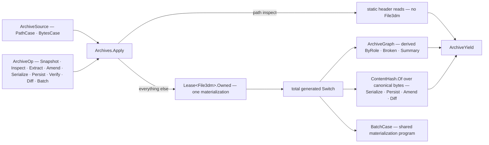

# [RASM_RHINO_ARCHIVE]

The `File3dm` archive transaction family (`Rasm.Rhino.Exchange`). ONE request union spans every archive interaction — filtered and full reads, header-only inspection, embedded-file extraction, mutation, byte serialization, path persistence, structural validation, structural diff, and the shared-materialization batch — dispatched through ONE `Archives.Apply` entry over ONE `File3dm` ownership seam: the archive materializes exactly once per request inside a `Lease<File3dm>.Owned`, every host out-string log lands on the yield as native evidence, and every result is a detached value. The killed census forms are the projection-specific entrypoint roster (`Read`/`Extract`/`Update`/`Inspect`/`Diff`/`Validate`/`Bytes`/`Query`/`Snapshot`/`Resources`/`GraphOf` as parallel operations), the adjacent `FileArchiveQuery`/`FileQueryResult`/`FileResourceGraph`/`FileArchiveDiff` representations of one transaction, and the local resource-delta identity rules — archive identity is the kernel content key over the archive's canonical bytes, and the resource graph is one shape whose metadata, kind, issue, and delta views are derived folds, never stored siblings.

## [01]-[INDEX]

- [02]-[SOURCE_AND_SLICE]: `ArchiveSource` the path/byte ingress, `ArchiveSlice` the partial-read rows, `ArchiveWritePolicy` the write-options projection.
- [03]-[GRAPH_AND_METADATA]: `ResourceRole`, `ResourceNode`, `ResourceLink`, `ArchiveIssue`, `ArchiveGraph` with derived projections, `ArchiveMetadata`, `ArchiveDelta`, `ArchiveVerdict`.
- [04]-[PATCH_FAMILY]: `ArchivePatch` — the closed mutation vocabulary over settings, strings, named views, metadata, and preview.
- [05]-[TRANSACTION_RAIL]: `ArchiveOp`, `ArchiveYield`, and `Archives.Apply` — one materialization, one dispatch, one release.

## [02]-[SOURCE_AND_SLICE]

- Owner: `ArchiveSource` `[Union]` — `PathCase(DocumentPath)` and `BytesCase(ReadOnlyMemory<byte>)`; every ingress admits once, and the path case composes the Document path owner so no second path admission exists. `ArchiveSlice` `[SmartEnum<int>]` — the partial-read vocabulary whose rows carry the host `File3dm.TableTypeFilter` and `File3dm.ObjectTypeFilter` columns plus a `Filtered` fact, so a bounded read is a row selection and a new slice is one row. `ArchiveWritePolicy` — the `File3dmWriteOptions` projection: archive version, user data, and the render/analysis mesh admission per object kind as data rows applied in one fold.
- Law: slice filtering is a path privilege — the filtered `File3dm.Read` overloads take a file path, so a `BytesCase` materialization is always full and a filtered request over bytes records the degradation as an `ArchiveIssue` on the yield instead of silently widening.
- Law: `ArchiveWritePolicy.Host` mints a fresh `File3dmWriteOptions` per write — host option objects never travel across requests, and version `0` is the host's current-version spelling carried by the `Current` preset.
- Growth: a new host table filter is one `ArchiveSlice` row; a new write knob is one `ArchiveWritePolicy` field applied in the same fold.

```csharp
// --- [RUNTIME_PRELUDE] ----------------------------------------------------------------------
using Rasm.Domain;
using Rasm.Rhino.Document;
using Rhino.FileIO;

namespace Rasm.Rhino.Exchange;

// --- [TYPES] --------------------------------------------------------------------------------
[Union(ConversionFromValue = ConversionOperatorsGeneration.None)]
public abstract partial record ArchiveSource {
    private ArchiveSource() { }
    public sealed record PathCase(DocumentPath Path) : ArchiveSource;
    public sealed record BytesCase(ReadOnlyMemory<byte> Bytes) : ArchiveSource;

    public static Fin<ArchiveSource> Of(string path, Op? key = null) {
        Op op = key.OrDefault();
        return op.Catch(() => Fin.Succ(value: (ArchiveSource)new PathCase(Path: DocumentPath.Create(value: path))));
    }

    public static Fin<ArchiveSource> Of(ReadOnlyMemory<byte> bytes, Op? key = null) =>
        guard(!bytes.IsEmpty, key.OrDefault().InvalidInput()).ToFin()
            .Map(_ => (ArchiveSource)new BytesCase(Bytes: bytes));

    internal Option<string> PathText() => Switch(
        pathCase: static source => Some(source.Path.Value),
        bytesCase: static _ => Option<string>.None);
}

[SmartEnum<int>]
public sealed partial class ArchiveSlice {
    public static readonly ArchiveSlice Full = new(key: 0,
        tables: File3dm.TableTypeFilter.None, objects: File3dm.ObjectTypeFilter.None, filtered: false);
    public static readonly ArchiveSlice Header = new(key: 1,
        tables: File3dm.TableTypeFilter.Properties | File3dm.TableTypeFilter.Settings,
        objects: File3dm.ObjectTypeFilter.None, filtered: true);
    public static readonly ArchiveSlice Objects = new(key: 2,
        tables: File3dm.TableTypeFilter.ObjectTable | File3dm.TableTypeFilter.Layer,
        objects: File3dm.ObjectTypeFilter.Any, filtered: true);
    public static readonly ArchiveSlice Resources = new(key: 3,
        tables: File3dm.TableTypeFilter.Layer | File3dm.TableTypeFilter.Material
              | File3dm.TableTypeFilter.Linetype | File3dm.TableTypeFilter.Group
              | File3dm.TableTypeFilter.InstanceDefinition | File3dm.TableTypeFilter.Bitmap
              | File3dm.TableTypeFilter.TextureMapping,
        objects: File3dm.ObjectTypeFilter.None, filtered: true);
    public static readonly ArchiveSlice Layers = new(key: 4,
        tables: File3dm.TableTypeFilter.Layer, objects: File3dm.ObjectTypeFilter.None, filtered: true);
    public static readonly ArchiveSlice Strings = new(key: 5,
        tables: File3dm.TableTypeFilter.UserTable, objects: File3dm.ObjectTypeFilter.None, filtered: true);

    public File3dm.TableTypeFilter Tables { get; }
    public File3dm.ObjectTypeFilter Objects { get; }
    public bool Filtered { get; }
}

// --- [MODELS] -------------------------------------------------------------------------------
public sealed record ArchiveWritePolicy(
    int Version,
    bool SaveUserData,
    Seq<(ObjectType Kind, bool Render, bool Analysis)> Meshes) {
    public static ArchiveWritePolicy Current { get; } = new(Version: 0, SaveUserData: true, Meshes: Seq<(ObjectType, bool, bool)>());

    public static ArchiveWritePolicy Lean { get; } = Current with {
        SaveUserData = false,
        Meshes = Seq((ObjectType.Brep, false, false), (ObjectType.Extrusion, false, false), (ObjectType.SubD, false, false)),
    };

    internal File3dmWriteOptions Host() {
        File3dmWriteOptions options = new() { Version = Version, SaveUserData = SaveUserData };
        _ = Meshes.Iter(row => {
            options.EnableRenderMeshes(objectType: row.Kind, enable: row.Render);
            options.EnableAnalysisMeshes(objectType: row.Kind, enable: row.Analysis);
        });
        return options;
    }
}
```

## [03]-[GRAPH_AND_METADATA]

- Owner: `ResourceRole` `[SmartEnum<int>]` — the resource-kind vocabulary spanning every archive table the graph walks: layer, material, group, block definition, instance, model view, named view, layout page, embedded file, render material, render environment, render texture, string entry, dimension style. `ResourceNode`/`ResourceLink` — one node shape (role, name, id) and one edge shape (from, to, relation role); `ArchiveGraph` — the one stored resource shape whose `ByRole`, `Names`, `Broken`, and `Summary` are derived folds over the same node and link sequences. `ArchiveMetadata` — the header projection: notes, archive version, revision history, application identity, earth anchor presence, layout roster, dimension-style tally, preview presence. `ArchiveDelta` — the diff evidence between two graphs; `ArchiveVerdict` — the structural-validity outcome folding per-object `IsValidWithLog` evidence with the graph's broken links. `ArchiveIssue` — the typed native-evidence row every yield carries.
- Law: node identity inside one graph is `(Role, Name, Id)`; archive identity across graphs is the kernel content key — `ArchiveDelta.Of` compares node sets by role and name and carries both archives' `UInt128` content keys, so "same archive" is answered by `ContentHash.Of` over canonical archive bytes and never by a local delta rule.
- Law: the graph is stored once and projected many times — a consumer needing layers, broken links, or a role census folds the one graph; a second stored per-projection shape is the deleted census form.
- Law: native diagnostics survive as `ArchiveIssue` rows on the yield — the `ReadWithLog`/`WriteWithLog`/`IsValidWithLog` out-strings become typed evidence, never swallowed booleans and never thrown text.

```csharp
// --- [TYPES] --------------------------------------------------------------------------------
[SmartEnum<int>]
public sealed partial class ResourceRole {
    public static readonly ResourceRole Layer = new(key: 0);
    public static readonly ResourceRole Material = new(key: 1);
    public static readonly ResourceRole Group = new(key: 2);
    public static readonly ResourceRole Block = new(key: 3);
    public static readonly ResourceRole Instance = new(key: 4);
    public static readonly ResourceRole ModelView = new(key: 5);
    public static readonly ResourceRole NamedView = new(key: 6);
    public static readonly ResourceRole Layout = new(key: 7);
    public static readonly ResourceRole Embedded = new(key: 8);
    public static readonly ResourceRole RenderMaterial = new(key: 9);
    public static readonly ResourceRole RenderEnvironment = new(key: 10);
    public static readonly ResourceRole RenderTexture = new(key: 11);
    public static readonly ResourceRole StringEntry = new(key: 12);
    public static readonly ResourceRole DimensionStyle = new(key: 13);
    public static readonly ResourceRole LinkedArchive = new(key: 14);
}

[SmartEnum<int>]
public sealed partial class ArchiveIssueKind {
    public static readonly ArchiveIssueKind Native = new(key: 0);
    public static readonly ArchiveIssueKind BrokenLink = new(key: 1);
    public static readonly ArchiveIssueKind SliceDegraded = new(key: 2);
    public static readonly ArchiveIssueKind EmptyArchive = new(key: 3);
    public static readonly ArchiveIssueKind HostDefaults = new(key: 4);
    public static readonly ArchiveIssueKind Unrecorded = new(key: 5);
}

// --- [MODELS] -------------------------------------------------------------------------------
public readonly record struct ArchiveIssue(ArchiveIssueKind Kind, string Message);

public readonly record struct ResourceNode(ResourceRole Role, string Name, Option<Guid> Id);

public readonly record struct ResourceLink(ResourceNode From, ResourceNode To, ResourceRole Relation);

public sealed record ArchiveGraph(Seq<ResourceNode> Nodes, Seq<ResourceLink> Links, Seq<ArchiveIssue> Issues) {
    public HashMap<ResourceRole, Seq<ResourceNode>> ByRole() =>
        Nodes.Fold(HashMap<ResourceRole, Seq<ResourceNode>>(), static (map, node) =>
            map.AddOrUpdate(node.Role, existing => existing.Add(node), () => Seq(node)));

    public Seq<string> Names(ResourceRole role) =>
        Nodes.Filter(node => node.Role == role).Map(static node => node.Name);

    public Seq<ResourceLink> Broken() =>
        Links.Filter(link => !Nodes.Exists(node => node == link.To));

    public Seq<(ResourceRole Role, int Count)> Summary() =>
        ByRole().AsIterable().Map(static pair => (pair.Key, pair.Value.Count)).ToSeq();
}

public sealed record ArchiveMetadata(
    Option<string> Notes,
    int ArchiveVersion,
    Option<(string CreatedBy, string LastEditedBy, int Revision, DateTime CreatedOn, DateTime LastEditedOn)> Revision,
    Option<(string Name, string Url, string Details)> Application,
    bool EarthAnchored,
    Seq<(string Name, Guid Id)> Layouts,
    int DimensionStyles,
    bool HasPreview);

public sealed record ArchiveDelta(
    UInt128 SourceKey,
    UInt128 OtherKey,
    Seq<ResourceNode> Added,
    Seq<ResourceNode> Removed,
    Seq<ResourceNode> Retained) {
    public bool Identical => SourceKey == OtherKey;

    internal static ArchiveDelta Of(UInt128 sourceKey, UInt128 otherKey, ArchiveGraph source, ArchiveGraph other) {
        LanguageExt.HashSet<(ResourceRole, string)> before = toHashSet(source.Nodes.Map(static n => (n.Role, n.Name)));
        LanguageExt.HashSet<(ResourceRole, string)> after = toHashSet(other.Nodes.Map(static n => (n.Role, n.Name)));
        return new(
            SourceKey: sourceKey,
            OtherKey: otherKey,
            Added: other.Nodes.Filter(n => !before.Contains((n.Role, n.Name))),
            Removed: source.Nodes.Filter(n => !after.Contains((n.Role, n.Name))),
            Retained: source.Nodes.Filter(n => after.Contains((n.Role, n.Name))));
    }
}

public sealed record ArchiveVerdict(bool Valid, int Flawed, Seq<ArchiveIssue> Evidence);
```

## [04]-[PATCH_FAMILY]

- Owner: `ArchivePatch` `[Union]` — the closed mutation vocabulary: `NotesCase` writes archive notes, `SettingsCase` rewrites the model/page unit systems on `File3dmSettings`, `StringCase` sets or deletes one document user string (absence deletes), `NamedViewCase` adds, renames, or deletes a named view through the `File3dmViewTable`, `PreviewCase` sets or clears the preview bitmap. Each case owns its own host application arm inside the one generated dispatch, and each returns the changed-resource evidence the amended yield accumulates.
- Law: a patch mutates the leased in-memory archive only — persistence is the enclosing `AmendCase`'s single `WriteWithLog` after every patch lands, so a half-applied patch sequence never reaches disk and the write log is one piece of evidence for the whole amendment.
- Law: string deletion is absence — `StringCase` with `None` value deletes through `File3dmStringTable.Delete`; a parallel delete case re-encodes the discriminant the option already carries and is the deleted form.
- Growth: a new mutable archive surface is one case with its application arm; the amended yield and the total dispatch break loudly until the case is handled.

```csharp
// --- [TYPES] --------------------------------------------------------------------------------
[Union(ConversionFromValue = ConversionOperatorsGeneration.None)]
public abstract partial record ArchivePatch {
    private ArchivePatch() { }
    public sealed record NotesCase(string Notes) : ArchivePatch;
    public sealed record SettingsCase(Option<UnitSystem> ModelUnits, Option<UnitSystem> PageUnits) : ArchivePatch;
    public sealed record StringCase(string Key, Option<string> Value) : ArchivePatch;
    public sealed record NamedViewCase(string Name, Option<string> Rename, bool Delete) : ArchivePatch;
    public sealed record PreviewCase(Option<System.Drawing.Bitmap> Image) : ArchivePatch;

    internal Fin<ResourceNode> Apply(File3dm archive, Op op) => Switch(
        state: (Archive: archive, Op: op),
        notesCase: static (ctx, patch) => ctx.Op.Catch(() => {
            ctx.Archive.Notes.Notes = patch.Notes;
            return Fin.Succ(value: new ResourceNode(Role: ResourceRole.StringEntry, Name: nameof(NotesCase), Id: None));
        }),
        settingsCase: static (ctx, patch) => ctx.Op.Catch(() => {
            _ = patch.ModelUnits.Iter(units => ctx.Archive.Settings.ModelUnitSystem = units);
            _ = patch.PageUnits.Iter(units => ctx.Archive.Settings.PageUnitSystem = units);
            return Fin.Succ(value: new ResourceNode(Role: ResourceRole.StringEntry, Name: nameof(SettingsCase), Id: None));
        }),
        stringCase: static (ctx, patch) => ctx.Op.Catch(() => {
            _ = patch.Value.Case switch {
                string value => Op.Side(() => ctx.Archive.Strings.SetString(section: null, entry: patch.Key, value: value)),
                _ => Op.Side(() => ctx.Archive.Strings.Delete(section: null, entry: patch.Key)),
            };
            return Fin.Succ(value: new ResourceNode(Role: ResourceRole.StringEntry, Name: patch.Key, Id: None));
        }),
        namedViewCase: static (ctx, patch) => ctx.Op.Catch(() =>
            Optional(ctx.Archive.AllNamedViews.FindName(name: patch.Name)).ToFin(Fail: ctx.Op.InvalidInput()).Bind(found =>
                (patch.Delete, patch.Rename.Case) switch {
                    (true, _) => ctx.Op.Confirm(success: ctx.Archive.AllNamedViews.Delete(item: found))
                        .Map(_ => new ResourceNode(Role: ResourceRole.NamedView, Name: patch.Name, Id: None)),
                    (false, string next) => ctx.Op.Catch(() => {
                        found.Name = next;
                        return Fin.Succ(value: new ResourceNode(Role: ResourceRole.NamedView, Name: next, Id: None));
                    }),
                    _ => Fin.Succ(value: new ResourceNode(Role: ResourceRole.NamedView, Name: patch.Name, Id: None)),
                })),
        previewCase: static (ctx, patch) => ctx.Op.Catch(() => {
            _ = patch.Image.Iter(bitmap => ctx.Archive.SetPreviewImage(image: bitmap));
            return Fin.Succ(value: new ResourceNode(Role: ResourceRole.Embedded, Name: nameof(PreviewCase), Id: None));
        }));
}
```

## [05]-[TRANSACTION_RAIL]

- Owner: `ArchiveOp` `[Union]` — the one request family: `SnapshotCase(ArchiveSlice)` materializes and graphs, `InspectCase` reads the header without materializing geometry, `ExtractCase(DocumentPath)` saves every embedded file into a folder, `AmendCase(Seq<ArchivePatch>, DocumentPath, ArchiveWritePolicy)` applies patches and persists, `SerializeCase(ArchiveWritePolicy)` yields canonical bytes plus the content key, `PersistCase(DocumentPath, ArchiveWritePolicy)` writes with log, `VerifyCase` folds per-object validity and link integrity into one verdict, `DiffCase(ArchiveSource)` compares two archives, and `BatchCase(Seq<ArchiveOp>)` runs a program over ONE shared materialization. `ArchiveYield` `[Union]` — the matching result family; `Archives` — the execution owner whose single `Apply` materializes once, dispatches totally, and releases the lease on every exit.
- Entry: `Archives.Apply(ArchiveSource, ArchiveOp, Op?) : Fin<ArchiveYield>` — document-free by construction: no `RhinoDoc`, no session; the archive is the transaction scope.
- Law: `InspectCase` over a `PathCase` never constructs a `File3dm` — the static header reads (`ReadNotes`, `ReadArchiveVersion`, `ReadRevisionHistory`, `ReadApplicationData`, `ReadEarthAnchorPoint`, `ReadPageViews`, `ReadDimensionStyles`, `ReadPreviewImage`) answer from the file; over a `BytesCase` the inspect arm materializes and projects the same metadata shape with a `SliceDegraded` issue, so the yield shape never forks on ingress.
- Law: `SerializeCase` is the identity seam — `ToByteArray(policy.Host())` produces the canonical bytes and `ContentHash.Of` those bytes is the archive's federation key; `PersistCase` and `AmendCase` key the landed artifact from the bytes read back off disk, so the receipt names the artifact that exists, never a diverging in-memory serialization.
- Law: `VerifyCase` builds on live host capability only — per-object `IsValidWithLog` evidence plus the graph's broken links; the host's archive-level `IsValid`/`Audit`/`Polish` trio is an obsolete husk (`IsValid` returns true unconditionally, `Audit` repairs nothing) and never appears on this rail.
- Law: `BatchCase` shares one materialization across its program — each inner op dispatches against the already-leased archive, inner `BatchCase` nesting is refused at admission, and the batched yield preserves program order.
- Boundary: `File3dm` is `IDisposable` host material — the lease's `Use` window is the only scope a host archive object lives in, and every yield is detached before the window closes; a `Bitmap` leaving the inspect arm rides `Lease<System.Drawing.Bitmap>.Owned` on the metadata yield's preview flag instead of escaping raw.

```csharp
// --- [TYPES] --------------------------------------------------------------------------------
[Union(ConversionFromValue = ConversionOperatorsGeneration.None)]
public abstract partial record ArchiveOp {
    private ArchiveOp() { }
    public sealed record SnapshotCase(ArchiveSlice Slice) : ArchiveOp;
    public sealed record InspectCase : ArchiveOp;
    public sealed record ExtractCase(DocumentPath Folder) : ArchiveOp;
    public sealed record AmendCase(Seq<ArchivePatch> Patches, DocumentPath Target, ArchiveWritePolicy Policy) : ArchiveOp;
    public sealed record SerializeCase(ArchiveWritePolicy Policy) : ArchiveOp;
    public sealed record PersistCase(DocumentPath Target, ArchiveWritePolicy Policy) : ArchiveOp;
    public sealed record VerifyCase : ArchiveOp;
    public sealed record DiffCase(ArchiveSource Other) : ArchiveOp;
    public sealed record BatchCase(Seq<ArchiveOp> Program) : ArchiveOp;

    public static Fin<ArchiveOp> Batch(Op? key = null, params ReadOnlySpan<ArchiveOp> program) {
        Op op = key.OrDefault();
        Seq<ArchiveOp> admitted = toSeq(program.ToArray());
        return from _count in guard(!admitted.IsEmpty, op.InvalidInput()).ToFin()
               from _flat in guard(!admitted.Exists(static item => item is BatchCase), op.InvalidInput()).ToFin()
               select (ArchiveOp)new BatchCase(Program: admitted);
    }
}

[Union(ConversionFromValue = ConversionOperatorsGeneration.None)]
public abstract partial record ArchiveYield {
    private ArchiveYield() { }
    public sealed record GraphCase(ArchiveGraph Graph) : ArchiveYield;
    public sealed record MetadataCase(ArchiveMetadata Metadata, Seq<ArchiveIssue> Issues) : ArchiveYield;
    public sealed record ExtractedCase(Seq<(string Name, DocumentPath Target, UInt128 ContentKey)> Files) : ArchiveYield;
    public sealed record AmendedCase(Seq<ResourceNode> Changed, DocumentPath Target, UInt128 ContentKey, Option<string> WriteLog) : ArchiveYield;
    public sealed record BytesCase(ReadOnlyMemory<byte> Bytes, UInt128 ContentKey) : ArchiveYield;
    public sealed record PersistedCase(DocumentPath Target, UInt128 ContentKey, Option<string> WriteLog) : ArchiveYield;
    public sealed record VerdictCase(ArchiveVerdict Verdict) : ArchiveYield;
    public sealed record DeltaCase(ArchiveDelta Delta) : ArchiveYield;
    public sealed record BatchedCase(Seq<ArchiveYield> Yields) : ArchiveYield;
}

// --- [OPERATIONS] ---------------------------------------------------------------------------
public static class Archives {
    public static Fin<ArchiveYield> Apply(ArchiveSource source, ArchiveOp request, Op? key = null) {
        Op op = key.OrDefault();
        return from ingress in Optional(source).ToFin(Fail: op.InvalidInput())
               from admitted in Optional(request).ToFin(Fail: op.InvalidInput())
               from yield in admitted switch {
                   ArchiveOp.InspectCase when ingress is ArchiveSource.PathCase path => InspectPath(path: path.Path, op: op),
                   _ => Materialized(source: ingress, request: admitted, op: op),
               }
               select yield;
    }

    private static Fin<ArchiveYield> Materialized(ArchiveSource source, ArchiveOp request, Op op) {
        ArchiveSlice slice = request is ArchiveOp.SnapshotCase snapshot ? snapshot.Slice : ArchiveSlice.Full;
        return Open(source: source, slice: slice, op: op).Bind(opened =>
            opened.Lease.Use(borrow: archive =>
                Dispatch(source: source, archive: archive, request: request, issues: opened.Issues, op: op),
                key: op));
    }

    private static Fin<(Lease<File3dm> Lease, Seq<ArchiveIssue> Issues)> Open(ArchiveSource source, ArchiveSlice slice, Op op) =>
        source.Switch(
            state: (Slice: slice, Op: op),
            pathCase: static (ctx, ingress) => ctx.Op.Catch(() => {
                string log = string.Empty;
                File3dm? archive = ctx.Slice.Filtered
                    ? File3dm.ReadWithLog(path: ingress.Path.Value, tableTypeFilterFilter: ctx.Slice.Tables, objectTypeFilter: ctx.Slice.Objects, errorLog: out log)
                    : File3dm.ReadWithLog(path: ingress.Path.Value, errorLog: out log);
                return Optional(archive).ToFin(Fail: ctx.Op.InvalidResult(detail: log)).Map(model =>
                    ((Lease<File3dm>)new Lease<File3dm>.Owned(Value: model),
                     string.IsNullOrWhiteSpace(value: log)
                         ? Seq<ArchiveIssue>()
                         : Seq(new ArchiveIssue(Kind: ArchiveIssueKind.Native, Message: log))));
            }),
            bytesCase: static (ctx, ingress) => ctx.Op.Catch(() =>
                Optional(File3dm.FromByteArray(bytes: ingress.Bytes.ToArray())).ToFin(Fail: ctx.Op.InvalidResult()).Map(model =>
                    ((Lease<File3dm>)new Lease<File3dm>.Owned(Value: model),
                     ctx.Slice.Filtered
                         ? Seq(new ArchiveIssue(Kind: ArchiveIssueKind.SliceDegraded, Message: "Byte ingress admits only full reads; the slice filter is path-only."))
                         : Seq<ArchiveIssue>()))));

    private static Fin<ArchiveYield> Dispatch(ArchiveSource source, File3dm archive, ArchiveOp request, Seq<ArchiveIssue> issues, Op op) =>
        request.Switch(
            state: (Source: source, Archive: archive, Issues: issues, Op: op),
            snapshotCase: static (ctx, _) =>
                Graph(archive: ctx.Archive, issues: ctx.Issues, op: ctx.Op)
                    .Map(static graph => (ArchiveYield)new ArchiveYield.GraphCase(Graph: graph)),
            inspectCase: static (ctx, _) =>
                MetadataOf(archive: ctx.Archive, op: ctx.Op)
                    .Map(metadata => (ArchiveYield)new ArchiveYield.MetadataCase(Metadata: metadata, Issues: ctx.Issues)),
            extractCase: static (ctx, request) => Extract(archive: ctx.Archive, folder: request.Folder, op: ctx.Op),
            amendCase: static (ctx, request) =>
                request.Patches
                    .TraverseM(patch => patch.Apply(archive: ctx.Archive, op: ctx.Op))
                    .As()
                    .Bind(changed => ctx.Op.Catch(() => {
                        string log = string.Empty;
                        bool wrote = ctx.Archive.WriteWithLog(path: request.Target.Value, options: request.Policy.Host(), errorLog: out log);
                        return ctx.Op.Confirm(success: wrote).Bind(_ =>
                            ctx.Op.Catch(() => Fin.Succ(value: (ArchiveYield)new ArchiveYield.AmendedCase(
                                Changed: changed,
                                Target: request.Target,
                                ContentKey: ContentHash.Of(canonicalBytes: System.IO.File.ReadAllBytes(path: request.Target.Value)),
                                WriteLog: Optional(log).Filter(static text => !string.IsNullOrWhiteSpace(value: text))))));
                    })),
            serializeCase: static (ctx, request) => ctx.Op.Catch(() => {
                byte[] bytes = ctx.Archive.ToByteArray(options: request.Policy.Host());
                return guard(bytes.Length > 0, ctx.Op.InvalidResult()).ToFin().Map(_ =>
                    (ArchiveYield)new ArchiveYield.BytesCase(Bytes: bytes, ContentKey: ContentHash.Of(canonicalBytes: bytes)));
            }),
            persistCase: static (ctx, request) => ctx.Op.Catch(() => {
                string log = string.Empty;
                bool wrote = ctx.Archive.WriteWithLog(path: request.Target.Value, options: request.Policy.Host(), errorLog: out log);
                return ctx.Op.Confirm(success: wrote).Map(_ => (ArchiveYield)new ArchiveYield.PersistedCase(
                    Target: request.Target,
                    ContentKey: ContentHash.Of(canonicalBytes: System.IO.File.ReadAllBytes(path: request.Target.Value)),
                    WriteLog: Optional(log).Filter(static text => !string.IsNullOrWhiteSpace(value: text))));
            }),
            verifyCase: static (ctx, _) =>
                Graph(archive: ctx.Archive, issues: ctx.Issues, op: ctx.Op).Bind(graph => ctx.Op.Catch(() => {
                    Seq<ArchiveIssue> flaws = toSeq(ctx.Archive.Objects).Choose(entry =>
                        entry.Geometry.IsValidWithLog(log: out string log)
                            ? Option<ArchiveIssue>.None
                            : Some(new ArchiveIssue(Kind: ArchiveIssueKind.Native, Message: $"{entry.Name ?? entry.Id.ToString()}: {log}")));
                    Seq<ArchiveIssue> severed = graph.Broken().Map(link =>
                        new ArchiveIssue(Kind: ArchiveIssueKind.BrokenLink, Message: $"{link.From.Name} -> {link.To.Name}"));
                    return Fin.Succ(value: (ArchiveYield)new ArchiveYield.VerdictCase(Verdict: new ArchiveVerdict(
                        Valid: flaws.IsEmpty && severed.IsEmpty,
                        Flawed: flaws.Count,
                        Evidence: flaws + severed)));
                })),
            diffCase: static (ctx, request) =>
                from sourceBytes in ctx.Op.Catch(() => Fin.Succ(value: ctx.Archive.ToByteArray(options: ArchiveWritePolicy.Current.Host())))
                from sourceGraph in Graph(archive: ctx.Archive, issues: ctx.Issues, op: ctx.Op)
                from other in Open(source: request.Other, slice: ArchiveSlice.Full, op: ctx.Op)
                from delta in other.Lease.Use(borrow: otherArchive =>
                    from otherBytes in ctx.Op.Catch(() => Fin.Succ(value: otherArchive.ToByteArray(options: ArchiveWritePolicy.Current.Host())))
                    from otherGraph in Graph(archive: otherArchive, issues: other.Issues, op: ctx.Op)
                    select ArchiveDelta.Of(
                        sourceKey: ContentHash.Of(canonicalBytes: sourceBytes),
                        otherKey: ContentHash.Of(canonicalBytes: otherBytes),
                        source: sourceGraph,
                        other: otherGraph),
                    key: ctx.Op)
                select (ArchiveYield)new ArchiveYield.DeltaCase(Delta: delta),
            batchCase: static (ctx, request) =>
                request.Program
                    .TraverseM(inner => Dispatch(source: ctx.Source, archive: ctx.Archive, request: inner, issues: ctx.Issues, op: ctx.Op))
                    .As()
                    .Map(static yields => (ArchiveYield)new ArchiveYield.BatchedCase(Yields: yields)));

    private static Fin<ArchiveYield> InspectPath(DocumentPath path, Op op) =>
        op.Catch(() => {
            string createdBy = string.Empty, lastEditedBy = string.Empty;
            int revision = 0;
            DateTime createdOn = default, lastEditedOn = default;
            bool hasRevision = File3dm.ReadRevisionHistory(
                path: path.Value, createdBy: out createdBy, lastEditedBy: out lastEditedBy,
                revision: out revision, createdOn: out createdOn, lastEditedOn: out lastEditedOn);
            File3dm.ReadApplicationData(path: path.Value, applicationName: out string appName, applicationUrl: out string appUrl, applicationDetails: out string appDetails);
            bool anchored;
            using (EarthAnchorPoint? anchor = File3dm.ReadEarthAnchorPoint(path: path.Value)) {
                anchored = anchor is { } value && value.EarthLocationIsSet();
            }
            return Fin.Succ(value: (ArchiveYield)new ArchiveYield.MetadataCase(
                Metadata: new ArchiveMetadata(
                    Notes: Optional(File3dm.ReadNotes(path: path.Value)).Filter(static text => !string.IsNullOrWhiteSpace(value: text)),
                    ArchiveVersion: File3dm.ReadArchiveVersion(path: path.Value),
                    Revision: hasRevision ? Some((createdBy, lastEditedBy, revision, createdOn, lastEditedOn)) : None,
                    Application: string.IsNullOrWhiteSpace(value: appName) ? None : Some((appName, appUrl, appDetails)),
                    EarthAnchored: anchored,
                    Layouts: toSeq(File3dm.ReadPageViews(path: path.Value)).Map(static view => (view.Name, view.Viewport.Id)),
                    DimensionStyles: File3dm.ReadDimensionStyles(path: path.Value).Length,
                    HasPreview: Optional(File3dm.ReadPreviewImage(path: path.Value)).Map(static bitmap => {
                        using System.Drawing.Bitmap preview = bitmap;
                        return true;
                    }).IfNone(noneValue: false)),
                Issues: Seq<ArchiveIssue>()));
        });

    private static Fin<ArchiveYield> Extract(File3dm archive, DocumentPath folder, Op op) =>
        op.Catch(() =>
            toSeq(archive.EmbeddedFiles)
                .TraverseM(file => op.Catch(() => {
                    string target = System.IO.Path.Join(folder.Value, System.IO.Path.GetFileName(file.Filename));
                    return op.Confirm(success: file.SaveToFile(target)).Bind(_ =>
                        op.Catch(() => Fin.Succ(value: (
                            System.IO.Path.GetFileName(file.Filename),
                            DocumentPath.Create(value: target),
                            ContentHash.Of(canonicalBytes: System.IO.File.ReadAllBytes(path: target))))));
                }))
                .As()
                .Map(static files => (ArchiveYield)new ArchiveYield.ExtractedCase(Files: files)));

    private static Fin<ArchiveGraph> Graph(File3dm archive, Seq<ArchiveIssue> issues, Op op) =>
        op.Catch(() => {
            Seq<(int Index, ResourceNode Node)> layerRows = toSeq(archive.AllLayers).Map(static layer =>
                (layer.Index, new ResourceNode(Role: ResourceRole.Layer, Name: layer.Name, Id: Some(layer.Id))));
            Seq<ResourceNode> layers = layerRows.Map(static row => row.Node);
            HashMap<int, ResourceNode> layerByIndex = toHashMap(layerRows);
            Seq<ResourceNode> materials = toSeq(archive.AllMaterials).Map(static material => new ResourceNode(Role: ResourceRole.Material, Name: material.Name, Id: Some(material.Id)));
            Seq<ResourceNode> groups = toSeq(archive.AllGroups).Map(static group => new ResourceNode(Role: ResourceRole.Group, Name: group.Name, Id: Some(group.Id)));
            Seq<ResourceNode> blocks = toSeq(archive.AllInstanceDefinitions).Map(static block => new ResourceNode(Role: ResourceRole.Block, Name: block.Name, Id: Some(block.Id)));
            Seq<ResourceNode> views = toSeq(archive.AllViews).Map(static view => new ResourceNode(Role: ResourceRole.ModelView, Name: view.Name, Id: Some(view.Viewport.Id)));
            Seq<ResourceNode> named = toSeq(archive.AllNamedViews).Map(static view => new ResourceNode(Role: ResourceRole.NamedView, Name: view.Name, Id: Some(view.Viewport.Id)));
            Seq<ResourceNode> embedded = toSeq(archive.EmbeddedFiles).Map(static file => new ResourceNode(Role: ResourceRole.Embedded, Name: file.Filename, Id: None));
            Seq<ResourceNode> renderMaterials = toSeq(archive.RenderMaterials).Map(static content => new ResourceNode(Role: ResourceRole.RenderMaterial, Name: content.Name, Id: Some(content.Id)));
            Seq<ResourceNode> renderEnvironments = toSeq(archive.RenderEnvironments).Map(static content => new ResourceNode(Role: ResourceRole.RenderEnvironment, Name: content.Name, Id: Some(content.Id)));
            Seq<ResourceNode> renderTextures = toSeq(archive.RenderTextures).Map(static content => new ResourceNode(Role: ResourceRole.RenderTexture, Name: content.Name, Id: Some(content.Id)));
            Seq<ResourceNode> nodes = layers + materials + groups + blocks + views + named + embedded + renderMaterials + renderEnvironments + renderTextures;
            Seq<ResourceLink> links = toSeq(archive.Objects)
                .Choose(entry => Optional(entry.Attributes).Map(attributes =>
                    new ResourceLink(
                        From: new ResourceNode(Role: ResourceRole.Instance, Name: entry.Name ?? string.Empty, Id: Some(entry.Id)),
                        To: layerByIndex.Find(attributes.LayerIndex).IfNone(() => new ResourceNode(Role: ResourceRole.Layer, Name: string.Empty, Id: None)),
                        Relation: ResourceRole.Layer)));
            return Fin.Succ(value: new ArchiveGraph(
                Nodes: nodes,
                Links: links,
                Issues: issues + (nodes.IsEmpty ? Seq(new ArchiveIssue(Kind: ArchiveIssueKind.EmptyArchive, Message: "Archive carries no resource rows.")) : Seq<ArchiveIssue>())));
        });

    private static Fin<ArchiveYield> MetadataOf(File3dm archive, Op op) =>
        op.Catch(() => {
            bool anchored;
            using (EarthAnchorPoint anchor = archive.EarthAnchorPoint) {
                anchored = anchor.EarthLocationIsSet();
            }
            return Fin.Succ(value: (ArchiveYield)new ArchiveYield.MetadataCase(
                Metadata: new ArchiveMetadata(
                    Notes: Optional(archive.Notes.Notes).Filter(static text => !string.IsNullOrWhiteSpace(value: text)),
                    ArchiveVersion: archive.ArchiveVersion,
                    Revision: archive.Revision > 0 || !string.IsNullOrWhiteSpace(value: archive.CreatedBy)
                        ? Some((archive.CreatedBy, archive.LastEditedBy, archive.Revision, archive.Created, archive.LastEdited))
                        : None,
                    Application: string.IsNullOrWhiteSpace(value: archive.ApplicationName)
                        ? None
                        : Some((archive.ApplicationName, archive.ApplicationUrl, archive.ApplicationDetails)),
                    EarthAnchored: anchored,
                    Layouts: Seq<(string, Guid)>(),
                    DimensionStyles: archive.AllDimStyles.Count,
                    HasPreview: Optional(archive.GetPreviewImage()).Map(static bitmap => {
                        using System.Drawing.Bitmap preview = bitmap;
                        return true;
                    }).IfNone(noneValue: false)),
                Issues: Seq(new ArchiveIssue(Kind: ArchiveIssueKind.SliceDegraded, Message: "Byte ingress projects the in-memory header; the layout roster is a path-only read."))));
        });
}
```


