```mermaid
---
config:
  theme: base
  look: classic
  layout: elk
  flowchart:
    curve: linear
    padding: 25
  themeVariables:
    darkMode: true
    fontFamily: "SF Mono, Menlo, Cascadia Mono, Segoe UI Mono, Consolas, monospace"
    useGradient: false
    dropShadow: "none"
    background: "#282A36"
    primaryColor: "#44475A"
    primaryTextColor: "#F8F8F2"
    primaryBorderColor: "#BD93F9"
    lineColor: "#FF79C6"
    textColor: "#F8F8F2"
    edgeLabelBackground: "#21222C"
    labelBackgroundColor: "#21222C"
  themeCSS: ".nodeLabel{font-size:13px;font-weight:500}.edgeLabel{font-size:12px;font-weight:500}.cluster-label .nodeLabel{font-size:13.5px;font-weight:700;letter-spacing:.08em}.edge-thickness-normal{stroke-width:2px}.edge-thickness-thick{stroke-width:3px}.edge-pattern-dashed,.edge-pattern-dotted{stroke-width:1.5px;stroke-dasharray:4 6}.node rect,.node circle,.node polygon,.node path,.node .outer-path{stroke-width:1.5px;filter:none!important}.cluster rect{stroke-width:1px!important;stroke-dasharray:5 4!important;filter:none!important}.marker path{transform:scale(.8);transform-origin:5px 5px}.marker circle{transform:scale(.48);transform-origin:5px 5px}.edgeLabel rect{transform-box:fill-box;transform-origin:center;transform:scale(1.1,1.2)}"
---
flowchart LR
    accTitle: Codec matrix dispatch topology
    accDescr: FileCodec rows feed derived lookup surfaces, the two directional entries with their ability and dial-seat gates, and the host dialog port whose index-keyed callbacks route back onto the same entries.
    Rows["FileCodec rows — extensions · abilities · engine columns"] --> Lookup["derived: Detect · Of · Filter · EnsureExtension"]
    Rows --> Entry[["Codecs.Read / Codecs.Write — one entry per direction"]]
    Entry -->|ability + dial-seat gates, then one dispatch| Direct["engine column — typed host options from the Dials row, attached lane inside the row"]
    Rows --> Port["CodecPort — FileTypeList registration, index registry"]
    Port --> Dialog["CodecImportPort.ReadFile / CodecExportPort.WriteFile — index-keyed dispatch"]
    Dialog --> Entry
    linkStyle 2 stroke:#50FA7B,color:#F8F8F2
    classDef primary fill:#44475A,stroke:#FF79C6,color:#F8F8F2
    classDef success fill:#50FA7BBF,stroke:#50FA7B,color:#282A36
    classDef data fill:#FFB86CBF,stroke:#FFB86C,color:#282A36
    classDef boundary fill:#282A36,stroke:#BD93F9,color:#F8F8F2
    class Entry primary
    class Direct success
    class Rows,Lookup data
    class Port,Dialog boundary
```

# [RASM_RHINO_FORMATS]

Codec capability matrix (`Rasm.Rhino.Exchange`). `FileCodec` is ONE generated `[SmartEnum<string>]` vocabulary whose declaration list is the whole interchange roster — every row carries its extensions, its ability set, and its direct host engine adapters as constructor data — and every secondary surface derives from that one declaration: extension detection, key lookup, dialog filter strings, plug-in file-type registration, and read/write dispatch are projections over `Items`, never parallel structures. Host option minting is `options.md`'s dial family — each engine column consumes its `Dials` row, so the tune baseline, per-format overrides, and scale lens compose once outside the matrix. Killed census forms are the handwritten `BuiltIn` roster beside three hand-maintained lookup dictionaries, the mutable custom-registration `Atom` that let a format enter outside the vocabulary, the sibling option-builder method family that restated one policy per format, the four parallel `FileVectorScale.Apply` overloads, per-row inline option spelling, and the filesystem backup policy embedded in a codec adapter — backup and collision are `operations.md` output policy, and a new format is one row. `Rhino.PlugIns` file-dialog territory binds through the same rows: `CodecPort` populates the host `FileTypeList` from import- and export-capable rows and dispatches the host's index-keyed `ReadFile`/`WriteFile` back onto the matrix.

## [01]-[INDEX]

- [02]-[ABILITY_AXES]: `CodecAbility` the capability vocabulary, `CodecPhase` the dispatch phases, `CodecFidelity`/`CodecAxis`/`CodecResource` the tune policy rows, and `CodecTune` the one option-policy record.
- [03]-[VECTOR_SCALE]: `VectorUnit` the unit correspondence rows, `VectorLens<TOptions>` the per-option-type setter row, and `VectorScale` the one generic application.
- [04]-[CODEC_MATRIX]: `FileCodec` — the generated row set with engine adapters and option projections, and the derived lookup, filter, and extension surfaces.
- [05]-[DIALOG_PORT]: `CodecPort` — `FileTypeList` registration and index-keyed host dialog dispatch over the matrix.

## [02]-[ABILITY_AXES]

- Owner: `CodecAbility` `[SmartEnum<int>]` — the combinable capability vocabulary a row declares as a set: `Archive` (3dm-native), `Import`, `Export`, `Vector` (page-space vector interchange), `Raster` (pixel egress rows the publish pipeline encodes), `Selection` (rows whose selected-object write is non-interactive — the host-native `3dm` selected export plus the carrier-threading engines whose typed options embed the host `FileWriteOptions`, so `WriteSelectedObjectsOnly` reaches the writer; every other row's dictionary-less selected export falls back to the format plug-in's interactive option getter and is refused at the gate). `CodecPhase` `[SmartEnum<int>]` — the dispatch phases: `Import` and `Export` each carry a `Demands` ability column the filter derivation and the entry gates read, so phase validation is one membership probe against the row's set, never a per-phase branch. `CodecFidelity` `[SmartEnum<int>]` — `Model`/`Small`/`GeometryOnly` rows with `IsModel`, `Measured`, and `Draco` compression columns. `CodecAxis` `[SmartEnum<int>]` — the grouping/ordering vocabulary: `Stable`, `Document`, `File`, `Layer`, `ObjectName`, `ObjectType`, `Material`, `Block`, `UserString`. `CodecResource` `[SmartEnum<int>]` — `Reference`/`Embed`/`Copy`. `CodecTune` — the one option-policy record every option projection reads; its presets are the policy values, per-format depth enters only as the one `Dial` slot carrying the closed dial family, and a per-format knob on a signature is unrepresentable because rows read the tune, never a parameter.
- Law: capability is set membership, not flags — a row's `Abilities` is declared once and probed through `Has`; a phase admits a row only when `Demands` is a member, so an engine-less raster row structurally never reaches an engine delegate.
- Law: `CodecTune` arrives pre-constructed and carries its whole policy; no codec entrypoint grows a boolean beside it, a consumer needing one divergent tune axis takes `with` on a preset, and a consumer needing per-format depth sets `Dial` to the owning dial case.
- Growth: a new fidelity, axis, or resource stance is one row; every option projection that reads the new column breaks loudly at the row constructor, never silently at a call site.

```csharp signature
// --- [RUNTIME_PRELUDE] ----------------------------------------------------------------------
using Rasm.Domain;
using Rasm.Rhino.Document;
using Rhino.FileIO;

namespace Rasm.Rhino.Exchange;

// --- [TYPES] --------------------------------------------------------------------------------
[SmartEnum<int>]
public sealed partial class CodecAbility {
    public static readonly CodecAbility Archive = new(key: 0);
    public static readonly CodecAbility Import = new(key: 1);
    public static readonly CodecAbility Export = new(key: 2);
    public static readonly CodecAbility Vector = new(key: 3);
    public static readonly CodecAbility Raster = new(key: 4);
    public static readonly CodecAbility Selection = new(key: 5);
}

[SmartEnum<int>]
public sealed partial class CodecPhase {
    public static readonly CodecPhase Import = new(key: 0, demands: CodecAbility.Import);
    public static readonly CodecPhase Export = new(key: 1, demands: CodecAbility.Export);

    public CodecAbility Demands { get; }
}

[SmartEnum<int>]
public sealed partial class CodecFidelity {
    public static readonly CodecFidelity Model = new(key: 0, isModel: true, measured: true, draco: (0, 14, 10, 12));
    public static readonly CodecFidelity Small = new(key: 1, isModel: false, measured: false, draco: (7, 11, 8, 10));
    public static readonly CodecFidelity GeometryOnly = new(key: 2, isModel: false, measured: true, draco: (0, 14, 10, 12));

    public bool IsModel { get; }
    public bool Measured { get; }
    public (int Compression, int BitsPos, int BitsNormal, int BitsTexCoord) Draco { get; }
}

[SmartEnum<int>]
public sealed partial class CodecAxis {
    public static readonly CodecAxis Stable = new(key: 0);
    public static readonly CodecAxis Document = new(key: 1);
    public static readonly CodecAxis File = new(key: 2);
    public static readonly CodecAxis Layer = new(key: 3);
    public static readonly CodecAxis ObjectName = new(key: 4);
    public static readonly CodecAxis ObjectType = new(key: 5);
    public static readonly CodecAxis Material = new(key: 6);
    public static readonly CodecAxis Block = new(key: 7);
    public static readonly CodecAxis UserString = new(key: 8);
}

[SmartEnum<int>]
public sealed partial class CodecResource {
    public static readonly CodecResource Reference = new(key: 0);
    public static readonly CodecResource Embed = new(key: 1);
    public static readonly CodecResource Copy = new(key: 2);
}

// --- [MODELS] -------------------------------------------------------------------------------
public sealed record CodecTune(
    CodecFidelity Fidelity,
    CodecResource Resources,
    CodecAxis Group,
    CodecAxis Order,
    bool Materials,
    Option<VectorScale> Scale,
    Option<FormatDial> Dial = default) {
    public static CodecTune Model { get; } = new(
        Fidelity: CodecFidelity.Model, Resources: CodecResource.Reference,
        Group: CodecAxis.Document, Order: CodecAxis.Stable, Materials: true, Scale: None);

    public static CodecTune Small { get; } = Model with { Fidelity = CodecFidelity.Small, Materials = false };

    public static CodecTune GeometryOnly { get; } = Model with { Fidelity = CodecFidelity.GeometryOnly, Materials = false };

    internal bool Grouped(CodecAxis axis) => Group == axis || Order == axis;
}
```

## [03]-[VECTOR_SCALE]

- Owner: `VectorUnit` `[SmartEnum<int>]` — the page-unit correspondence rows whose columns carry each host option type's own unit enum, so unit translation is a column read. `VectorLens<TOptions>` — the per-option-type setter row: four delegates naming where preserve, Rhino scale, source scale, and unit land on that host type. `VectorScale` — the one scale value with ONE generic `Apply<TOptions>(options, lens)`; the census's four hand-written `Apply` overloads collapse into lens rows declared beside the codec rows that consume them.
- Law: an explicit scale member (`Unit`, `Source`, `Rhino`) forces `PreserveModelScale` false unless `Preserve` is explicitly set; declaring both `Preserve = true` and an explicit member is a construction refusal, so a contradictory scale never reaches a host option.
- Law: scale participation is a row fact — only rows whose option projection threads `Scale` consume it; a scale supplied to a non-vector row is inert by construction because no lens exists for its option type.

```csharp signature
// --- [TYPES] --------------------------------------------------------------------------------
[SmartEnum<int>]
public sealed partial class VectorUnit {
    public static readonly VectorUnit Inches = new(key: 0,
        pdf: FilePdfReadOptions.PDF_UNITS.inches, aiRead: FileAiReadOptions.Units.Inches,
        aiWrite: FileAiWriteOptions.Units.Inches, eps: FileEpsReadOptions.Units.Inches);
    public static readonly VectorUnit Centimeters = new(key: 1,
        pdf: FilePdfReadOptions.PDF_UNITS.centimeters, aiRead: FileAiReadOptions.Units.Centimeters,
        aiWrite: FileAiWriteOptions.Units.Centimeters, eps: FileEpsReadOptions.Units.Centimeters);
    public static readonly VectorUnit Millimeters = new(key: 2,
        pdf: FilePdfReadOptions.PDF_UNITS.millimeters, aiRead: FileAiReadOptions.Units.Millimeters,
        aiWrite: FileAiWriteOptions.Units.Millimeters, eps: FileEpsReadOptions.Units.Millimeters);
    public static readonly VectorUnit Points = new(key: 3,
        pdf: FilePdfReadOptions.PDF_UNITS.points, aiRead: FileAiReadOptions.Units.Points,
        aiWrite: FileAiWriteOptions.Units.Points, eps: FileEpsReadOptions.Units.Points);

    internal FilePdfReadOptions.PDF_UNITS Pdf { get; }
    internal FileAiReadOptions.Units AiRead { get; }
    internal FileAiWriteOptions.Units AiWrite { get; }
    internal FileEpsReadOptions.Units Eps { get; }
}

// --- [MODELS] -------------------------------------------------------------------------------
public sealed record VectorLens<TOptions>(
    Action<TOptions, bool> Preserve,
    Action<TOptions, double> Rhino,
    Action<TOptions, double> Source,
    Action<TOptions, VectorUnit> Unit) where TOptions : class;

public readonly record struct VectorScale(
    Option<VectorUnit> Unit = default,
    Option<double> Source = default,
    Option<double> Rhino = default,
    Option<bool> Preserve = default) {
    private bool HasExplicit => Unit.IsSome || Source.IsSome || Rhino.IsSome;

    private Option<bool> PreserveMode => Preserve | (HasExplicit ? Some(value: false) : Option<bool>.None);

    public static Fin<VectorScale> Of(
        Option<VectorUnit> unit = default,
        Option<double> source = default,
        Option<double> rhino = default,
        Option<bool> preserve = default,
        Op? key = null) {
        Op op = key.OrDefault();
        VectorScale candidate = new(Unit: unit, Source: source, Rhino: rhino, Preserve: preserve);
        return from _mode in guard(!(preserve.Case is true && candidate.HasExplicit), op.InvalidInput()).ToFin()
               from _source in source.Map(value => op.Positive(value: value).Map(static _ => unit)).IfNone(Fin.Succ(value: unit))
               from _rhino in rhino.Map(value => op.Positive(value: value).Map(static _ => unit)).IfNone(Fin.Succ(value: unit))
               select candidate;
    }

    internal TOptions Apply<TOptions>(TOptions options, VectorLens<TOptions> lens) where TOptions : class {
        VectorScale self = this;
        _ = Op.Side(() => {
            _ = self.PreserveMode.Iter(value => lens.Preserve(arg1: options, arg2: value));
            _ = self.Rhino.Iter(value => lens.Rhino(arg1: options, arg2: value));
            _ = self.Source.Iter(value => lens.Source(arg1: options, arg2: value));
            _ = self.Unit.Iter(value => lens.Unit(arg1: options, arg2: value));
        });
        return options;
    }
}

// --- [CONSTANTS] ----------------------------------------------------------------------------
internal static class VectorLenses {
    internal static readonly VectorLens<FilePdfReadOptions> Pdf = new(
        Preserve: static (o, v) => o.PreserveModelScale = v, Rhino: static (o, v) => o.RhinoScale = v,
        Source: static (o, v) => o.PDFScale = v, Unit: static (o, v) => o.PdfUnits = v.Pdf);
    internal static readonly VectorLens<FileAiReadOptions> AiRead = new(
        Preserve: static (o, v) => o.PreserveModelScale = v, Rhino: static (o, v) => o.RhinoScale = v,
        Source: static (o, v) => o.AiScale = v, Unit: static (o, v) => o.AiUnits = v.AiRead);
    internal static readonly VectorLens<FileAiWriteOptions> AiWrite = new(
        Preserve: static (o, v) => o.PreserveModelScale = v, Rhino: static (o, v) => o.RhinoScale = v,
        Source: static (o, v) => o.AIScale = v, Unit: static (o, v) => o.AiUnits = v.AiWrite);
    internal static readonly VectorLens<FileEpsReadOptions> Eps = new(
        Preserve: static (o, v) => o.PreserveModelScale = v, Rhino: static (o, v) => o.RhinoScale = v,
        Source: static (o, v) => o.EpsScale = v, Unit: static (o, v) => o.EpsUnits = v.Eps);
}
```

## [04]-[CODEC_MATRIX]

- Owner: `FileCodec` `[SmartEnum<string>]` — the interchange matrix. Each row declares its extension set, its ability set, and two `[UseDelegateFromConstructor]` engine columns whose bodies resolve the row's typed host options through its `Dials` row and invoke the direct engine; rows without an engine leg answer with the shared typed refusal, and the ability gate in the one entry keeps that refusal unreachable. Option minting is the dial family's — the tune baseline, per-format dial overrides, and the scale lens compose in one `Dials` resolution, so no row spells a host option member inline and one policy record still drives every host option type.
- Entry: `Codecs.Read(RhinoDoc, DocumentPath, FileCodec, CodecTune, FileReadOptions, Op?)` and `Codecs.Write(RhinoDoc, DocumentPath, FileCodec, CodecTune, FileWriteOptions, Op?)` — one internal entry per direction, one dispatch through the row's engine column; both take a raw host handle, so they stay internal to the package where the only sanctioned holders live (the `Exchanges` demand window and the host dialog callbacks), and consumers enter through `Exchanges.Run`. A row whose host lane is document-attached (`RhinoDoc.Import` with an `ArchivableDictionary`, `RhinoDoc.Export` with the option dictionary) carries that lane INSIDE its engine column, so the caller never selects a transport and no second dispatch structure exists.
- Law: `Detect`, `Of`, `Filter`, and `EnsureExtension` derive from `Items` through lazy frozen indexes — the declaration list is the single source, a new row lands in every derived surface with zero additional edits, and a reserved key (`json`) is refused at the row-lookup boundary so wire payload spellings never collide with interchange formats.
- Law: the vocabulary is closed — the census's runtime custom-registration cell is dead; a format the matrix lacks is one new row, and a foreign plug-in's format reaches the document only through the host's own dialog dispatch, never through this matrix.
- Law: engine outcomes normalize at the row — a `bool` engine and a `WriteFileResult` engine both fold to `Fin<Unit>` through the two adapters, so consumers see one rail regardless of which host generation the engine belongs to.
- Boundary: `FilePdf` page authoring and raster encoding are `publish.md` egress; the `pdf`/`svg` rows here own only page-space vector import, and the raster rows exist as capability data the publish target vocabulary keys on.

```csharp signature
// --- [MODELS] -------------------------------------------------------------------------------
[SmartEnum<string>]
public sealed partial class FileCodec {
    public static readonly FileCodec ThreeDm = new("3dm", Seq(".3dm"),
        Seq(CodecAbility.Archive, CodecAbility.Import, CodecAbility.Selection),
        static (tune, carrier, doc, path, op) =>
            op.Confirm(success: doc.Import(filePath: path, options: new Rhino.Collections.ArchivableDictionary())),
        Unwritten);
    public static readonly FileCodec ThreeDs = new("3ds", Seq(".3ds"),
        Seq(CodecAbility.Import, CodecAbility.Export),
        static (tune, carrier, doc, path, op) => Confirm(File3ds.Read(path, doc, Dials.ThreeDsRead(tune)), op),
        static (tune, carrier, doc, path, op) => Confirm(File3ds.Write(path, doc, Dials.ThreeDsWrite(tune)), op));
    public static readonly FileCodec ThreeMf = new("3mf", Seq(".3mf"), Seq(CodecAbility.Export), Unread,
        static (tune, carrier, doc, path, op) => Confirm(File3mf.Write(path, doc, Dials.ThreeMfWrite(tune)), op));
    public static readonly FileCodec Ai = new("ai", Seq(".ai"),
        Seq(CodecAbility.Import, CodecAbility.Export, CodecAbility.Vector),
        static (tune, carrier, doc, path, op) => Confirm(FileAi.Read(path, doc, Dials.AiRead(tune)), op),
        static (tune, carrier, doc, path, op) => Confirm(FileAi.Write(path, doc, Dials.AiWrite(tune)), op));
    public static readonly FileCodec Amf = new("amf", Seq(".amf"), Seq(CodecAbility.Export), Unread,
        static (tune, carrier, doc, path, op) => Confirm(FileAmf.Write(path, doc, Dials.AmfWrite(tune)), op));
    public static readonly FileCodec Obj = new("obj", Seq(".obj"),
        Seq(CodecAbility.Import, CodecAbility.Export, CodecAbility.Selection),
        static (tune, carrier, doc, path, op) => Confirm(FileObj.Read(path, doc, Dials.ObjRead(tune, carrier)), op),
        static (tune, carrier, doc, path, op) => Confirm(FileObj.Write(path, doc, Dials.ObjWrite(tune, carrier)), op));
    public static readonly FileCodec Ply = new("ply", Seq(".ply"),
        Seq(CodecAbility.Import, CodecAbility.Export, CodecAbility.Selection),
        static (tune, carrier, doc, path, op) => Confirm(FilePly.Read(path, doc, Dials.PlyRead(tune)), op),
        static (tune, carrier, doc, path, op) => Confirm(FilePly.Write(path, doc, Dials.PlyWrite(tune, carrier)), op));
    public static readonly FileCodec Cd = new("cd", Seq(".cd"), Seq(CodecAbility.Export), Unread,
        static (tune, carrier, doc, path, op) => Confirm(FileCd.Write(path, doc, Dials.CdWrite(tune)), op));
    public static readonly FileCodec Dgn = new("dgn", Seq(".dgn"), Seq(CodecAbility.Import),
        static (tune, carrier, doc, path, op) => Confirm(FileDgn.Read(path, doc, Dials.DgnRead(tune)), op), Unwritten);
    public static readonly FileCodec Dst = new("dst", Seq(".dst"), Seq(CodecAbility.Import),
        static (tune, carrier, doc, path, op) => Confirm(FileDst.Read(path, doc, Dials.DstRead(tune)), op), Unwritten);
    public static readonly FileCodec Dwg = new("dwg", Seq(".dwg", ".dxf"),
        Seq(CodecAbility.Import, CodecAbility.Export),
        static (tune, carrier, doc, path, op) => Confirm(FileDwg.Read(path, doc, Dials.DwgRead(tune)), op),
        static (tune, carrier, doc, path, op) => Confirm(FileDwg.Write(path, doc, Dials.DwgWrite(tune)), op));
    public static readonly FileCodec Eps = new("eps", Seq(".eps"),
        Seq(CodecAbility.Import, CodecAbility.Vector),
        static (tune, carrier, doc, path, op) => Confirm(FileEps.Read(path, doc, Dials.EpsRead(tune)), op), Unwritten);
    public static readonly FileCodec Stl = new("stl", Seq(".stl"),
        Seq(CodecAbility.Import, CodecAbility.Export),
        static (tune, carrier, doc, path, op) => Confirm(FileStl.Read(path, doc, Dials.StlRead(tune)), op),
        static (tune, carrier, doc, path, op) => Confirm(FileStl.Write(path, doc, Dials.StlWrite(tune)), op));
    public static readonly FileCodec Stp = new("stp", Seq(".stp", ".step"),
        Seq(CodecAbility.Import, CodecAbility.Export),
        static (tune, carrier, doc, path, op) => Confirm(FileStp.Read(path, doc, Dials.StpRead(tune)), op),
        static (tune, carrier, doc, path, op) => Confirm(FileStp.Write(path, doc, Dials.StpWrite(tune)), op));
    public static readonly FileCodec Fbx = new("fbx", Seq(".fbx"),
        Seq(CodecAbility.Import, CodecAbility.Export),
        static (tune, carrier, doc, path, op) => Confirm(FileFbx.Read(path, doc, Dials.FbxRead(tune)), op),
        static (tune, carrier, doc, path, op) => Confirm(FileFbx.Write(path, doc, Dials.FbxWrite(tune)), op));
    public static readonly FileCodec Ghs = new("ghs", Seq(".ghs"), Seq(CodecAbility.Import),
        static (tune, carrier, doc, path, op) => Confirm(FileGHS.Read(path, doc, Dials.GhsRead(tune)), op), Unwritten);
    public static readonly FileCodec Gts = new("gts", Seq(".gts"), Seq(CodecAbility.Export), Unread,
        static (tune, carrier, doc, path, op) => Confirm(FileGts.Write(path, doc, Dials.GtsWrite(tune)), op));
    public static readonly FileCodec Igs = new("igs", Seq(".igs", ".iges"), Seq(CodecAbility.Export), Unread,
        static (tune, carrier, doc, path, op) => Confirm(FileIgs.Write(path, doc, Dials.IgsWrite(tune)), op));
    public static readonly FileCodec Lwo = new("lwo", Seq(".lwo"),
        Seq(CodecAbility.Import, CodecAbility.Export),
        static (tune, carrier, doc, path, op) => Confirm(FileLwo.Read(path, doc, Dials.LwoRead(tune)), op),
        static (tune, carrier, doc, path, op) => Confirm(FileLwo.Write(path, doc, Dials.LwoWrite(tune)), op));
    public static readonly FileCodec Nwd = new("nwd", Seq(".nwd"), Seq(CodecAbility.Export), Unread,
        static (tune, carrier, doc, path, op) => Confirm(FileNwd.Write(path, doc, Dials.NwdWrite(tune)), op));
    public static readonly FileCodec Pov = new("pov", Seq(".pov"), Seq(CodecAbility.Export), Unread,
        static (tune, carrier, doc, path, op) => Confirm(FilePov.Write(path, doc, Dials.PovWrite(tune)), op));
    public static readonly FileCodec Sat = new("sat", Seq(".sat"), Seq(CodecAbility.Export), Unread,
        static (tune, carrier, doc, path, op) => Confirm(FileSat.Write(path, doc, Dials.SatWrite(tune)), op));
    public static readonly FileCodec Skp = new("skp", Seq(".skp"),
        Seq(CodecAbility.Import, CodecAbility.Export),
        static (tune, carrier, doc, path, op) => Confirm(FileSkp.Read(path, doc, Dials.SkpRead(tune)), op),
        static (tune, carrier, doc, path, op) => Confirm(FileSkp.Write(path, doc, Dials.SkpWrite(tune)), op));
    public static readonly FileCodec Slc = new("slc", Seq(".slc"), Seq(CodecAbility.Export), Unread,
        static (tune, carrier, doc, path, op) => Confirm(FileSlc.Write(path, doc, Dials.SlcWrite(tune)), op));
    public static readonly FileCodec Sw = new("sw", Seq(".sldprt", ".sldasm"), Seq(CodecAbility.Import),
        static (tune, carrier, doc, path, op) => Confirm(FileSW.Read(path, doc, Dials.SwRead(tune)), op), Unwritten);
    public static readonly FileCodec Udo = new("udo", Seq(".udo"), Seq(CodecAbility.Export), Unread,
        static (tune, carrier, doc, path, op) => Confirm(FileUdo.Write(path, doc, Dials.UdoWrite(tune)), op));
    public static readonly FileCodec Vda = new("vda", Seq(".vda"), Seq(CodecAbility.Export), Unread,
        static (tune, carrier, doc, path, op) => Confirm(FileVda.Write(path, doc, Dials.VdaWrite(tune)), op));
    public static readonly FileCodec Vrml = new("vrml", Seq(".wrl", ".vrml"), Seq(CodecAbility.Export), Unread,
        static (tune, carrier, doc, path, op) => Confirm(FileVrml.Write(path, doc, Dials.VrmlWrite(tune)), op));
    public static readonly FileCodec X3dv = new("x3dv", Seq(".x3dv"), Seq(CodecAbility.Export), Unread,
        static (tune, carrier, doc, path, op) => Confirm(FileX3dv.Write(path, doc, Dials.X3dvWrite(tune)), op));
    public static readonly FileCodec Xaml = new("xaml", Seq(".xaml"), Seq(CodecAbility.Export), Unread,
        static (tune, carrier, doc, path, op) => op.Confirm(success: doc.Export(filePath: path,
            options: Dials.XamlWrite(tune).ToDictionary())));
    public static readonly FileCodec XT = new("x_t", Seq(".x_t", ".x_b"), Seq(CodecAbility.Export), Unread,
        static (tune, carrier, doc, path, op) => Confirm(FileX_T.Write(path, doc, Dials.XTWrite(tune)), op));
    public static readonly FileCodec Raw = new("raw", Seq(".raw"),
        Seq(CodecAbility.Import, CodecAbility.Export),
        static (tune, carrier, doc, path, op) => Confirm(FileRaw.Read(path, doc, Dials.RawRead(tune)), op),
        static (tune, carrier, doc, path, op) => Confirm(FileRaw.Write(path, doc, Dials.RawWrite(tune)), op));
    public static readonly FileCodec Txt = new("txt", Seq(".txt"),
        Seq(CodecAbility.Import, CodecAbility.Export),
        static (tune, carrier, doc, path, op) => Confirm(FileTxt.Read(path, doc, Dials.TxtRead(tune)), op),
        static (tune, carrier, doc, path, op) => Confirm(FileTxt.Write(path, doc, Dials.TxtWrite(tune)), op));
    public static readonly FileCodec Csv = new("csv", Seq(".csv"), Seq(CodecAbility.Export), Unread,
        static (tune, carrier, doc, path, op) => Confirm(FileCsv.Write(path, doc, Dials.CsvWrite(tune)), op));
    public static readonly FileCodec Gltf = new("gltf", Seq(".gltf", ".glb"), Seq(CodecAbility.Export), Unread,
        static (tune, carrier, doc, path, op) => Confirm(FileGltf.Write(path, doc, Dials.GltfWrite(tune)), op));
    public static readonly FileCodec Usd = new("usd", Seq(".usd", ".usda", ".usdz"), Seq(CodecAbility.Export), Unread,
        static (tune, carrier, doc, path, op) => Confirm(FileUsd.Write(path, doc, Dials.UsdWrite(tune)), op));
    public static readonly FileCodec Pdf = new("pdf", Seq(".pdf"),
        Seq(CodecAbility.Import, CodecAbility.Vector),
        static (tune, carrier, doc, path, op) => Confirm(FilePdf.Read(path, doc, Dials.PdfRead(tune)), op), Unwritten);
    public static readonly FileCodec Svg = new("svg", Seq(".svg"),
        Seq(CodecAbility.Import, CodecAbility.Vector),
        static (tune, carrier, doc, path, op) => Confirm(FileSvg.Read(path, doc, Dials.SvgRead(tune)), op), Unwritten);
    public static readonly FileCodec Png = new("png", Seq(".png"), Seq(CodecAbility.Raster), Unread, Unwritten);
    public static readonly FileCodec Jpeg = new("jpeg", Seq(".jpg", ".jpeg"), Seq(CodecAbility.Raster), Unread, Unwritten);
    public static readonly FileCodec Tiff = new("tiff", Seq(".tif", ".tiff"), Seq(CodecAbility.Raster), Unread, Unwritten);
    public static readonly FileCodec Bmp = new("bmp", Seq(".bmp"), Seq(CodecAbility.Raster), Unread, Unwritten);

    public Seq<string> Extensions { get; }
    public Seq<CodecAbility> Abilities { get; }

    [UseDelegateFromConstructor]
    internal partial Fin<Unit> ReadEngine(CodecTune tune, FileReadOptions carrier, RhinoDoc document, string path, Op key);

    [UseDelegateFromConstructor]
    internal partial Fin<Unit> WriteEngine(CodecTune tune, FileWriteOptions carrier, RhinoDoc document, string path, Op key);

    public bool Has(CodecAbility ability) => Abilities.Exists(row => row == ability);

    public string EnsureExtension(string path) =>
        Extensions.Exists(ext => path.EndsWith(ext, StringComparison.OrdinalIgnoreCase))
            ? path
            : path + Extensions.Head.IfNone(noneValue: string.Empty);

    private static Fin<Unit> Confirm(bool success, Op op) => op.Confirm(success: success);
    private static Fin<Unit> Confirm(WriteFileResult result, Op op) =>
        op.Confirm(success: result == WriteFileResult.Success);

    private static Fin<Unit> Unread(CodecTune tune, FileReadOptions carrier, RhinoDoc document, string path, Op key) =>
        Fin.Fail<Unit>(error: key.InvalidInput());
    private static Fin<Unit> Unwritten(CodecTune tune, FileWriteOptions carrier, RhinoDoc document, string path, Op key) =>
        Fin.Fail<Unit>(error: key.InvalidInput());
}

// --- [OPERATIONS] ---------------------------------------------------------------------------
public static class Codecs {
    private static readonly FrozenSet<string> Reserved =
        new[] { "json", ".json" }.ToFrozenSet(comparer: StringComparer.OrdinalIgnoreCase);

    private static readonly Lazy<FrozenDictionary<string, FileCodec>> ByExtension = new(static () =>
        FileCodec.Items
            .SelectMany(static row => row.Extensions.Map(ext => KeyValuePair.Create(ext, row)))
            .ToFrozenDictionary(comparer: StringComparer.OrdinalIgnoreCase));

    public static Option<FileCodec> Detect(string path) =>
        Optional(System.IO.Path.GetExtension(path))
            .Filter(static ext => !string.IsNullOrWhiteSpace(value: ext))
            .Bind(ext => ByExtension.Value.TryGetValue(ext, out FileCodec? row) ? Optional(row) : None);

    public static Fin<FileCodec> Of(string keyOrExtension, Op? key = null) {
        Op op = key.OrDefault();
        return from text in op.AcceptText(value: keyOrExtension)
               from _reserved in guard(!Reserved.Contains(text), op.InvalidInput()).ToFin()
               from row in FileCodec.Validate(text.TrimStart('.'), null, out FileCodec? named) is null
                   ? Fin.Succ(value: named!)
                   : ByExtension.Value.TryGetValue(text.StartsWith('.') ? text : "." + text, out FileCodec? byExt)
                       ? Fin.Succ(value: byExt)
                       : Fin.Fail<FileCodec>(error: op.InvalidInput())
               select row;
    }

    public static string Filter(CodecPhase phase, Seq<FileCodec> subset = default) =>
        string.Join('|', (subset.IsEmpty ? toSeq(FileCodec.Items) : subset)
            .Filter(row => row.Has(phase.Demands))
            .Map(static row =>
                $"{row.Key.ToUpperInvariant()} ({string.Join(", ", row.Extensions.Map(static e => "*" + e))})"
                + $"|{string.Join(';', row.Extensions.Map(static e => "*" + e))}"));

    internal static Fin<Unit> Read(RhinoDoc document, DocumentPath path, FileCodec codec, CodecTune tune, FileReadOptions carrier, Op? key = null) {
        Op op = key.OrDefault();
        return from _ability in guard(codec.Has(CodecAbility.Import), op.InvalidInput()).ToFin()
               from _seat in guard(tune.Dial.ForAll(dial => dial.Codec == codec && dial.Phase == CodecPhase.Import), op.InvalidInput()).ToFin()
               from done in op.Catch(() => codec.ReadEngine(tune: tune, carrier: carrier, document: document, path: path.Value, key: op))
               select done;
    }

    internal static Fin<Unit> Write(RhinoDoc document, DocumentPath path, FileCodec codec, CodecTune tune, FileWriteOptions carrier, Op? key = null) {
        Op op = key.OrDefault();
        return from _ability in guard(codec.Has(CodecAbility.Export), op.InvalidInput()).ToFin()
               from _seat in guard(tune.Dial.ForAll(dial => dial.Codec == codec && dial.Phase == CodecPhase.Export), op.InvalidInput()).ToFin()
               from done in op.Catch(() => codec.WriteEngine(tune: tune, carrier: carrier, document: document, path: path.Value, key: op))
               select done;
    }
}
```

## [05]-[DIALOG_PORT]

- Owner: `CodecPort` — the host file-dialog seam. `Register` folds every phase-capable row except the host-native `3dm` row into the host `FileTypeList` and records the host-returned index against its row in one phase-keyed committed cell, so the later index-keyed `ReadFile`/`WriteFile` dispatch is a frozen lookup, never a re-parsed extension. One carrier-discriminated `Dispatch` core owns index resolution, path admission, and the matrix entry — the host carrier's type selects the direction, so the two plug-in bases each collapse to one override folding the shared rail into their host verdict currency.
- Law: the index registry is one cell keyed on phase — each `AddFileTypes` invocation replaces its own phase's rows whole while the sibling phase's rows stand — the host owns registration timing, and a dispatch against an unregistered index is a typed refusal, never an index-out-of-range escape.
- Law: the port dispatches with `CodecTune.Model` and the host-supplied `FileReadOptions`/`FileWriteOptions` carrier — dialog traffic carries host intent (import-versus-open, selected-versus-all) in the carrier, and the tune stays the canonical default because the dialog carries no policy surface.
- Boundary: `Result`/`WriteFileResult` are the host's dialog verdict currencies; the port folds the matrix rail into them at the seam and nothing above the port sees them.

```csharp signature
// --- [COMPOSITION] --------------------------------------------------------------------------
public static class CodecPort {
    private static readonly Atom<HashMap<(CodecPhase Phase, int Index), FileCodec>> Registry =
        Atom(HashMap<(CodecPhase, int), FileCodec>());

    internal static Unit Register(FileTypeList list, CodecPhase phase) {
        HashMap<(CodecPhase, int), FileCodec> bound = toSeq(FileCodec.Items)
            .Filter(row => row.Has(phase.Demands) && row != FileCodec.ThreeDm)
            .Fold(HashMap<(CodecPhase, int), FileCodec>(), (map, row) =>
                list.AddFileType(
                    description: $"{row.Key.ToUpperInvariant()} ({string.Join(", ", row.Extensions)})",
                    extensions: row.Extensions,
                    showOptionsButtonInFileDialog: false) is var index && index >= 0
                    ? map.AddOrUpdate((phase, index), row)
                    : map);
        return ignore(Registry.Swap(map => map.Filter((key, _) => key.Phase != phase) + bound));
    }

    internal static Fin<FileCodec> Registered(int index, CodecPhase phase, Op key) =>
        Registry.Value.Find((phase, index)).ToFin(Fail: key.InvalidInput());

    internal static Fin<Unit> Dispatch(int index, RhinoDoc document, string filename, FileReadOptions carrier) {
        Op op = Op.Of();
        return Admitted(index: index, phase: CodecPhase.Import, filename: filename, op: op).Bind(seat =>
            Codecs.Read(document: document, path: seat.Path, codec: seat.Codec, tune: CodecTune.Model, carrier: carrier, key: op));
    }

    internal static Fin<Unit> Dispatch(int index, RhinoDoc document, string filename, FileWriteOptions carrier) {
        Op op = Op.Of();
        return Admitted(index: index, phase: CodecPhase.Export, filename: filename, op: op).Bind(seat =>
            Codecs.Write(document: document, path: seat.Path, codec: seat.Codec, tune: CodecTune.Model, carrier: carrier, key: op));
    }

    private static Fin<(FileCodec Codec, DocumentPath Path)> Admitted(int index, CodecPhase phase, string filename, Op op) =>
        from codec in Registered(index: index, phase: phase, key: op)
        from path in op.Catch(() => Fin.Succ(value: DocumentPath.Create(value: filename)))
        select (Codec: codec, Path: path);
}

public abstract class CodecImportPort : FileImportPlugIn {
    protected sealed override void AddFileTypes(FileTypeList list, FileReadOptions options) =>
        ignore(CodecPort.Register(list: list, phase: CodecPhase.Import));

    protected sealed override Result ReadFile(string filename, int index, RhinoDoc doc, FileReadOptions options) =>
        CodecPort.Dispatch(index: index, document: doc, filename: filename, carrier: options)
            .Match(Succ: static _ => Result.Success, Fail: static _ => Result.Failure);
}

public abstract class CodecExportPort : FileExportPlugIn {
    protected sealed override void AddFileTypes(FileTypeList list, FileWriteOptions options) =>
        ignore(CodecPort.Register(list: list, phase: CodecPhase.Export));

    protected sealed override WriteFileResult WriteFile(string filename, int index, RhinoDoc doc, FileWriteOptions options) =>
        CodecPort.Dispatch(index: index, document: doc, filename: filename, carrier: options)
            .Match(Succ: static _ => WriteFileResult.Success, Fail: static _ => WriteFileResult.Failure);
}
```


