```mermaid
---
config:
  theme: base
  look: classic
  layout: elk
  flowchart:
    curve: linear
    padding: 25
  themeVariables:
    darkMode: true
    fontFamily: "SF Mono, Menlo, Cascadia Mono, Segoe UI Mono, Consolas, monospace"
    useGradient: false
    dropShadow: "none"
    background: "#282A36"
    primaryColor: "#44475A"
    primaryTextColor: "#F8F8F2"
    primaryBorderColor: "#BD93F9"
    lineColor: "#FF79C6"
    textColor: "#F8F8F2"
    edgeLabelBackground: "#21222C"
    labelBackgroundColor: "#21222C"
  themeCSS: ".nodeLabel{font-size:13px;font-weight:500}.edgeLabel{font-size:12px;font-weight:500}.cluster-label .nodeLabel{font-size:13.5px;font-weight:700;letter-spacing:.08em}.edge-thickness-normal{stroke-width:2px}.edge-thickness-thick{stroke-width:3px}.edge-pattern-dashed,.edge-pattern-dotted{stroke-width:1.5px;stroke-dasharray:4 6}.node rect,.node circle,.node polygon,.node path,.node .outer-path{stroke-width:1.5px;filter:none!important}.cluster rect{stroke-width:1px!important;stroke-dasharray:5 4!important;filter:none!important}.marker path{transform:scale(.8);transform-origin:5px 5px}.marker circle{transform:scale(.48);transform-origin:5px 5px}.edgeLabel rect{transform-box:fill-box;transform-origin:center;transform:scale(1.1,1.2)}"
---
flowchart LR
    accTitle: Codec matrix dispatch topology
    accDescr: FileCodec rows feed derived lookup surfaces, one carrier-union entry with ability and dial-seat gates, and the host dialog port whose callbacks route back onto that entry.
    Rows["FileCodec rows — extensions · abilities · engine columns"] --> Lookup["derived: Detect · Of · Filter · EnsureExtension"]
    Rows --> Entry[["Codecs.Apply — one carrier-union entry"]]
    Entry -->|ability + dial-seat gates, then one dispatch| Direct["engine column — typed host options from Dials.Resolve, attached lane inside the row"]
    Rows --> Port["CodecPort — FileTypeList registration, index registry"]
    Port --> Dialog["CodecRequest carrier → one index-keyed CodecPort.Dispatch"]
    Dialog --> Entry
    linkStyle 2 stroke:#50FA7B,color:#F8F8F2
    classDef primary fill:#44475A,stroke:#FF79C6,color:#F8F8F2
    classDef success fill:#50FA7BBF,stroke:#50FA7B,color:#282A36
    classDef data fill:#FFB86CBF,stroke:#FFB86C,color:#282A36
    classDef boundary fill:#282A36,stroke:#BD93F9,color:#F8F8F2
    class Entry primary
    class Direct success
    class Rows,Lookup data
    class Port,Dialog boundary
```

# [RASM_RHINO_FORMATS]

`FileCodec` owns codec identity, detection, filter projection, and direct Rhino engine dispatch. `CodecRequest` closes ingress and egress carrier shape under one `Codecs.Apply` rail, while `FormatDial.Seat` binds every option case to exactly one codec phase.

## [01]-[INDEX]

- [02]-[ABILITY_AXES]: `CodecAbility` the capability vocabulary, `CodecPhase` the dispatch phases, `CodecFidelity`/`CodecAxis`/`CodecResource` the tune policy rows, and `CodecTune` the one option-policy record.
- [03]-[VECTOR_SCALE]: `VectorUnit` the unit correspondence rows, `VectorLens<TOptions>` the per-option-type setter row, and `VectorScale` the one generic application.
- [04]-[CODEC_MATRIX]: `FileCodec` — the generated row set with engine adapters and option projections, and the derived lookup, filter, and extension surfaces.
- [05]-[DIALOG_PORT]: `CodecPort` — `FileTypeList` registration and index-keyed host dialog dispatch over the matrix.

## [02]-[ABILITY_AXES]

- Owner: `CodecAbility` `[SmartEnum<int>]` — the combinable capability vocabulary a row declares as a set: `Archive` (3dm-native), `Import`, `Export`, `Vector` (page-space vector interchange), `Raster` (pixel egress rows the publish pipeline encodes), `Selection` (rows whose selected-object write is non-interactive — the host-native `3dm` selected export plus the carrier-threading engines whose typed options embed the host `FileWriteOptions`, so `WriteSelectedObjectsOnly` reaches the writer; every other row's dictionary-less selected export falls back to the format plug-in's interactive option getter and is refused at the gate). `CodecPhase` `[SmartEnum<int>]` — the dispatch phases: `Import` and `Export` each carry a `Demands` ability column the filter derivation and the entry gates read, so phase validation is one membership probe against the row's set, never a per-phase branch. `CodecFidelity` `[SmartEnum<int>]` — `Model`/`Small`/`GeometryOnly` rows with `IsModel`, `Measured`, and `Draco` compression columns. `CodecAxis` `[SmartEnum<int>]` — the grouping/ordering vocabulary: `Stable`, `Document`, `File`, `Layer`, `ObjectName`, `ObjectType`, `Material`, `Block`, `UserString`. `CodecResource` `[SmartEnum<int>]` — `Reference`/`Embed`/`Copy`. `CodecTune` — the one option-policy record every option projection reads; its presets are the policy values, per-format depth enters only as the one `Dial` slot carrying the closed dial family, and a per-format knob on a signature is unrepresentable because rows read the tune, never a parameter.
- Law: capability is set membership, not flags — a row's `Abilities` is declared once and probed through `Has`; a phase admits a row only when `Demands` is a member, so an engine-less raster row structurally never reaches an engine delegate.
- Law: `CodecTune` arrives pre-constructed and carries its whole policy; no codec entrypoint grows a boolean beside it, a consumer needing one divergent tune axis takes `with` on a preset, and a consumer needing per-format depth sets `Dial` to the owning dial case.
- Growth: a new fidelity, axis, or resource stance is one row; every option projection that reads the new column breaks loudly at the row constructor, never silently at a call site.

```csharp signature
// --- [RUNTIME_PRELUDE] ----------------------------------------------------------------------
using Rasm.Domain;
using Rasm.Rhino.Document;
using Rhino.FileIO;
using System.Runtime.InteropServices;

namespace Rasm.Rhino.Exchange;

// --- [TYPES] --------------------------------------------------------------------------------
[SmartEnum<int>]
public sealed partial class CodecAbility {
    public static readonly CodecAbility Archive = new(key: 0);
    public static readonly CodecAbility Import = new(key: 1);
    public static readonly CodecAbility Export = new(key: 2);
    public static readonly CodecAbility Vector = new(key: 3);
    public static readonly CodecAbility Raster = new(key: 4);
    public static readonly CodecAbility Selection = new(key: 5);
}

[SmartEnum<int>]
public sealed partial class CodecPhase {
    public static readonly CodecPhase Import = new(key: 0, demands: CodecAbility.Import);
    public static readonly CodecPhase Export = new(key: 1, demands: CodecAbility.Export);

    public CodecAbility Demands { get; }
}

[SmartEnum<int>]
public sealed partial class CodecFidelity {
    public static readonly CodecFidelity Model = new(key: 0, isModel: true, measured: true, draco: (0, 14, 10, 12));
    public static readonly CodecFidelity Small = new(key: 1, isModel: false, measured: false, draco: (7, 11, 8, 10));
    public static readonly CodecFidelity GeometryOnly = new(key: 2, isModel: false, measured: true, draco: (0, 14, 10, 12));

    public bool IsModel { get; }
    public bool Measured { get; }
    public (int Compression, int BitsPos, int BitsNormal, int BitsTexCoord) Draco { get; }
}

[SmartEnum<int>]
public sealed partial class CodecAxis {
    public static readonly CodecAxis Stable = new(key: 0);
    public static readonly CodecAxis Document = new(key: 1);
    public static readonly CodecAxis File = new(key: 2);
    public static readonly CodecAxis Layer = new(key: 3);
    public static readonly CodecAxis ObjectName = new(key: 4);
    public static readonly CodecAxis ObjectType = new(key: 5);
    public static readonly CodecAxis Material = new(key: 6);
    public static readonly CodecAxis Block = new(key: 7);
    public static readonly CodecAxis UserString = new(key: 8);
}

[SmartEnum<int>]
public sealed partial class CodecResource {
    public static readonly CodecResource Reference = new(key: 0);
    public static readonly CodecResource Embed = new(key: 1);
    public static readonly CodecResource Copy = new(key: 2);
}

// --- [MODELS] -------------------------------------------------------------------------------
public sealed record CodecTune(
    CodecFidelity Fidelity,
    CodecResource Resources,
    CodecAxis Group,
    CodecAxis Order,
    bool Materials,
    Option<VectorScale> Scale,
    Option<FormatDial> Dial = default) {
    public static CodecTune Model { get; } = new(
        Fidelity: CodecFidelity.Model, Resources: CodecResource.Reference,
        Group: CodecAxis.Document, Order: CodecAxis.Stable, Materials: true, Scale: None);

    public static CodecTune Small { get; } = Model with { Fidelity = CodecFidelity.Small, Materials = false };

    public static CodecTune GeometryOnly { get; } = Model with { Fidelity = CodecFidelity.GeometryOnly, Materials = false };

    internal bool Grouped(CodecAxis axis) => Group == axis || Order == axis;
}
```

## [03]-[VECTOR_SCALE]

- Owner: `VectorUnit` `[SmartEnum<int>]` carries host unit correspondences. `VectorLens<TOptions>` carries the four option setters. `VectorScale` `[ComplexValueObject]` admits the complete scale product and applies it through one generic lens.
- Law: an explicit scale member (`Unit`, `Source`, `Rhino`) forces `PreserveModelScale` false unless `Preserve` is explicitly set; declaring both `Preserve = true` and an explicit member is a construction refusal, so a contradictory scale never reaches a host option.
- Law: scale participation is a row fact — only rows whose option projection threads `Scale` consume it; a scale supplied to a non-vector row is inert by construction because no lens exists for its option type.
- Boundary: `VectorScale.Apply` is the host-mutation capsule; its four ordered `Iter` statements are the platform-forced statement exemption, and every caller remains expression-shaped.

```csharp signature
// --- [TYPES] --------------------------------------------------------------------------------
[SmartEnum<int>]
public sealed partial class VectorUnit {
    public static readonly VectorUnit Inches = new(key: 0,
        pdf: FilePdfReadOptions.PDF_UNITS.inches, aiRead: FileAiReadOptions.Units.Inches,
        aiWrite: FileAiWriteOptions.Units.Inches, eps: FileEpsReadOptions.Units.Inches);
    public static readonly VectorUnit Centimeters = new(key: 1,
        pdf: FilePdfReadOptions.PDF_UNITS.centimeters, aiRead: FileAiReadOptions.Units.Centimeters,
        aiWrite: FileAiWriteOptions.Units.Centimeters, eps: FileEpsReadOptions.Units.Centimeters);
    public static readonly VectorUnit Millimeters = new(key: 2,
        pdf: FilePdfReadOptions.PDF_UNITS.millimeters, aiRead: FileAiReadOptions.Units.Millimeters,
        aiWrite: FileAiWriteOptions.Units.Millimeters, eps: FileEpsReadOptions.Units.Millimeters);
    public static readonly VectorUnit Points = new(key: 3,
        pdf: FilePdfReadOptions.PDF_UNITS.points, aiRead: FileAiReadOptions.Units.Points,
        aiWrite: FileAiWriteOptions.Units.Points, eps: FileEpsReadOptions.Units.Points);

    internal FilePdfReadOptions.PDF_UNITS Pdf { get; }
    internal FileAiReadOptions.Units AiRead { get; }
    internal FileAiWriteOptions.Units AiWrite { get; }
    internal FileEpsReadOptions.Units Eps { get; }
}

// --- [MODELS] -------------------------------------------------------------------------------
public sealed record VectorLens<TOptions>(
    Action<TOptions, bool> Preserve,
    Action<TOptions, double> Rhino,
    Action<TOptions, double> Source,
    Action<TOptions, VectorUnit> Unit) where TOptions : class;

[ComplexValueObject]
[StructLayout(LayoutKind.Auto)]
public readonly partial struct VectorScale {
    public Option<VectorUnit> Unit { get; }
    public Option<double> Source { get; }
    public Option<double> Rhino { get; }
    public Option<bool> Preserve { get; }

    private bool HasExplicit => Unit.IsSome || Source.IsSome || Rhino.IsSome;

    private Option<bool> PreserveMode => Preserve | (HasExplicit ? Some(value: false) : Option<bool>.None);

    [BoundaryAdapter]
    static partial void ValidateFactoryArguments(
        ref ValidationError? validationError,
        ref Option<VectorUnit> unit,
        ref Option<double> source,
        ref Option<double> rhino,
        ref Option<bool> preserve) =>
        validationError = preserve.Case is true && (unit.IsSome || source.IsSome || rhino.IsSome)
            ? new ValidationError("Preserved model scale cannot carry explicit scale members.")
            : source.Exists(static value => !double.IsFinite(value) || value <= 0d)
                ? new ValidationError("Source scale must be finite and positive.")
                : rhino.Exists(static value => !double.IsFinite(value) || value <= 0d)
                    ? new ValidationError("Rhino scale must be finite and positive.")
                    : null;

    public static Fin<VectorScale> Of(
        Option<VectorUnit> vectorUnit = default,
        Option<double> source = default,
        Option<double> rhino = default,
        Option<bool> preserve = default,
        Op? key = null) {
        Op op = key.OrDefault();
        return Validate(unit: vectorUnit, source: source, rhino: rhino, preserve: preserve, item: out VectorScale value) is null
            ? Fin.Succ(value: value)
            : Fin.Fail<VectorScale>(error: op.InvalidInput());
    }

    internal TOptions Apply<TOptions>(TOptions options, VectorLens<TOptions> lens) where TOptions : class {
        _ = PreserveMode.Iter(value => lens.Preserve(arg1: options, arg2: value));
        _ = Rhino.Iter(value => lens.Rhino(arg1: options, arg2: value));
        _ = Source.Iter(value => lens.Source(arg1: options, arg2: value));
        _ = Unit.Iter(value => lens.Unit(arg1: options, arg2: value));
        return options;
    }
}

// --- [CONSTANTS] ----------------------------------------------------------------------------
internal static class VectorLenses {
    internal static readonly VectorLens<FilePdfReadOptions> Pdf = new(
        Preserve: static (o, v) => o.PreserveModelScale = v, Rhino: static (o, v) => o.RhinoScale = v,
        Source: static (o, v) => o.PDFScale = v, Unit: static (o, v) => o.PdfUnits = v.Pdf);
    internal static readonly VectorLens<FileAiReadOptions> AiRead = new(
        Preserve: static (o, v) => o.PreserveModelScale = v, Rhino: static (o, v) => o.RhinoScale = v,
        Source: static (o, v) => o.AiScale = v, Unit: static (o, v) => o.AiUnits = v.AiRead);
    internal static readonly VectorLens<FileAiWriteOptions> AiWrite = new(
        Preserve: static (o, v) => o.PreserveModelScale = v, Rhino: static (o, v) => o.RhinoScale = v,
        Source: static (o, v) => o.AIScale = v, Unit: static (o, v) => o.AiUnits = v.AiWrite);
    internal static readonly VectorLens<FileEpsReadOptions> Eps = new(
        Preserve: static (o, v) => o.PreserveModelScale = v, Rhino: static (o, v) => o.RhinoScale = v,
        Source: static (o, v) => o.EpsScale = v, Unit: static (o, v) => o.EpsUnits = v.Eps);
}
```

## [04]-[CODEC_MATRIX]

- Owner: `FileCodec` `[SmartEnum<string>]` is the interchange matrix. Each row declares extensions, abilities, and two engine columns; each engine composes polymorphic `Dials.Resolve`, while unsupported legs share one typed refusal.
- Entry: `Codecs.Apply(RhinoDoc, DocumentPath, FileCodec, CodecTune, CodecRequest, Op?)` accepts one carrier union and dispatches once through the selected row. `Exchanges.Run` and `CodecPort.Dispatch` remain the only raw-document consumers.
- Law: `Detect`, `Of`, `Filter`, and `EnsureExtension` derive from `Items` through lazy frozen indexes — the declaration list is the single source, a new row lands in every derived surface with zero additional edits, and a reserved key (`json`) is refused at the row-lookup boundary so wire payload spellings never collide with interchange formats.
- Law: the vocabulary is closed — the census's runtime custom-registration cell is dead; a format the matrix lacks is one new row, and a foreign plug-in's format reaches the document only through the host's own dialog dispatch, never through this matrix.
- Law: engine outcomes normalize at the row — a `bool` engine and a `WriteFileResult` engine both fold to `Fin<Unit>` through the overloaded `Reader`/`Writer` factories, so a standard row is one factory call per direction and a hand-spelled engine closure survives only where the row composes a scale lens or a host-owned transport (`Ai`, `Eps`, `Pdf`, `3dm`, `Xaml`).
- Boundary: `FilePdf` page authoring and raster encoding are `publish.md` egress; the `pdf`/`svg` rows here own only page-space vector import, and the raster rows exist as capability data the publish target vocabulary keys on.

```csharp signature
// --- [MODELS] -------------------------------------------------------------------------------
[SmartEnum<string>]
public sealed partial class FileCodec {
    public static readonly FileCodec ThreeDm = new("3dm", Seq(".3dm"),
        Seq(CodecAbility.Archive, CodecAbility.Import, CodecAbility.Export, CodecAbility.Selection),
        static (tune, carrier, doc, path, op) =>
            op.Confirm(success: doc.Import(filePath: path, options: new Rhino.Collections.ArchivableDictionary())),
        static (tune, carrier, doc, path, op) =>
            op.Confirm(success: doc.Write3dmFile(path: path, options: carrier)));
    public static readonly FileCodec ThreeDs = new("3ds", Seq(".3ds"),
        Seq(CodecAbility.Import, CodecAbility.Export),
        Reader(File3ds.Read, static () => new FormatDial.ThreeDsReadCase(), static (dial, _) => dial.Mint()),
        Writer(File3ds.Write, static () => new FormatDial.ThreeDsWriteCase(), static (dial, policy) => dial.Mint(tune: policy)));
    public static readonly FileCodec ThreeMf = new("3mf", Seq(".3mf"), Seq(CodecAbility.Export), Unread,
        Writer(File3mf.Write, static () => new FormatDial.ThreeMfWriteCase(), static (dial, _) => dial.Mint()));
    public static readonly FileCodec Ai = new("ai", Seq(".ai"),
        Seq(CodecAbility.Import, CodecAbility.Export, CodecAbility.Vector),
        static (tune, carrier, doc, path, op) => Confirm(FileAi.Read(path, doc,
            Dials.Scale(new FileAiReadOptions { PreserveModelScale = tune.Fidelity.IsModel }, tune, VectorLenses.AiRead)), op),
        static (tune, carrier, doc, path, op) => Confirm(FileAi.Write(path, doc,
            Dials.Scale(
                Dials.Resolve(tune, carrier, static () => new FormatDial.AiWriteCase(), static (dial, policy, _) => dial.Mint(tune: policy)),
                tune,
                VectorLenses.AiWrite)), op));
    public static readonly FileCodec Amf = new("amf", Seq(".amf"), Seq(CodecAbility.Export), Unread,
        Writer(FileAmf.Write, static () => new FormatDial.AmfWriteCase(), static (dial, _) => dial.Mint()));
    public static readonly FileCodec Obj = new("obj", Seq(".obj"),
        Seq(CodecAbility.Import, CodecAbility.Export, CodecAbility.Selection),
        Reader(FileObj.Read, static () => new FormatDial.ObjReadCase(), static (dial, _, host) => dial.Mint(carrier: host)),
        Writer(FileObj.Write, static () => new FormatDial.ObjWriteCase(), static (dial, policy, host) => dial.Mint(tune: policy, carrier: host)));
    public static readonly FileCodec Ply = new("ply", Seq(".ply"),
        Seq(CodecAbility.Import, CodecAbility.Export, CodecAbility.Selection),
        Reader(FilePly.Read, static () => new FormatDial.PlyReadCase(), static (dial, _) => dial.Mint()),
        Writer(FilePly.Write, static () => new FormatDial.PlyWriteCase(), static (dial, policy, host) => dial.Mint(tune: policy, carrier: host)));
    public static readonly FileCodec Cd = new("cd", Seq(".cd"), Seq(CodecAbility.Export), Unread,
        Writer(FileCd.Write, static () => new FormatDial.CdWriteCase(), static (dial, _) => dial.Mint()));
    public static readonly FileCodec Dgn = new("dgn", Seq(".dgn"), Seq(CodecAbility.Import),
        Reader(FileDgn.Read, static () => new FormatDial.DgnReadCase(), static (dial, _) => dial.Mint()), Unwritten);
    public static readonly FileCodec Dst = new("dst", Seq(".dst"), Seq(CodecAbility.Import),
        Reader(FileDst.Read, static () => new FormatDial.DstReadCase(), static (dial, _) => dial.Mint()), Unwritten);
    public static readonly FileCodec Dwg = new("dwg", Seq(".dwg", ".dxf"),
        Seq(CodecAbility.Import, CodecAbility.Export),
        Reader(FileDwg.Read, static () => new FormatDial.DwgReadCase(), static (dial, _) => dial.Mint()),
        Writer(FileDwg.Write, static () => new FormatDial.DwgWriteCase(), static (dial, policy) => dial.Mint(tune: policy)));
    public static readonly FileCodec Eps = new("eps", Seq(".eps"),
        Seq(CodecAbility.Import, CodecAbility.Vector),
        static (tune, carrier, doc, path, op) => Confirm(FileEps.Read(path, doc,
            Dials.Scale(new FileEpsReadOptions { PreserveModelScale = tune.Fidelity.IsModel }, tune, VectorLenses.Eps)), op), Unwritten);
    public static readonly FileCodec Stl = new("stl", Seq(".stl"),
        Seq(CodecAbility.Import, CodecAbility.Export),
        Reader(FileStl.Read, static () => new FormatDial.StlReadCase(), static (dial, _) => dial.Mint()),
        Writer(FileStl.Write, static () => new FormatDial.StlWriteCase(), static (dial, _) => dial.Mint()));
    public static readonly FileCodec Stp = new("stp", Seq(".stp", ".step"),
        Seq(CodecAbility.Import, CodecAbility.Export),
        Reader(FileStp.Read, static () => new FormatDial.StpReadCase(), static (dial, _) => dial.Mint()),
        Writer(FileStp.Write, static () => new FormatDial.StpWriteCase(), static (dial, _) => dial.Mint()));
    public static readonly FileCodec Fbx = new("fbx", Seq(".fbx"),
        Seq(CodecAbility.Import, CodecAbility.Export),
        Reader(FileFbx.Read, static () => new FormatDial.FbxReadCase(), static (dial, _) => dial.Mint()),
        Writer(FileFbx.Write, static () => new FormatDial.FbxWriteCase(), static (dial, policy) => dial.Mint(tune: policy)));
    public static readonly FileCodec Ghs = new("ghs", Seq(".ghs"), Seq(CodecAbility.Import),
        Reader(FileGHS.Read, static () => new FormatDial.GhsReadCase(), static (dial, _) => dial.Mint()), Unwritten);
    public static readonly FileCodec Gts = new("gts", Seq(".gts"), Seq(CodecAbility.Export), Unread,
        Writer(FileGts.Write, static () => new FormatDial.GtsWriteCase(), static (dial, _) => dial.Mint()));
    public static readonly FileCodec Igs = new("igs", Seq(".igs", ".iges"), Seq(CodecAbility.Export), Unread,
        Writer(FileIgs.Write, static () => new FormatDial.IgsWriteCase(), static (dial, _) => dial.Mint()));
    public static readonly FileCodec Lwo = new("lwo", Seq(".lwo"),
        Seq(CodecAbility.Import, CodecAbility.Export),
        Reader(FileLwo.Read, static () => new FormatDial.LwoReadCase(), static (dial, _) => dial.Mint()),
        Writer(FileLwo.Write, static () => new FormatDial.LwoWriteCase(), static (dial, _) => dial.Mint()));
    public static readonly FileCodec Nwd = new("nwd", Seq(".nwd"), Seq(CodecAbility.Export), Unread,
        Writer(FileNwd.Write, static () => new FormatDial.NwdWriteCase(), static (dial, _) => dial.Mint()));
    public static readonly FileCodec Pov = new("pov", Seq(".pov"), Seq(CodecAbility.Export), Unread,
        Writer(FilePov.Write, static () => new FormatDial.PovWriteCase(), static (dial, _) => dial.Mint()));
    public static readonly FileCodec Sat = new("sat", Seq(".sat"), Seq(CodecAbility.Export), Unread,
        Writer(FileSat.Write, static () => new FormatDial.SatWriteCase(), static (dial, _) => dial.Mint()));
    public static readonly FileCodec Skp = new("skp", Seq(".skp"),
        Seq(CodecAbility.Import, CodecAbility.Export),
        Reader(FileSkp.Read, static () => new FormatDial.SkpReadCase(), static (dial, _) => dial.Mint()),
        Writer(FileSkp.Write, static () => new FormatDial.SkpWriteCase(), static (dial, policy) => dial.Mint(tune: policy)));
    public static readonly FileCodec Slc = new("slc", Seq(".slc"), Seq(CodecAbility.Export), Unread,
        Writer(FileSlc.Write, static () => new FormatDial.SlcWriteCase(), static (dial, _) => dial.Mint()));
    public static readonly FileCodec Sw = new("sw", Seq(".sldprt", ".sldasm"), Seq(CodecAbility.Import),
        Reader(FileSW.Read, static () => new FormatDial.SwReadCase(), static (dial, _) => dial.Mint()), Unwritten);
    public static readonly FileCodec Udo = new("udo", Seq(".udo"), Seq(CodecAbility.Export), Unread,
        Writer(FileUdo.Write, static () => new FormatDial.UdoWriteCase(), static (dial, _) => dial.Mint()));
    public static readonly FileCodec Vda = new("vda", Seq(".vda"), Seq(CodecAbility.Export), Unread,
        Writer(FileVda.Write, static () => new FormatDial.VdaWriteCase(), static (dial, _) => dial.Mint()));
    public static readonly FileCodec Vrml = new("vrml", Seq(".wrl", ".vrml"), Seq(CodecAbility.Export), Unread,
        Writer(FileVrml.Write, static () => new FormatDial.VrmlWriteCase(), static (dial, policy) => dial.Mint(tune: policy)));
    public static readonly FileCodec X3dv = new("x3dv", Seq(".x3dv"), Seq(CodecAbility.Export), Unread,
        Writer(FileX3dv.Write, static () => new FormatDial.X3dvWriteCase(), static (dial, policy) => dial.Mint(tune: policy)));
    public static readonly FileCodec Xaml = new("xaml", Seq(".xaml"), Seq(CodecAbility.Export), Unread,
        static (tune, carrier, doc, path, op) => op.Confirm(success: doc.Export(filePath: path,
            options: Dials.Resolve(
                tune,
                carrier,
                static () => new FormatDial.XamlWriteCase(),
                static (dial, policy, _) => dial.Mint(tune: policy)).ToDictionary())));
    public static readonly FileCodec XT = new("x_t", Seq(".x_t", ".x_b"), Seq(CodecAbility.Export), Unread,
        Writer(FileX_T.Write, static () => new FormatDial.XTWriteCase(), static (dial, _) => dial.Mint()));
    public static readonly FileCodec Raw = new("raw", Seq(".raw"),
        Seq(CodecAbility.Import, CodecAbility.Export),
        Reader(FileRaw.Read, static () => new FormatDial.RawReadCase(), static (dial, _) => dial.Mint()),
        Writer(FileRaw.Write, static () => new FormatDial.RawWriteCase(), static (dial, _) => dial.Mint()));
    public static readonly FileCodec Txt = new("txt", Seq(".txt"),
        Seq(CodecAbility.Import, CodecAbility.Export),
        Reader(FileTxt.Read, static () => new FormatDial.TxtReadCase(), static (dial, _) => dial.Mint()),
        Writer(FileTxt.Write, static () => new FormatDial.TxtWriteCase(), static (dial, policy) => dial.Mint(tune: policy)));
    public static readonly FileCodec Csv = new("csv", Seq(".csv"), Seq(CodecAbility.Export), Unread,
        Writer(FileCsv.Write, static () => new FormatDial.CsvWriteCase(), static (dial, policy) => dial.Mint(tune: policy)));
    public static readonly FileCodec Gltf = new("gltf", Seq(".gltf", ".glb"), Seq(CodecAbility.Export), Unread,
        Writer(FileGltf.Write, static () => new FormatDial.GltfWriteCase(), static (dial, policy) => dial.Mint(tune: policy)));
    public static readonly FileCodec Usd = new("usd", Seq(".usd", ".usda", ".usdz"), Seq(CodecAbility.Export), Unread,
        Writer(FileUsd.Write, static () => new FormatDial.UsdWriteCase(), static (dial, policy) => dial.Mint(tune: policy)));
    public static readonly FileCodec Pdf = new("pdf", Seq(".pdf"),
        Seq(CodecAbility.Import, CodecAbility.Vector),
        static (tune, carrier, doc, path, op) => Confirm(FilePdf.Read(path, doc,
            Dials.Scale(
                Dials.Resolve(tune, carrier, static () => new FormatDial.PdfReadCase(), static (dial, policy, _) => dial.Mint(tune: policy)),
                tune,
                VectorLenses.Pdf)), op), Unwritten);
    public static readonly FileCodec Svg = new("svg", Seq(".svg"),
        Seq(CodecAbility.Import, CodecAbility.Vector),
        Reader(FileSvg.Read, static () => new FormatDial.SvgReadCase(), static (dial, _) => dial.Mint()), Unwritten);
    public static readonly FileCodec Png = new("png", Seq(".png"), Seq(CodecAbility.Raster), Unread, Unwritten);
    public static readonly FileCodec Jpeg = new("jpeg", Seq(".jpg", ".jpeg"), Seq(CodecAbility.Raster), Unread, Unwritten);
    public static readonly FileCodec Tiff = new("tiff", Seq(".tif", ".tiff"), Seq(CodecAbility.Raster), Unread, Unwritten);
    public static readonly FileCodec Bmp = new("bmp", Seq(".bmp"), Seq(CodecAbility.Raster), Unread, Unwritten);

    public Seq<string> Extensions { get; }
    public Seq<CodecAbility> Abilities { get; }

    [UseDelegateFromConstructor]
    internal partial Fin<Unit> ReadEngine(CodecTune tune, FileReadOptions carrier, RhinoDoc document, string path, Op key);

    [UseDelegateFromConstructor]
    internal partial Fin<Unit> WriteEngine(CodecTune tune, FileWriteOptions carrier, RhinoDoc document, string path, Op key);

    public bool Has(CodecAbility ability) => Abilities.Exists(row => row == ability);

    public string EnsureExtension(string path) =>
        Extensions.Exists(ext => path.EndsWith(ext, StringComparison.OrdinalIgnoreCase))
            ? path
            : path + Extensions.Head.IfNone(noneValue: string.Empty);

    private static Fin<Unit> Confirm(bool success, Op op) => op.Confirm(success: success);
    private static Fin<Unit> Confirm(WriteFileResult result, Op op) =>
        op.Confirm(success: result == WriteFileResult.Success);

    private static Fin<Unit> Unread(CodecTune tune, FileReadOptions carrier, RhinoDoc document, string path, Op key) =>
        Fin.Fail<Unit>(error: key.InvalidInput());
    private static Fin<Unit> Unwritten(CodecTune tune, FileWriteOptions carrier, RhinoDoc document, string path, Op key) =>
        Fin.Fail<Unit>(error: key.InvalidInput());

    private static Func<CodecTune, FileReadOptions, RhinoDoc, string, Op, Fin<Unit>> Reader<TCase, TOptions>(
        Func<string, RhinoDoc, TOptions, bool> engine, Func<TCase> dial, Func<TCase, CodecTune, TOptions> mint)
        where TCase : FormatDial =>
        (tune, carrier, doc, path, op) => Confirm(engine(path, doc, Dials.Resolve(tune, carrier, dial, (resolved, policy, _) => mint(resolved, policy))), op);

    private static Func<CodecTune, FileReadOptions, RhinoDoc, string, Op, Fin<Unit>> Reader<TCase, TOptions>(
        Func<string, RhinoDoc, TOptions, bool> engine, Func<TCase> dial, Func<TCase, CodecTune, FileReadOptions, TOptions> mint)
        where TCase : FormatDial =>
        (tune, carrier, doc, path, op) => Confirm(engine(path, doc, Dials.Resolve(tune, carrier, dial, mint)), op);

    private static Func<CodecTune, FileWriteOptions, RhinoDoc, string, Op, Fin<Unit>> Writer<TCase, TOptions>(
        Func<string, RhinoDoc, TOptions, bool> engine, Func<TCase> dial, Func<TCase, CodecTune, TOptions> mint)
        where TCase : FormatDial =>
        (tune, carrier, doc, path, op) => Confirm(engine(path, doc, Dials.Resolve(tune, carrier, dial, (resolved, policy, _) => mint(resolved, policy))), op);

    private static Func<CodecTune, FileWriteOptions, RhinoDoc, string, Op, Fin<Unit>> Writer<TCase, TOptions>(
        Func<string, RhinoDoc, TOptions, WriteFileResult> engine, Func<TCase> dial, Func<TCase, CodecTune, TOptions> mint)
        where TCase : FormatDial =>
        (tune, carrier, doc, path, op) => Confirm(engine(path, doc, Dials.Resolve(tune, carrier, dial, (resolved, policy, _) => mint(resolved, policy))), op);

    private static Func<CodecTune, FileWriteOptions, RhinoDoc, string, Op, Fin<Unit>> Writer<TCase, TOptions>(
        Func<string, RhinoDoc, TOptions, bool> engine, Func<TCase> dial, Func<TCase, CodecTune, FileWriteOptions, TOptions> mint)
        where TCase : FormatDial =>
        (tune, carrier, doc, path, op) => Confirm(engine(path, doc, Dials.Resolve(tune, carrier, dial, mint)), op);
}

// --- [OPERATIONS] ---------------------------------------------------------------------------
[Union]
internal abstract partial record CodecRequest {
    private CodecRequest() { }

    internal sealed record ImportCase(FileReadOptions Carrier) : CodecRequest;
    internal sealed record ExportCase(FileWriteOptions Carrier) : CodecRequest;

    internal CodecPhase Phase => Switch(
        importCase: static _ => CodecPhase.Import,
        exportCase: static _ => CodecPhase.Export);

    internal Fin<Unit> Dispatch(FileCodec codec, CodecTune tune, RhinoDoc document, string path, Op op) => Switch(
        (Codec: codec, Tune: tune, Document: document, Path: path, Op: op),
        importCase: static (ctx, request) => ctx.Codec.ReadEngine(
            tune: ctx.Tune, carrier: request.Carrier, document: ctx.Document, path: ctx.Path, key: ctx.Op),
        exportCase: static (ctx, request) => ctx.Codec.WriteEngine(
            tune: ctx.Tune, carrier: request.Carrier, document: ctx.Document, path: ctx.Path, key: ctx.Op));
}

public static class Codecs {
    private static readonly FrozenSet<string> Reserved =
        new[] { "json", ".json" }.ToFrozenSet(comparer: StringComparer.OrdinalIgnoreCase);

    private static readonly Lazy<FrozenDictionary<string, FileCodec>> ByExtension = new(static () =>
        FileCodec.Items
            .SelectMany(static row => row.Extensions.Map(ext => KeyValuePair.Create(ext, row)))
            .ToFrozenDictionary(comparer: StringComparer.OrdinalIgnoreCase));

    public static Option<FileCodec> Detect(string path) =>
        Optional(System.IO.Path.GetExtension(path))
            .Filter(static ext => !string.IsNullOrWhiteSpace(value: ext))
            .Bind(ext => ByExtension.Value.TryGetValue(ext, out FileCodec? row) ? Optional(row) : None);

    public static Fin<FileCodec> Of(string keyOrExtension, Op? key = null) {
        Op op = key.OrDefault();
        return from text in op.AcceptText(value: keyOrExtension)
               from _reserved in guard(!Reserved.Contains(text), op.InvalidInput()).ToFin()
               from row in Resolve(text: text, op: op)
               select row;
    }

    private static Fin<FileCodec> Resolve(string text, Op op) =>
        FileCodec.Validate(text.TrimStart('.'), null, out FileCodec? named) is null
            ? Optional(named).ToFin(Fail: op.InvalidResult())
            : ByExtension.Value.TryGetValue(text.StartsWith('.') ? text : "." + text, out FileCodec? byExtension)
                ? Fin.Succ(value: byExtension)
                : Fin.Fail<FileCodec>(error: op.InvalidInput());

    public static string Filter(CodecPhase phase, Seq<FileCodec> subset = default) =>
        string.Join('|', (subset.IsEmpty ? toSeq(FileCodec.Items) : subset)
            .Filter(row => row.Has(phase.Demands))
            .Map(static row =>
                $"{row.Key.ToUpperInvariant()} ({string.Join(", ", row.Extensions.Map(static e => "*" + e))})"
                + $"|{string.Join(';', row.Extensions.Map(static e => "*" + e))}"));

    internal static Fin<Unit> Apply(
        RhinoDoc document,
        DocumentPath path,
        FileCodec codec,
        CodecTune tune,
        CodecRequest request,
        Op? key = null) {
        Op op = key.OrDefault();
        return from _ability in guard(codec.Has(request.Phase.Demands), op.InvalidInput()).ToFin()
               from _seat in guard(tune.Dial.ForAll(dial => dial.Seat.Codec == codec && dial.Seat.Phase == request.Phase), op.InvalidInput()).ToFin()
               from done in op.Catch(() => request.Dispatch(codec: codec, tune: tune, document: document, path: path.Value, op: op))
               select done;
    }
}
```

## [05]-[DIALOG_PORT]

- Owner: `CodecPort` — the host file-dialog seam. `Register` folds every phase-capable row except the host-native `3dm` row into the host `FileTypeList` and records the host-returned index against its row in one phase-keyed committed cell, so the later index-keyed `ReadFile`/`WriteFile` dispatch is a frozen lookup, never a re-parsed extension. One `CodecRequest`-discriminated `Dispatch` core owns index resolution, path admission, and the matrix entry; each plug-in base contributes only its host carrier case and folds the shared rail into its verdict currency.
- Law: the index registry is one cell keyed on phase — each `AddFileTypes` invocation replaces its own phase's rows whole while the sibling phase's rows stand — the host owns registration timing, and a dispatch against an unregistered index is a typed refusal, never an index-out-of-range escape.
- Law: the port dispatches with `CodecTune.Model` and the host-supplied `FileReadOptions`/`FileWriteOptions` carrier — dialog traffic carries host intent (import-versus-open, selected-versus-all) in the carrier, and the tune stays the canonical default because the dialog carries no policy surface.
- Boundary: `Result`/`WriteFileResult` are the host's dialog verdict currencies; the port folds the matrix rail into them at the seam and nothing above the port sees them.

```csharp signature
// --- [COMPOSITION] --------------------------------------------------------------------------
public static class CodecPort {
    private static readonly Atom<HashMap<(CodecPhase Phase, int Index), FileCodec>> Registry =
        Atom(HashMap<(CodecPhase, int), FileCodec>());

    internal static Unit Register(FileTypeList list, CodecPhase phase) {
        HashMap<(CodecPhase, int), FileCodec> bound = toSeq(FileCodec.Items)
            .Filter(row => row.Has(phase.Demands) && row != FileCodec.ThreeDm)
            .Fold(HashMap<(CodecPhase, int), FileCodec>(), (map, row) =>
                list.AddFileType(
                    description: $"{row.Key.ToUpperInvariant()} ({string.Join(", ", row.Extensions)})",
                    extensions: row.Extensions,
                    showOptionsButtonInFileDialog: false) is var index && index >= 0
                    ? map.AddOrUpdate((phase, index), row)
                    : map);
        return ignore(Registry.Swap(map => map.Filter((key, _) => key.Phase != phase) + bound));
    }

    internal static Fin<Unit> Dispatch(int index, RhinoDoc document, string filename, CodecRequest request) {
        Op op = Op.Of();
        return Admitted(index: index, phase: request.Phase, filename: filename, op: op).Bind(seat =>
            Codecs.Apply(
                document: document,
                path: seat.Path,
                codec: seat.Codec,
                tune: CodecTune.Model,
                request: request,
                key: op));
    }

    private static Fin<(FileCodec Codec, DocumentPath Path)> Admitted(int index, CodecPhase phase, string filename, Op op) =>
        from codec in Registry.Value.Find((phase, index)).ToFin(Fail: op.InvalidInput())
        from path in op.Catch(() => Fin.Succ(value: DocumentPath.Create(value: filename)))
        select (Codec: codec, Path: path);
}

public abstract class CodecImportPort : FileImportPlugIn {
    protected sealed override void AddFileTypes(FileTypeList list, FileReadOptions options) =>
        ignore(CodecPort.Register(list: list, phase: CodecPhase.Import));

    protected sealed override Result ReadFile(string filename, int index, RhinoDoc doc, FileReadOptions options) =>
        CodecPort.Dispatch(
                index: index,
                document: doc,
                filename: filename,
                request: new CodecRequest.ImportCase(Carrier: options))
            .Match(Succ: static _ => Result.Success, Fail: static _ => Result.Failure);
}

public abstract class CodecExportPort : FileExportPlugIn {
    protected sealed override void AddFileTypes(FileTypeList list, FileWriteOptions options) =>
        ignore(CodecPort.Register(list: list, phase: CodecPhase.Export));

    protected sealed override WriteFileResult WriteFile(string filename, int index, RhinoDoc doc, FileWriteOptions options) =>
        CodecPort.Dispatch(
                index: index,
                document: doc,
                filename: filename,
                request: new CodecRequest.ExportCase(Carrier: options))
            .Match(Succ: static _ => WriteFileResult.Success, Fail: static _ => WriteFileResult.Failure);
}
```


