```mermaid
---
config:
  theme: base
  look: classic
  layout: elk
  flowchart:
    curve: linear
    padding: 25
  themeVariables:
    darkMode: true
    fontFamily: "SF Mono, Menlo, Cascadia Mono, Segoe UI Mono, Consolas, monospace"
    useGradient: false
    dropShadow: "none"
    background: "#282A36"
    primaryColor: "#44475A"
    primaryTextColor: "#F8F8F2"
    primaryBorderColor: "#BD93F9"
    lineColor: "#FF79C6"
    textColor: "#F8F8F2"
    edgeLabelBackground: "#21222C"
    labelBackgroundColor: "#21222C"
  themeCSS: ".nodeLabel{font-size:13px;font-weight:500}.edgeLabel{font-size:12px;font-weight:500}.cluster-label .nodeLabel{font-size:13.5px;font-weight:700;letter-spacing:.08em}.edge-thickness-normal{stroke-width:2px}.edge-thickness-thick{stroke-width:3px}.edge-pattern-dashed,.edge-pattern-dotted{stroke-width:1.5px;stroke-dasharray:4 6}.node rect,.node circle,.node polygon,.node path,.node .outer-path{stroke-width:1.5px;filter:none!important}.cluster rect{stroke-width:1px!important;stroke-dasharray:5 4!important;filter:none!important}.marker path{transform:scale(.8);transform-origin:5px 5px}.marker circle{transform:scale(.48);transform-origin:5px 5px}.edgeLabel rect{transform-box:fill-box;transform-origin:center;transform:scale(1.1,1.2)}"
---
flowchart LR
    accTitle: Rhino exchange transaction rail
    accDescr: One session-proved exchange request dispatches through host operation families into one detached receipt, while cancellation gates entry and typed evidence records native, degradation, and mutation outcomes.
    Session["DocumentSession — lifetime, needs, Modified"] --> Entry["Exchanges.Run"]
    Request["ExchangeOp — Import · Export · Save · Write · Geometry · LayerState · Position · Anchor · Batch"] --> Entry
    Halt["ExchangeHalt — case-boundary cancellation"] --> Entry
    Entry -->|"derived needs"| Demand{"Capability?"}
    Demand -->|"read or export"| Dispatch{"Exchange case?"}
    Demand -->|"mutation"| Undo["BeginUndoRecord · EndUndoRecord"]
    Undo --> Dispatch
    Dispatch -->|"import or export"| Matrix["Codecs rows"]
    Dispatch -->|"write or geometry"| Output["settled path · content key"]
    Dispatch -->|"named tables"| Tables["layer states · positions"]
    Dispatch -->|"anchor"| Geo["forward · inverse"]
    Matrix --> Receipt[/ExchangeReceipt/]
    Output --> Receipt
    Tables --> Receipt
    Geo --> Receipt
    Evidence[(ExchangeEvidence)] -.->|"native · degradation · mutation"| Receipt
    Convert["Convert — independent headless sessions"] --> Entry
    linkStyle 11,12,13,14 stroke:#50FA7B,color:#F8F8F2
    linkStyle 15 stroke:#6272A4,color:#F8F8F2,stroke-width:1.5px,stroke-dasharray:4 6
    classDef primary fill:#44475A,stroke:#FF79C6,color:#F8F8F2
    classDef success fill:#50FA7BBF,stroke:#50FA7B,color:#282A36
    classDef data fill:#FFB86CBF,stroke:#FFB86C,color:#282A36
    classDef boundary fill:#282A36,stroke:#BD93F9,color:#F8F8F2
    class Demand,Dispatch primary
    class Receipt success
    class Evidence data
    class Session,Request,Halt,Entry,Undo,Matrix,Output,Tables,Geo,Convert boundary
```

# [RASM_RHINO_OPERATIONS]

The host exchange transaction rail (`Rasm.Rhino.Exchange`). One `ExchangeOp` union carries document-bound import, export, persistence, named-state, geolocation, geometry-archive, and program requests through `Exchanges.Run`; session capability is derived per case, each attempted mutation is undo-bracketed, output paths settle through declared policy rows, and every terminal preserves ordered facts, typed evidence, failures, halt state, and partial-mutation truth. Document acquisition remains the Document session source concern, host inquiries return admitted paths, and `IoLane` permits parallel execution only across independent headless sessions.

## [01]-[INDEX]

- [02]-[LANE_AND_OUTPUT]: `IoLane` the cross-document concurrency rows, `CollisionRule`/`DirectoryRule` the output vocabulary, `OutputPolicy` the one egress-path resolver.
- [03]-[NAMED_TABLES]: `LayerStateOp` and `PositionOp` — the saved-state transaction families over `NamedLayerStateTable` and `NamedPositionTable`.
- [04]-[GEOLOCATION]: `GeoPoint`, `EarthAnchor`, and `AnchorOp` — read, write, planes, and the model↔earth correspondence on one owner.
- [05]-[TRANSACTION_RAIL]: `ExchangeOp`, `ExchangeYield`, `ExchangeFact`/`ExchangeReceipt`, `BatchPolicy`/`ConversionPolicy` with the `ExchangeHalt` cancellation carrier, and `Exchanges` — one session-proved dispatch plus the cross-document conversion fan.

## [02]-[LANE_AND_OUTPUT]

- Owner: `IoLane` `[Union]` — `SequentialCase` and `ParallelCase(Option<Dimension>)`; the lane is a property of a MULTI-document program, because one `RhinoDoc` admits one mutation stream and the session already serializes demands. `CollisionRule` `[SmartEnum<int>]` — `Fail`, `Replace`, `AppendOrdinal` — each row carrying its settle delegate, so collision behavior is a row fact resolved before any host write. `DirectoryRule` `[SmartEnum<int>]` — `Existing` refuses a missing parent, `Create` mints it. `OutputPolicy` — the one egress-path resolver composing both rows plus the codec extension guarantee; every writing case resolves its target through it exactly once.
- Law: collision settling happens against the filesystem at dispatch instant and returns the SETTLED path on the receipt — the caller learns the real artifact location from evidence, never by re-deriving the ordinal.
- Law: `AppendOrdinal` probes bounded ordinals and refuses on exhaustion with a typed fault; an unbounded rename loop is unrepresentable because the bound is a `Dimension` policy value.

```csharp signature
// --- [RUNTIME_PRELUDE] ----------------------------------------------------------------------
using Rasm.Domain;
using Rasm.Numerics;
using Rasm.Rhino.Document;
using Rhino.FileIO;
using Rhino.Render;

namespace Rasm.Rhino.Exchange;

// --- [TYPES] --------------------------------------------------------------------------------
[Union(ConversionFromValue = ConversionOperatorsGeneration.None)]
public abstract partial record IoLane {
    private IoLane() { }
    public sealed record SequentialCase : IoLane;
    public sealed record ParallelCase(Option<Dimension> Degree) : IoLane;

    public static IoLane Sequential { get; } = new SequentialCase();
    public static IoLane Parallel(Option<Dimension> degree = default) => new ParallelCase(Degree: degree);
}

[SmartEnum<int>]
public sealed partial class CollisionRule {
    public static readonly CollisionRule Fail = new(key: 0, settle: static (path, bound, op) =>
        System.IO.File.Exists(path) ? Fin.Fail<string>(error: op.InvalidInput()) : Fin.Succ(value: path));
    public static readonly CollisionRule Replace = new(key: 1, settle: static (path, bound, op) => Fin.Succ(value: path));
    public static readonly CollisionRule AppendOrdinal = new(key: 2, settle: static (path, bound, op) => {
        if (!System.IO.File.Exists(path)) {
            return Fin.Succ(value: path);
        }
        string stem = System.IO.Path.Join(System.IO.Path.GetDirectoryName(path) ?? string.Empty, System.IO.Path.GetFileNameWithoutExtension(path));
        string extension = System.IO.Path.GetExtension(path);
        return toSeq(Range(1, bound.Value))
            .Map(ordinal => $"{stem}-{ordinal}{extension}")
            .Find(candidate => !System.IO.File.Exists(candidate))
            .ToFin(Fail: op.InvalidResult(detail: $"collision bound {bound.Value} exhausted"));
    });

    [UseDelegateFromConstructor]
    internal partial Fin<string> Settle(string path, Dimension bound, Op key);
}

[SmartEnum<int>]
public sealed partial class DirectoryRule {
    public static readonly DirectoryRule Existing = new(key: 0, ensure: static (folder, op) =>
        guard(System.IO.Directory.Exists(folder), op.InvalidInput()).ToFin());
    public static readonly DirectoryRule Create = new(key: 1, ensure: static (folder, op) =>
        op.Catch(() => {
            _ = System.IO.Directory.CreateDirectory(folder);
            return Fin.Succ(value: unit);
        }));

    [UseDelegateFromConstructor]
    internal partial Fin<Unit> Ensure(string folder, Op key);
}

// --- [MODELS] -------------------------------------------------------------------------------
public sealed record OutputPolicy(CollisionRule Collision, DirectoryRule Directory, Dimension OrdinalBound) {
    public static OutputPolicy Strict { get; } = new(
        Collision: CollisionRule.Fail, Directory: DirectoryRule.Existing, OrdinalBound: Dimension.Create(value: 64));

    public static OutputPolicy Landing { get; } = Strict with { Collision = CollisionRule.AppendOrdinal, Directory = DirectoryRule.Create };

    internal Fin<DocumentPath> Resolve(DocumentPath target, FileCodec codec, Op key) =>
        from _folder in Directory.Ensure(folder: System.IO.Path.GetDirectoryName(target.Value) ?? string.Empty, key: key)
        from settled in Collision.Settle(path: codec.EnsureExtension(path: target.Value), bound: OrdinalBound, key: key)
        from admitted in key.Catch(() => Fin.Succ(value: DocumentPath.Create(value: settled)))
        select admitted;
}
```

## [03]-[NAMED_TABLES]

- Owner: `LayerStateOp` `[Union]` — the saved-layer-state family: `SaveCase(name, viewport?)`, `RestoreCase(name, RestoreLayerProperties, viewport?)`, `RenameCase`, `DeleteCase`, `AdoptCase(DocumentPath)` importing states from an archive, and `CensusCase` enumerating the roster. `PositionOp` `[Union]` — the saved-position family: `SaveCase(name, ids)`, `RestoreCase`, `UpdateCase`, `DeleteCase`, `RenameCase`, `AppendCase(name, ids)`, `CensusCase`. Each family dispatches once inside the rail; the census `FileNativePositionKind` row set collapses into cases because restore, update, and delete differ by payload absence, not by a second vocabulary.
- Law: `RestoreLayerProperties` is the host's own restore-scope carrier and rides the case payload as boundary material — a local mirror of its flag set restates host truth and is the deleted form.
- Law: both `SaveCase` and `AppendCase` receive already-resolved object ids — the interaction unit owns selection and picking; this rail never queries or mutates selection state to serve a position save.
- Growth: a new host verb on either table is one case with its dispatch arm; the yield union and the receipt slot vocabulary absorb it as one row each.

```csharp signature
// --- [TYPES] --------------------------------------------------------------------------------
[Union(ConversionFromValue = ConversionOperatorsGeneration.None)]
public abstract partial record LayerStateOp {
    private LayerStateOp() { }
    public sealed record SaveCase(string Name, Option<Guid> Viewport) : LayerStateOp;
    public sealed record RestoreCase(string Name, RestoreLayerProperties Properties, Option<Guid> Viewport) : LayerStateOp;
    public sealed record RenameCase(string Name, string Next) : LayerStateOp;
    public sealed record DeleteCase(string Name) : LayerStateOp;
    public sealed record AdoptCase(DocumentPath Source) : LayerStateOp;
    public sealed record CensusCase : LayerStateOp;

    internal Fin<ExchangeFact> Apply(RhinoDoc document, Op op) => Switch(
        state: (Document: document, Op: op),
        saveCase: static (ctx, edit) =>
            from name in ctx.Op.AcceptText(value: edit.Name)
            from _saved in ctx.Op.Confirm(success: ctx.Document.NamedLayerStates.Save(name: name, viewportId: edit.Viewport.IfNone(Guid.Empty)) >= 0)
            select new ExchangeFact(Slot: ExchangeSlot.LayerState, Name: name, Id: None),
        restoreCase: static (ctx, edit) =>
            from name in ctx.Op.AcceptText(value: edit.Name)
            from _restored in ctx.Op.Confirm(success: ctx.Document.NamedLayerStates.Restore(name: name, properties: edit.Properties, viewportId: edit.Viewport.IfNone(Guid.Empty)))
            select new ExchangeFact(Slot: ExchangeSlot.LayerState, Name: name, Id: None),
        renameCase: static (ctx, edit) =>
            from name in ctx.Op.AcceptText(value: edit.Name)
            from next in ctx.Op.AcceptText(value: edit.Next)
            from _renamed in ctx.Op.Confirm(success: ctx.Document.NamedLayerStates.Rename(oldName: name, newName: next))
            select new ExchangeFact(Slot: ExchangeSlot.LayerState, Name: next, Id: None),
        deleteCase: static (ctx, edit) =>
            from name in ctx.Op.AcceptText(value: edit.Name)
            from _deleted in ctx.Op.Confirm(success: ctx.Document.NamedLayerStates.Delete(name: name))
            select new ExchangeFact(Slot: ExchangeSlot.LayerState, Name: name, Id: None),
        adoptCase: static (ctx, edit) =>
            from _imported in ctx.Op.Confirm(success: ctx.Document.NamedLayerStates.Import(filename: edit.Source.Value) >= 0)
            select new ExchangeFact(Slot: ExchangeSlot.LayerState, Name: edit.Source.Value, Id: None),
        censusCase: static (ctx, _) =>
            ctx.Op.Catch(() => Fin.Succ(value: new ExchangeFact(
                Slot: ExchangeSlot.LayerState,
                Name: nameof(LayerStateOp.CensusCase),
                Id: None,
                Values: toSeq(ctx.Document.NamedLayerStates.Names))));
}

[Union(ConversionFromValue = ConversionOperatorsGeneration.None)]
public abstract partial record PositionOp {
    private PositionOp() { }
    public sealed record SaveCase(string Name, Seq<Guid> Objects) : PositionOp;
    public sealed record RestoreCase(string Name) : PositionOp;
    public sealed record UpdateCase(string Name) : PositionOp;
    public sealed record DeleteCase(string Name) : PositionOp;
    public sealed record RenameCase(string Name, string Next) : PositionOp;
    public sealed record AppendCase(string Name, Seq<Guid> Objects) : PositionOp;
    public sealed record CensusCase : PositionOp;

    internal Fin<ExchangeFact> Apply(RhinoDoc document, Op op) => Switch(
        state: (Document: document, Op: op),
        saveCase: static (ctx, edit) =>
            from name in ctx.Op.AcceptText(value: edit.Name)
            from _objects in guard(!edit.Objects.IsEmpty, ctx.Op.InvalidInput()).ToFin()
            from id in ctx.Op.Catch(() => Fin.Succ(value: ctx.Document.NamedPositions.Save(name: name, objectIds: edit.Objects.AsIterable())))
            from _minted in guard(id != Guid.Empty, ctx.Op.InvalidResult()).ToFin()
            select new ExchangeFact(Slot: ExchangeSlot.Position, Name: name, Id: Some(id)),
        restoreCase: static (ctx, edit) =>
            from name in ctx.Op.AcceptText(value: edit.Name)
            from _restored in ctx.Op.Confirm(success: ctx.Document.NamedPositions.Restore(name: name))
            select new ExchangeFact(Slot: ExchangeSlot.Position, Name: name, Id: None),
        updateCase: static (ctx, edit) =>
            from name in ctx.Op.AcceptText(value: edit.Name)
            from _updated in ctx.Op.Confirm(success: ctx.Document.NamedPositions.Update(name: name))
            select new ExchangeFact(Slot: ExchangeSlot.Position, Name: name, Id: None),
        deleteCase: static (ctx, edit) =>
            from name in ctx.Op.AcceptText(value: edit.Name)
            from _deleted in ctx.Op.Confirm(success: ctx.Document.NamedPositions.Delete(name: name))
            select new ExchangeFact(Slot: ExchangeSlot.Position, Name: name, Id: None),
        renameCase: static (ctx, edit) =>
            from name in ctx.Op.AcceptText(value: edit.Name)
            from next in ctx.Op.AcceptText(value: edit.Next)
            from _renamed in ctx.Op.Confirm(success: ctx.Document.NamedPositions.Rename(oldName: name, name: next))
            select new ExchangeFact(Slot: ExchangeSlot.Position, Name: next, Id: None),
        appendCase: static (ctx, edit) =>
            from name in ctx.Op.AcceptText(value: edit.Name)
            from _objects in guard(!edit.Objects.IsEmpty, ctx.Op.InvalidInput()).ToFin()
            from _appended in ctx.Op.Confirm(success: ctx.Document.NamedPositions.Append(name: name, objectIds: edit.Objects.AsIterable()))
            select new ExchangeFact(Slot: ExchangeSlot.Position, Name: name, Id: None),
        censusCase: static (ctx, _) =>
            ctx.Op.Catch(() => Fin.Succ(value: new ExchangeFact(
                Slot: ExchangeSlot.Position,
                Name: nameof(PositionOp.CensusCase),
                Id: None,
                Values: toSeq(ctx.Document.NamedPositions.Names))));
}
```

## [04]-[GEOLOCATION]

- Owner: `GeoPoint` — the admitted earth coordinate (latitude, longitude, elevation) refused outside its physical bands. `EarthAnchor` — the full anchor value: earth basepoint, elevation coordinate system, model basepoint, model north and east, name and description; `Of` admits, `From` projects a live host anchor. `AnchorOp` `[Union]` — the geolocation family on ONE owner: `ReadCase` projects the document anchor, `WriteCase(EarthAnchor)` replaces it, `PlaneCase`/`CompassCase` recover the anchor and compass planes, `OrientCase(Plane)` mints the plane-to-plane transform, `ToEarthCase(Seq<Point3d>)` and `ToModelCase(Seq<GeoPoint>)` are the forward and inverse legs of one correspondence — the inverse rides `Transform.TryGetInverse` on the same model-to-earth transform, so a direction-named sibling owner cannot exist — and `SunCase` synchronizes the document sun from the anchor.
- Law: the host `EarthAnchorPoint` is disposable host material — every arm opens it inside a `using` window, projects detached values, and lets the window close; the anchor never rides a signature.
- Law: earth-required and model-required preconditions gate per arm through `EarthLocationIsSet`/`ModelLocationIsSet` — a projection over an unset anchor is a typed refusal, never a garbage transform.
- Boundary: the model-to-earth transform is unit-aware — `GetModelToEarthTransform(modelUnits:)` receives the document's live `LengthUnit`, read inside the same demand window that uses it, so a stale unit regime cannot skew the projection.

```csharp signature
// --- [MODELS] -------------------------------------------------------------------------------
public readonly record struct GeoPoint(double Latitude, double Longitude, double Elevation) {
    public static Fin<GeoPoint> Of(double latitude, double longitude, double elevation, Op? key = null) {
        Op op = key.OrDefault();
        return from _lat in op.Finite(value: latitude).Bind(value => guard(value is >= -90.0 and <= 90.0, op.InvalidInput()).ToFin())
               from _lon in op.Finite(value: longitude).Bind(value => guard(value is >= -180.0 and <= 180.0, op.InvalidInput()).ToFin())
               from _elev in op.Finite(value: elevation)
               select new GeoPoint(Latitude: latitude, Longitude: longitude, Elevation: elevation);
    }
}

public sealed record EarthAnchor(
    Option<GeoPoint> Basepoint,
    int ElevationCoordinateSystem,
    Option<Point3d> ModelBasePoint,
    Option<Vector3d> ModelNorth,
    Option<Vector3d> ModelEast,
    Option<string> Name,
    Option<string> Description) {
    internal static EarthAnchor From(EarthAnchorPoint anchor) => new(
        Basepoint: anchor.EarthLocationIsSet()
            ? Some(new GeoPoint(Latitude: anchor.EarthBasepointLatitude, Longitude: anchor.EarthBasepointLongitude, Elevation: anchor.EarthBasepointElevation))
            : None,
        ElevationCoordinateSystem: anchor.EarthBasepointElevationCoordinateSystem,
        ModelBasePoint: anchor.ModelLocationIsSet() ? Some(anchor.ModelBasePoint) : None,
        ModelNorth: anchor.ModelLocationIsSet() ? Some(anchor.ModelNorth) : None,
        ModelEast: anchor.ModelLocationIsSet() ? Some(anchor.ModelEast) : None,
        Name: Optional(anchor.Name).Filter(static text => !string.IsNullOrWhiteSpace(value: text)),
        Description: Optional(anchor.Description).Filter(static text => !string.IsNullOrWhiteSpace(value: text)));

    internal Fin<Unit> Write(RhinoDoc document, Op op) {
        EarthAnchor self = this;
        return op.Catch(() => {
            using EarthAnchorPoint anchor = new();
            _ = self.Basepoint.Iter(point => {
                anchor.EarthBasepointLatitude = point.Latitude;
                anchor.EarthBasepointLongitude = point.Longitude;
                anchor.EarthBasepointElevation = point.Elevation;
            });
            anchor.EarthBasepointElevationCoordinateSystem = self.ElevationCoordinateSystem;
            _ = self.ModelBasePoint.Iter(value => anchor.ModelBasePoint = value);
            _ = self.ModelNorth.Iter(value => anchor.ModelNorth = value);
            _ = self.ModelEast.Iter(value => anchor.ModelEast = value);
            _ = self.Name.Iter(value => anchor.Name = value);
            _ = self.Description.Iter(value => anchor.Description = value);
            document.EarthAnchorPoint = anchor;
            return Fin.Succ(value: unit);
        });
    }
}

// --- [TYPES] --------------------------------------------------------------------------------
[Union(ConversionFromValue = ConversionOperatorsGeneration.None)]
public abstract partial record AnchorOp {
    private AnchorOp() { }
    public sealed record ReadCase : AnchorOp;
    public sealed record WriteCase(EarthAnchor Anchor) : AnchorOp;
    public sealed record PlaneCase : AnchorOp;
    public sealed record CompassCase : AnchorOp;
    public sealed record OrientCase(Plane Source) : AnchorOp;
    public sealed record ToEarthCase(Seq<Point3d> Points) : AnchorOp;
    public sealed record ToModelCase(Seq<GeoPoint> Points) : AnchorOp;
    public sealed record SunCase : AnchorOp;

    internal Fin<AnchorYield> Apply(RhinoDoc document, Op op) => Switch(
        state: (Document: document, Op: op),
        readCase: static (ctx, _) => Anchored(ctx.Document, ctx.Op, requireEarth: false, requireModel: false, use: static (anchor, _, _) =>
            Fin.Succ(value: (AnchorYield)new AnchorYield.AnchorCase(Anchor: EarthAnchor.From(anchor: anchor)))),
        writeCase: static (ctx, edit) =>
            edit.Anchor.Write(document: ctx.Document, op: ctx.Op)
                .Map(_ => (AnchorYield)new AnchorYield.AnchorCase(Anchor: edit.Anchor)),
        planeCase: static (ctx, _) => Anchored(ctx.Document, ctx.Op, requireEarth: false, requireModel: true, use: static (anchor, _, op) =>
            op.AcceptValue(value: anchor.GetEarthAnchorPlane(anchorNorth: out _))
                .Map(static plane => (AnchorYield)new AnchorYield.PlaneCase(Plane: plane))),
        compassCase: static (ctx, _) => Anchored(ctx.Document, ctx.Op, requireEarth: false, requireModel: true, use: static (anchor, _, op) =>
            op.AcceptValue(value: anchor.GetModelCompass())
                .Map(static plane => (AnchorYield)new AnchorYield.PlaneCase(Plane: plane))),
        orientCase: static (ctx, edit) => Anchored(ctx.Document, ctx.Op, requireEarth: false, requireModel: true, use: (anchor, _, op) => {
            Plane target = anchor.GetEarthAnchorPlane(anchorNorth: out _);
            return (edit.Source.IsValid, target.IsValid) switch {
                (true, true) => Fin.Succ(value: (AnchorYield)new AnchorYield.TransformCase(Value: Transform.PlaneToPlane(plane0: edit.Source, plane1: target))),
                _ => Fin.Fail<AnchorYield>(error: op.InvalidInput()),
            };
        }),
        toEarthCase: static (ctx, edit) => Anchored(ctx.Document, ctx.Op, requireEarth: true, requireModel: false, use: (anchor, document, op) => {
            Transform projection = anchor.GetModelToEarthTransform(modelUnits: document.ModelUnits);
            return guard(projection.IsValid, op.InvalidResult()).ToFin().Map(_ =>
                (AnchorYield)new AnchorYield.EarthCase(Points: edit.Points.Map(point => {
                    Point3d projected = point;
                    projected.Transform(xform: projection);
                    return new GeoPoint(Latitude: projected.X, Longitude: projected.Y, Elevation: projected.Z);
                })));
        }),
        toModelCase: static (ctx, edit) => Anchored(ctx.Document, ctx.Op, requireEarth: true, requireModel: false, use: (anchor, document, op) => {
            Transform projection = anchor.GetModelToEarthTransform(modelUnits: document.ModelUnits);
            return guard(projection.TryGetInverse(inverseTransform: out Transform inverse), op.InvalidResult()).ToFin().Map(_ =>
                (AnchorYield)new AnchorYield.ModelCase(Points: edit.Points.Map(point => {
                    Point3d model = new(x: point.Latitude, y: point.Longitude, z: point.Elevation);
                    model.Transform(xform: inverse);
                    return model;
                })));
        }),
        sunCase: static (ctx, _) => Anchored(ctx.Document, ctx.Op, requireEarth: true, requireModel: true, use: static (anchor, document, op) =>
            op.Catch(() => {
                Sun sun = document.RenderSettings.Sun;
                Vector3d north = anchor.ModelNorth;
                sun.Latitude = anchor.EarthBasepointLatitude;
                sun.Longitude = anchor.EarthBasepointLongitude;
                sun.North = Math.Atan2(y: north.Y, x: north.X) * (180.0 / Math.PI);
                return Fin.Succ(value: (AnchorYield)new AnchorYield.SunCase());
            })));

    private static Fin<AnchorYield> Anchored(
        RhinoDoc document, Op op, bool requireEarth, bool requireModel,
        Func<EarthAnchorPoint, RhinoDoc, Op, Fin<AnchorYield>> use) =>
        op.Catch(() => {
            using EarthAnchorPoint? anchor = document.EarthAnchorPoint;
            return Optional(anchor).ToFin(Fail: op.InvalidResult()).Bind(live =>
                (requireEarth && !live.EarthLocationIsSet(), requireModel && !live.ModelLocationIsSet()) switch {
                    (false, false) => use(arg1: live, arg2: document, arg3: op),
                    _ => Fin.Fail<AnchorYield>(error: op.MissingContext()),
                });
        });
}

[Union(ConversionFromValue = ConversionOperatorsGeneration.None)]
public abstract partial record AnchorYield {
    private AnchorYield() { }
    public sealed record AnchorCase(EarthAnchor Anchor) : AnchorYield;
    public sealed record PlaneCase(Plane Plane) : AnchorYield;
    public sealed record TransformCase(Transform Value) : AnchorYield;
    public sealed record EarthCase(Seq<GeoPoint> Points) : AnchorYield;
    public sealed record ModelCase(Seq<Point3d> Points) : AnchorYield;
    public sealed record SunCase : AnchorYield;
}
```

## [05]-[TRANSACTION_RAIL]

- Owner: `DocumentWritePolicy` `[Union]` — one persistence value whose `SaveAsCase`, `DocumentCase`, `ArchiveCase`, and `TemplateCase` payloads carry only knobs the selected host method consumes. `ExchangeOp` `[Union]` — the host exchange family: `ImportCase` merges through the codec matrix, `ExportCase` writes the document or current selection, `SaveCase` commits the live archive, `WriteCase` persists through `DocumentWritePolicy`, `GeometryCase` emits requested geometry into a fresh archive while remaining inside the session-bound export rail, `LayerStateCase`/`PositionCase` carry the named-table families, `AnchorCase` carries geolocation, and `BatchCase` carries an in-session program. `ExchangeStep`/`ExchangeProgram` preserve every ordered success or failure plus halt and mutation-attempt facts; `ExchangeYield`/`ExchangeFact`/`ExchangeReceipt` carry the detached terminal and the archive owner's shared `ExchangeEvidence` family.
- Entry: `Exchanges.Run(DocumentSession, ExchangeOp, Op?, ExchangeHalt) : Fin<ExchangeReceipt>` for session-bound work; `Exchanges.Convert(Seq<(SessionSource, ExchangeOp)>, ConversionPolicy, Op?) : Fin<ExchangeReceipt>` for the cross-document conversion fan — each row mints, drives, and disposes its own headless session, and only there does `IoLane.ParallelCase` fan out.
- Law: capability is derived per case — `ExchangeOp.Needs()` projects the `SessionNeed` rows the demand proves (`Export` for every egress including fresh-archive geometry emission, `Mutate` for imports and named-table writes, `Read` for anchors and censuses), so a scripted or headless session refuses exactly the cases its mode cannot honor and the caller never orchestrates lifecycle.
- Law: every attempted document mutation runs inside one host undo record. `BeginUndoRecord`/`EndUndoRecord` group the applied work but do not imply rollback; every attempted mutation appends one `ExchangeEvidence.MutationCase` carrying completion, possible residue, and the undo serial only when recording was enabled and the host closed the record successfully. A failed mutating operation returns a one-step `ExchangeProgram`, while a batch records every completed or failed step in order.
- Law: cancellation is cooperative and case-bounded — `ExchangeHalt` composes every ambient and policy `CancellationToken`, `Run` refuses before snapshot acquisition, and each program fold observes the merged halt only between cases. `ExchangeProgram.Halted` is true only when cancellation prevented a case; a pre-dispatch halt has no mutation attempt and therefore earns no mutation evidence.
- Law: `BatchPolicy` owns in-session continuation and halt only; `ConversionPolicy` adds the cross-document `IoLane`, so a batch never carries an ignored concurrency knob. Parallel conversion is collecting by construction — `IoLane.ParallelCase` fans out only when `ContinueOnError` is true, pins its degree to the admitted value or processor count, and records `Halted` only when cancellation leaves rows unstarted. A halting conversion executes sequentially because work already admitted to independent host sessions cannot be recalled after a sibling fails.
- Law: `SaveCase` consults `SessionSnapshot.Modified` — saving an unmodified document is a no-op receipt fact, never a redundant host write; the dirty fact comes from the session snapshot, not a host re-probe.
- Law: egress cases resolve their target through `OutputPolicy` exactly once and stamp the SETTLED path plus the artifact's `ContentHash.Of` content key on the receipt, so downstream indexing keys on evidence.
- Law: `GeometryCase` is a session-bound export that writes no live-document geometry — after the session proves export capability, a fresh `File3dm` receives the requested geometry rows and persists through `WriteWithLog` under the archive policy; a failed write carries the native log in fault detail, and a successful non-empty log becomes `ExchangeEvidence.NativeCase` under the settled target.
- Law: selection egress rides the host's own selected-export lane — `ExportSelected` scopes to the live selection under an empty host option dictionary, `CodecTune` drives whole-document export only, and the receipt carries `ExchangeEvidence.HostDefaultsCase` instead of pretending the tune reached the selected-export call.
- Boundary: `RhinoDoc.Open` and every headless constructor belong to the Document session sources; an exchange request that names a document to acquire is a session construction at the call site, and this rail's batch runs against the session it was handed.

```csharp signature
// --- [TYPES] --------------------------------------------------------------------------------
[SmartEnum<int>]
public sealed partial class ExchangeSlot {
    public static readonly ExchangeSlot Imported = new(key: 0);
    public static readonly ExchangeSlot Exported = new(key: 1);
    public static readonly ExchangeSlot Saved = new(key: 2);
    public static readonly ExchangeSlot Wrote = new(key: 3);
    public static readonly ExchangeSlot Geometry = new(key: 4);
    public static readonly ExchangeSlot LayerState = new(key: 5);
    public static readonly ExchangeSlot Position = new(key: 6);
    public static readonly ExchangeSlot Anchor = new(key: 7);
    public static readonly ExchangeSlot Skipped = new(key: 8);
}

[Union(ConversionFromValue = ConversionOperatorsGeneration.None)]
public abstract partial record ExportScope {
    private ExportScope() { }
    public sealed record AllCase : ExportScope;
    public sealed record SelectionCase : ExportScope;
}

[Union(ConversionFromValue = ConversionOperatorsGeneration.None)]
public abstract partial record DocumentWritePolicy {
    private DocumentWritePolicy() { }
    public sealed record SaveAsCase(
        Option<Dimension> Version,
        bool Small,
        bool Textures,
        bool GeometryOnly,
        bool PluginData,
        bool Compression) : DocumentWritePolicy;
    public sealed record DocumentCase(bool GeometryOnly, bool UserData, bool RenderMeshes) : DocumentWritePolicy;
    public sealed record ArchiveCase(bool GeometryOnly, bool UserData, bool RenderMeshes) : DocumentWritePolicy;
    public sealed record TemplateCase : DocumentWritePolicy;

    internal Fin<Unit> Write(RhinoDoc document, string path, Op op) => Switch(
        state: (Document: document, Path: path, Op: op),
        saveAsCase: static (ctx, policy) => ctx.Op.Confirm(success: ctx.Document.SaveAs(
            file3dmPath: ctx.Path,
            version: policy.Version.Map(static value => value.Value).IfNone(0),
            saveSmall: policy.Small,
            saveTextures: policy.Textures,
            saveGeometryOnly: policy.GeometryOnly,
            savePluginData: policy.PluginData,
            useCompression: policy.Compression)),
        documentCase: static (ctx, policy) => ctx.Op.Confirm(success: ctx.Document.WriteFile(
            path: ctx.Path,
            options: Host(geometryOnly: policy.GeometryOnly, userData: policy.UserData, renderMeshes: policy.RenderMeshes))),
        archiveCase: static (ctx, policy) => ctx.Op.Confirm(success: ctx.Document.Write3dmFile(
            path: ctx.Path,
            options: Host(geometryOnly: policy.GeometryOnly, userData: policy.UserData, renderMeshes: policy.RenderMeshes))),
        templateCase: static (ctx, _) => ctx.Op.Confirm(success: ctx.Document.SaveAsTemplate(file3dmTemplatePath: ctx.Path)));

    private static FileWriteOptions Host(bool geometryOnly, bool userData, bool renderMeshes) => new() {
        WriteGeometryOnly = geometryOnly,
        WriteUserData = userData,
        IncludeRenderMeshes = renderMeshes,
    };
}

[Union(ConversionFromValue = ConversionOperatorsGeneration.None)]
public abstract partial record ExchangeOp {
    private ExchangeOp() { }
    public sealed record ImportCase(DocumentPath Source, Option<FileCodec> Codec, CodecTune Tune) : ExchangeOp;
    public sealed record ExportCase(DocumentPath Target, ExportScope Scope, Option<FileCodec> Codec, CodecTune Tune, OutputPolicy Output) : ExchangeOp;
    public sealed record SaveCase : ExchangeOp;
    public sealed record WriteCase(DocumentPath Target, DocumentWritePolicy Policy, OutputPolicy Output) : ExchangeOp;
    public sealed record GeometryCase(Seq<GeometryBase> Geometry, DocumentPath Target, ArchiveWritePolicy Policy, OutputPolicy Output) : ExchangeOp;
    public sealed record LayerStateCase(LayerStateOp Edit) : ExchangeOp;
    public sealed record PositionCase(PositionOp Edit) : ExchangeOp;
    public sealed record AnchorCase(AnchorOp Edit) : ExchangeOp;
    public sealed record BatchCase(Seq<ExchangeOp> Program, BatchPolicy Policy) : ExchangeOp;

    internal Seq<SessionNeed> Needs() => Profile().Needs;
    internal bool Mutates() => Profile().Mutates;
    internal string Surface() => Profile().Surface;
    internal ExchangeHalt Halt(ExchangeHalt ambient) =>
        this is BatchCase batch ? ambient.Merge(batch.Policy.Halt) : ambient;

    private (Seq<SessionNeed> Needs, bool Mutates, string Surface) Profile() => this switch {
        ImportCase => (Seq(SessionNeed.Mutate), true, nameof(ImportCase)),
        LayerStateCase { Edit: LayerStateOp.CensusCase } => (Seq(SessionNeed.Read), false, nameof(LayerStateCase)),
        LayerStateCase => (Seq(SessionNeed.Mutate), true, nameof(LayerStateCase)),
        PositionCase { Edit: PositionOp.CensusCase } => (Seq(SessionNeed.Read), false, nameof(PositionCase)),
        PositionCase => (Seq(SessionNeed.Mutate), true, nameof(PositionCase)),
        AnchorCase { Edit: AnchorOp.WriteCase or AnchorOp.SunCase } => (Seq(SessionNeed.Mutate), true, nameof(AnchorCase)),
        AnchorCase => (Seq(SessionNeed.Read), false, nameof(AnchorCase)),
        SaveCase => (Seq(SessionNeed.Export), false, nameof(SaveCase)),
        WriteCase => (Seq(SessionNeed.Export), false, nameof(WriteCase)),
        ExportCase => (Seq(SessionNeed.Export), false, nameof(ExportCase)),
        GeometryCase => (Seq(SessionNeed.Export), false, nameof(GeometryCase)),
        BatchCase batch => BatchProfile(batch),
    };

    private static (Seq<SessionNeed> Needs, bool Mutates, string Surface) BatchProfile(BatchCase batch) => (
        Needs: batch.Program.IsEmpty
            ? Seq(SessionNeed.Read)
            : batch.Program.Fold(Seq<SessionNeed>(), static (needs, inner) => needs + inner.Needs()).Distinct(),
        Mutates: batch.Program.Exists(static inner => inner.Mutates()),
        Surface: nameof(BatchCase));
}

// --- [MODELS] -------------------------------------------------------------------------------
public readonly record struct ExchangeFact(ExchangeSlot Slot, string Name, Option<Guid> Id, Seq<string> Values = default);

public readonly record struct ExchangeHalt(Seq<System.Threading.CancellationToken> Tokens) {
    public static ExchangeHalt None { get; } = new(Tokens: Seq<System.Threading.CancellationToken>());
    public static ExchangeHalt Of(System.Threading.CancellationToken token) =>
        token.CanBeCanceled ? new ExchangeHalt(Tokens: Seq(token)) : None;
    public bool Requested => Tokens.Exists(static token => token.IsCancellationRequested);
    internal ExchangeHalt Merge(ExchangeHalt other) => new(Tokens: (Tokens + other.Tokens).Distinct());
}

public readonly record struct BatchPolicy(bool ContinueOnError, ExchangeHalt Halt = default) {
    public static BatchPolicy Halting { get; } = new(ContinueOnError: false);
    public static BatchPolicy Collecting { get; } = new(ContinueOnError: true);
}

public sealed record ConversionPolicy(BatchPolicy Batch, IoLane Lane);

[Union(ConversionFromValue = ConversionOperatorsGeneration.None)]
public abstract partial record ExchangeYield {
    private ExchangeYield() { }
    public sealed record MergedCase(DocumentPath Source, FileCodec Codec) : ExchangeYield;
    public sealed record ArtifactCase(DocumentPath Target, FileCodec Codec, UInt128 ContentKey) : ExchangeYield;
    public sealed record SavedCase(bool Dirty) : ExchangeYield;
    public sealed record TableCase(ExchangeFact Fact) : ExchangeYield;
    public sealed record AnchorOutcomeCase(AnchorYield Yield) : ExchangeYield;
    public sealed record ProgramCase(ExchangeProgram Program) : ExchangeYield;
}

[Union(ConversionFromValue = ConversionOperatorsGeneration.None)]
public abstract partial record ExchangeStep {
    private ExchangeStep() { }
    public sealed record SucceededCase(int Index, bool MutationAttempted, ExchangeReceipt Receipt) : ExchangeStep;
    public sealed record FailedCase(int Index, bool MutationAttempted, Error Failure) : ExchangeStep;

    internal bool AttemptedMutation => Switch(
        succeededCase: static step => step.MutationAttempted,
        failedCase: static step => step.MutationAttempted);

    internal bool Failed => Switch(
        succeededCase: static step => step.Receipt.Yield is ExchangeYield.ProgramCase { Program.Failed: true },
        failedCase: static _ => true);

    internal bool Halted => Switch(
        succeededCase: static step => step.Receipt.Yield is ExchangeYield.ProgramCase { Program.Halted: true },
        failedCase: static _ => false);

    internal Seq<ExchangeFact> Facts() => Switch(
        succeededCase: static step => step.Receipt.Facts,
        failedCase: static _ => Seq<ExchangeFact>());

    internal Seq<ExchangeEvidence> Evidence() => Switch(
        succeededCase: static step => step.Receipt.Evidence,
        failedCase: static _ => Seq<ExchangeEvidence>());
}

public sealed record ExchangeProgram {
    private readonly Seq<ExchangeEvidence> ownEvidence;
    private readonly bool ownHalted;

    private ExchangeProgram(Seq<ExchangeStep> steps, bool halted, Seq<ExchangeEvidence> evidence) =>
        (Steps, ownHalted, ownEvidence) = (steps, halted, evidence);

    public Seq<ExchangeStep> Steps { get; }
    public bool Halted => ownHalted || Steps.Exists(static step => step.Halted);
    public bool MutationAttempted => Steps.Exists(static step => step.AttemptedMutation);
    public bool Failed => Steps.Exists(static step => step.Failed);
    public Seq<ExchangeFact> Facts => Steps.Bind(static step => step.Facts());
    public Seq<ExchangeEvidence> Evidence => Steps.Bind(static step => step.Evidence()) + ownEvidence;

    internal static ExchangeProgram Of(Seq<ExchangeStep> steps, bool halted) =>
        new(steps: steps, halted: halted, evidence: Seq<ExchangeEvidence>());
    internal ExchangeProgram Add(ExchangeEvidence evidence) =>
        new(steps: Steps, halted: Halted, evidence: ownEvidence.Add(evidence));
}

public sealed record ExchangeReceipt : IDetachedDocumentResult {
    private ExchangeReceipt(ExchangeYield yield, Seq<ExchangeFact> facts, Seq<ExchangeEvidence> evidence) =>
        (Yield, Facts, Evidence) = (yield, facts, evidence);

    public ExchangeYield Yield { get; }
    public Seq<ExchangeFact> Facts { get; }
    public Seq<ExchangeEvidence> Evidence { get; }

    internal static ExchangeReceipt One(ExchangeYield yield, ExchangeFact fact) =>
        new(yield: yield, facts: Seq(fact), evidence: Seq<ExchangeEvidence>());
    internal static ExchangeReceipt Of(ExchangeYield yield, Seq<ExchangeFact> facts, Seq<ExchangeEvidence> evidence = default) =>
        new(yield: yield, facts: facts, evidence: evidence);
    internal static ExchangeReceipt Program(Seq<ExchangeStep> steps, bool halted) {
        ExchangeProgram program = ExchangeProgram.Of(steps: steps, halted: halted);
        return From(program);
    }

    internal ExchangeReceipt Add(ExchangeEvidence evidence) => Yield switch {
        ExchangeYield.ProgramCase program => From(program.Program.Add(evidence)),
        _ => new(yield: Yield, facts: Facts, evidence: Evidence.Add(evidence)),
    };

    private static ExchangeReceipt From(ExchangeProgram program) =>
        new(yield: new ExchangeYield.ProgramCase(Program: program), facts: program.Facts, evidence: program.Evidence);
}

// --- [OPERATIONS] ---------------------------------------------------------------------------
public static class Exchanges {
    public static Fin<ExchangeReceipt> Run(DocumentSession session, ExchangeOp request, Op? key = null, ExchangeHalt halt = default) {
        Op op = key.OrDefault();
        return from admitted in Optional(request).ToFin(Fail: op.InvalidInput())
               let effective = admitted.Halt(ambient: halt)
               from receipt in effective.Requested
                   ? Fin.Succ(value: ExchangeReceipt.Program(steps: Seq<ExchangeStep>(), halted: true))
                   : from snapshot in session.Snapshot(key: op)
                     from demanded in session.Demand(
                         use: document => Recorded(
                             document: document,
                             request: admitted,
                             dirty: snapshot.Modified,
                             undoRecording: snapshot.UndoRecording,
                             halt: effective,
                             op: op),
                         key: op,
                         needs: [.. admitted.Needs()])
                     select demanded
               select receipt;
    }

    public static Fin<ExchangeReceipt> Convert(Seq<(SessionSource Source, ExchangeOp Request)> rows, ConversionPolicy policy, Op? key = null) {
        Op op = key.OrDefault();
        return Optional(policy).ToFin(Fail: op.InvalidInput()).Bind(admitted => {
            Func<(SessionSource Source, ExchangeOp Request), int, ExchangeStep> one = (row, index) => Step(
                index: index,
                request: row.Request,
                dispatchEntered: false,
                outcome: op.Catch(() =>
                    from session in DocumentSession.Of(source: row.Source, mode: SessionMode.Headless, needs: [.. row.Request.Needs()])
                    from receipt in Use(session: session, request: row.Request, halt: admitted.Batch.Halt, op: op)
                    select receipt));
            return Optional(admitted.Lane).ToFin(Fail: op.InvalidInput()).Bind(lane => lane switch {
                IoLane.ParallelCase parallel when admitted.Batch.ContinueOnError => op.Catch(() => {
                    System.Collections.Concurrent.ConcurrentBag<(int Index, ExchangeStep Step)> bag = [];
                    _ = System.Threading.Tasks.Parallel.ForEach(
                        rows.Map(static (row, index) => (Row: row, Index: index)).AsIterable(),
                        new System.Threading.Tasks.ParallelOptions {
                            MaxDegreeOfParallelism = parallel.Degree.Map(static degree => degree.Value)
                                .IfNone(noneValue: Math.Max(val1: 1, val2: Environment.ProcessorCount)),
                        },
                        item => {
                            if (!admitted.Batch.Halt.Requested) {
                                bag.Add((item.Index, one(item.Row, item.Index)));
                            }
                        });
                    Seq<ExchangeStep> ordered = toSeq(bag.OrderBy(static entry => entry.Index).Select(static entry => entry.Step));
                    return Fin.Succ(value: ExchangeReceipt.Program(
                        steps: ordered,
                        halted: admitted.Batch.Halt.Requested && ordered.Count < rows.Count));
                }),
                _ => Fin.Succ(value: ConvertSequential(rows: rows, policy: admitted.Batch, one: one)),
            });
        });
    }

    private static Fin<ExchangeReceipt> Use(DocumentSession session, ExchangeOp request, ExchangeHalt halt, Op op) {
        try {
            return Run(session: session, request: request, key: op, halt: halt);
        } finally {
            session.Dispose();
        }
    }

    private static Fin<ExchangeReceipt> Recorded(
        RhinoDoc document,
        ExchangeOp request,
        bool dirty,
        bool undoRecording,
        ExchangeHalt halt,
        Op op) {
        if (halt.Requested) {
            return Fin.Succ(value: ExchangeReceipt.Program(steps: Seq<ExchangeStep>(), halted: true));
        }
        if (!request.Mutates()) {
            return Dispatch(document: document, request: request, dirty: dirty, halt: halt, op: op).Match(
                Succ: static receipt => Fin.Succ(value: receipt),
                Fail: failure => Fin.Succ(value: ExchangeReceipt.Program(
                    steps: Seq<ExchangeStep>(new ExchangeStep.FailedCase(Index: 0, MutationAttempted: false, Failure: failure)),
                    halted: false)));
        }
        uint record = 0;
        bool dispatched = false;
        bool ended = false;
        Fin<ExchangeReceipt> outcome = op.Catch(() => {
            record = document.BeginUndoRecord(description: request.Surface());
            try {
                dispatched = true;
                return Dispatch(document: document, request: request, dirty: dirty, halt: halt, op: op);
            } finally {
                ended = record != 0 && document.EndUndoRecord(undoRecordSerialNumber: record);
            }
        });
        ExchangeReceipt settled = outcome.Match(
            Succ: static receipt => receipt,
            Fail: failure => ExchangeReceipt.Program(
                steps: Seq<ExchangeStep>(new ExchangeStep.FailedCase(
                    Index: 0,
                    MutationAttempted: dispatched,
                    Failure: failure)),
                halted: false));
        (bool Attempted, bool Failed) terminal = settled.Yield switch {
            ExchangeYield.ProgramCase program => (program.Program.MutationAttempted, program.Program.Failed),
            _ => (dispatched, false),
        };
        Option<uint> undo = undoRecording && ended && record != 0 ? Some(record) : Option<uint>.None;
        return Fin.Succ(value: terminal.Attempted
            ? settled.Add(new ExchangeEvidence.MutationCase(
                    Surface: request.Surface(),
                    Attempted: true,
                    Committed: !terminal.Failed,
                    MayRemain: terminal.Failed,
                    UndoRecord: undo))
            : settled);
    }

    private sealed record ProgramFold(Seq<ExchangeStep> RevSteps, bool Stopped, bool Halted);

    private static ExchangeReceipt ConvertSequential(
        Seq<(SessionSource Source, ExchangeOp Request)> rows,
        BatchPolicy policy,
        Func<(SessionSource Source, ExchangeOp Request), int, ExchangeStep> one) {
        ProgramFold folded = rows.Map(static (row, index) => (Row: row, Index: index)).Fold(
            new ProgramFold(RevSteps: Seq<ExchangeStep>(), Stopped: false, Halted: false),
            (state, item) => {
                if (state.Stopped) {
                    return state;
                }
                if (policy.Halt.Requested) {
                    return state with { Stopped = true, Halted = true };
                }
                ExchangeStep step = one(item.Row, item.Index);
                return new ProgramFold(
                    RevSteps: step.Cons(state.RevSteps),
                    Stopped: step.Halted || (!policy.ContinueOnError && step.Failed),
                    Halted: step.Halted);
            });
        return ExchangeReceipt.Program(steps: folded.RevSteps.Rev(), halted: folded.Halted);
    }

    private static ExchangeStep Step(int index, ExchangeOp request, bool dispatchEntered, Fin<ExchangeReceipt> outcome) =>
        outcome.Match<ExchangeStep>(
            Succ: receipt => new ExchangeStep.SucceededCase(
                Index: index,
                MutationAttempted: MutationAttempted(request: request, receipt: receipt),
                Receipt: receipt),
            Fail: failure => new ExchangeStep.FailedCase(
                Index: index,
                MutationAttempted: dispatchEntered && request.Mutates(),
                Failure: failure));

    private static bool MutationAttempted(ExchangeOp request, ExchangeReceipt receipt) =>
        request.Mutates() && (receipt.Yield switch {
            ExchangeYield.ProgramCase program => program.Program.MutationAttempted,
            _ => true,
        });

    private static Fin<ExchangeReceipt> Dispatch(RhinoDoc document, ExchangeOp request, bool dirty, ExchangeHalt halt, Op op) =>
        request.Switch(
            state: (Document: document, Dirty: dirty, Halt: halt, Op: op),
            importCase: static (ctx, edit) =>
                from codec in edit.Codec.Map(static codec => Fin.Succ(value: codec)).IfNone(() => Codecs.Detect(path: edit.Source.Value).ToFin(Fail: ctx.Op.InvalidInput()))
                from _read in Codecs.Read(document: ctx.Document, path: edit.Source, codec: codec, tune: edit.Tune, carrier: new FileReadOptions(), key: ctx.Op)
                select ExchangeReceipt.One(
                    yield: new ExchangeYield.MergedCase(Source: edit.Source, Codec: codec),
                    fact: new ExchangeFact(Slot: ExchangeSlot.Imported, Name: edit.Source.Value, Id: None)),
            exportCase: static (ctx, edit) =>
                from codec in edit.Codec.Map(static codec => Fin.Succ(value: codec)).IfNone(() => Codecs.Detect(path: edit.Target.Value).ToFin(Fail: ctx.Op.InvalidInput()))
                from settled in edit.Output.Resolve(target: edit.Target, codec: codec, key: ctx.Op)
                from _written in edit.Scope switch {
                    ExportScope.SelectionCase => ctx.Op.Catch(() =>
                        ctx.Op.Confirm(success: ctx.Document.ExportSelected(filePath: settled.Value, options: new Rhino.Collections.ArchivableDictionary()))),
                    _ => Codecs.Write(document: ctx.Document, path: settled, codec: codec, tune: edit.Tune, carrier: new FileWriteOptions(), key: ctx.Op),
                }
                from keyed in ctx.Op.Catch(() => Fin.Succ(value: ContentHash.Of(canonicalBytes: System.IO.File.ReadAllBytes(path: settled.Value))))
                select ExchangeReceipt.Of(
                    yield: new ExchangeYield.ArtifactCase(Target: settled, Codec: codec, ContentKey: keyed),
                    facts: Seq(new ExchangeFact(Slot: ExchangeSlot.Exported, Name: settled.Value, Id: None)),
                    evidence: edit.Scope is ExportScope.SelectionCase
                        ? Seq<ExchangeEvidence>(new ExchangeEvidence.HostDefaultsCase(
                            Surface: nameof(RhinoDoc.ExportSelected),
                            Detail: "Selection egress uses an empty host option dictionary; CodecTune applies only to whole-document export."))
                        : Seq<ExchangeEvidence>()),
            saveCase: static (ctx, _) =>
                ctx.Dirty
                    ? ctx.Op.Confirm(success: ctx.Document.Save()).Map(_ => ExchangeReceipt.One(
                        yield: new ExchangeYield.SavedCase(Dirty: true),
                        fact: new ExchangeFact(Slot: ExchangeSlot.Saved, Name: nameof(ExchangeSlot.Saved), Id: None)))
                    : Fin.Succ(value: ExchangeReceipt.One(
                        yield: new ExchangeYield.SavedCase(Dirty: false),
                        fact: new ExchangeFact(Slot: ExchangeSlot.Skipped, Name: nameof(ExchangeSlot.Saved), Id: None))),
            writeCase: static (ctx, edit) =>
                from settled in edit.Output.Resolve(target: edit.Target, codec: FileCodec.ThreeDm, key: ctx.Op)
                from policy in Optional(edit.Policy).ToFin(Fail: ctx.Op.InvalidInput())
                from _written in policy.Write(document: ctx.Document, path: settled.Value, op: ctx.Op)
                from keyed in ctx.Op.Catch(() => Fin.Succ(value: ContentHash.Of(canonicalBytes: System.IO.File.ReadAllBytes(path: settled.Value))))
                select ExchangeReceipt.One(
                    yield: new ExchangeYield.ArtifactCase(Target: settled, Codec: FileCodec.ThreeDm, ContentKey: keyed),
                    fact: new ExchangeFact(Slot: ExchangeSlot.Wrote, Name: settled.Value, Id: None)),
            geometryCase: static (ctx, edit) =>
                from _rows in guard(!edit.Geometry.IsEmpty, ctx.Op.InvalidInput()).ToFin()
                from settled in edit.Output.Resolve(target: edit.Target, codec: FileCodec.ThreeDm, key: ctx.Op)
                from policy in Optional(edit.Policy).ToFin(Fail: ctx.Op.InvalidInput())
                from written in ctx.Op.Catch(() => {
                    using File3dm archive = new();
                    Seq<Guid> added = edit.Geometry.Map(row => archive.Objects.Add(item: row, attributes: new ObjectAttributes())).Strict();
                    return guard(added.ForAll(static id => id != Guid.Empty), ctx.Op.InvalidResult()).ToFin().Bind(_ => {
                        string log = string.Empty;
                        bool wrote = archive.WriteWithLog(path: settled.Value, options: policy.Host(), errorLog: out log);
                        Option<string> evidence = Optional(log).Filter(static text => !string.IsNullOrWhiteSpace(value: text));
                        return wrote
                            ? Fin.Succ(value: (
                                Key: ContentHash.Of(canonicalBytes: System.IO.File.ReadAllBytes(path: settled.Value)),
                                Log: evidence))
                            : Fin.Fail<(UInt128 Key, Option<string> Log)>(error: ctx.Op.InvalidResult(
                                detail: evidence.IfNone("File3dm.WriteWithLog returned false without native detail.")));
                    });
                })
                select ExchangeReceipt.Of(
                    yield: new ExchangeYield.ArtifactCase(Target: settled, Codec: FileCodec.ThreeDm, ContentKey: written.Key),
                    facts: Seq(new ExchangeFact(Slot: ExchangeSlot.Geometry, Name: settled.Value, Id: None)),
                    evidence: written.Log.Map(text => (ExchangeEvidence)new ExchangeEvidence.NativeCase(
                        Surface: nameof(File3dm.WriteWithLog),
                        Detail: text,
                        Target: Some(settled))).ToSeq()),
            layerStateCase: static (ctx, edit) =>
                edit.Edit.Apply(document: ctx.Document, op: ctx.Op)
                    .Map(fact => ExchangeReceipt.One(yield: new ExchangeYield.TableCase(Fact: fact), fact: fact)),
            positionCase: static (ctx, edit) =>
                edit.Edit.Apply(document: ctx.Document, op: ctx.Op)
                    .Map(fact => ExchangeReceipt.One(yield: new ExchangeYield.TableCase(Fact: fact), fact: fact)),
            anchorCase: static (ctx, edit) =>
                edit.Edit.Apply(document: ctx.Document, op: ctx.Op)
                    .Map(yield => ExchangeReceipt.One(
                        yield: new ExchangeYield.AnchorOutcomeCase(Yield: yield),
                        fact: new ExchangeFact(Slot: ExchangeSlot.Anchor, Name: nameof(ExchangeSlot.Anchor), Id: None))),
            batchCase: static (ctx, edit) => {
                ExchangeHalt halt = ctx.Halt.Merge(edit.Policy.Halt);
                if (halt.Requested) {
                    return Fin.Succ(value: ExchangeReceipt.Program(steps: Seq<ExchangeStep>(), halted: true));
                }
                ProgramFold folded = edit.Program.Map(static (inner, index) => (Inner: inner, Index: index)).Fold(
                    new ProgramFold(RevSteps: Seq<ExchangeStep>(), Stopped: false, Halted: false),
                    (state, item) => {
                        if (state.Stopped) {
                            return state;
                        }
                        if (halt.Requested) {
                            return state with { Stopped = true, Halted = true };
                        }
                        ExchangeStep step = Step(
                            index: item.Index,
                            request: item.Inner,
                            dispatchEntered: true,
                            outcome: Dispatch(document: ctx.Document, request: item.Inner, dirty: ctx.Dirty, halt: halt, op: ctx.Op));
                        return new ProgramFold(
                            RevSteps: step.Cons(state.RevSteps),
                            Stopped: step.Halted || (!edit.Policy.ContinueOnError && step.Failed),
                            Halted: step.Halted);
                    });
                return Fin.Succ(value: ExchangeReceipt.Program(steps: folded.RevSteps.Rev(), halted: folded.Halted));
            });
}
```


