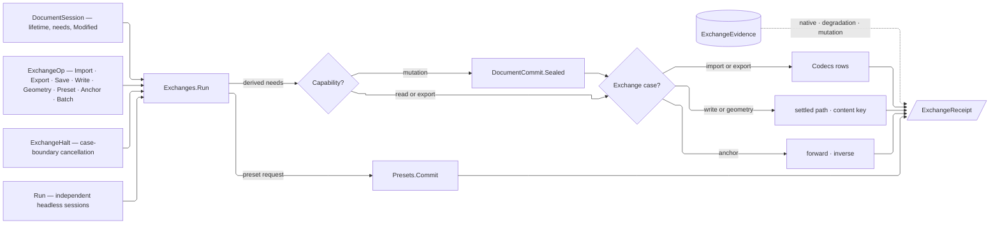

# [RASM_RHINO_OPERATIONS]

`Exchanges.Run` owns document-bound import, export, persistence, geolocation, preset composition, in-session programs, and cross-document conversion. `ExchangeBudget` parameterizes parallel headless work; `CodecRequest`, `Presets.Commit`, and `DocumentCommit.Sealed` remain the owning seam contracts.

## [01]-[INDEX]

- [02]-[LANE_AND_OUTPUT]: `ExchangeBudget` and `IoLane` the cross-document concurrency product; `CollisionRule`, `DirectoryRule`, and `OutputPolicy` the egress vocabulary and landing kernel.
- [03]-[PRESET_COMPOSITION]: `PresetOperation` and `Presets.Commit` — the Persistence owner composed by `ExchangeOp.PresetCase`.
- [04]-[GEOLOCATION]: `GeoPoint`, `EarthAnchor`, and `AnchorOp` — read, write, planes, and the model↔earth correspondence on one owner.
- [05]-[TRANSACTION_RAIL]: `ExchangeOp`, `ExchangeYield`, `ExchangeFact`/`ExchangeReceipt`, `BatchPolicy`/`ConversionPolicy` with the `ExchangeHalt` cancellation carrier, and `Exchanges` — one session-proved dispatch plus the cross-document conversion fan.

## [02]-[LANE_AND_OUTPUT]

- Owner: `ExchangeBudget` admits I/O degree and scheduler once. `IoLane` closes sequential and budgeted-parallel conversion. `CollisionRule`, `DirectoryRule`, and `OutputPolicy` settle and land every egress path under one declared collision, directory, staging, durability, and content-identity contract.
- Law: direct host writers settle against the filesystem at dispatch instant, while staged artifacts validate, flush, and hash before the collision row atomically moves them onto an admitted destination; both return the settled `DocumentPath` on the receipt, so no fallible work follows commit and the caller never re-derives the ordinal.
- Law: `Fail` and `AppendOrdinal` use no-clobber moves. `AppendOrdinal` retries its bounded candidate roster after a concurrent creator wins a seat and refuses on exhaustion with a typed fault; an unbounded rename loop is unrepresentable because the bound is a `Dimension` policy value.
- Law: `Land` is the sole staging kernel for every artifact this package writes itself — archive persistence and amendment, embedded-file extraction, fresh-archive geometry emission, and every publish delivery stage through it; a second temp-write-verify-move spelling beside it is the deleted form. Host writers that dispatch on the destination extension or mutate document identity (`RhinoDoc.Export`, `ExportSelected`, `Save`, `SaveAs`, the direct engines) write their settled path directly, because a `.partial` staging name forks the host's own format dispatch.
- Boundary: filesystem probes, durable flush, cleanup, and atomic move stay inside `CollisionRule`, `DirectoryRule`, and `OutputPolicy.Land`; their ordered statements are the platform-forced file-kernel exemption.

```csharp signature
// --- [RUNTIME_PRELUDE] ----------------------------------------------------------------------
using Rasm.Domain;
using Rasm.Numerics;
using Rasm.Rhino.Document;
using Rasm.Rhino.Persistence;
using Rhino.FileIO;
using Rhino.Render;
using System.Runtime.InteropServices;

namespace Rasm.Rhino.Exchange;

// --- [TYPES] --------------------------------------------------------------------------------
[ComplexValueObject]
[StructLayout(LayoutKind.Auto)]
public readonly partial struct ExchangeBudget {
    public Dimension IoDegree { get; }
    public System.Threading.Tasks.TaskScheduler Scheduler { get; }

    [BoundaryAdapter]
    static partial void ValidateFactoryArguments(
        ref ValidationError? validationError,
        ref Dimension ioDegree,
        ref System.Threading.Tasks.TaskScheduler scheduler) =>
        validationError = ioDegree.Value <= 0
            ? new ValidationError("Exchange I/O degree must be positive.")
            : scheduler is null
                ? new ValidationError("Exchange scheduler is required.")
                : null;

    public static Fin<ExchangeBudget> Of(
        Dimension ioDegree,
        System.Threading.Tasks.TaskScheduler scheduler,
        Op? key = null) {
        Op op = key.OrDefault();
        return Validate(ioDegree: ioDegree, scheduler: scheduler, item: out ExchangeBudget value) is null
            ? Fin.Succ(value: value)
            : Fin.Fail<ExchangeBudget>(error: op.InvalidInput());
    }
}

[Union(ConversionFromValue = ConversionOperatorsGeneration.None)]
public abstract partial record IoLane {
    private IoLane() { }
    public sealed record SequentialCase : IoLane;
    public sealed record ParallelCase(ExchangeBudget Budget) : IoLane;

    public static IoLane Sequential { get; } = new SequentialCase();
    public static IoLane Parallel(ExchangeBudget budget) => new ParallelCase(Budget: budget);

    internal bool Admitted => Switch(
        sequentialCase: static _ => true,
        parallelCase: static lane => lane.Budget.IoDegree.Value > 0 && lane.Budget.Scheduler is not null);
}

[SmartEnum<int>]
public sealed partial class CollisionRule {
    public static readonly CollisionRule Fail = new(
        key: 0,
        settle: static (path, _, op) => System.IO.File.Exists(path.Value)
            ? Fin.Fail<DocumentPath>(error: op.InvalidInput())
            : Fin.Succ(value: path),
        land: static (temporary, path, _, op) => Move(temporary, path, overwrite: false, op));
    public static readonly CollisionRule Replace = new(
        key: 1,
        settle: static (path, _, _) => Fin.Succ(value: path),
        land: static (temporary, path, _, op) => Move(temporary, path, overwrite: true, op));
    public static readonly CollisionRule AppendOrdinal = new(key: 2, settle: static (path, bound, op) => {
        if (!System.IO.File.Exists(path.Value)) {
            return Fin.Succ(value: path);
        }
        return Candidates(path, bound).Tail
            .Find(candidate => !System.IO.File.Exists(candidate.Value))
            .ToFin(Fail: op.InvalidResult(detail: $"collision bound {bound.Value} exhausted"));
    }, land: Append);

    [UseDelegateFromConstructor]
    internal partial Fin<DocumentPath> Settle(DocumentPath path, Dimension bound, Op key);

    [UseDelegateFromConstructor]
    internal partial Fin<DocumentPath> Land(string temporary, DocumentPath path, Dimension bound, Op key);

    private static Fin<DocumentPath> Move(string temporary, DocumentPath path, bool overwrite, Op op) => op.Catch(() => {
        System.IO.File.Move(sourceFileName: temporary, destFileName: path.Value, overwrite: overwrite);
        return Fin.Succ(value: path);
    });

    private static Fin<DocumentPath> Append(string temporary, DocumentPath path, Dimension bound, Op op) => op.Catch(() => {
        foreach (DocumentPath candidate in Candidates(path, bound)) {
            try {
                System.IO.File.Move(sourceFileName: temporary, destFileName: candidate.Value, overwrite: false);
                return Fin.Succ(value: candidate);
            } catch (System.IO.IOException) when (System.IO.File.Exists(candidate.Value)) { }
        }
        return Fin.Fail<DocumentPath>(error: op.InvalidResult(detail: $"collision bound {bound.Value} exhausted"));
    });

    private static Seq<DocumentPath> Candidates(DocumentPath path, Dimension bound) {
        string stem = System.IO.Path.Join(
            System.IO.Path.GetDirectoryName(path.Value) ?? string.Empty,
            System.IO.Path.GetFileNameWithoutExtension(path.Value));
        string extension = System.IO.Path.GetExtension(path.Value);
        return Seq(path) + toSeq(Range(1, bound.Value)).Map(ordinal => DocumentPath.Create(value: $"{stem}-{ordinal}{extension}"));
    }
}

[SmartEnum<int>]
public sealed partial class DirectoryRule {
    public static readonly DirectoryRule Existing = new(key: 0, ensure: static (folder, op) =>
        guard(System.IO.Directory.Exists(folder), op.InvalidInput()).ToFin());
    public static readonly DirectoryRule Create = new(key: 1, ensure: static (folder, op) =>
        op.Catch(() => {
            _ = System.IO.Directory.CreateDirectory(folder);
            return Fin.Succ(value: unit);
        }));

    [UseDelegateFromConstructor]
    internal partial Fin<Unit> Ensure(string folder, Op key);
}

// --- [MODELS] -------------------------------------------------------------------------------
public sealed record Landed<TStage>(DocumentPath Target, UInt128 ContentKey, TStage Stage);

[ComplexValueObject]
public sealed partial record OutputPolicy {
    public CollisionRule Collision { get; }
    public DirectoryRule Directory { get; }
    public Dimension OrdinalBound { get; }

    public static OutputPolicy Strict { get; } = Create(
        collision: CollisionRule.Fail,
        directory: DirectoryRule.Existing,
        ordinalBound: Dimension.Create(value: 64));

    public static OutputPolicy Landing { get; } = Create(
        collision: CollisionRule.AppendOrdinal,
        directory: DirectoryRule.Create,
        ordinalBound: Dimension.Create(value: 64));

    [BoundaryAdapter]
    static partial void ValidateFactoryArguments(
        ref ValidationError? validationError,
        ref CollisionRule collision,
        ref DirectoryRule directory,
        ref Dimension ordinalBound) =>
        validationError = collision is null || directory is null || ordinalBound.Value <= 0
            ? new ValidationError("Output policy requires a collision rule, directory rule, and positive ordinal bound.")
            : null;

    public static Fin<OutputPolicy> Of(
        CollisionRule collision,
        DirectoryRule directory,
        Dimension ordinalBound,
        Op? key = null) {
        Op op = key.OrDefault();
        return Validate(collision: collision, directory: directory, ordinalBound: ordinalBound, item: out OutputPolicy? policy) is null
            ? Optional(policy).ToFin(Fail: op.InvalidInput())
            : Fin.Fail<OutputPolicy>(error: op.InvalidInput());
    }

    internal Fin<DocumentPath> Resolve(DocumentPath target, Option<FileCodec> codec = default, Op? key = null) {
        Op op = key.OrDefault();
        DocumentPath requested = codec.Map(row => DocumentPath.Create(value: row.EnsureExtension(path: target.Value))).IfNone(target);
        return from _folder in Directory.Ensure(folder: System.IO.Path.GetDirectoryName(requested.Value) ?? string.Empty, key: op)
               from settled in Collision.Settle(
                   path: requested,
                   bound: OrdinalBound,
                   key: op)
               select settled;
    }

    internal Fin<Landed<TStage>> Land<TStage>(
        DocumentPath target,
        Option<FileCodec> codec,
        Func<string, Fin<TStage>> stage,
        Option<Func<byte[], Fin<Unit>>> validate = default,
        Op? key = null) {
        Op op = key.OrDefault();
        return Optional(stage).ToFin(Fail: op.InvalidInput()).Bind(writer => {
            DocumentPath requested = codec.Map(row => DocumentPath.Create(value: row.EnsureExtension(path: target.Value))).IfNone(target);
            string directory = System.IO.Path.GetDirectoryName(requested.Value) ?? string.Empty;
            return Directory.Ensure(folder: directory, key: op).Bind(_ => {
                string temporary = System.IO.Path.Join(
                    directory,
                    $".{System.IO.Path.GetFileName(requested.Value)}.{Guid.NewGuid():N}.partial");
                Fin<Landed<TStage>> outcome =
                    from staged in writer(arg: temporary)
                    from bytes in ReadNonempty(path: temporary, op: op)
                    from _staged in validate.Map(check => check(arg: bytes)).IfNone(Fin.Succ(value: unit))
                    from _durable in Flush(path: temporary, op: op)
                    let contentKey = ContentHash.Of(canonicalBytes: bytes)
                    from committed in Collision.Land(
                        temporary: temporary,
                        path: requested,
                        bound: OrdinalBound,
                        key: op)
                    select new Landed<TStage>(
                        Target: committed,
                        ContentKey: contentKey,
                        Stage: staged);
                return outcome.Match(
                    Succ: written => Fin.Succ(value: written),
                    Fail: primary => Cleanup(path: temporary, op: op).Match(
                        Succ: _ => Fin.Fail<Landed<TStage>>(error: primary),
                        Fail: cleanup => Fin.Fail<Landed<TStage>>(error: primary + cleanup)));
            });
        });
    }

    private static Fin<byte[]> ReadNonempty(string path, Op op) =>
        op.Catch(() => Fin.Succ(value: System.IO.File.ReadAllBytes(path: path)))
            .Bind(bytes => guard(bytes.Length > 0, op.InvalidResult()).ToFin().Map(_ => bytes));

    private static Fin<Unit> Flush(string path, Op op) => op.Catch(() => {
        using System.IO.FileStream stream = new(
            path: path,
            mode: System.IO.FileMode.Open,
            access: System.IO.FileAccess.ReadWrite,
            share: System.IO.FileShare.Read);
        stream.Flush(flushToDisk: true);
        return Fin.Succ(value: unit);
    });

    private static Fin<Unit> Cleanup(string path, Op op) => op.Catch(() => {
        if (System.IO.File.Exists(path: path)) {
            System.IO.File.Delete(path: path);
        }
        return Fin.Succ(value: unit);
    });
}
```

## [03]-[PRESET_COMPOSITION]

`PresetOperation` and `Presets.Commit` own construction planes, named positions, named layer states, roster counts, identity resolution, participating object ids, and stored transforms. `ExchangeOp.PresetCase` composes that owner without a second saved-state vocabulary or host-table interpreter.

`Exchanges.Run` routes a preset request before its exchange demand because `Presets.Commit` derives its own read, mutation, undo, and redraw needs. Batch execution re-enters `Run` per case, so preset and exchange programs share ordered failure and halt receipts without nesting document demands.

## [04]-[GEOLOCATION]

- Owner: `GeoPoint` and `EarthAnchor` are generated complex values. `GeoPoint.Of` accumulates coordinate gates; `EarthAnchor.Of` admits earth, model-frame, identity, and coordinate-system fields as one correlated product. `AnchorDemand` carries each host-location precondition as a policy row. `AnchorOp` closes read, write, plane with anchor north, compass, orientation with anchor north, model-to-earth, earth-to-model, and sun synchronization.
- Law: the host `EarthAnchorPoint` is disposable host material — every arm opens it inside a `using` window, projects detached values, and lets the window close; the anchor never rides a signature.
- Law: earth-required and model-required preconditions gate per arm through `EarthLocationIsSet`/`ModelLocationIsSet` — a projection over an unset anchor is a typed refusal, never a garbage transform.
- Boundary: the model-to-earth transform is unit-aware — `GetModelToEarthTransform(modelUnits:)` receives the document's live `LengthUnit`, read inside the same demand window that uses it, so a stale unit regime cannot skew the projection.

```csharp signature
// --- [MODELS] -------------------------------------------------------------------------------
[ComplexValueObject]
[StructLayout(LayoutKind.Auto)]
public readonly partial struct GeoPoint {
    public double Latitude { get; }
    public double Longitude { get; }
    public double Elevation { get; }

    [BoundaryAdapter]
    static partial void ValidateFactoryArguments(
        ref ValidationError? validationError,
        ref double latitude,
        ref double longitude,
        ref double elevation) =>
        validationError = !double.IsFinite(latitude) || latitude is < -90d or > 90d
            ? new ValidationError("Latitude must be finite and in [-90, 90].")
            : !double.IsFinite(longitude) || longitude is < -180d or > 180d
                ? new ValidationError("Longitude must be finite and in [-180, 180].")
                : !double.IsFinite(elevation)
                    ? new ValidationError("Elevation must be finite.")
                    : null;

    public static Fin<GeoPoint> Of(double latitude, double longitude, double elevation, Op? key = null) {
        Op op = key.OrDefault();
        return Validate(latitude: latitude, longitude: longitude, elevation: elevation, item: out GeoPoint value) is null
            ? Fin.Succ(value: value)
            : Fin.Fail<GeoPoint>(error: op.InvalidInput());
    }
}

[ComplexValueObject]
public sealed partial record EarthAnchor {
    public Option<GeoPoint> Basepoint { get; }
    public int ElevationCoordinateSystem { get; }
    public Option<Point3d> ModelBasePoint { get; }
    public Option<Vector3d> ModelNorth { get; }
    public Option<Vector3d> ModelEast { get; }
    public Option<string> Name { get; }
    public Option<string> Description { get; }

    [BoundaryAdapter]
    static partial void ValidateFactoryArguments(
        ref ValidationError? validationError,
        ref Option<GeoPoint> basepoint,
        ref int elevationCoordinateSystem,
        ref Option<Point3d> modelBasePoint,
        ref Option<Vector3d> modelNorth,
        ref Option<Vector3d> modelEast,
        ref Option<string> name,
        ref Option<string> description) {
        name = name.Map(static text => text.Trim()).Filter(static text => !string.IsNullOrWhiteSpace(value: text));
        description = description.Map(static text => text.Trim()).Filter(static text => !string.IsNullOrWhiteSpace(value: text));
        bool completeModel = modelBasePoint.IsSome && modelNorth.IsSome && modelEast.IsSome;
        bool absentModel = modelBasePoint.IsNone && modelNorth.IsNone && modelEast.IsNone;
        bool noncollinear = modelNorth
            .Bind(north => modelEast.Map(east => Vector3d.CrossProduct(north, east).Length > 0d))
            .IfNone(true);
        bool validFrame = modelBasePoint.ForAll(static point => point.IsValid)
            && modelNorth.ForAll(static vector => vector.IsValid && vector.Length > 0d)
            && modelEast.ForAll(static vector => vector.IsValid && vector.Length > 0d)
            && noncollinear;
        validationError = !completeModel && !absentModel
            ? new ValidationError("Model basepoint, north, and east must be supplied together.")
            : !validFrame
                ? new ValidationError("Model frame must contain finite non-collinear axes.")
                : null;
    }

    public static Fin<EarthAnchor> Of(
        Option<GeoPoint> basepoint,
        int elevationCoordinateSystem,
        Option<Point3d> modelBasePoint,
        Option<Vector3d> modelNorth,
        Option<Vector3d> modelEast,
        Option<string> name = default,
        Option<string> description = default,
        Op? key = null) {
        Op op = key.OrDefault();
        return Validate(
            basepoint: basepoint,
            elevationCoordinateSystem: elevationCoordinateSystem,
            modelBasePoint: modelBasePoint,
            modelNorth: modelNorth,
            modelEast: modelEast,
            name: name,
            description: description,
            item: out EarthAnchor? anchor) is null
            ? Optional(anchor).ToFin(Fail: op.InvalidInput())
            : Fin.Fail<EarthAnchor>(error: op.InvalidInput());
    }

    internal static Fin<EarthAnchor> From(EarthAnchorPoint anchor, Op op) =>
        (anchor.EarthLocationIsSet()
            ? GeoPoint.Of(
                latitude: anchor.EarthBasepointLatitude,
                longitude: anchor.EarthBasepointLongitude,
                elevation: anchor.EarthBasepointElevation,
                key: op).Map(Some)
            : Fin.Succ(Option<GeoPoint>.None)).Bind(basepoint => {
                bool modelSet = anchor.ModelLocationIsSet();
                return Of(
                    basepoint: basepoint,
                    elevationCoordinateSystem: anchor.EarthBasepointElevationCoordinateSystem,
                    modelBasePoint: modelSet ? Some(anchor.ModelBasePoint) : None,
                    modelNorth: modelSet ? Some(anchor.ModelNorth) : None,
                    modelEast: modelSet ? Some(anchor.ModelEast) : None,
                    name: Optional(anchor.Name),
                    description: Optional(anchor.Description),
                    key: op);
            });

    internal Fin<Unit> Write(RhinoDoc document, Op op) {
        return op.Catch(() => {
            using EarthAnchorPoint anchor = new();
            _ = Basepoint.Iter(point => {
                anchor.EarthBasepointLatitude = point.Latitude;
                anchor.EarthBasepointLongitude = point.Longitude;
                anchor.EarthBasepointElevation = point.Elevation;
            });
            anchor.EarthBasepointElevationCoordinateSystem = ElevationCoordinateSystem;
            _ = ModelBasePoint.Iter(value => anchor.ModelBasePoint = value);
            _ = ModelNorth.Iter(value => anchor.ModelNorth = value);
            _ = ModelEast.Iter(value => anchor.ModelEast = value);
            _ = Name.Iter(value => anchor.Name = value);
            _ = Description.Iter(value => anchor.Description = value);
            document.EarthAnchorPoint = anchor;
            return Fin.Succ(value: unit);
        });
    }
}

// --- [TYPES] --------------------------------------------------------------------------------
[SmartEnum<int>]
internal sealed partial class AnchorDemand {
    public static readonly AnchorDemand Any = new(key: 0, accepts: static _ => true);
    public static readonly AnchorDemand Model = new(key: 1, accepts: static anchor => anchor.ModelLocationIsSet());
    public static readonly AnchorDemand Located = new(key: 2,
        accepts: static anchor => anchor.EarthLocationIsSet() && anchor.ModelLocationIsSet());

    [UseDelegateFromConstructor]
    internal partial bool Accepts(EarthAnchorPoint anchor);
}

[Union(ConversionFromValue = ConversionOperatorsGeneration.None)]
public abstract partial record AnchorOp {
    private AnchorOp() { }
    public sealed record ReadCase : AnchorOp;
    public sealed record WriteCase(EarthAnchor Anchor) : AnchorOp;
    public sealed record PlaneCase : AnchorOp;
    public sealed record CompassCase : AnchorOp;
    public sealed record OrientCase(Plane Source) : AnchorOp;
    public sealed record ToEarthCase(Seq<Point3d> Points) : AnchorOp;
    public sealed record ToModelCase(Seq<GeoPoint> Points) : AnchorOp;
    public sealed record SunCase : AnchorOp;

    internal Fin<AnchorYield> Apply(RhinoDoc document, Op op) => Switch(
        (Document: document, Op: op),
        readCase: static (ctx, _) => Anchored(ctx.Document, ctx.Op, AnchorDemand.Any, use: static (anchor, _, op) =>
            EarthAnchor.From(anchor: anchor, op: op).Map(static value => (AnchorYield)new AnchorYield.AnchorCase(Anchor: value))),
        writeCase: static (ctx, edit) =>
            from anchor in Optional(edit.Anchor).ToFin(Fail: ctx.Op.InvalidInput())
            from _written in anchor.Write(document: ctx.Document, op: ctx.Op)
            select (AnchorYield)new AnchorYield.AnchorCase(Anchor: anchor),
        planeCase: static (ctx, _) => Anchored(ctx.Document, ctx.Op, AnchorDemand.Model, use: static (anchor, _, op) => {
            Plane plane = anchor.GetEarthAnchorPlane(anchorNorth: out Vector3d north);
            return op.AcceptValue(value: plane)
                .Map(admitted => (AnchorYield)new AnchorYield.PlaneCase(Plane: admitted, North: north));
        }),
        compassCase: static (ctx, _) => Anchored(ctx.Document, ctx.Op, AnchorDemand.Model, use: static (anchor, _, op) =>
            op.AcceptValue(value: anchor.GetModelCompass())
                .Map(static plane => (AnchorYield)new AnchorYield.CompassCase(Plane: plane))),
        orientCase: static (ctx, edit) => Anchored(ctx.Document, ctx.Op, AnchorDemand.Model, use: (anchor, _, op) => {
            Plane target = anchor.GetEarthAnchorPlane(anchorNorth: out Vector3d north);
            return (edit.Source.IsValid, target.IsValid) switch {
                (true, true) => Fin.Succ(value: (AnchorYield)new AnchorYield.TransformCase(
                    Value: Transform.PlaneToPlane(plane0: edit.Source, plane1: target), North: north)),
                _ => Fin.Fail<AnchorYield>(error: op.InvalidInput()),
            };
        }),
        toEarthCase: static (ctx, edit) => Anchored(ctx.Document, ctx.Op, AnchorDemand.Located, use: (anchor, document, op) => {
            Transform projection = anchor.GetModelToEarthTransform(modelUnits: document.ModelUnits);
            return guard(projection.IsValid, op.InvalidResult()).ToFin().Bind(_ =>
                edit.Points.TraverseM(point => {
                    Point3d projected = point;
                    projected.Transform(xform: projection);
                    return GeoPoint.Of(
                        latitude: projected.X,
                        longitude: projected.Y,
                        elevation: projected.Z,
                        key: op);
                }).As().Map(points => (AnchorYield)new AnchorYield.EarthCase(Points: points)));
        }),
        toModelCase: static (ctx, edit) => Anchored(ctx.Document, ctx.Op, AnchorDemand.Located, use: (anchor, document, op) => {
            Transform projection = anchor.GetModelToEarthTransform(modelUnits: document.ModelUnits);
            return guard(projection.TryGetInverse(inverseTransform: out Transform inverse), op.InvalidResult()).ToFin().Map(_ =>
                (AnchorYield)new AnchorYield.ModelCase(Points: edit.Points.Map(point => {
                    Point3d model = new(x: point.Latitude, y: point.Longitude, z: point.Elevation);
                    model.Transform(xform: inverse);
                    return model;
                })));
        }),
        sunCase: static (ctx, _) => Anchored(ctx.Document, ctx.Op, AnchorDemand.Located, use: static (anchor, document, op) =>
            op.Catch(() => {
                Sun sun = document.RenderSettings.Sun;
                Vector3d north = anchor.ModelNorth;
                sun.Latitude = anchor.EarthBasepointLatitude;
                sun.Longitude = anchor.EarthBasepointLongitude;
                sun.North = Math.Atan2(y: north.Y, x: north.X) * (180.0 / Math.PI);
                return Fin.Succ(value: (AnchorYield)new AnchorYield.SunCase());
            })));

    private static Fin<AnchorYield> Anchored(
        RhinoDoc document, Op op, AnchorDemand demand,
        Func<EarthAnchorPoint, RhinoDoc, Op, Fin<AnchorYield>> use) =>
        op.Catch(() => {
            using EarthAnchorPoint? anchor = document.EarthAnchorPoint;
            return Optional(anchor).ToFin(Fail: op.InvalidResult()).Bind(live =>
                demand.Accepts(anchor: live)
                    ? use(arg1: live, arg2: document, arg3: op)
                    : Fin.Fail<AnchorYield>(error: op.MissingContext()));
        });
}

[Union(ConversionFromValue = ConversionOperatorsGeneration.None)]
public abstract partial record AnchorYield {
    private AnchorYield() { }
    public sealed record AnchorCase(EarthAnchor Anchor) : AnchorYield;
    public sealed record PlaneCase(Plane Plane, Vector3d North) : AnchorYield;
    public sealed record CompassCase(Plane Plane) : AnchorYield;
    public sealed record TransformCase(Transform Value, Vector3d North) : AnchorYield;
    public sealed record EarthCase(Seq<GeoPoint> Points) : AnchorYield;
    public sealed record ModelCase(Seq<Point3d> Points) : AnchorYield;
    public sealed record SunCase : AnchorYield;
}
```

## [05]-[TRANSACTION_RAIL]

- Owner: `ExchangeOp` closes import, export, save, write, geometry, preset, anchor, and program requests. `ExchangeFact` closes imported source, artifact, save, preset, and anchor evidence by payload shape. `ExchangeStep`, `ExchangeProgram`, and `ExchangeReceipt` preserve ordered outcomes, halt state, mutation truth, and native evidence.
- Entry: `Exchanges.Run(DocumentSession, ExchangeOp, Op?, ExchangeHalt)` owns session-bound work. `Exchanges.Run(Seq<(SessionSource, ExchangeOp)>, ConversionPolicy, CancellationToken, Op?)` owns cross-document conversion and awaits `Parallel.ForEachAsync` under the caller-supplied `ExchangeBudget`.
- Law: `ExchangeOp.Profile` derives demand, mutation, and surface evidence in one generated dispatch; preset requests delegate execution to `Presets.Commit`, and batch requests re-enter `Run` per case so neither owner nests or weakens the other's capability proof.
- Law: `MutationTrace` enters immediately before preset commit or `DocumentCommit.Sealed`; failed steps report that observed entry instead of predicting mutation from request shape. Owned records roll back on failure, command-owned records propagate failure, and successful receipts alone receive committed mutation evidence.
- Law: cancellation is cooperative and case-bounded — `ExchangeHalt` composes every ambient and policy `CancellationToken`, `Run` refuses before snapshot acquisition, and each program fold observes the merged halt only between cases. `ExchangeProgram.Halted` is true only when cancellation prevented a case; a pre-dispatch halt has no mutation attempt and therefore earns no mutation evidence.
- Law: `BatchPolicy` owns continuation and cooperative halt. `ConversionPolicy` is the outer storage seam: it admits `IoLane` and rejects a zero-initialized parallel `ExchangeBudget` before any scheduler or degree reaches `ParallelOptions`; parallel conversion is collecting-only and never reads ambient processor count.
- Law: `SaveCase` consults `SessionSnapshot.Modified` — saving an unmodified document is a no-op receipt fact, never a redundant host write; the dirty fact comes from the session snapshot, not a host re-probe.
- Law: egress cases resolve their target through `OutputPolicy` exactly once and stamp the SETTLED path plus the artifact's `ContentHash.Of` content key on the receipt, so downstream indexing keys on evidence.
- Law: `GeometryCase` is a session-bound export that writes no live-document geometry — after the session proves export capability, a fresh `File3dm` receives the requested geometry rows and lands through `Archives.Land`, the archive rail's one `WriteWithLog`-hooked staging over `OutputPolicy.Land`, so the landed 3dm carries the same byte re-materialization parse proof every archive persistence carries; a failed write carries the native log in fault detail, and a successful non-empty log becomes `ExchangeEvidence.NativeCase` under the landed target.
- Law: `ExportScope` gates selection by `CodecAbility.Selection` and owns one noninteractive `FileWriteOptions` carrier. Native `3dm`, `OBJ`, and `PLY` engines receive that carrier through one `Codecs.Apply`; every other selection row is refused before host contact.
- Law: `BackupPolicy` closes no-backup, primary-backup, and complete auxiliary-backup behavior as rows on the existing document-write carrier; `FileWriteOptions.CreateBackupFiles` and `CreateOtherBackupFiles` receive those columns at the host edge.
- Boundary: `RhinoDoc.Open` and every headless constructor belong to the Document session sources; an exchange request that names a document to acquire is a session construction at the call site, and this rail's batch runs against the session it was handed. `Parallel.ForEachAsync`, cancellation catch, and `DocumentSession` disposal statements are the platform-forced `Task` and resource exemptions.

```csharp signature
// --- [TYPES] --------------------------------------------------------------------------------
[Union(ConversionFromValue = ConversionOperatorsGeneration.None)]
public abstract partial record ExchangeFact {
    private ExchangeFact() { }
    public sealed record ImportedCase(DocumentPath Source, FileCodec Codec) : ExchangeFact;
    public sealed record ArtifactCase(DocumentPath Target, FileCodec Codec, UInt128 ContentKey) : ExchangeFact;
    public sealed record SaveCase(bool Written) : ExchangeFact;
    public sealed record PresetCase(PresetAnswer Answer) : ExchangeFact;
    public sealed record AnchorCase(AnchorYield Yield) : ExchangeFact;
}

[Union(ConversionFromValue = ConversionOperatorsGeneration.None)]
public abstract partial record ExportScope {
    private ExportScope() { }
    public sealed record AllCase : ExportScope;
    public sealed record SelectionCase : ExportScope;

    internal Fin<FileWriteOptions> Carrier(FileCodec codec, Op op) {
        Fin<bool> selected = Switch(
            state: (Codec: codec, Op: op),
            allCase: static (_, _) => Fin.Succ(value: false),
            selectionCase: static (ctx, _) => guard(ctx.Codec.Has(CodecAbility.Selection), ctx.Op.InvalidInput()).ToFin().Map(_ => true));
        return selected.Map(value => new FileWriteOptions {
            WriteSelectedObjectsOnly = value,
            SuppressAllInput = true,
            SuppressDialogBoxes = true,
        });
    }
}

[SmartEnum]
public sealed partial class BackupPolicy {
    public static readonly BackupPolicy None = new(primary: false, auxiliary: false);
    public static readonly BackupPolicy Primary = new(primary: true, auxiliary: false);
    public static readonly BackupPolicy Complete = new(primary: true, auxiliary: true);

    public bool Primary { get; }
    public bool Auxiliary { get; }
}

[ComplexValueObject]
public sealed partial record DocumentContent {
    public bool GeometryOnly { get; }
    public bool UserData { get; }
    public bool RenderMeshes { get; }
    public bool PreviewImage { get; }
    public bool BitmapTable { get; }
    public bool History { get; }
    public BackupPolicy Backups { get; }
    public bool Compression { get; }
}

[ComplexValueObject]
public sealed partial record SaveAsContent {
    public bool GeometryOnly { get; }
    public bool Small { get; }
    public bool Textures { get; }
    public bool PluginData { get; }
    public bool Compression { get; }
}

[Union(ConversionFromValue = ConversionOperatorsGeneration.None)]
public abstract partial record DocumentWritePolicy {
    private DocumentWritePolicy() { }
    public sealed record SaveAsCase(Option<Dimension> Version, SaveAsContent Content) : DocumentWritePolicy;
    public sealed record DocumentCase(DocumentContent Content) : DocumentWritePolicy;
    public sealed record ArchiveCase(DocumentContent Content) : DocumentWritePolicy;
    public sealed record TemplateCase(Option<Dimension> Version = default) : DocumentWritePolicy;

    internal Fin<Unit> Write(RhinoDoc document, string path, Op op) => Switch(
        (Document: document, Path: path, Op: op),
        saveAsCase: static (ctx, policy) =>
            from content in Optional(policy.Content).ToFin(Fail: ctx.Op.InvalidInput())
            from saved in ctx.Op.Confirm(success: ctx.Document.SaveAs(
                file3dmPath: ctx.Path,
                version: policy.Version.Map(static value => value.Value).IfNone(0),
                saveSmall: content.Small,
                saveTextures: content.Textures,
                saveGeometryOnly: content.GeometryOnly,
                savePluginData: content.PluginData,
                useCompression: content.Compression))
            select saved,
        documentCase: static (ctx, policy) =>
            from content in Optional(policy.Content).ToFin(Fail: ctx.Op.InvalidInput())
            from backups in Optional(content.Backups).ToFin(Fail: ctx.Op.InvalidInput())
            from written in ctx.Op.Confirm(success: ctx.Document.WriteFile(
                path: ctx.Path,
                options: Host(content: content, backups: backups)))
            select written,
        archiveCase: static (ctx, policy) =>
            from content in Optional(policy.Content).ToFin(Fail: ctx.Op.InvalidInput())
            from backups in Optional(content.Backups).ToFin(Fail: ctx.Op.InvalidInput())
            from written in ctx.Op.Confirm(success: ctx.Document.Write3dmFile(
                path: ctx.Path,
                options: Host(content: content, backups: backups)))
            select written,
        templateCase: static (ctx, policy) => policy.Version.Match(
            Some: version => ctx.Op.Confirm(success: ctx.Document.SaveAsTemplate(file3dmTemplatePath: ctx.Path, version: version.Value)),
            None: () => ctx.Op.Confirm(success: ctx.Document.SaveAsTemplate(file3dmTemplatePath: ctx.Path))));

    private static FileWriteOptions Host(DocumentContent content, BackupPolicy backups) => new() {
        WriteGeometryOnly = content.GeometryOnly,
        WriteUserData = content.UserData,
        IncludeRenderMeshes = content.RenderMeshes,
        IncludePreviewImage = content.PreviewImage,
        IncludeBitmapTable = content.BitmapTable,
        IncludeHistory = content.History,
        CreateBackupFiles = backups.Primary,
        CreateOtherBackupFiles = backups.Auxiliary,
        UseCompression = content.Compression,
    };
}

[Union(ConversionFromValue = ConversionOperatorsGeneration.None)]
public abstract partial record ExchangeOp {
    private ExchangeOp() { }
    public sealed record ImportCase(DocumentPath Source, Option<FileCodec> Codec, CodecTune Tune) : ExchangeOp;
    public sealed record ExportCase(DocumentPath Target, ExportScope Scope, Option<FileCodec> Codec, CodecTune Tune, OutputPolicy Output) : ExchangeOp;
    public sealed record SaveCase : ExchangeOp;
    public sealed record WriteCase(DocumentPath Target, DocumentWritePolicy Policy, OutputPolicy Output) : ExchangeOp;
    public sealed record GeometryCase(Seq<GeometryBase> Geometry, DocumentPath Target, ArchiveWritePolicy Policy, OutputPolicy Output) : ExchangeOp;
    public sealed record PresetCase(PresetOperation Operation) : ExchangeOp;
    public sealed record AnchorCase(AnchorOp Edit) : ExchangeOp;
    public sealed record BatchCase(Seq<ExchangeOp> Program, BatchPolicy Policy) : ExchangeOp;

    internal ExchangeHalt Halt(ExchangeHalt ambient) =>
        this is BatchCase batch ? ambient.Merge(batch.Policy.Halt) : ambient;

    internal (Seq<SessionNeed> Needs, bool Mutates, string Surface) Profile => Switch<(Seq<SessionNeed>, bool, string)>(
        importCase: static _ => (SessionNeed.Mutation(undo: true, redraw: RedrawPolicy.None), true, nameof(ImportCase)),
        exportCase: static _ => (Seq(SessionNeed.Export), false, nameof(ExportCase)),
        saveCase: static _ => (Seq(SessionNeed.Export), false, nameof(SaveCase)),
        writeCase: static _ => (Seq(SessionNeed.Export), false, nameof(WriteCase)),
        geometryCase: static _ => (Seq(SessionNeed.Export), false, nameof(GeometryCase)),
        presetCase: static edit => edit.Operation.Mutation
            ? (Seq(SessionNeed.Read, SessionNeed.Mutate, SessionNeed.Undo, SessionNeed.Redraw), true, nameof(PresetCase))
            : (Seq(SessionNeed.Read), false, nameof(PresetCase)),
        anchorCase: static edit => edit.Edit is AnchorOp.WriteCase or AnchorOp.SunCase
            ? (SessionNeed.Mutation(undo: true, redraw: RedrawPolicy.None), true, nameof(AnchorCase))
            : (Seq(SessionNeed.Read), false, nameof(AnchorCase)),
        batchCase: static batch => BatchProfile(batch));

    private static (Seq<SessionNeed> Needs, bool Mutates, string Surface) BatchProfile(BatchCase batch) => (
        Needs: batch.Program.IsEmpty
            ? Seq(SessionNeed.Read)
            : batch.Program.Fold(Seq<SessionNeed>(), static (needs, inner) => needs + inner.Profile.Needs).Distinct(),
        Mutates: batch.Program.Exists(static inner => inner.Profile.Mutates),
        Surface: nameof(BatchCase));
}

// --- [MODELS] -------------------------------------------------------------------------------
public readonly record struct ExchangeHalt(Seq<System.Threading.CancellationToken> Tokens) {
    public static ExchangeHalt None { get; } = new(Tokens: Seq<System.Threading.CancellationToken>());
    public static ExchangeHalt Of(System.Threading.CancellationToken token) =>
        token.CanBeCanceled ? new ExchangeHalt(Tokens: Seq(token)) : None;
    public bool Requested => Tokens.Exists(static token => token.IsCancellationRequested);
    internal ExchangeHalt Merge(ExchangeHalt other) => new(Tokens: (Tokens + other.Tokens).Distinct());
}

public readonly record struct BatchPolicy(bool ContinueOnError, ExchangeHalt Halt = default) {
    public static BatchPolicy Halting { get; } = new(ContinueOnError: false);
    public static BatchPolicy Collecting { get; } = new(ContinueOnError: true);
}

[ComplexValueObject]
public sealed partial record ConversionPolicy {
    public BatchPolicy Batch { get; }
    public IoLane Lane { get; }

    [BoundaryAdapter]
    static partial void ValidateFactoryArguments(
        ref ValidationError? validationError,
        ref BatchPolicy batch,
        ref IoLane lane) =>
        validationError = lane is null || !lane.Admitted
            ? new ValidationError("Conversion lane is required, and parallel lanes require an admitted budget.")
            : null;

    public static Fin<ConversionPolicy> Of(BatchPolicy batch, IoLane lane, Op? key = null) {
        Op op = key.OrDefault();
        return op.AcceptValidated(Validate(batch, lane, out ConversionPolicy? policy), policy);
    }
}

[Union(ConversionFromValue = ConversionOperatorsGeneration.None)]
public abstract partial record ExchangeYield {
    private ExchangeYield() { }
    public sealed record MergedCase(DocumentPath Source, FileCodec Codec) : ExchangeYield;
    public sealed record ArtifactCase(DocumentPath Target, FileCodec Codec, UInt128 ContentKey) : ExchangeYield;
    public sealed record SavedCase(bool Dirty) : ExchangeYield;
    public sealed record PresetOutcomeCase(PresetAnswer Answer) : ExchangeYield;
    public sealed record AnchorOutcomeCase(AnchorYield Yield) : ExchangeYield;
    public sealed record ProgramCase(ExchangeProgram Program) : ExchangeYield;
}

[Union(ConversionFromValue = ConversionOperatorsGeneration.None)]
public abstract partial record ExchangeStep {
    private ExchangeStep() { }
    public sealed record SucceededCase(int Index, bool MutationAttempted, ExchangeReceipt Receipt) : ExchangeStep;
    public sealed record FailedCase(int Index, bool MutationAttempted, Error Failure) : ExchangeStep;

    private (bool AttemptedMutation, bool Failed, bool Halted, Seq<ExchangeFact> Facts, Seq<ExchangeEvidence> Evidence) Profile => Switch(
        succeededCase: static step => (
            AttemptedMutation: step.MutationAttempted,
            Failed: step.Receipt.Yield is ExchangeYield.ProgramCase { Program.Failed: true },
            Halted: step.Receipt.Yield is ExchangeYield.ProgramCase { Program.Halted: true },
            Facts: step.Receipt.Facts,
            Evidence: step.Receipt.Evidence),
        failedCase: static step => (
            AttemptedMutation: step.MutationAttempted,
            Failed: true,
            Halted: false,
            Facts: Seq<ExchangeFact>(),
            Evidence: Seq<ExchangeEvidence>()));

    internal bool AttemptedMutation => Profile.AttemptedMutation;
    internal bool Failed => Profile.Failed;
    internal bool Halted => Profile.Halted;
    internal Seq<ExchangeFact> Facts => Profile.Facts;
    internal Seq<ExchangeEvidence> Evidence => Profile.Evidence;
}

public sealed record ExchangeProgram {
    private readonly Seq<ExchangeEvidence> ownEvidence;
    private readonly bool ownHalted;

    private ExchangeProgram(Seq<ExchangeStep> steps, bool halted, Seq<ExchangeEvidence> evidence) =>
        (Steps, ownHalted, ownEvidence) = (steps, halted, evidence);

    public Seq<ExchangeStep> Steps { get; }
    public bool Halted => ownHalted || Steps.Exists(static step => step.Halted);
    public bool MutationAttempted => Steps.Exists(static step => step.AttemptedMutation);
    public bool Failed => Steps.Exists(static step => step.Failed);
    public Seq<ExchangeFact> Facts => Steps.Bind(static step => step.Facts);
    public Seq<ExchangeEvidence> Evidence => Steps.Bind(static step => step.Evidence) + ownEvidence;

    internal static ExchangeProgram Of(Seq<ExchangeStep> steps, bool halted) =>
        new(steps: steps, halted: halted, evidence: Seq<ExchangeEvidence>());
    internal ExchangeProgram Add(ExchangeEvidence evidence) =>
        new(steps: Steps, halted: Halted, evidence: ownEvidence.Add(evidence));
}

public sealed record ExchangeReceipt : IDetachedDocumentResult {
    private ExchangeReceipt(ExchangeYield yield, Seq<ExchangeFact> facts, Seq<ExchangeEvidence> evidence) =>
        (Yield, Facts, Evidence) = (yield, facts, evidence);

    public ExchangeYield Yield { get; }
    public Seq<ExchangeFact> Facts { get; }
    public Seq<ExchangeEvidence> Evidence { get; }

    internal static ExchangeReceipt One(ExchangeYield yield, ExchangeFact fact) =>
        new(yield: yield, facts: Seq(fact), evidence: Seq<ExchangeEvidence>());
    internal static ExchangeReceipt Of(ExchangeYield yield, Seq<ExchangeFact> facts, Seq<ExchangeEvidence> evidence = default) =>
        new(yield: yield, facts: facts, evidence: evidence);
    internal static ExchangeReceipt Program(Seq<ExchangeStep> steps, bool halted) {
        ExchangeProgram program = ExchangeProgram.Of(steps: steps, halted: halted);
        return From(program);
    }

    internal ExchangeReceipt Add(ExchangeEvidence evidence) => Yield switch {
        ExchangeYield.ProgramCase program => From(program.Program.Add(evidence)),
        _ => new(yield: Yield, facts: Facts, evidence: Evidence.Add(evidence)),
    };

    private static ExchangeReceipt From(ExchangeProgram program) =>
        new(yield: new ExchangeYield.ProgramCase(Program: program), facts: program.Facts, evidence: program.Evidence);
}

// --- [OPERATIONS] ---------------------------------------------------------------------------
public static class Exchanges {
    public static Fin<ExchangeReceipt> Run(DocumentSession session, ExchangeOp request, Op? key = null, ExchangeHalt halt = default) {
        Op op = key.OrDefault();
        return Apply(session: session, request: request, op: op, halt: halt, trace: new MutationTrace());
    }

    private static Fin<ExchangeReceipt> Apply(
        DocumentSession session,
        ExchangeOp request,
        Op op,
        ExchangeHalt halt,
        MutationTrace trace) {
        return from admitted in Optional(request).ToFin(Fail: op.InvalidInput())
               let effective = admitted.Halt(ambient: halt)
               from receipt in effective.Requested
                   ? Fin.Succ(value: ExchangeReceipt.Program(steps: Seq<ExchangeStep>(), halted: true))
                   : admitted switch {
                       ExchangeOp.PresetCase preset => Optional(preset.Operation)
                           .ToFin(Fail: op.InvalidInput())
                           .Bind(operation =>
                               from _attempt in trace.Enter(enabled: admitted.Profile.Mutates)
                               from answer in Presets.Commit(
                                   session: session,
                                   operation: operation,
                                   key: op)
                               select answer)
                           .Map(answer => ExchangeReceipt.One(
                               yield: new ExchangeYield.PresetOutcomeCase(Answer: answer),
                               fact: new ExchangeFact.PresetCase(Answer: answer))),
                       ExchangeOp.BatchCase batch => Fin.Succ(value: Program(
                           rows: batch.Program,
                           halt: effective,
                           continueOnError: batch.Policy.ContinueOnError,
                           one: (inner, index) => Step(
                               index: index,
                               run: innerTrace => Apply(
                                   session: session,
                                   request: inner,
                                   op: op,
                                   halt: effective,
                                   trace: innerTrace)))),
                       _ => from snapshot in session.Snapshot(key: op)
                            from demanded in session.Demand(
                                use: document => Recorded(
                                    document: document,
                                    request: admitted,
                                    dirty: snapshot.Modified,
                                    halt: effective,
                                    op: op,
                                    trace: trace),
                                key: op,
                                needs: [.. admitted.Profile.Needs])
                            select demanded,
                   }
               select receipt;
    }

    public static async System.Threading.Tasks.Task<Fin<ExchangeReceipt>> Run(
        Seq<(SessionSource Source, ExchangeOp Request)> rows,
        ConversionPolicy policy,
        System.Threading.CancellationToken cancellationToken = default,
        Op? key = null) {
        Op op = key.OrDefault();
        return await Optional(policy).ToFin(Fail: op.InvalidInput()).Match(
            Succ: async admitted => {
                ExchangeHalt effectiveHalt = admitted.Batch.Halt.Merge(ExchangeHalt.Of(token: cancellationToken));
                Func<(SessionSource Source, ExchangeOp Request), int, ExchangeStep> one = (row, index) => Step(
                    index: index,
                    run: trace => op.Catch(() =>
                        from session in DocumentSession.Of(source: row.Source, mode: SessionMode.Headless, needs: [.. row.Request.Profile.Needs])
                        from receipt in Use(session: session, request: row.Request, halt: effectiveHalt, op: op, trace: trace)
                        select receipt));
                if (admitted.Lane is not IoLane.ParallelCase parallel || !admitted.Batch.ContinueOnError) {
                    return Fin.Succ(value: Program(
                        rows: rows,
                        halt: effectiveHalt,
                        continueOnError: admitted.Batch.ContinueOnError,
                        one: one));
                }
                System.Collections.Concurrent.ConcurrentDictionary<int, ExchangeStep> completed = [];
                System.Threading.Tasks.ParallelOptions options = new() {
                    MaxDegreeOfParallelism = parallel.Budget.IoDegree.Value,
                    TaskScheduler = parallel.Budget.Scheduler,
                    CancellationToken = cancellationToken,
                };
                try {
                    await System.Threading.Tasks.Parallel.ForEachAsync(
                        rows.Map(static (row, index) => (Row: row, Index: index)).AsIterable(),
                        options,
                        (item, token) => {
                            if (!token.IsCancellationRequested && !effectiveHalt.Requested) {
                                completed[item.Index] = one(item.Row, item.Index);
                            }
                            return System.Threading.Tasks.ValueTask.CompletedTask;
                        });
                } catch (OperationCanceledException) when (cancellationToken.IsCancellationRequested) { }
                Seq<ExchangeStep> ordered = toSeq(completed.OrderBy(static entry => entry.Key).Select(static entry => entry.Value));
                return Fin.Succ(value: ExchangeReceipt.Program(
                    steps: ordered,
                    halted: ordered.Count < rows.Count));
            },
            Fail: failure => System.Threading.Tasks.Task.FromResult(Fin.Fail<ExchangeReceipt>(error: failure)));
    }

    private static Fin<ExchangeReceipt> Use(
        DocumentSession session,
        ExchangeOp request,
        ExchangeHalt halt,
        Op op,
        MutationTrace trace) {
        using (session) {
            return Apply(session: session, request: request, op: op, halt: halt, trace: trace);
        }
    }

    private static Fin<ExchangeReceipt> Recorded(
        RhinoDoc document,
        ExchangeOp request,
        bool dirty,
        ExchangeHalt halt,
        Op op,
        MutationTrace trace) {
        if (halt.Requested) {
            return Fin.Succ(value: ExchangeReceipt.Program(steps: Seq<ExchangeStep>(), halted: true));
        }
        if (!request.Profile.Mutates) {
            return Dispatch(document: document, request: request, dirty: dirty, halt: halt, op: op);
        }
        return from _attempt in trace.Enter(enabled: true)
               from receipt in DocumentCommit.Sealed(
                   document: document,
                   name: request.Profile.Surface,
                   recordsUndo: true,
                   redraw: RedrawPolicy.None,
                   run: () => Dispatch(document: document, request: request, dirty: dirty, halt: halt, op: op),
                   stamp: (value, serial) => value.Add(new ExchangeEvidence.MutationCase(
                       Surface: request.Profile.Surface,
                       Attempted: true,
                       Committed: true,
                       MayRemain: false,
                       UndoRecord: serial > 0u ? Some(serial) : None)),
                   op: op)
               select receipt;
    }

    private sealed record ProgramFold(Seq<ExchangeStep> RevSteps, bool Stopped, bool Halted);

    private static ExchangeReceipt Program<T>(Seq<T> rows, ExchangeHalt halt, bool continueOnError, Func<T, int, ExchangeStep> one) {
        ProgramFold folded = rows.Map(static (row, index) => (Row: row, Index: index)).Fold(
            new ProgramFold(RevSteps: Seq<ExchangeStep>(), Stopped: false, Halted: false),
            (state, item) => {
                if (state.Stopped) {
                    return state;
                }
                if (halt.Requested) {
                    return state with { Stopped = true, Halted = true };
                }
                ExchangeStep step = one(item.Row, item.Index);
                return new ProgramFold(
                    RevSteps: step.Cons(state.RevSteps),
                    Stopped: step.Halted || (!continueOnError && step.Failed),
                    Halted: step.Halted);
            });
        return ExchangeReceipt.Program(steps: folded.RevSteps.Rev(), halted: folded.Halted);
    }

    private static ExchangeStep Step(int index, Func<MutationTrace, Fin<ExchangeReceipt>> run) {
        MutationTrace trace = new();
        return run(trace).Match<ExchangeStep>(
            Succ: receipt => new ExchangeStep.SucceededCase(
                Index: index,
                MutationAttempted: trace.Attempted
                    || receipt.Yield is ExchangeYield.ProgramCase { Program.MutationAttempted: true },
                Receipt: receipt),
            Fail: failure => new ExchangeStep.FailedCase(
                Index: index,
                MutationAttempted: trace.Attempted,
                Failure: failure));
    }

    private sealed class MutationTrace {
        private readonly Atom<bool> attempted = Atom(false);

        internal bool Attempted => attempted.Value;

        internal Fin<Unit> Enter(bool enabled) => enabled
            ? Fin.Succ(value: ignore(attempted.Swap(static _ => true)))
            : Fin.Succ(value: unit);
    }

    private static Fin<FileCodec> Settled(Option<FileCodec> codec, DocumentPath path, Op op) =>
        codec.Map(static row => Fin.Succ(value: row))
            .IfNone(() => Codecs.Detect(path: path.Value).ToFin(Fail: op.InvalidInput()));

    private static Fin<UInt128> Keyed(string path, Op op) =>
        op.Catch(() => Fin.Succ(value: ContentHash.Of(canonicalBytes: System.IO.File.ReadAllBytes(path: path))));

    private static Fin<ExchangeReceipt> Dispatch(RhinoDoc document, ExchangeOp request, bool dirty, ExchangeHalt halt, Op op) =>
        request.Switch(
            (Document: document, Dirty: dirty, Halt: halt, Op: op),
            importCase: static (ctx, edit) =>
                from tune in Optional(edit.Tune).ToFin(Fail: ctx.Op.InvalidInput())
                from codec in Settled(codec: edit.Codec, path: edit.Source, op: ctx.Op)
                from _read in Codecs.Apply(
                    document: ctx.Document,
                    path: edit.Source,
                    codec: codec,
                    tune: tune,
                    request: new CodecRequest.ImportCase(Carrier: new FileReadOptions { ImportMode = true }),
                    key: ctx.Op)
                select ExchangeReceipt.One(
                    yield: new ExchangeYield.MergedCase(Source: edit.Source, Codec: codec),
                    fact: new ExchangeFact.ImportedCase(Source: edit.Source, Codec: codec)),
            exportCase: static (ctx, edit) =>
                from scope in Optional(edit.Scope).ToFin(Fail: ctx.Op.InvalidInput())
                from tune in Optional(edit.Tune).ToFin(Fail: ctx.Op.InvalidInput())
                from output in Optional(edit.Output).ToFin(Fail: ctx.Op.InvalidInput())
                from codec in Settled(codec: edit.Codec, path: edit.Target, op: ctx.Op)
                from settled in output.Resolve(target: edit.Target, codec: codec, key: ctx.Op)
                from carrier in scope.Carrier(codec: codec, op: ctx.Op)
                from _written in Codecs.Apply(
                    document: ctx.Document,
                    path: settled,
                    codec: codec,
                    tune: tune,
                    request: new CodecRequest.ExportCase(Carrier: carrier),
                    key: ctx.Op)
                from keyed in Keyed(path: settled.Value, op: ctx.Op)
                select ExchangeReceipt.Of(
                    yield: new ExchangeYield.ArtifactCase(Target: settled, Codec: codec, ContentKey: keyed),
                    facts: Seq<ExchangeFact>(new ExchangeFact.ArtifactCase(Target: settled, Codec: codec, ContentKey: keyed)),
                    evidence: Seq<ExchangeEvidence>()),
            saveCase: static (ctx, _) =>
                ctx.Dirty
                    ? ctx.Op.Confirm(success: ctx.Document.Save()).Map(_ => ExchangeReceipt.One(
                        yield: new ExchangeYield.SavedCase(Dirty: true),
                        fact: new ExchangeFact.SaveCase(Written: true)))
                    : Fin.Succ(value: ExchangeReceipt.One(
                        yield: new ExchangeYield.SavedCase(Dirty: false),
                        fact: new ExchangeFact.SaveCase(Written: false))),
            writeCase: static (ctx, edit) =>
                from output in Optional(edit.Output).ToFin(Fail: ctx.Op.InvalidInput())
                from settled in output.Resolve(target: edit.Target, codec: FileCodec.ThreeDm, key: ctx.Op)
                from policy in Optional(edit.Policy).ToFin(Fail: ctx.Op.InvalidInput())
                from _written in policy.Write(document: ctx.Document, path: settled.Value, op: ctx.Op)
                from keyed in Keyed(path: settled.Value, op: ctx.Op)
                select ExchangeReceipt.One(
                    yield: new ExchangeYield.ArtifactCase(Target: settled, Codec: FileCodec.ThreeDm, ContentKey: keyed),
                    fact: new ExchangeFact.ArtifactCase(Target: settled, Codec: FileCodec.ThreeDm, ContentKey: keyed)),
            geometryCase: static (ctx, edit) =>
                from _rows in guard(!edit.Geometry.IsEmpty, ctx.Op.InvalidInput()).ToFin()
                from policy in Optional(edit.Policy).ToFin(Fail: ctx.Op.InvalidInput())
                from output in Optional(edit.Output).ToFin(Fail: ctx.Op.InvalidInput())
                from landed in ctx.Op.Catch(() => {
                    using File3dm archive = new();
                    Seq<Guid> added = edit.Geometry.Map(row => archive.Objects.Add(item: row, attributes: new ObjectAttributes())).Strict();
                    return guard(added.ForAll(static id => id != Guid.Empty), ctx.Op.InvalidResult()).ToFin().Bind(_ =>
                        Archives.Land(archive: archive, target: edit.Target, policy: policy, output: output, op: ctx.Op));
                })
                select ExchangeReceipt.Of(
                    yield: new ExchangeYield.ArtifactCase(Target: landed.Target, Codec: FileCodec.ThreeDm, ContentKey: landed.ContentKey),
                    facts: Seq<ExchangeFact>(new ExchangeFact.ArtifactCase(
                        Target: landed.Target,
                        Codec: FileCodec.ThreeDm,
                        ContentKey: landed.ContentKey)),
                    evidence: landed.Stage.Map(text => (ExchangeEvidence)new ExchangeEvidence.NativeCase(
                        Surface: nameof(File3dm.WriteWithLog),
                        Succeeded: true,
                        Detail: text,
                        Target: Some(landed.Target))).ToSeq()),
            presetCase: static (ctx, _) => Fin.Fail<ExchangeReceipt>(error: ctx.Op.InvalidInput()),
            anchorCase: static (ctx, edit) =>
                Optional(edit.Edit).ToFin(Fail: ctx.Op.InvalidInput())
                    .Bind(request => request.Apply(document: ctx.Document, op: ctx.Op))
                    .Map(yield => ExchangeReceipt.One(
                        yield: new ExchangeYield.AnchorOutcomeCase(Yield: yield),
                        fact: new ExchangeFact.AnchorCase(Yield: yield))),
            batchCase: static (ctx, _) => Fin.Fail<ExchangeReceipt>(error: ctx.Op.InvalidInput()));
}
```



## [06]-[RESEARCH]

<!-- source-only: research row template:
[TOKEN]-[OPEN|BLOCKED]: <exact question>; <verification route>.
[SPLIT_MEMBER]-[OPEN]: does `shape-core` expose `split_all`; verify against the member rail.
-->

(none)
