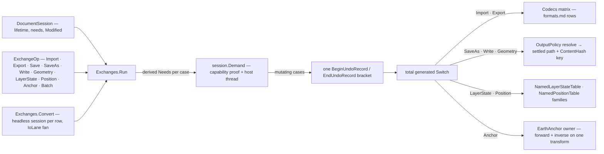

# [RASM_RHINO_OPERATIONS]

The host exchange transaction rail (`Rasm.Rhino.Exchange`). ONE request union carries every document-bound exchange — merge import, scoped export, save, save-as, template and archive writes, geometry-only archive emission, the full named-layer-state and named-position families, the earth-anchor geolocation family with its forward and inverse projections, and the batch — executed by ONE `Exchanges.Run` entry that proves session capability per case, brackets every mutation in one host undo record, resolves output collisions through declared policy rows, and returns one typed fact stream. Document acquisition is not an exchange operation: live, headless, template, and archive-opened documents enter through the Document session sources, so the census `FileOp.Do` beside `Prompt`/`Headless`/`PublishPlan`/`ArchiveBytes`/`Sheets`/`NamedLayerStates`/`NamedPositions`/`Batch` parallel entrypoints, the separate `FileNativeTable` union, the `HeadlessExchange` scope family, the consumer-visible live-versus-headless `FileRuntime` orchestration, the Exchange-owned file prompt, and `RhinoApp.RunScript` are all dead — prompts are the host-UI inquiry surface returning plain paths, and script snapshots have no seat on a typed rail. The scheduler survives here as `IoLane`: sequential within one document always, parallel only across independent headless conversions.

## [01]-[INDEX]

- [02]-[LANE_AND_OUTPUT]: `IoLane` the cross-document concurrency rows, `CollisionRule`/`DirectoryRule` the output vocabulary, `OutputPolicy` the one egress-path resolver.
- [03]-[NAMED_TABLES]: `LayerStateOp` and `PositionOp` — the saved-state transaction families over `NamedLayerStateTable` and `NamedPositionTable`.
- [04]-[GEOLOCATION]: `GeoPoint`, `EarthAnchor`, and `AnchorOp` — read, write, planes, and the model↔earth correspondence on one owner.
- [05]-[TRANSACTION_RAIL]: `ExchangeOp`, `ExchangeYield`, `ExchangeFact`/`ExchangeReceipt`, `BatchPolicy`, and `Exchanges` — one session-proved dispatch plus the cross-document conversion fan.

## [02]-[LANE_AND_OUTPUT]

- Owner: `IoLane` `[Union]` — `SequentialCase` and `ParallelCase(Option<Dimension>)`; the lane is a property of a MULTI-document program, because one `RhinoDoc` admits one mutation stream and the session already serializes demands. `CollisionRule` `[SmartEnum<int>]` — `Fail`, `Replace`, `AppendOrdinal` — each row carrying its settle delegate, so collision behavior is a row fact resolved before any host write. `DirectoryRule` `[SmartEnum<int>]` — `Existing` refuses a missing parent, `Create` mints it. `OutputPolicy` — the one egress-path resolver composing both rows plus the codec extension guarantee; every writing case resolves its target through it exactly once.
- Law: collision settling happens against the filesystem at dispatch instant and returns the SETTLED path on the receipt — the caller learns the real artifact location from evidence, never by re-deriving the ordinal.
- Law: `AppendOrdinal` probes bounded ordinals and refuses on exhaustion with a typed fault; an unbounded rename loop is unrepresentable because the bound is a `Dimension` policy value.

```csharp
// --- [RUNTIME_PRELUDE] ----------------------------------------------------------------------
using Rasm.Domain;
using Rasm.Numerics;
using Rasm.Rhino.Document;
using Rhino.FileIO;
using Rhino.Render;

namespace Rasm.Rhino.Exchange;

// --- [TYPES] --------------------------------------------------------------------------------
[Union(ConversionFromValue = ConversionOperatorsGeneration.None)]
public abstract partial record IoLane {
    private IoLane() { }
    public sealed record SequentialCase : IoLane;
    public sealed record ParallelCase(Option<Dimension> Degree) : IoLane;

    public static IoLane Sequential { get; } = new SequentialCase();
    public static IoLane Parallel(Option<Dimension> degree = default) => new ParallelCase(Degree: degree);
}

[SmartEnum<int>]
public sealed partial class CollisionRule {
    public static readonly CollisionRule Fail = new(key: 0, settle: static (path, bound, op) =>
        System.IO.File.Exists(path) ? Fin.Fail<string>(error: op.InvalidInput()) : Fin.Succ(value: path));
    public static readonly CollisionRule Replace = new(key: 1, settle: static (path, bound, op) => Fin.Succ(value: path));
    public static readonly CollisionRule AppendOrdinal = new(key: 2, settle: static (path, bound, op) => {
        if (!System.IO.File.Exists(path)) {
            return Fin.Succ(value: path);
        }
        string stem = System.IO.Path.Join(System.IO.Path.GetDirectoryName(path) ?? string.Empty, System.IO.Path.GetFileNameWithoutExtension(path));
        string extension = System.IO.Path.GetExtension(path);
        return toSeq(Range(1, bound.Value))
            .Map(ordinal => $"{stem}-{ordinal}{extension}")
            .Find(candidate => !System.IO.File.Exists(candidate))
            .ToFin(Fail: op.InvalidResult(detail: $"collision bound {bound.Value} exhausted"));
    });

    [UseDelegateFromConstructor]
    internal partial Fin<string> Settle(string path, Dimension bound, Op key);
}

[SmartEnum<int>]
public sealed partial class DirectoryRule {
    public static readonly DirectoryRule Existing = new(key: 0, ensure: static (folder, op) =>
        guard(System.IO.Directory.Exists(folder), op.InvalidInput()).ToFin());
    public static readonly DirectoryRule Create = new(key: 1, ensure: static (folder, op) =>
        op.Catch(() => {
            _ = System.IO.Directory.CreateDirectory(folder);
            return Fin.Succ(value: unit);
        }));

    [UseDelegateFromConstructor]
    internal partial Fin<Unit> Ensure(string folder, Op key);
}

// --- [MODELS] -------------------------------------------------------------------------------
public sealed record OutputPolicy(CollisionRule Collision, DirectoryRule Directory, Dimension OrdinalBound) {
    public static OutputPolicy Strict { get; } = new(
        Collision: CollisionRule.Fail, Directory: DirectoryRule.Existing, OrdinalBound: Dimension.Create(value: 64));

    public static OutputPolicy Landing { get; } = Strict with { Collision = CollisionRule.AppendOrdinal, Directory = DirectoryRule.Create };

    internal Fin<DocumentPath> Resolve(DocumentPath target, FileCodec codec, Op key) =>
        from _folder in Directory.Ensure(folder: System.IO.Path.GetDirectoryName(target.Value) ?? string.Empty, key: key)
        from settled in Collision.Settle(path: codec.EnsureExtension(path: target.Value), bound: OrdinalBound, key: key)
        from admitted in key.Catch(() => Fin.Succ(value: DocumentPath.Create(value: settled)))
        select admitted;
}
```

## [03]-[NAMED_TABLES]

- Owner: `LayerStateOp` `[Union]` — the saved-layer-state family: `SaveCase(name, viewport?)`, `RestoreCase(name, RestoreLayerProperties, viewport?)`, `RenameCase`, `DeleteCase`, `AdoptCase(DocumentPath)` importing states from an archive, and `CensusCase` enumerating the roster. `PositionOp` `[Union]` — the saved-position family: `SaveCase(name, ids)`, `RestoreCase`, `UpdateCase`, `DeleteCase`, `RenameCase`, `AppendCase(name, ids)`, `CensusCase`. Each family dispatches once inside the rail; the census `FileNativePositionKind` row set collapses into cases because restore, update, and delete differ by payload absence, not by a second vocabulary.
- Law: `RestoreLayerProperties` is the host's own restore-scope carrier and rides the case payload as boundary material — a local mirror of its flag set restates host truth and is the deleted form.
- Law: both `SaveCase` and `AppendCase` receive already-resolved object ids — the interaction unit owns selection and picking; this rail never queries or mutates selection state to serve a position save.
- Growth: a new host verb on either table is one case with its dispatch arm; the yield union and the receipt slot vocabulary absorb it as one row each.

```csharp
// --- [TYPES] --------------------------------------------------------------------------------
[Union(ConversionFromValue = ConversionOperatorsGeneration.None)]
public abstract partial record LayerStateOp {
    private LayerStateOp() { }
    public sealed record SaveCase(string Name, Option<Guid> Viewport) : LayerStateOp;
    public sealed record RestoreCase(string Name, RestoreLayerProperties Properties, Option<Guid> Viewport) : LayerStateOp;
    public sealed record RenameCase(string Name, string Next) : LayerStateOp;
    public sealed record DeleteCase(string Name) : LayerStateOp;
    public sealed record AdoptCase(DocumentPath Source) : LayerStateOp;
    public sealed record CensusCase : LayerStateOp;

    internal Fin<ExchangeFact> Apply(RhinoDoc document, Op op) => Switch(
        state: (Document: document, Op: op),
        saveCase: static (ctx, edit) =>
            from name in ctx.Op.AcceptText(value: edit.Name)
            from _saved in ctx.Op.Confirm(success: ctx.Document.NamedLayerStates.Save(name: name, viewportId: edit.Viewport.IfNone(Guid.Empty)) >= 0)
            select new ExchangeFact(Slot: ExchangeSlot.LayerState, Name: name, Id: None),
        restoreCase: static (ctx, edit) =>
            from name in ctx.Op.AcceptText(value: edit.Name)
            from _restored in ctx.Op.Confirm(success: ctx.Document.NamedLayerStates.Restore(name: name, properties: edit.Properties, viewportId: edit.Viewport.IfNone(Guid.Empty)))
            select new ExchangeFact(Slot: ExchangeSlot.LayerState, Name: name, Id: None),
        renameCase: static (ctx, edit) =>
            from name in ctx.Op.AcceptText(value: edit.Name)
            from next in ctx.Op.AcceptText(value: edit.Next)
            from _renamed in ctx.Op.Confirm(success: ctx.Document.NamedLayerStates.Rename(oldName: name, newName: next))
            select new ExchangeFact(Slot: ExchangeSlot.LayerState, Name: next, Id: None),
        deleteCase: static (ctx, edit) =>
            from name in ctx.Op.AcceptText(value: edit.Name)
            from _deleted in ctx.Op.Confirm(success: ctx.Document.NamedLayerStates.Delete(name: name))
            select new ExchangeFact(Slot: ExchangeSlot.LayerState, Name: name, Id: None),
        adoptCase: static (ctx, edit) =>
            from _imported in ctx.Op.Confirm(success: ctx.Document.NamedLayerStates.Import(filename: edit.Source.Value) >= 0)
            select new ExchangeFact(Slot: ExchangeSlot.LayerState, Name: edit.Source.Value, Id: None),
        censusCase: static (ctx, _) =>
            ctx.Op.Catch(() => Fin.Succ(value: new ExchangeFact(
                Slot: ExchangeSlot.LayerState,
                Name: string.Join(';', toSeq(ctx.Document.NamedLayerStates.Names)),
                Id: None))));
}

[Union(ConversionFromValue = ConversionOperatorsGeneration.None)]
public abstract partial record PositionOp {
    private PositionOp() { }
    public sealed record SaveCase(string Name, Seq<Guid> Objects) : PositionOp;
    public sealed record RestoreCase(string Name) : PositionOp;
    public sealed record UpdateCase(string Name) : PositionOp;
    public sealed record DeleteCase(string Name) : PositionOp;
    public sealed record RenameCase(string Name, string Next) : PositionOp;
    public sealed record AppendCase(string Name, Seq<Guid> Objects) : PositionOp;
    public sealed record CensusCase : PositionOp;

    internal Fin<ExchangeFact> Apply(RhinoDoc document, Op op) => Switch(
        state: (Document: document, Op: op),
        saveCase: static (ctx, edit) =>
            from name in ctx.Op.AcceptText(value: edit.Name)
            from _objects in guard(!edit.Objects.IsEmpty, ctx.Op.InvalidInput()).ToFin()
            from id in ctx.Op.Catch(() => Fin.Succ(value: ctx.Document.NamedPositions.Save(name: name, objectIds: edit.Objects.AsIterable())))
            from _minted in guard(id != Guid.Empty, ctx.Op.InvalidResult()).ToFin()
            select new ExchangeFact(Slot: ExchangeSlot.Position, Name: name, Id: Some(id)),
        restoreCase: static (ctx, edit) =>
            from name in ctx.Op.AcceptText(value: edit.Name)
            from _restored in ctx.Op.Confirm(success: ctx.Document.NamedPositions.Restore(name: name))
            select new ExchangeFact(Slot: ExchangeSlot.Position, Name: name, Id: None),
        updateCase: static (ctx, edit) =>
            from name in ctx.Op.AcceptText(value: edit.Name)
            from _updated in ctx.Op.Confirm(success: ctx.Document.NamedPositions.Update(name: name))
            select new ExchangeFact(Slot: ExchangeSlot.Position, Name: name, Id: None),
        deleteCase: static (ctx, edit) =>
            from name in ctx.Op.AcceptText(value: edit.Name)
            from _deleted in ctx.Op.Confirm(success: ctx.Document.NamedPositions.Delete(name: name))
            select new ExchangeFact(Slot: ExchangeSlot.Position, Name: name, Id: None),
        renameCase: static (ctx, edit) =>
            from name in ctx.Op.AcceptText(value: edit.Name)
            from next in ctx.Op.AcceptText(value: edit.Next)
            from _renamed in ctx.Op.Confirm(success: ctx.Document.NamedPositions.Rename(oldName: name, name: next))
            select new ExchangeFact(Slot: ExchangeSlot.Position, Name: next, Id: None),
        appendCase: static (ctx, edit) =>
            from name in ctx.Op.AcceptText(value: edit.Name)
            from _objects in guard(!edit.Objects.IsEmpty, ctx.Op.InvalidInput()).ToFin()
            from _appended in ctx.Op.Confirm(success: ctx.Document.NamedPositions.Append(name: name, objectIds: edit.Objects.AsIterable()))
            select new ExchangeFact(Slot: ExchangeSlot.Position, Name: name, Id: None),
        censusCase: static (ctx, _) =>
            ctx.Op.Catch(() => Fin.Succ(value: new ExchangeFact(
                Slot: ExchangeSlot.Position,
                Name: string.Join(';', toSeq(ctx.Document.NamedPositions.Names)),
                Id: None))));
}
```

## [04]-[GEOLOCATION]

- Owner: `GeoPoint` — the admitted earth coordinate (latitude, longitude, elevation) refused outside its physical bands. `EarthAnchor` — the full anchor value: earth basepoint, elevation coordinate system, model basepoint, model north and east, name and description; `Of` admits, `From` projects a live host anchor. `AnchorOp` `[Union]` — the geolocation family on ONE owner: `ReadCase` projects the document anchor, `WriteCase(EarthAnchor)` replaces it, `PlaneCase`/`CompassCase` recover the anchor and compass planes, `OrientCase(Plane)` mints the plane-to-plane transform, `ToEarthCase(Seq<Point3d>)` and `ToModelCase(Seq<GeoPoint>)` are the forward and inverse legs of one correspondence — the inverse rides `Transform.TryGetInverse` on the same model-to-earth transform, so a direction-named sibling owner cannot exist — and `SunCase` synchronizes the document sun from the anchor.
- Law: the host `EarthAnchorPoint` is disposable host material — every arm opens it inside a `using` window, projects detached values, and lets the window close; the anchor never rides a signature.
- Law: earth-required and model-required preconditions gate per arm through `EarthLocationIsSet`/`ModelLocationIsSet` — a projection over an unset anchor is a typed refusal, never a garbage transform.
- Boundary: the model-to-earth transform is unit-aware — `GetModelToEarthTransform(modelUnits:)` receives the document's live `LengthUnit`, read inside the same demand window that uses it, so a stale unit regime cannot skew the projection.

```csharp
// --- [MODELS] -------------------------------------------------------------------------------
public readonly record struct GeoPoint(double Latitude, double Longitude, double Elevation) {
    public static Fin<GeoPoint> Of(double latitude, double longitude, double elevation, Op? key = null) {
        Op op = key.OrDefault();
        return from _lat in op.Finite(value: latitude).Bind(value => guard(value is >= -90.0 and <= 90.0, op.InvalidInput()).ToFin())
               from _lon in op.Finite(value: longitude).Bind(value => guard(value is >= -180.0 and <= 180.0, op.InvalidInput()).ToFin())
               from _elev in op.Finite(value: elevation)
               select new GeoPoint(Latitude: latitude, Longitude: longitude, Elevation: elevation);
    }
}

public sealed record EarthAnchor(
    Option<GeoPoint> Basepoint,
    int ElevationCoordinateSystem,
    Option<Point3d> ModelBasePoint,
    Option<Vector3d> ModelNorth,
    Option<Vector3d> ModelEast,
    Option<string> Name,
    Option<string> Description) {
    internal static EarthAnchor From(EarthAnchorPoint anchor) => new(
        Basepoint: anchor.EarthLocationIsSet()
            ? Some(new GeoPoint(Latitude: anchor.EarthBasepointLatitude, Longitude: anchor.EarthBasepointLongitude, Elevation: anchor.EarthBasepointElevation))
            : None,
        ElevationCoordinateSystem: anchor.EarthBasepointElevationCoordinateSystem,
        ModelBasePoint: anchor.ModelLocationIsSet() ? Some(anchor.ModelBasePoint) : None,
        ModelNorth: anchor.ModelLocationIsSet() ? Some(anchor.ModelNorth) : None,
        ModelEast: anchor.ModelLocationIsSet() ? Some(anchor.ModelEast) : None,
        Name: Optional(anchor.Name).Filter(static text => !string.IsNullOrWhiteSpace(value: text)),
        Description: Optional(anchor.Description).Filter(static text => !string.IsNullOrWhiteSpace(value: text)));

    internal Fin<Unit> Write(RhinoDoc document, Op op) {
        EarthAnchor self = this;
        return op.Catch(() => {
            using EarthAnchorPoint anchor = new();
            _ = self.Basepoint.Iter(point => {
                anchor.EarthBasepointLatitude = point.Latitude;
                anchor.EarthBasepointLongitude = point.Longitude;
                anchor.EarthBasepointElevation = point.Elevation;
            });
            anchor.EarthBasepointElevationCoordinateSystem = self.ElevationCoordinateSystem;
            _ = self.ModelBasePoint.Iter(value => anchor.ModelBasePoint = value);
            _ = self.ModelNorth.Iter(value => anchor.ModelNorth = value);
            _ = self.ModelEast.Iter(value => anchor.ModelEast = value);
            _ = self.Name.Iter(value => anchor.Name = value);
            _ = self.Description.Iter(value => anchor.Description = value);
            document.EarthAnchorPoint = anchor;
            return Fin.Succ(value: unit);
        });
    }
}

// --- [TYPES] --------------------------------------------------------------------------------
[Union(ConversionFromValue = ConversionOperatorsGeneration.None)]
public abstract partial record AnchorOp {
    private AnchorOp() { }
    public sealed record ReadCase : AnchorOp;
    public sealed record WriteCase(EarthAnchor Anchor) : AnchorOp;
    public sealed record PlaneCase : AnchorOp;
    public sealed record CompassCase : AnchorOp;
    public sealed record OrientCase(Plane Source) : AnchorOp;
    public sealed record ToEarthCase(Seq<Point3d> Points) : AnchorOp;
    public sealed record ToModelCase(Seq<GeoPoint> Points) : AnchorOp;
    public sealed record SunCase : AnchorOp;

    internal Fin<AnchorYield> Apply(RhinoDoc document, Op op) => Switch(
        state: (Document: document, Op: op),
        readCase: static (ctx, _) => Anchored(ctx.Document, ctx.Op, requireEarth: false, requireModel: false, use: static (anchor, _, _) =>
            Fin.Succ(value: (AnchorYield)new AnchorYield.AnchorCase(Anchor: EarthAnchor.From(anchor: anchor)))),
        writeCase: static (ctx, edit) =>
            edit.Anchor.Write(document: ctx.Document, op: ctx.Op)
                .Map(_ => (AnchorYield)new AnchorYield.AnchorCase(Anchor: edit.Anchor)),
        planeCase: static (ctx, _) => Anchored(ctx.Document, ctx.Op, requireEarth: false, requireModel: true, use: static (anchor, _, op) =>
            op.AcceptValue(value: anchor.GetEarthAnchorPlane(anchorNorth: out _))
                .Map(static plane => (AnchorYield)new AnchorYield.PlaneCase(Plane: plane))),
        compassCase: static (ctx, _) => Anchored(ctx.Document, ctx.Op, requireEarth: false, requireModel: true, use: static (anchor, _, op) =>
            op.AcceptValue(value: anchor.GetModelCompass())
                .Map(static plane => (AnchorYield)new AnchorYield.PlaneCase(Plane: plane))),
        orientCase: static (ctx, edit) => Anchored(ctx.Document, ctx.Op, requireEarth: false, requireModel: true, use: (anchor, _, op) => {
            Plane target = anchor.GetEarthAnchorPlane(anchorNorth: out _);
            return (edit.Source.IsValid, target.IsValid) switch {
                (true, true) => Fin.Succ(value: (AnchorYield)new AnchorYield.TransformCase(Value: Transform.PlaneToPlane(plane0: edit.Source, plane1: target))),
                _ => Fin.Fail<AnchorYield>(error: op.InvalidInput()),
            };
        }),
        toEarthCase: static (ctx, edit) => Anchored(ctx.Document, ctx.Op, requireEarth: true, requireModel: false, use: (anchor, document, op) => {
            Transform projection = anchor.GetModelToEarthTransform(modelUnits: document.ModelUnits);
            return guard(projection.IsValid, op.InvalidResult()).ToFin().Map(_ =>
                (AnchorYield)new AnchorYield.EarthCase(Points: edit.Points.Map(point => {
                    Point3d projected = point;
                    projected.Transform(xform: projection);
                    return new GeoPoint(Latitude: projected.X, Longitude: projected.Y, Elevation: projected.Z);
                })));
        }),
        toModelCase: static (ctx, edit) => Anchored(ctx.Document, ctx.Op, requireEarth: true, requireModel: false, use: (anchor, document, op) => {
            Transform projection = anchor.GetModelToEarthTransform(modelUnits: document.ModelUnits);
            return guard(projection.TryGetInverse(inverseTransform: out Transform inverse), op.InvalidResult()).ToFin().Map(_ =>
                (AnchorYield)new AnchorYield.ModelCase(Points: edit.Points.Map(point => {
                    Point3d model = new(x: point.Latitude, y: point.Longitude, z: point.Elevation);
                    model.Transform(xform: inverse);
                    return model;
                })));
        }),
        sunCase: static (ctx, _) => Anchored(ctx.Document, ctx.Op, requireEarth: true, requireModel: true, use: static (anchor, document, op) =>
            op.Catch(() => {
                Sun sun = document.RenderSettings.Sun;
                Vector3d north = anchor.ModelNorth;
                sun.Latitude = anchor.EarthBasepointLatitude;
                sun.Longitude = anchor.EarthBasepointLongitude;
                sun.North = Math.Atan2(y: north.Y, x: north.X) * (180.0 / Math.PI);
                return Fin.Succ(value: (AnchorYield)new AnchorYield.SunCase());
            })));

    private static Fin<AnchorYield> Anchored(
        RhinoDoc document, Op op, bool requireEarth, bool requireModel,
        Func<EarthAnchorPoint, RhinoDoc, Op, Fin<AnchorYield>> use) =>
        op.Catch(() => {
            using EarthAnchorPoint? anchor = document.EarthAnchorPoint;
            return Optional(anchor).ToFin(Fail: op.InvalidResult()).Bind(live =>
                (requireEarth && !live.EarthLocationIsSet(), requireModel && !live.ModelLocationIsSet()) switch {
                    (false, false) => use(arg1: live, arg2: document, arg3: op),
                    _ => Fin.Fail<AnchorYield>(error: op.MissingContext()),
                });
        });
}

[Union(ConversionFromValue = ConversionOperatorsGeneration.None)]
public abstract partial record AnchorYield {
    private AnchorYield() { }
    public sealed record AnchorCase(EarthAnchor Anchor) : AnchorYield;
    public sealed record PlaneCase(Plane Plane) : AnchorYield;
    public sealed record TransformCase(Transform Value) : AnchorYield;
    public sealed record EarthCase(Seq<GeoPoint> Points) : AnchorYield;
    public sealed record ModelCase(Seq<Point3d> Points) : AnchorYield;
    public sealed record SunCase : AnchorYield;
}
```

## [05]-[TRANSACTION_RAIL]

- Owner: `ExchangeOp` `[Union]` — the one host exchange family: `ImportCase` merges a foreign file through the codec matrix, `ExportCase` writes the document or the current selection out, `SaveCase` commits the live archive, `SaveAsCase` re-homes it with explicit fidelity knobs, `WriteCase` drives the `WriteFile`/`Write3dmFile`/`SaveAsTemplate` triple as mode rows, `GeometryCase` emits bare geometry into a fresh archive without a document, `LayerStateCase`/`PositionCase` carry the named-table families, `AnchorCase` the geolocation family, and `BatchCase(Seq<ExchangeOp>, BatchPolicy)` the in-session program. `ExchangeYield` — the matching result union; `ExchangeFact`/`ExchangeSlot`/`ExchangeReceipt` — one fact stream with kind and slot discriminants, `IDetachedDocumentResult` by construction so the whole rail rides `DocumentSession.Demand`. `Exchanges` — the execution owner.
- Entry: `Exchanges.Run(DocumentSession, ExchangeOp, Op?) : Fin<ExchangeReceipt>` for session-bound work; `Exchanges.Convert(Seq<(SessionSource, ExchangeOp)>, BatchPolicy, Op?) : Fin<Seq<ExchangeReceipt>>` for the cross-document conversion fan — each row mints, drives, and disposes its own headless session, and only THERE does `IoLane.ParallelCase` fan out, because one document admits one mutation stream.
- Law: capability is derived per case — `ExchangeOp.Needs()` projects the `SessionNeed` rows the demand proves (`Export` for egress including document-free geometry emission, `Mutate` for imports and named-table writes, `Read` for anchors and censuses), so a scripted or headless session refuses exactly the cases its mode cannot honor and the caller never orchestrates lifecycle.
- Law: every document-mutating case runs inside one host undo record — `BeginUndoRecord`/`EndUndoRecord` bracket the case's whole application on every exit path, a `BatchCase` opens exactly one record for its whole program, and a session whose document records no undo (the headless conversion default) runs the bracket as a host no-op with the receipt carrying the `Unrecorded` evidence row, so undo reach is proven or evidenced, never silently assumed.
- Law: `SaveCase` consults `SessionSnapshot.Modified` — saving an unmodified document is a no-op receipt fact, never a redundant host write; the dirty fact comes from the session snapshot, not a host re-probe.
- Law: egress cases resolve their target through `OutputPolicy` exactly once and stamp the SETTLED path plus the artifact's `ContentHash.Of` content key on the receipt, so downstream indexing keys on evidence.
- Law: `GeometryCase` is document-free emission — a fresh `File3dm` receives the geometry rows through the archive object table and persists through `WriteWithLog` under the archive write policy, with the write log landing as native evidence; it composes the archive page's policy owner rather than a second write-options projection.
- Law: selection egress rides the host's own selected-export lane — `ExportSelected` scopes to the live selection under host-default options, `CodecTune` drives whole-document export only, and the receipt carries that degradation as a `HostDefaults` evidence row instead of honoring the tune silently for one scope and not the other.
- Boundary: `RhinoDoc.Open` and every headless constructor belong to the Document session sources; an exchange request that names a document to acquire is a session construction at the call site, and this rail's batch runs against the session it was handed.

```csharp
// --- [TYPES] --------------------------------------------------------------------------------
[SmartEnum<int>]
public sealed partial class ExchangeSlot {
    public static readonly ExchangeSlot Imported = new(key: 0);
    public static readonly ExchangeSlot Exported = new(key: 1);
    public static readonly ExchangeSlot Saved = new(key: 2);
    public static readonly ExchangeSlot Wrote = new(key: 3);
    public static readonly ExchangeSlot Geometry = new(key: 4);
    public static readonly ExchangeSlot LayerState = new(key: 5);
    public static readonly ExchangeSlot Position = new(key: 6);
    public static readonly ExchangeSlot Anchor = new(key: 7);
    public static readonly ExchangeSlot Skipped = new(key: 8);
}

[Union(ConversionFromValue = ConversionOperatorsGeneration.None)]
public abstract partial record ExportScope {
    private ExportScope() { }
    public sealed record AllCase : ExportScope;
    public sealed record SelectionCase : ExportScope;
}

[SmartEnum<int>]
public sealed partial class WriteMode {
    public static readonly WriteMode Document = new(key: 0, write: static (doc, path, options, op) =>
        op.Confirm(success: doc.WriteFile(path: path, options: options)));
    public static readonly WriteMode Archive = new(key: 1, write: static (doc, path, options, op) =>
        op.Confirm(success: doc.Write3dmFile(path: path, options: options)));
    public static readonly WriteMode Template = new(key: 2, write: static (doc, path, options, op) =>
        op.Confirm(success: doc.SaveAsTemplate(path)));

    [UseDelegateFromConstructor]
    internal partial Fin<Unit> Write(RhinoDoc document, string path, FileWriteOptions options, Op key);
}

[Union(ConversionFromValue = ConversionOperatorsGeneration.None)]
public abstract partial record ExchangeOp {
    private ExchangeOp() { }
    public sealed record ImportCase(DocumentPath Source, Option<FileCodec> Codec, CodecTune Tune) : ExchangeOp;
    public sealed record ExportCase(DocumentPath Target, ExportScope Scope, Option<FileCodec> Codec, CodecTune Tune, OutputPolicy Output) : ExchangeOp;
    public sealed record SaveCase : ExchangeOp;
    public sealed record SaveAsCase(DocumentPath Target, int Version, bool SaveSmall, bool SaveTextures, bool SaveGeometryOnly, bool SavePluginData, bool UseCompression, OutputPolicy Output) : ExchangeOp;
    public sealed record WriteCase(DocumentPath Target, WriteMode Mode, bool GeometryOnly, bool UserData, OutputPolicy Output) : ExchangeOp;
    public sealed record GeometryCase(Seq<GeometryBase> Geometry, DocumentPath Target, ArchiveWritePolicy Policy, OutputPolicy Output) : ExchangeOp;
    public sealed record LayerStateCase(LayerStateOp Edit) : ExchangeOp;
    public sealed record PositionCase(PositionOp Edit) : ExchangeOp;
    public sealed record AnchorCase(AnchorOp Edit) : ExchangeOp;
    public sealed record BatchCase(Seq<ExchangeOp> Program, BatchPolicy Policy) : ExchangeOp;

    internal Seq<SessionNeed> Needs() => this switch {
        ImportCase => Seq(SessionNeed.Mutate),
        LayerStateCase { Edit: LayerStateOp.CensusCase } or PositionCase { Edit: PositionOp.CensusCase } => Seq(SessionNeed.Read),
        LayerStateCase or PositionCase => Seq(SessionNeed.Mutate),
        AnchorCase { Edit: AnchorOp.ReadCase or AnchorOp.PlaneCase or AnchorOp.CompassCase or AnchorOp.OrientCase or AnchorOp.ToEarthCase or AnchorOp.ToModelCase } => Seq(SessionNeed.Read),
        AnchorCase => Seq(SessionNeed.Mutate),
        SaveCase or SaveAsCase or WriteCase or ExportCase or GeometryCase => Seq(SessionNeed.Export),
        BatchCase batch => batch.Program.Fold(Seq<SessionNeed>(), static (needs, inner) => needs + inner.Needs()).Distinct(),
        _ => Seq(SessionNeed.Read),
    };

    internal bool Mutates() => this switch {
        ImportCase => true,
        LayerStateCase { Edit: LayerStateOp.CensusCase } => false,
        PositionCase { Edit: PositionOp.CensusCase } => false,
        LayerStateCase or PositionCase => true,
        AnchorCase { Edit: AnchorOp.WriteCase or AnchorOp.SunCase } => true,
        BatchCase batch => batch.Program.Exists(static inner => inner.Mutates()),
        _ => false,
    };
}

// --- [MODELS] -------------------------------------------------------------------------------
public readonly record struct ExchangeFact(ExchangeSlot Slot, string Name, Option<Guid> Id);

public readonly record struct BatchPolicy(bool ContinueOnError, IoLane Lane) {
    public static BatchPolicy Halting { get; } = new(ContinueOnError: false, Lane: IoLane.Sequential);
    public static BatchPolicy Collecting { get; } = new(ContinueOnError: true, Lane: IoLane.Sequential);
}

[Union(ConversionFromValue = ConversionOperatorsGeneration.None)]
public abstract partial record ExchangeYield {
    private ExchangeYield() { }
    public sealed record MergedCase(DocumentPath Source, FileCodec Codec) : ExchangeYield;
    public sealed record ArtifactCase(DocumentPath Target, FileCodec Codec, UInt128 ContentKey) : ExchangeYield;
    public sealed record SavedCase(bool Dirty) : ExchangeYield;
    public sealed record TableCase(ExchangeFact Fact) : ExchangeYield;
    public sealed record AnchorOutcomeCase(AnchorYield Yield) : ExchangeYield;
    public sealed record ProgramCase(Seq<ExchangeReceipt> Receipts, Seq<Error> Failures) : ExchangeYield;
}

public sealed record ExchangeReceipt(ExchangeYield Yield, Seq<ExchangeFact> Facts, Seq<ArchiveIssue> Issues) : IDetachedDocumentResult {
    internal static ExchangeReceipt One(ExchangeYield yield, ExchangeFact fact) =>
        new(Yield: yield, Facts: Seq(fact), Issues: Seq<ArchiveIssue>());
}

// --- [OPERATIONS] ---------------------------------------------------------------------------
public static class Exchanges {
    public static Fin<ExchangeReceipt> Run(DocumentSession session, ExchangeOp request, Op? key = null) {
        Op op = key.OrDefault();
        return from admitted in Optional(request).ToFin(Fail: op.InvalidInput())
               from snapshot in session.Snapshot(key: op)
               from receipt in session.Demand(
                   use: document => Recorded(document: document, request: admitted, dirty: snapshot.Modified, op: op),
                   key: op,
                   needs: [.. admitted.Needs()])
               select admitted.Mutates() && !snapshot.UndoRecording
                   ? receipt with { Issues = receipt.Issues.Add(new ArchiveIssue(Kind: ArchiveIssueKind.Unrecorded, Message: "The session document records no undo; the mutation bracket ran as a host no-op.")) }
                   : receipt;
    }

    public static Fin<Seq<ExchangeReceipt>> Convert(Seq<(SessionSource Source, ExchangeOp Request)> rows, BatchPolicy policy, Op? key = null) {
        Op op = key.OrDefault();
        Func<(SessionSource Source, ExchangeOp Request), Fin<ExchangeReceipt>> one = row =>
            from session in DocumentSession.Of(source: row.Source, mode: SessionMode.Headless, needs: [.. row.Request.Needs()])
            from receipt in Use(session: session, request: row.Request, op: op)
            select receipt;
        return policy.Lane switch {
            IoLane.ParallelCase parallel => op.Catch(() => {
                System.Collections.Concurrent.ConcurrentBag<(int Index, Fin<ExchangeReceipt> Outcome)> bag = [];
                _ = System.Threading.Tasks.Parallel.ForEach(
                    rows.Map(static (row, index) => (Row: row, Index: index)).AsIterable(),
                    new System.Threading.Tasks.ParallelOptions {
                        MaxDegreeOfParallelism = parallel.Degree.Map(static degree => degree.Value).IfNone(noneValue: -1),
                    },
                    item => bag.Add((item.Index, one(item.Row))));
                Seq<Fin<ExchangeReceipt>> ordered = toSeq(bag.OrderBy(static entry => entry.Index).Select(static entry => entry.Outcome));
                return Collapse(outcomes: ordered, continueOnError: policy.ContinueOnError, op: op);
            }),
            _ => Collapse(outcomes: rows.Map(one), continueOnError: policy.ContinueOnError, op: op),
        };
    }

    private static Fin<ExchangeReceipt> Use(DocumentSession session, ExchangeOp request, Op op) {
        try {
            return Run(session: session, request: request, key: op);
        } finally {
            session.Dispose();
        }
    }

    private static Fin<Seq<ExchangeReceipt>> Collapse(Seq<Fin<ExchangeReceipt>> outcomes, bool continueOnError, Op op) =>
        continueOnError
            ? Fin.Succ(value: outcomes.Choose(static outcome => outcome.ToOption()))
            : outcomes.TraverseM(identity).As();

    private static Fin<ExchangeReceipt> Recorded(RhinoDoc document, ExchangeOp request, bool dirty, Op op) {
        if (!request.Mutates()) {
            return Dispatch(document: document, request: request, dirty: dirty, op: op);
        }
        uint record = document.BeginUndoRecord(description: nameof(Exchanges));
        try {
            return Dispatch(document: document, request: request, dirty: dirty, op: op);
        } finally {
            _ = document.EndUndoRecord(undoRecordSerialNumber: record);
        }
    }

    private static Fin<ExchangeReceipt> Dispatch(RhinoDoc document, ExchangeOp request, bool dirty, Op op) =>
        request.Switch(
            state: (Document: document, Dirty: dirty, Op: op),
            importCase: static (ctx, edit) =>
                from codec in edit.Codec.Map(static codec => Fin.Succ(value: codec)).IfNone(() => Codecs.Detect(path: edit.Source.Value).ToFin(Fail: ctx.Op.InvalidInput()))
                from _read in Codecs.Read(document: ctx.Document, path: edit.Source, codec: codec, tune: edit.Tune, carrier: new FileReadOptions(), key: ctx.Op)
                select ExchangeReceipt.One(
                    yield: new ExchangeYield.MergedCase(Source: edit.Source, Codec: codec),
                    fact: new ExchangeFact(Slot: ExchangeSlot.Imported, Name: edit.Source.Value, Id: None)),
            exportCase: static (ctx, edit) =>
                from codec in edit.Codec.Map(static codec => Fin.Succ(value: codec)).IfNone(() => Codecs.Detect(path: edit.Target.Value).ToFin(Fail: ctx.Op.InvalidInput()))
                from settled in edit.Output.Resolve(target: edit.Target, codec: codec, key: ctx.Op)
                from _written in edit.Scope switch {
                    ExportScope.SelectionCase => ctx.Op.Catch(() =>
                        ctx.Op.Confirm(success: ctx.Document.ExportSelected(filePath: settled.Value, options: new Rhino.Collections.ArchivableDictionary()))),
                    _ => Codecs.Write(document: ctx.Document, path: settled, codec: codec, tune: edit.Tune, carrier: new FileWriteOptions(), key: ctx.Op),
                }
                from keyed in ctx.Op.Catch(() => Fin.Succ(value: ContentHash.Of(canonicalBytes: System.IO.File.ReadAllBytes(path: settled.Value))))
                select new ExchangeReceipt(
                    Yield: new ExchangeYield.ArtifactCase(Target: settled, Codec: codec, ContentKey: keyed),
                    Facts: Seq(new ExchangeFact(Slot: ExchangeSlot.Exported, Name: settled.Value, Id: None)),
                    Issues: edit.Scope is ExportScope.SelectionCase
                        ? Seq(new ArchiveIssue(Kind: ArchiveIssueKind.HostDefaults, Message: "Selection egress rides the host selected-export lane under host-default options; CodecTune drives whole-document export only."))
                        : Seq<ArchiveIssue>()),
            saveCase: static (ctx, _) =>
                ctx.Dirty
                    ? ctx.Op.Confirm(success: ctx.Document.Save()).Map(_ => ExchangeReceipt.One(
                        yield: new ExchangeYield.SavedCase(Dirty: true),
                        fact: new ExchangeFact(Slot: ExchangeSlot.Saved, Name: nameof(ExchangeSlot.Saved), Id: None)))
                    : Fin.Succ(value: ExchangeReceipt.One(
                        yield: new ExchangeYield.SavedCase(Dirty: false),
                        fact: new ExchangeFact(Slot: ExchangeSlot.Skipped, Name: nameof(ExchangeSlot.Saved), Id: None))),
            saveAsCase: static (ctx, edit) =>
                from settled in edit.Output.Resolve(target: edit.Target, codec: FileCodec.ThreeDm, key: ctx.Op)
                from _saved in ctx.Op.Confirm(success: ctx.Document.SaveAs(
                    file3dmPath: settled.Value, version: edit.Version, saveSmall: edit.SaveSmall, saveTextures: edit.SaveTextures,
                    saveGeometryOnly: edit.SaveGeometryOnly, savePluginData: edit.SavePluginData, useCompression: edit.UseCompression))
                from keyed in ctx.Op.Catch(() => Fin.Succ(value: ContentHash.Of(canonicalBytes: System.IO.File.ReadAllBytes(path: settled.Value))))
                select ExchangeReceipt.One(
                    yield: new ExchangeYield.ArtifactCase(Target: settled, Codec: FileCodec.ThreeDm, ContentKey: keyed),
                    fact: new ExchangeFact(Slot: ExchangeSlot.Wrote, Name: settled.Value, Id: None)),
            writeCase: static (ctx, edit) =>
                from settled in edit.Output.Resolve(target: edit.Target, codec: FileCodec.ThreeDm, key: ctx.Op)
                from _written in edit.Mode.Write(
                    document: ctx.Document, path: settled.Value,
                    options: new FileWriteOptions { WriteGeometryOnly = edit.GeometryOnly, WriteUserData = edit.UserData },
                    key: ctx.Op)
                from keyed in ctx.Op.Catch(() => Fin.Succ(value: ContentHash.Of(canonicalBytes: System.IO.File.ReadAllBytes(path: settled.Value))))
                select ExchangeReceipt.One(
                    yield: new ExchangeYield.ArtifactCase(Target: settled, Codec: FileCodec.ThreeDm, ContentKey: keyed),
                    fact: new ExchangeFact(Slot: ExchangeSlot.Wrote, Name: settled.Value, Id: None)),
            geometryCase: static (ctx, edit) =>
                from _rows in guard(!edit.Geometry.IsEmpty, ctx.Op.InvalidInput()).ToFin()
                from settled in edit.Output.Resolve(target: edit.Target, codec: FileCodec.ThreeDm, key: ctx.Op)
                from written in ctx.Op.Catch(() => {
                    using File3dm archive = new();
                    _ = edit.Geometry.Iter(row => archive.Objects.Add(item: row, attributes: new ObjectAttributes()));
                    string log = string.Empty;
                    bool wrote = archive.WriteWithLog(path: settled.Value, options: edit.Policy.Host(), errorLog: out log);
                    return ctx.Op.Confirm(success: wrote).Map(_ => (
                        Key: ContentHash.Of(canonicalBytes: System.IO.File.ReadAllBytes(path: settled.Value)),
                        Log: Optional(log).Filter(static text => !string.IsNullOrWhiteSpace(value: text))));
                })
                select new ExchangeReceipt(
                    Yield: new ExchangeYield.ArtifactCase(Target: settled, Codec: FileCodec.ThreeDm, ContentKey: written.Key),
                    Facts: Seq(new ExchangeFact(Slot: ExchangeSlot.Geometry, Name: settled.Value, Id: None)),
                    Issues: written.Log.Map(static text => new ArchiveIssue(Kind: ArchiveIssueKind.Native, Message: text)).ToSeq()),
            layerStateCase: static (ctx, edit) =>
                edit.Edit.Apply(document: ctx.Document, op: ctx.Op)
                    .Map(fact => ExchangeReceipt.One(yield: new ExchangeYield.TableCase(Fact: fact), fact: fact)),
            positionCase: static (ctx, edit) =>
                edit.Edit.Apply(document: ctx.Document, op: ctx.Op)
                    .Map(fact => ExchangeReceipt.One(yield: new ExchangeYield.TableCase(Fact: fact), fact: fact)),
            anchorCase: static (ctx, edit) =>
                edit.Edit.Apply(document: ctx.Document, op: ctx.Op)
                    .Map(yield => ExchangeReceipt.One(
                        yield: new ExchangeYield.AnchorOutcomeCase(Yield: yield),
                        fact: new ExchangeFact(Slot: ExchangeSlot.Anchor, Name: nameof(ExchangeSlot.Anchor), Id: None))),
            batchCase: static (ctx, edit) => {
                Seq<Fin<ExchangeReceipt>> outcomes = edit.Program.Map(inner => Dispatch(document: ctx.Document, request: inner, dirty: ctx.Dirty, op: ctx.Op));
                return edit.Policy.ContinueOnError
                    ? Fin.Succ(value: new ExchangeReceipt(
                        Yield: new ExchangeYield.ProgramCase(
                            Receipts: outcomes.Choose(static outcome => outcome.ToOption()),
                            Failures: outcomes.Choose(static outcome => outcome.Match(Succ: static _ => Option<Error>.None, Fail: static error => Some(error)))),
                        Facts: outcomes.Choose(static outcome => outcome.ToOption()).Bind(static receipt => receipt.Facts),
                        Issues: Seq<ArchiveIssue>()))
                    : outcomes.TraverseM(identity).As().Map(receipts => new ExchangeReceipt(
                        Yield: new ExchangeYield.ProgramCase(Receipts: receipts, Failures: Seq<Error>()),
                        Facts: receipts.Bind(static receipt => receipt.Facts),
                        Issues: Seq<ArchiveIssue>()));
            });
}
```


