```mermaid
---
config:
  theme: base
  look: classic
  layout: elk
  flowchart:
    curve: linear
    padding: 25
  themeVariables:
    darkMode: true
    fontFamily: "SF Mono, Menlo, Cascadia Mono, Segoe UI Mono, Consolas, monospace"
    useGradient: false
    dropShadow: "none"
    background: "#282A36"
    primaryColor: "#44475A"
    primaryTextColor: "#F8F8F2"
    primaryBorderColor: "#BD93F9"
    lineColor: "#FF79C6"
    textColor: "#F8F8F2"
    edgeLabelBackground: "#21222C"
    labelBackgroundColor: "#21222C"
  themeCSS: ".nodeLabel{font-size:13px;font-weight:500}.edgeLabel{font-size:12px;font-weight:500}.cluster-label .nodeLabel{font-size:13.5px;font-weight:700;letter-spacing:.08em}.edge-thickness-normal{stroke-width:2px}.edge-thickness-thick{stroke-width:3px}.edge-pattern-dashed,.edge-pattern-dotted{stroke-width:1.5px;stroke-dasharray:4 6}.node rect,.node circle,.node polygon,.node path,.node .outer-path{stroke-width:1.5px;filter:none!important}.cluster rect{stroke-width:1px!important;stroke-dasharray:5 4!important;filter:none!important}.marker path{transform:scale(.8);transform-origin:5px 5px}.marker circle{transform:scale(.48);transform-origin:5px 5px}.edgeLabel rect{transform-box:fill-box;transform-origin:center;transform:scale(1.1,1.2)}"
---
flowchart LR
    accTitle: Dial resolution and host option minting
    accDescr: A tune with its optional dial slot passes the seat gate, resolves to the matching or default dial case, mints the typed host options over the tune baseline, and composes the vector scale lens before the engine column consumes the result.
    Tune["CodecTune — presets · Option dial slot"] --> Gate{{"Codecs.Read / Codecs.Write — seat gate"}}
    Gate --> Resolve["Dials rows — matching case or default case"]
    Resolve --> Mint["case Mint — tune baseline · explicit overrides · shared axes"]
    Scale["VectorScale lens"] --> Mint
    Mint --> Host["typed host options → engine column"]
    linkStyle 4 stroke:#50FA7B,color:#F8F8F2
    classDef primary fill:#44475A,stroke:#FF79C6,color:#F8F8F2
    classDef success fill:#50FA7BBF,stroke:#50FA7B,color:#282A36
    classDef data fill:#FFB86CBF,stroke:#FFB86C,color:#282A36
    class Gate,Resolve,Mint primary
    class Host success
    class Tune,Scale data
```

# [RASM_RHINO_OPTIONS]

Per-format option matrix (`Rasm.Rhino.Exchange`). One `FormatDial` union carries every host option surface the direct engines accept — one case per format direction, each field an explicit override typed by the host's own nested enum, each case minting its host option object through one `Mint` where every content-shaping host member appears exactly once with its baseline: the `CodecTune`-derived value where the tune speaks, the verified host default otherwise. Each dial rides `CodecTune.Dial` as one slot, `Dials` resolves the matching case or the default case at each engine column, and the seat gate refuses a dial aimed at another format or direction before any host write. Killed forms: per-row inline option spelling scattered through the codec matrix, a parallel wrapper class per host option type, a second dispatch structure beside the codec rows, and a silent host default no fence names — the `Mint` bodies ARE the parameter matrix. Scale stays the `VectorScale` lens's: a dial case never restates the preserve/unit/scale axes, and a format whose whole option surface the lens owns (`FileAiReadOptions`, `FileEpsReadOptions`) mints no case.

## [01]-[INDEX]

- [02]-[SHARED_AXES]: `SubDForm` and `CsvColumn` the cross-host vocabularies, `DracoDial` the admitted compression value, `DwgCurveFit`/`ObjNgonDial` the enable-plus-value clusters, `IgesIdentity`/`IgesFitPolicy`/`IgesSurfaceForm`/`VdaHeader` the header and policy sub-records.
- [03]-[DIAL_FAMILY]: `FormatDial` — the closed per-format case family with one `Mint` per case and the `Seat` correspondence.
- [04]-[DIAL_BINDING]: `Dials` — the per-format resolver rows the codec engine columns consume, and the scale-lens composition.

## [02]-[SHARED_AXES]

- Owner: `SubDForm` `[SmartEnum<int>]` — the SubD tessellation vocabulary whose columns carry both host enums (`FileObjWriteOptions.SubDMeshing`, `FileGltfWriteOptions.SubDMeshing` — identical `Surface`/`ControlNet` rosters, two host types), so one domain row serves both consumers. `CsvColumn` `[SmartEnum<int>]` — the CSV column set: each row carries its tune-baseline predicate and its host setter, so column membership is set algebra over one vocabulary, never twenty-six parallel booleans. `DracoDial` — the admitted Draco value: level in `[1, 10]`, quantization bits in `[8, 32]`, refused at construction because the host clamps silently. `DwgCurveFit` and `ObjNgonDial` — enable-plus-value clusters collapsing the host's paired `bool` gate and value members into one field. `IgesIdentity`, `IgesFitPolicy`, `IgesSurfaceForm`, `VdaHeader` — plain sub-records whose defaults are the verified host defaults, so an IGES or VDA case carries coherent clusters instead of loose per-member fields; the fit policy is ONE shape the IGES case instantiates twice, once per entity slot, because the host's curve and surface fit members share names, meanings, and defaults exactly.
- Law: a shared vocabulary is earned only by two or more host enums sharing one roster — `SubDForm` qualifies; a single-host enum rides its case field directly as boundary material, because a one-to-one `[SmartEnum]` mirror restates host truth.
- Law: `FieldOverride<T>` (the sheet rail's per-field write owner) is the enable-plus-value form everywhere a host pairs a `bool` gate with a value member — `Set(value)` writes gate-plus-value, `Clear()` forces the gate off, `Keep()` leaves the baseline — so "explicitly off" and "untouched" stay distinct states.
- Growth: a new cross-host vocabulary is one row set with one column per host enum; a new cluster is one sub-record with its `Apply`.

```csharp signature
// --- [RUNTIME_PRELUDE] ----------------------------------------------------------------------
using Rasm.Domain;
using Rasm.Numerics;
using Rhino;
using Rhino.FileIO;
using Rhino.Geometry;

namespace Rasm.Rhino.Exchange;

// --- [TYPES] --------------------------------------------------------------------------------
[SmartEnum<int>]
public sealed partial class SubDForm {
    public static readonly SubDForm Surface = new(key: 0,
        obj: FileObjWriteOptions.SubDMeshing.Surface, gltf: FileGltfWriteOptions.SubDMeshing.Surface);
    public static readonly SubDForm ControlNet = new(key: 1,
        obj: FileObjWriteOptions.SubDMeshing.ControlNet, gltf: FileGltfWriteOptions.SubDMeshing.ControlNet);

    internal FileObjWriteOptions.SubDMeshing Obj { get; }
    internal FileGltfWriteOptions.SubDMeshing Gltf { get; }
}

[SmartEnum<int>]
public sealed partial class CsvColumn {
    public static readonly CsvColumn Header = new(key: 0, selected: static _ => true, write: static (o, v) => { o.Header = v; return unit; });
    public static readonly CsvColumn LayerName = new(key: 1, selected: static tune => tune.Grouped(CodecAxis.Layer), write: static (o, v) => { o.LayerName = v; return unit; });
    public static readonly CsvColumn LayerIndex = new(key: 2, selected: static tune => tune.Grouped(CodecAxis.Layer), write: static (o, v) => { o.LayerIndex = v; return unit; });
    public static readonly CsvColumn LayerColor = new(key: 3, selected: static tune => tune.Grouped(CodecAxis.Layer), write: static (o, v) => { o.LayerColor = v; return unit; });
    public static readonly CsvColumn LayerHierarchy = new(key: 4, selected: static tune => tune.Grouped(CodecAxis.Layer), write: static (o, v) => { o.LayerHierarchy = v; return unit; });
    public static readonly CsvColumn GroupName = new(key: 5, selected: static tune => tune.Grouped(CodecAxis.Block), write: static (o, v) => { o.GroupName = v; return unit; });
    public static readonly CsvColumn GroupIndexes = new(key: 6, selected: static tune => tune.Grouped(CodecAxis.Block), write: static (o, v) => { o.GroupIndexes = v; return unit; });
    public static readonly CsvColumn ObjectName = new(key: 7, selected: static tune => tune.Grouped(CodecAxis.ObjectName), write: static (o, v) => { o.ObjectName = v; return unit; });
    public static readonly CsvColumn ObjectID = new(key: 8, selected: static _ => true, write: static (o, v) => { o.ObjectID = v; return unit; });
    public static readonly CsvColumn ObjectColor = new(key: 9, selected: static tune => tune.Order == CodecAxis.ObjectType, write: static (o, v) => { o.ObjectColor = v; return unit; });
    public static readonly CsvColumn ObjectMaterial = new(key: 10, selected: static tune => tune.Grouped(CodecAxis.Material), write: static (o, v) => { o.ObjectMaterial = v; return unit; });
    public static readonly CsvColumn ObjectDescription = new(key: 11, selected: UserStrings, write: static (o, v) => { o.ObjectDescription = v; return unit; });
    public static readonly CsvColumn Length = new(key: 12, selected: Measured, write: static (o, v) => { o.Length = v; return unit; });
    public static readonly CsvColumn Perimeter = new(key: 13, selected: Measured, write: static (o, v) => { o.Perimeter = v; return unit; });
    public static readonly CsvColumn Area = new(key: 14, selected: Measured, write: static (o, v) => { o.Area = v; return unit; });
    public static readonly CsvColumn Volume = new(key: 15, selected: Measured, write: static (o, v) => { o.Volume = v; return unit; });
    public static readonly CsvColumn AreaCentroid = new(key: 16, selected: Measured, write: static (o, v) => { o.AreaCentroid = v; return unit; });
    public static readonly CsvColumn VolumeCentroid = new(key: 17, selected: Measured, write: static (o, v) => { o.VolumeCentroid = v; return unit; });
    public static readonly CsvColumn AreaMoments = new(key: 18, selected: Measured, write: static (o, v) => { o.AreaMoments = v; return unit; });
    public static readonly CsvColumn VolumeMoments = new(key: 19, selected: Measured, write: static (o, v) => { o.VolumeMoments = v; return unit; });
    public static readonly CsvColumn CumulativeMassProperties = new(key: 20, selected: Measured, write: static (o, v) => { o.CumulativeMassProperties = v; return unit; });
    public static readonly CsvColumn AttributesKeys = new(key: 21, selected: UserStrings, write: static (o, v) => { o.AttributesKeys = v; return unit; });
    public static readonly CsvColumn AttributesTexts = new(key: 22, selected: UserStrings, write: static (o, v) => { o.AttributesTexts = v; return unit; });
    public static readonly CsvColumn ObjectKeys = new(key: 23, selected: UserStrings, write: static (o, v) => { o.ObjectKeys = v; return unit; });
    public static readonly CsvColumn ObjectsTexts = new(key: 24, selected: UserStrings, write: static (o, v) => { o.ObjectsTexts = v; return unit; });

    [UseDelegateFromConstructor]
    internal partial bool Selected(CodecTune tune);

    [UseDelegateFromConstructor]
    internal partial Unit Write(FileCsvWriteOptions options, bool member);

    internal static Seq<CsvColumn> Baseline(CodecTune tune) => toSeq(Items).Filter(row => row.Selected(tune: tune));

    private static bool Measured(CodecTune tune) => tune.Fidelity.Measured;

    private static bool UserStrings(CodecTune tune) => tune.Group == CodecAxis.UserString;
}

// --- [MODELS] -------------------------------------------------------------------------------
public sealed record DracoDial(Dimension Level, Dimension PositionBits, Dimension NormalBits, Dimension TextureBits) {
    public static Fin<DracoDial> Of(int level, int positionBits, int normalBits, int textureBits, Op? key = null) {
        Op op = key.OrDefault();
        return from _level in guard(level is >= 1 and <= 10, op.InvalidInput()).ToFin()
               from _bits in guard(
                   positionBits is >= 8 and <= 32 && normalBits is >= 8 and <= 32 && textureBits is >= 8 and <= 32,
                   op.InvalidInput()).ToFin()
               select new DracoDial(
                   Level: Dimension.Create(value: level),
                   PositionBits: Dimension.Create(value: positionBits),
                   NormalBits: Dimension.Create(value: normalBits),
                   TextureBits: Dimension.Create(value: textureBits));
    }
}

public readonly record struct DwgCurveFit(
    FieldOverride<double> MaxAngleDegrees = default,
    FieldOverride<double> ChordHeight = default,
    FieldOverride<double> SegmentLength = default) {
    internal Unit Apply(FileDwgWriteOptions host) {
        _ = MaxAngleDegrees.Apply(
            set: value => { host.CurveUseMaxAngle = true; host.CurveMaxAngleDegrees = value; },
            inherit: () => host.CurveUseMaxAngle = false);
        _ = ChordHeight.Apply(
            set: value => { host.CurveUseChordHeight = true; host.CurveChordHeight = value; },
            inherit: () => host.CurveUseChordHeight = false);
        _ = SegmentLength.Apply(
            set: value => { host.CurveUseSegmentLength = true; host.CurveSegmentLength = value; },
            inherit: () => host.CurveUseSegmentLength = false);
        return unit;
    }
}

public sealed record ObjNgonDial(
    FileObjWriteOptions.NGons Mode,
    Dimension MinFaces,
    bool IncludeUnweldedEdges = true,
    bool CullInteriorVertexes = true) {
    internal Unit Apply(FileObjWriteOptions host) {
        host.NgonMode = Mode;
        host.CreateNgons = Mode == FileObjWriteOptions.NGons.Create;
        host.MinNgonFaceCount = MinFaces.Value;
        host.IncludeUnweldedEdgesInNgons = IncludeUnweldedEdges;
        host.CullUnnecessaryVertexesInNgons = CullInteriorVertexes;
        return unit;
    }
}

public sealed record IgesIdentity(
    string Author = "",
    string Organization = "",
    string Sender = "",
    string Receiver = "",
    bool NotesInStartSection = true);

public sealed record IgesFitPolicy(
    FileIgsWriteOptions.MaxDegreeMode MaxDegree = FileIgsWriteOptions.MaxDegreeMode.MdNoLimit,
    bool Simplify = false,
    bool FitRational = false,
    bool ClampEndKnots = false,
    bool UseParentLabel = true,
    bool ForceBezierKnots = false,
    bool FlagDependentAs03 = false);

public sealed record IgesSurfaceForm(
    FileIgsWriteOptions.SurfacesMode Surfaces = FileIgsWriteOptions.SurfacesMode.Srf143,
    FileIgsWriteOptions.PolySurfacesMode PolySurfaces = FileIgsWriteOptions.PolySurfacesMode.PsrfSeparate,
    FileIgsWriteOptions.SolidsMode Solids = FileIgsWriteOptions.SolidsMode.SldSeparate,
    FileIgsWriteOptions.MeshesMode Meshes = FileIgsWriteOptions.MeshesMode.MeshNone,
    bool SplitClosed = false,
    bool SplitBiPolar = false,
    bool ForceTrimmed = false,
    bool WriteNonPlanarUnitNormal = true);

public sealed record VdaHeader(
    string SendingCompany = "",
    string SendersName = "",
    string TelephoneNumber = "",
    string Address = "",
    string ProjectName = "",
    string ObjectCode = "",
    string Variant = "",
    string Confidentiality = "",
    string DateEffective = "",
    string CompanyName = "",
    string ReceivingDepartment = "");
```

## [03]-[DIAL_FAMILY]

- Owner: `FormatDial` `[Union]` — one case per format direction with an option surface beyond the scale lens, closed under the private-protected root constructor. Every field is an explicit override — `Option<T>` for value members, `FieldOverride<T>` for enable-plus-value pairs, a shared-axis value where a cluster owns the shape — and `None`/`Keep` means the baseline, never a second host default. Each case's `Mint` constructs the host option object in one object initializer naming every content-shaping host member with its baseline, then applies its clusters; the fence is the roster.
- Law: baselines are two-tier — where the codec matrix previously derived a member from `CodecTune` (fidelity, grouping, ordering, materials, resources), that derivation IS the baseline; every other member's baseline is the verified host default, so a dial-free call is byte-identical to the pre-dial matrix.
- Law: host dialog and plumbing members (`UseSimpleDialog`, `ActualFilePathOnMac`, `IsDefault`, `Name`) never enter a case — they carry host UI state, not content policy — and immutable host members (`FileObjWriteOptions.AngleTolRadians`) are unreachable by construction.
- Law: the seat is two base positional columns — every case constructor passes its owning `FileCodec` row and `CodecPhase` to the root constructor, so the correspondence is declared where the case is and the binding gate reads `Codec`/`Phase` off any dial with no dispatch; a hand-enumerated case-to-seat switch beside the family is the deleted form, because a class-hierarchy switch expression cannot prove exhaustiveness and restates what each declaration already states.
- Law: host redundancies collapse at `Mint` — `FileObjWriteOptions.CreateNgons` derives from `ObjNgonDial.Mode`, `FileDwgWriteOptions`' three curve-fit gates derive from which `DwgCurveFit` fields are set, `FileStpReadOptions.LimitFaces` derives from the `FaceCap` override — so an inconsistent gate/value pair is unrepresentable.
- Boundary: `FileObjWriteOptions`/`FileObjReadOptions`/`FilePlyWriteOptions` construct over the host `FileWriteOptions`/`FileReadOptions` carrier, so their `Mint` takes the carrier the engine column already holds; `FileXamlWriteOptions` projects through `ToDictionary()` into `RhinoDoc.Export` inside its codec row, and the dial never learns the transport.
- Growth: a new host knob is one override field with its baseline line in `Mint`; a new format option type is one case, one `Seat` arm, one `Dials` row, and the consuming codec row swap.

```csharp signature
// --- [TYPES] --------------------------------------------------------------------------------
[Union(ConversionFromValue = ConversionOperatorsGeneration.None)]
public abstract partial record FormatDial {
    private protected FormatDial(FileCodec codec, CodecPhase phase) => (Codec, Phase) = (codec, phase);

    internal FileCodec Codec { get; }
    internal CodecPhase Phase { get; }

    public sealed record ThreeDsWriteCase(
        Option<bool> SaveViews = default,
        Option<bool> SaveLights = default,
        Option<MeshingParameters> Mesh = default) : FormatDial(FileCodec.ThreeDs, CodecPhase.Export) {
        internal File3dsWriteOptions Mint(CodecTune tune) => new() {
            SaveViews = SaveViews.IfNone(tune.Fidelity.IsModel),
            SaveLights = SaveLights.IfNone(tune.Fidelity.IsModel),
            MeshingParameters = Mesh.IfNone(() => MeshingParameters.Default),
        };
    }

    public sealed record ThreeDsReadCase(
        FieldOverride<double> Unweld = default,
        Option<bool> ImportLights = default,
        Option<bool> ImportCameras = default) : FormatDial(FileCodec.ThreeDs, CodecPhase.Import) {
        internal File3dsReadOptions Mint() {
            File3dsReadOptions host = new() {
                ImportLights = ImportLights.IfNone(true),
                ImportCameras = ImportCameras.IfNone(true),
            };
            _ = Unweld.Apply(set: angle => { host.Unweld = true; host.UnweldAngle = angle; }, inherit: () => host.Unweld = false);
            return host;
        }
    }

    public sealed record ThreeMfWriteCase(
        Option<string> Title = default,
        Option<string> Designer = default,
        Option<string> Description = default,
        Option<string> Copyright = default,
        Option<string> LicenseTerms = default,
        Option<string> Rating = default,
        Option<bool> MoveToPositiveOctant = default,
        Seq<(string Key, string Value)> Metadata = default) : FormatDial(FileCodec.ThreeMf, CodecPhase.Export) {
        internal File3mfWriteOptions Mint() {
            File3mfWriteOptions host = new() {
                Title = Title.IfNone(string.Empty),
                Designer = Designer.IfNone(string.Empty),
                Description = Description.IfNone(string.Empty),
                Copyright = Copyright.IfNone(string.Empty),
                LicenseTerms = LicenseTerms.IfNone(string.Empty),
                Rating = Rating.IfNone(string.Empty),
                MoveOutputToPositiveXYZOctant = MoveToPositiveOctant.IfNone(true),
            };
            _ = Metadata.Iter(pair => host.Metadata[pair.Key] = pair.Value);
            return host;
        }
    }

    public sealed record AiWriteCase(
        Option<bool> UseCmyk = default,
        Option<bool> ExportViewBoundary = default,
        Option<bool> HatchesAsSolidFills = default,
        Option<bool> OrderLayers = default) : FormatDial(FileCodec.Ai, CodecPhase.Export) {
        internal FileAiWriteOptions Mint(CodecTune tune) => new() {
            PreserveModelScale = tune.Fidelity.IsModel,
            UseCMYK = UseCmyk.IfNone(false),
            ExportViewBoundary = ExportViewBoundary.IfNone(false),
            ExportHatchesAsSolidFills = HatchesAsSolidFills.IfNone(true),
            OrderLayers = OrderLayers.IfNone(tune.Grouped(CodecAxis.Layer)),
        };
    }

    public sealed record AmfWriteCase(Option<MeshingParameters> Mesh = default) : FormatDial(FileCodec.Amf, CodecPhase.Export) {
        internal FileAmfWriteOptions Mint() => new() { MeshingParameters = Mesh.IfNone(() => MeshingParameters.Default) };
    }

    public sealed record ObjWriteCase(
        Option<FileObjWriteOptions.GeometryType> Geometry = default,
        Option<FileObjWriteOptions.ObjObjectNames> ObjectNames = default,
        Option<FileObjWriteOptions.ObjGroupNames> GroupNames = default,
        Option<FileObjWriteOptions.AsciiEol> Eol = default,
        Option<FileObjWriteOptions.CurveType> TrimCurves = default,
        Option<FileObjWriteOptions.PolylineExportType> Polylines = default,
        Option<FileObjWriteOptions.VertexWelding> Welding = default,
        Option<SubDForm> SubD = default,
        Option<Dimension> SubDDensity = default,
        Option<bool> Materials = default,
        Option<bool> DisplayColorMaterial = default,
        Option<bool> TextureCoordinates = default,
        Option<bool> Normals = default,
        Option<bool> OpenMeshes = default,
        Option<bool> RenderMeshes = default,
        Option<bool> SortGroups = default,
        Option<bool> MergeNestedGroups = default,
        Option<bool> MapZtoY = default,
        Option<Dimension> Digits = default,
        Option<bool> WrapLongLines = default,
        Option<bool> Triangulate = default,
        Option<bool> UnderbarMaterialNames = default,
        Option<bool> RelativeIndexing = default,
        FieldOverride<int> VertexColors = default,
        Option<ObjNgonDial> Ngons = default,
        Option<MeshingParameters> Mesh = default) : FormatDial(FileCodec.Obj, CodecPhase.Export) {
        internal FileObjWriteOptions Mint(CodecTune tune, FileWriteOptions carrier) {
            FileObjWriteOptions host = new(carrier) {
                ObjectType = Geometry.IfNone(tune.Fidelity.IsModel && !carrier.WriteGeometryOnly
                    ? FileObjWriteOptions.GeometryType.Nurbs : FileObjWriteOptions.GeometryType.Mesh),
                ExportObjectNames = ObjectNames.IfNone(tune.Group == CodecAxis.ObjectName
                    ? FileObjWriteOptions.ObjObjectNames.ObjectAsObject : FileObjWriteOptions.ObjObjectNames.NoObjects),
                ExportGroupNameLayerNames = GroupNames.IfNone(tune.Group == CodecAxis.Layer
                    ? FileObjWriteOptions.ObjGroupNames.LayerAsGroup
                    : tune.Group == CodecAxis.Block
                        ? FileObjWriteOptions.ObjGroupNames.GroupAsGroup
                        : FileObjWriteOptions.ObjGroupNames.NoGroups),
                EolType = Eol.IfNone(FileObjWriteOptions.AsciiEol.Crlf),
                TrimCurveType = TrimCurves.IfNone(FileObjWriteOptions.CurveType.Nurbs),
                PolylineType = Polylines.IfNone(FileObjWriteOptions.PolylineExportType.Bspline),
                MeshType = Welding.IfNone(FileObjWriteOptions.VertexWelding.Normal),
                SubDMeshType = SubD.Map(static row => row.Obj).IfNone(FileObjWriteOptions.SubDMeshing.Surface),
                SubDSurfaceMeshingDensity = SubDDensity.Map(static value => value.Value).IfNone(4),
                ExportMaterialDefinitions = Materials.IfNone(tune.Materials && carrier.WriteUserData),
                UseDisplayColorForMaterial = DisplayColorMaterial.IfNone(tune.Materials),
                ExportTcs = TextureCoordinates.IfNone(tune.Materials),
                ExportNormals = Normals.IfNone(tune.Fidelity.Measured),
                ExportOpenMeshes = OpenMeshes.IfNone(true),
                UseRenderMeshes = RenderMeshes.IfNone(tune.Fidelity == CodecFidelity.Small || carrier.IncludeRenderMeshes),
                SortObjGroups = SortGroups.IfNone(tune.Order == CodecAxis.Layer || tune.Order == CodecAxis.Block),
                MergeNestedGroupingNames = MergeNestedGroups.IfNone(tune.Group == CodecAxis.Layer),
                MapZtoY = MapZtoY.IfNone(false),
                SignificantDigits = Digits.Map(static value => value.Value).IfNone(17),
                WrapLongLines = WrapLongLines.IfNone(false),
                ExportAsTriangles = Triangulate.IfNone(false),
                UnderbarMaterialNames = UnderbarMaterialNames.IfNone(false),
                UseRelativeIndexing = RelativeIndexing.IfNone(false),
                MeshParameters = Mesh.IfNone(() => MeshingParameters.Default),
            };
            _ = VertexColors.Apply(set: format => { host.ExportVcs = true; host.VcsFormat = format; }, inherit: () => host.ExportVcs = false);
            _ = Ngons.Iter(dial => dial.Apply(host: host));
            return host;
        }
    }

    public sealed record ObjReadCase(
        Option<FileObjReadOptions.UseObjGsAs> Groups = default,
        Option<FileObjReadOptions.UseObjOsAs> Objects = default,
        Option<bool> MapYtoZ = default,
        Option<bool> MorphTargetOnly = default,
        Option<bool> ReverseGroupOrder = default,
        Option<bool> IgnoreTextures = default,
        Option<bool> DisplayColorFromMaterial = default,
        Option<bool> Split32BitTextures = default) : FormatDial(FileCodec.Obj, CodecPhase.Import) {
        internal FileObjReadOptions Mint(FileReadOptions carrier) => new(carrier) {
            UseObjGroupsAs = Groups.IfNone(FileObjReadOptions.UseObjGsAs.ObjGroupsAsObjects),
            UseObjObjectsAs = Objects.IfNone(FileObjReadOptions.UseObjOsAs.IgnoreObjObjects),
            MapYtoZ = MapYtoZ.IfNone(false),
            MorphTargetOnly = MorphTargetOnly.IfNone(false),
            ReverseGroupOrder = ReverseGroupOrder.IfNone(false),
            IgnoreTextures = IgnoreTextures.IfNone(false),
            DisplayColorFromObjMaterial = DisplayColorFromMaterial.IfNone(true),
            Split32BitTextures = Split32BitTextures.IfNone(false),
        };
    }

    public sealed record PlyWriteCase(
        Option<bool> Ascii = default,
        Option<bool> Doubles = default,
        Option<bool> Normals = default,
        Option<bool> Colors = default,
        Option<bool> Material = default,
        Option<MeshingParameters> Mesh = default) : FormatDial(FileCodec.Ply, CodecPhase.Export) {
        internal FilePlyWriteOptions Mint(CodecTune tune, FileWriteOptions carrier) => new(carrier) {
            ExportASCII = Ascii.IfNone(tune.Fidelity != CodecFidelity.Small),
            ExportDoubles = Doubles.IfNone(tune.Fidelity.IsModel),
            ExportNormals = Normals.IfNone(tune.Fidelity.Measured),
            ExportColors = Colors.IfNone(tune.Materials),
            ExportMaterial = Material.IfNone(tune.Resources == CodecResource.Embed),
            MeshingParameters = Mesh.IfNone(() => MeshingParameters.Default),
        };
    }

    public sealed record PlyReadCase(Option<UnitSystem> Units = default) : FormatDial(FileCodec.Ply, CodecPhase.Import) {
        internal FilePlyReadOptions Mint() => new() { PLYModelUnits = Units.IfNone(UnitSystem.Millimeters) };
    }

    public sealed record CdWriteCase(Option<MeshingParameters> Mesh = default) : FormatDial(FileCodec.Cd, CodecPhase.Export) {
        internal FileCdWriteOptions Mint() => new() { MeshingParameters = Mesh.IfNone(() => MeshingParameters.Default) };
    }

    public sealed record DgnReadCase(
        Option<bool> ImportUnreferencedLayers = default,
        Option<bool> ImportUnreferencedBlocks = default,
        Option<bool> ImportUnreferencedLineStyles = default,
        Option<bool> ImportViews = default,
        Option<bool> GroupCellHeaders = default) : FormatDial(FileCodec.Dgn, CodecPhase.Import) {
        internal FileDgnReadOptions Mint() => new() {
            ImportUnreferencedLayers = ImportUnreferencedLayers.IfNone(false),
            ImportUnreferencedBlocks = ImportUnreferencedBlocks.IfNone(false),
            ImportUnreferencedLineStyles = ImportUnreferencedLineStyles.IfNone(true),
            ImportViews = ImportViews.IfNone(false),
            GroupCellHeaders = GroupCellHeaders.IfNone(true),
        };
    }

    public sealed record DstReadCase(Option<bool> ImportJumps = default) : FormatDial(FileCodec.Dst, CodecPhase.Import) {
        internal FileDstReadOptions Mint() => new() { ImportJumps = ImportJumps.IfNone(false) };
    }

    public sealed record DwgWriteCase(
        Option<FileDwgWriteOptions.AutocadVersion> Version = default,
        Option<FileDwgWriteOptions.ExportSurfaceMode> SurfacesAs = default,
        Option<FileDwgWriteOptions.ExportMeshMode> MeshesAs = default,
        Option<FileDwgWriteOptions.ExportLineMode> LinesAs = default,
        Option<FileDwgWriteOptions.ExportArcMode> ArcsAs = default,
        Option<FileDwgWriteOptions.ExportSplineMode> SplinesAs = default,
        Option<FileDwgWriteOptions.ExportPolylineMode> PolylinesAs = default,
        Option<FileDwgWriteOptions.ExportPolycurveMode> PolycurvesAs = default,
        Option<FileDwgWriteOptions.FlattenMode> Flatten = default,
        Option<FileDwgWriteOptions.ColorMethodType> ColorMethod = default,
        Option<FileDwgWriteOptions.UseColorType> UseColor = default,
        Option<bool> FullLayerPath = default,
        Option<bool> UseLWPolylines = default,
        Option<double> SimplifyTolerance = default,
        Option<double> MinPointDistance = default,
        Option<bool> SplitPolycurves = default,
        Option<bool> SplitSplines = default,
        Option<bool> Simplify = default,
        Option<bool> NoDxfHeader = default,
        Option<bool> PreserveArcNormals = default,
        Option<bool> WriteThickCurves = default,
        DwgCurveFit CurveFit = default) : FormatDial(FileCodec.Dwg, CodecPhase.Export) {
        internal FileDwgWriteOptions Mint(CodecTune tune) {
            FileDwgWriteOptions host = new() {
                Version = Version.IfNone(FileDwgWriteOptions.AutocadVersion.Acad2018),
                ExportSurfacesAs = SurfacesAs.IfNone(tune.Fidelity == CodecFidelity.GeometryOnly
                    ? FileDwgWriteOptions.ExportSurfaceMode.Meshes : FileDwgWriteOptions.ExportSurfaceMode.Curves),
                ExportMeshesAs = MeshesAs.IfNone(FileDwgWriteOptions.ExportMeshMode.Meshes),
                ExportLinesAs = LinesAs.IfNone(FileDwgWriteOptions.ExportLineMode.Lines),
                ExportArcsAs = ArcsAs.IfNone(FileDwgWriteOptions.ExportArcMode.Arcs),
                ExportSplinesAs = SplinesAs.IfNone(FileDwgWriteOptions.ExportSplineMode.Splines),
                ExportPolylinesAs = PolylinesAs.IfNone(FileDwgWriteOptions.ExportPolylineMode.Polylines),
                ExportPolycurvesAs = PolycurvesAs.IfNone(FileDwgWriteOptions.ExportPolycurveMode.Splines),
                Flatten = Flatten.IfNone(FileDwgWriteOptions.FlattenMode.None),
                ColorMethod = ColorMethod.IfNone(tune.Materials
                    ? FileDwgWriteOptions.ColorMethodType.RGB : FileDwgWriteOptions.ColorMethodType.ACI),
                UseColor = UseColor.IfNone(tune.Order == CodecAxis.Material
                    ? FileDwgWriteOptions.UseColorType.USEPRINT : FileDwgWriteOptions.UseColorType.USEDISPLAY),
                FullLayerPath = FullLayerPath.IfNone(tune.Group == CodecAxis.Layer),
                UseLWPolylines = UseLWPolylines.IfNone(!tune.Fidelity.IsModel),
                SimplifyTolerance = SimplifyTolerance.IfNone(0.05),
                MinPointDistance = MinPointDistance.IfNone(1e-06),
                SplitPolycurves = SplitPolycurves.IfNone(true),
                SplitSplines = SplitSplines.IfNone(false),
                Simplify = Simplify.IfNone(false),
                NoDxfHeader = NoDxfHeader.IfNone(false),
                PreserveArcNormals = PreserveArcNormals.IfNone(true),
                WriteThickCurves = WriteThickCurves.IfNone(false),
            };
            _ = CurveFit.Apply(host: host);
            return host;
        }
    }

    public sealed record DwgReadCase(
        Option<bool> ImportUnreferencedLayers = default,
        Option<bool> ImportUnreferencedBlocks = default,
        Option<bool> ImportUnreferencedLinetypes = default,
        Option<bool> WidePolylinesAsSurfaces = default,
        Option<bool> IgnoreThickness = default,
        Option<bool> RegionsAsCurves = default,
        Option<bool> MakeExtrusions = default,
        Option<FileDwgReadOptions.MeshPrecisionMode> MeshPrecision = default,
        Option<UnitSystem> ModelUnits = default,
        Option<UnitSystem> LayoutUnits = default,
        Option<bool> LayerMaterialFromColor = default,
        Option<bool> NestLayers = default) : FormatDial(FileCodec.Dwg, CodecPhase.Import) {
        internal FileDwgReadOptions Mint() => new() {
            ImportUnreferencedLayers = ImportUnreferencedLayers.IfNone(true),
            ImportUnreferencedBlocks = ImportUnreferencedBlocks.IfNone(true),
            ImportUnreferencedLinetypes = ImportUnreferencedLinetypes.IfNone(true),
            ConvertWidePolylinesToSurfaces = WidePolylinesAsSurfaces.IfNone(false),
            IgnoreThickness = IgnoreThickness.IfNone(false),
            ConvertRegionsToCurves = RegionsAsCurves.IfNone(false),
            MakeExtrusions = MakeExtrusions.IfNone(true),
            MeshPrecision = MeshPrecision.IfNone(FileDwgReadOptions.MeshPrecisionMode.Automatic),
            ModelUnits = ModelUnits.IfNone(UnitSystem.Millimeters),
            LayoutUnits = LayoutUnits.IfNone(UnitSystem.Millimeters),
            SetLayerMaterialToLayerColor = LayerMaterialFromColor.IfNone(false),
            NestLayers = NestLayers.IfNone(false),
        };
    }

    public sealed record StlWriteCase(
        Option<bool> Binary = default,
        Option<bool> ExportOpenObjects = default,
        Option<MeshingParameters> Mesh = default) : FormatDial(FileCodec.Stl, CodecPhase.Export) {
        internal FileStlWriteOptions Mint() => new() {
            BinaryFile = Binary.IfNone(true),
            ExportOpenObjects = ExportOpenObjects.IfNone(true),
            MeshingParameters = Mesh.IfNone(() => MeshingParameters.Default),
        };
    }

    public sealed record StlReadCase(
        FieldOverride<double> Weld = default,
        Option<bool> SplitDisjointMeshes = default,
        Option<UnitSystem> Units = default) : FormatDial(FileCodec.Stl, CodecPhase.Import) {
        internal FileStlReadOptions Mint() {
            FileStlReadOptions host = new() {
                SplitDisjointMeshes = SplitDisjointMeshes.IfNone(true),
                STLModelUnits = Units.IfNone(UnitSystem.Millimeters),
            };
            _ = Weld.Apply(set: angle => { host.Weld = true; host.WeldAngle = angle; }, inherit: () => host.Weld = false);
            return host;
        }
    }

    public sealed record StpWriteCase(
        Option<FileStpWriteOptions.StepSchema> Schema = default,
        Option<bool> Export2dCurves = default,
        Option<bool> ExportBlack = default,
        Option<bool> SplitClosedSurfaces = default) : FormatDial(FileCodec.Stp, CodecPhase.Export) {
        internal FileStpWriteOptions Mint() => new() {
            Schema = Schema.IfNone(FileStpWriteOptions.StepSchema.SF_203),
            Export2dCurves = Export2dCurves.IfNone(false),
            ExportBlack = ExportBlack.IfNone(true),
            SplitClosedSurfaces = SplitClosedSurfaces.IfNone(false),
        };
    }

    public sealed record StpReadCase(
        Option<bool> JoinSurfaces = default,
        FieldOverride<Dimension> FaceCap = default) : FormatDial(FileCodec.Stp, CodecPhase.Import) {
        internal FileStpReadOptions Mint() {
            FileStpReadOptions host = new() { JoinSurfaces = JoinSurfaces.IfNone(true) };
            _ = FaceCap.Apply(set: cap => { host.LimitFaces = true; host.MaxFaceCount = cap.Value; }, inherit: () => host.LimitFaces = false);
            return host;
        }
    }

    public sealed record FbxWriteCase(
        Option<FileFbxWriteOptions.ObjectType> SaveObjectsAs = default,
        Option<FileFbxWriteOptions.MaterialType> SaveMaterialsAs = default,
        Option<FileFbxWriteOptions.FileType> SaveFileAs = default,
        Option<bool> SaveViews = default,
        Option<bool> SaveLights = default,
        Option<bool> SaveVertexNormals = default,
        Option<bool> MapZtoY = default,
        Option<MeshingParameters> Mesh = default) : FormatDial(FileCodec.Fbx, CodecPhase.Export) {
        internal FileFbxWriteOptions Mint(CodecTune tune) => new() {
            SaveObjectsAs = SaveObjectsAs.IfNone(tune.Fidelity.IsModel
                ? FileFbxWriteOptions.ObjectType.Nurbs : FileFbxWriteOptions.ObjectType.Mesh),
            SaveMaterialsAs = SaveMaterialsAs.IfNone(FileFbxWriteOptions.MaterialType.Phong),
            SaveFileAs = SaveFileAs.IfNone(FileFbxWriteOptions.FileType.Binary7),
            SaveViews = SaveViews.IfNone(tune.Fidelity.IsModel),
            SaveLights = SaveLights.IfNone(tune.Fidelity.IsModel),
            SaveVertexNormals = SaveVertexNormals.IfNone(tune.Fidelity.Measured),
            MapRhinoZtoFbxY = MapZtoY.IfNone(false),
            MeshingParameters = Mesh.IfNone(() => MeshingParameters.Default),
        };
    }

    public sealed record FbxReadCase(
        FieldOverride<double> Unweld = default,
        Option<bool> MeshesAsSubD = default,
        Option<bool> ImportLights = default,
        Option<bool> ImportCameras = default,
        Option<bool> MapYtoZ = default) : FormatDial(FileCodec.Fbx, CodecPhase.Import) {
        internal FileFbxReadOptions Mint() {
            FileFbxReadOptions host = new() {
                ImportMeshesAsSubD = MeshesAsSubD.IfNone(false),
                ImportLights = ImportLights.IfNone(true),
                ImportCameras = ImportCameras.IfNone(true),
                MapFbxYtoRhinoZ = MapYtoZ.IfNone(false),
            };
            _ = Unweld.Apply(set: angle => { host.Unweld = true; host.UnweldAngle = angle; }, inherit: () => host.Unweld = false);
            return host;
        }
    }

    public sealed record GhsReadCase(
        Option<FileGHSReadOptions.ReadViewType> ViewType = default,
        Option<bool> AttachGhsData = default,
        Option<bool> RemoveColinearPoints = default) : FormatDial(FileCodec.Ghs, CodecPhase.Import) {
        internal FileGHSReadOptions Mint() => new() {
            ViewType = ViewType.IfNone(FileGHSReadOptions.ReadViewType.Solid),
            AttachGhsData = AttachGhsData.IfNone(true),
            RemoveColinearPoints = RemoveColinearPoints.IfNone(true),
        };
    }

    public sealed record GtsWriteCase(Option<MeshingParameters> Mesh = default) : FormatDial(FileCodec.Gts, CodecPhase.Export) {
        internal FileGtsWriteOptions Mint() => new() { MeshingParameters = Mesh.IfNone(() => MeshingParameters.Default) };
    }

    public sealed record IgsWriteCase(
        Option<IgesIdentity> Identity = default,
        Option<UnitSystem> Units = default,
        Option<double> Tolerance = default,
        Option<FileIgsWriteOptions.IgeswVersionMode> Version = default,
        Option<FileIgsWriteOptions.EolMode> Eol = default,
        Option<FileIgsWriteOptions.IgesStringTypeMode> Text = default,
        Option<FileIgsWriteOptions.PointObjectsMode> Points = default,
        Option<IgesFitPolicy> Curves = default,
        Option<bool> CompositeCurves = default,
        Option<IgesFitPolicy> SurfaceFit = default,
        Option<IgesSurfaceForm> Surfaces = default,
        Option<double> Scale = default,
        Option<bool> HideDependentObjects = default,
        Option<bool> DoublesUseE = default,
        Option<bool> NoZerosInTSection = default,
        Option<bool> RenderColorAsIgesColor = default,
        Option<(Dimension Version, double Tolsize)> Catia = default) : FormatDial(FileCodec.Igs, CodecPhase.Export) {
        internal FileIgsWriteOptions Mint() {
            IgesIdentity identity = Identity.IfNone(static () => new IgesIdentity());
            IgesFitPolicy curves = Curves.IfNone(static () => new IgesFitPolicy());
            IgesFitPolicy surfaceFit = SurfaceFit.IfNone(static () => new IgesFitPolicy());
            IgesSurfaceForm surfaces = Surfaces.IfNone(static () => new IgesSurfaceForm());
            FileIgsWriteOptions host = new() {
                Author = identity.Author,
                Organization = identity.Organization,
                Sender = identity.Sender,
                Receiver = identity.Receiver,
                NotesInStartSection = identity.NotesInStartSection,
                Units = Units.IfNone(UnitSystem.Millimeters),
                Tolerance = Tolerance.IfNone(0.001),
                IgesVersion = Version.IfNone(FileIgsWriteOptions.IgeswVersionMode.Igv52),
                EolType = Eol.IfNone(FileIgsWriteOptions.EolMode.Crlf),
                IgesStringType = Text.IfNone(FileIgsWriteOptions.IgesStringTypeMode.Unicode),
                PointType = Points.IfNone(FileIgsWriteOptions.PointObjectsMode.PoSeparate),
                CurveMaxDegree = curves.MaxDegree,
                CompositeCurvesAsSingleBsplines = CompositeCurves.IfNone(false),
                SimplifyCurves = curves.Simplify,
                FitRationalCurves = curves.FitRational,
                ClampCurveEndKnots = curves.ClampEndKnots,
                UseParentLabelOnCurves = curves.UseParentLabel,
                ForceBezierKnotsOnCurves = curves.ForceBezierKnots,
                FlagDependentCurvesAs03 = curves.FlagDependentAs03,
                SurfaceType = surfaces.Surfaces,
                PolySurfaceType = surfaces.PolySurfaces,
                SolidType = surfaces.Solids,
                MeshType = surfaces.Meshes,
                MaxSurfaceDegree = surfaceFit.MaxDegree,
                SimplifySurfaces = surfaceFit.Simplify,
                FitRationalSurfaces = surfaceFit.FitRational,
                ClampSurfaceEndKnots = surfaceFit.ClampEndKnots,
                UseParentLabelOnSurfaces = surfaceFit.UseParentLabel,
                ForceBezierKnotsOnSurfaces = surfaceFit.ForceBezierKnots,
                FlagDependentSurfacesAs03 = surfaceFit.FlagDependentAs03,
                SplitClosedSurfaces = surfaces.SplitClosed,
                SplitBiPolarSurfaces = surfaces.SplitBiPolar,
                ForceTrimmedSurfaces = surfaces.ForceTrimmed,
                WriteNonPlanarUnitNormal = surfaces.WriteNonPlanarUnitNormal,
                Scale = Scale.IfNone(1.0),
                HideDependentObjects = HideDependentObjects.IfNone(false),
                DoublesUseE = DoublesUseE.IfNone(false),
                NoZerosInTSection = NoZerosInTSection.IfNone(false),
                RenderColorAsIgesColor = RenderColorAsIgesColor.IfNone(false),
            };
            _ = Catia.Iter(pair => { host.CatiaVersion = pair.Version.Value; host.CatiaTolsize = pair.Tolsize; });
            return host;
        }
    }

    public sealed record LwoWriteCase(
        Option<bool> WriteVersion6 = default,
        Option<MeshingParameters> Mesh = default) : FormatDial(FileCodec.Lwo, CodecPhase.Export) {
        internal FileLwoWriteOptions Mint() => new() {
            WriteVersion6 = WriteVersion6.IfNone(true),
            MeshingParameters = Mesh.IfNone(() => MeshingParameters.Default),
        };
    }

    public sealed record LwoReadCase(FieldOverride<double> Unweld = default) : FormatDial(FileCodec.Lwo, CodecPhase.Import) {
        internal FileLwoReadOptions Mint() {
            FileLwoReadOptions host = new();
            _ = Unweld.Apply(set: angle => { host.Unweld = true; host.UnweldAngle = angle; }, inherit: () => host.Unweld = false);
            return host;
        }
    }

    public sealed record NwdWriteCase(
        Option<NavisWorksVersion> Version = default,
        Option<MeshingParameters> Mesh = default) : FormatDial(FileCodec.Nwd, CodecPhase.Export) {
        internal FileNwdWriteOptions Mint() => new() {
            Version = Version.IfNone(NavisWorksVersion.Navisworks2016),
            MeshingParameters = Mesh.IfNone(() => MeshingParameters.Default),
        };
    }

    public sealed record PovWriteCase(
        Option<bool> ExportAsOneFile = default,
        Option<MeshingParameters> Mesh = default) : FormatDial(FileCodec.Pov, CodecPhase.Export) {
        internal FilePovWriteOptions Mint() => new() {
            ExportAsOneFile = ExportAsOneFile.IfNone(true),
            MeshingParameters = Mesh.IfNone(() => MeshingParameters.Default),
        };
    }

    public sealed record RawWriteCase(Option<MeshingParameters> Mesh = default) : FormatDial(FileCodec.Raw, CodecPhase.Export) {
        internal FileRawWriteOptions Mint() => new() { MeshingParameters = Mesh.IfNone(() => MeshingParameters.Default) };
    }

    public sealed record RawReadCase(Option<UnitSystem> Units = default) : FormatDial(FileCodec.Raw, CodecPhase.Import) {
        internal FileRawReadOptions Mint() => new() { RawModelUnits = Units.IfNone(UnitSystem.Millimeters) };
    }

    public sealed record SatWriteCase(Option<FileSatWriteOptions.SatTypes> Type = default) : FormatDial(FileCodec.Sat, CodecPhase.Export) {
        internal FileSatWriteOptions Mint() => new() { Type = Type.IfNone(FileSatWriteOptions.SatTypes.Default) };
    }

    public sealed record SkpWriteCase(
        Option<FileSkpWriteOptions.SketchUpVersion> Version = default,
        Option<bool> PlanarRegionsAsPolygons = default,
        Option<bool> GroupObjects = default,
        Option<double> MaxAngle = default) : FormatDial(FileCodec.Skp, CodecPhase.Export) {
        internal FileSkpWriteOptions Mint(CodecTune tune) => new() {
            Version = Version.IfNone(FileSkpWriteOptions.SketchUpVersion.SketchUp2021),
            ExportPlanarRegionsAsPolygons = PlanarRegionsAsPolygons.IfNone(true),
            GroupObjects = GroupObjects.IfNone(tune.Group == CodecAxis.Layer || tune.Group == CodecAxis.Block),
            MaxAngle = MaxAngle.IfNone(15.0),
        };
    }

    public sealed record SkpReadCase(
        Option<bool> FacesAsMeshes = default,
        Option<bool> ImportCurves = default,
        Option<bool> JoinEdges = default,
        Option<bool> JoinFaces = default,
        FieldOverride<double> Weld = default,
        Option<bool> UseGroupLayers = default,
        Option<bool> AddObjectsToGroups = default,
        Option<bool> EmbedTextures = default,
        Option<bool> UseSketchUpTextureWriter = default,
        Option<int> DisplayColorBy = default) : FormatDial(FileCodec.Skp, CodecPhase.Import) {
        internal FileSkpReadOptions Mint() {
            FileSkpReadOptions host = new() {
                ImportFacesAsMeshes = FacesAsMeshes.IfNone(true),
                ImportCurves = ImportCurves.IfNone(false),
                JoinEdges = JoinEdges.IfNone(true),
                JoinFaces = JoinFaces.IfNone(true),
                UseGroupLayers = UseGroupLayers.IfNone(false),
                AddObjectsToGroups = AddObjectsToGroups.IfNone(true),
                EmbedTexturesInModel = EmbedTextures.IfNone(false),
                UseSketchUpTextureWriter = UseSketchUpTextureWriter.IfNone(false),
                DisplayColorBy = DisplayColorBy.IfNone(0),
            };
            _ = Weld.Apply(set: angle => { host.Weld = true; host.WeldAngle = angle; }, inherit: () => host.Weld = false);
            return host;
        }
    }

    public sealed record SlcWriteCase(
        Option<Point3d> Start = default,
        Option<Point3d> End = default,
        Option<double> SliceDistance = default,
        Option<bool> UseMeshes = default,
        Option<double> SegmentAngleDegrees = default) : FormatDial(FileCodec.Slc, CodecPhase.Export) {
        internal FileSlcWriteOptions Mint() => new() {
            StartPoint = Start.IfNone(new Point3d(x: 0.0, y: 0.0, z: 0.0)),
            EndPoint = End.IfNone(new Point3d(x: 0.0, y: 0.0, z: 1.0)),
            SliceDistance = SliceDistance.IfNone(0.0381),
            UseMeshes = UseMeshes.IfNone(true),
            AngleBetweenSegmentsDegrees = SegmentAngleDegrees.IfNone(5.0),
        };
    }

    public sealed record SwReadCase(
        Option<bool> PartsAsBlocks = default,
        Option<bool> RotateYtoZ = default,
        Option<bool> ImportConstructionGeometry = default) : FormatDial(FileCodec.Sw, CodecPhase.Import) {
        internal FileSwReadOptions Mint() => new() {
            ImportPartsAsBlocks = PartsAsBlocks.IfNone(false),
            RotateYtoZ = RotateYtoZ.IfNone(true),
            ImportConstructionGeometry = ImportConstructionGeometry.IfNone(false),
        };
    }

    public sealed record UdoWriteCase(Option<MeshingParameters> Mesh = default) : FormatDial(FileCodec.Udo, CodecPhase.Export) {
        internal FileUdoWriteOptions Mint() => new() { MeshingParameters = Mesh.IfNone(() => MeshingParameters.Default) };
    }

    public sealed record VdaWriteCase(
        Option<VdaHeader> Header = default,
        Option<bool> PointDeviationHairsAsMdi = default) : FormatDial(FileCodec.Vda, CodecPhase.Export) {
        internal FileVdaWriteOptions Mint() {
            VdaHeader header = Header.IfNone(static () => new VdaHeader());
            return new() {
                SendingCompany = header.SendingCompany,
                SendersName = header.SendersName,
                TelephoneNumber = header.TelephoneNumber,
                Address = header.Address,
                ProjectName = header.ProjectName,
                ObjectCode = header.ObjectCode,
                Variant = header.Variant,
                Confidentiality = header.Confidentiality,
                DateEffective = header.DateEffective,
                CompanyName = header.CompanyName,
                ReceivingDepartment = header.ReceivingDepartment,
                PointDeviationHairsAsMDI = PointDeviationHairsAsMdi.IfNone(false),
            };
        }
    }

    public sealed record VrmlWriteCase(
        Option<int> Version = default,
        Option<bool> TextureCoordinates = default,
        Option<bool> VertexNormals = default,
        Option<bool> VertexColors = default,
        Option<MeshingParameters> Mesh = default) : FormatDial(FileCodec.Vrml, CodecPhase.Export) {
        internal FileVrmlWriteOptions Mint(CodecTune tune) => new() {
            Version = Version.IfNone(1),
            ExportTextureCoordinates = TextureCoordinates.IfNone(tune.Materials),
            ExportVertexNormals = VertexNormals.IfNone(tune.Fidelity.IsModel),
            ExportVertexColors = VertexColors.IfNone(false),
            MeshingParameters = Mesh.IfNone(() => MeshingParameters.Default),
        };
    }

    public sealed record X3dvWriteCase(
        Option<bool> TextureCoordinates = default,
        Option<bool> VertexNormals = default,
        Option<bool> VertexColors = default,
        Option<MeshingParameters> Mesh = default) : FormatDial(FileCodec.X3dv, CodecPhase.Export) {
        internal FileX3dvWriteOptions Mint(CodecTune tune) => new() {
            ExportTextureCoordinates = TextureCoordinates.IfNone(tune.Materials),
            ExportVertexNormals = VertexNormals.IfNone(tune.Fidelity.IsModel),
            ExportVertexColors = VertexColors.IfNone(false),
            MeshingParameters = Mesh.IfNone(() => MeshingParameters.Default),
        };
    }

    public sealed record XamlWriteCase(
        Option<bool> UseExistingRenderMeshes = default,
        Option<bool> AddRotationScrollbars = default,
        Option<bool> UseOriginForRotationCenter = default,
        Option<bool> AddRotationAnimation = default,
        Option<FileXamlWriteOptions.AnimationMode> AnimationAxis = default,
        Option<MeshingParameters> Mesh = default) : FormatDial(FileCodec.Xaml, CodecPhase.Export) {
        internal FileXamlWriteOptions Mint(CodecTune tune) => new() {
            UseExistingRenderMeshes = UseExistingRenderMeshes.IfNone(tune.Fidelity.IsModel),
            AddRotationScrollbars = AddRotationScrollbars.IfNone(false),
            UseOriginForRotationCenter = UseOriginForRotationCenter.IfNone(true),
            AddRotationAnimation = AddRotationAnimation.IfNone(false),
            AnimationAxis = AnimationAxis.IfNone(FileXamlWriteOptions.AnimationMode.X),
            MeshingParameters = Mesh.IfNone(() => MeshingParameters.Default),
        };
    }

    public sealed record XTWriteCase(Option<FileX_TWriteOptions.X_T_Types> Type = default) : FormatDial(FileCodec.XT, CodecPhase.Export) {
        internal FileX_TWriteOptions Mint() => new() { Type = Type.IfNone(FileX_TWriteOptions.X_T_Types.Default) };
    }

    public sealed record TxtWriteCase(
        Option<FileTxtWriteOptions.DelimiterMode> Delimiter = default,
        Option<char> Custom = default,
        Option<Dimension> Precision = default,
        Option<bool> VertexColors = default,
        Option<bool> Quoted = default) : FormatDial(FileCodec.Txt, CodecPhase.Export) {
        internal FileTxtWriteOptions Mint(CodecTune tune) => new() {
            Delimiter = Delimiter.IfNone(FileTxtWriteOptions.DelimiterMode.Comma),
            DelimiterCharacter = Custom.IfNone(','),
            Precision = Precision.Map(static value => value.Value).IfNone(16),
            ExportVertexColors = VertexColors.IfNone(true),
            SurroundWithDoubleQuotes = Quoted.IfNone(tune.Group != CodecAxis.Document),
        };
    }

    public sealed record TxtReadCase(
        Option<FileTxtReadOptions.DelimiterMode> Delimiter = default,
        Option<char> Custom = default,
        Option<bool> CreatePointCloud = default) : FormatDial(FileCodec.Txt, CodecPhase.Import) {
        internal FileTxtReadOptions Mint() => new() {
            Delimiter = Delimiter.IfNone(FileTxtReadOptions.DelimiterMode.Automatic),
            DelimiterCharacter = Custom.IfNone(','),
            CreatePointCloud = CreatePointCloud.IfNone(true),
        };
    }

    public sealed record CsvWriteCase(
        Option<Seq<CsvColumn>> Columns = default,
        Option<bool> QuotedPoints = default) : FormatDial(FileCodec.Csv, CodecPhase.Export) {
        internal FileCsvWriteOptions Mint(CodecTune tune) {
            Seq<CsvColumn> members = Columns.IfNone(() => CsvColumn.Baseline(tune: tune));
            FileCsvWriteOptions host = new() { SurroundPointsWithDoubleQuotes = QuotedPoints.IfNone(true) };
            _ = toSeq(CsvColumn.Items).Iter(row => row.Write(options: host, member: members.Exists(member => member == row)));
            return host;
        }
    }

    public sealed record GltfWriteCase(
        Option<bool> MapZtoY = default,
        Option<bool> Materials = default,
        Option<bool> CullBackfaces = default,
        Option<bool> DisplayColorForUnsetMaterials = default,
        Option<SubDForm> SubD = default,
        Option<Dimension> SubDDensity = default,
        Option<bool> TextureCoordinates = default,
        Option<bool> VertexNormals = default,
        Option<bool> OpenMeshes = default,
        Option<bool> VertexColors = default,
        Option<bool> Layers = default,
        FieldOverride<DracoDial> Draco = default) : FormatDial(FileCodec.Gltf, CodecPhase.Export) {
        internal FileGltfWriteOptions Mint(CodecTune tune) => new() {
            MapZToY = MapZtoY.IfNone(true),
            ExportMaterials = Materials.IfNone(tune.Materials),
            CullBackfaces = CullBackfaces.IfNone(true),
            UseDisplayColorForUnsetMaterials = DisplayColorForUnsetMaterials.IfNone(true),
            SubDMeshType = SubD.Map(static row => row.Gltf).IfNone(FileGltfWriteOptions.SubDMeshing.Surface),
            SubDSurfaceMeshingDensity = SubDDensity.Map(static value => value.Value).IfNone(4),
            ExportTextureCoordinates = TextureCoordinates.IfNone(tune.Materials),
            ExportVertexNormals = VertexNormals.IfNone(tune.Fidelity.Measured),
            ExportOpenMeshes = OpenMeshes.IfNone(true),
            ExportVertexColors = VertexColors.IfNone(false),
            ExportLayers = Layers.IfNone(tune.Group == CodecAxis.Layer),
            UseDracoCompression = Draco.Value.IsSome || (!Draco.Inherit && tune.Fidelity == CodecFidelity.Small),
            DracoCompressionLevel = Draco.Value.Map(static dial => dial.Level.Value).IfNone(int.Max(tune.Fidelity.Draco.Compression, 1)),
            DracoQuantizationBitsPosition = Draco.Value.Map(static dial => dial.PositionBits.Value).IfNone(tune.Fidelity.Draco.BitsPos),
            DracoQuantizationBitsNormal = Draco.Value.Map(static dial => dial.NormalBits.Value).IfNone(tune.Fidelity.Draco.BitsNormal),
            DracoQuantizationBitsTextureCoordinate = Draco.Value.Map(static dial => dial.TextureBits.Value).IfNone(tune.Fidelity.Draco.BitsTexCoord),
        };
    }

    public sealed record UsdWriteCase(
        Option<USDExportBlockHandling> BlockHandling = default,
        Option<string> DefaultLayer = default,
        Option<string> ModelName = default,
        Option<bool> ForceMeshes = default,
        Option<bool> IncludeUserStrings = default,
        Option<MeshingParameters> Mesh = default) : FormatDial(FileCodec.Usd, CodecPhase.Export) {
        internal FileUsdWriteOptions Mint(CodecTune tune) {
            FileUsdWriteOptions host = new() {
                BlockHandling = BlockHandling.IfNone(tune.Resources.Switch(
                    reference: static () => USDExportBlockHandling.Ignore,
                    embed: static () => USDExportBlockHandling.Embedded,
                    copy: static () => USDExportBlockHandling.SeparateFiles)),
                DefaultLayer = DefaultLayer.IfNone(tune.Group == CodecAxis.Layer ? "Layers" : "World"),
                ModelName = ModelName.IfNone(tune.Group == CodecAxis.Document ? string.Empty : "Model"),
                ForceMeshes = ForceMeshes.IfNone(!tune.Fidelity.IsModel),
                IncludeUserStrings = IncludeUserStrings.IfNone(tune.Group == CodecAxis.UserString),
            };
            _ = Mesh.Iter(value => host.MeshingParameters = value);
            return host;
        }
    }

    public sealed record PdfReadCase(
        Option<bool> FillsAsHatches = default,
        Option<bool> LoadText = default) : FormatDial(FileCodec.Pdf, CodecPhase.Import) {
        internal FilePdfReadOptions Mint(CodecTune tune) => new() {
            PreserveModelScale = tune.Fidelity.IsModel,
            ImportFillsAsHatches = FillsAsHatches.IfNone(tune.Fidelity.Measured),
            LoadText = LoadText.IfNone(tune.Fidelity.IsModel || tune.Group == CodecAxis.UserString),
        };
    }

    public sealed record SvgReadCase(
        Option<bool> RetainGrouping = default,
        Option<bool> GroupMultiCurvePaths = default,
        Option<FileSvgReadOptions.ImportFillMode> Fills = default) : FormatDial(FileCodec.Svg, CodecPhase.Import) {
        internal FileSvgReadOptions Mint() => new() {
            RetainGrouping = RetainGrouping.IfNone(false),
            GroupMultiCurvePaths = GroupMultiCurvePaths.IfNone(false),
            ImportFilledObjectAs = Fills.IfNone(FileSvgReadOptions.ImportFillMode.AsCurves),
        };
    }
}
```

## [04]-[DIAL_BINDING]

- Owner: `Dials` — the per-format resolver rows the codec engine columns consume. Each row extracts the matching case from `CodecTune.Dial` or constructs the default case, mints the host options, and — on the vector formats — composes the `VectorScale` lens after minting, so scale application order is one fact: baseline, dial overrides, scale lens.
- Law: the seat gate lives at the codec entry — `Codecs.Read`/`Codecs.Write` refuse a `Some` dial whose base `Codec`/`Phase` columns are not the dispatched row and phase, so a DWG dial on an OBJ export or a read dial on a write is a typed refusal before any filesystem or host contact; a `None` dial passes every gate.
- Law: `AiRead` and `EpsRead` are lens-only rows — their host surfaces carry nothing beyond the scale axes, so they mint directly with the `PreserveModelScale` fidelity baseline and no case exists to misconfigure.
- Boundary: `Dials` returns bare host option objects only into the codec engine columns — the one internal seam already holding the raw `RhinoDoc` — and nothing above the matrix ever sees a host options type.

```csharp signature
// --- [OPERATIONS] ---------------------------------------------------------------------------
internal static class Dials {
    internal static File3dsWriteOptions ThreeDsWrite(CodecTune tune) => Match<FormatDial.ThreeDsWriteCase>(tune).IfNone(static () => new()).Mint(tune: tune);
    internal static File3dsReadOptions ThreeDsRead(CodecTune tune) => Match<FormatDial.ThreeDsReadCase>(tune).IfNone(static () => new()).Mint();
    internal static File3mfWriteOptions ThreeMfWrite(CodecTune tune) => Match<FormatDial.ThreeMfWriteCase>(tune).IfNone(static () => new()).Mint();
    internal static FileAiWriteOptions AiWrite(CodecTune tune) => Scaled(options: Match<FormatDial.AiWriteCase>(tune).IfNone(static () => new()).Mint(tune: tune), tune: tune, lens: VectorLenses.AiWrite);
    internal static FileAiReadOptions AiRead(CodecTune tune) => Scaled(options: new FileAiReadOptions { PreserveModelScale = tune.Fidelity.IsModel }, tune: tune, lens: VectorLenses.AiRead);
    internal static FileAmfWriteOptions AmfWrite(CodecTune tune) => Match<FormatDial.AmfWriteCase>(tune).IfNone(static () => new()).Mint();
    internal static FileObjWriteOptions ObjWrite(CodecTune tune, FileWriteOptions carrier) => Match<FormatDial.ObjWriteCase>(tune).IfNone(static () => new()).Mint(tune: tune, carrier: carrier);
    internal static FileObjReadOptions ObjRead(CodecTune tune, FileReadOptions carrier) => Match<FormatDial.ObjReadCase>(tune).IfNone(static () => new()).Mint(carrier: carrier);
    internal static FilePlyWriteOptions PlyWrite(CodecTune tune, FileWriteOptions carrier) => Match<FormatDial.PlyWriteCase>(tune).IfNone(static () => new()).Mint(tune: tune, carrier: carrier);
    internal static FilePlyReadOptions PlyRead(CodecTune tune) => Match<FormatDial.PlyReadCase>(tune).IfNone(static () => new()).Mint();
    internal static FileCdWriteOptions CdWrite(CodecTune tune) => Match<FormatDial.CdWriteCase>(tune).IfNone(static () => new()).Mint();
    internal static FileDgnReadOptions DgnRead(CodecTune tune) => Match<FormatDial.DgnReadCase>(tune).IfNone(static () => new()).Mint();
    internal static FileDstReadOptions DstRead(CodecTune tune) => Match<FormatDial.DstReadCase>(tune).IfNone(static () => new()).Mint();
    internal static FileDwgWriteOptions DwgWrite(CodecTune tune) => Match<FormatDial.DwgWriteCase>(tune).IfNone(static () => new()).Mint(tune: tune);
    internal static FileDwgReadOptions DwgRead(CodecTune tune) => Match<FormatDial.DwgReadCase>(tune).IfNone(static () => new()).Mint();
    internal static FileEpsReadOptions EpsRead(CodecTune tune) => Scaled(options: new FileEpsReadOptions { PreserveModelScale = tune.Fidelity.IsModel }, tune: tune, lens: VectorLenses.Eps);
    internal static FileStlWriteOptions StlWrite(CodecTune tune) => Match<FormatDial.StlWriteCase>(tune).IfNone(static () => new()).Mint();
    internal static FileStlReadOptions StlRead(CodecTune tune) => Match<FormatDial.StlReadCase>(tune).IfNone(static () => new()).Mint();
    internal static FileStpWriteOptions StpWrite(CodecTune tune) => Match<FormatDial.StpWriteCase>(tune).IfNone(static () => new()).Mint();
    internal static FileStpReadOptions StpRead(CodecTune tune) => Match<FormatDial.StpReadCase>(tune).IfNone(static () => new()).Mint();
    internal static FileFbxWriteOptions FbxWrite(CodecTune tune) => Match<FormatDial.FbxWriteCase>(tune).IfNone(static () => new()).Mint(tune: tune);
    internal static FileFbxReadOptions FbxRead(CodecTune tune) => Match<FormatDial.FbxReadCase>(tune).IfNone(static () => new()).Mint();
    internal static FileGHSReadOptions GhsRead(CodecTune tune) => Match<FormatDial.GhsReadCase>(tune).IfNone(static () => new()).Mint();
    internal static FileGtsWriteOptions GtsWrite(CodecTune tune) => Match<FormatDial.GtsWriteCase>(tune).IfNone(static () => new()).Mint();
    internal static FileIgsWriteOptions IgsWrite(CodecTune tune) => Match<FormatDial.IgsWriteCase>(tune).IfNone(static () => new()).Mint();
    internal static FileLwoWriteOptions LwoWrite(CodecTune tune) => Match<FormatDial.LwoWriteCase>(tune).IfNone(static () => new()).Mint();
    internal static FileLwoReadOptions LwoRead(CodecTune tune) => Match<FormatDial.LwoReadCase>(tune).IfNone(static () => new()).Mint();
    internal static FileNwdWriteOptions NwdWrite(CodecTune tune) => Match<FormatDial.NwdWriteCase>(tune).IfNone(static () => new()).Mint();
    internal static FilePovWriteOptions PovWrite(CodecTune tune) => Match<FormatDial.PovWriteCase>(tune).IfNone(static () => new()).Mint();
    internal static FileRawWriteOptions RawWrite(CodecTune tune) => Match<FormatDial.RawWriteCase>(tune).IfNone(static () => new()).Mint();
    internal static FileRawReadOptions RawRead(CodecTune tune) => Match<FormatDial.RawReadCase>(tune).IfNone(static () => new()).Mint();
    internal static FileSatWriteOptions SatWrite(CodecTune tune) => Match<FormatDial.SatWriteCase>(tune).IfNone(static () => new()).Mint();
    internal static FileSkpWriteOptions SkpWrite(CodecTune tune) => Match<FormatDial.SkpWriteCase>(tune).IfNone(static () => new()).Mint(tune: tune);
    internal static FileSkpReadOptions SkpRead(CodecTune tune) => Match<FormatDial.SkpReadCase>(tune).IfNone(static () => new()).Mint();
    internal static FileSlcWriteOptions SlcWrite(CodecTune tune) => Match<FormatDial.SlcWriteCase>(tune).IfNone(static () => new()).Mint();
    internal static FileSwReadOptions SwRead(CodecTune tune) => Match<FormatDial.SwReadCase>(tune).IfNone(static () => new()).Mint();
    internal static FileUdoWriteOptions UdoWrite(CodecTune tune) => Match<FormatDial.UdoWriteCase>(tune).IfNone(static () => new()).Mint();
    internal static FileVdaWriteOptions VdaWrite(CodecTune tune) => Match<FormatDial.VdaWriteCase>(tune).IfNone(static () => new()).Mint();
    internal static FileVrmlWriteOptions VrmlWrite(CodecTune tune) => Match<FormatDial.VrmlWriteCase>(tune).IfNone(static () => new()).Mint(tune: tune);
    internal static FileX3dvWriteOptions X3dvWrite(CodecTune tune) => Match<FormatDial.X3dvWriteCase>(tune).IfNone(static () => new()).Mint(tune: tune);
    internal static FileXamlWriteOptions XamlWrite(CodecTune tune) => Match<FormatDial.XamlWriteCase>(tune).IfNone(static () => new()).Mint(tune: tune);
    internal static FileX_TWriteOptions XTWrite(CodecTune tune) => Match<FormatDial.XTWriteCase>(tune).IfNone(static () => new()).Mint();
    internal static FileTxtWriteOptions TxtWrite(CodecTune tune) => Match<FormatDial.TxtWriteCase>(tune).IfNone(static () => new()).Mint(tune: tune);
    internal static FileTxtReadOptions TxtRead(CodecTune tune) => Match<FormatDial.TxtReadCase>(tune).IfNone(static () => new()).Mint();
    internal static FileCsvWriteOptions CsvWrite(CodecTune tune) => Match<FormatDial.CsvWriteCase>(tune).IfNone(static () => new()).Mint(tune: tune);
    internal static FileGltfWriteOptions GltfWrite(CodecTune tune) => Match<FormatDial.GltfWriteCase>(tune).IfNone(static () => new()).Mint(tune: tune);
    internal static FileUsdWriteOptions UsdWrite(CodecTune tune) => Match<FormatDial.UsdWriteCase>(tune).IfNone(static () => new()).Mint(tune: tune);
    internal static FilePdfReadOptions PdfRead(CodecTune tune) => Scaled(options: Match<FormatDial.PdfReadCase>(tune).IfNone(static () => new()).Mint(tune: tune), tune: tune, lens: VectorLenses.Pdf);
    internal static FileSvgReadOptions SvgRead(CodecTune tune) => Match<FormatDial.SvgReadCase>(tune).IfNone(static () => new()).Mint();

    private static Option<TCase> Match<TCase>(CodecTune tune) where TCase : FormatDial =>
        tune.Dial.Bind(static dial => dial is TCase match ? Some(match) : Option<TCase>.None);

    private static TOptions Scaled<TOptions>(TOptions options, CodecTune tune, VectorLens<TOptions> lens) where TOptions : class =>
        tune.Scale.Map(scale => scale.Apply(options: options, lens: lens)).IfNone(options);
}
```


