```mermaid codemap
---
config:
  theme: base
  look: classic
  layout: elk
  flowchart:
    curve: linear
    padding: 25
  themeVariables:
    darkMode: true
    fontFamily: "SF Mono, Menlo, Cascadia Mono, Segoe UI Mono, Consolas, monospace"
    useGradient: false
    dropShadow: "none"
    background: "#282A36"
    primaryColor: "#44475A"
    primaryTextColor: "#F8F8F2"
    primaryBorderColor: "#BD93F9"
    lineColor: "#FF79C6"
    textColor: "#F8F8F2"
    edgeLabelBackground: "#21222C"
    labelBackgroundColor: "#21222C"
  themeCSS: >-
    .nodeLabel{font-size:13px;font-weight:500}.edgeLabel{font-size:12px;font-weight:500}
    .edge-thickness-normal{stroke-width:2px}.edge-thickness-thick{stroke-width:3px}
    .edge-pattern-dashed,.edge-pattern-dotted{stroke-width:1.5px;stroke-dasharray:4 6}
    .node rect,.node circle,.node polygon,.node path,.node .outer-path{stroke-width:1.5px;filter:none!important}
    .marker path{transform:scale(.8);transform-origin:5px 5px}.marker circle{transform:scale(.48);transform-origin:5px 5px}
    .edgeLabel rect{transform-box:fill-box;transform-origin:center;transform:scale(1.1,1.2)}
---
flowchart LR
    accTitle: Publication capture and atomic artifact flow
    accDescr: Ordered pages derive capture plans or transparent requests before atomic delivery and typed evidence.
    Source["PageSource — captured or blank pages"] -->|one session demand| Stream["ordered PublishPage stream"]
    Target["PublishTarget — PDF · printer · raster · SVG"] --> Rail["Publishing.Run"]
    Stream --> Rail["Publishing.Run"]
    Rail -->|settings raster · SVG| Request["CapturePlan plus CaptureRequest"]
    Rail -->|alpha raster| Transparent["TransparentCaptureSpec"]
    Rail -->|printer| Spool["CapturePlan batch plus printer CaptureSink"]
    Rail -->|PDF| Staged["CapturePlan staged through PreparedCapture"]
    Request --> Atomic["temporary write · verify · atomic replace"]
    Transparent --> Atomic
    Staged --> Atomic
    Spool --> Evidence["typed PageEvidence · ExchangeEvidence"]
    Atomic --> Evidence
    Evidence --> Receipt["PublishReceipt"]
    linkStyle 12 stroke:#50FA7B,stroke-width:2px,color:#F8F8F2
    classDef boundary fill:#282A36,stroke:#BD93F9,color:#F8F8F2
    classDef primary fill:#44475A,stroke:#FF79C6,color:#F8F8F2
    classDef data fill:#FFB86CBF,stroke:#FFB86C,color:#282A36
    classDef external fill:#8BE9FD66,stroke:#8BE9FD,color:#F8F8F2
    classDef success fill:#50FA7B66,stroke:#50FA7B,color:#F8F8F2
    class Target,Receipt boundary
    class Rail primary
    class Source,Stream,Evidence data
    class Request,Transparent,Spool,Staged external
    class Atomic success
```

# [RASM_RHINO_PUBLISH]

Publication pipeline (`Rasm.Rhino.Exchange`). One `PageFrame` owns capture intent, one `PageSource` resolves the ordered captured-or-blank page stream, and one `PublishTarget` selects PDF composition, printer spooling, raster landing, or SVG landing. Settings-driven targets derive `CapturePlan` values and pair each rendered program with a `CaptureRequest`; alpha raster derives `TransparentCaptureSpec`; PDF stages each plan through `PreparedCapture.Use` inside the capture lease; and printer publication sends the whole plan sequence through the printer `CaptureSink` on the same `Captures.Run` rail. Every file target writes a same-directory temporary artifact, verifies its content key, atomically replaces the settled destination, and emits typed target evidence from that committed artifact.

## [01]-[INDEX]

- [02]-[RASTER_ROWS]: `RasterCodec` the encoder rows, `TiffCompression` the compression vocabulary, `RasterPolicy` the encoding policy, and the one bitmap-save fold.
- [03]-[STAMP_ALGEBRA]: `StampToken`/`StampScope`/`StampText` — the interpolation rows and the one render fold; `PdfMark` — the closed stamp family over the `FilePdf` draw surface.
- [04]-[SOURCE_AND_TARGET]: `PageFrame`, `PageSource` → captured-or-blank `PublishPage` resolution, and the typed target family.
- [05]-[PUBLISH_RAIL]: `PdfPolicy`, `PublishRequest`, `PageEvidence`/`PublishReceipt`, and `Publishing.Run`.

## [02]-[RASTER_ROWS]

- Owner: `TiffCompression` `[SmartEnum<int>]` — the TIFF compression vocabulary carrying each row's `System.Drawing` encoder value. `RasterCodec` `[SmartEnum<int>]` — the pixel-encoder rows: image format, alpha capability, the owning `formats.md` raster `FileCodec` row as the `Extension` column, and a `[UseDelegateFromConstructor]` parameter projection that mints the encoder parameter list from the policy, so JPEG quality, TIFF compression, and the artifact extension are row facts, never call-site branches. `RasterPolicy` — the encoding policy record; `Rasters.Save` — the one bitmap-save fold locating the codec's `ImageCodecInfo` by format id and writing with the row's parameters.
- Law: an alpha-bearing capture saved through a non-alpha row flattens silently at the host encoder; the policy's `RequireAlpha` gate refuses that combination at admission so transparency loss is a typed fault, not a visual surprise.
- Law: the artifact extension derives from the encoder row's `Extension` column, so an extension/encoder mismatch is unrepresentable and a dispatch re-mapping encoder rows onto codec rows beside the column is the deleted form.

```csharp signature
// --- [RUNTIME_PRELUDE] ----------------------------------------------------------------------
using System.Drawing.Imaging;
using Rasm.Domain;
using Rasm.Numerics;
using Rasm.Rhino.Document;
using Rasm.Rhino.Viewport;
using Rhino.FileIO;

namespace Rasm.Rhino.Exchange;

// --- [TYPES] --------------------------------------------------------------------------------
[SmartEnum<int>]
public sealed partial class TiffCompression {
    public static readonly TiffCompression Default = new(key: 0, value: None);
    public static readonly TiffCompression None = new(key: 1, value: Some((long)EncoderValue.CompressionNone));
    public static readonly TiffCompression Lzw = new(key: 2, value: Some((long)EncoderValue.CompressionLZW));
    public static readonly TiffCompression Ccitt3 = new(key: 3, value: Some((long)EncoderValue.CompressionCCITT3));
    public static readonly TiffCompression Ccitt4 = new(key: 4, value: Some((long)EncoderValue.CompressionCCITT4));
    public static readonly TiffCompression Rle = new(key: 5, value: Some((long)EncoderValue.CompressionRle));

    public Option<long> Value { get; }
}

[SmartEnum<int>]
public sealed partial class RasterCodec {
    public static readonly RasterCodec Png = new(key: 0, image: ImageFormat.Png, alpha: true, extension: FileCodec.Png,
        parameters: static policy => Seq<(Encoder, long)>());
    public static readonly RasterCodec Jpeg = new(key: 1, image: ImageFormat.Jpeg, alpha: false, extension: FileCodec.Jpeg,
        parameters: static policy => Seq((Encoder.Quality, (long)policy.JpegQuality.Value)));
    public static readonly RasterCodec Tiff = new(key: 2, image: ImageFormat.Tiff, alpha: true, extension: FileCodec.Tiff,
        parameters: static policy => policy.Compression.Value.Map(static value => Seq((Encoder.Compression, value))).IfNone(Seq<(Encoder, long)>()));
    public static readonly RasterCodec Bmp = new(key: 3, image: ImageFormat.Bmp, alpha: false, extension: FileCodec.Bmp,
        parameters: static policy => Seq<(Encoder, long)>());

    public ImageFormat Image { get; }
    public bool Alpha { get; }
    public FileCodec Extension { get; }

    [UseDelegateFromConstructor]
    internal partial Seq<(Encoder Key, long Value)> Parameters(RasterPolicy policy);
}

// --- [MODELS] -------------------------------------------------------------------------------
public sealed record RasterPolicy(RasterCodec Codec, Dimension JpegQuality, TiffCompression Compression, bool RequireAlpha) {
    public static RasterPolicy Screen { get; } = new(
        Codec: RasterCodec.Png, JpegQuality: Dimension.Create(value: 90), Compression: TiffCompression.Default, RequireAlpha: false);

    public static Fin<RasterPolicy> Of(RasterCodec codec, Option<Dimension> jpegQuality = default, Option<TiffCompression> compression = default, bool requireAlpha = false, Op? key = null) {
        Op op = key.OrDefault();
        return from _quality in jpegQuality.Map(quality => guard(quality.Value is >= 1 and <= 100, op.InvalidInput()).ToFin()).IfNone(Fin.Succ(value: unit))
               from _alpha in guard(!requireAlpha || codec.Alpha, op.InvalidInput()).ToFin()
               select new RasterPolicy(
                   Codec: codec,
                   JpegQuality: jpegQuality.IfNone(Screen.JpegQuality),
                   Compression: compression.IfNone(TiffCompression.Default),
                   RequireAlpha: requireAlpha);
    }
}

// --- [OPERATIONS] ---------------------------------------------------------------------------
internal static class Rasters {
    internal static Fin<Unit> Save(System.Drawing.Bitmap bitmap, RasterPolicy policy, string path, Op key) =>
        key.Catch(() => {
            Seq<(Encoder Key, long Value)> rows = policy.Codec.Parameters(policy: policy);
            if (rows.IsEmpty) {
                bitmap.Save(filename: path, format: policy.Codec.Image);
                return Fin.Succ(value: unit);
            }
            return toSeq(ImageCodecInfo.GetImageEncoders())
                .Find(codec => codec.FormatID == policy.Codec.Image.Guid)
                .ToFin(Fail: key.InvalidResult())
                .Bind(codec => key.Catch(() => {
                    using EncoderParameters parameters = new(count: rows.Count);
                    _ = rows.Map(static (row, index) => (row, index)).Iter(entry =>
                        parameters.Param[entry.index] = new EncoderParameter(encoder: entry.row.Key, value: entry.row.Value));
                    bitmap.Save(filename: path, encoder: codec, encoderParams: parameters);
                    return Fin.Succ(value: unit);
                }));
        });
}
```

## [03]-[STAMP_ALGEBRA]

- Owner: `StampScope` — the one interpolation context: document name and path, page name, page ordinal and count, view name, scale text, and the render instant. `StampToken` `[SmartEnum<string>]` — the token rows, each carrying its `Expand` projection off the scope, so a new token is one row and the render fold gains it with zero edits. `StampText.Render` — the one interpolation fold replacing every `%token%` occurrence over the row set. `PdfMark` `[Union]` — the closed stamp family: `TextCase` through `FilePdf.DrawText`, `LineCase` through `DrawLine`, `PolylineCase` through `DrawPolyline`, `ImageCase` through `DrawBitmap`; text payloads interpolate through the same fold before drawing.
- Law: interpolation is total over unknown tokens — an unmatched `%word%` survives verbatim, because stamp templates travel through foreign title blocks whose literal `%` text is legitimate content.
- Law: mark coordinates are page points with the page's own DPI — the mark family draws in `FilePdf` page space and never reaches through to model space; a model-space annotation is document content, not a stamp.
- Growth: a new draw member on the host PDF surface is one `PdfMark` case with its draw arm; a new stamp variable is one `StampToken` row.

```csharp signature
// --- [MODELS] -------------------------------------------------------------------------------
public sealed record StampScope(
    string DocumentName,
    string DocumentPathText,
    string PageName,
    int PageOrdinal,
    int PageCount,
    string ViewName,
    string ScaleText,
    DateTimeOffset Instant);

[SmartEnum<string>]
public sealed partial class StampToken {
    public static readonly StampToken Date = new("date", expand: static scope => scope.Instant.ToString(format: "yyyy-MM-dd", formatProvider: System.Globalization.CultureInfo.InvariantCulture));
    public static readonly StampToken Time = new("time", expand: static scope => scope.Instant.ToString(format: "HH:mm", formatProvider: System.Globalization.CultureInfo.InvariantCulture));
    public static readonly StampToken DocName = new("document", expand: static scope => scope.DocumentName);
    public static readonly StampToken DocPath = new("path", expand: static scope => scope.DocumentPathText);
    public static readonly StampToken Page = new("page", expand: static scope => scope.PageName);
    public static readonly StampToken PageNumber = new("pagenumber", expand: static scope => scope.PageOrdinal.ToString(provider: System.Globalization.CultureInfo.InvariantCulture));
    public static readonly StampToken PageCount = new("pagecount", expand: static scope => scope.PageCount.ToString(provider: System.Globalization.CultureInfo.InvariantCulture));
    public static readonly StampToken View = new("view", expand: static scope => scope.ViewName);
    public static readonly StampToken Scale = new("scale", expand: static scope => scope.ScaleText);

    [UseDelegateFromConstructor]
    internal partial string Expand(StampScope scope);
}

public static class StampText {
    public static string Render(string template, StampScope scope) =>
        toSeq(StampToken.Items).Fold(template, (text, token) =>
            text.Replace($"%{token.Key}%", token.Expand(scope: scope), StringComparison.OrdinalIgnoreCase));
}

// --- [TYPES] --------------------------------------------------------------------------------
[Union(ConversionFromValue = ConversionOperatorsGeneration.None)]
public abstract partial record PdfMark {
    private PdfMark() { }
    public sealed record TextCase(
        string Template, double X, double Y, float HeightPoints, Rhino.DocObjects.Font Font,
        System.Drawing.Color Fill, Option<(System.Drawing.Color Color, float Width)> Stroke, float AngleDegrees,
        Rhino.DocObjects.TextHorizontalAlignment Horizontal, Rhino.DocObjects.TextVerticalAlignment Vertical) : PdfMark;
    public sealed record LineCase(System.Drawing.PointF From, System.Drawing.PointF To, System.Drawing.Color Stroke, float Width) : PdfMark;
    public sealed record PolylineCase(Seq<System.Drawing.PointF> Points, Option<System.Drawing.Color> Fill, System.Drawing.Color Stroke, float Width) : PdfMark;
    public sealed record ImageCase(System.Drawing.Bitmap Bitmap, float X, float Y, float Width, float Height, float AngleDegrees) : PdfMark;

    internal Fin<Unit> Draw(FilePdf pdf, int page, StampScope scope, Op op) => Switch(
        state: (Pdf: pdf, Page: page, Scope: scope, Op: op),
        textCase: static (ctx, mark) => ctx.Op.Catch(() => {
            ctx.Pdf.DrawText(
                pageNumber: ctx.Page,
                text: StampText.Render(template: mark.Template, scope: ctx.Scope),
                x: mark.X, y: mark.Y, heightPoints: mark.HeightPoints, onfont: mark.Font,
                fillColor: mark.Fill,
                strokeColor: mark.Stroke.Map(static stroke => stroke.Color).IfNone(System.Drawing.Color.Empty),
                strokeWidth: mark.Stroke.Map(static stroke => stroke.Width).IfNone(noneValue: 0f),
                angleDegrees: mark.AngleDegrees,
                horizontalAlignment: mark.Horizontal, verticalAlignment: mark.Vertical);
            return Fin.Succ(value: unit);
        }),
        lineCase: static (ctx, mark) => ctx.Op.Catch(() => {
            ctx.Pdf.DrawLine(pageNumber: ctx.Page, from: mark.From, to: mark.To, strokeColor: mark.Stroke, strokeWidth: mark.Width);
            return Fin.Succ(value: unit);
        }),
        polylineCase: static (ctx, mark) => ctx.Op.Catch(() => {
            ctx.Pdf.DrawPolyline(
                pageNumber: ctx.Page, polyline: mark.Points.ToArray(),
                fillColor: mark.Fill.IfNone(System.Drawing.Color.Empty), strokeColor: mark.Stroke, strokeWidth: mark.Width);
            return Fin.Succ(value: unit);
        }),
        imageCase: static (ctx, mark) => ctx.Op.Catch(() => {
            ctx.Pdf.DrawBitmap(
                pageNumber: ctx.Page, bitmap: mark.Bitmap,
                left: mark.X, top: mark.Y, width: mark.Width, height: mark.Height, rotationInDegrees: mark.AngleDegrees);
            return Fin.Succ(value: unit);
        }));

    internal static Fin<Unit> DrawAll(Seq<PdfMark> marks, FilePdf pdf, int page, StampScope scope, Op op) =>
        marks.TraverseM(mark => mark.Draw(pdf: pdf, page: page, scope: scope, op: op)).As().Map(static _ => unit);
}
```

## [04]-[SOURCE_AND_TARGET]

- Owner: `PageFrame` — the sole publication capture-intent value: DPI, optional pixel extent, settings area/scale/layout/decor, and optional transparent-facade decor. Its `Plan` projection creates `CapturePlan`; its `Transparent` projection creates `TransparentCaptureSpec` only when every settings-only axis is absent. `PageSource` — sheets, details, named views, one addressed viewport, or blank PDF pages. `PublishPage` is a closed captured-or-blank family, so a blank page cannot carry a fabricated viewport subject. `PublishTarget` names PDF, printer, raster, or SVG delivery without a false universal sink projection.
- Law: page order is evidence order — the resolved stream fixes ordinal and count before any egress, so `%pagenumber%`/`%pagecount%` tokens, PDF page indices, and per-page artifact names all read one numbering.
- Law: a multi-page raster or vector target lands one atomic artifact per page — the page's file name derives from the target stem through the token fold (`stem-%pagenumber%`), and `OutputPolicy` settles each destination before a same-directory temporary artifact replaces it.
- Law: alpha raster is admitted only when `Pixels` exists and settings area, scale, layout, and decoration are absent; settings-driven targets reject transparent-facade decoration. A target never drops an incompatible frame axis.
- Boundary: named-view publication captures the named view's addressed viewport as it stands; a restore-then-capture sequence is the camera rail composed BEFORE publication, never a hidden restore inside the page resolver.

```csharp signature
// --- [MODELS] -------------------------------------------------------------------------------
public sealed record PageFrame {
    private PageFrame(
        double dpi,
        Option<Size2i> pixels,
        Option<CaptureArea> area,
        Option<CaptureScale> scale,
        Option<MediaLayout> layout,
        Option<CaptureDecor> decor,
        Option<TransparentDecor> facade) =>
        (Dpi, Pixels, Area, Scale, Layout, Decor, Facade) = (dpi, pixels, area, scale, layout, decor, facade);

    public double Dpi { get; }
    public Option<Size2i> Pixels { get; }
    public Option<CaptureArea> Area { get; }
    public Option<CaptureScale> Scale { get; }
    public Option<MediaLayout> Layout { get; }
    public Option<CaptureDecor> Decor { get; }
    public Option<TransparentDecor> Facade { get; }

    public static PageFrame Print { get; } = new(
        dpi: 300.0, pixels: None, area: None, scale: None, layout: None, decor: None, facade: None);

    public static Fin<PageFrame> Of(
        double dpi,
        Option<Size2i> pixels = default,
        Option<CaptureArea> area = default,
        Option<CaptureScale> scale = default,
        Option<MediaLayout> layout = default,
        Option<CaptureDecor> decor = default,
        Option<TransparentDecor> facade = default,
        Op? key = null) {
        Op op = key.OrDefault();
        return from _dpi in CaptureDpi.Of(value: dpi, key: op)
               select new PageFrame(
                   dpi: dpi, pixels: pixels, area: area, scale: scale, layout: layout, decor: decor, facade: facade);
    }

    internal Fin<CapturePlan> Plan(CaptureSubject subject, Op key) => CapturePlan.Of(
        subject: subject, area: Area, scale: Scale, layout: Layout, decor: Decor, key: key);

    internal Fin<TransparentCaptureSpec> Transparent(ViewportTarget target, Op key) =>
        from extent in Pixels.ToFin(Fail: key.InvalidInput())
        from _settings in guard(Area.IsNone && Scale.IsNone && Layout.IsNone && Decor.IsNone, key.InvalidInput())
        from spec in TransparentCaptureSpec.Of(target: target, extent: extent, decor: Facade, key: key)
        select spec;
}

[Union(ConversionFromValue = ConversionOperatorsGeneration.None)]
internal abstract partial record PublishPage {
    private PublishPage() { }

    internal sealed record CapturedCase(ViewportTarget Target, CaptureSubject Subject, StampScope Stamp) : PublishPage;
    internal sealed record BlankCase(Size2i Extent, StampScope Stamp) : PublishPage;

    internal StampScope Evidence => Switch(
        capturedCase: static page => page.Stamp,
        blankCase: static page => page.Stamp);
}

// --- [TYPES] --------------------------------------------------------------------------------
[Union(ConversionFromValue = ConversionOperatorsGeneration.None)]
public abstract partial record PageSource {
    private PageSource() { }
    public sealed record SheetsCase(SheetSelect Sheets) : PageSource;
    public sealed record DetailsCase(SheetSelect Sheets, DetailSelect Details) : PageSource;
    public sealed record NamedCase(Seq<string> Names) : PageSource;
    public sealed record ViewportCase(ViewportTarget Target) : PageSource;
    public sealed record BlankCase(Size2i SizeDots, Dimension Count) : PageSource;

    internal Fin<Seq<PublishPage>> Resolve(RhinoDoc document, PageFrame frame, Op op) => Switch(
        state: (Document: document, Frame: frame, Op: op),
        sheetsCase: static (ctx, source) =>
            from dpi in CaptureDpi.Of(value: ctx.Frame.Dpi, key: ctx.Op)
            from pages in source.Sheets.Resolve(document: ctx.Document, op: ctx.Op)
            from captured in pages.Map(static (page, index) => (Page: page, Index: index)).TraverseM(row =>
                from target in ViewportTarget.Page(pageViewId: row.Page.MainViewport.Id, key: ctx.Op)
                from subject in CaptureSubject.Page(target: target, dpi: dpi, key: ctx.Op)
                select Page(
                    target: target, subject: subject, document: ctx.Document,
                    pageName: row.Page.PageName, viewName: row.Page.MainViewport.Name,
                    ordinal: row.Index + 1, count: pages.Count)).As()
            select captured,
        detailsCase: static (ctx, source) =>
            from dpi in CaptureDpi.Of(value: ctx.Frame.Dpi, key: ctx.Op)
            from pixels in ctx.Frame.Pixels.ToFin(Fail: ctx.Op.InvalidInput())
            from pages in source.Sheets.Resolve(document: ctx.Document, op: ctx.Op)
            from rows in pages
                .TraverseM(page => source.Details.Resolve(page: page, op: ctx.Op).Map(details =>
                    details.Map(detail => (Page: page, Detail: detail))))
                .As()
            let flat = rows.Bind(identity)
            from captured in flat.Map(static (row, index) => (Row: row, Index: index)).TraverseM(entry =>
                from target in ViewportTarget.Detail(
                    pageViewId: entry.Row.Page.MainViewport.Id,
                    detailId: entry.Row.Detail.Id,
                    key: ctx.Op)
                from subject in CaptureSubject.View(target: target, pixels: pixels, dpi: dpi, key: ctx.Op)
                select Page(
                    target: target, subject: subject, document: ctx.Document,
                    pageName: entry.Row.Page.PageName, viewName: entry.Row.Detail.Viewport.Name,
                    ordinal: entry.Index + 1, count: flat.Count)).As()
            select captured,
        namedCase: static (ctx, source) =>
            from dpi in CaptureDpi.Of(value: ctx.Frame.Dpi, key: ctx.Op)
            from pixels in ctx.Frame.Pixels.ToFin(Fail: ctx.Op.InvalidInput())
            from captured in source.Names.Map(static (name, index) => (Name: name, Index: index)).TraverseM(row =>
                from target in ViewportTarget.Named(name: row.Name, key: ctx.Op)
                from subject in CaptureSubject.View(target: target, pixels: pixels, dpi: dpi, key: ctx.Op)
                select Page(
                    target: target, subject: subject, document: ctx.Document,
                    pageName: row.Name, viewName: row.Name,
                    ordinal: row.Index + 1, count: source.Names.Count)).As()
            select captured,
        viewportCase: static (ctx, source) =>
            from dpi in CaptureDpi.Of(value: ctx.Frame.Dpi, key: ctx.Op)
            from pixels in ctx.Frame.Pixels.ToFin(Fail: ctx.Op.InvalidInput())
            from subject in CaptureSubject.View(target: source.Target, pixels: pixels, dpi: dpi, key: ctx.Op)
            select Seq(Page(
                target: source.Target, subject: subject, document: ctx.Document,
                pageName: string.Empty, viewName: string.Empty, ordinal: 1, count: 1)),
        blankCase: static (ctx, source) =>
            from _extent in guard(source.SizeDots.IsValid, ctx.Op.InvalidInput())
            select toSeq(Range(1, source.Count.Value)).Map(ordinal => (PublishPage)new PublishPage.BlankCase(
                Extent: source.SizeDots,
                Stamp: ScopeOf(
                    document: ctx.Document, pageName: $"blank-{ordinal}", viewName: string.Empty,
                    ordinal: ordinal, count: source.Count.Value))));

    private static PublishPage Page(ViewportTarget target, CaptureSubject subject, RhinoDoc document, string pageName, string viewName, int ordinal, int count) =>
        new PublishPage.CapturedCase(
            Target: target,
            Subject: subject,
            Stamp: ScopeOf(document: document, pageName: pageName, viewName: viewName, ordinal: ordinal, count: count));

    private static StampScope ScopeOf(RhinoDoc document, string pageName, string viewName, int ordinal, int count) =>
        new(DocumentName: document.Name ?? string.Empty,
            DocumentPathText: document.Path ?? string.Empty,
            PageName: pageName, PageOrdinal: ordinal, PageCount: count, ViewName: viewName,
            ScaleText: string.Empty, Instant: DateTimeOffset.Now);
}

[Union(ConversionFromValue = ConversionOperatorsGeneration.None)]
public abstract partial record PublishTarget {
    private PublishTarget() { }
    public sealed record PdfCase(DocumentPath Target, PdfPolicy Policy, OutputPolicy Output) : PublishTarget;
    public sealed record PrinterCase(string PrinterName, Dimension Copies) : PublishTarget;
    public sealed record RasterCase(DocumentPath Target, RasterPolicy Policy, OutputPolicy Output) : PublishTarget;
    public sealed record SvgCase(DocumentPath Target, OutputPolicy Output) : PublishTarget;
}
```

## [05]-[PUBLISH_RAIL]

- Owner: `PdfPolicy` — optional-content grouping, page marks, final `PreWrite` marks, and custom printed-page definitions. `PublishTargetKind` and `PageEvidence` — typed target proof carrying the page scope, committed artifact path and content key, or printer copy count. `PublishReceipt` — ordered page evidence plus issue rows. `Publishing.Run` — one source resolution followed by one target dispatch.
- Entry: `Publishing.Run(DocumentSession, PublishRequest, Op?) : Fin<PublishReceipt>` — page resolution proves `SessionNeed.Read` plus `SessionNeed.Export` once, and each page capture proves `SessionNeed.Redraw` through the capture rail's own demand.
- Law: the PDF arm owns `FilePdf.Create`, host-minted page indices, page marks, custom pages, final marks, and `Write`. `LayersAsOptionalContentGroups` is document-level state on the `FilePdf` instance — the policy value is hoisted once after `Create`, before any page mints, because a per-page set inside the page fold leaves only the last write effective and silently strips earlier pages' layer groups. A captured page derives one `CapturePlan`, enters `Captures.Stage`, and consumes the sole prepared settings row through `PreparedCapture.Use` before that lease closes; blank pages use only the dots overload.
- Law: printer publication derives the complete `Seq<CapturePlan>`, admits one printer `CaptureSink`, and sends the program through one `CaptureRequest`/`Captures.Run` call; the returned dispatched-page count must equal the plan count. Raster and SVG pair each plan with the matching scalar sink through the same request rail; alpha raster uses only `TransparentCaptureSpec`.
- Law: every file delivery stages through `OutputPolicy.Land` — the operations rail's one atomic staging kernel — so temporary write, nonempty verification, byte-identical commit, and content keying are the folder's single spelling. A failed encoder, PDF write, SVG write, empty artifact, or move leaves no new partial destination and emits no landed evidence.
- Boundary: the `FilePdf.PreWrite` handler detaches on every exit, captures final-mark failure into the rail, and observes host-minted page indices. `SetCustomPages` REPLACES the host-process-global custom-page-size list, so the roster is written only when the policy declares one and the prior host roster is restored on every exit — publication never clobbers page sizes the user registered.

```csharp signature
// --- [MODELS] -------------------------------------------------------------------------------
public sealed record PdfPolicy(
    bool LayersAsOptionalContent,
    Seq<PdfMark> PageMarks,
    Seq<PdfMark> FinalMarks,
    Seq<PrintedPageDefinition> CustomPages) {
    public static PdfPolicy Plain { get; } = new(
        LayersAsOptionalContent: true, PageMarks: Seq<PdfMark>(), FinalMarks: Seq<PdfMark>(), CustomPages: Seq<PrintedPageDefinition>());
}

public sealed record PublishRequest(PublishTarget Target, PageSource Source, PageFrame Frame) {
    public static Fin<PublishRequest> Of(PublishTarget target, PageSource source, Option<PageFrame> frame = default, Op? key = null) {
        Op op = key.OrDefault();
        return from carrier in Optional(target).ToFin(Fail: op.InvalidInput())
               from origin in Optional(source).ToFin(Fail: op.InvalidInput())
               from resolvedFrame in Optional(frame.IfNone(PageFrame.Print)).ToFin(Fail: op.InvalidInput())
               from _blank in guard(
                   origin is not PageSource.BlankCase || carrier is PublishTarget.PdfCase,
                   op.InvalidInput()).ToFin()
               from _blankDpi in origin is PageSource.BlankCase
                   ? guard(
                       resolvedFrame.Dpi <= int.MaxValue && resolvedFrame.Dpi == Math.Truncate(resolvedFrame.Dpi),
                       op.InvalidInput()).ToFin()
                   : Fin.Succ(value: unit)
               from _axes in carrier is PublishTarget.RasterCase { Policy.RequireAlpha: true }
                   ? guard(
                       resolvedFrame.Pixels.IsSome
                           && resolvedFrame.Area.IsNone
                           && resolvedFrame.Scale.IsNone
                           && resolvedFrame.Layout.IsNone
                           && resolvedFrame.Decor.IsNone,
                       op.InvalidInput()).ToFin()
                   : guard(resolvedFrame.Facade.IsNone, op.InvalidInput()).ToFin()
               select new PublishRequest(Target: carrier, Source: origin, Frame: resolvedFrame);
    }
}

public enum PublishTargetKind {
    Pdf,
    Printer,
    Raster,
    Svg,
}

public sealed record PageEvidence {
    private PageEvidence(
        StampScope scope,
        PublishTargetKind target,
        Option<DocumentPath> artifact,
        Option<UInt128> contentKey,
        Option<Dimension> copies) =>
        (Scope, Target, Artifact, ContentKey, Copies) = (scope, target, artifact, contentKey, copies);

    public StampScope Scope { get; }
    public PublishTargetKind Target { get; }
    public Option<DocumentPath> Artifact { get; }
    public Option<UInt128> ContentKey { get; }
    public Option<Dimension> Copies { get; }

    internal static PageEvidence Landed(StampScope scope, PublishTargetKind target, DocumentPath artifact, UInt128 contentKey) =>
        new(scope: scope, target: target, artifact: Some(artifact), contentKey: Some(contentKey), copies: None);

    internal static PageEvidence Printed(StampScope scope, Dimension copies) =>
        new(scope: scope, target: PublishTargetKind.Printer, artifact: None, contentKey: None, copies: Some(copies));
}

public sealed record PublishReceipt(Seq<PageEvidence> Pages, Seq<ExchangeEvidence> Evidence) : IDetachedDocumentResult;

// --- [OPERATIONS] ---------------------------------------------------------------------------
public static class Publishing {
    public static Fin<PublishReceipt> Run(DocumentSession session, PublishRequest request, Op? key = null) {
        Op op = key.OrDefault();
        return from admitted in Optional(request).ToFin(Fail: op.InvalidInput())
               from pages in session.Demand(
                   use: document => admitted.Source.Resolve(document: document, frame: admitted.Frame, op: op)
                       .Map(static resolved => new ResolvedPages(Pages: resolved)),
                   key: op,
                   needs: [SessionNeed.Read, SessionNeed.Export])
               from _count in guard(!pages.Pages.IsEmpty, op.InvalidInput()).ToFin()
               from receipt in admitted.Target.Switch(
                   state: (Session: session, Request: admitted, Pages: pages.Pages, Op: op),
                   pdfCase: static (ctx, target) => Pdf(session: ctx.Session, request: ctx.Request, target: target, pages: ctx.Pages, op: ctx.Op),
                   printerCase: static (ctx, target) => Printer(
                       session: ctx.Session, frame: ctx.Request.Frame, target: target, pages: ctx.Pages, op: ctx.Op),
                   rasterCase: static (ctx, target) => Fanned(
                       pages: ctx.Pages, kind: PublishTargetKind.Raster, op: ctx.Op,
                       capture: target.Policy.RequireAlpha
                           ? page => Transparent(session: ctx.Session, frame: ctx.Request.Frame, page: page, op: ctx.Op)
                           : page => Planned(session: ctx.Session, frame: ctx.Request.Frame, sink: CaptureSink.Bitmap, page: page, op: ctx.Op),
                       artifact: (page, capture, op2) => Raster(
                           capture: capture, page: page, target: target.Target, output: target.Output,
                           policy: target.Policy, op: op2)),
                   svgCase: static (ctx, target) => Fanned(
                       pages: ctx.Pages, kind: PublishTargetKind.Svg, op: ctx.Op,
                       capture: page => Planned(session: ctx.Session, frame: ctx.Request.Frame, sink: CaptureSink.Svg, page: page, op: ctx.Op),
                       artifact: (page, capture, op2) => Vector(capture: capture, page: page, target: target.Target, output: target.Output, op: op2)))
               select receipt;
    }

    private sealed record ResolvedPages(Seq<PublishPage> Pages) : IDetachedDocumentResult;

    private sealed record LandedArtifact(DocumentPath Path, UInt128 Key, Seq<ExchangeEvidence> Evidence);

    private static Fin<PublishReceipt> Printer(
        DocumentSession session,
        PageFrame frame,
        PublishTarget.PrinterCase target,
        Seq<PublishPage> pages,
        Op op) =>
        from captured in pages.TraverseM(page => Captured(page: page, op: op)).As()
        from plans in captured.TraverseM(page => frame.Plan(subject: page.Subject, key: op)).As()
        from sink in CaptureSink.Printer(printerName: target.PrinterName, copies: target.Copies, key: op)
        from request in CaptureRequest.Of(sink: sink, plans: plans.ToArray(), key: op)
        from artifact in Captures.Run(session: session, request: request, key: op)
        from printed in artifact switch {
            CaptureArtifact.PrintedCase dispatched => Fin.Succ(value: dispatched.Pages),
            _ => Fin.Fail<int>(error: op.InvalidResult()),
        }
        from _exact in guard(printed == plans.Count, op.InvalidResult())
        select new PublishReceipt(
            Pages: captured.Map(page => PageEvidence.Printed(scope: page.Stamp, copies: target.Copies)),
            Evidence: Seq<ExchangeEvidence>(
                new ExchangeEvidence.NativeCase(
                    Surface: nameof(ViewCapture.SendToPrinter),
                    Succeeded: true,
                    Detail: $"{printed} prepared pages dispatched with {target.Copies.Value} copies."),
                new ExchangeEvidence.HostDefaultsCase(
                    Surface: nameof(ViewCapture.SendToPrinter),
                    Detail: "The selected printer driver owns device capabilities outside ViewCaptureSettings.")));

    private static Fin<PublishReceipt> Fanned(
        Seq<PublishPage> pages,
        PublishTargetKind kind,
        Func<PublishPage.CapturedCase, Fin<CaptureArtifact>> capture,
        Func<PublishPage.CapturedCase, CaptureArtifact, Op, Fin<LandedArtifact>> artifact,
        Op op) =>
        from landed in pages.TraverseM(page =>
            from capturedPage in Captured(page: page, op: op)
            from delivered in capture(arg: capturedPage).Bind(art => artifact(capturedPage, art, op))
            select (Page: capturedPage, Artifact: delivered)).As()
        select new PublishReceipt(
            Pages: landed.Map(row => PageEvidence.Landed(
                scope: row.Page.Stamp,
                target: kind,
                artifact: row.Artifact.Path,
                contentKey: row.Artifact.Key)),
            Evidence: landed.Bind(static row => row.Artifact.Evidence));

    private static Fin<CaptureArtifact> Planned(DocumentSession session, PageFrame frame, CaptureSink sink, PublishPage.CapturedCase page, Op op) =>
        from plan in frame.Plan(subject: page.Subject, key: op)
        from request in CaptureRequest.Of(sink: sink, plans: [plan], key: op)
        from capture in Captures.Run(session: session, request: request, key: op)
        select capture;

    private static Fin<CaptureArtifact> Transparent(DocumentSession session, PageFrame frame, PublishPage.CapturedCase page, Op op) =>
        from spec in frame.Transparent(target: page.Target, key: op)
        from capture in Captures.Run(session: session, spec: spec, key: op)
        select capture;

    private static Fin<PublishPage.CapturedCase> Captured(PublishPage page, Op op) =>
        page is PublishPage.CapturedCase captured
            ? Fin.Succ(value: captured)
            : Fin.Fail<PublishPage.CapturedCase>(error: op.InvalidInput());

    private static Fin<LandedArtifact> Raster(
        CaptureArtifact capture,
        PublishPage.CapturedCase page,
        DocumentPath target,
        OutputPolicy output,
        RasterPolicy policy,
        Op op) => capture switch {
            CaptureArtifact.RasterCase raster => Deliver(
                target: target,
                scope: page.Stamp,
                output: output,
                codec: policy.Codec.Extension,
                surface: nameof(Rasters.Save),
                write: temporary => raster.Pixels.Use(bitmap =>
                    Rasters.Save(bitmap: bitmap, policy: policy, path: temporary, key: op)),
                op: op),
            _ => Fin.Fail<LandedArtifact>(error: op.InvalidResult()),
        };

    private static Fin<LandedArtifact> Vector(
        CaptureArtifact capture,
        PublishPage.CapturedCase page,
        DocumentPath target,
        OutputPolicy output,
        Op op) => capture switch {
            CaptureArtifact.VectorCase vector => Deliver(
                target: target,
                scope: page.Stamp,
                output: output,
                codec: FileCodec.Svg,
                surface: nameof(System.Xml.XmlDocument.Save),
                write: temporary => op.Catch(() => {
                    vector.Svg.Save(filename: temporary);
                    return Fin.Succ(value: unit);
                }),
                op: op),
            _ => Fin.Fail<LandedArtifact>(error: op.InvalidResult()),
        };

    private static Fin<LandedArtifact> Deliver(
        DocumentPath target,
        StampScope scope,
        OutputPolicy output,
        FileCodec codec,
        string surface,
        Func<string, Fin<Unit>> write,
        Op op) =>
        from named in op.Catch(() => Fin.Succ(value: DocumentPath.Create(value: StampText.Render(
            template: PageStem(target: target, count: scope.PageCount), scope: scope))))
        from landed in output.Land(target: named, codec: codec, stage: write, key: op)
        select new LandedArtifact(
            Path: landed.Target,
            Key: landed.ContentKey,
            Evidence: LandedEvidence(surface: surface, target: landed.Target));

    private static Seq<ExchangeEvidence> LandedEvidence(string surface, DocumentPath target) => Seq<ExchangeEvidence>(
        new ExchangeEvidence.NativeCase(
            Surface: surface,
            Succeeded: true,
            Detail: "The temporary artifact was verified nonempty and byte-identical before commit.",
            Target: Some(target)),
        new ExchangeEvidence.MutationCase(
            Surface: nameof(OutputPolicy.Land),
            Attempted: true,
            Committed: true,
            MayRemain: false,
            UndoRecord: None));

    private static string PageStem(DocumentPath target, int count) =>
        count <= 1
            ? target.Value
            : System.IO.Path.Join(
                System.IO.Path.GetDirectoryName(target.Value) ?? string.Empty,
                $"{System.IO.Path.GetFileNameWithoutExtension(target.Value)}-%pagenumber%{System.IO.Path.GetExtension(target.Value)}");

    private static Fin<PublishReceipt> Pdf(
        DocumentSession session, PublishRequest request, PublishTarget.PdfCase target, Seq<PublishPage> pages, Op op) =>
        from pdf in op.Catch(() => Optional(FilePdf.Create()).ToFin(Fail: op.InvalidResult()))
        from _grouping in op.Catch(() => {
            pdf.LayersAsOptionalContentGroups = target.Policy.LayersAsOptionalContent;
            return Fin.Succ(value: unit);
        })
        from minted in pages.TraverseM(page =>
            from index in AddPage(session: session, frame: request.Frame, pdf: pdf, page: page, op: op)
            from _marks in PdfMark.DrawAll(
                marks: target.Policy.PageMarks, pdf: pdf, page: index, scope: page.Evidence, op: op)
            select (Page: index, Scope: page.Evidence)).As()
        from landed in target.Output.Land(
            target: target.Target,
            codec: FileCodec.Pdf,
            stage: temporary => Flush(pdf: pdf, target: target, path: temporary, minted: minted, op: op),
            key: op)
        select new PublishReceipt(
            Pages: minted.Map(row => PageEvidence.Landed(
                scope: row.Scope,
                target: PublishTargetKind.Pdf,
                artifact: landed.Target,
                contentKey: landed.ContentKey)),
            Evidence: LandedEvidence(surface: nameof(FilePdf.Write), target: landed.Target));

    private static Fin<int> AddPage(
        DocumentSession session,
        PageFrame frame,
        FilePdf pdf,
        PublishPage page,
        Op op) => page.Switch(
            state: (Session: session, Frame: frame, Pdf: pdf, Op: op),
            blankCase: static (ctx, blank) => ctx.Op.Catch(() => {
                int minted = ctx.Pdf.AddPage(
                    widthInDots: blank.Extent.Width,
                    heightInDots: blank.Extent.Height,
                    dotsPerInch: checked((int)ctx.Frame.Dpi));
                return guard(minted >= 0, ctx.Op.InvalidResult()).ToFin().Map(_ => minted);
            }),
            capturedCase: static (ctx, captured) =>
                from plan in ctx.Frame.Plan(subject: captured.Subject, key: ctx.Op)
                from minted in Captures.Stage(
                    session: ctx.Session,
                    plans: [plan],
                    consume: prepared => prepared.Use(
                        body: settings =>
                            from _arity in guard(settings.Count == 1, ctx.Op.InvalidResult()).ToFin()
                            from row in settings.Head.ToFin(Fail: ctx.Op.MissingContext())
                            from added in ctx.Op.Catch(() => {
                                int pageIndex = ctx.Pdf.AddPage(settings: row);
                                return guard(pageIndex >= 0, ctx.Op.InvalidResult()).ToFin().Map(_ => pageIndex);
                            })
                            select added,
                        key: ctx.Op),
                    key: ctx.Op)
                select minted);

    private static Fin<Unit> Flush(
        FilePdf pdf,
        PublishTarget.PdfCase target,
        string path,
        Seq<(int Page, StampScope Scope)> minted,
        Op op) => op.Catch(() => {
            Fin<Unit>? stamped = target.Policy.FinalMarks.IsEmpty ? Fin.Succ(value: unit) : null;
            EventHandler<FilePdfEventArgs> stamp = (_, _) => stamped = minted
                .TraverseM(row => PdfMark.DrawAll(
                    marks: target.Policy.FinalMarks, pdf: pdf, page: row.Page, scope: row.Scope, op: op))
                .As()
                .Map(static _ => unit);
            Option<PrintedPageDefinition[]> prior = target.Policy.CustomPages.IsEmpty
                ? Option<PrintedPageDefinition[]>.None
                : Some(FilePdf.GetCustomPages());
            FilePdf.PreWrite += stamp;
            try {
                _ = prior.Iter(_ => FilePdf.SetCustomPages(pages: target.Policy.CustomPages.AsIterable()));
                pdf.Write(filename: path);
                return stamped ?? Fin.Fail<Unit>(error: op.InvalidResult());
            } finally {
                FilePdf.PreWrite -= stamp;
                _ = prior.Iter(roster => FilePdf.SetCustomPages(pages: roster));
            }
        });
}
```


