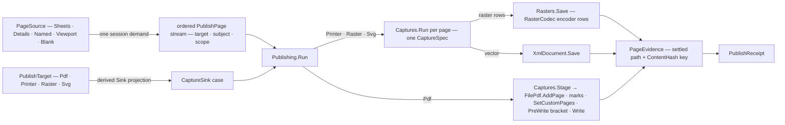

# [RASM_RHINO_PUBLISH]

The publication pipeline (`Rasm.Rhino.Exchange`). ONE request family carries source, render intent, output carrier, page stream, policy, artifacts, and evidence: a `PageSource` resolves to an ordered `PublishPage` stream, a `PublishTarget` names the output carrier, and the target-to-sink correspondence derives every egress from the ONE viewport capture specification — the PDF target stages each page's `CaptureSpec` into `FilePdf.AddPage`, and the printer, raster, and vector targets render the SAME spec through the capture rail's sink cases — so a per-target capture pipeline cannot exist. The killed census forms are the target-specific `WritePdf`/`WritePrinter`/`WriteRaster`/`WriteSvg` pipelines that each re-derived page traversal, validation, capture, and receipt construction, the per-target capture callbacks, and the target-local report shapes; token interpolation is one generated row vocabulary folded over one scope value, stamping is one closed mark family drawn through the `FilePdf` draw surface, and every artifact leaves with its settled path and kernel content key as evidence.

## [01]-[INDEX]

- [02]-[RASTER_ROWS]: `RasterCodec` the encoder rows, `TiffCompression` the compression vocabulary, `RasterPolicy` the encoding policy, and the one bitmap-save fold.
- [03]-[STAMP_ALGEBRA]: `StampToken`/`StampScope`/`StampText` — the interpolation rows and the one render fold; `PdfMark` — the closed stamp family over the `FilePdf` draw surface.
- [04]-[SOURCE_AND_TARGET]: `PageFrame`, `PageSource` → `PublishPage` resolution, and `PublishTarget` with the derived sink correspondence.
- [05]-[PUBLISH_RAIL]: `PdfPolicy`, `PublishRequest`, `PageEvidence`/`PublishReceipt`, and `Publishing.Run`.

## [02]-[RASTER_ROWS]

- Owner: `TiffCompression` `[SmartEnum<int>]` — the TIFF compression vocabulary carrying each row's `System.Drawing` encoder value. `RasterCodec` `[SmartEnum<int>]` — the pixel-encoder rows: image format, alpha capability, and a `[UseDelegateFromConstructor]` parameter projection that mints the encoder parameter list from the policy, so JPEG quality and TIFF compression are row facts, never call-site branches. `RasterPolicy` — the encoding policy record; `Rasters.Save` — the one bitmap-save fold locating the codec's `ImageCodecInfo` by format id and writing with the row's parameters.
- Law: an alpha-bearing capture saved through a non-alpha row flattens silently at the host encoder; the policy's `RequireAlpha` gate refuses that combination at admission so transparency loss is a typed fault, not a visual surprise.
- Law: the raster codec rows and the `formats.md` raster capability rows share keys — the publish target validates its `FileCodec` raster row against this encoder vocabulary once at request admission, so an extension/encoder mismatch cannot survive to egress.

```csharp
// --- [RUNTIME_PRELUDE] ----------------------------------------------------------------------
using System.Drawing.Imaging;
using Rasm.Domain;
using Rasm.Numerics;
using Rasm.Rhino.Document;
using Rasm.Rhino.Viewport;
using Rhino.FileIO;

namespace Rasm.Rhino.Exchange;

// --- [TYPES] --------------------------------------------------------------------------------
[SmartEnum<int>]
public sealed partial class TiffCompression {
    public static readonly TiffCompression Default = new(key: 0, value: None);
    public static readonly TiffCompression None = new(key: 1, value: Some((long)EncoderValue.CompressionNone));
    public static readonly TiffCompression Lzw = new(key: 2, value: Some((long)EncoderValue.CompressionLZW));
    public static readonly TiffCompression Ccitt3 = new(key: 3, value: Some((long)EncoderValue.CompressionCCITT3));
    public static readonly TiffCompression Ccitt4 = new(key: 4, value: Some((long)EncoderValue.CompressionCCITT4));
    public static readonly TiffCompression Rle = new(key: 5, value: Some((long)EncoderValue.CompressionRle));

    public Option<long> Value { get; }
}

[SmartEnum<int>]
public sealed partial class RasterCodec {
    public static readonly RasterCodec Png = new(key: 0, image: ImageFormat.Png, alpha: true,
        parameters: static policy => Seq<(Encoder, long)>());
    public static readonly RasterCodec Jpeg = new(key: 1, image: ImageFormat.Jpeg, alpha: false,
        parameters: static policy => Seq((Encoder.Quality, (long)policy.JpegQuality.Value)));
    public static readonly RasterCodec Tiff = new(key: 2, image: ImageFormat.Tiff, alpha: true,
        parameters: static policy => policy.Compression.Value.Map(static value => Seq((Encoder.Compression, value))).IfNone(Seq<(Encoder, long)>()));
    public static readonly RasterCodec Bmp = new(key: 3, image: ImageFormat.Bmp, alpha: false,
        parameters: static policy => Seq<(Encoder, long)>());

    public ImageFormat Image { get; }
    public bool Alpha { get; }

    [UseDelegateFromConstructor]
    internal partial Seq<(Encoder Key, long Value)> Parameters(RasterPolicy policy);
}

// --- [MODELS] -------------------------------------------------------------------------------
public sealed record RasterPolicy(RasterCodec Codec, Dimension JpegQuality, TiffCompression Compression, bool RequireAlpha) {
    public static RasterPolicy Screen { get; } = new(
        Codec: RasterCodec.Png, JpegQuality: Dimension.Create(value: 90), Compression: TiffCompression.Default, RequireAlpha: false);

    public static Fin<RasterPolicy> Of(RasterCodec codec, Option<Dimension> jpegQuality = default, Option<TiffCompression> compression = default, bool requireAlpha = false, Op? key = null) {
        Op op = key.OrDefault();
        return from _quality in jpegQuality.Map(quality => guard(quality.Value is >= 1 and <= 100, op.InvalidInput()).ToFin()).IfNone(Fin.Succ(value: unit))
               from _alpha in guard(!requireAlpha || codec.Alpha, op.InvalidInput()).ToFin()
               select new RasterPolicy(
                   Codec: codec,
                   JpegQuality: jpegQuality.IfNone(Screen.JpegQuality),
                   Compression: compression.IfNone(TiffCompression.Default),
                   RequireAlpha: requireAlpha);
    }
}

// --- [OPERATIONS] ---------------------------------------------------------------------------
internal static class Rasters {
    internal static Fin<Unit> Save(System.Drawing.Bitmap bitmap, RasterPolicy policy, string path, Op key) =>
        key.Catch(() => {
            Seq<(Encoder Key, long Value)> rows = policy.Codec.Parameters(policy: policy);
            if (rows.IsEmpty) {
                bitmap.Save(filename: path, format: policy.Codec.Image);
                return Fin.Succ(value: unit);
            }
            return toSeq(ImageCodecInfo.GetImageEncoders())
                .Find(codec => codec.FormatID == policy.Codec.Image.Guid)
                .ToFin(Fail: key.InvalidResult())
                .Bind(codec => key.Catch(() => {
                    using EncoderParameters parameters = new(count: rows.Count);
                    _ = rows.Map(static (row, index) => (row, index)).Iter(entry =>
                        parameters.Param[entry.index] = new EncoderParameter(encoder: entry.row.Key, value: entry.row.Value));
                    bitmap.Save(filename: path, encoder: codec, encoderParams: parameters);
                    return Fin.Succ(value: unit);
                }));
        });
}
```

## [03]-[STAMP_ALGEBRA]

- Owner: `StampScope` — the one interpolation context: document name and path, page name, page ordinal and count, view name, scale text, and the render instant. `StampToken` `[SmartEnum<string>]` — the token rows, each carrying its `Expand` projection off the scope, so a new token is one row and the render fold gains it with zero edits. `StampText.Render` — the one interpolation fold replacing every `%token%` occurrence over the row set. `PdfMark` `[Union]` — the closed stamp family: `TextCase` through `FilePdf.DrawText`, `LineCase` through `DrawLine`, `PolylineCase` through `DrawPolyline`, `ImageCase` through `DrawBitmap`; text payloads interpolate through the same fold before drawing.
- Law: interpolation is total over unknown tokens — an unmatched `%word%` survives verbatim, because stamp templates travel through foreign title blocks whose literal `%` text is legitimate content.
- Law: mark coordinates are page points with the page's own DPI — the mark family draws in `FilePdf` page space and never reaches through to model space; a model-space annotation is document content, not a stamp.
- Growth: a new draw member on the host PDF surface is one `PdfMark` case with its draw arm; a new stamp variable is one `StampToken` row.

```csharp
// --- [MODELS] -------------------------------------------------------------------------------
public sealed record StampScope(
    string DocumentName,
    string DocumentPathText,
    string PageName,
    int PageOrdinal,
    int PageCount,
    string ViewName,
    string ScaleText,
    DateTimeOffset Instant);

[SmartEnum<string>]
public sealed partial class StampToken {
    public static readonly StampToken Date = new("date", expand: static scope => scope.Instant.ToString(format: "yyyy-MM-dd", formatProvider: System.Globalization.CultureInfo.InvariantCulture));
    public static readonly StampToken Time = new("time", expand: static scope => scope.Instant.ToString(format: "HH:mm", formatProvider: System.Globalization.CultureInfo.InvariantCulture));
    public static readonly StampToken DocName = new("document", expand: static scope => scope.DocumentName);
    public static readonly StampToken DocPath = new("path", expand: static scope => scope.DocumentPathText);
    public static readonly StampToken Page = new("page", expand: static scope => scope.PageName);
    public static readonly StampToken PageNumber = new("pagenumber", expand: static scope => scope.PageOrdinal.ToString(provider: System.Globalization.CultureInfo.InvariantCulture));
    public static readonly StampToken PageCount = new("pagecount", expand: static scope => scope.PageCount.ToString(provider: System.Globalization.CultureInfo.InvariantCulture));
    public static readonly StampToken View = new("view", expand: static scope => scope.ViewName);
    public static readonly StampToken Scale = new("scale", expand: static scope => scope.ScaleText);

    [UseDelegateFromConstructor]
    internal partial string Expand(StampScope scope);
}

public static class StampText {
    public static string Render(string template, StampScope scope) =>
        toSeq(StampToken.Items).Fold(template, (text, token) =>
            text.Replace($"%{token.Key}%", token.Expand(scope: scope), StringComparison.OrdinalIgnoreCase));
}

// --- [TYPES] --------------------------------------------------------------------------------
[Union(ConversionFromValue = ConversionOperatorsGeneration.None)]
public abstract partial record PdfMark {
    private PdfMark() { }
    public sealed record TextCase(
        string Template, double X, double Y, float HeightPoints, Rhino.DocObjects.Font Font,
        System.Drawing.Color Fill, Option<(System.Drawing.Color Color, float Width)> Stroke, float AngleDegrees,
        Rhino.DocObjects.TextHorizontalAlignment Horizontal, Rhino.DocObjects.TextVerticalAlignment Vertical) : PdfMark;
    public sealed record LineCase(System.Drawing.PointF From, System.Drawing.PointF To, System.Drawing.Color Stroke, float Width) : PdfMark;
    public sealed record PolylineCase(Seq<System.Drawing.PointF> Points, Option<System.Drawing.Color> Fill, System.Drawing.Color Stroke, float Width) : PdfMark;
    public sealed record ImageCase(System.Drawing.Bitmap Bitmap, float X, float Y, float Width, float Height, float AngleDegrees) : PdfMark;

    internal Fin<Unit> Draw(FilePdf pdf, int page, StampScope scope, Op op) => Switch(
        state: (Pdf: pdf, Page: page, Scope: scope, Op: op),
        textCase: static (ctx, mark) => ctx.Op.Catch(() => {
            ctx.Pdf.DrawText(
                pageNumber: ctx.Page,
                text: StampText.Render(template: mark.Template, scope: ctx.Scope),
                x: mark.X, y: mark.Y, heightPoints: mark.HeightPoints, onfont: mark.Font,
                fillColor: mark.Fill,
                strokeColor: mark.Stroke.Map(static stroke => stroke.Color).IfNone(System.Drawing.Color.Empty),
                strokeWidth: mark.Stroke.Map(static stroke => stroke.Width).IfNone(noneValue: 0f),
                angleDegrees: mark.AngleDegrees,
                horizontalAlignment: mark.Horizontal, verticalAlignment: mark.Vertical);
            return Fin.Succ(value: unit);
        }),
        lineCase: static (ctx, mark) => ctx.Op.Catch(() => {
            ctx.Pdf.DrawLine(pageNumber: ctx.Page, from: mark.From, to: mark.To, strokeColor: mark.Stroke, strokeWidth: mark.Width);
            return Fin.Succ(value: unit);
        }),
        polylineCase: static (ctx, mark) => ctx.Op.Catch(() => {
            ctx.Pdf.DrawPolyline(
                pageNumber: ctx.Page, polyline: mark.Points.ToArray(),
                fillColor: mark.Fill.IfNone(System.Drawing.Color.Empty), strokeColor: mark.Stroke, strokeWidth: mark.Width);
            return Fin.Succ(value: unit);
        }),
        imageCase: static (ctx, mark) => ctx.Op.Catch(() => {
            ctx.Pdf.DrawBitmap(
                pageNumber: ctx.Page, bitmap: mark.Bitmap,
                left: mark.X, top: mark.Y, width: mark.Width, height: mark.Height, rotationInDegrees: mark.AngleDegrees);
            return Fin.Succ(value: unit);
        }));

    internal static Fin<Unit> DrawAll(Seq<PdfMark> marks, FilePdf pdf, int page, StampScope scope, Op op) =>
        marks.TraverseM(mark => mark.Draw(pdf: pdf, page: page, scope: scope, op: op)).As().Map(static _ => unit);
}
```

## [04]-[SOURCE_AND_TARGET]

- Owner: `PageFrame` — the per-page render intent shared by every target: DPI, capture area, scale, media layout, decoration; it projects into the capture spec so publication and interactive capture cannot diverge. `PageSource` `[Union]` — the polymorphic capture origin: `SheetsCase(SheetSelect)` publishes layout pages, `DetailsCase(SheetSelect, DetailSelect)` publishes matched details, `NamedCase(Seq<string>)` publishes named views, `ViewportCase(ViewportTarget)` publishes one addressed viewport, and `BlankCase(Size2i, Dimension)` emits an uncaptured page for the PDF target's composed sheets. Resolution runs once under a session demand and yields ordered `PublishPage` values, each carrying its resolved `ViewportTarget`, its label scope, and its frame. `PublishTarget` `[Union]` — `PdfCase(DocumentPath, PdfPolicy, OutputPolicy)`, `PrinterCase(string, Dimension)`, `RasterCase(DocumentPath, RasterPolicy, OutputPolicy)`, `SvgCase(DocumentPath, OutputPolicy)` — and its `Sink` projection is the ONE target-to-sink correspondence the capture rail consumes.
- Law: page order is evidence order — the resolved stream fixes ordinal and count before any egress, so `%pagenumber%`/`%pagecount%` tokens, PDF page indices, and per-page artifact names all read one numbering.
- Law: a multi-page raster or vector target lands one artifact per page — the page's file name derives from the target stem through the token fold (`stem-%pagenumber%`), resolved through `OutputPolicy` per page, so collision policy governs every artifact uniformly.
- Boundary: named-view publication captures the named view's addressed viewport as it stands; a restore-then-capture sequence is the camera rail composed BEFORE publication, never a hidden restore inside the page resolver.

```csharp
// --- [MODELS] -------------------------------------------------------------------------------
public sealed record PageFrame(
    double Dpi,
    Option<Size2i> Pixels,
    Option<CaptureArea> Area,
    Option<CaptureScale> Scale,
    Option<MediaLayout> Layout,
    Option<CaptureDecor> Decor) {
    public static PageFrame Print { get; } = new(Dpi: 300.0, Pixels: None, Area: None, Scale: None, Layout: None, Decor: None);

    public static Fin<PageFrame> Of(double dpi, Option<Size2i> pixels = default, Option<CaptureArea> area = default,
        Option<CaptureScale> scale = default, Option<MediaLayout> layout = default, Option<CaptureDecor> decor = default, Op? key = null) =>
        key.OrDefault().Positive(value: dpi).Map(_ => new PageFrame(Dpi: dpi, Pixels: pixels, Area: area, Scale: scale, Layout: layout, Decor: decor));
}

public sealed record PublishPage(
    ViewportTarget Target,
    CaptureSubject Subject,
    StampScope Scope,
    Option<Size2i> Blank);

// --- [TYPES] --------------------------------------------------------------------------------
[Union(ConversionFromValue = ConversionOperatorsGeneration.None)]
public abstract partial record PageSource {
    private PageSource() { }
    public sealed record SheetsCase(SheetSelect Sheets) : PageSource;
    public sealed record DetailsCase(SheetSelect Sheets, DetailSelect Details) : PageSource;
    public sealed record NamedCase(Seq<string> Names) : PageSource;
    public sealed record ViewportCase(ViewportTarget Target) : PageSource;
    public sealed record BlankCase(Size2i SizeDots, Dimension Count) : PageSource;

    internal Fin<Seq<PublishPage>> Resolve(RhinoDoc document, PageFrame frame, Op op) => Switch(
        state: (Document: document, Frame: frame, Op: op),
        sheetsCase: static (ctx, source) =>
            from pages in source.Sheets.Resolve(document: ctx.Document, op: ctx.Op)
            select pages.Map((page, index) => Page(
                target: new ViewportTarget.PageCase(PageViewId: page.MainViewport.Id),
                subject: new CaptureSubject.PageCase(Target: new ViewportTarget.PageCase(PageViewId: page.MainViewport.Id), Dpi: ctx.Frame.Dpi),
                document: ctx.Document, pageName: page.PageName, viewName: page.MainViewport.Name,
                ordinal: index + 1, count: pages.Count)),
        detailsCase: static (ctx, source) =>
            from pixels in ctx.Frame.Pixels.ToFin(Fail: ctx.Op.InvalidInput())
            from pages in source.Sheets.Resolve(document: ctx.Document, op: ctx.Op)
            from rows in pages
                .TraverseM(page => source.Details.Resolve(page: page, op: ctx.Op).Map(details =>
                    details.Map(detail => (Page: page, Detail: detail))))
                .As()
            let flat = rows.Bind(identity)
            select flat.Map((row, index) => Page(
                target: new ViewportTarget.DetailCase(PageViewId: row.Page.MainViewport.Id, DetailId: row.Detail.Id),
                subject: new CaptureSubject.ViewCase(
                    Target: new ViewportTarget.DetailCase(PageViewId: row.Page.MainViewport.Id, DetailId: row.Detail.Id),
                    Pixels: pixels, Dpi: ctx.Frame.Dpi),
                document: ctx.Document, pageName: row.Page.PageName, viewName: row.Detail.Viewport.Name,
                ordinal: index + 1, count: flat.Count)),
        namedCase: static (ctx, source) =>
            from pixels in ctx.Frame.Pixels.ToFin(Fail: ctx.Op.InvalidInput())
            from targets in source.Names
                .TraverseM(name => ViewportTarget.Named(name: name, key: ctx.Op))
                .As()
            select targets.Map((target, index) => Page(
                target: target,
                subject: new CaptureSubject.ViewCase(Target: target, Pixels: pixels, Dpi: ctx.Frame.Dpi),
                document: ctx.Document, pageName: source.Names[index], viewName: source.Names[index],
                ordinal: index + 1, count: source.Names.Count)),
        viewportCase: static (ctx, source) =>
            from pixels in ctx.Frame.Pixels.ToFin(Fail: ctx.Op.InvalidInput())
            select Seq(Page(
                target: source.Target,
                subject: new CaptureSubject.ViewCase(Target: source.Target, Pixels: pixels, Dpi: ctx.Frame.Dpi),
                document: ctx.Document, pageName: string.Empty, viewName: string.Empty, ordinal: 1, count: 1)),
        blankCase: static (ctx, source) =>
            Fin.Succ(value: toSeq(Range(1, source.Count.Value)).Map(ordinal => new PublishPage(
                Target: ViewportTarget.Active(),
                Subject: new CaptureSubject.PageCase(Target: ViewportTarget.Active(), Dpi: ctx.Frame.Dpi),
                Scope: ScopeOf(document: ctx.Document, pageName: $"blank-{ordinal}", viewName: string.Empty, ordinal: ordinal, count: source.Count.Value),
                Blank: Some(source.SizeDots)))));

    private static PublishPage Page(ViewportTarget target, CaptureSubject subject, RhinoDoc document, string pageName, string viewName, int ordinal, int count) =>
        new(Target: target, Subject: subject,
            Scope: ScopeOf(document: document, pageName: pageName, viewName: viewName, ordinal: ordinal, count: count),
            Blank: None);

    private static StampScope ScopeOf(RhinoDoc document, string pageName, string viewName, int ordinal, int count) =>
        new(DocumentName: document.Name ?? string.Empty,
            DocumentPathText: document.Path ?? string.Empty,
            PageName: pageName, PageOrdinal: ordinal, PageCount: count, ViewName: viewName,
            ScaleText: string.Empty, Instant: DateTimeOffset.Now);
}

[Union(ConversionFromValue = ConversionOperatorsGeneration.None)]
public abstract partial record PublishTarget {
    private PublishTarget() { }
    public sealed record PdfCase(DocumentPath Target, PdfPolicy Policy, OutputPolicy Output) : PublishTarget;
    public sealed record PrinterCase(string PrinterName, Dimension Copies) : PublishTarget;
    public sealed record RasterCase(DocumentPath Target, RasterPolicy Policy, OutputPolicy Output) : PublishTarget;
    public sealed record SvgCase(DocumentPath Target, OutputPolicy Output) : PublishTarget;

    internal Fin<CaptureSink> Sink(Op op) => Switch(
        state: op,
        pdfCase: static (key, _) => Fin.Succ(value: CaptureSink.Bitmap()),
        printerCase: static (key, target) => CaptureSink.Printer(printerName: target.PrinterName, copies: target.Copies, key: key),
        rasterCase: static (key, target) => Fin.Succ(value: target.Policy.RequireAlpha ? CaptureSink.Transparent() : CaptureSink.Bitmap()),
        svgCase: static (key, _) => Fin.Succ(value: CaptureSink.Svg()));
}
```

## [05]-[PUBLISH_RAIL]

- Owner: `PdfPolicy` — the PDF composition policy: optional-content layer grouping, the final stamp set drawn on every page inside the `PreWrite` window, and the custom printed-page definitions handed to `SetCustomPages`. `PageEvidence` — per-page proof: scope echo, target, sink kind, artifact path and content key where the page landed its own file. `PublishReceipt` — the one result: evidence stream, artifact keys, issue rows; `IDetachedDocumentResult` so the rail rides the session demand. `Publishing.Run` — the one entry: resolve the page stream once, derive the sink from the target once, then fold the pages through the single target arm.
- Entry: `Publishing.Run(DocumentSession, PublishRequest, Op?) : Fin<PublishReceipt>` — page resolution proves `SessionNeed.Read` plus `SessionNeed.Export` once, and each page capture proves `SessionNeed.Redraw` through the capture rail's own demand.
- Law: the PDF arm owns the whole `FilePdf` lifecycle in one bracket — `Create`, per-page `LayersAsOptionalContentGroups` write, `AddPage` staged from the page's capture spec (blank pages through the dots overload), per-page marks, `SetCustomPages`, then `Write` inside a `PreWrite` subscribe/unsubscribe window that draws the policy's final stamps against the host-minted page indices, never a re-derived ordinal; the static event detaches on every exit, so a failed write never leaks a stamp hook into the next publication.
- Law: the capture correspondence is structural — printer, raster, and vector pages run `Captures.Run` with the derived sink, and the PDF page stages the SAME `CaptureSpec` through the capture rail's settings fold; a second settings construction inside this page is the deleted census form.
- Law: raster and vector artifacts verify on disk — a zero-length or missing artifact after a reported success is a typed refusal carrying the settled path, and every landed artifact's `ContentHash.Of` key rides its evidence row.
- Boundary: `Captures.Stage` is the capture page's settings-leasing entry this rail composes for `FilePdf.AddPage`; the staged spec's sink row is inert by that entry's contract.

```csharp
// --- [MODELS] -------------------------------------------------------------------------------
public sealed record PdfPolicy(
    bool LayersAsOptionalContent,
    Seq<PdfMark> PageMarks,
    Seq<PdfMark> FinalMarks,
    Seq<PrintedPageDefinition> CustomPages) {
    public static PdfPolicy Plain { get; } = new(
        LayersAsOptionalContent: true, PageMarks: Seq<PdfMark>(), FinalMarks: Seq<PdfMark>(), CustomPages: Seq<PrintedPageDefinition>());
}

public sealed record PublishRequest(PublishTarget Target, PageSource Source, PageFrame Frame) {
    public static Fin<PublishRequest> Of(PublishTarget target, PageSource source, Option<PageFrame> frame = default, Op? key = null) {
        Op op = key.OrDefault();
        return from carrier in Optional(target).ToFin(Fail: op.InvalidInput())
               from origin in Optional(source).ToFin(Fail: op.InvalidInput())
               from _blank in guard(
                   origin is not PageSource.BlankCase || carrier is PublishTarget.PdfCase,
                   op.InvalidInput()).ToFin()
               select new PublishRequest(Target: carrier, Source: origin, Frame: frame.IfNone(PageFrame.Print));
    }
}

public sealed record PageEvidence(
    StampScope Scope,
    string SinkKind,
    Option<DocumentPath> Artifact,
    Option<UInt128> ContentKey);

public sealed record PublishReceipt(Seq<PageEvidence> Pages, Seq<ArchiveIssue> Issues) : IDetachedDocumentResult;

// --- [OPERATIONS] ---------------------------------------------------------------------------
public static class Publishing {
    public static Fin<PublishReceipt> Run(DocumentSession session, PublishRequest request, Op? key = null) {
        Op op = key.OrDefault();
        return from admitted in Optional(request).ToFin(Fail: op.InvalidInput())
               from pages in session.Demand(
                   use: document => admitted.Source.Resolve(document: document, frame: admitted.Frame, op: op)
                       .Map(static resolved => new ResolvedPages(Pages: resolved)),
                   key: op,
                   needs: [SessionNeed.Read, SessionNeed.Export])
               from _count in guard(!pages.Pages.IsEmpty, op.InvalidInput()).ToFin()
               from receipt in admitted.Target.Switch(
                   state: (Session: session, Request: admitted, Pages: pages.Pages, Op: op),
                   pdfCase: static (ctx, target) => Pdf(session: ctx.Session, request: ctx.Request, target: target, pages: ctx.Pages, op: ctx.Op),
                   printerCase: static (ctx, target) => Fanned(
                       session: ctx.Session, request: ctx.Request, pages: ctx.Pages, op: ctx.Op,
                       sinkKind: nameof(PublishTarget.PrinterCase),
                       artifact: static (_, _, _) => Fin.Succ(value: Option<(DocumentPath, UInt128)>.None)),
                   rasterCase: static (ctx, target) => Fanned(
                       session: ctx.Session, request: ctx.Request, pages: ctx.Pages, op: ctx.Op,
                       sinkKind: nameof(PublishTarget.RasterCase),
                       artifact: (page, capture, op2) => Landed(
                           capture: capture, page: page, target: target.Target, output: target.Output,
                           codec: RasterExtension(policy: target.Policy), save: (bitmap, path) => Rasters.Save(bitmap: bitmap, policy: target.Policy, path: path, key: op2), op: op2)),
                   svgCase: static (ctx, target) => Fanned(
                       session: ctx.Session, request: ctx.Request, pages: ctx.Pages, op: ctx.Op,
                       sinkKind: nameof(PublishTarget.SvgCase),
                       artifact: (page, capture, op2) => Vector(capture: capture, page: page, target: target.Target, output: target.Output, op: op2)))
               select receipt;
    }

    private sealed record ResolvedPages(Seq<PublishPage> Pages) : IDetachedDocumentResult;

    private static FileCodec RasterExtension(RasterPolicy policy) => policy.Codec.Switch(
        png: static () => FileCodec.Png, jpeg: static () => FileCodec.Jpeg,
        tiff: static () => FileCodec.Tiff, bmp: static () => FileCodec.Bmp);

    private static Fin<PublishReceipt> Fanned(
        DocumentSession session, PublishRequest request, Seq<PublishPage> pages, Op op, string sinkKind,
        Func<PublishPage, CaptureArtifact, Op, Fin<Option<(DocumentPath Path, UInt128 Key)>>> artifact) =>
        from sink in request.Target.Sink(op: op)
        from evidence in pages.TraverseM(page =>
            from spec in CaptureSpec.Of(
                subject: page.Subject, sink: sink,
                area: request.Frame.Area, scale: request.Frame.Scale, layout: request.Frame.Layout, decor: request.Frame.Decor, key: op)
            from captured in Captures.Run(session: session, spec: spec, key: op)
            from landed in artifact(page, captured, op)
            select new PageEvidence(
                Scope: page.Scope, SinkKind: sinkKind,
                Artifact: landed.Map(static row => row.Path),
                ContentKey: landed.Map(static row => row.Key))).As()
        select new PublishReceipt(Pages: evidence, Issues: Seq<ArchiveIssue>());

    private static Fin<Option<(DocumentPath, UInt128)>> Landed(
        CaptureArtifact capture, PublishPage page, DocumentPath target, OutputPolicy output,
        FileCodec codec, Func<System.Drawing.Bitmap, string, Fin<Unit>> save, Op op) =>
        capture switch {
            CaptureArtifact.RasterCase raster =>
                from named in op.Catch(() => Fin.Succ(value: DocumentPath.Create(value: StampText.Render(
                    template: PageStem(target: target, count: page.Scope.PageCount), scope: page.Scope))))
                from settled in output.Resolve(target: named, codec: codec, key: op)
                from _saved in raster.Pixels.Use(borrow: bitmap => save(bitmap, settled.Value), key: op)
                from keyed in Verified(path: settled, op: op)
                select Some((settled, keyed)),
            _ => Fin.Fail<Option<(DocumentPath, UInt128)>>(error: op.InvalidResult()),
        };

    private static Fin<Option<(DocumentPath, UInt128)>> Vector(
        CaptureArtifact capture, PublishPage page, DocumentPath target, OutputPolicy output, Op op) =>
        capture switch {
            CaptureArtifact.VectorCase vector =>
                from named in op.Catch(() => Fin.Succ(value: DocumentPath.Create(value: StampText.Render(
                    template: PageStem(target: target, count: page.Scope.PageCount), scope: page.Scope))))
                from settled in output.Resolve(target: named, codec: FileCodec.Svg, key: op)
                from _saved in op.Catch(() => {
                    vector.Svg.Save(filename: settled.Value);
                    return Fin.Succ(value: unit);
                })
                from keyed in Verified(path: settled, op: op)
                select Some((settled, keyed)),
            _ => Fin.Fail<Option<(DocumentPath, UInt128)>>(error: op.InvalidResult()),
        };

    private static string PageStem(DocumentPath target, int count) =>
        count <= 1
            ? target.Value
            : System.IO.Path.Join(
                System.IO.Path.GetDirectoryName(target.Value) ?? string.Empty,
                $"{System.IO.Path.GetFileNameWithoutExtension(target.Value)}-%pagenumber%{System.IO.Path.GetExtension(target.Value)}");

    private static Fin<UInt128> Verified(DocumentPath path, Op op) =>
        op.Catch(() => {
            byte[] bytes = System.IO.File.ReadAllBytes(path: path.Value);
            return guard(bytes.Length > 0, op.InvalidResult()).ToFin().Map(_ => ContentHash.Of(canonicalBytes: bytes));
        });

    private static Fin<PublishReceipt> Pdf(
        DocumentSession session, PublishRequest request, PublishTarget.PdfCase target, Seq<PublishPage> pages, Op op) =>
        from settled in target.Output.Resolve(target: target.Target, codec: FileCodec.Pdf, key: op)
        from evidence in op.Catch(() => {
            FilePdf pdf = FilePdf.Create();
            return pages.TraverseM(page =>
                from index in page.Blank.Case switch {
                    Size2i dots => op.Catch(() => Fin.Succ(value: pdf.AddPage(
                        widthInDots: dots.Width, heightInDots: dots.Height, dotsPerInch: (int)request.Frame.Dpi))),
                    _ =>
                        from spec in CaptureSpec.Of(
                            subject: page.Subject, sink: CaptureSink.Bitmap(),
                            area: request.Frame.Area, scale: request.Frame.Scale, layout: request.Frame.Layout, decor: request.Frame.Decor, key: op)
                        from added in Captures.Stage(
                            session: session, spec: spec,
                            consume: settings => op.Catch(() => {
                                bool prior = pdf.LayersAsOptionalContentGroups;
                                pdf.LayersAsOptionalContentGroups = target.Policy.LayersAsOptionalContent;
                                int minted = pdf.AddPage(settings: settings);
                                pdf.LayersAsOptionalContentGroups = prior;
                                return Fin.Succ(value: minted);
                            }),
                            key: op)
                        select added,
                }
                from _marks in PdfMark.DrawAll(marks: target.Policy.PageMarks, pdf: pdf, page: index, scope: page.Scope, op: op)
                select (Minted: index, Evidence: new PageEvidence(Scope: page.Scope, SinkKind: nameof(PublishTarget.PdfCase), Artifact: None, ContentKey: None)))
            .As()
            .Bind(rows => Flush(pdf: pdf, target: target, path: settled, minted: rows.Map(static row => (row.Minted, row.Evidence.Scope)), op: op)
                .Map(_ => rows.Map(static row => row.Evidence)));
        })
        from keyed in Verified(path: settled, op: op)
        select new PublishReceipt(
            Pages: evidence.Map(row => row with { Artifact = Some(settled), ContentKey = Some(keyed) }),
            Issues: Seq<ArchiveIssue>());

    private static Fin<Unit> Flush(FilePdf pdf, PublishTarget.PdfCase target, DocumentPath path, Seq<(int Page, StampScope Scope)> minted, Op op) =>
        op.Catch(() => {
            _ = Op.SideWhen(!target.Policy.CustomPages.IsEmpty, () => pdf.SetCustomPages(pages: target.Policy.CustomPages.AsIterable()));
            EventHandler<FilePdfEventArgs> stamp = (_, _) =>
                ignore(minted.Map(row =>
                    PdfMark.DrawAll(marks: target.Policy.FinalMarks, pdf: pdf, page: row.Page, scope: row.Scope, op: op)));
            FilePdf.PreWrite += stamp;
            try {
                pdf.Write(filename: path.Value);
                return Fin.Succ(value: unit);
            } finally {
                FilePdf.PreWrite -= stamp;
            }
        });
}
```


