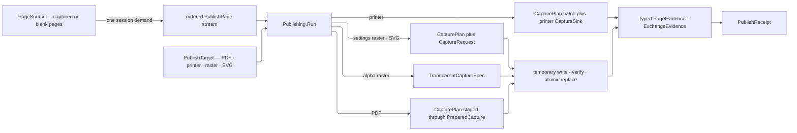

# [RASM_RHINO_PUBLISH]

`Publishing.Run` owns deterministic page resolution, capture, stamping, encoding, spooling, atomic artifact landing, and typed egress evidence. Closed frame, raster-policy, source, target, mark, page, and evidence families preserve modality from admission through settlement; the request supplies one render instant for the complete ordered stream.

## [01]-[INDEX]

- [02]-[RASTER_ROWS]: `RasterCodec` the encoder rows, `TiffCompression` the compression vocabulary, `RasterPolicy` the encoding policy, and the one bitmap-save fold.
- [03]-[STAMP_ALGEBRA]: `StampToken`/`StampScope`/`StampText` — the interpolation rows and the one template scan; `PdfMark` — the closed stamp family over the `FilePdf` draw surface.
- [04]-[SOURCE_AND_TARGET]: `PageFrame`, `PageSource` → captured-or-blank `PublishPage` resolution, and the typed target family.
- [05]-[PUBLISH_RAIL]: `PdfPolicy`, `PublishRequest`, `PageEvidence`/`PublishReceipt`, and `Publishing.Run`.

## [02]-[RASTER_ROWS]

- Owner: `TiffCompression` carries the TIFF encoder vocabulary. `RasterCodec` carries image format, alpha capability, and the owning `FileCodec`. `RasterPolicy` is the closed encoder-program family: opaque and transparent PNG/TIFF cases, `JpegCase`, and `BmpCase` carry only parameters their codec consumes and derive codec, transparency, and encoder rows exhaustively.
- Law: `RasterPolicy.Transparent` exists only on alpha-capable cases — a structural fact of the case set, so admission never re-tests alpha. JPEG quality and TIFF compression cannot coexist, and neither can leak into PNG or BMP admission; codec, transparency, and encoder parameters derive from one `Row` correspondence, never three parallel case walks.
- Law: the artifact extension derives from the encoder row's `Extension` column, so an extension/encoder mismatch is unrepresentable and a dispatch re-mapping encoder rows onto codec rows beside the column is the deleted form; `Artifact` is that column's one reader and admits it against `CodecAbility.Raster`, so a row re-pointed at a non-pixel codec refuses at delivery rather than landing a raster under a modelling extension.

```csharp signature
// --- [RUNTIME_PRELUDE] ----------------------------------------------------------------------
using System.Drawing.Imaging;
using System.Runtime.CompilerServices;
using System.Text.RegularExpressions;
using Rasm.Domain;
using Rasm.Numerics;
using Rasm.Rhino.Annotation;
using Rasm.Rhino.Document;
using Rasm.Rhino.Eto;
using Rasm.Rhino.Viewport;
using Rhino.DocObjects;
using Rhino.FileIO;

namespace Rasm.Rhino.Exchange;

// --- [TYPES] --------------------------------------------------------------------------------
[SmartEnum]
public sealed partial class TiffCompression {
    public static readonly TiffCompression Default = new(value: Option<long>.None);
    public static readonly TiffCompression None = new(value: Some((long)EncoderValue.CompressionNone));
    public static readonly TiffCompression Lzw = new(value: Some((long)EncoderValue.CompressionLZW));
    public static readonly TiffCompression Ccitt3 = new(value: Some((long)EncoderValue.CompressionCCITT3));
    public static readonly TiffCompression Ccitt4 = new(value: Some((long)EncoderValue.CompressionCCITT4));
    public static readonly TiffCompression Rle = new(value: Some((long)EncoderValue.CompressionRle));

    public Option<long> Value { get; }
}

[SmartEnum<int>]
public sealed partial class RasterCodec {
    public static readonly RasterCodec Png = new(key: 0, image: ImageFormat.Png, alpha: true, extension: FileCodec.Png);
    public static readonly RasterCodec Jpeg = new(key: 1, image: ImageFormat.Jpeg, alpha: false, extension: FileCodec.Jpeg);
    public static readonly RasterCodec Tiff = new(key: 2, image: ImageFormat.Tiff, alpha: true, extension: FileCodec.Tiff);
    public static readonly RasterCodec Bmp = new(key: 3, image: ImageFormat.Bmp, alpha: false, extension: FileCodec.Bmp);

    public ImageFormat Image { get; }
    public bool Alpha { get; }
    public FileCodec Extension { get; }

    internal Fin<FileCodec> Artifact(Op key) =>
        guard(Extension.Has(CodecAbility.Raster), key.InvalidResult()).ToFin().Map(_ => Extension);
}

[ValueObject<int>]
public readonly partial struct JpegQuality {
    static partial void ValidateFactoryArguments(ref ValidationError? validationError, ref int value) {
        validationError = value is >= 1 and <= 100
            ? validationError
            : new ValidationError(message: $"JPEG quality '{value}' is outside [1, 100].");
    }

    internal int Native => Value;
}

// --- [MODELS] -------------------------------------------------------------------------------
[Union(ConversionFromValue = ConversionOperatorsGeneration.None)]
public abstract partial record RasterPolicy {
    private RasterPolicy() { }
    public sealed record PngCase : RasterPolicy;
    public sealed record TransparentPngCase : RasterPolicy;
    public sealed record JpegCase(JpegQuality Quality) : RasterPolicy;
    public sealed record TiffCase(TiffCompression Compression) : RasterPolicy;
    public sealed record TransparentTiffCase(TiffCompression Compression) : RasterPolicy;
    public sealed record BmpCase : RasterPolicy;

    public static RasterPolicy Screen { get; } = new PngCase();

    public RasterCodec Codec => Row.Codec;

    public bool Transparent => Row.Transparent;

    internal Seq<(Encoder Key, long Value)> Parameters() => Row.Rows;

    internal Fin<RasterPolicy> Admit(Op op) => Switch(
        op,
        pngCase: static (_, policy) => Fin.Succ<RasterPolicy>(value: policy),
        transparentPngCase: static (_, policy) => Fin.Succ<RasterPolicy>(value: policy),
        jpegCase: static (key, policy) => guard(policy.Quality != default, key.InvalidInput()).ToFin().Map(_ => (RasterPolicy)policy),
        tiffCase: static (key, policy) => key.Need(policy.Compression).Map(_ => (RasterPolicy)policy),
        transparentTiffCase: static (key, policy) => key.Need(policy.Compression).Map(_ => (RasterPolicy)policy),
        bmpCase: static (_, policy) => Fin.Succ<RasterPolicy>(value: policy));

    private (RasterCodec Codec, bool Transparent, Seq<(Encoder Key, long Value)> Rows) Row => Switch(
        pngCase: static _ => (RasterCodec.Png, false, Seq<(Encoder, long)>()),
        transparentPngCase: static _ => (RasterCodec.Png, true, Seq<(Encoder, long)>()),
        jpegCase: static policy => (RasterCodec.Jpeg, false, Seq((Encoder.Quality, (long)policy.Quality.Native))),
        tiffCase: static policy => (RasterCodec.Tiff, false, Compressed(policy.Compression)),
        transparentTiffCase: static policy => (RasterCodec.Tiff, true, Compressed(policy.Compression)),
        bmpCase: static _ => (RasterCodec.Bmp, false, Seq<(Encoder, long)>()));

    private static Seq<(Encoder Key, long Value)> Compressed(TiffCompression compression) =>
        compression.Value.Map(static value => Seq((Encoder.Compression, value))).IfNone(Seq<(Encoder, long)>());
}

// --- [OPERATIONS] ---------------------------------------------------------------------------
internal static class Rasters {
    internal static Fin<Unit> Save(System.Drawing.Bitmap bitmap, RasterPolicy policy, string path, Op key) =>
        policy.Parameters() switch {
            { IsEmpty: true } => key.Catch(() => {
                bitmap.Save(filename: path, format: policy.Codec.Image);
                return Fin.Succ(value: unit);
            }),
            var rows => key.Catch(() => toSeq(ImageCodecInfo.GetImageEncoders())
                .Find(codec => codec.FormatID == policy.Codec.Image.Guid)
                .ToFin(Fail: key.InvalidResult())
                .Bind(codec => key.Catch(() => {
                    using EncoderParameters parameters = new(count: rows.Count);
                    _ = rows.Map(static (row, index) => (row, index)).Iter(entry =>
                        parameters.Param[entry.index] = new EncoderParameter(encoder: entry.row.Key, value: entry.row.Value));
                    bitmap.Save(filename: path, encoder: codec, encoderParams: parameters);
                    return Fin.Succ(value: unit);
                }))),
        };
}
```

## [03]-[STAMP_ALGEBRA]

- Owner: `StampScope` carries document, page, view, scale, and caller-admitted render time. `StampToken` projects each interpolation row and `StampText` owns the one template scan. `PdfImageBytes` copies encoded ingress, and `PdfImageBudget` bounds bytes and decoded pixels before any PDF page or draw allocation. `PdfMark` closes text, line, polyline, and admitted-image drawing over `FilePdf`.
- Law: interpolation is one scan per render — the generated token pattern walks the template once and each matched span answers off the frozen key index, so a per-token replacement walk repeated for every page and every artifact name is the deleted form. Interpolation stays total over unknown tokens: an unindexed span answers with its own matched text, so an unmatched `%word%` survives verbatim, because stamp templates travel through foreign title blocks whose literal `%` text is legitimate content.
- Law: a mark carries admitted owners only — `PerceptualColor` for every colour, page-space `Point2d` and `DetailFrame` for every seat and placement, `PositiveMagnitude` for every text height and stroke width, `VectorAngle` for every rotation, the Eto `TypeRole` for the text face, and the `TextAlignAcross`/`TextAlignDown` rows for the two alignment axes. `System.Drawing.Color`, `PointF`, `Rhino.DocObjects.Font`, and the host alignment enums materialize inside the draw arms alone, so `Admit` re-tests only what the owners cannot state and a finiteness sweep over raw doubles has nothing left to prove.
- Law: mark coordinates are page points with the page's own DPI — the mark family draws in `FilePdf` page space and never reaches through to model space; a model-space annotation is document content, not a stamp.
- Growth: a new draw member on the host PDF surface is one `PdfMark` case with its draw arm; a new stamp variable is one `StampToken` row, reaching both the scan and the index with no second edit.

```csharp signature
// --- [MODELS] -------------------------------------------------------------------------------
public sealed record StampScope(
    string DocumentName,
    string DocumentPathText,
    string PageName,
    int PageOrdinal,
    int PageCount,
    string ViewName,
    string ScaleText,
    DateTimeOffset Instant);

[SmartEnum<string>]
public sealed partial class StampToken {
    public static readonly StampToken Date = new("date", expand: static scope => scope.Instant.ToString(format: "yyyy-MM-dd", formatProvider: System.Globalization.CultureInfo.InvariantCulture));
    public static readonly StampToken Time = new("time", expand: static scope => scope.Instant.ToString(format: "HH:mm", formatProvider: System.Globalization.CultureInfo.InvariantCulture));
    public static readonly StampToken DocName = new("document", expand: static scope => scope.DocumentName);
    public static readonly StampToken DocPath = new("path", expand: static scope => scope.DocumentPathText);
    public static readonly StampToken Page = new("page", expand: static scope => scope.PageName);
    public static readonly StampToken PageNumber = new("pagenumber", expand: static scope => scope.PageOrdinal.ToString(provider: System.Globalization.CultureInfo.InvariantCulture));
    public static readonly StampToken PageCount = new("pagecount", expand: static scope => scope.PageCount.ToString(provider: System.Globalization.CultureInfo.InvariantCulture));
    public static readonly StampToken View = new("view", expand: static scope => scope.ViewName);
    public static readonly StampToken Scale = new("scale", expand: static scope => scope.ScaleText);

    [UseDelegateFromConstructor]
    internal partial string Expand(StampScope scope);
}

public static partial class StampText {
    private static readonly Lazy<FrozenDictionary<string, StampToken>> ByKey = new(static () =>
        toSeq(StampToken.Items).ToFrozenDictionary(
            keySelector: static row => row.Key,
            comparer: StringComparer.OrdinalIgnoreCase));

    public static string Render(string template, StampScope scope) =>
        Tokens().Replace(
            input: template,
            evaluator: match => ByKey.Value.TryGetValue(key: match.Groups[1].Value, out StampToken? row)
                ? row.Expand(scope: scope)
                : match.Value);

    // One compiled alternation over `%name%` spans: token keys are lower-case letters, the index is
    // case-insensitive, and an unindexed span returns its own matched text so foreign `%` prose survives.
    [GeneratedRegex(pattern: "%([A-Za-z]+)%", options: RegexOptions.CultureInvariant)]
    private static partial Regex Tokens();
}

[ComplexValueObject]
public sealed partial class PdfImageBytes {
    public ReadOnlyMemory<byte> Value { get; }

    static partial void ValidateFactoryArguments(
        ref ValidationError? validationError,
        ref ReadOnlyMemory<byte> value) {
        byte[] owned = value.ToArray();
        if (owned.Length == 0) {
            validationError = new ValidationError(message: "PDF mark image bytes are empty.");
        }
        value = owned;
    }
}

[ComplexValueObject]
public sealed partial class PdfImageBudget {
    public Dimension EncodedBytes { get; }
    public Dimension Pixels { get; }

    // Both bounds gate an in-process decode of caller-supplied bytes before any PDF page allocates: 16 MiB is the
    // encoded ceiling above which a stamp image is a document asset rather than a mark, and 100 megapixels is the
    // decoded ceiling at which a single 32-bit surface still fits one contiguous managed allocation.
    public static Dimension EncodedCeiling { get; } = Dimension.Create(value: 16 * 1024 * 1024);

    public static Dimension PixelCeiling { get; } = Dimension.Create(value: 100_000_000);

    public static PdfImageBudget Standard { get; } = Create(encodedBytes: EncodedCeiling, pixels: PixelCeiling);

    static partial void ValidateFactoryArguments(
        ref ValidationError? validationError,
        ref Dimension encodedBytes,
        ref Dimension pixels) =>
        validationError = encodedBytes != default && pixels != default
            ? validationError
            : new ValidationError(message: "PDF image budget is invalid.");
}

// --- [TYPES] --------------------------------------------------------------------------------
[Union(ConversionFromValue = ConversionOperatorsGeneration.None)]
public abstract partial record PdfMark {
    private PdfMark() { }
    public sealed record TextCase(
        string Template, Point2d Seat, PositiveMagnitude Height, TypeRole Face,
        PerceptualColor Fill, Option<(PerceptualColor Color, PositiveMagnitude Width)> Stroke, VectorAngle Angle,
        TextAlignAcross Across, TextAlignDown Down) : PdfMark;
    public sealed record LineCase(Point2d From, Point2d To, PerceptualColor Stroke, PositiveMagnitude Width) : PdfMark;
    public sealed record PolylineCase(Seq<Point2d> Points, Option<PerceptualColor> Fill, PerceptualColor Stroke, PositiveMagnitude Width) : PdfMark;
    public sealed record ImageCase(PdfImageBytes Image, DetailFrame Placement, VectorAngle Angle) : PdfMark;

    internal Fin<PdfMark> Admit(PdfImageBudget images, Op op) => Switch(
        (Images: images, Op: op),
        textCase: static (ctx, mark) =>
            from _template in ctx.Op.AcceptText(value: mark.Template)
            from _shape in guard(
                mark.Seat.IsValid
                && mark.Face is not null
                && mark.Fill is not null
                && mark.Across is not null
                && mark.Down is not null
                && mark.Stroke.ForAll(static stroke => stroke.Color is not null),
                ctx.Op.InvalidInput()).ToFin()
            select (PdfMark)mark,
        lineCase: static (ctx, mark) => guard(
            mark.From.IsValid && mark.To.IsValid && mark.Stroke is not null,
            ctx.Op.InvalidInput()).ToFin().Map(_ => (PdfMark)mark),
        polylineCase: static (ctx, mark) => guard(
            mark.Points.Count >= 2
            && mark.Points.ForAll(static point => point.IsValid)
            && mark.Stroke is not null
            && mark.Fill.ForAll(static fill => fill is not null),
            ctx.Op.InvalidInput()).ToFin().Map(_ => (PdfMark)mark),
        imageCase: static (ctx, mark) =>
            from _shape in guard(
                mark.Image is not null && mark.Placement.IsValid,
                ctx.Op.InvalidInput()).ToFin()
            from _bytes in guard(
                mark.Image.Value.Length <= ctx.Images.EncodedBytes.Value,
                ctx.Op.InvalidInput()).ToFin()
            from _decoded in ctx.Op.Catch(() => {
                using System.IO.MemoryStream stream = new(buffer: mark.Image.Value.ToArray(), writable: false);
                using System.Drawing.Bitmap decoded = new(stream: stream);
                long pixels = (long)decoded.Width * decoded.Height;
                return guard(
                    decoded.Width > 0 && decoded.Height > 0 && pixels <= ctx.Images.Pixels.Value,
                    ctx.Op.InvalidInput()).ToFin();
            })
            select (PdfMark)mark);

    internal Fin<Unit> Draw(FilePdf pdf, int page, StampScope scope, Op op) => Switch(
        (Pdf: pdf, Page: page, Scope: scope, Op: op),
        textCase: static (ctx, mark) =>
            from face in Face(role: mark.Face, op: ctx.Op)
            from _drawn in ctx.Op.Catch(() => {
                ctx.Pdf.DrawText(
                    pageNumber: ctx.Page,
                    text: StampText.Render(template: mark.Template, scope: ctx.Scope),
                    x: mark.Seat.X, y: mark.Seat.Y, heightPoints: (float)mark.Height.Value, onfont: face,
                    fillColor: Pigment(color: mark.Fill),
                    strokeColor: mark.Stroke.Map(static stroke => Pigment(color: stroke.Color)).IfNone(System.Drawing.Color.Empty),
                    strokeWidth: mark.Stroke.Map(static stroke => (float)stroke.Width.Value).IfNone(noneValue: 0f),
                    angleDegrees: (float)RhinoMath.ToDegrees(radians: mark.Angle.Value),
                    horizontalAlignment: (TextHorizontalAlignment)mark.Across.Key,
                    verticalAlignment: (TextVerticalAlignment)mark.Down.Key);
                return Fin.Succ(value: unit);
            })
            select unit,
        lineCase: static (ctx, mark) => ctx.Op.Catch(() => {
            ctx.Pdf.DrawLine(
                pageNumber: ctx.Page, from: Dot(point: mark.From), to: Dot(point: mark.To),
                strokeColor: Pigment(color: mark.Stroke), strokeWidth: (float)mark.Width.Value);
            return Fin.Succ(value: unit);
        }),
        polylineCase: static (ctx, mark) => ctx.Op.Catch(() => {
            ctx.Pdf.DrawPolyline(
                pageNumber: ctx.Page, polyline: mark.Points.Map(Dot).ToArray(),
                fillColor: mark.Fill.Map(Pigment).IfNone(System.Drawing.Color.Empty),
                strokeColor: Pigment(color: mark.Stroke), strokeWidth: (float)mark.Width.Value);
            return Fin.Succ(value: unit);
        }),
        imageCase: static (ctx, mark) => ctx.Op.Catch(() => {
            using System.IO.MemoryStream stream = new(buffer: mark.Image.Value.ToArray(), writable: false);
            using System.Drawing.Bitmap decoded = new(stream: stream);
            using System.Drawing.Bitmap detached = new(image: decoded);
            ctx.Pdf.DrawBitmap(
                pageNumber: ctx.Page, bitmap: detached,
                left: (float)mark.Placement.X, top: (float)mark.Placement.Y,
                width: (float)mark.Placement.Width, height: (float)mark.Placement.Height,
                rotationInDegrees: (float)RhinoMath.ToDegrees(radians: mark.Angle.Value));
            return Fin.Succ(value: unit);
        }));

    internal static Fin<Unit> DrawAll(
        Seq<PdfMark> marks, FilePdf pdf, int page, StampScope scope, Op op) =>
        from _drawn in marks.TraverseM(mark => mark.Draw(pdf: pdf, page: page, scope: scope, op: op)).As()
        select unit;

    // The role vends the host-cached Eto face; its family and the two quartet axes name the Rhino face the PDF
    // writer takes, and a family the host cannot resolve refuses here rather than handing `DrawText` a null.
    private static Fin<Font> Face(TypeRole role, Op op) =>
        op.Catch(() => role.Resolve() switch {
            var resolved => Optional(Font.FromQuartetProperties(
                    quartetName: resolved.FamilyName, bold: resolved.Bold, italic: resolved.Italic))
                .ToFin(Fail: op.MissingContext()),
        });

    private static System.Drawing.Color Pigment(PerceptualColor color) =>
        color.ToRgb() switch {
            var (red, green, blue, alpha) => System.Drawing.Color.FromArgb(alpha: alpha, red: red, green: green, blue: blue),
        };

    private static System.Drawing.PointF Dot(Point2d point) => new(x: (float)point.X, y: (float)point.Y);
}
```

## [04]-[SOURCE_AND_TARGET]

- Owner: `PageFrame` closes settings-driven and transparent capture intent. `SettingsCase` carries plan axes plus an optional viewport extent; `TransparentCase` carries the required extent and transparent facade. `PageSource` resolves sheets, details, named views, one viewport, or blank PDF pages into a closed `PublishPage` stream; `Admit` is total over every case payload, so a malformed public case refuses typed before any resolution dereference.
- Law: page order is evidence order — the resolved stream fixes ordinal and count before any egress, so `%pagenumber%`/`%pagecount%` tokens, PDF page indices, and per-page artifact names all read one numbering.
- Law: `ScaleText` evidence is per-source — a detail page carries the detail's `SheetScale.Format` (`GetFormattedScale`) string so `%scale%` renders the live detail scale, while whole-page, named-view, viewport, and blank sources carry no single scale and leave the token empty.
- Law: a multi-page raster or vector target lands one atomic artifact per page — the page's file name derives from the target stem through the token fold (`stem-%pagenumber%`), and `OutputPolicy` settles each destination before a same-directory temporary artifact replaces it.
- Law: frame modality is structural. `Plan` accepts only `SettingsCase`, and `TransparentSpec` accepts only `TransparentCase`; no boolean or absent field reconstructs capture intent.
- Law: resolution is the admitted `CaptureDpi` the capture rail owns, carried on both frame cases and read once — every downstream site consumes the admitted value instead of re-running `CaptureDpi.Of` over a raw double, and `PageFrame.Print` seats the named print-resolution row through the same admission rather than constructing past it, so the one DPI a frameless request inherits is the one DPI the gate proved.
- Law: `Dots` is the ONE integral-DPI admission — `CaptureDpi` admits any finite positive double while the blank-page host member takes an `int`, so integrality and range refuse typed at the frame instead of overflowing a conversion at the page mint; the blank-page arm and the request's blank-page contract are its two readers, and a second inline truncation beside either is the deleted form.
- Boundary: named-view publication captures the named view's addressed viewport as it stands; a restore-then-capture sequence is the camera rail composed BEFORE publication, never a hidden restore inside the page resolver.

```csharp signature
// --- [MODELS] -------------------------------------------------------------------------------
[Union(ConversionFromValue = ConversionOperatorsGeneration.None)]
public abstract partial record PageFrame {
    private PageFrame() { }
    internal sealed record SettingsCase(
        CaptureDpi DotsPerInch,
        Option<Size2i> ViewportExtent,
        Option<CaptureArea> Area,
        Option<CaptureScale> Scale,
        Option<MediaLayout> Layout,
        Option<CaptureDecor> Decor) : PageFrame;
    internal sealed record TransparentCase(
        CaptureDpi DotsPerInch,
        Size2i Extent,
        Option<TransparentDecor> Facade) : PageFrame;

    // Plate-standard print resolution: 300 dpi is the floor at which hairline linework and stamped text stay
    // unresampled on a plotted sheet, and it is the one default every frameless PublishRequest inherits.
    public static CaptureDpi PrintResolution { get; } = CaptureDpi.Create(value: 300.0);

    public static PageFrame Print { get; } = new SettingsCase(
        DotsPerInch: PrintResolution, ViewportExtent: None, Area: None, Scale: None, Layout: None, Decor: None);

    public CaptureDpi Dpi => Switch(
        settingsCase: static frame => frame.DotsPerInch,
        transparentCase: static frame => frame.DotsPerInch);

    internal Fin<int> Dots(Op? key = null) {
        Op op = key.OrDefault();
        return (double)Dpi switch {
            var value when value <= int.MaxValue && value == Math.Truncate(d: value) => Fin.Succ(value: (int)value),
            _ => Fin.Fail<int>(error: op.InvalidInput()),
        };
    }

    public Option<Size2i> Pixels => Switch(
        settingsCase: static frame => frame.ViewportExtent,
        transparentCase: static frame => Some(frame.Extent));

    public bool IsTransparent => this is TransparentCase;

    public static Fin<PageFrame> Settings(
        double dpi,
        Option<Size2i> pixels = default,
        Option<CaptureArea> area = default,
        Option<CaptureScale> scale = default,
        Option<MediaLayout> layout = default,
        Option<CaptureDecor> decor = default,
        Op? key = null) {
        Op op = key.OrDefault();
        return from admitted in CaptureDpi.Of(value: dpi, key: op)
               from _pixels in pixels.Map(value => guard(value.IsValid, op.InvalidInput()).ToFin())
                   .IfNone(Fin.Succ(value: unit))
               select (PageFrame)new SettingsCase(
                   DotsPerInch: admitted,
                   ViewportExtent: pixels,
                   Area: area,
                   Scale: scale,
                   Layout: layout,
                   Decor: decor);
    }

    public static Fin<PageFrame> Transparent(
        double dpi,
        Size2i pixels,
        Option<TransparentDecor> decor = default,
        Op? key = null) {
        Op op = key.OrDefault();
        return from admitted in CaptureDpi.Of(value: dpi, key: op)
               from _pixels in guard(pixels.IsValid, op.InvalidInput()).ToFin()
               select (PageFrame)new TransparentCase(DotsPerInch: admitted, Extent: pixels, Facade: decor);
    }

    internal Fin<CapturePlan> Plan(CaptureSubject subject, Op key) => Switch(
        (Subject: subject, Op: key),
        settingsCase: static (ctx, frame) => CapturePlan.Of(
            subject: ctx.Subject,
            area: frame.Area,
            scale: frame.Scale,
            layout: frame.Layout,
            decor: frame.Decor,
            key: ctx.Op),
        transparentCase: static (ctx, _) => Fin.Fail<CapturePlan>(error: ctx.Op.InvalidInput()));

    internal Fin<TransparentCaptureSpec> TransparentSpec(ViewportTarget target, Op key) => Switch(
        (Target: target, Op: key),
        settingsCase: static (ctx, _) => Fin.Fail<TransparentCaptureSpec>(error: ctx.Op.InvalidInput()),
        transparentCase: static (ctx, frame) => TransparentCaptureSpec.Of(
            target: ctx.Target,
            extent: frame.Extent,
            decor: frame.Facade,
            key: ctx.Op));
}

[Union(ConversionFromValue = ConversionOperatorsGeneration.None)]
internal abstract partial record PublishPage {
    private PublishPage() { }

    internal sealed record CapturedCase(ViewportTarget Target, CaptureSubject Subject, StampScope Stamp) : PublishPage;
    internal sealed record BlankCase(Size2i Extent, StampScope Stamp) : PublishPage;

    internal StampScope Evidence => Switch(
        capturedCase: static page => page.Stamp,
        blankCase: static page => page.Stamp);
}

// --- [TYPES] --------------------------------------------------------------------------------
[Union(ConversionFromValue = ConversionOperatorsGeneration.None)]
public abstract partial record PageSource {
    private PageSource() { }
    public sealed record SheetsCase(SheetSelect Sheets) : PageSource;
    public sealed record DetailsCase(SheetSelect Sheets, DetailSelect Details) : PageSource;
    public sealed record NamedCase(Seq<string> Names) : PageSource;
    public sealed record ViewportCase(ViewportTarget Target) : PageSource;
    public sealed record BlankCase(Size2i SizeDots, Dimension Count) : PageSource;

    internal Fin<PageSource> Admit(Op op) => Switch(
        op,
        sheetsCase: static (key, source) => Optional(source.Sheets)
            .ToFin(Fail: key.InvalidInput())
            .Map(_ => (PageSource)source),
        detailsCase: static (key, source) =>
            from _sheets in key.Need(source.Sheets)
            from _details in key.Need(source.Details)
            select (PageSource)source,
        namedCase: static (key, source) =>
            from names in source.Names
                .Traverse(name => key.AcceptText(value: name).ToValidation())
                .As()
                .ToFin()
            from _count in guard(!names.IsEmpty, key.InvalidInput()).ToFin()
            select (PageSource)new NamedCase(Names: names),
        viewportCase: static (key, source) => Optional(source.Target)
            .ToFin(Fail: key.InvalidInput())
            .Map(_ => (PageSource)source),
        blankCase: static (key, source) => guard(
            source.SizeDots.IsValid && source.Count.Value > 0,
            key.InvalidInput()).ToFin().Map(_ => (PageSource)source));

    internal Fin<Seq<PublishPage>> Resolve(RhinoDoc document, PageFrame frame, DateTimeOffset instant, Op op) => Switch(
        (Document: document, Frame: frame, Instant: instant, Op: op),
        sheetsCase: static (ctx, source) =>
            from pages in source.Sheets.Resolve(document: ctx.Document, op: ctx.Op)
            let dpi = ctx.Frame.Dpi
            from captured in pages.Map(static (page, index) => (Page: page, Index: index)).TraverseM(row =>
                from target in ViewportTarget.Page(pageViewId: row.Page.MainViewport.Id, key: ctx.Op)
                from subject in CaptureSubject.Page(target: target, dpi: dpi, key: ctx.Op)
                select Page(
                    target: target, subject: subject, document: ctx.Document,
                    pageName: row.Page.PageName, viewName: row.Page.MainViewport.Name,
                    scaleText: string.Empty,
                    ordinal: row.Index + 1, count: pages.Count, instant: ctx.Instant)).As()
            select captured,
        detailsCase: static (ctx, source) =>
            from pixels in ctx.Frame.Pixels.ToFin(Fail: ctx.Op.InvalidInput())
            let dpi = ctx.Frame.Dpi
            from pages in source.Sheets.Resolve(document: ctx.Document, op: ctx.Op)
            from rows in pages
                .TraverseM(page => source.Details.Resolve(page: page, op: ctx.Op).Map(details =>
                    details.Map(detail => (Page: page, Detail: detail))))
                .As()
            let flat = rows.Bind(identity)
            from captured in flat.Map(static (row, index) => (Row: row, Index: index)).TraverseM(entry =>
                from target in ViewportTarget.Detail(
                    pageViewId: entry.Row.Page.MainViewport.Id,
                    detailId: entry.Row.Detail.Id,
                    key: ctx.Op)
                from subject in CaptureSubject.View(target: target, pixels: pixels, dpi: dpi, key: ctx.Op)
                select Page(
                    target: target, subject: subject, document: ctx.Document,
                    pageName: entry.Row.Page.PageName, viewName: entry.Row.Detail.Viewport.Name,
                    scaleText: SheetScale.Format(detail: entry.Row.Detail).IfNone(noneValue: string.Empty),
                    ordinal: entry.Index + 1, count: flat.Count, instant: ctx.Instant)).As()
            select captured,
        namedCase: static (ctx, source) =>
            from pixels in ctx.Frame.Pixels.ToFin(Fail: ctx.Op.InvalidInput())
            let dpi = ctx.Frame.Dpi
            from captured in source.Names.Map(static (name, index) => (Name: name, Index: index)).TraverseM(row =>
                from target in ViewportTarget.Named(name: row.Name, key: ctx.Op)
                from subject in CaptureSubject.View(target: target, pixels: pixels, dpi: dpi, key: ctx.Op)
                select Page(
                    target: target, subject: subject, document: ctx.Document,
                    pageName: row.Name, viewName: row.Name,
                    scaleText: string.Empty,
                    ordinal: row.Index + 1, count: source.Names.Count, instant: ctx.Instant)).As()
            select captured,
        viewportCase: static (ctx, source) =>
            from pixels in ctx.Frame.Pixels.ToFin(Fail: ctx.Op.InvalidInput())
            let dpi = ctx.Frame.Dpi
            from subject in CaptureSubject.View(target: source.Target, pixels: pixels, dpi: dpi, key: ctx.Op)
            select Seq(Page(
                target: source.Target, subject: subject, document: ctx.Document,
                pageName: string.Empty, viewName: string.Empty, scaleText: string.Empty,
                ordinal: 1, count: 1, instant: ctx.Instant)),
        blankCase: static (ctx, source) => Fin.Succ(value: toSeq(Range(1, source.Count.Value)).Map(ordinal => (PublishPage)new PublishPage.BlankCase(
            Extent: source.SizeDots,
            Stamp: ScopeOf(
                document: ctx.Document, pageName: $"blank-{ordinal}", viewName: string.Empty, scaleText: string.Empty,
                ordinal: ordinal, count: source.Count.Value, instant: ctx.Instant)))));

    private static PublishPage Page(
        ViewportTarget target,
        CaptureSubject subject,
        RhinoDoc document,
        string pageName,
        string viewName,
        string scaleText,
        int ordinal,
        int count,
        DateTimeOffset instant) =>
        new PublishPage.CapturedCase(
            Target: target,
            Subject: subject,
            Stamp: ScopeOf(
                document: document,
                pageName: pageName,
                viewName: viewName,
                scaleText: scaleText,
                ordinal: ordinal,
                count: count,
                instant: instant));

    private static StampScope ScopeOf(
        RhinoDoc document,
        string pageName,
        string viewName,
        string scaleText,
        int ordinal,
        int count,
        DateTimeOffset instant) =>
        new(DocumentName: document.Name ?? string.Empty,
            DocumentPathText: document.Path ?? string.Empty,
            PageName: pageName, PageOrdinal: ordinal, PageCount: count, ViewName: viewName,
            ScaleText: scaleText, Instant: instant);
}

[Union(ConversionFromValue = ConversionOperatorsGeneration.None)]
public abstract partial record PublishTarget {
    private PublishTarget() { }
    public sealed record PdfCase(DocumentPath Target, PdfPolicy Policy, OutputPolicy Output) : PublishTarget;
    public sealed record PrinterCase(string PrinterName, Dimension Copies) : PublishTarget;
    public sealed record RasterCase(DocumentPath Target, RasterPolicy Policy, OutputPolicy Output) : PublishTarget;
    public sealed record SvgCase(DocumentPath Target, OutputPolicy Output) : PublishTarget;

    internal Fin<PublishTarget> Admit(Op op) => Switch(
        op,
        pdfCase: static (key, target) =>
            from _shape in guard(target.Target != default && target.Output is not null, key.InvalidInput()).ToFin()
            from _policy in key.Need(target.Policy).Bind(policy => policy.Admit(op: key))
            select (PublishTarget)target,
        printerCase: static (key, target) => CaptureSink.Printer(
            printerName: target.PrinterName,
            copies: target.Copies,
            key: key).Map(_ => (PublishTarget)target),
        rasterCase: static (key, target) =>
            from _shape in guard(target.Target != default && target.Output is not null, key.InvalidInput()).ToFin()
            from _policy in key.Need(target.Policy).Bind(policy => policy.Admit(op: key))
            select (PublishTarget)target,
        svgCase: static (key, target) => guard(
            target.Target != default && target.Output is not null,
            key.InvalidInput()).ToFin().Map(_ => (PublishTarget)target));
}
```

## [05]-[PUBLISH_RAIL]

- Owner: `PdfPolicy` carries optional-content grouping, one parameterized image budget, page marks, final marks, and custom printed-page definitions. `PublishRequest` admits source, target, frame modality, and one render instant. `PageEvidence` closes landed-artifact and printer proof without optional payload reconstruction.
- Law: `PageEvidence` is the package's one printer- and landed-artifact proof family — the Eto chrome print driver returns raw page facts only, and the composing app root folds them into this family; a second printer-evidence vocabulary beside it is the deleted form.
- Entry: `Publishing.Run(DocumentSession, PublishRequest, Op?) : Fin<PublishReceipt>` — page resolution proves `SessionNeed.Read` plus `SessionNeed.Export` once, and each page capture proves `SessionNeed.Redraw` through the capture rail's own demand.
- Law: the PDF arm owns `FilePdf.Create`, host-minted page indices, page marks, custom pages, final marks, and `Write`. `FilePdf` is a plain abstract host class the plug-in lookup vends and never an `IDisposable`, so the arm holds it as an ordinary value across the page fold — its one custody obligation is the null return the lookup can give, which `Optional(...).ToFin(...)` refuses; bracketing it leases a type with nothing to release. `LayersAsOptionalContentGroups` is document-level state on the `FilePdf` instance — the policy value is hoisted once after `Create`, before any page mints, because a per-page set inside the page fold leaves only the last write effective and silently strips earlier pages' layer groups. A captured page derives one `CapturePlan`, enters `Captures.Stage`, and consumes the sole prepared settings row through `PreparedCapture.Use` inside that bracket, whose gate refuses once the bracket releases; blank pages use only the dots overload.
- Law: printer publication derives the complete `Seq<CapturePlan>`, admits one printer `CaptureSink`, and sends the program through one `CaptureRequest`/`Captures.Run` call; the returned dispatched-page count must equal the plan count. Raster and SVG pair each plan with the matching scalar sink through the same request rail; alpha raster uses only `TransparentCaptureSpec`.
- Law: every file delivery stages through `OutputPolicy.Land` — the operations rail's one atomic staging kernel — so temporary write, nonempty verification, byte-identical commit, and content keying are the folder's single spelling. A failed encoder, PDF write, SVG write, empty artifact, or move leaves no new partial destination and emits no landed evidence.
- Law: publication proves `Read` and `Export` and mutates no document, so landed evidence carries the native landing row and `PageEvidence.LandedCase` alone — an `ExchangeEvidence.MutationCase` on a filesystem landing claims a document change with no undo serial behind it and is the deleted form; the document-mutation rows stay on the exchange rail, where a real `DocumentCommit.Sealed` bracket supplies the serial.
- Law: request admission accumulates — the five source, target, and frame contracts fold applicatively through `Validation`, each rule minting its own `Op`-keyed refusal from its own name, so a caller learns every contract it broke instead of one collapsed input fault.
- Boundary: `PdfGate` serializes THIS rail's replace-write-restore window over the process-global custom-page roster, so two concurrent `Publishing.Run` calls never interleave rosters. The roster belongs to the host process, not the gate: a host-internal PDF export running outside this rail reads whichever roster the window has installed, and that exposure is unclosable from here because `FilePdf.SetCustomPages` carries no scope. Custom pages therefore ride only the blank-source contract, where the window is one write long. `Restored` attempts roster restoration after every body outcome and combines a write fault with a restoration fault instead of replacing either failure.

```csharp signature
// --- [MODELS] -------------------------------------------------------------------------------
public sealed record PdfPolicy(
    bool LayersAsOptionalContent,
    PdfImageBudget Images,
    Seq<PdfMark> PageMarks,
    Seq<PdfMark> FinalMarks,
    Seq<PrintedPageDefinition> CustomPages) {
    public static PdfPolicy Plain { get; } = new(
        LayersAsOptionalContent: true,
        Images: PdfImageBudget.Standard,
        PageMarks: Seq<PdfMark>(),
        FinalMarks: Seq<PdfMark>(),
        CustomPages: Seq<PrintedPageDefinition>());

    internal Fin<PdfPolicy> Admit(Op op) =>
        from images in op.Need(Images)
        from _custom in guard(CustomPages.ForAll(static page => page is not null), op.InvalidInput()).ToFin()
        from _marks in (PageMarks + FinalMarks)
            .TraverseM(mark => op.Need(mark)
                .Bind(candidate => candidate.Admit(images: images, op: op)))
            .As()
        select this;
}

public sealed class PublishRequest {
    private PublishRequest(PublishTarget target, PageSource source, PageFrame frame, DateTimeOffset instant) =>
        (Target, Source, Frame, Instant) = (target, source, frame, instant);

    public PublishTarget Target { get; }
    public PageSource Source { get; }
    public PageFrame Frame { get; }
    public DateTimeOffset Instant { get; }

    public static Fin<PublishRequest> Of(
        PublishTarget target,
        PageSource source,
        DateTimeOffset instant,
        Option<PageFrame> frame = default,
        Op? key = null) {
        Op op = key.OrDefault();
        return from carrier in op.Need(target).Bind(candidate => candidate.Admit(op: op))
               from origin in op.Need(source).Bind(candidate => candidate.Admit(op: op))
               let resolvedFrame = frame.IfNone(PageFrame.Print)
               from _contract in Contract(carrier: carrier, origin: origin, frame: resolvedFrame)
               select new PublishRequest(target: carrier, source: origin, frame: resolvedFrame, instant: instant);
    }

    private static Fin<Unit> Contract(PublishTarget carrier, PageSource origin, PageFrame frame) => (
            BlankPagesTakeIntegralPdf(carrier: carrier, origin: origin, frame: frame),
            ViewSourcesDeclarePixels(origin: origin, frame: frame),
            RasterAlphaMatchesFrame(carrier: carrier, frame: frame),
            TransparencyTakesRaster(carrier: carrier, frame: frame),
            CustomPagesTakeBlankSource(carrier: carrier, origin: origin))
        .Apply(static (_, _, _, _, _) => unit)
        .As()
        .ToFin();

    private static K<Validation<Error>, Unit> BlankPagesTakeIntegralPdf(PublishTarget carrier, PageSource origin, PageFrame frame) =>
        Rule(origin is not PageSource.BlankCase || (carrier is PublishTarget.PdfCase && frame.Dots().IsSucc));

    private static K<Validation<Error>, Unit> ViewSourcesDeclarePixels(PageSource origin, PageFrame frame) =>
        Rule(origin is not (PageSource.DetailsCase or PageSource.NamedCase or PageSource.ViewportCase)
            || frame.Pixels.IsSome);

    private static K<Validation<Error>, Unit> RasterAlphaMatchesFrame(PublishTarget carrier, PageFrame frame) =>
        Rule(carrier is not PublishTarget.RasterCase raster || raster.Policy.Transparent == frame.IsTransparent);

    private static K<Validation<Error>, Unit> TransparencyTakesRaster(PublishTarget carrier, PageFrame frame) =>
        Rule(carrier is PublishTarget.RasterCase || !frame.IsTransparent);

    private static K<Validation<Error>, Unit> CustomPagesTakeBlankSource(PublishTarget carrier, PageSource origin) =>
        Rule(carrier is not PublishTarget.PdfCase { Policy.CustomPages.IsEmpty: false } || origin is PageSource.BlankCase);

    private static K<Validation<Error>, Unit> Rule(bool held, [CallerMemberName] string rule = "") =>
        guard(held, Op.Of(name: rule).InvalidInput()).ToFin().ToValidation();
}

[SmartEnum<int>]
public sealed partial class PublishTargetKind {
    public static readonly PublishTargetKind Pdf = new(key: 0);
    public static readonly PublishTargetKind Printer = new(key: 1);
    public static readonly PublishTargetKind Raster = new(key: 2);
    public static readonly PublishTargetKind Svg = new(key: 3);
}

[Union(ConversionFromValue = ConversionOperatorsGeneration.None)]
public abstract partial record PageEvidence {
    private PageEvidence() { }
    public sealed record LandedCase(
        StampScope Scope,
        PublishTargetKind Target,
        DocumentPath Artifact,
        UInt128 ContentKey) : PageEvidence;
    public sealed record PrintedCase(StampScope Scope, Dimension Copies) : PageEvidence;
}

public sealed record PublishReceipt(Seq<PageEvidence> Pages, Seq<ExchangeEvidence> Evidence) : IDetachedDocumentResult;

// --- [OPERATIONS] ---------------------------------------------------------------------------
public static class Publishing {
    private static readonly System.Threading.Lock PdfGate = new();

    public static Fin<PublishReceipt> Run(DocumentSession session, PublishRequest request, Op? key = null) {
        Op op = key.OrDefault();
        return from active in op.Need(session)
               from publication in op.Need(request)
               from pages in active.Demand(
                   use: document => publication.Source.Resolve(
                       document: document,
                       frame: publication.Frame,
                       instant: publication.Instant,
                       op: op)
                       .Map(static resolved => new ResolvedPages(Pages: resolved)),
                   key: op,
                   needs: [SessionNeed.Read, SessionNeed.Export])
               from _count in guard(!pages.Pages.IsEmpty, op.InvalidInput()).ToFin()
               from receipt in publication.Target.Switch(
                   (Session: active, Request: publication, Pages: pages.Pages, Op: op),
                   pdfCase: static (ctx, target) => Pdf(session: ctx.Session, request: ctx.Request, target: target, pages: ctx.Pages, op: ctx.Op),
                   printerCase: static (ctx, target) => Printer(
                       session: ctx.Session, frame: ctx.Request.Frame, target: target, pages: ctx.Pages, op: ctx.Op),
                   rasterCase: static (ctx, target) => Fanned(
                       pages: ctx.Pages, kind: PublishTargetKind.Raster, op: ctx.Op,
                       capture: target.Policy.Transparent
                           ? page => Transparent(session: ctx.Session, frame: ctx.Request.Frame, page: page, op: ctx.Op)
                           : page => Planned(session: ctx.Session, frame: ctx.Request.Frame, sink: CaptureSink.Bitmap, page: page, op: ctx.Op),
                       artifact: (page, capture, op2) => Raster(
                           capture: capture, page: page, target: target.Target, output: target.Output,
                           policy: target.Policy, op: op2)),
                   svgCase: static (ctx, target) => Fanned(
                       pages: ctx.Pages, kind: PublishTargetKind.Svg, op: ctx.Op,
                       capture: page => Planned(session: ctx.Session, frame: ctx.Request.Frame, sink: CaptureSink.Svg, page: page, op: ctx.Op),
                       artifact: (page, capture, op2) => Vector(capture: capture, page: page, target: target.Target, output: target.Output, op: op2)))
               select receipt;
    }

    private sealed record ResolvedPages(Seq<PublishPage> Pages) : IDetachedDocumentResult;

    private sealed record LandedArtifact(DocumentPath Path, UInt128 Key, Seq<ExchangeEvidence> Evidence);

    private static Fin<PublishReceipt> Printer(
        DocumentSession session,
        PageFrame frame,
        PublishTarget.PrinterCase target,
        Seq<PublishPage> pages,
        Op op) =>
        from captured in pages.TraverseM(page => Captured(page: page, op: op)).As()
        from plans in captured.TraverseM(page => frame.Plan(subject: page.Subject, key: op)).As()
        from sink in CaptureSink.Printer(printerName: target.PrinterName, copies: target.Copies, key: op)
        from request in CaptureRequest.Settings(sink: sink, plans: plans.ToArray(), key: op)
        from artifact in Captures.Run(session: session, request: request, key: op)
        from printed in artifact switch {
            CaptureArtifact.PrintedCase dispatched => Fin.Succ(value: dispatched.Pages),
            _ => Fin.Fail<int>(error: op.InvalidResult()),
        }
        from _exact in guard(printed == plans.Count, op.InvalidResult()).ToFin()
        select new PublishReceipt(
            Pages: captured.Map(page => (PageEvidence)new PageEvidence.PrintedCase(
                Scope: page.Stamp,
                Copies: target.Copies)),
            Evidence: Seq<ExchangeEvidence>(
                new ExchangeEvidence.NativeCase(
                    Surface: nameof(ViewCapture.SendToPrinter),
                    Succeeded: true,
                    Detail: $"{printed} prepared pages dispatched with {target.Copies.Value} copies."),
                new ExchangeEvidence.HostDefaultsCase(
                    Surface: nameof(ViewCapture.SendToPrinter),
                    Detail: "The selected printer driver owns device capabilities outside ViewCaptureSettings.")));

    private static Fin<PublishReceipt> Fanned(
        Seq<PublishPage> pages,
        PublishTargetKind kind,
        Func<PublishPage.CapturedCase, Fin<CaptureArtifact>> capture,
        Func<PublishPage.CapturedCase, CaptureArtifact, Op, Fin<LandedArtifact>> artifact,
        Op op) =>
        from landed in pages.TraverseM(page =>
            from capturedPage in Captured(page: page, op: op)
            from delivered in capture(arg: capturedPage).Bind(art => artifact(capturedPage, art, op))
            select (Page: capturedPage, Artifact: delivered)).As()
        select new PublishReceipt(
            Pages: landed.Map(row => (PageEvidence)new PageEvidence.LandedCase(
                Scope: row.Page.Stamp,
                Target: kind,
                Artifact: row.Artifact.Path,
                ContentKey: row.Artifact.Key)),
            Evidence: landed.Bind(static row => row.Artifact.Evidence));

    private static Fin<CaptureArtifact> Planned(DocumentSession session, PageFrame frame, CaptureSink sink, PublishPage.CapturedCase page, Op op) =>
        from plan in frame.Plan(subject: page.Subject, key: op)
        from request in CaptureRequest.Settings(sink: sink, plans: [plan], key: op)
        from capture in Captures.Run(session: session, request: request, key: op)
        select capture;

    private static Fin<CaptureArtifact> Transparent(DocumentSession session, PageFrame frame, PublishPage.CapturedCase page, Op op) =>
        from spec in frame.TransparentSpec(target: page.Target, key: op)
        from request in CaptureRequest.Transparent(spec: spec, key: op)
        from capture in Captures.Run(session: session, request: request, key: op)
        select capture;

    private static Fin<PublishPage.CapturedCase> Captured(PublishPage page, Op op) =>
        page is PublishPage.CapturedCase captured
            ? Fin.Succ(value: captured)
            : Fin.Fail<PublishPage.CapturedCase>(error: op.InvalidInput());

    private static Fin<LandedArtifact> Raster(
        CaptureArtifact capture,
        PublishPage.CapturedCase page,
        DocumentPath target,
        OutputPolicy output,
        RasterPolicy policy,
        Op op) => capture switch {
            CaptureArtifact.RasterCase raster => policy.Codec.Artifact(key: op).Bind(codec => Deliver(
                target: target,
                scope: page.Stamp,
                output: output,
                codec: codec,
                surface: nameof(Rasters.Save),
                write: temporary => raster.Pixels.Use(bitmap =>
                    Rasters.Save(bitmap: bitmap, policy: policy, path: temporary, key: op)),
                op: op)),
            _ => Fin.Fail<LandedArtifact>(error: op.InvalidResult()),
        };

    private static Fin<LandedArtifact> Vector(
        CaptureArtifact capture,
        PublishPage.CapturedCase page,
        DocumentPath target,
        OutputPolicy output,
        Op op) => capture switch {
            CaptureArtifact.VectorCase vector => Deliver(
                target: target,
                scope: page.Stamp,
                output: output,
                codec: FileCodec.Svg,
                surface: nameof(System.Xml.XmlDocument.Save),
                write: temporary => op.Catch(() => {
                    vector.Svg.Save(filename: temporary);
                    return Fin.Succ(value: unit);
                }),
                op: op),
            _ => Fin.Fail<LandedArtifact>(error: op.InvalidResult()),
        };

    private static Fin<LandedArtifact> Deliver(
        DocumentPath target,
        StampScope scope,
        OutputPolicy output,
        FileCodec codec,
        string surface,
        Func<string, Fin<Unit>> write,
        Op op) =>
        from named in op.Catch(() => Fin.Succ(value: DocumentPath.Create(value: StampText.Render(
            template: PageStem(target: target, count: scope.PageCount), scope: scope))))
        from landed in output.Land(target: named, codec: codec, stage: write, key: op)
        select new LandedArtifact(
            Path: landed.Target,
            Key: landed.ContentKey,
            Evidence: LandedEvidence(surface: surface, target: landed.Target));

    private static Seq<ExchangeEvidence> LandedEvidence(string surface, DocumentPath target) => Seq<ExchangeEvidence>(
        new ExchangeEvidence.NativeCase(
            Surface: surface,
            Succeeded: true,
            Detail: "The temporary artifact was verified nonempty and byte-identical before commit.",
            Target: Some(target)));

    private static string PageStem(DocumentPath target, int count) =>
        count <= 1
            ? target.Value
            : System.IO.Path.Join(
                System.IO.Path.GetDirectoryName(target.Value) ?? string.Empty,
                $"{System.IO.Path.GetFileNameWithoutExtension(target.Value)}-%pagenumber%{System.IO.Path.GetExtension(target.Value)}");

    private static Fin<PublishReceipt> Pdf(
        DocumentSession session, PublishRequest request, PublishTarget.PdfCase target, Seq<PublishPage> pages, Op op) =>
        from pdf in op.Catch(() => Optional(FilePdf.Create()).ToFin(Fail: op.InvalidResult()))
        from _grouping in op.Catch(() => {
            pdf.LayersAsOptionalContentGroups = target.Policy.LayersAsOptionalContent;
            return Fin.Succ(value: unit);
        })
        from minted in pages.TraverseM(page =>
            from index in AddPage(session: session, frame: request.Frame, pdf: pdf, page: page, op: op)
            from _marks in PdfMark.DrawAll(
                marks: target.Policy.PageMarks,
                pdf: pdf,
                page: index,
                scope: page.Evidence,
                op: op)
            select (Page: index, Scope: page.Evidence)).As()
        from _final in minted
            .TraverseM(row => PdfMark.DrawAll(
                marks: target.Policy.FinalMarks,
                pdf: pdf,
                page: row.Page,
                scope: row.Scope,
                op: op))
            .As()
        from landed in target.Output.Land(
            target: target.Target,
            codec: FileCodec.Pdf,
            stage: temporary => Flush(pdf: pdf, target: target, path: temporary, op: op),
            key: op)
        select new PublishReceipt(
            Pages: minted.Map(row => (PageEvidence)new PageEvidence.LandedCase(
                Scope: row.Scope,
                Target: PublishTargetKind.Pdf,
                Artifact: landed.Target,
                ContentKey: landed.ContentKey)),
            Evidence: LandedEvidence(surface: nameof(FilePdf.Write), target: landed.Target));

    private static Fin<int> AddPage(
        DocumentSession session,
        PageFrame frame,
        FilePdf pdf,
        PublishPage page,
        Op op) => page.Switch(
            (Session: session, Frame: frame, Pdf: pdf, Op: op),
            blankCase: static (ctx, blank) =>
                from dots in ctx.Frame.Dots(key: ctx.Op)
                from minted in ctx.Op.Catch(() => {
                    int page = ctx.Pdf.AddPage(
                        widthInDots: blank.Extent.Width,
                        heightInDots: blank.Extent.Height,
                        dotsPerInch: dots);
                    return guard(page >= 0, ctx.Op.InvalidResult()).ToFin().Map(_ => page);
                })
                select minted,
            capturedCase: static (ctx, captured) =>
                from plan in ctx.Frame.Plan(subject: captured.Subject, key: ctx.Op)
                from minted in Captures.Stage(
                    session: ctx.Session,
                    plans: [plan],
                    consume: prepared => prepared.Use(
                        body: settings =>
                            from _arity in guard(settings.Count == 1, ctx.Op.InvalidResult()).ToFin()
                            from row in settings.Head.ToFin(Fail: ctx.Op.MissingContext())
                            from added in ctx.Op.Catch(() => {
                                int pageIndex = ctx.Pdf.AddPage(settings: row);
                                return guard(pageIndex >= 0, ctx.Op.InvalidResult()).ToFin().Map(_ => pageIndex);
                            })
                            select added,
                        key: ctx.Op),
                    key: ctx.Op)
                select minted);

    private static Fin<Unit> Flush(
        FilePdf pdf,
        PublishTarget.PdfCase target,
        string path,
        Op op) => op.Catch(() => {
            lock (PdfGate) {
                PrintedPageDefinition[] prior = FilePdf.GetCustomPages();
                return Restored(
                    body: () => op.Catch(() => {
                        FilePdf.SetCustomPages(pages: target.Policy.CustomPages.AsIterable());
                        pdf.Write(filename: path);
                        return Fin.Succ(value: unit);
                    }),
                    restore: () => op.Catch(() => {
                        FilePdf.SetCustomPages(pages: prior);
                        return Fin.Succ(value: unit);
                    }));
            }
        });

    private static Fin<T> Restored<T>(Func<Fin<T>> body, Func<Fin<Unit>> restore) =>
        body().Match(
            Succ: value => restore().Map(_ => value),
            Fail: primary => restore().Match(
                Succ: _ => Fin.Fail<T>(error: primary),
                Fail: restoration => Fin.Fail<T>(error: primary + restoration)));
}
```


```mermaid codemap
---
config:
  layout: elk
  flowchart:
    curve: linear
    padding: 25
---
flowchart LR
    accTitle: Publication capture and atomic artifact flow
    accDescr: Ordered pages derive capture plans or transparent requests before atomic delivery and typed evidence.
    Source["PageSource — captured or blank pages"] -->|one session demand| Stream["ordered PublishPage stream"]
    Target["PublishTarget — PDF · printer · raster · SVG"] --> Rail["Publishing.Run"]
    Stream --> Rail["Publishing.Run"]
    Rail -->|settings raster · SVG| Request["CapturePlan plus CaptureRequest"]
    Rail -->|alpha raster| Transparent["TransparentCaptureSpec"]
    Rail -->|printer| Spool["CapturePlan batch plus printer CaptureSink"]
    Rail -->|PDF| Staged["CapturePlan staged through PreparedCapture"]
    Request --> Atomic["temporary write · verify · atomic replace"]
    Transparent --> Atomic
    Staged --> Atomic
    Spool --> Evidence["typed PageEvidence · ExchangeEvidence"]
    Atomic --> Evidence
    Evidence --> Receipt["PublishReceipt"]
```

## [06]-[RESEARCH]

<!-- source-only: research row template:
[TOKEN]-[OPEN|BLOCKED]: <exact question>; <verification route>.
[SPLIT_MEMBER]-[OPEN]: does `shape-core` expose `split_all`; verify against the member rail.
-->

(none)
