```mermaid codemap
---
config:
  theme: base
  look: classic
  layout: elk
  flowchart:
    curve: linear
    padding: 25
  themeVariables:
    darkMode: true
    fontFamily: "SF Mono, Menlo, Cascadia Mono, Segoe UI Mono, Consolas, monospace"
    useGradient: false
    dropShadow: "none"
    background: "#282A36"
    primaryColor: "#44475A"
    primaryTextColor: "#F8F8F2"
    primaryBorderColor: "#BD93F9"
    lineColor: "#FF79C6"
    textColor: "#F8F8F2"
    edgeLabelBackground: "#21222C"
    labelBackgroundColor: "#21222C"
  themeCSS: >-
    .nodeLabel{font-size:13px;font-weight:500}.edgeLabel{font-size:12px;font-weight:500}
    .edge-thickness-normal{stroke-width:2px}.edge-thickness-thick{stroke-width:3px}
    .edge-pattern-dashed,.edge-pattern-dotted{stroke-width:1.5px;stroke-dasharray:4 6}
    .node rect,.node circle,.node polygon,.node path,.node .outer-path{stroke-width:1.5px;filter:none!important}
    .marker path{transform:scale(.8);transform-origin:5px 5px}.marker circle{transform:scale(.48);transform-origin:5px 5px}
    .edgeLabel rect{transform-box:fill-box;transform-origin:center;transform:scale(1.1,1.2)}
---
flowchart LR
    accTitle: Sheet preview and transaction flow
    accDescr: Sheet requests resolve once into preview facts, audited evidence, delegated adoption, or rollback-capable commits.
    Select["SheetSelect · DetailSelect"] --> Dispatch["Sheet operation dispatch"]
    Request["SheetOp"] --> Dispatch
    Dispatch -->|preview| Preview["Read-only plan fold"]
    Preview --> Plan["SheetPlan"]
    Dispatch -->|adopt| Tables["Tables.Commit"]
    Dispatch -->|commit| Demand["DocumentSession demand"]
    Demand -->|mutating| Undo["UndoBracket"]
    Demand -->|read| Audit["Scale audit"]
    Undo --> State["Detail state"]
    Undo --> Layout["Arrangement"]
    Undo --> Number["Number seats"]
    Context["Context · LengthUnit"] --> Audit
    Context --> State
    State --> NativeCommit["Geometry · viewport commit"]
    NativeCommit --> Receipt["SheetReceipt"]
    Layout --> Receipt
    Number --> Receipt
    Audit --> Receipt
    Tables --> Receipt
    linkStyle 4 stroke:#8BE9FD,stroke-width:2px,color:#F8F8F2
    linkStyle 7,11 stroke:#FFD866,stroke-width:2px,color:#F8F8F2
    linkStyle 14,15,16,17,18 stroke:#50FA7B,stroke-width:2px,color:#F8F8F2
    classDef boundary fill:#282A36,stroke:#BD93F9,color:#F8F8F2
    classDef primary fill:#44475A,stroke:#FF79C6,color:#F8F8F2
    classDef data fill:#FFB86CBF,stroke:#FFB86C,color:#282A36
    classDef external fill:#8BE9FD66,stroke:#8BE9FD,color:#F8F8F2
    classDef success fill:#50FA7B66,stroke:#50FA7B,color:#F8F8F2
    classDef payload fill:#FFD86654,stroke:#FFD866,color:#F8F8F2
    class Request,Receipt boundary
    class Dispatch,Demand,Preview primary
    class Select,Context,Plan data
    class Tables external
    class Undo,NativeCommit success
    class State,Layout,Number,Audit payload
```

# [RASM_RHINO_SHEETS]

The sheet transaction family (`Rasm.Rhino.Exchange`). One `SheetOp` family carries page selection, detail selection, desired state, audit evidence, preview facts, and committed receipts. `SheetSelect` and `DetailSelect` resolve live rows inside the consuming demand; `DetailState` folds every present field through one writer-to-commit correspondence; `SheetScale` and `SheetSize` preserve native `LengthUnit` identity and convert through the kernel `Context`; and `Sheets.Commit` seals every mutating program through the shared `UndoBracket`. Page groups, per-viewport layer veils, clipping participation, named detail views, deterministic arrangement, collision-safe numbering, and scale audit share that rail. Camera framing remains the viewport owner, while page-unit regime changes remain the document-session owner.

## [01]-[INDEX]

- [02]-[SELECTORS]: `SheetSelect` and `DetailSelect` — page and detail resolution as data.
- [03]-[SCALE_AND_VEILS]: `SheetScale` the format/parse/apply scale owner, `FieldOverride<T>`/`VeilField`/`LayerVeil` the per-viewport layer overrides, `ClipRule` the clipping participation family.
- [04]-[DETAIL_STATE]: `DetailSpec` creation, `DetailAnchor`/`DetailArrangement` the layout algebra, and `DetailState` — the desired-state record with the derived commit correspondence.
- [05]-[TRANSACTION_RAIL]: `SheetSize`/`SheetSpec`, `NumberRule`, `ScaleConflict`, `SheetOp`/`SheetFact`/`SheetReceipt`/`SheetPlan`, and `Sheets.Commit`/`Sheets.Preview`.

## [02]-[SELECTORS]

- Owner: `SheetSelect` — page addressing as one value: id, name, group membership, and an open predicate compose conjunctively, and the empty selector is the whole page roster in `PageNumber` order. `DetailSelect` — detail addressing with the same grammar plus the projection presets (`Parallel`, `Perspective`); `Single` proves exactly one match for operations whose host member admits one detail.
- Law: selection is read-only — a selector never activates, mutates, or redraws; it resolves live host objects inside the demand window that consumes them and hands them onward within that window.
- Law: name matching is ordinal-case-insensitive to match the host's page-name semantics; the predicate slot is the open escape for structural conditions and never a mutation channel.

```csharp signature
// --- [RUNTIME_PRELUDE] ----------------------------------------------------------------------
using Rasm.Domain;
using Rasm.Numerics;
using Rasm.Rhino.Document;

namespace Rasm.Rhino.Exchange;

// --- [MODELS] -------------------------------------------------------------------------------
public readonly record struct SheetSelect(
    Option<Guid> Id = default,
    Option<string> Name = default,
    Option<string> Group = default,
    Option<Func<RhinoPageView, bool>> Where = default) {
    public static SheetSelect All => default;
    public static SheetSelect Named(string name) => new(Name: Some(name));

    internal Fin<Seq<RhinoPageView>> Resolve(RhinoDoc document, Op op) {
        SheetSelect self = this;
        return op.Catch(() => {
            Option<int> group = self.Group.Bind(name =>
                Optional(document.PageViewGroups.FindName(name: name)).Map(static found => found.Index));
            Seq<RhinoPageView> pages = toSeq(document.Views.GetPageViews())
                .Filter(page =>
                    self.Id.Map(id => page.MainViewport.Id == id).IfNone(noneValue: true)
                    && self.Name.Map(name => string.Equals(a: page.PageName, b: name, comparisonType: StringComparison.OrdinalIgnoreCase)).IfNone(noneValue: true)
                    && group.Map(index => page.IsInPageViewGroup(pageViewGroupIndex: index)).IfNone(noneValue: true)
                    && self.Where.Map(where => where(arg: page)).IfNone(noneValue: true))
                .OrderBy(static page => page.PageNumber)
                .AsIterable()
                .ToSeq();
            return Fin.Succ(value: pages);
        });
    }

    internal Fin<RhinoPageView> Single(RhinoDoc document, Op op) =>
        Resolve(document: document, op: op).Bind(pages => pages switch {
            [var only] => Fin.Succ(value: only),
            _ => Fin.Fail<RhinoPageView>(error: op.InvalidInput()),
        });
}

public readonly record struct DetailSelect(
    Option<Guid> Id = default,
    Option<string> Name = default,
    Option<Func<DetailViewObject, bool>> Where = default) {
    public static DetailSelect All => default;
    public static DetailSelect Named(string name) => new(Name: Some(name));
    public static DetailSelect Parallel => new(Where: Some<Func<DetailViewObject, bool>>(value: static detail => detail.DetailGeometry is { IsParallelProjection: true }));
    public static DetailSelect Perspective => new(Where: Some<Func<DetailViewObject, bool>>(value: static detail => detail.DetailGeometry is not { IsParallelProjection: true }));

    internal static Option<string> NameOf(DetailViewObject detail) =>
        Optional(detail.Attributes.Name).Filter(static text => !string.IsNullOrWhiteSpace(value: text))
        | Optional(detail.Viewport.Name).Filter(static text => !string.IsNullOrWhiteSpace(value: text));

    internal Fin<Seq<DetailViewObject>> Resolve(RhinoPageView page, Op op) {
        DetailSelect self = this;
        return op.Catch(() => Fin.Succ(value: toSeq(page.GetDetailViews())
            .Filter(detail =>
                self.Id.Map(id => detail.Id == id || detail.Viewport.Id == id).IfNone(noneValue: true)
                && self.Name.Map(name => NameOf(detail: detail).Map(found =>
                    string.Equals(a: found, b: name, comparisonType: StringComparison.OrdinalIgnoreCase)).IfNone(noneValue: false)).IfNone(noneValue: true)
                && self.Where.Map(where => where(arg: detail)).IfNone(noneValue: true))));
    }

    internal Fin<DetailViewObject> Single(RhinoPageView page, Op op) =>
        Resolve(page: page, op: op).Bind(details => details switch {
            [var only] => Fin.Succ(value: only),
            _ => Fin.Fail<DetailViewObject>(error: op.InvalidInput()),
        });
}
```

## [03]-[SCALE_AND_VEILS]

- Owner: `SheetScale` — the page-to-model scale owner: `RatioCase(page, model)`, `LengthsCase(pageLength, pageUnit, modelLength, modelUnit)`, and parsed `NamedCase` inputs all resolve to the Rhino 9 `DetailView.SetScale` `LengthUnit` overload. `PageToModel` converts each declared length into its matching document space through `Context.ScaleTo` before dividing page by model. `FieldOverride<T>`, `VeilField`, and `LayerVeil` own per-viewport layer overrides. `ClipRule` owns clipping-plane creation, attachment, participation, and pruning.
- Law: a scale applies only to a parallel projection — the perspective refusal is typed and precedes the host write, and the same predicate feeds the audit's `PerspectiveScale` conflict row.
- Law: `NamedCase` parsing is unit-aware — the conventional `page:model` spelling makes bare `1:100` read the left side in document page units and the right side in document model units. Rhino's complete known-unit symbol/name vocabulary and the active custom-unit symbol/name preserve `LengthUnit` scale and identity; case-sensitive native symbols keep `mm` distinct from `Mm`.
- Law: veil merging is per-field — two veils on one layer path merge field-wise before any host write, so the last writer wins per field, never per layer.
- Law: `SheetScale` also carries the paper↔model length correspondence as two operations of the one scale owner over the host's `TryGetPaperLength`/`TryGetModelLength` pair — the same owner answers both directions, and a false host return is a typed refusal, never a zero length.

```csharp signature
// --- [TYPES] --------------------------------------------------------------------------------
public readonly record struct FieldOverride<T>(Option<T> Value = default, bool Inherit = false) {
    public static FieldOverride<T> Keep() => default;
    public static FieldOverride<T> Set(T value) => new(Value: Some(value));
    public static FieldOverride<T> Clear() => new(Inherit: true);

    internal bool IsActive => Value.IsSome || Inherit;

    public static FieldOverride<T> operator |(FieldOverride<T> left, FieldOverride<T> right) =>
        right.IsActive ? right : left;

    internal Unit Apply(Action<T> set, Action inherit) {
        _ = Value.Iter(value => set(obj: value));
        return Op.SideWhen(Inherit && Value.IsNone, () => inherit());
    }
}

[Union(ConversionFromValue = ConversionOperatorsGeneration.None)]
public abstract partial record VeilField {
    private VeilField() { }
    public sealed record ColorCase(FieldOverride<System.Drawing.Color> Write) : VeilField;
    public sealed record VisibleCase(FieldOverride<bool> Write) : VeilField;
    public sealed record PersistentVisibleCase(FieldOverride<bool> Write) : VeilField;
    public sealed record PlotColorCase(FieldOverride<System.Drawing.Color> Write) : VeilField;
    public sealed record PlotWeightCase(FieldOverride<double> Write) : VeilField;

    internal bool IsActive => Switch(
        colorCase: static field => field.Write.IsActive,
        visibleCase: static field => field.Write.IsActive,
        persistentVisibleCase: static field => field.Write.IsActive,
        plotColorCase: static field => field.Write.IsActive,
        plotWeightCase: static field => field.Write.IsActive);

    internal Unit Apply(Layer layer, Guid viewport) => Switch(
        state: (Layer: layer, Viewport: viewport),
        colorCase: static (ctx, field) => field.Write.Apply(
            set: value => ctx.Layer.SetPerViewportColor(viewportId: ctx.Viewport, color: value),
            inherit: () => ctx.Layer.DeletePerViewportColor(viewportId: ctx.Viewport)),
        visibleCase: static (ctx, field) => field.Write.Apply(
            set: value => ctx.Layer.SetPerViewportVisible(viewportId: ctx.Viewport, visible: value),
            inherit: () => ctx.Layer.DeletePerViewportVisible(viewportId: ctx.Viewport)),
        persistentVisibleCase: static (ctx, field) => field.Write.Apply(
            set: value => ctx.Layer.SetPerViewportPersistentVisibility(viewportId: ctx.Viewport, persistentVisibility: value),
            inherit: () => ctx.Layer.UnsetPerViewportPersistentVisibility(viewportId: ctx.Viewport)),
        plotColorCase: static (ctx, field) => field.Write.Apply(
            set: value => ctx.Layer.SetPerViewportPlotColor(viewportId: ctx.Viewport, color: value),
            inherit: () => ctx.Layer.DeletePerViewportPlotColor(viewportId: ctx.Viewport)),
        plotWeightCase: static (ctx, field) => field.Write.Apply(
            set: value => ctx.Layer.SetPerViewportPlotWeight(viewportId: ctx.Viewport, plotWeight: value),
            inherit: () => ctx.Layer.DeletePerViewportPlotWeight(viewportId: ctx.Viewport)));
}

public readonly record struct LayerVeil(string LayerPath, Seq<VeilField> Fields, bool ResetAll) {
    public static LayerVeil Reset(string path) => new(LayerPath: path, Fields: Seq<VeilField>(), ResetAll: true);
    public static LayerVeil Of(string path, params ReadOnlySpan<VeilField> fields) =>
        new(LayerPath: path, Fields: toSeq(fields.ToArray()), ResetAll: false);

    internal bool Applies => ResetAll || Fields.Exists(static field => field.IsActive);
}

[Union(ConversionFromValue = ConversionOperatorsGeneration.None)]
public abstract partial record ClipRule {
    private ClipRule() { }
    public sealed record AddCase(Plane Plane, double U, double V) : ClipRule;
    public sealed record ToggleCase(Guid PlaneId, bool Active) : ClipRule;
    public sealed record ScopeCase(Guid PlaneId, Seq<Guid> ObjectIds, Seq<int> LayerIndices, bool Exclusive) : ClipRule;
    public sealed record PruneCase : ClipRule;
}

[Union(ConversionFromValue = ConversionOperatorsGeneration.None)]
public abstract partial record SheetScale {
    private SheetScale() { }
    public sealed record RatioCase(double Page, double Model) : SheetScale;
    public sealed record LengthsCase(double PageLength, LengthUnit PageUnit, double ModelLength, LengthUnit ModelUnit) : SheetScale;
    public sealed record NamedCase(string Spelling) : SheetScale;

    public static Fin<SheetScale> Ratio(double page, double model, Op? key = null) {
        Op op = key.OrDefault();
        return from _page in op.Positive(value: page)
               from _model in op.Positive(value: model)
               select (SheetScale)new RatioCase(Page: page, Model: model);
    }

    public static Fin<SheetScale> Lengths(
        double pageLength,
        LengthUnit pageUnit,
        double modelLength,
        LengthUnit modelUnit,
        Op? key = null) {
        Op op = key.OrDefault();
        return from _page in op.Positive(value: pageLength)
               from _model in op.Positive(value: modelLength)
               from _pageUnit in Context.Of(units: pageUnit).ToFin()
               from _modelUnit in Context.Of(units: modelUnit).ToFin()
               select (SheetScale)new LengthsCase(
                   PageLength: pageLength, PageUnit: pageUnit,
                   ModelLength: modelLength, ModelUnit: modelUnit);
    }

    internal static Option<string> Format(DetailViewObject detail) =>
        detail.GetFormattedScale(format: DetailViewObject.ScaleFormat.OneToModelLength, value: out string formatted)
            ? Optional(formatted)
            : Option<string>.None;

    internal Fin<(double PageLength, LengthUnit PageUnit, double ModelLength, LengthUnit ModelUnit)> Resolve(RhinoDoc document, Op op) => Switch(
        state: (Document: document, Op: op),
        ratioCase: static (ctx, scale) =>
            from _admitted in Ratio(page: scale.Page, model: scale.Model, key: ctx.Op)
            from _pageUnit in Context.Of(units: ctx.Document.PageUnits).ToFin()
            from _modelUnit in Context.Of(units: ctx.Document.ModelUnits).ToFin()
            select (scale.Page, ctx.Document.PageUnits, scale.Model, ctx.Document.ModelUnits),
        lengthsCase: static (ctx, scale) =>
            from admitted in Lengths(
                pageLength: scale.PageLength, pageUnit: scale.PageUnit,
                modelLength: scale.ModelLength, modelUnit: scale.ModelUnit,
                key: ctx.Op)
            select (scale.PageLength, scale.PageUnit, scale.ModelLength, scale.ModelUnit),
        namedCase: static (ctx, scale) => Parse(spelling: scale.Spelling, document: ctx.Document, op: ctx.Op));

    internal Fin<Unit> Apply(DetailViewObject detail, RhinoDoc document, Op op) =>
        from _parallel in guard(detail.DetailGeometry is { IsParallelProjection: true }, op.InvalidInput()).ToFin()
        from resolved in Resolve(document: document, op: op)
        from _scaled in op.Confirm(success:
            detail.DetailGeometry.SetScale(
                modelLength: resolved.ModelLength, modelUnits: resolved.ModelUnit,
                pageLength: resolved.PageLength, pageUnits: resolved.PageUnit))
        select unit;

    internal Fin<double> PageToModel(RhinoDoc document, Op op) =>
        from resolved in Resolve(document: document, op: op)
        from pageSource in Context.Of(units: resolved.PageUnit).ToFin()
        from pageTarget in Context.Of(units: document.PageUnits).ToFin()
        from pageFactor in pageSource.ScaleTo(target: pageTarget)
        from modelSource in Context.Of(units: resolved.ModelUnit).ToFin()
        from modelTarget in Context.Of(units: document.ModelUnits).ToFin()
        from modelFactor in modelSource.ScaleTo(target: modelTarget)
        let ratio = (resolved.PageLength * pageFactor) / (resolved.ModelLength * modelFactor)
        from admitted in double.IsFinite(ratio) && ratio > 0.0
            ? Fin.Succ(value: ratio)
            : Fin.Fail<double>(error: op.InvalidResult())
        select admitted;

    private static Fin<(double, LengthUnit, double, LengthUnit)> Parse(string spelling, RhinoDoc document, Op op) =>
        from text in op.AcceptText(value: spelling)
        from split in text.Split(':') is [var left, var right]
            ? Fin.Succ(value: (Left: left.Trim(), Right: right.Trim()))
            : Fin.Fail<(string Left, string Right)>(error: op.InvalidInput())
        from page in ParseSide(text: split.Left, fallback: document.PageUnits, op: op)
        from model in ParseSide(text: split.Right, fallback: document.ModelUnits, op: op)
        from _admitted in Lengths(
            pageLength: page.Value, pageUnit: page.Unit,
            modelLength: model.Value, modelUnit: model.Unit,
            key: op)
        select (page.Value, page.Unit, model.Value, model.Unit);

    public static Fin<double> PaperLength(DetailViewObject detail, double modelLength, Op? key = null) {
        Op op = key.OrDefault();
        return from _length in op.Positive(value: modelLength)
               from paper in op.Catch(() => detail.TryGetPaperLength(modelLength, out double paperLength)
                   ? Fin.Succ(value: paperLength)
                   : Fin.Fail<double>(error: op.InvalidResult()))
               select paper;
    }

    public static Fin<double> ModelLength(DetailViewObject detail, double paperLength, Op? key = null) {
        Op op = key.OrDefault();
        return from _length in op.Positive(value: paperLength)
               from model in op.Catch(() => detail.TryGetModelLength(paperLength, out double modelLength)
                   ? Fin.Succ(value: modelLength)
                   : Fin.Fail<double>(error: op.InvalidResult()))
               select model;
    }

    private static Fin<(double Value, LengthUnit Unit)> ParseSide(string text, LengthUnit fallback, Op op) {
        Seq<(string Suffix, LengthUnit Unit, StringComparison Comparison)> known = toSeq(Enum.GetValues<UnitSystem>())
            .Filter(static unit => unit is not UnitSystem.None and not UnitSystem.Unset and not UnitSystem.CustomUnits)
            .Map(static unit => LengthUnit.FromKnownUnitSystem(knownUnitSystem: unit))
            .Bind(static unit => Seq(
                (unit.Symbol, unit, StringComparison.Ordinal),
                (unit.Name, unit, StringComparison.OrdinalIgnoreCase)))
            .Filter(static row => !string.IsNullOrWhiteSpace(value: row.Suffix));
        Seq<(string Suffix, LengthUnit Unit, StringComparison Comparison)> custom = Seq(
                (fallback.Symbol, fallback, StringComparison.OrdinalIgnoreCase),
                (fallback.Name, fallback, StringComparison.OrdinalIgnoreCase))
            .Filter(static row => !string.IsNullOrWhiteSpace(value: row.Suffix));
        Seq<(string Suffix, LengthUnit Unit, StringComparison Comparison)> suffixes = (custom + known)
            .OrderByDescending(static row => row.Suffix.Length)
            .AsIterable()
            .ToSeq();
        (string Number, LengthUnit Unit) parsed = suffixes
            .Find(row => text.EndsWith(row.Suffix, row.Comparison))
            .Map(row => (text[..^row.Suffix.Length].Trim(), row.Unit))
            .IfNone(() => (text, fallback));
        return double.TryParse(s: parsed.Number, provider: System.Globalization.CultureInfo.InvariantCulture, result: out double value) && value > 0.0
            ? Fin.Succ(value: (value, parsed.Unit))
            : Fin.Fail<(double, LengthUnit)>(error: op.InvalidInput());
    }
}
```

## [04]-[DETAIL_STATE]

- Owner: `DetailSpec` admits detail creation before activating the owning page. `DetailAnchor` supplies the nine `UnitInterval` placement factors, and `DetailArrangement` computes page-space frames. `DetailState` validates every present field, applies each writer, derives geometry-versus-viewport commit evidence, and commits each native owner at most once before activation.
- Law: frame changes transform `detail.Geometry` from its current bounding frame into the target frame, then contribute `DetailCommit.OfGeometry`. The detail object identity remains stable; a document-table transform cannot replace the object behind the retained detail handle.
- Law: layout arithmetic is kernel-composed — anchor factors are `UnitInterval` values, grid columns derive from `Dimension` counts via ceiling division, and page-space frames stay `double` page units validated finite and positive before any transform mints.
- Boundary: camera pose inside a detail is the viewport camera rail addressed at `ViewportTarget.DetailCase`; `DetailState` owns scale, locks, naming, display mode, veils, and clips — the split keeps one camera algebra in the package.

```csharp signature
// --- [TYPES] --------------------------------------------------------------------------------
[SmartEnum<int>]
public sealed partial class DetailAnchor {
    public static readonly DetailAnchor TopLeft = new(key: 0, x: UnitInterval.Create(value: 0.0), y: UnitInterval.Create(value: 1.0));
    public static readonly DetailAnchor TopCenter = new(key: 1, x: UnitInterval.Create(value: 0.5), y: UnitInterval.Create(value: 1.0));
    public static readonly DetailAnchor TopRight = new(key: 2, x: UnitInterval.Create(value: 1.0), y: UnitInterval.Create(value: 1.0));
    public static readonly DetailAnchor MiddleLeft = new(key: 3, x: UnitInterval.Create(value: 0.0), y: UnitInterval.Create(value: 0.5));
    public static readonly DetailAnchor Center = new(key: 4, x: UnitInterval.Create(value: 0.5), y: UnitInterval.Create(value: 0.5));
    public static readonly DetailAnchor MiddleRight = new(key: 5, x: UnitInterval.Create(value: 1.0), y: UnitInterval.Create(value: 0.5));
    public static readonly DetailAnchor BottomLeft = new(key: 6, x: UnitInterval.Create(value: 0.0), y: UnitInterval.Create(value: 0.0));
    public static readonly DetailAnchor BottomCenter = new(key: 7, x: UnitInterval.Create(value: 0.5), y: UnitInterval.Create(value: 0.0));
    public static readonly DetailAnchor BottomRight = new(key: 8, x: UnitInterval.Create(value: 1.0), y: UnitInterval.Create(value: 0.0));

    public UnitInterval X { get; }
    public UnitInterval Y { get; }
}

public readonly record struct DetailFrame(double X, double Y, double Width, double Height) {
    internal bool IsValid =>
        double.IsFinite(X) && double.IsFinite(Y) && double.IsFinite(Width) && double.IsFinite(Height) && Width > 0.0 && Height > 0.0;

    internal Point2d Anchored(DetailAnchor anchor, Point2d offset) =>
        new(x: X + (Width * (double)anchor.X) + offset.X, y: Y + (Height * (double)anchor.Y) + offset.Y);
}

internal readonly record struct LayoutContext(
    DetailFrame Current, (double Width, double Height) Page,
    DetailAnchor Anchor, Point2d Offset, double Gutter, Dimension Columns, int Index, int Count, Op Key);

[SmartEnum<int>]
public sealed partial class DetailArrangement {
    public static readonly DetailArrangement Grid = new(key: 0, frame: static ctx => {
        int columns = ctx.Columns.Value;
        int rows = (ctx.Count + columns - 1) / columns;
        double cellWidth = (ctx.Page.Width - (ctx.Gutter * (columns + 1))) / columns;
        double cellHeight = (ctx.Page.Height - (ctx.Gutter * (rows + 1))) / rows;
        int column = ctx.Index % columns;
        int row = ctx.Index / columns;
        DetailFrame cell = new(
            X: ctx.Gutter + (column * (cellWidth + ctx.Gutter)),
            Y: ctx.Page.Height - ctx.Gutter - ((row + 1) * cellHeight) - (row * ctx.Gutter),
            Width: cellWidth, Height: cellHeight);
        return cell.IsValid ? Fin.Succ(value: cell) : Fin.Fail<DetailFrame>(error: ctx.Key.InvalidResult());
    });
    public static readonly DetailArrangement FitPage = new(key: 1, frame: static ctx => {
        DetailFrame fit = new(X: ctx.Gutter, Y: ctx.Gutter, Width: ctx.Page.Width - (2 * ctx.Gutter), Height: ctx.Page.Height - (2 * ctx.Gutter));
        return fit.IsValid ? Fin.Succ(value: fit) : Fin.Fail<DetailFrame>(error: ctx.Key.InvalidResult());
    });
    public static readonly DetailArrangement AlignAnchor = new(key: 2, frame: static ctx => {
        Point2d seat = new DetailFrame(X: 0.0, Y: 0.0, Width: ctx.Page.Width, Height: ctx.Page.Height).Anchored(anchor: ctx.Anchor, offset: ctx.Offset);
        DetailFrame aligned = ctx.Current with { X = seat.X - (ctx.Current.Width * (double)ctx.Anchor.X), Y = seat.Y - (ctx.Current.Height * (double)ctx.Anchor.Y) };
        return aligned.IsValid ? Fin.Succ(value: aligned) : Fin.Fail<DetailFrame>(error: ctx.Key.InvalidResult());
    });
    public static readonly DetailArrangement DistributeHorizontal = new(key: 3, frame: static ctx => {
        double step = (ctx.Page.Width - (2 * ctx.Gutter)) / ctx.Count;
        DetailFrame spaced = ctx.Current with { X = ctx.Gutter + (ctx.Index * step) + ((step - ctx.Current.Width) / 2.0) };
        return spaced.IsValid ? Fin.Succ(value: spaced) : Fin.Fail<DetailFrame>(error: ctx.Key.InvalidResult());
    });
    public static readonly DetailArrangement DistributeVertical = new(key: 4, frame: static ctx => {
        double step = (ctx.Page.Height - (2 * ctx.Gutter)) / ctx.Count;
        DetailFrame spaced = ctx.Current with { Y = ctx.Gutter + (ctx.Index * step) + ((step - ctx.Current.Height) / 2.0) };
        return spaced.IsValid ? Fin.Succ(value: spaced) : Fin.Fail<DetailFrame>(error: ctx.Key.InvalidResult());
    });

    [UseDelegateFromConstructor]
    internal partial Fin<DetailFrame> Frame(LayoutContext context);
}

// --- [MODELS] -------------------------------------------------------------------------------
public sealed record DetailSpec(
    string Name,
    Point2d Corner,
    Point2d Opposite,
    Rhino.Display.DefinedViewportProjection Projection,
    Option<Guid> DisplayMode,
    Option<SheetScale> Scale,
    bool ProjectionLocked) {
    internal Fin<string> Validate(RhinoDoc document, Op op) =>
        from name in op.AcceptText(value: Name)
        from _corners in guard(Corner.IsValid && Opposite.IsValid && Corner != Opposite, op.InvalidInput())
        from _projection in guard(
            Enum.IsDefined(value: Projection) && Projection != Rhino.Display.DefinedViewportProjection.None,
            op.InvalidInput())
        from _mode in DisplayMode.Map(id => Optional(Rhino.Display.DisplayModeDescription.GetDisplayMode(id: id))
            .ToFin(Fail: op.InvalidInput()).Map(static _ => unit)).IfNone(Fin.Succ(value: unit))
        from _scaleProjection in guard(
            Scale.IsNone || Projection is not Rhino.Display.DefinedViewportProjection.Perspective
                and not Rhino.Display.DefinedViewportProjection.TwoPointPerspective,
            op.InvalidInput())
        from _scale in Scale.Map(value => value.Resolve(document: document, op: op).Map(static _ => unit))
            .IfNone(Fin.Succ(value: unit))
        select name;
}

[SmartEnum<int>]
public sealed partial class NamedDetailMode {
    public static readonly NamedDetailMode Save = new(key: 0, changesViewport: false, apply: static (document, detail, name, op) =>
        op.Confirm(success: document.NamedViews.Add(name: name, viewportId: detail.Viewport.Id) >= 0));
    public static readonly NamedDetailMode Restore = new(key: 1, changesViewport: true, apply: static (document, detail, name, op) =>
        document.NamedViews.FindByName(name) is var index && index >= 0
            ? op.Confirm(success: document.NamedViews.RestoreWithAspectRatio(index: index, viewport: detail.Viewport))
            : Fin.Fail<Unit>(error: op.InvalidInput()));

    internal bool ChangesViewport { get; }

    [UseDelegateFromConstructor]
    internal partial Fin<Unit> Apply(RhinoDoc document, DetailViewObject detail, string name, Op key);
}

public readonly record struct DetailCommit(bool Geometry, bool Viewport) {
    public static DetailCommit Neither => default;
    public static DetailCommit OfGeometry => new(Geometry: true, Viewport: false);
    public static DetailCommit OfViewport => new(Geometry: false, Viewport: true);

    public static DetailCommit operator |(DetailCommit left, DetailCommit right) =>
        new(Geometry: left.Geometry || right.Geometry, Viewport: left.Viewport || right.Viewport);

    internal Fin<Unit> Apply(DetailViewObject detail, Op op) =>
        from _geometry in Geometry ? op.Confirm(success: detail.CommitChanges()) : Fin.Succ(value: unit)
        from _viewport in Viewport ? op.Confirm(success: detail.CommitViewportChanges()) : Fin.Succ(value: unit)
        select unit;
}

public sealed record DetailState(
    Option<string> Name = default,
    Option<bool> LockProjection = default,
    Option<bool> LockCamera = default,
    Option<Guid> DisplayMode = default,
    Option<Rhino.Display.DefinedViewportProjection> Projection = default,
    Option<SheetScale> Scale = default,
    Option<DetailFrame> Frame = default,
    Option<(string Name, NamedDetailMode Mode)> NamedView = default,
    Seq<LayerVeil> Veils = default,
    Option<ClipRule> Clip = default,
    Option<bool> Active = default) {
    internal bool Touches =>
        Name.IsSome || LockProjection.IsSome || LockCamera.IsSome || DisplayMode.IsSome || Projection.IsSome
        || Scale.IsSome || Frame.IsSome || NamedView.IsSome || !Veils.IsEmpty || Clip.IsSome || Active.IsSome;

    internal Fin<Unit> Validate(RhinoDoc document, DetailViewObject detail, Op op) {
        DetailState self = this;
        return from _touches in guard(self.Touches, op.InvalidInput())
               from _name in self.Name.Map(name => op.AcceptText(value: name).Map(static _ => unit)).IfNone(Fin.Succ(value: unit))
               from _mode in self.DisplayMode.Map(id => Optional(Rhino.Display.DisplayModeDescription.GetDisplayMode(id: id))
                   .ToFin(Fail: op.InvalidInput()).Map(static _ => unit)).IfNone(Fin.Succ(value: unit))
               from _projection in self.Projection.Map(value => guard(
                   Enum.IsDefined(value: value) && value != Rhino.Display.DefinedViewportProjection.None,
                   op.InvalidInput()).ToFin())
                   .IfNone(Fin.Succ(value: unit))
               from _scale in self.Scale.Map(scale =>
                   from _parallel in guard(detail.DetailGeometry is { IsParallelProjection: true }, op.InvalidInput())
                   from _target in guard(
                       self.Projection.ForAll(static projection => projection is not Rhino.Display.DefinedViewportProjection.Perspective
                           and not Rhino.Display.DefinedViewportProjection.TwoPointPerspective),
                       op.InvalidInput())
                   from _resolved in scale.Resolve(document: document, op: op)
                   select unit).IfNone(Fin.Succ(value: unit))
               from _frame in self.Frame.Map(frame =>
                   from _target in guard(frame.IsValid, op.InvalidInput())
                   from _current in DetailFrameOf(detail: detail, op: op)
                   select unit)
                   .IfNone(Fin.Succ(value: unit))
               from _named in self.NamedView.Map(named =>
                   from _owner in Optional(named.Mode).ToFin(Fail: op.InvalidInput())
                   from name in op.AcceptText(value: named.Name)
                   from _exists in named.Mode == NamedDetailMode.Restore
                       ? guard(document.NamedViews.FindByName(name) >= 0, op.InvalidInput()).ToFin()
                       : Fin.Succ(value: unit)
                   select unit).IfNone(Fin.Succ(value: unit))
               from _veils in self.Veils.Filter(static veil => veil.Applies).TraverseM(veil =>
                   from path in op.AcceptText(value: veil.LayerPath)
                   from _layer in guard(document.Layers.FindByFullPath(layerPath: path, notFoundReturnValue: -1) >= 0, op.InvalidInput())
                   select unit).As().Map(static _ => unit)
               from _clip in self.Clip.Map(rule => Clips.Validate(
                   rule: rule,
                   document: document,
                   detail: detail,
                   op: op))
                   .IfNone(Fin.Succ(value: unit))
               select unit;
    }

    private static readonly Seq<(
        Func<DetailState, bool> Present,
        Func<DetailState, RhinoDoc, RhinoPageView, DetailViewObject, Op, Fin<Unit>> Write,
        Func<DetailState, DetailCommit> Commit)> Correspondence = Seq<(
            Func<DetailState, bool>,
            Func<DetailState, RhinoDoc, RhinoPageView, DetailViewObject, Op, Fin<Unit>>,
            Func<DetailState, DetailCommit>)>(
        (static state => state.Name.IsSome,
         static (state, document, _, detail, op) => op.Catch(() => {
             ObjectAttributes attributes = detail.Attributes.Duplicate();
             attributes.Name = state.Name.IfNone(noneValue: string.Empty);
             return op.Confirm(success: document.Objects.ModifyAttributes(objectId: detail.Id, newAttributes: attributes, quiet: true));
         }),
         static _ => DetailCommit.Neither),
        (static state => state.LockProjection.IsSome,
         static (state, _, _, detail, op) => op.Catch(() => {
             detail.DetailGeometry.IsProjectionLocked = state.LockProjection.IfNone(noneValue: false);
             return Fin.Succ(value: unit);
         }),
         static _ => DetailCommit.OfGeometry),
        (static state => state.LockCamera.IsSome,
         static (state, _, _, detail, op) => op.Catch(() => {
             detail.Viewport.LockedProjection = state.LockCamera.IfNone(noneValue: false);
             return Fin.Succ(value: unit);
         }),
         static _ => DetailCommit.OfViewport),
        (static state => state.DisplayMode.IsSome,
         static (state, _, _, detail, op) =>
             state.DisplayMode
                 .Bind(static id => Optional(Rhino.Display.DisplayModeDescription.GetDisplayMode(id: id)))
                 .ToFin(Fail: op.InvalidInput())
                 .Bind(mode => op.Catch(() => {
                     detail.Viewport.DisplayMode = mode;
                     return Fin.Succ(value: unit);
                 })),
         static _ => DetailCommit.OfViewport),
        (static state => state.Projection.IsSome,
         static (state, _, _, detail, op) => op.Confirm(success: detail.Viewport.SetProjection(
             projection: state.Projection.IfNone(noneValue: Rhino.Display.DefinedViewportProjection.Top),
             viewName: detail.Viewport.Name, updateConstructionPlane: false)),
         static _ => DetailCommit.OfViewport),
        (static state => state.Scale.IsSome,
         static (state, document, _, detail, op) =>
             state.Scale.ToFin(Fail: op.InvalidInput()).Bind(scale => scale.Apply(detail: detail, document: document, op: op)),
         static _ => DetailCommit.OfGeometry),
        (static state => state.Frame.IsSome,
         static (state, _, _, detail, op) =>
             from frame in state.Frame.ToFin(Fail: op.InvalidInput())
             from _valid in guard(frame.IsValid, op.InvalidInput()).ToFin()
             from current in DetailFrameOf(detail: detail, op: op)
             from _moved in op.Catch(() => {
                 Transform toOrigin = Transform.Translation(new Vector3d(x: -current.X, y: -current.Y, z: 0.0));
                 Transform resize = Transform.Scale(
                     plane: Plane.WorldXY,
                     xScaleFactor: frame.Width / current.Width,
                     yScaleFactor: frame.Height / current.Height,
                     zScaleFactor: 1.0);
                 Transform toSeat = Transform.Translation(new Vector3d(x: frame.X, y: frame.Y, z: 0.0));
                 return op.Confirm(success: detail.Geometry.Transform(xform: toSeat * resize * toOrigin));
             })
             select unit,
         static _ => DetailCommit.OfGeometry),
        (static state => state.NamedView.IsSome,
         static (state, document, _, detail, op) =>
             state.NamedView.ToFin(Fail: op.InvalidInput()).Bind(named =>
                 op.AcceptText(value: named.Name).Bind(name =>
                     named.Mode.Apply(document: document, detail: detail, name: name, key: op))),
         static state => state.NamedView
             .Map(static named => named.Mode.ChangesViewport ? DetailCommit.OfViewport : DetailCommit.Neither)
             .IfNone(DetailCommit.Neither)),
        (static state => !state.Veils.IsEmpty,
         static (state, document, _, detail, op) =>
             state.Veils
                 .Filter(static veil => veil.Applies)
                 .Fold(Seq<LayerVeil>(), static (merged, veil) =>
                     merged.Exists(row => string.Equals(a: row.LayerPath, b: veil.LayerPath, comparisonType: StringComparison.OrdinalIgnoreCase))
                         ? merged.Map(row => string.Equals(a: row.LayerPath, b: veil.LayerPath, comparisonType: StringComparison.OrdinalIgnoreCase)
                             ? row with { Fields = row.Fields + veil.Fields, ResetAll = row.ResetAll || veil.ResetAll }
                             : row)
                         : merged.Add(veil))
                 .TraverseM(veil =>
                     from path in op.AcceptText(value: veil.LayerPath)
                     from layer in document.Layers.FindByFullPath(layerPath: path, notFoundReturnValue: -1) switch {
                         int index when index >= 0 => Optional(document.Layers[index]).ToFin(Fail: op.InvalidInput()),
                         _ => Fin.Fail<Layer>(error: op.InvalidInput()),
                     }
                     from _reset in veil.ResetAll
                         ? op.Catch(() => {
                             layer.DeletePerViewportSettings(viewportId: detail.Viewport.Id);
                             return Fin.Succ(value: unit);
                         })
                         : Fin.Succ(value: unit)
                     from _fields in op.Catch(() => {
                         _ = veil.Fields.Iter(field => field.Apply(layer: layer, viewport: detail.Viewport.Id));
                         return Fin.Succ(value: unit);
                     })
                     select unit)
                 .As()
                 .Map(static _ => unit),
         static _ => DetailCommit.Neither),
        (static state => state.Clip.IsSome,
         static (state, document, _, detail, op) =>
             state.Clip.ToFin(Fail: op.InvalidInput()).Bind(rule => Clips.Apply(rule: rule, document: document, detail: detail, op: op)),
         static _ => DetailCommit.Neither));

    internal Fin<DetailCommit> Apply(RhinoDoc document, RhinoPageView page, DetailViewObject detail, Op op) {
        DetailState self = this;
        return Validate(document: document, detail: detail, op: op).Bind(_ => Correspondence
                .Filter(row => row.Present(arg: self))
                .TraverseM(row => row.Write(self, document, page, detail, op).Map(_ => row.Commit(self)))
                .As()
                .Map(static commits => commits.Fold(DetailCommit.Neither, static (folded, commit) => folded | commit))
                .Bind(folded => folded.Apply(detail: detail, op: op).Map(_ => folded)))
            .Bind(folded => self.Active.Case switch {
                true => op.Confirm(success: page.SetActiveDetail(detailId: detail.Id)).Map(_ => folded),
                false => op.Catch(() => {
                    page.SetPageAsActive();
                    return Fin.Succ(value: folded);
                }),
                _ => Fin.Succ(value: folded),
            });
    }

    internal static Fin<DetailFrame> DetailFrameOf(DetailViewObject detail, Op op) =>
        op.Catch(() => {
            BoundingBox bounds = detail.Geometry.GetBoundingBox(accurate: true);
            DetailFrame frame = new(X: bounds.Min.X, Y: bounds.Min.Y, Width: bounds.Max.X - bounds.Min.X, Height: bounds.Max.Y - bounds.Min.Y);
            return frame.IsValid ? Fin.Succ(value: frame) : Fin.Fail<DetailFrame>(error: op.InvalidResult());
        });
}

// --- [OPERATIONS] ---------------------------------------------------------------------------
internal static class Clips {
    internal static Fin<Unit> Validate(ClipRule rule, RhinoDoc document, DetailViewObject detail, Op op) => rule.Switch(
        state: (Document: document, Detail: detail, Op: op),
        addCase: static (ctx, clip) =>
            from _plane in guard(clip.Plane.IsValid, ctx.Op.InvalidInput())
            from _u in ctx.Op.Positive(value: clip.U)
            from _v in ctx.Op.Positive(value: clip.V)
            select unit,
        toggleCase: static (ctx, clip) =>
            from plane in Optional(ctx.Document.Objects.FindId(objectId: clip.PlaneId) as ClippingPlaneObject)
                .ToFin(Fail: ctx.Op.InvalidInput())
            from _geometry in Optional(plane.ClippingPlaneGeometry).ToFin(Fail: ctx.Op.InvalidInput())
            select unit,
        scopeCase: static (ctx, clip) =>
            from plane in Optional(ctx.Document.Objects.FindId(objectId: clip.PlaneId) as ClippingPlaneObject)
                .ToFin(Fail: ctx.Op.InvalidInput())
            from _geometry in Optional(plane.ClippingPlaneGeometry).ToFin(Fail: ctx.Op.InvalidInput())
            from _layers in guard(clip.LayerIndices.ForAll(index =>
                index >= 0 && index < ctx.Document.Layers.Count && ctx.Document.Layers[index] is not null), ctx.Op.InvalidInput())
            from _objects in guard(clip.ObjectIds.ForAll(id => ctx.Document.Objects.FindId(objectId: id) is not null), ctx.Op.InvalidInput())
            select unit,
        pruneCase: static (_, _) => Fin.Succ(value: unit));

    internal static Fin<Unit> Apply(ClipRule rule, RhinoDoc document, DetailViewObject detail, Op op) => rule.Switch(
        state: (Document: document, Detail: detail, Op: op),
        addCase: static (ctx, clip) =>
            from id in ctx.Op.Catch(() => ctx.Op.AcceptValue(value: ctx.Document.Objects.AddClippingPlane(
                plane: clip.Plane, uMagnitude: clip.U, vMagnitude: clip.V,
                clippedViewportIds: Seq(ctx.Detail.Viewport.Id).AsIterable(), attributes: new ObjectAttributes())))
            from _minted in guard(id != Guid.Empty, ctx.Op.InvalidResult()).ToFin()
            select unit,
        toggleCase: static (ctx, clip) =>
            from plane in Optional(ctx.Document.Objects.FindId(objectId: clip.PlaneId) as ClippingPlaneObject).ToFin(Fail: ctx.Op.InvalidInput())
            let attached = toSeq(ctx.Document.Objects.FindClippingPlanesForViewport(viewport: ctx.Detail.Viewport)).Exists(row => row.Id == clip.PlaneId)
            from _toggled in (clip.Active, attached) switch {
                (true, true) or (false, false) => Fin.Succ(value: unit),
                (true, false) => ctx.Op.Confirm(success: plane.AddClipViewport(viewport: ctx.Detail.Viewport, commit: true)),
                (false, true) => ctx.Op.Confirm(success: plane.RemoveClipViewport(viewport: ctx.Detail.Viewport, commit: true)),
            }
            select unit,
        scopeCase: static (ctx, clip) =>
            from plane in Optional(ctx.Document.Objects.FindId(objectId: clip.PlaneId) as ClippingPlaneObject).ToFin(Fail: ctx.Op.InvalidInput())
            from geometry in Optional(plane.ClippingPlaneGeometry).ToFin(Fail: ctx.Op.InvalidInput())
            from _scoped in ctx.Op.Catch(() => {
                geometry.SetClipParticipation(
                    objectIds: clip.ObjectIds.AsIterable(), layerIndices: clip.LayerIndices.AsIterable(), isExclusionList: clip.Exclusive);
                return ctx.Op.Confirm(success: plane.CommitChanges());
            })
            select unit,
        pruneCase: static (ctx, _) =>
            toSeq(ctx.Document.Objects.FindClippingPlanesForViewport(viewport: ctx.Detail.Viewport))
                .TraverseM(plane =>
                    from geometry in Optional(plane.ClippingPlaneGeometry).ToFin(Fail: ctx.Op.InvalidResult())
                    from _pruned in geometry.ViewportIds() is [Guid only] && only == ctx.Detail.Viewport.Id
                        ? ctx.Op.Confirm(success: ctx.Document.Objects.Delete(objectId: plane.Id, quiet: true))
                        : ctx.Op.Confirm(success: plane.RemoveClipViewport(viewport: ctx.Detail.Viewport, commit: true))
                    select unit)
                .As()
                .Map(static _ => unit));
}
```

## [05]-[TRANSACTION_RAIL]

- Owner: `SheetSize` resolves a native `LengthUnit` into `RhinoPageView.PageWidth`/`PageHeight` units through `Context.ScaleTo`. `NumberRule.Seats` computes every display ordinal, zero-based host page number, rendered name, and collision-free temporary seat before mutation. `ScaleConflict` carries ratio, perspective, and invalid page-unit evidence. `SheetReceipt` carries ordered facts, conflicts, and every delegated or locally sealed undo serial; `SheetPlan` carries the same projected facts and conflicts without mutation.
- Entry: `Sheets.Commit(DocumentSession, SheetOp, Op?) : Fin<SheetReceipt>` and `Sheets.Preview(DocumentSession, SheetOp, Op?) : Fin<SheetPlan>` — mutating cases of the commit demand `Mutate`+`Undo`+`Redraw` and run inside one host undo record bracketed on every exit path with one redraw on the bracket's success, the audit demands `Read`; `AdoptCase` routes through `Tables.Commit` as a recorded transaction so page import stays the Document rail's single undo-recorded row while its receipt folds into the sheet fact stream, and a `BatchCase` carrying an `AdoptCase` refuses at admission because adoption is a session-rail operation that never runs inside the demand-window program.
- Law: `EnsureCase` applies creation and configuration through the same field fold. `Preview` composes the same size, detail validation, arrangement, numbering-seat, and audit owners as commit without invoking a writer; adoption remains a session-owned import and refuses preview. A mutating `BatchCase` also refuses preview because later selectors depend on prior writes, while audit-only batches remain composable.
- Law: `AddDetailView` runs inside the active-view bracket — prior active view captured, page activated, and the prior view restored on every exit including failure.
- Law: ordering is total — `OrderCase` seats the named pages first in given order, retains every unnamed page in current order behind them, and hands the whole roster to the host's own `ReorderPageViews` renumbering; duplicate names refuse at admission.
- Law: the audit never mutates. Expected scale uses `SheetScale.PageToModel`; live scale uses `DetailView.PageToModelRatio`; custom model and page units remain valid evidence rather than unit drift.
- Law: every mutating program uses `UndoBracket.Seal`, so a failed page, detail, clip, group, or numbering writer rolls the owned record back. Successful commit and delegated adoption receipts retain every actual undo serial.
- Boundary: a page-unit regime change is the document session's regime surface; this rail reads `RhinoDoc.PageUnits` as found.

```csharp signature
// --- [TYPES] --------------------------------------------------------------------------------
[SmartEnum<int>]
public sealed partial class SheetSlot {
    public static readonly SheetSlot Created = new(key: 0);
    public static readonly SheetSlot Updated = new(key: 1);
    public static readonly SheetSlot Removed = new(key: 2);
    public static readonly SheetSlot Cloned = new(key: 3);
    public static readonly SheetSlot Adopted = new(key: 4);
    public static readonly SheetSlot Ordered = new(key: 5);
    public static readonly SheetSlot Grouped = new(key: 6);
    public static readonly SheetSlot Numbered = new(key: 7);
    public static readonly SheetSlot DetailCreated = new(key: 8);
    public static readonly SheetSlot DetailUpdated = new(key: 9);
    public static readonly SheetSlot Arranged = new(key: 10);
    public static readonly SheetSlot Audited = new(key: 11);
}

[Union(ConversionFromValue = ConversionOperatorsGeneration.None)]
public abstract partial record ScaleConflict {
    private ScaleConflict() { }
    public sealed record RatioMismatchCase(string Sheet, string Detail, string Formatted, double LiveRatio, double DeclaredRatio) : ScaleConflict;
    public sealed record PerspectiveScaleCase(string Sheet, string Detail) : ScaleConflict;
    public sealed record PageUnitDriftCase(string Sheet, string Detail, LengthUnit PageUnits) : ScaleConflict;
}

[Union(ConversionFromValue = ConversionOperatorsGeneration.None)]
public abstract partial record SheetOp {
    private SheetOp() { }
    public sealed record EnsureCase(SheetSpec Spec) : SheetOp;
    public sealed record CloneCase(SheetSelect Sheets, bool WithGeometry) : SheetOp;
    public sealed record RetireCase(SheetSelect Sheets) : SheetOp;
    public sealed record AdoptCase(DocumentPath Source, Guid SourceViewportId, string Name) : SheetOp;
    public sealed record OrderCase(Seq<string> Names) : SheetOp;
    public sealed record GroupCase(SheetSelect Sheets, string Group, bool Exclusive) : SheetOp;
    public sealed record SpawnCase(SheetSelect Sheet, DetailSpec Spec) : SheetOp;
    public sealed record StateCase(SheetSelect Sheets, DetailSelect Details, DetailState State) : SheetOp;
    public sealed record ArrangeCase(SheetSelect Sheets, DetailSelect Details, DetailArrangement Arrangement, DetailAnchor Anchor, Point2d Offset, double Gutter, Dimension Columns) : SheetOp;
    public sealed record NumberCase(SheetSelect Sheets, NumberRule Rule) : SheetOp;
    public sealed record AuditCase(SheetSelect Sheets, DetailSelect Details, Option<SheetScale> Expected) : SheetOp;
    public sealed record BatchCase(Seq<SheetOp> Program) : SheetOp;

    internal Seq<SessionNeed> Needs() => this switch {
        AuditCase => Seq(SessionNeed.Read),
        BatchCase batch => batch.Program.Bind(static inner => inner.Needs()).Distinct(),
        _ => Seq(SessionNeed.Mutate, SessionNeed.Undo, SessionNeed.Redraw),
    };

    internal bool Mutates() => this switch {
        AuditCase => false,
        BatchCase batch => batch.Program.Exists(static inner => inner.Mutates()),
        _ => true,
    };

    internal bool Sessioned() => this switch {
        AdoptCase => true,
        BatchCase batch => batch.Program.Exists(static inner => inner.Sessioned()),
        _ => false,
    };

    internal bool IsValidProgram() => this switch {
        BatchCase batch => !batch.Program.IsEmpty && batch.Program.ForAll(static inner => inner.IsValidProgram()),
        _ => true,
    };
}

// --- [MODELS] -------------------------------------------------------------------------------
public readonly record struct SheetSize(LengthUnit Units, double Width, double Height) {
    internal Fin<(double Width, double Height)> Resolve(RhinoDoc document, Op op) {
        SheetSize self = this;
        return from _width in op.Positive(value: self.Width)
               from _height in op.Positive(value: self.Height)
               from source in Context.Of(units: self.Units).ToFin()
               from target in Context.Of(units: document.PageUnits).ToFin()
               from scale in source.ScaleTo(target: target)
               select (self.Width * scale, self.Height * scale);
    }
}

public sealed record SheetSpec(string Name, Option<SheetSize> Size, Option<string> Group, Option<Dimension> Ordinal);

internal sealed record NumberSeat(
    RhinoPageView Page,
    string Name,
    int Ordinal,
    int PageNumber,
    string TemporaryName,
    int TemporaryPageNumber);

public sealed record NumberRule(string Template, Dimension Start) {
    internal Fin<Seq<NumberSeat>> Seats(RhinoDoc document, Seq<RhinoPageView> pages, Op op) =>
        from template in op.AcceptText(value: Template)
        from _pages in guard(!pages.IsEmpty, op.InvalidInput())
        from _start in guard(Start.Value > 0, op.InvalidInput())
        let all = toSeq(document.Views.GetPageViews())
        let selected = toHashSet(pages.Map(static page => page.MainViewport.Id))
        let untouched = all.Filter(page => !selected.Contains(page.MainViewport.Id))
        let maximum = all.Map(static page => page.PageNumber).Fold(-1, static (highest, value) => Math.Max(highest, value))
        from temporaryBase in op.Catch(() => Fin.Succ(value: checked(
            Math.Max(maximum, checked(Start.Value + pages.Count - 2)) + 1)))
        from seats in pages.Map(static (page, index) => (Page: page, Index: index)).TraverseM(row => op.Catch(() => {
            int ordinal = checked(Start.Value + row.Index);
            int pageNumber = checked(ordinal - 1);
            int temporaryPageNumber = checked(temporaryBase + row.Index);
            string temporaryName = $"__rasm_sheet_{row.Page.MainViewport.Id:N}";
            string candidate = template
                .Replace(
                    "%pagenumber%",
                    ordinal.ToString(provider: System.Globalization.CultureInfo.InvariantCulture),
                    StringComparison.OrdinalIgnoreCase)
                .Replace("%page%", row.Page.PageName, StringComparison.OrdinalIgnoreCase);
            return op.AcceptText(value: candidate)
                .Map(name => new NumberSeat(
                    Page: row.Page,
                    Name: name,
                    Ordinal: ordinal,
                    PageNumber: pageNumber,
                    TemporaryName: temporaryName,
                    TemporaryPageNumber: temporaryPageNumber));
        })).As()
        from _names in guard(
            seats.Map(static seat => seat.Name.ToUpperInvariant()).Distinct().Count == seats.Count,
            op.InvalidInput())
        from _temporaryNames in guard(
            !seats.Exists(seat => untouched.Exists(page => string.Equals(
                a: page.PageName,
                b: seat.TemporaryName,
                comparisonType: StringComparison.OrdinalIgnoreCase))),
            op.InvalidInput())
        from _temporaryFinals in guard(
            !seats.Exists(seat => seats.Exists(other => string.Equals(
                a: seat.Name,
                b: other.TemporaryName,
                comparisonType: StringComparison.OrdinalIgnoreCase))),
            op.InvalidInput())
        from _externalNames in guard(
            !seats.Exists(seat => untouched.Exists(page => string.Equals(
                a: page.PageName,
                b: seat.Name,
                comparisonType: StringComparison.OrdinalIgnoreCase))),
            op.InvalidInput())
        from _externalNumbers in guard(
            !seats.Exists(seat => untouched.Exists(page => page.PageNumber == seat.PageNumber)),
            op.InvalidInput())
        select seats;
}

public readonly record struct SheetFact(SheetSlot Slot, string Name, Option<Guid> Id, Option<int> Ordinal = default);

public sealed record SheetReceipt(
    Seq<SheetFact> Facts,
    Seq<ScaleConflict> Conflicts,
    Seq<uint> UndoRecords = default) : IDetachedDocumentResult {
    internal static SheetReceipt Of(params ReadOnlySpan<SheetFact> facts) =>
        new(Facts: toSeq(facts.ToArray()), Conflicts: Seq<ScaleConflict>(), UndoRecords: Seq<uint>());

    public static SheetReceipt operator +(SheetReceipt left, SheetReceipt right) =>
        new(
            Facts: left.Facts + right.Facts,
            Conflicts: left.Conflicts + right.Conflicts,
            UndoRecords: (left.UndoRecords + right.UndoRecords).Distinct());
}

public sealed record SheetPlan(Seq<SheetFact> Changes, Seq<ScaleConflict> Conflicts) : IDetachedDocumentResult {
    internal static SheetPlan Of(params ReadOnlySpan<SheetFact> changes) =>
        new(Changes: toSeq(changes.ToArray()), Conflicts: Seq<ScaleConflict>());

    public static SheetPlan operator +(SheetPlan left, SheetPlan right) =>
        new(Changes: left.Changes + right.Changes, Conflicts: left.Conflicts + right.Conflicts);
}

// --- [OPERATIONS] ---------------------------------------------------------------------------
public static class Sheets {
    public static Fin<SheetReceipt> Commit(DocumentSession session, SheetOp request, Op? key = null) {
        Op op = key.OrDefault();
        return from admitted in Optional(request).ToFin(Fail: op.InvalidInput())
               from _program in guard(admitted.IsValidProgram(), op.InvalidInput()).ToFin()
               from _sessioned in guard(admitted is SheetOp.AdoptCase || !admitted.Sessioned(), op.InvalidInput()).ToFin()
               from receipt in admitted switch {
                   SheetOp.AdoptCase adopt => Adopt(session: session, adopt: adopt, op: op),
                   _ => session.Demand(
                       use: document => Recorded(document: document, request: admitted, op: op),
                       key: op,
                       needs: [.. admitted.Needs()]),
               }
               select receipt;
    }

    public static Fin<SheetPlan> Preview(DocumentSession session, SheetOp request, Op? key = null) {
        Op op = key.OrDefault();
        return from admitted in Optional(request).ToFin(Fail: op.InvalidInput())
               from _program in guard(admitted.IsValidProgram(), op.InvalidInput()).ToFin()
               from _sessioned in guard(!admitted.Sessioned(), op.InvalidInput()).ToFin()
               from _stable in guard(admitted is not SheetOp.BatchCase || !admitted.Mutates(), op.InvalidInput()).ToFin()
               from plan in session.Demand(
                   use: document => Plan(document: document, request: admitted, op: op),
                   key: op,
                   needs: [SessionNeed.Read])
               select plan;
    }

    private static Fin<SheetPlan> Plan(RhinoDoc document, SheetOp request, Op op) =>
        request.Switch(
            state: (Document: document, Op: op),
            ensureCase: static (ctx, edit) =>
                from name in ctx.Op.AcceptText(value: edit.Spec.Name)
                from existing in SheetSelect.Named(name: name).Resolve(document: ctx.Document, op: ctx.Op)
                from _size in edit.Spec.Size.Map(value => value.Resolve(document: ctx.Document, op: ctx.Op).Map(static _ => unit)).IfNone(Fin.Succ(value: unit))
                from _group in edit.Spec.Group.Map(value => ctx.Op.AcceptText(value: value).Map(static _ => unit)).IfNone(Fin.Succ(value: unit))
                from _ordinal in edit.Spec.Ordinal.Map(value => PageNumber(
                    document: ctx.Document,
                    owner: existing.HeadOrNone().Map(static page => page.MainViewport.Id),
                    ordinal: value,
                    op: ctx.Op).Map(static _ => unit)).IfNone(Fin.Succ(value: unit))
                from plan in existing switch {
                    [var found] => Fin.Succ(value: SheetPlan.Of(new SheetFact(
                        Slot: SheetSlot.Updated,
                        Name: name,
                        Id: Some(found.MainViewport.Id),
                        Ordinal: edit.Spec.Ordinal.Map(static ordinal => ordinal.Value)))),
                    [] => Fin.Succ(value: SheetPlan.Of(new SheetFact(
                        Slot: SheetSlot.Created,
                        Name: name,
                        Id: None,
                        Ordinal: edit.Spec.Ordinal.Map(static ordinal => ordinal.Value)))),
                    _ => Fin.Fail<SheetPlan>(error: ctx.Op.InvalidInput()),
                }
                select plan,
            cloneCase: static (ctx, edit) =>
                from pages in edit.Sheets.Resolve(document: ctx.Document, op: ctx.Op)
                select new SheetPlan(
                    Changes: pages.Map(static page => new SheetFact(Slot: SheetSlot.Cloned, Name: page.PageName, Id: Some(page.MainViewport.Id))),
                    Conflicts: Seq<ScaleConflict>()),
            retireCase: static (ctx, edit) =>
                from pages in edit.Sheets.Resolve(document: ctx.Document, op: ctx.Op)
                select new SheetPlan(
                    Changes: pages.Map(static page => new SheetFact(Slot: SheetSlot.Removed, Name: page.PageName, Id: Some(page.MainViewport.Id))),
                    Conflicts: Seq<ScaleConflict>()),
            adoptCase: static (ctx, _) => Fin.Fail<SheetPlan>(error: ctx.Op.InvalidInput()),
            orderCase: static (ctx, edit) =>
                from names in edit.Names.TraverseM(name => ctx.Op.AcceptText(value: name)).As()
                from _unique in guard(
                    names.Map(static name => name.ToUpperInvariant()).Distinct().Count == names.Count,
                    ctx.Op.InvalidInput()).ToFin()
                from _named in names.TraverseM(name => SheetSelect.Named(name: name).Single(document: ctx.Document, op: ctx.Op)).As()
                select SheetPlan.Of(new SheetFact(Slot: SheetSlot.Ordered, Name: string.Join(';', names), Id: None)),
            groupCase: static (ctx, edit) =>
                from pages in edit.Sheets.Resolve(document: ctx.Document, op: ctx.Op)
                from groupName in ctx.Op.AcceptText(value: edit.Group)
                select new SheetPlan(
                    Changes: pages.Map(page => new SheetFact(Slot: SheetSlot.Grouped, Name: groupName, Id: Some(page.MainViewport.Id))),
                    Conflicts: Seq<ScaleConflict>()),
            spawnCase: static (ctx, edit) =>
                from page in edit.Sheet.Single(document: ctx.Document, op: ctx.Op)
                from name in edit.Spec.Validate(document: ctx.Document, op: ctx.Op)
                select SheetPlan.Of(new SheetFact(Slot: SheetSlot.DetailCreated, Name: name, Id: None)),
            stateCase: static (ctx, edit) =>
                from _touches in guard(edit.State.Touches, ctx.Op.InvalidInput()).ToFin()
                from pages in edit.Sheets.Resolve(document: ctx.Document, op: ctx.Op)
                from rows in pages.TraverseM(page =>
                    edit.Details.Resolve(page: page, op: ctx.Op).Bind(details =>
                        details.TraverseM(detail =>
                            from _valid in edit.State.Validate(document: ctx.Document, detail: detail, op: ctx.Op)
                            select new SheetFact(
                                Slot: SheetSlot.DetailUpdated,
                                Name: DetailSelect.NameOf(detail: detail).IfNone(page.PageName),
                                Id: Some(detail.Id))).As())).As()
                select new SheetPlan(Changes: rows.Bind(identity), Conflicts: Seq<ScaleConflict>()),
            arrangeCase: static (ctx, edit) =>
                from pages in edit.Sheets.Resolve(document: ctx.Document, op: ctx.Op)
                from rows in pages.TraverseM(page =>
                    edit.Details.Resolve(page: page, op: ctx.Op).Bind(details =>
                        details.Map(static (detail, index) => (Detail: detail, Index: index)).TraverseM(row =>
                            from current in DetailState.DetailFrameOf(detail: row.Detail, op: ctx.Op)
                            from _frame in edit.Arrangement.Frame(context: new LayoutContext(
                                Current: current, Page: (page.PageWidth, page.PageHeight),
                                Anchor: edit.Anchor, Offset: edit.Offset, Gutter: edit.Gutter, Columns: edit.Columns,
                                Index: row.Index, Count: details.Count, Key: ctx.Op))
                            select new SheetFact(Slot: SheetSlot.Arranged, Name: page.PageName, Id: Some(row.Detail.Id))).As())).As()
                select new SheetPlan(Changes: rows.Bind(identity), Conflicts: Seq<ScaleConflict>()),
            numberCase: static (ctx, edit) =>
                from pages in edit.Sheets.Resolve(document: ctx.Document, op: ctx.Op)
                from seats in edit.Rule.Seats(document: ctx.Document, pages: pages, op: ctx.Op)
                select new SheetPlan(
                    Changes: seats.Map(static seat => new SheetFact(
                        Slot: SheetSlot.Numbered,
                        Name: seat.Name,
                        Id: Some(seat.Page.MainViewport.Id),
                        Ordinal: Some(seat.Ordinal))),
                    Conflicts: Seq<ScaleConflict>()),
            auditCase: static (ctx, edit) =>
                Apply(document: ctx.Document, request: edit, op: ctx.Op)
                    .Map(static receipt => new SheetPlan(Changes: receipt.Facts, Conflicts: receipt.Conflicts)),
            batchCase: static (ctx, edit) =>
                edit.Program
                    .TraverseM(inner => Plan(document: ctx.Document, request: inner, op: ctx.Op))
                    .As()
                    .Map(static plans => plans.Fold(new SheetPlan(Changes: Seq<SheetFact>(), Conflicts: Seq<ScaleConflict>()), static (folded, plan) => folded + plan)));

    private static Fin<SheetReceipt> Recorded(RhinoDoc document, SheetOp request, Op op) {
        if (!request.Mutates()) {
            return Apply(document: document, request: request, op: op);
        }
        using UndoBracket undo = UndoBracket.Begin(document: document, name: nameof(Sheets), recordsUndo: true);
        Fin<SheetReceipt> executed = guard(undo.Admitted, op.InvalidResult()).ToFin()
            .Bind(_ => Apply(document: document, request: request, op: op))
            .Bind(receipt => op.Catch(() => {
                document.Views.Redraw();
                return Fin.Succ(value: receipt);
            }));
        return undo.Seal(
            outcome: executed,
            stamp: static (receipt, serial) => receipt with {
                UndoRecords = serial > 0u ? receipt.UndoRecords.Add(serial).Distinct() : receipt.UndoRecords,
            },
            key: op);
    }

    private static Fin<int> PageNumber(RhinoDoc document, Option<Guid> owner, Dimension ordinal, Op op) =>
        from _positive in guard(ordinal.Value > 0, op.InvalidInput())
        let number = ordinal.Value - 1
        from _available in guard(
            !toSeq(document.Views.GetPageViews()).Exists(page =>
                owner.Map(id => page.MainViewport.Id != id).IfNone(noneValue: true)
                    && page.PageNumber == number),
            op.InvalidInput())
        select number;

    private static Fin<SheetReceipt> Adopt(DocumentSession session, SheetOp.AdoptCase adopt, Op op) =>
        from name in op.AcceptText(value: adopt.Name)
        from row in TableOp.ImportPage(path: adopt.Source, mainViewportId: adopt.SourceViewportId, pageName: name)
        from transaction in TableTransaction.Recorded(nameof(Sheets), RedrawPolicy.Deferred, Seq<TableCustomUndo>(), row)
        from receipt in Tables.Commit(session: session, transaction: transaction, key: op)
        select new SheetReceipt(
            Facts: Seq(new SheetFact(Slot: SheetSlot.Adopted, Name: name, Id: None)),
            Conflicts: Seq<ScaleConflict>(),
            UndoRecords: receipt.UndoRecords);

    private static Fin<SheetReceipt> Apply(RhinoDoc document, SheetOp request, Op op) =>
        request.Switch(
            state: (Document: document, Op: op),
            ensureCase: static (ctx, edit) =>
                from name in ctx.Op.AcceptText(value: edit.Spec.Name)
                from existing in SheetSelect.Named(name: name).Resolve(document: ctx.Document, op: ctx.Op)
                from page in existing switch {
                    [var found] => Fin.Succ(value: (View: found, Created: false)),
                    [] =>
                        from size in edit.Spec.Size.Map(value => value.Resolve(document: ctx.Document, op: ctx.Op).Map(Some)).IfNone(Fin.Succ(value: Option<(double, double)>.None))
                        from minted in ctx.Op.Catch(() => Optional(size.Case switch {
                            (double width, double height) => ctx.Document.Views.AddPageView(title: name, pageWidth: width, pageHeight: height),
                            _ => ctx.Document.Views.AddPageView(title: name),
                        }).ToFin(Fail: ctx.Op.InvalidResult()))
                        select (View: minted, Created: true),
                    _ => Fin.Fail<(RhinoPageView View, bool Created)>(error: ctx.Op.InvalidInput()),
                }
                from _size in edit.Spec.Size.Map(value =>
                    value.Resolve(document: ctx.Document, op: ctx.Op).Bind(resolved => ctx.Op.Catch(() => {
                        page.View.PageWidth = resolved.Width;
                        page.View.PageHeight = resolved.Height;
                        return Fin.Succ(value: unit);
                    }))).IfNone(Fin.Succ(value: unit))
                from _group in edit.Spec.Group.Map(groupName =>
                    Seated(document: ctx.Document, pages: Seq(page.View), groupName: groupName, exclusive: false, op: ctx.Op).Map(static _ => unit)).IfNone(Fin.Succ(value: unit))
                from _ordinal in edit.Spec.Ordinal.Map(ordinal =>
                    from number in PageNumber(
                        document: ctx.Document,
                        owner: Some(page.View.MainViewport.Id),
                        ordinal: ordinal,
                        op: ctx.Op)
                    from _set in ctx.Op.Catch(() => {
                        page.View.PageNumber = number;
                        return page.View.PageNumber == number
                            ? Fin.Succ(value: unit)
                            : Fin.Fail<Unit>(error: ctx.Op.InvalidResult());
                    })
                    select unit).IfNone(Fin.Succ(value: unit))
                select SheetReceipt.Of(new SheetFact(
                    Slot: page.Created ? SheetSlot.Created : SheetSlot.Updated,
                    Name: name,
                    Id: Some(page.View.MainViewport.Id),
                    Ordinal: edit.Spec.Ordinal.Map(static ordinal => ordinal.Value))),
            cloneCase: static (ctx, edit) =>
                from pages in edit.Sheets.Resolve(document: ctx.Document, op: ctx.Op)
                from facts in pages.TraverseM(page =>
                    from copy in ctx.Op.Catch(() => Optional(page.Duplicate(duplicatePageGeometry: edit.WithGeometry)).ToFin(Fail: ctx.Op.InvalidResult()))
                    select new SheetFact(Slot: SheetSlot.Cloned, Name: copy.PageName, Id: Some(copy.MainViewport.Id))).As()
                select new SheetReceipt(Facts: facts, Conflicts: Seq<ScaleConflict>()),
            retireCase: static (ctx, edit) =>
                from pages in edit.Sheets.Resolve(document: ctx.Document, op: ctx.Op)
                from facts in pages.TraverseM(page =>
                    from _pruned in DetailSelect.All.Resolve(page: page, op: ctx.Op).Bind(details =>
                        details.TraverseM(detail => Clips.Apply(rule: new ClipRule.PruneCase(), document: ctx.Document, detail: detail, op: ctx.Op)).As().Map(static _ => unit))
                    from name in Fin.Succ(value: page.PageName)
                    from id in Fin.Succ(value: page.MainViewport.Id)
                    from _closed in ctx.Op.Confirm(success: ctx.Document.Views.Delete(page))
                    select new SheetFact(Slot: SheetSlot.Removed, Name: name, Id: Some(id))).As()
                select new SheetReceipt(Facts: facts, Conflicts: Seq<ScaleConflict>()),
            adoptCase: static (ctx, _) => Fin.Fail<SheetReceipt>(error: ctx.Op.InvalidInput()),
            orderCase: static (ctx, edit) =>
                from names in edit.Names.TraverseM(name => ctx.Op.AcceptText(value: name)).As()
                from _unique in guard(
                    names.Map(static name => name.ToUpperInvariant()).Distinct().Count == names.Count,
                    ctx.Op.InvalidInput()).ToFin()
                from named in names.TraverseM(name => SheetSelect.Named(name: name).Single(document: ctx.Document, op: ctx.Op)).As()
                from _ordered in ctx.Op.Catch(() => {
                    Seq<RhinoPageView> current = toSeq(ctx.Document.Views.GetPageViews()).OrderBy(static page => page.PageNumber).AsIterable().ToSeq();
                    LanguageExt.HashSet<Guid> seated = toHashSet(named.Map(static page => page.MainViewport.Id));
                    Seq<RhinoPageView> ordered = named + current.Filter(page => !seated.Contains(page.MainViewport.Id));
                    return ctx.Op.Confirm(success: ctx.Document.Views.ReorderPageViews(orderedPages: ordered.AsIterable()));
                })
                select SheetReceipt.Of(new SheetFact(Slot: SheetSlot.Ordered, Name: string.Join(';', names), Id: None)),
            groupCase: static (ctx, edit) =>
                from pages in edit.Sheets.Resolve(document: ctx.Document, op: ctx.Op)
                from groupName in ctx.Op.AcceptText(value: edit.Group)
                from facts in Seated(document: ctx.Document, pages: pages, groupName: groupName, exclusive: edit.Exclusive, op: ctx.Op)
                select new SheetReceipt(Facts: facts, Conflicts: Seq<ScaleConflict>()),
            spawnCase: static (ctx, edit) =>
                from page in edit.Sheet.Single(document: ctx.Document, op: ctx.Op)
                from name in edit.Spec.Validate(document: ctx.Document, op: ctx.Op)
                from fact in ctx.Op.Catch(() => {
                    RhinoView? prior = ctx.Document.Views.ActiveView;
                    try {
                        ctx.Document.Views.ActiveView = page;
                        page.SetPageAsActive();
                        return from detail in Optional(page.AddDetailView(
                                   title: name, corner0: edit.Spec.Corner, corner1: edit.Spec.Opposite, initialProjection: edit.Spec.Projection))
                                   .ToFin(Fail: ctx.Op.InvalidResult())
                               from commit in new DetailState(
                                   Name: Some(name),
                                   LockProjection: Some(edit.Spec.ProjectionLocked),
                                   DisplayMode: edit.Spec.DisplayMode,
                                   Scale: edit.Spec.Scale).Apply(document: ctx.Document, page: page, detail: detail, op: ctx.Op)
                               select new SheetFact(Slot: SheetSlot.DetailCreated, Name: name, Id: Some(detail.Id));
                    } finally {
                        _ = prior is { } view ? Op.Side(() => ctx.Document.Views.ActiveView = view) : unit;
                    }
                })
                select SheetReceipt.Of(fact),
            stateCase: static (ctx, edit) =>
                from _touches in guard(edit.State.Touches, ctx.Op.InvalidInput()).ToFin()
                from pages in edit.Sheets.Resolve(document: ctx.Document, op: ctx.Op)
                from facts in pages.TraverseM(page =>
                    edit.Details.Resolve(page: page, op: ctx.Op).Bind(details =>
                        details.TraverseM(detail =>
                            edit.State.Apply(document: ctx.Document, page: page, detail: detail, op: ctx.Op)
                                .Map(_ => new SheetFact(
                                    Slot: SheetSlot.DetailUpdated,
                                    Name: DetailSelect.NameOf(detail: detail).IfNone(page.PageName),
                                    Id: Some(detail.Id)))).As())).As()
                select new SheetReceipt(Facts: facts.Bind(identity), Conflicts: Seq<ScaleConflict>()),
            arrangeCase: static (ctx, edit) =>
                from pages in edit.Sheets.Resolve(document: ctx.Document, op: ctx.Op)
                from facts in pages.TraverseM(page =>
                    edit.Details.Resolve(page: page, op: ctx.Op).Bind(details =>
                        details.Map(static (detail, index) => (Detail: detail, Index: index)).TraverseM(row =>
                            from current in DetailState.DetailFrameOf(detail: row.Detail, op: ctx.Op)
                            from frame in edit.Arrangement.Frame(context: new LayoutContext(
                                Current: current, Page: (page.PageWidth, page.PageHeight),
                                Anchor: edit.Anchor, Offset: edit.Offset, Gutter: edit.Gutter, Columns: edit.Columns,
                                Index: row.Index, Count: details.Count, Key: ctx.Op))
                            from _moved in new DetailState(Frame: Some(frame)).Apply(document: ctx.Document, page: page, detail: row.Detail, op: ctx.Op)
                            select new SheetFact(Slot: SheetSlot.Arranged, Name: page.PageName, Id: Some(row.Detail.Id))).As())).As()
                select new SheetReceipt(Facts: facts.Bind(identity), Conflicts: Seq<ScaleConflict>()),
            numberCase: static (ctx, edit) =>
                from pages in edit.Sheets.Resolve(document: ctx.Document, op: ctx.Op)
                from seats in edit.Rule.Seats(document: ctx.Document, pages: pages, op: ctx.Op)
                from _temporary in seats.TraverseM(seat => ctx.Op.Catch(() => {
                    seat.Page.PageName = seat.TemporaryName;
                    seat.Page.PageNumber = seat.TemporaryPageNumber;
                    return string.Equals(
                               a: seat.Page.PageName,
                               b: seat.TemporaryName,
                               comparisonType: StringComparison.Ordinal)
                           && seat.Page.PageNumber == seat.TemporaryPageNumber
                        ? Fin.Succ(value: unit)
                        : Fin.Fail<Unit>(error: ctx.Op.InvalidResult());
                })).As()
                from facts in seats.TraverseM(seat => ctx.Op.Catch(() => {
                    seat.Page.PageName = seat.Name;
                    seat.Page.PageNumber = seat.PageNumber;
                    return string.Equals(
                               a: seat.Page.PageName,
                               b: seat.Name,
                               comparisonType: StringComparison.Ordinal)
                           && seat.Page.PageNumber == seat.PageNumber
                        ? Fin.Succ(value: new SheetFact(
                            Slot: SheetSlot.Numbered,
                            Name: seat.Name,
                            Id: Some(seat.Page.MainViewport.Id),
                            Ordinal: Some(seat.Ordinal)))
                        : Fin.Fail<SheetFact>(error: ctx.Op.InvalidResult());
                })).As()
                select new SheetReceipt(Facts: facts, Conflicts: Seq<ScaleConflict>()),
            auditCase: static (ctx, edit) =>
                from pages in edit.Sheets.Resolve(document: ctx.Document, op: ctx.Op)
                from declared in edit.Expected.Map(scale => scale.PageToModel(document: ctx.Document, op: ctx.Op).Map(Some))
                    .IfNone(Fin.Succ(value: Option<double>.None))
                from conflicts in pages.TraverseM(page =>
                    edit.Details.Resolve(page: page, op: ctx.Op).Map(details =>
                        details.Bind(detail => Judge(page: page, detail: detail, declared: declared, pageUnits: ctx.Document.PageUnits)))).As()
                select new SheetReceipt(
                    Facts: Seq(new SheetFact(Slot: SheetSlot.Audited, Name: nameof(SheetSlot.Audited), Id: None)),
                    Conflicts: conflicts.Bind(identity)),
            batchCase: static (ctx, edit) =>
                edit.Program
                    .TraverseM(inner => Apply(document: ctx.Document, request: inner, op: ctx.Op))
                    .As()
                    .Map(static receipts => receipts.Fold(new SheetReceipt(Facts: Seq<SheetFact>(), Conflicts: Seq<ScaleConflict>()), static (folded, receipt) => folded + receipt)));

    private static Seq<ScaleConflict> Judge(RhinoPageView page, DetailViewObject detail, Option<double> declared, LengthUnit pageUnits) {
        string detailName = DetailSelect.NameOf(detail: detail).IfNone(noneValue: string.Empty);
        return detail.DetailGeometry is { IsParallelProjection: true } geometry
            ? declared.Case switch {
                double expected when geometry.PageToModelRatio > 0.0
                    && Math.Abs(geometry.PageToModelRatio - expected) / expected > 1e-6 =>
                    Seq<ScaleConflict>(new ScaleConflict.RatioMismatchCase(
                        Sheet: page.PageName, Detail: detailName,
                        Formatted: SheetScale.Format(detail: detail).IfNone(noneValue: string.Empty),
                        LiveRatio: geometry.PageToModelRatio, DeclaredRatio: expected)),
                _ => LengthUnit.IsNone(in pageUnits) || LengthUnit.IsUnset(in pageUnits)
                    ? Seq<ScaleConflict>(new ScaleConflict.PageUnitDriftCase(Sheet: page.PageName, Detail: detailName, PageUnits: pageUnits))
                    : Seq<ScaleConflict>(),
            }
            : declared.IsSome
                ? Seq<ScaleConflict>(new ScaleConflict.PerspectiveScaleCase(Sheet: page.PageName, Detail: detailName))
                : Seq<ScaleConflict>();
    }

    private static Fin<Seq<SheetFact>> Seated(RhinoDoc document, Seq<RhinoPageView> pages, string groupName, bool exclusive, Op op) =>
        from admittedGroup in op.AcceptText(value: groupName)
        from _pages in guard(!pages.IsEmpty, op.InvalidInput())
        from pageGroup in op.Catch(() => document.PageViewGroups.FindName(name: admittedGroup) switch {
            PageViewGroup existing => Fin.Succ(value: existing),
            _ => document.PageViewGroups.Add(new PageViewGroup { Name = admittedGroup }, pages.AsIterable()) switch {
                int index when index >= 0 => Optional(document.PageViewGroups.FindIndex(index: index)).ToFin(Fail: op.InvalidResult()),
                _ => Fin.Fail<PageViewGroup>(error: op.InvalidResult()),
            },
        })
        from facts in pages.TraverseM(page =>
            from _removed in exclusive
                ? toSeq(page.GetPageViewGroupList())
                    .Filter(index => index != pageGroup.Index)
                    .TraverseM(index => op.Catch(() => Fin.Succ(value: Op.Side(() =>
                        page.RemoveFromPageViewGroup(pageViewGroupIndex: index)))))
                    .As()
                    .Map(static _ => unit)
                : Fin.Succ(value: unit)
            from _removedPostcondition in guard(
                !exclusive || toSeq(page.GetPageViewGroupList()).ForAll(index => index == pageGroup.Index),
                op.InvalidResult()).ToFin()
            from _added in page.IsInPageViewGroup(pageViewGroupIndex: pageGroup.Index)
                ? Fin.Succ(value: unit)
                : op.Catch(() => Fin.Succ(value: Op.Side(() =>
                    page.AddToPageViewGroup(pageViewGroupIndex: pageGroup.Index))))
            from _addedPostcondition in guard(
                page.IsInPageViewGroup(pageViewGroupIndex: pageGroup.Index),
                op.InvalidResult()).ToFin()
            select new SheetFact(Slot: SheetSlot.Grouped, Name: page.PageName, Id: Some(page.MainViewport.Id))).As()
        select facts;
}
```


