```mermaid codemap
---
config:
  theme: base
  look: classic
  layout: elk
  flowchart:
    curve: linear
    padding: 25
  themeVariables:
    darkMode: true
    fontFamily: "SF Mono, Menlo, Cascadia Mono, Segoe UI Mono, Consolas, monospace"
    useGradient: false
    dropShadow: "none"
    background: "#282A36"
    primaryColor: "#44475A"
    primaryTextColor: "#F8F8F2"
    primaryBorderColor: "#BD93F9"
    lineColor: "#FF79C6"
    textColor: "#F8F8F2"
    edgeLabelBackground: "#21222C"
    labelBackgroundColor: "#21222C"
  themeCSS: >-
    .nodeLabel{font-size:13px;font-weight:500}.edgeLabel{font-size:12px;font-weight:500}
    .edge-thickness-normal{stroke-width:2px}.edge-thickness-thick{stroke-width:3px}
    .edge-pattern-dashed,.edge-pattern-dotted{stroke-width:1.5px;stroke-dasharray:4 6}
    .node rect,.node circle,.node polygon,.node path,.node .outer-path{stroke-width:1.5px;filter:none!important}
    .marker path{transform:scale(.8);transform-origin:5px 5px}.marker circle{transform:scale(.48);transform-origin:5px 5px}
    .edgeLabel rect{transform-box:fill-box;transform-origin:center;transform:scale(1.1,1.2)}
---
flowchart LR
    accTitle: Unified sheet projection and transaction flow
    accDescr: One typed request resolves into planned or committed receipt settlement with audited evidence and rollback-capable mutation.
    Select["SheetSelect · DetailSelect"] --> Dispatch["Sheet operation dispatch"]
    Request["SheetRequest · SheetOp"] --> Dispatch
    Dispatch -->|PreviewCase| Preview["Read-only projection fold"]
    Preview --> Receipt["SheetReceipt · PlannedCase"]
    Dispatch -->|adopt| Tables["Tables.Commit"]
    Dispatch -->|commit| Demand["DocumentSession demand"]
    Demand -->|mutating| Undo["DocumentCommit.Sealed"]
    Demand -->|read| Audit["Scale audit"]
    Undo --> State["Detail state"]
    Undo --> Layout["Arrangement"]
    Undo --> Number["Number seats"]
    Context["Context · LengthUnit"] --> Audit
    Context --> State
    State --> NativeCommit["Geometry · viewport commit"]
    NativeCommit --> Committed["SheetReceipt · CommittedCase"]
    Layout --> Committed
    Number --> Committed
    Audit -->|preview| Receipt
    Audit -->|execute| Committed
    Tables --> Committed
    linkStyle 4 stroke:#8BE9FD,stroke-width:2px,color:#F8F8F2
    linkStyle 7,11 stroke:#FFD866,stroke-width:2px,color:#F8F8F2
    linkStyle 14,15,16,17,18 stroke:#50FA7B,stroke-width:2px,color:#F8F8F2
    classDef boundary fill:#282A36,stroke:#BD93F9,color:#F8F8F2
    classDef primary fill:#44475A,stroke:#FF79C6,color:#F8F8F2
    classDef data fill:#FFB86CBF,stroke:#FFB86C,color:#282A36
    classDef external fill:#8BE9FD66,stroke:#8BE9FD,color:#F8F8F2
    classDef success fill:#50FA7B66,stroke:#50FA7B,color:#F8F8F2
    classDef payload fill:#FFD86654,stroke:#FFD866,color:#F8F8F2
    class Request,Receipt boundary
    class Dispatch,Demand,Preview primary
    class Select,Context,Committed data
    class Tables external
    class Undo,NativeCommit success
    class State,Layout,Number,Audit payload
```

# [RASM_RHINO_SHEETS]

`Sheets.Commit` owns sheet and detail selection, scale admission, desired-state programs, preview projection, and undo/redraw settlement. One request value selects preview or execution, one closed detail-axis family derives validation, write, and commit behavior, and every live page or detail remains inside the consuming document demand.

## [01]-[INDEX]

- [02]-[SELECTORS]: `SheetSelect` and `DetailSelect` — page and detail resolution as data.
- [03]-[SCALE_AND_VEILS]: host-native scale parsing, total field overrides, per-viewport veils, and clipping participation.
- [04]-[DETAIL_STATE]: detail creation, arrangement, and the closed desired-state program.
- [05]-[TRANSACTION_RAIL]: sheet operations, preview or execute requests, facts, conflicts, settlement, and `Sheets.Commit`.

## [02]-[SELECTORS]

- Owner: `SheetSelect` — page addressing as one value: id, name, group membership, and an open predicate compose conjunctively, and the empty selector is the whole page roster in `PageNumber` order. `DetailSelect` — detail addressing with the same grammar plus the projection presets (`Parallel`, `Perspective`); `Single` proves exactly one match for operations whose host member admits one detail.
- Law: selection is read-only — a selector never activates, mutates, or redraws; it resolves live host objects inside the demand window that consumes them and hands them onward within that window.
- Law: name matching is ordinal-case-insensitive to match the host's page-name semantics; the predicate slot is the open escape for structural conditions and never a mutation channel.

```csharp signature
// --- [RUNTIME_PRELUDE] ----------------------------------------------------------------------
using Rasm.Domain;
using Rasm.Numerics;
using Rasm.Rhino.Document;

namespace Rasm.Rhino.Exchange;

// --- [MODELS] -------------------------------------------------------------------------------
public readonly record struct SheetSelect(
    Option<Guid> Id = default,
    Option<string> Name = default,
    Option<string> Group = default,
    Option<Func<RhinoPageView, bool>> Where = default) {
    public static SheetSelect All => default;
    public static SheetSelect Named(string name) => new(Name: Some(name));

    internal Fin<Seq<RhinoPageView>> Resolve(RhinoDoc document, Op op) {
        SheetSelect self = this;
        return op.Catch(() => {
            Option<int> group = self.Group.Bind(name =>
                Optional(document.PageViewGroups.FindName(name: name)).Map(static found => found.Index));
            Seq<RhinoPageView> pages = toSeq(document.Views.GetPageViews())
                .Filter(page =>
                    self.Id.Map(id => page.MainViewport.Id == id).IfNone(noneValue: true)
                    && self.Name.Map(name => string.Equals(a: page.PageName, b: name, comparisonType: StringComparison.OrdinalIgnoreCase)).IfNone(noneValue: true)
                    && group.Map(index => page.IsInPageViewGroup(pageViewGroupIndex: index)).IfNone(noneValue: true)
                    && self.Where.Map(where => where(arg: page)).IfNone(noneValue: true))
                .OrderBy(static page => page.PageNumber)
                .AsIterable()
                .ToSeq();
            return Fin.Succ(value: pages);
        });
    }

    internal Fin<RhinoPageView> Single(RhinoDoc document, Op op) =>
        Resolve(document: document, op: op).Bind(pages => pages switch {
            [var only] => Fin.Succ(value: only),
            _ => Fin.Fail<RhinoPageView>(error: op.InvalidInput()),
        });
}

public readonly record struct DetailSelect(
    Option<Guid> Id = default,
    Option<string> Name = default,
    Option<Func<DetailViewObject, bool>> Where = default) {
    public static DetailSelect All => default;
    public static DetailSelect Named(string name) => new(Name: Some(name));
    public static DetailSelect Parallel => new(Where: Some<Func<DetailViewObject, bool>>(value: static detail => detail.DetailGeometry is { IsParallelProjection: true }));
    public static DetailSelect Perspective => new(Where: Some<Func<DetailViewObject, bool>>(value: static detail => detail.DetailGeometry is not { IsParallelProjection: true }));

    internal static Option<string> NameOf(DetailViewObject detail) =>
        Optional(detail.Attributes.Name).Filter(static text => !string.IsNullOrWhiteSpace(value: text))
        | Optional(detail.Viewport.Name).Filter(static text => !string.IsNullOrWhiteSpace(value: text));

    internal Fin<Seq<DetailViewObject>> Resolve(RhinoPageView page, Op op) {
        DetailSelect self = this;
        return op.Catch(() => Fin.Succ(value: toSeq(page.GetDetailViews())
            .Filter(detail =>
                self.Id.Map(id => detail.Id == id || detail.Viewport.Id == id).IfNone(noneValue: true)
                && self.Name.Map(name => NameOf(detail: detail).Map(found =>
                    string.Equals(a: found, b: name, comparisonType: StringComparison.OrdinalIgnoreCase)).IfNone(noneValue: false)).IfNone(noneValue: true)
                && self.Where.Map(where => where(arg: detail)).IfNone(noneValue: true))));
    }

    internal Fin<DetailViewObject> Single(RhinoPageView page, Op op) =>
        Resolve(page: page, op: op).Bind(details => details switch {
            [var only] => Fin.Succ(value: only),
            _ => Fin.Fail<DetailViewObject>(error: op.InvalidInput()),
        });
}
```

## [03]-[SCALE_AND_VEILS]

- Owner: `SheetScale` — the page-to-model scale owner: `RatioCase(page, model)`, `LengthsCase(pageLength, pageUnit, modelLength, modelUnit)`, and parsed `NamedCase` inputs all resolve to the Rhino 9 `DetailView.SetScale` `LengthUnit` overload. `PageToModel` converts each declared length into its matching document space through `Context.ScaleTo` before dividing page by model. `FieldOverride<T>`, `VeilField`, `VeilMode`, and `LayerVeil` own per-viewport layer overrides. `ClipRule` and `ClipScope` own clipping-plane creation, finite depth, attachment, detachment, participation, and pruning.
- Law: a scale applies only to a parallel projection — the perspective refusal is typed and precedes the host write, and the same predicate feeds the audit's `PerspectiveScale` conflict row.
- Law: `NamedCase` delegates the complete host grammar to `ScaleValue.Create`. Unitless sides inherit document page and model units, while unit-bearing sides retain the parsed `LengthUnit` identity.
- Law: veil merging is per-field — two veils on one layer path merge field-wise before any host write, so the last writer wins per field, never per layer.
- Law: `SheetScale` also carries the paper↔model length correspondence as two operations of the one scale owner over the host's `TryGetPaperLength`/`TryGetModelLength` pair — the same owner answers both directions, and a false host return is a typed refusal, never a zero length.

```csharp signature
// --- [TYPES] --------------------------------------------------------------------------------
[Union(ConversionFromValue = ConversionOperatorsGeneration.None)]
public abstract partial record FieldOverride<T> {
    private FieldOverride() { }
    public sealed record KeepCase : FieldOverride<T>;
    public sealed record SetCase(T Value) : FieldOverride<T>;
    public sealed record ClearCase : FieldOverride<T>;

    public static FieldOverride<T> Keep { get; } = new KeepCase();

    internal bool IsActive => this is not KeepCase;

    internal FieldOverride<T> Merge(FieldOverride<T> next) =>
        next.IsActive ? next : this;

    internal Unit Apply(Action<T> set, Action inherit) => Switch(
        (Set: set, Inherit: inherit),
        keepCase: static (_, _) => unit,
        setCase: static (write, field) => Op.Side(() => write.Set(field.Value)),
        clearCase: static (write, _) => Op.Side(write.Inherit));

    internal bool Accepts(Func<T, bool> admitted) => Switch(
        state: admitted,
        keepCase: static (_, _) => true,
        setCase: static (accepts, field) => accepts(field.Value),
        clearCase: static (_, _) => true);
}

[Union(ConversionFromValue = ConversionOperatorsGeneration.None)]
public abstract partial record VeilField {
    private VeilField() { }
    public sealed record ColorCase(FieldOverride<System.Drawing.Color> Write) : VeilField;
    public sealed record VisibleCase(FieldOverride<bool> Write) : VeilField;
    public sealed record PersistentVisibleCase(FieldOverride<bool> Write) : VeilField;
    public sealed record PlotColorCase(FieldOverride<System.Drawing.Color> Write) : VeilField;
    public sealed record PlotWeightCase(FieldOverride<double> Write) : VeilField;

    internal bool IsActive => Switch(
        colorCase: static field => field.Write.IsActive,
        visibleCase: static field => field.Write.IsActive,
        persistentVisibleCase: static field => field.Write.IsActive,
        plotColorCase: static field => field.Write.IsActive,
        plotWeightCase: static field => field.Write.IsActive);

    internal bool IsAdmitted => Switch(
        colorCase: static field => field.Write is not null,
        visibleCase: static field => field.Write is not null,
        persistentVisibleCase: static field => field.Write is not null,
        plotColorCase: static field => field.Write is not null,
        plotWeightCase: static field => field.Write is not null);

    internal Option<VeilField> Merge(VeilField next) => (this, next) switch {
        (ColorCase left, ColorCase right) => Some<VeilField>(new ColorCase(left.Write.Merge(right.Write))),
        (VisibleCase left, VisibleCase right) => Some<VeilField>(new VisibleCase(left.Write.Merge(right.Write))),
        (PersistentVisibleCase left, PersistentVisibleCase right) =>
            Some<VeilField>(new PersistentVisibleCase(left.Write.Merge(right.Write))),
        (PlotColorCase left, PlotColorCase right) => Some<VeilField>(new PlotColorCase(left.Write.Merge(right.Write))),
        (PlotWeightCase left, PlotWeightCase right) => Some<VeilField>(new PlotWeightCase(left.Write.Merge(right.Write))),
        _ => None,
    };

    internal Unit Apply(Layer layer, Guid viewport) => Switch(
        (Layer: layer, Viewport: viewport),
        colorCase: static (ctx, field) => field.Write.Apply(
            set: value => ctx.Layer.SetPerViewportColor(viewportId: ctx.Viewport, color: value),
            inherit: () => ctx.Layer.DeletePerViewportColor(viewportId: ctx.Viewport)),
        visibleCase: static (ctx, field) => field.Write.Apply(
            set: value => ctx.Layer.SetPerViewportVisible(viewportId: ctx.Viewport, visible: value),
            inherit: () => ctx.Layer.DeletePerViewportVisible(viewportId: ctx.Viewport)),
        persistentVisibleCase: static (ctx, field) => field.Write.Apply(
            set: value => ctx.Layer.SetPerViewportPersistentVisibility(viewportId: ctx.Viewport, persistentVisibility: value),
            inherit: () => ctx.Layer.UnsetPerViewportPersistentVisibility(viewportId: ctx.Viewport)),
        plotColorCase: static (ctx, field) => field.Write.Apply(
            set: value => ctx.Layer.SetPerViewportPlotColor(viewportId: ctx.Viewport, color: value),
            inherit: () => ctx.Layer.DeletePerViewportPlotColor(viewportId: ctx.Viewport)),
        plotWeightCase: static (ctx, field) => field.Write.Apply(
            set: value => ctx.Layer.SetPerViewportPlotWeight(viewportId: ctx.Viewport, plotWeight: value),
            inherit: () => ctx.Layer.DeletePerViewportPlotWeight(viewportId: ctx.Viewport)));
}

[SmartEnum]
public sealed partial class VeilMode {
    public static readonly VeilMode Overlay = new(resets: false);
    public static readonly VeilMode Reset = new(resets: true);

    public bool Resets { get; }
}

public readonly record struct LayerVeil(string LayerPath, Seq<VeilField> Fields, VeilMode Mode) {
    public static LayerVeil Reset(string path, params ReadOnlySpan<VeilField> fields) =>
        new(LayerPath: path, Fields: toSeq(fields.ToArray()), Mode: VeilMode.Reset);

    public static LayerVeil Of(string path, params ReadOnlySpan<VeilField> fields) =>
        new(LayerPath: path, Fields: toSeq(fields.ToArray()), Mode: VeilMode.Overlay);

    internal bool Applies => Mode is { Resets: true } || Fields.Exists(static field => field is { IsActive: true });
}

[SmartEnum]
public sealed partial class ClipScope {
    public static readonly ClipScope Include = new(excludes: false);
    public static readonly ClipScope Exclude = new(excludes: true);

    public bool Excludes { get; }
}

[Union(ConversionFromValue = ConversionOperatorsGeneration.None)]
public abstract partial record ClipRule {
    private ClipRule() { }
    public sealed record AddCase(Plane Plane, double U, double V, Option<FieldOverride<double>> Depth = default) : ClipRule;
    public sealed record AttachCase(Guid PlaneId) : ClipRule;
    public sealed record DetachCase(Guid PlaneId) : ClipRule;
    public sealed record ScopeCase(Guid PlaneId, Seq<Guid> ObjectIds, Seq<int> LayerIndices, ClipScope Scope) : ClipRule;
    public sealed record PruneCase : ClipRule;
}

[Union(ConversionFromValue = ConversionOperatorsGeneration.None)]
public abstract partial record SheetScale {
    private SheetScale() { }
    public sealed record RatioCase(double Page, double Model) : SheetScale;
    public sealed record LengthsCase(double PageLength, LengthUnit PageUnit, double ModelLength, LengthUnit ModelUnit) : SheetScale;
    public sealed record NamedCase(string Spelling) : SheetScale;

    public static Fin<SheetScale> Ratio(double page, double model, Op? key = null) {
        Op op = key.OrDefault();
        return from _page in op.Positive(value: page)
               from _model in op.Positive(value: model)
               select (SheetScale)new RatioCase(Page: page, Model: model);
    }

    public static Fin<SheetScale> Lengths(
        double pageLength,
        LengthUnit pageUnit,
        double modelLength,
        LengthUnit modelUnit,
        Op? key = null) {
        Op op = key.OrDefault();
        return from _page in op.Positive(value: pageLength)
               from _model in op.Positive(value: modelLength)
               from _pageUnit in Context.Of(units: pageUnit).ToFin()
               from _modelUnit in Context.Of(units: modelUnit).ToFin()
               select (SheetScale)new LengthsCase(
                   PageLength: pageLength, PageUnit: pageUnit,
                   ModelLength: modelLength, ModelUnit: modelUnit);
    }

    internal static Option<string> Format(DetailViewObject detail) =>
        detail.GetFormattedScale(format: DetailViewObject.ScaleFormat.OneToModelLength, value: out string formatted)
            ? Optional(formatted)
            : Option<string>.None;

    internal Fin<(double PageLength, LengthUnit PageUnit, double ModelLength, LengthUnit ModelUnit)> Resolve(RhinoDoc document, Op op) => Switch(
        (Document: document, Op: op),
        ratioCase: static (ctx, scale) =>
            from _admitted in Ratio(page: scale.Page, model: scale.Model, key: ctx.Op)
            from _pageUnit in Context.Of(units: ctx.Document.PageUnits).ToFin()
            from _modelUnit in Context.Of(units: ctx.Document.ModelUnits).ToFin()
            select (scale.Page, ctx.Document.PageUnits, scale.Model, ctx.Document.ModelUnits),
        lengthsCase: static (ctx, scale) =>
            from admitted in Lengths(
                pageLength: scale.PageLength, pageUnit: scale.PageUnit,
                modelLength: scale.ModelLength, modelUnit: scale.ModelUnit,
                key: ctx.Op)
            select (scale.PageLength, scale.PageUnit, scale.ModelLength, scale.ModelUnit),
        namedCase: static (ctx, scale) => Parse(spelling: scale.Spelling, document: ctx.Document, op: ctx.Op));

    internal Fin<Unit> Apply(DetailViewObject detail, RhinoDoc document, Op op) =>
        from _parallel in guard(detail.DetailGeometry is { IsParallelProjection: true }, op.InvalidInput()).ToFin()
        from resolved in Resolve(document: document, op: op)
        from _scaled in op.Confirm(success:
            detail.DetailGeometry.SetScale(
                modelLength: resolved.ModelLength, modelUnits: resolved.ModelUnit,
                pageLength: resolved.PageLength, pageUnits: resolved.PageUnit))
        select unit;

    internal Fin<double> PageToModel(RhinoDoc document, Op op) =>
        from resolved in Resolve(document: document, op: op)
        from pageSource in Context.Of(units: resolved.PageUnit).ToFin()
        from pageTarget in Context.Of(units: document.PageUnits).ToFin()
        from pageFactor in pageSource.ScaleTo(target: pageTarget)
        from modelSource in Context.Of(units: resolved.ModelUnit).ToFin()
        from modelTarget in Context.Of(units: document.ModelUnits).ToFin()
        from modelFactor in modelSource.ScaleTo(target: modelTarget)
        let ratio = (resolved.PageLength * pageFactor) / (resolved.ModelLength * modelFactor)
        from admitted in double.IsFinite(ratio) && ratio > 0.0
            ? Fin.Succ(value: ratio)
            : Fin.Fail<double>(error: op.InvalidResult())
        select admitted;

    private static Fin<(double, LengthUnit, double, LengthUnit)> Parse(string spelling, RhinoDoc document, Op op) =>
        from text in op.AcceptText(value: spelling)
        from resolved in op.Catch(() => {
            using ScaleValue? candidate = ScaleValue.Create(
                s: text,
                ps: global::Rhino.Input.StringParserSettings.DefaultParseSettings);
            return Optional(candidate)
                .Filter(static value => !value.IsUnset())
                .ToFin(Fail: op.InvalidInput())
                .Bind(scale => {
                    using LengthValue page = scale.LeftLengthValue();
                    using LengthValue model = scale.RightLengthValue();
                    LengthUnit pageUnit = LengthUnit.IsNone(in page.Units) ? document.PageUnits : page.Units;
                    LengthUnit modelUnit = LengthUnit.IsNone(in model.Units) ? document.ModelUnits : model.Units;
                    double pageLength = page.Length();
                    double modelLength = model.Length();
                    return Lengths(
                        pageLength: pageLength,
                        pageUnit: pageUnit,
                        modelLength: modelLength,
                        modelUnit: modelUnit,
                        key: op)
                        .Map(_ => (pageLength, pageUnit, modelLength, modelUnit));
                });
        })
        select resolved;

    public static Fin<double> PaperLength(DetailViewObject detail, double modelLength, Op? key = null) {
        Op op = key.OrDefault();
        return from _length in op.Positive(value: modelLength)
               from paper in op.Catch(() => detail.TryGetPaperLength(modelLength, out double paperLength)
                   ? Fin.Succ(value: paperLength)
                   : Fin.Fail<double>(error: op.InvalidResult()))
               select paper;
    }

    public static Fin<double> ModelLength(DetailViewObject detail, double paperLength, Op? key = null) {
        Op op = key.OrDefault();
        return from _length in op.Positive(value: paperLength)
               from model in op.Catch(() => detail.TryGetModelLength(paperLength, out double modelLength)
                   ? Fin.Succ(value: modelLength)
                   : Fin.Fail<double>(error: op.InvalidResult()))
               select model;
    }
}
```

## [04]-[DETAIL_STATE]

- Owner: `DetailSpec` admits detail creation before activation. `DetailArrangement` derives page-space frames, and each `DetailState` case carries one mutation axis whose validation, write, and commit contribution share one exhaustive dispatch.
- Law: program admission folds the final projection before any write, refuses every declared scale when that projection is nonparallel, and orders admitted scale rows behind projection rows.
- Law: frame changes transform `detail.Geometry` from its current bounding frame into the target frame, then contribute the `DetailCommit.Geometry` capability. Detail object identity remains stable; a document-table transform cannot replace the object behind the retained detail handle.
- Law: layout arithmetic is kernel-composed — anchor factors are `UnitInterval` values, grid columns derive from `Dimension` counts via ceiling division, and page-space frames stay `double` page units validated finite and positive before any transform mints.
- Law: viewport-side commits precede geometry-side commits — `DetailCommit.Precedence` orders the folded commit set so `CommitViewportChanges` runs before `CommitChanges`, because the viewport re-snapshot otherwise clobbers an uncommitted geometry edit when one program carries both a viewport axis (`DisplayModeCase`, `ProjectionCase`, `CameraLockCase`) and a geometry axis (`ScaleCase`, `FrameCase`, `ProjectionLockCase`).
- Boundary: camera pose inside a detail is the viewport camera rail addressed at `ViewportTarget.DetailCase`; `DetailState` owns scale, locks, naming, display mode, veils, and clips — the split keeps one camera algebra in the package.

```csharp signature
// --- [TYPES] --------------------------------------------------------------------------------
[SmartEnum<int>]
public sealed partial class DetailAnchor {
    public static readonly DetailAnchor TopLeft = new(key: 0, x: UnitInterval.Create(value: 0.0), y: UnitInterval.Create(value: 1.0));
    public static readonly DetailAnchor TopCenter = new(key: 1, x: UnitInterval.Create(value: 0.5), y: UnitInterval.Create(value: 1.0));
    public static readonly DetailAnchor TopRight = new(key: 2, x: UnitInterval.Create(value: 1.0), y: UnitInterval.Create(value: 1.0));
    public static readonly DetailAnchor MiddleLeft = new(key: 3, x: UnitInterval.Create(value: 0.0), y: UnitInterval.Create(value: 0.5));
    public static readonly DetailAnchor Center = new(key: 4, x: UnitInterval.Create(value: 0.5), y: UnitInterval.Create(value: 0.5));
    public static readonly DetailAnchor MiddleRight = new(key: 5, x: UnitInterval.Create(value: 1.0), y: UnitInterval.Create(value: 0.5));
    public static readonly DetailAnchor BottomLeft = new(key: 6, x: UnitInterval.Create(value: 0.0), y: UnitInterval.Create(value: 0.0));
    public static readonly DetailAnchor BottomCenter = new(key: 7, x: UnitInterval.Create(value: 0.5), y: UnitInterval.Create(value: 0.0));
    public static readonly DetailAnchor BottomRight = new(key: 8, x: UnitInterval.Create(value: 1.0), y: UnitInterval.Create(value: 0.0));

    public UnitInterval X { get; }
    public UnitInterval Y { get; }
}

public readonly record struct DetailFrame(double X, double Y, double Width, double Height) {
    internal bool IsValid =>
        double.IsFinite(X) && double.IsFinite(Y) && double.IsFinite(Width) && double.IsFinite(Height) && Width > 0.0 && Height > 0.0;

    internal Point2d Anchored(DetailAnchor anchor, Point2d offset) =>
        new(x: X + (Width * (double)anchor.X) + offset.X, y: Y + (Height * (double)anchor.Y) + offset.Y);
}

internal readonly record struct LayoutContext(
    DetailFrame Current, (double Width, double Height) Page,
    DetailAnchor Anchor, Point2d Offset, double Gutter, Dimension Columns, int Index, int Count, Op Key);

[SmartEnum]
public sealed partial class DetailArrangement {
    public static readonly DetailArrangement Grid = new(frame: static ctx => {
        int columns = ctx.Columns.Value;
        int rows = (ctx.Count + columns - 1) / columns;
        double cellWidth = (ctx.Page.Width - (ctx.Gutter * (columns + 1))) / columns;
        double cellHeight = (ctx.Page.Height - (ctx.Gutter * (rows + 1))) / rows;
        int column = ctx.Index % columns;
        int row = ctx.Index / columns;
        DetailFrame cell = new(
            X: ctx.Gutter + (column * (cellWidth + ctx.Gutter)),
            Y: ctx.Page.Height - ctx.Gutter - ((row + 1) * cellHeight) - (row * ctx.Gutter),
            Width: cellWidth, Height: cellHeight);
        return cell.IsValid ? Fin.Succ(value: cell) : Fin.Fail<DetailFrame>(error: ctx.Key.InvalidResult());
    });
    public static readonly DetailArrangement FitPage = new(frame: static ctx => {
        DetailFrame fit = new(X: ctx.Gutter, Y: ctx.Gutter, Width: ctx.Page.Width - (2 * ctx.Gutter), Height: ctx.Page.Height - (2 * ctx.Gutter));
        return fit.IsValid ? Fin.Succ(value: fit) : Fin.Fail<DetailFrame>(error: ctx.Key.InvalidResult());
    });
    public static readonly DetailArrangement AlignAnchor = new(frame: static ctx => {
        Point2d seat = new DetailFrame(X: 0.0, Y: 0.0, Width: ctx.Page.Width, Height: ctx.Page.Height).Anchored(anchor: ctx.Anchor, offset: ctx.Offset);
        DetailFrame aligned = ctx.Current with { X = seat.X - (ctx.Current.Width * (double)ctx.Anchor.X), Y = seat.Y - (ctx.Current.Height * (double)ctx.Anchor.Y) };
        return aligned.IsValid ? Fin.Succ(value: aligned) : Fin.Fail<DetailFrame>(error: ctx.Key.InvalidResult());
    });
    public static readonly DetailArrangement DistributeHorizontal = new(frame: static ctx => {
        double step = (ctx.Page.Width - (2 * ctx.Gutter)) / ctx.Count;
        DetailFrame spaced = ctx.Current with { X = ctx.Gutter + (ctx.Index * step) + ((step - ctx.Current.Width) / 2.0) };
        return spaced.IsValid ? Fin.Succ(value: spaced) : Fin.Fail<DetailFrame>(error: ctx.Key.InvalidResult());
    });
    public static readonly DetailArrangement DistributeVertical = new(frame: static ctx => {
        double step = (ctx.Page.Height - (2 * ctx.Gutter)) / ctx.Count;
        DetailFrame spaced = ctx.Current with { Y = ctx.Gutter + (ctx.Index * step) + ((step - ctx.Current.Height) / 2.0) };
        return spaced.IsValid ? Fin.Succ(value: spaced) : Fin.Fail<DetailFrame>(error: ctx.Key.InvalidResult());
    });

    [UseDelegateFromConstructor]
    internal partial Fin<DetailFrame> Frame(LayoutContext context);
}

// --- [MODELS] -------------------------------------------------------------------------------
public sealed record DetailSpec(
    string Name,
    Point2d Corner,
    Point2d Opposite,
    Rhino.Display.DefinedViewportProjection Projection,
    Option<Guid> DisplayMode,
    Option<SheetScale> Scale,
    bool ProjectionLocked) {
    internal Fin<string> Validate(RhinoDoc document, Op op) {
        K<Validation<Error>, string> name = op.AcceptText(value: Name).ToValidation();
        K<Validation<Error>, Unit> corners = guard(
            Corner.IsValid && Opposite.IsValid && Corner != Opposite,
            op.InvalidInput()).ToFin().ToValidation();
        K<Validation<Error>, Unit> projection = guard(
            Enum.IsDefined(value: Projection) && Projection != Rhino.Display.DefinedViewportProjection.None,
            op.InvalidInput()).ToFin().ToValidation();
        K<Validation<Error>, Unit> mode = DisplayMode
            .Map(id => Optional(Rhino.Display.DisplayModeDescription.GetDisplayMode(id: id))
                .ToFin(Fail: op.InvalidInput()).Map(static _ => unit))
            .IfNone(Fin.Succ(value: unit))
            .ToValidation();
        K<Validation<Error>, Unit> scaleProjection = guard(
            Scale.IsNone || Projection is not Rhino.Display.DefinedViewportProjection.Perspective
                and not Rhino.Display.DefinedViewportProjection.TwoPointPerspective,
            op.InvalidInput()).ToFin().ToValidation();
        K<Validation<Error>, Unit> scale = Scale
            .Map(value => value.Resolve(document: document, op: op).Map(static _ => unit))
            .IfNone(Fin.Succ(value: unit))
            .ToValidation();
        return (name, corners, projection, mode, scaleProjection, scale)
            .Apply(static (admitted, _, _, _, _, _) => admitted)
            .As()
            .ToFin();
    }
}

[SmartEnum]
public sealed partial class NamedDetailMode {
    public static readonly NamedDetailMode Save = new(changesViewport: false, apply: static (document, detail, name, op) =>
        op.Confirm(success: document.NamedViews.Add(name: name, viewportId: detail.Viewport.Id) >= 0));
    public static readonly NamedDetailMode Restore = new(changesViewport: true, apply: static (document, detail, name, op) =>
        document.NamedViews.FindByName(name) is var index && index >= 0
            ? op.Confirm(success: document.NamedViews.RestoreWithAspectRatio(index: index, viewport: detail.Viewport))
            : Fin.Fail<Unit>(error: op.InvalidInput()));

    internal bool ChangesViewport { get; }

    [UseDelegateFromConstructor]
    internal partial Fin<Unit> Apply(RhinoDoc document, DetailViewObject detail, string name, Op key);
}

[SmartEnum]
public sealed partial class DetailCommit {
    public static readonly DetailCommit Viewport = new(precedence: 0, apply: static (detail, op) =>
        op.Confirm(success: detail.CommitViewportChanges()));
    public static readonly DetailCommit Geometry = new(precedence: 1, apply: static (detail, op) =>
        op.Confirm(success: detail.CommitChanges()));

    internal int Precedence { get; }

    [UseDelegateFromConstructor]
    internal partial Fin<Unit> Apply(DetailViewObject detail, Op key);
}

[Union(ConversionFromValue = ConversionOperatorsGeneration.None)]
public abstract partial record DetailState {
    private DetailState() { }
    public sealed record NameCase(string Name) : DetailState;
    public sealed record ProjectionLockCase(bool Locked) : DetailState;
    public sealed record CameraLockCase(bool Locked) : DetailState;
    public sealed record DisplayModeCase(Guid Id) : DetailState;
    public sealed record ProjectionCase(Rhino.Display.DefinedViewportProjection Projection) : DetailState;
    public sealed record ScaleCase(SheetScale Scale) : DetailState;
    public sealed record FrameCase(DetailFrame Frame) : DetailState;
    public sealed record NamedViewCase(string Name, NamedDetailMode Mode) : DetailState;
    public sealed record VeilsCase(Seq<LayerVeil> Veils) : DetailState;
    public sealed record ClipCase(ClipRule Rule) : DetailState;
    public sealed record ActivateCase : DetailState;
    public sealed record DeactivateCase : DetailState;

    internal Seq<DetailCommit> Commits => Switch(
        nameCase: static _ => Seq<DetailCommit>(),
        projectionLockCase: static _ => Seq(DetailCommit.Geometry),
        cameraLockCase: static _ => Seq(DetailCommit.Viewport),
        displayModeCase: static _ => Seq(DetailCommit.Viewport),
        projectionCase: static _ => Seq(DetailCommit.Viewport),
        scaleCase: static _ => Seq(DetailCommit.Geometry),
        frameCase: static _ => Seq(DetailCommit.Geometry),
        namedViewCase: static state => state.Mode.ChangesViewport ? Seq(DetailCommit.Viewport) : Seq<DetailCommit>(),
        veilsCase: static _ => Seq<DetailCommit>(),
        clipCase: static _ => Seq<DetailCommit>(),
        activateCase: static _ => Seq<DetailCommit>(),
        deactivateCase: static _ => Seq<DetailCommit>());

    private Fin<Unit> ValidateAxis(RhinoDoc document, DetailViewObject detail, Op op) => Switch(
        (Document: document, Detail: detail, Op: op),
        nameCase: static (ctx, state) => ctx.Op.AcceptText(value: state.Name).Map(static _ => unit),
        projectionLockCase: static (_, _) => Fin.Succ(value: unit),
        cameraLockCase: static (_, _) => Fin.Succ(value: unit),
        displayModeCase: static (ctx, state) => Optional(Rhino.Display.DisplayModeDescription.GetDisplayMode(id: state.Id))
            .ToFin(Fail: ctx.Op.InvalidInput()).Map(static _ => unit),
        projectionCase: static (ctx, state) => guard(
            Enum.IsDefined(value: state.Projection) && state.Projection != Rhino.Display.DefinedViewportProjection.None,
            ctx.Op.InvalidInput()).ToFin(),
        scaleCase: static (ctx, state) =>
            from _resolved in Optional(state.Scale).ToFin(Fail: ctx.Op.InvalidInput())
                .Bind(scale => scale.Resolve(document: ctx.Document, op: ctx.Op))
            select unit,
        frameCase: static (ctx, state) =>
            from _valid in guard(state.Frame.IsValid, ctx.Op.InvalidInput())
            from _current in DetailFrameOf(detail: ctx.Detail, op: ctx.Op)
            select unit,
        namedViewCase: static (ctx, state) =>
            from mode in Optional(state.Mode).ToFin(Fail: ctx.Op.InvalidInput())
            from name in ctx.Op.AcceptText(value: state.Name)
            from _exists in mode == NamedDetailMode.Restore
                ? guard(ctx.Document.NamedViews.FindByName(name) >= 0, ctx.Op.InvalidInput()).ToFin()
                : Fin.Succ(value: unit)
            select unit,
        veilsCase: static (ctx, state) =>
            from _veils in guard(state.Veils.ForAll(static veil =>
                veil.Mode is not null && veil.Fields.ForAll(static field => field is { IsAdmitted: true })), ctx.Op.InvalidInput()).ToFin()
            from _paths in state.Veils
                .Filter(static veil => veil.Applies)
                .TraverseM(veil =>
                    from path in ctx.Op.AcceptText(value: veil.LayerPath)
                    from _layer in guard(
                        ctx.Document.Layers.FindByFullPath(layerPath: path, notFoundReturnValue: -1) >= 0,
                        ctx.Op.InvalidInput())
                    select unit)
                .As()
            select unit,
        clipCase: static (ctx, state) => Optional(state.Rule).ToFin(Fail: ctx.Op.InvalidInput())
            .Bind(rule => Clips.Validate(rule: rule, document: ctx.Document, detail: ctx.Detail, op: ctx.Op)),
        activateCase: static (_, _) => Fin.Succ(value: unit),
        deactivateCase: static (_, _) => Fin.Succ(value: unit));

    internal Fin<Unit> Write(RhinoDoc document, RhinoPageView page, DetailViewObject detail, Op op) => Switch(
        (Document: document, Page: page, Detail: detail, Op: op),
        nameCase: static (ctx, state) => ctx.Op.Catch(() => {
            using ObjectAttributes? attributes = ctx.Detail.Attributes.Duplicate();
            return Optional(attributes).ToFin(Fail: ctx.Op.InvalidResult()).Bind(owned => {
                owned.Name = state.Name;
                return ctx.Op.Confirm(success: ctx.Document.Objects.ModifyAttributes(
                    objectId: ctx.Detail.Id,
                    newAttributes: owned,
                    quiet: true));
            });
        }),
        projectionLockCase: static (ctx, state) => ctx.Op.Catch(() => {
            ctx.Detail.DetailGeometry.IsProjectionLocked = state.Locked;
            return Fin.Succ(value: unit);
        }),
        cameraLockCase: static (ctx, state) => ctx.Op.Catch(() => {
            ctx.Detail.Viewport.LockedProjection = state.Locked;
            return Fin.Succ(value: unit);
        }),
        displayModeCase: static (ctx, state) => Optional(Rhino.Display.DisplayModeDescription.GetDisplayMode(id: state.Id))
            .ToFin(Fail: ctx.Op.InvalidInput())
            .Bind(mode => ctx.Op.Catch(() => {
                ctx.Detail.Viewport.DisplayMode = mode;
                return Fin.Succ(value: unit);
            })),
        projectionCase: static (ctx, state) => ctx.Op.Confirm(success: ctx.Detail.Viewport.SetProjection(
            projection: state.Projection,
            viewName: ctx.Detail.Viewport.Name,
            updateConstructionPlane: false)),
        scaleCase: static (ctx, state) => state.Scale.Apply(
            detail: ctx.Detail,
            document: ctx.Document,
            op: ctx.Op),
        frameCase: static (ctx, state) =>
            from current in DetailFrameOf(detail: ctx.Detail, op: ctx.Op)
            from _moved in ctx.Op.Catch(() => {
                Transform toOrigin = Transform.Translation(new Vector3d(-current.X, -current.Y, 0.0));
                Transform resize = Transform.Scale(
                    plane: Plane.WorldXY,
                    xScaleFactor: state.Frame.Width / current.Width,
                    yScaleFactor: state.Frame.Height / current.Height,
                    zScaleFactor: 1.0);
                Transform toSeat = Transform.Translation(new Vector3d(state.Frame.X, state.Frame.Y, 0.0));
                return ctx.Op.Confirm(success: ctx.Detail.Geometry.Transform(xform: toSeat * resize * toOrigin));
            })
            select unit,
        namedViewCase: static (ctx, state) => state.Mode.Apply(
            document: ctx.Document,
            detail: ctx.Detail,
            name: state.Name,
            key: ctx.Op),
        veilsCase: static (ctx, state) => Veils(
            veils: state.Veils,
            document: ctx.Document,
            detail: ctx.Detail,
            op: ctx.Op),
        clipCase: static (ctx, state) => Clips.Apply(
            rule: state.Rule,
            document: ctx.Document,
            detail: ctx.Detail,
            op: ctx.Op),
        activateCase: static (ctx, _) => ctx.Op.Confirm(success: ctx.Page.SetActiveDetail(detailId: ctx.Detail.Id)),
        deactivateCase: static (ctx, _) => ctx.Op.Catch(() => {
            ctx.Page.SetPageAsActive();
            return Fin.Succ(value: unit);
        }));

    internal static Fin<Unit> Validate(
        Seq<DetailState> program,
        RhinoDoc document,
        DetailViewObject detail,
        Op op) =>
        from _program in guard(!program.IsEmpty && program.ForAll(static state => state is not null), op.InvalidInput())
        let finalParallel = program.Fold(
            detail.DetailGeometry is { IsParallelProjection: true },
            static (parallel, state) => state is ProjectionCase projection
                ? IsParallel(projection.Projection)
                : parallel)
        from _finalScale in guard(
            finalParallel || !program.Exists(static state => state is ScaleCase),
            op.InvalidInput()).ToFin()
        from _axes in program
            .Traverse(state => state.ValidateAxis(document: document, detail: detail, op: op).ToValidation())
            .As()
            .ToFin()
        select unit;

    internal static Fin<Seq<DetailCommit>> Apply(
        Seq<DetailState> program,
        RhinoDoc document,
        RhinoPageView page,
        DetailViewObject detail,
        Op op) =>
        from _valid in Validate(program: program, document: document, detail: detail, op: op)
        let ordered = program
            .OrderBy(static state => state is ScaleCase ? 1 : 0)
            .AsIterable()
            .ToSeq()
        from commits in ordered.TraverseM(state => state.Write(document: document, page: page, detail: detail, op: op)
            .Map(_ => state.Commits)).As()
        let folded = commits.Bind(identity).Distinct().OrderBy(static commit => commit.Precedence).AsIterable().ToSeq()
        from _committed in folded.TraverseM(commit => commit.Apply(detail: detail, key: op)).As()
        select folded;

    private static bool IsParallel(Rhino.Display.DefinedViewportProjection projection) =>
        projection is not Rhino.Display.DefinedViewportProjection.Perspective
            and not Rhino.Display.DefinedViewportProjection.TwoPointPerspective;

    private static Fin<Unit> Veils(Seq<LayerVeil> veils, RhinoDoc document, DetailViewObject detail, Op op) =>
        veils
            .Filter(static veil => veil.Applies)
            .Fold(Seq<LayerVeil>(), static (merged, veil) =>
                merged.Exists(row => string.Equals(row.LayerPath, veil.LayerPath, StringComparison.OrdinalIgnoreCase))
                    ? merged.Map(row => string.Equals(row.LayerPath, veil.LayerPath, StringComparison.OrdinalIgnoreCase)
                        ? row with {
                            Fields = MergeFields(current: row.Fields, incoming: veil.Fields),
                            Mode = row.Mode.Resets || veil.Mode.Resets ? VeilMode.Reset : VeilMode.Overlay,
                        }
                        : row)
                    : merged.Add(veil with { Fields = MergeFields(current: Seq<VeilField>(), incoming: veil.Fields) }))
            .TraverseM(veil =>
                from path in op.AcceptText(value: veil.LayerPath)
                from layer in document.Layers.FindByFullPath(layerPath: path, notFoundReturnValue: -1) switch {
                    int index when index >= 0 => Optional(document.Layers[index]).ToFin(Fail: op.InvalidInput()),
                    _ => Fin.Fail<Layer>(error: op.InvalidInput()),
                }
                from _reset in veil.Mode.Resets
                    ? op.Catch(() => {
                        layer.DeletePerViewportSettings(viewportId: detail.Viewport.Id);
                        return Fin.Succ(value: unit);
                    })
                    : Fin.Succ(value: unit)
                from _fields in op.Catch(() => {
                    _ = veil.Fields.Iter(field => field.Apply(layer: layer, viewport: detail.Viewport.Id));
                    return Fin.Succ(value: unit);
                })
                select unit)
            .As()
            .Map(static _ => unit);

    private static Seq<VeilField> MergeFields(Seq<VeilField> current, Seq<VeilField> incoming) =>
        incoming.Fold(current, static (merged, next) => merged
            .Choose(field => field.Merge(next).Map(combined => (Prior: field, Combined: combined)))
            .Head
            .Map(match => merged.Map(field => ReferenceEquals(field, match.Prior) ? match.Combined : field))
            .IfNone(() => merged.Add(next)));

    internal static Fin<DetailFrame> DetailFrameOf(DetailViewObject detail, Op op) =>
        op.Catch(() => {
            BoundingBox bounds = detail.Geometry.GetBoundingBox(accurate: true);
            DetailFrame frame = new(X: bounds.Min.X, Y: bounds.Min.Y, Width: bounds.Max.X - bounds.Min.X, Height: bounds.Max.Y - bounds.Min.Y);
            return frame.IsValid ? Fin.Succ(value: frame) : Fin.Fail<DetailFrame>(error: op.InvalidResult());
        });
}

// --- [OPERATIONS] ---------------------------------------------------------------------------
internal static class Clips {
    internal static Fin<Unit> Validate(ClipRule rule, RhinoDoc document, DetailViewObject detail, Op op) => rule.Switch(
        (Document: document, Detail: detail, Op: op),
        addCase: static (ctx, clip) =>
            from _plane in guard(clip.Plane.IsValid, ctx.Op.InvalidInput())
            from _u in ctx.Op.Positive(value: clip.U)
            from _v in ctx.Op.Positive(value: clip.V)
            from _depth in guard(
                clip.Depth.ForAll(static field =>
                    field is not null
                    && field.Accepts(static value => double.IsFinite(value) && value > 0.0)),
                ctx.Op.InvalidInput()).ToFin()
            select unit,
        attachCase: static (ctx, clip) =>
            from plane in Optional(ctx.Document.Objects.FindId(objectId: clip.PlaneId) as ClippingPlaneObject)
                .ToFin(Fail: ctx.Op.InvalidInput())
            from _geometry in Optional(plane.ClippingPlaneGeometry).ToFin(Fail: ctx.Op.InvalidInput())
            select unit,
        detachCase: static (ctx, clip) =>
            from plane in Optional(ctx.Document.Objects.FindId(objectId: clip.PlaneId) as ClippingPlaneObject)
                .ToFin(Fail: ctx.Op.InvalidInput())
            from _geometry in Optional(plane.ClippingPlaneGeometry).ToFin(Fail: ctx.Op.InvalidInput())
            select unit,
        scopeCase: static (ctx, clip) =>
            from plane in Optional(ctx.Document.Objects.FindId(objectId: clip.PlaneId) as ClippingPlaneObject)
                .ToFin(Fail: ctx.Op.InvalidInput())
            from _geometry in Optional(plane.ClippingPlaneGeometry).ToFin(Fail: ctx.Op.InvalidInput())
            from _scope in Optional(clip.Scope).ToFin(Fail: ctx.Op.InvalidInput())
            from _members in (
                guard(clip.LayerIndices.ForAll(index =>
                    index >= 0 && index < ctx.Document.Layers.Count && ctx.Document.Layers[index] is not null), ctx.Op.InvalidInput())
                    .ToFin()
                    .ToValidation(),
                guard(clip.ObjectIds.ForAll(id => ctx.Document.Objects.FindId(objectId: id) is not null), ctx.Op.InvalidInput())
                    .ToFin()
                    .ToValidation())
                .Apply(static (_, _) => unit)
                .As()
                .ToFin()
            select unit,
        pruneCase: static (_, _) => Fin.Succ(value: unit));

    internal static Fin<Unit> Apply(ClipRule rule, RhinoDoc document, DetailViewObject detail, Op op) => rule.Switch(
        (Document: document, Detail: detail, Op: op),
        addCase: static (ctx, clip) =>
            from id in ctx.Op.Catch(() => {
                using ObjectAttributes attributes = new();
                return ctx.Op.AcceptValue(value: ctx.Document.Objects.AddClippingPlane(
                    plane: clip.Plane,
                    uMagnitude: clip.U,
                    vMagnitude: clip.V,
                    clippedViewportIds: Seq(ctx.Detail.Viewport.Id).AsIterable(),
                    attributes: attributes));
            })
            from _minted in guard(id != Guid.Empty, ctx.Op.InvalidResult()).ToFin()
            from plane in Optional(ctx.Document.Objects.FindId(objectId: id) as ClippingPlaneObject)
                .ToFin(Fail: ctx.Op.InvalidResult())
            from geometry in Optional(plane.ClippingPlaneGeometry).ToFin(Fail: ctx.Op.InvalidResult())
            from _depth in clip.Depth
                .Filter(static field => field.IsActive)
                .Map(depth => ctx.Op.Catch(() => {
                    _ = depth.Apply(
                        set: value => {
                            geometry.PlaneDepth = value;
                            geometry.PlaneDepthEnabled = true;
                        },
                        inherit: () => geometry.PlaneDepthEnabled = false);
                    return ctx.Op.Confirm(success: plane.CommitChanges());
                }))
                .IfNone(Fin.Succ(value: unit))
            select unit,
        attachCase: static (ctx, clip) =>
            from plane in Optional(ctx.Document.Objects.FindId(objectId: clip.PlaneId) as ClippingPlaneObject).ToFin(Fail: ctx.Op.InvalidInput())
            let attached = toSeq(ctx.Document.Objects.FindClippingPlanesForViewport(viewport: ctx.Detail.Viewport)).Exists(row => row.Id == clip.PlaneId)
            from _attached in attached
                ? Fin.Succ(value: unit)
                : ctx.Op.Confirm(success: plane.AddClipViewport(viewport: ctx.Detail.Viewport, commit: true))
            select unit,
        detachCase: static (ctx, clip) =>
            from plane in Optional(ctx.Document.Objects.FindId(objectId: clip.PlaneId) as ClippingPlaneObject).ToFin(Fail: ctx.Op.InvalidInput())
            let attached = toSeq(ctx.Document.Objects.FindClippingPlanesForViewport(viewport: ctx.Detail.Viewport)).Exists(row => row.Id == clip.PlaneId)
            from _detached in attached
                ? ctx.Op.Confirm(success: plane.RemoveClipViewport(viewport: ctx.Detail.Viewport, commit: true))
                : Fin.Succ(value: unit)
            select unit,
        scopeCase: static (ctx, clip) =>
            from plane in Optional(ctx.Document.Objects.FindId(objectId: clip.PlaneId) as ClippingPlaneObject).ToFin(Fail: ctx.Op.InvalidInput())
            from geometry in Optional(plane.ClippingPlaneGeometry).ToFin(Fail: ctx.Op.InvalidInput())
            from _scoped in ctx.Op.Catch(() => {
                geometry.SetClipParticipation(
                    objectIds: clip.ObjectIds.AsIterable(), layerIndices: clip.LayerIndices.AsIterable(), isExclusionList: clip.Scope.Excludes);
                return ctx.Op.Confirm(success: plane.CommitChanges());
            })
            select unit,
        pruneCase: static (ctx, _) =>
            toSeq(ctx.Document.Objects.FindClippingPlanesForViewport(viewport: ctx.Detail.Viewport))
                .TraverseM(plane =>
                    from geometry in Optional(plane.ClippingPlaneGeometry).ToFin(Fail: ctx.Op.InvalidResult())
                    from _pruned in geometry.ViewportIds() is [Guid only] && only == ctx.Detail.Viewport.Id
                        ? ctx.Op.Confirm(success: ctx.Document.Objects.Delete(objectId: plane.Id, quiet: true))
                        : ctx.Op.Confirm(success: plane.RemoveClipViewport(viewport: ctx.Detail.Viewport, commit: true))
                    select unit)
                .As()
                .Map(static _ => unit));
}
```

## [05]-[TRANSACTION_RAIL]

- Owner: `SheetSize` resolves a native `LengthUnit` into `RhinoPageView.PageWidth`/`PageHeight` units through `Context.ScaleTo`. `ClonePolicy` and `GroupPolicy` carry host mutation choices as values. `SheetProgramBudget` bounds one explicit node-and-depth worklist that charges operation trees and nested detail-state programs against the same limits. `NumberRule.Seats` computes every display ordinal, zero-based host page number, rendered name, and collision-free temporary seat before mutation. `SheetReceipt` carries ordered facts, independent conflicts, and a `SheetSettlement` proving whether the same request was projected or committed.
- Entry: `Sheets.Commit(DocumentSession, SheetRequest, Op?) : Fin<SheetReceipt>` owns both modalities. `SheetRequest.ExecuteCase` demands the admitted profile's host capabilities and seals mutation inside one undo bracket; `SheetRequest.PreviewCase` consumes the same bounded profile and projectors under `Read` without admitting a writer. `AdoptCase` remains a recorded `Tables.Commit` transaction and refuses preview; a mutating `BatchCase` refuses preview because later selectors depend on prior writes.
- Law: `EnsureCase` applies creation and configuration through the same field fold. Projection composes the same size, detail-program, arrangement, numbering-seat, and audit owners as execution. `SheetSettlement.PlannedCase` and `CommittedCase` make modality recoverable from the receipt without parallel result shapes or optional undo fields.
- Law: `AddDetailView` runs inside the active-view bracket — prior active view captured, page activated, and the prior view restored on every exit including failure.
- Law: ordering is total — `OrderCase` seats the named pages first in given order, retains every unnamed page in current order behind them, and renumbers the whole roster through per-page `PageNumber` rebinds (the host exposes no reorder member on `ViewTable`); the rebind pass verifies the landed roster order as one postcondition because the host cascades renumbering across siblings, and duplicate names refuse at admission.
- Law: the audit never mutates and its conflicts are independent rows — the ratio verdict (mismatch, non-positive live ratio, perspective carrying a declared scale) and the page-unit drift verdict each emit on their own evidence, never one swallowing the other. Expected scale uses `SheetScale.PageToModel`; live scale uses `DetailView.PageToModelRatio`; custom model and page units remain valid evidence rather than unit drift.
- Law: every mutating program uses `DocumentCommit.Sealed`, so a failed page, detail, clip, group, or numbering writer rolls the owned record back. Successful commit and delegated adoption receipts retain every actual undo serial.
- Boundary: a page-unit regime change is the document session's regime surface; this rail reads `RhinoDoc.PageUnits` as found.

```csharp signature
// --- [TYPES] --------------------------------------------------------------------------------
[SmartEnum<int>]
public sealed partial class SheetSlot {
    public static readonly SheetSlot Created = new(key: 0);
    public static readonly SheetSlot Updated = new(key: 1);
    public static readonly SheetSlot Removed = new(key: 2);
    public static readonly SheetSlot Cloned = new(key: 3);
    public static readonly SheetSlot Adopted = new(key: 4);
    public static readonly SheetSlot Ordered = new(key: 5);
    public static readonly SheetSlot Grouped = new(key: 6);
    public static readonly SheetSlot Numbered = new(key: 7);
    public static readonly SheetSlot DetailCreated = new(key: 8);
    public static readonly SheetSlot DetailUpdated = new(key: 9);
    public static readonly SheetSlot Arranged = new(key: 10);
    public static readonly SheetSlot Audited = new(key: 11);
}

[Union(ConversionFromValue = ConversionOperatorsGeneration.None)]
public abstract partial record ScaleConflict {
    private ScaleConflict() { }
    public sealed record RatioMismatchCase(string Sheet, string Detail, string Formatted, double LiveRatio, double DeclaredRatio) : ScaleConflict;
    public sealed record PerspectiveScaleCase(string Sheet, string Detail) : ScaleConflict;
    public sealed record PageUnitDriftCase(string Sheet, string Detail, LengthUnit PageUnits) : ScaleConflict;
}

[SmartEnum]
public sealed partial class ClonePolicy {
    public static readonly ClonePolicy Sheet = new(includesGeometry: false);
    public static readonly ClonePolicy Geometry = new(includesGeometry: true);

    public bool IncludesGeometry { get; }
}

[SmartEnum]
public sealed partial class GroupPolicy {
    public static readonly GroupPolicy Additive = new(isExclusive: false);
    public static readonly GroupPolicy Exclusive = new(isExclusive: true);

    public bool IsExclusive { get; }
}

[ComplexValueObject]
public sealed partial record SheetProgramBudget {
    public Dimension Nodes { get; }
    public Dimension Depth { get; }

    public static SheetProgramBudget Standard { get; } = Create(
        nodes: Dimension.Create(value: 4096),
        depth: Dimension.Create(value: 64));

    [BoundaryAdapter]
    static partial void ValidateFactoryArguments(
        ref ValidationError? validationError,
        ref Dimension nodes,
        ref Dimension depth) =>
        validationError = nodes.Value <= 0 || depth.Value <= 0
            ? new ValidationError("Sheet program budget requires positive node and depth bounds.")
            : null;
}

internal sealed record SheetProfile(Seq<SessionNeed> Needs, bool Mutates, bool Sessioned);

[Union(ConversionFromValue = ConversionOperatorsGeneration.None)]
public abstract partial record SheetOp {
    private SheetOp() { }
    public sealed record EnsureCase(SheetSpec Spec) : SheetOp;
    public sealed record CloneCase(SheetSelect Sheets, ClonePolicy Policy) : SheetOp;
    public sealed record RetireCase(SheetSelect Sheets) : SheetOp;
    public sealed record AdoptCase(DocumentPath Source, Guid SourceViewportId, string Name) : SheetOp;
    public sealed record OrderCase(Seq<string> Names) : SheetOp {
        internal Fin<(Seq<string> Names, Seq<RhinoPageView> Pages)> Named(RhinoDoc document, Op op) =>
            from names in Names.TraverseM(name => op.AcceptText(value: name)).As()
            from _unique in guard(
                names.Map(static name => name.ToUpperInvariant()).Distinct().Count == names.Count,
                op.InvalidInput()).ToFin()
            from pages in names.TraverseM(name => SheetSelect.Named(name: name).Single(document: document, op: op)).As()
            select (Names: names, Pages: pages);
    }
    public sealed record GroupCase(SheetSelect Sheets, string Group, GroupPolicy Policy) : SheetOp;
    public sealed record SpawnCase(SheetSelect Sheet, DetailSpec Spec) : SheetOp;
    public sealed record StateCase(SheetSelect Sheets, DetailSelect Details, Seq<DetailState> Program) : SheetOp;
    public sealed record ArrangeCase(SheetSelect Sheets, DetailSelect Details, DetailArrangement Arrangement, DetailAnchor Anchor, Point2d Offset, double Gutter, Dimension Columns) : SheetOp;
    public sealed record NumberCase(SheetSelect Sheets, NumberRule Rule) : SheetOp;
    public sealed record AuditCase(SheetSelect Sheets, DetailSelect Details, Option<SheetScale> Expected) : SheetOp;
    public sealed record BatchCase(Seq<SheetOp> Program) : SheetOp;

    internal Fin<SheetProfile> Admit(SheetProgramBudget budget, Op op) =>
        from limit in Optional(budget).ToFin(Fail: op.InvalidInput())
        from profile in op.Catch(() => {
            System.Collections.Generic.Stack<(SheetOp Node, int Depth)> pending = new();
            pending.Push((Node: this, Depth: 0));
            int count = 0;
            Seq<SessionNeed> needs = Seq<SessionNeed>();
            bool mutates = false;
            bool sessioned = false;
            while (pending.TryPop(out var row)) {
                count = checked(count + 1);
                if (count > limit.Nodes.Value || row.Depth > limit.Depth.Value) {
                    return Fin.Fail<SheetProfile>(error: op.InvalidInput());
                }
                if (row.Node is BatchCase batch) {
                    if (batch.Program.IsEmpty || batch.Program.Exists(static child => child is null)) {
                        return Fin.Fail<SheetProfile>(error: op.InvalidInput());
                    }
                    batch.Program.Rev().Iter(child => pending.Push((Node: child, Depth: checked(row.Depth + 1))));
                    continue;
                }
                if (!row.Node.IsLeafAdmitted()) {
                    return Fin.Fail<SheetProfile>(error: op.InvalidInput());
                }
                if (row.Node is StateCase state) {
                    int nestedDepth = checked(row.Depth + 1);
                    count = checked(count + state.Program.Count);
                    if (count > limit.Nodes.Value || nestedDepth > limit.Depth.Value) {
                        return Fin.Fail<SheetProfile>(error: op.InvalidInput());
                    }
                }
                SheetProfile leaf = row.Node.LeafProfile;
                needs = (needs + leaf.Needs).Distinct();
                mutates |= leaf.Mutates;
                sessioned |= leaf.Sessioned;
            }
            return Fin.Succ(value: new SheetProfile(Needs: needs, Mutates: mutates, Sessioned: sessioned));
        })
        select profile;

    private bool IsLeafAdmitted() => Switch(
        ensureCase: static ensure =>
            ensure.Spec is not null
            && !string.IsNullOrWhiteSpace(ensure.Spec.Name)
            && ensure.Spec.Size.ForAll(static size =>
                double.IsFinite(size.Width) && size.Width > 0.0
                && double.IsFinite(size.Height) && size.Height > 0.0)
            && ensure.Spec.Group.ForAll(static group => !string.IsNullOrWhiteSpace(group))
            && ensure.Spec.Ordinal.ForAll(static ordinal => ordinal.Value > 0),
        cloneCase: static clone => clone.Policy is not null,
        retireCase: static _ => true,
        adoptCase: static adopt => adopt.Source != default
            && adopt.SourceViewportId != Guid.Empty
            && !string.IsNullOrWhiteSpace(adopt.Name),
        orderCase: static order => !order.Names.IsEmpty
            && order.Names.ForAll(static name => !string.IsNullOrWhiteSpace(name))
            && order.Names.Map(static name => name.ToUpperInvariant()).Distinct().Count == order.Names.Count,
        groupCase: static group => group.Policy is not null && !string.IsNullOrWhiteSpace(group.Group),
        spawnCase: static spawn =>
            spawn.Spec is not null
            && !string.IsNullOrWhiteSpace(spawn.Spec.Name)
            && spawn.Spec.Corner.IsValid
            && spawn.Spec.Opposite.IsValid
            && spawn.Spec.Corner != spawn.Spec.Opposite
            && Enum.IsDefined(value: spawn.Spec.Projection)
            && spawn.Spec.Projection != Rhino.Display.DefinedViewportProjection.None
            && spawn.Spec.Scale.ForAll(static scale => scale is not null),
        stateCase: static state => !state.Program.IsEmpty && state.Program.ForAll(static axis => axis is not null),
        arrangeCase: static arrange =>
            arrange.Arrangement is not null
            && arrange.Anchor is not null
            && arrange.Offset.IsValid
            && double.IsFinite(arrange.Gutter)
            && arrange.Gutter >= 0.0
            && arrange.Columns.Value > 0,
        numberCase: static number =>
            number.Rule is not null
            && !string.IsNullOrWhiteSpace(number.Rule.Template)
            && number.Rule.Start.Value > 0,
        auditCase: static audit => audit.Expected.ForAll(static scale => scale is not null),
        batchCase: static _ => true);

    private SheetProfile LeafProfile => Switch(
        ensureCase: static _ => new SheetProfile(Recording, true, false),
        cloneCase: static _ => new SheetProfile(Recording, true, false),
        retireCase: static _ => new SheetProfile(Recording, true, false),
        adoptCase: static _ => new SheetProfile(Recording, true, true),
        orderCase: static _ => new SheetProfile(Recording, true, false),
        groupCase: static _ => new SheetProfile(Recording, true, false),
        spawnCase: static _ => new SheetProfile(Recording, true, false),
        stateCase: static _ => new SheetProfile(Recording, true, false),
        arrangeCase: static _ => new SheetProfile(Recording, true, false),
        numberCase: static _ => new SheetProfile(Recording, true, false),
        auditCase: static _ => new SheetProfile(Seq(SessionNeed.Read), false, false),
        batchCase: static _ => new SheetProfile(Seq<SessionNeed>(), false, false));

    private static readonly Seq<SessionNeed> Recording = SessionNeed.Mutation(undo: true, redraw: RedrawPolicy.Continuous);
}

[Union(ConversionFromValue = ConversionOperatorsGeneration.None)]
public abstract partial record SheetRequest {
    private SheetRequest() { }
    public sealed record ExecuteCase(SheetOp Operation, SheetProgramBudget Budget) : SheetRequest;
    public sealed record PreviewCase(SheetOp Operation, SheetProgramBudget Budget) : SheetRequest;
}

// --- [MODELS] -------------------------------------------------------------------------------
public readonly record struct SheetSize(LengthUnit Units, double Width, double Height) {
    internal Fin<(double Width, double Height)> Resolve(RhinoDoc document, Op op) {
        SheetSize self = this;
        return from _width in op.Positive(value: self.Width)
               from _height in op.Positive(value: self.Height)
               from source in Context.Of(units: self.Units).ToFin()
               from target in Context.Of(units: document.PageUnits).ToFin()
               from scale in source.ScaleTo(target: target)
               select (self.Width * scale, self.Height * scale);
    }
}

public sealed record SheetSpec(string Name, Option<SheetSize> Size, Option<string> Group, Option<Dimension> Ordinal);

internal sealed record NumberSeat(
    RhinoPageView Page,
    string Name,
    int Ordinal,
    int PageNumber,
    string TemporaryName,
    int TemporaryPageNumber);

public sealed record NumberRule(string Template, Dimension Start) {
    internal Fin<Seq<NumberSeat>> Seats(RhinoDoc document, Seq<RhinoPageView> pages, Op op) =>
        from template in op.AcceptText(value: Template)
        from _pages in guard(!pages.IsEmpty, op.InvalidInput())
        from _start in guard(Start.Value > 0, op.InvalidInput())
        let all = toSeq(document.Views.GetPageViews())
        let selected = toHashSet(pages.Map(static page => page.MainViewport.Id))
        let untouched = all.Filter(page => !selected.Contains(page.MainViewport.Id))
        let maximum = all.Map(static page => page.PageNumber).Fold(-1, static (highest, value) => Math.Max(highest, value))
        from temporaryBase in op.Catch(() => Fin.Succ(value: checked(
            Math.Max(maximum, checked(Start.Value + pages.Count - 2)) + 1)))
        from seats in pages.Map(static (page, index) => (Page: page, Index: index)).TraverseM(row => op.Catch(() => {
            int ordinal = checked(Start.Value + row.Index);
            int pageNumber = checked(ordinal - 1);
            int temporaryPageNumber = checked(temporaryBase + row.Index);
            string temporaryName = $"__rasm_sheet_{row.Page.MainViewport.Id:N}";
            string candidate = template
                .Replace(
                    "%pagenumber%",
                    ordinal.ToString(provider: System.Globalization.CultureInfo.InvariantCulture),
                    StringComparison.OrdinalIgnoreCase)
                .Replace("%page%", row.Page.PageName, StringComparison.OrdinalIgnoreCase);
            return op.AcceptText(value: candidate)
                .Map(name => new NumberSeat(
                    Page: row.Page,
                    Name: name,
                    Ordinal: ordinal,
                    PageNumber: pageNumber,
                    TemporaryName: temporaryName,
                    TemporaryPageNumber: temporaryPageNumber));
        })).As()
        from _names in guard(
            seats.Map(static seat => seat.Name.ToUpperInvariant()).Distinct().Count == seats.Count,
            op.InvalidInput())
        from _temporaryFinals in guard(
            !seats.Exists(seat => seats.Exists(other => string.Equals(
                a: seat.Name,
                b: other.TemporaryName,
                comparisonType: StringComparison.OrdinalIgnoreCase))),
            op.InvalidInput())
        from _untouched in guard(
            !untouched.Exists(page => seats.Exists(seat =>
                page.PageNumber == seat.PageNumber
                || string.Equals(a: page.PageName, b: seat.Name, comparisonType: StringComparison.OrdinalIgnoreCase)
                || string.Equals(a: page.PageName, b: seat.TemporaryName, comparisonType: StringComparison.OrdinalIgnoreCase))),
            op.InvalidInput())
        select seats;
}

public readonly record struct SheetFact(SheetSlot Slot, string Name, Option<Guid> Id, Option<int> Ordinal = default);

[Union(ConversionFromValue = ConversionOperatorsGeneration.None)]
public abstract partial record SheetSettlement {
    private SheetSettlement() { }
    public sealed record PlannedCase : SheetSettlement;
    public sealed record CommittedCase(Seq<uint> UndoRecords) : SheetSettlement;

    internal Seq<uint> Records() => Switch(
        plannedCase: static _ => Seq<uint>(),
        committedCase: static committed => committed.UndoRecords);

    internal bool IsCommitted() => Switch(
        plannedCase: static _ => false,
        committedCase: static _ => true);
}

public sealed record SheetReceipt(
    Seq<SheetFact> Facts,
    Seq<ScaleConflict> Conflicts,
    SheetSettlement Settlement) : IDetachedDocumentResult {
    internal static SheetReceipt Planned(params ReadOnlySpan<SheetFact> facts) =>
        Planned(facts: toSeq(facts.ToArray()));

    internal static SheetReceipt Planned(Seq<SheetFact> facts, Seq<ScaleConflict> conflicts = default) =>
        new(facts, conflicts, new SheetSettlement.PlannedCase());

    internal static SheetReceipt Committed(params ReadOnlySpan<SheetFact> facts) =>
        Committed(facts: toSeq(facts.ToArray()));

    internal static SheetReceipt Committed(Seq<SheetFact> facts, Seq<ScaleConflict> conflicts = default) =>
        new(facts, conflicts, new SheetSettlement.CommittedCase(Seq<uint>()));

    internal SheetReceipt Stamp(uint serial) => this with {
        Settlement = new SheetSettlement.CommittedCase(
            (Settlement.Records() + (serial > 0u ? Seq(serial) : Seq<uint>())).Distinct()),
    };

    internal SheetReceipt Merge(SheetReceipt next) =>
        new(
            Facts: Facts + next.Facts,
            Conflicts: Conflicts + next.Conflicts,
            Settlement: Settlement.IsCommitted() || next.Settlement.IsCommitted()
                ? new SheetSettlement.CommittedCase((Settlement.Records() + next.Settlement.Records()).Distinct())
                : new SheetSettlement.PlannedCase());
}

// --- [OPERATIONS] ---------------------------------------------------------------------------
public static class Sheets {
    public static Fin<SheetReceipt> Commit(DocumentSession session, SheetRequest request, Op? key = null) {
        Op op = key.OrDefault();
        return from admission in (
                   Optional(session).ToFin(Fail: op.InvalidInput()).ToValidation(),
                   Optional(request).ToFin(Fail: op.InvalidInput()).ToValidation())
                   .Apply(static (active, operation) => (Session: active, Operation: operation))
                   .As()
                   .ToFin()
               from receipt in admission.Operation.Switch(
                   (Session: admission.Session, Op: op),
                   executeCase: static (ctx, mode) => Execute(
                       session: ctx.Session, request: mode.Operation, budget: mode.Budget, op: ctx.Op),
                   previewCase: static (ctx, mode) => Project(
                       session: ctx.Session, request: mode.Operation, budget: mode.Budget, op: ctx.Op))
               select receipt;
    }

    private static Fin<SheetReceipt> Execute(
        DocumentSession session,
        SheetOp request,
        SheetProgramBudget budget,
        Op op) =>
        from admitted in Optional(request).ToFin(Fail: op.InvalidInput())
        from profile in admitted.Admit(budget: budget, op: op)
        from _sessioned in guard(admitted is SheetOp.AdoptCase || !profile.Sessioned, op.InvalidInput()).ToFin()
        from receipt in admitted switch {
            SheetOp.AdoptCase adopt => Adopt(session: session, adopt: adopt, op: op),
            _ => session.Demand(
                use: document => Recorded(document: document, request: admitted, profile: profile, op: op),
                key: op,
                needs: [.. profile.Needs]),
        }
        select receipt;

    private static Fin<SheetReceipt> Project(
        DocumentSession session,
        SheetOp request,
        SheetProgramBudget budget,
        Op op) =>
        from admitted in Optional(request).ToFin(Fail: op.InvalidInput())
        from profile in admitted.Admit(budget: budget, op: op)
        from _sessioned in guard(!profile.Sessioned, op.InvalidInput()).ToFin()
        from _stable in guard(admitted is not SheetOp.BatchCase || !profile.Mutates, op.InvalidInput()).ToFin()
        from receipt in session.Demand(
            use: document => Plan(document: document, request: admitted, op: op),
            key: op,
            needs: [SessionNeed.Read])
        select receipt;

    private static Fin<SheetReceipt> Plan(RhinoDoc document, SheetOp request, Op op) =>
        request.Switch(
            (Document: document, Op: op),
            ensureCase: static (ctx, edit) =>
                from name in ctx.Op.AcceptText(value: edit.Spec.Name)
                from existing in SheetSelect.Named(name: name).Resolve(document: ctx.Document, op: ctx.Op)
                from _size in edit.Spec.Size.Map(value => value.Resolve(document: ctx.Document, op: ctx.Op).Map(static _ => unit)).IfNone(Fin.Succ(value: unit))
                from _group in edit.Spec.Group.Map(value => ctx.Op.AcceptText(value: value).Map(static _ => unit)).IfNone(Fin.Succ(value: unit))
                from _ordinal in edit.Spec.Ordinal.Map(value => PageNumber(
                    document: ctx.Document,
                    owner: existing.HeadOrNone().Map(static page => page.MainViewport.Id),
                    ordinal: value,
                    op: ctx.Op).Map(static _ => unit)).IfNone(Fin.Succ(value: unit))
                from plan in existing switch {
                    [var found] => Fin.Succ(value: SheetReceipt.Planned(new SheetFact(
                        Slot: SheetSlot.Updated,
                        Name: name,
                        Id: Some(found.MainViewport.Id),
                        Ordinal: edit.Spec.Ordinal.Map(static ordinal => ordinal.Value)))),
                    [] => Fin.Succ(value: SheetReceipt.Planned(new SheetFact(
                        Slot: SheetSlot.Created,
                        Name: name,
                        Id: None,
                        Ordinal: edit.Spec.Ordinal.Map(static ordinal => ordinal.Value)))),
                    _ => Fin.Fail<SheetReceipt>(error: ctx.Op.InvalidInput()),
                }
                select plan,
            cloneCase: static (ctx, edit) =>
                from _policy in Optional(edit.Policy).ToFin(Fail: ctx.Op.InvalidInput())
                from pages in edit.Sheets.Resolve(document: ctx.Document, op: ctx.Op)
                select SheetReceipt.Planned(facts: pages.Map(static page =>
                    new SheetFact(Slot: SheetSlot.Cloned, Name: page.PageName, Id: None))),
            retireCase: static (ctx, edit) =>
                from pages in edit.Sheets.Resolve(document: ctx.Document, op: ctx.Op)
                select SheetReceipt.Planned(facts: pages.Map(static page =>
                    new SheetFact(Slot: SheetSlot.Removed, Name: page.PageName, Id: Some(page.MainViewport.Id)))),
            adoptCase: static (ctx, _) => Fin.Fail<SheetReceipt>(error: ctx.Op.InvalidInput()),
            orderCase: static (ctx, edit) =>
                from named in edit.Named(document: ctx.Document, op: ctx.Op)
                select SheetReceipt.Planned(new SheetFact(Slot: SheetSlot.Ordered, Name: string.Join(';', named.Names), Id: None)),
            groupCase: static (ctx, edit) =>
                from _policy in Optional(edit.Policy).ToFin(Fail: ctx.Op.InvalidInput())
                from pages in edit.Sheets.Resolve(document: ctx.Document, op: ctx.Op)
                from groupName in ctx.Op.AcceptText(value: edit.Group)
                select SheetReceipt.Planned(facts: pages.Map(page =>
                    new SheetFact(Slot: SheetSlot.Grouped, Name: groupName, Id: Some(page.MainViewport.Id)))),
            spawnCase: static (ctx, edit) =>
                from page in edit.Sheet.Single(document: ctx.Document, op: ctx.Op)
                from name in edit.Spec.Validate(document: ctx.Document, op: ctx.Op)
                select SheetReceipt.Planned(new SheetFact(Slot: SheetSlot.DetailCreated, Name: name, Id: None)),
            stateCase: static (ctx, edit) =>
                from changes in PerDetail(document: ctx.Document, sheets: edit.Sheets, details: edit.Details, op: ctx.Op, row: (page, detail, _, _) =>
                    from _valid in DetailState.Validate(
                        program: edit.Program,
                        document: ctx.Document,
                        detail: detail,
                        op: ctx.Op)
                    select new SheetFact(
                        Slot: SheetSlot.DetailUpdated,
                        Name: DetailSelect.NameOf(detail: detail).IfNone(page.PageName),
                        Id: Some(detail.Id)))
                select SheetReceipt.Planned(facts: changes),
            arrangeCase: static (ctx, edit) =>
                PerDetail(document: ctx.Document, sheets: edit.Sheets, details: edit.Details, op: ctx.Op, row: (page, detail, index, count) =>
                    from current in DetailState.DetailFrameOf(detail: detail, op: ctx.Op)
                    from _frame in edit.Arrangement.Frame(context: new LayoutContext(
                        Current: current, Page: (page.PageWidth, page.PageHeight),
                        Anchor: edit.Anchor, Offset: edit.Offset, Gutter: edit.Gutter, Columns: edit.Columns,
                        Index: index, Count: count, Key: ctx.Op))
                    select new SheetFact(Slot: SheetSlot.Arranged, Name: page.PageName, Id: Some(detail.Id)))
                .Map(static changes => SheetReceipt.Planned(facts: changes)),
            numberCase: static (ctx, edit) =>
                from pages in edit.Sheets.Resolve(document: ctx.Document, op: ctx.Op)
                from seats in edit.Rule.Seats(document: ctx.Document, pages: pages, op: ctx.Op)
                select SheetReceipt.Planned(facts: seats.Map(static seat => new SheetFact(
                    Slot: SheetSlot.Numbered,
                    Name: seat.Name,
                    Id: Some(seat.Page.MainViewport.Id),
                    Ordinal: Some(seat.Ordinal)))),
            auditCase: static (ctx, edit) =>
                Apply(document: ctx.Document, request: edit, op: ctx.Op)
                    .Map(static receipt => SheetReceipt.Planned(facts: receipt.Facts, conflicts: receipt.Conflicts)),
            batchCase: static (ctx, edit) =>
                edit.Program
                    .TraverseM(inner => Plan(document: ctx.Document, request: inner, op: ctx.Op))
                    .As()
                    .Map(static plans => plans.Fold(
                        SheetReceipt.Planned(facts: Seq<SheetFact>()),
                        static (folded, plan) => folded.Merge(plan)));

    private static Fin<SheetReceipt> Recorded(RhinoDoc document, SheetOp request, SheetProfile profile, Op op) {
        if (!profile.Mutates) {
            return Apply(document: document, request: request, op: op);
        }
        return DocumentCommit.Sealed(
            document: document,
            name: nameof(Sheets),
            recordsUndo: true,
            redraw: RedrawPolicy.Continuous,
            run: () => Apply(document: document, request: request, op: op),
            stamp: static (receipt, serial) => receipt.Stamp(serial),
            op: op);
    }

    private static Fin<int> PageNumber(RhinoDoc document, Option<Guid> owner, Dimension ordinal, Op op) =>
        from _positive in guard(ordinal.Value > 0, op.InvalidInput())
        let number = ordinal.Value - 1
        from _available in guard(
            !toSeq(document.Views.GetPageViews()).Exists(page =>
                owner.Map(id => page.MainViewport.Id != id).IfNone(noneValue: true)
                    && page.PageNumber == number),
            op.InvalidInput())
        select number;

    private static Fin<SheetReceipt> Adopt(DocumentSession session, SheetOp.AdoptCase adopt, Op op) =>
        from name in op.AcceptText(value: adopt.Name)
        from row in TableOp.ImportPage(path: adopt.Source, mainViewportId: adopt.SourceViewportId, pageName: name)
        from transaction in TableTransaction.Recorded(nameof(Sheets), RedrawPolicy.Deferred, Seq<TableCustomUndo>(), row)
        from receipt in Tables.Commit(session: session, transaction: transaction, key: op)
        select new SheetReceipt(
            Facts: Seq(new SheetFact(Slot: SheetSlot.Adopted, Name: name, Id: None)),
            Conflicts: Seq<ScaleConflict>(),
            Settlement: new SheetSettlement.CommittedCase(receipt.UndoRecords));

    private static Fin<SheetReceipt> Apply(RhinoDoc document, SheetOp request, Op op) =>
        request.Switch(
            (Document: document, Op: op),
            ensureCase: static (ctx, edit) =>
                from name in ctx.Op.AcceptText(value: edit.Spec.Name)
                from existing in SheetSelect.Named(name: name).Resolve(document: ctx.Document, op: ctx.Op)
                from page in existing switch {
                    [var found] => Fin.Succ(value: (View: found, Created: false)),
                    [] =>
                        from size in edit.Spec.Size.Map(value => value.Resolve(document: ctx.Document, op: ctx.Op).Map(Some)).IfNone(Fin.Succ(value: Option<(double, double)>.None))
                        from minted in ctx.Op.Catch(() => Optional(size.Case switch {
                            (double width, double height) => ctx.Document.Views.AddPageView(title: name, pageWidth: width, pageHeight: height),
                            _ => ctx.Document.Views.AddPageView(title: name),
                        }).ToFin(Fail: ctx.Op.InvalidResult()))
                        select (View: minted, Created: true),
                    _ => Fin.Fail<(RhinoPageView View, bool Created)>(error: ctx.Op.InvalidInput()),
                }
                from _size in edit.Spec.Size.Map(value =>
                    value.Resolve(document: ctx.Document, op: ctx.Op).Bind(resolved => ctx.Op.Catch(() => {
                        page.View.PageWidth = resolved.Width;
                        page.View.PageHeight = resolved.Height;
                        return Fin.Succ(value: unit);
                    }))).IfNone(Fin.Succ(value: unit))
                from _group in edit.Spec.Group.Map(groupName =>
                    Seated(
                        document: ctx.Document,
                        pages: Seq(page.View),
                        groupName: groupName,
                        policy: GroupPolicy.Additive,
                        op: ctx.Op).Map(static _ => unit)).IfNone(Fin.Succ(value: unit))
                from _ordinal in edit.Spec.Ordinal.Map(ordinal =>
                    from number in PageNumber(
                        document: ctx.Document,
                        owner: Some(page.View.MainViewport.Id),
                        ordinal: ordinal,
                        op: ctx.Op)
                    from _set in ctx.Op.Catch(() => {
                        page.View.PageNumber = number;
                        return page.View.PageNumber == number
                            ? Fin.Succ(value: unit)
                            : Fin.Fail<Unit>(error: ctx.Op.InvalidResult());
                    })
                    select unit).IfNone(Fin.Succ(value: unit))
                select SheetReceipt.Committed(new SheetFact(
                    Slot: page.Created ? SheetSlot.Created : SheetSlot.Updated,
                    Name: name,
                    Id: Some(page.View.MainViewport.Id),
                    Ordinal: edit.Spec.Ordinal.Map(static ordinal => ordinal.Value))),
            cloneCase: static (ctx, edit) =>
                from policy in Optional(edit.Policy).ToFin(Fail: ctx.Op.InvalidInput())
                from pages in edit.Sheets.Resolve(document: ctx.Document, op: ctx.Op)
                from facts in pages.TraverseM(page =>
                    from copy in ctx.Op.Catch(() => Optional(page.Duplicate(duplicatePageGeometry: policy.IncludesGeometry)).ToFin(Fail: ctx.Op.InvalidResult()))
                    select new SheetFact(Slot: SheetSlot.Cloned, Name: copy.PageName, Id: Some(copy.MainViewport.Id))).As()
                select SheetReceipt.Committed(facts: facts),
            retireCase: static (ctx, edit) =>
                from pages in edit.Sheets.Resolve(document: ctx.Document, op: ctx.Op)
                from facts in pages.TraverseM(page =>
                    from _pruned in DetailSelect.All.Resolve(page: page, op: ctx.Op).Bind(details =>
                        details.TraverseM(detail => Clips.Apply(rule: new ClipRule.PruneCase(), document: ctx.Document, detail: detail, op: ctx.Op)).As().Map(static _ => unit))
                    from name in Fin.Succ(value: page.PageName)
                    from id in Fin.Succ(value: page.MainViewport.Id)
                    from _closed in ctx.Op.Confirm(success: ctx.Document.Views.Delete(page))
                    select new SheetFact(Slot: SheetSlot.Removed, Name: name, Id: Some(id))).As()
                select SheetReceipt.Committed(facts: facts),
            adoptCase: static (ctx, _) => Fin.Fail<SheetReceipt>(error: ctx.Op.InvalidInput()),
            orderCase: static (ctx, edit) =>
                from named in edit.Named(document: ctx.Document, op: ctx.Op)
                from _ordered in ctx.Op.Catch(() => {
                    Seq<RhinoPageView> current = toSeq(ctx.Document.Views.GetPageViews()).OrderBy(static page => page.PageNumber).AsIterable().ToSeq();
                    LanguageExt.HashSet<Guid> seated = toHashSet(named.Pages.Map(static page => page.MainViewport.Id));
                    Seq<RhinoPageView> roster = named.Pages + current.Filter(page => !seated.Contains(page.MainViewport.Id));
                    Seq<Guid> ordered = roster.Map(static page => page.MainViewport.Id);
                    _ = roster
                        .Map(static (page, index) => (Page: page, Index: index))
                        .Iter(row => row.Page.PageNumber = row.Index);
                    Seq<Guid> landed = toSeq(ctx.Document.Views.GetPageViews())
                        .OrderBy(static page => page.PageNumber)
                        .Select(static page => page.MainViewport.Id)
                        .AsIterable()
                        .ToSeq();
                    return guard(landed == ordered, ctx.Op.InvalidResult()).ToFin();
                })
                select SheetReceipt.Committed(new SheetFact(Slot: SheetSlot.Ordered, Name: string.Join(';', named.Names), Id: None)),
            groupCase: static (ctx, edit) =>
                from pages in edit.Sheets.Resolve(document: ctx.Document, op: ctx.Op)
                from groupName in ctx.Op.AcceptText(value: edit.Group)
                from policy in Optional(edit.Policy).ToFin(Fail: ctx.Op.InvalidInput())
                from facts in Seated(
                    document: ctx.Document,
                    pages: pages,
                    groupName: groupName,
                    policy: policy,
                    op: ctx.Op)
                select SheetReceipt.Committed(facts: facts),
            spawnCase: static (ctx, edit) =>
                from page in edit.Sheet.Single(document: ctx.Document, op: ctx.Op)
                from name in edit.Spec.Validate(document: ctx.Document, op: ctx.Op)
                from fact in ctx.Op.Catch(() => {
                    RhinoView? prior = ctx.Document.Views.ActiveView;
                    try {
                        ctx.Document.Views.ActiveView = page;
                        page.SetPageAsActive();
                        return from detail in Optional(page.AddDetailView(
                                   title: name, corner0: edit.Spec.Corner, corner1: edit.Spec.Opposite, initialProjection: edit.Spec.Projection))
                                   .ToFin(Fail: ctx.Op.InvalidResult())
                               let program = Seq<DetailState>(
                                       new DetailState.NameCase(Name: name),
                                       new DetailState.ProjectionLockCase(Locked: edit.Spec.ProjectionLocked))
                                   + edit.Spec.DisplayMode.Map(static id => (DetailState)new DetailState.DisplayModeCase(Id: id)).ToSeq()
                                   + edit.Spec.Scale.Map(static scale => (DetailState)new DetailState.ScaleCase(Scale: scale)).ToSeq()
                               from commit in DetailState.Apply(
                                   program: program,
                                   document: ctx.Document,
                                   page: page,
                                   detail: detail,
                                   op: ctx.Op)
                               select new SheetFact(Slot: SheetSlot.DetailCreated, Name: name, Id: Some(detail.Id));
                    } finally {
                        _ = prior is { } view ? Op.Side(() => ctx.Document.Views.ActiveView = view) : unit;
                    }
                })
                select SheetReceipt.Committed(fact),
            stateCase: static (ctx, edit) =>
                from facts in PerDetail(document: ctx.Document, sheets: edit.Sheets, details: edit.Details, op: ctx.Op, row: (page, detail, _, _) =>
                    DetailState.Apply(
                        program: edit.Program,
                        document: ctx.Document,
                        page: page,
                        detail: detail,
                        op: ctx.Op)
                        .Map(_ => new SheetFact(
                            Slot: SheetSlot.DetailUpdated,
                            Name: DetailSelect.NameOf(detail: detail).IfNone(page.PageName),
                            Id: Some(detail.Id))))
                select SheetReceipt.Committed(facts: facts),
            arrangeCase: static (ctx, edit) =>
                PerDetail(document: ctx.Document, sheets: edit.Sheets, details: edit.Details, op: ctx.Op, row: (page, detail, index, count) =>
                    from current in DetailState.DetailFrameOf(detail: detail, op: ctx.Op)
                    from frame in edit.Arrangement.Frame(context: new LayoutContext(
                        Current: current, Page: (page.PageWidth, page.PageHeight),
                        Anchor: edit.Anchor, Offset: edit.Offset, Gutter: edit.Gutter, Columns: edit.Columns,
                        Index: index, Count: count, Key: ctx.Op))
                    from _moved in DetailState.Apply(
                        program: Seq<DetailState>(new DetailState.FrameCase(Frame: frame)),
                        document: ctx.Document,
                        page: page,
                        detail: detail,
                        op: ctx.Op)
                    select new SheetFact(Slot: SheetSlot.Arranged, Name: page.PageName, Id: Some(detail.Id)))
                .Map(static facts => SheetReceipt.Committed(facts: facts)),
            numberCase: static (ctx, edit) =>
                from pages in edit.Sheets.Resolve(document: ctx.Document, op: ctx.Op)
                from seats in edit.Rule.Seats(document: ctx.Document, pages: pages, op: ctx.Op)
                from _temporary in seats.TraverseM(seat => Seat(seat: seat, name: seat.TemporaryName, number: seat.TemporaryPageNumber, op: ctx.Op)).As()
                from facts in seats.TraverseM(seat =>
                    Seat(seat: seat, name: seat.Name, number: seat.PageNumber, op: ctx.Op).Map(_ => new SheetFact(
                        Slot: SheetSlot.Numbered,
                        Name: seat.Name,
                        Id: Some(seat.Page.MainViewport.Id),
                        Ordinal: Some(seat.Ordinal)))).As()
                select SheetReceipt.Committed(facts: facts),
            auditCase: static (ctx, edit) =>
                from declared in edit.Expected.Map(scale => scale.PageToModel(document: ctx.Document, op: ctx.Op).Map(Some))
                    .IfNone(Fin.Succ(value: Option<double>.None))
                from conflicts in PerDetail(document: ctx.Document, sheets: edit.Sheets, details: edit.Details, op: ctx.Op, row: (page, detail, _, _) =>
                    Fin.Succ(value: Judge(page: page, detail: detail, declared: declared, pageUnits: ctx.Document.PageUnits)))
                select SheetReceipt.Committed(
                    facts: Seq(new SheetFact(Slot: SheetSlot.Audited, Name: nameof(SheetSlot.Audited), Id: None)),
                    conflicts: conflicts.Bind(identity)),
            batchCase: static (ctx, edit) =>
                edit.Program
                    .TraverseM(inner => Apply(document: ctx.Document, request: inner, op: ctx.Op))
                    .As()
                    .Map(static receipts => receipts.Fold(
                        SheetReceipt.Committed(facts: Seq<SheetFact>()),
                        static (folded, receipt) => folded.Merge(receipt)));

    private static Fin<Unit> Seat(NumberSeat seat, string name, int number, Op op) => op.Catch(() => {
        seat.Page.PageName = name;
        seat.Page.PageNumber = number;
        return string.Equals(a: seat.Page.PageName, b: name, comparisonType: StringComparison.Ordinal)
               && seat.Page.PageNumber == number
            ? Fin.Succ(value: unit)
            : Fin.Fail<Unit>(error: op.InvalidResult());
    });

    private static Fin<Seq<TRow>> PerDetail<TRow>(
        RhinoDoc document,
        SheetSelect sheets,
        DetailSelect details,
        Op op,
        Func<RhinoPageView, DetailViewObject, int, int, Fin<TRow>> row) =>
        sheets.Resolve(document: document, op: op).Bind(pages =>
            pages.TraverseM(page => details.Resolve(page: page, op: op).Bind(found =>
                found.Map(static (detail, index) => (Detail: detail, Index: index))
                    .TraverseM(entry => row(page, entry.Detail, entry.Index, found.Count))
                    .As()))
                .As()
                .Map(static rows => rows.Bind(identity)));

    private static Seq<ScaleConflict> Judge(RhinoPageView page, DetailViewObject detail, Option<double> declared, LengthUnit pageUnits) {
        string detailName = DetailSelect.NameOf(detail: detail).IfNone(noneValue: string.Empty);
        bool parallel = detail.DetailGeometry is { IsParallelProjection: true };
        double live = parallel ? detail.DetailGeometry.PageToModelRatio : 0.0;
        Seq<ScaleConflict> ratio = (parallel, declared.Case) switch {
            (false, double) => Seq<ScaleConflict>(new ScaleConflict.PerspectiveScaleCase(Sheet: page.PageName, Detail: detailName)),
            (true, double expected) when live <= 0.0 || Math.Abs(live - expected) / expected > 1e-6 =>
                Seq<ScaleConflict>(new ScaleConflict.RatioMismatchCase(
                    Sheet: page.PageName, Detail: detailName,
                    Formatted: SheetScale.Format(detail: detail).IfNone(noneValue: string.Empty),
                    LiveRatio: live, DeclaredRatio: expected)),
            _ => Seq<ScaleConflict>(),
        };
        Seq<ScaleConflict> drift = parallel && (LengthUnit.IsNone(in pageUnits) || LengthUnit.IsUnset(in pageUnits))
            ? Seq<ScaleConflict>(new ScaleConflict.PageUnitDriftCase(Sheet: page.PageName, Detail: detailName, PageUnits: pageUnits))
            : Seq<ScaleConflict>();
        return ratio + drift;
    }

    private static Fin<Seq<SheetFact>> Seated(
        RhinoDoc document,
        Seq<RhinoPageView> pages,
        string groupName,
        GroupPolicy policy,
        Op op) =>
        from admittedGroup in op.AcceptText(value: groupName)
        from _pages in guard(!pages.IsEmpty, op.InvalidInput())
        from pageGroup in op.Catch(() => document.PageViewGroups.FindName(name: admittedGroup) switch {
            PageViewGroup existing => Fin.Succ(value: existing),
            _ => document.PageViewGroups.Add(new PageViewGroup { Name = admittedGroup }, pages.AsIterable()) switch {
                int index when index >= 0 => Optional(document.PageViewGroups.FindIndex(index: index)).ToFin(Fail: op.InvalidResult()),
                _ => Fin.Fail<PageViewGroup>(error: op.InvalidResult()),
            },
        })
        from facts in pages.TraverseM(page =>
            from _removed in policy.IsExclusive
                ? toSeq(page.GetPageViewGroupList())
                    .Filter(index => index != pageGroup.Index)
                    .TraverseM(index => op.Catch(() =>
                        page.RemoveFromPageViewGroup(pageViewGroupIndex: index)))
                    .As()
                    .Map(static _ => unit)
                : Fin.Succ(value: unit)
            from _removedPostcondition in guard(
                !policy.IsExclusive || toSeq(page.GetPageViewGroupList()).ForAll(index => index == pageGroup.Index),
                op.InvalidResult()).ToFin()
            from _added in page.IsInPageViewGroup(pageViewGroupIndex: pageGroup.Index)
                ? Fin.Succ(value: unit)
                : op.Catch(() =>
                    page.AddToPageViewGroup(pageViewGroupIndex: pageGroup.Index))
            from _addedPostcondition in guard(
                page.IsInPageViewGroup(pageViewGroupIndex: pageGroup.Index),
                op.InvalidResult()).ToFin()
            select new SheetFact(Slot: SheetSlot.Grouped, Name: page.PageName, Id: Some(page.MainViewport.Id))).As()
        select facts;
}
```


