# [RASM_RHINO_PLUGIN_LIFECYCLE]

`RasmPlugIn` is the boundary's ONE `Rhino.PlugIns.PlugIn` derivation. It quarantines host subclassing exactly as `HostUi/shell#RUNTIME`'s `ShellSkin : Skin` and `Commands/command#HOST_ADAPTER`'s `RasmCommand<TSelf,TState> : Command` do: every override is sealed, chains its base member first, projects the host moment onto one `PluginPhase` case, and hands that case to the program's single hook. A hook fault lands in the adapter's own `Atom` ledger and settles at the host's required return shape, so no refusal re-enters the host load sequence as an exception.

`PluginKey` (`Document/events#HOOK_REGISTRY`) is the one plugin identity; this page mints no second identity type. `LoadVerdict` mirrors `LoadReturnCode` so the load refusal code is a declared program value rather than a collapse of `Fin`'s two arms. Page-collection callbacks route the host-handed collections onto `HostUi/pages#MOUNT`'s `PageBasket`/`PageMount.Land` owners, and the three document-participation overrides route onto `document#CROSSING` — both are seats this domain composes and never re-mints. The adapter's licensing arm continues the same partial class at `licensing#ACQUISITION`, because `PlugIn`'s entitlement members are `protected` and only a derivation reaches them.

## [01]-[INDEX]

- [02]-[PHASE]: `LoadVerdict`, `PluginPhase`, and `CommandRegistrar` close the host-invoked moments and the window-scoped command seat.
- [03]-[PROGRAM]: `PluginProgram`, `PluginCapability`, and `PageRequest` carry the hook, the published capability, and the page-collection routing as one admitted value.
- [04]-[ADAPTER]: `RasmPlugIn` seats every override, chains its base member, routes the phase, and retains page-mount custody until shutdown.
- [05]-[DIAGNOSTICS]: `LoadEvidence` and the fault ledger hold the capture window; the unload-flush obligation and the two dispatch boundaries route to their owners.

## [02]-[PHASE]

- Owner: `PluginPhase` is the closed set of host moments the plug-in base actually invokes on a derivation.
- Cases: load, command creation, shutdown, message-box reset, and help.
- Law: `Icon(Size)` earns no case — the host member is a NON-virtual instance read forwarding to `PlugInInfo.Icon`, so no icon hook exists; the plug-in icon is a registry read at `census#DESCRIPTOR`.
- Law: `LoadVerdict` is keyed on `LoadReturnCode`, so the refusal code is data on the program and `OnLoad` never guesses between the two failure codes.
- Law: `CommandRegistrar` is window-scoped — the adapter mints it for the `CreateCommands` call and closes it on return, because `RegisterCommand` is meaningless once the host has finished command creation; a closed registrar refuses typed.
- Boundary: `RegisterCommand(Command)` stays behind the registrar, so a consumer hands a `RasmCommand<TSelf,TState>` leaf and never a bare host delegate.

```csharp signature
// --- [RUNTIME_PRELUDE] ----------------------------------------------------------------------
using Rasm.Domain;
using Rasm.Rhino.Document;
using Rasm.Rhino.HostUi;
using Rhino;
using Rhino.Commands;
using Rhino.FileIO;
using Rhino.PlugIns;
using Rhino.UI;

namespace Rasm.Rhino.Plugin;

// --- [TYPES] --------------------------------------------------------------------------------
[SmartEnum<LoadReturnCode>]
public sealed partial class LoadVerdict {
    public static readonly LoadVerdict Loaded = new(key: LoadReturnCode.Success);
    public static readonly LoadVerdict RefusedLoudly = new(key: LoadReturnCode.ErrorShowDialog);
    public static readonly LoadVerdict RefusedQuietly = new(key: LoadReturnCode.ErrorNoDialog);

    public bool Refuses => Key != LoadReturnCode.Success;
}

[Union(ConversionFromValue = ConversionOperatorsGeneration.None)]
public abstract partial record PluginPhase {
    private PluginPhase() { }
    public sealed record Loading : PluginPhase;
    public sealed record CommandsCreating(CommandRegistrar Registrar) : PluginPhase;
    public sealed record ShuttingDown : PluginPhase;
    public sealed record MessageBoxReset : PluginPhase;
    public sealed record HelpAsked(nint Window) : PluginPhase;
}

// --- [SERVICES] -----------------------------------------------------------------------------
// The seat is the adapter's own protected `RegisterCommand` bound as a delegate; the registrar closes on the
// override's return, so a program that stashes it registers nothing instead of corrupting the host's roster.
public sealed class CommandRegistrar {
    private readonly Atom<bool> live = Atom(true);
    private readonly Func<Command, bool> seat;
    private readonly Op op;

    internal CommandRegistrar(Func<Command, bool> seat, Op op) {
        this.seat = seat;
        this.op = op;
    }

    public Fin<Unit> Add(Command command) =>
        from _ in guard(live.Value, op.InvalidContext()).ToFin()
        from row in op.Need(command)
        from seated in op.Catch(() => seat(arg: row)
            ? Fin.Succ(value: unit)
            : Fin.Fail<Unit>(error: op.InvalidResult(detail: row.EnglishName)))
        select seated;

    internal Unit Close() => ignore(live.Swap(static _ => false));
}
```

## [03]-[PROGRAM]

- Owner: `PluginProgram` is the complete plug-in declaration — identity, refusal code, phase hook, page routing, document participation, and the optional published capability.
- Law: `Refusal` admits only a refusing `LoadVerdict`; a program declaring `Loaded` as its failure code is unrepresentable rather than silently loading on a fault.
- Owner: `PluginCapability` is the typed form of `GetPlugInObject` — a contract type beside the factory that publishes it, so the host's bare `object` return is proved against a declared type at the boundary and never handed out unchecked.
- Owner: `PageRequest` discriminates the three host page callbacks; the document-properties case carries the detached `DocKey`, so no live `RhinoDoc` enters the program signature.
- Boundary: the program answers a `PageMountReceipt`, so page custody is the mount owner's and the adapter only retains the receipt for release.

```csharp signature
// --- [TYPES] --------------------------------------------------------------------------------
[Union(ConversionFromValue = ConversionOperatorsGeneration.None)]
public abstract partial record PageRequest {
    private PageRequest() { }
    public sealed record Options(PageBasket Basket) : PageRequest;
    public sealed record DocumentProperties(DocKey Document, PageBasket Basket) : PageRequest;
    public sealed record ObjectProperties(PageBasket Basket) : PageRequest;
}

// --- [MODELS] -------------------------------------------------------------------------------
public sealed record PluginCapability(Type Contract, Func<Fin<object>> Publish);

[ComplexValueObject]
public sealed partial class PluginProgram {
    public PluginKey Key { get; }
    public LoadVerdict Refusal { get; }
    public Func<PluginPhase, Fin<Unit>> Phase { get; }
    public Func<PageRequest, Fin<PageMountReceipt>> Pages { get; }
    public ParticipationProgram Archive { get; }
    public Option<PluginCapability> Capability { get; }

    [BoundaryAdapter]
    static partial void ValidateFactoryArguments(
        ref ValidationError? validationError,
        ref PluginKey key,
        ref LoadVerdict refusal,
        ref Func<PluginPhase, Fin<Unit>> phase,
        ref Func<PageRequest, Fin<PageMountReceipt>> pages,
        ref ParticipationProgram archive,
        ref Option<PluginCapability> capability) =>
        validationError = refusal is null || !refusal.Refuses || phase is null || pages is null || archive is null
            || capability.Map(static row => row.Contract is null || row.Publish is null).IfNone(false)
            ? new ValidationError(message: "Plugin program is incomplete.")
            : null;
}
```

## [04]-[ADAPTER]

- Owner: `RasmPlugIn` is the ONLY `PlugIn` derivation in the boundary; a second one forks host binding and is the deleted form.
- Law: `Program` is an abstract property, not a constructor argument — the plug-in manager constructs the leaf through a parameterless path, exactly as `RasmCommand<TSelf,TState>` reads `Policy`.
- Law: every override chains its base member FIRST, then routes; `CreateCommands`'s base implementation already seats every publicly exported command type, so the phase carries only the dynamic remainder.
- Law: a hook fault records on `Faults` and settles at the host's own return shape — `void` swallows, `bool` answers false, `OnLoad` answers the declared refusal code and writes `errorMessage`; no fault crosses back into the host loader.
- Law: page receipts accumulate on the adapter and release in reverse at shutdown, because `PageMountReceipt` holds live registration custody that outlives the callback that made it.
- Boundary: the obsolete `ObjectPropertiesPages(List<ObjectPropertiesPage>)` overload stays unoverridden — `PageBasket` seats `ObjectPropertiesPageCollection` alone, and the host marks the list form obsolete in favour of it.
- Boundary: `GetPlugInObject` falls back to the base answer when the program publishes no capability or the published instance fails its declared contract.

```csharp signature
// --- [SERVICES] -----------------------------------------------------------------------------
public abstract partial class RasmPlugIn : PlugIn {
    private readonly Atom<Seq<Error>> faults = Atom(Seq<Error>());
    private readonly Atom<Option<LoadEvidence>> load = Atom(Option<LoadEvidence>.None);
    private readonly Atom<Seq<PageMountReceipt>> mounts = Atom(Seq<PageMountReceipt>());

    protected abstract PluginProgram Program { get; }

    public Seq<Error> Faults => faults.Value;

    public Option<LoadEvidence> Loaded => load.Value;

    // `ref` forbids a lambda body, so the load arm is statement-shaped: route, project the evidence, seat it, and
    // write the host's message slot from the recorded evidence rather than from a second read of the rail.
    protected sealed override LoadReturnCode OnLoad(ref string errorMessage) {
        Op op = Op.Of(name: nameof(OnLoad));
        LoadEvidence evidence = Route(phase: new PluginPhase.Loading(), op: op).Match(
            Succ: static _ => new LoadEvidence(Verdict: LoadVerdict.Loaded, Message: string.Empty, Fault: None),
            Fail: error => new LoadEvidence(
                Verdict: Optional(Program).Map(static program => program.Refusal).IfNone(LoadVerdict.RefusedLoudly),
                Message: error.Message,
                Fault: Some(error)));
        _ = load.Swap(_ => Some(evidence));
        errorMessage = evidence.Message;
        return evidence.Verdict.Key;
    }

    protected sealed override void CreateCommands() {
        Op op = Op.Of(name: nameof(CreateCommands));
        base.CreateCommands();
        CommandRegistrar registrar = new(seat: RegisterCommand, op: op);
        ignore(Route(phase: new PluginPhase.CommandsCreating(Registrar: registrar), op: op));
        ignore(registrar.Close());
    }

    protected sealed override void OnShutdown() {
        Op op = Op.Of(name: nameof(OnShutdown));
        base.OnShutdown();
        ignore(Route(phase: new PluginPhase.ShuttingDown(), op: op));
        ignore(Release(op: op));
    }

    protected sealed override void ResetMessageBoxes() {
        Op op = Op.Of(name: nameof(ResetMessageBoxes));
        base.ResetMessageBoxes();
        ignore(Route(phase: new PluginPhase.MessageBoxReset(), op: op));
    }

    public sealed override bool DisplayHelp(nint windowHandle) {
        Op op = Op.Of(name: nameof(DisplayHelp));
        bool handled = base.DisplayHelp(windowHandle: windowHandle);
        return handled || Route(phase: new PluginPhase.HelpAsked(Window: windowHandle), op: op).IsSucc;
    }

    public sealed override object GetPlugInObject() {
        Op op = Op.Of(name: nameof(GetPlugInObject));
        object fallback = base.GetPlugInObject();
        return Record(outcome:
            from program in Held(op)
            from capability in program.Capability.ToFin(Fail: op.Unsupported())
            from published in op.Catch(capability.Publish)
            from _ in guard(capability.Contract.IsInstanceOfType(published), op.InvalidResult(detail: capability.Contract.Name)).ToFin()
            select published)
            .Match(Succ: static value => value, Fail: _ => fallback);
    }

    protected sealed override void OptionsDialogPages(List<OptionsDialogPage> pages) {
        Op op = Op.Of(name: nameof(OptionsDialogPages));
        base.OptionsDialogPages(pages: pages);
        ignore(Mount(
            request: op.Need(pages)
                .Map<PageRequest>(static seat => new PageRequest.Options(Basket: new PageBasket.Options(Pages: seat))),
            op: op));
    }

    protected sealed override void DocumentPropertiesDialogPages(RhinoDoc doc, List<OptionsDialogPage> pages) {
        Op op = Op.Of(name: nameof(DocumentPropertiesDialogPages));
        base.DocumentPropertiesDialogPages(doc: doc, pages: pages);
        ignore(Mount(
            request:
                from seat in op.Need(pages)
                from document in DocKey.Of(document: doc, key: op)
                select (PageRequest)new PageRequest.DocumentProperties(
                    Document: document,
                    Basket: new PageBasket.Options(Pages: seat)),
            op: op));
    }

    protected sealed override void ObjectPropertiesPages(ObjectPropertiesPageCollection collection) {
        Op op = Op.Of(name: nameof(ObjectPropertiesPages));
        base.ObjectPropertiesPages(collection: collection);
        ignore(Mount(
            request: op.Need(collection)
                .Map<PageRequest>(static seat => new PageRequest.ObjectProperties(Basket: new PageBasket.Properties(Pages: seat))),
            op: op));
    }

    protected sealed override bool ShouldCallWriteDocument(FileWriteOptions options) {
        Op op = Op.Of(name: nameof(ShouldCallWriteDocument));
        bool declared = base.ShouldCallWriteDocument(options: options);
        return declared || Cross(
            ask: program => new ParticipationAsk.Declared(Program: program.Archive, Options: options),
            op: op).Match(
                Succ: static answer => answer is ParticipationAnswer.DeclaredCase row && row.Writes,
                Fail: static _ => false);
    }

    protected sealed override void WriteDocument(RhinoDoc doc, BinaryArchiveWriter archive, FileWriteOptions options) {
        Op op = Op.Of(name: nameof(WriteDocument));
        base.WriteDocument(doc: doc, archive: archive, options: options);
        ignore(Cross(
            ask: program => new ParticipationAsk.WriteCase(
                Program: program.Archive, Document: doc, Writer: archive, Options: options),
            op: op));
    }

    protected sealed override void ReadDocument(RhinoDoc doc, BinaryArchiveReader archive, FileReadOptions options) {
        Op op = Op.Of(name: nameof(ReadDocument));
        base.ReadDocument(doc: doc, archive: archive, options: options);
        ignore(Cross(
            ask: program => new ParticipationAsk.ReadCase(
                Program: program.Archive, Document: doc, Reader: archive, Options: options),
            op: op));
    }

    // A leaf whose `Program` read answers null has no declaration to route, so every entry resolves it through
    // one member and refuses `MissingContext` identically.
    private Fin<PluginProgram> Held(Op op) => Optional(Program).ToFin(Fail: op.MissingContext());

    private Fin<Unit> Route(PluginPhase phase, Op op) => Record(outcome:
        Held(op).Bind(program => op.Catch(() => program.Phase(arg: phase))));

    private Fin<Unit> Mount(Fin<PageRequest> request, Op op) => Record(outcome:
        from ask in request
        from program in Held(op)
        from receipt in op.Catch(() => program.Pages(arg: ask))
        select ignore(mounts.Swap(held => held.Add(value: receipt))));

    private Fin<ParticipationAnswer> Cross(Func<PluginProgram, ParticipationAsk> ask, Op op) => Record(outcome:
        from program in Held(op)
        from answer in Participation.Cross(ask: ask(arg: program), key: op)
        select answer);

    // Shutdown runs on the host command thread after every page callback has returned, so the read-then-clear pair
    // is sequential by construction; releasing in reverse frees a child registration before its parent.
    private Fin<Unit> Release(Op op) {
        Seq<PageMountReceipt> held = mounts.Value;
        _ = mounts.Swap(static _ => Seq<PageMountReceipt>());
        return Record(outcome: held.Rev()
            .TraverseM(receipt => op.Catch(() => receipt.Release(key: op)))
            .As()
            .Map(static _ => unit));
    }

    private Fin<T> Record<T>(Fin<T> outcome) => outcome.MapFail(error => {
        _ = faults.Swap(rows => rows.Add(value: error));
        return error;
    });
}
```

## [05]-[DIAGNOSTICS]

- Owner: `LoadEvidence` is the load-time capture — the verdict actually returned, the message actually written into the host's slot, and the originating `Error`.
- Law: the fault ledger is per-adapter, not process-static; `Commands`' `CommandFaults` is a different stream at a lower stratum and folding the two erases which surface refused.
- Boundary: unload flush is the app-root capsule's obligation — the plugin `AssemblyLoadContext`'s `Unloading` hook owns `ForceFlush` then `Dispose` for every meter, log, and telemetry lifetime under `HostUi/shell#TELEMETRY_ROOT`'s `PluginTelemetryHost` law; this boundary mints no telemetry and holds no provider.
- Boundary: file-dialog dispatch is NOT seated here — `FileImportPlugIn` and `FileExportPlugIn` derivations and their `FileTypeList` registration live at `Exchange/formats#CODEC` under `CodecImportPort`/`CodecExportPort`.
- Boundary: page realization, custody, and registration are `HostUi/pages#REALIZATION` and `#MOUNT`; this domain owns the callback routing alone and no second page seat.

```csharp signature
// --- [MODELS] -------------------------------------------------------------------------------
// `Message` is the exact text the host received in its `ref string` slot, so the recorded evidence and the user's
// load dialog can never disagree; a success carries the empty string the host treats as "no message".
public sealed record LoadEvidence(LoadVerdict Verdict, string Message, Option<Error> Fault);
```



```mermaid
---
config:
  layout: elk
  flowchart:
    curve: linear
    padding: 25
---
flowchart LR
    accTitle: Rasm.Rhino plugin hook custody
    accDescr: The host load sequence entering one sealed RasmPlugIn override, which chains the PlugIn base member first and then routes a typed PluginPhase onto the program hook, settling either as the native success shape or as a refusal that records its error on the adapter fault ledger and answers the declared LoadVerdict refusal code, so both paths return to the host and no hook fault re-enters the loader.
    Host([Host load sequence]) e1@--> Override[[Sealed RasmPlugIn override]]
    Override e2@--> Base[[PlugIn base member]]
    Base e3@--> Phase[[PluginPhase route]]
    Phase e4@--> Hook[[PluginProgram.Phase]]
    Hook e5@--> Settled{Rail settled?}
    Settled e6@-->|"succeeded"| Native[Native success shape]
    Settled f1@-->|"refused"| Ledger[(Adapter fault ledger)]
    Ledger f2@--> Refusal[Declared LoadVerdict refusal]
    Native e7@--> Return([Host continues])
    Refusal f3@--> Return
```

## [06]-[RESEARCH]

<!-- source-only: research row template:
[TOKEN]-[OPEN|BLOCKED]: <exact question>; <verification route>.
[SPLIT_MEMBER]-[OPEN]: does `shape-core` expose `split_all`; verify against the member rail.
-->

(none)
