# [RASM_RHINO_CAPTURE]

Capture render specification (`Rasm.Rhino.Viewport`). `CapturePlan` owns the settings-representable subject, area, scale, media layout, and decoration axes without delivery state; `CaptureRequest` pairs a non-empty plan span with one settings-driven egress and admits scalar bitmap/SVG delivery only at cardinality one; `TransparentCaptureSpec` owns the distinct facade path whose transparency and screen-item flags have no `ViewCaptureSettings` representation; and `DepthCaptureSpec` owns the z-buffer facade path — per-pixel depth with screen-to-world recovery, distinct from `DepthProbe`'s single-distance camera read. `Captures` crosses `HostThread.OnSession` once, resolves every target inside that UI-scoped demand, binds the addressed viewport before viewport-dependent writes, constructs each basis `ViewCaptureSettings` once, and derives a preview only after its basis is complete. Preparation folds iteratively into one reverse-disposed lease set, so scalar capture, PDF staging, and printer spooling share one acquisition body without exposing or retaining a settings handle. `FrameSequenceSpec` custodies the document animation-capture spec — turntable, path, flythrough, and sun-study frame sequences the host animation tools record — through one copy-edit-commit rail whose frame receipts read back as evidence.

## [01]-[INDEX]

- [02]-[SPEC_AXES]: Admitted capture extents, origins, subjects, area and scale cases, layout, and settings decoration.
- [03]-[DELIVERY_ROWS]: Settings-driven egress, the transparent and depth facade specifications, and capture artifacts.
- [04]-[FRAME_SEQUENCE]: Document-custodied animation-capture spec — sequence kinds, sun windows, output rows, and the frame receipt.
- [05]-[RUN_RAIL]: Sink-free plans, cardinality-admitted delivery requests, internal prepared leases, and the UI-scoped execution fold.

## [02]-[SPEC_AXES]

- Owner: `Size2i`, `Offset2i`, and `CaptureDpi` — private-construction values for positive integer extents, nonnegative integer origins, and finite positive DPI, each `Of` deriving from the one `IsValid` predicate the ghost seams re-read. `CaptureAnchor` and `CaptureColor` `[SmartEnum<int>]` — package-owned rows carrying the complete host anchor and output-color projections. `CaptureSubject` `[Union]` — factory-only view and page bases plus a preview that wraps either admitted base; every target is scalar, and the page case requires `ViewportTarget.PageCase`. `CaptureArea` and `CaptureScale` `[Union]` — factory-only closed families; window geometry admits at the factory, and model scale re-enters the kernel `PositiveMagnitude` gate ONCE there — the struct-default ghost seam — with no later re-check.
- Owner: `CaptureCrop`, `CaptureMargins`, `CaptureOffset`, `MediaLayout`, `CaptureBanner`, and `PrintFidelity` — admitted settings-only values; `CaptureDecor` — the invariant-free decoration carrier whose `init` slots default to host-faithful draws and `CaptureColor.Display`. Crop admission performs checked `long` bounds arithmetic; every physical magnitude is finite and nonnegative in a known physical unit; and `MediaLayout` admits exactly one explicit crop strategy or automatic maximization before `Apply` lifts `SetMargins` and `MatchViewportAspectRatio` refusal into the rail.
- Law: `MediaLayout` and `CaptureDecor` contain only members represented by `ViewCaptureSettings`. `DrawGridAxes`, `ScaleScreenItems`, and transparency belong exclusively to `TransparentCaptureSpec`; no settings-driven request silently ignores them.
- Law: native `System.Drawing.Size` and `Rectangle` values mint only through the owners' own projections — `Size2i.Native` and `Offset2i.Window(Size2i)` — and integer position never rides the extent type. Preview preparation configures its view/page basis in full, calls `CreatePreviewSettings` once, validates the derived settings, and retires the basis before egress.

```csharp signature
// --- [RUNTIME_PRELUDE] ----------------------------------------------------------------------
using Rasm.Domain;
using Rasm.Numerics;
using Rasm.Rhino.Document;
using Rasm.Rhino.HostUi;

namespace Rasm.Rhino.Viewport;

// --- [VALUES] -------------------------------------------------------------------------------
public readonly record struct Size2i {
    private Size2i(int width, int height) => (Width, Height) = (width, height);

    public int Width { get; }
    public int Height { get; }

    public static Fin<Size2i> Of(int width, int height, Op? key = null) =>
        new Size2i(width: width, height: height) is { IsValid: true } value ? Fin.Succ(value) : Fin.Fail<Size2i>(key.OrDefault().InvalidInput());

    internal bool IsValid => Width > 0 && Height > 0 && (long)Width * Height <= int.MaxValue;
    internal System.Drawing.Size Native => new(Width, Height);
}

public readonly record struct Offset2i {
    private Offset2i(int x, int y) => (X, Y) = (x, y);

    public int X { get; }
    public int Y { get; }

    public static Fin<Offset2i> Of(int x, int y, Op? key = null) =>
        new Offset2i(x: x, y: y) is { IsValid: true } value ? Fin.Succ(value) : Fin.Fail<Offset2i>(key.OrDefault().InvalidInput());

    internal bool IsValid => X >= 0 && Y >= 0;
    internal System.Drawing.Rectangle Window(Size2i extent) => new(X, Y, extent.Width, extent.Height);
}

public readonly record struct CaptureDpi {
    private CaptureDpi(double value) => Value = value;

    public double Value { get; }

    public static Fin<CaptureDpi> Of(double value, Op? key = null) =>
        new CaptureDpi(value: value) is { IsValid: true } admitted ? Fin.Succ(admitted) : Fin.Fail<CaptureDpi>(key.OrDefault().InvalidInput());

    internal bool IsValid => double.IsFinite(Value) && Value > 0.0;
}

[SmartEnum<int>]
public sealed partial class CaptureAnchor {
    public static readonly CaptureAnchor LowerLeft = new(key: 0, native: ViewCaptureSettings.AnchorLocation.LowerLeft);
    public static readonly CaptureAnchor LowerRight = new(key: 1, native: ViewCaptureSettings.AnchorLocation.LowerRight);
    public static readonly CaptureAnchor UpperLeft = new(key: 2, native: ViewCaptureSettings.AnchorLocation.UpperLeft);
    public static readonly CaptureAnchor UpperRight = new(key: 3, native: ViewCaptureSettings.AnchorLocation.UpperRight);
    public static readonly CaptureAnchor Center = new(key: 4, native: ViewCaptureSettings.AnchorLocation.Center);

    internal ViewCaptureSettings.AnchorLocation Native { get; }
}

[SmartEnum<int>]
public sealed partial class CaptureColor {
    public static readonly CaptureColor Display = new(key: 0, native: ViewCaptureSettings.ColorMode.DisplayColor);
    public static readonly CaptureColor Print = new(key: 1, native: ViewCaptureSettings.ColorMode.PrintColor);
    public static readonly CaptureColor Monochrome = new(key: 2, native: ViewCaptureSettings.ColorMode.BlackAndWhite);

    internal ViewCaptureSettings.ColorMode Native { get; }
}

// --- [TYPES] --------------------------------------------------------------------------------
[Union(ConversionFromValue = ConversionOperatorsGeneration.None)]
public abstract partial record CaptureSubject {
    private CaptureSubject() { }

    internal sealed record ViewCase(ViewportTarget Target, Size2i Pixels, CaptureDpi Dpi) : CaptureSubject;
    internal sealed record PageCase(ViewportTarget Target, CaptureDpi Dpi) : CaptureSubject;
    internal sealed record PreviewCase(CaptureSubject Source, Size2i Pixels) : CaptureSubject;

    public static Fin<CaptureSubject> View(ViewportTarget target, Size2i pixels, CaptureDpi dpi, Op? key = null) {
        Op op = key.OrDefault();
        return from valid in Optional(target).ToFin(Fail: op.InvalidInput())
               from _target in guard(valid is not ViewportTarget.EveryCase, op.InvalidInput())
               from _extent in guard(pixels.IsValid, op.InvalidInput())
               from _dpi in guard(dpi.IsValid, op.InvalidInput())
               select (CaptureSubject)new ViewCase(Target: valid, Pixels: pixels, Dpi: dpi);
    }

    public static Fin<CaptureSubject> Page(ViewportTarget target, CaptureDpi dpi, Op? key = null) {
        Op op = key.OrDefault();
        return from valid in Optional(target).ToFin(Fail: op.InvalidInput())
               from _page in guard(valid is ViewportTarget.PageCase, op.InvalidInput())
               from _dpi in guard(dpi.IsValid, op.InvalidInput())
               select (CaptureSubject)new PageCase(Target: valid, Dpi: dpi);
    }

    public static Fin<CaptureSubject> Preview(CaptureSubject source, Size2i pixels, Op? key = null) {
        Op op = key.OrDefault();
        return from valid in Optional(source).ToFin(Fail: op.InvalidInput())
               from _source in guard(valid is ViewCase or PageCase, op.InvalidInput())
               from _extent in guard(pixels.IsValid, op.InvalidInput())
               select (CaptureSubject)new PreviewCase(Source: valid, Pixels: pixels);
    }

    internal ViewportTarget Address => Switch(
        viewCase: static view => view.Target,
        pageCase: static page => page.Target,
        previewCase: static preview => preview.Source.Address);
}

[Union(ConversionFromValue = ConversionOperatorsGeneration.None)]
public abstract partial record CaptureArea {
    private CaptureArea() { }

    internal sealed record FullViewCase : CaptureArea;
    internal sealed record ExtentsCase : CaptureArea;
    internal sealed record ScreenWindowCase(Point2d A, Point2d B) : CaptureArea;
    internal sealed record WorldWindowCase(Point3d A, Point3d B) : CaptureArea;

    public static CaptureArea FullView { get; } = new FullViewCase();
    public static CaptureArea Extents { get; } = new ExtentsCase();

    public static Fin<CaptureArea> ScreenWindow(Point2d a, Point2d b, Op? key = null) =>
        guard(a.IsValid && b.IsValid && a != b, key.OrDefault().InvalidInput()).ToFin()
            .Map(_ => (CaptureArea)new ScreenWindowCase(A: a, B: b));

    public static Fin<CaptureArea> WorldWindow(Point3d a, Point3d b, Op? key = null) =>
        guard(a.IsValid && b.IsValid && a != b, key.OrDefault().InvalidInput()).ToFin()
            .Map(_ => (CaptureArea)new WorldWindowCase(A: a, B: b));

    internal Fin<Unit> Apply(ViewCaptureSettings settings, Op key) => Switch(
        state: (Settings: settings, Op: key),
        fullViewCase: static (ctx, _) => ctx.Op.Catch(() => ctx.Settings.ViewArea = ViewCaptureSettings.ViewAreaMapping.View),
        extentsCase: static (ctx, _) => ctx.Op.Catch(() => ctx.Settings.ViewArea = ViewCaptureSettings.ViewAreaMapping.Extents),
        screenWindowCase: static (ctx, area) => ctx.Op.Catch(() => {
            ctx.Settings.ViewArea = ViewCaptureSettings.ViewAreaMapping.Window;
            ctx.Settings.SetWindowRect(screenPoint1: area.A, screenPoint2: area.B);
        }),
        worldWindowCase: static (ctx, area) => ctx.Op.Catch(() => {
            ctx.Settings.ViewArea = ViewCaptureSettings.ViewAreaMapping.Window;
            ctx.Settings.SetWindowRect(worldPoint1: area.A, worldPoint2: area.B);
        }));
}

[Union(ConversionFromValue = ConversionOperatorsGeneration.None)]
public abstract partial record CaptureScale {
    private CaptureScale() { }

    internal sealed record NativeCase : CaptureScale;
    internal sealed record ToValueCase(PositiveMagnitude Scale) : CaptureScale;
    internal sealed record ToFitCase : CaptureScale;

    public static CaptureScale Native { get; } = new NativeCase();
    public static CaptureScale ToFit { get; } = new ToFitCase();
    public static Fin<CaptureScale> ToValue(PositiveMagnitude scale, Op? key = null) =>
        key.OrDefault().AcceptValidated<PositiveMagnitude>(candidate: scale.Value)
            .Map(static admitted => (CaptureScale)new ToValueCase(Scale: admitted));

    internal Fin<Unit> Apply(ViewCaptureSettings settings, Op key) => Switch(
        state: (Settings: settings, Op: key),
        nativeCase: static (_, _) => Fin.Succ(value: unit),
        toValueCase: static (ctx, value) => ctx.Op.Catch(() => ctx.Settings.SetModelScaleToValue(scale: value.Scale.Value)),
        toFitCase: static (ctx, _) => ctx.Op.Catch(() => ctx.Settings.SetModelScaleToFit(promptOnChange: false)));
}

// --- [MODELS] -------------------------------------------------------------------------------
public sealed record CaptureCrop {
    private CaptureCrop(Size2i media, Offset2i origin, Size2i extent) => (Media, Origin, Extent) = (media, origin, extent);

    public Size2i Media { get; }
    public Offset2i Origin { get; }
    public Size2i Extent { get; }

    public static Fin<CaptureCrop> Of(Size2i media, Offset2i origin, Size2i extent, Op? key = null) {
        Op op = key.OrDefault();
        return from _values in guard(media.IsValid && origin.IsValid && extent.IsValid, op.InvalidInput())
               from _x in guard((long)origin.X + extent.Width <= media.Width, op.InvalidInput())
               from _y in guard((long)origin.Y + extent.Height <= media.Height, op.InvalidInput())
               select new CaptureCrop(media: media, origin: origin, extent: extent);
    }
}

public sealed record CaptureMargins {
    private CaptureMargins(UnitSystem units, double left, double top, double right, double bottom) =>
        (Units, Left, Top, Right, Bottom) = (units, left, top, right, bottom);

    public UnitSystem Units { get; }
    public double Left { get; }
    public double Top { get; }
    public double Right { get; }
    public double Bottom { get; }

    public static Fin<CaptureMargins> Of(UnitSystem units, double left, double top, double right, double bottom, Op? key = null) {
        double[] values = [left, top, right, bottom];
        return guard(
                Enum.IsDefined(value: units) && units is not UnitSystem.Unset and not UnitSystem.None and not UnitSystem.CustomUnits
                    && values.All(static value => double.IsFinite(value) && value >= 0.0),
                key.OrDefault().InvalidInput()).ToFin()
            .Map(_ => new CaptureMargins(units: units, left: left, top: top, right: right, bottom: bottom));
    }
}

public sealed record CaptureOffset {
    private CaptureOffset(UnitSystem units, bool fromMargin, double x, double y) => (Units, FromMargin, X, Y) = (units, fromMargin, x, y);

    public UnitSystem Units { get; }
    public bool FromMargin { get; }
    public double X { get; }
    public double Y { get; }

    public static Fin<CaptureOffset> Of(UnitSystem units, bool fromMargin, double x, double y, Op? key = null) =>
        guard(
            Enum.IsDefined(value: units) && units is not UnitSystem.Unset and not UnitSystem.None and not UnitSystem.CustomUnits
                && double.IsFinite(x) && x >= 0.0 && double.IsFinite(y) && y >= 0.0,
            key.OrDefault().InvalidInput()).ToFin()
            .Map(_ => new CaptureOffset(units: units, fromMargin: fromMargin, x: x, y: y));
}

public sealed record CaptureBanner {
    private CaptureBanner(string header, string footer) => (Header, Footer) = (header, footer);

    public string Header { get; }
    public string Footer { get; }

    public static Fin<CaptureBanner> Of(string header, string footer, Op? key = null) {
        Op op = key.OrDefault();
        return from admittedHeader in Optional(header).ToFin(Fail: op.InvalidInput())
               from admittedFooter in Optional(footer).ToFin(Fail: op.InvalidInput())
               let normalizedHeader = admittedHeader.Trim()
               let normalizedFooter = admittedFooter.Trim()
               from _ in guard(normalizedHeader.Length > 0 || normalizedFooter.Length > 0, op.InvalidInput())
               select new CaptureBanner(header: normalizedHeader, footer: normalizedFooter);
    }
}

public sealed record PrintFidelity {
    private PrintFidelity(bool usePrintWidths, double wireScale, double pointSize, double arrowSize, double textDotSize, double defaultWidth) =>
        (UsePrintWidths, WireThicknessScale, PointSizeMillimeters, ArrowheadSizeMillimeters, TextDotPointSize, DefaultPrintWidthMillimeters) =
            (usePrintWidths, wireScale, pointSize, arrowSize, textDotSize, defaultWidth);

    public bool UsePrintWidths { get; }
    public double WireThicknessScale { get; }
    public double PointSizeMillimeters { get; }
    public double ArrowheadSizeMillimeters { get; }
    public double TextDotPointSize { get; }
    public double DefaultPrintWidthMillimeters { get; }

    public static Fin<PrintFidelity> Of(
        bool usePrintWidths,
        double wireThicknessScale,
        double pointSizeMillimeters,
        double arrowheadSizeMillimeters,
        double textDotPointSize,
        double defaultPrintWidthMillimeters,
        Op? key = null) {
        double[] values = [wireThicknessScale, pointSizeMillimeters, arrowheadSizeMillimeters, textDotPointSize, defaultPrintWidthMillimeters];
        return guard(values.All(static value => double.IsFinite(value) && value >= 0.0), key.OrDefault().InvalidInput()).ToFin()
            .Map(_ => new PrintFidelity(
                usePrintWidths: usePrintWidths,
                wireScale: wireThicknessScale,
                pointSize: pointSizeMillimeters,
                arrowSize: arrowheadSizeMillimeters,
                textDotSize: textDotPointSize,
                defaultWidth: defaultPrintWidthMillimeters));
    }
}

public sealed record MediaLayout {
    private MediaLayout(
        Option<CaptureCrop> crop,
        Option<CaptureMargins> margins,
        Option<CaptureOffset> offset,
        Option<CaptureAnchor> anchor,
        bool maximizePrintable,
        bool matchAspect) =>
        (Crop, Margins, Offset, Anchor, MaximizePrintable, MatchAspect) = (crop, margins, offset, anchor, maximizePrintable, matchAspect);

    public Option<CaptureCrop> Crop { get; }
    public Option<CaptureMargins> Margins { get; }
    public Option<CaptureOffset> Offset { get; }
    public Option<CaptureAnchor> Anchor { get; }
    public bool MaximizePrintable { get; }
    public bool MatchAspect { get; }

    public static MediaLayout Default { get; } = new(
        crop: None,
        margins: None,
        offset: None,
        anchor: None,
        maximizePrintable: false,
        matchAspect: true);

    public static Fin<MediaLayout> Of(
        Option<CaptureCrop> crop = default,
        Option<CaptureMargins> margins = default,
        Option<CaptureOffset> offset = default,
        Option<CaptureAnchor> anchor = default,
        bool maximizePrintable = false,
        bool matchAspect = true,
        Op? key = null) =>
        guard(
            (crop.IsNone || margins.IsNone) && (!maximizePrintable || (crop.IsNone && margins.IsNone)),
            key.OrDefault().InvalidInput()).ToFin()
            .Map(_ => new MediaLayout(
                crop: crop,
                margins: margins,
                offset: offset,
                anchor: anchor,
                maximizePrintable: maximizePrintable,
                matchAspect: matchAspect));

    internal Fin<Unit> Apply(ViewCaptureSettings settings, Op key) {
        MediaLayout self = this;
        return key.Catch(() => {
            _ = self.Crop.Iter(crop => settings.SetLayout(
                mediaSize: crop.Media.Native,
                cropRectangle: crop.Origin.Window(extent: crop.Extent)));
            return self.Margins
                .Match(
                    Some: margins => key.Confirm(success: settings.SetMargins(
                        lengthUnits: margins.Units, left: margins.Left, top: margins.Top, right: margins.Right, bottom: margins.Bottom)),
                    None: static () => Fin.Succ(value: unit))
                .Bind(_ => {
                    _ = self.Offset.Iter(offset => settings.SetOffset(lengthUnits: offset.Units, fromMargin: offset.FromMargin, x: offset.X, y: offset.Y));
                    _ = self.Anchor.Iter(anchor => settings.OffsetAnchor = anchor.Native);
                    _ = Op.SideWhen(self.MaximizePrintable, settings.MaximizePrintableArea);
                    return self.MatchAspect ? key.Confirm(success: settings.MatchViewportAspectRatio()) : Fin.Succ(value: unit);
                });
        });
    }
}

public sealed record CaptureDecor {
    public static CaptureDecor Default { get; } = new();

    public bool Grid { get; init; }
    public bool Axes { get; init; }
    public bool Raster { get; init; }
    public CaptureColor OutputColor { get; init; } = CaptureColor.Display;
    public bool Background { get; init; } = true;
    public bool BackgroundBitmap { get; init; }
    public bool Wallpaper { get; init; }
    public bool LockedObjects { get; init; } = true;
    public bool SelectedOnly { get; init; }
    public bool ClippingPlanes { get; init; } = true;
    public bool Lights { get; init; } = true;
    public bool MarginLines { get; init; }
    public Option<CaptureBanner> Banner { get; init; }
    public Option<PrintFidelity> Fidelity { get; init; }

    internal Fin<Unit> Apply(ViewCaptureSettings settings, Op key) => key.Catch(() => {
        CaptureDecor self = this;
        settings.OutputColor = self.OutputColor.Native;
        settings.RasterMode = self.Raster;
        settings.DrawGrid = self.Grid;
        settings.DrawAxis = self.Axes;
        settings.DrawBackground = self.Background;
        settings.DrawBackgroundBitmap = self.BackgroundBitmap;
        settings.DrawWallpaper = self.Wallpaper;
        settings.DrawLockedObjects = self.LockedObjects;
        settings.DrawSelectedObjectsOnly = self.SelectedOnly;
        settings.DrawClippingPlanes = self.ClippingPlanes;
        settings.DrawLights = self.Lights;
        settings.DrawMargins = self.MarginLines;
        _ = self.Banner.Iter(banner => {
            settings.HeaderText = banner.Header;
            settings.FooterText = banner.Footer;
        });
        _ = self.Fidelity.Iter(row => {
            settings.UsePrintWidths = row.UsePrintWidths;
            settings.WireThicknessScale = row.WireThicknessScale;
            settings.PointSizeMillimeters = row.PointSizeMillimeters;
            settings.ArrowheadSizeMillimeters = row.ArrowheadSizeMillimeters;
            settings.TextDotPointSize = row.TextDotPointSize;
            settings.DefaultPrintWidthMillimeters = row.DefaultPrintWidthMillimeters;
        });
        return Fin.Succ(value: unit);
    });
}
```

## [03]-[DELIVERY_ROWS]

- Owner: `CaptureSink` `[Union]` — factory-only bitmap, SVG, and printer delivery over one prepared batch. Bitmap and SVG admit exactly one plan; printer delivery consumes any non-empty plan sequence in one `SendToPrinter` call. `CaptureArtifact` `[Union]` — capture-minted, publicly readable leased raster, SVG document, or dispatched page count; its one raster transfer disposes the native bitmap unless lease construction settles. Every capture, conversion, and printer call crosses `Op.Catch`; a null bitmap/SVG and a refused printer dispatch remain typed failures.
- Owner: `TransparentDecor` and `TransparentCaptureSpec` — the separate `ViewCapture` facade request carrying only target, extent, grid, axes, combined grid-axes, and screen-item scaling. No media layout, model scale, settings color, or print-fidelity field reaches the facade path.
- Owner: `DepthChannels`, `DepthProjection`, and `DepthCaptureSpec` — the z-buffer facade request over `ZBufferCapture`: seven channel toggles applied unconditionally so no native default leaks, an optional display-mode id through `SetDisplayMode`, and one projection union selecting stats, pixel samples with world recovery, or the grayscale rendering. `CaptureArtifact.DepthCase` carries the detached `DepthField` evidence — hit count, z extrema, and the projected payload — never the live buffer.
- Law: depth configuration precedes projection — `SetDisplayMode` and every `Show*` write invalidate the native grayscale cache, so the depth rail applies mode and channels once, then projects. `MinZ`/`MaxZ`/`ZValueAt` return `float` host precision carried unwidened; `WorldPointAt` is the per-pixel screen-to-world unprojection `DepthProbe`'s single-distance camera read cannot answer; `GrayscaleDib` returns the capture-cached bitmap, which survives capsule disposal and transfers into the artifact lease exactly once.
- Boundary: `CaptureSink` cannot name transparency or depth, and `CaptureRequest` cannot carry facade-only flags. Delivery incompatibility is structurally unrepresentable.

```csharp signature
// --- [TYPES] --------------------------------------------------------------------------------
public readonly record struct DepthSample(Offset2i Pixel, float Z, Point3d World);

[Union(ConversionFromValue = ConversionOperatorsGeneration.None)]
public abstract partial record DepthPayload {
    private DepthPayload() { }

    public sealed record StatsCase : DepthPayload {
        internal StatsCase() { }
    }

    public sealed record SamplesCase : DepthPayload {
        internal SamplesCase(Seq<DepthSample> rows) => Rows = rows;
        public Seq<DepthSample> Rows { get; }
    }

    public sealed record GrayscaleCase : DepthPayload {
        internal GrayscaleCase(Lease<System.Drawing.Bitmap> pixels) => Pixels = pixels;
        public Lease<System.Drawing.Bitmap> Pixels { get; }
    }
}

public sealed record DepthField {
    internal DepthField(int hits, float minZ, float maxZ, DepthPayload payload) => (Hits, MinZ, MaxZ, Payload) = (hits, minZ, maxZ, payload);

    public int Hits { get; }
    public float MinZ { get; }
    public float MaxZ { get; }
    public DepthPayload Payload { get; }
}

[Union(ConversionFromValue = ConversionOperatorsGeneration.None)]
public abstract partial record CaptureArtifact : IDetachedDocumentResult {
    private CaptureArtifact() { }

    public sealed record RasterCase : CaptureArtifact {
        internal RasterCase(Lease<System.Drawing.Bitmap> pixels, Size2i extent) => (Pixels, Extent) = (pixels, extent);
        public Lease<System.Drawing.Bitmap> Pixels { get; }
        public Size2i Extent { get; }
    }

    public sealed record VectorCase : CaptureArtifact {
        internal VectorCase(System.Xml.XmlDocument svg) => Svg = svg;
        public System.Xml.XmlDocument Svg { get; }
    }

    public sealed record PrintedCase : CaptureArtifact {
        internal PrintedCase(int pages) => Pages = pages;
        public int Pages { get; }
    }

    public sealed record DepthCase : CaptureArtifact {
        internal DepthCase(DepthField field) => Field = field;
        public DepthField Field { get; }
    }

    internal static Fin<CaptureArtifact> Raster(System.Drawing.Bitmap bitmap, Op key) => key.Catch(() => {
        System.Drawing.Bitmap? owned = bitmap;
        try {
            return Size2i.Of(width: bitmap.Width, height: bitmap.Height, key: key).Match(
                Succ: extent => {
                    CaptureArtifact artifact = new RasterCase(
                        pixels: new Lease<System.Drawing.Bitmap>.Owned(Value: bitmap),
                        extent: extent);
                    owned = null;
                    return Fin.Succ(value: artifact);
                },
                Fail: Fin.Fail<CaptureArtifact>);
        } finally {
            owned?.Dispose();
        }
    });
}

[Union(ConversionFromValue = ConversionOperatorsGeneration.None)]
public abstract partial record CaptureSink {
    private CaptureSink() { }

    internal sealed record BitmapCase : CaptureSink;
    internal sealed record SvgCase : CaptureSink;
    internal sealed record PrinterCase(string PrinterName, Dimension Copies) : CaptureSink;

    public static CaptureSink Bitmap { get; } = new BitmapCase();
    public static CaptureSink Svg { get; } = new SvgCase();

    public static Fin<CaptureSink> Printer(string printerName, Dimension copies, Op? key = null) {
        Op op = key.OrDefault();
        return from name in op.AcceptText(value: printerName)
               from _ in guard(copies.Value >= 1, op.InvalidInput())
               select (CaptureSink)new PrinterCase(PrinterName: name, Copies: copies);
    }

    internal bool AcceptsMany => Switch(
        bitmapCase: static _ => false,
        svgCase: static _ => false,
        printerCase: static _ => true);

    internal Fin<CaptureArtifact> Render(PreparedCapture prepared, Op op) => prepared.Use(
        body: settings => Switch(
            state: (Settings: settings, Op: op),
            bitmapCase: static (ctx, _) => Rasterized(settings: ctx.Settings, op: ctx.Op),
            svgCase: static (ctx, _) => Vectorized(settings: ctx.Settings, op: ctx.Op),
            printerCase: static (ctx, sink) => Printed(
                settings: ctx.Settings,
                printerName: sink.PrinterName,
                copies: sink.Copies,
                op: ctx.Op)),
        key: op);

    private static Fin<ViewCaptureSettings> One(Seq<ViewCaptureSettings> settings, Op op) =>
        from _ in guard(settings.Count == 1, op.InvalidInput())
        from row in settings.Head.ToFin(Fail: op.MissingContext())
        select row;

    private static Fin<CaptureArtifact> Rasterized(Seq<ViewCaptureSettings> settings, Op op) =>
        from row in One(settings: settings, op: op)
        from bitmap in op.Catch(() => Optional(ViewCapture.CaptureToBitmap(settings: row)).ToFin(Fail: op.InvalidResult()))
        from artifact in CaptureArtifact.Raster(bitmap: bitmap, key: op)
        select artifact;

    private static Fin<CaptureArtifact> Vectorized(Seq<ViewCaptureSettings> settings, Op op) =>
        from row in One(settings: settings, op: op)
        from artifact in op.Catch(() => Optional(ViewCapture.CaptureToSvg(settings: row)).ToFin(Fail: op.InvalidResult())
            .Map(static svg => (CaptureArtifact)new CaptureArtifact.VectorCase(svg: svg)))
        select artifact;

    private static Fin<CaptureArtifact> Printed(Seq<ViewCaptureSettings> settings, string printerName, Dimension copies, Op op) =>
        from _ in op.Catch(() => op.Confirm(success: ViewCapture.SendToPrinter(
            printerName: printerName,
            settings: settings.ToArray(),
            copies: copies.Value)))
        select (CaptureArtifact)new CaptureArtifact.PrintedCase(pages: settings.Count);
}

public sealed record TransparentDecor(bool Grid, bool Axes, bool GridAxes, bool ScaleScreenItems) {
    public static TransparentDecor Plain { get; } = new(Grid: false, Axes: false, GridAxes: false, ScaleScreenItems: true);
}

public sealed record TransparentCaptureSpec {
    private TransparentCaptureSpec(ViewportTarget target, Size2i extent, TransparentDecor decor) =>
        (Target, Extent, Decor) = (target, extent, decor);

    public ViewportTarget Target { get; }
    public Size2i Extent { get; }
    public TransparentDecor Decor { get; }

    public static Fin<TransparentCaptureSpec> Of(
        ViewportTarget target,
        Size2i extent,
        Option<TransparentDecor> decor = default,
        Op? key = null) {
        Op op = key.OrDefault();
        return from validTarget in Optional(target).ToFin(Fail: op.InvalidInput())
               from _target in guard(
                   validTarget is not ViewportTarget.EveryCase and not ViewportTarget.DetailCase,
                   op.InvalidInput())
               from _extent in guard(extent.IsValid, op.InvalidInput())
               select new TransparentCaptureSpec(target: validTarget, extent: extent, decor: decor.IfNone(TransparentDecor.Plain));
    }
}

public sealed record DepthChannels(
    bool Isocurves,
    bool MeshWires,
    bool Curves,
    bool Points,
    bool Text,
    bool Annotations,
    bool Lights) {
    public static DepthChannels Surfaces { get; } = new(
        Isocurves: false, MeshWires: false, Curves: false, Points: false, Text: false, Annotations: false, Lights: false);
    public static DepthChannels Geometry { get; } = Surfaces with { Isocurves = true, MeshWires = true, Curves = true, Points = true };
    public static DepthChannels Everything { get; } = Geometry with { Text = true, Annotations = true, Lights = true };

    internal Unit Apply(ZBufferCapture capture) {
        capture.ShowIsocurves(on: Isocurves);
        capture.ShowMeshWires(on: MeshWires);
        capture.ShowCurves(on: Curves);
        capture.ShowPoints(on: Points);
        capture.ShowText(on: Text);
        capture.ShowAnnotations(on: Annotations);
        capture.ShowLights(on: Lights);
        return unit;
    }
}

[Union(ConversionFromValue = ConversionOperatorsGeneration.None)]
public abstract partial record DepthProjection {
    private DepthProjection() { }

    internal sealed record StatsCase : DepthProjection;
    internal sealed record SamplesCase(Seq<Offset2i> Pixels) : DepthProjection;
    internal sealed record GrayscaleCase : DepthProjection;

    public static DepthProjection Stats { get; } = new StatsCase();
    public static DepthProjection Grayscale { get; } = new GrayscaleCase();

    public static Fin<DepthProjection> Samples(ReadOnlySpan<Offset2i> pixels, Op? key = null) =>
        guard(pixels.Length > 0, key.OrDefault().InvalidInput()).ToFin()
            .Map(_ => (DepthProjection)new SamplesCase(Pixels: toSeq(pixels.ToArray()).Strict()));

    internal Fin<DepthPayload> Project(ZBufferCapture capture, Op key) => Switch(
        state: (Capture: capture, Op: key),
        statsCase: static (_, _) => Fin.Succ(value: (DepthPayload)new DepthPayload.StatsCase()),
        samplesCase: static (ctx, projection) => ctx.Op.Catch(() => Fin.Succ(value: (DepthPayload)new DepthPayload.SamplesCase(
            rows: projection.Pixels.Map(pixel => new DepthSample(
                Pixel: pixel,
                Z: ctx.Capture.ZValueAt(x: pixel.X, y: pixel.Y),
                World: ctx.Capture.WorldPointAt(x: pixel.X, y: pixel.Y))).Strict()))),
        grayscaleCase: static (ctx, _) => ctx.Op.Catch(() =>
            Optional(ctx.Capture.GrayscaleDib()).ToFin(Fail: ctx.Op.InvalidResult())
                .Map(static bitmap => (DepthPayload)new DepthPayload.GrayscaleCase(
                    pixels: new Lease<System.Drawing.Bitmap>.Owned(Value: bitmap)))));
}

public sealed record DepthCaptureSpec {
    private DepthCaptureSpec(ViewportTarget target, Option<Guid> mode, DepthChannels channels, DepthProjection projection) =>
        (Target, Mode, Channels, Projection) = (target, mode, channels, projection);

    public ViewportTarget Target { get; }
    public Option<Guid> Mode { get; }
    public DepthChannels Channels { get; }
    public DepthProjection Projection { get; }

    public static Fin<DepthCaptureSpec> Of(
        ViewportTarget target,
        Option<Guid> mode = default,
        Option<DepthChannels> channels = default,
        Option<DepthProjection> projection = default,
        Op? key = null) {
        Op op = key.OrDefault();
        return from valid in Optional(target).ToFin(Fail: op.InvalidInput())
               from _target in guard(valid is not ViewportTarget.EveryCase, op.InvalidInput())
               from _mode in mode.Match(
                   Some: id => guard(id != Guid.Empty, op.InvalidInput()).ToFin(),
                   None: static () => Fin.Succ(value: unit))
               select new DepthCaptureSpec(
                   target: valid,
                   mode: mode,
                   channels: channels.IfNone(DepthChannels.Geometry),
                   projection: projection.IfNone(DepthProjection.Stats));
    }
}
```

## [04]-[FRAME_SEQUENCE]

- Owner: `SequenceKind` `[Union]` — factory-only motion cases: turntable, dual-track path, single-track flythrough, one-day sun study, and seasonal sun study, each carrying exactly the evidence its host write consumes. `SequenceTrack` `[Union]` — a motion track as a path-curve id or an admitted point row set, written through the internal `TrackSlot` setter columns so camera and target slots share one dispatch. `SunPlace`, `SunDay`, and `SunSpan` — admitted sun geometry and calendar windows inside the host ranges: latitude `[-90, 90]`, longitude `[-180, 180]`, years `1800..2199`, ordered time-of-day and date windows, positive frame spacing.
- Owner: `SequenceOutput` — folder, extension, and name rows behind `FolderName`/`FileExtension`/`AnimationName`; `SequenceFidelity` — policy rows joining the `CaptureMethod` string and the `RenderFull`/`RenderPreview` flags so method and render engagement travel as one value. `FrameSequenceSpec` — the committed spec over kind, frame count, viewport target, and optional mode, output, and fidelity. `SequenceMode` re-closes the foreign `CaptureTypes` ordinal, and `SequenceReceipt` is the detached read-back: mode, frame counts, viewport name, output rows, `HtmlFullPath`, and the host-written `Images`/`Dates` frame receipts.
- Entry: `Captures.Sequence(DocumentSession, SequenceOp, Op?)` — one dispatch over `SequenceOp.Inspect` and `SequenceOp.Adopt(FrameSequenceSpec)`, so spec custody and spec evidence are one surface.
- Law: `RhinoDoc.AnimationProperties` GET mints a detached native copy and SET commits it — in-place mutation without the set-back is inert. Adopt is one copy-edit-commit inside the shared undo bracket: the fresh copy preserves every member the spec leaves unstated, the spec writes land, the property set commits, and the receipt re-reads committed state.
- Law: the spec configures and the host animation tools record — `Images`, `Dates`, and `CurrentFrame` are host-written receipts read back as evidence, never spec inputs. A sun-study case writes place and window together; day studies space frames by `MinutesBetweenFrames`, seasonal studies by `DaysBetweenFrames`, and the unused spacing member is never written.

```csharp signature
// --- [TYPES] --------------------------------------------------------------------------------
[SmartEnum<int>]
internal sealed partial class TrackSlot {
    public static readonly TrackSlot Camera = new(
        key: 0,
        curve: static (native, id) => { native.CameraPathId = id; return unit; },
        points: static (native, points) => { native.CameraPoints = points; return unit; });
    public static readonly TrackSlot Target = new(
        key: 1,
        curve: static (native, id) => { native.TargetPathId = id; return unit; },
        points: static (native, points) => { native.TargetPoints = points; return unit; });

    [UseDelegateFromConstructor]
    internal partial Unit Curve(AnimationProperties native, Guid id);

    [UseDelegateFromConstructor]
    internal partial Unit Points(AnimationProperties native, Point3d[] points);
}

[Union(ConversionFromValue = ConversionOperatorsGeneration.None)]
public abstract partial record SequenceTrack {
    private SequenceTrack() { }

    internal sealed record CurveCase(Guid PathId) : SequenceTrack;
    internal sealed record PointsCase(Seq<Point3d> Rows) : SequenceTrack;

    public static Fin<SequenceTrack> Curve(Guid pathId, Op? key = null) =>
        guard(pathId != Guid.Empty, key.OrDefault().InvalidInput()).ToFin()
            .Map(_ => (SequenceTrack)new CurveCase(PathId: pathId));

    public static Fin<SequenceTrack> Points(ReadOnlySpan<Point3d> points, Op? key = null) {
        Op op = key.OrDefault();
        return from admitted in toSeq(points.ToArray())
                   .TraverseM(point => guard(point.IsValid, op.InvalidInput()).ToFin().Map(_ => point)).As()
               from _rows in guard(admitted.Count >= 2, op.InvalidInput())
               select (SequenceTrack)new PointsCase(Rows: admitted.Strict());
    }

    internal Unit Write(AnimationProperties native, TrackSlot slot) => Switch(
        state: (Native: native, Slot: slot),
        curveCase: static (ctx, track) => ctx.Slot.Curve(native: ctx.Native, id: track.PathId),
        pointsCase: static (ctx, track) => ctx.Slot.Points(native: ctx.Native, points: track.Rows.ToArray()));
}

[SmartEnum<int>]
public sealed partial class SequenceMode {
    public static readonly SequenceMode Path = new(key: 0);
    public static readonly SequenceMode Turntable = new(key: 1);
    public static readonly SequenceMode Flythrough = new(key: 2);
    public static readonly SequenceMode DaySun = new(key: 3);
    public static readonly SequenceMode Season = new(key: 4);
    public static readonly SequenceMode Unset = new(key: 5);

    internal static Fin<SequenceMode> Of(AnimationProperties.CaptureTypes value, Op key) => value switch {
        AnimationProperties.CaptureTypes.Path => Fin.Succ(value: Path),
        AnimationProperties.CaptureTypes.Turntable => Fin.Succ(value: Turntable),
        AnimationProperties.CaptureTypes.Flythrough => Fin.Succ(value: Flythrough),
        AnimationProperties.CaptureTypes.DaySunStudy => Fin.Succ(value: DaySun),
        AnimationProperties.CaptureTypes.SeasonalSunStudy => Fin.Succ(value: Season),
        AnimationProperties.CaptureTypes.None => Fin.Succ(value: Unset),
        var unknown => Fin.Fail<SequenceMode>(error: key.InvalidResult(detail: unknown.ToString())),
    };
}

[SmartEnum<int>]
public sealed partial class SequenceFidelity {
    public static readonly SequenceFidelity Draft = new(key: 0, method: "preview", renderFull: false, renderPreview: false);
    public static readonly SequenceFidelity Recorded = new(key: 1, method: "full", renderFull: false, renderPreview: false);
    public static readonly SequenceFidelity RenderedPreview = new(key: 2, method: "full", renderFull: false, renderPreview: true);
    public static readonly SequenceFidelity Rendered = new(key: 3, method: "full", renderFull: true, renderPreview: false);

    internal string Method { get; }
    internal bool RenderFull { get; }
    internal bool RenderPreview { get; }

    internal Unit Write(AnimationProperties native) {
        native.CaptureMethod = Method;
        native.RenderFull = RenderFull;
        native.RenderPreview = RenderPreview;
        return unit;
    }
}

// --- [MODELS] -------------------------------------------------------------------------------
public sealed record SunPlace {
    private SunPlace(double latitude, double longitude, double northAngle) =>
        (Latitude, Longitude, NorthAngle) = (latitude, longitude, northAngle);

    public double Latitude { get; }
    public double Longitude { get; }
    public double NorthAngle { get; }

    public static Fin<SunPlace> Of(double latitude, double longitude, double northAngle = 0.0, Op? key = null) =>
        guard(
            latitude is >= -90.0 and <= 90.0 && longitude is >= -180.0 and <= 180.0 && double.IsFinite(northAngle),
            key.OrDefault().InvalidInput()).ToFin()
            .Map(_ => new SunPlace(latitude: latitude, longitude: longitude, northAngle: northAngle));

    internal Unit Write(AnimationProperties native) {
        native.Latitude = Latitude;
        native.Longitude = Longitude;
        native.NorthAngle = NorthAngle;
        return unit;
    }
}

public sealed record SunDay {
    private SunDay(DateOnly date, TimeOnly from, TimeOnly until, int minutesBetween) =>
        (Date, From, Until, MinutesBetween) = (date, from, until, minutesBetween);

    public DateOnly Date { get; }
    public TimeOnly From { get; }
    public TimeOnly Until { get; }
    public int MinutesBetween { get; }

    public static Fin<SunDay> Of(DateOnly date, TimeOnly from, TimeOnly until, int minutesBetween, Op? key = null) =>
        guard(date.Year is >= 1800 and <= 2199 && from < until && minutesBetween >= 1, key.OrDefault().InvalidInput()).ToFin()
            .Map(_ => new SunDay(date: date, from: from, until: until, minutesBetween: minutesBetween));

    internal Unit Write(AnimationProperties native) {
        (native.StartYear, native.StartMonth, native.StartDay) = (Date.Year, Date.Month, Date.Day);
        (native.EndYear, native.EndMonth, native.EndDay) = (Date.Year, Date.Month, Date.Day);
        (native.StartHour, native.StartMinutes, native.StartSeconds) = (From.Hour, From.Minute, From.Second);
        (native.EndHour, native.EndMinutes, native.EndSeconds) = (Until.Hour, Until.Minute, Until.Second);
        native.MinutesBetweenFrames = MinutesBetween;
        return unit;
    }
}

public sealed record SunSpan {
    private SunSpan(DateOnly from, DateOnly until, int daysBetween) => (From, Until, DaysBetween) = (from, until, daysBetween);

    public DateOnly From { get; }
    public DateOnly Until { get; }
    public int DaysBetween { get; }

    public static Fin<SunSpan> Of(DateOnly from, DateOnly until, int daysBetween, Op? key = null) =>
        guard(
            from.Year is >= 1800 and <= 2199 && until.Year is >= 1800 and <= 2199 && from < until && daysBetween >= 1,
            key.OrDefault().InvalidInput()).ToFin()
            .Map(_ => new SunSpan(from: from, until: until, daysBetween: daysBetween));

    internal Unit Write(AnimationProperties native) {
        (native.StartYear, native.StartMonth, native.StartDay) = (From.Year, From.Month, From.Day);
        (native.EndYear, native.EndMonth, native.EndDay) = (Until.Year, Until.Month, Until.Day);
        native.DaysBetweenFrames = DaysBetween;
        return unit;
    }
}

[Union(ConversionFromValue = ConversionOperatorsGeneration.None)]
public abstract partial record SequenceKind {
    private SequenceKind() { }

    internal sealed record TurntableCase : SequenceKind;
    internal sealed record PathCase(SequenceTrack Camera, SequenceTrack Focus) : SequenceKind;
    internal sealed record FlythroughCase(SequenceTrack Track) : SequenceKind;
    internal sealed record DaySunCase(SunPlace Place, SunDay Day) : SequenceKind;
    internal sealed record SeasonCase(SunPlace Place, SunSpan Span) : SequenceKind;

    public static SequenceKind Turntable { get; } = new TurntableCase();

    public static Fin<SequenceKind> Path(SequenceTrack camera, SequenceTrack focus, Op? key = null) {
        Op op = key.OrDefault();
        return from lens in Optional(camera).ToFin(Fail: op.InvalidInput())
               from aim in Optional(focus).ToFin(Fail: op.InvalidInput())
               select (SequenceKind)new PathCase(Camera: lens, Focus: aim);
    }

    public static Fin<SequenceKind> Flythrough(SequenceTrack track, Op? key = null) =>
        Optional(track).ToFin(Fail: key.OrDefault().InvalidInput())
            .Map(static admitted => (SequenceKind)new FlythroughCase(Track: admitted));

    public static Fin<SequenceKind> DaySun(SunPlace place, SunDay day, Op? key = null) {
        Op op = key.OrDefault();
        return from site in Optional(place).ToFin(Fail: op.InvalidInput())
               from window in Optional(day).ToFin(Fail: op.InvalidInput())
               select (SequenceKind)new DaySunCase(Place: site, Day: window);
    }

    public static Fin<SequenceKind> Season(SunPlace place, SunSpan span, Op? key = null) {
        Op op = key.OrDefault();
        return from site in Optional(place).ToFin(Fail: op.InvalidInput())
               from window in Optional(span).ToFin(Fail: op.InvalidInput())
               select (SequenceKind)new SeasonCase(Place: site, Span: window);
    }

    internal Unit Write(AnimationProperties native) => Switch(
        state: native,
        turntableCase: static (n, _) => {
            n.CaptureType = AnimationProperties.CaptureTypes.Turntable;
            return unit;
        },
        pathCase: static (n, kind) => {
            n.CaptureType = AnimationProperties.CaptureTypes.Path;
            _ = kind.Camera.Write(native: n, slot: TrackSlot.Camera);
            return kind.Focus.Write(native: n, slot: TrackSlot.Target);
        },
        flythroughCase: static (n, kind) => {
            n.CaptureType = AnimationProperties.CaptureTypes.Flythrough;
            return kind.Track.Write(native: n, slot: TrackSlot.Camera);
        },
        daySunCase: static (n, kind) => {
            n.CaptureType = AnimationProperties.CaptureTypes.DaySunStudy;
            _ = kind.Place.Write(native: n);
            return kind.Day.Write(native: n);
        },
        seasonCase: static (n, kind) => {
            n.CaptureType = AnimationProperties.CaptureTypes.SeasonalSunStudy;
            _ = kind.Place.Write(native: n);
            return kind.Span.Write(native: n);
        });
}

public sealed record SequenceOutput {
    private SequenceOutput(DocumentPath folder, string extension, string name) => (Folder, Extension, Name) = (folder, extension, name);

    public DocumentPath Folder { get; }
    public string Extension { get; }
    public string Name { get; }

    public static Fin<SequenceOutput> Of(DocumentPath folder, string extension, string name, Op? key = null) {
        Op op = key.OrDefault();
        return from ext in op.AcceptText(value: extension)
               from label in op.AcceptText(value: name)
               select new SequenceOutput(folder: folder, extension: ext.TrimStart('.'), name: label);
    }

    internal Unit Write(AnimationProperties native) {
        native.FolderName = Folder.Value;
        native.FileExtension = Extension;
        native.AnimationName = Name;
        return unit;
    }
}

public sealed record FrameSequenceSpec {
    private FrameSequenceSpec(
        SequenceKind kind,
        Dimension frames,
        ViewportTarget target,
        Option<Guid> mode,
        Option<SequenceOutput> output,
        Option<SequenceFidelity> fidelity) =>
        (Kind, Frames, Target, Mode, Output, Fidelity) = (kind, frames, target, mode, output, fidelity);

    public SequenceKind Kind { get; }
    public Dimension Frames { get; }
    public ViewportTarget Target { get; }
    public Option<Guid> Mode { get; }
    public Option<SequenceOutput> Output { get; }
    public Option<SequenceFidelity> Fidelity { get; }

    public static Fin<FrameSequenceSpec> Of(
        SequenceKind kind,
        Dimension frames,
        ViewportTarget target,
        Option<Guid> mode = default,
        Option<SequenceOutput> output = default,
        Option<SequenceFidelity> fidelity = default,
        Op? key = null) {
        Op op = key.OrDefault();
        return from motion in Optional(kind).ToFin(Fail: op.InvalidInput())
               from _frames in guard(frames.Value >= 1, op.InvalidInput())
               from address in Optional(target).ToFin(Fail: op.InvalidInput())
               from _target in guard(address is not ViewportTarget.EveryCase, op.InvalidInput())
               from _mode in mode.Match(
                   Some: id => guard(id != Guid.Empty, op.InvalidInput()).ToFin(),
                   None: static () => Fin.Succ(value: unit))
               select new FrameSequenceSpec(
                   kind: motion,
                   frames: frames,
                   target: address,
                   mode: mode,
                   output: output,
                   fidelity: fidelity);
    }

    internal Unit Write(AnimationProperties native, RhinoViewport viewport) {
        _ = Kind.Write(native: native);
        native.FrameCount = Frames.Value;
        native.ViewportName = viewport.Name;
        _ = Mode.Iter(id => native.DisplayMode = id);
        _ = Output.Iter(rows => rows.Write(native: native));
        _ = Fidelity.Iter(row => row.Write(native: native));
        return unit;
    }
}

public sealed record SequenceReceipt(
    SequenceMode Mode,
    int Frames,
    int CurrentFrame,
    string ViewportName,
    Option<Guid> DisplayMode,
    string Folder,
    string Extension,
    string Name,
    string HtmlPath,
    Seq<string> Images,
    Seq<string> Dates,
    uint UndoRecord = 0u) : IDetachedDocumentResult {

    internal SequenceReceipt Stamp(uint undoRecord) => this with { UndoRecord = undoRecord };
}

[Union(ConversionFromValue = ConversionOperatorsGeneration.None)]
public abstract partial record SequenceOp {
    private SequenceOp() { }

    internal sealed record InspectCase : SequenceOp;
    internal sealed record AdoptCase(FrameSequenceSpec Spec) : SequenceOp;

    public static SequenceOp Inspect { get; } = new InspectCase();

    public static Fin<SequenceOp> Adopt(FrameSequenceSpec spec, Op? key = null) =>
        Optional(spec).ToFin(Fail: key.OrDefault().InvalidInput())
            .Map(static admitted => (SequenceOp)new AdoptCase(Spec: admitted));
}
```

## [05]-[RUN_RAIL]

- Owner: `CapturePlan` — the sink-free preparation value. `CaptureRequest` — one non-empty plan sequence paired with one settings-driven sink, with sink-derived cardinality admission. `PreparedCapture` — the one internal disposable prepared-program resource; its settings sequence carries arity, its `Use` gate rejects use after disposal, and reverse release retires every native setting after the sole consumer settles.
- Entry: `Captures.Run(DocumentSession, CaptureRequest, Op?)` prepares and delivers one settings-driven request; `Captures.Run(DocumentSession, TransparentCaptureSpec, Op?)` executes the transparent facade request; `Captures.Run(DocumentSession, DepthCaptureSpec, Op?)` brackets one `ZBufferCapture` capsule per request; `Captures.Sequence(DocumentSession, SequenceOp, Op?)` custodies the document animation-capture spec; one internal `Stage(DocumentSession, ReadOnlySpan<CapturePlan>, ...)` brackets the non-empty plan span for PDF composition without a public `ViewCaptureSettings` callback. Printer delivery is a `CaptureSink` case on the same `Run` dispatch, never a second spool entry.
- Law: every capture entry crosses `HostThread.OnSession` with `SessionNeed.Redraw`; target resolution, settings construction, field application, host validation, delivery, and disposal occur inside the same Rhino command-thread scope. Sequence adopt walks the mutation spine — `SessionNeed.Mutate` plus `SessionNeed.Undo` around one sealed `UndoBracket` — while inspect demands `SessionNeed.Read` only.
- Law: batch preparation is one iterative `Fold`. A failed acquisition reverse-disposes every previously prepared setting, and the completed `PreparedCapture` reverse-disposes its sequence after the sole consumer settles.
- Law: preparation applies viewport → area → layout → scale → decoration exactly once, then derives a preview from that completed basis when requested. Viewport binding precedes window projection, aspect matching, and fit scaling, and the bound viewport is the resolved row's own — a page address resolves to `RhinoPageView.MainViewport` and a detail address to `DetailViewObject.Viewport` at the target resolution, so no capture-side re-addressing exists. A settings handle never appears on a public signature, and internal prepared resources reject every use after their lease closes.

```csharp signature
// --- [MODELS] -------------------------------------------------------------------------------
public sealed record CapturePlan {
    private CapturePlan(CaptureSubject subject, CaptureArea area, CaptureScale scale, MediaLayout layout, CaptureDecor decor) =>
        (Subject, Area, Scale, Layout, Decor) = (subject, area, scale, layout, decor);

    public CaptureSubject Subject { get; }
    public CaptureArea Area { get; }
    public CaptureScale Scale { get; }
    public MediaLayout Layout { get; }
    public CaptureDecor Decor { get; }

    public static Fin<CapturePlan> Of(
        CaptureSubject subject,
        Option<CaptureArea> area = default,
        Option<CaptureScale> scale = default,
        Option<MediaLayout> layout = default,
        Option<CaptureDecor> decor = default,
        Op? key = null) {
        Op op = key.OrDefault();
        return from origin in Optional(subject).ToFin(Fail: op.InvalidInput())
               select new CapturePlan(
                   subject: origin,
                   area: area.IfNone(CaptureArea.FullView),
                   scale: scale.IfNone(CaptureScale.Native),
                   layout: layout.IfNone(MediaLayout.Default),
                   decor: decor.IfNone(CaptureDecor.Default));
    }
}

public sealed record CaptureRequest {
    private CaptureRequest(Seq<CapturePlan> plans, CaptureSink sink) => (Plans, Sink) = (plans, sink);

    public Seq<CapturePlan> Plans { get; }
    public CaptureSink Sink { get; }

    public static Fin<CaptureRequest> Of(CaptureSink sink, ReadOnlySpan<CapturePlan> plans, Op? key = null) {
        Op op = key.OrDefault();
        return from admittedSink in Optional(sink).ToFin(Fail: op.InvalidInput())
               from admittedPlans in toSeq(plans.ToArray())
                   .TraverseM(plan => Optional(plan).ToFin(Fail: op.InvalidInput())).As()
               from _rows in guard(!admittedPlans.IsEmpty, op.InvalidInput())
               from _arity in guard(admittedSink.AcceptsMany || admittedPlans.Count == 1, op.InvalidInput())
               select new CaptureRequest(plans: admittedPlans.Strict(), sink: admittedSink);
    }
}

// --- [RESOURCES] ----------------------------------------------------------------------------
internal sealed class PreparedCapture : IDisposable {
    private readonly Seq<ViewCaptureSettings> settings;
    private bool disposed;

    internal PreparedCapture(Seq<ViewCaptureSettings> settings) => this.settings = settings;

    internal Fin<TOut> Use<TOut>(Func<Seq<ViewCaptureSettings>, Fin<TOut>> body, Op key) =>
        from consumer in Optional(body).ToFin(Fail: key.InvalidInput())
        from _live in guard(!disposed, key.InvalidResult())
        from output in key.Catch(() => consumer(settings))
        select output;

    public void Dispose() {
        if (disposed) return;
        disposed = true;
        _ = Release(settings);
    }

    internal static Unit Release(Seq<ViewCaptureSettings> rows) {
        Exception? first = null;
        _ = rows.Rev().Iter(row => {
            try {
                row.Dispose();
            } catch (Exception error) {
                first ??= error;
            }
        });
        if (first is not null) System.Runtime.ExceptionServices.ExceptionDispatchInfo.Capture(first).Throw();
        return unit;
    }
}

// --- [OPERATIONS] ---------------------------------------------------------------------------
public static class Captures {
    public static Fin<CaptureArtifact> Run(DocumentSession session, CaptureRequest request, Op? key = null) {
        Op op = key.OrDefault();
        return from admitted in Optional(request).ToFin(Fail: op.InvalidInput())
               from artifact in HostThread.OnSession(
                   session: session,
                   body: document => Prepare(document: document, plans: admitted.Plans, key: op)
                       .Bind(lease => lease.Use(prepared => admitted.Sink.Render(prepared: prepared, op: op))),
                   op: op,
                   needs: [SessionNeed.Redraw])
               select artifact;
    }

    public static Fin<CaptureArtifact> Run(DocumentSession session, TransparentCaptureSpec spec, Op? key = null) {
        Op op = key.OrDefault();
        return from admitted in Optional(spec).ToFin(Fail: op.InvalidInput())
               from artifact in HostThread.OnSession(
                   session: session,
                   body: document => from row in ResolveOne(document: document, target: admitted.Target, key: op)
                                     from captured in Transparent(row: row, spec: admitted, key: op)
                                     select captured,
                   op: op,
                   needs: [SessionNeed.Redraw])
               select artifact;
    }

    public static Fin<CaptureArtifact> Run(DocumentSession session, DepthCaptureSpec spec, Op? key = null) {
        Op op = key.OrDefault();
        return from admitted in Optional(spec).ToFin(Fail: op.InvalidInput())
               from artifact in HostThread.OnSession(
                   session: session,
                   body: document => from row in ResolveOne(document: document, target: admitted.Target, key: op)
                                     from field in Depth(viewport: row.Viewport, spec: admitted, key: op)
                                     select (CaptureArtifact)new CaptureArtifact.DepthCase(field: field),
                   op: op,
                   needs: [SessionNeed.Redraw])
               select artifact;
    }

    public static Fin<SequenceReceipt> Sequence(DocumentSession session, SequenceOp request, Op? key = null) {
        Op op = key.OrDefault();
        return from admitted in Optional(request).ToFin(Fail: op.InvalidInput())
               from receipt in admitted.Switch(
                   state: (Session: session, Op: op),
                   inspectCase: static (ctx, _) => ctx.Session.Demand(
                       use: document => Sequenced(document: document, key: ctx.Op),
                       key: ctx.Op,
                       needs: [SessionNeed.Read]),
                   adoptCase: static (ctx, adopt) => Adopted(session: ctx.Session, spec: adopt.Spec, key: ctx.Op))
               select receipt;
    }

    internal static Fin<TOut> Stage<TOut>(
        DocumentSession session,
        ReadOnlySpan<CapturePlan> plans,
        Func<PreparedCapture, Fin<TOut>> consume,
        Op? key = null) {
        Op op = key.OrDefault();
        Seq<CapturePlan> requested = toSeq(plans.ToArray());
        return from body in Optional(consume).ToFin(Fail: op.InvalidInput())
               from admitted in requested.TraverseM(plan => Optional(plan).ToFin(Fail: op.InvalidInput())).As()
               from _rows in guard(!admitted.IsEmpty, op.InvalidInput())
               from output in HostThread.OnSession(
                   session: session,
                   body: document => Prepare(document: document, plans: admitted, key: op)
                       .Bind(lease => lease.Use(body)),
                   op: op,
                   needs: [SessionNeed.Redraw])
               select output;
    }

    private static Fin<Lease<PreparedCapture>> Prepare(RhinoDoc document, Seq<CapturePlan> plans, Op key) =>
        plans.Fold(
                Fin.Succ(value: Seq<ViewCaptureSettings>()),
                (state, plan) => state.Bind(held => PrepareOne(document: document, plan: plan, key: key).Match(
                    Succ: prepared => Fin.Succ(value: held.Add(prepared)),
                    Fail: error => key.Catch(() => Fin.Succ(value: PreparedCapture.Release(rows: held)))
                        .Bind(_ => Fin.Fail<Seq<ViewCaptureSettings>>(error: error)))))
            .Map(rows => (Lease<PreparedCapture>)new Lease<PreparedCapture>.Owned(Value: new PreparedCapture(settings: rows)));

    private static Fin<ViewCaptureSettings> PrepareOne(RhinoDoc document, CapturePlan plan, Op key) =>
        from admitted in Optional(plan).ToFin(Fail: key.InvalidInput())
        from row in ResolveOne(document: document, target: admitted.Subject.Address, key: key)
        from basis in Settings(row: row, subject: admitted.Subject, key: key)
        from configured in Apply(row: row, settings: basis, plan: admitted, key: key).Match(
            Succ: _ => Fin.Succ(value: basis),
            Fail: error => {
                basis.Dispose();
                return Fin.Fail<ViewCaptureSettings>(error: error);
            })
        from settings in Previewed(settings: configured, subject: admitted.Subject, key: key)
        select settings;

    private static Fin<Unit> Apply(ViewportRef row, ViewCaptureSettings settings, CapturePlan plan, Op key) =>
        from _bind in key.Catch(() => settings.SetViewport(viewport: row.Viewport))
        from _area in plan.Area.Apply(settings: settings, key: key)
        from _layout in plan.Layout.Apply(settings: settings, key: key)
        from _scale in plan.Scale.Apply(settings: settings, key: key)
        from _decor in plan.Decor.Apply(settings: settings, key: key)
        from _valid in guard(settings.IsValid, key.InvalidResult())
        select unit;

    private static Fin<ViewportRef> ResolveOne(RhinoDoc document, ViewportTarget target, Op key) =>
        from rows in target.Resolve(document: document, key: key)
        from _single in guard(rows.Count == 1, key.InvalidInput())
        from row in rows.Head.ToFin(Fail: key.MissingContext())
        select row;

    private static Fin<DepthField> Depth(RhinoViewport viewport, DepthCaptureSpec spec, Op key) => key.Catch(() => {
        using ZBufferCapture capture = new(viewport: viewport);
        _ = spec.Mode.Iter(id => capture.SetDisplayMode(modeId: id));
        _ = spec.Channels.Apply(capture: capture);
        return from payload in spec.Projection.Project(capture: capture, key: key)
               from field in key.Catch(() => Fin.Succ(value: new DepthField(
                   hits: capture.HitCount(),
                   minZ: capture.MinZ(),
                   maxZ: capture.MaxZ(),
                   payload: payload)))
               select field;
    });

    private static Fin<SequenceReceipt> Adopted(DocumentSession session, FrameSequenceSpec spec, Op key) =>
        session.Demand(
            use: document => {
                using UndoBracket undo = UndoBracket.Begin(document: document, name: nameof(Sequence), recordsUndo: true);
                Fin<SequenceReceipt> executed = guard(undo.Admitted, key.InvalidResult()).ToFin().Bind(_ =>
                    from row in ResolveOne(document: document, target: spec.Target, key: key)
                    from _commit in key.Catch(() => {
                        using AnimationProperties native = document.AnimationProperties;
                        _ = spec.Write(native: native, viewport: row.Viewport);
                        document.AnimationProperties = native;
                        return Fin.Succ(value: unit);
                    })
                    from receipt in Sequenced(document: document, key: key)
                    select receipt);
                return undo.Seal(
                    outcome: executed,
                    stamp: static (receipt, serial) => receipt.Stamp(undoRecord: serial),
                    key: key);
            },
            key: key,
            needs: [SessionNeed.Mutate, SessionNeed.Undo]);

    private static Fin<SequenceReceipt> Sequenced(RhinoDoc document, Op key) => key.Catch(() => {
        using AnimationProperties native = document.AnimationProperties;
        return from mode in SequenceMode.Of(value: native.CaptureType, key: key)
               select new SequenceReceipt(
                   Mode: mode,
                   Frames: native.FrameCount,
                   CurrentFrame: native.CurrentFrame,
                   ViewportName: native.ViewportName,
                   DisplayMode: Optional(native.DisplayMode).Filter(static id => id != Guid.Empty),
                   Folder: native.FolderName,
                   Extension: native.FileExtension,
                   Name: native.AnimationName,
                   HtmlPath: native.HtmlFullPath,
                   Images: toSeq(native.Images).Strict(),
                   Dates: toSeq(native.Dates).Strict());
    });

    private static Fin<ViewCaptureSettings> Settings(ViewportRef row, CaptureSubject subject, Op key) => subject.Switch(
        state: (Row: row, Op: key),
        viewCase: static (ctx, view) => ctx.Op.Catch(() => Fin.Succ(
            value: new ViewCaptureSettings(ctx.Row.View, view.Pixels.Native, view.Dpi.Value))),
        pageCase: static (ctx, page) => Optional(ctx.Row.View as RhinoPageView).ToFin(Fail: ctx.Op.InvalidInput())
            .Bind(view => ctx.Op.Catch(() => Fin.Succ(value: new ViewCaptureSettings(view, page.Dpi.Value)))),
        previewCase: static (ctx, preview) => Settings(row: ctx.Row, subject: preview.Source, key: ctx.Op));

    private static Fin<ViewCaptureSettings> Previewed(ViewCaptureSettings settings, CaptureSubject subject, Op key) => subject.Switch(
        state: (Settings: settings, Op: key),
        viewCase: static (ctx, _) => Fin.Succ(value: ctx.Settings),
        pageCase: static (ctx, _) => Fin.Succ(value: ctx.Settings),
        previewCase: static (ctx, preview) => ctx.Op.Catch(() => {
            using ViewCaptureSettings basis = ctx.Settings;
            ViewCaptureSettings? derived = basis.CreatePreviewSettings(preview.Pixels.Native);
            try {
                if (derived is null || !derived.IsValid) return Fin.Fail<ViewCaptureSettings>(error: ctx.Op.InvalidResult());
                ViewCaptureSettings admitted = derived;
                derived = null;
                return Fin.Succ(value: admitted);
            } finally {
                derived?.Dispose();
            }
        }));

    private static Fin<CaptureArtifact> Transparent(ViewportRef row, TransparentCaptureSpec spec, Op key) => key.Catch(() => {
        ViewCapture facade = new() {
            Width = spec.Extent.Width,
            Height = spec.Extent.Height,
            TransparentBackground = true,
            DrawGrid = spec.Decor.Grid,
            DrawAxes = spec.Decor.Axes,
            DrawGridAxes = spec.Decor.GridAxes,
            ScaleScreenItems = spec.Decor.ScaleScreenItems,
        };
        return from bitmap in Optional(facade.CaptureToBitmap(sourceView: row.View)).ToFin(Fail: key.InvalidResult())
               from artifact in CaptureArtifact.Raster(bitmap: bitmap, key: key)
               select artifact;
    });
}
```

Question: How does each admitted `Run` request reach one `CaptureArtifact` while native settings remain bracketed?

```mermaid
---
config:
  theme: base
  look: classic
  layout: elk
  flowchart:
    curve: linear
    padding: 25
  themeVariables:
    darkMode: true
    fontFamily: "SF Mono, Menlo, Cascadia Mono, Segoe UI Mono, Consolas, monospace"
    useGradient: false
    dropShadow: "none"
    background: "#282A36"
    primaryColor: "#44475A"
    primaryTextColor: "#F8F8F2"
    primaryBorderColor: "#BD93F9"
    lineColor: "#FF79C6"
    textColor: "#F8F8F2"
    edgeLabelBackground: "#21222C"
    labelBackgroundColor: "#21222C"
  themeCSS: ".nodeLabel{font-size:13px;font-weight:500}.edgeLabel{font-size:12px;font-weight:500}.edge-thickness-normal{stroke-width:2px}.edge-thickness-thick{stroke-width:3px}.edge-pattern-dashed,.edge-pattern-dotted{stroke-width:1.5px;stroke-dasharray:4 6}.node rect,.node circle,.node polygon,.node path,.node .outer-path{stroke-width:1.5px;filter:none!important}.marker path{transform:scale(.8);transform-origin:5px 5px}.marker circle{transform:scale(.48);transform-origin:5px 5px}.edgeLabel rect{transform-box:fill-box;transform-origin:center;transform:scale(1.1,1.2)}"
---
flowchart LR
    accTitle: Capture request dispatch
    accDescr: One capture entry dispatches settings, transparent, and depth requests, keeps prepared settings and the z-buffer capsule bracketed, and rejoins bitmap, SVG, printer, and depth arms at one artifact.
    Run([Captures.Run]) --> Shape{Request shape?}
    Shape -->|"settings"| Prepare[Prepare owned batch]
    Shape -->|"transparent"| Transparent[Capture transparent bitmap]
    Prepare -->|"dispatches"| Sink{Sink case?}
    Sink -->|"bitmap"| Raster[Capture bitmap]
    Sink -->|"SVG"| Vector[Capture SVG]
    Sink -->|"printer"| Print[Send page batch]
    Raster -->|"returns"| Artifact[/CaptureArtifact/]
    Vector -->|"returns"| Artifact
    Print -->|"returns"| Artifact
    Transparent -->|"returns"| Artifact
    Shape -->|"depth"| Depth[Project z-buffer field]
    Depth -->|"returns"| Artifact
    linkStyle 7,8,9,10,12 stroke:#50FA7B,color:#F8F8F2
    classDef primary fill:#44475A,stroke:#FF79C6,color:#F8F8F2
    classDef success fill:#50FA7BBF,stroke:#50FA7B,color:#282A36
    classDef boundary fill:#282A36,stroke:#BD93F9,color:#F8F8F2
    class Shape,Prepare,Sink,Raster,Vector,Print,Transparent,Depth primary
    class Artifact success
    class Run boundary
```


