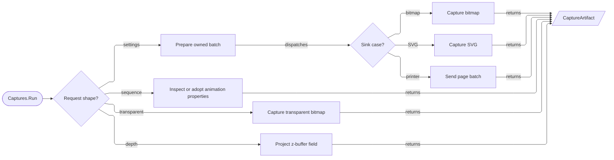

# [RASM_RHINO_CAPTURE]

Capture rendering has one `CaptureRequest` union and one `Captures.Run` entry. Settings, transparent raster, depth, and frame-sequence cases retain modality-specific payloads while converging on one `CaptureArtifact` family. `CaptureFeature` is shared seed data projected into `ViewCaptureSettings`, `ViewCapture`, and `ZBufferCapture`; native settings, bitmaps, buffers, and animation properties stay inside owned brackets.

## [01]-[INDEX]

- [02]-[SPEC_AXES]: Admitted capture extents, origins, subjects, area and scale cases, layout, and settings decoration.
- [03]-[DELIVERY_ROWS]: Settings-driven egress, the transparent and depth facade specifications, and capture artifacts.
- [04]-[FRAME_SEQUENCE]: Document-custodied animation-capture spec — sequence kinds, sun windows, output rows, and the frame receipt.
- [05]-[RUN_RAIL]: Sink-free plans, cardinality-admitted delivery requests, internal prepared leases, and the UI-scoped execution fold.

## [02]-[SPEC_AXES]

- Owner: `Size2i`, `Offset2i`, and `CaptureDpi` are generated values for positive integer extents, nonnegative integer origins, and finite positive DPI; each `Of` bridges generator rejection onto `Fin`. `CaptureAnchor` and `CaptureColor` `[SmartEnum<int>]` rows carry the complete host anchor and output-color projections. `CaptureSubject` `[Union]` closes view and page bases plus a preview that wraps either admitted base; every target is scalar, and the page case requires `ViewportTarget.PageCase`. `CaptureArea` and `CaptureScale` `[Union]` close their variant families; window geometry admits at the factory, and model scale enters the kernel `PositiveMagnitude` gate once.
- Owner: generated `CaptureCrop`, `CaptureMargins`, `CaptureOffset`, `CaptureBanner`, and `PrintFidelity` values plus factory-only `MediaLayout` cases own admitted settings payloads. `CaptureFeature` rows carry nullable settings, transparent, and depth projection columns; each decor admits and applies from those same columns. `CaptureDecor` combines color and text payloads with an admitted frozen feature set. Crop admission performs checked bounds arithmetic, and every physical magnitude is finite and nonnegative in a known unit.
- Law: `MediaLayout` and `CaptureDecor` contain only members represented by `ViewCaptureSettings`. `DrawGridAxes`, `ScaleScreenItems`, and transparency belong exclusively to `TransparentCaptureSpec`; no settings-driven request silently ignores them.
- Law: native `System.Drawing.Size` and `Rectangle` values mint only through the owners' own projections — `Size2i.Native` and `Offset2i.Window(Size2i)` — and integer position never rides the extent type. Preview preparation configures its view/page basis in full, calls `CreatePreviewSettings` once, validates the derived settings, and retires the basis before egress.

```csharp signature
// --- [RUNTIME_PRELUDE] ----------------------------------------------------------------------
using Rasm.Domain;
using Rasm.Numerics;
using Rasm.Rhino.Document;
using Rasm.Rhino.HostUi;
using Rasm.Rhino.Modeling;
using System.Collections.Frozen;
using System.Runtime.InteropServices;

namespace Rasm.Rhino.Viewport;

// --- [TYPES] --------------------------------------------------------------------------------
[ComplexValueObject]
[StructLayout(LayoutKind.Auto)]
public readonly partial struct Size2i {
    public int Width { get; }
    public int Height { get; }

    [BoundaryAdapter]
    static partial void ValidateFactoryArguments(ref ValidationError? validationError, ref int width, ref int height) {
        validationError = Valid(width: width, height: height)
            ? validationError
            : new ValidationError(message: "capture extent is invalid");
    }

    public static Fin<Size2i> Of(int width, int height, Op? key = null) =>
        key.OrDefault().Catch(() => Fin.Succ(Create(width: width, height: height)));

    internal bool IsValid => Valid(width: Width, height: Height);
    internal System.Drawing.Size Native => new(Width, Height);

    private static bool Valid(int width, int height) =>
        width > 0 && height > 0 && (long)width * height <= int.MaxValue;
}

[ComplexValueObject]
[StructLayout(LayoutKind.Auto)]
public readonly partial struct Offset2i {
    public int X { get; }
    public int Y { get; }

    [BoundaryAdapter]
    static partial void ValidateFactoryArguments(ref ValidationError? validationError, ref int x, ref int y) {
        validationError = x >= 0 && y >= 0
            ? validationError
            : new ValidationError(message: "capture origin is invalid");
    }

    public static Fin<Offset2i> Of(int x, int y, Op? key = null) =>
        key.OrDefault().Catch(() => Fin.Succ(Create(x: x, y: y)));

    internal System.Drawing.Rectangle Window(Size2i extent) => new(X, Y, extent.Width, extent.Height);
}

[ValueObject<double>]
public readonly partial struct CaptureDpi {
    [BoundaryAdapter]
    static partial void ValidateFactoryArguments(ref ValidationError? validationError, ref double value) {
        validationError = double.IsFinite(value) && value > 0.0
            ? validationError
            : new ValidationError(message: "capture DPI is invalid");
    }

    public static Fin<CaptureDpi> Of(double value, Op? key = null) =>
        key.OrDefault().AcceptValidated<CaptureDpi>(candidate: value);

    internal bool IsValid => Value > 0.0;
}

[SmartEnum<int>]
public sealed partial class CaptureAnchor {
    public static readonly CaptureAnchor LowerLeft = new(key: 0, native: ViewCaptureSettings.AnchorLocation.LowerLeft);
    public static readonly CaptureAnchor LowerRight = new(key: 1, native: ViewCaptureSettings.AnchorLocation.LowerRight);
    public static readonly CaptureAnchor UpperLeft = new(key: 2, native: ViewCaptureSettings.AnchorLocation.UpperLeft);
    public static readonly CaptureAnchor UpperRight = new(key: 3, native: ViewCaptureSettings.AnchorLocation.UpperRight);
    public static readonly CaptureAnchor Center = new(key: 4, native: ViewCaptureSettings.AnchorLocation.Center);

    internal ViewCaptureSettings.AnchorLocation Native { get; }
}

[SmartEnum<int>]
public sealed partial class CaptureColor {
    public static readonly CaptureColor Display = new(key: 0, native: ViewCaptureSettings.ColorMode.DisplayColor);
    public static readonly CaptureColor Print = new(key: 1, native: ViewCaptureSettings.ColorMode.PrintColor);
    public static readonly CaptureColor Monochrome = new(key: 2, native: ViewCaptureSettings.ColorMode.BlackAndWhite);

    internal ViewCaptureSettings.ColorMode Native { get; }
}

[Union(ConversionFromValue = ConversionOperatorsGeneration.None)]
public abstract partial record CaptureSubject {
    private CaptureSubject() { }

    internal sealed record ViewCase(ViewportTarget Target, Size2i Pixels, CaptureDpi Dpi) : CaptureSubject;
    internal sealed record PageCase(ViewportTarget Target, CaptureDpi Dpi) : CaptureSubject;
    internal sealed record PreviewCase(CaptureSubject Source, Size2i Pixels) : CaptureSubject;

    public static Fin<CaptureSubject> View(ViewportTarget target, Size2i pixels, CaptureDpi dpi, Op? key = null) {
        Op op = key.OrDefault();
        return from valid in op.Need(value: target)
               from _target in guard(valid is not ViewportTarget.EveryCase, op.InvalidInput())
               from _extent in guard(pixels.IsValid, op.InvalidInput())
               from _dpi in guard(dpi.IsValid, op.InvalidInput())
               select (CaptureSubject)new ViewCase(Target: valid, Pixels: pixels, Dpi: dpi);
    }

    public static Fin<CaptureSubject> Page(ViewportTarget target, CaptureDpi dpi, Op? key = null) {
        Op op = key.OrDefault();
        return from valid in op.Need(value: target)
               from _page in guard(valid is ViewportTarget.PageCase, op.InvalidInput())
               from _dpi in guard(dpi.IsValid, op.InvalidInput())
               select (CaptureSubject)new PageCase(Target: valid, Dpi: dpi);
    }

    public static Fin<CaptureSubject> Preview(CaptureSubject source, Size2i pixels, Op? key = null) {
        Op op = key.OrDefault();
        return from valid in op.Need(value: source)
               from _source in guard(valid is ViewCase or PageCase, op.InvalidInput())
               from _extent in guard(pixels.IsValid, op.InvalidInput())
               select (CaptureSubject)new PreviewCase(Source: valid, Pixels: pixels);
    }

    internal ViewportTarget Address => Switch(
        viewCase: static view => view.Target,
        pageCase: static page => page.Target,
        previewCase: static preview => preview.Source.Address);
}

[Union(ConversionFromValue = ConversionOperatorsGeneration.None)]
public abstract partial record CaptureArea {
    private CaptureArea() { }

    internal sealed record FullViewCase : CaptureArea;
    internal sealed record ExtentsCase : CaptureArea;
    internal sealed record ScreenWindowCase(Point2d A, Point2d B) : CaptureArea;
    internal sealed record WorldWindowCase(Point3d A, Point3d B) : CaptureArea;

    public static CaptureArea FullView { get; } = new FullViewCase();
    public static CaptureArea Extents { get; } = new ExtentsCase();

    public static Fin<CaptureArea> ScreenWindow(Point2d a, Point2d b, Op? key = null) =>
        guard(a.IsValid && b.IsValid && a != b, key.OrDefault().InvalidInput()).ToFin()
            .Map(_ => (CaptureArea)new ScreenWindowCase(A: a, B: b));

    public static Fin<CaptureArea> WorldWindow(Point3d a, Point3d b, Op? key = null) =>
        guard(a.IsValid && b.IsValid && a != b, key.OrDefault().InvalidInput()).ToFin()
            .Map(_ => (CaptureArea)new WorldWindowCase(A: a, B: b));

    internal Fin<Unit> Apply(ViewCaptureSettings settings, Op key) => Switch(
        (Settings: settings, Op: key),
        fullViewCase: static (ctx, _) => ctx.Op.Catch(() => ctx.Settings.ViewArea = ViewCaptureSettings.ViewAreaMapping.View),
        extentsCase: static (ctx, _) => ctx.Op.Catch(() => ctx.Settings.ViewArea = ViewCaptureSettings.ViewAreaMapping.Extents),
        screenWindowCase: static (ctx, area) => ctx.Op.Catch(() => {
            ctx.Settings.ViewArea = ViewCaptureSettings.ViewAreaMapping.Window;
            ctx.Settings.SetWindowRect(screenPoint1: area.A, screenPoint2: area.B);
        }),
        worldWindowCase: static (ctx, area) => ctx.Op.Catch(() => {
            ctx.Settings.ViewArea = ViewCaptureSettings.ViewAreaMapping.Window;
            ctx.Settings.SetWindowRect(worldPoint1: area.A, worldPoint2: area.B);
        }));
}

[Union(ConversionFromValue = ConversionOperatorsGeneration.None)]
public abstract partial record CaptureScale {
    private CaptureScale() { }

    internal sealed record NativeCase : CaptureScale;
    internal sealed record ToValueCase(PositiveMagnitude Scale) : CaptureScale;
    internal sealed record ToFitCase : CaptureScale;

    public static CaptureScale Native { get; } = new NativeCase();
    public static CaptureScale ToFit { get; } = new ToFitCase();
    public static Fin<CaptureScale> ToValue(PositiveMagnitude scale, Op? key = null) =>
        key.OrDefault().AcceptValidated<PositiveMagnitude>(candidate: scale.Value)
            .Map(static admitted => (CaptureScale)new ToValueCase(Scale: admitted));

    internal Fin<Unit> Apply(ViewCaptureSettings settings, Op key) => Switch(
        (Settings: settings, Op: key),
        nativeCase: static (_, _) => Fin.Succ(value: unit),
        toValueCase: static (ctx, value) => ctx.Op.Catch(() => ctx.Settings.SetModelScaleToValue(scale: value.Scale.Value)),
        toFitCase: static (ctx, _) => ctx.Op.Catch(() => ctx.Settings.SetModelScaleToFit(promptOnChange: false)));
}

// --- [MODELS] -------------------------------------------------------------------------------
[ComplexValueObject]
public sealed partial class CaptureCrop {
    public Size2i Media { get; }
    public Offset2i Origin { get; }
    public Size2i Extent { get; }

    [BoundaryAdapter]
    static partial void ValidateFactoryArguments(
        ref ValidationError? validationError,
        ref Size2i media,
        ref Offset2i origin,
        ref Size2i extent) {
        validationError = media.IsValid && extent.IsValid
            && (long)origin.X + extent.Width <= media.Width
            && (long)origin.Y + extent.Height <= media.Height
                ? validationError
                : new ValidationError(message: "capture crop is invalid");
    }

    public static Fin<CaptureCrop> Of(Size2i media, Offset2i origin, Size2i extent, Op? key = null) =>
        key.OrDefault().Catch(() => Fin.Succ(Create(media: media, origin: origin, extent: extent)));
}

[ComplexValueObject]
public sealed partial class CaptureMargins {
    public UnitSystem Units { get; }
    public double Left { get; }
    public double Top { get; }
    public double Right { get; }
    public double Bottom { get; }

    [BoundaryAdapter]
    static partial void ValidateFactoryArguments(
        ref ValidationError? validationError,
        ref UnitSystem units,
        ref double left,
        ref double top,
        ref double right,
        ref double bottom) {
        validationError = Enum.IsDefined(value: units)
            && units is not UnitSystem.Unset and not UnitSystem.None and not UnitSystem.CustomUnits
            && new[] { left, top, right, bottom }.All(static value => double.IsFinite(value) && value >= 0.0)
                ? validationError
                : new ValidationError(message: "capture margins are invalid");
    }

    public static Fin<CaptureMargins> Of(UnitSystem units, double left, double top, double right, double bottom, Op? key = null) =>
        key.OrDefault().Catch(() => Fin.Succ(Create(units: units, left: left, top: top, right: right, bottom: bottom)));
}

[SmartEnum<int>]
public sealed partial class OffsetOrigin {
    public static readonly OffsetOrigin Margin = new(key: 0, fromMargin: true);
    public static readonly OffsetOrigin Media = new(key: 1, fromMargin: false);
    internal bool FromMargin { get; }
}

[ComplexValueObject]
public sealed partial class CaptureOffset {
    public UnitSystem Units { get; }
    public OffsetOrigin Origin { get; }
    public double X { get; }
    public double Y { get; }

    [BoundaryAdapter]
    static partial void ValidateFactoryArguments(
        ref ValidationError? validationError,
        ref UnitSystem units,
        ref OffsetOrigin origin,
        ref double x,
        ref double y) {
        validationError = Enum.IsDefined(value: units)
            && units is not UnitSystem.Unset and not UnitSystem.None and not UnitSystem.CustomUnits
            && origin is not null && double.IsFinite(x) && x >= 0.0 && double.IsFinite(y) && y >= 0.0
                ? validationError
                : new ValidationError(message: "capture offset is invalid");
    }

    public static Fin<CaptureOffset> Of(UnitSystem units, OffsetOrigin origin, double x, double y, Op? key = null) =>
        key.OrDefault().Catch(() => Fin.Succ(Create(units: units, origin: origin, x: x, y: y)));
}

[ComplexValueObject]
public sealed partial class CaptureBanner {
    public string Header { get; }
    public string Footer { get; }

    [BoundaryAdapter]
    static partial void ValidateFactoryArguments(
        ref ValidationError? validationError,
        ref string header,
        ref string footer) {
        header = header?.Trim() ?? string.Empty;
        footer = footer?.Trim() ?? string.Empty;
        validationError = header.Length > 0 || footer.Length > 0
            ? validationError
            : new ValidationError(message: "capture banner is empty");
    }

    public static Fin<CaptureBanner> Of(string header, string footer, Op? key = null) =>
        key.OrDefault().Catch(() => Fin.Succ(Create(header: header, footer: footer)));
}

[SmartEnum<int>]
public sealed partial class PrintWidthPolicy {
    public static readonly PrintWidthPolicy Model = new(key: 0, usePrintWidths: true);
    public static readonly PrintWidthPolicy Screen = new(key: 1, usePrintWidths: false);
    internal bool UsePrintWidths { get; }
}

[ComplexValueObject]
public sealed partial class PrintFidelity {
    public PrintWidthPolicy Widths { get; }
    public double WireThicknessScale { get; }
    public double PointSizeMillimeters { get; }
    public double ArrowheadSizeMillimeters { get; }
    public double TextDotPointSize { get; }
    public double DefaultPrintWidthMillimeters { get; }

    [BoundaryAdapter]
    static partial void ValidateFactoryArguments(
        ref ValidationError? validationError,
        ref PrintWidthPolicy widths,
        ref double wireThicknessScale,
        ref double pointSizeMillimeters,
        ref double arrowheadSizeMillimeters,
        ref double textDotPointSize,
        ref double defaultPrintWidthMillimeters) {
        validationError = widths is not null
            && new[] {
                wireThicknessScale,
                pointSizeMillimeters,
                arrowheadSizeMillimeters,
                textDotPointSize,
                defaultPrintWidthMillimeters,
            }.All(static value => double.IsFinite(value) && value >= 0.0)
                ? validationError
                : new ValidationError(message: "print fidelity is invalid");
    }

    public static Fin<PrintFidelity> Of(
        PrintWidthPolicy widths,
        double wireThicknessScale,
        double pointSizeMillimeters,
        double arrowheadSizeMillimeters,
        double textDotPointSize,
        double defaultPrintWidthMillimeters,
        Op? key = null) =>
        key.OrDefault().Catch(() => Fin.Succ(Create(
            widths: widths,
            wireThicknessScale: wireThicknessScale,
            pointSizeMillimeters: pointSizeMillimeters,
            arrowheadSizeMillimeters: arrowheadSizeMillimeters,
            textDotPointSize: textDotPointSize,
            defaultPrintWidthMillimeters: defaultPrintWidthMillimeters)));
}

[SmartEnum<int>]
public sealed partial class AspectPolicy {
    public static readonly AspectPolicy MatchViewport = new(key: 0, shouldMatch: true);
    public static readonly AspectPolicy PreserveMedia = new(key: 1, shouldMatch: false);
    internal bool ShouldMatch { get; }
}

[ComplexValueObject]
public sealed partial class MediaPlacement {
    public static MediaPlacement Default { get; } = Create(
        offset: None,
        anchor: None,
        aspect: AspectPolicy.MatchViewport);

    public Option<CaptureOffset> Offset { get; }
    public Option<CaptureAnchor> Anchor { get; }
    public AspectPolicy Aspect { get; }

    [BoundaryAdapter]
    static partial void ValidateFactoryArguments(
        ref ValidationError? validationError,
        ref Option<CaptureOffset> offset,
        ref Option<CaptureAnchor> anchor,
        ref AspectPolicy aspect) {
        validationError = aspect is not null
            && offset.ForAll(static row => row is not null)
            && anchor.ForAll(static row => row is not null)
                ? validationError
                : new ValidationError(message: "media placement is invalid");
    }

    internal Fin<Unit> Apply(ViewCaptureSettings settings, Op key) => key.Catch(() => {
        _ = Offset.Iter(offset => settings.SetOffset(lengthUnits: offset.Units, fromMargin: offset.Origin.FromMargin, x: offset.X, y: offset.Y));
        _ = Anchor.Iter(anchor => settings.OffsetAnchor = anchor.Native);
        return Aspect.ShouldMatch ? key.Confirm(success: settings.MatchViewportAspectRatio()) : Fin.Succ(unit);
    });
}

[Union(ConversionFromValue = ConversionOperatorsGeneration.None)]
public abstract partial record MediaLayout {
    private MediaLayout() { }
    internal sealed record ViewportCase(MediaPlacement Placement) : MediaLayout;
    internal sealed record CropCase(CaptureCrop Crop, MediaPlacement Placement) : MediaLayout;
    internal sealed record MarginsCase(CaptureMargins Margins, MediaPlacement Placement) : MediaLayout;
    internal sealed record MaximizeCase(MediaPlacement Placement) : MediaLayout;

    public static MediaLayout Default { get; } = new ViewportCase(Placement: MediaPlacement.Default);

    public static Fin<MediaLayout> Viewport(Option<MediaPlacement> placement = default, Op? key = null) =>
        Placed(placement: placement, op: key.OrDefault())
            .Map(static admitted => (MediaLayout)new ViewportCase(Placement: admitted));

    public static Fin<MediaLayout> Crop(CaptureCrop crop, Option<MediaPlacement> placement = default, Op? key = null) {
        Op op = key.OrDefault();
        return from admittedCrop in op.Need(value: crop)
               from admittedPlacement in Placed(placement: placement, op: op)
               select (MediaLayout)new CropCase(Crop: admittedCrop, Placement: admittedPlacement);
    }

    public static Fin<MediaLayout> Margins(CaptureMargins margins, Option<MediaPlacement> placement = default, Op? key = null) {
        Op op = key.OrDefault();
        return from admittedMargins in op.Need(value: margins)
               from admittedPlacement in Placed(placement: placement, op: op)
               select (MediaLayout)new MarginsCase(Margins: admittedMargins, Placement: admittedPlacement);
    }

    public static Fin<MediaLayout> Maximize(Option<MediaPlacement> placement = default, Op? key = null) =>
        Placed(placement: placement, op: key.OrDefault())
            .Map(static admitted => (MediaLayout)new MaximizeCase(Placement: admitted));

    internal Fin<Unit> Apply(ViewCaptureSettings settings, Op key) => Switch(
        (Settings: settings, Op: key),
        viewportCase: static (ctx, layout) => layout.Placement.Apply(settings: ctx.Settings, key: ctx.Op),
        cropCase: static (ctx, layout) => ctx.Op.Catch(() => {
            ctx.Settings.SetLayout(mediaSize: layout.Crop.Media.Native, cropRectangle: layout.Crop.Origin.Window(extent: layout.Crop.Extent));
            return layout.Placement.Apply(settings: ctx.Settings, key: ctx.Op);
        }),
        marginsCase: static (ctx, layout) =>
            from _ in ctx.Op.Confirm(success: ctx.Settings.SetMargins(
                lengthUnits: layout.Margins.Units,
                left: layout.Margins.Left,
                top: layout.Margins.Top,
                right: layout.Margins.Right,
                bottom: layout.Margins.Bottom))
            from placed in layout.Placement.Apply(settings: ctx.Settings, key: ctx.Op)
            select placed,
        maximizeCase: static (ctx, layout) => ctx.Op.Catch(() => {
            ctx.Settings.MaximizePrintableArea();
            return layout.Placement.Apply(settings: ctx.Settings, key: ctx.Op);
        }));

    private static Fin<MediaPlacement> Placed(Option<MediaPlacement> placement, Op op) =>
        op.Need(value: placement.IfNone(MediaPlacement.Default));
}

[SmartEnum<int>]
public sealed partial class CaptureFeature {
    public static readonly CaptureFeature Grid = Row(
        key: 0,
        settings: static (target, on) => target.DrawGrid = on,
        transparent: static (target, on) => target.DrawGrid = on);
    public static readonly CaptureFeature Axes = Row(
        key: 1,
        settings: static (target, on) => target.DrawAxis = on,
        transparent: static (target, on) => target.DrawAxes = on);
    public static readonly CaptureFeature Raster = Row(
        key: 2,
        settings: static (target, on) => target.RasterMode = on);
    public static readonly CaptureFeature Background = Row(
        key: 3,
        settings: static (target, on) => target.DrawBackground = on);
    public static readonly CaptureFeature BackgroundBitmap = Row(
        key: 4,
        settings: static (target, on) => target.DrawBackgroundBitmap = on);
    public static readonly CaptureFeature Wallpaper = Row(
        key: 5,
        settings: static (target, on) => target.DrawWallpaper = on);
    public static readonly CaptureFeature LockedObjects = Row(
        key: 6,
        settings: static (target, on) => target.DrawLockedObjects = on);
    public static readonly CaptureFeature SelectedOnly = Row(
        key: 7,
        settings: static (target, on) => target.DrawSelectedObjectsOnly = on);
    public static readonly CaptureFeature ClippingPlanes = Row(
        key: 8,
        settings: static (target, on) => target.DrawClippingPlanes = on);
    public static readonly CaptureFeature Lights = Row(
        key: 9,
        settings: static (target, on) => target.DrawLights = on,
        depth: static (target, on) => target.ShowLights(on: on));
    public static readonly CaptureFeature MarginLines = Row(
        key: 10,
        settings: static (target, on) => target.DrawMargins = on);
    public static readonly CaptureFeature GridAxes = Row(
        key: 11,
        transparent: static (target, on) => target.DrawGridAxes = on);
    public static readonly CaptureFeature ScaleScreenItems = Row(
        key: 12,
        transparent: static (target, on) => target.ScaleScreenItems = on);
    public static readonly CaptureFeature Isocurves = Row(
        key: 13,
        depth: static (target, on) => target.ShowIsocurves(on: on));
    public static readonly CaptureFeature MeshWires = Row(
        key: 14,
        depth: static (target, on) => target.ShowMeshWires(on: on));
    public static readonly CaptureFeature Curves = Row(
        key: 15,
        depth: static (target, on) => target.ShowCurves(on: on));
    public static readonly CaptureFeature Points = Row(
        key: 16,
        depth: static (target, on) => target.ShowPoints(on: on));
    public static readonly CaptureFeature Text = Row(
        key: 17,
        depth: static (target, on) => target.ShowText(on: on));
    public static readonly CaptureFeature Annotations = Row(
        key: 18,
        depth: static (target, on) => target.ShowAnnotations(on: on));

    internal Action<ViewCaptureSettings, bool>? Settings { get; }
    internal Action<ViewCapture, bool>? Transparent { get; }
    internal Action<ZBufferCapture, bool>? Depth { get; }

    internal static Unit ApplySettings(ViewCaptureSettings target, FrozenSet<CaptureFeature> selected) {
        foreach (CaptureFeature feature in Items) {
            feature.Settings?.Invoke(target, selected.Contains(feature));
        }
        return unit;
    }

    internal static Unit ApplyTransparent(ViewCapture target, FrozenSet<CaptureFeature> selected) {
        foreach (CaptureFeature feature in Items) {
            feature.Transparent?.Invoke(target, selected.Contains(feature));
        }
        return unit;
    }

    internal static Unit ApplyDepth(ZBufferCapture target, FrozenSet<CaptureFeature> selected) {
        foreach (CaptureFeature feature in Items) {
            feature.Depth?.Invoke(target, selected.Contains(feature));
        }
        return unit;
    }

    private static CaptureFeature Row(
        int key,
        Action<ViewCaptureSettings, bool>? settings = null,
        Action<ViewCapture, bool>? transparent = null,
        Action<ZBufferCapture, bool>? depth = null) =>
        new(key: key, settings: settings, transparent: transparent, depth: depth);
}

[ComplexValueObject]
public sealed partial class CaptureDecor {
    public static CaptureDecor Default { get; } = Create(
        features: new[] {
            CaptureFeature.Background,
            CaptureFeature.LockedObjects,
            CaptureFeature.ClippingPlanes,
            CaptureFeature.Lights,
        }.ToFrozenSet(),
        outputColor: CaptureColor.Display,
        banner: None,
        fidelity: None);

    public FrozenSet<CaptureFeature> Features { get; }
    public CaptureColor OutputColor { get; }
    public Option<CaptureBanner> Banner { get; }
    public Option<PrintFidelity> Fidelity { get; }

    [BoundaryAdapter]
    static partial void ValidateFactoryArguments(
        ref ValidationError? validationError,
        ref FrozenSet<CaptureFeature> features,
        ref CaptureColor outputColor,
        ref Option<CaptureBanner> banner,
        ref Option<PrintFidelity> fidelity) {
        validationError = features is not null && features.All(static feature => feature.Settings is not null)
            && outputColor is not null
            && banner.ForAll(static row => row is not null)
            && fidelity.ForAll(static row => row is not null)
                ? validationError
                : new ValidationError(message: "capture decoration is invalid");
    }

    internal Fin<Unit> Apply(ViewCaptureSettings settings, Op key) => key.Catch(() => {
        CaptureDecor self = this;
        settings.OutputColor = self.OutputColor.Native;
        _ = CaptureFeature.ApplySettings(target: settings, selected: self.Features);
        _ = self.Banner.Iter(banner => {
            settings.HeaderText = banner.Header;
            settings.FooterText = banner.Footer;
        });
        _ = self.Fidelity.Iter(row => {
            settings.UsePrintWidths = row.Widths.UsePrintWidths;
            settings.WireThicknessScale = row.WireThicknessScale;
            settings.PointSizeMillimeters = row.PointSizeMillimeters;
            settings.ArrowheadSizeMillimeters = row.ArrowheadSizeMillimeters;
            settings.TextDotPointSize = row.TextDotPointSize;
            settings.DefaultPrintWidthMillimeters = row.DefaultPrintWidthMillimeters;
        });
        return Fin.Succ(value: unit);
    });
}
```

## [03]-[DELIVERY_ROWS]

- Owner: `CaptureSink` owns bitmap, SVG, and printer delivery over one prepared settings batch. `CaptureArtifact` closes raster, vector, printed, depth, and sequence receipts; raster and grayscale payloads cross as owned leases, while all other cases are detached values.
- Owner: `TransparentCaptureSpec` projects supported `CaptureFeature` rows plus `RealtimeRenderPasses` into `ViewCapture`; `DepthChannels` projects the same vocabulary into every `ZBufferCapture.Show*` toggle; `DepthProjection` selects statistics, bounded pixel samples with world recovery, or leased grayscale output.
- Law: depth configuration precedes projection — `SetDisplayMode` and every `Show*` write invalidate the native grayscale cache, so the depth rail applies mode and channels once, then projects. `MinZ`/`MaxZ`/`ZValueAt` return `float` host precision carried unwidened; `WorldPointAt` is the per-pixel screen-to-world unprojection `DepthProbe`'s single-distance camera read cannot answer; `GrayscaleDib` returns the capture-cached bitmap, which survives capsule disposal and transfers into the artifact lease exactly once.
- Boundary: `CaptureRequest` owns modality selection, while each case exposes only its supported payload. `CaptureSink` remains settings-only, so transparent, depth, and sequence requests cannot acquire printer or SVG delivery accidentally.

```csharp signature
// --- [TYPES] --------------------------------------------------------------------------------
public readonly record struct DepthSample(Offset2i Pixel, float Z, Point3d World);

[Union(ConversionFromValue = ConversionOperatorsGeneration.None)]
public abstract partial record DepthPayload {
    private DepthPayload() { }

    public sealed record StatsCase : DepthPayload {
        internal StatsCase() { }
    }

    public sealed record SamplesCase : DepthPayload {
        internal SamplesCase(Seq<DepthSample> rows) => Rows = rows;
        public Seq<DepthSample> Rows { get; }
    }

    public sealed record GrayscaleCase : DepthPayload {
        internal GrayscaleCase(Lease<System.Drawing.Bitmap> pixels) => Pixels = pixels;
        public Lease<System.Drawing.Bitmap> Pixels { get; }
    }
}

public readonly record struct DepthRange(float MinZ, float MaxZ);

public sealed record DepthField {
    internal DepthField(int hits, Option<DepthRange> range, DepthPayload payload) => (Hits, Range, Payload) = (hits, range, payload);

    public int Hits { get; }
    public Option<DepthRange> Range { get; }
    public DepthPayload Payload { get; }
}

[Union(ConversionFromValue = ConversionOperatorsGeneration.None)]
public abstract partial record CaptureArtifact : IDetachedDocumentResult {
    private CaptureArtifact() { }

    public Option<BenchEvidence> Bench { get; init; }

    public sealed record RasterCase : CaptureArtifact {
        internal RasterCase(Lease<System.Drawing.Bitmap> pixels, Size2i extent) => (Pixels, Extent) = (pixels, extent);
        public Lease<System.Drawing.Bitmap> Pixels { get; }
        public Size2i Extent { get; }
    }

    public sealed record VectorCase : CaptureArtifact {
        internal VectorCase(System.Xml.XmlDocument svg) => Svg = svg;
        public System.Xml.XmlDocument Svg { get; }
    }

    public sealed record PrintedCase : CaptureArtifact {
        internal PrintedCase(int pages) => Pages = pages;
        public int Pages { get; }
    }

    public sealed record DepthCase : CaptureArtifact {
        internal DepthCase(DepthField field) => Field = field;
        public DepthField Field { get; }
    }

    public sealed record SequenceCase : CaptureArtifact {
        internal SequenceCase(SequenceReceipt receipt) => Receipt = receipt;
        public SequenceReceipt Receipt { get; }
    }

    internal static Fin<CaptureArtifact> Raster(System.Drawing.Bitmap bitmap, Op key) => key.Catch(() => {
        System.Drawing.Bitmap? owned = bitmap;
        try {
            return Size2i.Of(width: bitmap.Width, height: bitmap.Height, key: key).Match(
                Succ: extent => {
                    CaptureArtifact artifact = new RasterCase(
                        pixels: new Lease<System.Drawing.Bitmap>.Owned(Value: bitmap),
                        extent: extent);
                    owned = null;
                    return Fin.Succ(value: artifact);
                },
                Fail: Fin.Fail<CaptureArtifact>);
        } finally {
            owned?.Dispose();
        }
    });
}

[Union(ConversionFromValue = ConversionOperatorsGeneration.None)]
public abstract partial record CaptureSink {
    private CaptureSink() { }

    internal sealed record BitmapCase : CaptureSink;
    internal sealed record SvgCase : CaptureSink;
    internal sealed record PrinterCase(string PrinterName, Dimension Copies) : CaptureSink;

    public static CaptureSink Bitmap { get; } = new BitmapCase();
    public static CaptureSink Svg { get; } = new SvgCase();

    public static Fin<CaptureSink> Printer(string printerName, Dimension copies, Op? key = null) {
        Op op = key.OrDefault();
        return from name in op.AcceptText(value: printerName)
               from _ in guard(copies.Value >= 1, op.InvalidInput())
               select (CaptureSink)new PrinterCase(PrinterName: name, Copies: copies);
    }

    internal bool AcceptsMany => Switch(
        bitmapCase: static _ => false,
        svgCase: static _ => false,
        printerCase: static _ => true);

    internal Fin<CaptureArtifact> Render(PreparedCapture prepared, Op op) => prepared.Use(
        body: settings => Switch(
            (Settings: settings, Op: op),
            bitmapCase: static (ctx, _) => Rasterized(settings: ctx.Settings, op: ctx.Op),
            svgCase: static (ctx, _) => Vectorized(settings: ctx.Settings, op: ctx.Op),
            printerCase: static (ctx, sink) => Printed(
                settings: ctx.Settings,
                printerName: sink.PrinterName,
                copies: sink.Copies,
                op: ctx.Op)),
        key: op);

    private static Fin<ViewCaptureSettings> One(Seq<ViewCaptureSettings> settings, Op op) =>
        from _ in guard(settings.Count == 1, op.InvalidInput())
        from row in settings.Head.ToFin(Fail: op.MissingContext())
        select row;

    private static Fin<CaptureArtifact> Rasterized(Seq<ViewCaptureSettings> settings, Op op) =>
        from row in One(settings: settings, op: op)
        from bitmap in op.Catch(() => Optional(ViewCapture.CaptureToBitmap(settings: row)).ToFin(Fail: op.InvalidResult()))
        from artifact in CaptureArtifact.Raster(bitmap: bitmap, key: op)
        select artifact;

    private static Fin<CaptureArtifact> Vectorized(Seq<ViewCaptureSettings> settings, Op op) =>
        from row in One(settings: settings, op: op)
        from artifact in op.Catch(() => Optional(ViewCapture.CaptureToSvg(settings: row)).ToFin(Fail: op.InvalidResult())
            .Map(static svg => (CaptureArtifact)new CaptureArtifact.VectorCase(svg: svg)))
        select artifact;

    private static Fin<CaptureArtifact> Printed(Seq<ViewCaptureSettings> settings, string printerName, Dimension copies, Op op) =>
        from _ in op.Catch(() => op.Confirm(success: ViewCapture.SendToPrinter(
            printerName: printerName,
            settings: settings.ToArray(),
            copies: copies.Value)))
        select (CaptureArtifact)new CaptureArtifact.PrintedCase(pages: settings.Count);
}

[ComplexValueObject]
public sealed partial class TransparentDecor {
    public static TransparentDecor Plain { get; } = Create(
        features: new[] { CaptureFeature.ScaleScreenItems }.ToFrozenSet());

    public FrozenSet<CaptureFeature> Features { get; }

    [BoundaryAdapter]
    static partial void ValidateFactoryArguments(
        ref ValidationError? validationError,
        ref FrozenSet<CaptureFeature> features) {
        validationError = features is not null && features.All(static feature => feature.Transparent is not null)
            ? validationError
            : new ValidationError(message: "transparent capture decoration is invalid");
    }

    internal Unit Apply(ViewCapture capture) =>
        CaptureFeature.ApplyTransparent(target: capture, selected: Features);
}

public sealed record TransparentCaptureSpec {
    private TransparentCaptureSpec(ViewportTarget target, Size2i extent, TransparentDecor decor, Option<Dimension> realtimePasses) =>
        (Target, Extent, Decor, RealtimePasses) = (target, extent, decor, realtimePasses);

    public ViewportTarget Target { get; }
    public Size2i Extent { get; }
    public TransparentDecor Decor { get; }
    public Option<Dimension> RealtimePasses { get; }

    public static Fin<TransparentCaptureSpec> Of(
        ViewportTarget target,
        Size2i extent,
        Option<TransparentDecor> decor = default,
        Option<Dimension> realtimePasses = default,
        Op? key = null) {
        Op op = key.OrDefault();
        return from validTarget in op.Need(value: target)
               from _target in guard(
                   validTarget is not ViewportTarget.EveryCase and not ViewportTarget.DetailCase,
                   op.InvalidInput())
               from _extent in guard(extent.IsValid, op.InvalidInput())
               from _passes in guard(realtimePasses.ForAll(static passes => passes.Value >= 1), op.InvalidInput())
               select new TransparentCaptureSpec(
                   target: validTarget,
                   extent: extent,
                   decor: decor.IfNone(TransparentDecor.Plain),
                   realtimePasses: realtimePasses);
    }
}

[ComplexValueObject]
public sealed partial class DepthChannels {
    public static DepthChannels Surfaces { get; } = Create(
        features: Array.Empty<CaptureFeature>().ToFrozenSet());
    public static DepthChannels Geometry { get; } = Create(
        features: new[] {
            CaptureFeature.Isocurves,
            CaptureFeature.MeshWires,
            CaptureFeature.Curves,
            CaptureFeature.Points,
        }.ToFrozenSet());
    public static DepthChannels Everything { get; } = Create(
        features: Geometry.Features.Concat(new[] {
            CaptureFeature.Text,
            CaptureFeature.Annotations,
            CaptureFeature.Lights,
        }).ToFrozenSet());

    public FrozenSet<CaptureFeature> Features { get; }

    [BoundaryAdapter]
    static partial void ValidateFactoryArguments(
        ref ValidationError? validationError,
        ref FrozenSet<CaptureFeature> features) {
        validationError = features is not null && features.All(static feature => feature.Depth is not null)
            ? validationError
            : new ValidationError(message: "depth channels are invalid");
    }

    internal Unit Apply(ZBufferCapture capture) =>
        CaptureFeature.ApplyDepth(target: capture, selected: Features);
}

[Union(ConversionFromValue = ConversionOperatorsGeneration.None)]
public abstract partial record DepthProjection {
    private DepthProjection() { }

    internal sealed record StatsCase : DepthProjection;
    internal sealed record SamplesCase(Seq<Offset2i> Pixels) : DepthProjection;
    internal sealed record GrayscaleCase : DepthProjection;

    public static DepthProjection Stats { get; } = new StatsCase();
    public static DepthProjection Grayscale { get; } = new GrayscaleCase();

    public static Fin<DepthProjection> Samples(ReadOnlySpan<Offset2i> pixels, Op? key = null) =>
        guard(pixels.Length > 0, key.OrDefault().InvalidInput()).ToFin()
            .Map(_ => (DepthProjection)new SamplesCase(Pixels: toSeq(pixels.ToArray()).Strict()));

    internal Fin<DepthPayload> Project(ZBufferCapture capture, Op key) => Switch(
        (Capture: capture, Op: key),
        statsCase: static (_, _) => Fin.Succ(value: (DepthPayload)new DepthPayload.StatsCase()),
        samplesCase: static (ctx, projection) => ctx.Op.Catch(() => {
            System.Drawing.Bitmap? bounds = ctx.Capture.GrayscaleDib();
            return from raster in Optional(bounds).ToFin(Fail: ctx.Op.InvalidResult())
                   from pixels in projection.Pixels.TraverseM(pixel =>
                       guard(pixel.X >= 0 && pixel.Y >= 0 && pixel.X < raster.Width && pixel.Y < raster.Height, ctx.Op.InvalidInput())
                           .ToFin()
                           .Map(_ => new DepthSample(
                               Pixel: pixel,
                               Z: ctx.Capture.ZValueAt(x: pixel.X, y: pixel.Y),
                               World: ctx.Capture.WorldPointAt(x: pixel.X, y: pixel.Y)))).As()
                   select (DepthPayload)new DepthPayload.SamplesCase(rows: pixels.Strict());
        }),
        grayscaleCase: static (ctx, _) => ctx.Op.Catch(() =>
            Optional(ctx.Capture.GrayscaleDib()).ToFin(Fail: ctx.Op.InvalidResult())
                .Map(static bitmap => (DepthPayload)new DepthPayload.GrayscaleCase(
                    pixels: new Lease<System.Drawing.Bitmap>.Owned(Value: bitmap)))));
}

public sealed record DepthCaptureSpec {
    private DepthCaptureSpec(ViewportTarget target, Option<Guid> mode, DepthChannels channels, DepthProjection projection) =>
        (Target, Mode, Channels, Projection) = (target, mode, channels, projection);

    public ViewportTarget Target { get; }
    public Option<Guid> Mode { get; }
    public DepthChannels Channels { get; }
    public DepthProjection Projection { get; }

    public static Fin<DepthCaptureSpec> Of(
        ViewportTarget target,
        Option<Guid> mode = default,
        Option<DepthChannels> channels = default,
        Option<DepthProjection> projection = default,
        Op? key = null) {
        Op op = key.OrDefault();
        return from valid in op.Need(value: target)
               from _target in guard(valid is not ViewportTarget.EveryCase, op.InvalidInput())
               from _mode in guard(mode.ForAll(static id => id != Guid.Empty), op.InvalidInput())
               select new DepthCaptureSpec(
                   target: valid,
                   mode: mode,
                   channels: channels.IfNone(DepthChannels.Geometry),
                   projection: projection.IfNone(DepthProjection.Stats));
    }
}
```

## [04]-[FRAME_SEQUENCE]

- Owner: `SequenceKind` `[Union]` — factory-only motion cases: turntable, dual-track path, single-track flythrough, one-day sun study, and seasonal sun study, each carrying exactly the evidence its host write consumes. `SequenceTrack` `[Union]` — a motion track as a path-curve id or an admitted point row set, written through the internal `TrackSlot` setter columns so camera and target slots share one dispatch. `SunPlace`, `SunDay`, and `SunSpan` — admitted sun geometry and calendar windows inside the host ranges: latitude `[-90, 90]`, longitude `[-180, 180]`, years `1800..2199`, ordered time-of-day and date windows, positive frame spacing.
- Owner: `SequenceOutput` owns `FolderName`, `FileExtension`, `AnimationName`, and optional `HtmlFileName`; `SequenceFidelity` joins `CaptureMethod`, `RenderFull`, and `RenderPreview`; `FrameSequenceSpec` owns kind, frame count, viewport, display mode, output, and fidelity. `SequenceReceipt` returns both `HtmlFileName` and `HtmlFullPath` with image and date evidence.
- Entry: `CaptureRequest.Sequence(SequenceOp, Op?)` enters `Captures.Run`, so sequence custody and sequence evidence share the capture dispatch and return `CaptureArtifact.SequenceCase`.
- Law: `RhinoDoc.AnimationProperties` GET mints a detached native copy and SET commits it — in-place mutation without the set-back is inert. Adopt is one copy-edit-commit inside the shared undo bracket: the fresh copy preserves every member the spec leaves unstated, the spec writes land, the property set commits, and the receipt re-reads committed state.
- Law: the spec configures and the host animation tools record — `Images`, `Dates`, and `CurrentFrame` are host-written receipts read back as evidence, never spec inputs. A sun-study case writes place and window together; day studies space frames by `MinutesBetweenFrames`, seasonal studies by `DaysBetweenFrames`, and the unused spacing member is never written.
- Law: `SequenceOutput` admits extension, animation name, and HTML name as canonical filename components; separators, special dot components, platform-invalid characters, and trailing dots or spaces never reach native output metadata.

```csharp signature
// --- [TYPES] --------------------------------------------------------------------------------
[SmartEnum<int>]
internal sealed partial class TrackSlot {
    public static readonly TrackSlot Camera = new(
        key: 0,
        curve: static (native, id) => { native.CameraPathId = id; return unit; },
        points: static (native, points) => { native.CameraPoints = points; return unit; });
    public static readonly TrackSlot Target = new(
        key: 1,
        curve: static (native, id) => { native.TargetPathId = id; return unit; },
        points: static (native, points) => { native.TargetPoints = points; return unit; });

    [UseDelegateFromConstructor]
    internal partial Unit Curve(AnimationProperties native, Guid id);

    [UseDelegateFromConstructor]
    internal partial Unit Points(AnimationProperties native, Point3d[] points);
}

[Union(ConversionFromValue = ConversionOperatorsGeneration.None)]
public abstract partial record SequenceTrack {
    private SequenceTrack() { }

    internal sealed record CurveCase(Guid PathId) : SequenceTrack;
    internal sealed record PointsCase(Seq<Point3d> Rows) : SequenceTrack;

    public static Fin<SequenceTrack> Curve(Guid pathId, Op? key = null) =>
        guard(pathId != Guid.Empty, key.OrDefault().InvalidInput()).ToFin()
            .Map(_ => (SequenceTrack)new CurveCase(PathId: pathId));

    public static Fin<SequenceTrack> Points(ReadOnlySpan<Point3d> points, Op? key = null) {
        Seq<Point3d> rows = toSeq(points.ToArray()).Strict();
        return guard(rows.Count >= 2 && rows.ForAll(static point => point.IsValid), key.OrDefault().InvalidInput()).ToFin()
            .Map(_ => (SequenceTrack)new PointsCase(Rows: rows));
    }

    internal Unit Write(AnimationProperties native, TrackSlot slot) => Switch(
        (Native: native, Slot: slot),
        curveCase: static (ctx, track) => ctx.Slot.Curve(native: ctx.Native, id: track.PathId),
        pointsCase: static (ctx, track) => ctx.Slot.Points(native: ctx.Native, points: track.Rows.ToArray()));
}

[SmartEnum<int>]
public sealed partial class SequenceMode {
    public static readonly SequenceMode Path = new(key: 0);
    public static readonly SequenceMode Turntable = new(key: 1);
    public static readonly SequenceMode Flythrough = new(key: 2);
    public static readonly SequenceMode DaySun = new(key: 3);
    public static readonly SequenceMode Season = new(key: 4);
    public static readonly SequenceMode Unset = new(key: 5);

    internal static Fin<SequenceMode> Of(AnimationProperties.CaptureTypes value, Op key) => value switch {
        AnimationProperties.CaptureTypes.Path => Fin.Succ(value: Path),
        AnimationProperties.CaptureTypes.Turntable => Fin.Succ(value: Turntable),
        AnimationProperties.CaptureTypes.Flythrough => Fin.Succ(value: Flythrough),
        AnimationProperties.CaptureTypes.DaySunStudy => Fin.Succ(value: DaySun),
        AnimationProperties.CaptureTypes.SeasonalSunStudy => Fin.Succ(value: Season),
        AnimationProperties.CaptureTypes.None => Fin.Succ(value: Unset),
        var unknown => Fin.Fail<SequenceMode>(error: key.InvalidResult(detail: unknown.ToString())),
    };
}

[SmartEnum<int>]
public sealed partial class SequenceFidelity {
    public static readonly SequenceFidelity Draft = new(key: 0, method: "preview", renderFull: false, renderPreview: false);
    public static readonly SequenceFidelity Recorded = new(key: 1, method: "full", renderFull: false, renderPreview: false);
    public static readonly SequenceFidelity RenderedPreview = new(key: 2, method: "full", renderFull: false, renderPreview: true);
    public static readonly SequenceFidelity Rendered = new(key: 3, method: "full", renderFull: true, renderPreview: false);

    internal string Method { get; }
    internal bool RenderFull { get; }
    internal bool RenderPreview { get; }

    internal Unit Write(AnimationProperties native) {
        native.CaptureMethod = Method;
        native.RenderFull = RenderFull;
        native.RenderPreview = RenderPreview;
        return unit;
    }
}

// --- [MODELS] -------------------------------------------------------------------------------
public sealed record SunPlace {
    private SunPlace(double latitude, double longitude, double northAngle) =>
        (Latitude, Longitude, NorthAngle) = (latitude, longitude, northAngle);

    public double Latitude { get; }
    public double Longitude { get; }
    public double NorthAngle { get; }

    public static Fin<SunPlace> Of(double latitude, double longitude, double northAngle = 0.0, Op? key = null) =>
        guard(
            latitude is >= -90.0 and <= 90.0 && longitude is >= -180.0 and <= 180.0 && double.IsFinite(northAngle),
            key.OrDefault().InvalidInput()).ToFin()
            .Map(_ => new SunPlace(latitude: latitude, longitude: longitude, northAngle: northAngle));

    internal Unit Write(AnimationProperties native) {
        native.Latitude = Latitude;
        native.Longitude = Longitude;
        native.NorthAngle = NorthAngle;
        return unit;
    }
}

public sealed record SunDay {
    private SunDay(DateOnly date, TimeOnly from, TimeOnly until, int minutesBetween) =>
        (Date, From, Until, MinutesBetween) = (date, from, until, minutesBetween);

    public DateOnly Date { get; }
    public TimeOnly From { get; }
    public TimeOnly Until { get; }
    public int MinutesBetween { get; }

    public static Fin<SunDay> Of(DateOnly date, TimeOnly from, TimeOnly until, int minutesBetween, Op? key = null) =>
        guard(date.Year is >= 1800 and <= 2199 && from < until && minutesBetween >= 1, key.OrDefault().InvalidInput()).ToFin()
            .Map(_ => new SunDay(date: date, from: from, until: until, minutesBetween: minutesBetween));

    internal Unit Write(AnimationProperties native) {
        (native.StartYear, native.StartMonth, native.StartDay) = (Date.Year, Date.Month, Date.Day);
        (native.EndYear, native.EndMonth, native.EndDay) = (Date.Year, Date.Month, Date.Day);
        (native.StartHour, native.StartMinutes, native.StartSeconds) = (From.Hour, From.Minute, From.Second);
        (native.EndHour, native.EndMinutes, native.EndSeconds) = (Until.Hour, Until.Minute, Until.Second);
        native.MinutesBetweenFrames = MinutesBetween;
        return unit;
    }
}

public sealed record SunSpan {
    private SunSpan(DateOnly from, DateOnly until, int daysBetween) => (From, Until, DaysBetween) = (from, until, daysBetween);

    public DateOnly From { get; }
    public DateOnly Until { get; }
    public int DaysBetween { get; }

    public static Fin<SunSpan> Of(DateOnly from, DateOnly until, int daysBetween, Op? key = null) =>
        guard(
            from.Year is >= 1800 and <= 2199 && until.Year is >= 1800 and <= 2199 && from < until && daysBetween >= 1,
            key.OrDefault().InvalidInput()).ToFin()
            .Map(_ => new SunSpan(from: from, until: until, daysBetween: daysBetween));

    internal Unit Write(AnimationProperties native) {
        (native.StartYear, native.StartMonth, native.StartDay) = (From.Year, From.Month, From.Day);
        (native.EndYear, native.EndMonth, native.EndDay) = (Until.Year, Until.Month, Until.Day);
        native.DaysBetweenFrames = DaysBetween;
        return unit;
    }
}

[Union(ConversionFromValue = ConversionOperatorsGeneration.None)]
public abstract partial record SequenceKind {
    private SequenceKind() { }

    internal sealed record TurntableCase : SequenceKind;
    internal sealed record PathCase(SequenceTrack Camera, SequenceTrack Focus) : SequenceKind;
    internal sealed record FlythroughCase(SequenceTrack Track) : SequenceKind;
    internal sealed record DaySunCase(SunPlace Place, SunDay Day) : SequenceKind;
    internal sealed record SeasonCase(SunPlace Place, SunSpan Span) : SequenceKind;

    public static SequenceKind Turntable { get; } = new TurntableCase();

    public static Fin<SequenceKind> Path(SequenceTrack camera, SequenceTrack focus, Op? key = null) {
        Op op = key.OrDefault();
        return from lens in op.Need(value: camera)
               from aim in op.Need(value: focus)
               select (SequenceKind)new PathCase(Camera: lens, Focus: aim);
    }

    public static Fin<SequenceKind> Flythrough(SequenceTrack track, Op? key = null) =>
        key.OrDefault().Need(value: track)
            .Map(static admitted => (SequenceKind)new FlythroughCase(Track: admitted));

    public static Fin<SequenceKind> DaySun(SunPlace place, SunDay day, Op? key = null) {
        Op op = key.OrDefault();
        return from site in op.Need(value: place)
               from window in op.Need(value: day)
               select (SequenceKind)new DaySunCase(Place: site, Day: window);
    }

    public static Fin<SequenceKind> Season(SunPlace place, SunSpan span, Op? key = null) {
        Op op = key.OrDefault();
        return from site in op.Need(value: place)
               from window in op.Need(value: span)
               select (SequenceKind)new SeasonCase(Place: site, Span: window);
    }

    internal Unit Write(AnimationProperties native) => Switch(
        native,
        turntableCase: static (n, _) => {
            n.CaptureType = AnimationProperties.CaptureTypes.Turntable;
            return unit;
        },
        pathCase: static (n, kind) => {
            n.CaptureType = AnimationProperties.CaptureTypes.Path;
            _ = kind.Camera.Write(native: n, slot: TrackSlot.Camera);
            return kind.Focus.Write(native: n, slot: TrackSlot.Target);
        },
        flythroughCase: static (n, kind) => {
            n.CaptureType = AnimationProperties.CaptureTypes.Flythrough;
            return kind.Track.Write(native: n, slot: TrackSlot.Camera);
        },
        daySunCase: static (n, kind) => {
            n.CaptureType = AnimationProperties.CaptureTypes.DaySunStudy;
            _ = kind.Place.Write(native: n);
            return kind.Day.Write(native: n);
        },
        seasonCase: static (n, kind) => {
            n.CaptureType = AnimationProperties.CaptureTypes.SeasonalSunStudy;
            _ = kind.Place.Write(native: n);
            return kind.Span.Write(native: n);
        });
}

public sealed record SequenceOutput {
    private SequenceOutput(DocumentPath folder, string extension, string name, Option<string> htmlFileName) =>
        (Folder, Extension, Name, HtmlFileName) = (folder, extension, name, htmlFileName);

    public DocumentPath Folder { get; }
    public string Extension { get; }
    public string Name { get; }
    public Option<string> HtmlFileName { get; }

    public static Fin<SequenceOutput> Of(
        DocumentPath folder,
        string extension,
        string name,
        Option<string> htmlFileName = default,
        Op? key = null) {
        Op op = key.OrDefault();
        return from admittedFolder in op.Need(value: folder)
               from ext in op.AcceptText(value: extension)
               let normalizedExtension = ext.Trim().TrimStart('.')
               from admittedExtension in Component(value: normalizedExtension, op: op)
               from label in Component(value: name, op: op)
               from html in htmlFileName.Traverse(value => Component(value: value, op: op)).As()
               select new SequenceOutput(
                   folder: admittedFolder,
                   extension: admittedExtension,
                   name: label,
                   htmlFileName: html);
    }

    private static Fin<string> Component(string value, Op op) =>
        from admitted in op.AcceptText(value: value)
        let component = admitted.Trim()
        from _ in guard(
            component is not "." and not ".."
            && component.IndexOfAny(System.IO.Path.GetInvalidFileNameChars()) < 0
            && component.IndexOfAny(['/', '\\']) < 0
            && !component.EndsWith('.')
            && !component.EndsWith(' '),
            op.InvalidInput())
        select component;

    internal Unit Write(AnimationProperties native) {
        native.FolderName = Folder.Value;
        native.FileExtension = Extension;
        native.AnimationName = Name;
        _ = HtmlFileName.Iter(value => native.HtmlFileName = value);
        return unit;
    }
}

public sealed record FrameSequenceSpec {
    private FrameSequenceSpec(
        SequenceKind kind,
        Dimension frames,
        ViewportTarget target,
        Option<Guid> mode,
        Option<SequenceOutput> output,
        Option<SequenceFidelity> fidelity) =>
        (Kind, Frames, Target, Mode, Output, Fidelity) = (kind, frames, target, mode, output, fidelity);

    public SequenceKind Kind { get; }
    public Dimension Frames { get; }
    public ViewportTarget Target { get; }
    public Option<Guid> Mode { get; }
    public Option<SequenceOutput> Output { get; }
    public Option<SequenceFidelity> Fidelity { get; }

    public static Fin<FrameSequenceSpec> Of(
        SequenceKind kind,
        Dimension frames,
        ViewportTarget target,
        Option<Guid> mode = default,
        Option<SequenceOutput> output = default,
        Option<SequenceFidelity> fidelity = default,
        Op? key = null) {
        Op op = key.OrDefault();
        return from motion in op.Need(value: kind)
               from _frames in guard(frames.Value >= 1, op.InvalidInput())
               from address in op.Need(value: target)
               from _target in guard(address is not ViewportTarget.EveryCase, op.InvalidInput())
               from _mode in guard(mode.ForAll(static id => id != Guid.Empty), op.InvalidInput())
               select new FrameSequenceSpec(
                   kind: motion,
                   frames: frames,
                   target: address,
                   mode: mode,
                   output: output,
                   fidelity: fidelity);
    }

    internal Unit Write(AnimationProperties native, RhinoViewport viewport) {
        _ = Kind.Write(native: native);
        native.FrameCount = Frames.Value;
        native.ViewportName = viewport.Name;
        _ = Mode.Iter(id => native.DisplayMode = id);
        _ = Output.Iter(rows => rows.Write(native: native));
        _ = Fidelity.Iter(row => row.Write(native: native));
        return unit;
    }
}

public sealed record SequenceReceipt(
    SequenceMode Mode,
    int Frames,
    int CurrentFrame,
    string ViewportName,
    Option<Guid> DisplayMode,
    string Folder,
    string Extension,
    string Name,
    string HtmlFileName,
    string HtmlPath,
    Seq<string> Images,
    Seq<string> Dates,
    uint UndoRecord = 0u) : IDetachedDocumentResult {

    internal SequenceReceipt Stamp(uint undoRecord) => this with { UndoRecord = undoRecord };
}

[Union(ConversionFromValue = ConversionOperatorsGeneration.None)]
public abstract partial record SequenceOp {
    private SequenceOp() { }

    internal sealed record InspectCase : SequenceOp;
    internal sealed record AdoptCase(FrameSequenceSpec Spec) : SequenceOp;

    public static SequenceOp Inspect { get; } = new InspectCase();

    public static Fin<SequenceOp> Adopt(FrameSequenceSpec spec, Op? key = null) =>
        key.OrDefault().Need(value: spec)
            .Map(static admitted => (SequenceOp)new AdoptCase(Spec: admitted));
}
```

## [05]-[RUN_RAIL]

- Owner: `CapturePlan` is the sink-free preparation value. `CaptureRequest` closes settings, transparent, depth, and sequence modalities behind their factories; `SettingsCase` alone pairs a non-empty plan sequence with a settings-driven sink and sink-derived cardinality admission. `PreparedCapture` is the internal disposable prepared-program resource; its settings sequence carries arity, its `Use` gate rejects use after disposal, and reverse release retires every native setting after the sole consumer settles.
- Entry: `Captures.Run(DocumentSession, CaptureRequest, Op?) : Fin<CaptureArtifact>` is the sole public execution rail. `CaptureRequest.Settings`, `Transparent`, `Depth`, and `Sequence` admit each modality; internal `Stage` shares settings acquisition with PDF composition without exposing `ViewCaptureSettings`.
- Law: every capture entry crosses `HostThread.Run` with a `HostWork<T>.Session`; settings, transparent, and depth cases carry `SessionNeed.Redraw`, sequence adopt carries `SessionNeed.Mutate` plus `SessionNeed.Undo` around one sealed `UndoBracket`, and sequence inspect carries `SessionNeed.Read` only. Target resolution, host work, delivery, and disposal remain inside that command-thread scope.
- Law: run-rail frame timing is the Modeling bench band — every `Captures.Run` case crosses `HostThread.Run`, brackets its in-host body in `BenchBand.Measured`, and stamps the `BenchEvidence` (operation identity from the request case, input scale from the case's own cardinality — plan count, pixel area, sample count, or frame count — duration, allocation, host fingerprint) onto `CaptureArtifact.Bench`, so allocation belongs to the executing host thread and bridge-run harvest sessions produce corpus-comparable rows with no second measurement path.
- Law: batch preparation is one iterative `Fold`. A failed acquisition reverse-disposes every previously prepared setting, and the completed `PreparedCapture` reverse-disposes its sequence after the sole consumer settles.
- Law: preparation applies viewport → area → layout → scale → decoration exactly once, then derives a preview from that completed basis when requested. Viewport binding precedes window projection, aspect matching, and fit scaling, and the bound viewport is the resolved row's own — a page address resolves to `RhinoPageView.MainViewport` and a detail address to `DetailViewObject.Viewport` at the target resolution, so no capture-side re-addressing exists. A settings handle never appears on a public signature, and internal prepared resources reject every use after their lease closes.

```csharp signature
// --- [MODELS] -------------------------------------------------------------------------------
public sealed record CapturePlan {
    private CapturePlan(CaptureSubject subject, CaptureArea area, CaptureScale scale, MediaLayout layout, CaptureDecor decor) =>
        (Subject, Area, Scale, Layout, Decor) = (subject, area, scale, layout, decor);

    public CaptureSubject Subject { get; }
    public CaptureArea Area { get; }
    public CaptureScale Scale { get; }
    public MediaLayout Layout { get; }
    public CaptureDecor Decor { get; }

    public static Fin<CapturePlan> Of(
        CaptureSubject subject,
        Option<CaptureArea> area = default,
        Option<CaptureScale> scale = default,
        Option<MediaLayout> layout = default,
        Option<CaptureDecor> decor = default,
        Op? key = null) {
        Op op = key.OrDefault();
        return op.Need(value: subject).Map(origin => new CapturePlan(
            subject: origin,
            area: area.IfNone(CaptureArea.FullView),
            scale: scale.IfNone(CaptureScale.Native),
            layout: layout.IfNone(MediaLayout.Default),
            decor: decor.IfNone(CaptureDecor.Default)));
    }
}

[Union(ConversionFromValue = ConversionOperatorsGeneration.None)]
public abstract partial record CaptureRequest {
    private CaptureRequest() { }
    internal sealed record SettingsCase(Seq<CapturePlan> Plans, CaptureSink Sink) : CaptureRequest;
    internal sealed record TransparentCase(TransparentCaptureSpec Spec) : CaptureRequest;
    internal sealed record DepthCase(DepthCaptureSpec Spec) : CaptureRequest;
    internal sealed record SequenceCase(SequenceOp Operation) : CaptureRequest;

    public static Fin<CaptureRequest> Settings(CaptureSink sink, ReadOnlySpan<CapturePlan> plans, Op? key = null) {
        Op op = key.OrDefault();
        Seq<CapturePlan> rows = toSeq(plans.ToArray()).Strict();
        return from admittedSink in op.Need(value: sink)
               from _rows in guard(!rows.IsEmpty && rows.ForAll(static plan => plan is not null), op.InvalidInput())
               from _arity in guard(admittedSink.AcceptsMany || rows.Count == 1, op.InvalidInput())
               select (CaptureRequest)new SettingsCase(Plans: rows, Sink: admittedSink);
    }

    public static Fin<CaptureRequest> Transparent(TransparentCaptureSpec spec, Op? key = null) =>
        key.OrDefault().Need(value: spec).Map(static admitted => (CaptureRequest)new TransparentCase(Spec: admitted));

    public static Fin<CaptureRequest> Depth(DepthCaptureSpec spec, Op? key = null) =>
        key.OrDefault().Need(value: spec).Map(static admitted => (CaptureRequest)new DepthCase(Spec: admitted));

    public static Fin<CaptureRequest> Sequence(SequenceOp operation, Op? key = null) =>
        key.OrDefault().Need(value: operation).Map(static admitted => (CaptureRequest)new SequenceCase(Operation: admitted));
}

// --- [RESOURCES] ----------------------------------------------------------------------------
internal sealed class PreparedCapture : IDisposable {
    private readonly Seq<ViewCaptureSettings> settings;
    private bool disposed;

    internal PreparedCapture(Seq<ViewCaptureSettings> settings) => this.settings = settings;

    internal Fin<TOut> Use<TOut>(Func<Seq<ViewCaptureSettings>, Fin<TOut>> body, Op key) =>
        from consumer in Optional(body).ToFin(Fail: key.InvalidInput())
        from _live in guard(!disposed, key.InvalidResult())
        from output in key.Catch(() => consumer(settings))
        select output;

    public void Dispose() {
        if (disposed) return;
        disposed = true;
        _ = Release(settings);
    }

    internal static Unit Release(Seq<ViewCaptureSettings> rows) {
        Option<Exception> first = rows.Rev()
            .Map(static row => {
                try { row.Dispose(); return Option<Exception>.None; }
                catch (Exception error) { return Some(error); }
            })
            .Bind(static error => error.ToSeq())
            .Strict()
            .Head;
        _ = first.Iter(static error => System.Runtime.ExceptionServices.ExceptionDispatchInfo.Capture(error).Throw());
        return unit;
    }
}

// --- [OPERATIONS] ---------------------------------------------------------------------------
public static class Captures {
    public static Fin<CaptureArtifact> Run(DocumentSession session, CaptureRequest request, Op? key = null) {
        Op op = key.OrDefault();
        return from owner in Optional(session).ToFin(Fail: op.MissingContext())
               from admitted in op.Need(value: request)
               let identity = admitted.Switch(
                   settingsCase: static row => (Operation: nameof(Settings), Scale: (long)row.Plans.Count),
                   transparentCase: static row => (Operation: nameof(Transparent), Scale: (long)row.Spec.Extent.Width * row.Spec.Extent.Height),
                   depthCase: static row => (Operation: nameof(Depth), Scale: row.Spec.Projection is DepthProjection.SamplesCase samples ? samples.Pixels.Count : 1L),
                   sequenceCase: static row => (Operation: nameof(CaptureRequest.Sequence), Scale: row.Operation is SequenceOp.AdoptCase adopt ? adopt.Spec.Frames.Value : 1L))
               from artifact in admitted.Switch(
                   (Session: owner, Identity: identity, Op: op),
                   settingsCase: static (ctx, row) => SettingsRun(
                       session: ctx.Session, plans: row.Plans, sink: row.Sink,
                       operation: ctx.Identity.Operation, inputScale: ctx.Identity.Scale, key: ctx.Op),
                   transparentCase: static (ctx, row) => TransparentRun(
                       session: ctx.Session, spec: row.Spec,
                       operation: ctx.Identity.Operation, inputScale: ctx.Identity.Scale, key: ctx.Op),
                   depthCase: static (ctx, row) => DepthRun(
                       session: ctx.Session, spec: row.Spec,
                       operation: ctx.Identity.Operation, inputScale: ctx.Identity.Scale, key: ctx.Op),
                   sequenceCase: static (ctx, row) => SequenceRun(
                       session: ctx.Session, request: row.Operation,
                       operation: ctx.Identity.Operation, inputScale: ctx.Identity.Scale, key: ctx.Op))
               select artifact;
    }

    private static Fin<CaptureArtifact> SettingsRun(
        DocumentSession session, Seq<CapturePlan> plans, CaptureSink sink,
        string operation, long inputScale, Op key) =>
        HostThread.Run(
            work: new HostWork<CaptureArtifact>.Session(
                Document: session,
                Needs: [SessionNeed.Redraw],
                Body: document => Measured(
                    operation: operation,
                    inputScale: inputScale,
                    run: () => Prepare(document: document, plans: plans, key: key)
                        .Bind(lease => lease.Use(prepared => sink.Render(prepared: prepared, op: key))))),
            key: key);

    private static Fin<CaptureArtifact> TransparentRun(
        DocumentSession session, TransparentCaptureSpec spec,
        string operation, long inputScale, Op key) =>
        HostThread.Run(
            work: new HostWork<CaptureArtifact>.Session(
                Document: session,
                Needs: [SessionNeed.Redraw],
                Body: document => Measured(
                    operation: operation,
                    inputScale: inputScale,
                    run: () => from row in spec.Target.ResolveOne(document: document, key: key)
                               from captured in Transparent(row: row, spec: spec, key: key)
                               select captured)),
            key: key);

    private static Fin<CaptureArtifact> DepthRun(
        DocumentSession session, DepthCaptureSpec spec,
        string operation, long inputScale, Op key) =>
        HostThread.Run(
            work: new HostWork<CaptureArtifact>.Session(
                Document: session,
                Needs: [SessionNeed.Redraw],
                Body: document => Measured(
                    operation: operation,
                    inputScale: inputScale,
                    run: () => from viewport in spec.Target.ResolveViewport(document: document, key: key)
                               from field in Depth(viewport: viewport, spec: spec, key: key)
                               select (CaptureArtifact)new CaptureArtifact.DepthCase(field: field))),
            key: key);

    private static Fin<CaptureArtifact> SequenceRun(
        DocumentSession session, SequenceOp request,
        string operation, long inputScale, Op key) =>
        request.Switch(
            (Session: session, Operation: operation, Scale: inputScale, Op: key),
            inspectCase: static (ctx, _) => HostThread.Run(
                work: new HostWork<CaptureArtifact>.Session(
                    Document: ctx.Session,
                    Needs: [SessionNeed.Read],
                    Body: document => Measured(
                        operation: ctx.Operation,
                        inputScale: ctx.Scale,
                        run: () => Sequenced(document: document, key: ctx.Op)
                            .Map(static receipt => (CaptureArtifact)new CaptureArtifact.SequenceCase(receipt: receipt)))),
                key: ctx.Op),
            adoptCase: static (ctx, adopt) => HostThread.Run(
                work: new HostWork<CaptureArtifact>.Session(
                    Document: ctx.Session,
                    Needs: [SessionNeed.Mutate, SessionNeed.Undo],
                    Body: document => Measured(
                        operation: ctx.Operation,
                        inputScale: ctx.Scale,
                        run: () => Adopted(document: document, spec: adopt.Spec, key: ctx.Op)
                            .Map(static receipt => (CaptureArtifact)new CaptureArtifact.SequenceCase(receipt: receipt)))),
                key: ctx.Op));

    private static Fin<CaptureArtifact> Measured(
        string operation,
        long inputScale,
        Func<Fin<CaptureArtifact>> run) {
        (Fin<CaptureArtifact> outcome, BenchEvidence evidence) = BenchBand.Measured(
            operation: operation,
            inputScale: inputScale,
            run: run);
        return outcome.Map(artifact => artifact with { Bench = Some(evidence) });
    }

    internal static Fin<TOut> Stage<TOut>(
        DocumentSession session,
        ReadOnlySpan<CapturePlan> plans,
        Func<PreparedCapture, Fin<TOut>> consume,
        Op? key = null) {
        Op op = key.OrDefault();
        Seq<CapturePlan> requested = toSeq(plans.ToArray()).Strict();
        return from body in op.Need(value: consume)
               from _rows in guard(!requested.IsEmpty && requested.ForAll(static plan => plan is not null), op.InvalidInput())
               from output in HostThread.Run(
                   work: new HostWork<TOut>.Session(
                       Document: session,
                       Needs: [SessionNeed.Redraw],
                       Body: document => Prepare(document: document, plans: requested, key: op)
                           .Bind(lease => lease.Use(body))),
                   key: op)
               select output;
    }

    private static Fin<Lease<PreparedCapture>> Prepare(RhinoDoc document, Seq<CapturePlan> plans, Op key) =>
        plans.Fold(
                Fin.Succ(value: Seq<ViewCaptureSettings>()),
                (state, plan) => state.Bind(held => PrepareOne(document: document, plan: plan, key: key).Match(
                    Succ: prepared => Fin.Succ(value: held.Add(prepared)),
                    Fail: error => key.Catch(() => Fin.Succ(value: PreparedCapture.Release(rows: held)))
                        .Bind(_ => Fin.Fail<Seq<ViewCaptureSettings>>(error: error)))))
            .Map(rows => (Lease<PreparedCapture>)new Lease<PreparedCapture>.Owned(Value: new PreparedCapture(settings: rows)));

    private static Fin<ViewCaptureSettings> PrepareOne(RhinoDoc document, CapturePlan plan, Op key) =>
        from admitted in Optional(plan).ToFin(Fail: key.InvalidInput())
        from row in admitted.Subject.Address.ResolveOne(document: document, key: key)
        from basis in Settings(row: row, subject: admitted.Subject, key: key)
        from configured in Apply(row: row, settings: basis, plan: admitted, key: key).Match(
            Succ: _ => Fin.Succ(value: basis),
            Fail: error => {
                basis.Dispose();
                return Fin.Fail<ViewCaptureSettings>(error: error);
            })
        from settings in Previewed(settings: configured, subject: admitted.Subject, key: key)
        select settings;

    private static Fin<Unit> Apply(ViewportRef row, ViewCaptureSettings settings, CapturePlan plan, Op key) =>
        from _bind in key.Catch(() => settings.SetViewport(viewport: row.Viewport))
        from _area in plan.Area.Apply(settings: settings, key: key)
        from _layout in plan.Layout.Apply(settings: settings, key: key)
        from _scale in plan.Scale.Apply(settings: settings, key: key)
        from _decor in plan.Decor.Apply(settings: settings, key: key)
        from _valid in guard(settings.IsValid, key.InvalidResult())
        select unit;

    private static Fin<DepthField> Depth(RhinoViewport viewport, DepthCaptureSpec spec, Op key) => key.Catch(() => {
        using ZBufferCapture capture = new(viewport: viewport);
        _ = spec.Mode.Iter(id => capture.SetDisplayMode(modeId: id));
        _ = spec.Channels.Apply(capture: capture);
        return from payload in spec.Projection.Project(capture: capture, key: key)
               from field in key.Catch(() => {
                   int hits = capture.HitCount();
                   float min = capture.MinZ();
                   float max = capture.MaxZ();
                   Option<DepthRange> range = hits > 0 && float.IsFinite(min) && float.IsFinite(max) && min <= max
                       ? Some(new DepthRange(MinZ: min, MaxZ: max))
                       : None;
                   return Fin.Succ(value: new DepthField(hits: hits, range: range, payload: payload));
               })
               select field;
    });

    private static Fin<SequenceReceipt> Adopted(RhinoDoc document, FrameSequenceSpec spec, Op key) =>
        DocumentCommit.Sealed(
                document: document,
                name: nameof(CaptureRequest.Sequence),
                recordsUndo: true,
                redraw: RedrawPolicy.None,
                run: () =>
                    from viewport in spec.Target.ResolveViewport(document: document, key: key)
                    from _commit in key.Catch(() => {
                        using AnimationProperties native = document.AnimationProperties;
                        _ = spec.Write(native: native, viewport: viewport);
                        document.AnimationProperties = native;
                        return Fin.Succ(value: unit);
                    })
                    from receipt in Sequenced(document: document, key: key)
                    select receipt,
                stamp: static (receipt, serial) => receipt.Stamp(undoRecord: serial),
                op: key);

    private static Fin<SequenceReceipt> Sequenced(RhinoDoc document, Op key) => key.Catch(() => {
        using AnimationProperties native = document.AnimationProperties;
        return from mode in SequenceMode.Of(value: native.CaptureType, key: key)
               select new SequenceReceipt(
                   Mode: mode,
                   Frames: native.FrameCount,
                   CurrentFrame: native.CurrentFrame,
                   ViewportName: native.ViewportName,
                   DisplayMode: Optional(native.DisplayMode).Filter(static id => id != Guid.Empty),
                   Folder: native.FolderName,
                   Extension: native.FileExtension,
                   Name: native.AnimationName,
                   HtmlFileName: native.HtmlFileName,
                   HtmlPath: native.HtmlFullPath,
                   Images: toSeq(native.Images).Strict(),
                   Dates: toSeq(native.Dates).Strict());
    });

    private static Fin<ViewCaptureSettings> Settings(ViewportRef row, CaptureSubject subject, Op key) => subject.Switch(
        (Row: row, Op: key),
        viewCase: static (ctx, view) => ctx.Op.Catch(() => Fin.Succ(
            value: new ViewCaptureSettings(ctx.Row.View, view.Pixels.Native, view.Dpi.Value))),
        pageCase: static (ctx, page) => Optional(ctx.Row.View as RhinoPageView).ToFin(Fail: ctx.Op.InvalidInput())
            .Bind(view => ctx.Op.Catch(() => Fin.Succ(value: new ViewCaptureSettings(view, page.Dpi.Value)))),
        previewCase: static (ctx, preview) => Settings(row: ctx.Row, subject: preview.Source, key: ctx.Op));

    private static Fin<ViewCaptureSettings> Previewed(ViewCaptureSettings settings, CaptureSubject subject, Op key) => subject.Switch(
        (Settings: settings, Op: key),
        viewCase: static (ctx, _) => Fin.Succ(value: ctx.Settings),
        pageCase: static (ctx, _) => Fin.Succ(value: ctx.Settings),
        previewCase: static (ctx, preview) => ctx.Op.Catch(() => {
            using ViewCaptureSettings basis = ctx.Settings;
            ViewCaptureSettings? derived = basis.CreatePreviewSettings(preview.Pixels.Native);
            try {
                if (derived is null || !derived.IsValid) return Fin.Fail<ViewCaptureSettings>(error: ctx.Op.InvalidResult());
                ViewCaptureSettings admitted = derived;
                derived = null;
                return Fin.Succ(value: admitted);
            } finally {
                derived?.Dispose();
            }
        }));

    private static Fin<CaptureArtifact> Transparent(ViewportRef row, TransparentCaptureSpec spec, Op key) => key.Catch(() => {
        ViewCapture facade = new() {
            Width = spec.Extent.Width,
            Height = spec.Extent.Height,
            TransparentBackground = true,
        };
        _ = spec.Decor.Apply(facade);
        _ = spec.RealtimePasses.Iter(passes => facade.RealtimeRenderPasses = passes.Value);
        return from bitmap in Optional(facade.CaptureToBitmap(sourceView: row.View)).ToFin(Fail: key.InvalidResult())
               from artifact in CaptureArtifact.Raster(bitmap: bitmap, key: key)
               select artifact;
    });
}
```

Question: How does each admitted `Run` request reach one `CaptureArtifact` while native settings remain bracketed?



## [06]-[RESEARCH]

<!-- source-only: research row template:
[TOKEN]-[OPEN|BLOCKED]: <exact question>; <verification route>.
[SPLIT_MEMBER]-[OPEN]: does `shape-core` expose `split_all`; verify against the member rail.
-->

(none)
