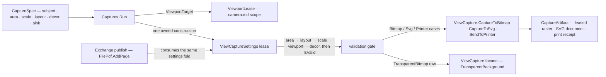

# [RASM_RHINO_CAPTURE]

The capture render specification (`Rasm.Rhino.Viewport`). One resolved `CaptureSpec` carries every axis a viewport render owns — the capture subject (a view, a page, or a viewport window), the media geometry (size, DPI, layout crop, margins, offset, printable-area maximization), the model scale as one explicit `CaptureScale` value, the decoration flags, the color mode, and the delivery modality — and one `Captures.Run` entry constructs the host `ViewCaptureSettings` exactly once inside an owned lease, applies the spec in a fixed field order, validates with `IsValid`, and dispatches the `CaptureSink` case: `CaptureToBitmap`, `CaptureToSvg`, the printer-addressed `SendToPrinter`, or the transparent-bitmap facade path. The killed census forms are the order-dependent double scale writer (layout scale then top-level scale, precedence by write order), the hidden `Policy` state beside public recipe fields, and the two-row format union that omitted the catalogued printer delivery; scale precedence here is structural — `CaptureScale` is one value resolved before any host write — and delivery is a total case set.

## [01]-[INDEX]

- [02]-[SPEC_AXES]: `CaptureSubject` the polymorphic capture origin, `CaptureArea` the view-area mapping, `CaptureScale` the one scale value, `CaptureDecor` and `MediaLayout` the geometry and decoration rows.
- [03]-[SINK_ROWS]: `CaptureSink` — the delivery modality cases over the `ViewCapture` egress family, with the artifact vocabulary.
- [04]-[RUN_RAIL]: `CaptureSpec` the resolved record, the one settings-construction fold, and `Captures.Run`.

## [02]-[SPEC_AXES]

- Owner: `CaptureSubject` `[Union]` — where pixels come from: `ViewCase(ViewportTarget, Size2i, double dpi)` through `new ViewCaptureSettings(RhinoView, Size, double)`, `PageCase(ViewportTarget, double dpi)` through `new ViewCaptureSettings(RhinoPageView, double)`, and `PreviewCase(ViewportTarget, Size2i)` through the instance `CreatePreviewSettings(Size)` derived from a view-based settings basis. `CaptureArea` `[Union]` — the view-area mapping: `FullView`, `Extents`, `ScreenWindow(Point2d, Point2d)` through `SetWindowRect(screenPoint1:, screenPoint2:)`, `WorldWindow(Point3d, Point3d)` through `SetWindowRect(worldPoint1:, worldPoint2:)` — each arm sets `ViewCaptureSettings.ViewArea` to its matching `ViewAreaMapping` value in the same write, so mapping and window can never disagree. `CaptureScale` `[Union]` — `Native`, `ToValue(PositiveMagnitude)` through `SetModelScaleToValue(scale:)`, `ToFit` through `SetModelScaleToFit(promptOnChange: false)` — ONE scale authority. `MediaLayout` — crop rectangle through `SetLayout(mediaSize:, cropRectangle:)`, margins through `SetMargins(lengthUnits:, left:, top:, right:, bottom:)`, offset through `SetOffset(lengthUnits:, fromMargin:, x:, y:)` with its `OffsetAnchor` row, and the `MaximizePrintableArea`/`MatchViewportAspectRatio` toggles. `CaptureDecor` — the full settings draw surface as one flag record with one `Apply` fold: grid, axes, world-axes icon, screen-item scaling, the raster-versus-vector print path, the `ViewCaptureSettings.ColorMode` output-color row, the background/wallpaper/locked/selected-only/clipping-plane/light/margin draw flags, the optional header/footer banner pair, and the optional `PrintFidelity` row carrying print widths, wire thickness scale, and the point/arrowhead/text-dot millimeter sizes.
- Law: `Size2i` is the package's own integer extent value — `System.Drawing.Size` is minted inside the settings constructor call, never on a public signature; window points are `Point2d`/`Point3d` values end to end.
- Law: a spec field the host cannot honor for the selected subject is a construction-time refusal — a `MediaLayout` crop larger than the media, a non-positive DPI, or a preview subject with margins fails at `CaptureSpec.Of`, never as a silent host no-op.
- Boundary: transparent-background capture rides the `ViewCapture` facade object (`TransparentBackground`, `DrawGridAxes`), a distinct host path from the settings-driven one; the sink row owns that fork so the spec stays one shape.

```csharp
// --- [RUNTIME_PRELUDE] ----------------------------------------------------------------------
using Rasm.Domain;
using Rasm.Numerics;
using Rasm.Rhino.Document;

namespace Rasm.Rhino.Viewport;

// --- [TYPES] --------------------------------------------------------------------------------
public readonly record struct Size2i(int Width, int Height) {
    public static Fin<Size2i> Of(int width, int height, Op? key = null) =>
        guard(width > 0 && height > 0, key.OrDefault().InvalidInput()).ToFin().Map(_ => new Size2i(Width: width, Height: height));
    internal System.Drawing.Size Native => new(Width, Height);
}

[Union(ConversionFromValue = ConversionOperatorsGeneration.None)]
public abstract partial record CaptureSubject {
    private CaptureSubject() { }
    public sealed record ViewCase(ViewportTarget Target, Size2i Pixels, double Dpi) : CaptureSubject;
    public sealed record PageCase(ViewportTarget Target, double Dpi) : CaptureSubject;
    public sealed record PreviewCase(ViewportTarget Target, Size2i Pixels) : CaptureSubject;

    internal ViewportTarget Target() => Switch(
        viewCase: static subject => subject.Target,
        pageCase: static subject => subject.Target,
        previewCase: static subject => subject.Target);
}

[Union(ConversionFromValue = ConversionOperatorsGeneration.None)]
public abstract partial record CaptureArea {
    private CaptureArea() { }
    public sealed record FullView : CaptureArea;
    public sealed record Extents : CaptureArea;
    public sealed record ScreenWindow(Point2d A, Point2d B) : CaptureArea;
    public sealed record WorldWindow(Point3d A, Point3d B) : CaptureArea;

    internal Fin<Unit> Apply(ViewCaptureSettings settings, Op key) =>
        Switch(
            state: (Settings: settings, Op: key),
            fullView: static (ctx, _) => Fin.Succ(value: Op.Side(() => ctx.Settings.ViewArea = ViewCaptureSettings.ViewAreaMapping.View)),
            extents: static (ctx, _) => Fin.Succ(value: Op.Side(() => ctx.Settings.ViewArea = ViewCaptureSettings.ViewAreaMapping.Extents)),
            screenWindow: static (ctx, area) => guard(area.A.IsValid && area.B.IsValid && area.A != area.B, ctx.Op.InvalidInput()).ToFin()
                .Map(_ => Op.Side(() => {
                    ctx.Settings.ViewArea = ViewCaptureSettings.ViewAreaMapping.Window;
                    ctx.Settings.SetWindowRect(screenPoint1: area.A, screenPoint2: area.B);
                })),
            worldWindow: static (ctx, area) => guard(area.A.IsValid && area.B.IsValid && area.A != area.B, ctx.Op.InvalidInput()).ToFin()
                .Map(_ => Op.Side(() => {
                    ctx.Settings.ViewArea = ViewCaptureSettings.ViewAreaMapping.Window;
                    ctx.Settings.SetWindowRect(worldPoint1: area.A, worldPoint2: area.B);
                })));
}

[Union(ConversionFromValue = ConversionOperatorsGeneration.None)]
public abstract partial record CaptureScale {
    private CaptureScale() { }
    public sealed record Native : CaptureScale;
    public sealed record ToValue(PositiveMagnitude Scale) : CaptureScale;
    public sealed record ToFit : CaptureScale;

    internal Fin<Unit> Apply(ViewCaptureSettings settings, Op key) =>
        Switch(
            state: (Settings: settings, Op: key),
            native: static (_, _) => Fin.Succ(value: unit),
            toValue: static (ctx, scale) => Fin.Succ(value: Op.Side(() => ctx.Settings.SetModelScaleToValue(scale: (double)scale.Scale))),
            toFit: static (ctx, _) => Fin.Succ(value: Op.Side(() => ctx.Settings.SetModelScaleToFit(promptOnChange: false))));
}

// --- [MODELS] -------------------------------------------------------------------------------
public readonly record struct CaptureMargins(UnitSystem Units, double Left, double Top, double Right, double Bottom);

public sealed record MediaLayout(
    Option<(Size2i Media, Size2i CropOrigin, Size2i CropExtent)> Crop,
    Option<CaptureMargins> Margins,
    Option<(UnitSystem Units, bool FromMargin, double X, double Y)> Offset,
    Option<ViewCaptureSettings.AnchorLocation> Anchor,
    bool MaximizePrintable,
    bool MatchAspect) {
    public static MediaLayout Default { get; } = new(Crop: None, Margins: None, Offset: None, Anchor: None, MaximizePrintable: false, MatchAspect: true);

    internal Fin<Unit> Apply(ViewCaptureSettings settings, Op key) {
        MediaLayout self = this;
        return key.Catch(() => {
            _ = self.Crop.Iter(crop => settings.SetLayout(
                mediaSize: crop.Media.Native,
                cropRectangle: new System.Drawing.Rectangle(crop.CropOrigin.Width, crop.CropOrigin.Height, crop.CropExtent.Width, crop.CropExtent.Height)));
            _ = self.Margins.Iter(value => settings.SetMargins(lengthUnits: value.Units, left: value.Left, top: value.Top, right: value.Right, bottom: value.Bottom));
            _ = self.Offset.Iter(value => settings.SetOffset(lengthUnits: value.Units, fromMargin: value.FromMargin, x: value.X, y: value.Y));
            _ = self.Anchor.Iter(anchor => settings.OffsetAnchor = anchor);
            _ = Op.SideWhen(self.MaximizePrintable, () => settings.MaximizePrintableArea());
            _ = Op.SideWhen(self.MatchAspect, () => settings.MatchViewportAspectRatio());
            return Fin.Succ(value: unit);
        });
    }
}

public sealed record PrintFidelity(
    bool UsePrintWidths,
    double WireThicknessScale,
    double PointSizeMillimeters,
    double ArrowheadSizeMillimeters,
    double TextDotPointSize,
    double DefaultPrintWidthMillimeters);

public sealed record CaptureDecor(
    bool Grid,
    bool Axes,
    bool GridAxes,
    bool ScaleScreenItems,
    bool Raster,
    ViewCaptureSettings.ColorMode OutputColor,
    bool Background,
    bool BackgroundBitmap,
    bool Wallpaper,
    bool LockedObjects,
    bool SelectedOnly,
    bool ClippingPlanes,
    bool Lights,
    bool MarginLines,
    Option<(string Header, string Footer)> Banner,
    Option<PrintFidelity> Fidelity) {
    public static CaptureDecor Plain { get; } = new(
        Grid: false, Axes: false, GridAxes: false, ScaleScreenItems: true, Raster: false,
        OutputColor: ViewCaptureSettings.ColorMode.DisplayColor,
        Background: true, BackgroundBitmap: false, Wallpaper: false,
        LockedObjects: true, SelectedOnly: false, ClippingPlanes: true, Lights: true, MarginLines: false,
        Banner: None, Fidelity: None);

    internal Fin<Unit> Apply(ViewCaptureSettings settings, Op key) {
        CaptureDecor self = this;
        return key.Catch(() => {
            settings.OutputColor = self.OutputColor;
            settings.RasterMode = self.Raster;
            settings.DrawGrid = self.Grid;
            settings.DrawAxis = self.Axes;
            settings.DrawBackground = self.Background;
            settings.DrawBackgroundBitmap = self.BackgroundBitmap;
            settings.DrawWallpaper = self.Wallpaper;
            settings.DrawLockedObjects = self.LockedObjects;
            settings.DrawSelectedObjectsOnly = self.SelectedOnly;
            settings.DrawClippingPlanes = self.ClippingPlanes;
            settings.DrawLights = self.Lights;
            settings.DrawMargins = self.MarginLines;
            _ = self.Banner.Iter(banner => {
                settings.HeaderText = banner.Header;
                settings.FooterText = banner.Footer;
            });
            _ = self.Fidelity.Iter(row => {
                settings.UsePrintWidths = row.UsePrintWidths;
                settings.WireThicknessScale = row.WireThicknessScale;
                settings.PointSizeMillimeters = row.PointSizeMillimeters;
                settings.ArrowheadSizeMillimeters = row.ArrowheadSizeMillimeters;
                settings.TextDotPointSize = row.TextDotPointSize;
                settings.DefaultPrintWidthMillimeters = row.DefaultPrintWidthMillimeters;
            });
            return Fin.Succ(value: unit);
        });
    }
}
```

## [03]-[SINK_ROWS]

- Owner: `CaptureSink` `[Union]` — the delivery cases: `BitmapCase` through `ViewCapture.CaptureToBitmap(settings:)`, `SvgCase` through `ViewCapture.CaptureToSvg(settings:)`, `PrinterCase(string, Dimension)` through `ViewCapture.SendToPrinter(printerName:, settings:, copies:)` carrying the target printer and copy count as per-occurrence payload, and `TransparentBitmapCase` through the `ViewCapture` facade with `TransparentBackground` set — every catalogued egress a case, so the census's missing printer modality cannot recur by omission. `CaptureArtifact` `[Union]` — the typed result: `RasterCase(Lease<System.Drawing.Bitmap>, Size2i)`, `VectorCase(XmlDocument)` carrying the SVG document, `PrintedCase(int)` counting dispatched settings — the executing `CaptureSpec` stays in the caller's hands as provenance, so no case re-carries it.
- Law: the sink case owns the facade fork — `TransparentBitmapCase` constructs a `ViewCapture` object (`Width`/`Height`/`TransparentBackground`/`DrawGrid`/`DrawAxes`/`DrawGridAxes`/`ScaleScreenItems`) and calls its view overload, because `ViewCaptureSettings` carries no transparency member; the other three cases share the one settings object — a per-case settings construction is the collapsed form.
- Law: a raster artifact travels as `Lease<System.Drawing.Bitmap>.Owned` so the native bitmap disposes at the consumer's scope edge — a bare bitmap on a public signature re-creates the census disposal leak.
- Boundary: PDF page delivery is the exchange unit's `FilePdf.AddPage(ViewCaptureSettings)` seam consuming this page's settings fold; publication pipelines compose `CaptureSpec`, never a second capture configuration.

```csharp
// --- [TYPES] --------------------------------------------------------------------------------
[Union(ConversionFromValue = ConversionOperatorsGeneration.None)]
public abstract partial record CaptureArtifact {
    private CaptureArtifact() { }
    public sealed record RasterCase(Lease<System.Drawing.Bitmap> Pixels, Size2i Extent) : CaptureArtifact;
    public sealed record VectorCase(System.Xml.XmlDocument Svg) : CaptureArtifact;
    public sealed record PrintedCase(int Dispatched) : CaptureArtifact;
}

[Union(ConversionFromValue = ConversionOperatorsGeneration.None)]
public abstract partial record CaptureSink {
    private CaptureSink() { }
    public sealed record BitmapCase : CaptureSink;
    public sealed record SvgCase : CaptureSink;
    public sealed record PrinterCase(string PrinterName, Dimension Copies) : CaptureSink;
    public sealed record TransparentBitmapCase : CaptureSink;

    public static CaptureSink Bitmap() => new BitmapCase();
    public static CaptureSink Svg() => new SvgCase();
    public static CaptureSink Transparent() => new TransparentBitmapCase();
    public static Fin<CaptureSink> Printer(string printerName, Dimension copies, Op? key = null) =>
        key.OrDefault().AcceptText(value: printerName).Map(valid => (CaptureSink)new PrinterCase(PrinterName: valid, Copies: copies));

    internal Fin<CaptureArtifact> Render(ViewCaptureSettings settings, Func<Op, Fin<CaptureArtifact>> transparent, Op op) =>
        Switch(
            state: (Settings: settings, Transparent: transparent, Op: op),
            bitmapCase: static (ctx, _) =>
                Optional(ViewCapture.CaptureToBitmap(settings: ctx.Settings)).ToFin(Fail: ctx.Op.InvalidResult())
                    .Map(bitmap => (CaptureArtifact)new CaptureArtifact.RasterCase(
                        Pixels: new Lease<System.Drawing.Bitmap>.Owned(Value: bitmap),
                        Extent: new Size2i(Width: bitmap.Width, Height: bitmap.Height))),
            svgCase: static (ctx, _) =>
                Optional(ViewCapture.CaptureToSvg(settings: ctx.Settings)).ToFin(Fail: ctx.Op.InvalidResult())
                    .Map(static svg => (CaptureArtifact)new CaptureArtifact.VectorCase(Svg: svg)),
            printerCase: static (ctx, sink) =>
                ctx.Op.Confirm(success: ViewCapture.SendToPrinter(sink.PrinterName, [ctx.Settings], sink.Copies.Value))
                    .Map(_ => (CaptureArtifact)new CaptureArtifact.PrintedCase(Dispatched: 1)),
            transparentBitmapCase: static (ctx, _) => ctx.Transparent(ctx.Op));
}
```

## [04]-[RUN_RAIL]

- Owner: `CaptureSpec` — the resolved capture record: subject, area, scale, layout, decoration, sink. `Captures` — the execution owner whose one `Run` resolves the subject's viewport through the `ViewportLease`, constructs the matching `ViewCaptureSettings` inside a `Lease<ViewCaptureSettings>.Owned`, applies area → layout → scale → viewport binding → decor in that fixed order, gates on `ViewCaptureSettings.IsValid`, and renders the sink row — one construction, one application order, one validation, one delivery.
- Entry: `CaptureSpec.Of(subject, area?, scale?, layout?, decor?, sink, Op?)` admits with cross-field refusals; `Captures.Run(DocumentSession, CaptureSpec, Op?) : Fin<CaptureArtifact>` executes under `SessionNeed.Redraw` on the UI thread; `Captures.Stage<TOut>(DocumentSession, CaptureSpec, Func<ViewCaptureSettings, Fin<TOut>>, Op?)` runs the identical fold and hands the validated settings to the consumer instead of a sink — the exchange PDF staging seam, so `Run` and `Stage` share one preparation body and a second settings construction cannot exist.
- Law: field application order is declared once in the fold and carries no semantics — because scale is ONE `CaptureScale` value there is no second writer for order to arbitrate; the census layout-then-top-level override pair is structurally unrepresentable.
- Law: `SetViewport(RhinoViewport)` binds the resolved viewport after geometry fields so a detail or named viewport capture uses the addressed camera, and the transparent path receives the same decor flags through the facade properties.
- Growth: a new host capture axis (a future settings member) is one optional field on `MediaLayout` or one `CaptureDecor` flag applied in the fold; a new delivery is one `CaptureSink` case.

```csharp
// --- [MODELS] -------------------------------------------------------------------------------
public sealed record CaptureSpec(
    CaptureSubject Subject,
    CaptureArea Area,
    CaptureScale Scale,
    MediaLayout Layout,
    CaptureDecor Decor,
    CaptureSink Sink) {

    public static Fin<CaptureSpec> Of(
        CaptureSubject subject,
        CaptureSink sink,
        Option<CaptureArea> area = default,
        Option<CaptureScale> scale = default,
        Option<MediaLayout> layout = default,
        Option<CaptureDecor> decor = default,
        Op? key = null) {
        Op op = key.OrDefault();
        return from origin in Optional(subject).ToFin(Fail: op.InvalidInput())
               from delivery in Optional(sink).ToFin(Fail: op.InvalidInput())
               from _dpi in guard(
                   origin switch {
                       CaptureSubject.ViewCase view => double.IsFinite(view.Dpi) && view.Dpi > 0.0,
                       CaptureSubject.PageCase page => double.IsFinite(page.Dpi) && page.Dpi > 0.0,
                       _ => true,
                   },
                   op.InvalidInput())
               from resolvedLayout in Fin.Succ(layout.IfNone(MediaLayout.Default))
               from _crop in guard(
                   resolvedLayout.Crop.Match(
                       Some: static crop => crop.CropOrigin.Width >= 0 && crop.CropOrigin.Height >= 0
                           && crop.CropOrigin.Width + crop.CropExtent.Width <= crop.Media.Width
                           && crop.CropOrigin.Height + crop.CropExtent.Height <= crop.Media.Height,
                       None: static () => true),
                   op.InvalidInput())
               from _preview in guard(
                   origin is not CaptureSubject.PreviewCase || (resolvedLayout.Margins.IsNone && resolvedLayout.Crop.IsNone),
                   op.InvalidInput())
               select new CaptureSpec(
                   Subject: origin,
                   Area: area.IfNone(() => new CaptureArea.FullView()),
                   Scale: scale.IfNone(() => new CaptureScale.Native()),
                   Layout: resolvedLayout,
                   Decor: decor.IfNone(CaptureDecor.Plain),
                   Sink: delivery);
    }
}

// --- [OPERATIONS] ---------------------------------------------------------------------------
public static class Captures {
    private const double PreviewBasisDpi = 72.0;

    public static Fin<CaptureArtifact> Run(DocumentSession session, CaptureSpec spec, Op? key = null) {
        Op op = key.OrDefault();
        return Staged(session: session, spec: spec, consume: (row, settings) => spec.Sink.Render(
            settings: settings,
            transparent: inner => Transparent(row: row, spec: spec, key: inner),
            op: op), key: op);
    }

    public static Fin<TOut> Stage<TOut>(DocumentSession session, CaptureSpec spec, Func<ViewCaptureSettings, Fin<TOut>> consume, Op? key = null) {
        Op op = key.OrDefault();
        return from body in Optional(consume).ToFin(Fail: op.InvalidInput())
               from output in Staged(session: session, spec: spec, consume: (_, settings) => body(settings), key: op)
               select output;
    }

    private static Fin<TOut> Staged<TOut>(DocumentSession session, CaptureSpec spec, Func<ViewportRef, ViewCaptureSettings, Fin<TOut>> consume, Op key) =>
        from request in Optional(spec).ToFin(Fail: key.InvalidInput())
        from lease in ViewportLease.Of(session: session, target: request.Subject.Target(), key: key)
        from output in lease.Use(borrow: row => Settings(row: row, spec: request, key: key).Bind(owned => owned.Use(settings =>
            from _area in request.Area.Apply(settings: settings, key: key)
            from _layout in request.Layout.Apply(settings: settings, key: key)
            from _scale in request.Scale.Apply(settings: settings, key: key)
            from _bind in Fin.Succ(value: Op.Side(() => settings.SetViewport(viewport: row.Viewport)))
            from _decor in request.Decor.Apply(settings: settings, key: key)
            from _valid in guard(settings.IsValid, key.InvalidResult()).ToFin()
            from produced in consume(row, settings)
            select produced)),
            key: key)
        select output;

    private static Fin<Lease<ViewCaptureSettings>> Settings(ViewportRef row, CaptureSpec spec, Op key) =>
        spec.Subject.Switch(
            state: (Row: row, Op: key),
            viewCase: static (ctx, subject) => ctx.Op.Catch(() => Fin.Succ(
                (Lease<ViewCaptureSettings>)new Lease<ViewCaptureSettings>.Owned(
                    Value: new ViewCaptureSettings(ctx.Row.View, subject.Pixels.Native, subject.Dpi)))),
            pageCase: static (ctx, subject) =>
                Optional(ctx.Row.View as RhinoPageView).ToFin(Fail: ctx.Op.InvalidInput())
                    .Bind(page => ctx.Op.Catch(() => Fin.Succ(
                        (Lease<ViewCaptureSettings>)new Lease<ViewCaptureSettings>.Owned(Value: new ViewCaptureSettings(page, subject.Dpi))))),
            previewCase: static (ctx, subject) => ctx.Op.Catch(() => {
                using ViewCaptureSettings basis = new(ctx.Row.View, subject.Pixels.Native, PreviewBasisDpi);
                return Optional(basis.CreatePreviewSettings(subject.Pixels.Native)).ToFin(Fail: ctx.Op.InvalidResult())
                    .Map(static settings => (Lease<ViewCaptureSettings>)new Lease<ViewCaptureSettings>.Owned(Value: settings));
            }));

    private static Fin<CaptureArtifact> Transparent(ViewportRef row, CaptureSpec spec, Op key) {
        Size2i extent = spec.Subject switch {
            CaptureSubject.ViewCase view => view.Pixels,
            CaptureSubject.PreviewCase preview => preview.Pixels,
            _ => new Size2i(Width: row.Viewport.Size.Width, Height: row.Viewport.Size.Height),
        };
        ViewCapture facade = new() {
            Width = extent.Width,
            Height = extent.Height,
            TransparentBackground = true,
            DrawGrid = spec.Decor.Grid,
            DrawAxes = spec.Decor.Axes,
            DrawGridAxes = spec.Decor.GridAxes,
            ScaleScreenItems = spec.Decor.ScaleScreenItems,
        };
        return Optional(facade.CaptureToBitmap(sourceView: row.View)).ToFin(Fail: key.InvalidResult())
            .Map(bitmap => (CaptureArtifact)new CaptureArtifact.RasterCase(
                Pixels: new Lease<System.Drawing.Bitmap>.Owned(Value: bitmap),
                Extent: new Size2i(Width: bitmap.Width, Height: bitmap.Height)));
    }
}
```


