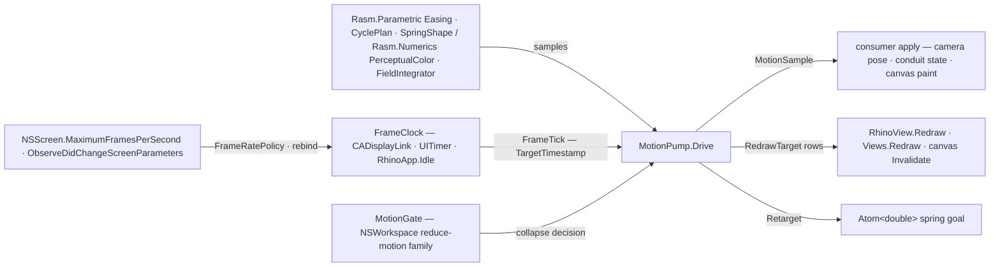

# [RASM_RHINO_MOTION]

Host motion-pacing adapter (`Rasm.Rhino.Viewport`). Every temporal number is kernel-owned — `Easing` curves, `CyclePlan` repeat/yoyo phases, `SpringShape` damped-spring evaluation and stepping, `PerceptualColor` tween sampling all arrive from `Rasm.Parametric` and `Rasm.Numerics` — and this page owns only what a host can own: where a frame lands (`RedrawTarget` rows over view, document, and Eto canvas invalidation), what clock paces it (`FrameClock` rows over the macOS `CADisplayLink` vsync driver built from `NSScreen.GetDisplayLink`, the portable `Eto.Forms.UITimer`, and the `RhinoApp.Idle` fallback), which accessibility and screen facts gate it (`MotionGate` over the `NSWorkspace` reduce-motion family, `FrameRatePolicy` bounded by `NSScreen.MaximumFramesPerSecond`, re-bound on `ObserveDidChangeScreenParameters`), and the `MotionPump` that folds clock ticks through a kernel-sampled script into one consumer apply plus one redraw. Frame advance reads the display link's `TargetTimestamp` — never wall clock — and the census-era in-folder easing catalogue, spring integrator, Oklab conversion, and cycle arithmetic are dead by composition.

## [01]-[INDEX]

- [02]-[REDRAW_TARGETS]: `RedrawTarget` — the frame-landing rows and their one invalidation dispatch.
- [03]-[CLOCKS_AND_GATES]: `FrameClock` rows, `FrameRatePolicy`, `MotionGate` accessibility state, and the macOS display-link pacer with screen-parameter rebinding.
- [04]-[PUMP]: `MotionScript` the kernel-sampled timeline, `MotionSample`, the `MotionPump` drive fold with retargeting, and the reduced-motion collapse.

## [02]-[REDRAW_TARGETS]

- Owner: `RedrawTarget` `[Union]` — where an advanced frame becomes pixels: `ViewCase(ViewportTarget)` redrawing the addressed view through `RhinoView.Redraw` — a conduit-bound overlay animation lands here too, addressing its participant viewport, because the host repaints per view and a distinct overlay case wears the identical call — `DocumentCase` redrawing every view through `RhinoDoc.Views.Redraw`, and `CanvasCase(Action)` invoking an Eto canvas invalidation callback — the canvas owner hands its own `Drawable.Invalidate` closure, so this page never references the Eto control tree.
- Entry: `Invalidate(DocumentSession, Op) : Fin<Unit>` — the one dispatch; view-addressed rows resolve through the `ViewportLease` per invalidation so a closed view refuses instead of redrawing a dead handle.
- Law: a target is data on the drive, never a branch in the tick body — the pump invalidates whatever row it holds, and adding a landing surface is one case with the pump untouched.
- Boundary: invalidation requests a repaint and returns; paint itself happens on the host's draw pass — a target that blocks until pixels land inverts the host contract and is unrepresentable here.

```csharp
// --- [RUNTIME_PRELUDE] ----------------------------------------------------------------------
using AppKit;
using CoreAnimation;
using Foundation;
using Rasm.Domain;
using Rasm.Numerics;
using Rasm.Parametric;
using Rasm.Rhino.Document;
using Rasm.Rhino.HostUi;

namespace Rasm.Rhino.Viewport;

// --- [TYPES] --------------------------------------------------------------------------------
[Union(ConversionFromValue = ConversionOperatorsGeneration.None)]
public abstract partial record RedrawTarget {
    private RedrawTarget() { }
    public sealed record ViewCase(ViewportTarget Target) : RedrawTarget;
    public sealed record DocumentCase : RedrawTarget;
    public sealed record CanvasCase(Action Invalidate) : RedrawTarget;

    internal Fin<Unit> Invalidate(DocumentSession session, Op key) =>
        Switch(
            state: (Session: session, Op: key),
            viewCase: static (ctx, target) => ViewportLease.Of(session: ctx.Session, target: target.Target, key: ctx.Op)
                .Bind(lease => lease.Use(borrow: static row => Fin.Succ(value: Op.Side(row.View.Redraw)), key: ctx.Op)),
            documentCase: static (ctx, _) => HostThread.OnSession(
                session: ctx.Session,
                body: static document => Fin.Succ(value: Op.Side(document.Views.Redraw)),
                op: ctx.Op,
                needs: [SessionNeed.Redraw]),
            canvasCase: static (ctx, canvas) => ctx.Op.Catch(canvas.Invalidate));
}
```

## [03]-[CLOCKS_AND_GATES]

- Owner: `FrameClock` `[Union]` — the pacing rows: `DisplayLinkCase(Option<FrameRatePolicy>)` the macOS vsync driver, `TimerCase(double)` the portable `Eto.Forms.UITimer` interval driver, `IdleCase` the `RhinoApp.Idle` opportunistic driver. `FrameRatePolicy` — a `(Min, Max, Preferred)` value the macOS edge mints into `CAFrameRateRange.Create(minimum:, maximum:, preferred:)`, its ceiling read from `NSScreen.MaximumFramesPerSecond`. `MotionGate` — the accessibility fact read once per drive start from `NSWorkspace.SharedWorkspace`: `AccessibilityDisplayShouldReduceMotion` plus the increase-contrast, differentiate-without-color, and reduce-transparency siblings; off-macOS every gate reads permissive. `FrameTick` — the per-frame fact: the driver's timestamp seconds and the derived delta.
- Entry: `FrameClock.Resolve(Option<FrameRatePolicy>)` selects the strongest available row — display link where the process is macOS and a key-window or main screen is reachable, else the timer at the policy's preferred rate — with `IdleCase` as the explicit opt-in for background-tolerant drives; `Start(onTick, Op) : Fin<IDisposable>` runs the row and the disposer detaches it.
- Law: the display link is built from the SCREEN — `NSScreen.GetDisplayLink(target, selector)` on the key window's screen with `NSScreen.MainScreen` as the windowless fallback — and its callback advances on `CADisplayLink.TargetTimestamp`, the next presentation time; a wall-clock read inside a vsync tick double-advances across rebinds and is the deleted form.
- Law: the link lifecycle is create → `AddToRunLoop(NSRunLoop.Main, NSRunLoopMode.Common)` → `Paused` toggling → `Invalidate` — an invalidated link is dead and rebuilt, never resumed; `ObserveDidChangeScreenParameters` fires on display reconfiguration and the pacer re-reads `MaximumFramesPerSecond` and rebinds the link, so a monitor swap re-rates a running animation instead of orphaning it.
- Law: tick delivery is already on the UI loop for every row — the display link attaches to the main run loop, `UITimer.Elapsed` raises on the UI thread, and `RhinoApp.Idle` is main-thread by contract — so the pump body never marshals.
- Law: the timer and idle rows derive every elapsed interval through one kernel `MonotonicTimeline` beat chain per drive — `Capture` seeds the origin, `Beat` advances ordinal, elapsed, and delta evidence — so no clock row reads or subtracts raw provider timestamps; the display-link row alone reads `TargetTimestamp`, the host's own presentation clock.
- Boundary: `Microsoft.macOS` members live only inside the platform-gated pacer (`OperatingSystem.IsMacOS()` selects the row); portable code holds `FrameClock` values and `FrameTick` facts, never an `NSScreen`, `CADisplayLink`, or `nint`.

```csharp
// --- [TYPES] --------------------------------------------------------------------------------
public readonly record struct FrameRatePolicy(float Min, float Max, float Preferred) {
    public static Fin<FrameRatePolicy> Of(float min, float max, float preferred, Op? key = null) =>
        guard(min > 0f && max >= min && preferred >= min && preferred <= max, key.OrDefault().InvalidInput()).ToFin()
            .Map(_ => new FrameRatePolicy(Min: min, Max: max, Preferred: preferred));
}

public readonly record struct FrameTick(double Timestamp, double Delta);

public readonly record struct MotionGate(bool ReduceMotion, bool IncreaseContrast, bool DifferentiateWithoutColor, bool ReduceTransparency) {
    public static MotionGate Probe() =>
        OperatingSystem.IsMacOS()
            ? new MotionGate(
                ReduceMotion: NSWorkspace.SharedWorkspace.AccessibilityDisplayShouldReduceMotion,
                IncreaseContrast: NSWorkspace.SharedWorkspace.AccessibilityDisplayShouldIncreaseContrast,
                DifferentiateWithoutColor: NSWorkspace.SharedWorkspace.AccessibilityDisplayShouldDifferentiateWithoutColor,
                ReduceTransparency: NSWorkspace.SharedWorkspace.AccessibilityDisplayShouldReduceTransparency)
            : new MotionGate(ReduceMotion: false, IncreaseContrast: false, DifferentiateWithoutColor: false, ReduceTransparency: false);
}

[Union(ConversionFromValue = ConversionOperatorsGeneration.None)]
public abstract partial record FrameClock {
    private FrameClock() { }
    public sealed record DisplayLinkCase(Option<FrameRatePolicy> Rate) : FrameClock;
    public sealed record TimerCase(double IntervalSeconds) : FrameClock;
    public sealed record IdleCase : FrameClock;

    private const double DefaultHertz = 60.0;

    public static FrameClock Resolve(Option<FrameRatePolicy> rate = default) =>
        OperatingSystem.IsMacOS() && MacPacer.ScreenReachable
            ? new DisplayLinkCase(Rate: rate)
            : new TimerCase(IntervalSeconds: 1.0 / rate.Match(Some: static policy => (double)policy.Preferred, None: static () => DefaultHertz));

    internal Fin<IDisposable> Start(Action<FrameTick> onTick, Op key) =>
        Switch(
            state: (OnTick: onTick, Op: key),
            displayLinkCase: static (ctx, clock) => MacPacer.Start(rate: clock.Rate, onTick: ctx.OnTick, key: ctx.Op),
            timerCase: static (ctx, clock) =>
                from beats in TickBeats(onTick: ctx.OnTick, key: ctx.Op)
                from mount in ctx.Op.Catch(() => {
                    Eto.Forms.UITimer timer = new() { Interval = clock.IntervalSeconds };
                    timer.Elapsed += (_, _) => beats();
                    timer.Start();
                    return Fin.Succ<IDisposable>(Subscription.Of(detach: () => { timer.Stop(); timer.Dispose(); }));
                })
                select mount,
            idleCase: static (ctx, _) =>
                from beats in TickBeats(onTick: ctx.OnTick, key: ctx.Op)
                from mount in ctx.Op.Catch(() => {
                    EventHandler pump = (_, _) => beats();
                    RhinoApp.Idle += pump;
                    return Fin.Succ<IDisposable>(Subscription.Of(detach: () => RhinoApp.Idle -= pump));
                })
                select mount;

    // Kernel timeline owns every interval: each drive advances its own MonotonicBeat chain, so no clock row subtracts raw provider timestamps.
    private static Fin<Action> TickBeats(Action<FrameTick> onTick, Op key) =>
        from timeline in MonotonicTimeline.Of(provider: TimeProvider.System, key: key)
        from origin in timeline.Capture(key: key)
        let chain = Atom(Option<MonotonicBeat>.None)
        select (Action)(() => {
            _ = chain.Swap(prior => prior
                .Match(Some: held => timeline.Beat(seed: held, key: key), None: () => timeline.Beat(seed: origin, key: key))
                .Match(Succ: beat => {
                    onTick(new FrameTick(Timestamp: beat.Elapsed.TotalSeconds, Delta: beat.Delta.TotalSeconds));
                    return Some(beat);
                }, Fail: _ => prior));
        });
}

// --- [SERVICES] -----------------------------------------------------------------------------
// One Microsoft.macOS crossing: display-link pacing behind the platform gate; the link is screen-vended
// (NSScreen.GetDisplayLink); teardown is Invalidate, and a screen-parameter change rebuilds the link in place.
internal sealed class MacPacer : NSObject {
    private static readonly Selector TickSelector = new("pacerTick:");
    private readonly Action<FrameTick> onTick;
    private readonly Option<FrameRatePolicy> rate;
    private CADisplayLink link;
    private NSObject? screenObserver;
    private double last = double.NaN;

    private MacPacer(Action<FrameTick> onTick, Option<FrameRatePolicy> rate, NSScreen screen) {
        this.onTick = onTick;
        this.rate = rate;
        link = Configured(link: screen.GetDisplayLink(this, TickSelector), screen: screen);
        link.AddToRunLoop(NSRunLoop.Main, NSRunLoopMode.Common);
        screenObserver = NSApplication.Notifications.ObserveDidChangeScreenParameters((_, _) => Rebind());
    }

    internal static bool ScreenReachable =>
        OperatingSystem.IsMacOS() && (NSApplication.SharedApplication.KeyWindow?.Screen ?? NSScreen.MainScreen) is not null;

    internal static Fin<IDisposable> Start(Option<FrameRatePolicy> rate, Action<FrameTick> onTick, Op key) =>
        from _ in guard(OperatingSystem.IsMacOS(), key.MissingContext()).ToFin()
        from screen in Optional(NSApplication.SharedApplication.KeyWindow?.Screen ?? NSScreen.MainScreen).ToFin(Fail: key.MissingContext())
        from pacer in key.Catch(() => Fin.Succ<IDisposable>(new MacPacer(onTick: onTick, rate: rate, screen: screen)))
        select pacer;

    [Export("pacerTick:")]
    public void Tick(CADisplayLink sender) {
        double now = sender.TargetTimestamp;
        onTick(new FrameTick(Timestamp: now, Delta: double.IsNaN(last) ? sender.Duration : now - last));
        last = now;
    }

    private CADisplayLink Configured(CADisplayLink link, NSScreen screen) {
        float ceiling = (float)Math.Max(1L, (long)screen.MaximumFramesPerSecond);
        link.PreferredFrameRateRange = rate.Match(
            Some: policy => CAFrameRateRange.Create(minimum: policy.Min, maximum: Math.Min(policy.Max, ceiling), preferred: Math.Min(policy.Preferred, ceiling)),
            None: () => CAFrameRateRange.Create(minimum: 30f, maximum: ceiling, preferred: ceiling));
        return link;
    }

    private void Rebind() {
        NSScreen? screen = NSApplication.SharedApplication.KeyWindow?.Screen ?? NSScreen.MainScreen;
        if (screen is null) { return; }
        CADisplayLink replaced = Configured(link: screen.GetDisplayLink(this, TickSelector), screen: screen);
        replaced.AddToRunLoop(NSRunLoop.Main, NSRunLoopMode.Common);
        link.Invalidate();
        link = replaced;
    }

    protected override void Dispose(bool disposing) {
        if (disposing) {
            link.Invalidate();
            screenObserver?.Dispose();
        }
        base.Dispose(disposing);
    }
}
```

## [04]-[PUMP]

- Owner: `MotionScript` `[Union]` — the kernel-sampled timeline: `TweenCase(Easing, double period, CyclePlan)` sampling `CyclePlan.Phase` then `Easing.Evaluate` per tick, and `SpringCase(SpringShape, SpringState, Atom<double>)` stepping `SpringShape.Step` over the drive's `FieldIntegrator` with the target held in an atom so `Retarget` lands mid-flight without restarting. `MotionSample` `[Union]` — what the consumer applies: `EasedCase(UnitInterval, CyclePhase)` and `SprungCase(SpringState, bool)` with the settled flag derived from position/velocity floors. `MotionDrive` — the running pump: the disposable clock attachment, the retarget verb, and the completion task.
- Entry: `MotionPump.Drive(session, script, target, apply, clock?, integrator?, Op?) : Fin<MotionDrive>` — sample → apply → invalidate per tick, stop on the tween's `Completed` phase or the spring's settle; the accessibility gate probes fresh inside `Drive`, never a caller-supplied value; `MotionDrive.Retarget(double)` swaps the spring goal; `MotionDrive.Dispose()` detaches the clock.
- Law: reduced motion is a collapse, not a skip — when `MotionGate.ReduceMotion` holds, the drive applies the terminal sample once (`t = 1` for a tween, the settled state for a spring), invalidates once, and completes; perceivable state changes still land, motion does not.
- Law: the tick body computes nothing — `CyclePlan.Phase`, `Easing.Evaluate`, and `SpringShape.Step` are the kernel calls, the apply is the consumer's, the invalidation is the target row's; a numeric expression in the pump beyond elapsed-time bookkeeping is the census defect this page exists to kill.
- Law: spring settling is evidence-driven — `|position − target| ≤ EpsilonPolicy.SqrtEpsilon · max(1, |target|)` and `|velocity| ≤ EpsilonPolicy.SqrtEpsilon` — so a drive terminates on state, never on an iteration guess; a color tween is a tween whose apply samples `PerceptualColor.Mix` at the eased parameter, needing no third script case.
- Law: completion latches — a finished or failed drive ignores every later clock tick, so apply and invalidation stop at the terminal sample while the consumer owns the clock detach through `Dispose`.
- Boundary: one drive owns one clock attachment; concurrent drives on one target coexist because invalidation coalesces at the host — the pump never de-duplicates redraws across drives.

```csharp
// --- [TYPES] --------------------------------------------------------------------------------
[Union(ConversionFromValue = ConversionOperatorsGeneration.None)]
public abstract partial record MotionSample {
    private MotionSample() { }
    public sealed record EasedCase(UnitInterval Value, CyclePhase Phase) : MotionSample;
    public sealed record SprungCase(SpringState State, bool Settled) : MotionSample;
}

[Union(ConversionFromValue = ConversionOperatorsGeneration.None)]
public abstract partial record MotionScript {
    private MotionScript() { }
    public sealed record TweenCase(Easing Curve, double PeriodSeconds, CyclePlan Plan) : MotionScript;
    public sealed record SpringCase(SpringShape Shape, SpringState From, Atom<double> Target) : MotionScript;

    public static Fin<MotionScript> Tween(Easing curve, double periodSeconds, Option<CyclePlan> plan = default, Op? key = null) {
        Op op = key.OrDefault();
        return from row in op.Need(value: curve)
               from period in op.Positive(value: periodSeconds)
               from cycle in plan.Match(Some: Fin.Succ, None: () => CyclePlan.Of(count: Some(1), yoyo: false, key: op))
               select (MotionScript)new TweenCase(Curve: row, PeriodSeconds: period, Plan: cycle);
    }

    public static Fin<MotionScript> Spring(SpringShape shape, SpringState from, double target, Op? key = null) {
        Op op = key.OrDefault();
        return from _ in guard(shape.IsValid && from.IsValid, op.InvalidInput()).ToFin()
               from goal in op.Finite(value: target)
               select (MotionScript)new SpringCase(Shape: shape, From: from, Target: Atom(goal));
    }
}

// --- [SERVICES] -----------------------------------------------------------------------------
public sealed class MotionDrive : IDisposable {
    private readonly IDisposable clock;
    private readonly Option<Atom<double>> springTarget;
    private int released;

    internal MotionDrive(IDisposable clock, Option<Atom<double>> springTarget, Task<Fin<Unit>> completion) {
        this.clock = clock;
        this.springTarget = springTarget;
        Completion = completion;
    }

    public Task<Fin<Unit>> Completion { get; }

    public Fin<Unit> Retarget(double target, Op? key = null) {
        Op op = key.OrDefault();
        return from goal in op.Finite(value: target)
               from cell in springTarget.ToFin(Fail: op.InvalidInput())
               select ignore(cell.Swap(_ => goal));
    }

    public void Dispose() =>
        _ = Interlocked.Exchange(location1: ref released, value: 1) is 0 ? fun(clock.Dispose)() : unit;
}

// --- [OPERATIONS] ---------------------------------------------------------------------------
public static class MotionPump {
    public static Fin<MotionDrive> Drive(
        DocumentSession session,
        MotionScript script,
        RedrawTarget target,
        Func<MotionSample, Fin<Unit>> apply,
        Option<FrameClock> clock = default,
        Option<FieldIntegrator> integrator = default,
        Op? key = null) {
        Op op = key.OrDefault();
        MotionGate gate = MotionGate.Probe();
        return from timeline in Optional(script).ToFin(Fail: op.InvalidInput())
               from landing in Optional(target).ToFin(Fail: op.InvalidInput())
               from stepper in FieldIntegrator.AdmitOrFixed(value: integrator.IfNoneUnsafe((FieldIntegrator?)null), key: op)
               from drive in gate.ReduceMotion
                   ? Collapsed(session: session, timeline: timeline, landing: landing, apply: apply, key: op)
                   : Running(session: session, timeline: timeline, landing: landing, apply: apply, clock: clock.IfNone(() => FrameClock.Resolve()), stepper: stepper, key: op)
               select drive;
    }

    private static Fin<MotionDrive> Collapsed(DocumentSession session, MotionScript timeline, RedrawTarget landing, Func<MotionSample, Fin<Unit>> apply, Op key) =>
        from terminal in timeline.Switch(
            state: key,
            tweenCase: static (op, tween) =>
                from phase in tween.Plan.Phase(elapsed: tween.PeriodSeconds * tween.Plan.Count.IfNone(1), period: tween.PeriodSeconds, key: op)
                from value in op.AcceptValidated<UnitInterval>(candidate: 1.0)
                select (MotionSample)new MotionSample.EasedCase(Value: value, Phase: phase),
            springCase: static (op, spring) => Fin.Succ(
                (MotionSample)new MotionSample.SprungCase(State: new SpringState(Position: spring.Target.Value, Velocity: 0.0), Settled: true)))
        from _ in apply(terminal)
        from __ in landing.Invalidate(session: session, key: key)
        select new MotionDrive(clock: Subscription.Of(detach: static () => { }), springTarget: None, completion: Task.FromResult(Fin.Succ(value: unit)));

    private static Fin<MotionDrive> Running(DocumentSession session, MotionScript timeline, RedrawTarget landing, Func<MotionSample, Fin<Unit>> apply, FrameClock clock, FieldIntegrator stepper, Op key) {
        TaskCompletionSource<Fin<Unit>> done = new(TaskCreationOptions.RunContinuationsAsynchronously);
        Atom<double> elapsed = Atom(0.0);
        Atom<SpringState> springState = Atom(timeline is MotionScript.SpringCase seeded ? seeded.From : new SpringState(Position: 0.0, Velocity: 0.0));
        Option<Atom<double>> retarget = timeline is MotionScript.SpringCase spring ? Some(spring.Target) : None;
        return clock.Start(onTick: tick => {
            if (done.Task.IsCompleted) { return; }
            double at = elapsed.Swap(total => total + Math.Max(0.0, tick.Delta));
            Fin<(MotionSample Sample, bool Finished)> advanced = timeline.Switch(
                state: (At: at, Tick: tick, Spring: springState, Stepper: stepper, Op: key),
                tweenCase: static (ctx, tween) =>
                    from phase in tween.Plan.Phase(elapsed: ctx.At, period: tween.PeriodSeconds, key: ctx.Op)
                    from eased in ctx.Op.AcceptValidated<UnitInterval>(candidate: Math.Clamp(tween.Curve.Evaluate(t: phase.Local), 0.0, 1.0))
                    select ((MotionSample)new MotionSample.EasedCase(Value: eased, Phase: phase), phase.Completed),
                springCase: static (ctx, spring) =>
                    from step in spring.Shape.Step(from: ctx.Spring.Value, target: spring.Target.Value, h: Math.Max(ctx.Tick.Delta, 1.0 / 240.0), integrator: ctx.Stepper, key: ctx.Op)
                    from next in step.Switch(
                        acceptedCase: accepted => Fin.Succ(accepted.Next),
                        rejectedCase: _ => Fin.Succ(ctx.Spring.Value))
                    from _ in Fin.Succ(ignore(ctx.Spring.Swap(_ => next)))
                    from settled in Fin.Succ(
                        Math.Abs(next.Position - spring.Target.Value) <= EpsilonPolicy.SqrtEpsilon * Math.Max(1.0, Math.Abs(spring.Target.Value))
                        && Math.Abs(next.Velocity) <= EpsilonPolicy.SqrtEpsilon)
                    select ((MotionSample)new MotionSample.SprungCase(State: next, Settled: settled), settled));
            _ = advanced
                .Bind(frame => apply(frame.Sample).Bind(_ => landing.Invalidate(session: session, key: key)).Map(_ => frame.Finished))
                .Match(
                    Succ: finished => { if (finished) { _ = done.TrySetResult(Fin.Succ(value: unit)); } },
                    Fail: error => _ = done.TrySetResult(Fin.Fail<Unit>(error)));
        }, key: key).Map(attachment => new MotionDrive(clock: attachment, springTarget: retarget, completion: done.Task));
    }
}
```


