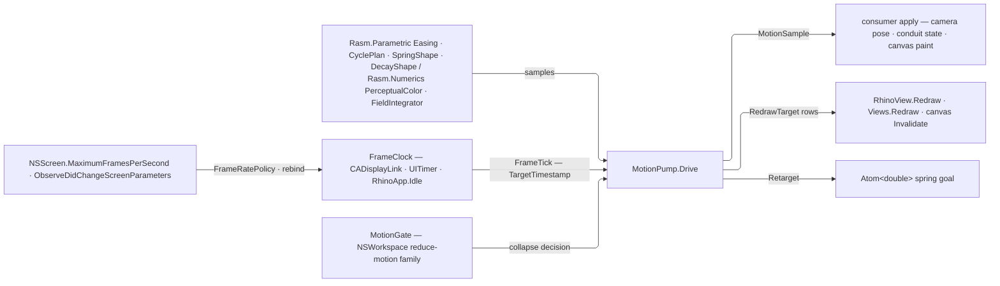

# [RASM_RHINO_MOTION]

Host motion-pacing adapter (`Rasm.Rhino.Viewport`). Sampling mathematics is kernel-owned — `Easing`, `CyclePlan`, `SpringShape`, `DecayShape`, `FieldIntegrator`, and `PerceptualColor` arrive from `Rasm.Parametric` and `Rasm.Numerics`. This page owns host cadence: redraw landing, clock selection, accessibility posture, screen-rate projection, bounded frame deltas, attachment lifetime, and the `MotionPump` composition. Display-link advance reads `CADisplayLink.TargetTimestamp`; timer and idle advance through `MonotonicTimeline` over the injected `TimeProvider`.

## [01]-[INDEX]

- [02]-[REDRAW_TARGETS]: `RedrawTarget` — the frame-landing rows and their one invalidation dispatch.
- [03]-[CLOCKS_AND_GATES]: `FrameClock` rows, `FrameRatePolicy`, `MotionGate` accessibility state, and the macOS display-link pacer with screen-parameter rebinding.
- [04]-[PUMP]: `MotionScript` the kernel-sampled timeline, `MotionSample`, the `MotionPump` drive fold with retargeting, and the reduced-motion collapse.

## [02]-[REDRAW_TARGETS]

- Owner: `RedrawTarget` `[Union]` owns frame landing: no redraw, one addressed view, every document view, or one Eto canvas invalidation callback. A conduit-bound overlay uses the view case because the host repaints per view; the canvas owner hands its own `Drawable.Invalidate` closure, so this page never references the Eto control tree.
- Entry: `Invalidate(DocumentSession, Op) : Fin<Unit>` — the one dispatch; view-addressed rows resolve through the `ViewportLease` per invalidation so a closed view refuses instead of redrawing a dead handle.
- Law: a target is data on the drive, never a branch in the tick body — the pump invalidates whatever row it holds, and adding a landing surface is one case with the pump untouched.
- Boundary: invalidation requests a repaint and returns; paint itself happens on the host's draw pass — a target that blocks until pixels land inverts the host contract and is unrepresentable here.

```csharp signature
// --- [RUNTIME_PRELUDE] ----------------------------------------------------------------------
using AppKit;
using CoreAnimation;
using Foundation;
using Rasm.Domain;
using Rasm.Numerics;
using Rasm.Parametric;
using Rasm.Rhino.Document;
using Rasm.Rhino.Eto;
using Rasm.Rhino.HostUi;
using System.Collections.Frozen;
using System.Runtime.InteropServices;

namespace Rasm.Rhino.Viewport;

// --- [TYPES] --------------------------------------------------------------------------------
[Union(ConversionFromValue = ConversionOperatorsGeneration.None)]
public abstract partial record RedrawTarget {
    private RedrawTarget() { }
    public sealed record NoneCase : RedrawTarget;
    public sealed record ViewCase(ViewportTarget Target) : RedrawTarget;
    public sealed record DocumentCase : RedrawTarget;
    public sealed record CanvasCase(Action Invalidate) : RedrawTarget;

    internal Fin<Unit> Invalidate(DocumentSession session, Op key) =>
        Switch(
            (Session: session, Op: key),
            noneCase: static (_, _) => Fin.Succ(unit),
            viewCase: static (ctx, target) => ViewportLease.Of(session: ctx.Session, target: target.Target, key: ctx.Op)
                .Bind(lease => lease.Use(borrow: static row => Fin.Succ(value: Op.Side(row.View.Redraw)), key: ctx.Op)),
            documentCase: static (ctx, _) => HostThread.Run(
                work: new HostWork<Unit>.Session(
                    Document: ctx.Session,
                    Needs: [SessionNeed.Redraw],
                    Body: static document => Fin.Succ(value: Op.Side(document.Views.Redraw))),
                key: ctx.Op),
            canvasCase: static (ctx, canvas) => ctx.Op.Catch(canvas.Invalidate));
}
```

## [03]-[CLOCKS_AND_GATES]

- Owner: `FrameClock` `[Union]` owns display-link, timer, and idle pacing; `FrameRatePolicy` `[ComplexValueObject]` owns the requested frequency interval; `MotionPresentation` owns the complete accessibility posture delivered with every sample; `FrameTick` owns timestamp and delta evidence. `TimeProvider` enters once through `MotionPump.Drive` and feeds portable clock rows.
- Entry: `FrameClock.Resolve(Option<FrameRatePolicy>, Op?) : Fin<FrameClock>` admits a frequency policy and selects display link or timer off ONE anchor probe crossing `UiThread` — the probe is an AppKit window walk, so the row decision runs UI-affine inside the `Fin` funnel and an off-thread or throwing probe lands on the rail; `FrameClock.Idle()` admits background-tolerant pacing explicitly, and `Start(onTick, onFault, TimeProvider, Op) : Fin<MotionAttachment>` returns one pause/resume/dispose lifecycle and preserves clock failures on the drive rail.
- Law: the display link is built from a WINDOW-DERIVED screen — `NSScreen.GetDisplayLink(target, selector)` on the key window's screen, falling to the first application window that resolves one — and `NSScreen.MainScreen` is the deleted form: it names the application main screen, not the paced surface's, so a second-display target paces against the wrong refresh ceiling and carries the wrong backing scale. No window resolving a screen is a typed refusal that selects the portable row, never a substituted anchor.
- Law: `GetDisplayLink` carries `SupportedOSPlatform("macos14.0")` and declares non-null while the native result still needs validation, so the row admits on `OperatingSystem.IsMacOSVersionAtLeast(14)` — never the OS family — and every vended link crosses `Optional(...).ToFin(...)` before it is configured or attached.
- Law: the link lifecycle is create → `AddToRunLoop(NSRunLoop.Main, NSRunLoopMode.Common)` → `Paused` toggling → `RemoveFromRunLoop(NSRunLoop.Main, NSRunLoopMode.Common)` → `Invalidate` → `Dispose` — teardown is the exact inverse of attachment and an invalidated link is dead and rebuilt, never resumed; a rebind that invalidates without removing leaks a run-loop registration per display reconfiguration. Every link mutation runs ON the main run loop: arming and rebinding already arrive there through the resolve funnel and the screen-parameter notification, and release marshals through the UI dispatch because a drive is disposed from whatever lane owns it — an off-main remove-invalidate-dispose frees a registration the main loop still holds. `ObserveDidChangeScreenParameters` fires on that reconfiguration and the pacer re-reads `MaximumFramesPerSecond` and rebinds the link, so a monitor swap re-rates a running animation instead of orphaning it.
- Law: tick delivery is already on the UI loop for every row — the display link attaches to the main run loop, `UITimer.Elapsed` raises on the UI thread, and `RhinoApp.Idle` is main-thread by contract — so the pump body never marshals and the consumer apply's own `HostThread.Run` and session demand both take their inline `RhinoApp.IsOnMainThread` branch. That inline crossing is what keeps the drive gate off a blocking host wait — a marshalling tick holds the gate across a command-thread round trip the command thread itself re-enters.
- Law: the timer and idle rows derive every elapsed interval through one kernel `MonotonicTimeline` beat chain per drive — `Capture` seeds the origin, `Beat` advances ordinal, elapsed, and delta evidence — so no clock row reads or subtracts raw provider timestamps; the display-link row alone reads `TargetTimestamp`, the host's own presentation clock.
- Law: the panel bounds the requested range from BOTH ends — `MaximumFramesPerSecond` is the ceiling and `MaximumRefreshInterval` its reciprocal the floor, because a variable-refresh panel advertises a rate ceiling it will not hold and the interval is the other half of the clamp; a range built from the ceiling alone lets a `CADisplayLink` drop below the panel's own slowest presentation and the drive samples against a cadence the display never delivers.
- Law: a paced sample carries the device-pixel scale it was computed against — `FrameTick.BackingScale` reads `NSScreen.BackingScaleFactor` inside the same gated `Configured` body that reads the rate bounds, and the portable rows read the Eto display owner's `LogicalPixelSize` once per drive — so `FrameTick.DevicePixels` is the one projection a consumer reads for hairline width and hit slop, a hand-asserted `1.0` is the deleted form, and no page re-derives DPI per frame from a second host read.
- Law: this page composes no `Eto.Forms` type: `Eto` partially qualified inside `Rasm.Rhino.Viewport` binds the sibling `Rasm.Rhino.Eto` namespace, and the strata forbid an S3 owner reaching the S1 Eto floor's package directly. The affinity assert enters through `UiThread`, the portable cadence through the Eto `Pulse` lease, and the density read through `Displays` — each the Eto sub-domain's own owner, each carrying the beat chain and disposal this page then never re-derives.
- Boundary: `Microsoft.macOS` members live only inside the platform-gated pacer (`OperatingSystem.IsMacOSVersionAtLeast(14)` selects the row); portable code holds `FrameClock` values and `FrameTick` facts, never an `NSScreen`, `CADisplayLink`, or `nint`.

```csharp signature
// --- [TYPES] --------------------------------------------------------------------------------
[ComplexValueObject]
public sealed partial class FrameRatePolicy {
    // Portable cadence is a declared policy row, not a host read: no portable surface publishes a refresh rate, so
    // display-link pacing derives its range from the panel while this row states its 30..60 Hz band exactly once.
    public static FrameRatePolicy Portable { get; } = Create(min: 30f, max: 60f, preferred: 60f);

    public float Min { get; }
    public float Max { get; }
    public float Preferred { get; }

    [BoundaryAdapter]
    static partial void ValidateFactoryArguments(
        ref ValidationError? validationError,
        ref float min,
        ref float max,
        ref float preferred) {
        validationError = float.IsFinite(min) && float.IsFinite(max) && float.IsFinite(preferred)
            && min > 0f && max >= min && preferred >= min && preferred <= max
            ? validationError
            : new ValidationError("frame-rate policy requires 0 < min <= preferred <= max");
    }
}

[ValueObject<double>]
public readonly partial struct FrameInterval {
    [BoundaryAdapter]
    static partial void ValidateFactoryArguments(ref ValidationError? validationError, ref double value) {
        validationError = double.IsFinite(value) && value > 0.0
            ? validationError
            : new ValidationError(message: "frame interval is invalid");
    }
}

[ComplexValueObject]
[StructLayout(LayoutKind.Auto)]
public readonly partial struct FrameTick {
    public double Timestamp { get; }
    public double Delta { get; }
    public double BackingScale { get; }

    // `BackingScale` rides as a ratio, so a logical length crosses to device pixels by one multiply and no host read.
    public double DevicePixels(double logical) => logical * BackingScale;

    public double HairlineWidth => DevicePixels(logical: 1.0);

    [BoundaryAdapter]
    static partial void ValidateFactoryArguments(
        ref ValidationError? validationError, ref double timestamp, ref double delta, ref double backingScale) {
        validationError = double.IsFinite(timestamp) && double.IsFinite(delta) && delta >= 0.0
            && double.IsFinite(backingScale) && backingScale > 0.0
            ? validationError
            : new ValidationError(message: "frame tick is invalid");
    }
}

[SmartEnum<int>]
public sealed partial class MotionAccommodation {
    public static readonly MotionAccommodation ReducedMotion = new(
        key: 0,
        active: static () => NSWorkspace.SharedWorkspace.AccessibilityDisplayShouldReduceMotion);
    public static readonly MotionAccommodation IncreasedContrast = new(
        key: 1,
        active: static () => NSWorkspace.SharedWorkspace.AccessibilityDisplayShouldIncreaseContrast);
    public static readonly MotionAccommodation DifferentiateWithoutColor = new(
        key: 2,
        active: static () => NSWorkspace.SharedWorkspace.AccessibilityDisplayShouldDifferentiateWithoutColor);
    public static readonly MotionAccommodation ReducedTransparency = new(
        key: 3,
        active: static () => NSWorkspace.SharedWorkspace.AccessibilityDisplayShouldReduceTransparency);

    [UseDelegateFromConstructor]
    internal partial bool Active();
}

[ComplexValueObject]
public sealed partial class MotionPresentation {
    public FrozenSet<MotionAccommodation> Accommodations { get; }

    [BoundaryAdapter]
    static partial void ValidateFactoryArguments(
        ref ValidationError? validationError,
        ref FrozenSet<MotionAccommodation> accommodations) {
        validationError = accommodations is not null
            ? validationError
            : new ValidationError(message: "motion presentation is invalid");
    }

    public bool ReduceMotion => Accommodations.Contains(MotionAccommodation.ReducedMotion);
}

internal static class MotionGate {
    internal static MotionPresentation Probe() =>
        MotionPresentation.Create(accommodations: OperatingSystem.IsMacOS()
            ? toSeq(MotionAccommodation.Items).Filter(static row => row.Active()).ToFrozenSet()
            : FrozenSet<MotionAccommodation>.Empty);
}

internal interface MotionAttachment : IDisposable {
    Unit Pause();
    Unit Resume();
}

[Union(ConversionFromValue = ConversionOperatorsGeneration.None)]
public abstract partial record FrameClock {
    private FrameClock() { }
    public sealed record DisplayLinkCase(FrameRatePolicy Rate) : FrameClock;
    public sealed record TimerCase(FrameInterval Interval) : FrameClock;
    public sealed record IdleCase : FrameClock;

    // `ScreenReachable` walks the application's windows, so the row decision is an AppKit read: probe, selection, and
    // interval mint cross the Eto floor together and land inside one funnel. An unguarded off-thread probe is the
    // deleted form — it reaches AppKit from whatever lane composed the drive and escapes the `Fin` this method returns.
    public static Fin<FrameClock> Resolve(Option<FrameRatePolicy> rate = default, Op? key = null) {
        Op op = key.OrDefault();
        FrameRatePolicy selected = rate.IfNone(FrameRatePolicy.Portable);
        return UiThread.Run(new UiDispatch<FrameClock>.Blocking(() => op.Catch(() => MacPacer.ScreenReachable
            ? Fin.Succ<FrameClock>(new DisplayLinkCase(Rate: selected))
            : Fin.Succ<FrameClock>(new TimerCase(Interval: FrameInterval.Create(value: 1.0 / selected.Preferred))))), op).Result;
    }

    public static FrameClock Idle() => new IdleCase();

    // The affinity assert is the Eto floor's `Current` dispatch, never a raw `Application` reach from this stratum.
    internal Fin<MotionAttachment> Start(Action<FrameTick> onTick, Action<Error> onFault, TimeProvider provider, Op key) =>
        from _ in UiThread.Run(new UiDispatch<Unit>.Current(() => Fin.Succ(unit)), key).Result
        from scale in PortableScale(key: key)
        from attachment in Switch(
            (OnTick: onTick, OnFault: onFault, Provider: provider, Scale: scale, Op: key),
            displayLinkCase: static (ctx, clock) => MacPacer.Start(rate: clock.Rate, onTick: ctx.OnTick, onFault: ctx.OnFault, key: ctx.Op),
            timerCase: static (ctx, clock) => Pulse.Start(
                    seconds: PositiveMagnitude.Create((double)clock.Interval),
                    clock: ctx.Provider,
                    publish: beat => ctx.OnTick(FrameTick.Create(
                        timestamp: beat.Evidence.Elapsed.TotalSeconds, delta: beat.Evidence.Delta.TotalSeconds, backingScale: ctx.Scale)),
                    report: ctx.OnFault,
                    key: ctx.Op)
                .Map<MotionAttachment>(pulse => Attachment.Paced(pulse)),
            idleCase: static (ctx, _) =>
                from beats in TickBeats(onTick: ctx.OnTick, onFault: ctx.OnFault, provider: ctx.Provider, scale: ctx.Scale, key: ctx.Op)
                from mount in ctx.Op.Catch(() => Fin.Succ<MotionAttachment>(Attachment.Idle(beat: beats)))
                select mount)
        select attachment;

    // The device-pixel ratio is a host read, never an asserted 1.0: the Eto display owner publishes it and one read serves the whole drive.
    private static Fin<double> PortableScale(Op key) =>
        Displays.Primary(key: key).Map(static facts => (double)facts.LogicalPixelSize);

    // Kernel timeline owns every interval for the idle row: `Pulse` owns the timer row's chain, so neither subtracts raw
    // provider timestamps. The cursor is the timeline's OWN seed carrier — the origin stamp and each advance are the two
    // cases of one `BeatSeed`, so the chain cell holds what `Beat` consumes and a refused beat replays its predecessor.
    private static Fin<Action> TickBeats(Action<FrameTick> onTick, Action<Error> onFault, TimeProvider provider, double scale, Op key) =>
        from timeline in MonotonicTimeline.Of(provider: provider, key: key)
        from origin in timeline.Capture(key: key)
        let chain = Atom((BeatSeed)origin)
        select (Action)(() => {
            _ = chain.Swap(prior => timeline.Beat(seed: prior, key: key)
                .Bind(beat => key.Catch(() => {
                    onTick(FrameTick.Create(
                        timestamp: beat.Elapsed.TotalSeconds, delta: beat.Delta.TotalSeconds, backingScale: scale));
                    return Fin.Succ(beat);
                }))
                .Match(Succ: static beat => (BeatSeed)beat, Fail: error => {
                    onFault(error);
                    return prior;
                }));
        });
}

internal sealed class Attachment(Func<Unit> pause, Func<Unit> resume, Action release) : MotionAttachment {
    internal static readonly Attachment Completed = new(static () => unit, static () => unit, static () => { });

    // The Eto `Pulse` lease owns the host timer, its beat chain, and its disposal; this row adds pause and resume over that lease.
    internal static Attachment Paced(Pulse pulse) =>
        new(fun(pulse.Pause), fun(pulse.Resume), pulse.Dispose);

    internal static Attachment Idle(Action beat) {
        int attached = 0;
        EventHandler handler = (_, _) => beat();
        Unit On() => Interlocked.Exchange(ref attached, 1) is 0 ? fun(() => RhinoApp.Idle += handler)() : unit;
        Unit Off() => Interlocked.Exchange(ref attached, 0) is 1 ? fun(() => RhinoApp.Idle -= handler)() : unit;
        return (On(), new Attachment(pause: Off, resume: On, release: () => _ = Off())).Item2;
    }

    public Unit Pause() => pause();
    public Unit Resume() => resume();
    public void Dispose() => release();
}

// --- [SERVICES] -----------------------------------------------------------------------------
// One Microsoft.macOS crossing: display-link pacing behind the macos14.0 gate; the link is vended by a window-derived
// NSScreen and validated before use; teardown marshals onto the main run loop as RemoveFromRunLoop then Invalidate then
// Dispose, the exact inverse of attachment, and a screen-parameter change rebinds the link onto the re-resolved anchor in place.
internal sealed class MacPacer : NSObject, MotionAttachment {
    private static readonly Selector TickSelector = new("pacerTick:");
    private readonly Action<FrameTick> onTick;
    private readonly Action<Error> onFault;
    private readonly FrameRatePolicy rate;
    private double scale = 1.0;
    private readonly Op key;
    // The link is vended in `Arm`, after construction, because its callback target is the pacer itself.
    private CADisplayLink? link;
    private NSObject? screenObserver;
    private double last = double.NaN;

    private MacPacer(Action<FrameTick> onTick, Action<Error> onFault, FrameRatePolicy rate, Op key) {
        this.onTick = onTick;
        this.onFault = onFault;
        this.rate = rate;
        this.key = key;
    }

    private Unit Guarded(Fin<Unit> outcome) => outcome.Match(
        Succ: static _ => unit,
        Fail: error => {
            _ = Optional(link).Map(held => held.Paused = true);
            onFault(error);
            return unit;
        });

    // `MainScreen` describes the application's main display, never the paced surface's, so the anchor walks real windows and refuses when none resolves.
    private static Option<NSScreen> Anchor() =>
        OperatingSystem.IsMacOSVersionAtLeast(14)
            ? Optional(NSApplication.SharedApplication.KeyWindow?.Screen)
                .Match(Some: Some, None: () => toSeq(NSApplication.SharedApplication.Windows).Choose(window => Optional(window.Screen)).Head)
            : None;

    internal static bool ScreenReachable => Anchor().IsSome;

    // The link's callback target is the pacer itself, so the pacer is built first and armed second; `GetDisplayLink` declares
    // non-null and still vends native null, so `Arm` validates before configuring and a refused arm releases the half-built pacer.
    internal static Fin<MotionAttachment> Start(FrameRatePolicy rate, Action<FrameTick> onTick, Action<Error> onFault, Op key) =>
        from pacer in key.Catch(() => Fin.Succ(new MacPacer(onTick: onTick, onFault: onFault, rate: rate, key: key)))
        from armed in Anchor().ToFin(Fail: key.MissingContext())
            .Bind(screen => pacer.Arm(screen: screen))
            .Match(Succ: _ => Fin.Succ<MotionAttachment>(pacer), Fail: fault => { pacer.Dispose(); return Fin.Fail<MotionAttachment>(fault); })
        select armed;

    private Fin<Unit> Arm(NSScreen screen) => key.Catch(() =>
        Optional(screen.GetDisplayLink(this, TickSelector)).ToFin(Fail: key.InvalidResult()).Map(vended => {
            link = Configured(link: vended, screen: screen);
            link.AddToRunLoop(NSRunLoop.Main, NSRunLoopMode.Common);
            screenObserver = NSApplication.Notifications.ObserveDidChangeScreenParameters((_, _) =>
                _ = Guarded(key.Catch(() => Fin.Succ(Op.Side(Rebind)))));
            return unit;
        }));

    public Unit Pause() => Paused(true);
    public Unit Resume() => Paused(false);

    private Unit Paused(bool value) => Optional(link).Match(Some: held => Op.Side(() => held.Paused = value), None: () => unit);

    [Export("pacerTick:")]
    public void Tick(CADisplayLink sender) {
        double now = sender.TargetTimestamp;
        _ = Guarded(key.Catch(() => {
            onTick(FrameTick.Create(
                timestamp: now, delta: double.IsNaN(last) ? sender.Duration : now - last, backingScale: scale));
            last = now;
            return Fin.Succ(unit);
        }));
    }

    private CADisplayLink Configured(CADisplayLink link, NSScreen screen) {
        float ceiling = (float)Math.Max(1L, (long)screen.MaximumFramesPerSecond);
        double interval = screen.MaximumRefreshInterval;
        float floor = double.IsFinite(interval) && interval > 0.0 ? (float)(1.0 / interval) : rate.Min;
        float maximum = Math.Min(rate.Max, ceiling);
        float minimum = Math.Clamp(Math.Max(rate.Min, floor), 1f, maximum);
        float preferred = Math.Clamp(rate.Preferred, minimum, maximum);
        link.PreferredFrameRateRange = CAFrameRateRange.Create(minimum: minimum, maximum: maximum, preferred: preferred);
        scale = (double)screen.BackingScaleFactor;
        return link;
    }

    private void Rebind() {
        _ = Anchor().Bind(screen => Optional(screen.GetDisplayLink(this, TickSelector)).Map(vended => (Screen: screen, Vended: vended)))
            .Map(held => {
                CADisplayLink replaced = Configured(link: held.Vended, screen: held.Screen);
                replaced.Paused = Optional(link).Match(Some: static prior => prior.Paused, None: static () => false);
                replaced.AddToRunLoop(NSRunLoop.Main, NSRunLoopMode.Common);
                _ = Optional(link).Map(prior => { Detach(prior); return unit; });
                link = replaced;
                last = double.NaN;
                return unit;
            });
    }

    // Teardown is the exact inverse of attachment: remove from the same loop and mode, invalidate, then dispose.
    private static void Detach(CADisplayLink held) {
        held.RemoveFromRunLoop(NSRunLoop.Main, NSRunLoopMode.Common);
        held.Invalidate();
        held.Dispose();
    }

    // Release marshals: a drive is disposed from whatever lane owns it, and removing, invalidating, and freeing a link
    // off-main tears down a registration the main run loop still holds. The marshal's own refusal rides the same fault
    // seam a tick refusal does, and the guard leaves an untorn link paused rather than live.
    protected override void Dispose(bool disposing) {
        if (disposing) {
            _ = Guarded(UiThread.Run(new UiDispatch<Unit>.Blocking(() => key.Catch(() => {
                _ = Optional(link).Map(held => { Detach(held); return unit; });
                link = null;
                screenObserver?.Dispose();
                screenObserver = null;
                return Fin.Succ(value: unit);
            })), key).Result);
        }
        base.Dispose(disposing);
    }
}
```

## [04]-[PUMP]

- Owner: `MotionScript` `[Union]` owns kernel-sampled tween, spring, and glide plans; `MotionStepPolicy` bounds driven-spring frame deltas, and each `MotionDrive` owns its retarget atom. `MotionSample` `[Union]` carries the sampled value plus `MotionPresentation`, so reduce-motion, contrast, color differentiation, and transparency facts reach the consumer instead of becoming dead probes. `MotionDrive` owns pause, resume, retarget, completion, and disposal.
- Entry: `MotionPump.Drive(session, script, target, TimeProvider, apply, clock?, integrator?, Op?) : Fin<MotionDrive>` executes sample → apply → invalidate per tick. Accessibility probes fresh inside `Drive`; `Pause`, `Resume`, `Retarget`, `Completion`, and `Dispose` expose the complete lifecycle.
- Law: reduced motion is a collapse, not a skip — when `MotionPresentation.ReduceMotion` holds, the drive applies the terminal sample once (`t = 1` for a tween, the settled state for a spring, the `DecayShape.Project` resting position for a glide), invalidates once, and completes; perceivable state changes still land, motion does not.
- Law: the tick body computes nothing — `CyclePlan.Phase`, `Easing.Evaluate`, `SpringShape.Step`, and `DecayShape.Advance` are the kernel calls, the apply is the consumer's, the invalidation is the target row's; a numeric expression in the pump beyond elapsed-time bookkeeping is the census defect this page exists to kill.
- Law: `MotionValue` preserves every finite easing result, including overshoot; a consumer whose domain is bounded performs its own projection at that boundary, so a back, elastic, or spring excursion never terminates a drive at an admission gate the producing law licensed it to exceed.
- Law: every policy default either DERIVES from a named anchor or declares itself conventional in one clause — `MotionStepPolicy.Interactive` derives both bounds from `FrameRatePolicy.Portable`, and that row declares its band conventional because no portable surface publishes a refresh rate; an undived magic constant beside a policy name is the deleted form.
- Law: one per-drive `Lock` — minted by the drive fold and threaded into `MotionDrive` — serializes tick, clock fault, pause, resume, retarget, and disposal transitions; disposal waits for an in-flight tick and no callback begins host work after release. Gate arity is per drive, never per target: concurrent drives on one view coalesce at the host's own redraw.
- Law: spring settling is evidence-driven — `|position − target| ≤ EpsilonPolicy.SqrtEpsilon · max(1, |target|)` and `|velocity| ≤ EpsilonPolicy.SqrtEpsilon` — so a drive terminates on state, never on an iteration guess; a color tween is a tween whose apply samples `PerceptualColor.Mix` at the eased parameter, needing no third script case.
- Law: released input coasting to rest with no target is a glide — the flick tail of a pan, zoom, or orbit — and its run is bound at admission, never stepped to a band: `MotionScript.Glide` reads `DecayShape.Settle` once, threads the bound through the finite gate — the kernel's closed form overflows on admissible near-unity retention, and an infinite tail is an unbounded run wearing a bound — and carries the admitted tail on the script row, the tick's one kernel call is `DecayShape.Advance` at the accumulated elapsed, and the drive completes when elapsed crosses that bound — the kernel partitions the two settling questions and a closed-form drive asks the BOUND one, where the stepped spring alone owns the band test. Release toward a chosen stop is no third case: it seeds `MotionScript.Spring` from the live release velocity — the kernel's own decay-then-approach composition — so `Retarget` on a glide refuses exactly as on a tween, because steering a coast means minting the spring.
- Law: `MotionDrive` latches terminal intent, pauses and releases the attachment, then publishes one typed outcome; the tick rail folds every kernel, consumer, invalidation, pause, and release fault onto that terminal before any waiter resumes.
- Law: pause, resume, retarget, and disposal serialize on one lifecycle gate — disposal waits out an in-flight call, no call reaches a disposed clock, and a released drive refuses with `InvalidContext`; `Dispose` enters the same terminal fold as natural completion.
- Boundary: one drive owns one clock attachment; concurrent drives on one target coexist because invalidation coalesces at the host — the pump never de-duplicates redraws across drives.

```csharp signature
// --- [TYPES] --------------------------------------------------------------------------------
[Union(ConversionFromValue = ConversionOperatorsGeneration.None)]
public abstract partial record MotionSample {
    private MotionSample() { }
    public sealed record EasedCase(MotionValue Value, CyclePhase Phase, MotionPresentation Presentation) : MotionSample;
    public sealed record SprungCase(SpringState State, bool Settled, MotionPresentation Presentation) : MotionSample;
    public sealed record GlidedCase(MotionValue Value, bool Settled, MotionPresentation Presentation) : MotionSample;
}

[ValueObject<double>]
public readonly partial struct MotionValue {
    [BoundaryAdapter]
    static partial void ValidateFactoryArguments(ref ValidationError? validationError, ref double value) {
        validationError = double.IsFinite(value)
            ? validationError
            : new ValidationError(message: "motion value is invalid");
    }
}

[ValueObject<double>]
public readonly partial struct MotionPeriod {
    [BoundaryAdapter]
    static partial void ValidateFactoryArguments(ref ValidationError? validationError, ref double value) {
        validationError = double.IsFinite(value) && value > 0.0
            ? validationError
            : new ValidationError(message: "motion period is invalid");
    }
}

[Union(ConversionFromValue = ConversionOperatorsGeneration.None)]
public abstract partial record MotionScript {
    private MotionScript() { }
    public sealed record TweenCase(Easing Curve, MotionPeriod Period, CyclePlan Plan) : MotionScript;
    public sealed record SpringCase(SpringShape Shape, SpringState From, double Target, MotionStepPolicy Step) : MotionScript;
    public sealed record GlideCase(DecayShape Shape, double Origin, double Velocity, double Tail) : MotionScript;

    public static Fin<MotionScript> Tween(Easing curve, double periodSeconds, Option<CyclePlan> plan = default, Op? key = null) {
        Op op = key.OrDefault();
        return from row in op.Need(value: curve)
               from period in op.AcceptValidated<MotionPeriod>(candidate: periodSeconds)
               from cycle in plan.Match(Some: Fin.Succ, None: () => CyclePlan.Of(count: Some(1), yoyo: false, key: op))
               select (MotionScript)new TweenCase(Curve: row, Period: period, Plan: cycle);
    }

    public static Fin<MotionScript> Spring(
        SpringShape shape,
        SpringState from,
        double target,
        Option<MotionStepPolicy> step = default,
        Op? key = null) {
        Op op = key.OrDefault();
        return from _ in guard(shape.IsValid && from.IsValid, op.InvalidInput()).ToFin()
               from goal in op.Finite(value: target)
               select (MotionScript)new SpringCase(
                   Shape: shape,
                   From: from,
                   Target: goal,
                   Step: step.IfNone(MotionStepPolicy.Interactive));
    }

    // Admission evidence rides the tail: `Settle` bounds the closed-form run BEFORE it starts, so no tick
    // re-asks the settling question and the drive's terminal is a duration crossing, never a band probe on
    // kernel state. That bound re-enters the finite gate because the kernel's closed form overflows on
    // admissible inputs — a near-unity retention divides the release velocity by a vanishing rate, and an
    // infinite tail is an unbounded run wearing a bound — so a glide the arithmetic cannot bound refuses
    // here, before any clock mounts.
    public static Fin<MotionScript> Glide(DecayShape shape, double origin, double velocity, Op? key = null) {
        Op op = key.OrDefault();
        return from _ in guard(shape.IsValid, op.InvalidInput()).ToFin()
               from start in op.Finite(value: origin)
               from release in op.Finite(value: velocity)
               from bound in shape.Settle(velocity: release, epsilon: EpsilonPolicy.SqrtEpsilon, key: op)
               from tail in op.Finite(value: bound)
               select (MotionScript)new GlideCase(Shape: shape, Origin: start, Velocity: release, Tail: tail);
    }
}

[ComplexValueObject]
public sealed partial class MotionStepPolicy {
    // Step bounds derive from the portable cadence row rather than restating it: maximum step is one whole frame at
    // that row's floor and minimum is the quarter-frame sub-step at its ceiling, so re-rating the cadence re-rates
    // integration bounds and no second frame-rate literal survives on this page.
    public static MotionStepPolicy Interactive { get; } = Create(
        minimumSeconds: 1.0 / (4.0 * FrameRatePolicy.Portable.Max),
        maximumSeconds: 1.0 / FrameRatePolicy.Portable.Min);

    public double MinimumSeconds { get; }
    public double MaximumSeconds { get; }

    [BoundaryAdapter]
    static partial void ValidateFactoryArguments(
        ref ValidationError? validationError,
        ref double minimumSeconds,
        ref double maximumSeconds) {
        validationError = double.IsFinite(minimumSeconds) && double.IsFinite(maximumSeconds)
            && minimumSeconds > 0.0 && maximumSeconds >= minimumSeconds
                ? validationError
                : new ValidationError(message: "motion step policy is invalid");
    }

    public double Clamp(double seconds) => Math.Clamp(seconds, MinimumSeconds, MaximumSeconds);
}

// --- [SERVICES] -----------------------------------------------------------------------------
public sealed class MotionDrive : IDisposable {
    private readonly Lock gate;
    private readonly MotionAttachment clock;
    private readonly Option<Atom<double>> springTarget;
    private readonly Func<Fin<Unit>, Fin<Unit>> finish;
    private bool released;

    internal MotionDrive(
        Lock gate,
        MotionAttachment clock,
        Option<Atom<double>> springTarget,
        Task<Fin<Unit>> completion,
        Func<Fin<Unit>, Fin<Unit>> finish) {
        this.gate = gate;
        this.clock = clock;
        this.springTarget = springTarget;
        this.finish = finish;
        Completion = completion;
    }

    public Task<Fin<Unit>> Completion { get; }

    public Fin<Unit> Pause(Op? key = null) {
        Op op = key.OrDefault();
        lock (gate) {
            return released || Completion.IsCompleted
                ? Fin.Fail<Unit>(op.InvalidContext())
                : op.Catch(() => Fin.Succ(clock.Pause()));
        }
    }

    public Fin<Unit> Resume(Op? key = null) {
        Op op = key.OrDefault();
        lock (gate) {
            return released || Completion.IsCompleted
                ? Fin.Fail<Unit>(op.InvalidContext())
                : op.Catch(() => Fin.Succ(clock.Resume()));
        }
    }

    public Fin<Unit> Retarget(double target, Op? key = null) {
        Op op = key.OrDefault();
        lock (gate) {
            return from _ in guard(!released && !Completion.IsCompleted, op.InvalidContext()).ToFin()
                   from goal in op.Finite(value: target)
                   from cell in springTarget.ToFin(Fail: op.InvalidInput())
                   select ignore(cell.Swap(_ => goal));
        }
    }

    public void Dispose() {
        lock (gate) {
            if (released) { return; }
            released = true;
            _ = finish(Fin.Succ(value: unit));
        }
    }
}

// --- [OPERATIONS] ---------------------------------------------------------------------------
public static class MotionPump {
    public static Fin<MotionDrive> Drive(
        DocumentSession session,
        MotionScript script,
        RedrawTarget target,
        TimeProvider provider,
        Func<MotionSample, Fin<Unit>> apply,
        Option<FrameClock> clock = default,
        Option<FieldIntegrator> integrator = default,
        Op? key = null) {
        Op op = key.OrDefault();
        return from owner in Optional(session).ToFin(Fail: op.MissingContext())
               from timeline in op.Need(value: script)
               from landing in op.Need(value: target)
               from clockProvider in Optional(provider).ToFin(Fail: op.MissingContext())
               from consumer in op.Need(value: apply)
               from selectedClock in clock.Match(Some: Fin.Succ, None: () => FrameClock.Resolve(key: op))
               from stepper in integrator.Match(
                   Some: value => FieldIntegrator.AdmitOrFixed(value: value, key: op),
                   None: () => FieldIntegrator.AdmitOrFixed(value: null, key: op))
               from presentation in op.Catch(() => Fin.Succ(value: MotionGate.Probe()))
               from drive in presentation.ReduceMotion
                   ? Collapsed(session: owner, timeline: timeline, presentation: presentation, landing: landing, apply: consumer, key: op)
                   : Running(session: owner, timeline: timeline, presentation: presentation, landing: landing, provider: clockProvider, apply: consumer, clock: selectedClock, stepper: stepper, key: op)
               select drive;
    }

    private static Fin<MotionDrive> Collapsed(DocumentSession session, MotionScript timeline, MotionPresentation presentation, RedrawTarget landing, Func<MotionSample, Fin<Unit>> apply, Op key) =>
        from terminal in timeline.Switch(
            (Op: key, Presentation: presentation),
            tweenCase: static (ctx, tween) =>
                from phase in tween.Plan.Phase(elapsed: (double)tween.Period * tween.Plan.Count.IfNone(1), period: (double)tween.Period, key: ctx.Op)
                from end in ctx.Op.AcceptValidated<UnitInterval>(candidate: 1.0)
                from value in ctx.Op.AcceptValidated<MotionValue>(candidate: tween.Curve.Evaluate(t: end))
                select (MotionSample)new MotionSample.EasedCase(Value: value, Phase: phase, Presentation: ctx.Presentation),
            springCase: static (ctx, spring) => Fin.Succ(
                (MotionSample)new MotionSample.SprungCase(State: new SpringState(Position: spring.Target, Velocity: 0.0), Settled: true, Presentation: ctx.Presentation)),
            glideCase: static (ctx, glide) =>
                from rest in glide.Shape.Project(velocity: glide.Velocity, key: ctx.Op)
                from value in ctx.Op.AcceptValidated<MotionValue>(candidate: glide.Origin + rest)
                select (MotionSample)new MotionSample.GlidedCase(Value: value, Settled: true, Presentation: ctx.Presentation))
        from _ in key.Catch(() => apply(terminal))
        from __ in landing.Invalidate(session: session, key: key)
        select new MotionDrive(
            gate: new Lock(),
            clock: Attachment.Completed,
            springTarget: None,
            completion: Task.FromResult(Fin.Succ(value: unit)),
            finish: static outcome => outcome);

    private static Fin<MotionDrive> Running(DocumentSession session, MotionScript timeline, MotionPresentation presentation, RedrawTarget landing, TimeProvider provider, Func<MotionSample, Fin<Unit>> apply, FrameClock clock, FieldIntegrator stepper, Op key) {
        TaskCompletionSource<Fin<Unit>> done = new(TaskCreationOptions.RunContinuationsAsynchronously);
        Atom<double> elapsed = Atom(0.0);
        Atom<SpringState> springState = Atom(timeline is MotionScript.SpringCase seeded ? seeded.From : new SpringState(Position: 0.0, Velocity: 0.0));
        Option<Atom<double>> retarget = timeline is MotionScript.SpringCase spring ? Some(Atom(spring.Target)) : None;
        Atom<Option<MotionAttachment>> mounted = Atom(Option<MotionAttachment>.None);
        Lock gate = new();
        Option<Fin<Unit>> pending = None;
        bool stopping = false;

        Fin<Unit> PauseMounted() => mounted.Value.Match(
            Some: attachment => key.Catch(() => Fin.Succ(value: attachment.Pause())),
            None: static () => Fin.Succ(value: unit));

        Fin<Unit> ReleaseMounted() {
            Option<MotionAttachment> owned = mounted.Value;
            _ = mounted.Swap(static _ => None);
            return owned.Match(
                Some: attachment => key.Catch(() => {
                    attachment.Dispose();
                    return Fin.Succ(value: unit);
                }),
                None: static () => Fin.Succ(value: unit));
        }

        static Fin<Unit> Merge(Fin<Unit> primary, Fin<Unit> cleanup) => cleanup.Match(
            Succ: _ => primary,
            Fail: release => primary.Match(
                Succ: _ => Fin.Fail<Unit>(error: release),
                Fail: fault => Fin.Fail<Unit>(error: fault + release)));

        Fin<Unit> Finish(Fin<Unit> primary) {
            if (done.Task.IsCompleted) { return done.Task.Result; }
            stopping = true;
            if (mounted.Value.IsNone) {
                pending = Some(primary);
                return primary;
            }
            Fin<Unit> pause = PauseMounted();
            Fin<Unit> release = ReleaseMounted();
            Fin<Unit> settled = Merge(Merge(primary, pause), release);
            _ = done.TrySetResult(settled);
            return settled;
        }

        return clock.Start(onTick: tick => {
            lock (gate) {
                if (stopping) { return; }
                double at = elapsed.Swap(total => total + Math.Max(0.0, tick.Delta));
                Fin<(MotionSample Sample, bool Finished)> advanced = key.Catch(() => timeline.Switch(
                    (At: at, Tick: tick, Spring: springState, Stepper: stepper, Target: retarget, Presentation: presentation, Op: key),
                    tweenCase: static (ctx, tween) =>
                        from phase in tween.Plan.Phase(elapsed: ctx.At, period: (double)tween.Period, key: ctx.Op)
                        from eased in ctx.Op.AcceptValidated<MotionValue>(candidate: tween.Curve.Evaluate(t: phase.Local))
                        select ((MotionSample)new MotionSample.EasedCase(Value: eased, Phase: phase, Presentation: ctx.Presentation), phase.Completed),
                    springCase: static (ctx, spring) =>
                        from target in ctx.Target.ToFin(Fail: ctx.Op.InvalidResult())
                        from step in spring.Shape.Step(
                            origin: ctx.Spring.Value,
                            target: target.Value,
                            h: spring.Step.Clamp(seconds: ctx.Tick.Delta),
                            integrator: ctx.Stepper,
                            key: ctx.Op)
                        from next in step.Switch(
                            acceptedCase: accepted => Fin.Succ(accepted.Next),
                            rejectedCase: _ => Fin.Fail<SpringState>(ctx.Op.InvalidResult()))
                        from _ in Fin.Succ(ignore(ctx.Spring.Swap(_ => next)))
                        from settled in Fin.Succ(
                            Math.Abs(next.Position - target.Value) <= EpsilonPolicy.SqrtEpsilon * Math.Max(1.0, Math.Abs(target.Value))
                            && Math.Abs(next.Velocity) <= EpsilonPolicy.SqrtEpsilon)
                        select ((MotionSample)new MotionSample.SprungCase(State: next, Settled: settled, Presentation: ctx.Presentation), settled),
                    glideCase: static (ctx, glide) =>
                        from position in glide.Shape.Advance(origin: glide.Origin, velocity: glide.Velocity, elapsed: ctx.At, key: ctx.Op)
                        from value in ctx.Op.AcceptValidated<MotionValue>(candidate: position)
                        from finished in Fin.Succ(ctx.At >= glide.Tail)
                        select ((MotionSample)new MotionSample.GlidedCase(Value: value, Settled: finished, Presentation: ctx.Presentation), finished)));
                _ = advanced
                    .Bind(frame => key.Catch(() => apply(frame.Sample))
                        .Bind(_ => landing.Invalidate(session: session, key: key))
                        .Map(_ => frame.Finished))
                    .Match(
                        Succ: finished => { if (finished) { _ = Finish(Fin.Succ(value: unit)); } },
                        Fail: error => { _ = Finish(Fin.Fail<Unit>(error)); });
            }
        }, onFault: error => {
            lock (gate) {
                if (stopping) { return; }
                _ = Finish(Fin.Fail<Unit>(error));
            }
        }, provider: provider, key: key).Bind(attachment => {
            lock (gate) {
                _ = mounted.Swap(_ => Some(attachment));
                _ = pending.Iter(primary => { _ = Finish(primary); });
                return Fin.Succ(new MotionDrive(
                    gate: gate,
                    clock: attachment,
                    springTarget: retarget,
                    completion: done.Task,
                    finish: Finish));
            }
        });
    }
}
```


```mermaid
---
config:
  layout: elk
  flowchart:
    curve: linear
    padding: 25
---
flowchart LR
    accTitle: Rhino viewport motion pump
    accDescr: Kernel easing, cycle, spring, decay, and field samplers feeding the motion pump beside the frame-clock tick and the reduce-motion gate, screen refresh policy rebinding the clock, and the pump landing samples on consumer apply, redraw targets, and the spring retarget.
    Kernel["Rasm.Parametric Easing · CyclePlan · SpringShape · DecayShape / Rasm.Numerics PerceptualColor · FieldIntegrator"] -->|samples| Pump["MotionPump.Drive"]
    Clock["FrameClock — CADisplayLink · UITimer · RhinoApp.Idle"] -->|FrameTick — TargetTimestamp| Pump
    Gate["MotionGate — NSWorkspace reduce-motion family"] -->|collapse decision| Pump
    Screen["NSScreen.MaximumFramesPerSecond · ObserveDidChangeScreenParameters"] -->|FrameRatePolicy · rebind| Clock
    Pump -->|MotionSample| Apply["consumer apply — camera pose · conduit state · canvas paint"]
    Pump -->|RedrawTarget rows| Land["RhinoView.Redraw · Views.Redraw · canvas Invalidate"]
    Pump -->|Retarget| Spring["Atom&lt;double&gt; spring goal"]
```

## [05]-[RESEARCH]

<!-- source-only: research row template:
[TOKEN]-[OPEN|BLOCKED]: <exact question>; <verification route>.
[SPLIT_MEMBER]-[OPEN]: does `shape-core` expose `split_all`; verify against the member rail.
-->

(none)
