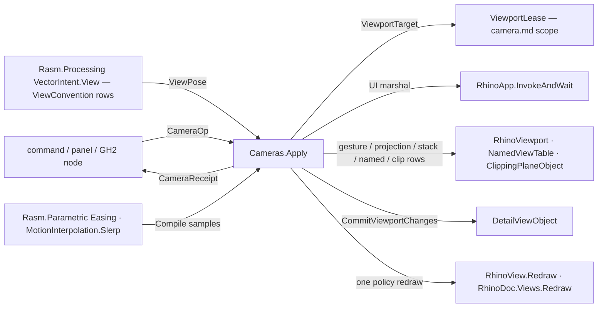

# [RASM_RHINO_CAMERA_OPERATIONS]

The one camera operation rail (`Rasm.Rhino.Viewport`). Every way a camera changes — keyboard and mouse gestures, projection changes including the `IsometricCamera` axonometric family and the `CameraAngle` lens, view and construction-plane stacks, subject framing through `ZoomBoundingBox`, the full named-view table family with paced restores, clipping-plane participation, defined-view settings scopes, kernel view-convention lowering, and motion-compiled pose sequences — is one case of one `CameraOp` `[Union]` executed by one `Cameras.Apply` entry. Execution absorbs what the census-era service scattered: scope resolution rides the `ViewportLease` (single and broadcast are the target's arity, never sibling surfaces), UI-thread dispatch gates every host mutation, detail edits commit through `CommitViewportChanges`, redraw collapses to one policy-selected call after the batch, and every application returns a `CameraReceipt` naming what moved. The killed forms are the per-modality union family (`CameraGesture`/`CameraProjection`/`CameraPath`/`CameraEdit` as parallel dispatch roots), the separate single/broadcast/rig executors, and the `Architecture.cs` recipe catalog — architectural conventions live as kernel `ViewConvention` rows lowered through `VectorIntent.View`, and this rail only seats the projected pose.

## [01]-[INDEX]

- [02]-[GESTURE_ROWS]: `KeyGesture` and `DragGesture` — the keyboard and mouse gesture vocabularies as delegate-column rows over the host verb families.
- [03]-[PROJECTION_AND_STACK]: `ProjectionChange` the projection request union including the axonometric and lens rows; `StackVerb` the view/cplane stack rows.
- [04]-[NAMED_AND_CLIP]: `NamedViewOp` the table family with `RestorePace` rows; `ClipLink` clipping-plane participation; `RestoreScope` the defined-view settings scope.
- [05]-[OPERATION_RAIL]: the `CameraOp` union, `ApplyPolicy`, `CameraReceipt`, and the one `Cameras.Apply` execution fold with UI-thread, detail-commit, and redraw absorption.

## [02]-[GESTURE_ROWS]

- Owner: `KeyGesture` `[SmartEnum<int>]` — the keyboard verb rows `RotateInPlace`, `Dolly`, `DollyInOut`, each a `[UseDelegateFromConstructor]` `Apply(RhinoViewport, bool, double)` column over `KeyboardRotate(leftRight:, angleRadians:)`, `KeyboardDolly(leftRight:, amount:)`, and `KeyboardDollyInOut(amount:)`. `DragGesture` `[SmartEnum<int>]` — the mouse verb rows `RotateAroundTarget`, `RotateCamera`, `InOutDolly`, `Magnify`, `Tilt`, `DollyZoom`, `LateralDolly`, each an `Apply(RhinoViewport, System.Drawing.Point, System.Drawing.Point)` column over the `(mousePreviousPoint:, mouseCurrentPoint:)` host family. `ScreenDrag` carries the drag as two `Point2d` values — the host `System.Drawing.Point` is minted inside the row body at the call, never on a public signature.
- Law: a gesture is a row plus a payload, so seven mouse verbs and three keyboard verbs are ten declarations with two delegate columns — the census `CameraGesture` union with per-verb cases and a second dispatch is the collapsed form; a new host gesture member is one row.
- Law: gesture magnitudes arrive admitted — a rotation angle is finite radians, a dolly amount finite — through the `Op` scalar gates at the `CameraOp.Gesture` factory, so the row body never re-validates.
- Boundary: gestures are relative host edits with no meaningful inverse value; their receipt evidence is the post-edit `ChangeCounter` delta, not a pose echo.

```csharp
// --- [RUNTIME_PRELUDE] ----------------------------------------------------------------------
using Rasm.Domain;
using Rasm.Numerics;
using Rasm.Parametric;
using Rasm.Processing;
using Rasm.Rhino.Document;

namespace Rasm.Rhino.Viewport;

// --- [TYPES] --------------------------------------------------------------------------------
[SmartEnum<int>]
public sealed partial class KeyGesture {
    public static readonly KeyGesture RotateInPlace = new(key: 0, apply: static (vp, leftRight, amount) => vp.KeyboardRotate(leftRight: leftRight, angleRadians: amount));
    public static readonly KeyGesture Dolly = new(key: 1, apply: static (vp, leftRight, amount) => vp.KeyboardDolly(leftRight: leftRight, amount: amount));
    public static readonly KeyGesture DollyInOut = new(key: 2, apply: static (vp, _, amount) => vp.KeyboardDollyInOut(amount: amount));

    [UseDelegateFromConstructor]
    internal partial bool Apply(RhinoViewport viewport, bool leftRight, double amount);
}

[SmartEnum<int>]
public sealed partial class DragGesture {
    public static readonly DragGesture RotateAroundTarget = new(key: 0, apply: static (vp, prev, curr) => vp.MouseRotateAroundTarget(mousePreviousPoint: prev, mouseCurrentPoint: curr));
    public static readonly DragGesture RotateCamera = new(key: 1, apply: static (vp, prev, curr) => vp.MouseRotateCamera(mousePreviousPoint: prev, mouseCurrentPoint: curr));
    public static readonly DragGesture InOutDolly = new(key: 2, apply: static (vp, prev, curr) => vp.MouseInOutDolly(mousePreviousPoint: prev, mouseCurrentPoint: curr));
    public static readonly DragGesture Magnify = new(key: 3, apply: static (vp, prev, curr) => vp.MouseMagnify(mousePreviousPoint: prev, mouseCurrentPoint: curr));
    public static readonly DragGesture Tilt = new(key: 4, apply: static (vp, prev, curr) => vp.MouseTilt(mousePreviousPoint: prev, mouseCurrentPoint: curr));
    public static readonly DragGesture DollyZoom = new(key: 5, apply: static (vp, prev, curr) => vp.MouseDollyZoom(mousePreviousPoint: prev, mouseCurrentPoint: curr));
    public static readonly DragGesture LateralDolly = new(key: 6, apply: static (vp, prev, curr) => vp.MouseLateralDolly(mousePreviousPoint: prev, mouseCurrentPoint: curr));

    [UseDelegateFromConstructor]
    internal partial bool Apply(RhinoViewport viewport, System.Drawing.Point previous, System.Drawing.Point current);
}

// --- [MODELS] -------------------------------------------------------------------------------
public readonly record struct ScreenDrag(Point2d From, Point2d To) {
    internal System.Drawing.Point Previous => new((int)From.X, (int)From.Y);
    internal System.Drawing.Point Current => new((int)To.X, (int)To.Y);
}

[Union(ConversionFromValue = ConversionOperatorsGeneration.None)]
public abstract partial record GestureRequest {
    private GestureRequest() { }
    public sealed record Keyed(KeyGesture Verb, bool LeftRight, double Amount) : GestureRequest;
    public sealed record Dragged(DragGesture Verb, ScreenDrag Drag) : GestureRequest;

    internal Fin<Unit> Apply(RhinoViewport viewport, Op key) =>
        Switch(
            state: (Viewport: viewport, Op: key),
            keyed: static (ctx, gesture) => ctx.Op.Confirm(success: gesture.Verb.Apply(viewport: ctx.Viewport, leftRight: gesture.LeftRight, amount: gesture.Amount)),
            dragged: static (ctx, gesture) => ctx.Op.Confirm(success: gesture.Verb.Apply(viewport: ctx.Viewport, previous: gesture.Drag.Previous, current: gesture.Drag.Current)));
}
```

## [03]-[PROJECTION_AND_STACK]

- Owner: `ProjectionChange` `[Union]` — the projection request: `ParallelCase(bool)`, `PerspectiveCase(Option<double>, bool, double)`, `TwoPointCase(double)`, `ReflectedCase`, `LensCase(LensState)` writing the `CameraAngle` setter, `LockCase(bool)` writing the `LockedProjection` toggle, `DefinedCase(DefinedViewportProjection, string, bool)` and `IsometricCase(IsometricCamera, string, bool)` through the two confirmed `SetProjection` overloads. `StackVerb` `[Union]` — the stack rows `ViewPush`/`ViewPop`/`ViewNext`/`ViewPrevious` over `PushViewProjection`/`PopViewProjection`/`NextViewProjection`/`PreviousViewProjection` and `CPlanePush(Plane)`/`CPlanePop` over `PushConstructionPlane`/`PopConstructionPlane`, with `SetCPlane(Plane)` riding `SetConstructionPlane` as the non-stack write.
- Law: the two-point change reuses the live camera up when it is valid and falls to `Vector3d.Zero` (the host's re-derive sentinel) otherwise, and the perspective target distance is `Option<double>` lowered to `RhinoMath.UnsetValue` at the call — absence stays typed until the host edge.
- Law: `IsometricCase` and `DefinedCase` are the Rhino 9 axonometric seam — `SetProjection(projection:, viewName:, updateConstructionPlane:)` — carried as first-class rows so an iso/axon view is a request value, never a command-script fallback.
- Boundary: a stack pop on an empty host stack returns the host `false` and crosses as a typed refusal; the stack depth is host state this rail never mirrors.

```csharp
// --- [TYPES] --------------------------------------------------------------------------------
[Union(ConversionFromValue = ConversionOperatorsGeneration.None)]
public abstract partial record ProjectionChange {
    private ProjectionChange() { }
    public sealed record ParallelCase(bool SymmetricFrustum = true) : ProjectionChange;
    public sealed record PerspectiveCase(Option<double> TargetDistance, bool SymmetricFrustum, double LensLength) : ProjectionChange;
    public sealed record TwoPointCase(double LensLength) : ProjectionChange;
    public sealed record ReflectedCase : ProjectionChange;
    public sealed record LensCase(LensState Angle) : ProjectionChange;
    public sealed record LockCase(bool Locked) : ProjectionChange;
    public sealed record DefinedCase(DefinedViewportProjection Projection, string ViewName, bool UpdateConstructionPlane) : ProjectionChange;
    public sealed record IsometricCase(IsometricCamera Camera, string ViewName, bool UpdateConstructionPlane) : ProjectionChange;

    internal Fin<Unit> Apply(RhinoViewport viewport, Op key) =>
        Switch(
            state: (Viewport: viewport, Op: key),
            parallelCase: static (ctx, change) => ctx.Op.Confirm(success: ctx.Viewport.ChangeToParallelProjection(symmetricFrustum: change.SymmetricFrustum)),
            perspectiveCase: static (ctx, change) => ctx.Op.Confirm(success: ctx.Viewport.ChangeToPerspectiveProjection(
                targetDistance: change.TargetDistance.IfNone(RhinoMath.UnsetValue),
                symmetricFrustum: change.SymmetricFrustum,
                lensLength: change.LensLength)),
            twoPointCase: static (ctx, change) => ctx.Op.Confirm(success: ctx.Viewport.ChangeToTwoPointPerspectiveProjection(
                lensLength: change.LensLength,
                up: ctx.Viewport.CameraUp.IsValid && !ctx.Viewport.CameraUp.IsTiny() ? ctx.Viewport.CameraUp : Vector3d.Zero,
                targetDistance: RhinoMath.UnsetValue)),
            reflectedCase: static (ctx, _) => ctx.Op.Confirm(success: ctx.Viewport.ChangeToParallelReflectedProjection()),
            lensCase: static (ctx, change) => ctx.Op.Catch(() => {
                ctx.Viewport.CameraAngle = (double)change.Angle;
                return Fin.Succ(value: unit);
            }),
            lockCase: static (ctx, change) => Fin.Succ(value: Op.Side(() => ctx.Viewport.LockedProjection = change.Locked)),
            definedCase: static (ctx, change) => ctx.Op.Confirm(
                success: ctx.Viewport.SetProjection(projection: change.Projection, viewName: change.ViewName, updateConstructionPlane: change.UpdateConstructionPlane)),
            isometricCase: static (ctx, change) => ctx.Op.Confirm(
                success: ctx.Viewport.SetProjection(projection: change.Camera, viewName: change.ViewName, updateConstructionPlane: change.UpdateConstructionPlane)));
}

[Union(ConversionFromValue = ConversionOperatorsGeneration.None)]
public abstract partial record StackVerb {
    private StackVerb() { }
    public sealed record ViewPush : StackVerb;
    public sealed record ViewPop : StackVerb;
    public sealed record ViewNext : StackVerb;
    public sealed record ViewPrevious : StackVerb;
    public sealed record CPlanePush(Plane Plane) : StackVerb;
    public sealed record CPlanePop : StackVerb;
    public sealed record SetCPlane(Plane Plane) : StackVerb;

    internal Fin<Unit> Apply(RhinoViewport viewport, Op key) =>
        Switch(
            state: (Viewport: viewport, Op: key),
            viewPush: static (ctx, _) => Fin.Succ(value: Op.Side(ctx.Viewport.PushViewProjection)),
            viewPop: static (ctx, _) => ctx.Op.Confirm(success: ctx.Viewport.PopViewProjection()),
            viewNext: static (ctx, _) => ctx.Op.Confirm(success: ctx.Viewport.NextViewProjection()),
            viewPrevious: static (ctx, _) => ctx.Op.Confirm(success: ctx.Viewport.PreviousViewProjection()),
            cPlanePush: static (ctx, verb) => Fin.Succ(value: Op.Side(() => ctx.Viewport.PushConstructionPlane(cplane: new DocObjects.ConstructionPlane { Plane = verb.Plane }))),
            cPlanePop: static (ctx, _) => ctx.Op.Confirm(success: ctx.Viewport.PopConstructionPlane()),
            setCPlane: static (ctx, verb) => Fin.Succ(value: Op.Side(() => ctx.Viewport.SetConstructionPlane(cplane: new DocObjects.ConstructionPlane { Plane = verb.Plane }))));
}
```

## [04]-[NAMED_AND_CLIP]

- Owner: `NamedViewOp` `[Union]` — the named-view table family: `RestoreCase(string, RestorePace)`, `AddCase(string)`, `RenameCase(string, string)`, `DeleteCase(string)`; name-to-index resolution runs once through `NamedViewTable.FindByName` inside the arm. `RestorePace` `[SmartEnum<int>]` — the four restore rows `Instant` (`Restore(index:, viewport:)`), `MatchAspect` (`RestoreWithAspectRatio`), `ConstantSpeed` (units per frame) and `ConstantTime` (frame count) through the animated pair — pace is a row with payload columns, never sibling restore entrypoints. `ClipLink` `[Union]` — clipping participation: `AttachCase(Guid)`/`DetachCase(Guid)` through `ClippingPlaneObject.AddClipViewport`/`RemoveClipViewport` with the commit flag as payload, and `CensusCase` reading `ObjectTable.FindClippingPlanesForViewport`. `RestoreScope` — the defined-view settings scope: captures the four `ViewSettings.DefinedViewSet*` statics, writes the request rows, runs the body, and restores the captured values in one bracket, so global mutation is scoped by construction — the census unscoped write is dead.
- Law: an animated restore's amount is pace-typed — units-per-frame on the speed row, the total frame count on the time row — and both lower to the host's `(index, viewport, amount, msDelay)` shape inside the row column, so a caller cannot cross the units.
- Law: clip attach/detach with `commit: false` batches inside one operation application and the rail's terminal redraw is the visibility edge; a per-plane commit-and-redraw loop is the collapsed form.
- Boundary: `RestoreScope` touches process-global host settings; it composes only inside `Cameras.Apply`, which serializes settings-scoped operations on the UI thread so two concurrent scopes cannot interleave their capture/restore pairs.

```csharp
// --- [TYPES] --------------------------------------------------------------------------------
[SmartEnum<int>]
public sealed partial class RestorePace {
    public static readonly RestorePace Instant = new(key: 0, restore: static (views, index, viewport, _, _) => views.Restore(index: index, viewport: viewport));
    public static readonly RestorePace MatchAspect = new(key: 1, restore: static (views, index, viewport, _, _) => views.RestoreWithAspectRatio(index: index, viewport: viewport));
    public static readonly RestorePace ConstantSpeed = new(key: 2, restore: static (views, index, viewport, amount, delay) =>
        amount > 0.0 && views.RestoreAnimatedConstantSpeed(index, viewport, amount, delay));
    public static readonly RestorePace ConstantTime = new(key: 3, restore: static (views, index, viewport, amount, delay) =>
        amount > 0.0 && views.RestoreAnimatedConstantTime(index, viewport, (int)Math.Round(amount, MidpointRounding.ToEven), delay));

    [UseDelegateFromConstructor]
    internal partial bool Restore(DocObjects.Tables.NamedViewTable views, int index, RhinoViewport viewport, double amount, int delayMilliseconds);
}

[Union(ConversionFromValue = ConversionOperatorsGeneration.None)]
public abstract partial record NamedViewOp {
    private NamedViewOp() { }
    public sealed record RestoreCase(string Name, RestorePace Pace, double Amount, int DelayMilliseconds) : NamedViewOp;
    public sealed record AddCase(string Name) : NamedViewOp;
    public sealed record RenameCase(string Name, string NewName) : NamedViewOp;
    public sealed record DeleteCase(string Name) : NamedViewOp;

    internal Fin<Unit> Apply(RhinoDoc document, RhinoViewport viewport, Op key) =>
        Switch(
            state: (Document: document, Viewport: viewport, Op: key),
            restoreCase: static (ctx, op) =>
                from index in IndexOf(document: ctx.Document, name: op.Name, key: ctx.Op)
                from _ in ctx.Op.Confirm(success: op.Pace.Restore(ctx.Document.NamedViews, index, ctx.Viewport, op.Amount, op.DelayMilliseconds))
                select unit,
            addCase: static (ctx, op) =>
                ctx.Document.NamedViews.Add(name: op.Name, viewportId: ctx.Viewport.Id) is >= 0
                    ? Fin.Succ(value: unit)
                    : Fin.Fail<Unit>(ctx.Op.InvalidResult()),
            renameCase: static (ctx, op) =>
                from index in IndexOf(document: ctx.Document, name: op.Name, key: ctx.Op)
                from _ in ctx.Op.Confirm(success: ctx.Document.NamedViews.Rename(index: index, newName: op.NewName))
                select unit,
            deleteCase: static (ctx, op) =>
                from index in IndexOf(document: ctx.Document, name: op.Name, key: ctx.Op)
                from _ in ctx.Op.Confirm(success: ctx.Document.NamedViews.Delete(index: index))
                select unit);

    private static Fin<int> IndexOf(RhinoDoc document, string name, Op key) =>
        document.NamedViews.FindByName(name: name) is var index and >= 0
            ? Fin.Succ(index)
            : Fin.Fail<int>(key.InvalidInput());
}

[Union(ConversionFromValue = ConversionOperatorsGeneration.None)]
public abstract partial record ClipLink {
    private ClipLink() { }
    public sealed record AttachCase(Guid PlaneId, bool Commit) : ClipLink;
    public sealed record DetachCase(Guid PlaneId, bool Commit) : ClipLink;
    public sealed record CensusCase : ClipLink;

    internal Fin<Seq<Guid>> Apply(RhinoDoc document, RhinoViewport viewport, Op key) =>
        Switch(
            state: (Document: document, Viewport: viewport, Op: key),
            attachCase: static (ctx, link) =>
                from plane in PlaneOf(document: ctx.Document, id: link.PlaneId, key: ctx.Op)
                from _ in ctx.Op.Confirm(success: plane.AddClipViewport(viewport: ctx.Viewport, commit: link.Commit))
                select Seq1(link.PlaneId),
            detachCase: static (ctx, link) =>
                from plane in PlaneOf(document: ctx.Document, id: link.PlaneId, key: ctx.Op)
                from _ in ctx.Op.Confirm(success: plane.RemoveClipViewport(viewport: ctx.Viewport, commit: link.Commit))
                select Seq1(link.PlaneId),
            censusCase: static (ctx, _) => Fin.Succ(
                toSeq(ctx.Document.Objects.FindClippingPlanesForViewport(viewport: ctx.Viewport)).Map(static plane => plane.Id)));

    private static Fin<DocObjects.ClippingPlaneObject> PlaneOf(RhinoDoc document, Guid id, Op key) =>
        Optional(document.Objects.FindId(objectId: id) as DocObjects.ClippingPlaneObject).ToFin(Fail: key.InvalidInput());
}

// --- [MODELS] -------------------------------------------------------------------------------
public readonly record struct RestoreScope(bool CPlane = true, bool Projection = true, bool Clipping = true, bool Display = true) {
    public static RestoreScope Default { get; } = new();

    internal Fin<TOut> Within<TOut>(Func<Fin<TOut>> body, Op key) {
        RestoreScope self = this;
        return key.Catch(() => {
            (bool cplane, bool projection, bool clipping, bool display) = (
                ApplicationSettings.ViewSettings.DefinedViewSetCPlane,
                ApplicationSettings.ViewSettings.DefinedViewSetProjection,
                ApplicationSettings.ViewSettings.DefinedViewSetClippingPlanes,
                ApplicationSettings.ViewSettings.DefinedViewSetDisplayMode);
            ApplicationSettings.ViewSettings.DefinedViewSetCPlane = self.CPlane;
            ApplicationSettings.ViewSettings.DefinedViewSetProjection = self.Projection;
            ApplicationSettings.ViewSettings.DefinedViewSetClippingPlanes = self.Clipping;
            ApplicationSettings.ViewSettings.DefinedViewSetDisplayMode = self.Display;
            try { return body(); }
            finally {
                ApplicationSettings.ViewSettings.DefinedViewSetCPlane = cplane;
                ApplicationSettings.ViewSettings.DefinedViewSetProjection = projection;
                ApplicationSettings.ViewSettings.DefinedViewSetClippingPlanes = clipping;
                ApplicationSettings.ViewSettings.DefinedViewSetDisplayMode = display;
            }
        });
    }
}
```

## [05]-[OPERATION_RAIL]

- Owner: `CameraOp` `[Union]` — the one operation vocabulary: `GestureCase(GestureRequest)`, `ProjectCase(ProjectionChange)`, `PoseCase(CameraPose)`, `StackCase(StackVerb)`, `FrameCase(BoundingBox, UnitInterval)` zooming a padded subject through `ZoomBoundingBox`, `NamedCase(NamedViewOp, RestoreScope)`, `ClipCase(ClipLink)`, `ConventionCase(ViewPose)` seating a kernel-projected convention pose, and `MotionCase(Seq<CameraPose>)` committing a motion-compiled pose sequence's terminal pose while handing the sequence to the pacing adapter. `ApplyPolicy` — the execution policy record: redraw selection (`RedrawWhat` rows `None`/`Views`/`Document`), detail commit, and UI-thread forcing. `CameraReceipt` — the typed evidence: per-row applied count, the clip census when a clip case ran, the pre/post `ChangeCounter` pairs, and the redraw fact — carried across the session capability rail as an `IDetachedDocumentResult`. Every pose-carrying arm seats through the camera page's one `CameraPose.SeatOn` triplet, so the rail re-spells no host camera write.
- Entry: `Cameras.Apply(DocumentSession, ViewportTarget, CameraOp, Option<ApplyPolicy> = default, Op? = null) : Fin<CameraReceipt>` — THE camera mutation entry. The fold: resolve the lease, marshal onto the UI thread when off it (`RhinoApp.InvokeAndWait` gated by `RhinoApp.IsOnMainThread`), apply the case to every resolved row, commit details (`DetailViewObject.CommitViewportChanges`) for rows that carry one, then run the policy's one redraw (`RhinoView.Redraw` per row or `RhinoDoc.Views.Redraw` once) — redraw reduction is structural because the fold owns the terminal edge.
- Law: the motion compile is a lowering, not a pump — `Cameras.Compile(CameraPose from, CameraPose to, Easing, Dimension frames, Context, Op?)` samples the kernel `MotionInterpolation.Slerp` pose interpolation under the kernel `Easing` curve into a pose sequence, with the caller's session `Context` carrying the admission tolerances; pacing, frame clocks, and redraw cadence belong to the motion adapter, which drives `Cameras.Apply` per emitted frame. Interpolation mathematics never lives here.
- Law: `ConventionCase` carries the kernel `ViewPose` — the `Rasm.Processing` `VectorIntent.View` projection over a subject bounds and a `ViewConvention` row — and this arm only lowers it: seat the pose, apply the row's projection intent, `ZoomBoundingBox` the subject; the six census recipes with their inline multipliers are dead.
- Growth: a new camera capability is one `CameraOp` case plus one arm — the generated `Switch` breaks every dispatch site; a new gesture, pace, projection, or clip modality is one row on its section owner with zero rail change.
- Boundary: every host mutation runs inside the UI-thread gate; a background caller pays one marshal per `Apply`, never per row — and the receipt is the only output, so no live handle leaves the rail.

```csharp
// --- [TYPES] --------------------------------------------------------------------------------
[SmartEnum<int>]
public sealed partial class RedrawWhat {
    public static readonly RedrawWhat None = new(key: 0);
    public static readonly RedrawWhat Views = new(key: 1);
    public static readonly RedrawWhat Document = new(key: 2);
}

[Union(ConversionFromValue = ConversionOperatorsGeneration.None)]
public abstract partial record CameraOp {
    private CameraOp() { }
    public sealed record GestureCase(GestureRequest Request) : CameraOp;
    public sealed record ProjectCase(ProjectionChange Change) : CameraOp;
    public sealed record PoseCase(CameraPose Pose) : CameraOp;
    public sealed record StackCase(StackVerb Verb) : CameraOp;
    public sealed record FrameCase(BoundingBox Subject, UnitInterval Padding) : CameraOp;
    public sealed record NamedCase(NamedViewOp Verb, RestoreScope Scope) : CameraOp;
    public sealed record ClipCase(ClipLink Link) : CameraOp;
    public sealed record ConventionCase(ViewPose Pose) : CameraOp;
    public sealed record MotionCase(Seq<CameraPose> Frames) : CameraOp;

    public static Fin<CameraOp> Gesture(GestureRequest request, Op? key = null) {
        Op op = key.OrDefault();
        return from valid in Optional(request).ToFin(Fail: op.InvalidInput())
               from _ in valid.Switch(
                   state: op,
                   keyed: static (inner, gesture) => inner.Finite(value: gesture.Amount).Map(static _ => unit),
                   dragged: static (inner, gesture) => guard(gesture.Drag.From.IsValid && gesture.Drag.To.IsValid, inner.InvalidInput()).ToFin())
               select (CameraOp)new GestureCase(Request: valid);
    }
    public static Fin<CameraOp> Project(ProjectionChange change, Op? key = null) =>
        Optional(change).ToFin(Fail: key.OrDefault().InvalidInput()).Map(static valid => (CameraOp)new ProjectCase(Change: valid));
    public static CameraOp Pose(CameraPose pose) => new PoseCase(Pose: pose);
    public static CameraOp Stack(StackVerb verb) => new StackCase(Verb: verb);
    public static Fin<CameraOp> Frame(BoundingBox subject, double padding = 0.05, Op? key = null) {
        Op op = key.OrDefault();
        return from _ in guard(subject.IsValid, op.InvalidInput()).ToFin()
               from pad in op.AcceptValidated<UnitInterval>(candidate: padding)
               select (CameraOp)new FrameCase(Subject: subject, Padding: pad);
    }
    public static Fin<CameraOp> Named(NamedViewOp verb, RestoreScope? scope = null, Op? key = null) =>
        Optional(verb).ToFin(Fail: key.OrDefault().InvalidInput()).Map(valid => (CameraOp)new NamedCase(Verb: valid, Scope: scope ?? RestoreScope.Default));
    public static Fin<CameraOp> Clip(ClipLink link, Op? key = null) =>
        Optional(link).ToFin(Fail: key.OrDefault().InvalidInput()).Map(static valid => (CameraOp)new ClipCase(Link: valid));
    public static Fin<CameraOp> Convention(ViewPose pose, Op? key = null) =>
        key.OrDefault().AcceptValue(value: pose).Map(static valid => (CameraOp)new ConventionCase(Pose: valid));
    public static Fin<CameraOp> Motion(Seq<CameraPose> frames, Op? key = null) =>
        guard(!frames.IsEmpty, key.OrDefault().InvalidInput()).ToFin().Map(_ => (CameraOp)new MotionCase(Frames: frames));
}

// --- [MODELS] -------------------------------------------------------------------------------
public sealed record ApplyPolicy(RedrawWhat Redraw, bool CommitDetails, bool ForceUiThread) {
    public static ApplyPolicy Default { get; } = new(Redraw: RedrawWhat.Views, CommitDetails: true, ForceUiThread: true);
    public static ApplyPolicy Silent { get; } = new(Redraw: RedrawWhat.None, CommitDetails: true, ForceUiThread: true);
}

public sealed record CameraReceipt(int Applied, Seq<(uint Before, uint After)> Serials, Seq<Guid> ClipCensus, RedrawWhat Redrew) : IDetachedDocumentResult;

// --- [OPERATIONS] ---------------------------------------------------------------------------
public static class Cameras {
    public static Fin<CameraReceipt> Apply(DocumentSession session, ViewportTarget target, CameraOp operation, Option<ApplyPolicy> policy = default, Op? key = null) {
        Op op = key.OrDefault();
        ApplyPolicy plan = policy.IfNone(ApplyPolicy.Default);
        return from lease in ViewportLease.Of(session: session, target: target, key: op)
               from receipt in session.Demand(
                   use: document => OnUiThread(body: () => Execute(document: document, lease: lease, operation: operation, plan: plan, key: op), force: plan.ForceUiThread, key: op),
                   key: op,
                   needs: [SessionNeed.Redraw])
               select receipt;
    }

    public static Fin<Seq<CameraPose>> Compile(CameraPose from, CameraPose to, Easing easing, Dimension frames, Context context, Op? key = null) {
        Op op = key.OrDefault();
        return Range(0, frames.Value).AsIterable().TraverseM(step =>
            from t in op.AcceptValidated<UnitInterval>(candidate: frames.Value <= 1 ? 1.0 : step / (double)(frames.Value - 1))
            from eased in op.AcceptValidated<UnitInterval>(candidate: Math.Clamp(easing.Evaluate(t: t), 0.0, 1.0))
            from intent in VectorIntent.Pose(from: from.Frame.Value, to: to.Frame.Value, t: eased.Value, mode: MotionInterpolation.Slerp, key: op)
            from plane in intent.Project<Plane>(context: context, key: op)
            from frame in VectorFrame.Of(origin: plane.Origin, normal: plane.ZAxis, xHint: Some(plane.XAxis), context: context, key: op)
            from lens in op.AcceptValidated<LensState>(candidate: double.Lerp((double)from.Lens, (double)to.Lens, eased.Value))
            select new CameraPose(Frame: frame, Target: to.Target, Lens: lens, Projection: to.Projection)).As()
            .Map(static poses => toSeq(poses));
    }

    private static Fin<CameraReceipt> Execute(RhinoDoc document, ViewportLease lease, CameraOp operation, ApplyPolicy plan, Op key) =>
        from outcomes in lease.UseAll(borrow: row =>
            from before in Fin.Succ(row.Viewport.ChangeCounter)
            from clips in operation.Switch(
                state: (Document: document, Row: row, Op: key),
                gestureCase: static (ctx, op) => op.Request.Apply(viewport: ctx.Row.Viewport, key: ctx.Op).Map(static _ => Seq<Guid>()),
                projectCase: static (ctx, op) => op.Change.Apply(viewport: ctx.Row.Viewport, key: ctx.Op).Map(static _ => Seq<Guid>()),
                poseCase: static (ctx, op) => ctx.Op.Catch(() => {
                    _ = op.Pose.SeatOn(viewport: ctx.Row.Viewport);
                    return Fin.Succ(Seq<Guid>());
                }),
                stackCase: static (ctx, op) => op.Verb.Apply(viewport: ctx.Row.Viewport, key: ctx.Op).Map(static _ => Seq<Guid>()),
                frameCase: static (ctx, op) => {
                    BoundingBox padded = op.Subject;
                    padded.Inflate(op.Subject.Diagonal.Length * op.Padding.Value, op.Subject.Diagonal.Length * op.Padding.Value, op.Subject.Diagonal.Length * op.Padding.Value);
                    return ctx.Op.Confirm(success: ctx.Row.Viewport.ZoomBoundingBox(box: padded)).Map(static _ => Seq<Guid>());
                },
                namedCase: static (ctx, op) => op.Scope.Within(
                    body: () => op.Verb.Apply(document: ctx.Document, viewport: ctx.Row.Viewport, key: ctx.Op).Map(static _ => Seq<Guid>()),
                    key: ctx.Op),
                clipCase: static (ctx, op) => op.Link.Apply(document: ctx.Document, viewport: ctx.Row.Viewport, key: ctx.Op),
                conventionCase: static (ctx, op) => ctx.Op.Catch(() => {
                    ctx.Row.Viewport.SetCameraLocations(targetLocation: op.Pose.Target, cameraLocation: op.Pose.Frame.Value.Origin);
                    ctx.Row.Viewport.SetCameraDirection(cameraDirection: op.Pose.Frame.Value.ZAxis, updateTargetLocation: false);
                    return Lowered(intent: op.Pose.Projection, lens: op.Pose.Lens)
                        .Apply(viewport: ctx.Row.Viewport, key: ctx.Op)
                        .Bind(_ => ctx.Op.Confirm(success: ctx.Row.Viewport.ZoomBoundingBox(box: op.Pose.Subject)))
                        .Map(static _ => Seq<Guid>());
                }),
                motionCase: static (ctx, op) => op.Frames.Last.ToFin(Fail: ctx.Op.InvalidInput()).Bind(pose => ctx.Op.Catch(() => {
                    _ = pose.SeatOn(viewport: ctx.Row.Viewport);
                    return Fin.Succ(Seq<Guid>());
                })))
            from committed in row.Detail.Match(
                Some: detail => plan.CommitDetails ? key.Confirm(success: detail.CommitViewportChanges()) : Fin.Succ(value: unit),
                None: () => Fin.Succ(value: unit))
            from _ in plan.Redraw == RedrawWhat.Views ? Fin.Succ(value: Op.Side(row.View.Redraw)) : Fin.Succ(value: unit)
            select (Serial: (Before: before, After: row.Viewport.ChangeCounter), Clips: clips),
            key: key)
        from _ in plan.Redraw == RedrawWhat.Document ? Fin.Succ(value: Op.Side(document.Views.Redraw)) : Fin.Succ(value: unit)
        select new CameraReceipt(
            Applied: outcomes.Count,
            Serials: outcomes.Map(static row => row.Serial),
            ClipCensus: outcomes.Bind(static row => row.Clips),
            Redrew: plan.Redraw);

    // The one kernel-to-host projection lowering: ViewProjectionIntent rows map onto ProjectionChange cases.
    private static ProjectionChange Lowered(ViewProjectionIntent intent, double lens) =>
        intent.Switch(
            parallel: static () => (ProjectionChange)new ProjectionChange.ParallelCase(SymmetricFrustum: true),
            perspective: () => new ProjectionChange.PerspectiveCase(TargetDistance: Option<double>.None, SymmetricFrustum: true, LensLength: lens),
            twoPoint: () => new ProjectionChange.TwoPointCase(LensLength: lens),
            parallelReflected: static () => new ProjectionChange.ReflectedCase());

    private static Fin<TOut> OnUiThread<TOut>(Func<Fin<TOut>> body, bool force, Op key) {
        if (!force || RhinoApp.IsOnMainThread) { return body(); }
        Fin<TOut> result = Fin.Fail<TOut>(key.InvalidResult());
        RhinoApp.InvokeAndWait(action: () => result = body());
        return result;
    }
}
```


