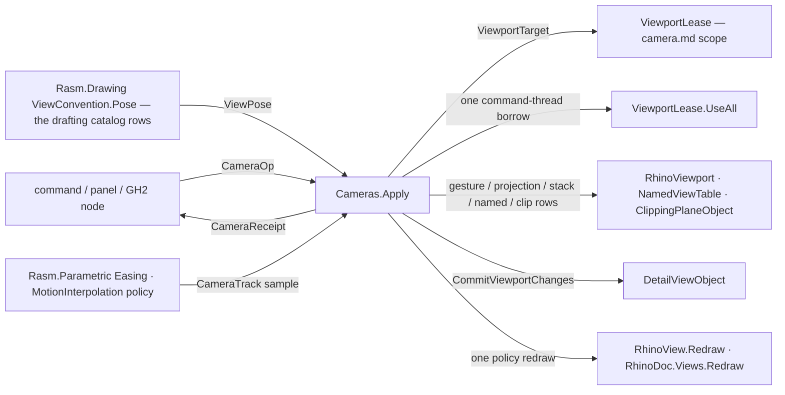

# [RASM_RHINO_CAMERA_OPERATIONS]

Camera mutation has one `CameraOp` vocabulary and one `Cameras.Apply` entry. Gesture, projection, stack, framing, named-view, clipping, convention, pose, and generated motion cases resolve through `ViewportLease`; detail commits and redraw reduce inside the same native borrow; every result is a `CameraReceipt`. `CameraTrack` generates the pose continuum from parameters, while `MotionPump` paces every sample.

## [01]-[INDEX]

- [02]-[GESTURE_ROWS]: `KeyGesture` and `DragGesture` — the keyboard and mouse gesture vocabularies as delegate-column rows over the host verb families.
- [03]-[PROJECTION_AND_STACK]: `ProjectionChange` the projection request union including the axonometric and lens rows; `StackVerb` the view/cplane stack rows.
- [04]-[NAMED_AND_CLIP]: `NamedViewOp` the table family with `RestorePace` rows; `ClipLink` clipping-plane participation; `RestoreScope` the defined-view settings scope.
- [05]-[OPERATION_RAIL]: the `CameraOp` union, `ApplyPolicy`, `CameraReceipt`, and the one `Cameras.Apply` execution fold with UI-thread, detail-commit, and redraw absorption.

## [02]-[GESTURE_ROWS]

- Owner: `KeyGesture` and `DragGesture` are delegate-column smart-enums over the host gesture families; `GestureAxis` replaces the `leftRight` Boolean at the public boundary; `ScreenDrag` retains `Point2d` values and mints `System.Drawing.Point` only at the host call.
- Law: a gesture is a row plus a payload, so seven mouse verbs and three keyboard verbs are ten declarations with two delegate columns — the census `CameraGesture` union with per-verb cases and a second dispatch is the collapsed form; a new host gesture member is one row.
- Law: `GestureRequest.Admit` owns complete case admission: keyed magnitudes are finite, row references are present, and dragged payloads pass the `ScreenDrag` storage seam before host projection. `CameraOp.Gesture` only lifts that admitted request.
- Boundary: gestures are relative host edits with no meaningful inverse value; their receipt evidence is the post-edit `ChangeCounter` delta, not a pose echo.

```csharp
// --- [RUNTIME_PRELUDE] ----------------------------------------------------------------------
using Rasm.Domain;
using Rasm.Drawing;
using Rasm.Numerics;
using Rasm.Parametric;
using Rasm.Processing;
using Rasm.Rhino.Document;
using System.Collections.Frozen;
using System.Runtime.InteropServices;

namespace Rasm.Rhino.Viewport;

// --- [TYPES] --------------------------------------------------------------------------------
[SmartEnum<int>]
public sealed partial class KeyGesture {
    public static readonly KeyGesture RotateInPlace = new(key: 0, apply: static (vp, leftRight, amount) => vp.KeyboardRotate(leftRight: leftRight, angleRadians: amount));
    public static readonly KeyGesture Dolly = new(key: 1, apply: static (vp, leftRight, amount) => vp.KeyboardDolly(leftRight: leftRight, amount: amount));
    public static readonly KeyGesture DollyInOut = new(key: 2, apply: static (vp, _, amount) => vp.KeyboardDollyInOut(amount: amount));

    [UseDelegateFromConstructor]
    internal partial bool Apply(RhinoViewport viewport, bool leftRight, double amount);
}

[SmartEnum<int>]
public sealed partial class GestureAxis {
    public static readonly GestureAxis Horizontal = new(key: 0, leftRight: true);
    public static readonly GestureAxis Vertical = new(key: 1, leftRight: false);

    internal bool LeftRight { get; }
}

[SmartEnum<int>]
public sealed partial class DragGesture {
    public static readonly DragGesture RotateAroundTarget = new(key: 0, apply: static (vp, prev, curr) => vp.MouseRotateAroundTarget(mousePreviousPoint: prev, mouseCurrentPoint: curr));
    public static readonly DragGesture RotateCamera = new(key: 1, apply: static (vp, prev, curr) => vp.MouseRotateCamera(mousePreviousPoint: prev, mouseCurrentPoint: curr));
    public static readonly DragGesture InOutDolly = new(key: 2, apply: static (vp, prev, curr) => vp.MouseInOutDolly(mousePreviousPoint: prev, mouseCurrentPoint: curr));
    public static readonly DragGesture Magnify = new(key: 3, apply: static (vp, prev, curr) => vp.MouseMagnify(mousePreviousPoint: prev, mouseCurrentPoint: curr));
    public static readonly DragGesture Tilt = new(key: 4, apply: static (vp, prev, curr) => vp.MouseTilt(mousePreviousPoint: prev, mouseCurrentPoint: curr));
    public static readonly DragGesture DollyZoom = new(key: 5, apply: static (vp, prev, curr) => vp.MouseDollyZoom(mousePreviousPoint: prev, mouseCurrentPoint: curr));
    public static readonly DragGesture LateralDolly = new(key: 6, apply: static (vp, prev, curr) => vp.MouseLateralDolly(mousePreviousPoint: prev, mouseCurrentPoint: curr));

    [UseDelegateFromConstructor]
    internal partial bool Apply(RhinoViewport viewport, System.Drawing.Point previous, System.Drawing.Point current);
}

// --- [MODELS] -------------------------------------------------------------------------------
[ComplexValueObject]
[StructLayout(LayoutKind.Auto)]
public readonly partial struct ScreenDrag {
    public Point2d From { get; }
    public Point2d To { get; }

    [BoundaryAdapter]
    static partial void ValidateFactoryArguments(
        ref ValidationError? validationError,
        ref Point2d from,
        ref Point2d to) {
        validationError = Valid(from: from, to: to)
            ? validationError
            : new ValidationError(message: "screen drag is invalid");
    }

    internal bool IsValid => Valid(from: From, to: To);
    internal System.Drawing.Point Previous => new((int)From.X, (int)From.Y);
    internal System.Drawing.Point Current => new((int)To.X, (int)To.Y);

    private static bool Valid(Point2d from, Point2d to) =>
        from.IsValid && to.IsValid
        && (from.X != to.X || from.Y != to.Y)
        && InRange(from.X) && InRange(from.Y) && InRange(to.X) && InRange(to.Y);

    private static bool InRange(double value) => value >= int.MinValue && value <= int.MaxValue;
}

[Union(ConversionFromValue = ConversionOperatorsGeneration.None)]
public abstract partial record GestureRequest {
    private GestureRequest() { }
    public sealed record Keyed(KeyGesture Verb, GestureAxis Axis, double Amount) : GestureRequest;
    public sealed record Dragged(DragGesture Verb, ScreenDrag Drag) : GestureRequest;

    internal Fin<GestureRequest> Admit(Op op) => Switch(
        op,
        keyed: static (key, gesture) => guard(
                gesture.Verb is not null && gesture.Axis is not null,
                key.InvalidInput())
            .ToFin()
            .Bind(_ => key.Finite(value: gesture.Amount))
            .Map(_ => (GestureRequest)gesture),
        dragged: static (key, gesture) => guard(
                gesture.Verb is not null && gesture.Drag.IsValid,
                key.InvalidInput())
            .ToFin()
            .Map(_ => (GestureRequest)gesture));

    internal Fin<Unit> Apply(RhinoViewport viewport, Op key) =>
        Switch(
            (Viewport: viewport, Op: key),
            keyed: static (ctx, gesture) => ctx.Op.Confirm(success: gesture.Verb.Apply(viewport: ctx.Viewport, leftRight: gesture.Axis.LeftRight, amount: gesture.Amount)),
            dragged: static (ctx, gesture) => ctx.Op.Confirm(success: gesture.Verb.Apply(viewport: ctx.Viewport, previous: gesture.Drag.Previous, current: gesture.Drag.Current)));
}
```

## [03]-[PROJECTION_AND_STACK]

- Owner: `ProjectionChange` `[Union]` owns parallel, perspective, two-point, reflected, lens, lock, defined, and isometric changes. `FrustumForm`, `ProjectionLock`, and `CPlaneProjectionPolicy` carry host Boolean columns as named policy rows. `StackVerb` owns view-projection and construction-plane stack transitions.
- Law: the two-point change reuses the live camera up when it is valid and falls to `Vector3d.Zero` (the host's re-derive sentinel) otherwise, and the perspective target distance is `Option<double>` lowered to `RhinoMath.UnsetValue` at the call — absence stays typed until the host edge.
- Law: `IsometricCase` and `DefinedCase` are the Rhino 9 axonometric seam — `SetProjection(projection:, viewName:, updateConstructionPlane:)` — carried as first-class rows so an iso/axon view is a request value, never a command-script fallback.
- Boundary: `PopViewProjection`/`NextViewProjection`/`PreviousViewProjection`/`PopConstructionPlane` return `false` both at the stack boundary and when the popped projection equals the current one — a benign no-op, never a failure — so the stack rows swallow the `bool` and the receipt's unchanged `ChangeCounter` pair is the no-move evidence; the stack depth is host state this rail never mirrors.

```csharp
// --- [TYPES] --------------------------------------------------------------------------------
[Union(ConversionFromValue = ConversionOperatorsGeneration.None)]
public abstract partial record ProjectionChange {
    private ProjectionChange() { }
    public sealed record ParallelCase(FrustumForm Frustum) : ProjectionChange;
    public sealed record PerspectiveCase(Option<double> TargetDistance, FrustumForm Frustum, double LensLength) : ProjectionChange;
    public sealed record TwoPointCase(double LensLength) : ProjectionChange;
    public sealed record ReflectedCase : ProjectionChange;
    public sealed record LensCase(LensAngle Angle) : ProjectionChange;
    public sealed record LockCase(ProjectionLock State) : ProjectionChange;
    public sealed record DefinedCase(DefinedViewportProjection Projection, string ViewName, CPlaneProjectionPolicy CPlane) : ProjectionChange;
    public sealed record IsometricCase(IsometricCamera Camera, string ViewName, CPlaneProjectionPolicy CPlane) : ProjectionChange;

    internal Fin<Unit> Apply(RhinoViewport viewport, Op key) =>
        Switch(
            (Viewport: viewport, Op: key),
            parallelCase: static (ctx, change) => ctx.Op.Confirm(success: ctx.Viewport.ChangeToParallelProjection(symmetricFrustum: change.Frustum.IsSymmetric)),
            perspectiveCase: static (ctx, change) => ctx.Op.Confirm(success: ctx.Viewport.ChangeToPerspectiveProjection(
                targetDistance: change.TargetDistance.IfNone(RhinoMath.UnsetValue),
                symmetricFrustum: change.Frustum.IsSymmetric,
                lensLength: change.LensLength)),
            twoPointCase: static (ctx, change) => ctx.Op.Confirm(success: ctx.Viewport.ChangeToTwoPointPerspectiveProjection(
                lensLength: change.LensLength,
                up: ctx.Viewport.CameraUp.IsValid && !ctx.Viewport.CameraUp.IsTiny() ? ctx.Viewport.CameraUp : Vector3d.Zero,
                targetDistance: RhinoMath.UnsetValue)),
            reflectedCase: static (ctx, _) => ctx.Op.Confirm(success: ctx.Viewport.ChangeToParallelReflectedProjection()),
            lensCase: static (ctx, change) => ctx.Op.Catch(() => {
                ctx.Viewport.CameraAngle = (double)change.Angle;
                return Fin.Succ(value: unit);
            }),
            lockCase: static (ctx, change) => Fin.Succ(value: Op.Side(() => ctx.Viewport.LockedProjection = change.State.IsLocked)),
            definedCase: static (ctx, change) => ctx.Op.Confirm(
                success: ctx.Viewport.SetProjection(projection: change.Projection, viewName: change.ViewName, updateConstructionPlane: change.CPlane.ShouldUpdate)),
            isometricCase: static (ctx, change) => ctx.Op.Confirm(
                success: ctx.Viewport.SetProjection(projection: change.Camera, viewName: change.ViewName, updateConstructionPlane: change.CPlane.ShouldUpdate)));
}

[SmartEnum<int>]
public sealed partial class FrustumForm {
    public static readonly FrustumForm Symmetric = new(key: 0, isSymmetric: true);
    public static readonly FrustumForm Asymmetric = new(key: 1, isSymmetric: false);
    internal bool IsSymmetric { get; }
}

[SmartEnum<int>]
public sealed partial class ProjectionLock {
    public static readonly ProjectionLock Locked = new(key: 0, isLocked: true);
    public static readonly ProjectionLock Unlocked = new(key: 1, isLocked: false);
    internal bool IsLocked { get; }
}

[SmartEnum<int>]
public sealed partial class CPlaneProjectionPolicy {
    public static readonly CPlaneProjectionPolicy Preserve = new(key: 0, shouldUpdate: false);
    public static readonly CPlaneProjectionPolicy Update = new(key: 1, shouldUpdate: true);
    internal bool ShouldUpdate { get; }
}

[Union(ConversionFromValue = ConversionOperatorsGeneration.None)]
public abstract partial record StackVerb {
    private StackVerb() { }
    public sealed record ViewPush : StackVerb;
    public sealed record ViewPop : StackVerb;
    public sealed record ViewNext : StackVerb;
    public sealed record ViewPrevious : StackVerb;
    public sealed record CPlanePush(Plane Plane) : StackVerb;
    public sealed record CPlanePop : StackVerb;
    public sealed record SetCPlane(Plane Plane) : StackVerb;

    internal Fin<Unit> Apply(RhinoViewport viewport, Op key) =>
        Switch(
            (Viewport: viewport, Op: key),
            viewPush: static (ctx, _) => Fin.Succ(value: Op.Side(ctx.Viewport.PushViewProjection)),
            viewPop: static (ctx, _) => Fin.Succ(value: ignore(ctx.Viewport.PopViewProjection())),
            viewNext: static (ctx, _) => Fin.Succ(value: ignore(ctx.Viewport.NextViewProjection())),
            viewPrevious: static (ctx, _) => Fin.Succ(value: ignore(ctx.Viewport.PreviousViewProjection())),
            cPlanePush: static (ctx, verb) => Fin.Succ(value: Op.Side(() => ctx.Viewport.PushConstructionPlane(cplane: new DocObjects.ConstructionPlane { Plane = verb.Plane }))),
            cPlanePop: static (ctx, _) => Fin.Succ(value: ignore(ctx.Viewport.PopConstructionPlane())),
            setCPlane: static (ctx, verb) => Fin.Succ(value: Op.Side(() => ctx.Viewport.SetConstructionPlane(cplane: new DocObjects.ConstructionPlane { Plane = verb.Plane }))));
}
```

## [04]-[NAMED_AND_CLIP]

- Owner: `NamedViewOp` `[Union]` owns restore, add, rename, and delete; name-to-index resolution runs once through `NamedViewTable.FindByName` inside the arm. `RestorePace` `[Union]` carries instant, aspect-matched, constant-speed, and constant-time evidence with pace-specific payloads. `ClipLink` `[Union]` owns clipping participation. `RestoreScope` owns the frozen defined-view facet set; each `RestoreFacet` row carries its own `ViewSettings.DefinedViewSet*` read/write slot, so the bracket folds over `Items` and a new facet is one row.
- Law: an animated restore's amount is pace-typed — units-per-frame on the speed row, the total frame count on the time row — and both lower to the host's `(index, viewport, amount, msDelay)` shape inside the row column, so a caller cannot cross the units.
- Law: clip attach/detach with `commit: false` batches inside one operation application and the rail's terminal redraw is the visibility edge; a per-plane commit-and-redraw loop is the collapsed form.
- Boundary: `RestoreScope` touches process-global host settings; it composes only inside `Cameras.Apply`, whose session demand lands settings-scoped operations on the command thread so two concurrent scopes cannot interleave their capture/restore pairs. Complete pre-state capture precedes setup, every facet participates in setup and restoration, and restoration faults append to the primary fault.

```csharp
// --- [TYPES] --------------------------------------------------------------------------------
[Union(ConversionFromValue = ConversionOperatorsGeneration.None)]
public abstract partial record RestorePace {
    private RestorePace() { }
    public sealed record InstantCase : RestorePace;
    public sealed record MatchAspectCase : RestorePace;
    public sealed record ConstantSpeedCase(RestoreSpeed Speed, RestoreDelay Delay) : RestorePace;
    public sealed record ConstantTimeCase(RestoreFrames Frames, RestoreDelay Delay) : RestorePace;

    public static RestorePace Instant { get; } = new InstantCase();
    public static RestorePace MatchAspect { get; } = new MatchAspectCase();

    public static Fin<RestorePace> ConstantSpeed(double unitsPerFrame, int delayMilliseconds, Op? key = null) {
        Op op = key.OrDefault();
        return from speed in op.AcceptValidated<RestoreSpeed>(candidate: unitsPerFrame)
               from delay in op.AcceptValidated<RestoreDelay>(candidate: delayMilliseconds)
               select (RestorePace)new ConstantSpeedCase(Speed: speed, Delay: delay);
    }

    public static Fin<RestorePace> ConstantTime(int frames, int delayMilliseconds, Op? key = null) {
        Op op = key.OrDefault();
        return from count in op.AcceptValidated<RestoreFrames>(candidate: frames)
               from delay in op.AcceptValidated<RestoreDelay>(candidate: delayMilliseconds)
               select (RestorePace)new ConstantTimeCase(Frames: count, Delay: delay);
    }

    internal bool Apply(DocObjects.Tables.NamedViewTable views, int index, RhinoViewport viewport) =>
        Switch(
            (Views: views, Index: index, Viewport: viewport),
            instantCase: static (ctx, _) => ctx.Views.Restore(index: ctx.Index, viewport: ctx.Viewport),
            matchAspectCase: static (ctx, _) => ctx.Views.RestoreWithAspectRatio(index: ctx.Index, viewport: ctx.Viewport),
            constantSpeedCase: static (ctx, pace) => ctx.Views.RestoreAnimatedConstantSpeed(ctx.Index, ctx.Viewport, (double)pace.Speed, (int)pace.Delay),
            constantTimeCase: static (ctx, pace) => ctx.Views.RestoreAnimatedConstantTime(ctx.Index, ctx.Viewport, (int)pace.Frames, (int)pace.Delay));
}

[ValueObject<double>]
public readonly partial struct RestoreSpeed {
    [BoundaryAdapter]
    static partial void ValidateFactoryArguments(ref ValidationError? validationError, ref double value) {
        validationError = double.IsFinite(value) && value > 0.0
            ? validationError
            : new ValidationError(message: "restore speed is invalid");
    }
}

[ValueObject<int>]
public readonly partial struct RestoreFrames {
    [BoundaryAdapter]
    static partial void ValidateFactoryArguments(ref ValidationError? validationError, ref int value) {
        validationError = value > 0
            ? validationError
            : new ValidationError(message: "restore frame count is invalid");
    }
}

[ValueObject<int>]
public readonly partial struct RestoreDelay {
    [BoundaryAdapter]
    static partial void ValidateFactoryArguments(ref ValidationError? validationError, ref int value) {
        validationError = value >= 0
            ? validationError
            : new ValidationError(message: "restore delay is invalid");
    }
}

[Union(ConversionFromValue = ConversionOperatorsGeneration.None)]
public abstract partial record NamedViewOp {
    private NamedViewOp() { }
    public sealed record RestoreCase(string Name, RestorePace Pace) : NamedViewOp;
    public sealed record AddCase(string Name) : NamedViewOp;
    public sealed record RenameCase(string Name, string NewName) : NamedViewOp;
    public sealed record DeleteCase(string Name) : NamedViewOp;

    internal Fin<Unit> Apply(RhinoDoc document, RhinoViewport viewport, Op key) =>
        Switch(
            (Document: document, Viewport: viewport, Op: key),
            restoreCase: static (ctx, op) =>
                from index in IndexOf(document: ctx.Document, name: op.Name, key: ctx.Op)
                from _ in ctx.Op.Confirm(success: op.Pace.Apply(ctx.Document.NamedViews, index, ctx.Viewport))
                select unit,
            addCase: static (ctx, op) =>
                ctx.Document.NamedViews.Add(name: op.Name, viewportId: ctx.Viewport.Id) is >= 0
                    ? Fin.Succ(value: unit)
                    : Fin.Fail<Unit>(ctx.Op.InvalidResult()),
            renameCase: static (ctx, op) =>
                from index in IndexOf(document: ctx.Document, name: op.Name, key: ctx.Op)
                from _ in ctx.Op.Confirm(success: ctx.Document.NamedViews.Rename(index: index, newName: op.NewName))
                select unit,
            deleteCase: static (ctx, op) =>
                from index in IndexOf(document: ctx.Document, name: op.Name, key: ctx.Op)
                from _ in ctx.Op.Confirm(success: ctx.Document.NamedViews.Delete(index: index))
                select unit);

    private static Fin<int> IndexOf(RhinoDoc document, string name, Op key) =>
        document.NamedViews.FindByName(name: name) is var index and >= 0
            ? Fin.Succ(index)
            : Fin.Fail<int>(key.InvalidInput());
}

[Union(ConversionFromValue = ConversionOperatorsGeneration.None)]
public abstract partial record ClipLink {
    private ClipLink() { }
    public sealed record AttachCase(Guid PlaneId, ClipCommit Commit) : ClipLink;
    public sealed record DetachCase(Guid PlaneId, ClipCommit Commit) : ClipLink;
    public sealed record CensusCase : ClipLink;

    internal Fin<Seq<Guid>> Apply(RhinoDoc document, RhinoViewport viewport, Op key) =>
        Switch(
            (Document: document, Viewport: viewport, Op: key),
            attachCase: static (ctx, link) =>
                from plane in PlaneOf(document: ctx.Document, id: link.PlaneId, key: ctx.Op)
                from _ in ctx.Op.Confirm(success: plane.AddClipViewport(viewport: ctx.Viewport, commit: link.Commit.Enabled))
                select Seq(link.PlaneId),
            detachCase: static (ctx, link) =>
                from plane in PlaneOf(document: ctx.Document, id: link.PlaneId, key: ctx.Op)
                from _ in ctx.Op.Confirm(success: plane.RemoveClipViewport(viewport: ctx.Viewport, commit: link.Commit.Enabled))
                select Seq(link.PlaneId),
            censusCase: static (ctx, _) => Fin.Succ(
                toSeq(ctx.Document.Objects.FindClippingPlanesForViewport(viewport: ctx.Viewport)).Map(static plane => plane.Id)));

    private static Fin<DocObjects.ClippingPlaneObject> PlaneOf(RhinoDoc document, Guid id, Op key) =>
        Optional(document.Objects.FindId(objectId: id) as DocObjects.ClippingPlaneObject).ToFin(Fail: key.InvalidInput());
}

[SmartEnum<int>]
public sealed partial class ClipCommit {
    public static readonly ClipCommit Deferred = new(key: 0, enabled: false);
    public static readonly ClipCommit Immediate = new(key: 1, enabled: true);
    internal bool Enabled { get; }
}

// --- [MODELS] -------------------------------------------------------------------------------
// Facet rows own the process-global ViewSettings slot they gate; a new defined-view facet is one row and RestoreScope.Within needs no edit.
[SmartEnum<int>]
public sealed partial class RestoreFacet {
    public static readonly RestoreFacet CPlane = new(
        key: 0,
        read: static () => ApplicationSettings.ViewSettings.DefinedViewSetCPlane,
        write: static on => Op.Side(() => ApplicationSettings.ViewSettings.DefinedViewSetCPlane = on));
    public static readonly RestoreFacet Projection = new(
        key: 1,
        read: static () => ApplicationSettings.ViewSettings.DefinedViewSetProjection,
        write: static on => Op.Side(() => ApplicationSettings.ViewSettings.DefinedViewSetProjection = on));
    public static readonly RestoreFacet Clipping = new(
        key: 2,
        read: static () => ApplicationSettings.ViewSettings.DefinedViewSetClippingPlanes,
        write: static on => Op.Side(() => ApplicationSettings.ViewSettings.DefinedViewSetClippingPlanes = on));
    public static readonly RestoreFacet Display = new(
        key: 3,
        read: static () => ApplicationSettings.ViewSettings.DefinedViewSetDisplayMode,
        write: static on => Op.Side(() => ApplicationSettings.ViewSettings.DefinedViewSetDisplayMode = on));

    [UseDelegateFromConstructor]
    internal partial bool Read();

    [UseDelegateFromConstructor]
    internal partial Unit Write(bool on);
}

[ComplexValueObject]
public sealed partial class RestoreScope {
    public static RestoreScope Default { get; } = Create(facets: Seq(
        RestoreFacet.CPlane,
        RestoreFacet.Projection,
        RestoreFacet.Clipping,
        RestoreFacet.Display).ToFrozenSet());

    public FrozenSet<RestoreFacet> Facets { get; }

    [BoundaryAdapter]
    static partial void ValidateFactoryArguments(
        ref ValidationError? validationError,
        ref FrozenSet<RestoreFacet> facets) {
        validationError = facets is not null
            ? validationError
            : new ValidationError(message: "restore scope is invalid");
    }

    internal Fin<TOut> Within<TOut>(Func<Fin<TOut>> body, Op key) {
        RestoreScope self = this;
        return from run in key.Need(body)
               from saved in toSeq(RestoreFacet.Items)
                   .TraverseM(facet => key.Catch(() => Fin.Succ(value: (Facet: facet, Prior: facet.Read())))).As()
               from result in Compensated(scope: self, saved: saved, body: run, key: key)
               select result;
    }

    private static Fin<TOut> Compensated<TOut>(
        RestoreScope scope,
        Seq<(RestoreFacet Facet, bool Prior)> saved,
        Func<Fin<TOut>> body,
        Op key) {
        Fin<TOut> primary = Apply(
                rows: saved.Map(row => (Facet: row.Facet, Value: scope.Facets.Contains(row.Facet))),
                key: key)
            .Bind(_ => key.Catch(body));
        Fin<Unit> cleanup = Apply(
            rows: saved.Map(static row => (Facet: row.Facet, Value: row.Prior)),
            key: key);
        return cleanup.Match(
            Succ: _ => primary,
            Fail: restore => primary.Match(
                Succ: _ => Fin.Fail<TOut>(error: restore),
                Fail: failure => Fin.Fail<TOut>(error: failure + restore)));
    }

    private static Fin<Unit> Apply(Seq<(RestoreFacet Facet, bool Value)> rows, Op key) => rows
        .Traverse(row => key.Catch(() => Fin.Succ(value: row.Facet.Write(on: row.Value))).ToValidation())
        .As()
        .ToFin()
        .Map(static _ => unit);
}
```

## [05]-[OPERATION_RAIL]

- Owner: factory-only `CameraOp` `[Union]` owns every static mutation plus `MotionCase(CameraTrack, MotionScript, TimeProvider, Option<FrameClock>, Option<FieldIntegrator>)`. `CameraTrack` parameterizes source pose, destination pose, context, and interpolation policy while refusing projection changes, which remain explicit `ProjectionChange` operations. `ApplyPolicy` owns redraw and detail commit. `CameraReceipt` separates immediate evidence from the running-motion handle by payload timing.
- Entry: `Cameras.Apply(DocumentSession, ViewportTarget, CameraOp, Option<ApplyPolicy>, Op?) : Fin<CameraReceipt>` resolves and mutates inside one `ViewportLease.UseAll` host-thread borrow, commits detail viewport changes, and performs the terminal redraw before native handles leave scope. Broadcast mutations suppress redraw through `ViewTable.EnableRedraw` and restore the prior state before the terminal policy edge.
- Law: `Cameras.Compile(CameraPose, CameraPose, Context, Option<MotionInterpolation>, Op?)` admits both stored poses through the camera owner's outer storage seam and mints one `CameraTrack`; absent interpolation selects `MotionInterpolation.Slerp`. `CameraTrack.Sample(UnitInterval)` composes `VectorIntent.Pose`, interpolates target and lens, and retains the single admitted projection. `MotionPump.Drive` samples the track and calls `Cameras.Apply` for every emitted frame, so a motion operation never collapses to its terminal pose.
- Law: `ConventionCase` carries the kernel `ViewPose` — the `Rasm.Drawing` `ViewConvention.Pose` derivation over a subject bounds and a convention row — and this arm only lowers it: seat the pose, apply the row's projection intent, `ZoomBoundingBox` the subject; the six census recipes with their inline multipliers are dead.
- Growth: a new camera capability is one `CameraOp` case plus one arm — the generated `Switch` breaks every dispatch site; a new gesture, pace, projection, or clip modality is one row on its section owner with zero rail change.
- Boundary: every host mutation rides the lease's command-thread landing; a background caller pays one marshal per static `Apply` and one per paced frame, while no native handle leaves the rail.

```csharp
// --- [TYPES] --------------------------------------------------------------------------------
[SmartEnum<int>]
public sealed partial class RedrawWhat {
    public static readonly RedrawWhat None = new(
        key: 0,
        perRow: static _ => unit,
        terminal: static (_, _) => unit,
        landing: static _ => new RedrawTarget.NoneCase());
    public static readonly RedrawWhat Views = new(
        key: 1,
        perRow: static view => Op.Side(view.Redraw),
        terminal: static (document, count) => count >= ViewportBorrowMode.BroadcastFloor ? Op.Side(document.Views.Redraw) : unit,
        landing: static target => new RedrawTarget.ViewCase(Target: target));
    public static readonly RedrawWhat Document = new(
        key: 2,
        perRow: static _ => unit,
        terminal: static (document, _) => Op.Side(document.Views.Redraw),
        landing: static _ => new RedrawTarget.DocumentCase());

    [UseDelegateFromConstructor]
    internal partial Unit PerRow(RhinoView view);

    [UseDelegateFromConstructor]
    internal partial Unit Terminal(RhinoDoc document, int count);

    [UseDelegateFromConstructor]
    internal partial RedrawTarget Landing(ViewportTarget target);
}

public sealed record CameraTrack {
    private CameraTrack(CameraPose from, CameraPose to, Context context, MotionInterpolation interpolation) =>
        (From, To, Context, Interpolation) = (from, to, context, interpolation);

    public CameraPose From { get; }
    public CameraPose To { get; }
    public Context Context { get; }
    public MotionInterpolation Interpolation { get; }

    public static Fin<CameraTrack> Of(
        CameraPose from,
        CameraPose to,
        Context context,
        Option<MotionInterpolation> interpolation = default,
        Op? key = null) {
        Op op = key.OrDefault();
        return from source in CameraPose.Admit(pose: from, key: op)
               from destination in CameraPose.Admit(pose: to, key: op)
               from _ in guard(source.Projection == destination.Projection, op.InvalidInput()).ToFin()
               from ambient in Optional(context).ToFin(Fail: op.MissingContext())
               from mode in op.Need(value: interpolation.IfNone(MotionInterpolation.Slerp))
               select new CameraTrack(from: source, to: destination, context: ambient, interpolation: mode);
    }

    public Fin<CameraPose> Sample(UnitInterval progress, Op? key = null) {
        Op op = key.OrDefault();
        CameraTrack self = this;
        return from intent in VectorIntent.Pose(from: self.From.Frame.Value, to: self.To.Frame.Value, t: progress.Value, mode: self.Interpolation, key: op)
               from plane in intent.Project<Plane>(context: self.Context, key: op)
               from frame in VectorFrame.Of(origin: plane.Origin, normal: plane.ZAxis, xHint: Some(plane.XAxis), context: self.Context, key: op)
               from target in op.AcceptValue(value: self.From.Target + progress.Value * (self.To.Target - self.From.Target))
               from angle in op.AcceptValidated<LensAngle>(candidate: double.Lerp((double)self.From.Angle, (double)self.To.Angle, progress.Value))
               select new CameraPose(Frame: frame, Target: target, Angle: angle, Projection: self.From.Projection);
    }
}

[ValueObject<double>]
public readonly partial struct FramePadding {
    public static FramePadding Default { get; } = Create(value: 0.05);

    [BoundaryAdapter]
    static partial void ValidateFactoryArguments(ref ValidationError? validationError, ref double value) {
        validationError = double.IsFinite(value) && value >= 0.0 && value <= 1.0
            ? validationError
            : new ValidationError(message: "frame padding is invalid");
    }
}

[Union(ConversionFromValue = ConversionOperatorsGeneration.None)]
public abstract partial record CameraOp {
    private CameraOp() { }
    internal sealed record GestureCase(GestureRequest Request) : CameraOp;
    internal sealed record ProjectCase(ProjectionChange Change) : CameraOp;
    internal sealed record PoseCase(CameraPose Pose) : CameraOp;
    internal sealed record StackCase(StackVerb Verb) : CameraOp;
    internal sealed record FrameCase(BoundingBox Subject, FramePadding Padding) : CameraOp;
    internal sealed record NamedCase(NamedViewOp Verb, RestoreScope Scope) : CameraOp;
    internal sealed record ClipCase(ClipLink Link) : CameraOp;
    internal sealed record ConventionCase(ViewPose Pose) : CameraOp;
    internal sealed record MotionCase(
        CameraTrack Track,
        MotionScript Script,
        TimeProvider Provider,
        Option<FrameClock> Clock,
        Option<FieldIntegrator> Integrator) : CameraOp;

    public static Fin<CameraOp> Gesture(GestureRequest request, Op? key = null) {
        Op op = key.OrDefault();
        return op.Need(value: request)
            .Bind(value => value.Admit(op: op))
            .Map(static valid => (CameraOp)new GestureCase(Request: valid));
    }
    public static Fin<CameraOp> Project(ProjectionChange change, Op? key = null) {
        Op op = key.OrDefault();
        return from valid in op.Need(value: change)
               from _ in valid.Switch(
                   op,
                   parallelCase: static (inner, row) => guard(row.Frustum is not null, inner.InvalidInput()).ToFin(),
                   perspectiveCase: static (inner, row) => guard(row.Frustum is not null, inner.InvalidInput()).ToFin()
                       .Bind(_ => inner.Positive(value: row.LensLength))
                       .Bind(_ => row.TargetDistance.Traverse(value => inner.Positive(value: value)).As()).Map(static _ => unit),
                   twoPointCase: static (inner, row) => inner.Positive(value: row.LensLength).Map(static _ => unit),
                   reflectedCase: static (_, _) => Fin.Succ(unit),
                   lensCase: static (inner, row) => inner.AcceptValidated<LensAngle>(candidate: (double)row.Angle).Map(static _ => unit),
                   lockCase: static (inner, row) => guard(row.State is not null, inner.InvalidInput()).ToFin(),
                   definedCase: static (inner, row) => guard(
                           Enum.IsDefined(value: row.Projection) && row.Projection != DefinedViewportProjection.None && row.CPlane is not null,
                           inner.InvalidInput()).ToFin()
                       .Bind(_ => inner.AcceptText(value: row.ViewName)).Map(static _ => unit),
                   isometricCase: static (inner, row) => guard(
                           Enum.IsDefined(value: row.Camera) && row.Camera != IsometricCamera.None && row.CPlane is not null,
                           inner.InvalidInput()).ToFin()
                       .Bind(_ => inner.AcceptText(value: row.ViewName)).Map(static _ => unit))
               select (CameraOp)new ProjectCase(Change: valid);
    }

    public static Fin<CameraOp> Pose(CameraPose pose, Op? key = null) {
        Op op = key.OrDefault();
        return CameraPose.Admit(pose: pose, key: op)
            .Map(static admitted => (CameraOp)new PoseCase(Pose: admitted));
    }

    public static Fin<CameraOp> Stack(StackVerb verb, Op? key = null) {
        Op op = key.OrDefault();
        return from valid in op.Need(value: verb)
               from _ in valid.Switch(
                   op,
                   viewPush: static (_, _) => Fin.Succ(unit),
                   viewPop: static (_, _) => Fin.Succ(unit),
                   viewNext: static (_, _) => Fin.Succ(unit),
                   viewPrevious: static (_, _) => Fin.Succ(unit),
                   cPlanePush: static (inner, row) => guard(row.Plane.IsValid, inner.InvalidInput()).ToFin(),
                   cPlanePop: static (_, _) => Fin.Succ(unit),
                   setCPlane: static (inner, row) => guard(row.Plane.IsValid, inner.InvalidInput()).ToFin())
               select (CameraOp)new StackCase(Verb: valid);
    }

    public static Fin<CameraOp> Frame(BoundingBox subject, Option<FramePadding> padding = default, Op? key = null) {
        Op op = key.OrDefault();
        return from _ in guard(subject.IsValid, op.InvalidInput()).ToFin()
               let pad = padding.IfNone(FramePadding.Default)
               select (CameraOp)new FrameCase(Subject: subject, Padding: pad);
    }
    public static Fin<CameraOp> Named(NamedViewOp verb, Option<RestoreScope> scope = default, Op? key = null) {
        Op op = key.OrDefault();
        return from valid in op.Need(value: verb)
               from _ in valid.Switch(
                   op,
                   restoreCase: static (inner, row) => guard(row.Pace is not null, inner.InvalidInput()).ToFin()
                       .Bind(_ => inner.AcceptText(value: row.Name)).Map(static _ => unit),
                   addCase: static (inner, row) => inner.AcceptText(value: row.Name).Map(static _ => unit),
                   renameCase: static (inner, row) => inner.AcceptText(value: row.Name)
                       .Bind(_ => inner.AcceptText(value: row.NewName)).Map(static _ => unit),
                   deleteCase: static (inner, row) => inner.AcceptText(value: row.Name).Map(static _ => unit))
               select (CameraOp)new NamedCase(Verb: valid, Scope: scope.IfNone(RestoreScope.Default));
    }
    public static Fin<CameraOp> Clip(ClipLink link, Op? key = null) {
        Op op = key.OrDefault();
        return from valid in op.Need(value: link)
               from _ in valid.Switch(
                   op,
                   attachCase: static (inner, row) => guard(row.PlaneId != Guid.Empty && row.Commit is not null, inner.InvalidInput()).ToFin(),
                   detachCase: static (inner, row) => guard(row.PlaneId != Guid.Empty && row.Commit is not null, inner.InvalidInput()).ToFin(),
                   censusCase: static (_, _) => Fin.Succ(unit))
               select (CameraOp)new ClipCase(Link: valid);
    }
    public static Fin<CameraOp> Convention(ViewPose pose, Op? key = null) =>
        key.OrDefault().AcceptValue(value: pose).Map(static valid => (CameraOp)new ConventionCase(Pose: valid));
    public static Fin<CameraOp> Motion(
        CameraTrack track,
        MotionScript script,
        TimeProvider provider,
        Option<FrameClock> clock = default,
        Option<FieldIntegrator> integrator = default,
        Op? key = null) {
        Op op = key.OrDefault();
        return from path in op.Need(value: track)
               from timeline in op.Need(value: script)
               from time in Optional(provider).ToFin(Fail: op.MissingContext())
               from admittedIntegrator in integrator.Traverse(candidate => FieldIntegrator.AdmitOrFixed(value: candidate, key: op)).As()
               select (CameraOp)new MotionCase(
                   Track: path,
                   Script: timeline,
                   Provider: time,
                   Clock: clock,
                   Integrator: admittedIntegrator);
    }
}

// --- [MODELS] -------------------------------------------------------------------------------
[SmartEnum<int>]
public sealed partial class DetailCommit {
    public static readonly DetailCommit Commit = new(key: 0, enabled: true);
    public static readonly DetailCommit Defer = new(key: 1, enabled: false);
    internal bool Enabled { get; }
}

[ComplexValueObject]
public sealed partial class ApplyPolicy {
    public static ApplyPolicy Default { get; } = Create(redraw: RedrawWhat.Views, details: DetailCommit.Commit);
    public static ApplyPolicy Silent { get; } = Create(redraw: RedrawWhat.None, details: DetailCommit.Commit);

    public RedrawWhat Redraw { get; }
    public DetailCommit Details { get; }

    [BoundaryAdapter]
    static partial void ValidateFactoryArguments(
        ref ValidationError? validationError,
        ref RedrawWhat redraw,
        ref DetailCommit details) {
        validationError = redraw is not null && details is not null
            ? validationError
            : new ValidationError(message: "camera apply policy is invalid");
    }

    internal ApplyPolicy PerFrame() => Create(redraw: RedrawWhat.None, details: Details);
}

[Union(ConversionFromValue = ConversionOperatorsGeneration.None)]
public abstract partial record CameraReceipt : IDetachedDocumentResult {
    private CameraReceipt() { }
    public sealed record ImmediateCase(
        int Applied,
        Seq<(uint Before, uint After)> Serials,
        Seq<Guid> ClipCensus,
        RedrawWhat Redrew) : CameraReceipt;
    public sealed record MotionCase(MotionDrive Drive, RedrawWhat Redrew) : CameraReceipt;
}

// --- [OPERATIONS] ---------------------------------------------------------------------------
public static class Cameras {
    public static Fin<CameraReceipt> Apply(DocumentSession session, ViewportTarget target, CameraOp operation, Option<ApplyPolicy> policy = default, Op? key = null) {
        Op op = key.OrDefault();
        return from owner in Optional(session).ToFin(Fail: op.MissingContext())
               from address in op.Need(value: target)
               from admitted in op.Need(value: operation)
               let plan = policy.IfNone(ApplyPolicy.Default)
               from receipt in admitted is CameraOp.MotionCase motion
                   ? Drive(session: owner, target: address, motion: motion, plan: plan, key: op)
                   : ViewportLease.Of(session: owner, target: address, key: op)
                       .Bind(lease => Execute(lease: lease, operation: admitted, plan: plan, key: op))
               select receipt;
    }

    public static Fin<CameraTrack> Compile(
        CameraPose from,
        CameraPose to,
        Context context,
        Option<MotionInterpolation> interpolation = default,
        Op? key = null) =>
        CameraTrack.Of(from: from, to: to, context: context, interpolation: interpolation, key: key);

    private static Fin<CameraReceipt> Execute(ViewportLease lease, CameraOp operation, ApplyPolicy plan, Op key) =>
        from outcomes in lease.UseAll(borrow: (document, row) =>
            from before in Fin.Succ(row.Viewport.ChangeCounter)
            from clips in operation.Switch(
                (Document: document, Row: row, Op: key),
                gestureCase: static (ctx, op) => op.Request.Apply(viewport: ctx.Row.Viewport, key: ctx.Op).Map(static _ => Seq<Guid>()),
                projectCase: static (ctx, op) => op.Change.Apply(viewport: ctx.Row.Viewport, key: ctx.Op).Map(static _ => Seq<Guid>()),
                poseCase: static (ctx, op) => Seated(pose: op.Pose, viewport: ctx.Row.Viewport, key: ctx.Op),
                stackCase: static (ctx, op) => op.Verb.Apply(viewport: ctx.Row.Viewport, key: ctx.Op).Map(static _ => Seq<Guid>()),
                frameCase: static (ctx, op) => {
                    BoundingBox padded = op.Subject;
                    padded.Inflate(amount: op.Subject.Diagonal.Length * (double)op.Padding);
                    return ctx.Op.Confirm(success: ctx.Row.Viewport.ZoomBoundingBox(box: padded)).Map(static _ => Seq<Guid>());
                },
                namedCase: static (ctx, op) => op.Scope.Within(
                    body: () => op.Verb.Apply(document: ctx.Document, viewport: ctx.Row.Viewport, key: ctx.Op).Map(static _ => Seq<Guid>()),
                    key: ctx.Op),
                clipCase: static (ctx, op) => op.Link.Apply(document: ctx.Document, viewport: ctx.Row.Viewport, key: ctx.Op),
                conventionCase: static (ctx, op) =>
                    from _ in Lowered(intent: op.Pose.Projection, lens: op.Pose.Lens).Apply(viewport: ctx.Row.Viewport, key: ctx.Op)
                    from seated in ctx.Op.Catch(() => {
                        _ = CameraPose.Seat(viewport: ctx.Row.Viewport, target: op.Pose.Target, location: op.Pose.Frame.Value.Origin, direction: op.Pose.Frame.Value.ZAxis);
                        return ctx.Op.Confirm(success: ctx.Row.Viewport.ZoomBoundingBox(box: op.Pose.Subject));
                    })
                    select Seq<Guid>(),
                motionCase: static (ctx, _) => Fin.Fail<Seq<Guid>>(ctx.Op.InvalidResult()))
            from committed in row.Detail.Match(
                Some: detail => plan.Details.Enabled
                    ? key.Catch(() => Fin.Succ(value: ignore(detail.CommitViewportChanges())))
                    : Fin.Succ(value: unit),
                None: () => Fin.Succ(value: unit))
            from _ in Fin.Succ(value: plan.Redraw.PerRow(view: row.View))
            select (Serial: (Before: before, After: row.Viewport.ChangeCounter), Clips: clips),
            terminal: (document, count) => Fin.Succ(value: plan.Redraw.Terminal(document: document, count: count)),
            mode: ViewportBorrowMode.Mutate,
            key: key)
        select (CameraReceipt)new CameraReceipt.ImmediateCase(
            Applied: outcomes.Count,
            Serials: outcomes.Map(static row => row.Serial),
            ClipCensus: outcomes.Bind(static row => row.Clips),
            Redrew: plan.Redraw);

    private static Fin<CameraReceipt> Drive(DocumentSession session, ViewportTarget target, CameraOp.MotionCase motion, ApplyPolicy plan, Op key) =>
        from drive in MotionPump.Drive(
            session: session,
            script: motion.Script,
            target: plan.Redraw.Landing(target: target),
            provider: motion.Provider,
            apply: sample => sample.Switch(
                    (Track: motion.Track, Op: key),
                    easedCase: static (ctx, frame) => ctx.Op.AcceptValidated<UnitInterval>(candidate: (double)frame.Value)
                        .Bind(progress => ctx.Track.Sample(progress: progress, key: ctx.Op)),
                    sprungCase: static (ctx, frame) => ctx.Op.AcceptValidated<UnitInterval>(candidate: frame.State.Position)
                        .Bind(progress => ctx.Track.Sample(progress: progress, key: ctx.Op)))
                .Bind(pose => CameraOp.Pose(pose: pose, key: key)
                    .Bind(operation => Apply(
                        session: session,
                        target: target,
                        operation: operation,
                        policy: Some(plan.PerFrame()),
                        key: key)))
                .Map(static _ => unit),
            clock: motion.Clock,
            integrator: motion.Integrator,
            key: key)
        select (CameraReceipt)new CameraReceipt.MotionCase(Drive: drive, Redrew: plan.Redraw);

    private static Fin<Seq<Guid>> Seated(CameraPose pose, RhinoViewport viewport, Op key) =>
        from _ in guard(pose.Projection.Accepts(viewport: viewport), key.InvalidInput()).ToFin()
        from seated in key.Catch(() => {
            _ = pose.SeatOn(viewport: viewport);
            return Fin.Succ(Seq<Guid>());
        })
        select seated;

    private static ProjectionChange Lowered(ViewProjectionIntent intent, double lens) =>
        intent.Switch(
            parallel: static () => (ProjectionChange)new ProjectionChange.ParallelCase(Frustum: FrustumForm.Symmetric),
            perspective: () => new ProjectionChange.PerspectiveCase(TargetDistance: Option<double>.None, Frustum: FrustumForm.Symmetric, LensLength: lens),
            twoPoint: () => new ProjectionChange.TwoPointCase(LensLength: lens),
            parallelReflected: static () => new ProjectionChange.ReflectedCase());
}
```


