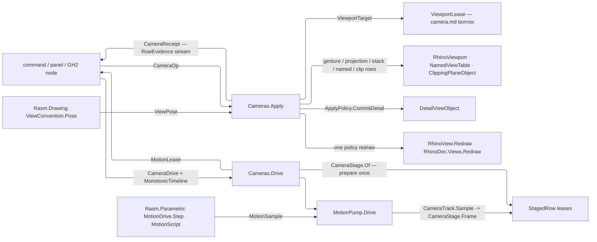

# [RASM_RHINO_CAMERA_OPERATIONS]

Camera mutation splits by payload TIMING, not by case. `CameraOp` is the static vocabulary `Cameras.Apply` executes inside one `ViewportLease` borrow, answering one `CameraReceipt` whose every summary column derives from a per-row evidence stream; `CameraDrive` is the paced request `Cameras.Drive` prepares once and hands to `MotionPump`, answering the running `MotionLease` itself. One union carried both and therefore spelled a case its own dispatch refused unconditionally, guarded out before the switch — the split makes that arm a compile fact.

Gesture, projection, stack, framing, named-view, clipping, convention, and pose rows own their own admission and their own host lowering, so `CameraOp`'s factories lift an already-admitted request rather than re-walking it. The sampling algebra is the kernel's whole: `MotionScript`, `MotionSample`, and `MotionDrive.Step` arrive from `Rasm.Parametric`, `CameraTrack` composes `VectorIntent.Pose`, and this page computes no motion value.

## [01]-[INDEX]

- [02]-[GESTURE_ROWS]: `KeyGesture`, `GestureAxis`, `DragGesture`, `ScreenDrag`, `GestureRequest` — the keyboard and mouse vocabularies as delegate-column rows over the host verb families.
- [03]-[PROJECTION_AND_STACK]: `ProjectionChange` with the `DefinedView` and `IsoQuadrant` host-ordinal rows; `StackVerb` and the `StackMove` evidence the host's benign `false` carries.
- [04]-[NAMED_AND_CLIP]: `NamedViewOp` with the `RestorePace`/`RestoreCadence` pair; `ClipLink` and the shared `CommitPosture`; `RestoreScope` over the process-global defined-view facets.
- [05]-[OPERATION_RAIL]: `CameraOp` and `CameraDrive`, `ApplyPolicy` with its `ActiveBinding` row, `CameraStage` the prepared drive, the `CameraReceipt` evidence stream, and the two entries on `Cameras`.

## [02]-[GESTURE_ROWS]

- Owner: `KeyGesture` and `DragGesture` are delegate-column smart-enums over the host gesture families; `GestureAxis` names the `leftRight` Boolean at the public boundary; `ScreenDrag` retains `Point2d` values and mints `System.Drawing.Point` only at the host call; `GestureRequest` closes the two payload arities.
- Entry: `GestureRequest.Keyed`/`Dragged` construct; `GestureRequest.Admit(Op)` owns complete case admission — keyed magnitudes are finite and dragged payloads pass the `ScreenDrag` storage seam before host projection — and `CameraOp.Gesture` lifts that admitted request.
- Law: a gesture is a row carrying a payload, so seven mouse verbs and three keyboard verbs are ten declarations with two delegate columns; a per-verb union case with a second dispatch is the collapsed form and a new host gesture member is one row.
- Law: the `Apply` column answers the RAIL. Each row's delegate funnels the host `bool` through `Op.Confirm` inside the row itself, so a call site cannot receive a raw verdict and forget to funnel it — the discipline the two `Apply` sites previously carried by convention is now the column's type.
- Law: `GestureAxis` is a two-row vocabulary over ONE host parameter three verbs share, so the axis cannot own the write the way `OffsetOrigin` does; the named lowering is the whole point and the `bool` reaches exactly one place, the delegate's own argument list.
- Boundary: gestures are relative host edits with no meaningful inverse value; their receipt evidence is the post-edit `ChangeCounter` delta, not a pose echo.

```csharp signature
// --- [RUNTIME_PRELUDE] ----------------------------------------------------------------------
using Rasm.Domain;
using Rasm.Drawing;
using Rasm.Numerics;
using Rasm.Parametric;
using Rasm.Processing;
using Rasm.Rhino.Document;
using System.Collections.Frozen;
using System.Runtime.InteropServices;
using Thinktecture;

namespace Rasm.Rhino.Viewport;

// --- [TYPES] --------------------------------------------------------------------------------
[SmartEnum<int>]
public sealed partial class KeyGesture {
    public static readonly KeyGesture RotateInPlace = new(key: 0,
        apply: static (vp, leftRight, amount, op) => op.Confirm(success: vp.KeyboardRotate(leftRight: leftRight, angleRadians: amount)));
    public static readonly KeyGesture Dolly = new(key: 1,
        apply: static (vp, leftRight, amount, op) => op.Confirm(success: vp.KeyboardDolly(leftRight: leftRight, amount: amount)));
    public static readonly KeyGesture DollyInOut = new(key: 2,
        apply: static (vp, _, amount, op) => op.Confirm(success: vp.KeyboardDollyInOut(amount: amount)));

    [UseDelegateFromConstructor]
    internal partial Fin<Unit> Apply(RhinoViewport viewport, bool leftRight, double amount, Op key);
}

[SmartEnum<int>]
public sealed partial class GestureAxis {
    public static readonly GestureAxis Horizontal = new(key: 0, leftRight: true);
    public static readonly GestureAxis Vertical = new(key: 1, leftRight: false);

    internal bool LeftRight { get; }
}

[SmartEnum<int>]
public sealed partial class DragGesture {
    public static readonly DragGesture RotateAroundTarget = new(key: 0,
        apply: static (vp, prev, curr, op) => op.Confirm(success: vp.MouseRotateAroundTarget(mousePreviousPoint: prev, mouseCurrentPoint: curr)));
    public static readonly DragGesture RotateCamera = new(key: 1,
        apply: static (vp, prev, curr, op) => op.Confirm(success: vp.MouseRotateCamera(mousePreviousPoint: prev, mouseCurrentPoint: curr)));
    public static readonly DragGesture InOutDolly = new(key: 2,
        apply: static (vp, prev, curr, op) => op.Confirm(success: vp.MouseInOutDolly(mousePreviousPoint: prev, mouseCurrentPoint: curr)));
    public static readonly DragGesture Magnify = new(key: 3,
        apply: static (vp, prev, curr, op) => op.Confirm(success: vp.MouseMagnify(mousePreviousPoint: prev, mouseCurrentPoint: curr)));
    public static readonly DragGesture Tilt = new(key: 4,
        apply: static (vp, prev, curr, op) => op.Confirm(success: vp.MouseTilt(mousePreviousPoint: prev, mouseCurrentPoint: curr)));
    public static readonly DragGesture DollyZoom = new(key: 5,
        apply: static (vp, prev, curr, op) => op.Confirm(success: vp.MouseDollyZoom(mousePreviousPoint: prev, mouseCurrentPoint: curr)));
    public static readonly DragGesture LateralDolly = new(key: 6,
        apply: static (vp, prev, curr, op) => op.Confirm(success: vp.MouseLateralDolly(mousePreviousPoint: prev, mouseCurrentPoint: curr)));

    [UseDelegateFromConstructor]
    internal partial Fin<Unit> Apply(RhinoViewport viewport, System.Drawing.Point previous, System.Drawing.Point current, Op key);
}

// --- [MODELS] -------------------------------------------------------------------------------
[ComplexValueObject]
[ValidationError]
[StructLayout(LayoutKind.Auto)]
public readonly partial struct ScreenDrag : IDisallowDefaultValue {
    public Point2d From { get; }
    public Point2d To { get; }

    [BoundaryAdapter]
    static partial void ValidateFactoryArguments(
        ref ValidationError? validationError,
        ref Point2d from,
        ref Point2d to) =>
        validationError = ValidityClaim.All(
            from.IsValid, to.IsValid,
            from.X != to.X || from.Y != to.Y,
            InRange(from.X), InRange(from.Y), InRange(to.X), InRange(to.Y))
            ? validationError
            : new ValidationError(string.Join(" | ", new object?[] { Op.Of(), nameof(ScreenDrag), "two distinct valid screen points inside the integer window" }));

    public static Fin<ScreenDrag> Of(Point2d from, Point2d to, Op? key = null) =>
        key.OrDefault().AcceptValidated<ScreenDrag>(fault: Validate(from, to, out ScreenDrag admitted), admitted: admitted);

    internal System.Drawing.Point Previous => new((int)From.X, (int)From.Y);
    internal System.Drawing.Point Current => new((int)To.X, (int)To.Y);

    private static bool InRange(double value) => value >= int.MinValue && value <= int.MaxValue;
}

[Union(ConversionFromValue = ConversionOperatorsGeneration.None)]
public abstract partial record GestureRequest {
    private GestureRequest() { }
    public sealed record Keyed(KeyGesture Verb, GestureAxis Axis, double Amount) : GestureRequest;
    public sealed record Dragged(DragGesture Verb, ScreenDrag Drag) : GestureRequest;

    internal Fin<GestureRequest> Admit(Op op) => Switch(
        op,
        keyed: static (key, gesture) => key.Finite(value: gesture.Amount).Map(_ => (GestureRequest)gesture),
        dragged: static (_, gesture) => Fin.Succ((GestureRequest)gesture));

    internal Fin<Unit> Apply(RhinoViewport viewport, Op key) => Switch(
        (Viewport: viewport, Op: key),
        keyed: static (ctx, gesture) => gesture.Verb.Apply(
            viewport: ctx.Viewport, leftRight: gesture.Axis.LeftRight, amount: gesture.Amount, key: ctx.Op),
        dragged: static (ctx, gesture) => gesture.Verb.Apply(
            viewport: ctx.Viewport, previous: gesture.Drag.Previous, current: gesture.Drag.Current, key: ctx.Op));
}
```

- Packages: Thinktecture.Runtime.Extensions (`[SmartEnum]`, `[Union]`, `[ComplexValueObject]`, `[ValidationError]`, `[UseDelegateFromConstructor]`, `IDisallowDefaultValue`); LanguageExt.Core (`Fin`, `guard`); `Rasm/Domain/rails` (`Op.Confirm`, `Op.Finite`, `ValidityClaim`); `Rasm.Rhino/.api/api-rhinocommon-display.md` (`RhinoViewport` keyboard and mouse verb rosters).
- Growth: a new host gesture is one row on its own arity's roster; a new payload arity is one `GestureRequest` case with both folds loudly broken.

## [03]-[PROJECTION_AND_STACK]

- Owner: `ProjectionChange` closes parallel, perspective, two-point, reflected, lens, lock, defined, and isometric changes and owns its own `Admit`; `FrustumForm`, `ProjectionLock`, and `CPlaneProjectionPolicy` carry host Boolean columns as named policy rows; `DefinedView` and `IsoQuadrant` are the Document-owned host projection rosters (`Document/tables.md [03]`) this page composes; `StackVerb` owns the view and construction-plane stack transitions and answers `StackMove`.
- Entry: `ProjectionChange.Of(ViewProjectionIntent, double lens)` is the kernel-intent lowering the convention arm reads — the correspondence lives on the family that is its CODOMAIN, because `Rasm.Drawing` cannot name a Rhino request type; every other case is a direct construction admitted by `Admit`.
- Auto: the composed rosters key on the host ordinal and carry no `None` row, so the two `Enum.IsDefined(value) && value != None` ladders the prior page carried are unrepresentable rather than guarded, and a read-back resolves through `Op.Row<THostEnum, TRow>`.
- Law: the two-point change reuses the live camera up when it is valid and falls to `Vector3d.Zero` (the host's re-derive sentinel) otherwise — the up-vector is bound ONCE per arm, not read twice inside one expression — and BOTH perspective rows carry `Option<double> TargetDistance` lowered to `RhinoMath.UnsetValue` at the call, so absence stays typed until the host edge and no caller loses a distance the perspective sibling accepts.
- Law: `LensAngle` is the full vertical view angle and the host slot holds its HALF, the convention `Viewport/camera` states and the pose seat writes; a 1:1 assignment here doubles the field of view.
- Law: `IsoQuadrant` and `DefinedView` are the Rhino 9 axonometric seam — `SetProjection(projection:, viewName:, updateConstructionPlane:)` — carried as first-class rows so an iso or axon view is a request value, never a command-script fallback.
- Law: the stack verdict is EVIDENCE, not a discard. `PopViewProjection`/`NextViewProjection`/`PreviousViewProjection`/`PopConstructionPlane` return `false` both at the stack boundary AND when the popped projection equals the current one, so the host CONFLATES two causes it never separates; `StackMove` names exactly what the host answers — `Moved`, or `Held` carrying both causes in one case — and the receipt publishes it. A third case derived from the `ChangeCounter` delta fabricates a distinction the host does not make, since a held pop advances no counter under either cause.
- Boundary: every stack arm runs inside `Op.Catch`, so a host throw rides the rail the arm's own `Fin<StackMove>` promises; the stack DEPTH is host state this rail never mirrors.

```csharp signature
// --- [TYPES] --------------------------------------------------------------------------------
[SmartEnum<int>]
public sealed partial class FrustumForm {
    public static readonly FrustumForm Symmetric = new(key: 0, isSymmetric: true);
    public static readonly FrustumForm Asymmetric = new(key: 1, isSymmetric: false);
    internal bool IsSymmetric { get; }
}

[SmartEnum<int>]
public sealed partial class ProjectionLock {
    public static readonly ProjectionLock Locked = new(key: 0, seat: static viewport => Op.Side(() => viewport.LockedProjection = true));
    public static readonly ProjectionLock Unlocked = new(key: 1, seat: static viewport => Op.Side(() => viewport.LockedProjection = false));

    [UseDelegateFromConstructor]
    internal partial Unit Seat(RhinoViewport viewport);
}

[SmartEnum<int>]
public sealed partial class CPlaneProjectionPolicy {
    public static readonly CPlaneProjectionPolicy Preserve = new(key: 0, shouldUpdate: false);
    public static readonly CPlaneProjectionPolicy Update = new(key: 1, shouldUpdate: true);
    internal bool ShouldUpdate { get; }
}

// The host answers `false` at the stack boundary AND when the popped projection equals the current one, so `Held`
// carries both causes in ONE case: a third row would claim a separation no host member publishes.
[Union(ConversionFromValue = ConversionOperatorsGeneration.None)]
public abstract partial record StackMove {
    private StackMove() { }
    public sealed record Moved : StackMove;
    public sealed record Held : StackMove;

    internal static StackMove Of(bool moved) => moved ? new Moved() : new Held();
}

[Union(ConversionFromValue = ConversionOperatorsGeneration.None)]
public abstract partial record ProjectionChange {
    private ProjectionChange() { }
    public sealed record ParallelCase(FrustumForm Frustum) : ProjectionChange;
    public sealed record PerspectiveCase(Option<double> TargetDistance, FrustumForm Frustum, double LensLength) : ProjectionChange;
    public sealed record TwoPointCase(Option<double> TargetDistance, double LensLength) : ProjectionChange;
    public sealed record ReflectedCase : ProjectionChange;
    public sealed record LensCase(LensAngle Angle) : ProjectionChange;
    public sealed record LockCase(ProjectionLock State) : ProjectionChange;
    public sealed record DefinedCase(DefinedView Projection, string ViewName, CPlaneProjectionPolicy CPlane) : ProjectionChange;
    public sealed record IsometricCase(IsoQuadrant Camera, string ViewName, CPlaneProjectionPolicy CPlane) : ProjectionChange;

    // The kernel intent's lowering seats on its CODOMAIN: `Rasm.Drawing` is below this boundary and cannot name a
    // Rhino request, so the correspondence lives with the family it produces rather than in a rail-private helper.
    public static ProjectionChange Of(ViewProjectionIntent intent, double lens) => intent.Switch(
        parallel: static () => (ProjectionChange)new ParallelCase(Frustum: FrustumForm.Symmetric),
        perspective: () => new PerspectiveCase(TargetDistance: Option<double>.None, Frustum: FrustumForm.Symmetric, LensLength: lens),
        twoPoint: () => new TwoPointCase(TargetDistance: Option<double>.None, LensLength: lens),
        parallelReflected: static () => new ReflectedCase());

    internal Fin<ProjectionChange> Admit(Op op) => Switch(
        op,
        parallelCase: static (_, row) => Fin.Succ((ProjectionChange)row),
        perspectiveCase: static (key, row) => Lens(lens: row.LensLength, distance: row.TargetDistance, key: key).Map(_ => (ProjectionChange)row),
        twoPointCase: static (key, row) => Lens(lens: row.LensLength, distance: row.TargetDistance, key: key).Map(_ => (ProjectionChange)row),
        reflectedCase: static (_, row) => Fin.Succ((ProjectionChange)row),
        lensCase: static (key, row) => key.AcceptValidated<LensAngle>(candidate: (double)row.Angle).Map(_ => (ProjectionChange)row),
        lockCase: static (_, row) => Fin.Succ((ProjectionChange)row),
        definedCase: static (key, row) => key.AcceptText(value: row.ViewName).Map(_ => (ProjectionChange)row),
        isometricCase: static (key, row) => key.AcceptText(value: row.ViewName).Map(_ => (ProjectionChange)row));

    private static Fin<Unit> Lens(double lens, Option<double> distance, Op key) =>
        from _lens in key.Positive(value: lens)
        from _distance in distance.Traverse(value => key.Positive(value: value)).As()
        select unit;

    internal Fin<Unit> Apply(RhinoViewport viewport, Op key) =>
        Switch(
            (Viewport: viewport, Op: key),
            parallelCase: static (ctx, change) => ctx.Op.Confirm(success: ctx.Viewport.ChangeToParallelProjection(symmetricFrustum: change.Frustum.IsSymmetric)),
            perspectiveCase: static (ctx, change) => ctx.Op.Confirm(success: ctx.Viewport.ChangeToPerspectiveProjection(
                targetDistance: change.TargetDistance.IfNone(RhinoMath.UnsetValue),
                symmetricFrustum: change.Frustum.IsSymmetric,
                lensLength: change.LensLength)),
            twoPointCase: static (ctx, change) => ctx.Viewport.CameraUp is var up && up.IsValid && !up.IsTiny()
                ? ctx.Op.Confirm(success: ctx.Viewport.ChangeToTwoPointPerspectiveProjection(
                    lensLength: change.LensLength, up: up, targetDistance: change.TargetDistance.IfNone(RhinoMath.UnsetValue)))
                : ctx.Op.Confirm(success: ctx.Viewport.ChangeToTwoPointPerspectiveProjection(
                    lensLength: change.LensLength, up: Vector3d.Zero, targetDistance: change.TargetDistance.IfNone(RhinoMath.UnsetValue))),
            reflectedCase: static (ctx, _) => ctx.Op.Confirm(success: ctx.Viewport.ChangeToParallelReflectedProjection()),
            // The host slot holds the HALF of the full vertical angle this value states.
            lensCase: static (ctx, change) => ctx.Op.Catch(() => {
                ctx.Viewport.CameraAngle = (double)change.Angle / 2.0;
                return Fin.Succ(value: unit);
            }),
            lockCase: static (ctx, change) => ctx.Op.Catch(() => Fin.Succ(value: change.State.Seat(viewport: ctx.Viewport))),
            definedCase: static (ctx, change) => ctx.Op.Confirm(
                success: ctx.Viewport.SetProjection(projection: change.Projection.Native, viewName: change.ViewName, updateConstructionPlane: change.CPlane.ShouldUpdate)),
            isometricCase: static (ctx, change) => ctx.Op.Confirm(
                success: ctx.Viewport.SetProjection(projection: change.Camera.Native, viewName: change.ViewName, updateConstructionPlane: change.CPlane.ShouldUpdate)));
}

[Union(ConversionFromValue = ConversionOperatorsGeneration.None)]
public abstract partial record StackVerb {
    private StackVerb() { }
    public sealed record ViewPush : StackVerb;
    public sealed record ViewPop : StackVerb;
    public sealed record ViewNext : StackVerb;
    public sealed record ViewPrevious : StackVerb;
    public sealed record CPlanePush(Plane Plane) : StackVerb;
    public sealed record CPlanePop : StackVerb;
    public sealed record SetCPlane(Plane Plane) : StackVerb;

    internal Fin<StackVerb> Admit(Op op) => Switch(
        op,
        viewPush: static (_, row) => Fin.Succ((StackVerb)row),
        viewPop: static (_, row) => Fin.Succ((StackVerb)row),
        viewNext: static (_, row) => Fin.Succ((StackVerb)row),
        viewPrevious: static (_, row) => Fin.Succ((StackVerb)row),
        cPlanePush: static (key, row) => guard(row.Plane.IsValid, key.InvalidInput()).ToFin().Map(_ => (StackVerb)row),
        cPlanePop: static (_, row) => Fin.Succ((StackVerb)row),
        setCPlane: static (key, row) => guard(row.Plane.IsValid, key.InvalidInput()).ToFin().Map(_ => (StackVerb)row));

    internal Fin<StackMove> Apply(RhinoViewport viewport, Op key) =>
        Switch(
            (Viewport: viewport, Op: key),
            viewPush: static (ctx, _) => ctx.Op.Catch(() => {
                ctx.Viewport.PushViewProjection();
                return Fin.Succ<StackMove>(new StackMove.Moved());
            }),
            viewPop: static (ctx, _) => ctx.Op.Catch(() => Fin.Succ(StackMove.Of(moved: ctx.Viewport.PopViewProjection()))),
            viewNext: static (ctx, _) => ctx.Op.Catch(() => Fin.Succ(StackMove.Of(moved: ctx.Viewport.NextViewProjection()))),
            viewPrevious: static (ctx, _) => ctx.Op.Catch(() => Fin.Succ(StackMove.Of(moved: ctx.Viewport.PreviousViewProjection()))),
            cPlanePush: static (ctx, verb) => ctx.Op.Catch(() => {
                ctx.Viewport.PushConstructionPlane(cplane: new DocObjects.ConstructionPlane { Plane = verb.Plane });
                return Fin.Succ<StackMove>(new StackMove.Moved());
            }),
            cPlanePop: static (ctx, _) => ctx.Op.Catch(() => Fin.Succ(StackMove.Of(moved: ctx.Viewport.PopConstructionPlane()))),
            setCPlane: static (ctx, verb) => ctx.Op.Catch(() => {
                ctx.Viewport.SetConstructionPlane(cplane: new DocObjects.ConstructionPlane { Plane = verb.Plane });
                return Fin.Succ<StackMove>(new StackMove.Moved());
            }));
}
```

- Packages: Thinktecture.Runtime.Extensions; LanguageExt.Core (`Option`, `Traverse`, `guard`); `Rasm/Drawing` (`ViewProjectionIntent`); `Rasm.Rhino/Document/tables` (`DefinedView`, `IsoQuadrant`); `Rasm.Rhino/Viewport/camera` (`LensAngle`); `Rasm.Rhino/.api/api-rhinocommon-display.md` (`RhinoViewport` projection and stack members, `DefinedViewportProjection`, `IsometricCamera`).
- Growth: a new projection modality is one `ProjectionChange` case with `Admit` and `Apply` loudly broken; a new host projection preset is one `DefinedView` row.

## [04]-[NAMED_AND_CLIP]

- Owner: `NamedViewOp` owns restore, add, rename, and delete with name-to-index resolution running once through `NamedViewTable.FindByName`; `RestorePace` carries the four pacing postures as three cases, with `RestoreCadence` closing the two animated magnitudes and the delay declared beside them; `ClipLink` owns clipping participation; `CommitPosture` is the ONE commit-now-or-batch vocabulary both clipping and detail commits read; `RestoreScope` owns the frozen defined-view facet set and its restoring bracket.
- Entry: admission belongs to the family — `NamedViewOp` and `RestorePace` answer `Admit(Op)` the way `GestureRequest` does, `ClipLink` admits at its own `Attach`/`Detach` factories where the plane address enters, and `CameraOp`'s factories lift an already-admitted request instead of carrying four inner `Switch` ladders of their own.
- Auto: `RestoreDelay` declares ONCE on the animated case beside its cadence, because both host members take the same millisecond argument and the cadence is the only thing that differs; `RestorePace.ConstantSpeed` and `ConstantTime` survive as factories, so no call site learns the collapse.
- Law: an animated restore's magnitude is cadence-typed — units-per-frame on the speed row, the total frame count on the time row — and both lower to the host's `(index, viewport, amount, msDelay)` shape inside the cadence's own column, so a caller cannot cross the units.
- Law: `CommitPosture` is one concept, not two vocabularies. `ClipCommit` and `DetailCommit` both answered "commit this host edit now or batch it and let the terminal redraw settle it" with nothing in either value distinguishing them, and the Viewport `DetailCommit` also shadowed `Exchange/sheets`'s own `DetailCommit` inside one assembly where bare host-name resolution is the law. NAMED LOSS: the two names; witness — `ClipLink.Attach(planeId, CommitPosture.Deferred)` and `ApplyPolicy.Default` read the same row.
- Law: clip attach and detach with a deferred posture batch inside one operation application and the rail's terminal redraw is the visibility edge; a per-plane commit-and-redraw loop is the collapsed form.
- Law: `RestoreScope.Within` captures every prior facet, applies the scoped set, runs the body, and settles the prior-row release through `Custody.Settled`, preserving both primary and restore errors on the rail.
- Boundary: `RestoreScope` touches process-global host settings only inside `Cameras.Apply`, whose session demand serializes the capture, body, and restore on the command thread.

```csharp signature
// --- [TYPES] --------------------------------------------------------------------------------
[SmartEnum<int>]
public sealed partial class CommitPosture {
    public static readonly CommitPosture Deferred = new(key: 0, commits: false);
    public static readonly CommitPosture Immediate = new(key: 1, commits: true);
    internal bool Commits { get; }
}

[ValueObject<double>]
[ValidationError]
public readonly partial struct RestoreSpeed {
    [BoundaryAdapter]
    static partial void ValidateFactoryArguments(ref ValidationError? validationError, ref double value) =>
        validationError = ValidityClaim.All(ValidityClaim.Finite(value), value > 0.0)
            ? validationError
            : new ValidationError(string.Join(" | ", new object?[] { Op.Of(), nameof(RestoreSpeed), value, "a finite positive units-per-frame rate" }));
}

[ValueObject<int>]
[ValidationError]
public readonly partial struct RestoreFrames {
    [BoundaryAdapter]
    static partial void ValidateFactoryArguments(ref ValidationError? validationError, ref int value) =>
        validationError = value > 0
            ? validationError
            : new ValidationError(string.Join(" | ", new object?[] { Op.Of(), nameof(RestoreFrames), value, "a positive frame count" }));
}

[ValueObject<int>]
[ValidationError]
public readonly partial struct RestoreDelay {
    [BoundaryAdapter]
    static partial void ValidateFactoryArguments(ref ValidationError? validationError, ref int value) =>
        validationError = value >= 0
            ? validationError
            : new ValidationError(string.Join(" | ", new object?[] { Op.Of(), nameof(RestoreDelay), value, "a nonnegative millisecond delay" }));
}

[Union(ConversionFromValue = ConversionOperatorsGeneration.None)]
public abstract partial record RestoreCadence {
    private RestoreCadence() { }
    public sealed record SpeedCase(RestoreSpeed Value) : RestoreCadence;
    public sealed record TimeCase(RestoreFrames Value) : RestoreCadence;

    internal Fin<Unit> Apply(DocObjects.Tables.NamedViewTable views, int index, RhinoViewport viewport, RestoreDelay delay, Op key) => Switch(
        (Views: views, Index: index, Viewport: viewport, Delay: delay, Op: key),
        speedCase: static (ctx, cadence) => ctx.Op.Confirm(success: ctx.Views.RestoreAnimatedConstantSpeed(
            ctx.Index, ctx.Viewport, (double)cadence.Value, (int)ctx.Delay)),
        timeCase: static (ctx, cadence) => ctx.Op.Confirm(success: ctx.Views.RestoreAnimatedConstantTime(
            ctx.Index, ctx.Viewport, (int)cadence.Value, (int)ctx.Delay)));
}

[Union(ConversionFromValue = ConversionOperatorsGeneration.None)]
public abstract partial record RestorePace {
    private RestorePace() { }
    public sealed record InstantCase : RestorePace;
    public sealed record MatchAspectCase : RestorePace;
    public sealed record AnimatedCase(RestoreCadence Cadence, RestoreDelay Delay) : RestorePace;

    public static RestorePace Instant { get; } = new InstantCase();
    public static RestorePace MatchAspect { get; } = new MatchAspectCase();

    public static Fin<RestorePace> ConstantSpeed(double unitsPerFrame, int delayMilliseconds, Op? key = null) {
        Op op = key.OrDefault();
        return from speed in op.AcceptValidated<RestoreSpeed>(candidate: unitsPerFrame)
               from delay in op.AcceptValidated<RestoreDelay>(candidate: delayMilliseconds)
               select (RestorePace)new AnimatedCase(Cadence: new RestoreCadence.SpeedCase(Value: speed), Delay: delay);
    }

    public static Fin<RestorePace> ConstantTime(int frames, int delayMilliseconds, Op? key = null) {
        Op op = key.OrDefault();
        return from count in op.AcceptValidated<RestoreFrames>(candidate: frames)
               from delay in op.AcceptValidated<RestoreDelay>(candidate: delayMilliseconds)
               select (RestorePace)new AnimatedCase(Cadence: new RestoreCadence.TimeCase(Value: count), Delay: delay);
    }

    internal Fin<Unit> Apply(DocObjects.Tables.NamedViewTable views, int index, RhinoViewport viewport, Op key) => Switch(
        (Views: views, Index: index, Viewport: viewport, Op: key),
        instantCase: static (ctx, _) => ctx.Op.Confirm(success: ctx.Views.Restore(index: ctx.Index, viewport: ctx.Viewport)),
        matchAspectCase: static (ctx, _) => ctx.Op.Confirm(success: ctx.Views.RestoreWithAspectRatio(index: ctx.Index, viewport: ctx.Viewport)),
        animatedCase: static (ctx, pace) => pace.Cadence.Apply(
            views: ctx.Views, index: ctx.Index, viewport: ctx.Viewport, delay: pace.Delay, key: ctx.Op));
}

[Union(ConversionFromValue = ConversionOperatorsGeneration.None)]
public abstract partial record NamedViewOp {
    private NamedViewOp() { }
    public sealed record RestoreCase(ResourceName Name, RestorePace Pace) : NamedViewOp;
    public sealed record AddCase(ResourceName Name) : NamedViewOp;
    public sealed record RenameCase(ResourceName Name, ResourceName NewName) : NamedViewOp;
    public sealed record DeleteCase(ResourceName Name) : NamedViewOp;

    internal Fin<NamedViewOp> Admit(Op op) => Switch(
        op,
        restoreCase: static (key, row) => key.Need(value: row.Pace).Map(_ => (NamedViewOp)row),
        addCase: static (_, row) => Fin.Succ((NamedViewOp)row),
        renameCase: static (_, row) => Fin.Succ((NamedViewOp)row),
        deleteCase: static (_, row) => Fin.Succ((NamedViewOp)row));

    internal Fin<Unit> Apply(RhinoDoc document, RhinoViewport viewport, Op key) =>
        Switch(
            (Document: document, Viewport: viewport, Op: key),
            restoreCase: static (ctx, op) =>
                from index in IndexOf(document: ctx.Document, name: op.Name, key: ctx.Op)
                from _ in op.Pace.Apply(views: ctx.Document.NamedViews, index: index.Value, viewport: ctx.Viewport, key: ctx.Op)
                select unit,
            addCase: static (ctx, op) => ResourceIndex
                .Admit(value: ctx.Document.NamedViews.Add(name: op.Name.Value, viewportId: ctx.Viewport.Id), key: ctx.Op)
                .Map(static _ => unit),
            renameCase: static (ctx, op) =>
                from index in IndexOf(document: ctx.Document, name: op.Name, key: ctx.Op)
                from _ in ctx.Op.Confirm(success: ctx.Document.NamedViews.Rename(index: index.Value, newName: op.NewName.Value))
                select unit,
            deleteCase: static (ctx, op) =>
                from index in IndexOf(document: ctx.Document, name: op.Name, key: ctx.Op)
                from _ in ctx.Op.Confirm(success: ctx.Document.NamedViews.Delete(index: index.Value))
                select unit);

    private static Fin<ResourceIndex> IndexOf(RhinoDoc document, ResourceName name, Op key) =>
        ResourceIndex.Admit(value: document.NamedViews.FindByName(name: name.Value), key: key);
}

[Union(ConversionFromValue = ConversionOperatorsGeneration.None)]
public abstract partial record ClipLink {
    private ClipLink() { }
    public sealed record AttachCase(ResourceId PlaneId, CommitPosture Commit) : ClipLink;
    public sealed record DetachCase(ResourceId PlaneId, CommitPosture Commit) : ClipLink;
    public sealed record CensusCase : ClipLink;

    public static Fin<ClipLink> Attach(Guid planeId, CommitPosture commit, Op? key = null) {
        Op op = key.OrDefault();
        return from id in ResourceId.Admit(value: planeId, key: op)
               from posture in op.Need(value: commit)
               select (ClipLink)new AttachCase(PlaneId: id, Commit: posture);
    }

    public static Fin<ClipLink> Detach(Guid planeId, CommitPosture commit, Op? key = null) {
        Op op = key.OrDefault();
        return from id in ResourceId.Admit(value: planeId, key: op)
               from posture in op.Need(value: commit)
               select (ClipLink)new DetachCase(PlaneId: id, Commit: posture);
    }

    public static ClipLink Census { get; } = new CensusCase();

    internal Fin<Seq<ResourceId>> Apply(RhinoDoc document, RhinoViewport viewport, Op key) =>
        Switch(
            (Document: document, Viewport: viewport, Op: key),
            attachCase: static (ctx, link) =>
                from plane in PlaneOf(document: ctx.Document, id: link.PlaneId, key: ctx.Op)
                from _ in ctx.Op.Confirm(success: plane.AddClipViewport(viewport: ctx.Viewport, commit: link.Commit.Commits))
                select Seq(link.PlaneId),
            detachCase: static (ctx, link) =>
                from plane in PlaneOf(document: ctx.Document, id: link.PlaneId, key: ctx.Op)
                from _ in ctx.Op.Confirm(success: plane.RemoveClipViewport(viewport: ctx.Viewport, commit: link.Commit.Commits))
                select Seq(link.PlaneId),
            censusCase: static (ctx, _) => ctx.Op.Catch(() => Fin.Succ(
                toSeq(ctx.Document.Objects.FindClippingPlanesForViewport(viewport: ctx.Viewport))
                    .Choose(static plane => ResourceId.Maybe(plane.Id)).Strict())));

    private static Fin<DocObjects.ClippingPlaneObject> PlaneOf(RhinoDoc document, ResourceId id, Op key) =>
        Optional(document.Objects.FindId(objectId: id.Value) as DocObjects.ClippingPlaneObject).ToFin(Fail: key.InvalidInput());
}

// --- [MODELS] -------------------------------------------------------------------------------
// Facet rows own the process-global slot they gate, so `Within` needs no edit per facet and a new defined-view
// facet is one row.
[SmartEnum<int>]
public sealed partial class RestoreFacet {
    public static readonly RestoreFacet CPlane = new(
        key: 0,
        read: static () => ApplicationSettings.ViewSettings.DefinedViewSetCPlane,
        write: static on => Op.Side(() => ApplicationSettings.ViewSettings.DefinedViewSetCPlane = on));
    public static readonly RestoreFacet Projection = new(
        key: 1,
        read: static () => ApplicationSettings.ViewSettings.DefinedViewSetProjection,
        write: static on => Op.Side(() => ApplicationSettings.ViewSettings.DefinedViewSetProjection = on));
    public static readonly RestoreFacet Clipping = new(
        key: 2,
        read: static () => ApplicationSettings.ViewSettings.DefinedViewSetClippingPlanes,
        write: static on => Op.Side(() => ApplicationSettings.ViewSettings.DefinedViewSetClippingPlanes = on));
    public static readonly RestoreFacet Display = new(
        key: 3,
        read: static () => ApplicationSettings.ViewSettings.DefinedViewSetDisplayMode,
        write: static on => Op.Side(() => ApplicationSettings.ViewSettings.DefinedViewSetDisplayMode = on));

    [UseDelegateFromConstructor]
    internal partial bool Read();

    [UseDelegateFromConstructor]
    internal partial Unit Write(bool on);
}

[ComplexValueObject]
public sealed partial class RestoreScope {
    public static RestoreScope Default { get; } = Create(facets: Seq(
        RestoreFacet.CPlane,
        RestoreFacet.Projection,
        RestoreFacet.Clipping,
        RestoreFacet.Display).ToFrozenSet());

    public FrozenSet<RestoreFacet> Facets { get; }

    internal Fin<TOut> Within<TOut>(Func<Fin<TOut>> body, Op key) {
        RestoreScope self = this;
        return from run in key.Need(value: body)
               from priors in key.Catch(() => Fin.Succ(toSeq(RestoreFacet.Items)
                   .Map(static facet => (Facet: facet, Value: facet.Read())).Strict()))
               from result in Apply(
                       rows: toSeq(RestoreFacet.Items).Map(facet => (Facet: facet, Value: self.Facets.Contains(facet))),
                       key: key)
                   .Bind(_ => key.Catch(run))
                   .Settled(
                       held: priors,
                       release: static row => Fin.Succ(value: row.Facet.Write(on: row.Value)),
                       key: key)
               select result;
    }

    // Every row is attempted and refusals ACCUMULATE, so a wedged facet reports beside the rows written after it.
    internal static Fin<Unit> Apply(Seq<(RestoreFacet Facet, bool Value)> rows, Op key) => rows
        .Traverse(row => key.Catch(() => Fin.Succ(value: row.Facet.Write(on: row.Value))).ToValidation())
        .As()
        .ToFin()
        .Map(static _ => unit);
}
```

- Packages: Thinktecture.Runtime.Extensions; LanguageExt.Core (`Traverse`, `Validation`, `Choose`, `Seq`); `Rasm/Domain/rails` (`Lease<T>`, `Op.Confirm`, `ValidityClaim`); `Rasm.Rhino/Document/tables` (`ResourceId`, `ResourceIndex`, `ResourceName`); `Rasm.Rhino/.api/api-rhinocommon-document-state.md` (`NamedViewTable`); `Rasm.Rhino/.api/api-rhinocommon-appsettings.md` (`ViewSettings.DefinedViewSet*`); `Rasm.Rhino/.api/api-rhinocommon-objects.md` (`ClippingPlaneObject`).
- Growth: a new named-view verb is one `NamedViewOp` case; a new pacing posture is one `RestorePace` case or one `RestoreCadence` row; a new defined-view facet is one `RestoreFacet` row and no fold edit.

## [05]-[OPERATION_RAIL]

- Owner: factory-only `CameraOp` owns every STATIC mutation; `CameraDrive` owns the paced request; `CameraTrack` parameterizes the pose continuum while refusing projection changes, which stay explicit `ProjectionChange` operations; `ApplyPolicy` owns redraw, detail commit, and the `ActiveBinding` row deciding what an address resolved once means later; `CameraStage` owns the prepared drive; `RowEvidence` and `CameraOutcome` are the per-row facts and `CameraReceipt` the stream over them.
- Entry: `Cameras.Apply(session, target, operation, policy?, key?) : Fin<CameraReceipt>` resolves and mutates inside one `ViewportLease` set borrow, commits detail changes, and performs the terminal redraw before native handles leave scope; `Cameras.Drive(session, target, drive, timeline, policy?, key?) : Fin<MotionLease>` prepares the stage once and hands `MotionPump` an apply closure.
- Auto: every `CameraReceipt` summary DERIVES from its row stream — `Applied` is the row count, `Serials` the counter pairs, `ClipCensus` the clipped rows' planes, `Moves` the stacked rows' verdicts — so a stored count beside the rows it counts, and a census column three quarters of the arms fill with an empty sequence, both have no successor.
- Law: the two entries are split by PAYLOAD TIMING, and the split is the point. `Cameras.Apply` answers evidence that exists the moment the borrow returns; `Cameras.Drive` answers a handle whose evidence arrives over frames. The prior union carried both, so its `Execute` dispatch held one arm returning an unconditional failure and `Apply` pre-dispatch-guarded that arm out — an arm that is unconditionally failing is never defensive coverage. NAMED LOSS: `CameraOp` stops being the single vocabulary covering motion, and `CameraReceipt` stops being a union; bought back twice — the unreachable arm is now a type error, and `CameraPose.Write`'s `receipt.Serials.Last` reads the derived column directly where it previously had to match a case first. WITNESS: `Viewport/camera.md` `CameraPose.Write` composes `Cameras.Apply(session:, target:, operation: CameraOp.Pose(pose), key:)` and reads `receipt.Serials.Last` unchanged.
- Law: admission belongs to the family, not to the factory. `ProjectionChange`, `StackVerb`, `NamedViewOp`, and `ClipLink` each answer `Admit(Op)` the way `GestureRequest` always has, so `CameraOp`'s eight factories are each one lift and the four inner `Switch` ladders — twenty-six arms re-walking payloads the case owner already understands — have no successor.
- Law: a paced drive is PREPARED once — `CameraStage.Of` runs the address census, mints one lease per resolved row, and derives the per-frame policy before the first tick, so the tick body carries the pose alone and pays one borrow per row. Replaying the whole entry rail per frame spends admission work on inputs the drive proved at preparation.
- Law: an address resolved BEFORE the write it serves binds explicitly. `ActiveBinding.Pinned` keeps the viewport that was active at preparation and refuses with `InvalidContext` once it stops being active; `Following` re-resolves the live active view per frame. `StagedRow.Of` reads the `(binding, address)` PRODUCT as one pattern, because a computed flag branched twice is the joint discriminant spelled apart.
- Law: the detail commit is ONE member. `ApplyPolicy.CommitDetail(row, key)` carries the posture and the `Op.Confirm` funnel, so the one-shot rail arm and the staged tick body cannot drift on what committing a detail means — the two verbatim copies of that block are gone.
- Law: `CameraTrack.Of` accumulates its five independent admissions through `Validation`, so a caller with a bad source pose AND a mismatched projection learns both; the `from`-chain reported only the first.
- Law: `ConventionCase` carries the kernel `ViewPose` — the `Rasm.Drawing` `ViewConvention.Pose` derivation over a subject bounds and a convention row — and this arm only lowers it through `ProjectionChange.Of`, seats the pose, and frames the subject.
- Law: motion APPLY stays host-side and the kernel owns the algebra: `MotionDrive.Step` is the tick body at `Viewport/motion`, `MotionPump.Drive` takes the session's ONE injected `MonotonicTimeline`, and a driven spring (`FieldIntegrator`) is REFUSED — the kernel's fixed stepper is the whole spring arithmetic and no integrator parameter survives on this page.
- Growth: a new static capability is one `CameraOp` case and one `Execute` arm — the generated `Switch` breaks every dispatch site; a new gesture, pace, projection, or clip modality is one row on its section owner with zero rail change.
- Boundary: every host mutation rides the lease's marshalled borrow, so a background caller pays one crossing per `Apply` while a paced frame pays none — every `FrameClock` row ticks on the UI loop already. No native handle leaves the rail.

```csharp signature
// --- [TYPES] --------------------------------------------------------------------------------
[SmartEnum<int>]
public sealed partial class RedrawWhat {
    public static readonly RedrawWhat None = new(
        key: 0,
        perRow: static _ => unit,
        terminal: static (_, _) => unit,
        landing: static _ => new RedrawTarget.NoneCase());
    public static readonly RedrawWhat Views = new(
        key: 1,
        perRow: static view => Op.Side(view.Redraw),
        terminal: static (document, count) => count >= ViewportBorrowMode.BroadcastFloor ? Op.Side(document.Views.Redraw) : unit,
        landing: static target => new RedrawTarget.ViewCase(Target: target));
    public static readonly RedrawWhat Document = new(
        key: 2,
        perRow: static _ => unit,
        terminal: static (document, _) => Op.Side(document.Views.Redraw),
        landing: static _ => new RedrawTarget.DocumentCase());

    [UseDelegateFromConstructor]
    internal partial Unit PerRow(RhinoView view);

    [UseDelegateFromConstructor]
    internal partial Unit Terminal(RhinoDoc document, int count);

    [UseDelegateFromConstructor]
    internal partial RedrawTarget Landing(ViewportTarget target);
}

// An address resolved once and written many times opens a window in which the active view moves under it: `Pinned`
// keeps the viewport that was active and refuses the migration, `Following` re-resolves it as declared intent.
[SmartEnum<int>]
public sealed partial class ActiveBinding {
    public static readonly ActiveBinding Pinned = new(key: 0, follows: false);
    public static readonly ActiveBinding Following = new(key: 1, follows: true);

    internal bool Follows { get; }
}

// What one borrowed row answered beyond its counter pair. Every receipt column reads this stream, so a summary
// that no arm fills is an empty projection rather than a declared column nothing writes.
[Union(ConversionFromValue = ConversionOperatorsGeneration.None)]
public abstract partial record CameraOutcome {
    private CameraOutcome() { }
    public sealed record AppliedCase : CameraOutcome;
    public sealed record StackedCase(StackMove Move) : CameraOutcome;
    public sealed record ClippedCase(Seq<ResourceId> Planes) : CameraOutcome;
}

[ValueObject<double>]
[ValidationError]
public readonly partial struct FramePadding {
    // Framing padding is a declared convention, not a derivation: the host publishes no framing margin, so
    // breathing room around a zoomed subject — a fraction of the subject's own diagonal — states once here.
    public static FramePadding Default { get; } = Create(value: 0.05);

    [BoundaryAdapter]
    static partial void ValidateFactoryArguments(ref ValidationError? validationError, ref double value) =>
        validationError = ValidityClaim.All(ValidityClaim.Finite(value), value >= 0.0, value <= 1.0)
            ? validationError
            : new ValidationError(string.Join(" | ", new object?[] { Op.Of(), nameof(FramePadding), value, "a finite fraction in [0, 1]" }));

    internal BoundingBox Inflate(BoundingBox subject) {
        BoundingBox padded = subject;
        padded.Inflate(amount: subject.Diagonal.Length * Value);
        return padded;
    }
}

// --- [MODELS] -------------------------------------------------------------------------------
public sealed record CameraTrack(CameraPose From, CameraPose To, Context Context, MotionInterpolation Interpolation) {
    public static Fin<CameraTrack> Of(
        CameraPose from,
        CameraPose to,
        Context context,
        Option<MotionInterpolation> interpolation = default,
        Op? key = null) {
        Op op = key.OrDefault();
        return (CameraPose.Admit(pose: from, key: op).ToValidation(),
                CameraPose.Admit(pose: to, key: op).ToValidation(),
                guard(from.Projection == to.Projection, op.InvalidInput(axis: nameof(CameraPose.Projection))).ToFin().ToValidation(),
                Optional(context).ToFin(Fail: op.MissingContext()).ToValidation(),
                op.Need(value: interpolation.IfNone(MotionInterpolation.Slerp)).ToValidation())
            .Apply(static (source, destination, _, ambient, mode) =>
                new CameraTrack(From: source, To: destination, Context: ambient, Interpolation: mode))
            .As()
            .ToFin();
    }

    public Fin<CameraPose> Sample(UnitInterval progress, Op? key = null) {
        Op op = key.OrDefault();
        CameraTrack self = this;
        return from intent in VectorIntent.Pose(from: self.From.Frame.Value, to: self.To.Frame.Value, t: progress.Value, mode: self.Interpolation, key: op)
               from plane in intent.Project<Plane>(context: self.Context, key: op)
               from frame in VectorFrame.Of(origin: plane.Origin, normal: plane.ZAxis, xHint: Some(plane.XAxis), context: self.Context, key: op)
               from target in op.AcceptValue(value: self.From.Target + progress.Value * (self.To.Target - self.From.Target))
               from angle in op.AcceptValidated<LensAngle>(candidate: double.Lerp((double)self.From.Angle, (double)self.To.Angle, progress.Value))
               select new CameraPose(Frame: frame, Target: target, Angle: angle, Projection: self.From.Projection);
    }
}

[Union(ConversionFromValue = ConversionOperatorsGeneration.None)]
public abstract partial record CameraOp {
    private CameraOp() { }
    internal sealed record GestureCase(GestureRequest Request) : CameraOp;
    internal sealed record ProjectCase(ProjectionChange Change) : CameraOp;
    internal sealed record PoseCase(CameraPose Pose) : CameraOp;
    internal sealed record StackCase(StackVerb Verb) : CameraOp;
    internal sealed record FrameCase(BoundingBox Subject, FramePadding Padding) : CameraOp;
    internal sealed record NamedCase(NamedViewOp Verb, RestoreScope Scope) : CameraOp;
    internal sealed record ClipCase(ClipLink Link) : CameraOp;
    internal sealed record ConventionCase(ViewPose Pose) : CameraOp;

    public static Fin<CameraOp> Gesture(GestureRequest request, Op? key = null) {
        Op op = key.OrDefault();
        return op.Need(value: request).Bind(value => value.Admit(op: op))
            .Map(static valid => (CameraOp)new GestureCase(Request: valid));
    }

    public static Fin<CameraOp> Project(ProjectionChange change, Op? key = null) {
        Op op = key.OrDefault();
        return op.Need(value: change).Bind(value => value.Admit(op: op))
            .Map(static valid => (CameraOp)new ProjectCase(Change: valid));
    }

    public static Fin<CameraOp> Pose(CameraPose pose, Op? key = null) =>
        CameraPose.Admit(pose: pose, key: key.OrDefault())
            .Map(static admitted => (CameraOp)new PoseCase(Pose: admitted));

    public static Fin<CameraOp> Stack(StackVerb verb, Op? key = null) {
        Op op = key.OrDefault();
        return op.Need(value: verb).Bind(value => value.Admit(op: op))
            .Map(static valid => (CameraOp)new StackCase(Verb: valid));
    }

    public static Fin<CameraOp> Frame(BoundingBox subject, Option<FramePadding> padding = default, Op? key = null) {
        Op op = key.OrDefault();
        return guard(subject.IsValid, op.InvalidInput()).ToFin()
            .Map(_ => (CameraOp)new FrameCase(Subject: subject, Padding: padding.IfNone(FramePadding.Default)));
    }

    public static Fin<CameraOp> Named(NamedViewOp verb, Option<RestoreScope> scope = default, Op? key = null) {
        Op op = key.OrDefault();
        return op.Need(value: verb).Bind(value => value.Admit(op: op))
            .Map(valid => (CameraOp)new NamedCase(Verb: valid, Scope: scope.IfNone(RestoreScope.Default)));
    }

    public static Fin<CameraOp> Clip(ClipLink link, Op? key = null) =>
        key.OrDefault().Need(value: link).Map(static valid => (CameraOp)new ClipCase(Link: valid));

    public static Fin<CameraOp> Convention(ViewPose pose, Op? key = null) =>
        key.OrDefault().AcceptValue(value: pose).Map(static valid => (CameraOp)new ConventionCase(Pose: valid));
}

// The paced request: a track to sample, the kernel script that paces it, and the clock row the drive attaches to.
// The timeline is NOT a column — it is the session's one injected `MonotonicTimeline` and arrives at the entry.
public sealed record CameraDrive(CameraTrack Track, MotionScript Script, Option<FrameClock> Clock) {
    public static Fin<CameraDrive> Of(CameraTrack track, MotionScript script, Option<FrameClock> clock = default, Op? key = null) {
        Op op = key.OrDefault();
        return from path in op.Need(value: track)
               from admitted in MotionDrive.Admit(script: script, key: op)
               select new CameraDrive(Track: path, Script: admitted, Clock: clock);
    }
}

[ComplexValueObject]
public sealed partial class ApplyPolicy {
    public static ApplyPolicy Default { get; } = Create(redraw: RedrawWhat.Views, details: CommitPosture.Immediate, active: ActiveBinding.Pinned);
    public static ApplyPolicy Silent { get; } = Create(redraw: RedrawWhat.None, details: CommitPosture.Immediate, active: ActiveBinding.Pinned);

    public RedrawWhat Redraw { get; }
    public CommitPosture Details { get; }
    public ActiveBinding Active { get; }

    internal ApplyPolicy PerFrame() => Create(redraw: RedrawWhat.None, details: Details, active: Active);

    // Commit evidence rides `Op.Confirm` like every other host `bool` on this page: discarding it lets a refused
    // detail commit return a receipt reporting the operation applied.
    internal Fin<Unit> CommitDetail(ViewportRef row, Op key) => row.Detail.Match(
        Some: detail => Details.Commits
            ? key.Catch(() => key.Confirm(success: detail.CommitViewportChanges()))
            : Fin.Succ(value: unit),
        None: static () => Fin.Succ(value: unit));
}

public readonly record struct RowEvidence(uint Before, uint After, CameraOutcome Outcome);

public sealed record CameraReceipt(CameraOp Operation, Seq<RowEvidence> Rows, RedrawWhat Redrew) : IDetachedDocumentResult {
    public int Applied => Rows.Count;
    public Seq<(uint Before, uint After)> Serials => Rows.Map(static row => (row.Before, row.After));
    public Seq<ResourceId> ClipCensus => Rows.Bind(static row =>
        row.Outcome is CameraOutcome.ClippedCase clipped ? clipped.Planes : Seq<ResourceId>());
    public Seq<StackMove> Moves => Rows.Choose(static row =>
        row.Outcome is CameraOutcome.StackedCase stacked ? Some(stacked.Move) : Option<StackMove>.None);
}

// --- [SERVICES] -----------------------------------------------------------------------------
// A drive prepares once and ticks thousands of times, so the address census, the lease admission, and the
// per-frame policy resolve HERE and a frame writes the sampled pose alone. Native rows still never outlive their
// borrow: a stage pins the durable id address of each resolved row and re-resolves it inside the frame's borrow.
internal sealed class CameraStage {
    private readonly Seq<StagedRow> rows;
    private readonly ApplyPolicy frame;

    private CameraStage(Seq<StagedRow> rows, ApplyPolicy frame) => (this.rows, this.frame) = (rows, frame);

    internal static Fin<CameraStage> Of(DocumentSession session, ViewportTarget target, ApplyPolicy plan, Op key) =>
        from owner in ViewportLease.Of(session: session, target: target, key: key)
        from census in owner.Use(
            borrow: (_, row) => key.Catch(() => Fin.Succ(value: row.Viewport.Id)),
            terminal: static (_, _) => Fin.Succ(value: unit),
            mode: ViewportBorrowMode.Observe,
            key: key)
        from staged in census
            .Traverse(id => StagedRow.Of(session: session, address: target, viewportId: id, binding: plan.Active, key: key).ToValidation())
            .As()
            .ToFin()
        select new CameraStage(rows: staged.Strict(), frame: plan.PerFrame());

    // Every row seats and the refusals combine: one migrated view never hides another row's host fault.
    internal Fin<Unit> Frame(CameraPose pose, Op key) =>
        rows.Traverse(row => row.Seat(pose: pose, plan: frame, key: key).ToValidation()).As().ToFin().Map(static _ => unit);

    // The guarded seat is ONE member — the projection probe carries the live classification on refusal, then the
    // pose writes — composed by both the one-shot rail arm and the tick body, so the two paths cannot drift.
    internal static Fin<Unit> Seat(CameraPose pose, RhinoViewport viewport, Op key) =>
        from _projection in CameraSeat.Accepts(projection: pose.Projection, viewport: viewport, key: key)
        from _seated in key.Catch(() => Fin.Succ(value: CameraSeat.Seat(viewport: viewport, pose: pose)))
        select unit;
}

internal readonly record struct StagedRow(ViewportLease Lease, Option<Guid> PinnedActive) {
    // The `(binding, address)` PRODUCT is one pattern: computing a flag and branching on it twice spells the joint
    // discriminant apart, and the pinned column and the resolved address are decided by the same corner.
    internal static Fin<StagedRow> Of(DocumentSession session, ViewportTarget address, Guid viewportId, ActiveBinding binding, Op key) =>
        (binding.Follows, address) switch {
            (true, ViewportTarget.ActiveCase) => ViewportLease.Of(session: session, target: address, key: key)
                .Map(static lease => new StagedRow(Lease: lease, PinnedActive: None)),
            (false, ViewportTarget.ActiveCase) => ViewportTarget.Id(viewportId: viewportId, key: key)
                .Bind(pinned => ViewportLease.Of(session: session, target: pinned, key: key))
                .Map(lease => new StagedRow(Lease: lease, PinnedActive: Some(viewportId))),
            _ => ViewportTarget.Id(viewportId: viewportId, key: key)
                .Bind(pinned => ViewportLease.Of(session: session, target: pinned, key: key))
                .Map(static lease => new StagedRow(Lease: lease, PinnedActive: None)),
        };

    internal Fin<Unit> Seat(CameraPose pose, ApplyPolicy plan, Op key) =>
        Lease.Use(
            borrow: (document, row) =>
                from _addressed in Addressed(document: document, key: key)
                from _seated in CameraStage.Seat(pose: pose, viewport: row.Viewport, key: key)
                from _committed in plan.CommitDetail(row: row, key: key)
                select unit,
            key: key);

    // A pinned active row proves the viewport it named is STILL active; the migration is a typed context refusal,
    // never a silent hand-off to whatever the user focused mid-drive.
    private Fin<Unit> Addressed(RhinoDoc document, Op key) => PinnedActive.Match(
        Some: id => guard(
            Optional(document.Views.ActiveView).Map(view => view.ActiveViewport.Id == id).IfNone(noneValue: false),
            key.InvalidContext()).ToFin(),
        None: static () => Fin.Succ(value: unit));
}

// --- [OPERATIONS] ---------------------------------------------------------------------------
public static class Cameras {
    public static Fin<CameraReceipt> Apply(
        DocumentSession session,
        ViewportTarget target,
        CameraOp operation,
        Option<ApplyPolicy> policy = default,
        Op? key = null) {
        Op op = key.OrDefault();
        return from owner in Optional(session).ToFin(Fail: op.MissingContext())
               from address in op.Need(value: target)
               from admitted in op.Need(value: operation)
               let plan = policy.IfNone(ApplyPolicy.Default)
               from lease in ViewportLease.Of(session: owner, target: address, key: op)
               from receipt in Execute(lease: lease, operation: admitted, plan: plan, key: op)
               select receipt;
    }

    // The paced entry: the timeline is the session's ONE injected clock and arrives as a required parameter, the
    // stage prepares once, and the running lease IS the answer — there is no receipt case to match on.
    public static Fin<MotionLease> Drive(
        DocumentSession session,
        ViewportTarget target,
        CameraDrive drive,
        MonotonicTimeline timeline,
        Option<ApplyPolicy> policy = default,
        Op? key = null) {
        Op op = key.OrDefault();
        return from owner in Optional(session).ToFin(Fail: op.MissingContext())
               from address in op.Need(value: target)
               from request in op.Need(value: drive)
               let plan = policy.IfNone(ApplyPolicy.Default)
               from stage in CameraStage.Of(session: owner, target: address, plan: plan, key: op)
               from lease in MotionPump.Drive(
                   session: owner,
                   script: request.Script,
                   target: plan.Redraw.Landing(target: address),
                   timeline: timeline,
                   apply: sample => Progressed(sample: sample, key: op)
                       .Bind(progress => request.Track.Sample(progress: progress, key: op))
                       .Bind(pose => stage.Frame(pose: pose, key: op)),
                   clock: request.Clock,
                   key: op)
               select lease;
    }

    private static Fin<CameraReceipt> Execute(ViewportLease lease, CameraOp operation, ApplyPolicy plan, Op key) =>
        from rows in lease.Use(
            borrow: (document, row) =>
                from before in Fin.Succ(row.Viewport.ChangeCounter)
                from outcome in operation.Switch(
                    (Document: document, Row: row, Op: key),
                    gestureCase: static (ctx, op) => op.Request.Apply(viewport: ctx.Row.Viewport, key: ctx.Op)
                        .Map(static _ => (CameraOutcome)new CameraOutcome.AppliedCase()),
                    projectCase: static (ctx, op) => op.Change.Apply(viewport: ctx.Row.Viewport, key: ctx.Op)
                        .Map(static _ => (CameraOutcome)new CameraOutcome.AppliedCase()),
                    poseCase: static (ctx, op) => CameraStage.Seat(pose: op.Pose, viewport: ctx.Row.Viewport, key: ctx.Op)
                        .Map(static _ => (CameraOutcome)new CameraOutcome.AppliedCase()),
                    stackCase: static (ctx, op) => op.Verb.Apply(viewport: ctx.Row.Viewport, key: ctx.Op)
                        .Map(static move => (CameraOutcome)new CameraOutcome.StackedCase(Move: move)),
                    frameCase: static (ctx, op) => ctx.Op
                        .Confirm(success: ctx.Row.Viewport.ZoomBoundingBox(box: op.Padding.Inflate(subject: op.Subject)))
                        .Map(static _ => (CameraOutcome)new CameraOutcome.AppliedCase()),
                    namedCase: static (ctx, op) => op.Scope.Within(
                        body: () => op.Verb.Apply(document: ctx.Document, viewport: ctx.Row.Viewport, key: ctx.Op)
                            .Map(static _ => (CameraOutcome)new CameraOutcome.AppliedCase()),
                        key: ctx.Op),
                    clipCase: static (ctx, op) => op.Link.Apply(document: ctx.Document, viewport: ctx.Row.Viewport, key: ctx.Op)
                        .Map(static planes => (CameraOutcome)new CameraOutcome.ClippedCase(Planes: planes)),
                    conventionCase: static (ctx, op) =>
                        from _lowered in ProjectionChange.Of(intent: op.Pose.Projection, lens: op.Pose.Lens)
                            .Apply(viewport: ctx.Row.Viewport, key: ctx.Op)
                        from _seated in ctx.Op.Catch(() => {
                            _ = CameraSeat.Seat(
                                viewport: ctx.Row.Viewport,
                                target: op.Pose.Target,
                                location: op.Pose.Frame.Value.Origin,
                                direction: op.Pose.Frame.Value.ZAxis);
                            return ctx.Op.Confirm(success: ctx.Row.Viewport.ZoomBoundingBox(box: op.Pose.Subject));
                        })
                        select (CameraOutcome)new CameraOutcome.AppliedCase())
                from _committed in plan.CommitDetail(row: row, key: key)
                from _redrawn in Fin.Succ(value: plan.Redraw.PerRow(view: row.View))
                select new RowEvidence(Before: before, After: row.Viewport.ChangeCounter, Outcome: outcome),
            terminal: (document, count) => Fin.Succ(value: plan.Redraw.Terminal(document: document, count: count)),
            mode: ViewportBorrowMode.Mutate,
            key: key)
        select new CameraReceipt(Operation: operation, Rows: rows, Redrew: plan.Redraw);

    // Producing law preserves every finite easing result, overshoot included, so the bounded consumer projects at
    // its own boundary: a back or elastic curve leaves the unit interval by design and every spring overshoots
    // before it settles. Admitting the raw sample instead fails `UnitInterval`, lands on the tick rail's terminal
    // fold, and ends the drive mid-animation on exactly the curves the overshoot guarantee exists to serve.
    private static Fin<UnitInterval> Progressed(MotionSample sample, Op key) =>
        key.AcceptValidated<UnitInterval>(candidate: double.Clamp(
            sample.Switch(
                eased: static frame => frame.Value,
                sprung: static frame => frame.State.Position,
                glided: static frame => frame.Value),
            0.0,
            1.0));
}
```

- Packages: Thinktecture.Runtime.Extensions; LanguageExt.Core (`Validation`, `.Apply`, `Traverse`, `Choose`, `Option`); `Rasm/Parametric/projections` (`MotionScript`, `MotionSample`, `MotionDrive.Admit`, `MotionInterpolation`, `MonotonicTimeline`); `Rasm/Processing` (`VectorIntent.Pose`); `Rasm/Numerics` (`VectorFrame`, `UnitInterval`); `Rasm/Drawing` (`ViewPose`, `ViewProjectionIntent`); `Rasm.Rhino/Viewport/camera` (`ViewportLease`, `CameraPose`, `CameraSeat`, `ViewportBorrowMode`); `Rasm.Rhino/Viewport/motion` (`MotionPump`, `MotionLease`, `FrameClock`, `RedrawTarget`); `Rasm.Rhino/Document/tables` (`ViewportTarget`, `ViewportRef`, `ResourceId`).


```mermaid
---
config:
  layout: elk
  flowchart:
    curve: linear
    padding: 25
---
flowchart LR
    accTitle: Rhino camera operation rail
    accDescr: Two entries split by payload timing — a static apply that borrows a viewport lease, lands gesture, projection, stack, named, clip, and convention rows on the host viewport, commits detail changes, and returns one row-evidence receipt; and a paced drive that stages the rows once, samples the kernel motion drive, and returns the running motion lease.
    Consumer["command / panel / GH2 node"] -->|CameraOp| Rail["Cameras.Apply"]
    Consumer -->|"CameraDrive + MonotonicTimeline"| Paced["Cameras.Drive"]
    Rail -->|ViewportTarget| Lease["ViewportLease — camera.md borrow"]
    Intent["Rasm.Drawing ViewConvention.Pose"] -->|ViewPose| Rail
    Rail -->|"gesture / projection / stack / named / clip rows"| Viewport["RhinoViewport · NamedViewTable · ClippingPlaneObject"]
    Rail -->|"ApplyPolicy.CommitDetail"| Detail["DetailViewObject"]
    Rail -->|"one policy redraw"| Redraw["RhinoView.Redraw · RhinoDoc.Views.Redraw"]
    Rail -->|"CameraReceipt — RowEvidence stream"| Consumer
    Paced -->|"CameraStage.Of — prepare once"| Staged["StagedRow leases"]
    Kernel["Rasm.Parametric MotionDrive.Step · MotionScript"] -->|MotionSample| Pump["MotionPump.Drive"]
    Paced --> Pump
    Pump -->|"CameraTrack.Sample -> CameraStage.Frame"| Staged
    Paced -->|MotionLease| Consumer
```

## [06]-[RESEARCH]

<!-- source-only: research row template:
[TOKEN]-[OPEN|BLOCKED]: <exact question>; <verification route>.
[SPLIT_MEMBER]-[OPEN]: does `shape-core` expose `split_all`; verify against the member rail.
-->

(none)
