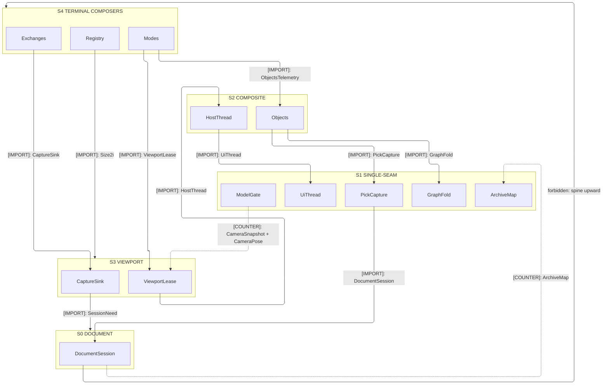
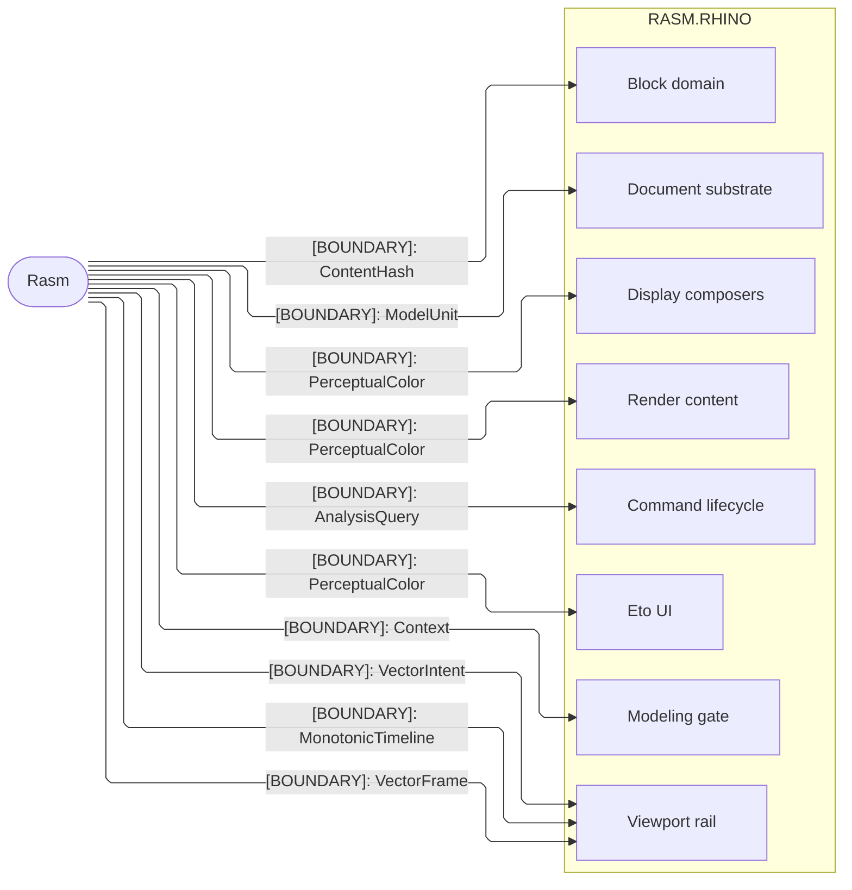
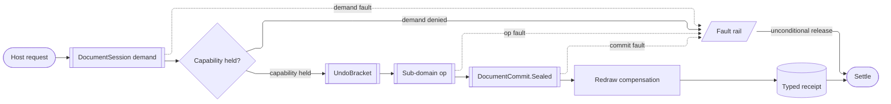

# [RASM_RHINO_ARCHITECTURE]

`Rasm.Rhino` maps the Rhino 9 host boundary over the RhinoCommon surfaces, the native Eto UI sub-domain, and the `Rhino.UI` shell, composing the `Rasm` kernel for every host-neutral computation. Each sub-domain folder maps to exactly one namespace, and project references terminate at the kernel. Host owners compose same-assembly owners at their own or lower stratum. Seam map names only boundary-crossing contracts — each a frozen-name value type consumed down from the kernel — while host-internal wiring stays on the mutation spine.

## [01]-[DOMAIN_MAP]

```text codemap
Rasm.Rhino/             # Rhino host boundary over the Rasm kernel
├── Document/           # Host-document substrate under every host surface
│   ├── Session.cs      # Capability-scoped document-session demand, unit-regime adjustment, worksession custody
│   ├── Geometry.cs     # Native GeometryBase custody crossing and kernel transform
│   ├── Tables.cs       # Table mutation and redraw compensation
│   ├── Layers.cs       # Layer-tree topology, face and override programs, and the layer commit rail
│   └── Events.cs       # Event observation, the transactional DocumentStream, and the hook-point registry
├── Persistence/        # Typed serialization, settings custody, attached data, user text, saved-state presets
│   ├── Dictionary.cs   # ArchiveValue slot-registry carrier and the ArchiveMap detach/mint round trip
│   ├── Settings.cs     # Settings custody scopes, typed value rail, guards, and the change ledger
│   ├── AppSettings.cs  # Application preference families, theme and color slots, and the alias/shortcut/path registries
│   ├── UserData.cs     # ArchiveIo spine, TypedUserData template, roster census, custody transfer
│   ├── UserText.cs     # TextStore rail over document and per-object user strings
│   ├── Presets.cs      # CPlane, named-position, and layer-state preset rail under one mask vocabulary
│   └── Snapshots.cs    # Scripted snapshot ops and the SnapShotsClient participant
├── Objects/            # Live document-object domain over the table rail
│   ├── State.cs        # Live-object window: snapshot, frames, component touch, section custody, document analytics census
│   ├── Attributes.cs   # Typed attribute program feeding the table rail's Amend path
│   ├── Materials.cs    # Object materials, mappings, and mesh caches behind one commit
│   ├── Lights.cs       # Closed world light-kind family: seed, gated edits, and the table commit rail
│   ├── History.cs      # History record/replay triad, linkage topology, and governance
│   └── Authoring.cs    # Custom-object, grip, and render-mesh programs; ObjectsTelemetry egress, host taps, classification, instrument rows
├── Commands/           # Native command lifecycle, input acquisition, and picked-reference projection
│   ├── Command.cs      # Staged command algebra over one immutable model and its host adapter
│   ├── Acquisition.cs  # Parameterized input-acquisition matrix and its receipt
│   ├── Options.cs      # Command-line option vocabulary and leased native carriers
│   └── Selection.cs    # Picked-reference projection onto the selection union and re-entry
├── Blocks/             # Instance-definition domain over the kernel
│   ├── Model.cs        # Definitions.Lens resolution over the Document-owned ResourceRef and whole-state snapshot policy
│   ├── Graph.cs        # Definition-graph topology, queries, and archive closure
│   ├── Lifecycle.cs    # Definition ingress, the preview vault, deferred refresh, and eviction
│   └── Operations.cs   # Block operation and query rail, geometry intake, and receipts
├── Modeling/           # Host-fidelity native construction compute over the custody seam
│   ├── Solids.cs       # Brep boolean/fillet/offset/join rail, the ModelGate + Built spine, and the BenchBand evidence harvest
│   ├── Lofting.cs      # Sweep, loft, patch, and developable construction policies
│   ├── Surfaces.cs     # Freeform surface constructors with fit evidence
│   ├── Curves.cs       # Curve offset, refine, extend, split, and construction host ops
│   ├── Meshing.cs      # Parameter-carried meshing, remesh, booleans, and mesh edits
│   ├── SubD.cs         # SubD creation, crease authoring, and brep conversion
│   ├── Deform.cs       # Space morphs and the unroll/squish/unwrap flatteners
│   └── Projection.cs   # Make2D hidden-line, silhouette, and draft capture over the value frame
├── Annotation/         # Drafting annotation domain over the resource tables
│   ├── Style.cs        # StyleField schema, patch fold, override mint, and the DimStyle rail
│   ├── Text.cs         # Text and leader construction, run edits, field formulas, outlining
│   ├── Dimension.cs    # Six-kind dimension family over one override algebra
│   ├── Hatch.cs        # Hatch construction and the pattern line-definition model
│   ├── Linetype.cs     # Stroke segment/shape/taper model and .lin interchange
│   └── Typeface.cs     # Face resolution and section-cut presentation resources
├── Viewport/           # Camera model, operation rail, capture spec, and motion pacing
│   ├── Camera.cs       # Camera-pose altitudes over the kernel vector frame
│   ├── Operations.cs   # Camera-operation union applied behind the viewport lease
│   ├── Capture.cs      # Capture plan, request cardinality, leased delivery, and run-rail bench timing
│   └── Motion.cs       # Host motion-pacing adapter over kernel timing
├── Display/            # Display-pipeline participation and renderer boundary
│   ├── Conduit.cs      # Conduit-pipeline algebra, display-mode participation, and the cull/draw veto hook mounts
│   ├── Draw.cs         # Two-backend mark union dispatched over the canvas
│   ├── Interaction.cs  # Pointer, gumball, and widget hooks folded onto fact streams
│   ├── Render.cs       # Render-job session, realtime engine participant, and scene change-queue reader
│   └── Modes.cs        # Display-mode appearance profile, mode policy, viewport assignment, and analysis attachment
├── Render/             # RDK content model and document render configuration
│   ├── Content.cs      # Content address, kind axis, change bracket, snapshot, hash, leased ingress
│   ├── Kinds.cs        # Material bridge, texture configuration, and environment bake
│   ├── Fields.cs       # One polymorphic field-value owner, declaration, binding, parameter routes
│   ├── Registry.cs     # Factory vocabulary, content operation rail, receipts, event stream
│   ├── Settings.cs     # Render-settings duality, sub-owner states, sun astronomy, edit rail
│   └── Mapping.cs      # Texture-mapping specs, evaluation, and per-object channel binding
├── Exchange/           # Document interchange and publication surface
│   ├── Formats.cs      # File-codec matrix: detection, filters, and dispatch
│   ├── Options.cs      # Per-format option dial family, shared axes, and host option minting
│   ├── Archive.cs      # Standalone archive programs over one detached File3dm lease
│   ├── Operations.cs   # Exchange-operation rail and headless convert sessions
│   ├── Sheets.cs       # Sheet plans, live selectors, and declarative detail state
│   └── Publish.cs      # Page-target dispatch and atomic content-keyed file landing
├── Eto/                # Native Eto UI framework sub-domain
│   ├── Platform.cs     # Ambient platform binding, native mount, and theme grid
│   ├── Runtime.cs      # Ambient runtime rails: dispatch, pulse, and projection
│   ├── Elements.cs     # Control tree, realize fold, layout algebra, themed editors, and fault band
│   ├── Binding.cs      # State-cell binding attachments and their receipt ledger
│   ├── Canvas.cs       # Drawable mount, paint-program seam, glyph shaping, and pixel leases
│   └── Chrome.cs       # Verb table projected into menus, windows, and dialogs
└── HostUi/             # Rhino.UI shell composed over the Eto sub-domain
    ├── Shell.cs        # Host-thread session marshal, status, prompt, progress, runtime hosting, and notices
    ├── Panels.cs       # Panel fact stream, placement, RUI state fold, and Rhino control rows
    ├── Pages.cs        # Page realization, the signal spine, and kind-safe mounting
    └── Dialogs.cs      # Capability-gated inquiry rail and preview projection
```

## [02]-[STRATA]

Five strata order the sub-domain folders; a folder composes its own owners and lower strata only, `Rasm` kernel namespaces underlie the whole boundary as the host-neutral floor, and two ruled counter-edges stand: Document's configured-open source takes Persistence's `ArchiveMap` as its typed open-options payload, minted before any session exists, and Modeling's projection frame takes Viewport's `CameraSnapshot`/`CameraPose` value shapes — value-only, no lease or borrow crossing. Every other consumption edge points down, so a new folder seats one stratum above its highest composed owner.

- S0 `Document` — spine under everything: the `DocumentSession` demand, `Tables.Commit`, `Layers.Commit`, the transactional `DocumentStream`.
- S0 reach — every sibling composes the spine.
- S1 single-seam — spine-alone composers: `Persistence` (`ArchiveMap`, `Settings`, `AppSettings`), `Commands` (`CommandVerdict`, `PickCapture`).
- S1 single-seam — `Blocks` (`BlockGraph`, `GraphFold`), `Modeling` (`ModelGate`, `Built<TSlot>`), `Annotation` (`StyleField`, `Styles`).
- S1 single-seam — `Eto`: the `Element` realize fold and the `UiThread` floor.
- S1 law — Modeling reaches only the geometry-custody capsule and the ruled `CameraSnapshot`/`CameraPose` frame values.
- S1 law — Eto reaches only the event-detach capsule.
- S2 composite — `Objects` (`Objects`, `Attributes`, `Chronicle`) adds Commands' `PickCapture` and Blocks' `GraphFold`/`GraphProjection` evidence.
- S2 composite — `HostUi` (`HostThread`, `PanelHost`, `HostPage`) adds the whole Eto sub-domain.
- S3 `Viewport` — `ViewportLease`, `CameraPose`, `Cameras`, and `MotionPump`.
- S3 law — every borrow crosses the `HostThread` session rail, `HostThread.Run(HostWork<T>.Session(...))`, under a `SessionNeed`.
- S3 law — the capture run rail takes Modeling's `BenchEvidence`/`BenchBand` value shapes — value-only, no lease or borrow crossing.
- S4 terminal — `Display` (`Modes`, `Marks`) and `Exchange` (`Exchanges`, `Publishing`) compose Viewport's camera and capture rails.
- S4 law — Display draws through the Eto canvas and publishes conduit callback faults through Objects' `ObjectsTelemetry` egress.
- S4 `Render` — (`Registry`, `ContentStream`) borrows only the `Size2i` pixel struct; no folder composes the S4 composers.



## [03]-[SEAMS]



Every kernel contract is a frozen-name value type the host binds and never re-mints — one `[BOUNDARY]` rail per consuming sub-domain, each carrying the exact member set its owner consumes. Kernel source is host-neutral and consumes nothing back, so the strata-locked dependency is source-only by construction; the kernel seam registry mirrors each edge from its producing side.

## [04]-[INTERNAL]

Every host mutation walks one path — no sub-domain opens the document directly. Document-session demand gates capability, the shared `DocumentCommit.Sealed` envelope frames the change over `UndoBracket`, the sub-domain executor runs inside it, and the sealing commit lands the typed receipt with redraw compensation; a denied demand and every mid-stage fault converge on the one rail that still releases the bracket. Exact per-stage wiring lives on the owning implementation pages.



## [05]-[NAMESPACES]

Namespace mirrors folder path — `.editorconfig` sets `dotnet_style_namespace_match_folder = true:error`, so every fence under `Rasm.Rhino/<Folder>/` declares `namespace Rasm.Rhino.<Folder>;` and the `[01]` codemap folders are the namespace roots verbatim.

Boundary compiles as ONE assembly — the single `Rasm.Rhino.csproj` — so internal members cross namespaces with no build edge, and the project references only `Rasm.csproj`. Kernel-neutral value types compose freely from the kernel, while a live host handle, a native carrier, or a `System.Drawing` screen struct never crosses out of the sub-domain that leases it.

Host-name resolution is one law: inside `Rasm.Rhino.*` a partial qualification re-resolves against the boundary's namespaces (`Rhino.UI.X` binds `Rasm.Rhino`), so fences name host members BARE — each `[RUNTIME_PRELUDE]` imports its host namespaces ahead of the file-scoped namespace declaration, resolving at global scope, and `Rasm.Rhino.csproj` carries the same rows as project-level usings. A host type the prelude cannot reach unshadowed spells `global::` in full; a host simple-name collision resolves through one csproj `<Using Alias="..." />` row, never a per-fence alias.
