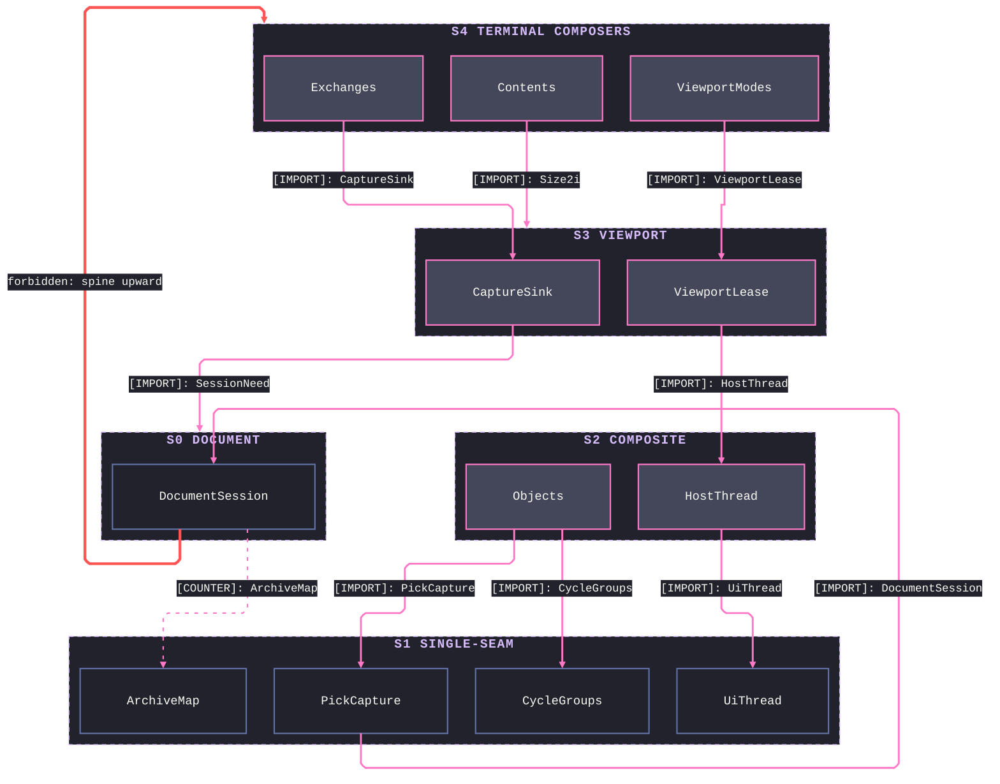
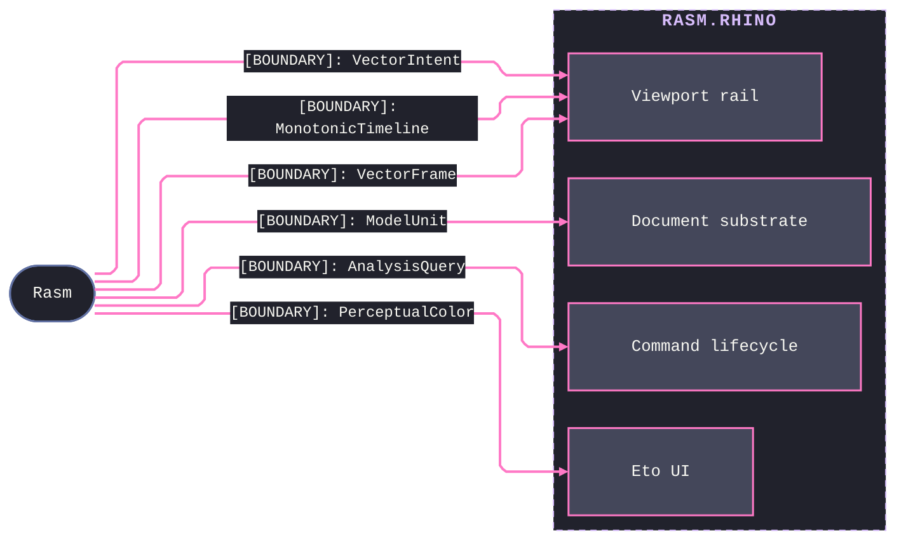

# [RASM_RHINO_ARCHITECTURE]

`Rasm.Rhino` maps the Rhino 9 host boundary over the RhinoCommon document, persistence, object, command, block, annotation, modeling, viewport, display, render, and exchange surfaces, owning the native Eto UI sub-domain and the `Rhino.UI` shell above it and composing the `Rasm` kernel for every host-neutral computation. Each sub-domain folder maps to exactly one namespace; the folder references only the kernel and lowers every host mutation onto the one document-session demand and the shared `UndoBracket`. Seam map names only the contracts crossing the boundary — each a frozen-name value type consumed down from the kernel — while all host-internal wiring graduates to the `[04]` mutation spine.

## [01]-[DOMAIN_MAP]

```text codemap
Rasm.Rhino/             # Rhino host boundary over the Rasm kernel
├── Document/           # Host-document substrate under every host surface
│   ├── Session.cs      # Capability-scoped document-session demand and unit-regime adjustment
│   ├── Geometry.cs     # Native GeometryBase custody crossing and kernel transform
│   ├── Tables.cs       # Table mutation, the shared UndoBracket, and redraw compensation
│   └── Events.cs       # Event observation and the transactional DocumentStream
├── Persistence/        # Typed serialization, settings custody, attached data, user text, saved-state presets
│   ├── Dictionary.cs   # ArchiveValue union and the ArchiveMap detach/mint round trip
│   ├── Settings.cs     # Settings custody scopes, typed value rail, guards, and the change ledger
│   ├── UserData.cs     # ArchiveIo spine, TypedUserData template, roster census, custody transfer
│   ├── UserText.cs     # TextStore rail over document and per-object user strings
│   ├── Presets.cs      # CPlane, named-position, and layer-state preset rail under one mask vocabulary
│   └── Snapshots.cs    # Scripted snapshot ops, SnapShotsClient participant, worksession facts
├── Objects/            # Live document-object domain over the table rail
│   ├── State.cs        # Live-object window: snapshot, frames, component touch, section custody
│   ├── Attributes.cs   # Typed attribute program feeding the table rail's Amend path
│   ├── Materials.cs    # Object materials, mappings, and mesh caches behind one commit
│   ├── History.cs      # History record/replay triad, linkage topology, and governance
│   └── Authoring.cs    # Custom-object and grip programs behind forwarding adapters
├── Commands/           # Native command lifecycle, input acquisition, and picked-reference projection
│   ├── Command.cs      # Staged command algebra over one immutable model and its host adapter
│   ├── Acquisition.cs  # Parameterized input-acquisition matrix and its receipt
│   ├── Options.cs      # Command-line option vocabulary and leased native carriers
│   └── Selection.cs    # Picked-reference projection onto the selection union and re-entry
├── Blocks/             # Instance-definition domain over the kernel
│   ├── Model.cs        # Block-reference address union and whole-state snapshot policy
│   ├── Graph.cs        # Definition-graph topology, queries, and archive closure
│   ├── Lifecycle.cs    # Definition ingress, the preview vault, deferred refresh, and eviction
│   └── Operations.cs   # Block operation and query rail, geometry intake, and receipts
├── Modeling/           # Host-fidelity native construction compute over the custody seam
│   ├── Solids.cs       # Brep boolean/fillet/offset/join rail and the ModelGate + Built spine
│   ├── Lofting.cs      # Sweep, loft, patch, and developable construction policies
│   ├── Surfaces.cs     # Freeform surface constructors with fit evidence
│   ├── Curves.cs       # Curve offset, refine, extend, split, and construction host ops
│   ├── Meshing.cs      # Parameter-carried meshing, remesh, booleans, and mesh edits
│   ├── SubD.cs         # SubD creation, crease authoring, and brep conversion
│   └── Deform.cs       # Space morphs and the unroll/squish/unwrap flatteners
├── Annotation/         # Drafting annotation domain over the resource tables
│   ├── Style.cs        # StyleField schema, patch fold, override mint, and the DimStyle rail
│   ├── Text.cs         # Text and leader construction, run edits, field formulas, outlining
│   ├── Dimension.cs    # Six-kind dimension family over one override algebra
│   ├── Hatch.cs        # Hatch construction and the pattern line-definition model
│   ├── Linetype.cs     # Stroke segment/shape/taper model and .lin interchange
│   └── Typeface.cs     # Face resolution and section-cut presentation resources
├── Viewport/           # Camera model, operation rail, capture spec, and motion pacing
│   ├── Camera.cs       # Camera-pose altitudes over the kernel vector frame
│   ├── Operations.cs   # Camera-operation union applied behind the viewport lease
│   ├── Capture.cs      # Capture plan, request cardinality, and leased delivery
│   └── Motion.cs       # Host motion-pacing adapter over kernel timing
├── Display/            # Display-pipeline participation and renderer boundary
│   ├── Conduit.cs      # Conduit-pipeline algebra and display-mode participation
│   ├── Draw.cs         # Two-backend mark union dispatched over the canvas
│   ├── Interaction.cs  # Pointer, gumball, and widget hooks folded onto fact streams
│   ├── Render.cs       # Render-job session and realtime engine participant
│   └── Modes.cs        # Display-mode appearance profile, mode policy, viewport assignment, and analysis attachment
├── Render/             # RDK content model and document render configuration
│   ├── Content.cs      # Content address, kind axis, change bracket, snapshot, hash, leased ingress
│   ├── Kinds.cs        # Material bridge, texture configuration, and environment bake
│   ├── Fields.cs       # One polymorphic field-value owner, declaration, binding, parameter routes
│   ├── Registry.cs     # Factory vocabulary, content operation rail, receipts, event stream
│   ├── Settings.cs     # Render-settings duality, sub-owner states, sun astronomy, edit rail
│   └── Mapping.cs      # Texture-mapping specs, evaluation, and per-object channel binding
├── Exchange/           # Document interchange and publication surface
│   ├── Formats.cs      # File-codec matrix: detection, filters, and dispatch
│   ├── Options.cs      # Per-format option dial family, shared axes, and host option minting
│   ├── Archive.cs      # Standalone archive programs over one detached File3dm lease
│   ├── Operations.cs   # Exchange-operation rail and headless convert sessions
│   ├── Sheets.cs       # Sheet plans, live selectors, and declarative detail state
│   └── Publish.cs      # Page-target dispatch and atomic content-keyed file landing
├── Eto/                # Native Eto UI framework sub-domain
│   ├── Platform.cs     # Ambient platform binding, native mount, and theme grid
│   ├── Runtime.cs      # Ambient runtime rails: dispatch, pulse, and projection
│   ├── Elements.cs     # Control tree, realize fold, layout algebra, and fault band
│   ├── Binding.cs      # State-cell binding attachments and their receipt ledger
│   ├── Canvas.cs       # Retained mark scene folded into the host graphics stream
│   └── Chrome.cs       # Verb table projected into menus, windows, and dialogs
└── HostUi/             # Rhino.UI shell composed over the Eto sub-domain
    ├── Shell.cs        # Host-thread session marshal, status, prompt, and progress
    ├── Panels.cs       # Panel fact stream, placement, and RUI state fold
    ├── Pages.cs        # Page realization, the signal spine, and kind-safe mounting
    └── Dialogs.cs      # Capability-gated inquiry rail and preview projection
```

## [02]-[STRATA]

Five strata order the thirteen sub-domain folders; a folder composes its own owners and lower strata only, `Rasm` kernel namespaces underlie the whole boundary as the host-neutral floor, and the one ruled counter-edge is the Document session's configured-open source taking Persistence's `ArchiveMap` as its typed open-options payload, minted before any session exists. Every other consumption edge points down, so a new folder seats one stratum above its highest composed owner.

- S0 `Document` — spine under everything: the `DocumentSession` demand, the shared `UndoBracket`, `Tables.Commit`, and the transactional `DocumentStream`; every sibling composes it.
- S1 single-seam domains — `Persistence`, `Commands`, `Blocks`, `Modeling`, `Annotation`, `Eto` compose the spine alone: `ArchiveMap` and `Settings`; `CommandVerdict` and `PickCapture`; `BlockGraph` and `CycleGroups`; `ModelGate` and `Built<TSlot>`; `StyleField` and `Styles`; the `Element` realize fold and the `UiThread` floor — Modeling reaches only the geometry-custody capsule and Eto only the event-detach capsule.
- S2 composite domains — `Objects` (`Objects`, `Attributes`, `Chronicle`) adds Commands' `PickCapture` custody and Blocks' `CycleGroups` evidence; `HostUi` (`HostThread`, `PanelHost`, `HostPage`) adds the whole Eto sub-domain.
- S3 `Viewport` — `ViewportLease`, `CameraPose`, `Cameras`, and `MotionPump`; every borrow crosses `HostThread.OnSession` under a `SessionNeed`.
- S4 terminal composers — `Display` (`ViewportModes`, `Marks`) and `Exchange` (`Exchanges`, `PageFrame`) compose Viewport's camera and capture rails, Display also drawing through the Eto canvas; `Render` (`Contents`, `ContentStream`) borrows only the `Size2i` pixel struct from that surface; no folder composes these three.



## [03]-[SEAMS]



Every kernel contract is a frozen-name value type the host binds and never re-mints — one `[BOUNDARY]` rail per sub-domain, each carrying the exact member set its owner consumes. Kernel is host-neutral and mirrors none of these edges downward, so the strata-locked dependency is source-only by construction.

## [04]-[INTERNAL]

Every host mutation walks one path — no sub-domain opens the document directly. Document-session demand gates capability, the shared `UndoBracket` frames the change, the sub-domain executor runs inside it, and the sealing commit lands the fact receipt with redraw compensation; a denied demand and every mid-stage fault converge on the one rail that still releases the bracket. Exact per-stage wiring lives on the owning implementation pages.

```mermaid
---
config:
  theme: base
  look: classic
  layout: elk
  flowchart:
    curve: linear
    padding: 25
  themeVariables:
    darkMode: true
    fontFamily: "SF Mono, Menlo, Cascadia Mono, Segoe UI Mono, Consolas, monospace"
    useGradient: false
    dropShadow: "none"
    background: "#282A36"
    primaryColor: "#44475A"
    primaryTextColor: "#F8F8F2"
    primaryBorderColor: "#BD93F9"
    lineColor: "#FF79C6"
    textColor: "#F8F8F2"
    edgeLabelBackground: "#21222C"
    labelBackgroundColor: "#21222C"
  themeCSS: ".nodeLabel{font-size:13px;font-weight:500}.edgeLabel{font-size:12px;font-weight:500}.cluster-label .nodeLabel{font-size:13.5px;font-weight:700;letter-spacing:.08em}.edge-thickness-normal{stroke-width:2px}.edge-thickness-thick{stroke-width:3px}.edge-pattern-dashed,.edge-pattern-dotted{stroke-width:1.5px;stroke-dasharray:4 6}.node rect,.node circle,.node polygon,.node path,.node .outer-path{stroke-width:1.5px;filter:none!important}.cluster rect{stroke-width:1px!important;stroke-dasharray:5 4!important;filter:none!important}.marker path{transform:scale(.8);transform-origin:5px 5px}.marker circle{transform:scale(.48);transform-origin:5px 5px}.edgeLabel rect{transform-box:fill-box;transform-origin:center;transform:scale(1.1,1.2)}"
---
flowchart LR
    accTitle: Rasm.Rhino host-mutation spine
    accDescr: The once-walked host mutation path from a request through the document-session demand and a capability gate into the UndoBracket, the sub-domain executor, and the sealing commit, with every stage fault converging on one red rail that still releases the bracket.
    Request([Host request]) e1@--> Session[[DocumentSession demand]]
    Session e2@--> Ready{Capability held?}
    Ready e3@-->|"capability held"| Bracket[[UndoBracket]]
    Ready f1@-->|"demand denied"| Fault[/Fault rail/]
    Bracket e4@--> Executor[[Sub-domain op]]
    Executor e5@--> Commit[[Tables.Commit]]
    Commit e6@--> Redraw[Redraw compensation]
    Redraw e7@--> Ledger[(Fact ledger)]
    Ledger e8@--> Settle([Settle])
    Session f2@-.->|"demand fault"| Fault
    Executor f3@-.->|"op fault"| Fault
    Commit f4@-.->|"commit fault"| Fault
    Fault f5@-->|"unconditional release"| Settle
    classDef boundary fill:#282A36,stroke:#BD93F9,color:#F8F8F2
    classDef error fill:#FF555580,stroke:#FF5555,color:#F8F8F2
    classDef primary fill:#44475A,stroke:#FF79C6,color:#F8F8F2
    classDef data fill:#FFB86CBF,stroke:#FFB86C,color:#282A36
    classDef edgeControl stroke:#FF79C6,color:#F8F8F2
    classDef edgeError stroke:#FF5555,stroke-width:3px,color:#F8F8F2
    class Request,Settle boundary
    class Fault error
    class Session,Bracket,Executor,Commit,Redraw primary
    class Ledger data
    class e1,e2,e3,e4,e5,e6,e7,e8 edgeControl
    class f1,f2,f3,f4,f5 edgeError
```



## [05]-[NAMESPACES]

Namespace mirrors folder path — `.editorconfig` sets `dotnet_style_namespace_match_folder = true:error`, so every fence under `Rasm.Rhino/<Folder>/` declares `namespace Rasm.Rhino.<Folder>;` and the `[01]` codemap folders are the namespace roots verbatim.

Boundary compiles as ONE assembly — the single `Rasm.Rhino.csproj` — so internal members cross namespaces with no build edge, and the project references only `Rasm.csproj`. Kernel-neutral value types compose freely from the kernel, while a live host handle, a native carrier, or a `System.Drawing` screen struct never crosses out of the sub-domain that leases it.

Host-name resolution is one law: inside `Rasm.Rhino.*` the first identifier of a partial qualification re-resolves against the boundary's own namespaces (`Rhino.UI.X` binds `Rasm.Rhino` through the member `Rhino` of `Rasm`, `Eto.Forms.X` binds `Rasm.Rhino.Eto`, `Display.X` binds `Rasm.Rhino.Display`), so fences name host members BARE through the project-level global usings. A host type no global using reaches spells `global::` in full (`global::Rhino.UI.MouseCallback`), and a simple-name collision between two host namespaces resolves through one project-level `<Using Include="..." Alias="..." />` row in `Rasm.Rhino.csproj` — never a per-fence `using` alias, never a partial qualification.
